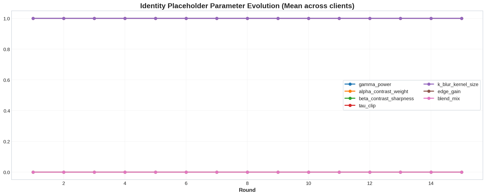

**1. No Preprocessing**


```python
# ============================================================
# KAGGLE FULL SCRIPT
# ABLATION 1: NO PREPROCESSING
# TRUE FL + RL-UCB + IDENTITY + CRAF + ResNet-50
# METHOD: ARCF-Net (Ablation 1 - No Preprocessing)
# ------------------------------------------------------------
# KAGGLE-READY + SYMMETRIC DS1/DS2 IMPORTANCE
# - Uses BOTH datasets
# - Reads datasets from /kaggle/input automatically
# - Keeps stronger asymmetric train/tune/val per client regime
# - Exact 15 FL rounds
# - Proper FL with FedAvg + FedProx + prototype sharing
# - RL-UCB for SHARED client-count planning + per-client fixed identity preset
# - Tune-aware theta probing remains in place but only one fixed arm exists
# - Equal DS1 / DS2 importance in best-round selection and merged reporting
# - NO PLOTS
# - Saves checkpoint WITH full-process info for later XAI / replay
# ============================================================

import os
import sys
import time
import math
import copy
import json
import random
import hashlib
import subprocess
from typing import List, Dict, Tuple

import numpy as np
import pandas as pd
from PIL import Image

import torch
import torch.nn as nn
import torch.nn.functional as F
from torch.utils.data import Dataset, DataLoader, WeightedRandomSampler

import matplotlib.pyplot as plt
import matplotlib as mpl

from sklearn.model_selection import train_test_split
from sklearn.metrics import (
    accuracy_score, precision_score, recall_score, f1_score,
    log_loss, confusion_matrix, roc_auc_score,
    roc_curve, precision_recall_curve, average_precision_score,
    matthews_corrcoef, cohen_kappa_score, balanced_accuracy_score,
    jaccard_score
)

# -------------------------
# Helpers
# -------------------------
def pip_install(pkg):
    subprocess.check_call([sys.executable, "-m", "pip", "-q", "install", pkg])

def running_on_kaggle():
    return os.path.exists("/kaggle/input")

IS_KAGGLE = running_on_kaggle()

# Optional fallback only if datasets were not added as Kaggle inputs
try:
    import kagglehub
except Exception:
    try:
        pip_install("kagglehub")
        import kagglehub
    except Exception:
        kagglehub = None

try:
    from torchvision import transforms
    from torchvision.models import resnet50, ResNet50_Weights
except Exception:
    pip_install("torchvision")
    from torchvision import transforms
    from torchvision.models import resnet50, ResNet50_Weights

try:
    from IPython.display import display
except Exception:
    display = print

# -------------------------
# Reproducibility + Device
# -------------------------
SEED = 42
random.seed(SEED)
np.random.seed(SEED)
torch.manual_seed(SEED)
if torch.cuda.is_available():
    torch.cuda.manual_seed_all(SEED)

DEVICE = torch.device("cuda" if torch.cuda.is_available() else "cpu")

if DEVICE.type == "cuda":
    torch.backends.cudnn.benchmark = True
    torch.backends.cuda.matmul.allow_tf32 = True
    torch.backends.cudnn.allow_tf32 = True

try:
    torch.set_float32_matmul_precision("high")
except Exception:
    pass

# -------------------------
# Plotting style
# -------------------------
plt.style.use("seaborn-v0_8-white")
mpl.rcParams.update({
    "figure.dpi": 145,
    "savefig.dpi": 220,
    "figure.facecolor": "white",
    "axes.facecolor": "white",
    "axes.edgecolor": "#D0D7DE",
    "axes.linewidth": 1.0,
    "axes.titleweight": "bold",
    "axes.titlesize": 16,
    "axes.labelsize": 12,
    "axes.labelweight": "bold",
    "font.size": 11,
    "legend.frameon": True,
    "legend.facecolor": "white",
    "legend.edgecolor": "#D0D7DE",
    "grid.alpha": 0.18,
    "grid.linewidth": 0.8,
    "lines.linewidth": 2.2,
})

print("=" * 118)
print("TRUE FL + RL-UCB + NO PREPROCESSING + CRAF + ResNet-50")
print("METHOD: ARCF-Net (Ablation 1 - No Preprocessing)")
print("=" * 118)
print(f"ENV: {'KAGGLE' if IS_KAGGLE else 'NON-KAGGLE'} | DEVICE: {DEVICE} | torch={torch.__version__}")
print("=" * 118)

# -------------------------
# Configuration
# -------------------------
CFG = {
    "rounds": 15,

    # shared RL for client-count planning
    "client_count_candidates": [3, 4, 5],
    "client_count_search_episodes": 10,

    # local training
    "local_epochs": 2,
    "lr_head": 1e-3,
    "lr_backbone": 2e-4,
    "weight_decay": 5e-4,
    "warmup_epochs": 1,
    "label_smoothing": 0.02,
    "focal_gamma": 1.35,
    "grad_clip": 1.0,
    "fedprox_mu": 0.01,
    "proto_lambda": 0.12,

    # image
    "img_size": 224 if torch.cuda.is_available() else 160,
    "batch_size": 16 if torch.cuda.is_available() else 8,
    "num_workers": 2 if torch.cuda.is_available() else 2,

    # global split
    "global_val_frac": 0.15,
    "test_frac": 0.15,

    # client split
    "client_val_frac": 0.12,
    "client_tune_frac": 0.12,
    "min_per_class_per_client": 5,

    # non-iid
    "dirichlet_alpha": 0.35,

    # preprocessing / augmentation
    "use_preprocessing": False,
    "use_augmentation": True,

    # transfer learning
    "freeze_backbone_rounds": 2,
    "unfreeze_last_blocks": 2,

    # bandit
    "ucb_c": 1.35,
    "theta_probe_topk": 3,

    # final inference (same search space for both datasets)
    "final_use_tta": True,
    "final_try_topk_ds1": [1, 2, 3],
    "final_try_topk_ds2": [1, 2, 3],

    # reward
    "reward_f1_weight": 0.75,
    "reward_acc_weight": 0.25,

    # best-round selection: equal dataset importance
    "best_round_mass_ds1": 0.50,
    "best_round_mass_ds2": 0.50,
    "best_round_min_bonus": 0.15,

    # FedAvg tempering
    "fedavg_temper": 0.50,

    # misc / plots
    "quick_hash_subset_per_split": 300,
    "preproc_val_sample_n": 400,
    "before_after_n": 12,
    "make_plots": False,
    "calibration_bins": 12,
}

OUTDIR = "/kaggle/working/outputs" if IS_KAGGLE else "/content/outputs"
os.makedirs(OUTDIR, exist_ok=True)
MODEL_PATH = os.path.join(OUTDIR, "ARCFNet_RESNET50_KAGGLE_FULLINFO_checkpoint.pth")
CSV_PATH   = os.path.join(OUTDIR, "ALL_OUTPUTS_AND_METRICS_RESNET50_KAGGLE.csv")

IMG_EXTS = (".jpg", ".jpeg", ".png", ".bmp", ".tif", ".tiff", ".webp")

IMAGENET_MEAN = torch.tensor([0.485, 0.456, 0.406], device=DEVICE).view(1, 3, 1, 1)
IMAGENET_STD  = torch.tensor([0.229, 0.224, 0.225], device=DEVICE).view(1, 3, 1, 1)

labels = ["glioma", "meningioma", "notumor", "pituitary"]
label2id = {l: i for i, l in enumerate(labels)}
id2label = {i: l for l, i in label2id.items()}
NUM_CLASSES = len(labels)

METHOD_INFO = {
    "acronym": "ARCF-Net",
    "full_form": "Adaptive RACE-FELCM with CRAF Fusion Network",
    "preprocessing_full_form": "No Preprocessing (Identity pass-through)",
    "fusion_full_form": "Cross-Residual Adaptive Fusion",
    "backbone_full_form": "Residual Network-50",
    "ablation_name": "Ablation 1 - No Preprocessing",
}

# ============================================================
# CSV collector
# ============================================================
ALL_ROWS = []

def add_table_to_csv(df, table_name):
    df2 = df.copy()
    df2.insert(0, "table_name", table_name)
    for _, row in df2.iterrows():
        ALL_ROWS.append(row.to_dict())

def print_table(df, title):
    print("\n" + "-" * 118)
    print(title)
    print("-" * 118)
    display(df)

def safe_float(x, default=np.nan):
    try:
        return float(x)
    except Exception:
        return default

def normalize_imagenet(x):
    return (x - IMAGENET_MEAN) / IMAGENET_STD

def score_metric(m):
    return (
        CFG["reward_f1_weight"] * safe_float(m.get("f1_macro"), 0.0)
        + CFG["reward_acc_weight"] * safe_float(m.get("acc"), 0.0)
    )

def frame_to_manifest(df_):
    return df_[["path", "label", "source", "filename", "y"]].to_dict(orient="list")

# ============================================================
# STEP 0: ACCESS DATASETS (KAGGLE INPUT FIRST)
# ============================================================
print("\n" + "=" * 118)
print("STEP 0: ACCESS DATASETS")
print("=" * 118)

REQ1 = {"512Glioma", "512Meningioma", "512Normal", "512Pituitary"}
REQ2 = {"glioma", "meningioma", "notumor", "pituitary"}

def norm_label(name: str):
    s = str(name).strip().lower()
    if "glioma" in s:
        return "glioma"
    if "meningioma" in s:
        return "meningioma"
    if "pituitary" in s:
        return "pituitary"
    if "normal" in s or "no_tumor" in s or "no tumor" in s or "notumor" in s:
        return "notumor"
    return None

def find_root_with_required_class_dirs(base_dir, required_set, prefer_raw=True):
    candidates = []
    for root, dirs, _ in os.walk(base_dir):
        if required_set.issubset(set(dirs)):
            candidates.append(root)
    if not candidates:
        return None

    def score(p):
        pl = p.lower()
        sc = 0
        if prefer_raw:
            if "raw data" in pl:
                sc += 7
            if os.path.basename(p).lower() == "raw":
                sc += 7
            if "/raw/" in pl or "\\raw\\" in pl:
                sc += 3
            if "augmented" in pl:
                sc -= 20
        sc -= 0.0001 * len(p)
        return sc

    return max(candidates, key=score)

def search_kaggle_input_for_root(required_set, prefer_raw=True):
    if not os.path.exists("/kaggle/input"):
        return None
    return find_root_with_required_class_dirs("/kaggle/input", required_set, prefer_raw=prefer_raw)

def try_kagglehub_download(slug, required_set, prefer_raw=True):
    if kagglehub is None:
        return None, None
    try:
        base = kagglehub.dataset_download(slug)
        root = find_root_with_required_class_dirs(base, required_set, prefer_raw=prefer_raw)
        return base, root
    except Exception:
        return None, None

DS1_BASE = None
DS2_BASE = None

# Prefer Kaggle inputs
DS1_ROOT = search_kaggle_input_for_root(REQ1, prefer_raw=True)
DS2_ROOT = search_kaggle_input_for_root(REQ2, prefer_raw=False)

# Fallback to kagglehub if not found
if DS1_ROOT is None:
    DS1_BASE, DS1_ROOT = try_kagglehub_download(
        "orvile/pmram-bangladeshi-brain-cancer-mri-dataset",
        REQ1,
        prefer_raw=True,
    )

if DS2_ROOT is None:
    DS2_BASE, DS2_ROOT = try_kagglehub_download(
        "yassinebazgour/preprocessed-brain-mri-scans-for-tumors-detection",
        REQ2,
        prefer_raw=False,
    )

if DS1_ROOT is None:
    raise RuntimeError(
        "Could not locate DS1 under /kaggle/input. In Kaggle, click Add Input and add "
        "'orvile/pmram-bangladeshi-brain-cancer-mri-dataset'."
    )
if DS2_ROOT is None:
    raise RuntimeError(
        "Could not locate DS2 under /kaggle/input. In Kaggle, click Add Input and add "
        "'yassinebazgour/preprocessed-brain-mri-scans-for-tumors-detection'."
    )

print(f"Dataset-1 RAW root detected:\n  {DS1_ROOT}")
print(f"Dataset-2 root detected:\n  {DS2_ROOT}")

# ============================================================
# STEP 1: BUILD MANIFESTS
# ============================================================
print("\n" + "=" * 118)
print("STEP 1: BUILD DATA MANIFESTS (NO MERGE)")
print("=" * 118)

def list_images_under_class_root(class_root, class_dir_name):
    class_dir = os.path.join(class_root, class_dir_name)
    out = []
    for r, _, files in os.walk(class_dir):
        for fn in files:
            if fn.lower().endswith(IMG_EXTS):
                out.append(os.path.join(r, fn))
    return out

def build_df_from_root(ds_root, class_dirs, source_name):
    rows = []
    for c in class_dirs:
        lab = norm_label(c)
        imgs = list_images_under_class_root(ds_root, c)
        print(f"{source_name}: {c} -> {lab} | {len(imgs)} images")
        for p in imgs:
            rows.append({"path": p, "label": lab, "source": source_name})
    dfm = pd.DataFrame(rows).dropna().reset_index(drop=True)
    dfm["path"] = dfm["path"].astype(str)
    dfm["label"] = dfm["label"].astype(str)
    dfm["source"] = dfm["source"].astype(str)
    dfm = dfm.drop_duplicates(subset=["path"]).reset_index(drop=True)
    dfm["filename"] = dfm["path"].apply(os.path.basename)
    return dfm

print("\n" + "-" * 118)
print("Building Dataset-1 (RAW only)")
df1 = build_df_from_root(DS1_ROOT, ["512Glioma", "512Meningioma", "512Normal", "512Pituitary"], "ds1_raw")
print("Building Dataset-2")
df2 = build_df_from_root(DS2_ROOT, ["glioma", "meningioma", "notumor", "pituitary"], "ds2")

def enforce_labels(df_):
    df_ = df_.copy()
    df_["label"] = df_["label"].astype(str).str.strip().str.lower()
    df_ = df_[df_["label"].isin(set(labels))].reset_index(drop=True)
    df_["y"] = df_["label"].map(label2id).astype(int)
    return df_

df1 = enforce_labels(df1)
df2 = enforce_labels(df2)

print("\nDataset-1 images:", len(df1))
print(df1["label"].value_counts().reindex(labels, fill_value=0))
print("\nDataset-2 images:", len(df2))
print(df2["label"].value_counts().reindex(labels, fill_value=0))

# ============================================================
# STEP 2: TRAIN / VAL / TEST SPLIT
# ============================================================
print("\n" + "=" * 118)
print("STEP 2: TRAIN / VAL / TEST SPLIT (PER DATASET)")
print("=" * 118)

def split_dataset(df_):
    train_df, temp_df = train_test_split(
        df_,
        test_size=(CFG["global_val_frac"] + CFG["test_frac"]),
        stratify=df_["y"],
        random_state=SEED,
    )
    val_rel = CFG["global_val_frac"] / (CFG["global_val_frac"] + CFG["test_frac"])
    val_df, test_df = train_test_split(
        temp_df,
        test_size=(1 - val_rel),
        stratify=temp_df["y"],
        random_state=SEED,
    )
    return train_df.reset_index(drop=True), val_df.reset_index(drop=True), test_df.reset_index(drop=True)

train1, val1, test1 = split_dataset(df1)
train2, val2, test2 = split_dataset(df2)

print(f"DS1 TRAIN: {len(train1)} | VAL: {len(val1)} | TEST: {len(test1)}")
print(f"DS2 TRAIN: {len(train2)} | VAL: {len(val2)} | TEST: {len(test2)}")

# ============================================================
# STEP 2.5: SANITY / LEAKAGE CHECKS
# ============================================================
print("\n" + "=" * 118)
print("STEP 2.5: SANITY / LEAKAGE CHECKS")
print("=" * 118)

def split_overlap_checks(train_df, val_df, test_df):
    tr = set(train_df["path"].tolist())
    va = set(val_df["path"].tolist())
    te = set(test_df["path"].tolist())
    checks = {
        "path_overlap_train_val": len(tr.intersection(va)),
        "path_overlap_train_test": len(tr.intersection(te)),
        "path_overlap_val_test": len(va.intersection(te)),
        "unique_paths_train": len(tr),
        "unique_paths_val": len(va),
        "unique_paths_test": len(te),
    }
    trf = set(train_df["filename"].tolist())
    vaf = set(val_df["filename"].tolist())
    tef = set(test_df["filename"].tolist())
    checks.update({
        "filename_overlap_train_val": len(trf.intersection(vaf)),
        "filename_overlap_train_test": len(trf.intersection(tef)),
        "filename_overlap_val_test": len(vaf.intersection(tef)),
    })
    return checks

def md5_file(path, max_bytes=2_000_000):
    h = hashlib.md5()
    try:
        with open(path, "rb") as f:
            h.update(f.read(max_bytes))
        return h.hexdigest()
    except Exception:
        return None

def quick_hash_subset(frame, n=300):
    n = min(n, len(frame))
    if n <= 0:
        return set()
    idx = np.random.choice(len(frame), size=n, replace=False)
    hashes = []
    for i in idx:
        hv = md5_file(frame.iloc[i]["path"])
        if hv is not None:
            hashes.append(hv)
    return set(hashes)

def leakage_report(name, tr, va, te):
    over = split_overlap_checks(tr, va, te)
    leak_df = pd.DataFrame([over])

    n_hash = int(CFG["quick_hash_subset_per_split"])
    trh = quick_hash_subset(tr, n_hash)
    vah = quick_hash_subset(va, n_hash)
    teh = quick_hash_subset(te, n_hash)

    hash_over = {
        "subset_hash_train_val": len(trh.intersection(vah)),
        "subset_hash_train_test": len(trh.intersection(teh)),
        "subset_hash_val_test": len(vah.intersection(teh)),
        "subset_hash_n_train": len(trh),
        "subset_hash_n_val": len(vah),
        "subset_hash_n_test": len(teh),
    }
    leak_df = pd.concat([leak_df, pd.DataFrame([hash_over])], axis=1)
    print_table(leak_df, f"Leakage / Sanity Summary — {name}")
    add_table_to_csv(leak_df, f"leakage_sanity_{name}")

leakage_report("ds1", train1, val1, test1)
leakage_report("ds2", train2, val2, test2)

# ============================================================
# STEP 3: RL-UCB BANDIT
# ============================================================
print("\n" + "=" * 118)
print("STEP 3: RL-UCB BANDIT")
print("=" * 118)

class UCBBandit:
    def __init__(self, n_arms, c=1.35):
        self.n_arms = int(n_arms)
        self.c = float(c)
        self.counts = np.zeros(self.n_arms, dtype=np.int64)
        self.values = np.zeros(self.n_arms, dtype=np.float64)

    def ucb(self, arm):
        if self.counts[arm] == 0:
            return float("inf")
        t = max(1, self.counts.sum())
        return float(self.values[arm] + self.c * math.sqrt(math.log(t + 1) / self.counts[arm]))

    def select(self):
        scores = [self.ucb(i) for i in range(self.n_arms)]
        return int(np.argmax(scores))

    def update(self, arm, reward):
        arm = int(arm)
        reward = float(reward)
        self.counts[arm] += 1
        n = self.counts[arm]
        self.values[arm] += (reward - self.values[arm]) / n

    def best_arm(self):
        if self.counts.sum() == 0:
            return 0
        return int(np.argmax(self.values))

    def state_dict(self):
        return {
            "n_arms": self.n_arms,
            "c": self.c,
            "counts": self.counts.copy(),
            "values": self.values.copy(),
        }

    def load_state_dict(self, sd):
        self.n_arms = int(sd["n_arms"])
        self.c = float(sd["c"])
        self.counts = sd["counts"].copy()
        self.values = sd["values"].copy()

# ============================================================
# STEP 4: SHARED ADAPTIVE CLIENT COUNT BY RL-UCB
# ============================================================
print("\n" + "=" * 118)
print("STEP 4: SHARED ADAPTIVE CLIENT COUNT BY RL-UCB")
print("=" * 118)

def make_clients_non_iid(train_df, n_clients, num_classes, min_per_class=5, alpha=0.35):
    y = train_df["y"].values
    idx_by_class = {c: np.where(y == c)[0].tolist() for c in range(num_classes)}
    for c in idx_by_class:
        random.shuffle(idx_by_class[c])

    client_indices = [[] for _ in range(n_clients)]

    for c in range(num_classes):
        idxs = idx_by_class[c]
        feasible = min(min_per_class, max(1, len(idxs) // n_clients))
        for k in range(n_clients):
            take = idxs[:feasible]
            idxs = idxs[feasible:]
            client_indices[k].extend(take)
        idx_by_class[c] = idxs

    for c in range(num_classes):
        idxs = idx_by_class[c]
        if len(idxs) == 0:
            continue
        props = np.random.dirichlet([alpha] * n_clients)
        counts = (props * len(idxs)).astype(int)
        diff = len(idxs) - counts.sum()
        counts[np.argmax(props)] += diff

        start = 0
        for k in range(n_clients):
            client_indices[k].extend(idxs[start:start + counts[k]])
            start += counts[k]

    for k in range(n_clients):
        random.shuffle(client_indices[k])

    return client_indices

def partition_reward(train_df, client_indices, num_classes):
    sizes = np.array([len(v) for v in client_indices], dtype=np.float32)
    if len(sizes) == 0 or sizes.mean() <= 0:
        return 0.0

    entropies = []
    coverages = []
    for idxs in client_indices:
        if len(idxs) == 0:
            entropies.append(0.0)
            coverages.append(0.0)
            continue
        ys = train_df.loc[idxs, "y"].values
        counts = np.bincount(ys, minlength=num_classes).astype(np.float32)
        probs = counts / np.clip(counts.sum(), 1.0, None)
        probs_nz = probs[probs > 0]
        ent = float(-(probs_nz * np.log(probs_nz)).sum() / np.log(num_classes))
        cov = float((counts > 0).mean())
        entropies.append(ent)
        coverages.append(cov)

    size_balance = 1.0 - min(1.0, float(sizes.std() / np.clip(sizes.mean(), 1e-6, None)))
    min_size_ratio = min(1.0, float(sizes.min() / np.clip(sizes.mean(), 1e-6, None)))

    return float(
        0.45 * np.mean(entropies) +
        0.25 * np.mean(coverages) +
        0.20 * size_balance +
        0.10 * min_size_ratio
    )

def adaptive_client_count_rl_shared(train_df1, train_df2):
    bandit = UCBBandit(len(CFG["client_count_candidates"]), c=CFG["ucb_c"])
    rows = []

    for ep in range(CFG["client_count_search_episodes"]):
        arm = bandit.select()
        n_clients = CFG["client_count_candidates"][arm]

        idxs1 = make_clients_non_iid(
            train_df1,
            n_clients=n_clients,
            num_classes=NUM_CLASSES,
            min_per_class=CFG["min_per_class_per_client"],
            alpha=CFG["dirichlet_alpha"],
        )
        idxs2 = make_clients_non_iid(
            train_df2,
            n_clients=n_clients,
            num_classes=NUM_CLASSES,
            min_per_class=CFG["min_per_class_per_client"],
            alpha=CFG["dirichlet_alpha"],
        )

        reward1 = partition_reward(train_df1, idxs1, NUM_CLASSES)
        reward2 = partition_reward(train_df2, idxs2, NUM_CLASSES)
        reward = 0.5 * (reward1 + reward2)

        bandit.update(arm, reward)

        rows.append({
            "episode": ep + 1,
            "selected_n_clients": n_clients,
            "reward_ds1": reward1,
            "reward_ds2": reward2,
            "reward_mean": reward,
            "bandit_value": bandit.values[arm],
            "pulls_for_arm": bandit.counts[arm],
        })

    best_arm = bandit.best_arm()
    chosen = CFG["client_count_candidates"][best_arm]
    return chosen, pd.DataFrame(rows), bandit

shared_n_clients, plan_df_shared, shared_planner = adaptive_client_count_rl_shared(train1, train2)
n_clients_ds1 = shared_n_clients
n_clients_ds2 = shared_n_clients

print(f"Chosen shared adaptive clients for DS1: {n_clients_ds1}")
print(f"Chosen shared adaptive clients for DS2: {n_clients_ds2}")

print_table(plan_df_shared, "RL planning history — shared client count")
add_table_to_csv(plan_df_shared, "rl_client_count_planning_shared")

# ============================================================
# STEP 5: FINAL NON-IID CLIENT PARTITIONING
# ============================================================
print("\n" + "=" * 118)
print("STEP 5: FINAL NON-IID CLIENT PARTITIONING")
print("=" * 118)

def robust_client_splits(train_df, indices, val_frac, tune_frac):
    idxs = np.array(indices, dtype=int)
    if len(idxs) < 3:
        return idxs.tolist(), idxs.tolist(), idxs.tolist()

    yk = train_df.loc[idxs, "y"].values

    if len(np.unique(yk)) < 2 or len(idxs) < 20:
        n_tune = max(1, int(round(len(idxs) * tune_frac)))
        n_tune = min(n_tune, max(1, len(idxs) - 2))
        tune_idx = idxs[:n_tune]
        rem_idx = idxs[n_tune:]
    else:
        rem_idx, tune_idx = train_test_split(
            idxs,
            test_size=tune_frac,
            stratify=yk,
            random_state=SEED,
        )

    if len(rem_idx) < 2:
        return rem_idx.tolist(), tune_idx.tolist(), rem_idx.tolist()

    yk2 = train_df.loc[rem_idx, "y"].values
    if len(np.unique(yk2)) < 2 or len(rem_idx) < 12:
        n_val = max(1, int(round(len(rem_idx) * val_frac)))
        n_val = min(n_val, max(1, len(rem_idx) - 1))
        val_idx = rem_idx[:n_val]
        train_idx = rem_idx[n_val:]
    else:
        train_idx, val_idx = train_test_split(
            rem_idx,
            test_size=val_frac,
            stratify=yk2,
            random_state=SEED,
        )

    if len(train_idx) == 0:
        train_idx = val_idx[:]
    if len(val_idx) == 0:
        val_idx = train_idx[:1]
    return train_idx.tolist(), tune_idx.tolist(), val_idx.tolist()

client_indices_ds1 = make_clients_non_iid(
    train1,
    n_clients=n_clients_ds1,
    num_classes=NUM_CLASSES,
    min_per_class=CFG["min_per_class_per_client"],
    alpha=CFG["dirichlet_alpha"],
)
client_indices_ds2 = make_clients_non_iid(
    train2,
    n_clients=n_clients_ds2,
    num_classes=NUM_CLASSES,
    min_per_class=CFG["min_per_class_per_client"],
    alpha=CFG["dirichlet_alpha"],
)

# ============================================================
# STEP 6: DATA LOADERS
# ============================================================
print("\n" + "=" * 118)
print("STEP 6: DATA LOADERS (AUG ON)")
print("=" * 118)

def load_rgb(path):
    try:
        return Image.open(path).convert("RGB")
    except Exception:
        return Image.new("RGB", (CFG["img_size"], CFG["img_size"]), (128, 128, 128))

EVAL_TFMS = transforms.Compose([
    transforms.Resize((CFG["img_size"], CFG["img_size"])),
    transforms.ToTensor(),
])

TRAIN_TFMS = transforms.Compose([
    transforms.Resize((CFG["img_size"], CFG["img_size"])),
    transforms.RandomHorizontalFlip(p=0.5),
    transforms.RandomRotation(degrees=12),
    transforms.RandomAffine(degrees=0, translate=(0.04, 0.04), scale=(0.96, 1.04)),
    transforms.ColorJitter(brightness=0.10, contrast=0.10),
    transforms.GaussianBlur(kernel_size=3, sigma=(0.1, 0.6)),
    transforms.ToTensor(),
])

class MRIDataset(Dataset):
    def __init__(self, frame, indices=None, tfms=None, source_id=0):
        self.df = frame
        self.indices = indices if indices is not None else list(range(len(frame)))
        self.tfms = tfms
        self.source_id = int(source_id)

    def __len__(self):
        return len(self.indices)

    def __getitem__(self, i):
        j = self.indices[i]
        row = self.df.iloc[j]
        img = load_rgb(row["path"])
        x = self.tfms(img) if self.tfms is not None else transforms.ToTensor()(img)
        y = int(row["y"])
        return x, y, row["path"], self.source_id

def make_weighted_sampler(frame, indices, num_classes):
    if len(indices) == 0:
        return None
    ys = frame.loc[indices, "y"].values
    class_counts = np.bincount(ys, minlength=num_classes)
    class_weights = 1.0 / np.sqrt(np.clip(class_counts, 1, None))
    sample_weights = class_weights[ys]
    return WeightedRandomSampler(
        weights=torch.DoubleTensor(sample_weights),
        num_samples=len(sample_weights),
        replacement=True,
    )

def make_loader(frame, indices, bs, tfms, shuffle=False, sampler=None, source_id=0):
    ds = MRIDataset(frame, indices=indices, tfms=tfms, source_id=source_id)
    return DataLoader(
        ds,
        batch_size=bs,
        shuffle=(shuffle and sampler is None),
        sampler=sampler,
        num_workers=CFG["num_workers"],
        pin_memory=(DEVICE.type == "cuda"),
        drop_last=False,
        persistent_workers=(CFG["num_workers"] > 0),
    )

clients = []
gid = 0

for ds_name, df_src, client_indices, source_id in [
    ("ds1", train1, client_indices_ds1, 0),
    ("ds2", train2, client_indices_ds2, 1),
]:
    for local_id, idxs in enumerate(client_indices):
        tr_idx, tune_idx, val_idx = robust_client_splits(df_src, idxs, CFG["client_val_frac"], CFG["client_tune_frac"])
        sampler = make_weighted_sampler(df_src, tr_idx, NUM_CLASSES)

        train_loader = make_loader(
            df_src, tr_idx, CFG["batch_size"], TRAIN_TFMS,
            shuffle=(sampler is None), sampler=sampler, source_id=source_id
        )
        tune_loader = make_loader(
            df_src,
            tune_idx if len(tune_idx) else tr_idx[:max(1, min(len(tr_idx), CFG["batch_size"]))],
            CFG["batch_size"], EVAL_TFMS, shuffle=False, sampler=None, source_id=source_id
        )
        val_loader = make_loader(
            df_src,
            val_idx if len(val_idx) else tr_idx[:max(1, min(len(tr_idx), CFG["batch_size"]))],
            CFG["batch_size"], EVAL_TFMS, shuffle=False, sampler=None, source_id=source_id
        )
        proto_loader = make_loader(
            df_src, tr_idx, CFG["batch_size"], EVAL_TFMS,
            shuffle=False, sampler=None, source_id=source_id
        )

        counts = df_src.loc[tr_idx, "label"].value_counts().reindex(labels, fill_value=0)

        clients.append({
            "gid": gid,
            "local_id": local_id,
            "dataset": ds_name,
            "source_id": source_id,
            "train_loader": train_loader,
            "tune_loader": tune_loader,
            "val_loader": val_loader,
            "proto_loader": proto_loader,
            "n_train": len(tr_idx),
            "n_tune": len(tune_idx),
            "n_val": len(val_idx),
            "train_indices": tr_idx,
            "tune_indices": tune_idx,
            "val_indices": val_idx,
            "class_counts": counts.to_dict(),
        })

        print(f"{ds_name} | client_{gid} | train={len(tr_idx)} | tune={len(tune_idx)} | val={len(val_idx)}")
        gid += 1

CLIENTS_TOTAL = len(clients)

dist_rows = []
for c in clients:
    row = {
        "client": f"client_{c['gid']}",
        "dataset": c["dataset"],
        "total_train": c["n_train"],
        "total_tune": c["n_tune"],
        "total_val": c["n_val"],
    }
    row.update({lab: int(c["class_counts"].get(lab, 0)) for lab in labels})
    dist_rows.append(row)

dist_df = pd.DataFrame(dist_rows)
print_table(dist_df, "Adaptive client class distribution")
add_table_to_csv(dist_df, "adaptive_client_distribution")

val_loader_ds1 = make_loader(val1, list(range(len(val1))), CFG["batch_size"], EVAL_TFMS, shuffle=False, source_id=0)
val_loader_ds2 = make_loader(val2, list(range(len(val2))), CFG["batch_size"], EVAL_TFMS, shuffle=False, source_id=1)
test_loader_ds1 = make_loader(test1, list(range(len(test1))), CFG["batch_size"], EVAL_TFMS, shuffle=False, source_id=0)
test_loader_ds2 = make_loader(test2, list(range(len(test2))), CFG["batch_size"], EVAL_TFMS, shuffle=False, source_id=1)

print(f"Augmentation: {'ON ✅' if CFG['use_augmentation'] else 'OFF'}")
print(f"Preprocessing: {'ON ✅' if CFG['use_preprocessing'] else 'OFF'}")
print(f"Total adaptive clients: {CLIENTS_TOTAL}")

# ------------------------------------------------------------
# PROFESSIONAL BEFORE / AFTER GRID
# ------------------------------------------------------------
def plot_dual_image_grid(before_imgs, after_imgs, before_labs, title):
    B = len(before_imgs)
    fig, axes = plt.subplots(
        2, B,
        figsize=(max(16, 2.35 * B), 7.0),
        constrained_layout=True,
        facecolor="white"
    )
    if B == 1:
        axes = np.array(axes).reshape(2, 1)

    for i in range(B):
        ax1 = axes[0, i]
        ax2 = axes[1, i]

        ax1.imshow(before_imgs[i].permute(1, 2, 0).numpy())
        ax2.imshow(after_imgs[i].permute(1, 2, 0).numpy())

        for ax in [ax1, ax2]:
            ax.set_xticks([])
            ax.set_yticks([])
            ax.grid(False)
            ax.set_facecolor("white")
            for spine in ax.spines.values():
                spine.set_visible(False)

        ax1.set_title(
            f"Before Aug\n({before_labs[i]})",
            fontsize=11,
            fontweight="bold",
            color="#111827",
            pad=8,
        )
        ax2.set_title(
            f"After Aug\n({before_labs[i]})",
            fontsize=11,
            fontweight="bold",
            color="#111827",
            pad=8,
        )

    fig.suptitle(title, fontsize=18, fontweight="bold", color="#111827")
    plt.show()

@torch.no_grad()
def show_aug_before_after(frame, n=12, title_prefix="Augmentation"):
    if len(frame) == 0:
        return

    per_class = max(1, n // NUM_CLASSES)
    parts = []
    for lab in labels:
        sub = frame[frame["label"] == lab]
        if len(sub) > 0:
            parts.append(sub.sample(n=min(per_class, len(sub)), random_state=SEED))
    if parts:
        sample = pd.concat(parts, axis=0).drop_duplicates(subset=["path"])
    else:
        sample = frame.sample(min(n, len(frame)), random_state=SEED)

    if len(sample) < n:
        extra = frame.sample(min(n - len(sample), len(frame)), random_state=SEED + 7)
        sample = pd.concat([sample, extra], axis=0).drop_duplicates(subset=["path"])

    sample = sample.sample(min(n, len(sample)), random_state=SEED).reset_index(drop=True)
    idxs = list(range(len(sample)))

    raw_ds = MRIDataset(sample, indices=idxs, tfms=EVAL_TFMS, source_id=0)
    aug_ds = MRIDataset(sample, indices=idxs, tfms=TRAIN_TFMS, source_id=0)

    raws, augs, labs_out = [], [], []
    for i in range(len(sample)):
        x_raw, y, *_ = raw_ds[i]
        x_aug, _, *_ = aug_ds[i]
        raws.append(x_raw)
        augs.append(x_aug)
        labs_out.append(id2label[int(y)])

    plot_dual_image_grid(raws, augs, labs_out, f"{title_prefix}: Before vs After (TRAIN_TFMS)")

if CFG["make_plots"] and CFG["use_augmentation"]:
    print("\n" + "-" * 118)
    print("AUGMENTATION VISUAL CHECK (Before vs After) — BOTH DATASETS")
    print("-" * 118)
    show_aug_before_after(train1, n=CFG["before_after_n"], title_prefix="DS1 Augmentation")
    show_aug_before_after(train2, n=CFG["before_after_n"], title_prefix="DS2 Augmentation")

# ============================================================
# STEP 7: ABLATION 1 — NO PREPROCESSING (IDENTITY)
# ============================================================
print("\n" + "=" * 118)
print("STEP 7: ABLATION 1 — NO PREPROCESSING (IDENTITY)")
print("=" * 118)

THETA_FULLFORMS = {
    "gamma": "Identity placeholder parameter",
    "alpha": "Identity placeholder parameter",
    "beta": "Identity placeholder parameter",
    "tau": "Identity placeholder parameter",
    "k": "Identity placeholder parameter",
    "edge_gain": "Identity placeholder parameter",
    "blend": "Identity placeholder parameter",
}

NO_PREPROC_THETA = (1.00, 0.00, 0.00, 1.00, 1, 0.00, 0.00)

PRESET_BANK_DS1 = [
    ("no_preprocessing", NO_PREPROC_THETA),
]

PRESET_BANK_DS2 = [
    ("no_preprocessing", NO_PREPROC_THETA),
]

class IdentityPreprocessing(nn.Module):
    def __init__(self):
        super().__init__()
        lap = torch.tensor([[0, -1, 0], [-1, 4, -1], [0, -1, 0]], dtype=torch.float32)
        self.register_buffer("lap", lap.view(1, 1, 3, 3))

    def forward(self, x):
        return x

def theta_to_module(theta):
    return IdentityPreprocessing()

def theta_to_vec(theta, batch_size):
    gamma, alpha, beta, tau, blur_k, edge_gain, blend = theta
    theta = torch.tensor(
        [gamma, alpha, beta / 8.0, tau / 4.0, blur_k / 7.0, edge_gain, blend],
        device=DEVICE,
        dtype=torch.float32
    )
    return theta.unsqueeze(0).repeat(batch_size, 1)

def theta_str(theta):
    if theta is None:
        return "None"
    g, a, b, t, k, eg, m = theta
    return f"(g={g:.2f}, a={a:.2f}, b={b:.2f}, t={t:.2f}, k={k}, eg={eg:.2f}, mix={m:.2f})"

for c in clients:
    c["preset_bank"] = PRESET_BANK_DS1 if c["dataset"] == "ds1" else PRESET_BANK_DS2
    c["theta_bandit"] = UCBBandit(len(c["preset_bank"]), c=CFG["ucb_c"])

# ============================================================
# STEP 8: MODEL — ResNet-50 + CRAF Fusion
# ============================================================
print("\n" + "=" * 118)
print("STEP 8: MODEL — ResNet-50 + CRAF Fusion")
print("=" * 118)

class CompactProjector(nn.Module):
    def __init__(self, in_dim, out_dim=256):
        super().__init__()
        self.net = nn.Sequential(
            nn.LayerNorm(in_dim),
            nn.Linear(in_dim, out_dim),
            nn.GELU(),
            nn.Dropout(0.10),
        )

    def forward(self, x):
        return self.net(x)

class CRAFFusion(nn.Module):
    def __init__(self, in_dim, fuse_dim=256, cond_dim=64):
        super().__init__()
        self.proj_raw = CompactProjector(in_dim, fuse_dim)
        self.proj_enh = CompactProjector(in_dim, fuse_dim)
        self.proj_res = CompactProjector(in_dim, fuse_dim)

        self.router = nn.Sequential(
            nn.Linear(fuse_dim * 6 + cond_dim, fuse_dim),
            nn.GELU(),
            nn.Dropout(0.10),
            nn.Linear(fuse_dim, 3),
        )

        self.residual_refine = nn.Sequential(
            nn.Linear(fuse_dim * 2 + cond_dim, fuse_dim),
            nn.GELU(),
            nn.Dropout(0.10),
            nn.Linear(fuse_dim, fuse_dim),
        )

        self.out_norm = nn.LayerNorm(fuse_dim)

    def forward(self, f_raw, f_enh, f_res, cond):
        fr = self.proj_raw(f_raw)
        fe = self.proj_enh(f_enh)
        fs = self.proj_res(f_res)

        d_re = torch.abs(fr - fe)
        d_rs = torch.abs(fr - fs)
        d_es = torch.abs(fe - fs)

        router_in = torch.cat([fr, fe, fs, d_re, d_rs, d_es, cond], dim=1)
        gates = torch.softmax(self.router(router_in), dim=1)

        routed = gates[:, 0:1] * fr + gates[:, 1:2] * fe + gates[:, 2:3] * fs
        disagreement = (d_re + d_rs + d_es) / 3.0
        refine = self.residual_refine(torch.cat([routed, disagreement, cond], dim=1))
        fused = self.out_norm(routed + refine)

        return fused, gates

class ResNet50CRAF(nn.Module):
    def __init__(self, num_classes, cond_dim=64, fuse_dim=256, embed_dim=256, pretrained=True):
        super().__init__()
        try:
            weights = ResNet50_Weights.DEFAULT if pretrained else None
        except Exception:
            weights = None

        net = resnet50(weights=weights)
        self.backbone = nn.Sequential(
            net.conv1,
            net.bn1,
            net.relu,
            net.maxpool,
            net.layer1,
            net.layer2,
            net.layer3,
            net.layer4,
        )
        self.backbone_dim = net.fc.in_features
        self.pool = nn.AdaptiveAvgPool2d(1)

        self.theta_mlp = nn.Sequential(
            nn.Linear(7, cond_dim),
            nn.GELU(),
            nn.Linear(cond_dim, cond_dim),
        )
        self.source_emb = nn.Embedding(2, cond_dim)
        self.cond_norm = nn.LayerNorm(cond_dim)

        self.fusion = CRAFFusion(self.backbone_dim, fuse_dim=fuse_dim, cond_dim=cond_dim)

        self.neck = nn.Sequential(
            nn.LayerNorm(fuse_dim),
            nn.Linear(fuse_dim, embed_dim),
            nn.GELU(),
            nn.Dropout(0.20),
        )
        self.classifier = nn.Linear(embed_dim, num_classes)
        self.embed_dim = embed_dim

    def _encode(self, x):
        f = self.backbone(x)
        f = self.pool(f).flatten(1)
        return f

    def forward(self, x_raw_n, x_enh_n, x_res_n, theta_vec, source_id, return_extra=False):
        cond = self.theta_mlp(theta_vec) + self.source_emb(source_id)
        cond = self.cond_norm(cond)

        f_raw = self._encode(x_raw_n)
        f_enh = self._encode(x_enh_n)
        f_res = self._encode(x_res_n)

        fused, gates = self.fusion(f_raw, f_enh, f_res, cond)
        embed = self.neck(fused)
        logits = self.classifier(embed)

        if return_extra:
            return logits, embed, gates
        return logits

def count_params(model):
    total = sum(p.numel() for p in model.parameters())
    trainable = sum(p.numel() for p in model.parameters() if p.requires_grad)
    return total, trainable

def set_trainable_for_round(model, rnd):
    for p in model.backbone.parameters():
        p.requires_grad = False

    for n, p in model.named_parameters():
        if not n.startswith("backbone."):
            p.requires_grad = True

    if rnd > CFG["freeze_backbone_rounds"]:
        blocks = list(model.backbone.children())
        tail_blocks = blocks[-CFG["unfreeze_last_blocks"]:]
        for blk in tail_blocks:
            for p in blk.parameters():
                p.requires_grad = True

def freeze_backbone_bn_stats(model):
    for m in model.backbone.modules():
        if isinstance(m, (nn.BatchNorm2d, nn.SyncBatchNorm)):
            m.eval()
            for p in m.parameters():
                p.requires_grad = False

def make_optimizer(model):
    head_params, bb_params = [], []
    for n, p in model.named_parameters():
        if not p.requires_grad:
            continue
        if n.startswith("backbone."):
            bb_params.append(p)
        else:
            head_params.append(p)

    groups = []
    if head_params:
        groups.append({"params": head_params, "lr": CFG["lr_head"]})
    if bb_params:
        groups.append({"params": bb_params, "lr": CFG["lr_backbone"]})

    return torch.optim.AdamW(groups, weight_decay=CFG["weight_decay"])

def get_cosine_schedule_with_warmup(optimizer, num_warmup_steps, num_training_steps):
    def lr_lambda(step):
        if step < num_warmup_steps:
            return float(step) / float(max(1, num_warmup_steps))
        progress = float(step - num_warmup_steps) / float(max(1, num_training_steps - num_warmup_steps))
        return max(0.0, 0.5 * (1.0 + math.cos(math.pi * progress)))
    return torch.optim.lr_scheduler.LambdaLR(optimizer, lr_lambda)

global_model = ResNet50CRAF(
    num_classes=NUM_CLASSES,
    cond_dim=64,
    fuse_dim=256,
    embed_dim=256,
    pretrained=True,
).to(DEVICE)

set_trainable_for_round(global_model, rnd=1)
total_params, trainable_params = count_params(global_model)

print("Backbone: ResNet-50 | pretrained_loaded=True")
print(f"Total params: {total_params:,}")
print(f"Trainable params: {trainable_params:,} ({(100.0 * trainable_params / total_params):.2f}%)")

# ============================================================
# STEP 9: LOSSES + PROTOTYPE KNOWLEDGE SHARING
# ============================================================
print("\n" + "=" * 118)
print("STEP 9: LOSSES + PROTOTYPE KNOWLEDGE SHARING")
print("=" * 118)

counts1 = train1["y"].value_counts().sort_index().reindex(range(NUM_CLASSES), fill_value=0).values
counts2 = train2["y"].value_counts().sort_index().reindex(range(NUM_CLASSES), fill_value=0).values
counts = counts1 + counts2
w = (counts.sum() / np.clip(counts, 1, None)).astype(np.float32)
w = w / max(1e-6, w.mean())
class_w = torch.tensor(w, device=DEVICE)

class ClassBalancedFocalLoss(nn.Module):
    def __init__(self, class_weights, gamma=1.5, label_smoothing=0.0):
        super().__init__()
        self.class_weights = class_weights
        self.gamma = gamma
        self.label_smoothing = label_smoothing

    def forward(self, logits, target):
        ce = F.cross_entropy(
            logits,
            target,
            weight=self.class_weights,
            reduction="none",
            label_smoothing=self.label_smoothing,
        )
        pt = torch.exp(-ce)
        focal = (1.0 - pt).pow(self.gamma) * ce
        return focal.mean()

criterion = ClassBalancedFocalLoss(
    class_weights=class_w,
    gamma=CFG["focal_gamma"],
    label_smoothing=CFG["label_smoothing"],
)

scaler = torch.amp.GradScaler("cuda", enabled=(DEVICE.type == "cuda")) if DEVICE.type == "cuda" else None

def fedprox_term(local_model, global_model):
    loss = 0.0
    for p_local, p_global in zip(local_model.parameters(), global_model.parameters()):
        loss = loss + ((p_local - p_global.detach()) ** 2).sum()
    return loss

def prototype_alignment_loss(embed, y, global_prototypes):
    if global_prototypes is None:
        return torch.tensor(0.0, device=embed.device)

    proto = global_prototypes["proto"]
    mask = global_prototypes["mask"]
    valid = mask[y]
    if not valid.any():
        return torch.tensor(0.0, device=embed.device)

    emb_n = F.normalize(embed[valid], dim=1)
    ref_n = F.normalize(proto[y[valid]], dim=1)
    return (1.0 - (emb_n * ref_n).sum(dim=1)).mean()

@torch.no_grad()
def compute_prototype_payload(model, loader, preproc, theta):
    model.eval()
    freeze_backbone_bn_stats(model)
    preproc.eval()

    sums = torch.zeros(NUM_CLASSES, model.embed_dim, device=DEVICE)
    counts = torch.zeros(NUM_CLASSES, device=DEVICE)

    for x, y, _, source_id in loader:
        x = x.to(DEVICE, non_blocking=True)
        y = y.to(DEVICE, non_blocking=True)
        source_id = source_id.to(DEVICE, non_blocking=True)

        x_enh = preproc(x)
        x_res = torch.abs(x_enh - x)

        x_raw_n = normalize_imagenet(x)
        x_enh_n = normalize_imagenet(x_enh)
        x_res_n = normalize_imagenet(x_res)
        theta_vec = theta_to_vec(theta, x.size(0))

        _, embed, _ = model(x_raw_n, x_enh_n, x_res_n, theta_vec, source_id, return_extra=True)

        for c in range(NUM_CLASSES):
            m = (y == c)
            if m.any():
                sums[c] += embed[m].sum(dim=0)
                counts[c] += m.sum()

    return sums.detach().cpu(), counts.detach().cpu()

def aggregate_prototypes(payloads, embed_dim):
    if len(payloads) == 0:
        return None
    sum_all = torch.zeros(NUM_CLASSES, embed_dim)
    cnt_all = torch.zeros(NUM_CLASSES)
    for s, c in payloads:
        sum_all += s
        cnt_all += c
    proto = sum_all / cnt_all.unsqueeze(1).clamp_min(1.0)
    mask = cnt_all > 0
    return {
        "proto": proto.to(DEVICE),
        "mask": mask.to(DEVICE),
        "counts": cnt_all.to(DEVICE),
    }

def gate_entropy(g):
    eps = 1e-6
    p = g.clamp(eps, 1 - eps)
    return -(p * torch.log2(p)).sum(dim=1)

@torch.no_grad()
def _auc_metrics(y_true, p_pred, num_classes):
    out = {}
    try:
        out["auc_roc_macro_ovr"] = float(roc_auc_score(y_true, p_pred, multi_class="ovr", average="macro"))
    except Exception:
        out["auc_roc_macro_ovr"] = np.nan

    for c in range(num_classes):
        try:
            yc = (y_true == c).astype(int)
            if yc.sum() > 0 and yc.sum() < len(yc):
                out[f"auc_class_{c}"] = float(roc_auc_score(yc, p_pred[:, c]))
            else:
                out[f"auc_class_{c}"] = np.nan
        except Exception:
            out[f"auc_class_{c}"] = np.nan
    return out

@torch.no_grad()
def predict_probs_single_theta(model, x, source_id, preproc, theta, use_tta=False):
    model.eval()
    freeze_backbone_bn_stats(model)
    preproc.eval()

    probs_acc = None
    versions = [x]
    if use_tta:
        versions.append(torch.flip(x, dims=[3]))

    for xv in versions:
        x_enh = preproc(xv)
        x_res = torch.abs(x_enh - xv)

        x_raw_n = normalize_imagenet(xv)
        x_enh_n = normalize_imagenet(x_enh)
        x_res_n = normalize_imagenet(x_res)
        theta_vec = theta_to_vec(theta, xv.size(0))

        logits = model(x_raw_n, x_enh_n, x_res_n, theta_vec, source_id)
        probs = torch.softmax(logits, dim=1)
        probs_acc = probs if probs_acc is None else (probs_acc + probs)

    probs_acc = probs_acc / len(versions)
    return probs_acc

@torch.no_grad()
def evaluate_full(model, loader, preproc, theta, return_gates=False, use_tta=False):
    t0 = time.time()
    model.eval()
    freeze_backbone_bn_stats(model)
    preproc.eval()

    all_y, all_p, all_loss = [], [], []
    gate_stats = []

    for x, y, _, source_id in loader:
        x = x.to(DEVICE, non_blocking=True)
        y = y.to(DEVICE, non_blocking=True)
        source_id = source_id.to(DEVICE, non_blocking=True)

        x_enh = preproc(x)
        x_res = torch.abs(x_enh - x)

        x_raw_n = normalize_imagenet(x)
        x_enh_n = normalize_imagenet(x_enh)
        x_res_n = normalize_imagenet(x_res)
        theta_vec = theta_to_vec(theta, x.size(0))

        if return_gates and (not use_tta):
            logits, _, gates = model(x_raw_n, x_enh_n, x_res_n, theta_vec, source_id, return_extra=True)
            gate_stats.append(gates.detach().cpu())
            probs = torch.softmax(logits, dim=1)
        else:
            probs = predict_probs_single_theta(model, x, source_id, preproc, theta, use_tta=use_tta)
            logits = torch.log(probs.clamp_min(1e-8))

        loss = F.cross_entropy(logits, y)

        all_loss.append(float(loss.item()))
        all_y.append(y.detach().cpu().numpy())
        all_p.append(probs.detach().cpu().numpy())

    if len(all_y) == 0:
        return {"acc": np.nan}, np.array([]), np.array([])

    y_true = np.concatenate(all_y)
    p_pred = np.concatenate(all_p)
    y_hat = np.argmax(p_pred, axis=1)

    met = {
        "loss_ce": float(np.mean(all_loss)),
        "acc": float(accuracy_score(y_true, y_hat)),
        "precision_macro": float(precision_score(y_true, y_hat, average="macro", zero_division=0)),
        "recall_macro": float(recall_score(y_true, y_hat, average="macro", zero_division=0)),
        "f1_macro": float(f1_score(y_true, y_hat, average="macro", zero_division=0)),
        "precision_weighted": float(precision_score(y_true, y_hat, average="weighted", zero_division=0)),
        "recall_weighted": float(recall_score(y_true, y_hat, average="weighted", zero_division=0)),
        "f1_weighted": float(f1_score(y_true, y_hat, average="weighted", zero_division=0)),
        "log_loss": float(log_loss(y_true, p_pred, labels=list(range(NUM_CLASSES)))),
        "eval_time_s": float(time.time() - t0),
    }
    met.update(_auc_metrics(y_true, p_pred, NUM_CLASSES))

    if return_gates and len(gate_stats) > 0:
        g = torch.cat(gate_stats, dim=0)
        met["fusion_gate_mean_raw"] = float(g[:, 0].mean().item())
        met["fusion_gate_mean_enh"] = float(g[:, 1].mean().item())
        met["fusion_gate_mean_res"] = float(g[:, 2].mean().item())
        met["fusion_gate_entropy"] = float(gate_entropy(g).mean().item())

    return met, y_true, p_pred

def train_one_epoch(model, loader, optimizer, preproc, theta, global_model=None, global_prototypes=None, scheduler=None):
    model.train()
    freeze_backbone_bn_stats(model)
    preproc.eval()

    losses, ce_losses, proto_losses, correct, total = [], [], [], 0, 0
    t0 = time.time()

    for x, y, _, source_id in loader:
        x = x.to(DEVICE, non_blocking=True)
        y = y.to(DEVICE, non_blocking=True)
        source_id = source_id.to(DEVICE, non_blocking=True)

        optimizer.zero_grad(set_to_none=True)
        amp_enabled = (DEVICE.type == "cuda")

        with torch.amp.autocast(device_type=DEVICE.type, enabled=amp_enabled):
            x_enh = preproc(x)
            x_res = torch.abs(x_enh - x)

            x_raw_n = normalize_imagenet(x)
            x_enh_n = normalize_imagenet(x_enh)
            x_res_n = normalize_imagenet(x_res)
            theta_vec = theta_to_vec(theta, x.size(0))

            logits, embed, _ = model(x_raw_n, x_enh_n, x_res_n, theta_vec, source_id, return_extra=True)

            ce = criterion(logits, y)
            proto = prototype_alignment_loss(embed, y, global_prototypes)
            loss = ce + CFG["proto_lambda"] * proto

            if global_model is not None and CFG["fedprox_mu"] > 0:
                loss = loss + 0.5 * CFG["fedprox_mu"] * fedprox_term(model, global_model)

        if scaler is not None and amp_enabled:
            scaler.scale(loss).backward()
            scaler.unscale_(optimizer)
            if CFG["grad_clip"] > 0:
                torch.nn.utils.clip_grad_norm_(model.parameters(), CFG["grad_clip"])
            scaler.step(optimizer)
            scaler.update()
        else:
            loss.backward()
            if CFG["grad_clip"] > 0:
                torch.nn.utils.clip_grad_norm_(model.parameters(), CFG["grad_clip"])
            optimizer.step()

        if scheduler is not None:
            scheduler.step()

        losses.append(float(loss.item()))
        ce_losses.append(float(ce.item()))
        proto_losses.append(float(proto.item()))

        preds = logits.argmax(dim=1)
        correct += int((preds == y).sum().item())
        total += int(y.size(0))

    return {
        "loss": float(np.mean(losses)) if losses else np.nan,
        "ce_loss": float(np.mean(ce_losses)) if ce_losses else np.nan,
        "proto_loss": float(np.mean(proto_losses)) if proto_losses else np.nan,
        "acc": float(correct / max(1, total)),
        "train_time_s": float(time.time() - t0),
    }

def build_tempered_fedavg_weights(clients_subset):
    sizes = np.array([c["n_train"] for c in clients_subset], dtype=np.float64)
    sizes = np.power(np.clip(sizes, 1.0, None), CFG["fedavg_temper"])
    sizes = sizes / max(1e-12, sizes.sum())
    return sizes.tolist()

def fedavg_update(global_model, local_models, weights):
    global_sd = global_model.state_dict()
    new_sd = {}

    for key in global_sd.keys():
        ref = global_sd[key]
        if not torch.is_floating_point(ref):
            new_sd[key] = local_models[0].state_dict()[key].detach().clone()
        else:
            acc = None
            for m, w in zip(local_models, weights):
                t = m.state_dict()[key].detach().float().cpu()
                acc = t * w if acc is None else acc + t * w
            new_sd[key] = acc.to(ref.dtype)

    global_model.load_state_dict(new_sd, strict=True)

def weighted_mean(rows, key, weight_key):
    vals, ws = [], []
    for r in rows:
        v = r.get(key, np.nan)
        w = r.get(weight_key, 0)
        if np.isfinite(v) and w > 0:
            vals.append(v)
            ws.append(w)
    if len(vals) == 0:
        return np.nan
    return float(np.average(vals, weights=ws))

def aggregate_by_dataset(round_local_rows, dataset_name):
    rows = [r for r in round_local_rows if r["dataset"] == dataset_name]
    return {
        "acc": weighted_mean(rows, "val_acc", "val_size"),
        "f1_macro": weighted_mean(rows, "val_f1_macro", "val_size"),
        "precision_macro": weighted_mean(rows, "val_precision_macro", "val_size"),
        "recall_macro": weighted_mean(rows, "val_recall_macro", "val_size"),
        "log_loss": weighted_mean(rows, "val_log_loss", "val_size"),
        "loss_ce": weighted_mean(rows, "val_loss_ce", "val_size"),
        "eval_time_s": weighted_mean(rows, "val_eval_time_s", "val_size"),
    }

# ============================================================
# STEP 10: TUNE-AWARE RL-UCB PREPROCESSING SELECTION
# ============================================================
print("\n" + "=" * 118)
print("STEP 10: TUNE-AWARE RL-UCB PREPROCESSING SELECTION")
print("=" * 118)

@torch.no_grad()
def probe_theta_on_tune_loader(model, tune_loader, preset_bank, arm_candidates, n_batches=2):
    model.eval()
    freeze_backbone_bn_stats(model)

    cached_batches = []
    try:
        it = iter(tune_loader)
        for _ in range(n_batches):
            cached_batches.append(next(it))
    except Exception:
        pass

    if len(cached_batches) == 0:
        return arm_candidates[0]

    best_arm = arm_candidates[0]
    best_score = -1.0

    for arm in arm_candidates:
        _, theta = preset_bank[arm]
        pre = theta_to_module(theta).to(DEVICE).eval()

        batch_scores = []
        for x, y, _, source_id in cached_batches:
            x = x.to(DEVICE)
            y = y.to(DEVICE)
            source_id = source_id.to(DEVICE)
            probs = predict_probs_single_theta(model, x, source_id, pre, theta, use_tta=False)
            pred = probs.argmax(dim=1)
            batch_scores.append((pred == y).float().mean().item())

        sc = float(np.mean(batch_scores)) if len(batch_scores) else 0.0
        if sc > best_score:
            best_score = sc
            best_arm = arm

    return best_arm

def select_theta_arm_with_probe(client, model):
    bandit = client["theta_bandit"]
    ucb_scores = [bandit.ucb(i) for i in range(bandit.n_arms)]
    topk = min(CFG["theta_probe_topk"], bandit.n_arms)
    candidates = list(np.argsort(ucb_scores)[::-1][:topk])
    return probe_theta_on_tune_loader(model, client["tune_loader"], client["preset_bank"], candidates, n_batches=2)

# ============================================================
# STEP 11: TRUE FEDERATED TRAINING
# ============================================================
print("\n" + "=" * 118)
print("STEP 11: TRUE FEDERATED TRAINING")
print("=" * 118)

history_global = []
history_local = []

best_reward = -1.0
best_round_saved = None
best_model_state = None
best_global_prototypes = None
best_theta_bandit_states = None
global_prototypes = None

t_global_start = time.time()

print(f"Adaptive clients => DS1={n_clients_ds1}, DS2={n_clients_ds2}, TOTAL={CLIENTS_TOTAL}")
print(f"Rounds: {CFG['rounds']} | Local epochs: {CFG['local_epochs']}")
print(f"Augmentation ON: {CFG['use_augmentation']}")
print("Transfer backbone: ResNet-50")
print("Preprocessing: No Preprocessing (Identity)")
print("Fusion: CRAF")
print(f"FedProx μ={CFG['fedprox_mu']} | Proto λ={CFG['proto_lambda']}")
print(f"Tempered FedAvg exponent = {CFG['fedavg_temper']:.2f}")
print(f"Best-round masses => DS1={CFG['best_round_mass_ds1']:.2f}, DS2={CFG['best_round_mass_ds2']:.2f}, min-bonus={CFG['best_round_min_bonus']:.2f}")

for rnd in range(1, CFG["rounds"] + 1):
    round_t0 = time.time()
    selected_ids = list(range(len(clients)))

    print("\n" + "=" * 118)
    print(f"ROUND {rnd}/{CFG['rounds']} | selected={selected_ids}")
    print("=" * 118)

    local_models = []
    proto_payloads = []
    round_local_rows = []
    selected_clients_meta = []

    for cid in selected_ids:
        client = clients[cid]

        theta_arm = select_theta_arm_with_probe(client, global_model)
        theta_name, theta = client["preset_bank"][theta_arm]
        preproc = theta_to_module(theta).to(DEVICE)

        local_model = ResNet50CRAF(
            num_classes=NUM_CLASSES,
            cond_dim=64,
            fuse_dim=256,
            embed_dim=256,
            pretrained=False,
        ).to(DEVICE)
        local_model.load_state_dict(global_model.state_dict(), strict=True)

        set_trainable_for_round(local_model, rnd)
        opt = make_optimizer(local_model)

        total_steps = max(1, len(client["train_loader"]) * CFG["local_epochs"])
        warmup_steps = max(1, len(client["train_loader"]) * CFG["warmup_epochs"])
        scheduler = get_cosine_schedule_with_warmup(opt, warmup_steps, total_steps)

        train_logs = []
        for _ in range(CFG["local_epochs"]):
            log_ep = train_one_epoch(
                local_model,
                client["train_loader"],
                opt,
                preproc,
                theta,
                global_model=global_model,
                global_prototypes=global_prototypes,
                scheduler=scheduler,
            )
            train_logs.append(log_ep)

        met_loc, _, _ = evaluate_full(local_model, client["val_loader"], preproc, theta, return_gates=True, use_tta=False)
        proto_payload = compute_prototype_payload(local_model, client["proto_loader"], preproc, theta)

        reward = score_metric(met_loc)
        client["theta_bandit"].update(theta_arm, reward)

        local_models.append(local_model)
        selected_clients_meta.append(client)
        proto_payloads.append(proto_payload)

        g, a, b, t, kk, eg, mix = theta
        row = {
            "round": rnd,
            "client": f"client_{cid}",
            "dataset": client["dataset"],
            "selected": 1,
            "theta_arm": theta_arm,
            "theta_name": theta_name,
            "theta_str": theta_str(theta),
            "gamma_power": g,
            "alpha_contrast_weight": a,
            "beta_contrast_sharpness": b,
            "tau_clip": t,
            "k_blur_kernel_size": kk,
            "edge_gain": eg,
            "blend_mix": mix,
            "train_loss": float(np.mean([x["loss"] for x in train_logs])),
            "train_ce_loss": float(np.mean([x["ce_loss"] for x in train_logs])),
            "train_proto_loss": float(np.mean([x["proto_loss"] for x in train_logs])),
            "train_acc": float(np.mean([x["acc"] for x in train_logs])),
            "train_time_s": float(np.sum([x["train_time_s"] for x in train_logs])),
            "val_size": client["n_val"],
            **{f"val_{k}": v for k, v in met_loc.items()},
            "reward": reward,
        }
        round_local_rows.append(row)

        auc_val = row.get("val_auc_roc_macro_ovr", np.nan)
        print(
            f"Client {cid} ({client['dataset']}) | "
            f"train_acc={row['train_acc']:.4f} | "
            f"val_acc={row['val_acc']:.4f} | "
            f"val_f1={row['val_f1_macro']:.4f} | "
            f"val_auc={auc_val:.4f} | "
            f"reward={reward:.4f} | "
            f"theta={theta_name} {theta_str(theta)}"
        )

    agg_weights = build_tempered_fedavg_weights(selected_clients_meta)
    fedavg_update(global_model, local_models, agg_weights)
    global_prototypes = aggregate_prototypes(proto_payloads, global_model.embed_dim)

    ds1_metrics = aggregate_by_dataset(round_local_rows, "ds1")
    ds2_metrics = aggregate_by_dataset(round_local_rows, "ds2")

    global_metrics = {
        "acc": weighted_mean(round_local_rows, "val_acc", "val_size"),
        "f1_macro": weighted_mean(round_local_rows, "val_f1_macro", "val_size"),
        "precision_macro": weighted_mean(round_local_rows, "val_precision_macro", "val_size"),
        "recall_macro": weighted_mean(round_local_rows, "val_recall_macro", "val_size"),
        "log_loss": weighted_mean(round_local_rows, "val_log_loss", "val_size"),
        "loss_ce": weighted_mean(round_local_rows, "val_loss_ce", "val_size"),
        "eval_time_s": weighted_mean(round_local_rows, "val_eval_time_s", "val_size"),
    }

    ds1_score = score_metric(ds1_metrics)
    ds2_score = score_metric(ds2_metrics)
    round_reward = (
        CFG["best_round_mass_ds1"] * ds1_score +
        CFG["best_round_mass_ds2"] * ds2_score +
        CFG["best_round_min_bonus"] * min(ds1_score, ds2_score)
    )

    history_local.extend(round_local_rows)
    history_global.append({
        "round": rnd,
        "round_time_s": float(time.time() - round_t0),
        "n_selected_clients": len(selected_ids),
        "active_fraction": 1.0,
        "global_reward": round_reward,
        "global_acc": global_metrics["acc"],
        "global_f1_macro": global_metrics["f1_macro"],
        "global_precision_macro": global_metrics["precision_macro"],
        "global_recall_macro": global_metrics["recall_macro"],
        "global_log_loss": global_metrics["log_loss"],
        "global_loss_ce": global_metrics["loss_ce"],
        "global_eval_time_s": global_metrics["eval_time_s"],
        "ds1_acc": ds1_metrics["acc"],
        "ds1_f1_macro": ds1_metrics["f1_macro"],
        "ds1_log_loss": ds1_metrics["log_loss"],
        "ds2_acc": ds2_metrics["acc"],
        "ds2_f1_macro": ds2_metrics["f1_macro"],
        "ds2_log_loss": ds2_metrics["log_loss"],
    })

    print("\n" + "-" * 118)
    print(
        f"GLOBAL VAL (Round {rnd}) | "
        f"global_acc={global_metrics['acc']:.4f} | "
        f"global_f1={global_metrics['f1_macro']:.4f} | "
        f"ds1_acc={ds1_metrics['acc']:.4f} | "
        f"ds1_f1={ds1_metrics['f1_macro']:.4f} | "
        f"ds2_acc={ds2_metrics['acc']:.4f} | "
        f"ds2_f1={ds2_metrics['f1_macro']:.4f} | "
        f"reward={round_reward:.4f} | "
        f"round_time={history_global[-1]['round_time_s']:.1f}s"
    )
    print("-" * 118)

    if np.isfinite(round_reward) and round_reward > best_reward:
        best_reward = float(round_reward)
        best_round_saved = rnd
        best_model_state = {k: v.detach().cpu().clone() for k, v in global_model.state_dict().items()}
        best_global_prototypes = None if global_prototypes is None else {
            "proto": global_prototypes["proto"].detach().cpu().clone(),
            "mask": global_prototypes["mask"].detach().cpu().clone(),
            "counts": global_prototypes["counts"].detach().cpu().clone(),
        }
        best_theta_bandit_states = [copy.deepcopy(c["theta_bandit"].state_dict()) for c in clients]

if best_model_state is not None:
    global_model.load_state_dict({k: v.to(DEVICE) for k, v in best_model_state.items()})

if best_theta_bandit_states is not None:
    for c, sd in zip(clients, best_theta_bandit_states):
        c["theta_bandit"].load_state_dict(sd)

if best_global_prototypes is not None:
    global_prototypes = {
        "proto": best_global_prototypes["proto"].to(DEVICE),
        "mask": best_global_prototypes["mask"].to(DEVICE),
        "counts": best_global_prototypes["counts"].to(DEVICE),
    }

t_total = float(time.time() - t_global_start)
print("\n" + "=" * 118)
print(f"TRAINING COMPLETE ✅ | total_time={t_total:.1f}s | best_round={best_round_saved} | best_reward={best_reward:.4f}")
print("=" * 118)

glob_df = pd.DataFrame(history_global)
loc_df = pd.DataFrame(history_local)

print_table(glob_df, "GLOBAL per-round metrics")
print_table(loc_df, "LOCAL per-client per-round metrics")
add_table_to_csv(glob_df, "global_round_metrics_full")
add_table_to_csv(loc_df, "client_round_metrics_full")

# ============================================================
# STEP 12: FINAL EVALUATION
# ============================================================
print("\n" + "=" * 118)
print("STEP 12: FINAL EVALUATION")
print("=" * 118)

def best_theta_for_client(client):
    arm = client["theta_bandit"].best_arm()
    name, theta = client["preset_bank"][arm]
    return arm, name, theta, client["theta_bandit"].values[arm]

def unique_theta_candidates(csubset):
    out = []
    seen = set()
    for c in csubset:
        arm, name, theta, val = best_theta_for_client(c)
        key = tuple([round(x, 6) if isinstance(x, float) else x for x in theta])
        if key not in seen:
            out.append((name, theta, float(val), c["gid"]))
            seen.add(key)
    return out

@torch.no_grad()
def evaluate_with_single_theta(model, loader, theta, use_tta=False):
    pre = theta_to_module(theta).to(DEVICE)
    return evaluate_full(model, loader, pre, theta, return_gates=False, use_tta=use_tta)

@torch.no_grad()
def evaluate_with_multi_theta(model, loader, theta_list, use_tta=False):
    model.eval()
    freeze_backbone_bn_stats(model)

    members = []
    for theta in theta_list:
        pre = theta_to_module(theta).to(DEVICE).eval()
        members.append((pre, theta))

    all_y, all_p = [], []
    t0 = time.time()

    for x, y, _, source_id in loader:
        x = x.to(DEVICE, non_blocking=True)
        y = y.to(DEVICE, non_blocking=True)
        source_id = source_id.to(DEVICE, non_blocking=True)

        versions = [x]
        if use_tta:
            versions.append(torch.flip(x, dims=[3]))

        probs_total = None
        count_total = 0

        for xv in versions:
            for pre, theta in members:
                x_enh = pre(xv)
                x_res = torch.abs(x_enh - xv)
                x_raw_n = normalize_imagenet(xv)
                x_enh_n = normalize_imagenet(x_enh)
                x_res_n = normalize_imagenet(x_res)
                theta_vec = theta_to_vec(theta, xv.size(0))
                logits = model(x_raw_n, x_enh_n, x_res_n, theta_vec, source_id)
                probs = torch.softmax(logits, dim=1)
                probs_total = probs if probs_total is None else (probs_total + probs)
                count_total += 1

        probs = probs_total / max(1, count_total)
        all_y.append(y.detach().cpu().numpy())
        all_p.append(probs.detach().cpu().numpy())

    if len(all_y) == 0:
        return {"acc": np.nan}, np.array([]), np.array([])

    y_true = np.concatenate(all_y)
    p_pred = np.concatenate(all_p)
    y_hat = np.argmax(p_pred, axis=1)

    met = {
        "loss_ce": float(log_loss(y_true, p_pred, labels=list(range(NUM_CLASSES)))),
        "acc": float(accuracy_score(y_true, y_hat)),
        "precision_macro": float(precision_score(y_true, y_hat, average="macro", zero_division=0)),
        "recall_macro": float(recall_score(y_true, y_hat, average="macro", zero_division=0)),
        "f1_macro": float(f1_score(y_true, y_hat, average="macro", zero_division=0)),
        "precision_weighted": float(precision_score(y_true, y_hat, average="weighted", zero_division=0)),
        "recall_weighted": float(recall_score(y_true, y_hat, average="weighted", zero_division=0)),
        "f1_weighted": float(f1_score(y_true, y_hat, average="weighted", zero_division=0)),
        "log_loss": float(log_loss(y_true, p_pred, labels=list(range(NUM_CLASSES)))),
        "eval_time_s": float(time.time() - t0),
    }
    met.update(_auc_metrics(y_true, p_pred, NUM_CLASSES))
    return met, y_true, p_pred

@torch.no_grad()
def pick_best_dataset_strategy(model, val_loader, candidates, topk_list):
    ranked = []

    for name, theta, est, gid in candidates:
        met, _, _ = evaluate_with_single_theta(model, val_loader, theta, use_tta=CFG["final_use_tta"])
        ranked.append({
            "strategy": "single",
            "theta_names": [name],
            "theta_list": [theta],
            "score": score_metric(met),
            "val_acc": safe_float(met.get("acc")),
            "val_f1": safe_float(met.get("f1_macro")),
            "est_bandit_value": est,
            "from_client_gid": gid,
        })

    ranked = sorted(ranked, key=lambda x: x["score"], reverse=True)
    singles = ranked[:]

    for topk in topk_list:
        if topk <= 1 or len(singles) < topk:
            continue
        sel = singles[:topk]
        theta_list = [x["theta_list"][0] for x in sel]
        names = [x["theta_names"][0] for x in sel]
        metk, _, _ = evaluate_with_multi_theta(model, val_loader, theta_list, use_tta=CFG["final_use_tta"])
        ranked.append({
            "strategy": f"top{topk}_ensemble",
            "theta_names": names,
            "theta_list": theta_list,
            "score": score_metric(metk),
            "val_acc": safe_float(metk.get("acc")),
            "val_f1": safe_float(metk.get("f1_macro")),
            "est_bandit_value": np.nan,
            "from_client_gid": -1,
        })

    ranked = sorted(ranked, key=lambda x: x["score"], reverse=True)
    return ranked

ds1_clients = [c for c in clients if c["dataset"] == "ds1"]
ds2_clients = [c for c in clients if c["dataset"] == "ds2"]

client_theta_rows = []
for c in clients:
    arm, name, theta, val = best_theta_for_client(c)
    client_theta_rows.append({
        "client": f"client_{c['gid']}",
        "dataset": c["dataset"],
        "best_theta_arm": arm,
        "best_theta_name": name,
        "best_theta_str": theta_str(theta),
        "estimated_value": float(val),
        "pulls": int(c["theta_bandit"].counts.sum()),
    })
client_theta_df = pd.DataFrame(client_theta_rows)
print_table(client_theta_df, "Best RL-selected preprocessing preset per client")
add_table_to_csv(client_theta_df, "best_rl_selected_preprocessing_per_client")

cand_ds1 = unique_theta_candidates(ds1_clients)
cand_ds2 = unique_theta_candidates(ds2_clients)

ranked_ds1 = pick_best_dataset_strategy(global_model, val_loader_ds1, cand_ds1, CFG["final_try_topk_ds1"])
ranked_ds2 = pick_best_dataset_strategy(global_model, val_loader_ds2, cand_ds2, CFG["final_try_topk_ds2"])

choice_ds1 = ranked_ds1[0]
choice_ds2 = ranked_ds2[0]

choice_df = pd.DataFrame([
    {
        "dataset": "ds1",
        "strategy": choice_ds1["strategy"],
        "theta_names": str(choice_ds1["theta_names"]),
        "score": choice_ds1["score"],
        "val_acc": choice_ds1["val_acc"],
        "val_f1": choice_ds1["val_f1"],
    },
    {
        "dataset": "ds2",
        "strategy": choice_ds2["strategy"],
        "theta_names": str(choice_ds2["theta_names"]),
        "score": choice_ds2["score"],
        "val_acc": choice_ds2["val_acc"],
        "val_f1": choice_ds2["val_f1"],
    },
])
print_table(choice_df, "Chosen final validation-based preprocessing strategy")
add_table_to_csv(choice_df, "final_theta_strategy_choice")

if choice_ds1["strategy"] == "single":
    val_ds1, _, _ = evaluate_with_single_theta(global_model, val_loader_ds1, choice_ds1["theta_list"][0], use_tta=CFG["final_use_tta"])
    test_ds1, y_ds1, p_ds1 = evaluate_with_single_theta(global_model, test_loader_ds1, choice_ds1["theta_list"][0], use_tta=CFG["final_use_tta"])
else:
    val_ds1, _, _ = evaluate_with_multi_theta(global_model, val_loader_ds1, choice_ds1["theta_list"], use_tta=CFG["final_use_tta"])
    test_ds1, y_ds1, p_ds1 = evaluate_with_multi_theta(global_model, test_loader_ds1, choice_ds1["theta_list"], use_tta=CFG["final_use_tta"])

if choice_ds2["strategy"] == "single":
    val_ds2, _, _ = evaluate_with_single_theta(global_model, val_loader_ds2, choice_ds2["theta_list"][0], use_tta=CFG["final_use_tta"])
    test_ds2, y_ds2, p_ds2 = evaluate_with_single_theta(global_model, test_loader_ds2, choice_ds2["theta_list"][0], use_tta=CFG["final_use_tta"])
else:
    val_ds2, _, _ = evaluate_with_multi_theta(global_model, val_loader_ds2, choice_ds2["theta_list"], use_tta=CFG["final_use_tta"])
    test_ds2, y_ds2, p_ds2 = evaluate_with_multi_theta(global_model, test_loader_ds2, choice_ds2["theta_list"], use_tta=CFG["final_use_tta"])

def equal_merge_metrics(m1, m2):
    out = {}
    keys = sorted(set(m1.keys()).union(set(m2.keys())))
    for k in keys:
        a, b = m1.get(k, np.nan), m2.get(k, np.nan)
        if np.isfinite(a) and np.isfinite(b):
            out[k] = float(np.mean([a, b]))
        elif np.isfinite(a):
            out[k] = float(a)
        elif np.isfinite(b):
            out[k] = float(b)
        else:
            out[k] = np.nan
    return out

val_global = equal_merge_metrics(val_ds1, val_ds2)
test_global = equal_merge_metrics(test_ds1, test_ds2)

# ============================================================
# STEP 12.5: EXTENDED METRICS + ERROR ANALYSIS + CALIBRATION
# ============================================================
print("\n" + "=" * 118)
print("STEP 12.5: EXTENDED METRICS + ERROR ANALYSIS + CALIBRATION")
print("=" * 118)

def top_label_calibration(y_true, p_pred, n_bins=12):
    conf = np.max(p_pred, axis=1)
    pred = np.argmax(p_pred, axis=1)
    correct = (pred == y_true).astype(np.float32)
    bins = np.linspace(0.0, 1.0, n_bins + 1)
    bin_ids = np.digitize(conf, bins) - 1
    bin_ids = np.clip(bin_ids, 0, n_bins - 1)

    rows = []
    ece = 0.0
    mce = 0.0
    N = len(y_true)

    for b in range(n_bins):
        m = (bin_ids == b)
        if m.sum() == 0:
            rows.append({
                "bin_id": b,
                "bin_left": bins[b],
                "bin_right": bins[b + 1],
                "bin_confidence": np.nan,
                "bin_accuracy": np.nan,
                "bin_gap": np.nan,
                "bin_count": 0,
            })
            continue

        bc = float(conf[m].mean())
        ba = float(correct[m].mean())
        gap = abs(ba - bc)
        ece += (m.sum() / N) * gap
        mce = max(mce, gap)
        rows.append({
            "bin_id": b,
            "bin_left": bins[b],
            "bin_right": bins[b + 1],
            "bin_confidence": bc,
            "bin_accuracy": ba,
            "bin_gap": gap,
            "bin_count": int(m.sum()),
        })

    return pd.DataFrame(rows), float(ece), float(mce)

def multiclass_brier_score(y_true, p_pred, num_classes):
    y_oh = np.eye(num_classes)[y_true]
    return float(np.mean(np.sum((p_pred - y_oh) ** 2, axis=1)))

def classwise_confusion_metrics(y_true, p_pred):
    y_hat = np.argmax(p_pred, axis=1)
    cm = confusion_matrix(y_true, y_hat, labels=list(range(NUM_CLASSES)))
    total = cm.sum()

    rows = []
    for c, lab in enumerate(labels):
        tp = cm[c, c]
        fp = cm[:, c].sum() - tp
        fn = cm[c, :].sum() - tp
        tn = total - tp - fp - fn

        ppv = tp / max(1, (tp + fp))
        npv = tn / max(1, (tn + fn))
        sensitivity = tp / max(1, (tp + fn))
        specificity = tn / max(1, (tn + fp))
        fpr = fp / max(1, (fp + tn))
        fnr = fn / max(1, (fn + tp))
        jacc = tp / max(1, (tp + fp + fn))
        support = tp + fn
        prevalence = support / max(1, total)
        bal = 0.5 * (sensitivity + specificity)

        rows.append({
            "class_id": c,
            "class_name": lab,
            "support": int(support),
            "tp": int(tp),
            "fp": int(fp),
            "fn": int(fn),
            "tn": int(tn),
            "prevalence": float(prevalence),
            "ppv": float(ppv),
            "npv": float(npv),
            "recall": float(sensitivity),
            "specificity": float(specificity),
            "fpr": float(fpr),
            "fnr": float(fnr),
            "jaccard": float(jacc),
            "balanced_acc": float(bal),
        })

    return cm, pd.DataFrame(rows)

def top_confusion_pairs(y_true, p_pred):
    y_hat = np.argmax(p_pred, axis=1)
    cm = confusion_matrix(y_true, y_hat, labels=list(range(NUM_CLASSES)))
    rows = []
    for i, lab_i in enumerate(labels):
        for j, lab_j in enumerate(labels):
            if i == j:
                continue
            rows.append({
                "true_class": lab_i,
                "pred_class": lab_j,
                "count": int(cm[i, j]),
            })
    return pd.DataFrame(rows).sort_values("count", ascending=False).reset_index(drop=True)

def wrong_right_confidence_table(y_true, p_pred):
    pred = np.argmax(p_pred, axis=1)
    conf = np.max(p_pred, axis=1)
    ok = pred == y_true
    return pd.DataFrame({
        "confidence": conf,
        "correct": ok.astype(int),
        "status": np.where(ok, "correct", "wrong"),
        "true_label": [id2label[int(x)] for x in y_true],
        "pred_label": [id2label[int(x)] for x in pred],
    })

def compute_extended_bundle(y_true, p_pred, dataset_name):
    y_hat = np.argmax(p_pred, axis=1)
    cm, class_df = classwise_confusion_metrics(y_true, p_pred)
    cal_df, ece, mce = top_label_calibration(y_true, p_pred, n_bins=CFG["calibration_bins"])
    conf_df = top_confusion_pairs(y_true, p_pred)
    conf_table = wrong_right_confidence_table(y_true, p_pred)

    scalar = {
        "dataset": dataset_name,
        "acc": float(accuracy_score(y_true, y_hat)),
        "balanced_acc": float(balanced_accuracy_score(y_true, y_hat)),
        "precision_macro": float(precision_score(y_true, y_hat, average="macro", zero_division=0)),
        "recall_macro": float(recall_score(y_true, y_hat, average="macro", zero_division=0)),
        "f1_macro": float(f1_score(y_true, y_hat, average="macro", zero_division=0)),
        "precision_weighted": float(precision_score(y_true, y_hat, average="weighted", zero_division=0)),
        "recall_weighted": float(recall_score(y_true, y_hat, average="weighted", zero_division=0)),
        "f1_weighted": float(f1_score(y_true, y_hat, average="weighted", zero_division=0)),
        "log_loss": float(log_loss(y_true, p_pred, labels=list(range(NUM_CLASSES)))),
        "mcc": float(matthews_corrcoef(y_true, y_hat)),
        "kappa": float(cohen_kappa_score(y_true, y_hat)),
        "jaccard_macro": float(jaccard_score(y_true, y_hat, average="macro")),
        "ppv_macro": float(class_df["ppv"].mean()),
        "npv_macro": float(class_df["npv"].mean()),
        "specificity_macro": float(class_df["specificity"].mean()),
        "fpr_macro": float(class_df["fpr"].mean()),
        "fnr_macro": float(class_df["fnr"].mean()),
        "ece": float(ece),
        "mce": float(mce),
        "brier_multi": float(multiclass_brier_score(y_true, p_pred, NUM_CLASSES)),
    }
    scalar.update(_auc_metrics(y_true, p_pred, NUM_CLASSES))
    return scalar, class_df, cal_df, conf_df, conf_table, cm

ext_ds1, class_df1, cal_df1, conf_pairs1, conf_table1, cm1 = compute_extended_bundle(y_ds1, p_ds1, "ds1_test")
ext_ds2, class_df2, cal_df2, conf_pairs2, conf_table2, cm2 = compute_extended_bundle(y_ds2, p_ds2, "ds2_test")

ext_df = pd.DataFrame([ext_ds1, ext_ds2])

print_table(ext_df, "Extended TEST metrics (DS1 vs DS2)")
print_table(class_df1, "Classwise metrics — DS1 TEST")
print_table(class_df2, "Classwise metrics — DS2 TEST")
print_table(conf_pairs1.head(10), "Top confusion pairs — DS1 TEST")
print_table(conf_pairs2.head(10), "Top confusion pairs — DS2 TEST")
print_table(cal_df1, "Calibration bins — DS1 TEST")
print_table(cal_df2, "Calibration bins — DS2 TEST")

add_table_to_csv(ext_df, "extended_test_metrics_ds1_ds2")
add_table_to_csv(class_df1, "classwise_metrics_ds1_test")
add_table_to_csv(class_df2, "classwise_metrics_ds2_test")
add_table_to_csv(cal_df1, "calibration_bins_ds1_test")
add_table_to_csv(cal_df2, "calibration_bins_ds2_test")
add_table_to_csv(conf_pairs1, "top_confusions_ds1_test")
add_table_to_csv(conf_pairs2, "top_confusions_ds2_test")
add_table_to_csv(conf_table1, "confidence_correctness_ds1_test")
add_table_to_csv(conf_table2, "confidence_correctness_ds2_test")

test_ds1.update(ext_ds1)
test_ds2.update(ext_ds2)

def compact_metrics(m):
    keep = [
        "acc", "balanced_acc", "precision_macro", "recall_macro", "f1_macro",
        "precision_weighted", "recall_weighted", "f1_weighted", "log_loss",
        "auc_roc_macro_ovr", "mcc", "kappa", "ppv_macro", "npv_macro",
        "specificity_macro", "ece", "mce", "brier_multi", "loss_ce", "eval_time_s"
    ]
    out = {}
    for k in keep:
        if k in m and np.isfinite(m[k]):
            out[k] = float(m[k])
    return out

paper_df = pd.DataFrame([
    {"setting": "ARCF-Net Ablation 1 (No Preprocessing)", "split": "VAL",  "dataset": "ds1",           **compact_metrics(val_ds1)},
    {"setting": "ARCF-Net Ablation 1 (No Preprocessing)", "split": "VAL",  "dataset": "ds2",           **compact_metrics(val_ds2)},
    {"setting": "ARCF-Net Ablation 1 (No Preprocessing)", "split": "VAL",  "dataset": "global_equal",  **compact_metrics(val_global)},
    {"setting": "ARCF-Net Ablation 1 (No Preprocessing)", "split": "TEST", "dataset": "ds1",           **compact_metrics(test_ds1)},
    {"setting": "ARCF-Net Ablation 1 (No Preprocessing)", "split": "TEST", "dataset": "ds2",           **compact_metrics(test_ds2)},
    {"setting": "ARCF-Net Ablation 1 (No Preprocessing)", "split": "TEST", "dataset": "global_equal",  **compact_metrics(test_global)},
])

print_table(paper_df, "VAL + TEST tables (federated, per-dataset + global equal)")
add_table_to_csv(paper_df, "paper_ready_metrics")

print("\nPaper selection summary:")
print(f"- Best round: {best_round_saved} | best_reward={best_reward:.4f}")
print(f"- DS1 final strategy: {choice_ds1['strategy']} | names={choice_ds1['theta_names']}")
print(f"- DS2 final strategy: {choice_ds2['strategy']} | names={choice_ds2['theta_names']}")

rep_theta_ds1 = choice_ds1["theta_list"][0]
rep_theta_ds2 = choice_ds2["theta_list"][0]

# ============================================================
# STEP 13: PREPROCESSING VALIDATION
# ============================================================
print("\n" + "=" * 118)
print("STEP 13: PREPROCESSING VALIDATION (DS1 + DS2 VAL SAMPLE)")
print("=" * 118)

@torch.no_grad()
def entropy_per_image(x01):
    gray = x01.mean(dim=1)
    B = gray.shape[0]
    ent = []
    for i in range(B):
        g = (gray[i].detach().cpu().numpy() * 255).astype(np.uint8)
        hist = np.bincount(g.flatten(), minlength=256).astype(np.float32)
        p = hist / np.clip(hist.sum(), 1, None)
        p = p[p > 0]
        ent.append(float(-(p * np.log2(p)).sum()))
    return np.array(ent)

@torch.no_grad()
def edge_energy(x01, kernel):
    kernel = kernel.to(device=x01.device, dtype=x01.dtype)
    gray = x01.mean(dim=1, keepdim=True)
    lap = F.conv2d(F.pad(gray, (1, 1, 1, 1), mode="reflect"), kernel).abs()
    return lap.mean(dim=(1, 2, 3)).detach().cpu().numpy()

@torch.no_grad()
def contrast_proxy(x01):
    gray = x01.mean(dim=1)
    return gray.std(dim=(1, 2)).detach().cpu().numpy()

@torch.no_grad()
def run_preproc_validation(frame, preproc, sample_n=400):
    n = min(sample_n, len(frame))
    if n <= 0:
        return pd.DataFrame(), pd.DataFrame(), None, None

    idx = np.random.choice(len(frame), size=n, replace=False)
    ds = MRIDataset(frame, indices=idx.tolist(), tfms=EVAL_TFMS, source_id=0)

    xs = []
    for i in range(len(ds)):
        x, _, *_ = ds[i]
        xs.append(x)
    x = torch.stack(xs).to(DEVICE)

    x_after = preproc(x).clamp(0, 1)
    lap_kernel = preproc.lap if hasattr(preproc, "lap") else IdentityPreprocessing().to(DEVICE).lap

    ee_before = edge_energy(x, lap_kernel)
    ee_after  = edge_energy(x_after, lap_kernel)
    ent_before = entropy_per_image(x)
    ent_after  = entropy_per_image(x_after)
    con_before = contrast_proxy(x)
    con_after  = contrast_proxy(x_after)

    dfm = pd.DataFrame({
        "edge_energy_before": ee_before,
        "edge_energy_after": ee_after,
        "entropy_before": ent_before,
        "entropy_after": ent_after,
        "contrast_before": con_before,
        "contrast_after": con_after,
        "edge_gain_ratio": (ee_after / np.clip(ee_before, 1e-9, None)),
        "entropy_delta": (ent_after - ent_before),
        "contrast_delta": (con_after - con_before),
    })
    summary = dfm.agg(["mean", "std", "min", "max"]).T.reset_index().rename(columns={"index": "metric"})
    return dfm, summary, x, x_after

preproc_ds1 = theta_to_module(rep_theta_ds1).to(DEVICE)
preproc_ds2 = theta_to_module(rep_theta_ds2).to(DEVICE)

preproc_df1, preproc_summary_df1, _, _ = run_preproc_validation(val1, preproc_ds1, CFG["preproc_val_sample_n"])
preproc_df2, preproc_summary_df2, _, _ = run_preproc_validation(val2, preproc_ds2, CFG["preproc_val_sample_n"])

print_table(preproc_summary_df1, "Preprocessing validation summary (DS1 VAL sample)")
print_table(preproc_summary_df2, "Preprocessing validation summary (DS2 VAL sample)")
add_table_to_csv(preproc_summary_df1, "preprocessing_validation_summary_ds1")
add_table_to_csv(preproc_summary_df2, "preprocessing_validation_summary_ds2")

# ============================================================
# STEP 14: BEFORE vs AFTER PREPROCESSING
# ============================================================
print("\n" + "=" * 118)
print("STEP 14: BEFORE vs AFTER PREPROCESSING IMAGES — BOTH DATASETS")
print("=" * 118)

@torch.no_grad()
def show_before_after(preproc, frame, n=12, title="Preprocessing"):
    per_class = max(1, n // NUM_CLASSES)
    parts = []
    for lab in labels:
        sub = frame[frame["label"] == lab]
        if len(sub) > 0:
            parts.append(sub.sample(n=min(per_class, len(sub)), random_state=SEED))
    if parts:
        sample = pd.concat(parts, axis=0).drop_duplicates(subset=["path"])
    else:
        sample = frame.sample(min(n, len(frame)), random_state=SEED)

    if len(sample) < n:
        extra = frame.sample(min(n - len(sample), len(frame)), random_state=SEED + 3)
        sample = pd.concat([sample, extra], axis=0).drop_duplicates(subset=["path"])

    sample = sample.sample(min(n, len(sample)), random_state=SEED).reset_index(drop=True)
    ds = MRIDataset(sample, indices=list(range(len(sample))), tfms=EVAL_TFMS, source_id=0)

    xs, labs_out = [], []
    for i in range(len(ds)):
        x, y, *_ = ds[i]
        xs.append(x)
        labs_out.append(id2label[int(y)])

    x = torch.stack(xs).to(DEVICE)
    x_after = preproc(x).clamp(0, 1)

    plot_dual_image_grid(
        [z.cpu() for z in x],
        [z.cpu() for z in x_after],
        labs_out,
        title
    )

if CFG["make_plots"] and CFG["use_preprocessing"]:
    show_before_after(
        preproc_ds1,
        test1,
        n=CFG["before_after_n"],
        title=f"Before vs After Identity | DS1 representative = {theta_str(rep_theta_ds1)}"
    )
    show_before_after(
        preproc_ds2,
        test2,
        n=CFG["before_after_n"],
        title=f"Before vs After Identity | DS2 representative = {theta_str(rep_theta_ds2)}"
    )

# ============================================================
# STEP 15: FINAL REPORT PLOTS — BOTH DATASETS
# ============================================================
print("\n" + "=" * 118)
print("STEP 15: FINAL REPORT PLOTS — BOTH DATASETS")
print("=" * 118)

def draw_confusion_matrix(ax, cm, title, normalized=False):
    im = ax.imshow(cm, interpolation="nearest", aspect="equal", cmap="viridis")
    ax.set_title(title, fontweight="bold")
    ax.set_xticks(range(NUM_CLASSES))
    ax.set_xticklabels(labels, rotation=25, ha="right")
    ax.set_yticks(range(NUM_CLASSES))
    ax.set_yticklabels(labels)
    ax.set_xlabel("Predicted", fontweight="bold")
    ax.set_ylabel("True", fontweight="bold")
    ax.grid(False)
    ax.minorticks_off()
    ax.set_axisbelow(False)
    ax.tick_params(length=0)
    for spine in ax.spines.values():
        spine.set_visible(False)

    thresh = 0.5 if normalized else (cm.max() / 2.0 if cm.size > 0 else 0.0)
    for i in range(NUM_CLASSES):
        for j in range(NUM_CLASSES):
            v = cm[i, j]
            txt = f"{v:.2f}" if normalized else str(int(v))
            ax.text(
                j, i, txt,
                ha="center", va="center",
                fontweight="bold",
                color="white" if v > thresh else "black"
            )
    return im

def plot_report_pack(y_true, p_pred, ds_title):
    if len(y_true) == 0:
        return

    y_hat = np.argmax(p_pred, axis=1)
    cm_counts = confusion_matrix(y_true, y_hat, labels=list(range(NUM_CLASSES)))
    cm_norm = cm_counts / np.clip(cm_counts.sum(axis=1, keepdims=True), 1, None)
    cal_df, ece, mce = top_label_calibration(y_true, p_pred, n_bins=CFG["calibration_bins"])
    conf_tbl = wrong_right_confidence_table(y_true, p_pred)

    fig = plt.figure(figsize=(18, 12), constrained_layout=True, facecolor="white")
    gs = fig.add_gridspec(2, 2)

    ax1 = fig.add_subplot(gs[0, 0])
    for c in range(NUM_CLASSES):
        yc = (y_true == c).astype(int)
        if yc.sum() == 0 or yc.sum() == len(yc):
            continue
        fpr, tpr, _ = roc_curve(yc, p_pred[:, c])
        auc_c = roc_auc_score(yc, p_pred[:, c])
        ax1.plot(fpr, tpr, label=f"{labels[c]} (AUC={auc_c:.3f})")
    ax1.plot([0, 1], [0, 1], linestyle="--", linewidth=2)
    ax1.set_title(f"ROC Curves (OvR) — {ds_title}", fontweight="bold")
    ax1.set_xlabel("False Positive Rate", fontweight="bold")
    ax1.set_ylabel("True Positive Rate", fontweight="bold")
    ax1.legend(loc="lower right")
    ax1.grid(alpha=0.20)

    ax2 = fig.add_subplot(gs[0, 1])
    for c in range(NUM_CLASSES):
        yc = (y_true == c).astype(int)
        if yc.sum() == 0:
            continue
        prec, rec, _ = precision_recall_curve(yc, p_pred[:, c])
        ap = average_precision_score(yc, p_pred[:, c])
        ax2.plot(rec, prec, label=f"{labels[c]} (AP={ap:.3f})")
    ax2.set_title(f"Precision–Recall Curves — {ds_title}", fontweight="bold")
    ax2.set_xlabel("Recall", fontweight="bold")
    ax2.set_ylabel("Precision", fontweight="bold")
    ax2.legend(loc="lower left")
    ax2.grid(alpha=0.20)

    ax3 = fig.add_subplot(gs[1, 0])
    ax3.plot([0, 1], [0, 1], linestyle="--", linewidth=2, label="Perfect")
    ax3.plot(cal_df["bin_confidence"], cal_df["bin_accuracy"], marker="o", linewidth=2.6, label="Model")
    ax3.set_title(f"Reliability Diagram — {ds_title}\nECE={ece:.4f} | MCE={mce:.4f}", fontweight="bold")
    ax3.set_xlabel("Confidence", fontweight="bold")
    ax3.set_ylabel("Accuracy", fontweight="bold")
    ax3.legend()
    ax3.grid(alpha=0.20)

    ax4 = fig.add_subplot(gs[1, 1])
    im = draw_confusion_matrix(ax4, cm_norm, f"Confusion Matrix (Row-normalized) — {ds_title}", normalized=True)
    cbar = fig.colorbar(im, ax=ax4, fraction=0.046, pad=0.04)
    cbar.ax.set_ylabel("Normalized value", rotation=270, labelpad=18, fontweight="bold")

    fig.suptitle(f"{ds_title} — Performance Dashboard", fontsize=20, fontweight="bold")
    plt.show()

    fig2, axc = plt.subplots(figsize=(7.6, 6.4), constrained_layout=True, facecolor="white")
    im2 = draw_confusion_matrix(axc, cm_counts, f"Confusion Matrix (Counts) — {ds_title}", normalized=False)
    fig2.colorbar(im2, ax=axc, fraction=0.046, pad=0.04)
    plt.show()

    fig3, ax = plt.subplots(figsize=(10, 5), constrained_layout=True, facecolor="white")
    wrong_conf = conf_tbl.loc[conf_tbl["status"] == "wrong", "confidence"].values
    right_conf = conf_tbl.loc[conf_tbl["status"] == "correct", "confidence"].values
    bins = np.linspace(0, 1, 16)
    ax.hist(right_conf, bins=bins, alpha=0.65, label="Correct")
    ax.hist(wrong_conf, bins=bins, alpha=0.65, label="Wrong")
    ax.set_title(f"Confidence Histogram — Correct vs Wrong — {ds_title}", fontweight="bold")
    ax.set_xlabel("Confidence", fontweight="bold")
    ax.set_ylabel("Count", fontweight="bold")
    ax.legend()
    ax.grid(alpha=0.20)
    plt.show()

    return cal_df

if CFG["make_plots"]:
    plot_report_pack(y_ds1, p_ds1, "DS1 TEST")
    plot_report_pack(y_ds2, p_ds2, "DS2 TEST")

# ------------------------------------------------------------
# DS1 vs DS2 comparison plots
# ------------------------------------------------------------
def comparison_bar_plot(metric_names, values_a, values_b, label_a, label_b, title):
    x = np.arange(len(metric_names))
    w = 0.36
    fig, ax = plt.subplots(figsize=(max(10, 1.2 * len(metric_names)), 5.5), constrained_layout=True, facecolor="white")
    ax.bar(x - w/2, values_a, width=w, label=label_a)
    ax.bar(x + w/2, values_b, width=w, label=label_b)
    ax.set_xticks(x)
    ax.set_xticklabels(metric_names, rotation=25, ha="right")
    ax.set_title(title, fontweight="bold")
    ax.legend()
    ax.grid(axis="y", alpha=0.20)
    plt.show()

def plot_dataset_comparison_panels():
    comparison_bar_plot(
        ["acc", "f1_macro", "mcc", "kappa", "auc_roc_macro_ovr", "balanced_acc"],
        [ext_ds1["acc"], ext_ds1["f1_macro"], ext_ds1["mcc"], ext_ds1["kappa"], ext_ds1["auc_roc_macro_ovr"], ext_ds1["balanced_acc"]],
        [ext_ds2["acc"], ext_ds2["f1_macro"], ext_ds2["mcc"], ext_ds2["kappa"], ext_ds2["auc_roc_macro_ovr"], ext_ds2["balanced_acc"]],
        "DS1", "DS2", "DS1 vs DS2 — Core Metrics"
    )

    comparison_bar_plot(
        ["ppv_macro", "npv_macro", "specificity_macro", "fpr_macro", "fnr_macro", "jaccard_macro"],
        [ext_ds1["ppv_macro"], ext_ds1["npv_macro"], ext_ds1["specificity_macro"], ext_ds1["fpr_macro"], ext_ds1["fnr_macro"], ext_ds1["jaccard_macro"]],
        [ext_ds2["ppv_macro"], ext_ds2["npv_macro"], ext_ds2["specificity_macro"], ext_ds2["fpr_macro"], ext_ds2["fnr_macro"], ext_ds2["jaccard_macro"]],
        "DS1", "DS2", "DS1 vs DS2 — Error Metrics"
    )

    comparison_bar_plot(
        ["ECE", "MCE", "Brier", "LogLoss"],
        [ext_ds1["ece"], ext_ds1["mce"], ext_ds1["brier_multi"], ext_ds1["log_loss"]],
        [ext_ds2["ece"], ext_ds2["mce"], ext_ds2["brier_multi"], ext_ds2["log_loss"]],
        "DS1", "DS2", "DS1 vs DS2 — Calibration Metrics"
    )

    fig, axes = plt.subplots(1, 2, figsize=(14, 5), constrained_layout=True, facecolor="white")
    axes[0].plot(cal_df1["bin_confidence"], cal_df1["bin_accuracy"], marker="o", label="DS1")
    axes[0].plot(cal_df2["bin_confidence"], cal_df2["bin_accuracy"], marker="o", label="DS2")
    axes[0].plot([0, 1], [0, 1], linestyle="--", linewidth=2)
    axes[0].set_title("Reliability Curves — DS1 vs DS2", fontweight="bold")
    axes[0].set_xlabel("Confidence", fontweight="bold")
    axes[0].set_ylabel("Accuracy", fontweight="bold")
    axes[0].legend()
    axes[0].grid(alpha=0.20)

    axes[1].bar(np.arange(len(cal_df1)), cal_df1["bin_count"], alpha=0.65, label="DS1")
    axes[1].bar(np.arange(len(cal_df2)), cal_df2["bin_count"], alpha=0.65, label="DS2")
    axes[1].set_title("Calibration Bin Counts — DS1 vs DS2", fontweight="bold")
    axes[1].set_xlabel("Bin ID", fontweight="bold")
    axes[1].set_ylabel("Count", fontweight="bold")
    axes[1].legend()
    axes[1].grid(axis="y", alpha=0.20)
    plt.show()

    conf1 = wrong_right_confidence_table(y_ds1, p_ds1)
    conf2 = wrong_right_confidence_table(y_ds2, p_ds2)

    fig, axes = plt.subplots(1, 2, figsize=(14, 5), constrained_layout=True, facecolor="white")
    bins = np.linspace(0, 1, 16)
    axes[0].hist(conf1.loc[conf1["status"] == "correct", "confidence"], bins=bins, alpha=0.65, label="Correct")
    axes[0].hist(conf1.loc[conf1["status"] == "wrong", "confidence"], bins=bins, alpha=0.65, label="Wrong")
    axes[0].set_title("Confidence Histogram — DS1", fontweight="bold")
    axes[0].set_xlabel("Confidence", fontweight="bold")
    axes[0].set_ylabel("Count", fontweight="bold")
    axes[0].legend()
    axes[0].grid(alpha=0.20)

    axes[1].hist(conf2.loc[conf2["status"] == "correct", "confidence"], bins=bins, alpha=0.65, label="Correct")
    axes[1].hist(conf2.loc[conf2["status"] == "wrong", "confidence"], bins=bins, alpha=0.65, label="Wrong")
    axes[1].set_title("Confidence Histogram — DS2", fontweight="bold")
    axes[1].set_xlabel("Confidence", fontweight="bold")
    axes[1].set_ylabel("Count", fontweight="bold")
    axes[1].legend()
    axes[1].grid(alpha=0.20)
    plt.show()

    fig, axes = plt.subplots(1, 2, figsize=(16, 5.5), constrained_layout=True, facecolor="white")
    top1 = conf_pairs1.head(8)
    top2 = conf_pairs2.head(8)
    y1 = np.arange(len(top1))
    y2 = np.arange(len(top2))
    axes[0].barh(y1, top1["count"])
    axes[0].set_yticks(y1)
    axes[0].set_yticklabels([f"{a}→{b}" for a, b in zip(top1["true_class"], top1["pred_class"])])
    axes[0].invert_yaxis()
    axes[0].set_title("Top Confusion Pairs — DS1", fontweight="bold")
    axes[0].grid(axis="x", alpha=0.20)

    axes[1].barh(y2, top2["count"])
    axes[1].set_yticks(y2)
    axes[1].set_yticklabels([f"{a}→{b}" for a, b in zip(top2["true_class"], top2["pred_class"])])
    axes[1].invert_yaxis()
    axes[1].set_title("Top Confusion Pairs — DS2", fontweight="bold")
    axes[1].grid(axis="x", alpha=0.20)
    plt.show()

    fig, axes = plt.subplots(1, 3, figsize=(18, 5.5), constrained_layout=True, facecolor="white")
    x = np.arange(NUM_CLASSES)
    w = 0.36

    axes[0].bar(x - w/2, class_df1["ppv"], width=w, label="DS1")
    axes[0].bar(x + w/2, class_df2["ppv"], width=w, label="DS2")
    axes[0].set_xticks(x)
    axes[0].set_xticklabels(labels, rotation=20, ha="right")
    axes[0].set_title("PPV by Class", fontweight="bold")
    axes[0].legend()
    axes[0].grid(axis="y", alpha=0.20)

    axes[1].bar(x - w/2, class_df1["npv"], width=w, label="DS1")
    axes[1].bar(x + w/2, class_df2["npv"], width=w, label="DS2")
    axes[1].set_xticks(x)
    axes[1].set_xticklabels(labels, rotation=20, ha="right")
    axes[1].set_title("NPV by Class", fontweight="bold")
    axes[1].legend()
    axes[1].grid(axis="y", alpha=0.20)

    axes[2].bar(x - w/2, class_df1["specificity"], width=w, label="DS1")
    axes[2].bar(x + w/2, class_df2["specificity"], width=w, label="DS2")
    axes[2].set_xticks(x)
    axes[2].set_xticklabels(labels, rotation=20, ha="right")
    axes[2].set_title("Specificity by Class", fontweight="bold")
    axes[2].legend()
    axes[2].grid(axis="y", alpha=0.20)
    plt.show()

if CFG["make_plots"]:
    plot_dataset_comparison_panels()

# ============================================================
# STEP 16: RADAR + EVOLUTION PLOTS
# ============================================================
print("\n" + "=" * 118)
print("STEP 16: RADAR + EVOLUTION PLOTS")
print("=" * 118)

def radar_plot(metrics_a, metrics_b, axes_keys, title):
    vals_a = [metrics_a.get(k, np.nan) for k in axes_keys]
    vals_b = [metrics_b.get(k, np.nan) for k in axes_keys]
    angles = np.linspace(0, 2 * np.pi, len(axes_keys), endpoint=False).tolist()
    vals_a += vals_a[:1]
    vals_b += vals_b[:1]
    angles += angles[:1]

    fig = plt.figure(figsize=(8, 7), constrained_layout=True, facecolor="white")
    ax = plt.subplot(111, polar=True)
    ax.plot(angles, vals_a, linewidth=2.8, label="DS1")
    ax.fill(angles, vals_a, alpha=0.15)
    ax.plot(angles, vals_b, linewidth=2.8, label="DS2")
    ax.fill(angles, vals_b, alpha=0.15)
    ax.set_xticks(angles[:-1])
    ax.set_xticklabels(axes_keys, fontweight="bold")
    ax.set_title(title, y=1.08, fontweight="bold", fontsize=16)
    ax.legend(loc="upper right", bbox_to_anchor=(1.22, 1.15))
    plt.show()

def plot_global_training_dashboard(glob_df):
    fig = plt.figure(figsize=(16, 10), constrained_layout=True, facecolor="white")
    gs = fig.add_gridspec(2, 2)

    ax1 = fig.add_subplot(gs[0, 0])
    ax1.plot(glob_df["round"], glob_df["global_acc"], marker="o", label="Global Acc")
    ax1.plot(glob_df["round"], glob_df["global_f1_macro"], marker="o", label="Global F1")
    ax1.plot(glob_df["round"], glob_df["ds1_acc"], marker="o", linestyle="--", label="DS1 Acc")
    ax1.plot(glob_df["round"], glob_df["ds2_acc"], marker="o", linestyle="--", label="DS2 Acc")
    ax1.set_title("Accuracy / F1 over Rounds", fontweight="bold")
    ax1.set_xlabel("Round", fontweight="bold")
    ax1.legend(ncol=2)
    ax1.grid(alpha=0.20)

    ax2 = fig.add_subplot(gs[0, 1])
    ax2.plot(glob_df["round"], glob_df["global_log_loss"], marker="o", label="Global LogLoss")
    ax2.plot(glob_df["round"], glob_df["ds1_log_loss"], marker="o", linestyle="--", label="DS1 LogLoss")
    ax2.plot(glob_df["round"], glob_df["ds2_log_loss"], marker="o", linestyle="--", label="DS2 LogLoss")
    ax2.set_title("LogLoss over Rounds", fontweight="bold")
    ax2.set_xlabel("Round", fontweight="bold")
    ax2.legend()
    ax2.grid(alpha=0.20)

    ax3 = fig.add_subplot(gs[1, 0])
    ax3.plot(glob_df["round"], glob_df["global_reward"], marker="o", label="Best-Round Score")
    ax3.set_title("Balanced Selection Score over Rounds", fontweight="bold")
    ax3.set_xlabel("Round", fontweight="bold")
    ax3.legend()
    ax3.grid(alpha=0.20)

    ax4 = fig.add_subplot(gs[1, 1])
    ax4.plot(glob_df["round"], glob_df["round_time_s"], marker="o", label="Round Time (s)")
    ax4.set_title("Round Time over Rounds", fontweight="bold")
    ax4.set_xlabel("Round", fontweight="bold")
    ax4.legend()
    ax4.grid(alpha=0.20)

    fig.suptitle("Federated Training Dashboard", fontsize=20, fontweight="bold")
    plt.show()

def plot_client_evolution(loc_df):
    for ds_name in ["ds1", "ds2"]:
        sub_all = loc_df[loc_df["dataset"] == ds_name].copy()
        if len(sub_all) == 0:
            continue

        fig1, ax1 = plt.subplots(figsize=(13, 5), constrained_layout=True, facecolor="white")
        for cname in sorted(sub_all["client"].unique()):
            sub = sub_all[sub_all["client"] == cname].sort_values("round")
            ax1.plot(sub["round"], sub["val_acc"], marker="o", label=f"{cname} val_acc")
        ax1.set_title(f"Client Validation Accuracy Evolution — {ds_name.upper()}", fontweight="bold")
        ax1.set_xlabel("Round", fontweight="bold")
        ax1.set_ylabel("val_acc", fontweight="bold")
        ax1.legend(ncol=2)
        ax1.grid(alpha=0.20)
        plt.show()

        fig2, ax2 = plt.subplots(figsize=(13, 5), constrained_layout=True, facecolor="white")
        for cname in sorted(sub_all["client"].unique()):
            sub = sub_all[sub_all["client"] == cname].sort_values("round")
            ax2.plot(sub["round"], sub["val_f1_macro"], marker="o", label=f"{cname} val_f1")
        ax2.set_title(f"Client Macro-F1 Evolution — {ds_name.upper()}", fontweight="bold")
        ax2.set_xlabel("Round", fontweight="bold")
        ax2.set_ylabel("val_f1_macro", fontweight="bold")
        ax2.legend(ncol=2)
        ax2.grid(alpha=0.20)
        plt.show()

def plot_theta_evolution(loc_df):
    theta_cols = [
        "gamma_power",
        "alpha_contrast_weight",
        "beta_contrast_sharpness",
        "tau_clip",
        "k_blur_kernel_size",
        "edge_gain",
        "blend_mix",
    ]
    loc_copy = loc_df.copy()
    for c in theta_cols:
        if c in loc_copy.columns:
            loc_copy[c] = pd.to_numeric(loc_copy[c], errors="coerce")

    theta_evo = loc_copy.groupby("round")[theta_cols].mean(numeric_only=True).reset_index()
    print_table(theta_evo, "Mean selected preprocessing parameters over rounds")
    add_table_to_csv(theta_evo, "theta_evolution_mean")

    fig, ax = plt.subplots(figsize=(15, 6), constrained_layout=True, facecolor="white")
    for col in theta_cols:
        ax.plot(theta_evo["round"], theta_evo[col], marker="o", label=col)
    ax.set_title("Identity Placeholder Parameter Evolution (Mean across clients)", fontweight="bold")
    ax.set_xlabel("Round", fontweight="bold")
    ax.legend(ncol=2)
    ax.grid(alpha=0.20)
    plt.show()

# still save theta evolution table even though no plots
plot_theta_evolution(loc_df)

if CFG["make_plots"]:
    rad_keys = ["acc", "f1_macro", "precision_macro", "recall_macro", "auc_roc_macro_ovr", "mcc", "kappa", "log_loss"]
    radar_plot(test_ds1, test_ds2, rad_keys, "TEST Metrics Radar (DS1 vs DS2)")
    plot_global_training_dashboard(glob_df)
    plot_client_evolution(loc_df)

# ============================================================
# STEP 17: SAVE CHECKPOINT + CSV
# ============================================================
print("\n" + "=" * 118)
print("STEP 17: SAVING ONLY TWO FILES (CHECKPOINT + ONE CSV)")
print("=" * 118)

client_process_manifest = []
for c in clients:
    df_src = train1 if c["dataset"] == "ds1" else train2
    client_process_manifest.append({
        "gid": c["gid"],
        "local_id": c["local_id"],
        "dataset": c["dataset"],
        "source_id": c["source_id"],
        "n_train": c["n_train"],
        "n_tune": c["n_tune"],
        "n_val": c["n_val"],
        "train_indices": c["train_indices"],
        "tune_indices": c["tune_indices"],
        "val_indices": c["val_indices"],
        "train_paths": df_src.loc[c["train_indices"], "path"].tolist(),
        "tune_paths": df_src.loc[c["tune_indices"], "path"].tolist(),
        "val_paths": df_src.loc[c["val_indices"], "path"].tolist(),
        "class_counts": c["class_counts"],
        "theta_bandit_state": c["theta_bandit"].state_dict(),
        "preset_bank": c["preset_bank"],
    })

all_df = pd.DataFrame(ALL_ROWS)

checkpoint = {
    "method_info": METHOD_INFO,

    "state_dict": {k: v.detach().cpu() for k, v in global_model.state_dict().items()},
    "best_model_state_dict": {k: v.detach().cpu() for k, v in global_model.state_dict().items()},

    "config": CFG,
    "seed": SEED,
    "device_used": str(DEVICE),
    "backbone_name": "resnet50",
    "fusion_name": "CRAF",
    "preprocessing_name": "No Preprocessing (Identity)",

    "dataset1_raw_root": DS1_ROOT,
    "dataset2_root": DS2_ROOT,
    "labels": labels,
    "label2id": label2id,
    "id2label": id2label,
    "num_classes": NUM_CLASSES,
    "theta_fullforms": THETA_FULLFORMS,

    "full_dataset_df1": frame_to_manifest(df1),
    "full_dataset_df2": frame_to_manifest(df2),

    "split_train1": frame_to_manifest(train1),
    "split_val1": frame_to_manifest(val1),
    "split_test1": frame_to_manifest(test1),
    "split_train2": frame_to_manifest(train2),
    "split_val2": frame_to_manifest(val2),
    "split_test2": frame_to_manifest(test2),

    "adaptive_clients_ds1": n_clients_ds1,
    "adaptive_clients_ds2": n_clients_ds2,
    "clients_total": CLIENTS_TOTAL,
    "shared_planner_state": shared_planner.state_dict(),
    "planner_history_shared": plan_df_shared.to_dict(orient="list"),

    "client_indices_ds1": client_indices_ds1,
    "client_indices_ds2": client_indices_ds2,
    "client_process_manifest": client_process_manifest,

    "preset_bank_ds1": PRESET_BANK_DS1,
    "preset_bank_ds2": PRESET_BANK_DS2,

    "best_round_saved": best_round_saved,
    "best_reward": best_reward,
    "history_global": glob_df.to_dict(orient="list"),
    "history_local": loc_df.to_dict(orient="list"),
    "total_training_time_s": t_total,

    "best_theta_bandit_states": best_theta_bandit_states,
    "best_rl_selected_per_client": client_theta_df.to_dict(orient="list"),

    "final_choice_ds1": {
        "strategy": choice_ds1["strategy"],
        "theta_names": choice_ds1["theta_names"],
        "theta_list": choice_ds1["theta_list"],
        "score": choice_ds1["score"],
        "val_acc": choice_ds1["val_acc"],
        "val_f1": choice_ds1["val_f1"],
    },
    "final_choice_ds2": {
        "strategy": choice_ds2["strategy"],
        "theta_names": choice_ds2["theta_names"],
        "theta_list": choice_ds2["theta_list"],
        "score": choice_ds2["score"],
        "val_acc": choice_ds2["val_acc"],
        "val_f1": choice_ds2["val_f1"],
    },
    "representative_theta_ds1": rep_theta_ds1,
    "representative_theta_ds2": rep_theta_ds2,
    "representative_theta_str_ds1": theta_str(rep_theta_ds1),
    "representative_theta_str_ds2": theta_str(rep_theta_ds2),

    "best_global_prototypes": None if best_global_prototypes is None else {
        "proto": best_global_prototypes["proto"],
        "mask": best_global_prototypes["mask"],
        "counts": best_global_prototypes["counts"],
    },

    "final_val_ds1": val_ds1,
    "final_val_ds2": val_ds2,
    "final_val_global": val_global,
    "final_test_ds1": test_ds1,
    "final_test_ds2": test_ds2,
    "final_test_global_equal": test_global,
    "paper_ready_metrics": paper_df.to_dict(orient="list"),
    "extended_test_metrics_ds1_ds2": ext_df.to_dict(orient="list"),
    "classwise_metrics_ds1_test": class_df1.to_dict(orient="list"),
    "classwise_metrics_ds2_test": class_df2.to_dict(orient="list"),
    "calibration_bins_ds1_test": cal_df1.to_dict(orient="list"),
    "calibration_bins_ds2_test": cal_df2.to_dict(orient="list"),
    "top_confusions_ds1_test": conf_pairs1.to_dict(orient="list"),
    "top_confusions_ds2_test": conf_pairs2.to_dict(orient="list"),
    "confidence_correctness_ds1_test": conf_table1.to_dict(orient="list"),
    "confidence_correctness_ds2_test": conf_table2.to_dict(orient="list"),
    "adaptive_client_distribution_table": dist_df.to_dict(orient="list"),
    "global_round_metrics_table": glob_df.to_dict(orient="list"),
    "local_round_metrics_table": loc_df.to_dict(orient="list"),
    "all_tables_long_format": all_df.to_dict(orient="list"),

    "ds1_test_y_true": y_ds1,
    "ds1_test_p_pred": p_ds1,
    "ds1_test_y_hat": np.argmax(p_ds1, axis=1),
    "ds2_test_y_true": y_ds2,
    "ds2_test_p_pred": p_ds2,
    "ds2_test_y_hat": np.argmax(p_ds2, axis=1),

    "preprocessing_validation_ds1_raw": preproc_df1.to_dict(orient="list") if len(preproc_df1) else {},
    "preprocessing_validation_ds2_raw": preproc_df2.to_dict(orient="list") if len(preproc_df2) else {},
    "preprocessing_validation_summary_ds1": preproc_summary_df1.to_dict(orient="list") if len(preproc_summary_df1) else {},
    "preprocessing_validation_summary_ds2": preproc_summary_df2.to_dict(orient="list") if len(preproc_summary_df2) else {},
}

torch.save(checkpoint, MODEL_PATH)
print(f"✅ Saved checkpoint: {MODEL_PATH}")

all_df.to_csv(CSV_PATH, index=False)
print(f"✅ Saved CSV (ALL outputs): {CSV_PATH}")

print("\nDONE ✅")
print(f"Method: {METHOD_INFO['acronym']} = {METHOD_INFO['full_form']}")
print(f"Backbone: {METHOD_INFO['backbone_full_form']}")
print(f"Ablation: {METHOD_INFO['ablation_name']}")
print(f"Best round: {best_round_saved}")
print(f"Adaptive clients => DS1={n_clients_ds1}, DS2={n_clients_ds2}, TOTAL={CLIENTS_TOTAL}")
print(f"Rounds completed: {CFG['rounds']}")
print(f"Global TEST acc: {safe_float(test_global.get('acc')):.4f}")
print(f"Global TEST f1_macro: {safe_float(test_global.get('f1_macro')):.4f}")
print(f"DS1 TEST acc: {safe_float(test_ds1.get('acc')):.4f}")
print(f"DS2 TEST acc: {safe_float(test_ds2.get('acc')):.4f}")
print(f"DS1 final strategy: {choice_ds1['strategy']} | names={choice_ds1['theta_names']}")
print(f"DS2 final strategy: {choice_ds2['strategy']} | names={choice_ds2['theta_names']}")
```

    ======================================================================================================================
    TRUE FL + RL-UCB + NO PREPROCESSING + CRAF + ResNet-50
    METHOD: ARCF-Net (Ablation 1 - No Preprocessing)
    ======================================================================================================================
    ENV: KAGGLE | DEVICE: cuda | torch=2.9.0+cu126
    ======================================================================================================================
    
    ======================================================================================================================
    STEP 0: ACCESS DATASETS
    ======================================================================================================================
    Dataset-1 RAW root detected:
      /kaggle/input/datasets/orvile/pmram-bangladeshi-brain-cancer-mri-dataset/PMRAM Bangladeshi Brain Cancer - MRI Dataset/PMRAM Bangladeshi Brain Cancer - MRI Dataset/Raw Data/Raw
    Dataset-2 root detected:
      /kaggle/input/datasets/yassinebazgour/preprocessed-brain-mri-scans-for-tumors-detection/preprocessed_brain_mri_dataset
    
    ======================================================================================================================
    STEP 1: BUILD DATA MANIFESTS (NO MERGE)
    ======================================================================================================================
    
    ----------------------------------------------------------------------------------------------------------------------
    Building Dataset-1 (RAW only)
    ds1_raw: 512Glioma -> glioma | 373 images
    ds1_raw: 512Meningioma -> meningioma | 363 images
    ds1_raw: 512Normal -> notumor | 396 images
    ds1_raw: 512Pituitary -> pituitary | 373 images
    Building Dataset-2
    ds2: glioma -> glioma | 1621 images
    ds2: meningioma -> meningioma | 1646 images
    ds2: notumor -> notumor | 2000 images
    ds2: pituitary -> pituitary | 1764 images
    
    Dataset-1 images: 1505
    label
    glioma        373
    meningioma    363
    notumor       396
    pituitary     373
    Name: count, dtype: int64
    
    Dataset-2 images: 7031
    label
    glioma        1621
    meningioma    1646
    notumor       2000
    pituitary     1764
    Name: count, dtype: int64
    
    ======================================================================================================================
    STEP 2: TRAIN / VAL / TEST SPLIT (PER DATASET)
    ======================================================================================================================
    DS1 TRAIN: 1053 | VAL: 226 | TEST: 226
    DS2 TRAIN: 4921 | VAL: 1055 | TEST: 1055
    
    ======================================================================================================================
    STEP 2.5: SANITY / LEAKAGE CHECKS
    ======================================================================================================================
    
    ----------------------------------------------------------------------------------------------------------------------
    Leakage / Sanity Summary — ds1
    ----------------------------------------------------------------------------------------------------------------------


<div>
<style scoped>
    .dataframe tbody tr th:only-of-type {
        vertical-align: middle;
    }

    .dataframe tbody tr th {
        vertical-align: top;
    }

    .dataframe thead th {
        text-align: right;
    }
</style>
<table border="1" class="dataframe">
  <thead>
    <tr style="text-align: right;">
      <th></th>
      <th>path_overlap_train_val</th>
      <th>path_overlap_train_test</th>
      <th>path_overlap_val_test</th>
      <th>unique_paths_train</th>
      <th>unique_paths_val</th>
      <th>unique_paths_test</th>
      <th>filename_overlap_train_val</th>
      <th>filename_overlap_train_test</th>
      <th>filename_overlap_val_test</th>
      <th>subset_hash_train_val</th>
      <th>subset_hash_train_test</th>
      <th>subset_hash_val_test</th>
      <th>subset_hash_n_train</th>
      <th>subset_hash_n_val</th>
      <th>subset_hash_n_test</th>
    </tr>
  </thead>
  <tbody>
    <tr>
      <th>0</th>
      <td>0</td>
      <td>0</td>
      <td>0</td>
      <td>1053</td>
      <td>226</td>
      <td>226</td>
      <td>0</td>
      <td>0</td>
      <td>0</td>
      <td>5</td>
      <td>5</td>
      <td>6</td>
      <td>298</td>
      <td>222</td>
      <td>224</td>
    </tr>
  </tbody>
</table>
</div>


    
    ----------------------------------------------------------------------------------------------------------------------
    Leakage / Sanity Summary — ds2
    ----------------------------------------------------------------------------------------------------------------------


<div>
<style scoped>
    .dataframe tbody tr th:only-of-type {
        vertical-align: middle;
    }

    .dataframe tbody tr th {
        vertical-align: top;
    }

    .dataframe thead th {
        text-align: right;
    }
</style>
<table border="1" class="dataframe">
  <thead>
    <tr style="text-align: right;">
      <th></th>
      <th>path_overlap_train_val</th>
      <th>path_overlap_train_test</th>
      <th>path_overlap_val_test</th>
      <th>unique_paths_train</th>
      <th>unique_paths_val</th>
      <th>unique_paths_test</th>
      <th>filename_overlap_train_val</th>
      <th>filename_overlap_train_test</th>
      <th>filename_overlap_val_test</th>
      <th>subset_hash_train_val</th>
      <th>subset_hash_train_test</th>
      <th>subset_hash_val_test</th>
      <th>subset_hash_n_train</th>
      <th>subset_hash_n_val</th>
      <th>subset_hash_n_test</th>
    </tr>
  </thead>
  <tbody>
    <tr>
      <th>0</th>
      <td>0</td>
      <td>0</td>
      <td>0</td>
      <td>4921</td>
      <td>1055</td>
      <td>1055</td>
      <td>0</td>
      <td>0</td>
      <td>0</td>
      <td>0</td>
      <td>3</td>
      <td>4</td>
      <td>299</td>
      <td>298</td>
      <td>299</td>
    </tr>
  </tbody>
</table>
</div>


    
    ======================================================================================================================
    STEP 3: RL-UCB BANDIT
    ======================================================================================================================
    
    ======================================================================================================================
    STEP 4: SHARED ADAPTIVE CLIENT COUNT BY RL-UCB
    ======================================================================================================================
    Chosen shared adaptive clients for DS1: 3
    Chosen shared adaptive clients for DS2: 3
    
    ----------------------------------------------------------------------------------------------------------------------
    RL planning history — shared client count
    ----------------------------------------------------------------------------------------------------------------------


<div>
<style scoped>
    .dataframe tbody tr th:only-of-type {
        vertical-align: middle;
    }

    .dataframe tbody tr th {
        vertical-align: top;
    }

    .dataframe thead th {
        text-align: right;
    }
</style>
<table border="1" class="dataframe">
  <thead>
    <tr style="text-align: right;">
      <th></th>
      <th>episode</th>
      <th>selected_n_clients</th>
      <th>reward_ds1</th>
      <th>reward_ds2</th>
      <th>reward_mean</th>
      <th>bandit_value</th>
      <th>pulls_for_arm</th>
    </tr>
  </thead>
  <tbody>
    <tr>
      <th>0</th>
      <td>1</td>
      <td>3</td>
      <td>0.709483</td>
      <td>0.663089</td>
      <td>0.686286</td>
      <td>0.686286</td>
      <td>1</td>
    </tr>
    <tr>
      <th>1</th>
      <td>2</td>
      <td>4</td>
      <td>0.721983</td>
      <td>0.738356</td>
      <td>0.730169</td>
      <td>0.730169</td>
      <td>1</td>
    </tr>
    <tr>
      <th>2</th>
      <td>3</td>
      <td>5</td>
      <td>0.675439</td>
      <td>0.698698</td>
      <td>0.687069</td>
      <td>0.687069</td>
      <td>1</td>
    </tr>
    <tr>
      <th>3</th>
      <td>4</td>
      <td>4</td>
      <td>0.753396</td>
      <td>0.829472</td>
      <td>0.791434</td>
      <td>0.760801</td>
      <td>2</td>
    </tr>
    <tr>
      <th>4</th>
      <td>5</td>
      <td>5</td>
      <td>0.702440</td>
      <td>0.692132</td>
      <td>0.697286</td>
      <td>0.692177</td>
      <td>2</td>
    </tr>
    <tr>
      <th>5</th>
      <td>6</td>
      <td>3</td>
      <td>0.870872</td>
      <td>0.708757</td>
      <td>0.789815</td>
      <td>0.738050</td>
      <td>2</td>
    </tr>
    <tr>
      <th>6</th>
      <td>7</td>
      <td>4</td>
      <td>0.705301</td>
      <td>0.608192</td>
      <td>0.656747</td>
      <td>0.726116</td>
      <td>3</td>
    </tr>
    <tr>
      <th>7</th>
      <td>8</td>
      <td>3</td>
      <td>0.766992</td>
      <td>0.753060</td>
      <td>0.760026</td>
      <td>0.745376</td>
      <td>3</td>
    </tr>
    <tr>
      <th>8</th>
      <td>9</td>
      <td>5</td>
      <td>0.664448</td>
      <td>0.652680</td>
      <td>0.658564</td>
      <td>0.680973</td>
      <td>3</td>
    </tr>
    <tr>
      <th>9</th>
      <td>10</td>
      <td>3</td>
      <td>0.753155</td>
      <td>0.660297</td>
      <td>0.706726</td>
      <td>0.735713</td>
      <td>4</td>
    </tr>
  </tbody>
</table>
</div>


    
    ======================================================================================================================
    STEP 5: FINAL NON-IID CLIENT PARTITIONING
    ======================================================================================================================
    
    ======================================================================================================================
    STEP 6: DATA LOADERS (AUG ON)
    ======================================================================================================================
    ds1 | client_0 | train=271 | tune=42 | val=37
    ds1 | client_1 | train=167 | tune=27 | val=23
    ds1 | client_2 | train=375 | tune=59 | val=52
    ds2 | client_3 | train=1092 | tune=170 | val=150
    ds2 | client_4 | train=1690 | tune=262 | val=231
    ds2 | client_5 | train=1026 | tune=160 | val=140
    
    ----------------------------------------------------------------------------------------------------------------------
    Adaptive client class distribution
    ----------------------------------------------------------------------------------------------------------------------


<div>
<style scoped>
    .dataframe tbody tr th:only-of-type {
        vertical-align: middle;
    }

    .dataframe tbody tr th {
        vertical-align: top;
    }

    .dataframe thead th {
        text-align: right;
    }
</style>
<table border="1" class="dataframe">
  <thead>
    <tr style="text-align: right;">
      <th></th>
      <th>client</th>
      <th>dataset</th>
      <th>total_train</th>
      <th>total_tune</th>
      <th>total_val</th>
      <th>glioma</th>
      <th>meningioma</th>
      <th>notumor</th>
      <th>pituitary</th>
    </tr>
  </thead>
  <tbody>
    <tr>
      <th>0</th>
      <td>client_0</td>
      <td>ds1</td>
      <td>271</td>
      <td>42</td>
      <td>37</td>
      <td>77</td>
      <td>34</td>
      <td>79</td>
      <td>81</td>
    </tr>
    <tr>
      <th>1</th>
      <td>client_1</td>
      <td>ds1</td>
      <td>167</td>
      <td>27</td>
      <td>23</td>
      <td>4</td>
      <td>45</td>
      <td>5</td>
      <td>113</td>
    </tr>
    <tr>
      <th>2</th>
      <td>client_2</td>
      <td>ds1</td>
      <td>375</td>
      <td>59</td>
      <td>52</td>
      <td>121</td>
      <td>117</td>
      <td>130</td>
      <td>7</td>
    </tr>
    <tr>
      <th>3</th>
      <td>client_3</td>
      <td>ds2</td>
      <td>1092</td>
      <td>170</td>
      <td>150</td>
      <td>39</td>
      <td>251</td>
      <td>223</td>
      <td>579</td>
    </tr>
    <tr>
      <th>4</th>
      <td>client_4</td>
      <td>ds2</td>
      <td>1690</td>
      <td>262</td>
      <td>231</td>
      <td>275</td>
      <td>209</td>
      <td>852</td>
      <td>354</td>
    </tr>
    <tr>
      <th>5</th>
      <td>client_5</td>
      <td>ds2</td>
      <td>1026</td>
      <td>160</td>
      <td>140</td>
      <td>563</td>
      <td>433</td>
      <td>8</td>
      <td>22</td>
    </tr>
  </tbody>
</table>
</div>


    Augmentation: ON ✅
    Preprocessing: OFF
    Total adaptive clients: 6
    
    ======================================================================================================================
    STEP 7: ABLATION 1 — NO PREPROCESSING (IDENTITY)
    ======================================================================================================================
    
    ======================================================================================================================
    STEP 8: MODEL — ResNet-50 + CRAF Fusion
    ======================================================================================================================
    Backbone: ResNet-50 | pretrained_loaded=True
    Total params: 25,790,855
    Trainable params: 2,282,823 (8.85%)
    
    ======================================================================================================================
    STEP 9: LOSSES + PROTOTYPE KNOWLEDGE SHARING
    ======================================================================================================================
    
    ======================================================================================================================
    STEP 10: TUNE-AWARE RL-UCB PREPROCESSING SELECTION
    ======================================================================================================================
    
    ======================================================================================================================
    STEP 11: TRUE FEDERATED TRAINING
    ======================================================================================================================
    Adaptive clients => DS1=3, DS2=3, TOTAL=6
    Rounds: 15 | Local epochs: 2
    Augmentation ON: True
    Transfer backbone: ResNet-50
    Preprocessing: No Preprocessing (Identity)
    Fusion: CRAF
    FedProx μ=0.01 | Proto λ=0.12
    Tempered FedAvg exponent = 0.50
    Best-round masses => DS1=0.50, DS2=0.50, min-bonus=0.15
    
    ======================================================================================================================
    ROUND 1/15 | selected=[0, 1, 2, 3, 4, 5]
    ======================================================================================================================
    Client 0 (ds1) | train_acc=0.6347 | val_acc=0.6486 | val_f1=0.5902 | val_auc=0.8974 | reward=0.6048 | theta=no_preprocessing (g=1.00, a=0.00, b=0.00, t=1.00, k=1, eg=0.00, mix=0.00)
    Client 1 (ds1) | train_acc=0.5928 | val_acc=0.7826 | val_f1=0.4444 | val_auc=nan | reward=0.5290 | theta=no_preprocessing (g=1.00, a=0.00, b=0.00, t=1.00, k=1, eg=0.00, mix=0.00)
    Client 2 (ds1) | train_acc=0.6627 | val_acc=0.8077 | val_f1=0.7757 | val_auc=0.9635 | reward=0.7837 | theta=no_preprocessing (g=1.00, a=0.00, b=0.00, t=1.00, k=1, eg=0.00, mix=0.00)
    Client 3 (ds2) | train_acc=0.7331 | val_acc=0.8133 | val_f1=0.7782 | val_auc=0.9700 | reward=0.7870 | theta=no_preprocessing (g=1.00, a=0.00, b=0.00, t=1.00, k=1, eg=0.00, mix=0.00)
    Client 4 (ds2) | train_acc=0.7864 | val_acc=0.8788 | val_f1=0.8133 | val_auc=0.9609 | reward=0.8296 | theta=no_preprocessing (g=1.00, a=0.00, b=0.00, t=1.00, k=1, eg=0.00, mix=0.00)
    Client 5 (ds2) | train_acc=0.7071 | val_acc=0.7929 | val_f1=0.6141 | val_auc=0.9481 | reward=0.6588 | theta=no_preprocessing (g=1.00, a=0.00, b=0.00, t=1.00, k=1, eg=0.00, mix=0.00)
    
    ----------------------------------------------------------------------------------------------------------------------
    GLOBAL VAL (Round 1) | global_acc=0.8215 | global_f1=0.7314 | ds1_acc=0.7500 | ds1_f1=0.6464 | ds2_acc=0.8369 | ds2_f1=0.7497 | reward=0.8227 | round_time=115.8s
    ----------------------------------------------------------------------------------------------------------------------
    
    ======================================================================================================================
    ROUND 2/15 | selected=[0, 1, 2, 3, 4, 5]
    ======================================================================================================================
    Client 0 (ds1) | train_acc=0.8432 | val_acc=0.7027 | val_f1=0.6310 | val_auc=0.9290 | reward=0.6489 | theta=no_preprocessing (g=1.00, a=0.00, b=0.00, t=1.00, k=1, eg=0.00, mix=0.00)
    Client 1 (ds1) | train_acc=0.8952 | val_acc=0.8696 | val_f1=0.4242 | val_auc=nan | reward=0.5356 | theta=no_preprocessing (g=1.00, a=0.00, b=0.00, t=1.00, k=1, eg=0.00, mix=0.00)
    Client 2 (ds1) | train_acc=0.7907 | val_acc=0.8269 | val_f1=0.8676 | val_auc=0.9736 | reward=0.8575 | theta=no_preprocessing (g=1.00, a=0.00, b=0.00, t=1.00, k=1, eg=0.00, mix=0.00)
    Client 3 (ds2) | train_acc=0.8521 | val_acc=0.9133 | val_f1=0.8662 | val_auc=0.9725 | reward=0.8780 | theta=no_preprocessing (g=1.00, a=0.00, b=0.00, t=1.00, k=1, eg=0.00, mix=0.00)
    Client 4 (ds2) | train_acc=0.8604 | val_acc=0.9048 | val_f1=0.8409 | val_auc=0.9663 | reward=0.8569 | theta=no_preprocessing (g=1.00, a=0.00, b=0.00, t=1.00, k=1, eg=0.00, mix=0.00)
    Client 5 (ds2) | train_acc=0.8007 | val_acc=0.8429 | val_f1=0.9177 | val_auc=0.9670 | reward=0.8990 | theta=no_preprocessing (g=1.00, a=0.00, b=0.00, t=1.00, k=1, eg=0.00, mix=0.00)
    
    ----------------------------------------------------------------------------------------------------------------------
    GLOBAL VAL (Round 2) | global_acc=0.8736 | global_f1=0.8387 | ds1_acc=0.7946 | ds1_f1=0.6984 | ds2_acc=0.8906 | ds2_f1=0.8688 | reward=0.9067 | round_time=111.7s
    ----------------------------------------------------------------------------------------------------------------------
    
    ======================================================================================================================
    ROUND 3/15 | selected=[0, 1, 2, 3, 4, 5]
    ======================================================================================================================
    Client 0 (ds1) | train_acc=0.8173 | val_acc=0.8108 | val_f1=0.7561 | val_auc=0.9695 | reward=0.7698 | theta=no_preprocessing (g=1.00, a=0.00, b=0.00, t=1.00, k=1, eg=0.00, mix=0.00)
    Client 1 (ds1) | train_acc=0.8832 | val_acc=0.9130 | val_f1=0.4773 | val_auc=nan | reward=0.5862 | theta=no_preprocessing (g=1.00, a=0.00, b=0.00, t=1.00, k=1, eg=0.00, mix=0.00)
    Client 2 (ds1) | train_acc=0.8293 | val_acc=0.9231 | val_f1=0.9411 | val_auc=0.9808 | reward=0.9366 | theta=no_preprocessing (g=1.00, a=0.00, b=0.00, t=1.00, k=1, eg=0.00, mix=0.00)
    Client 3 (ds2) | train_acc=0.8407 | val_acc=0.9000 | val_f1=0.8263 | val_auc=0.9860 | reward=0.8447 | theta=no_preprocessing (g=1.00, a=0.00, b=0.00, t=1.00, k=1, eg=0.00, mix=0.00)
    Client 4 (ds2) | train_acc=0.8746 | val_acc=0.9351 | val_f1=0.8881 | val_auc=0.9874 | reward=0.8999 | theta=no_preprocessing (g=1.00, a=0.00, b=0.00, t=1.00, k=1, eg=0.00, mix=0.00)
    Client 5 (ds2) | train_acc=0.8402 | val_acc=0.9214 | val_f1=0.5796 | val_auc=0.9888 | reward=0.6650 | theta=no_preprocessing (g=1.00, a=0.00, b=0.00, t=1.00, k=1, eg=0.00, mix=0.00)
    
    ----------------------------------------------------------------------------------------------------------------------
    GLOBAL VAL (Round 3) | global_acc=0.9147 | global_f1=0.7869 | ds1_acc=0.8839 | ds1_f1=0.7847 | ds2_acc=0.9213 | ds2_f1=0.7874 | reward=0.9366 | round_time=140.6s
    ----------------------------------------------------------------------------------------------------------------------
    
    ======================================================================================================================
    ROUND 4/15 | selected=[0, 1, 2, 3, 4, 5]
    ======================================================================================================================
    Client 0 (ds1) | train_acc=0.9262 | val_acc=0.8378 | val_f1=0.8271 | val_auc=0.9839 | reward=0.8298 | theta=no_preprocessing (g=1.00, a=0.00, b=0.00, t=1.00, k=1, eg=0.00, mix=0.00)
    Client 1 (ds1) | train_acc=0.9132 | val_acc=0.9565 | val_f1=0.9596 | val_auc=nan | reward=0.9588 | theta=no_preprocessing (g=1.00, a=0.00, b=0.00, t=1.00, k=1, eg=0.00, mix=0.00)
    Client 2 (ds1) | train_acc=0.9133 | val_acc=0.8846 | val_f1=0.9117 | val_auc=0.9859 | reward=0.9049 | theta=no_preprocessing (g=1.00, a=0.00, b=0.00, t=1.00, k=1, eg=0.00, mix=0.00)
    Client 3 (ds2) | train_acc=0.9249 | val_acc=0.9667 | val_f1=0.9519 | val_auc=0.9984 | reward=0.9556 | theta=no_preprocessing (g=1.00, a=0.00, b=0.00, t=1.00, k=1, eg=0.00, mix=0.00)
    Client 4 (ds2) | train_acc=0.9095 | val_acc=0.9394 | val_f1=0.9046 | val_auc=0.9896 | reward=0.9133 | theta=no_preprocessing (g=1.00, a=0.00, b=0.00, t=1.00, k=1, eg=0.00, mix=0.00)
    Client 5 (ds2) | train_acc=0.9108 | val_acc=0.9643 | val_f1=0.8789 | val_auc=0.9882 | reward=0.9003 | theta=no_preprocessing (g=1.00, a=0.00, b=0.00, t=1.00, k=1, eg=0.00, mix=0.00)
    
    ----------------------------------------------------------------------------------------------------------------------
    GLOBAL VAL (Round 4) | global_acc=0.9415 | global_f1=0.9082 | ds1_acc=0.8839 | ds1_f1=0.8936 | ds2_acc=0.9539 | ds2_f1=0.9113 | reward=1.0402 | round_time=140.4s
    ----------------------------------------------------------------------------------------------------------------------
    
    ======================================================================================================================
    ROUND 5/15 | selected=[0, 1, 2, 3, 4, 5]
    ======================================================================================================================
    Client 0 (ds1) | train_acc=0.9244 | val_acc=0.8649 | val_f1=0.8644 | val_auc=0.9806 | reward=0.8645 | theta=no_preprocessing (g=1.00, a=0.00, b=0.00, t=1.00, k=1, eg=0.00, mix=0.00)
    Client 1 (ds1) | train_acc=0.9731 | val_acc=0.9565 | val_f1=0.8781 | val_auc=nan | reward=0.8977 | theta=no_preprocessing (g=1.00, a=0.00, b=0.00, t=1.00, k=1, eg=0.00, mix=0.00)
    Client 2 (ds1) | train_acc=0.9413 | val_acc=0.9615 | val_f1=0.9700 | val_auc=0.9991 | reward=0.9679 | theta=no_preprocessing (g=1.00, a=0.00, b=0.00, t=1.00, k=1, eg=0.00, mix=0.00)
    Client 3 (ds2) | train_acc=0.9212 | val_acc=0.9533 | val_f1=0.8751 | val_auc=0.9887 | reward=0.8946 | theta=no_preprocessing (g=1.00, a=0.00, b=0.00, t=1.00, k=1, eg=0.00, mix=0.00)
    Client 4 (ds2) | train_acc=0.9476 | val_acc=0.9610 | val_f1=0.9350 | val_auc=0.9897 | reward=0.9415 | theta=no_preprocessing (g=1.00, a=0.00, b=0.00, t=1.00, k=1, eg=0.00, mix=0.00)
    Client 5 (ds2) | train_acc=0.9425 | val_acc=0.9500 | val_f1=0.8712 | val_auc=0.9907 | reward=0.8909 | theta=no_preprocessing (g=1.00, a=0.00, b=0.00, t=1.00, k=1, eg=0.00, mix=0.00)
    
    ----------------------------------------------------------------------------------------------------------------------
    GLOBAL VAL (Round 5) | global_acc=0.9510 | global_f1=0.9034 | ds1_acc=0.9286 | ds1_f1=0.9163 | ds2_acc=0.9559 | ds2_f1=0.9006 | reward=1.0540 | round_time=140.5s
    ----------------------------------------------------------------------------------------------------------------------
    
    ======================================================================================================================
    ROUND 6/15 | selected=[0, 1, 2, 3, 4, 5]
    ======================================================================================================================
    Client 0 (ds1) | train_acc=0.9244 | val_acc=0.9730 | val_f1=0.9762 | val_auc=1.0000 | reward=0.9754 | theta=no_preprocessing (g=1.00, a=0.00, b=0.00, t=1.00, k=1, eg=0.00, mix=0.00)
    Client 1 (ds1) | train_acc=0.9790 | val_acc=1.0000 | val_f1=1.0000 | val_auc=nan | reward=1.0000 | theta=no_preprocessing (g=1.00, a=0.00, b=0.00, t=1.00, k=1, eg=0.00, mix=0.00)
    Client 2 (ds1) | train_acc=0.9440 | val_acc=0.9231 | val_f1=0.6987 | val_auc=0.9833 | reward=0.7548 | theta=no_preprocessing (g=1.00, a=0.00, b=0.00, t=1.00, k=1, eg=0.00, mix=0.00)
    Client 3 (ds2) | train_acc=0.9373 | val_acc=0.9867 | val_f1=0.9633 | val_auc=0.9965 | reward=0.9692 | theta=no_preprocessing (g=1.00, a=0.00, b=0.00, t=1.00, k=1, eg=0.00, mix=0.00)
    Client 4 (ds2) | train_acc=0.9462 | val_acc=0.9481 | val_f1=0.9157 | val_auc=0.9911 | reward=0.9238 | theta=no_preprocessing (g=1.00, a=0.00, b=0.00, t=1.00, k=1, eg=0.00, mix=0.00)
    Client 5 (ds2) | train_acc=0.9425 | val_acc=0.9643 | val_f1=0.7792 | val_auc=0.9841 | reward=0.8255 | theta=no_preprocessing (g=1.00, a=0.00, b=0.00, t=1.00, k=1, eg=0.00, mix=0.00)
    
    ----------------------------------------------------------------------------------------------------------------------
    GLOBAL VAL (Round 6) | global_acc=0.9621 | global_f1=0.8856 | ds1_acc=0.9554 | ds1_f1=0.8522 | ds2_acc=0.9635 | ds2_f1=0.8927 | reward=1.0259 | round_time=140.1s
    ----------------------------------------------------------------------------------------------------------------------
    
    ======================================================================================================================
    ROUND 7/15 | selected=[0, 1, 2, 3, 4, 5]
    ======================================================================================================================
    Client 0 (ds1) | train_acc=0.9539 | val_acc=0.9730 | val_f1=0.9641 | val_auc=1.0000 | reward=0.9663 | theta=no_preprocessing (g=1.00, a=0.00, b=0.00, t=1.00, k=1, eg=0.00, mix=0.00)
    Client 1 (ds1) | train_acc=0.9701 | val_acc=1.0000 | val_f1=1.0000 | val_auc=nan | reward=1.0000 | theta=no_preprocessing (g=1.00, a=0.00, b=0.00, t=1.00, k=1, eg=0.00, mix=0.00)
    Client 2 (ds1) | train_acc=0.9707 | val_acc=0.9615 | val_f1=0.9702 | val_auc=0.9966 | reward=0.9680 | theta=no_preprocessing (g=1.00, a=0.00, b=0.00, t=1.00, k=1, eg=0.00, mix=0.00)
    Client 3 (ds2) | train_acc=0.9592 | val_acc=0.9600 | val_f1=0.9165 | val_auc=0.9916 | reward=0.9274 | theta=no_preprocessing (g=1.00, a=0.00, b=0.00, t=1.00, k=1, eg=0.00, mix=0.00)
    Client 4 (ds2) | train_acc=0.9553 | val_acc=0.9654 | val_f1=0.9435 | val_auc=0.9925 | reward=0.9490 | theta=no_preprocessing (g=1.00, a=0.00, b=0.00, t=1.00, k=1, eg=0.00, mix=0.00)
    Client 5 (ds2) | train_acc=0.9513 | val_acc=0.9714 | val_f1=0.9049 | val_auc=0.9906 | reward=0.9216 | theta=no_preprocessing (g=1.00, a=0.00, b=0.00, t=1.00, k=1, eg=0.00, mix=0.00)
    
    ----------------------------------------------------------------------------------------------------------------------
    GLOBAL VAL (Round 7) | global_acc=0.9668 | global_f1=0.9340 | ds1_acc=0.9732 | ds1_f1=0.9743 | ds2_acc=0.9655 | ds2_f1=0.9254 | reward=1.0950 | round_time=140.8s
    ----------------------------------------------------------------------------------------------------------------------
    
    ======================================================================================================================
    ROUND 8/15 | selected=[0, 1, 2, 3, 4, 5]
    ======================================================================================================================
    Client 0 (ds1) | train_acc=0.9668 | val_acc=1.0000 | val_f1=1.0000 | val_auc=1.0000 | reward=1.0000 | theta=no_preprocessing (g=1.00, a=0.00, b=0.00, t=1.00, k=1, eg=0.00, mix=0.00)
    Client 1 (ds1) | train_acc=0.9790 | val_acc=1.0000 | val_f1=1.0000 | val_auc=nan | reward=1.0000 | theta=no_preprocessing (g=1.00, a=0.00, b=0.00, t=1.00, k=1, eg=0.00, mix=0.00)
    Client 2 (ds1) | train_acc=0.9440 | val_acc=0.9615 | val_f1=0.8939 | val_auc=0.9992 | reward=0.9108 | theta=no_preprocessing (g=1.00, a=0.00, b=0.00, t=1.00, k=1, eg=0.00, mix=0.00)
    Client 3 (ds2) | train_acc=0.9505 | val_acc=0.9533 | val_f1=0.8987 | val_auc=0.9983 | reward=0.9124 | theta=no_preprocessing (g=1.00, a=0.00, b=0.00, t=1.00, k=1, eg=0.00, mix=0.00)
    Client 4 (ds2) | train_acc=0.9627 | val_acc=0.9610 | val_f1=0.9395 | val_auc=0.9952 | reward=0.9449 | theta=no_preprocessing (g=1.00, a=0.00, b=0.00, t=1.00, k=1, eg=0.00, mix=0.00)
    Client 5 (ds2) | train_acc=0.9508 | val_acc=0.9714 | val_f1=0.9049 | val_auc=0.9900 | reward=0.9216 | theta=no_preprocessing (g=1.00, a=0.00, b=0.00, t=1.00, k=1, eg=0.00, mix=0.00)
    
    ----------------------------------------------------------------------------------------------------------------------
    GLOBAL VAL (Round 8) | global_acc=0.9652 | global_f1=0.9242 | ds1_acc=0.9821 | ds1_f1=0.9507 | ds2_acc=0.9616 | ds2_f1=0.9185 | reward=1.0833 | round_time=140.4s
    ----------------------------------------------------------------------------------------------------------------------
    
    ======================================================================================================================
    ROUND 9/15 | selected=[0, 1, 2, 3, 4, 5]
    ======================================================================================================================
    Client 0 (ds1) | train_acc=0.9557 | val_acc=0.9189 | val_f1=0.9150 | val_auc=0.9981 | reward=0.9160 | theta=no_preprocessing (g=1.00, a=0.00, b=0.00, t=1.00, k=1, eg=0.00, mix=0.00)
    Client 1 (ds1) | train_acc=0.9880 | val_acc=1.0000 | val_f1=1.0000 | val_auc=nan | reward=1.0000 | theta=no_preprocessing (g=1.00, a=0.00, b=0.00, t=1.00, k=1, eg=0.00, mix=0.00)
    Client 2 (ds1) | train_acc=0.9627 | val_acc=0.9423 | val_f1=0.9551 | val_auc=0.9958 | reward=0.9519 | theta=no_preprocessing (g=1.00, a=0.00, b=0.00, t=1.00, k=1, eg=0.00, mix=0.00)
    Client 3 (ds2) | train_acc=0.9606 | val_acc=0.9733 | val_f1=0.9151 | val_auc=0.9987 | reward=0.9297 | theta=no_preprocessing (g=1.00, a=0.00, b=0.00, t=1.00, k=1, eg=0.00, mix=0.00)
    Client 4 (ds2) | train_acc=0.9544 | val_acc=0.9740 | val_f1=0.9553 | val_auc=0.9918 | reward=0.9600 | theta=no_preprocessing (g=1.00, a=0.00, b=0.00, t=1.00, k=1, eg=0.00, mix=0.00)
    Client 5 (ds2) | train_acc=0.9654 | val_acc=0.9643 | val_f1=0.8788 | val_auc=0.9796 | reward=0.9002 | theta=no_preprocessing (g=1.00, a=0.00, b=0.00, t=1.00, k=1, eg=0.00, mix=0.00)
    
    ----------------------------------------------------------------------------------------------------------------------
    GLOBAL VAL (Round 9) | global_acc=0.9668 | global_f1=0.9281 | ds1_acc=0.9464 | ds1_f1=0.9511 | ds2_acc=0.9712 | ds2_f1=0.9232 | reward=1.0828 | round_time=140.4s
    ----------------------------------------------------------------------------------------------------------------------
    
    ======================================================================================================================
    ROUND 10/15 | selected=[0, 1, 2, 3, 4, 5]
    ======================================================================================================================
    Client 0 (ds1) | train_acc=0.9631 | val_acc=1.0000 | val_f1=1.0000 | val_auc=1.0000 | reward=1.0000 | theta=no_preprocessing (g=1.00, a=0.00, b=0.00, t=1.00, k=1, eg=0.00, mix=0.00)
    Client 1 (ds1) | train_acc=0.9790 | val_acc=1.0000 | val_f1=1.0000 | val_auc=nan | reward=1.0000 | theta=no_preprocessing (g=1.00, a=0.00, b=0.00, t=1.00, k=1, eg=0.00, mix=0.00)
    Client 2 (ds1) | train_acc=0.9733 | val_acc=0.9615 | val_f1=0.9694 | val_auc=1.0000 | reward=0.9675 | theta=no_preprocessing (g=1.00, a=0.00, b=0.00, t=1.00, k=1, eg=0.00, mix=0.00)
    Client 3 (ds2) | train_acc=0.9698 | val_acc=0.9600 | val_f1=0.9368 | val_auc=0.9975 | reward=0.9426 | theta=no_preprocessing (g=1.00, a=0.00, b=0.00, t=1.00, k=1, eg=0.00, mix=0.00)
    Client 4 (ds2) | train_acc=0.9630 | val_acc=0.9567 | val_f1=0.9338 | val_auc=0.9851 | reward=0.9395 | theta=no_preprocessing (g=1.00, a=0.00, b=0.00, t=1.00, k=1, eg=0.00, mix=0.00)
    Client 5 (ds2) | train_acc=0.9644 | val_acc=0.9857 | val_f1=0.9441 | val_auc=0.9791 | reward=0.9545 | theta=no_preprocessing (g=1.00, a=0.00, b=0.00, t=1.00, k=1, eg=0.00, mix=0.00)
    
    ----------------------------------------------------------------------------------------------------------------------
    GLOBAL VAL (Round 10) | global_acc=0.9684 | global_f1=0.9460 | ds1_acc=0.9821 | ds1_f1=0.9858 | ds2_acc=0.9655 | ds2_f1=0.9374 | reward=1.1063 | round_time=140.2s
    ----------------------------------------------------------------------------------------------------------------------
    
    ======================================================================================================================
    ROUND 11/15 | selected=[0, 1, 2, 3, 4, 5]
    ======================================================================================================================
    Client 0 (ds1) | train_acc=0.9576 | val_acc=0.9189 | val_f1=0.9033 | val_auc=0.9927 | reward=0.9072 | theta=no_preprocessing (g=1.00, a=0.00, b=0.00, t=1.00, k=1, eg=0.00, mix=0.00)
    Client 1 (ds1) | train_acc=0.9910 | val_acc=0.9565 | val_f1=0.8781 | val_auc=nan | reward=0.8977 | theta=no_preprocessing (g=1.00, a=0.00, b=0.00, t=1.00, k=1, eg=0.00, mix=0.00)
    Client 2 (ds1) | train_acc=0.9827 | val_acc=0.9808 | val_f1=0.9848 | val_auc=1.0000 | reward=0.9838 | theta=no_preprocessing (g=1.00, a=0.00, b=0.00, t=1.00, k=1, eg=0.00, mix=0.00)
    Client 3 (ds2) | train_acc=0.9785 | val_acc=0.9733 | val_f1=0.9401 | val_auc=0.9982 | reward=0.9484 | theta=no_preprocessing (g=1.00, a=0.00, b=0.00, t=1.00, k=1, eg=0.00, mix=0.00)
    Client 4 (ds2) | train_acc=0.9689 | val_acc=0.9740 | val_f1=0.9587 | val_auc=0.9954 | reward=0.9626 | theta=no_preprocessing (g=1.00, a=0.00, b=0.00, t=1.00, k=1, eg=0.00, mix=0.00)
    Client 5 (ds2) | train_acc=0.9727 | val_acc=0.9714 | val_f1=0.9049 | val_auc=0.9812 | reward=0.9216 | theta=no_preprocessing (g=1.00, a=0.00, b=0.00, t=1.00, k=1, eg=0.00, mix=0.00)
    
    ----------------------------------------------------------------------------------------------------------------------
    GLOBAL VAL (Round 11) | global_acc=0.9700 | global_f1=0.9384 | ds1_acc=0.9554 | ds1_f1=0.9360 | ds2_acc=0.9731 | ds2_f1=0.9389 | reward=1.0853 | round_time=140.1s
    ----------------------------------------------------------------------------------------------------------------------
    
    ======================================================================================================================
    ROUND 12/15 | selected=[0, 1, 2, 3, 4, 5]
    ======================================================================================================================
    Client 0 (ds1) | train_acc=0.9742 | val_acc=0.9189 | val_f1=0.9123 | val_auc=0.9991 | reward=0.9140 | theta=no_preprocessing (g=1.00, a=0.00, b=0.00, t=1.00, k=1, eg=0.00, mix=0.00)
    Client 1 (ds1) | train_acc=0.9790 | val_acc=1.0000 | val_f1=1.0000 | val_auc=nan | reward=1.0000 | theta=no_preprocessing (g=1.00, a=0.00, b=0.00, t=1.00, k=1, eg=0.00, mix=0.00)
    Client 2 (ds1) | train_acc=0.9653 | val_acc=0.9423 | val_f1=0.9554 | val_auc=0.9970 | reward=0.9521 | theta=no_preprocessing (g=1.00, a=0.00, b=0.00, t=1.00, k=1, eg=0.00, mix=0.00)
    Client 3 (ds2) | train_acc=0.9693 | val_acc=0.9733 | val_f1=0.9578 | val_auc=0.9992 | reward=0.9617 | theta=no_preprocessing (g=1.00, a=0.00, b=0.00, t=1.00, k=1, eg=0.00, mix=0.00)
    Client 4 (ds2) | train_acc=0.9672 | val_acc=0.9524 | val_f1=0.9271 | val_auc=0.9945 | reward=0.9334 | theta=no_preprocessing (g=1.00, a=0.00, b=0.00, t=1.00, k=1, eg=0.00, mix=0.00)
    Client 5 (ds2) | train_acc=0.9761 | val_acc=0.9714 | val_f1=0.9048 | val_auc=0.9814 | reward=0.9215 | theta=no_preprocessing (g=1.00, a=0.00, b=0.00, t=1.00, k=1, eg=0.00, mix=0.00)
    
    ----------------------------------------------------------------------------------------------------------------------
    GLOBAL VAL (Round 12) | global_acc=0.9605 | global_f1=0.9336 | ds1_acc=0.9464 | ds1_f1=0.9503 | ds2_acc=0.9635 | ds2_f1=0.9300 | reward=1.0846 | round_time=140.3s
    ----------------------------------------------------------------------------------------------------------------------
    
    ======================================================================================================================
    ROUND 13/15 | selected=[0, 1, 2, 3, 4, 5]
    ======================================================================================================================
    Client 0 (ds1) | train_acc=0.9815 | val_acc=1.0000 | val_f1=1.0000 | val_auc=1.0000 | reward=1.0000 | theta=no_preprocessing (g=1.00, a=0.00, b=0.00, t=1.00, k=1, eg=0.00, mix=0.00)
    Client 1 (ds1) | train_acc=0.9910 | val_acc=1.0000 | val_f1=1.0000 | val_auc=nan | reward=1.0000 | theta=no_preprocessing (g=1.00, a=0.00, b=0.00, t=1.00, k=1, eg=0.00, mix=0.00)
    Client 2 (ds1) | train_acc=0.9733 | val_acc=1.0000 | val_f1=1.0000 | val_auc=1.0000 | reward=1.0000 | theta=no_preprocessing (g=1.00, a=0.00, b=0.00, t=1.00, k=1, eg=0.00, mix=0.00)
    Client 3 (ds2) | train_acc=0.9643 | val_acc=0.9600 | val_f1=0.9045 | val_auc=0.9980 | reward=0.9184 | theta=no_preprocessing (g=1.00, a=0.00, b=0.00, t=1.00, k=1, eg=0.00, mix=0.00)
    Client 4 (ds2) | train_acc=0.9722 | val_acc=0.9654 | val_f1=0.9482 | val_auc=0.9963 | reward=0.9525 | theta=no_preprocessing (g=1.00, a=0.00, b=0.00, t=1.00, k=1, eg=0.00, mix=0.00)
    Client 5 (ds2) | train_acc=0.9771 | val_acc=0.9786 | val_f1=0.9405 | val_auc=0.9850 | reward=0.9500 | theta=no_preprocessing (g=1.00, a=0.00, b=0.00, t=1.00, k=1, eg=0.00, mix=0.00)
    
    ----------------------------------------------------------------------------------------------------------------------
    GLOBAL VAL (Round 13) | global_acc=0.9731 | global_f1=0.9453 | ds1_acc=1.0000 | ds1_f1=1.0000 | ds2_acc=0.9674 | ds2_f1=0.9336 | reward=1.1123 | round_time=140.2s
    ----------------------------------------------------------------------------------------------------------------------
    
    ======================================================================================================================
    ROUND 14/15 | selected=[0, 1, 2, 3, 4, 5]
    ======================================================================================================================
    Client 0 (ds1) | train_acc=0.9723 | val_acc=1.0000 | val_f1=1.0000 | val_auc=1.0000 | reward=1.0000 | theta=no_preprocessing (g=1.00, a=0.00, b=0.00, t=1.00, k=1, eg=0.00, mix=0.00)
    Client 1 (ds1) | train_acc=0.9820 | val_acc=1.0000 | val_f1=1.0000 | val_auc=nan | reward=1.0000 | theta=no_preprocessing (g=1.00, a=0.00, b=0.00, t=1.00, k=1, eg=0.00, mix=0.00)
    Client 2 (ds1) | train_acc=0.9760 | val_acc=0.9615 | val_f1=0.8929 | val_auc=1.0000 | reward=0.9100 | theta=no_preprocessing (g=1.00, a=0.00, b=0.00, t=1.00, k=1, eg=0.00, mix=0.00)
    Client 3 (ds2) | train_acc=0.9799 | val_acc=0.9533 | val_f1=0.8961 | val_auc=0.9912 | reward=0.9104 | theta=no_preprocessing (g=1.00, a=0.00, b=0.00, t=1.00, k=1, eg=0.00, mix=0.00)
    Client 4 (ds2) | train_acc=0.9713 | val_acc=0.9524 | val_f1=0.9254 | val_auc=0.9954 | reward=0.9321 | theta=no_preprocessing (g=1.00, a=0.00, b=0.00, t=1.00, k=1, eg=0.00, mix=0.00)
    Client 5 (ds2) | train_acc=0.9781 | val_acc=0.9786 | val_f1=0.9086 | val_auc=0.9931 | reward=0.9261 | theta=no_preprocessing (g=1.00, a=0.00, b=0.00, t=1.00, k=1, eg=0.00, mix=0.00)
    
    ----------------------------------------------------------------------------------------------------------------------
    GLOBAL VAL (Round 14) | global_acc=0.9637 | global_f1=0.9192 | ds1_acc=0.9821 | ds1_f1=0.9503 | ds2_acc=0.9597 | ds2_f1=0.9125 | reward=1.0799 | round_time=140.1s
    ----------------------------------------------------------------------------------------------------------------------
    
    ======================================================================================================================
    ROUND 15/15 | selected=[0, 1, 2, 3, 4, 5]
    ======================================================================================================================
    Client 0 (ds1) | train_acc=0.9649 | val_acc=0.9730 | val_f1=0.9760 | val_auc=1.0000 | reward=0.9752 | theta=no_preprocessing (g=1.00, a=0.00, b=0.00, t=1.00, k=1, eg=0.00, mix=0.00)
    Client 1 (ds1) | train_acc=0.9701 | val_acc=1.0000 | val_f1=1.0000 | val_auc=nan | reward=1.0000 | theta=no_preprocessing (g=1.00, a=0.00, b=0.00, t=1.00, k=1, eg=0.00, mix=0.00)
    Client 2 (ds1) | train_acc=0.9707 | val_acc=0.9423 | val_f1=0.9555 | val_auc=0.9979 | reward=0.9522 | theta=no_preprocessing (g=1.00, a=0.00, b=0.00, t=1.00, k=1, eg=0.00, mix=0.00)
    Client 3 (ds2) | train_acc=0.9712 | val_acc=0.9600 | val_f1=0.9205 | val_auc=0.9986 | reward=0.9303 | theta=no_preprocessing (g=1.00, a=0.00, b=0.00, t=1.00, k=1, eg=0.00, mix=0.00)
    Client 4 (ds2) | train_acc=0.9754 | val_acc=0.9524 | val_f1=0.9236 | val_auc=0.9898 | reward=0.9308 | theta=no_preprocessing (g=1.00, a=0.00, b=0.00, t=1.00, k=1, eg=0.00, mix=0.00)
    Client 5 (ds2) | train_acc=0.9786 | val_acc=0.9714 | val_f1=0.9048 | val_auc=0.9568 | reward=0.9215 | theta=no_preprocessing (g=1.00, a=0.00, b=0.00, t=1.00, k=1, eg=0.00, mix=0.00)
    
    ----------------------------------------------------------------------------------------------------------------------
    GLOBAL VAL (Round 15) | global_acc=0.9605 | global_f1=0.9271 | ds1_acc=0.9643 | ds1_f1=0.9714 | ds2_acc=0.9597 | ds2_f1=0.9176 | reward=1.0881 | round_time=140.0s
    ----------------------------------------------------------------------------------------------------------------------
    
    ======================================================================================================================
    TRAINING COMPLETE ✅ | total_time=2052.1s | best_round=13 | best_reward=1.1123
    ======================================================================================================================
    
    ----------------------------------------------------------------------------------------------------------------------
    GLOBAL per-round metrics
    ----------------------------------------------------------------------------------------------------------------------


<div>
<style scoped>
    .dataframe tbody tr th:only-of-type {
        vertical-align: middle;
    }

    .dataframe tbody tr th {
        vertical-align: top;
    }

    .dataframe thead th {
        text-align: right;
    }
</style>
<table border="1" class="dataframe">
  <thead>
    <tr style="text-align: right;">
      <th></th>
      <th>round</th>
      <th>round_time_s</th>
      <th>n_selected_clients</th>
      <th>active_fraction</th>
      <th>global_reward</th>
      <th>global_acc</th>
      <th>global_f1_macro</th>
      <th>global_precision_macro</th>
      <th>global_recall_macro</th>
      <th>global_log_loss</th>
      <th>global_loss_ce</th>
      <th>global_eval_time_s</th>
      <th>ds1_acc</th>
      <th>ds1_f1_macro</th>
      <th>ds1_log_loss</th>
      <th>ds2_acc</th>
      <th>ds2_f1_macro</th>
      <th>ds2_log_loss</th>
    </tr>
  </thead>
  <tbody>
    <tr>
      <th>0</th>
      <td>1</td>
      <td>115.792886</td>
      <td>6</td>
      <td>1.0</td>
      <td>0.822711</td>
      <td>0.821485</td>
      <td>0.731384</td>
      <td>0.726133</td>
      <td>0.783762</td>
      <td>0.458778</td>
      <td>0.459938</td>
      <td>1.645176</td>
      <td>0.750000</td>
      <td>0.646374</td>
      <td>0.618026</td>
      <td>0.836852</td>
      <td>0.749658</td>
      <td>0.424544</td>
    </tr>
    <tr>
      <th>1</th>
      <td>2</td>
      <td>111.684900</td>
      <td>6</td>
      <td>1.0</td>
      <td>0.906731</td>
      <td>0.873618</td>
      <td>0.838663</td>
      <td>0.847236</td>
      <td>0.840397</td>
      <td>0.360075</td>
      <td>0.364370</td>
      <td>1.540277</td>
      <td>0.794643</td>
      <td>0.698405</td>
      <td>0.447875</td>
      <td>0.890595</td>
      <td>0.868814</td>
      <td>0.341200</td>
    </tr>
    <tr>
      <th>2</th>
      <td>3</td>
      <td>140.634857</td>
      <td>6</td>
      <td>1.0</td>
      <td>0.936642</td>
      <td>0.914692</td>
      <td>0.786946</td>
      <td>0.783706</td>
      <td>0.805830</td>
      <td>0.257877</td>
      <td>0.258151</td>
      <td>1.537475</td>
      <td>0.883929</td>
      <td>0.784733</td>
      <td>0.338232</td>
      <td>0.921305</td>
      <td>0.787422</td>
      <td>0.240603</td>
    </tr>
    <tr>
      <th>3</th>
      <td>4</td>
      <td>140.385213</td>
      <td>6</td>
      <td>1.0</td>
      <td>1.040244</td>
      <td>0.941548</td>
      <td>0.908162</td>
      <td>0.906177</td>
      <td>0.917818</td>
      <td>0.186336</td>
      <td>0.178384</td>
      <td>1.538920</td>
      <td>0.883929</td>
      <td>0.893598</td>
      <td>0.277196</td>
      <td>0.953935</td>
      <td>0.911292</td>
      <td>0.166803</td>
    </tr>
    <tr>
      <th>4</th>
      <td>5</td>
      <td>140.524559</td>
      <td>6</td>
      <td>1.0</td>
      <td>1.054048</td>
      <td>0.951027</td>
      <td>0.903383</td>
      <td>0.900164</td>
      <td>0.918809</td>
      <td>0.171674</td>
      <td>0.169110</td>
      <td>1.529903</td>
      <td>0.928571</td>
      <td>0.916271</td>
      <td>0.199516</td>
      <td>0.955854</td>
      <td>0.900613</td>
      <td>0.165689</td>
    </tr>
    <tr>
      <th>5</th>
      <td>6</td>
      <td>140.115988</td>
      <td>6</td>
      <td>1.0</td>
      <td>1.025931</td>
      <td>0.962085</td>
      <td>0.885567</td>
      <td>0.884411</td>
      <td>0.908162</td>
      <td>0.153743</td>
      <td>0.147850</td>
      <td>1.530551</td>
      <td>0.955357</td>
      <td>0.852246</td>
      <td>0.154533</td>
      <td>0.963532</td>
      <td>0.892731</td>
      <td>0.153574</td>
    </tr>
    <tr>
      <th>6</th>
      <td>7</td>
      <td>140.751148</td>
      <td>6</td>
      <td>1.0</td>
      <td>1.095027</td>
      <td>0.966825</td>
      <td>0.934044</td>
      <td>0.936835</td>
      <td>0.932678</td>
      <td>0.132608</td>
      <td>0.126096</td>
      <td>1.530602</td>
      <td>0.973214</td>
      <td>0.974298</td>
      <td>0.133219</td>
      <td>0.965451</td>
      <td>0.925391</td>
      <td>0.132476</td>
    </tr>
    <tr>
      <th>7</th>
      <td>8</td>
      <td>140.440743</td>
      <td>6</td>
      <td>1.0</td>
      <td>1.083309</td>
      <td>0.965245</td>
      <td>0.924175</td>
      <td>0.918097</td>
      <td>0.934957</td>
      <td>0.115535</td>
      <td>0.112335</td>
      <td>1.540161</td>
      <td>0.982143</td>
      <td>0.950739</td>
      <td>0.098444</td>
      <td>0.961612</td>
      <td>0.918465</td>
      <td>0.119209</td>
    </tr>
    <tr>
      <th>8</th>
      <td>9</td>
      <td>140.448819</td>
      <td>6</td>
      <td>1.0</td>
      <td>1.082816</td>
      <td>0.966825</td>
      <td>0.928098</td>
      <td>0.925802</td>
      <td>0.934678</td>
      <td>0.121467</td>
      <td>0.115651</td>
      <td>1.530082</td>
      <td>0.946429</td>
      <td>0.951069</td>
      <td>0.146697</td>
      <td>0.971209</td>
      <td>0.923160</td>
      <td>0.116044</td>
    </tr>
    <tr>
      <th>9</th>
      <td>10</td>
      <td>140.173900</td>
      <td>6</td>
      <td>1.0</td>
      <td>1.106329</td>
      <td>0.968404</td>
      <td>0.945989</td>
      <td>0.963922</td>
      <td>0.934953</td>
      <td>0.138151</td>
      <td>0.141165</td>
      <td>1.529853</td>
      <td>0.982143</td>
      <td>0.985809</td>
      <td>0.071635</td>
      <td>0.965451</td>
      <td>0.937430</td>
      <td>0.152450</td>
    </tr>
    <tr>
      <th>10</th>
      <td>11</td>
      <td>140.068165</td>
      <td>6</td>
      <td>1.0</td>
      <td>1.085266</td>
      <td>0.969984</td>
      <td>0.938384</td>
      <td>0.931709</td>
      <td>0.951729</td>
      <td>0.105309</td>
      <td>0.111376</td>
      <td>1.534193</td>
      <td>0.955357</td>
      <td>0.935984</td>
      <td>0.120107</td>
      <td>0.973129</td>
      <td>0.938900</td>
      <td>0.102128</td>
    </tr>
    <tr>
      <th>11</th>
      <td>12</td>
      <td>140.347917</td>
      <td>6</td>
      <td>1.0</td>
      <td>1.084613</td>
      <td>0.960506</td>
      <td>0.933570</td>
      <td>0.932604</td>
      <td>0.937964</td>
      <td>0.134017</td>
      <td>0.133501</td>
      <td>1.534337</td>
      <td>0.946429</td>
      <td>0.950339</td>
      <td>0.139320</td>
      <td>0.963532</td>
      <td>0.929965</td>
      <td>0.132876</td>
    </tr>
    <tr>
      <th>12</th>
      <td>13</td>
      <td>140.245559</td>
      <td>6</td>
      <td>1.0</td>
      <td>1.112307</td>
      <td>0.973144</td>
      <td>0.945313</td>
      <td>0.952592</td>
      <td>0.943465</td>
      <td>0.107858</td>
      <td>0.103841</td>
      <td>1.530524</td>
      <td>1.000000</td>
      <td>1.000000</td>
      <td>0.032063</td>
      <td>0.967370</td>
      <td>0.933557</td>
      <td>0.124152</td>
    </tr>
    <tr>
      <th>13</th>
      <td>14</td>
      <td>140.061623</td>
      <td>6</td>
      <td>1.0</td>
      <td>1.079895</td>
      <td>0.963665</td>
      <td>0.919159</td>
      <td>0.915712</td>
      <td>0.937264</td>
      <td>0.129466</td>
      <td>0.124217</td>
      <td>1.528760</td>
      <td>0.982143</td>
      <td>0.950255</td>
      <td>0.054836</td>
      <td>0.959693</td>
      <td>0.912474</td>
      <td>0.145509</td>
    </tr>
    <tr>
      <th>14</th>
      <td>15</td>
      <td>140.026503</td>
      <td>6</td>
      <td>1.0</td>
      <td>1.088103</td>
      <td>0.960506</td>
      <td>0.927145</td>
      <td>0.930827</td>
      <td>0.925913</td>
      <td>0.129070</td>
      <td>0.122489</td>
      <td>1.527252</td>
      <td>0.964286</td>
      <td>0.971388</td>
      <td>0.126771</td>
      <td>0.959693</td>
      <td>0.917634</td>
      <td>0.129564</td>
    </tr>
  </tbody>
</table>
</div>


    
    ----------------------------------------------------------------------------------------------------------------------
    LOCAL per-client per-round metrics
    ----------------------------------------------------------------------------------------------------------------------


<div>
<style scoped>
    .dataframe tbody tr th:only-of-type {
        vertical-align: middle;
    }

    .dataframe tbody tr th {
        vertical-align: top;
    }

    .dataframe thead th {
        text-align: right;
    }
</style>
<table border="1" class="dataframe">
  <thead>
    <tr style="text-align: right;">
      <th></th>
      <th>round</th>
      <th>client</th>
      <th>dataset</th>
      <th>selected</th>
      <th>theta_arm</th>
      <th>theta_name</th>
      <th>theta_str</th>
      <th>gamma_power</th>
      <th>alpha_contrast_weight</th>
      <th>beta_contrast_sharpness</th>
      <th>...</th>
      <th>val_auc_roc_macro_ovr</th>
      <th>val_auc_class_0</th>
      <th>val_auc_class_1</th>
      <th>val_auc_class_2</th>
      <th>val_auc_class_3</th>
      <th>val_fusion_gate_mean_raw</th>
      <th>val_fusion_gate_mean_enh</th>
      <th>val_fusion_gate_mean_res</th>
      <th>val_fusion_gate_entropy</th>
      <th>reward</th>
    </tr>
  </thead>
  <tbody>
    <tr>
      <th>0</th>
      <td>1</td>
      <td>client_0</td>
      <td>ds1</td>
      <td>1</td>
      <td>0</td>
      <td>no_preprocessing</td>
      <td>(g=1.00, a=0.00, b=0.00, t=1.00, k=1, eg=0.00,...</td>
      <td>1.0</td>
      <td>0.0</td>
      <td>0.0</td>
      <td>...</td>
      <td>0.897406</td>
      <td>0.777778</td>
      <td>0.906250</td>
      <td>0.989510</td>
      <td>0.916084</td>
      <td>0.000705</td>
      <td>0.999242</td>
      <td>0.000053</td>
      <td>0.008871</td>
      <td>0.604796</td>
    </tr>
    <tr>
      <th>1</th>
      <td>1</td>
      <td>client_1</td>
      <td>ds1</td>
      <td>1</td>
      <td>0</td>
      <td>no_preprocessing</td>
      <td>(g=1.00, a=0.00, b=0.00, t=1.00, k=1, eg=0.00,...</td>
      <td>1.0</td>
      <td>0.0</td>
      <td>0.0</td>
      <td>...</td>
      <td>NaN</td>
      <td>NaN</td>
      <td>0.921569</td>
      <td>0.909091</td>
      <td>0.964286</td>
      <td>0.003809</td>
      <td>0.996190</td>
      <td>0.000001</td>
      <td>0.035793</td>
      <td>0.528986</td>
    </tr>
    <tr>
      <th>2</th>
      <td>1</td>
      <td>client_2</td>
      <td>ds1</td>
      <td>1</td>
      <td>0</td>
      <td>no_preprocessing</td>
      <td>(g=1.00, a=0.00, b=0.00, t=1.00, k=1, eg=0.00,...</td>
      <td>1.0</td>
      <td>0.0</td>
      <td>0.0</td>
      <td>...</td>
      <td>0.963542</td>
      <td>0.941176</td>
      <td>0.937500</td>
      <td>0.975490</td>
      <td>1.000000</td>
      <td>0.000045</td>
      <td>0.999951</td>
      <td>0.000004</td>
      <td>0.000732</td>
      <td>0.783679</td>
    </tr>
    <tr>
      <th>3</th>
      <td>1</td>
      <td>client_3</td>
      <td>ds2</td>
      <td>1</td>
      <td>0</td>
      <td>no_preprocessing</td>
      <td>(g=1.00, a=0.00, b=0.00, t=1.00, k=1, eg=0.00,...</td>
      <td>1.0</td>
      <td>0.0</td>
      <td>0.0</td>
      <td>...</td>
      <td>0.969977</td>
      <td>0.986207</td>
      <td>0.935091</td>
      <td>0.988073</td>
      <td>0.970536</td>
      <td>0.004588</td>
      <td>0.992816</td>
      <td>0.002596</td>
      <td>0.064063</td>
      <td>0.787015</td>
    </tr>
    <tr>
      <th>4</th>
      <td>1</td>
      <td>client_4</td>
      <td>ds2</td>
      <td>1</td>
      <td>0</td>
      <td>no_preprocessing</td>
      <td>(g=1.00, a=0.00, b=0.00, t=1.00, k=1, eg=0.00,...</td>
      <td>1.0</td>
      <td>0.0</td>
      <td>0.0</td>
      <td>...</td>
      <td>0.960902</td>
      <td>0.972593</td>
      <td>0.888459</td>
      <td>0.992803</td>
      <td>0.989754</td>
      <td>0.054619</td>
      <td>0.917076</td>
      <td>0.028306</td>
      <td>0.475563</td>
      <td>0.829638</td>
    </tr>
    <tr>
      <th>...</th>
      <td>...</td>
      <td>...</td>
      <td>...</td>
      <td>...</td>
      <td>...</td>
      <td>...</td>
      <td>...</td>
      <td>...</td>
      <td>...</td>
      <td>...</td>
      <td>...</td>
      <td>...</td>
      <td>...</td>
      <td>...</td>
      <td>...</td>
      <td>...</td>
      <td>...</td>
      <td>...</td>
      <td>...</td>
      <td>...</td>
      <td>...</td>
    </tr>
    <tr>
      <th>85</th>
      <td>15</td>
      <td>client_1</td>
      <td>ds1</td>
      <td>1</td>
      <td>0</td>
      <td>no_preprocessing</td>
      <td>(g=1.00, a=0.00, b=0.00, t=1.00, k=1, eg=0.00,...</td>
      <td>1.0</td>
      <td>0.0</td>
      <td>0.0</td>
      <td>...</td>
      <td>NaN</td>
      <td>NaN</td>
      <td>1.000000</td>
      <td>1.000000</td>
      <td>1.000000</td>
      <td>0.000195</td>
      <td>0.999796</td>
      <td>0.000009</td>
      <td>0.002501</td>
      <td>1.000000</td>
    </tr>
    <tr>
      <th>86</th>
      <td>15</td>
      <td>client_2</td>
      <td>ds1</td>
      <td>1</td>
      <td>0</td>
      <td>no_preprocessing</td>
      <td>(g=1.00, a=0.00, b=0.00, t=1.00, k=1, eg=0.00,...</td>
      <td>1.0</td>
      <td>0.0</td>
      <td>0.0</td>
      <td>...</td>
      <td>0.997871</td>
      <td>0.994958</td>
      <td>0.996528</td>
      <td>1.000000</td>
      <td>1.000000</td>
      <td>0.000673</td>
      <td>0.999297</td>
      <td>0.000030</td>
      <td>0.007787</td>
      <td>0.952179</td>
    </tr>
    <tr>
      <th>87</th>
      <td>15</td>
      <td>client_3</td>
      <td>ds2</td>
      <td>1</td>
      <td>0</td>
      <td>no_preprocessing</td>
      <td>(g=1.00, a=0.00, b=0.00, t=1.00, k=1, eg=0.00,...</td>
      <td>1.0</td>
      <td>0.0</td>
      <td>0.0</td>
      <td>...</td>
      <td>0.998645</td>
      <td>0.998621</td>
      <td>0.997211</td>
      <td>1.000000</td>
      <td>0.998750</td>
      <td>0.000190</td>
      <td>0.999802</td>
      <td>0.000008</td>
      <td>0.002390</td>
      <td>0.930349</td>
    </tr>
    <tr>
      <th>88</th>
      <td>15</td>
      <td>client_4</td>
      <td>ds2</td>
      <td>1</td>
      <td>0</td>
      <td>no_preprocessing</td>
      <td>(g=1.00, a=0.00, b=0.00, t=1.00, k=1, eg=0.00,...</td>
      <td>1.0</td>
      <td>0.0</td>
      <td>0.0</td>
      <td>...</td>
      <td>0.989790</td>
      <td>1.000000</td>
      <td>0.968332</td>
      <td>0.995951</td>
      <td>0.994877</td>
      <td>0.000418</td>
      <td>0.999568</td>
      <td>0.000015</td>
      <td>0.005181</td>
      <td>0.930758</td>
    </tr>
    <tr>
      <th>89</th>
      <td>15</td>
      <td>client_5</td>
      <td>ds2</td>
      <td>1</td>
      <td>0</td>
      <td>no_preprocessing</td>
      <td>(g=1.00, a=0.00, b=0.00, t=1.00, k=1, eg=0.00,...</td>
      <td>1.0</td>
      <td>0.0</td>
      <td>0.0</td>
      <td>...</td>
      <td>0.956789</td>
      <td>0.999382</td>
      <td>0.990793</td>
      <td>1.000000</td>
      <td>0.836983</td>
      <td>0.000061</td>
      <td>0.999938</td>
      <td>0.000001</td>
      <td>0.000925</td>
      <td>0.921488</td>
    </tr>
  </tbody>
</table>
<p>90 rows × 40 columns</p>
</div>


    
    ======================================================================================================================
    STEP 12: FINAL EVALUATION
    ======================================================================================================================
    
    ----------------------------------------------------------------------------------------------------------------------
    Best RL-selected preprocessing preset per client
    ----------------------------------------------------------------------------------------------------------------------


<div>
<style scoped>
    .dataframe tbody tr th:only-of-type {
        vertical-align: middle;
    }

    .dataframe tbody tr th {
        vertical-align: top;
    }

    .dataframe thead th {
        text-align: right;
    }
</style>
<table border="1" class="dataframe">
  <thead>
    <tr style="text-align: right;">
      <th></th>
      <th>client</th>
      <th>dataset</th>
      <th>best_theta_arm</th>
      <th>best_theta_name</th>
      <th>best_theta_str</th>
      <th>estimated_value</th>
      <th>pulls</th>
    </tr>
  </thead>
  <tbody>
    <tr>
      <th>0</th>
      <td>client_0</td>
      <td>ds1</td>
      <td>0</td>
      <td>no_preprocessing</td>
      <td>(g=1.00, a=0.00, b=0.00, t=1.00, k=1, eg=0.00,...</td>
      <td>0.876672</td>
      <td>13</td>
    </tr>
    <tr>
      <th>1</th>
      <td>client_1</td>
      <td>ds1</td>
      <td>0</td>
      <td>no_preprocessing</td>
      <td>(g=1.00, a=0.00, b=0.00, t=1.00, k=1, eg=0.00,...</td>
      <td>0.877313</td>
      <td>13</td>
    </tr>
    <tr>
      <th>2</th>
      <td>client_2</td>
      <td>ds1</td>
      <td>0</td>
      <td>no_preprocessing</td>
      <td>(g=1.00, a=0.00, b=0.00, t=1.00, k=1, eg=0.00,...</td>
      <td>0.918421</td>
      <td>13</td>
    </tr>
    <tr>
      <th>3</th>
      <td>client_3</td>
      <td>ds2</td>
      <td>0</td>
      <td>no_preprocessing</td>
      <td>(g=1.00, a=0.00, b=0.00, t=1.00, k=1, eg=0.00,...</td>
      <td>0.913047</td>
      <td>13</td>
    </tr>
    <tr>
      <th>4</th>
      <td>client_4</td>
      <td>ds2</td>
      <td>0</td>
      <td>no_preprocessing</td>
      <td>(g=1.00, a=0.00, b=0.00, t=1.00, k=1, eg=0.00,...</td>
      <td>0.923598</td>
      <td>13</td>
    </tr>
    <tr>
      <th>5</th>
      <td>client_5</td>
      <td>ds2</td>
      <td>0</td>
      <td>no_preprocessing</td>
      <td>(g=1.00, a=0.00, b=0.00, t=1.00, k=1, eg=0.00,...</td>
      <td>0.871562</td>
      <td>13</td>
    </tr>
  </tbody>
</table>
</div>


    
    ----------------------------------------------------------------------------------------------------------------------
    Chosen final validation-based preprocessing strategy
    ----------------------------------------------------------------------------------------------------------------------


<div>
<style scoped>
    .dataframe tbody tr th:only-of-type {
        vertical-align: middle;
    }

    .dataframe tbody tr th {
        vertical-align: top;
    }

    .dataframe thead th {
        text-align: right;
    }
</style>
<table border="1" class="dataframe">
  <thead>
    <tr style="text-align: right;">
      <th></th>
      <th>dataset</th>
      <th>strategy</th>
      <th>theta_names</th>
      <th>score</th>
      <th>val_acc</th>
      <th>val_f1</th>
    </tr>
  </thead>
  <tbody>
    <tr>
      <th>0</th>
      <td>ds1</td>
      <td>single</td>
      <td>['no_preprocessing']</td>
      <td>0.982378</td>
      <td>0.982301</td>
      <td>0.982403</td>
    </tr>
    <tr>
      <th>1</th>
      <td>ds2</td>
      <td>single</td>
      <td>['no_preprocessing']</td>
      <td>0.975914</td>
      <td>0.976303</td>
      <td>0.975784</td>
    </tr>
  </tbody>
</table>
</div>


    
    ======================================================================================================================
    STEP 12.5: EXTENDED METRICS + ERROR ANALYSIS + CALIBRATION
    ======================================================================================================================
    
    ----------------------------------------------------------------------------------------------------------------------
    Extended TEST metrics (DS1 vs DS2)
    ----------------------------------------------------------------------------------------------------------------------


<div>
<style scoped>
    .dataframe tbody tr th:only-of-type {
        vertical-align: middle;
    }

    .dataframe tbody tr th {
        vertical-align: top;
    }

    .dataframe thead th {
        text-align: right;
    }
</style>
<table border="1" class="dataframe">
  <thead>
    <tr style="text-align: right;">
      <th></th>
      <th>dataset</th>
      <th>acc</th>
      <th>balanced_acc</th>
      <th>precision_macro</th>
      <th>recall_macro</th>
      <th>f1_macro</th>
      <th>precision_weighted</th>
      <th>recall_weighted</th>
      <th>f1_weighted</th>
      <th>log_loss</th>
      <th>...</th>
      <th>fpr_macro</th>
      <th>fnr_macro</th>
      <th>ece</th>
      <th>mce</th>
      <th>brier_multi</th>
      <th>auc_roc_macro_ovr</th>
      <th>auc_class_0</th>
      <th>auc_class_1</th>
      <th>auc_class_2</th>
      <th>auc_class_3</th>
    </tr>
  </thead>
  <tbody>
    <tr>
      <th>0</th>
      <td>ds1_test</td>
      <td>0.969027</td>
      <td>0.969431</td>
      <td>0.969601</td>
      <td>0.969431</td>
      <td>0.969212</td>
      <td>0.969792</td>
      <td>0.969027</td>
      <td>0.969105</td>
      <td>0.122786</td>
      <td>...</td>
      <td>0.010303</td>
      <td>0.030569</td>
      <td>0.003746</td>
      <td>0.390371</td>
      <td>0.050646</td>
      <td>0.998960</td>
      <td>0.998109</td>
      <td>1.000000</td>
      <td>0.998782</td>
      <td>0.998950</td>
    </tr>
    <tr>
      <th>1</th>
      <td>ds2_test</td>
      <td>0.979147</td>
      <td>0.978879</td>
      <td>0.978351</td>
      <td>0.978879</td>
      <td>0.978590</td>
      <td>0.979238</td>
      <td>0.979147</td>
      <td>0.979167</td>
      <td>0.081747</td>
      <td>...</td>
      <td>0.006861</td>
      <td>0.021121</td>
      <td>0.014805</td>
      <td>0.490879</td>
      <td>0.035939</td>
      <td>0.998841</td>
      <td>0.999394</td>
      <td>0.997184</td>
      <td>0.999982</td>
      <td>0.998803</td>
    </tr>
  </tbody>
</table>
<p>2 rows × 26 columns</p>
</div>


    
    ----------------------------------------------------------------------------------------------------------------------
    Classwise metrics — DS1 TEST
    ----------------------------------------------------------------------------------------------------------------------


<div>
<style scoped>
    .dataframe tbody tr th:only-of-type {
        vertical-align: middle;
    }

    .dataframe tbody tr th {
        vertical-align: top;
    }

    .dataframe thead th {
        text-align: right;
    }
</style>
<table border="1" class="dataframe">
  <thead>
    <tr style="text-align: right;">
      <th></th>
      <th>class_id</th>
      <th>class_name</th>
      <th>support</th>
      <th>tp</th>
      <th>fp</th>
      <th>fn</th>
      <th>tn</th>
      <th>prevalence</th>
      <th>ppv</th>
      <th>npv</th>
      <th>recall</th>
      <th>specificity</th>
      <th>fpr</th>
      <th>fnr</th>
      <th>jaccard</th>
      <th>balanced_acc</th>
    </tr>
  </thead>
  <tbody>
    <tr>
      <th>0</th>
      <td>0</td>
      <td>glioma</td>
      <td>56</td>
      <td>54</td>
      <td>4</td>
      <td>2</td>
      <td>166</td>
      <td>0.247788</td>
      <td>0.931034</td>
      <td>0.988095</td>
      <td>0.964286</td>
      <td>0.976471</td>
      <td>0.023529</td>
      <td>0.035714</td>
      <td>0.900000</td>
      <td>0.970378</td>
    </tr>
    <tr>
      <th>1</th>
      <td>1</td>
      <td>meningioma</td>
      <td>55</td>
      <td>55</td>
      <td>2</td>
      <td>0</td>
      <td>169</td>
      <td>0.243363</td>
      <td>0.964912</td>
      <td>1.000000</td>
      <td>1.000000</td>
      <td>0.988304</td>
      <td>0.011696</td>
      <td>0.000000</td>
      <td>0.964912</td>
      <td>0.994152</td>
    </tr>
    <tr>
      <th>2</th>
      <td>2</td>
      <td>notumor</td>
      <td>59</td>
      <td>56</td>
      <td>1</td>
      <td>3</td>
      <td>166</td>
      <td>0.261062</td>
      <td>0.982456</td>
      <td>0.982249</td>
      <td>0.949153</td>
      <td>0.994012</td>
      <td>0.005988</td>
      <td>0.050847</td>
      <td>0.933333</td>
      <td>0.971582</td>
    </tr>
    <tr>
      <th>3</th>
      <td>3</td>
      <td>pituitary</td>
      <td>56</td>
      <td>54</td>
      <td>0</td>
      <td>2</td>
      <td>170</td>
      <td>0.247788</td>
      <td>1.000000</td>
      <td>0.988372</td>
      <td>0.964286</td>
      <td>1.000000</td>
      <td>0.000000</td>
      <td>0.035714</td>
      <td>0.964286</td>
      <td>0.982143</td>
    </tr>
  </tbody>
</table>
</div>


    
    ----------------------------------------------------------------------------------------------------------------------
    Classwise metrics — DS2 TEST
    ----------------------------------------------------------------------------------------------------------------------


<div>
<style scoped>
    .dataframe tbody tr th:only-of-type {
        vertical-align: middle;
    }

    .dataframe tbody tr th {
        vertical-align: top;
    }

    .dataframe thead th {
        text-align: right;
    }
</style>
<table border="1" class="dataframe">
  <thead>
    <tr style="text-align: right;">
      <th></th>
      <th>class_id</th>
      <th>class_name</th>
      <th>support</th>
      <th>tp</th>
      <th>fp</th>
      <th>fn</th>
      <th>tn</th>
      <th>prevalence</th>
      <th>ppv</th>
      <th>npv</th>
      <th>recall</th>
      <th>specificity</th>
      <th>fpr</th>
      <th>fnr</th>
      <th>jaccard</th>
      <th>balanced_acc</th>
    </tr>
  </thead>
  <tbody>
    <tr>
      <th>0</th>
      <td>0</td>
      <td>glioma</td>
      <td>244</td>
      <td>242</td>
      <td>5</td>
      <td>2</td>
      <td>806</td>
      <td>0.231280</td>
      <td>0.979757</td>
      <td>0.997525</td>
      <td>0.991803</td>
      <td>0.993835</td>
      <td>0.006165</td>
      <td>0.008197</td>
      <td>0.971888</td>
      <td>0.992819</td>
    </tr>
    <tr>
      <th>1</th>
      <td>1</td>
      <td>meningioma</td>
      <td>247</td>
      <td>238</td>
      <td>8</td>
      <td>9</td>
      <td>800</td>
      <td>0.234123</td>
      <td>0.967480</td>
      <td>0.988875</td>
      <td>0.963563</td>
      <td>0.990099</td>
      <td>0.009901</td>
      <td>0.036437</td>
      <td>0.933333</td>
      <td>0.976831</td>
    </tr>
    <tr>
      <th>2</th>
      <td>2</td>
      <td>notumor</td>
      <td>300</td>
      <td>296</td>
      <td>0</td>
      <td>4</td>
      <td>755</td>
      <td>0.284360</td>
      <td>1.000000</td>
      <td>0.994730</td>
      <td>0.986667</td>
      <td>1.000000</td>
      <td>0.000000</td>
      <td>0.013333</td>
      <td>0.986667</td>
      <td>0.993333</td>
    </tr>
    <tr>
      <th>3</th>
      <td>3</td>
      <td>pituitary</td>
      <td>264</td>
      <td>257</td>
      <td>9</td>
      <td>7</td>
      <td>782</td>
      <td>0.250237</td>
      <td>0.966165</td>
      <td>0.991128</td>
      <td>0.973485</td>
      <td>0.988622</td>
      <td>0.011378</td>
      <td>0.026515</td>
      <td>0.941392</td>
      <td>0.981053</td>
    </tr>
  </tbody>
</table>
</div>


    
    ----------------------------------------------------------------------------------------------------------------------
    Top confusion pairs — DS1 TEST
    ----------------------------------------------------------------------------------------------------------------------


<div>
<style scoped>
    .dataframe tbody tr th:only-of-type {
        vertical-align: middle;
    }

    .dataframe tbody tr th {
        vertical-align: top;
    }

    .dataframe thead th {
        text-align: right;
    }
</style>
<table border="1" class="dataframe">
  <thead>
    <tr style="text-align: right;">
      <th></th>
      <th>true_class</th>
      <th>pred_class</th>
      <th>count</th>
    </tr>
  </thead>
  <tbody>
    <tr>
      <th>0</th>
      <td>pituitary</td>
      <td>glioma</td>
      <td>2</td>
    </tr>
    <tr>
      <th>1</th>
      <td>notumor</td>
      <td>glioma</td>
      <td>2</td>
    </tr>
    <tr>
      <th>2</th>
      <td>glioma</td>
      <td>meningioma</td>
      <td>1</td>
    </tr>
    <tr>
      <th>3</th>
      <td>glioma</td>
      <td>notumor</td>
      <td>1</td>
    </tr>
    <tr>
      <th>4</th>
      <td>notumor</td>
      <td>meningioma</td>
      <td>1</td>
    </tr>
    <tr>
      <th>5</th>
      <td>glioma</td>
      <td>pituitary</td>
      <td>0</td>
    </tr>
    <tr>
      <th>6</th>
      <td>meningioma</td>
      <td>glioma</td>
      <td>0</td>
    </tr>
    <tr>
      <th>7</th>
      <td>meningioma</td>
      <td>pituitary</td>
      <td>0</td>
    </tr>
    <tr>
      <th>8</th>
      <td>meningioma</td>
      <td>notumor</td>
      <td>0</td>
    </tr>
    <tr>
      <th>9</th>
      <td>notumor</td>
      <td>pituitary</td>
      <td>0</td>
    </tr>
  </tbody>
</table>
</div>


    
    ----------------------------------------------------------------------------------------------------------------------
    Top confusion pairs — DS2 TEST
    ----------------------------------------------------------------------------------------------------------------------


<div>
<style scoped>
    .dataframe tbody tr th:only-of-type {
        vertical-align: middle;
    }

    .dataframe tbody tr th {
        vertical-align: top;
    }

    .dataframe thead th {
        text-align: right;
    }
</style>
<table border="1" class="dataframe">
  <thead>
    <tr style="text-align: right;">
      <th></th>
      <th>true_class</th>
      <th>pred_class</th>
      <th>count</th>
    </tr>
  </thead>
  <tbody>
    <tr>
      <th>0</th>
      <td>meningioma</td>
      <td>pituitary</td>
      <td>7</td>
    </tr>
    <tr>
      <th>1</th>
      <td>pituitary</td>
      <td>meningioma</td>
      <td>4</td>
    </tr>
    <tr>
      <th>2</th>
      <td>notumor</td>
      <td>meningioma</td>
      <td>3</td>
    </tr>
    <tr>
      <th>3</th>
      <td>pituitary</td>
      <td>glioma</td>
      <td>3</td>
    </tr>
    <tr>
      <th>4</th>
      <td>meningioma</td>
      <td>glioma</td>
      <td>2</td>
    </tr>
    <tr>
      <th>5</th>
      <td>notumor</td>
      <td>pituitary</td>
      <td>1</td>
    </tr>
    <tr>
      <th>6</th>
      <td>glioma</td>
      <td>meningioma</td>
      <td>1</td>
    </tr>
    <tr>
      <th>7</th>
      <td>glioma</td>
      <td>pituitary</td>
      <td>1</td>
    </tr>
    <tr>
      <th>8</th>
      <td>glioma</td>
      <td>notumor</td>
      <td>0</td>
    </tr>
    <tr>
      <th>9</th>
      <td>meningioma</td>
      <td>notumor</td>
      <td>0</td>
    </tr>
  </tbody>
</table>
</div>


    
    ----------------------------------------------------------------------------------------------------------------------
    Calibration bins — DS1 TEST
    ----------------------------------------------------------------------------------------------------------------------


<div>
<style scoped>
    .dataframe tbody tr th:only-of-type {
        vertical-align: middle;
    }

    .dataframe tbody tr th {
        vertical-align: top;
    }

    .dataframe thead th {
        text-align: right;
    }
</style>
<table border="1" class="dataframe">
  <thead>
    <tr style="text-align: right;">
      <th></th>
      <th>bin_id</th>
      <th>bin_left</th>
      <th>bin_right</th>
      <th>bin_confidence</th>
      <th>bin_accuracy</th>
      <th>bin_gap</th>
      <th>bin_count</th>
    </tr>
  </thead>
  <tbody>
    <tr>
      <th>0</th>
      <td>0</td>
      <td>0.000000</td>
      <td>0.083333</td>
      <td>NaN</td>
      <td>NaN</td>
      <td>NaN</td>
      <td>0</td>
    </tr>
    <tr>
      <th>1</th>
      <td>1</td>
      <td>0.083333</td>
      <td>0.166667</td>
      <td>NaN</td>
      <td>NaN</td>
      <td>NaN</td>
      <td>0</td>
    </tr>
    <tr>
      <th>2</th>
      <td>2</td>
      <td>0.166667</td>
      <td>0.250000</td>
      <td>NaN</td>
      <td>NaN</td>
      <td>NaN</td>
      <td>0</td>
    </tr>
    <tr>
      <th>3</th>
      <td>3</td>
      <td>0.250000</td>
      <td>0.333333</td>
      <td>NaN</td>
      <td>NaN</td>
      <td>NaN</td>
      <td>0</td>
    </tr>
    <tr>
      <th>4</th>
      <td>4</td>
      <td>0.333333</td>
      <td>0.416667</td>
      <td>0.390371</td>
      <td>0.000000</td>
      <td>0.390371</td>
      <td>1</td>
    </tr>
    <tr>
      <th>5</th>
      <td>5</td>
      <td>0.416667</td>
      <td>0.500000</td>
      <td>NaN</td>
      <td>NaN</td>
      <td>NaN</td>
      <td>0</td>
    </tr>
    <tr>
      <th>6</th>
      <td>6</td>
      <td>0.500000</td>
      <td>0.583333</td>
      <td>0.550908</td>
      <td>0.500000</td>
      <td>0.050908</td>
      <td>4</td>
    </tr>
    <tr>
      <th>7</th>
      <td>7</td>
      <td>0.583333</td>
      <td>0.666667</td>
      <td>NaN</td>
      <td>NaN</td>
      <td>NaN</td>
      <td>0</td>
    </tr>
    <tr>
      <th>8</th>
      <td>8</td>
      <td>0.666667</td>
      <td>0.750000</td>
      <td>NaN</td>
      <td>NaN</td>
      <td>NaN</td>
      <td>0</td>
    </tr>
    <tr>
      <th>9</th>
      <td>9</td>
      <td>0.750000</td>
      <td>0.833333</td>
      <td>NaN</td>
      <td>NaN</td>
      <td>NaN</td>
      <td>0</td>
    </tr>
    <tr>
      <th>10</th>
      <td>10</td>
      <td>0.833333</td>
      <td>0.916667</td>
      <td>0.887229</td>
      <td>1.000000</td>
      <td>0.112771</td>
      <td>2</td>
    </tr>
    <tr>
      <th>11</th>
      <td>11</td>
      <td>0.916667</td>
      <td>1.000000</td>
      <td>0.981858</td>
      <td>0.981735</td>
      <td>0.000123</td>
      <td>219</td>
    </tr>
  </tbody>
</table>
</div>


    
    ----------------------------------------------------------------------------------------------------------------------
    Calibration bins — DS2 TEST
    ----------------------------------------------------------------------------------------------------------------------


<div>
<style scoped>
    .dataframe tbody tr th:only-of-type {
        vertical-align: middle;
    }

    .dataframe tbody tr th {
        vertical-align: top;
    }

    .dataframe thead th {
        text-align: right;
    }
</style>
<table border="1" class="dataframe">
  <thead>
    <tr style="text-align: right;">
      <th></th>
      <th>bin_id</th>
      <th>bin_left</th>
      <th>bin_right</th>
      <th>bin_confidence</th>
      <th>bin_accuracy</th>
      <th>bin_gap</th>
      <th>bin_count</th>
    </tr>
  </thead>
  <tbody>
    <tr>
      <th>0</th>
      <td>0</td>
      <td>0.000000</td>
      <td>0.083333</td>
      <td>NaN</td>
      <td>NaN</td>
      <td>NaN</td>
      <td>0</td>
    </tr>
    <tr>
      <th>1</th>
      <td>1</td>
      <td>0.083333</td>
      <td>0.166667</td>
      <td>NaN</td>
      <td>NaN</td>
      <td>NaN</td>
      <td>0</td>
    </tr>
    <tr>
      <th>2</th>
      <td>2</td>
      <td>0.166667</td>
      <td>0.250000</td>
      <td>NaN</td>
      <td>NaN</td>
      <td>NaN</td>
      <td>0</td>
    </tr>
    <tr>
      <th>3</th>
      <td>3</td>
      <td>0.250000</td>
      <td>0.333333</td>
      <td>NaN</td>
      <td>NaN</td>
      <td>NaN</td>
      <td>0</td>
    </tr>
    <tr>
      <th>4</th>
      <td>4</td>
      <td>0.333333</td>
      <td>0.416667</td>
      <td>NaN</td>
      <td>NaN</td>
      <td>NaN</td>
      <td>0</td>
    </tr>
    <tr>
      <th>5</th>
      <td>5</td>
      <td>0.416667</td>
      <td>0.500000</td>
      <td>0.438000</td>
      <td>0.500000</td>
      <td>0.062000</td>
      <td>2</td>
    </tr>
    <tr>
      <th>6</th>
      <td>6</td>
      <td>0.500000</td>
      <td>0.583333</td>
      <td>0.509121</td>
      <td>1.000000</td>
      <td>0.490879</td>
      <td>2</td>
    </tr>
    <tr>
      <th>7</th>
      <td>7</td>
      <td>0.583333</td>
      <td>0.666667</td>
      <td>0.624147</td>
      <td>0.600000</td>
      <td>0.024147</td>
      <td>5</td>
    </tr>
    <tr>
      <th>8</th>
      <td>8</td>
      <td>0.666667</td>
      <td>0.750000</td>
      <td>0.709056</td>
      <td>0.692308</td>
      <td>0.016748</td>
      <td>13</td>
    </tr>
    <tr>
      <th>9</th>
      <td>9</td>
      <td>0.750000</td>
      <td>0.833333</td>
      <td>0.801615</td>
      <td>0.900000</td>
      <td>0.098385</td>
      <td>10</td>
    </tr>
    <tr>
      <th>10</th>
      <td>10</td>
      <td>0.833333</td>
      <td>0.916667</td>
      <td>0.885328</td>
      <td>0.777778</td>
      <td>0.107550</td>
      <td>27</td>
    </tr>
    <tr>
      <th>11</th>
      <td>11</td>
      <td>0.916667</td>
      <td>1.000000</td>
      <td>0.981639</td>
      <td>0.991968</td>
      <td>0.010328</td>
      <td>996</td>
    </tr>
  </tbody>
</table>
</div>


    
    ----------------------------------------------------------------------------------------------------------------------
    VAL + TEST tables (federated, per-dataset + global equal)
    ----------------------------------------------------------------------------------------------------------------------


<div>
<style scoped>
    .dataframe tbody tr th:only-of-type {
        vertical-align: middle;
    }

    .dataframe tbody tr th {
        vertical-align: top;
    }

    .dataframe thead th {
        text-align: right;
    }
</style>
<table border="1" class="dataframe">
  <thead>
    <tr style="text-align: right;">
      <th></th>
      <th>setting</th>
      <th>split</th>
      <th>dataset</th>
      <th>acc</th>
      <th>precision_macro</th>
      <th>recall_macro</th>
      <th>f1_macro</th>
      <th>precision_weighted</th>
      <th>recall_weighted</th>
      <th>f1_weighted</th>
      <th>...</th>
      <th>eval_time_s</th>
      <th>balanced_acc</th>
      <th>mcc</th>
      <th>kappa</th>
      <th>ppv_macro</th>
      <th>npv_macro</th>
      <th>specificity_macro</th>
      <th>ece</th>
      <th>mce</th>
      <th>brier_multi</th>
    </tr>
  </thead>
  <tbody>
    <tr>
      <th>0</th>
      <td>ARCF-Net Ablation 1 (No Preprocessing)</td>
      <td>VAL</td>
      <td>ds1</td>
      <td>0.982301</td>
      <td>0.982607</td>
      <td>0.982573</td>
      <td>0.982403</td>
      <td>0.982761</td>
      <td>0.982301</td>
      <td>0.982342</td>
      <td>...</td>
      <td>4.307432</td>
      <td>NaN</td>
      <td>NaN</td>
      <td>NaN</td>
      <td>NaN</td>
      <td>NaN</td>
      <td>NaN</td>
      <td>NaN</td>
      <td>NaN</td>
      <td>NaN</td>
    </tr>
    <tr>
      <th>1</th>
      <td>ARCF-Net Ablation 1 (No Preprocessing)</td>
      <td>VAL</td>
      <td>ds2</td>
      <td>0.976303</td>
      <td>0.975830</td>
      <td>0.975757</td>
      <td>0.975784</td>
      <td>0.976381</td>
      <td>0.976303</td>
      <td>0.976333</td>
      <td>...</td>
      <td>19.581824</td>
      <td>NaN</td>
      <td>NaN</td>
      <td>NaN</td>
      <td>NaN</td>
      <td>NaN</td>
      <td>NaN</td>
      <td>NaN</td>
      <td>NaN</td>
      <td>NaN</td>
    </tr>
    <tr>
      <th>2</th>
      <td>ARCF-Net Ablation 1 (No Preprocessing)</td>
      <td>VAL</td>
      <td>global_equal</td>
      <td>0.979302</td>
      <td>0.979218</td>
      <td>0.979165</td>
      <td>0.979094</td>
      <td>0.979571</td>
      <td>0.979302</td>
      <td>0.979337</td>
      <td>...</td>
      <td>11.944628</td>
      <td>NaN</td>
      <td>NaN</td>
      <td>NaN</td>
      <td>NaN</td>
      <td>NaN</td>
      <td>NaN</td>
      <td>NaN</td>
      <td>NaN</td>
      <td>NaN</td>
    </tr>
    <tr>
      <th>3</th>
      <td>ARCF-Net Ablation 1 (No Preprocessing)</td>
      <td>TEST</td>
      <td>ds1</td>
      <td>0.969027</td>
      <td>0.969601</td>
      <td>0.969431</td>
      <td>0.969212</td>
      <td>0.969792</td>
      <td>0.969027</td>
      <td>0.969105</td>
      <td>...</td>
      <td>4.425166</td>
      <td>0.969431</td>
      <td>0.958901</td>
      <td>0.958701</td>
      <td>0.969601</td>
      <td>0.989679</td>
      <td>0.989697</td>
      <td>0.003746</td>
      <td>0.390371</td>
      <td>0.050646</td>
    </tr>
    <tr>
      <th>4</th>
      <td>ARCF-Net Ablation 1 (No Preprocessing)</td>
      <td>TEST</td>
      <td>ds2</td>
      <td>0.979147</td>
      <td>0.978351</td>
      <td>0.978879</td>
      <td>0.978590</td>
      <td>0.979238</td>
      <td>0.979147</td>
      <td>0.979167</td>
      <td>...</td>
      <td>19.762390</td>
      <td>0.978879</td>
      <td>0.972153</td>
      <td>0.972136</td>
      <td>0.978351</td>
      <td>0.993064</td>
      <td>0.993139</td>
      <td>0.014805</td>
      <td>0.490879</td>
      <td>0.035939</td>
    </tr>
    <tr>
      <th>5</th>
      <td>ARCF-Net Ablation 1 (No Preprocessing)</td>
      <td>TEST</td>
      <td>global_equal</td>
      <td>0.974087</td>
      <td>0.973976</td>
      <td>0.974155</td>
      <td>0.973901</td>
      <td>0.974515</td>
      <td>0.974087</td>
      <td>0.974136</td>
      <td>...</td>
      <td>12.093778</td>
      <td>NaN</td>
      <td>NaN</td>
      <td>NaN</td>
      <td>NaN</td>
      <td>NaN</td>
      <td>NaN</td>
      <td>NaN</td>
      <td>NaN</td>
      <td>NaN</td>
    </tr>
  </tbody>
</table>
<p>6 rows × 23 columns</p>
</div>


    
    Paper selection summary:
    - Best round: 13 | best_reward=1.1123
    - DS1 final strategy: single | names=['no_preprocessing']
    - DS2 final strategy: single | names=['no_preprocessing']
    
    ======================================================================================================================
    STEP 13: PREPROCESSING VALIDATION (DS1 + DS2 VAL SAMPLE)
    ======================================================================================================================
    
    ----------------------------------------------------------------------------------------------------------------------
    Preprocessing validation summary (DS1 VAL sample)
    ----------------------------------------------------------------------------------------------------------------------


<div>
<style scoped>
    .dataframe tbody tr th:only-of-type {
        vertical-align: middle;
    }

    .dataframe tbody tr th {
        vertical-align: top;
    }

    .dataframe thead th {
        text-align: right;
    }
</style>
<table border="1" class="dataframe">
  <thead>
    <tr style="text-align: right;">
      <th></th>
      <th>metric</th>
      <th>mean</th>
      <th>std</th>
      <th>min</th>
      <th>max</th>
    </tr>
  </thead>
  <tbody>
    <tr>
      <th>0</th>
      <td>edge_energy_before</td>
      <td>0.041596</td>
      <td>0.021720</td>
      <td>0.014947</td>
      <td>0.165471</td>
    </tr>
    <tr>
      <th>1</th>
      <td>edge_energy_after</td>
      <td>0.041596</td>
      <td>0.021720</td>
      <td>0.014947</td>
      <td>0.165471</td>
    </tr>
    <tr>
      <th>2</th>
      <td>entropy_before</td>
      <td>5.820408</td>
      <td>0.628255</td>
      <td>3.547314</td>
      <td>7.239670</td>
    </tr>
    <tr>
      <th>3</th>
      <td>entropy_after</td>
      <td>5.820408</td>
      <td>0.628255</td>
      <td>3.547314</td>
      <td>7.239670</td>
    </tr>
    <tr>
      <th>4</th>
      <td>contrast_before</td>
      <td>0.187640</td>
      <td>0.052597</td>
      <td>0.101468</td>
      <td>0.363759</td>
    </tr>
    <tr>
      <th>5</th>
      <td>contrast_after</td>
      <td>0.187640</td>
      <td>0.052597</td>
      <td>0.101468</td>
      <td>0.363759</td>
    </tr>
    <tr>
      <th>6</th>
      <td>edge_gain_ratio</td>
      <td>1.000000</td>
      <td>0.000000</td>
      <td>1.000000</td>
      <td>1.000000</td>
    </tr>
    <tr>
      <th>7</th>
      <td>entropy_delta</td>
      <td>0.000000</td>
      <td>0.000000</td>
      <td>0.000000</td>
      <td>0.000000</td>
    </tr>
    <tr>
      <th>8</th>
      <td>contrast_delta</td>
      <td>0.000000</td>
      <td>0.000000</td>
      <td>0.000000</td>
      <td>0.000000</td>
    </tr>
  </tbody>
</table>
</div>


    
    ----------------------------------------------------------------------------------------------------------------------
    Preprocessing validation summary (DS2 VAL sample)
    ----------------------------------------------------------------------------------------------------------------------


<div>
<style scoped>
    .dataframe tbody tr th:only-of-type {
        vertical-align: middle;
    }

    .dataframe tbody tr th {
        vertical-align: top;
    }

    .dataframe thead th {
        text-align: right;
    }
</style>
<table border="1" class="dataframe">
  <thead>
    <tr style="text-align: right;">
      <th></th>
      <th>metric</th>
      <th>mean</th>
      <th>std</th>
      <th>min</th>
      <th>max</th>
    </tr>
  </thead>
  <tbody>
    <tr>
      <th>0</th>
      <td>edge_energy_before</td>
      <td>0.06839</td>
      <td>0.034860</td>
      <td>0.016726</td>
      <td>0.375572</td>
    </tr>
    <tr>
      <th>1</th>
      <td>edge_energy_after</td>
      <td>0.06839</td>
      <td>0.034860</td>
      <td>0.016726</td>
      <td>0.375572</td>
    </tr>
    <tr>
      <th>2</th>
      <td>entropy_before</td>
      <td>6.87296</td>
      <td>0.501163</td>
      <td>2.822053</td>
      <td>7.811106</td>
    </tr>
    <tr>
      <th>3</th>
      <td>entropy_after</td>
      <td>6.87296</td>
      <td>0.501163</td>
      <td>2.822053</td>
      <td>7.811106</td>
    </tr>
    <tr>
      <th>4</th>
      <td>contrast_before</td>
      <td>0.23457</td>
      <td>0.032945</td>
      <td>0.139120</td>
      <td>0.343562</td>
    </tr>
    <tr>
      <th>5</th>
      <td>contrast_after</td>
      <td>0.23457</td>
      <td>0.032945</td>
      <td>0.139120</td>
      <td>0.343562</td>
    </tr>
    <tr>
      <th>6</th>
      <td>edge_gain_ratio</td>
      <td>1.00000</td>
      <td>0.000000</td>
      <td>1.000000</td>
      <td>1.000000</td>
    </tr>
    <tr>
      <th>7</th>
      <td>entropy_delta</td>
      <td>0.00000</td>
      <td>0.000000</td>
      <td>0.000000</td>
      <td>0.000000</td>
    </tr>
    <tr>
      <th>8</th>
      <td>contrast_delta</td>
      <td>0.00000</td>
      <td>0.000000</td>
      <td>0.000000</td>
      <td>0.000000</td>
    </tr>
  </tbody>
</table>
</div>


    
    ======================================================================================================================
    STEP 14: BEFORE vs AFTER PREPROCESSING IMAGES — BOTH DATASETS
    ======================================================================================================================
    
    ======================================================================================================================
    STEP 15: FINAL REPORT PLOTS — BOTH DATASETS
    ======================================================================================================================
    
    ======================================================================================================================
    STEP 16: RADAR + EVOLUTION PLOTS
    ======================================================================================================================
    
    ----------------------------------------------------------------------------------------------------------------------
    Mean selected preprocessing parameters over rounds
    ----------------------------------------------------------------------------------------------------------------------


<div>
<style scoped>
    .dataframe tbody tr th:only-of-type {
        vertical-align: middle;
    }

    .dataframe tbody tr th {
        vertical-align: top;
    }

    .dataframe thead th {
        text-align: right;
    }
</style>
<table border="1" class="dataframe">
  <thead>
    <tr style="text-align: right;">
      <th></th>
      <th>round</th>
      <th>gamma_power</th>
      <th>alpha_contrast_weight</th>
      <th>beta_contrast_sharpness</th>
      <th>tau_clip</th>
      <th>k_blur_kernel_size</th>
      <th>edge_gain</th>
      <th>blend_mix</th>
    </tr>
  </thead>
  <tbody>
    <tr>
      <th>0</th>
      <td>1</td>
      <td>1.0</td>
      <td>0.0</td>
      <td>0.0</td>
      <td>1.0</td>
      <td>1.0</td>
      <td>0.0</td>
      <td>0.0</td>
    </tr>
    <tr>
      <th>1</th>
      <td>2</td>
      <td>1.0</td>
      <td>0.0</td>
      <td>0.0</td>
      <td>1.0</td>
      <td>1.0</td>
      <td>0.0</td>
      <td>0.0</td>
    </tr>
    <tr>
      <th>2</th>
      <td>3</td>
      <td>1.0</td>
      <td>0.0</td>
      <td>0.0</td>
      <td>1.0</td>
      <td>1.0</td>
      <td>0.0</td>
      <td>0.0</td>
    </tr>
    <tr>
      <th>3</th>
      <td>4</td>
      <td>1.0</td>
      <td>0.0</td>
      <td>0.0</td>
      <td>1.0</td>
      <td>1.0</td>
      <td>0.0</td>
      <td>0.0</td>
    </tr>
    <tr>
      <th>4</th>
      <td>5</td>
      <td>1.0</td>
      <td>0.0</td>
      <td>0.0</td>
      <td>1.0</td>
      <td>1.0</td>
      <td>0.0</td>
      <td>0.0</td>
    </tr>
    <tr>
      <th>5</th>
      <td>6</td>
      <td>1.0</td>
      <td>0.0</td>
      <td>0.0</td>
      <td>1.0</td>
      <td>1.0</td>
      <td>0.0</td>
      <td>0.0</td>
    </tr>
    <tr>
      <th>6</th>
      <td>7</td>
      <td>1.0</td>
      <td>0.0</td>
      <td>0.0</td>
      <td>1.0</td>
      <td>1.0</td>
      <td>0.0</td>
      <td>0.0</td>
    </tr>
    <tr>
      <th>7</th>
      <td>8</td>
      <td>1.0</td>
      <td>0.0</td>
      <td>0.0</td>
      <td>1.0</td>
      <td>1.0</td>
      <td>0.0</td>
      <td>0.0</td>
    </tr>
    <tr>
      <th>8</th>
      <td>9</td>
      <td>1.0</td>
      <td>0.0</td>
      <td>0.0</td>
      <td>1.0</td>
      <td>1.0</td>
      <td>0.0</td>
      <td>0.0</td>
    </tr>
    <tr>
      <th>9</th>
      <td>10</td>
      <td>1.0</td>
      <td>0.0</td>
      <td>0.0</td>
      <td>1.0</td>
      <td>1.0</td>
      <td>0.0</td>
      <td>0.0</td>
    </tr>
    <tr>
      <th>10</th>
      <td>11</td>
      <td>1.0</td>
      <td>0.0</td>
      <td>0.0</td>
      <td>1.0</td>
      <td>1.0</td>
      <td>0.0</td>
      <td>0.0</td>
    </tr>
    <tr>
      <th>11</th>
      <td>12</td>
      <td>1.0</td>
      <td>0.0</td>
      <td>0.0</td>
      <td>1.0</td>
      <td>1.0</td>
      <td>0.0</td>
      <td>0.0</td>
    </tr>
    <tr>
      <th>12</th>
      <td>13</td>
      <td>1.0</td>
      <td>0.0</td>
      <td>0.0</td>
      <td>1.0</td>
      <td>1.0</td>
      <td>0.0</td>
      <td>0.0</td>
    </tr>
    <tr>
      <th>13</th>
      <td>14</td>
      <td>1.0</td>
      <td>0.0</td>
      <td>0.0</td>
      <td>1.0</td>
      <td>1.0</td>
      <td>0.0</td>
      <td>0.0</td>
    </tr>
    <tr>
      <th>14</th>
      <td>15</td>
      <td>1.0</td>
      <td>0.0</td>
      <td>0.0</td>
      <td>1.0</td>
      <td>1.0</td>
      <td>0.0</td>
      <td>0.0</td>
    </tr>
  </tbody>
</table>
</div>


    

    


    
    ======================================================================================================================
    STEP 17: SAVING ONLY TWO FILES (CHECKPOINT + ONE CSV)
    ======================================================================================================================
    ✅ Saved checkpoint: /kaggle/working/outputs/ARCFNet_RESNET50_KAGGLE_FULLINFO_checkpoint.pth
    ✅ Saved CSV (ALL outputs): /kaggle/working/outputs/ALL_OUTPUTS_AND_METRICS_RESNET50_KAGGLE.csv
    
    DONE ✅
    Method: ARCF-Net = Adaptive RACE-FELCM with CRAF Fusion Network
    Backbone: Residual Network-50
    Ablation: Ablation 1 - No Preprocessing
    Best round: 13
    Adaptive clients => DS1=3, DS2=3, TOTAL=6
    Rounds completed: 15
    Global TEST acc: 0.9741
    Global TEST f1_macro: 0.9739
    DS1 TEST acc: 0.9690
    DS2 TEST acc: 0.9791
    DS1 final strategy: single | names=['no_preprocessing']
    DS2 final strategy: single | names=['no_preprocessing']


**2. Fixed RACE-FELCM Preset**


```python
# ============================================================
# KAGGLE FULL SCRIPT
# ABLATION 2: FIXED RACE-FELCM PRESET
# TRUE FL + RL-UCB + FIXED RACE-FELCM + CRAF + ResNet-50
# METHOD: ARCF-Net (Ablation 2 - Fixed RACE-FELCM Preset)
# ------------------------------------------------------------
# KAGGLE-READY + SYMMETRIC DS1/DS2 IMPORTANCE
# - Uses BOTH datasets
# - Reads datasets from /kaggle/input automatically
# - Keeps stronger asymmetric train/tune/val per client regime
# - Exact 15 FL rounds
# - Proper FL with FedAvg + FedProx + prototype sharing
# - RL-UCB for SHARED client-count planning
# - FIXED RACE-FELCM preset for preprocessing (same fixed preset, no RL preset selection)
# - Tune-aware theta probing path remains structurally intact but only one fixed arm exists
# - Equal DS1 / DS2 importance in best-round selection and merged reporting
# - NO PLOTS
# - Saves checkpoint WITH full-process info for later XAI / replay
# ============================================================

import os
import sys
import time
import math
import copy
import json
import random
import hashlib
import subprocess
from typing import List, Dict, Tuple

import numpy as np
import pandas as pd
from PIL import Image

import torch
import torch.nn as nn
import torch.nn.functional as F
from torch.utils.data import Dataset, DataLoader, WeightedRandomSampler

import matplotlib.pyplot as plt
import matplotlib as mpl

from sklearn.model_selection import train_test_split
from sklearn.metrics import (
    accuracy_score, precision_score, recall_score, f1_score,
    log_loss, confusion_matrix, roc_auc_score,
    roc_curve, precision_recall_curve, average_precision_score,
    matthews_corrcoef, cohen_kappa_score, balanced_accuracy_score,
    jaccard_score
)

# -------------------------
# Helpers
# -------------------------
def pip_install(pkg):
    subprocess.check_call([sys.executable, "-m", "pip", "-q", "install", pkg])

def running_on_kaggle():
    return os.path.exists("/kaggle/input")

IS_KAGGLE = running_on_kaggle()

# Optional fallback only if datasets were not added as Kaggle inputs
try:
    import kagglehub
except Exception:
    try:
        pip_install("kagglehub")
        import kagglehub
    except Exception:
        kagglehub = None

try:
    from torchvision import transforms
    from torchvision.models import resnet50, ResNet50_Weights
except Exception:
    pip_install("torchvision")
    from torchvision import transforms
    from torchvision.models import resnet50, ResNet50_Weights

try:
    from IPython.display import display
except Exception:
    display = print

# -------------------------
# Reproducibility + Device
# -------------------------
SEED = 42
random.seed(SEED)
np.random.seed(SEED)
torch.manual_seed(SEED)
if torch.cuda.is_available():
    torch.cuda.manual_seed_all(SEED)

DEVICE = torch.device("cuda" if torch.cuda.is_available() else "cpu")

if DEVICE.type == "cuda":
    torch.backends.cudnn.benchmark = True
    torch.backends.cuda.matmul.allow_tf32 = True
    torch.backends.cudnn.allow_tf32 = True

try:
    torch.set_float32_matmul_precision("high")
except Exception:
    pass

# -------------------------
# Plotting style
# -------------------------
plt.style.use("seaborn-v0_8-white")
mpl.rcParams.update({
    "figure.dpi": 145,
    "savefig.dpi": 220,
    "figure.facecolor": "white",
    "axes.facecolor": "white",
    "axes.edgecolor": "#D0D7DE",
    "axes.linewidth": 1.0,
    "axes.titleweight": "bold",
    "axes.titlesize": 16,
    "axes.labelsize": 12,
    "axes.labelweight": "bold",
    "font.size": 11,
    "legend.frameon": True,
    "legend.facecolor": "white",
    "legend.edgecolor": "#D0D7DE",
    "grid.alpha": 0.18,
    "grid.linewidth": 0.8,
    "lines.linewidth": 2.2,
})

print("=" * 118)
print("TRUE FL + RL-UCB + FIXED RACE-FELCM + CRAF + ResNet-50")
print("METHOD: ARCF-Net (Ablation 2 - Fixed RACE-FELCM Preset)")
print("=" * 118)
print(f"ENV: {'KAGGLE' if IS_KAGGLE else 'NON-KAGGLE'} | DEVICE: {DEVICE} | torch={torch.__version__}")
print("=" * 118)

# -------------------------
# Configuration
# -------------------------
CFG = {
    "rounds": 15,

    # shared RL for client-count planning
    "client_count_candidates": [3, 4, 5],
    "client_count_search_episodes": 10,

    # local training
    "local_epochs": 2,
    "lr_head": 1e-3,
    "lr_backbone": 2e-4,
    "weight_decay": 5e-4,
    "warmup_epochs": 1,
    "label_smoothing": 0.02,
    "focal_gamma": 1.35,
    "grad_clip": 1.0,
    "fedprox_mu": 0.01,
    "proto_lambda": 0.12,

    # image
    "img_size": 224 if torch.cuda.is_available() else 160,
    "batch_size": 16 if torch.cuda.is_available() else 8,
    "num_workers": 2 if torch.cuda.is_available() else 2,

    # global split
    "global_val_frac": 0.15,
    "test_frac": 0.15,

    # client split
    "client_val_frac": 0.12,
    "client_tune_frac": 0.12,
    "min_per_class_per_client": 5,

    # non-iid
    "dirichlet_alpha": 0.35,

    # preprocessing / augmentation
    "use_preprocessing": True,
    "use_augmentation": True,

    # transfer learning
    "freeze_backbone_rounds": 2,
    "unfreeze_last_blocks": 2,

    # bandit
    "ucb_c": 1.35,
    "theta_probe_topk": 3,

    # final inference (same search space for both datasets)
    "final_use_tta": True,
    "final_try_topk_ds1": [1, 2, 3],
    "final_try_topk_ds2": [1, 2, 3],

    # reward
    "reward_f1_weight": 0.75,
    "reward_acc_weight": 0.25,

    # best-round selection: equal dataset importance
    "best_round_mass_ds1": 0.50,
    "best_round_mass_ds2": 0.50,
    "best_round_min_bonus": 0.15,

    # FedAvg tempering
    "fedavg_temper": 0.50,

    # misc / plots
    "quick_hash_subset_per_split": 300,
    "preproc_val_sample_n": 400,
    "before_after_n": 12,
    "make_plots": False,
    "calibration_bins": 12,
}

OUTDIR = "/kaggle/working/outputs" if IS_KAGGLE else "/content/outputs"
os.makedirs(OUTDIR, exist_ok=True)
MODEL_PATH = os.path.join(OUTDIR, "ARCFNet_RESNET50_KAGGLE_FULLINFO_checkpoint.pth")
CSV_PATH   = os.path.join(OUTDIR, "ALL_OUTPUTS_AND_METRICS_RESNET50_KAGGLE.csv")

IMG_EXTS = (".jpg", ".jpeg", ".png", ".bmp", ".tif", ".tiff", ".webp")

IMAGENET_MEAN = torch.tensor([0.485, 0.456, 0.406], device=DEVICE).view(1, 3, 1, 1)
IMAGENET_STD  = torch.tensor([0.229, 0.224, 0.225], device=DEVICE).view(1, 3, 1, 1)

labels = ["glioma", "meningioma", "notumor", "pituitary"]
label2id = {l: i for i, l in enumerate(labels)}
id2label = {i: l for l, i in label2id.items()}
NUM_CLASSES = len(labels)

METHOD_INFO = {
    "acronym": "ARCF-Net",
    "full_form": "Adaptive RACE-FELCM with CRAF Fusion Network",
    "preprocessing_full_form": "Robust Adaptive Context-Enhanced Fuzzy Edge Local Contrast Mapping (Fixed Preset)",
    "fusion_full_form": "Cross-Residual Adaptive Fusion",
    "backbone_full_form": "Residual Network-50",
    "ablation_name": "Ablation 2 - Fixed RACE-FELCM Preset",
}

# ============================================================
# CSV collector
# ============================================================
ALL_ROWS = []

def add_table_to_csv(df, table_name):
    df2 = df.copy()
    df2.insert(0, "table_name", table_name)
    for _, row in df2.iterrows():
        ALL_ROWS.append(row.to_dict())

def print_table(df, title):
    print("\n" + "-" * 118)
    print(title)
    print("-" * 118)
    display(df)

def safe_float(x, default=np.nan):
    try:
        return float(x)
    except Exception:
        return default

def normalize_imagenet(x):
    return (x - IMAGENET_MEAN) / IMAGENET_STD

def score_metric(m):
    return (
        CFG["reward_f1_weight"] * safe_float(m.get("f1_macro"), 0.0)
        + CFG["reward_acc_weight"] * safe_float(m.get("acc"), 0.0)
    )

def frame_to_manifest(df_):
    return df_[["path", "label", "source", "filename", "y"]].to_dict(orient="list")

# ============================================================
# STEP 0: ACCESS DATASETS (KAGGLE INPUT FIRST)
# ============================================================
print("\n" + "=" * 118)
print("STEP 0: ACCESS DATASETS")
print("=" * 118)

REQ1 = {"512Glioma", "512Meningioma", "512Normal", "512Pituitary"}
REQ2 = {"glioma", "meningioma", "notumor", "pituitary"}

def norm_label(name: str):
    s = str(name).strip().lower()
    if "glioma" in s:
        return "glioma"
    if "meningioma" in s:
        return "meningioma"
    if "pituitary" in s:
        return "pituitary"
    if "normal" in s or "no_tumor" in s or "no tumor" in s or "notumor" in s:
        return "notumor"
    return None

def find_root_with_required_class_dirs(base_dir, required_set, prefer_raw=True):
    candidates = []
    for root, dirs, _ in os.walk(base_dir):
        if required_set.issubset(set(dirs)):
            candidates.append(root)
    if not candidates:
        return None

    def score(p):
        pl = p.lower()
        sc = 0
        if prefer_raw:
            if "raw data" in pl:
                sc += 7
            if os.path.basename(p).lower() == "raw":
                sc += 7
            if "/raw/" in pl or "\\raw\\" in pl:
                sc += 3
            if "augmented" in pl:
                sc -= 20
        sc -= 0.0001 * len(p)
        return sc

    return max(candidates, key=score)

def search_kaggle_input_for_root(required_set, prefer_raw=True):
    if not os.path.exists("/kaggle/input"):
        return None
    return find_root_with_required_class_dirs("/kaggle/input", required_set, prefer_raw=prefer_raw)

def try_kagglehub_download(slug, required_set, prefer_raw=True):
    if kagglehub is None:
        return None, None
    try:
        base = kagglehub.dataset_download(slug)
        root = find_root_with_required_class_dirs(base, required_set, prefer_raw=prefer_raw)
        return base, root
    except Exception:
        return None, None

DS1_BASE = None
DS2_BASE = None

# Prefer Kaggle inputs
DS1_ROOT = search_kaggle_input_for_root(REQ1, prefer_raw=True)
DS2_ROOT = search_kaggle_input_for_root(REQ2, prefer_raw=False)

# Fallback to kagglehub if not found
if DS1_ROOT is None:
    DS1_BASE, DS1_ROOT = try_kagglehub_download(
        "orvile/pmram-bangladeshi-brain-cancer-mri-dataset",
        REQ1,
        prefer_raw=True,
    )

if DS2_ROOT is None:
    DS2_BASE, DS2_ROOT = try_kagglehub_download(
        "yassinebazgour/preprocessed-brain-mri-scans-for-tumors-detection",
        REQ2,
        prefer_raw=False,
    )

if DS1_ROOT is None:
    raise RuntimeError(
        "Could not locate DS1 under /kaggle/input. In Kaggle, click Add Input and add "
        "'orvile/pmram-bangladeshi-brain-cancer-mri-dataset'."
    )
if DS2_ROOT is None:
    raise RuntimeError(
        "Could not locate DS2 under /kaggle/input. In Kaggle, click Add Input and add "
        "'yassinebazgour/preprocessed-brain-mri-scans-for-tumors-detection'."
    )

print(f"Dataset-1 RAW root detected:\n  {DS1_ROOT}")
print(f"Dataset-2 root detected:\n  {DS2_ROOT}")

# ============================================================
# STEP 1: BUILD MANIFESTS
# ============================================================
print("\n" + "=" * 118)
print("STEP 1: BUILD DATA MANIFESTS (NO MERGE)")
print("=" * 118)

def list_images_under_class_root(class_root, class_dir_name):
    class_dir = os.path.join(class_root, class_dir_name)
    out = []
    for r, _, files in os.walk(class_dir):
        for fn in files:
            if fn.lower().endswith(IMG_EXTS):
                out.append(os.path.join(r, fn))
    return out

def build_df_from_root(ds_root, class_dirs, source_name):
    rows = []
    for c in class_dirs:
        lab = norm_label(c)
        imgs = list_images_under_class_root(ds_root, c)
        print(f"{source_name}: {c} -> {lab} | {len(imgs)} images")
        for p in imgs:
            rows.append({"path": p, "label": lab, "source": source_name})
    dfm = pd.DataFrame(rows).dropna().reset_index(drop=True)
    dfm["path"] = dfm["path"].astype(str)
    dfm["label"] = dfm["label"].astype(str)
    dfm["source"] = dfm["source"].astype(str)
    dfm = dfm.drop_duplicates(subset=["path"]).reset_index(drop=True)
    dfm["filename"] = dfm["path"].apply(os.path.basename)
    return dfm

print("\n" + "-" * 118)
print("Building Dataset-1 (RAW only)")
df1 = build_df_from_root(DS1_ROOT, ["512Glioma", "512Meningioma", "512Normal", "512Pituitary"], "ds1_raw")
print("Building Dataset-2")
df2 = build_df_from_root(DS2_ROOT, ["glioma", "meningioma", "notumor", "pituitary"], "ds2")

def enforce_labels(df_):
    df_ = df_.copy()
    df_["label"] = df_["label"].astype(str).str.strip().str.lower()
    df_ = df_[df_["label"].isin(set(labels))].reset_index(drop=True)
    df_["y"] = df_["label"].map(label2id).astype(int)
    return df_

df1 = enforce_labels(df1)
df2 = enforce_labels(df2)

print("\nDataset-1 images:", len(df1))
print(df1["label"].value_counts().reindex(labels, fill_value=0))
print("\nDataset-2 images:", len(df2))
print(df2["label"].value_counts().reindex(labels, fill_value=0))

# ============================================================
# STEP 2: TRAIN / VAL / TEST SPLIT
# ============================================================
print("\n" + "=" * 118)
print("STEP 2: TRAIN / VAL / TEST SPLIT (PER DATASET)")
print("=" * 118)

def split_dataset(df_):
    train_df, temp_df = train_test_split(
        df_,
        test_size=(CFG["global_val_frac"] + CFG["test_frac"]),
        stratify=df_["y"],
        random_state=SEED,
    )
    val_rel = CFG["global_val_frac"] / (CFG["global_val_frac"] + CFG["test_frac"])
    val_df, test_df = train_test_split(
        temp_df,
        test_size=(1 - val_rel),
        stratify=temp_df["y"],
        random_state=SEED,
    )
    return train_df.reset_index(drop=True), val_df.reset_index(drop=True), test_df.reset_index(drop=True)

train1, val1, test1 = split_dataset(df1)
train2, val2, test2 = split_dataset(df2)

print(f"DS1 TRAIN: {len(train1)} | VAL: {len(val1)} | TEST: {len(test1)}")
print(f"DS2 TRAIN: {len(train2)} | VAL: {len(val2)} | TEST: {len(test2)}")

# ============================================================
# STEP 2.5: SANITY / LEAKAGE CHECKS
# ============================================================
print("\n" + "=" * 118)
print("STEP 2.5: SANITY / LEAKAGE CHECKS")
print("=" * 118)

def split_overlap_checks(train_df, val_df, test_df):
    tr = set(train_df["path"].tolist())
    va = set(val_df["path"].tolist())
    te = set(test_df["path"].tolist())
    checks = {
        "path_overlap_train_val": len(tr.intersection(va)),
        "path_overlap_train_test": len(tr.intersection(te)),
        "path_overlap_val_test": len(va.intersection(te)),
        "unique_paths_train": len(tr),
        "unique_paths_val": len(va),
        "unique_paths_test": len(te),
    }
    trf = set(train_df["filename"].tolist())
    vaf = set(val_df["filename"].tolist())
    tef = set(test_df["filename"].tolist())
    checks.update({
        "filename_overlap_train_val": len(trf.intersection(vaf)),
        "filename_overlap_train_test": len(trf.intersection(tef)),
        "filename_overlap_val_test": len(vaf.intersection(tef)),
    })
    return checks

def md5_file(path, max_bytes=2_000_000):
    h = hashlib.md5()
    try:
        with open(path, "rb") as f:
            h.update(f.read(max_bytes))
        return h.hexdigest()
    except Exception:
        return None

def quick_hash_subset(frame, n=300):
    n = min(n, len(frame))
    if n <= 0:
        return set()
    idx = np.random.choice(len(frame), size=n, replace=False)
    hashes = []
    for i in idx:
        hv = md5_file(frame.iloc[i]["path"])
        if hv is not None:
            hashes.append(hv)
    return set(hashes)

def leakage_report(name, tr, va, te):
    over = split_overlap_checks(tr, va, te)
    leak_df = pd.DataFrame([over])

    n_hash = int(CFG["quick_hash_subset_per_split"])
    trh = quick_hash_subset(tr, n_hash)
    vah = quick_hash_subset(va, n_hash)
    teh = quick_hash_subset(te, n_hash)

    hash_over = {
        "subset_hash_train_val": len(trh.intersection(vah)),
        "subset_hash_train_test": len(trh.intersection(teh)),
        "subset_hash_val_test": len(vah.intersection(teh)),
        "subset_hash_n_train": len(trh),
        "subset_hash_n_val": len(vah),
        "subset_hash_n_test": len(teh),
    }
    leak_df = pd.concat([leak_df, pd.DataFrame([hash_over])], axis=1)
    print_table(leak_df, f"Leakage / Sanity Summary — {name}")
    add_table_to_csv(leak_df, f"leakage_sanity_{name}")

leakage_report("ds1", train1, val1, test1)
leakage_report("ds2", train2, val2, test2)

# ============================================================
# STEP 3: RL-UCB BANDIT
# ============================================================
print("\n" + "=" * 118)
print("STEP 3: RL-UCB BANDIT")
print("=" * 118)

class UCBBandit:
    def __init__(self, n_arms, c=1.35):
        self.n_arms = int(n_arms)
        self.c = float(c)
        self.counts = np.zeros(self.n_arms, dtype=np.int64)
        self.values = np.zeros(self.n_arms, dtype=np.float64)

    def ucb(self, arm):
        if self.counts[arm] == 0:
            return float("inf")
        t = max(1, self.counts.sum())
        return float(self.values[arm] + self.c * math.sqrt(math.log(t + 1) / self.counts[arm]))

    def select(self):
        scores = [self.ucb(i) for i in range(self.n_arms)]
        return int(np.argmax(scores))

    def update(self, arm, reward):
        arm = int(arm)
        reward = float(reward)
        self.counts[arm] += 1
        n = self.counts[arm]
        self.values[arm] += (reward - self.values[arm]) / n

    def best_arm(self):
        if self.counts.sum() == 0:
            return 0
        return int(np.argmax(self.values))

    def state_dict(self):
        return {
            "n_arms": self.n_arms,
            "c": self.c,
            "counts": self.counts.copy(),
            "values": self.values.copy(),
        }

    def load_state_dict(self, sd):
        self.n_arms = int(sd["n_arms"])
        self.c = float(sd["c"])
        self.counts = sd["counts"].copy()
        self.values = sd["values"].copy()

# ============================================================
# STEP 4: SHARED ADAPTIVE CLIENT COUNT BY RL-UCB
# ============================================================
print("\n" + "=" * 118)
print("STEP 4: SHARED ADAPTIVE CLIENT COUNT BY RL-UCB")
print("=" * 118)

def make_clients_non_iid(train_df, n_clients, num_classes, min_per_class=5, alpha=0.35):
    y = train_df["y"].values
    idx_by_class = {c: np.where(y == c)[0].tolist() for c in range(num_classes)}
    for c in idx_by_class:
        random.shuffle(idx_by_class[c])

    client_indices = [[] for _ in range(n_clients)]

    for c in range(num_classes):
        idxs = idx_by_class[c]
        feasible = min(min_per_class, max(1, len(idxs) // n_clients))
        for k in range(n_clients):
            take = idxs[:feasible]
            idxs = idxs[feasible:]
            client_indices[k].extend(take)
        idx_by_class[c] = idxs

    for c in range(num_classes):
        idxs = idx_by_class[c]
        if len(idxs) == 0:
            continue
        props = np.random.dirichlet([alpha] * n_clients)
        counts = (props * len(idxs)).astype(int)
        diff = len(idxs) - counts.sum()
        counts[np.argmax(props)] += diff

        start = 0
        for k in range(n_clients):
            client_indices[k].extend(idxs[start:start + counts[k]])
            start += counts[k]

    for k in range(n_clients):
        random.shuffle(client_indices[k])

    return client_indices

def partition_reward(train_df, client_indices, num_classes):
    sizes = np.array([len(v) for v in client_indices], dtype=np.float32)
    if len(sizes) == 0 or sizes.mean() <= 0:
        return 0.0

    entropies = []
    coverages = []
    for idxs in client_indices:
        if len(idxs) == 0:
            entropies.append(0.0)
            coverages.append(0.0)
            continue
        ys = train_df.loc[idxs, "y"].values
        counts = np.bincount(ys, minlength=num_classes).astype(np.float32)
        probs = counts / np.clip(counts.sum(), 1.0, None)
        probs_nz = probs[probs > 0]
        ent = float(-(probs_nz * np.log(probs_nz)).sum() / np.log(num_classes))
        cov = float((counts > 0).mean())
        entropies.append(ent)
        coverages.append(cov)

    size_balance = 1.0 - min(1.0, float(sizes.std() / np.clip(sizes.mean(), 1e-6, None)))
    min_size_ratio = min(1.0, float(sizes.min() / np.clip(sizes.mean(), 1e-6, None)))

    return float(
        0.45 * np.mean(entropies) +
        0.25 * np.mean(coverages) +
        0.20 * size_balance +
        0.10 * min_size_ratio
    )

def adaptive_client_count_rl_shared(train_df1, train_df2):
    bandit = UCBBandit(len(CFG["client_count_candidates"]), c=CFG["ucb_c"])
    rows = []

    for ep in range(CFG["client_count_search_episodes"]):
        arm = bandit.select()
        n_clients = CFG["client_count_candidates"][arm]

        idxs1 = make_clients_non_iid(
            train_df1,
            n_clients=n_clients,
            num_classes=NUM_CLASSES,
            min_per_class=CFG["min_per_class_per_client"],
            alpha=CFG["dirichlet_alpha"],
        )
        idxs2 = make_clients_non_iid(
            train_df2,
            n_clients=n_clients,
            num_classes=NUM_CLASSES,
            min_per_class=CFG["min_per_class_per_client"],
            alpha=CFG["dirichlet_alpha"],
        )

        reward1 = partition_reward(train_df1, idxs1, NUM_CLASSES)
        reward2 = partition_reward(train_df2, idxs2, NUM_CLASSES)
        reward = 0.5 * (reward1 + reward2)

        bandit.update(arm, reward)

        rows.append({
            "episode": ep + 1,
            "selected_n_clients": n_clients,
            "reward_ds1": reward1,
            "reward_ds2": reward2,
            "reward_mean": reward,
            "bandit_value": bandit.values[arm],
            "pulls_for_arm": bandit.counts[arm],
        })

    best_arm = bandit.best_arm()
    chosen = CFG["client_count_candidates"][best_arm]
    return chosen, pd.DataFrame(rows), bandit

shared_n_clients, plan_df_shared, shared_planner = adaptive_client_count_rl_shared(train1, train2)
n_clients_ds1 = shared_n_clients
n_clients_ds2 = shared_n_clients

print(f"Chosen shared adaptive clients for DS1: {n_clients_ds1}")
print(f"Chosen shared adaptive clients for DS2: {n_clients_ds2}")

print_table(plan_df_shared, "RL planning history — shared client count")
add_table_to_csv(plan_df_shared, "rl_client_count_planning_shared")

# ============================================================
# STEP 5: FINAL NON-IID CLIENT PARTITIONING
# ============================================================
print("\n" + "=" * 118)
print("STEP 5: FINAL NON-IID CLIENT PARTITIONING")
print("=" * 118)

def robust_client_splits(train_df, indices, val_frac, tune_frac):
    idxs = np.array(indices, dtype=int)
    if len(idxs) < 3:
        return idxs.tolist(), idxs.tolist(), idxs.tolist()

    yk = train_df.loc[idxs, "y"].values

    if len(np.unique(yk)) < 2 or len(idxs) < 20:
        n_tune = max(1, int(round(len(idxs) * tune_frac)))
        n_tune = min(n_tune, max(1, len(idxs) - 2))
        tune_idx = idxs[:n_tune]
        rem_idx = idxs[n_tune:]
    else:
        rem_idx, tune_idx = train_test_split(
            idxs,
            test_size=tune_frac,
            stratify=yk,
            random_state=SEED,
        )

    if len(rem_idx) < 2:
        return rem_idx.tolist(), tune_idx.tolist(), rem_idx.tolist()

    yk2 = train_df.loc[rem_idx, "y"].values
    if len(np.unique(yk2)) < 2 or len(rem_idx) < 12:
        n_val = max(1, int(round(len(rem_idx) * val_frac)))
        n_val = min(n_val, max(1, len(rem_idx) - 1))
        val_idx = rem_idx[:n_val]
        train_idx = rem_idx[n_val:]
    else:
        train_idx, val_idx = train_test_split(
            rem_idx,
            test_size=val_frac,
            stratify=yk2,
            random_state=SEED,
        )

    if len(train_idx) == 0:
        train_idx = val_idx[:]
    if len(val_idx) == 0:
        val_idx = train_idx[:1]
    return train_idx.tolist(), tune_idx.tolist(), val_idx.tolist()

client_indices_ds1 = make_clients_non_iid(
    train1,
    n_clients=n_clients_ds1,
    num_classes=NUM_CLASSES,
    min_per_class=CFG["min_per_class_per_client"],
    alpha=CFG["dirichlet_alpha"],
)
client_indices_ds2 = make_clients_non_iid(
    train2,
    n_clients=n_clients_ds2,
    num_classes=NUM_CLASSES,
    min_per_class=CFG["min_per_class_per_client"],
    alpha=CFG["dirichlet_alpha"],
)

# ============================================================
# STEP 6: DATA LOADERS
# ============================================================
print("\n" + "=" * 118)
print("STEP 6: DATA LOADERS (AUG ON)")
print("=" * 118)

def load_rgb(path):
    try:
        return Image.open(path).convert("RGB")
    except Exception:
        return Image.new("RGB", (CFG["img_size"], CFG["img_size"]), (128, 128, 128))

EVAL_TFMS = transforms.Compose([
    transforms.Resize((CFG["img_size"], CFG["img_size"])),
    transforms.ToTensor(),
])

TRAIN_TFMS = transforms.Compose([
    transforms.Resize((CFG["img_size"], CFG["img_size"])),
    transforms.RandomHorizontalFlip(p=0.5),
    transforms.RandomRotation(degrees=12),
    transforms.RandomAffine(degrees=0, translate=(0.04, 0.04), scale=(0.96, 1.04)),
    transforms.ColorJitter(brightness=0.10, contrast=0.10),
    transforms.GaussianBlur(kernel_size=3, sigma=(0.1, 0.6)),
    transforms.ToTensor(),
])

class MRIDataset(Dataset):
    def __init__(self, frame, indices=None, tfms=None, source_id=0):
        self.df = frame
        self.indices = indices if indices is not None else list(range(len(frame)))
        self.tfms = tfms
        self.source_id = int(source_id)

    def __len__(self):
        return len(self.indices)

    def __getitem__(self, i):
        j = self.indices[i]
        row = self.df.iloc[j]
        img = load_rgb(row["path"])
        x = self.tfms(img) if self.tfms is not None else transforms.ToTensor()(img)
        y = int(row["y"])
        return x, y, row["path"], self.source_id

def make_weighted_sampler(frame, indices, num_classes):
    if len(indices) == 0:
        return None
    ys = frame.loc[indices, "y"].values
    class_counts = np.bincount(ys, minlength=num_classes)
    class_weights = 1.0 / np.sqrt(np.clip(class_counts, 1, None))
    sample_weights = class_weights[ys]
    return WeightedRandomSampler(
        weights=torch.DoubleTensor(sample_weights),
        num_samples=len(sample_weights),
        replacement=True,
    )

def make_loader(frame, indices, bs, tfms, shuffle=False, sampler=None, source_id=0):
    ds = MRIDataset(frame, indices=indices, tfms=tfms, source_id=source_id)
    return DataLoader(
        ds,
        batch_size=bs,
        shuffle=(shuffle and sampler is None),
        sampler=sampler,
        num_workers=CFG["num_workers"],
        pin_memory=(DEVICE.type == "cuda"),
        drop_last=False,
        persistent_workers=(CFG["num_workers"] > 0),
    )

clients = []
gid = 0

for ds_name, df_src, client_indices, source_id in [
    ("ds1", train1, client_indices_ds1, 0),
    ("ds2", train2, client_indices_ds2, 1),
]:
    for local_id, idxs in enumerate(client_indices):
        tr_idx, tune_idx, val_idx = robust_client_splits(df_src, idxs, CFG["client_val_frac"], CFG["client_tune_frac"])
        sampler = make_weighted_sampler(df_src, tr_idx, NUM_CLASSES)

        train_loader = make_loader(
            df_src, tr_idx, CFG["batch_size"], TRAIN_TFMS,
            shuffle=(sampler is None), sampler=sampler, source_id=source_id
        )
        tune_loader = make_loader(
            df_src,
            tune_idx if len(tune_idx) else tr_idx[:max(1, min(len(tr_idx), CFG["batch_size"]))],
            CFG["batch_size"], EVAL_TFMS, shuffle=False, sampler=None, source_id=source_id
        )
        val_loader = make_loader(
            df_src,
            val_idx if len(val_idx) else tr_idx[:max(1, min(len(tr_idx), CFG["batch_size"]))],
            CFG["batch_size"], EVAL_TFMS, shuffle=False, sampler=None, source_id=source_id
        )
        proto_loader = make_loader(
            df_src, tr_idx, CFG["batch_size"], EVAL_TFMS,
            shuffle=False, sampler=None, source_id=source_id
        )

        counts = df_src.loc[tr_idx, "label"].value_counts().reindex(labels, fill_value=0)

        clients.append({
            "gid": gid,
            "local_id": local_id,
            "dataset": ds_name,
            "source_id": source_id,
            "train_loader": train_loader,
            "tune_loader": tune_loader,
            "val_loader": val_loader,
            "proto_loader": proto_loader,
            "n_train": len(tr_idx),
            "n_tune": len(tune_idx),
            "n_val": len(val_idx),
            "train_indices": tr_idx,
            "tune_indices": tune_idx,
            "val_indices": val_idx,
            "class_counts": counts.to_dict(),
        })

        print(f"{ds_name} | client_{gid} | train={len(tr_idx)} | tune={len(tune_idx)} | val={len(val_idx)}")
        gid += 1

CLIENTS_TOTAL = len(clients)

dist_rows = []
for c in clients:
    row = {
        "client": f"client_{c['gid']}",
        "dataset": c["dataset"],
        "total_train": c["n_train"],
        "total_tune": c["n_tune"],
        "total_val": c["n_val"],
    }
    row.update({lab: int(c["class_counts"].get(lab, 0)) for lab in labels})
    dist_rows.append(row)

dist_df = pd.DataFrame(dist_rows)
print_table(dist_df, "Adaptive client class distribution")
add_table_to_csv(dist_df, "adaptive_client_distribution")

val_loader_ds1 = make_loader(val1, list(range(len(val1))), CFG["batch_size"], EVAL_TFMS, shuffle=False, source_id=0)
val_loader_ds2 = make_loader(val2, list(range(len(val2))), CFG["batch_size"], EVAL_TFMS, shuffle=False, source_id=1)
test_loader_ds1 = make_loader(test1, list(range(len(test1))), CFG["batch_size"], EVAL_TFMS, shuffle=False, source_id=0)
test_loader_ds2 = make_loader(test2, list(range(len(test2))), CFG["batch_size"], EVAL_TFMS, shuffle=False, source_id=1)

print(f"Augmentation: {'ON ✅' if CFG['use_augmentation'] else 'OFF'}")
print(f"Preprocessing: {'ON ✅' if CFG['use_preprocessing'] else 'OFF'}")
print(f"Total adaptive clients: {CLIENTS_TOTAL}")

# ------------------------------------------------------------
# PROFESSIONAL BEFORE / AFTER GRID
# ------------------------------------------------------------
def plot_dual_image_grid(before_imgs, after_imgs, before_labs, title):
    B = len(before_imgs)
    fig, axes = plt.subplots(
        2, B,
        figsize=(max(16, 2.35 * B), 7.0),
        constrained_layout=True,
        facecolor="white"
    )
    if B == 1:
        axes = np.array(axes).reshape(2, 1)

    for i in range(B):
        ax1 = axes[0, i]
        ax2 = axes[1, i]

        ax1.imshow(before_imgs[i].permute(1, 2, 0).numpy())
        ax2.imshow(after_imgs[i].permute(1, 2, 0).numpy())

        for ax in [ax1, ax2]:
            ax.set_xticks([])
            ax.set_yticks([])
            ax.grid(False)
            ax.set_facecolor("white")
            for spine in ax.spines.values():
                spine.set_visible(False)

        ax1.set_title(
            f"Before Aug\n({before_labs[i]})",
            fontsize=11,
            fontweight="bold",
            color="#111827",
            pad=8,
        )
        ax2.set_title(
            f"After Aug\n({before_labs[i]})",
            fontsize=11,
            fontweight="bold",
            color="#111827",
            pad=8,
        )

    fig.suptitle(title, fontsize=18, fontweight="bold", color="#111827")
    plt.show()

@torch.no_grad()
def show_aug_before_after(frame, n=12, title_prefix="Augmentation"):
    if len(frame) == 0:
        return

    per_class = max(1, n // NUM_CLASSES)
    parts = []
    for lab in labels:
        sub = frame[frame["label"] == lab]
        if len(sub) > 0:
            parts.append(sub.sample(n=min(per_class, len(sub)), random_state=SEED))
    if parts:
        sample = pd.concat(parts, axis=0).drop_duplicates(subset=["path"])
    else:
        sample = frame.sample(min(n, len(frame)), random_state=SEED)

    if len(sample) < n:
        extra = frame.sample(min(n - len(sample), len(frame)), random_state=SEED + 7)
        sample = pd.concat([sample, extra], axis=0).drop_duplicates(subset=["path"])

    sample = sample.sample(min(n, len(sample)), random_state=SEED).reset_index(drop=True)
    idxs = list(range(len(sample)))

    raw_ds = MRIDataset(sample, indices=idxs, tfms=EVAL_TFMS, source_id=0)
    aug_ds = MRIDataset(sample, indices=idxs, tfms=TRAIN_TFMS, source_id=0)

    raws, augs, labs_out = [], [], []
    for i in range(len(sample)):
        x_raw, y, *_ = raw_ds[i]
        x_aug, _, *_ = aug_ds[i]
        raws.append(x_raw)
        augs.append(x_aug)
        labs_out.append(id2label[int(y)])

    plot_dual_image_grid(raws, augs, labs_out, f"{title_prefix}: Before vs After (TRAIN_TFMS)")

if CFG["make_plots"] and CFG["use_augmentation"]:
    print("\n" + "-" * 118)
    print("AUGMENTATION VISUAL CHECK (Before vs After) — BOTH DATASETS")
    print("-" * 118)
    show_aug_before_after(train1, n=CFG["before_after_n"], title_prefix="DS1 Augmentation")
    show_aug_before_after(train2, n=CFG["before_after_n"], title_prefix="DS2 Augmentation")

# ============================================================
# STEP 7: FIXED RACE-FELCM PRESET
# ============================================================
print("\n" + "=" * 118)
print("STEP 7: FIXED RACE-FELCM PRESET")
print("=" * 118)

THETA_FULLFORMS = {
    "gamma": "Robust power exponent",
    "alpha": "Local contrast enhancement weight",
    "beta": "Contrast saturation sharpness",
    "tau": "Robust clipping threshold",
    "k": "Local context blur kernel",
    "edge_gain": "Gradient structure gain",
    "blend": "Structure-preserving residual blend",
}

# Fixed preset for Ablation 2
# Using the same balanced preset across both datasets so only the
# preset-selection ablation changes while the rest of the pipeline stays same.
FIXED_RACE_THETA = (1.00, 0.24, 4.6, 2.4, 5, 0.10, 0.78)

PRESET_BANK_DS1 = [
    ("fixed_race_balanced", FIXED_RACE_THETA),
]

PRESET_BANK_DS2 = [
    ("fixed_race_balanced", FIXED_RACE_THETA),
]

class RACEFELCM(nn.Module):
    def __init__(self, gamma=1.0, alpha=0.24, beta=4.5, tau=2.4, blur_k=5, edge_gain=0.10, blend=0.78):
        super().__init__()
        self.gamma = float(gamma)
        self.alpha = float(alpha)
        self.beta = float(beta)
        self.tau = float(tau)
        self.blur_k = int(blur_k)
        self.edge_gain = float(edge_gain)
        self.blend = float(blend)

        sobel_x = torch.tensor([[-1, 0, 1], [-2, 0, 2], [-1, 0, 1]], dtype=torch.float32)
        sobel_y = torch.tensor([[-1, -2, -1], [0, 0, 0], [1, 2, 1]], dtype=torch.float32)
        lap = torch.tensor([[0, -1, 0], [-1, 4, -1], [0, -1, 0]], dtype=torch.float32)

        self.register_buffer("sobel_x", sobel_x.view(1, 1, 3, 3))
        self.register_buffer("sobel_y", sobel_y.view(1, 1, 3, 3))
        self.register_buffer("lap", lap.view(1, 1, 3, 3))

    def forward(self, x):
        eps = 1e-6

        gray0 = x.mean(dim=1, keepdim=True)
        mu0 = F.avg_pool2d(F.pad(gray0, (1, 1, 1, 1), mode="reflect"), 3, stride=1)
        var0 = F.avg_pool2d(F.pad((gray0 - mu0).pow(2), (1, 1, 1, 1), mode="reflect"), 3, stride=1)
        tex = torch.sqrt(var0 + eps)
        tex_norm = tex / (tex.amax(dim=(2, 3), keepdim=True) + eps)
        flat_gate = 1.0 - tex_norm

        x_smooth = F.avg_pool2d(F.pad(x, (1, 1, 1, 1), mode="reflect"), 3, stride=1)
        x_dn = x * (1.0 - 0.18 * flat_gate) + x_smooth * (0.18 * flat_gate)

        mu = x_dn.mean(dim=(2, 3), keepdim=True)
        sd = x_dn.std(dim=(2, 3), keepdim=True).clamp_min(eps)
        z = ((x_dn - mu) / sd).clamp(-self.tau, self.tau)
        z = torch.sign(z) * torch.pow(z.abs().clamp_min(eps), self.gamma)

        gray = z.mean(dim=1, keepdim=True)
        k = self.blur_k if self.blur_k % 2 == 1 else self.blur_k + 1
        pad = k // 2

        local_mean = F.avg_pool2d(F.pad(gray, (pad, pad, pad, pad), mode="reflect"), k, stride=1)
        local_var = F.avg_pool2d(F.pad((gray - local_mean).pow(2), (pad, pad, pad, pad), mode="reflect"), k, stride=1)
        local_std = torch.sqrt(local_var + eps)
        local_norm = (gray - local_mean) / (local_std + eps)
        contrast_field = torch.tanh(self.beta * local_norm)

        gx = F.conv2d(F.pad(gray, (1, 1, 1, 1), mode="reflect"), self.sobel_x)
        gy = F.conv2d(F.pad(gray, (1, 1, 1, 1), mode="reflect"), self.sobel_y)
        edge = torch.sqrt(gx * gx + gy * gy + eps)
        edge = edge / (edge.amax(dim=(2, 3), keepdim=True) + eps)

        lap = F.conv2d(F.pad(gray, (1, 1, 1, 1), mode="reflect"), self.lap).abs()
        lap = lap / (lap.amax(dim=(2, 3), keepdim=True) + eps)
        coherence = torch.sigmoid(4.0 * (edge - 0.5 * lap))

        enhanced = z + self.alpha * contrast_field + self.edge_gain * edge * coherence

        mn = enhanced.amin(dim=(2, 3), keepdim=True)
        mx = enhanced.amax(dim=(2, 3), keepdim=True)
        enhanced = (enhanced - mn) / (mx - mn + eps)

        out = self.blend * enhanced + (1.0 - self.blend) * x
        return out.clamp(0, 1)

def theta_to_module(theta):
    return RACEFELCM(*theta)

def theta_to_vec(theta, batch_size):
    gamma, alpha, beta, tau, blur_k, edge_gain, blend = theta
    theta = torch.tensor(
        [gamma, alpha, beta / 8.0, tau / 4.0, blur_k / 7.0, edge_gain, blend],
        device=DEVICE,
        dtype=torch.float32
    )
    return theta.unsqueeze(0).repeat(batch_size, 1)

def theta_str(theta):
    if theta is None:
        return "None"
    g, a, b, t, k, eg, m = theta
    return f"(g={g:.2f}, a={a:.2f}, b={b:.2f}, t={t:.2f}, k={k}, eg={eg:.2f}, mix={m:.2f})"

for c in clients:
    c["preset_bank"] = PRESET_BANK_DS1 if c["dataset"] == "ds1" else PRESET_BANK_DS2
    c["theta_bandit"] = UCBBandit(len(c["preset_bank"]), c=CFG["ucb_c"])

# ============================================================
# STEP 8: MODEL — ResNet-50 + CRAF Fusion
# ============================================================
print("\n" + "=" * 118)
print("STEP 8: MODEL — ResNet-50 + CRAF Fusion")
print("=" * 118)

class CompactProjector(nn.Module):
    def __init__(self, in_dim, out_dim=256):
        super().__init__()
        self.net = nn.Sequential(
            nn.LayerNorm(in_dim),
            nn.Linear(in_dim, out_dim),
            nn.GELU(),
            nn.Dropout(0.10),
        )

    def forward(self, x):
        return self.net(x)

class CRAFFusion(nn.Module):
    def __init__(self, in_dim, fuse_dim=256, cond_dim=64):
        super().__init__()
        self.proj_raw = CompactProjector(in_dim, fuse_dim)
        self.proj_enh = CompactProjector(in_dim, fuse_dim)
        self.proj_res = CompactProjector(in_dim, fuse_dim)

        self.router = nn.Sequential(
            nn.Linear(fuse_dim * 6 + cond_dim, fuse_dim),
            nn.GELU(),
            nn.Dropout(0.10),
            nn.Linear(fuse_dim, 3),
        )

        self.residual_refine = nn.Sequential(
            nn.Linear(fuse_dim * 2 + cond_dim, fuse_dim),
            nn.GELU(),
            nn.Dropout(0.10),
            nn.Linear(fuse_dim, fuse_dim),
        )

        self.out_norm = nn.LayerNorm(fuse_dim)

    def forward(self, f_raw, f_enh, f_res, cond):
        fr = self.proj_raw(f_raw)
        fe = self.proj_enh(f_enh)
        fs = self.proj_res(f_res)

        d_re = torch.abs(fr - fe)
        d_rs = torch.abs(fr - fs)
        d_es = torch.abs(fe - fs)

        router_in = torch.cat([fr, fe, fs, d_re, d_rs, d_es, cond], dim=1)
        gates = torch.softmax(self.router(router_in), dim=1)

        routed = gates[:, 0:1] * fr + gates[:, 1:2] * fe + gates[:, 2:3] * fs
        disagreement = (d_re + d_rs + d_es) / 3.0
        refine = self.residual_refine(torch.cat([routed, disagreement, cond], dim=1))
        fused = self.out_norm(routed + refine)

        return fused, gates

class ResNet50CRAF(nn.Module):
    def __init__(self, num_classes, cond_dim=64, fuse_dim=256, embed_dim=256, pretrained=True):
        super().__init__()
        try:
            weights = ResNet50_Weights.DEFAULT if pretrained else None
        except Exception:
            weights = None

        net = resnet50(weights=weights)
        self.backbone = nn.Sequential(
            net.conv1,
            net.bn1,
            net.relu,
            net.maxpool,
            net.layer1,
            net.layer2,
            net.layer3,
            net.layer4,
        )
        self.backbone_dim = net.fc.in_features
        self.pool = nn.AdaptiveAvgPool2d(1)

        self.theta_mlp = nn.Sequential(
            nn.Linear(7, cond_dim),
            nn.GELU(),
            nn.Linear(cond_dim, cond_dim),
        )
        self.source_emb = nn.Embedding(2, cond_dim)
        self.cond_norm = nn.LayerNorm(cond_dim)

        self.fusion = CRAFFusion(self.backbone_dim, fuse_dim=fuse_dim, cond_dim=cond_dim)

        self.neck = nn.Sequential(
            nn.LayerNorm(fuse_dim),
            nn.Linear(fuse_dim, embed_dim),
            nn.GELU(),
            nn.Dropout(0.20),
        )
        self.classifier = nn.Linear(embed_dim, num_classes)
        self.embed_dim = embed_dim

    def _encode(self, x):
        f = self.backbone(x)
        f = self.pool(f).flatten(1)
        return f

    def forward(self, x_raw_n, x_enh_n, x_res_n, theta_vec, source_id, return_extra=False):
        cond = self.theta_mlp(theta_vec) + self.source_emb(source_id)
        cond = self.cond_norm(cond)

        f_raw = self._encode(x_raw_n)
        f_enh = self._encode(x_enh_n)
        f_res = self._encode(x_res_n)

        fused, gates = self.fusion(f_raw, f_enh, f_res, cond)
        embed = self.neck(fused)
        logits = self.classifier(embed)

        if return_extra:
            return logits, embed, gates
        return logits

def count_params(model):
    total = sum(p.numel() for p in model.parameters())
    trainable = sum(p.numel() for p in model.parameters() if p.requires_grad)
    return total, trainable

def set_trainable_for_round(model, rnd):
    for p in model.backbone.parameters():
        p.requires_grad = False

    for n, p in model.named_parameters():
        if not n.startswith("backbone."):
            p.requires_grad = True

    if rnd > CFG["freeze_backbone_rounds"]:
        blocks = list(model.backbone.children())
        tail_blocks = blocks[-CFG["unfreeze_last_blocks"]:]
        for blk in tail_blocks:
            for p in blk.parameters():
                p.requires_grad = True

def freeze_backbone_bn_stats(model):
    for m in model.backbone.modules():
        if isinstance(m, (nn.BatchNorm2d, nn.SyncBatchNorm)):
            m.eval()
            for p in m.parameters():
                p.requires_grad = False

def make_optimizer(model):
    head_params, bb_params = [], []
    for n, p in model.named_parameters():
        if not p.requires_grad:
            continue
        if n.startswith("backbone."):
            bb_params.append(p)
        else:
            head_params.append(p)

    groups = []
    if head_params:
        groups.append({"params": head_params, "lr": CFG["lr_head"]})
    if bb_params:
        groups.append({"params": bb_params, "lr": CFG["lr_backbone"]})

    return torch.optim.AdamW(groups, weight_decay=CFG["weight_decay"])

def get_cosine_schedule_with_warmup(optimizer, num_warmup_steps, num_training_steps):
    def lr_lambda(step):
        if step < num_warmup_steps:
            return float(step) / float(max(1, num_warmup_steps))
        progress = float(step - num_warmup_steps) / float(max(1, num_training_steps - num_warmup_steps))
        return max(0.0, 0.5 * (1.0 + math.cos(math.pi * progress)))
    return torch.optim.lr_scheduler.LambdaLR(optimizer, lr_lambda)

global_model = ResNet50CRAF(
    num_classes=NUM_CLASSES,
    cond_dim=64,
    fuse_dim=256,
    embed_dim=256,
    pretrained=True,
).to(DEVICE)

set_trainable_for_round(global_model, rnd=1)
total_params, trainable_params = count_params(global_model)

print("Backbone: ResNet-50 | pretrained_loaded=True")
print(f"Total params: {total_params:,}")
print(f"Trainable params: {trainable_params:,} ({(100.0 * trainable_params / total_params):.2f}%)")

# ============================================================
# STEP 9: LOSSES + PROTOTYPE KNOWLEDGE SHARING
# ============================================================
print("\n" + "=" * 118)
print("STEP 9: LOSSES + PROTOTYPE KNOWLEDGE SHARING")
print("=" * 118)

counts1 = train1["y"].value_counts().sort_index().reindex(range(NUM_CLASSES), fill_value=0).values
counts2 = train2["y"].value_counts().sort_index().reindex(range(NUM_CLASSES), fill_value=0).values
counts = counts1 + counts2
w = (counts.sum() / np.clip(counts, 1, None)).astype(np.float32)
w = w / max(1e-6, w.mean())
class_w = torch.tensor(w, device=DEVICE)

class ClassBalancedFocalLoss(nn.Module):
    def __init__(self, class_weights, gamma=1.5, label_smoothing=0.0):
        super().__init__()
        self.class_weights = class_weights
        self.gamma = gamma
        self.label_smoothing = label_smoothing

    def forward(self, logits, target):
        ce = F.cross_entropy(
            logits,
            target,
            weight=self.class_weights,
            reduction="none",
            label_smoothing=self.label_smoothing,
        )
        pt = torch.exp(-ce)
        focal = (1.0 - pt).pow(self.gamma) * ce
        return focal.mean()

criterion = ClassBalancedFocalLoss(
    class_weights=class_w,
    gamma=CFG["focal_gamma"],
    label_smoothing=CFG["label_smoothing"],
)

scaler = torch.amp.GradScaler("cuda", enabled=(DEVICE.type == "cuda")) if DEVICE.type == "cuda" else None

def fedprox_term(local_model, global_model):
    loss = 0.0
    for p_local, p_global in zip(local_model.parameters(), global_model.parameters()):
        loss = loss + ((p_local - p_global.detach()) ** 2).sum()
    return loss

def prototype_alignment_loss(embed, y, global_prototypes):
    if global_prototypes is None:
        return torch.tensor(0.0, device=embed.device)

    proto = global_prototypes["proto"]
    mask = global_prototypes["mask"]
    valid = mask[y]
    if not valid.any():
        return torch.tensor(0.0, device=embed.device)

    emb_n = F.normalize(embed[valid], dim=1)
    ref_n = F.normalize(proto[y[valid]], dim=1)
    return (1.0 - (emb_n * ref_n).sum(dim=1)).mean()

@torch.no_grad()
def compute_prototype_payload(model, loader, preproc, theta):
    model.eval()
    freeze_backbone_bn_stats(model)
    preproc.eval()

    sums = torch.zeros(NUM_CLASSES, model.embed_dim, device=DEVICE)
    counts = torch.zeros(NUM_CLASSES, device=DEVICE)

    for x, y, _, source_id in loader:
        x = x.to(DEVICE, non_blocking=True)
        y = y.to(DEVICE, non_blocking=True)
        source_id = source_id.to(DEVICE, non_blocking=True)

        x_enh = preproc(x)
        x_res = torch.abs(x_enh - x)

        x_raw_n = normalize_imagenet(x)
        x_enh_n = normalize_imagenet(x_enh)
        x_res_n = normalize_imagenet(x_res)
        theta_vec = theta_to_vec(theta, x.size(0))

        _, embed, _ = model(x_raw_n, x_enh_n, x_res_n, theta_vec, source_id, return_extra=True)

        for c in range(NUM_CLASSES):
            m = (y == c)
            if m.any():
                sums[c] += embed[m].sum(dim=0)
                counts[c] += m.sum()

    return sums.detach().cpu(), counts.detach().cpu()

def aggregate_prototypes(payloads, embed_dim):
    if len(payloads) == 0:
        return None
    sum_all = torch.zeros(NUM_CLASSES, embed_dim)
    cnt_all = torch.zeros(NUM_CLASSES)
    for s, c in payloads:
        sum_all += s
        cnt_all += c
    proto = sum_all / cnt_all.unsqueeze(1).clamp_min(1.0)
    mask = cnt_all > 0
    return {
        "proto": proto.to(DEVICE),
        "mask": mask.to(DEVICE),
        "counts": cnt_all.to(DEVICE),
    }

def gate_entropy(g):
    eps = 1e-6
    p = g.clamp(eps, 1 - eps)
    return -(p * torch.log2(p)).sum(dim=1)

@torch.no_grad()
def _auc_metrics(y_true, p_pred, num_classes):
    out = {}
    try:
        out["auc_roc_macro_ovr"] = float(roc_auc_score(y_true, p_pred, multi_class="ovr", average="macro"))
    except Exception:
        out["auc_roc_macro_ovr"] = np.nan

    for c in range(num_classes):
        try:
            yc = (y_true == c).astype(int)
            if yc.sum() > 0 and yc.sum() < len(yc):
                out[f"auc_class_{c}"] = float(roc_auc_score(yc, p_pred[:, c]))
            else:
                out[f"auc_class_{c}"] = np.nan
        except Exception:
            out[f"auc_class_{c}"] = np.nan
    return out

@torch.no_grad()
def predict_probs_single_theta(model, x, source_id, preproc, theta, use_tta=False):
    model.eval()
    freeze_backbone_bn_stats(model)
    preproc.eval()

    probs_acc = None
    versions = [x]
    if use_tta:
        versions.append(torch.flip(x, dims=[3]))

    for xv in versions:
        x_enh = preproc(xv)
        x_res = torch.abs(x_enh - xv)

        x_raw_n = normalize_imagenet(xv)
        x_enh_n = normalize_imagenet(x_enh)
        x_res_n = normalize_imagenet(x_res)
        theta_vec = theta_to_vec(theta, xv.size(0))

        logits = model(x_raw_n, x_enh_n, x_res_n, theta_vec, source_id)
        probs = torch.softmax(logits, dim=1)
        probs_acc = probs if probs_acc is None else (probs_acc + probs)

    probs_acc = probs_acc / len(versions)
    return probs_acc

@torch.no_grad()
def evaluate_full(model, loader, preproc, theta, return_gates=False, use_tta=False):
    t0 = time.time()
    model.eval()
    freeze_backbone_bn_stats(model)
    preproc.eval()

    all_y, all_p, all_loss = [], [], []
    gate_stats = []

    for x, y, _, source_id in loader:
        x = x.to(DEVICE, non_blocking=True)
        y = y.to(DEVICE, non_blocking=True)
        source_id = source_id.to(DEVICE, non_blocking=True)

        x_enh = preproc(x)
        x_res = torch.abs(x_enh - x)

        x_raw_n = normalize_imagenet(x)
        x_enh_n = normalize_imagenet(x_enh)
        x_res_n = normalize_imagenet(x_res)
        theta_vec = theta_to_vec(theta, x.size(0))

        if return_gates and (not use_tta):
            logits, _, gates = model(x_raw_n, x_enh_n, x_res_n, theta_vec, source_id, return_extra=True)
            gate_stats.append(gates.detach().cpu())
            probs = torch.softmax(logits, dim=1)
        else:
            probs = predict_probs_single_theta(model, x, source_id, preproc, theta, use_tta=use_tta)
            logits = torch.log(probs.clamp_min(1e-8))

        loss = F.cross_entropy(logits, y)

        all_loss.append(float(loss.item()))
        all_y.append(y.detach().cpu().numpy())
        all_p.append(probs.detach().cpu().numpy())

    if len(all_y) == 0:
        return {"acc": np.nan}, np.array([]), np.array([])

    y_true = np.concatenate(all_y)
    p_pred = np.concatenate(all_p)
    y_hat = np.argmax(p_pred, axis=1)

    met = {
        "loss_ce": float(np.mean(all_loss)),
        "acc": float(accuracy_score(y_true, y_hat)),
        "precision_macro": float(precision_score(y_true, y_hat, average="macro", zero_division=0)),
        "recall_macro": float(recall_score(y_true, y_hat, average="macro", zero_division=0)),
        "f1_macro": float(f1_score(y_true, y_hat, average="macro", zero_division=0)),
        "precision_weighted": float(precision_score(y_true, y_hat, average="weighted", zero_division=0)),
        "recall_weighted": float(recall_score(y_true, y_hat, average="weighted", zero_division=0)),
        "f1_weighted": float(f1_score(y_true, y_hat, average="weighted", zero_division=0)),
        "log_loss": float(log_loss(y_true, p_pred, labels=list(range(NUM_CLASSES)))),
        "eval_time_s": float(time.time() - t0),
    }
    met.update(_auc_metrics(y_true, p_pred, NUM_CLASSES))

    if return_gates and len(gate_stats) > 0:
        g = torch.cat(gate_stats, dim=0)
        met["fusion_gate_mean_raw"] = float(g[:, 0].mean().item())
        met["fusion_gate_mean_enh"] = float(g[:, 1].mean().item())
        met["fusion_gate_mean_res"] = float(g[:, 2].mean().item())
        met["fusion_gate_entropy"] = float(gate_entropy(g).mean().item())

    return met, y_true, p_pred

def train_one_epoch(model, loader, optimizer, preproc, theta, global_model=None, global_prototypes=None, scheduler=None):
    model.train()
    freeze_backbone_bn_stats(model)
    preproc.eval()

    losses, ce_losses, proto_losses, correct, total = [], [], [], 0, 0
    t0 = time.time()

    for x, y, _, source_id in loader:
        x = x.to(DEVICE, non_blocking=True)
        y = y.to(DEVICE, non_blocking=True)
        source_id = source_id.to(DEVICE, non_blocking=True)

        optimizer.zero_grad(set_to_none=True)
        amp_enabled = (DEVICE.type == "cuda")

        with torch.amp.autocast(device_type=DEVICE.type, enabled=amp_enabled):
            x_enh = preproc(x)
            x_res = torch.abs(x_enh - x)

            x_raw_n = normalize_imagenet(x)
            x_enh_n = normalize_imagenet(x_enh)
            x_res_n = normalize_imagenet(x_res)
            theta_vec = theta_to_vec(theta, x.size(0))

            logits, embed, _ = model(x_raw_n, x_enh_n, x_res_n, theta_vec, source_id, return_extra=True)

            ce = criterion(logits, y)
            proto = prototype_alignment_loss(embed, y, global_prototypes)
            loss = ce + CFG["proto_lambda"] * proto

            if global_model is not None and CFG["fedprox_mu"] > 0:
                loss = loss + 0.5 * CFG["fedprox_mu"] * fedprox_term(model, global_model)

        if scaler is not None and amp_enabled:
            scaler.scale(loss).backward()
            scaler.unscale_(optimizer)
            if CFG["grad_clip"] > 0:
                torch.nn.utils.clip_grad_norm_(model.parameters(), CFG["grad_clip"])
            scaler.step(optimizer)
            scaler.update()
        else:
            loss.backward()
            if CFG["grad_clip"] > 0:
                torch.nn.utils.clip_grad_norm_(model.parameters(), CFG["grad_clip"])
            optimizer.step()

        if scheduler is not None:
            scheduler.step()

        losses.append(float(loss.item()))
        ce_losses.append(float(ce.item()))
        proto_losses.append(float(proto.item()))

        preds = logits.argmax(dim=1)
        correct += int((preds == y).sum().item())
        total += int(y.size(0))

    return {
        "loss": float(np.mean(losses)) if losses else np.nan,
        "ce_loss": float(np.mean(ce_losses)) if ce_losses else np.nan,
        "proto_loss": float(np.mean(proto_losses)) if proto_losses else np.nan,
        "acc": float(correct / max(1, total)),
        "train_time_s": float(time.time() - t0),
    }

def build_tempered_fedavg_weights(clients_subset):
    sizes = np.array([c["n_train"] for c in clients_subset], dtype=np.float64)
    sizes = np.power(np.clip(sizes, 1.0, None), CFG["fedavg_temper"])
    sizes = sizes / max(1e-12, sizes.sum())
    return sizes.tolist()

def fedavg_update(global_model, local_models, weights):
    global_sd = global_model.state_dict()
    new_sd = {}

    for key in global_sd.keys():
        ref = global_sd[key]
        if not torch.is_floating_point(ref):
            new_sd[key] = local_models[0].state_dict()[key].detach().clone()
        else:
            acc = None
            for m, w in zip(local_models, weights):
                t = m.state_dict()[key].detach().float().cpu()
                acc = t * w if acc is None else acc + t * w
            new_sd[key] = acc.to(ref.dtype)

    global_model.load_state_dict(new_sd, strict=True)

def weighted_mean(rows, key, weight_key):
    vals, ws = [], []
    for r in rows:
        v = r.get(key, np.nan)
        w = r.get(weight_key, 0)
        if np.isfinite(v) and w > 0:
            vals.append(v)
            ws.append(w)
    if len(vals) == 0:
        return np.nan
    return float(np.average(vals, weights=ws))

def aggregate_by_dataset(round_local_rows, dataset_name):
    rows = [r for r in round_local_rows if r["dataset"] == dataset_name]
    return {
        "acc": weighted_mean(rows, "val_acc", "val_size"),
        "f1_macro": weighted_mean(rows, "val_f1_macro", "val_size"),
        "precision_macro": weighted_mean(rows, "val_precision_macro", "val_size"),
        "recall_macro": weighted_mean(rows, "val_recall_macro", "val_size"),
        "log_loss": weighted_mean(rows, "val_log_loss", "val_size"),
        "loss_ce": weighted_mean(rows, "val_loss_ce", "val_size"),
        "eval_time_s": weighted_mean(rows, "val_eval_time_s", "val_size"),
    }

# ============================================================
# STEP 10: TUNE-AWARE FIXED PREPROCESSING SELECTION
# ============================================================
print("\n" + "=" * 118)
print("STEP 10: TUNE-AWARE FIXED PREPROCESSING SELECTION")
print("=" * 118)

@torch.no_grad()
def probe_theta_on_tune_loader(model, tune_loader, preset_bank, arm_candidates, n_batches=2):
    model.eval()
    freeze_backbone_bn_stats(model)

    cached_batches = []
    try:
        it = iter(tune_loader)
        for _ in range(n_batches):
            cached_batches.append(next(it))
    except Exception:
        pass

    if len(cached_batches) == 0:
        return arm_candidates[0]

    best_arm = arm_candidates[0]
    best_score = -1.0

    for arm in arm_candidates:
        _, theta = preset_bank[arm]
        pre = theta_to_module(theta).to(DEVICE).eval()

        batch_scores = []
        for x, y, _, source_id in cached_batches:
            x = x.to(DEVICE)
            y = y.to(DEVICE)
            source_id = source_id.to(DEVICE)
            probs = predict_probs_single_theta(model, x, source_id, pre, theta, use_tta=False)
            pred = probs.argmax(dim=1)
            batch_scores.append((pred == y).float().mean().item())

        sc = float(np.mean(batch_scores)) if len(batch_scores) else 0.0
        if sc > best_score:
            best_score = sc
            best_arm = arm

    return best_arm

def select_theta_arm_with_probe(client, model):
    bandit = client["theta_bandit"]
    ucb_scores = [bandit.ucb(i) for i in range(bandit.n_arms)]
    topk = min(CFG["theta_probe_topk"], bandit.n_arms)
    candidates = list(np.argsort(ucb_scores)[::-1][:topk])
    return probe_theta_on_tune_loader(model, client["tune_loader"], client["preset_bank"], candidates, n_batches=2)

# ============================================================
# STEP 11: TRUE FEDERATED TRAINING
# ============================================================
print("\n" + "=" * 118)
print("STEP 11: TRUE FEDERATED TRAINING")
print("=" * 118)

history_global = []
history_local = []

best_reward = -1.0
best_round_saved = None
best_model_state = None
best_global_prototypes = None
best_theta_bandit_states = None
global_prototypes = None

t_global_start = time.time()

print(f"Adaptive clients => DS1={n_clients_ds1}, DS2={n_clients_ds2}, TOTAL={CLIENTS_TOTAL}")
print(f"Rounds: {CFG['rounds']} | Local epochs: {CFG['local_epochs']}")
print(f"Augmentation ON: {CFG['use_augmentation']}")
print("Transfer backbone: ResNet-50")
print("Preprocessing: Fixed RACE-FELCM preset")
print(f"Fixed theta: {theta_str(FIXED_RACE_THETA)}")
print("Fusion: CRAF")
print(f"FedProx μ={CFG['fedprox_mu']} | Proto λ={CFG['proto_lambda']}")
print(f"Tempered FedAvg exponent = {CFG['fedavg_temper']:.2f}")
print(f"Best-round masses => DS1={CFG['best_round_mass_ds1']:.2f}, DS2={CFG['best_round_mass_ds2']:.2f}, min-bonus={CFG['best_round_min_bonus']:.2f}")

for rnd in range(1, CFG["rounds"] + 1):
    round_t0 = time.time()
    selected_ids = list(range(len(clients)))

    print("\n" + "=" * 118)
    print(f"ROUND {rnd}/{CFG['rounds']} | selected={selected_ids}")
    print("=" * 118)

    local_models = []
    proto_payloads = []
    round_local_rows = []
    selected_clients_meta = []

    for cid in selected_ids:
        client = clients[cid]

        theta_arm = select_theta_arm_with_probe(client, global_model)
        theta_name, theta = client["preset_bank"][theta_arm]
        preproc = theta_to_module(theta).to(DEVICE)

        local_model = ResNet50CRAF(
            num_classes=NUM_CLASSES,
            cond_dim=64,
            fuse_dim=256,
            embed_dim=256,
            pretrained=False,
        ).to(DEVICE)
        local_model.load_state_dict(global_model.state_dict(), strict=True)

        set_trainable_for_round(local_model, rnd)
        opt = make_optimizer(local_model)

        total_steps = max(1, len(client["train_loader"]) * CFG["local_epochs"])
        warmup_steps = max(1, len(client["train_loader"]) * CFG["warmup_epochs"])
        scheduler = get_cosine_schedule_with_warmup(opt, warmup_steps, total_steps)

        train_logs = []
        for _ in range(CFG["local_epochs"]):
            log_ep = train_one_epoch(
                local_model,
                client["train_loader"],
                opt,
                preproc,
                theta,
                global_model=global_model,
                global_prototypes=global_prototypes,
                scheduler=scheduler,
            )
            train_logs.append(log_ep)

        met_loc, _, _ = evaluate_full(local_model, client["val_loader"], preproc, theta, return_gates=True, use_tta=False)
        proto_payload = compute_prototype_payload(local_model, client["proto_loader"], preproc, theta)

        reward = score_metric(met_loc)
        client["theta_bandit"].update(theta_arm, reward)

        local_models.append(local_model)
        selected_clients_meta.append(client)
        proto_payloads.append(proto_payload)

        g, a, b, t, kk, eg, mix = theta
        row = {
            "round": rnd,
            "client": f"client_{cid}",
            "dataset": client["dataset"],
            "selected": 1,
            "theta_arm": theta_arm,
            "theta_name": theta_name,
            "theta_str": theta_str(theta),
            "gamma_power": g,
            "alpha_contrast_weight": a,
            "beta_contrast_sharpness": b,
            "tau_clip": t,
            "k_blur_kernel_size": kk,
            "edge_gain": eg,
            "blend_mix": mix,
            "train_loss": float(np.mean([x["loss"] for x in train_logs])),
            "train_ce_loss": float(np.mean([x["ce_loss"] for x in train_logs])),
            "train_proto_loss": float(np.mean([x["proto_loss"] for x in train_logs])),
            "train_acc": float(np.mean([x["acc"] for x in train_logs])),
            "train_time_s": float(np.sum([x["train_time_s"] for x in train_logs])),
            "val_size": client["n_val"],
            **{f"val_{k}": v for k, v in met_loc.items()},
            "reward": reward,
        }
        round_local_rows.append(row)

        auc_val = row.get("val_auc_roc_macro_ovr", np.nan)
        print(
            f"Client {cid} ({client['dataset']}) | "
            f"train_acc={row['train_acc']:.4f} | "
            f"val_acc={row['val_acc']:.4f} | "
            f"val_f1={row['val_f1_macro']:.4f} | "
            f"val_auc={auc_val:.4f} | "
            f"reward={reward:.4f} | "
            f"theta={theta_name} {theta_str(theta)}"
        )

    agg_weights = build_tempered_fedavg_weights(selected_clients_meta)
    fedavg_update(global_model, local_models, agg_weights)
    global_prototypes = aggregate_prototypes(proto_payloads, global_model.embed_dim)

    ds1_metrics = aggregate_by_dataset(round_local_rows, "ds1")
    ds2_metrics = aggregate_by_dataset(round_local_rows, "ds2")

    global_metrics = {
        "acc": weighted_mean(round_local_rows, "val_acc", "val_size"),
        "f1_macro": weighted_mean(round_local_rows, "val_f1_macro", "val_size"),
        "precision_macro": weighted_mean(round_local_rows, "val_precision_macro", "val_size"),
        "recall_macro": weighted_mean(round_local_rows, "val_recall_macro", "val_size"),
        "log_loss": weighted_mean(round_local_rows, "val_log_loss", "val_size"),
        "loss_ce": weighted_mean(round_local_rows, "val_loss_ce", "val_size"),
        "eval_time_s": weighted_mean(round_local_rows, "val_eval_time_s", "val_size"),
    }

    ds1_score = score_metric(ds1_metrics)
    ds2_score = score_metric(ds2_metrics)
    round_reward = (
        CFG["best_round_mass_ds1"] * ds1_score +
        CFG["best_round_mass_ds2"] * ds2_score +
        CFG["best_round_min_bonus"] * min(ds1_score, ds2_score)
    )

    history_local.extend(round_local_rows)
    history_global.append({
        "round": rnd,
        "round_time_s": float(time.time() - round_t0),
        "n_selected_clients": len(selected_ids),
        "active_fraction": 1.0,
        "global_reward": round_reward,
        "global_acc": global_metrics["acc"],
        "global_f1_macro": global_metrics["f1_macro"],
        "global_precision_macro": global_metrics["precision_macro"],
        "global_recall_macro": global_metrics["recall_macro"],
        "global_log_loss": global_metrics["log_loss"],
        "global_loss_ce": global_metrics["loss_ce"],
        "global_eval_time_s": global_metrics["eval_time_s"],
        "ds1_acc": ds1_metrics["acc"],
        "ds1_f1_macro": ds1_metrics["f1_macro"],
        "ds1_log_loss": ds1_metrics["log_loss"],
        "ds2_acc": ds2_metrics["acc"],
        "ds2_f1_macro": ds2_metrics["f1_macro"],
        "ds2_log_loss": ds2_metrics["log_loss"],
    })

    print("\n" + "-" * 118)
    print(
        f"GLOBAL VAL (Round {rnd}) | "
        f"global_acc={global_metrics['acc']:.4f} | "
        f"global_f1={global_metrics['f1_macro']:.4f} | "
        f"ds1_acc={ds1_metrics['acc']:.4f} | "
        f"ds1_f1={ds1_metrics['f1_macro']:.4f} | "
        f"ds2_acc={ds2_metrics['acc']:.4f} | "
        f"ds2_f1={ds2_metrics['f1_macro']:.4f} | "
        f"reward={round_reward:.4f} | "
        f"round_time={history_global[-1]['round_time_s']:.1f}s"
    )
    print("-" * 118)

    if np.isfinite(round_reward) and round_reward > best_reward:
        best_reward = float(round_reward)
        best_round_saved = rnd
        best_model_state = {k: v.detach().cpu().clone() for k, v in global_model.state_dict().items()}
        best_global_prototypes = None if global_prototypes is None else {
            "proto": global_prototypes["proto"].detach().cpu().clone(),
            "mask": global_prototypes["mask"].detach().cpu().clone(),
            "counts": global_prototypes["counts"].detach().cpu().clone(),
        }
        best_theta_bandit_states = [copy.deepcopy(c["theta_bandit"].state_dict()) for c in clients]

if best_model_state is not None:
    global_model.load_state_dict({k: v.to(DEVICE) for k, v in best_model_state.items()})

if best_theta_bandit_states is not None:
    for c, sd in zip(clients, best_theta_bandit_states):
        c["theta_bandit"].load_state_dict(sd)

if best_global_prototypes is not None:
    global_prototypes = {
        "proto": best_global_prototypes["proto"].to(DEVICE),
        "mask": best_global_prototypes["mask"].to(DEVICE),
        "counts": best_global_prototypes["counts"].to(DEVICE),
    }

t_total = float(time.time() - t_global_start)
print("\n" + "=" * 118)
print(f"TRAINING COMPLETE ✅ | total_time={t_total:.1f}s | best_round={best_round_saved} | best_reward={best_reward:.4f}")
print("=" * 118)

glob_df = pd.DataFrame(history_global)
loc_df = pd.DataFrame(history_local)

print_table(glob_df, "GLOBAL per-round metrics")
print_table(loc_df, "LOCAL per-client per-round metrics")
add_table_to_csv(glob_df, "global_round_metrics_full")
add_table_to_csv(loc_df, "client_round_metrics_full")

# ============================================================
# STEP 12: FINAL EVALUATION
# ============================================================
print("\n" + "=" * 118)
print("STEP 12: FINAL EVALUATION")
print("=" * 118)

def best_theta_for_client(client):
    arm = client["theta_bandit"].best_arm()
    name, theta = client["preset_bank"][arm]
    return arm, name, theta, client["theta_bandit"].values[arm]

def unique_theta_candidates(csubset):
    out = []
    seen = set()
    for c in csubset:
        arm, name, theta, val = best_theta_for_client(c)
        key = tuple([round(x, 6) if isinstance(x, float) else x for x in theta])
        if key not in seen:
            out.append((name, theta, float(val), c["gid"]))
            seen.add(key)
    return out

@torch.no_grad()
def evaluate_with_single_theta(model, loader, theta, use_tta=False):
    pre = theta_to_module(theta).to(DEVICE)
    return evaluate_full(model, loader, pre, theta, return_gates=False, use_tta=use_tta)

@torch.no_grad()
def evaluate_with_multi_theta(model, loader, theta_list, use_tta=False):
    model.eval()
    freeze_backbone_bn_stats(model)

    members = []
    for theta in theta_list:
        pre = theta_to_module(theta).to(DEVICE).eval()
        members.append((pre, theta))

    all_y, all_p = [], []
    t0 = time.time()

    for x, y, _, source_id in loader:
        x = x.to(DEVICE, non_blocking=True)
        y = y.to(DEVICE, non_blocking=True)
        source_id = source_id.to(DEVICE, non_blocking=True)

        versions = [x]
        if use_tta:
            versions.append(torch.flip(x, dims=[3]))

        probs_total = None
        count_total = 0

        for xv in versions:
            for pre, theta in members:
                x_enh = pre(xv)
                x_res = torch.abs(x_enh - xv)
                x_raw_n = normalize_imagenet(xv)
                x_enh_n = normalize_imagenet(x_enh)
                x_res_n = normalize_imagenet(x_res)
                theta_vec = theta_to_vec(theta, xv.size(0))
                logits = model(x_raw_n, x_enh_n, x_res_n, theta_vec, source_id)
                probs = torch.softmax(logits, dim=1)
                probs_total = probs if probs_total is None else (probs_total + probs)
                count_total += 1

        probs = probs_total / max(1, count_total)
        all_y.append(y.detach().cpu().numpy())
        all_p.append(probs.detach().cpu().numpy())

    if len(all_y) == 0:
        return {"acc": np.nan}, np.array([]), np.array([])

    y_true = np.concatenate(all_y)
    p_pred = np.concatenate(all_p)
    y_hat = np.argmax(p_pred, axis=1)

    met = {
        "loss_ce": float(log_loss(y_true, p_pred, labels=list(range(NUM_CLASSES)))),
        "acc": float(accuracy_score(y_true, y_hat)),
        "precision_macro": float(precision_score(y_true, y_hat, average="macro", zero_division=0)),
        "recall_macro": float(recall_score(y_true, y_hat, average="macro", zero_division=0)),
        "f1_macro": float(f1_score(y_true, y_hat, average="macro", zero_division=0)),
        "precision_weighted": float(precision_score(y_true, y_hat, average="weighted", zero_division=0)),
        "recall_weighted": float(recall_score(y_true, y_hat, average="weighted", zero_division=0)),
        "f1_weighted": float(f1_score(y_true, y_hat, average="weighted", zero_division=0)),
        "log_loss": float(log_loss(y_true, p_pred, labels=list(range(NUM_CLASSES)))),
        "eval_time_s": float(time.time() - t0),
    }
    met.update(_auc_metrics(y_true, p_pred, NUM_CLASSES))
    return met, y_true, p_pred

@torch.no_grad()
def pick_best_dataset_strategy(model, val_loader, candidates, topk_list):
    ranked = []

    for name, theta, est, gid in candidates:
        met, _, _ = evaluate_with_single_theta(model, val_loader, theta, use_tta=CFG["final_use_tta"])
        ranked.append({
            "strategy": "single",
            "theta_names": [name],
            "theta_list": [theta],
            "score": score_metric(met),
            "val_acc": safe_float(met.get("acc")),
            "val_f1": safe_float(met.get("f1_macro")),
            "est_bandit_value": est,
            "from_client_gid": gid,
        })

    ranked = sorted(ranked, key=lambda x: x["score"], reverse=True)
    singles = ranked[:]

    for topk in topk_list:
        if topk <= 1 or len(singles) < topk:
            continue
        sel = singles[:topk]
        theta_list = [x["theta_list"][0] for x in sel]
        names = [x["theta_names"][0] for x in sel]
        metk, _, _ = evaluate_with_multi_theta(model, val_loader, theta_list, use_tta=CFG["final_use_tta"])
        ranked.append({
            "strategy": f"top{topk}_ensemble",
            "theta_names": names,
            "theta_list": theta_list,
            "score": score_metric(metk),
            "val_acc": safe_float(metk.get("acc")),
            "val_f1": safe_float(metk.get("f1_macro")),
            "est_bandit_value": np.nan,
            "from_client_gid": -1,
        })

    ranked = sorted(ranked, key=lambda x: x["score"], reverse=True)
    return ranked

ds1_clients = [c for c in clients if c["dataset"] == "ds1"]
ds2_clients = [c for c in clients if c["dataset"] == "ds2"]

client_theta_rows = []
for c in clients:
    arm, name, theta, val = best_theta_for_client(c)
    client_theta_rows.append({
        "client": f"client_{c['gid']}",
        "dataset": c["dataset"],
        "best_theta_arm": arm,
        "best_theta_name": name,
        "best_theta_str": theta_str(theta),
        "estimated_value": float(val),
        "pulls": int(c["theta_bandit"].counts.sum()),
    })
client_theta_df = pd.DataFrame(client_theta_rows)
print_table(client_theta_df, "Best RL-selected preprocessing preset per client")
add_table_to_csv(client_theta_df, "best_rl_selected_preprocessing_per_client")

cand_ds1 = unique_theta_candidates(ds1_clients)
cand_ds2 = unique_theta_candidates(ds2_clients)

ranked_ds1 = pick_best_dataset_strategy(global_model, val_loader_ds1, cand_ds1, CFG["final_try_topk_ds1"])
ranked_ds2 = pick_best_dataset_strategy(global_model, val_loader_ds2, cand_ds2, CFG["final_try_topk_ds2"])

choice_ds1 = ranked_ds1[0]
choice_ds2 = ranked_ds2[0]

choice_df = pd.DataFrame([
    {
        "dataset": "ds1",
        "strategy": choice_ds1["strategy"],
        "theta_names": str(choice_ds1["theta_names"]),
        "score": choice_ds1["score"],
        "val_acc": choice_ds1["val_acc"],
        "val_f1": choice_ds1["val_f1"],
    },
    {
        "dataset": "ds2",
        "strategy": choice_ds2["strategy"],
        "theta_names": str(choice_ds2["theta_names"]),
        "score": choice_ds2["score"],
        "val_acc": choice_ds2["val_acc"],
        "val_f1": choice_ds2["val_f1"],
    },
])
print_table(choice_df, "Chosen final validation-based preprocessing strategy")
add_table_to_csv(choice_df, "final_theta_strategy_choice")

if choice_ds1["strategy"] == "single":
    val_ds1, _, _ = evaluate_with_single_theta(global_model, val_loader_ds1, choice_ds1["theta_list"][0], use_tta=CFG["final_use_tta"])
    test_ds1, y_ds1, p_ds1 = evaluate_with_single_theta(global_model, test_loader_ds1, choice_ds1["theta_list"][0], use_tta=CFG["final_use_tta"])
else:
    val_ds1, _, _ = evaluate_with_multi_theta(global_model, val_loader_ds1, choice_ds1["theta_list"], use_tta=CFG["final_use_tta"])
    test_ds1, y_ds1, p_ds1 = evaluate_with_multi_theta(global_model, test_loader_ds1, choice_ds1["theta_list"], use_tta=CFG["final_use_tta"])

if choice_ds2["strategy"] == "single":
    val_ds2, _, _ = evaluate_with_single_theta(global_model, val_loader_ds2, choice_ds2["theta_list"][0], use_tta=CFG["final_use_tta"])
    test_ds2, y_ds2, p_ds2 = evaluate_with_single_theta(global_model, test_loader_ds2, choice_ds2["theta_list"][0], use_tta=CFG["final_use_tta"])
else:
    val_ds2, _, _ = evaluate_with_multi_theta(global_model, val_loader_ds2, choice_ds2["theta_list"], use_tta=CFG["final_use_tta"])
    test_ds2, y_ds2, p_ds2 = evaluate_with_multi_theta(global_model, test_loader_ds2, choice_ds2["theta_list"], use_tta=CFG["final_use_tta"])

def equal_merge_metrics(m1, m2):
    out = {}
    keys = sorted(set(m1.keys()).union(set(m2.keys())))
    for k in keys:
        a, b = m1.get(k, np.nan), m2.get(k, np.nan)
        if np.isfinite(a) and np.isfinite(b):
            out[k] = float(np.mean([a, b]))
        elif np.isfinite(a):
            out[k] = float(a)
        elif np.isfinite(b):
            out[k] = float(b)
        else:
            out[k] = np.nan
    return out

val_global = equal_merge_metrics(val_ds1, val_ds2)
test_global = equal_merge_metrics(test_ds1, test_ds2)

# ============================================================
# STEP 12.5: EXTENDED METRICS + ERROR ANALYSIS + CALIBRATION
# ============================================================
print("\n" + "=" * 118)
print("STEP 12.5: EXTENDED METRICS + ERROR ANALYSIS + CALIBRATION")
print("=" * 118)

def top_label_calibration(y_true, p_pred, n_bins=12):
    conf = np.max(p_pred, axis=1)
    pred = np.argmax(p_pred, axis=1)
    correct = (pred == y_true).astype(np.float32)
    bins = np.linspace(0.0, 1.0, n_bins + 1)
    bin_ids = np.digitize(conf, bins) - 1
    bin_ids = np.clip(bin_ids, 0, n_bins - 1)

    rows = []
    ece = 0.0
    mce = 0.0
    N = len(y_true)

    for b in range(n_bins):
        m = (bin_ids == b)
        if m.sum() == 0:
            rows.append({
                "bin_id": b,
                "bin_left": bins[b],
                "bin_right": bins[b + 1],
                "bin_confidence": np.nan,
                "bin_accuracy": np.nan,
                "bin_gap": np.nan,
                "bin_count": 0,
            })
            continue

        bc = float(conf[m].mean())
        ba = float(correct[m].mean())
        gap = abs(ba - bc)
        ece += (m.sum() / N) * gap
        mce = max(mce, gap)
        rows.append({
            "bin_id": b,
            "bin_left": bins[b],
            "bin_right": bins[b + 1],
            "bin_confidence": bc,
            "bin_accuracy": ba,
            "bin_gap": gap,
            "bin_count": int(m.sum()),
        })

    return pd.DataFrame(rows), float(ece), float(mce)

def multiclass_brier_score(y_true, p_pred, num_classes):
    y_oh = np.eye(num_classes)[y_true]
    return float(np.mean(np.sum((p_pred - y_oh) ** 2, axis=1)))

def classwise_confusion_metrics(y_true, p_pred):
    y_hat = np.argmax(p_pred, axis=1)
    cm = confusion_matrix(y_true, y_hat, labels=list(range(NUM_CLASSES)))
    total = cm.sum()

    rows = []
    for c, lab in enumerate(labels):
        tp = cm[c, c]
        fp = cm[:, c].sum() - tp
        fn = cm[c, :].sum() - tp
        tn = total - tp - fp - fn

        ppv = tp / max(1, (tp + fp))
        npv = tn / max(1, (tn + fn))
        sensitivity = tp / max(1, (tp + fn))
        specificity = tn / max(1, (tn + fp))
        fpr = fp / max(1, (fp + tn))
        fnr = fn / max(1, (fn + tp))
        jacc = tp / max(1, (tp + fp + fn))
        support = tp + fn
        prevalence = support / max(1, total)
        bal = 0.5 * (sensitivity + specificity)

        rows.append({
            "class_id": c,
            "class_name": lab,
            "support": int(support),
            "tp": int(tp),
            "fp": int(fp),
            "fn": int(fn),
            "tn": int(tn),
            "prevalence": float(prevalence),
            "ppv": float(ppv),
            "npv": float(npv),
            "recall": float(sensitivity),
            "specificity": float(specificity),
            "fpr": float(fpr),
            "fnr": float(fnr),
            "jaccard": float(jacc),
            "balanced_acc": float(bal),
        })

    return cm, pd.DataFrame(rows)

def top_confusion_pairs(y_true, p_pred):
    y_hat = np.argmax(p_pred, axis=1)
    cm = confusion_matrix(y_true, y_hat, labels=list(range(NUM_CLASSES)))
    rows = []
    for i, lab_i in enumerate(labels):
        for j, lab_j in enumerate(labels):
            if i == j:
                continue
            rows.append({
                "true_class": lab_i,
                "pred_class": lab_j,
                "count": int(cm[i, j]),
            })
    return pd.DataFrame(rows).sort_values("count", ascending=False).reset_index(drop=True)

def wrong_right_confidence_table(y_true, p_pred):
    pred = np.argmax(p_pred, axis=1)
    conf = np.max(p_pred, axis=1)
    ok = pred == y_true
    return pd.DataFrame({
        "confidence": conf,
        "correct": ok.astype(int),
        "status": np.where(ok, "correct", "wrong"),
        "true_label": [id2label[int(x)] for x in y_true],
        "pred_label": [id2label[int(x)] for x in pred],
    })

def compute_extended_bundle(y_true, p_pred, dataset_name):
    y_hat = np.argmax(p_pred, axis=1)
    cm, class_df = classwise_confusion_metrics(y_true, p_pred)
    cal_df, ece, mce = top_label_calibration(y_true, p_pred, n_bins=CFG["calibration_bins"])
    conf_df = top_confusion_pairs(y_true, p_pred)
    conf_table = wrong_right_confidence_table(y_true, p_pred)

    scalar = {
        "dataset": dataset_name,
        "acc": float(accuracy_score(y_true, y_hat)),
        "balanced_acc": float(balanced_accuracy_score(y_true, y_hat)),
        "precision_macro": float(precision_score(y_true, y_hat, average="macro", zero_division=0)),
        "recall_macro": float(recall_score(y_true, y_hat, average="macro", zero_division=0)),
        "f1_macro": float(f1_score(y_true, y_hat, average="macro", zero_division=0)),
        "precision_weighted": float(precision_score(y_true, y_hat, average="weighted", zero_division=0)),
        "recall_weighted": float(recall_score(y_true, y_hat, average="weighted", zero_division=0)),
        "f1_weighted": float(f1_score(y_true, y_hat, average="weighted", zero_division=0)),
        "log_loss": float(log_loss(y_true, p_pred, labels=list(range(NUM_CLASSES)))),
        "mcc": float(matthews_corrcoef(y_true, y_hat)),
        "kappa": float(cohen_kappa_score(y_true, y_hat)),
        "jaccard_macro": float(jaccard_score(y_true, y_hat, average="macro")),
        "ppv_macro": float(class_df["ppv"].mean()),
        "npv_macro": float(class_df["npv"].mean()),
        "specificity_macro": float(class_df["specificity"].mean()),
        "fpr_macro": float(class_df["fpr"].mean()),
        "fnr_macro": float(class_df["fnr"].mean()),
        "ece": float(ece),
        "mce": float(mce),
        "brier_multi": float(multiclass_brier_score(y_true, p_pred, NUM_CLASSES)),
    }
    scalar.update(_auc_metrics(y_true, p_pred, NUM_CLASSES))
    return scalar, class_df, cal_df, conf_df, conf_table, cm

ext_ds1, class_df1, cal_df1, conf_pairs1, conf_table1, cm1 = compute_extended_bundle(y_ds1, p_ds1, "ds1_test")
ext_ds2, class_df2, cal_df2, conf_pairs2, conf_table2, cm2 = compute_extended_bundle(y_ds2, p_ds2, "ds2_test")

ext_df = pd.DataFrame([ext_ds1, ext_ds2])

print_table(ext_df, "Extended TEST metrics (DS1 vs DS2)")
print_table(class_df1, "Classwise metrics — DS1 TEST")
print_table(class_df2, "Classwise metrics — DS2 TEST")
print_table(conf_pairs1.head(10), "Top confusion pairs — DS1 TEST")
print_table(conf_pairs2.head(10), "Top confusion pairs — DS2 TEST")
print_table(cal_df1, "Calibration bins — DS1 TEST")
print_table(cal_df2, "Calibration bins — DS2 TEST")

add_table_to_csv(ext_df, "extended_test_metrics_ds1_ds2")
add_table_to_csv(class_df1, "classwise_metrics_ds1_test")
add_table_to_csv(class_df2, "classwise_metrics_ds2_test")
add_table_to_csv(cal_df1, "calibration_bins_ds1_test")
add_table_to_csv(cal_df2, "calibration_bins_ds2_test")
add_table_to_csv(conf_pairs1, "top_confusions_ds1_test")
add_table_to_csv(conf_pairs2, "top_confusions_ds2_test")
add_table_to_csv(conf_table1, "confidence_correctness_ds1_test")
add_table_to_csv(conf_table2, "confidence_correctness_ds2_test")

test_ds1.update(ext_ds1)
test_ds2.update(ext_ds2)

def compact_metrics(m):
    keep = [
        "acc", "balanced_acc", "precision_macro", "recall_macro", "f1_macro",
        "precision_weighted", "recall_weighted", "f1_weighted", "log_loss",
        "auc_roc_macro_ovr", "mcc", "kappa", "ppv_macro", "npv_macro",
        "specificity_macro", "ece", "mce", "brier_multi", "loss_ce", "eval_time_s"
    ]
    out = {}
    for k in keep:
        if k in m and np.isfinite(m[k]):
            out[k] = float(m[k])
    return out

paper_df = pd.DataFrame([
    {"setting": "ARCF-Net Ablation 2 (Fixed RACE-FELCM Preset)", "split": "VAL",  "dataset": "ds1",           **compact_metrics(val_ds1)},
    {"setting": "ARCF-Net Ablation 2 (Fixed RACE-FELCM Preset)", "split": "VAL",  "dataset": "ds2",           **compact_metrics(val_ds2)},
    {"setting": "ARCF-Net Ablation 2 (Fixed RACE-FELCM Preset)", "split": "VAL",  "dataset": "global_equal",  **compact_metrics(val_global)},
    {"setting": "ARCF-Net Ablation 2 (Fixed RACE-FELCM Preset)", "split": "TEST", "dataset": "ds1",           **compact_metrics(test_ds1)},
    {"setting": "ARCF-Net Ablation 2 (Fixed RACE-FELCM Preset)", "split": "TEST", "dataset": "ds2",           **compact_metrics(test_ds2)},
    {"setting": "ARCF-Net Ablation 2 (Fixed RACE-FELCM Preset)", "split": "TEST", "dataset": "global_equal",  **compact_metrics(test_global)},
])

print_table(paper_df, "VAL + TEST tables (federated, per-dataset + global equal)")
add_table_to_csv(paper_df, "paper_ready_metrics")

print("\nPaper selection summary:")
print(f"- Best round: {best_round_saved} | best_reward={best_reward:.4f}")
print(f"- DS1 final strategy: {choice_ds1['strategy']} | names={choice_ds1['theta_names']}")
print(f"- DS2 final strategy: {choice_ds2['strategy']} | names={choice_ds2['theta_names']}")

rep_theta_ds1 = choice_ds1["theta_list"][0]
rep_theta_ds2 = choice_ds2["theta_list"][0]

# ============================================================
# STEP 13: PREPROCESSING VALIDATION
# ============================================================
print("\n" + "=" * 118)
print("STEP 13: PREPROCESSING VALIDATION (DS1 + DS2 VAL SAMPLE)")
print("=" * 118)

@torch.no_grad()
def entropy_per_image(x01):
    gray = x01.mean(dim=1)
    B = gray.shape[0]
    ent = []
    for i in range(B):
        g = (gray[i].detach().cpu().numpy() * 255).astype(np.uint8)
        hist = np.bincount(g.flatten(), minlength=256).astype(np.float32)
        p = hist / np.clip(hist.sum(), 1, None)
        p = p[p > 0]
        ent.append(float(-(p * np.log2(p)).sum()))
    return np.array(ent)

@torch.no_grad()
def edge_energy(x01, kernel):
    kernel = kernel.to(device=x01.device, dtype=x01.dtype)
    gray = x01.mean(dim=1, keepdim=True)
    lap = F.conv2d(F.pad(gray, (1, 1, 1, 1), mode="reflect"), kernel).abs()
    return lap.mean(dim=(1, 2, 3)).detach().cpu().numpy()

@torch.no_grad()
def contrast_proxy(x01):
    gray = x01.mean(dim=1)
    return gray.std(dim=(1, 2)).detach().cpu().numpy()

@torch.no_grad()
def run_preproc_validation(frame, preproc, sample_n=400):
    n = min(sample_n, len(frame))
    if n <= 0:
        return pd.DataFrame(), pd.DataFrame(), None, None

    idx = np.random.choice(len(frame), size=n, replace=False)
    ds = MRIDataset(frame, indices=idx.tolist(), tfms=EVAL_TFMS, source_id=0)

    xs = []
    for i in range(len(ds)):
        x, _, *_ = ds[i]
        xs.append(x)
    x = torch.stack(xs).to(DEVICE)

    x_after = preproc(x).clamp(0, 1)
    lap_kernel = preproc.lap if hasattr(preproc, "lap") else RACEFELCM().to(DEVICE).lap

    ee_before = edge_energy(x, lap_kernel)
    ee_after  = edge_energy(x_after, lap_kernel)
    ent_before = entropy_per_image(x)
    ent_after  = entropy_per_image(x_after)
    con_before = contrast_proxy(x)
    con_after  = contrast_proxy(x_after)

    dfm = pd.DataFrame({
        "edge_energy_before": ee_before,
        "edge_energy_after": ee_after,
        "entropy_before": ent_before,
        "entropy_after": ent_after,
        "contrast_before": con_before,
        "contrast_after": con_after,
        "edge_gain_ratio": (ee_after / np.clip(ee_before, 1e-9, None)),
        "entropy_delta": (ent_after - ent_before),
        "contrast_delta": (con_after - con_before),
    })
    summary = dfm.agg(["mean", "std", "min", "max"]).T.reset_index().rename(columns={"index": "metric"})
    return dfm, summary, x, x_after

preproc_ds1 = theta_to_module(rep_theta_ds1).to(DEVICE)
preproc_ds2 = theta_to_module(rep_theta_ds2).to(DEVICE)

preproc_df1, preproc_summary_df1, _, _ = run_preproc_validation(val1, preproc_ds1, CFG["preproc_val_sample_n"])
preproc_df2, preproc_summary_df2, _, _ = run_preproc_validation(val2, preproc_ds2, CFG["preproc_val_sample_n"])

print_table(preproc_summary_df1, "Preprocessing validation summary (DS1 VAL sample)")
print_table(preproc_summary_df2, "Preprocessing validation summary (DS2 VAL sample)")
add_table_to_csv(preproc_summary_df1, "preprocessing_validation_summary_ds1")
add_table_to_csv(preproc_summary_df2, "preprocessing_validation_summary_ds2")

# ============================================================
# STEP 14: BEFORE vs AFTER PREPROCESSING
# ============================================================
print("\n" + "=" * 118)
print("STEP 14: BEFORE vs AFTER PREPROCESSING IMAGES — BOTH DATASETS")
print("=" * 118)

@torch.no_grad()
def show_before_after(preproc, frame, n=12, title="Preprocessing"):
    per_class = max(1, n // NUM_CLASSES)
    parts = []
    for lab in labels:
        sub = frame[frame["label"] == lab]
        if len(sub) > 0:
            parts.append(sub.sample(n=min(per_class, len(sub)), random_state=SEED))
    if parts:
        sample = pd.concat(parts, axis=0).drop_duplicates(subset=["path"])
    else:
        sample = frame.sample(min(n, len(frame)), random_state=SEED)

    if len(sample) < n:
        extra = frame.sample(min(n - len(sample), len(frame)), random_state=SEED + 3)
        sample = pd.concat([sample, extra], axis=0).drop_duplicates(subset=["path"])

    sample = sample.sample(min(n, len(sample)), random_state=SEED).reset_index(drop=True)
    ds = MRIDataset(sample, indices=list(range(len(sample))), tfms=EVAL_TFMS, source_id=0)

    xs, labs_out = [], []
    for i in range(len(ds)):
        x, y, *_ = ds[i]
        xs.append(x)
        labs_out.append(id2label[int(y)])

    x = torch.stack(xs).to(DEVICE)
    x_after = preproc(x).clamp(0, 1)

    plot_dual_image_grid(
        [z.cpu() for z in x],
        [z.cpu() for z in x_after],
        labs_out,
        title
    )

if CFG["make_plots"] and CFG["use_preprocessing"]:
    show_before_after(
        preproc_ds1,
        test1,
        n=CFG["before_after_n"],
        title=f"Before vs After RACE-FELCM | DS1 representative = {theta_str(rep_theta_ds1)}"
    )
    show_before_after(
        preproc_ds2,
        test2,
        n=CFG["before_after_n"],
        title=f"Before vs After RACE-FELCM | DS2 representative = {theta_str(rep_theta_ds2)}"
    )

# ============================================================
# STEP 15: FINAL REPORT PLOTS — BOTH DATASETS
# ============================================================
print("\n" + "=" * 118)
print("STEP 15: FINAL REPORT PLOTS — BOTH DATASETS")
print("=" * 118)

def draw_confusion_matrix(ax, cm, title, normalized=False):
    im = ax.imshow(cm, interpolation="nearest", aspect="equal", cmap="viridis")
    ax.set_title(title, fontweight="bold")
    ax.set_xticks(range(NUM_CLASSES))
    ax.set_xticklabels(labels, rotation=25, ha="right")
    ax.set_yticks(range(NUM_CLASSES))
    ax.set_yticklabels(labels)
    ax.set_xlabel("Predicted", fontweight="bold")
    ax.set_ylabel("True", fontweight="bold")
    ax.grid(False)
    ax.minorticks_off()
    ax.set_axisbelow(False)
    ax.tick_params(length=0)
    for spine in ax.spines.values():
        spine.set_visible(False)

    thresh = 0.5 if normalized else (cm.max() / 2.0 if cm.size > 0 else 0.0)
    for i in range(NUM_CLASSES):
        for j in range(NUM_CLASSES):
            v = cm[i, j]
            txt = f"{v:.2f}" if normalized else str(int(v))
            ax.text(
                j, i, txt,
                ha="center", va="center",
                fontweight="bold",
                color="white" if v > thresh else "black"
            )
    return im

def plot_report_pack(y_true, p_pred, ds_title):
    if len(y_true) == 0:
        return

    y_hat = np.argmax(p_pred, axis=1)
    cm_counts = confusion_matrix(y_true, y_hat, labels=list(range(NUM_CLASSES)))
    cm_norm = cm_counts / np.clip(cm_counts.sum(axis=1, keepdims=True), 1, None)
    cal_df, ece, mce = top_label_calibration(y_true, p_pred, n_bins=CFG["calibration_bins"])
    conf_tbl = wrong_right_confidence_table(y_true, p_pred)

    fig = plt.figure(figsize=(18, 12), constrained_layout=True, facecolor="white")
    gs = fig.add_gridspec(2, 2)

    ax1 = fig.add_subplot(gs[0, 0])
    for c in range(NUM_CLASSES):
        yc = (y_true == c).astype(int)
        if yc.sum() == 0 or yc.sum() == len(yc):
            continue
        fpr, tpr, _ = roc_curve(yc, p_pred[:, c])
        auc_c = roc_auc_score(yc, p_pred[:, c])
        ax1.plot(fpr, tpr, label=f"{labels[c]} (AUC={auc_c:.3f})")
    ax1.plot([0, 1], [0, 1], linestyle="--", linewidth=2)
    ax1.set_title(f"ROC Curves (OvR) — {ds_title}", fontweight="bold")
    ax1.set_xlabel("False Positive Rate", fontweight="bold")
    ax1.set_ylabel("True Positive Rate", fontweight="bold")
    ax1.legend(loc="lower right")
    ax1.grid(alpha=0.20)

    ax2 = fig.add_subplot(gs[0, 1])
    for c in range(NUM_CLASSES):
        yc = (y_true == c).astype(int)
        if yc.sum() == 0:
            continue
        prec, rec, _ = precision_recall_curve(yc, p_pred[:, c])
        ap = average_precision_score(yc, p_pred[:, c])
        ax2.plot(rec, prec, label=f"{labels[c]} (AP={ap:.3f})")
    ax2.set_title(f"Precision–Recall Curves — {ds_title}", fontweight="bold")
    ax2.set_xlabel("Recall", fontweight="bold")
    ax2.set_ylabel("Precision", fontweight="bold")
    ax2.legend(loc="lower left")
    ax2.grid(alpha=0.20)

    ax3 = fig.add_subplot(gs[1, 0])
    ax3.plot([0, 1], [0, 1], linestyle="--", linewidth=2, label="Perfect")
    ax3.plot(cal_df["bin_confidence"], cal_df["bin_accuracy"], marker="o", linewidth=2.6, label="Model")
    ax3.set_title(f"Reliability Diagram — {ds_title}\nECE={ece:.4f} | MCE={mce:.4f}", fontweight="bold")
    ax3.set_xlabel("Confidence", fontweight="bold")
    ax3.set_ylabel("Accuracy", fontweight="bold")
    ax3.legend()
    ax3.grid(alpha=0.20)

    ax4 = fig.add_subplot(gs[1, 1])
    im = draw_confusion_matrix(ax4, cm_norm, f"Confusion Matrix (Row-normalized) — {ds_title}", normalized=True)
    cbar = fig.colorbar(im, ax=ax4, fraction=0.046, pad=0.04)
    cbar.ax.set_ylabel("Normalized value", rotation=270, labelpad=18, fontweight="bold")

    fig.suptitle(f"{ds_title} — Performance Dashboard", fontsize=20, fontweight="bold")
    plt.show()

    fig2, axc = plt.subplots(figsize=(7.6, 6.4), constrained_layout=True, facecolor="white")
    im2 = draw_confusion_matrix(axc, cm_counts, f"Confusion Matrix (Counts) — {ds_title}", normalized=False)
    fig2.colorbar(im2, ax=axc, fraction=0.046, pad=0.04)
    plt.show()

    fig3, ax = plt.subplots(figsize=(10, 5), constrained_layout=True, facecolor="white")
    wrong_conf = conf_tbl.loc[conf_tbl["status"] == "wrong", "confidence"].values
    right_conf = conf_tbl.loc[conf_tbl["status"] == "correct", "confidence"].values
    bins = np.linspace(0, 1, 16)
    ax.hist(right_conf, bins=bins, alpha=0.65, label="Correct")
    ax.hist(wrong_conf, bins=bins, alpha=0.65, label="Wrong")
    ax.set_title(f"Confidence Histogram — Correct vs Wrong — {ds_title}", fontweight="bold")
    ax.set_xlabel("Confidence", fontweight="bold")
    ax.set_ylabel("Count", fontweight="bold")
    ax.legend()
    ax.grid(alpha=0.20)
    plt.show()

    return cal_df

if CFG["make_plots"]:
    plot_report_pack(y_ds1, p_ds1, "DS1 TEST")
    plot_report_pack(y_ds2, p_ds2, "DS2 TEST")

# ------------------------------------------------------------
# DS1 vs DS2 comparison plots
# ------------------------------------------------------------
def comparison_bar_plot(metric_names, values_a, values_b, label_a, label_b, title):
    x = np.arange(len(metric_names))
    w = 0.36
    fig, ax = plt.subplots(figsize=(max(10, 1.2 * len(metric_names)), 5.5), constrained_layout=True, facecolor="white")
    ax.bar(x - w/2, values_a, width=w, label=label_a)
    ax.bar(x + w/2, values_b, width=w, label=label_b)
    ax.set_xticks(x)
    ax.set_xticklabels(metric_names, rotation=25, ha="right")
    ax.set_title(title, fontweight="bold")
    ax.legend()
    ax.grid(axis="y", alpha=0.20)
    plt.show()

def plot_dataset_comparison_panels():
    comparison_bar_plot(
        ["acc", "f1_macro", "mcc", "kappa", "auc_roc_macro_ovr", "balanced_acc"],
        [ext_ds1["acc"], ext_ds1["f1_macro"], ext_ds1["mcc"], ext_ds1["kappa"], ext_ds1["auc_roc_macro_ovr"], ext_ds1["balanced_acc"]],
        [ext_ds2["acc"], ext_ds2["f1_macro"], ext_ds2["mcc"], ext_ds2["kappa"], ext_ds2["auc_roc_macro_ovr"], ext_ds2["balanced_acc"]],
        "DS1", "DS2", "DS1 vs DS2 — Core Metrics"
    )

    comparison_bar_plot(
        ["ppv_macro", "npv_macro", "specificity_macro", "fpr_macro", "fnr_macro", "jaccard_macro"],
        [ext_ds1["ppv_macro"], ext_ds1["npv_macro"], ext_ds1["specificity_macro"], ext_ds1["fpr_macro"], ext_ds1["fnr_macro"], ext_ds1["jaccard_macro"]],
        [ext_ds2["ppv_macro"], ext_ds2["npv_macro"], ext_ds2["specificity_macro"], ext_ds2["fpr_macro"], ext_ds2["fnr_macro"], ext_ds2["jaccard_macro"]],
        "DS1", "DS2", "DS1 vs DS2 — Error Metrics"
    )

    comparison_bar_plot(
        ["ECE", "MCE", "Brier", "LogLoss"],
        [ext_ds1["ece"], ext_ds1["mce"], ext_ds1["brier_multi"], ext_ds1["log_loss"]],
        [ext_ds2["ece"], ext_ds2["mce"], ext_ds2["brier_multi"], ext_ds2["log_loss"]],
        "DS1", "DS2", "DS1 vs DS2 — Calibration Metrics"
    )

    fig, axes = plt.subplots(1, 2, figsize=(14, 5), constrained_layout=True, facecolor="white")
    axes[0].plot(cal_df1["bin_confidence"], cal_df1["bin_accuracy"], marker="o", label="DS1")
    axes[0].plot(cal_df2["bin_confidence"], cal_df2["bin_accuracy"], marker="o", label="DS2")
    axes[0].plot([0, 1], [0, 1], linestyle="--", linewidth=2)
    axes[0].set_title("Reliability Curves — DS1 vs DS2", fontweight="bold")
    axes[0].set_xlabel("Confidence", fontweight="bold")
    axes[0].set_ylabel("Accuracy", fontweight="bold")
    axes[0].legend()
    axes[0].grid(alpha=0.20)

    axes[1].bar(np.arange(len(cal_df1)), cal_df1["bin_count"], alpha=0.65, label="DS1")
    axes[1].bar(np.arange(len(cal_df2)), cal_df2["bin_count"], alpha=0.65, label="DS2")
    axes[1].set_title("Calibration Bin Counts — DS1 vs DS2", fontweight="bold")
    axes[1].set_xlabel("Bin ID", fontweight="bold")
    axes[1].set_ylabel("Count", fontweight="bold")
    axes[1].legend()
    axes[1].grid(axis="y", alpha=0.20)
    plt.show()

    conf1 = wrong_right_confidence_table(y_ds1, p_ds1)
    conf2 = wrong_right_confidence_table(y_ds2, p_ds2)

    fig, axes = plt.subplots(1, 2, figsize=(14, 5), constrained_layout=True, facecolor="white")
    bins = np.linspace(0, 1, 16)
    axes[0].hist(conf1.loc[conf1["status"] == "correct", "confidence"], bins=bins, alpha=0.65, label="Correct")
    axes[0].hist(conf1.loc[conf1["status"] == "wrong", "confidence"], bins=bins, alpha=0.65, label="Wrong")
    axes[0].set_title("Confidence Histogram — DS1", fontweight="bold")
    axes[0].set_xlabel("Confidence", fontweight="bold")
    axes[0].set_ylabel("Count", fontweight="bold")
    axes[0].legend()
    axes[0].grid(alpha=0.20)

    axes[1].hist(conf2.loc[conf2["status"] == "correct", "confidence"], bins=bins, alpha=0.65, label="Correct")
    axes[1].hist(conf2.loc[conf2["status"] == "wrong", "confidence"], bins=bins, alpha=0.65, label="Wrong")
    axes[1].set_title("Confidence Histogram — DS2", fontweight="bold")
    axes[1].set_xlabel("Confidence", fontweight="bold")
    axes[1].set_ylabel("Count", fontweight="bold")
    axes[1].legend()
    axes[1].grid(alpha=0.20)
    plt.show()

    fig, axes = plt.subplots(1, 2, figsize=(16, 5.5), constrained_layout=True, facecolor="white")
    top1 = conf_pairs1.head(8)
    top2 = conf_pairs2.head(8)
    y1 = np.arange(len(top1))
    y2 = np.arange(len(top2))
    axes[0].barh(y1, top1["count"])
    axes[0].set_yticks(y1)
    axes[0].set_yticklabels([f"{a}→{b}" for a, b in zip(top1["true_class"], top1["pred_class"])])
    axes[0].invert_yaxis()
    axes[0].set_title("Top Confusion Pairs — DS1", fontweight="bold")
    axes[0].grid(axis="x", alpha=0.20)

    axes[1].barh(y2, top2["count"])
    axes[1].set_yticks(y2)
    axes[1].set_yticklabels([f"{a}→{b}" for a, b in zip(top2["true_class"], top2["pred_class"])])
    axes[1].invert_yaxis()
    axes[1].set_title("Top Confusion Pairs — DS2", fontweight="bold")
    axes[1].grid(axis="x", alpha=0.20)
    plt.show()

    fig, axes = plt.subplots(1, 3, figsize=(18, 5.5), constrained_layout=True, facecolor="white")
    x = np.arange(NUM_CLASSES)
    w = 0.36

    axes[0].bar(x - w/2, class_df1["ppv"], width=w, label="DS1")
    axes[0].bar(x + w/2, class_df2["ppv"], width=w, label="DS2")
    axes[0].set_xticks(x)
    axes[0].set_xticklabels(labels, rotation=20, ha="right")
    axes[0].set_title("PPV by Class", fontweight="bold")
    axes[0].legend()
    axes[0].grid(axis="y", alpha=0.20)

    axes[1].bar(x - w/2, class_df1["npv"], width=w, label="DS1")
    axes[1].bar(x + w/2, class_df2["npv"], width=w, label="DS2")
    axes[1].set_xticks(x)
    axes[1].set_xticklabels(labels, rotation=20, ha="right")
    axes[1].set_title("NPV by Class", fontweight="bold")
    axes[1].legend()
    axes[1].grid(axis="y", alpha=0.20)

    axes[2].bar(x - w/2, class_df1["specificity"], width=w, label="DS1")
    axes[2].bar(x + w/2, class_df2["specificity"], width=w, label="DS2")
    axes[2].set_xticks(x)
    axes[2].set_xticklabels(labels, rotation=20, ha="right")
    axes[2].set_title("Specificity by Class", fontweight="bold")
    axes[2].legend()
    axes[2].grid(axis="y", alpha=0.20)
    plt.show()

if CFG["make_plots"]:
    plot_dataset_comparison_panels()

# ============================================================
# STEP 16: RADAR + EVOLUTION PLOTS
# ============================================================
print("\n" + "=" * 118)
print("STEP 16: RADAR + EVOLUTION PLOTS")
print("=" * 118)

def radar_plot(metrics_a, metrics_b, axes_keys, title):
    vals_a = [metrics_a.get(k, np.nan) for k in axes_keys]
    vals_b = [metrics_b.get(k, np.nan) for k in axes_keys]
    angles = np.linspace(0, 2 * np.pi, len(axes_keys), endpoint=False).tolist()
    vals_a += vals_a[:1]
    vals_b += vals_b[:1]
    angles += angles[:1]

    fig = plt.figure(figsize=(8, 7), constrained_layout=True, facecolor="white")
    ax = plt.subplot(111, polar=True)
    ax.plot(angles, vals_a, linewidth=2.8, label="DS1")
    ax.fill(angles, vals_a, alpha=0.15)
    ax.plot(angles, vals_b, linewidth=2.8, label="DS2")
    ax.fill(angles, vals_b, alpha=0.15)
    ax.set_xticks(angles[:-1])
    ax.set_xticklabels(axes_keys, fontweight="bold")
    ax.set_title(title, y=1.08, fontweight="bold", fontsize=16)
    ax.legend(loc="upper right", bbox_to_anchor=(1.22, 1.15))
    plt.show()

def plot_global_training_dashboard(glob_df):
    fig = plt.figure(figsize=(16, 10), constrained_layout=True, facecolor="white")
    gs = fig.add_gridspec(2, 2)

    ax1 = fig.add_subplot(gs[0, 0])
    ax1.plot(glob_df["round"], glob_df["global_acc"], marker="o", label="Global Acc")
    ax1.plot(glob_df["round"], glob_df["global_f1_macro"], marker="o", label="Global F1")
    ax1.plot(glob_df["round"], glob_df["ds1_acc"], marker="o", linestyle="--", label="DS1 Acc")
    ax1.plot(glob_df["round"], glob_df["ds2_acc"], marker="o", linestyle="--", label="DS2 Acc")
    ax1.set_title("Accuracy / F1 over Rounds", fontweight="bold")
    ax1.set_xlabel("Round", fontweight="bold")
    ax1.legend(ncol=2)
    ax1.grid(alpha=0.20)

    ax2 = fig.add_subplot(gs[0, 1])
    ax2.plot(glob_df["round"], glob_df["global_log_loss"], marker="o", label="Global LogLoss")
    ax2.plot(glob_df["round"], glob_df["ds1_log_loss"], marker="o", linestyle="--", label="DS1 LogLoss")
    ax2.plot(glob_df["round"], glob_df["ds2_log_loss"], marker="o", linestyle="--", label="DS2 LogLoss")
    ax2.set_title("LogLoss over Rounds", fontweight="bold")
    ax2.set_xlabel("Round", fontweight="bold")
    ax2.legend()
    ax2.grid(alpha=0.20)

    ax3 = fig.add_subplot(gs[1, 0])
    ax3.plot(glob_df["round"], glob_df["global_reward"], marker="o", label="Best-Round Score")
    ax3.set_title("Balanced Selection Score over Rounds", fontweight="bold")
    ax3.set_xlabel("Round", fontweight="bold")
    ax3.legend()
    ax3.grid(alpha=0.20)

    ax4 = fig.add_subplot(gs[1, 1])
    ax4.plot(glob_df["round"], glob_df["round_time_s"], marker="o", label="Round Time (s)")
    ax4.set_title("Round Time over Rounds", fontweight="bold")
    ax4.set_xlabel("Round", fontweight="bold")
    ax4.legend()
    ax4.grid(alpha=0.20)

    fig.suptitle("Federated Training Dashboard", fontsize=20, fontweight="bold")
    plt.show()

def plot_client_evolution(loc_df):
    for ds_name in ["ds1", "ds2"]:
        sub_all = loc_df[loc_df["dataset"] == ds_name].copy()
        if len(sub_all) == 0:
            continue

        fig1, ax1 = plt.subplots(figsize=(13, 5), constrained_layout=True, facecolor="white")
        for cname in sorted(sub_all["client"].unique()):
            sub = sub_all[sub_all["client"] == cname].sort_values("round")
            ax1.plot(sub["round"], sub["val_acc"], marker="o", label=f"{cname} val_acc")
        ax1.set_title(f"Client Validation Accuracy Evolution — {ds_name.upper()}", fontweight="bold")
        ax1.set_xlabel("Round", fontweight="bold")
        ax1.set_ylabel("val_acc", fontweight="bold")
        ax1.legend(ncol=2)
        ax1.grid(alpha=0.20)
        plt.show()

        fig2, ax2 = plt.subplots(figsize=(13, 5), constrained_layout=True, facecolor="white")
        for cname in sorted(sub_all["client"].unique()):
            sub = sub_all[sub_all["client"] == cname].sort_values("round")
            ax2.plot(sub["round"], sub["val_f1_macro"], marker="o", label=f"{cname} val_f1")
        ax2.set_title(f"Client Macro-F1 Evolution — {ds_name.upper()}", fontweight="bold")
        ax2.set_xlabel("Round", fontweight="bold")
        ax2.set_ylabel("val_f1_macro", fontweight="bold")
        ax2.legend(ncol=2)
        ax2.grid(alpha=0.20)
        plt.show()

def build_theta_evolution_table(loc_df):
    theta_cols = [
        "gamma_power",
        "alpha_contrast_weight",
        "beta_contrast_sharpness",
        "tau_clip",
        "k_blur_kernel_size",
        "edge_gain",
        "blend_mix",
    ]
    loc_copy = loc_df.copy()
    for c in theta_cols:
        if c in loc_copy.columns:
            loc_copy[c] = pd.to_numeric(loc_copy[c], errors="coerce")

    theta_evo = loc_copy.groupby("round")[theta_cols].mean(numeric_only=True).reset_index()
    print_table(theta_evo, "Mean selected preprocessing parameters over rounds")
    add_table_to_csv(theta_evo, "theta_evolution_mean")
    return theta_evo

def plot_theta_evolution(theta_evo):
    fig, ax = plt.subplots(figsize=(15, 6), constrained_layout=True, facecolor="white")
    for col in theta_evo.columns:
        if col != "round":
            ax.plot(theta_evo["round"], theta_evo[col], marker="o", label=col)
    ax.set_title("RACE-FELCM Parameter Evolution (Mean across clients)", fontweight="bold")
    ax.set_xlabel("Round", fontweight="bold")
    ax.legend(ncol=2)
    ax.grid(alpha=0.20)
    plt.show()

theta_evo_df = build_theta_evolution_table(loc_df)

if CFG["make_plots"]:
    rad_keys = ["acc", "f1_macro", "precision_macro", "recall_macro", "auc_roc_macro_ovr", "mcc", "kappa", "log_loss"]
    radar_plot(test_ds1, test_ds2, rad_keys, "TEST Metrics Radar (DS1 vs DS2)")
    plot_global_training_dashboard(glob_df)
    plot_client_evolution(loc_df)
    plot_theta_evolution(theta_evo_df)

# ============================================================
# STEP 17: SAVE CHECKPOINT + CSV
# ============================================================
print("\n" + "=" * 118)
print("STEP 17: SAVING ONLY TWO FILES (CHECKPOINT + ONE CSV)")
print("=" * 118)

client_process_manifest = []
for c in clients:
    df_src = train1 if c["dataset"] == "ds1" else train2
    client_process_manifest.append({
        "gid": c["gid"],
        "local_id": c["local_id"],
        "dataset": c["dataset"],
        "source_id": c["source_id"],
        "n_train": c["n_train"],
        "n_tune": c["n_tune"],
        "n_val": c["n_val"],
        "train_indices": c["train_indices"],
        "tune_indices": c["tune_indices"],
        "val_indices": c["val_indices"],
        "train_paths": df_src.loc[c["train_indices"], "path"].tolist(),
        "tune_paths": df_src.loc[c["tune_indices"], "path"].tolist(),
        "val_paths": df_src.loc[c["val_indices"], "path"].tolist(),
        "class_counts": c["class_counts"],
        "theta_bandit_state": c["theta_bandit"].state_dict(),
        "preset_bank": c["preset_bank"],
    })

all_df = pd.DataFrame(ALL_ROWS)

checkpoint = {
    "method_info": METHOD_INFO,

    "state_dict": {k: v.detach().cpu() for k, v in global_model.state_dict().items()},
    "best_model_state_dict": {k: v.detach().cpu() for k, v in global_model.state_dict().items()},

    "config": CFG,
    "seed": SEED,
    "device_used": str(DEVICE),
    "backbone_name": "resnet50",
    "fusion_name": "CRAF",
    "preprocessing_name": "RACE-FELCM (Fixed Preset)",

    "dataset1_raw_root": DS1_ROOT,
    "dataset2_root": DS2_ROOT,
    "labels": labels,
    "label2id": label2id,
    "id2label": id2label,
    "num_classes": NUM_CLASSES,
    "theta_fullforms": THETA_FULLFORMS,

    "full_dataset_df1": frame_to_manifest(df1),
    "full_dataset_df2": frame_to_manifest(df2),

    "split_train1": frame_to_manifest(train1),
    "split_val1": frame_to_manifest(val1),
    "split_test1": frame_to_manifest(test1),
    "split_train2": frame_to_manifest(train2),
    "split_val2": frame_to_manifest(val2),
    "split_test2": frame_to_manifest(test2),

    "adaptive_clients_ds1": n_clients_ds1,
    "adaptive_clients_ds2": n_clients_ds2,
    "clients_total": CLIENTS_TOTAL,
    "shared_planner_state": shared_planner.state_dict(),
    "planner_history_shared": plan_df_shared.to_dict(orient="list"),

    "client_indices_ds1": client_indices_ds1,
    "client_indices_ds2": client_indices_ds2,
    "client_process_manifest": client_process_manifest,

    "preset_bank_ds1": PRESET_BANK_DS1,
    "preset_bank_ds2": PRESET_BANK_DS2,
    "fixed_race_theta": FIXED_RACE_THETA,

    "best_round_saved": best_round_saved,
    "best_reward": best_reward,
    "history_global": glob_df.to_dict(orient="list"),
    "history_local": loc_df.to_dict(orient="list"),
    "total_training_time_s": t_total,

    "best_theta_bandit_states": best_theta_bandit_states,
    "best_rl_selected_per_client": client_theta_df.to_dict(orient="list"),

    "final_choice_ds1": {
        "strategy": choice_ds1["strategy"],
        "theta_names": choice_ds1["theta_names"],
        "theta_list": choice_ds1["theta_list"],
        "score": choice_ds1["score"],
        "val_acc": choice_ds1["val_acc"],
        "val_f1": choice_ds1["val_f1"],
    },
    "final_choice_ds2": {
        "strategy": choice_ds2["strategy"],
        "theta_names": choice_ds2["theta_names"],
        "theta_list": choice_ds2["theta_list"],
        "score": choice_ds2["score"],
        "val_acc": choice_ds2["val_acc"],
        "val_f1": choice_ds2["val_f1"],
    },
    "representative_theta_ds1": rep_theta_ds1,
    "representative_theta_ds2": rep_theta_ds2,
    "representative_theta_str_ds1": theta_str(rep_theta_ds1),
    "representative_theta_str_ds2": theta_str(rep_theta_ds2),

    "best_global_prototypes": None if best_global_prototypes is None else {
        "proto": best_global_prototypes["proto"],
        "mask": best_global_prototypes["mask"],
        "counts": best_global_prototypes["counts"],
    },

    "final_val_ds1": val_ds1,
    "final_val_ds2": val_ds2,
    "final_val_global": val_global,
    "final_test_ds1": test_ds1,
    "final_test_ds2": test_ds2,
    "final_test_global_equal": test_global,
    "paper_ready_metrics": paper_df.to_dict(orient="list"),
    "extended_test_metrics_ds1_ds2": ext_df.to_dict(orient="list"),
    "classwise_metrics_ds1_test": class_df1.to_dict(orient="list"),
    "classwise_metrics_ds2_test": class_df2.to_dict(orient="list"),
    "calibration_bins_ds1_test": cal_df1.to_dict(orient="list"),
    "calibration_bins_ds2_test": cal_df2.to_dict(orient="list"),
    "top_confusions_ds1_test": conf_pairs1.to_dict(orient="list"),
    "top_confusions_ds2_test": conf_pairs2.to_dict(orient="list"),
    "confidence_correctness_ds1_test": conf_table1.to_dict(orient="list"),
    "confidence_correctness_ds2_test": conf_table2.to_dict(orient="list"),
    "adaptive_client_distribution_table": dist_df.to_dict(orient="list"),
    "global_round_metrics_table": glob_df.to_dict(orient="list"),
    "local_round_metrics_table": loc_df.to_dict(orient="list"),
    "theta_evolution_mean": theta_evo_df.to_dict(orient="list"),
    "all_tables_long_format": all_df.to_dict(orient="list"),

    "ds1_test_y_true": y_ds1,
    "ds1_test_p_pred": p_ds1,
    "ds1_test_y_hat": np.argmax(p_ds1, axis=1),
    "ds2_test_y_true": y_ds2,
    "ds2_test_p_pred": p_ds2,
    "ds2_test_y_hat": np.argmax(p_ds2, axis=1),

    "preprocessing_validation_ds1_raw": preproc_df1.to_dict(orient="list") if len(preproc_df1) else {},
    "preprocessing_validation_ds2_raw": preproc_df2.to_dict(orient="list") if len(preproc_df2) else {},
    "preprocessing_validation_summary_ds1": preproc_summary_df1.to_dict(orient="list") if len(preproc_summary_df1) else {},
    "preprocessing_validation_summary_ds2": preproc_summary_df2.to_dict(orient="list") if len(preproc_summary_df2) else {},
}

torch.save(checkpoint, MODEL_PATH)
print(f"✅ Saved checkpoint: {MODEL_PATH}")

all_df.to_csv(CSV_PATH, index=False)
print(f"✅ Saved CSV (ALL outputs): {CSV_PATH}")

print("\nDONE ✅")
print(f"Method: {METHOD_INFO['acronym']} = {METHOD_INFO['full_form']}")
print(f"Backbone: {METHOD_INFO['backbone_full_form']}")
print(f"Ablation: {METHOD_INFO['ablation_name']}")
print(f"Fixed theta: {theta_str(FIXED_RACE_THETA)}")
print(f"Best round: {best_round_saved}")
print(f"Adaptive clients => DS1={n_clients_ds1}, DS2={n_clients_ds2}, TOTAL={CLIENTS_TOTAL}")
print(f"Rounds completed: {CFG['rounds']}")
print(f"Global TEST acc: {safe_float(test_global.get('acc')):.4f}")
print(f"Global TEST f1_macro: {safe_float(test_global.get('f1_macro')):.4f}")
print(f"DS1 TEST acc: {safe_float(test_ds1.get('acc')):.4f}")
print(f"DS2 TEST acc: {safe_float(test_ds2.get('acc')):.4f}")
print(f"DS1 final strategy: {choice_ds1['strategy']} | names={choice_ds1['theta_names']}")
print(f"DS2 final strategy: {choice_ds2['strategy']} | names={choice_ds2['theta_names']}")
```

    ======================================================================================================================
    TRUE FL + RL-UCB + FIXED RACE-FELCM + CRAF + ResNet-50
    METHOD: ARCF-Net (Ablation 2 - Fixed RACE-FELCM Preset)
    ======================================================================================================================
    ENV: KAGGLE | DEVICE: cuda | torch=2.9.0+cu126
    ======================================================================================================================
    
    ======================================================================================================================
    STEP 0: ACCESS DATASETS
    ======================================================================================================================
    Dataset-1 RAW root detected:
      /kaggle/input/datasets/orvile/pmram-bangladeshi-brain-cancer-mri-dataset/PMRAM Bangladeshi Brain Cancer - MRI Dataset/PMRAM Bangladeshi Brain Cancer - MRI Dataset/Raw Data/Raw
    Dataset-2 root detected:
      /kaggle/input/datasets/yassinebazgour/preprocessed-brain-mri-scans-for-tumors-detection/preprocessed_brain_mri_dataset
    
    ======================================================================================================================
    STEP 1: BUILD DATA MANIFESTS (NO MERGE)
    ======================================================================================================================
    
    ----------------------------------------------------------------------------------------------------------------------
    Building Dataset-1 (RAW only)
    ds1_raw: 512Glioma -> glioma | 373 images
    ds1_raw: 512Meningioma -> meningioma | 363 images
    ds1_raw: 512Normal -> notumor | 396 images
    ds1_raw: 512Pituitary -> pituitary | 373 images
    Building Dataset-2
    ds2: glioma -> glioma | 1621 images
    ds2: meningioma -> meningioma | 1646 images
    ds2: notumor -> notumor | 2000 images
    ds2: pituitary -> pituitary | 1764 images
    
    Dataset-1 images: 1505
    label
    glioma        373
    meningioma    363
    notumor       396
    pituitary     373
    Name: count, dtype: int64
    
    Dataset-2 images: 7031
    label
    glioma        1621
    meningioma    1646
    notumor       2000
    pituitary     1764
    Name: count, dtype: int64
    
    ======================================================================================================================
    STEP 2: TRAIN / VAL / TEST SPLIT (PER DATASET)
    ======================================================================================================================
    DS1 TRAIN: 1053 | VAL: 226 | TEST: 226
    DS2 TRAIN: 4921 | VAL: 1055 | TEST: 1055
    
    ======================================================================================================================
    STEP 2.5: SANITY / LEAKAGE CHECKS
    ======================================================================================================================
    
    ----------------------------------------------------------------------------------------------------------------------
    Leakage / Sanity Summary — ds1
    ----------------------------------------------------------------------------------------------------------------------


<div>
<style scoped>
    .dataframe tbody tr th:only-of-type {
        vertical-align: middle;
    }

    .dataframe tbody tr th {
        vertical-align: top;
    }

    .dataframe thead th {
        text-align: right;
    }
</style>
<table border="1" class="dataframe">
  <thead>
    <tr style="text-align: right;">
      <th></th>
      <th>path_overlap_train_val</th>
      <th>path_overlap_train_test</th>
      <th>path_overlap_val_test</th>
      <th>unique_paths_train</th>
      <th>unique_paths_val</th>
      <th>unique_paths_test</th>
      <th>filename_overlap_train_val</th>
      <th>filename_overlap_train_test</th>
      <th>filename_overlap_val_test</th>
      <th>subset_hash_train_val</th>
      <th>subset_hash_train_test</th>
      <th>subset_hash_val_test</th>
      <th>subset_hash_n_train</th>
      <th>subset_hash_n_val</th>
      <th>subset_hash_n_test</th>
    </tr>
  </thead>
  <tbody>
    <tr>
      <th>0</th>
      <td>0</td>
      <td>0</td>
      <td>0</td>
      <td>1053</td>
      <td>226</td>
      <td>226</td>
      <td>0</td>
      <td>0</td>
      <td>0</td>
      <td>5</td>
      <td>5</td>
      <td>6</td>
      <td>298</td>
      <td>222</td>
      <td>224</td>
    </tr>
  </tbody>
</table>
</div>


    
    ----------------------------------------------------------------------------------------------------------------------
    Leakage / Sanity Summary — ds2
    ----------------------------------------------------------------------------------------------------------------------


<div>
<style scoped>
    .dataframe tbody tr th:only-of-type {
        vertical-align: middle;
    }

    .dataframe tbody tr th {
        vertical-align: top;
    }

    .dataframe thead th {
        text-align: right;
    }
</style>
<table border="1" class="dataframe">
  <thead>
    <tr style="text-align: right;">
      <th></th>
      <th>path_overlap_train_val</th>
      <th>path_overlap_train_test</th>
      <th>path_overlap_val_test</th>
      <th>unique_paths_train</th>
      <th>unique_paths_val</th>
      <th>unique_paths_test</th>
      <th>filename_overlap_train_val</th>
      <th>filename_overlap_train_test</th>
      <th>filename_overlap_val_test</th>
      <th>subset_hash_train_val</th>
      <th>subset_hash_train_test</th>
      <th>subset_hash_val_test</th>
      <th>subset_hash_n_train</th>
      <th>subset_hash_n_val</th>
      <th>subset_hash_n_test</th>
    </tr>
  </thead>
  <tbody>
    <tr>
      <th>0</th>
      <td>0</td>
      <td>0</td>
      <td>0</td>
      <td>4921</td>
      <td>1055</td>
      <td>1055</td>
      <td>0</td>
      <td>0</td>
      <td>0</td>
      <td>0</td>
      <td>3</td>
      <td>4</td>
      <td>299</td>
      <td>298</td>
      <td>299</td>
    </tr>
  </tbody>
</table>
</div>


    
    ======================================================================================================================
    STEP 3: RL-UCB BANDIT
    ======================================================================================================================
    
    ======================================================================================================================
    STEP 4: SHARED ADAPTIVE CLIENT COUNT BY RL-UCB
    ======================================================================================================================
    Chosen shared adaptive clients for DS1: 3
    Chosen shared adaptive clients for DS2: 3
    
    ----------------------------------------------------------------------------------------------------------------------
    RL planning history — shared client count
    ----------------------------------------------------------------------------------------------------------------------


<div>
<style scoped>
    .dataframe tbody tr th:only-of-type {
        vertical-align: middle;
    }

    .dataframe tbody tr th {
        vertical-align: top;
    }

    .dataframe thead th {
        text-align: right;
    }
</style>
<table border="1" class="dataframe">
  <thead>
    <tr style="text-align: right;">
      <th></th>
      <th>episode</th>
      <th>selected_n_clients</th>
      <th>reward_ds1</th>
      <th>reward_ds2</th>
      <th>reward_mean</th>
      <th>bandit_value</th>
      <th>pulls_for_arm</th>
    </tr>
  </thead>
  <tbody>
    <tr>
      <th>0</th>
      <td>1</td>
      <td>3</td>
      <td>0.709483</td>
      <td>0.663089</td>
      <td>0.686286</td>
      <td>0.686286</td>
      <td>1</td>
    </tr>
    <tr>
      <th>1</th>
      <td>2</td>
      <td>4</td>
      <td>0.721983</td>
      <td>0.738356</td>
      <td>0.730169</td>
      <td>0.730169</td>
      <td>1</td>
    </tr>
    <tr>
      <th>2</th>
      <td>3</td>
      <td>5</td>
      <td>0.675439</td>
      <td>0.698698</td>
      <td>0.687069</td>
      <td>0.687069</td>
      <td>1</td>
    </tr>
    <tr>
      <th>3</th>
      <td>4</td>
      <td>4</td>
      <td>0.753396</td>
      <td>0.829472</td>
      <td>0.791434</td>
      <td>0.760801</td>
      <td>2</td>
    </tr>
    <tr>
      <th>4</th>
      <td>5</td>
      <td>5</td>
      <td>0.702440</td>
      <td>0.692132</td>
      <td>0.697286</td>
      <td>0.692177</td>
      <td>2</td>
    </tr>
    <tr>
      <th>5</th>
      <td>6</td>
      <td>3</td>
      <td>0.870872</td>
      <td>0.708757</td>
      <td>0.789815</td>
      <td>0.738050</td>
      <td>2</td>
    </tr>
    <tr>
      <th>6</th>
      <td>7</td>
      <td>4</td>
      <td>0.705301</td>
      <td>0.608192</td>
      <td>0.656747</td>
      <td>0.726116</td>
      <td>3</td>
    </tr>
    <tr>
      <th>7</th>
      <td>8</td>
      <td>3</td>
      <td>0.766992</td>
      <td>0.753060</td>
      <td>0.760026</td>
      <td>0.745376</td>
      <td>3</td>
    </tr>
    <tr>
      <th>8</th>
      <td>9</td>
      <td>5</td>
      <td>0.664448</td>
      <td>0.652680</td>
      <td>0.658564</td>
      <td>0.680973</td>
      <td>3</td>
    </tr>
    <tr>
      <th>9</th>
      <td>10</td>
      <td>3</td>
      <td>0.753155</td>
      <td>0.660297</td>
      <td>0.706726</td>
      <td>0.735713</td>
      <td>4</td>
    </tr>
  </tbody>
</table>
</div>


    
    ======================================================================================================================
    STEP 5: FINAL NON-IID CLIENT PARTITIONING
    ======================================================================================================================
    
    ======================================================================================================================
    STEP 6: DATA LOADERS (AUG ON)
    ======================================================================================================================
    ds1 | client_0 | train=271 | tune=42 | val=37
    ds1 | client_1 | train=167 | tune=27 | val=23
    ds1 | client_2 | train=375 | tune=59 | val=52
    ds2 | client_3 | train=1092 | tune=170 | val=150
    ds2 | client_4 | train=1690 | tune=262 | val=231
    ds2 | client_5 | train=1026 | tune=160 | val=140
    
    ----------------------------------------------------------------------------------------------------------------------
    Adaptive client class distribution
    ----------------------------------------------------------------------------------------------------------------------


<div>
<style scoped>
    .dataframe tbody tr th:only-of-type {
        vertical-align: middle;
    }

    .dataframe tbody tr th {
        vertical-align: top;
    }

    .dataframe thead th {
        text-align: right;
    }
</style>
<table border="1" class="dataframe">
  <thead>
    <tr style="text-align: right;">
      <th></th>
      <th>client</th>
      <th>dataset</th>
      <th>total_train</th>
      <th>total_tune</th>
      <th>total_val</th>
      <th>glioma</th>
      <th>meningioma</th>
      <th>notumor</th>
      <th>pituitary</th>
    </tr>
  </thead>
  <tbody>
    <tr>
      <th>0</th>
      <td>client_0</td>
      <td>ds1</td>
      <td>271</td>
      <td>42</td>
      <td>37</td>
      <td>77</td>
      <td>34</td>
      <td>79</td>
      <td>81</td>
    </tr>
    <tr>
      <th>1</th>
      <td>client_1</td>
      <td>ds1</td>
      <td>167</td>
      <td>27</td>
      <td>23</td>
      <td>4</td>
      <td>45</td>
      <td>5</td>
      <td>113</td>
    </tr>
    <tr>
      <th>2</th>
      <td>client_2</td>
      <td>ds1</td>
      <td>375</td>
      <td>59</td>
      <td>52</td>
      <td>121</td>
      <td>117</td>
      <td>130</td>
      <td>7</td>
    </tr>
    <tr>
      <th>3</th>
      <td>client_3</td>
      <td>ds2</td>
      <td>1092</td>
      <td>170</td>
      <td>150</td>
      <td>39</td>
      <td>251</td>
      <td>223</td>
      <td>579</td>
    </tr>
    <tr>
      <th>4</th>
      <td>client_4</td>
      <td>ds2</td>
      <td>1690</td>
      <td>262</td>
      <td>231</td>
      <td>275</td>
      <td>209</td>
      <td>852</td>
      <td>354</td>
    </tr>
    <tr>
      <th>5</th>
      <td>client_5</td>
      <td>ds2</td>
      <td>1026</td>
      <td>160</td>
      <td>140</td>
      <td>563</td>
      <td>433</td>
      <td>8</td>
      <td>22</td>
    </tr>
  </tbody>
</table>
</div>


    Augmentation: ON ✅
    Preprocessing: ON ✅
    Total adaptive clients: 6
    
    ======================================================================================================================
    STEP 7: FIXED RACE-FELCM PRESET
    ======================================================================================================================
    
    ======================================================================================================================
    STEP 8: MODEL — ResNet-50 + CRAF Fusion
    ======================================================================================================================
    Backbone: ResNet-50 | pretrained_loaded=True
    Total params: 25,790,855
    Trainable params: 2,282,823 (8.85%)
    
    ======================================================================================================================
    STEP 9: LOSSES + PROTOTYPE KNOWLEDGE SHARING
    ======================================================================================================================
    
    ======================================================================================================================
    STEP 10: TUNE-AWARE FIXED PREPROCESSING SELECTION
    ======================================================================================================================
    
    ======================================================================================================================
    STEP 11: TRUE FEDERATED TRAINING
    ======================================================================================================================
    Adaptive clients => DS1=3, DS2=3, TOTAL=6
    Rounds: 15 | Local epochs: 2
    Augmentation ON: True
    Transfer backbone: ResNet-50
    Preprocessing: Fixed RACE-FELCM preset
    Fixed theta: (g=1.00, a=0.24, b=4.60, t=2.40, k=5, eg=0.10, mix=0.78)
    Fusion: CRAF
    FedProx μ=0.01 | Proto λ=0.12
    Tempered FedAvg exponent = 0.50
    Best-round masses => DS1=0.50, DS2=0.50, min-bonus=0.15
    
    ======================================================================================================================
    ROUND 1/15 | selected=[0, 1, 2, 3, 4, 5]
    ======================================================================================================================
    Client 0 (ds1) | train_acc=0.6144 | val_acc=0.7027 | val_f1=0.6699 | val_auc=0.9178 | reward=0.6781 | theta=fixed_race_balanced (g=1.00, a=0.24, b=4.60, t=2.40, k=5, eg=0.10, mix=0.78)
    Client 1 (ds1) | train_acc=0.6796 | val_acc=0.9130 | val_f1=0.6083 | val_auc=nan | reward=0.6845 | theta=fixed_race_balanced (g=1.00, a=0.24, b=4.60, t=2.40, k=5, eg=0.10, mix=0.78)
    Client 2 (ds1) | train_acc=0.6907 | val_acc=0.7500 | val_f1=0.8096 | val_auc=0.9537 | reward=0.7947 | theta=fixed_race_balanced (g=1.00, a=0.24, b=4.60, t=2.40, k=5, eg=0.10, mix=0.78)
    Client 3 (ds2) | train_acc=0.7431 | val_acc=0.8400 | val_f1=0.7511 | val_auc=0.9709 | reward=0.7733 | theta=fixed_race_balanced (g=1.00, a=0.24, b=4.60, t=2.40, k=5, eg=0.10, mix=0.78)
    Client 4 (ds2) | train_acc=0.7959 | val_acc=0.9134 | val_f1=0.8606 | val_auc=0.9711 | reward=0.8738 | theta=fixed_race_balanced (g=1.00, a=0.24, b=4.60, t=2.40, k=5, eg=0.10, mix=0.78)
    Client 5 (ds2) | train_acc=0.7047 | val_acc=0.8500 | val_f1=0.8000 | val_auc=0.9605 | reward=0.8125 | theta=fixed_race_balanced (g=1.00, a=0.24, b=4.60, t=2.40, k=5, eg=0.10, mix=0.78)
    
    ----------------------------------------------------------------------------------------------------------------------
    GLOBAL VAL (Round 1) | global_acc=0.8562 | global_f1=0.7968 | ds1_acc=0.7679 | ds1_f1=0.7221 | ds2_acc=0.8752 | ds2_f1=0.8128 | reward=0.8910 | round_time=119.4s
    ----------------------------------------------------------------------------------------------------------------------
    
    ======================================================================================================================
    ROUND 2/15 | selected=[0, 1, 2, 3, 4, 5]
    ======================================================================================================================
    Client 0 (ds1) | train_acc=0.8506 | val_acc=0.7568 | val_f1=0.6943 | val_auc=0.9538 | reward=0.7099 | theta=fixed_race_balanced (g=1.00, a=0.24, b=4.60, t=2.40, k=5, eg=0.10, mix=0.78)
    Client 1 (ds1) | train_acc=0.9251 | val_acc=0.8696 | val_f1=0.4242 | val_auc=nan | reward=0.5356 | theta=fixed_race_balanced (g=1.00, a=0.24, b=4.60, t=2.40, k=5, eg=0.10, mix=0.78)
    Client 2 (ds1) | train_acc=0.8493 | val_acc=0.8269 | val_f1=0.8526 | val_auc=0.9719 | reward=0.8462 | theta=fixed_race_balanced (g=1.00, a=0.24, b=4.60, t=2.40, k=5, eg=0.10, mix=0.78)
    Client 3 (ds2) | train_acc=0.8704 | val_acc=0.8533 | val_f1=0.7799 | val_auc=0.9753 | reward=0.7982 | theta=fixed_race_balanced (g=1.00, a=0.24, b=4.60, t=2.40, k=5, eg=0.10, mix=0.78)
    Client 4 (ds2) | train_acc=0.8648 | val_acc=0.9091 | val_f1=0.8498 | val_auc=0.9692 | reward=0.8646 | theta=fixed_race_balanced (g=1.00, a=0.24, b=4.60, t=2.40, k=5, eg=0.10, mix=0.78)
    Client 5 (ds2) | train_acc=0.8017 | val_acc=0.8357 | val_f1=0.7673 | val_auc=0.9648 | reward=0.7844 | theta=fixed_race_balanced (g=1.00, a=0.24, b=4.60, t=2.40, k=5, eg=0.10, mix=0.78)
    
    ----------------------------------------------------------------------------------------------------------------------
    GLOBAL VAL (Round 2) | global_acc=0.8626 | global_f1=0.7907 | ds1_acc=0.8125 | ds1_f1=0.7123 | ds2_acc=0.8733 | ds2_f1=0.8075 | reward=0.8913 | round_time=115.8s
    ----------------------------------------------------------------------------------------------------------------------
    
    ======================================================================================================================
    ROUND 3/15 | selected=[0, 1, 2, 3, 4, 5]
    ======================================================================================================================
    Client 0 (ds1) | train_acc=0.8395 | val_acc=0.7838 | val_f1=0.7560 | val_auc=0.9512 | reward=0.7629 | theta=fixed_race_balanced (g=1.00, a=0.24, b=4.60, t=2.40, k=5, eg=0.10, mix=0.78)
    Client 1 (ds1) | train_acc=0.8713 | val_acc=0.8696 | val_f1=0.4242 | val_auc=nan | reward=0.5356 | theta=fixed_race_balanced (g=1.00, a=0.24, b=4.60, t=2.40, k=5, eg=0.10, mix=0.78)
    Client 2 (ds1) | train_acc=0.8560 | val_acc=0.8846 | val_f1=0.6689 | val_auc=0.9860 | reward=0.7228 | theta=fixed_race_balanced (g=1.00, a=0.24, b=4.60, t=2.40, k=5, eg=0.10, mix=0.78)
    Client 3 (ds2) | train_acc=0.8649 | val_acc=0.9333 | val_f1=0.9205 | val_auc=0.9934 | reward=0.9237 | theta=fixed_race_balanced (g=1.00, a=0.24, b=4.60, t=2.40, k=5, eg=0.10, mix=0.78)
    Client 4 (ds2) | train_acc=0.8760 | val_acc=0.9351 | val_f1=0.8995 | val_auc=0.9839 | reward=0.9084 | theta=fixed_race_balanced (g=1.00, a=0.24, b=4.60, t=2.40, k=5, eg=0.10, mix=0.78)
    Client 5 (ds2) | train_acc=0.8343 | val_acc=0.9429 | val_f1=0.8671 | val_auc=0.9848 | reward=0.8861 | theta=fixed_race_balanced (g=1.00, a=0.24, b=4.60, t=2.40, k=5, eg=0.10, mix=0.78)
    
    ----------------------------------------------------------------------------------------------------------------------
    GLOBAL VAL (Round 3) | global_acc=0.9210 | global_f1=0.8527 | ds1_acc=0.8482 | ds1_f1=0.6474 | ds2_acc=0.9367 | ds2_f1=0.8968 | reward=0.9069 | round_time=144.8s
    ----------------------------------------------------------------------------------------------------------------------
    
    ======================================================================================================================
    ROUND 4/15 | selected=[0, 1, 2, 3, 4, 5]
    ======================================================================================================================
    Client 0 (ds1) | train_acc=0.9354 | val_acc=0.9459 | val_f1=0.9333 | val_auc=0.9914 | reward=0.9364 | theta=fixed_race_balanced (g=1.00, a=0.24, b=4.60, t=2.40, k=5, eg=0.10, mix=0.78)
    Client 1 (ds1) | train_acc=0.9042 | val_acc=0.9565 | val_f1=0.6410 | val_auc=nan | reward=0.7199 | theta=fixed_race_balanced (g=1.00, a=0.24, b=4.60, t=2.40, k=5, eg=0.10, mix=0.78)
    Client 2 (ds1) | train_acc=0.9067 | val_acc=0.9231 | val_f1=0.9402 | val_auc=0.9931 | reward=0.9359 | theta=fixed_race_balanced (g=1.00, a=0.24, b=4.60, t=2.40, k=5, eg=0.10, mix=0.78)
    Client 3 (ds2) | train_acc=0.9208 | val_acc=0.9467 | val_f1=0.9305 | val_auc=0.9953 | reward=0.9345 | theta=fixed_race_balanced (g=1.00, a=0.24, b=4.60, t=2.40, k=5, eg=0.10, mix=0.78)
    Client 4 (ds2) | train_acc=0.9216 | val_acc=0.9481 | val_f1=0.9168 | val_auc=0.9892 | reward=0.9246 | theta=fixed_race_balanced (g=1.00, a=0.24, b=4.60, t=2.40, k=5, eg=0.10, mix=0.78)
    Client 5 (ds2) | train_acc=0.9006 | val_acc=0.9357 | val_f1=0.8207 | val_auc=0.9886 | reward=0.8495 | theta=fixed_race_balanced (g=1.00, a=0.24, b=4.60, t=2.40, k=5, eg=0.10, mix=0.78)
    
    ----------------------------------------------------------------------------------------------------------------------
    GLOBAL VAL (Round 4) | global_acc=0.9431 | global_f1=0.8916 | ds1_acc=0.9375 | ds1_f1=0.8765 | ds2_acc=0.9443 | ds2_f1=0.8949 | reward=1.0332 | round_time=144.9s
    ----------------------------------------------------------------------------------------------------------------------
    
    ======================================================================================================================
    ROUND 5/15 | selected=[0, 1, 2, 3, 4, 5]
    ======================================================================================================================
    Client 0 (ds1) | train_acc=0.9557 | val_acc=0.9459 | val_f1=0.9386 | val_auc=0.9954 | reward=0.9405 | theta=fixed_race_balanced (g=1.00, a=0.24, b=4.60, t=2.40, k=5, eg=0.10, mix=0.78)
    Client 1 (ds1) | train_acc=0.9491 | val_acc=1.0000 | val_f1=1.0000 | val_auc=nan | reward=1.0000 | theta=fixed_race_balanced (g=1.00, a=0.24, b=4.60, t=2.40, k=5, eg=0.10, mix=0.78)
    Client 2 (ds1) | train_acc=0.9587 | val_acc=0.9615 | val_f1=0.9702 | val_auc=0.9992 | reward=0.9680 | theta=fixed_race_balanced (g=1.00, a=0.24, b=4.60, t=2.40, k=5, eg=0.10, mix=0.78)
    Client 3 (ds2) | train_acc=0.9359 | val_acc=0.9600 | val_f1=0.9044 | val_auc=0.9966 | reward=0.9183 | theta=fixed_race_balanced (g=1.00, a=0.24, b=4.60, t=2.40, k=5, eg=0.10, mix=0.78)
    Client 4 (ds2) | train_acc=0.9322 | val_acc=0.9524 | val_f1=0.9277 | val_auc=0.9684 | reward=0.9339 | theta=fixed_race_balanced (g=1.00, a=0.24, b=4.60, t=2.40, k=5, eg=0.10, mix=0.78)
    Client 5 (ds2) | train_acc=0.9323 | val_acc=0.9357 | val_f1=0.7819 | val_auc=0.9789 | reward=0.8203 | theta=fixed_race_balanced (g=1.00, a=0.24, b=4.60, t=2.40, k=5, eg=0.10, mix=0.78)
    
    ----------------------------------------------------------------------------------------------------------------------
    GLOBAL VAL (Round 5) | global_acc=0.9526 | global_f1=0.8967 | ds1_acc=0.9643 | ds1_f1=0.9659 | ds2_acc=0.9501 | ds2_f1=0.8818 | reward=1.0670 | round_time=144.7s
    ----------------------------------------------------------------------------------------------------------------------
    
    ======================================================================================================================
    ROUND 6/15 | selected=[0, 1, 2, 3, 4, 5]
    ======================================================================================================================
    Client 0 (ds1) | train_acc=0.9299 | val_acc=0.9459 | val_f1=0.9386 | val_auc=0.9810 | reward=0.9405 | theta=fixed_race_balanced (g=1.00, a=0.24, b=4.60, t=2.40, k=5, eg=0.10, mix=0.78)
    Client 1 (ds1) | train_acc=0.9760 | val_acc=1.0000 | val_f1=1.0000 | val_auc=nan | reward=1.0000 | theta=fixed_race_balanced (g=1.00, a=0.24, b=4.60, t=2.40, k=5, eg=0.10, mix=0.78)
    Client 2 (ds1) | train_acc=0.9533 | val_acc=0.9615 | val_f1=0.7272 | val_auc=0.9970 | reward=0.7858 | theta=fixed_race_balanced (g=1.00, a=0.24, b=4.60, t=2.40, k=5, eg=0.10, mix=0.78)
    Client 3 (ds2) | train_acc=0.9455 | val_acc=0.9600 | val_f1=0.9050 | val_auc=0.9944 | reward=0.9188 | theta=fixed_race_balanced (g=1.00, a=0.24, b=4.60, t=2.40, k=5, eg=0.10, mix=0.78)
    Client 4 (ds2) | train_acc=0.9524 | val_acc=0.9481 | val_f1=0.9162 | val_auc=0.9892 | reward=0.9242 | theta=fixed_race_balanced (g=1.00, a=0.24, b=4.60, t=2.40, k=5, eg=0.10, mix=0.78)
    Client 5 (ds2) | train_acc=0.9542 | val_acc=0.9786 | val_f1=0.9086 | val_auc=0.9739 | reward=0.9261 | theta=fixed_race_balanced (g=1.00, a=0.24, b=4.60, t=2.40, k=5, eg=0.10, mix=0.78)
    
    ----------------------------------------------------------------------------------------------------------------------
    GLOBAL VAL (Round 6) | global_acc=0.9605 | global_f1=0.9007 | ds1_acc=0.9643 | ds1_f1=0.8531 | ds2_acc=0.9597 | ds2_f1=0.9110 | reward=1.0341 | round_time=145.6s
    ----------------------------------------------------------------------------------------------------------------------
    
    ======================================================================================================================
    ROUND 7/15 | selected=[0, 1, 2, 3, 4, 5]
    ======================================================================================================================
    Client 0 (ds1) | train_acc=0.9336 | val_acc=0.9189 | val_f1=0.9151 | val_auc=0.9955 | reward=0.9160 | theta=fixed_race_balanced (g=1.00, a=0.24, b=4.60, t=2.40, k=5, eg=0.10, mix=0.78)
    Client 1 (ds1) | train_acc=0.9820 | val_acc=1.0000 | val_f1=1.0000 | val_auc=nan | reward=1.0000 | theta=fixed_race_balanced (g=1.00, a=0.24, b=4.60, t=2.40, k=5, eg=0.10, mix=0.78)
    Client 2 (ds1) | train_acc=0.9493 | val_acc=0.9038 | val_f1=0.9223 | val_auc=0.9957 | reward=0.9177 | theta=fixed_race_balanced (g=1.00, a=0.24, b=4.60, t=2.40, k=5, eg=0.10, mix=0.78)
    Client 3 (ds2) | train_acc=0.9496 | val_acc=0.9733 | val_f1=0.9151 | val_auc=0.9913 | reward=0.9297 | theta=fixed_race_balanced (g=1.00, a=0.24, b=4.60, t=2.40, k=5, eg=0.10, mix=0.78)
    Client 4 (ds2) | train_acc=0.9607 | val_acc=0.9654 | val_f1=0.9458 | val_auc=0.9948 | reward=0.9507 | theta=fixed_race_balanced (g=1.00, a=0.24, b=4.60, t=2.40, k=5, eg=0.10, mix=0.78)
    Client 5 (ds2) | train_acc=0.9483 | val_acc=0.9429 | val_f1=0.8513 | val_auc=0.9704 | reward=0.8742 | theta=fixed_race_balanced (g=1.00, a=0.24, b=4.60, t=2.40, k=5, eg=0.10, mix=0.78)
    
    ----------------------------------------------------------------------------------------------------------------------
    GLOBAL VAL (Round 7) | global_acc=0.9558 | global_f1=0.9159 | ds1_acc=0.9286 | ds1_f1=0.9359 | ds2_acc=0.9616 | ds2_f1=0.9116 | reward=1.0677 | round_time=145.1s
    ----------------------------------------------------------------------------------------------------------------------
    
    ======================================================================================================================
    ROUND 8/15 | selected=[0, 1, 2, 3, 4, 5]
    ======================================================================================================================
    Client 0 (ds1) | train_acc=0.9539 | val_acc=0.9459 | val_f1=0.9514 | val_auc=0.9917 | reward=0.9500 | theta=fixed_race_balanced (g=1.00, a=0.24, b=4.60, t=2.40, k=5, eg=0.10, mix=0.78)
    Client 1 (ds1) | train_acc=0.9850 | val_acc=1.0000 | val_f1=1.0000 | val_auc=nan | reward=1.0000 | theta=fixed_race_balanced (g=1.00, a=0.24, b=4.60, t=2.40, k=5, eg=0.10, mix=0.78)
    Client 2 (ds1) | train_acc=0.9293 | val_acc=0.9423 | val_f1=0.7133 | val_auc=0.9846 | reward=0.7706 | theta=fixed_race_balanced (g=1.00, a=0.24, b=4.60, t=2.40, k=5, eg=0.10, mix=0.78)
    Client 3 (ds2) | train_acc=0.9583 | val_acc=0.9533 | val_f1=0.8961 | val_auc=0.9978 | reward=0.9104 | theta=fixed_race_balanced (g=1.00, a=0.24, b=4.60, t=2.40, k=5, eg=0.10, mix=0.78)
    Client 4 (ds2) | train_acc=0.9666 | val_acc=0.9524 | val_f1=0.9290 | val_auc=0.9865 | reward=0.9349 | theta=fixed_race_balanced (g=1.00, a=0.24, b=4.60, t=2.40, k=5, eg=0.10, mix=0.78)
    Client 5 (ds2) | train_acc=0.9620 | val_acc=0.9786 | val_f1=0.9086 | val_auc=0.9785 | reward=0.9261 | theta=fixed_race_balanced (g=1.00, a=0.24, b=4.60, t=2.40, k=5, eg=0.10, mix=0.78)
    
    ----------------------------------------------------------------------------------------------------------------------
    GLOBAL VAL (Round 8) | global_acc=0.9589 | global_f1=0.9029 | ds1_acc=0.9554 | ds1_f1=0.8509 | ds2_acc=0.9597 | ds2_f1=0.9141 | reward=1.0328 | round_time=144.4s
    ----------------------------------------------------------------------------------------------------------------------
    
    ======================================================================================================================
    ROUND 9/15 | selected=[0, 1, 2, 3, 4, 5]
    ======================================================================================================================
    Client 0 (ds1) | train_acc=0.9428 | val_acc=1.0000 | val_f1=1.0000 | val_auc=1.0000 | reward=1.0000 | theta=fixed_race_balanced (g=1.00, a=0.24, b=4.60, t=2.40, k=5, eg=0.10, mix=0.78)
    Client 1 (ds1) | train_acc=0.9910 | val_acc=1.0000 | val_f1=1.0000 | val_auc=nan | reward=1.0000 | theta=fixed_race_balanced (g=1.00, a=0.24, b=4.60, t=2.40, k=5, eg=0.10, mix=0.78)
    Client 2 (ds1) | train_acc=0.9627 | val_acc=0.9423 | val_f1=0.8783 | val_auc=0.9983 | reward=0.8943 | theta=fixed_race_balanced (g=1.00, a=0.24, b=4.60, t=2.40, k=5, eg=0.10, mix=0.78)
    Client 3 (ds2) | train_acc=0.9657 | val_acc=0.9800 | val_f1=0.9373 | val_auc=0.9981 | reward=0.9479 | theta=fixed_race_balanced (g=1.00, a=0.24, b=4.60, t=2.40, k=5, eg=0.10, mix=0.78)
    Client 4 (ds2) | train_acc=0.9538 | val_acc=0.9567 | val_f1=0.9323 | val_auc=0.9907 | reward=0.9384 | theta=fixed_race_balanced (g=1.00, a=0.24, b=4.60, t=2.40, k=5, eg=0.10, mix=0.78)
    Client 5 (ds2) | train_acc=0.9756 | val_acc=0.9786 | val_f1=0.9405 | val_auc=0.9867 | reward=0.9500 | theta=fixed_race_balanced (g=1.00, a=0.24, b=4.60, t=2.40, k=5, eg=0.10, mix=0.78)
    
    ----------------------------------------------------------------------------------------------------------------------
    GLOBAL VAL (Round 9) | global_acc=0.9700 | global_f1=0.9373 | ds1_acc=0.9732 | ds1_f1=0.9435 | ds2_acc=0.9693 | ds2_f1=0.9359 | reward=1.0892 | round_time=144.7s
    ----------------------------------------------------------------------------------------------------------------------
    
    ======================================================================================================================
    ROUND 10/15 | selected=[0, 1, 2, 3, 4, 5]
    ======================================================================================================================
    Client 0 (ds1) | train_acc=0.9446 | val_acc=0.9730 | val_f1=0.9760 | val_auc=1.0000 | reward=0.9752 | theta=fixed_race_balanced (g=1.00, a=0.24, b=4.60, t=2.40, k=5, eg=0.10, mix=0.78)
    Client 1 (ds1) | train_acc=0.9760 | val_acc=1.0000 | val_f1=1.0000 | val_auc=nan | reward=1.0000 | theta=fixed_race_balanced (g=1.00, a=0.24, b=4.60, t=2.40, k=5, eg=0.10, mix=0.78)
    Client 2 (ds1) | train_acc=0.9747 | val_acc=0.9231 | val_f1=0.8636 | val_auc=0.9970 | reward=0.8784 | theta=fixed_race_balanced (g=1.00, a=0.24, b=4.60, t=2.40, k=5, eg=0.10, mix=0.78)
    Client 3 (ds2) | train_acc=0.9615 | val_acc=0.9800 | val_f1=0.9555 | val_auc=0.9994 | reward=0.9616 | theta=fixed_race_balanced (g=1.00, a=0.24, b=4.60, t=2.40, k=5, eg=0.10, mix=0.78)
    Client 4 (ds2) | train_acc=0.9672 | val_acc=0.9394 | val_f1=0.9101 | val_auc=0.9884 | reward=0.9174 | theta=fixed_race_balanced (g=1.00, a=0.24, b=4.60, t=2.40, k=5, eg=0.10, mix=0.78)
    Client 5 (ds2) | train_acc=0.9693 | val_acc=0.9714 | val_f1=0.9049 | val_auc=0.9911 | reward=0.9216 | theta=fixed_race_balanced (g=1.00, a=0.24, b=4.60, t=2.40, k=5, eg=0.10, mix=0.78)
    
    ----------------------------------------------------------------------------------------------------------------------
    GLOBAL VAL (Round 10) | global_acc=0.9589 | global_f1=0.9230 | ds1_acc=0.9554 | ds1_f1=0.9287 | ds2_acc=0.9597 | ds2_f1=0.9218 | reward=1.0730 | round_time=144.7s
    ----------------------------------------------------------------------------------------------------------------------
    
    ======================================================================================================================
    ROUND 11/15 | selected=[0, 1, 2, 3, 4, 5]
    ======================================================================================================================
    Client 0 (ds1) | train_acc=0.9649 | val_acc=0.9730 | val_f1=0.9760 | val_auc=0.9981 | reward=0.9752 | theta=fixed_race_balanced (g=1.00, a=0.24, b=4.60, t=2.40, k=5, eg=0.10, mix=0.78)
    Client 1 (ds1) | train_acc=0.9940 | val_acc=1.0000 | val_f1=1.0000 | val_auc=nan | reward=1.0000 | theta=fixed_race_balanced (g=1.00, a=0.24, b=4.60, t=2.40, k=5, eg=0.10, mix=0.78)
    Client 2 (ds1) | train_acc=0.9600 | val_acc=0.9808 | val_f1=0.9848 | val_auc=0.9974 | reward=0.9838 | theta=fixed_race_balanced (g=1.00, a=0.24, b=4.60, t=2.40, k=5, eg=0.10, mix=0.78)
    Client 3 (ds2) | train_acc=0.9721 | val_acc=1.0000 | val_f1=1.0000 | val_auc=0.9999 | reward=1.0000 | theta=fixed_race_balanced (g=1.00, a=0.24, b=4.60, t=2.40, k=5, eg=0.10, mix=0.78)
    Client 4 (ds2) | train_acc=0.9651 | val_acc=0.9697 | val_f1=0.9549 | val_auc=0.9929 | reward=0.9586 | theta=fixed_race_balanced (g=1.00, a=0.24, b=4.60, t=2.40, k=5, eg=0.10, mix=0.78)
    Client 5 (ds2) | train_acc=0.9742 | val_acc=0.9714 | val_f1=0.9048 | val_auc=0.9903 | reward=0.9215 | theta=fixed_race_balanced (g=1.00, a=0.24, b=4.60, t=2.40, k=5, eg=0.10, mix=0.78)
    
    ----------------------------------------------------------------------------------------------------------------------
    GLOBAL VAL (Round 11) | global_acc=0.9795 | global_f1=0.9598 | ds1_acc=0.9821 | ds1_f1=0.9850 | ds2_acc=0.9789 | ds2_f1=0.9544 | reward=1.1165 | round_time=144.7s
    ----------------------------------------------------------------------------------------------------------------------
    
    ======================================================================================================================
    ROUND 12/15 | selected=[0, 1, 2, 3, 4, 5]
    ======================================================================================================================
    Client 0 (ds1) | train_acc=0.9686 | val_acc=0.9730 | val_f1=0.9760 | val_auc=1.0000 | reward=0.9752 | theta=fixed_race_balanced (g=1.00, a=0.24, b=4.60, t=2.40, k=5, eg=0.10, mix=0.78)
    Client 1 (ds1) | train_acc=0.9820 | val_acc=1.0000 | val_f1=1.0000 | val_auc=nan | reward=1.0000 | theta=fixed_race_balanced (g=1.00, a=0.24, b=4.60, t=2.40, k=5, eg=0.10, mix=0.78)
    Client 2 (ds1) | train_acc=0.9693 | val_acc=0.9615 | val_f1=0.9697 | val_auc=0.9983 | reward=0.9676 | theta=fixed_race_balanced (g=1.00, a=0.24, b=4.60, t=2.40, k=5, eg=0.10, mix=0.78)
    Client 3 (ds2) | train_acc=0.9707 | val_acc=0.9800 | val_f1=0.9626 | val_auc=0.9997 | reward=0.9670 | theta=fixed_race_balanced (g=1.00, a=0.24, b=4.60, t=2.40, k=5, eg=0.10, mix=0.78)
    Client 4 (ds2) | train_acc=0.9586 | val_acc=0.9567 | val_f1=0.9327 | val_auc=0.9920 | reward=0.9387 | theta=fixed_race_balanced (g=1.00, a=0.24, b=4.60, t=2.40, k=5, eg=0.10, mix=0.78)
    Client 5 (ds2) | train_acc=0.9722 | val_acc=0.9643 | val_f1=0.7970 | val_auc=0.9920 | reward=0.8389 | theta=fixed_race_balanced (g=1.00, a=0.24, b=4.60, t=2.40, k=5, eg=0.10, mix=0.78)
    
    ----------------------------------------------------------------------------------------------------------------------
    GLOBAL VAL (Round 12) | global_acc=0.9668 | global_f1=0.9178 | ds1_acc=0.9732 | ds1_f1=0.9780 | ds2_acc=0.9655 | ds2_f1=0.9049 | reward=1.0864 | round_time=144.7s
    ----------------------------------------------------------------------------------------------------------------------
    
    ======================================================================================================================
    ROUND 13/15 | selected=[0, 1, 2, 3, 4, 5]
    ======================================================================================================================
    Client 0 (ds1) | train_acc=0.9779 | val_acc=1.0000 | val_f1=1.0000 | val_auc=1.0000 | reward=1.0000 | theta=fixed_race_balanced (g=1.00, a=0.24, b=4.60, t=2.40, k=5, eg=0.10, mix=0.78)
    Client 1 (ds1) | train_acc=0.9820 | val_acc=1.0000 | val_f1=1.0000 | val_auc=nan | reward=1.0000 | theta=fixed_race_balanced (g=1.00, a=0.24, b=4.60, t=2.40, k=5, eg=0.10, mix=0.78)
    Client 2 (ds1) | train_acc=0.9747 | val_acc=1.0000 | val_f1=1.0000 | val_auc=1.0000 | reward=1.0000 | theta=fixed_race_balanced (g=1.00, a=0.24, b=4.60, t=2.40, k=5, eg=0.10, mix=0.78)
    Client 3 (ds2) | train_acc=0.9757 | val_acc=0.9733 | val_f1=0.9405 | val_auc=0.9993 | reward=0.9487 | theta=fixed_race_balanced (g=1.00, a=0.24, b=4.60, t=2.40, k=5, eg=0.10, mix=0.78)
    Client 4 (ds2) | train_acc=0.9775 | val_acc=0.9567 | val_f1=0.9349 | val_auc=0.9959 | reward=0.9404 | theta=fixed_race_balanced (g=1.00, a=0.24, b=4.60, t=2.40, k=5, eg=0.10, mix=0.78)
    Client 5 (ds2) | train_acc=0.9703 | val_acc=0.9714 | val_f1=0.9049 | val_auc=0.9886 | reward=0.9216 | theta=fixed_race_balanced (g=1.00, a=0.24, b=4.60, t=2.40, k=5, eg=0.10, mix=0.78)
    
    ----------------------------------------------------------------------------------------------------------------------
    GLOBAL VAL (Round 13) | global_acc=0.9716 | global_f1=0.9411 | ds1_acc=1.0000 | ds1_f1=1.0000 | ds2_acc=0.9655 | ds2_f1=0.9285 | reward=1.1095 | round_time=144.4s
    ----------------------------------------------------------------------------------------------------------------------
    
    ======================================================================================================================
    ROUND 14/15 | selected=[0, 1, 2, 3, 4, 5]
    ======================================================================================================================
    Client 0 (ds1) | train_acc=0.9742 | val_acc=1.0000 | val_f1=1.0000 | val_auc=1.0000 | reward=1.0000 | theta=fixed_race_balanced (g=1.00, a=0.24, b=4.60, t=2.40, k=5, eg=0.10, mix=0.78)
    Client 1 (ds1) | train_acc=0.9820 | val_acc=1.0000 | val_f1=1.0000 | val_auc=nan | reward=1.0000 | theta=fixed_race_balanced (g=1.00, a=0.24, b=4.60, t=2.40, k=5, eg=0.10, mix=0.78)
    Client 2 (ds1) | train_acc=0.9720 | val_acc=0.9808 | val_f1=0.9848 | val_auc=0.9991 | reward=0.9838 | theta=fixed_race_balanced (g=1.00, a=0.24, b=4.60, t=2.40, k=5, eg=0.10, mix=0.78)
    Client 3 (ds2) | train_acc=0.9840 | val_acc=0.9667 | val_f1=0.9095 | val_auc=0.9981 | reward=0.9238 | theta=fixed_race_balanced (g=1.00, a=0.24, b=4.60, t=2.40, k=5, eg=0.10, mix=0.78)
    Client 4 (ds2) | train_acc=0.9737 | val_acc=0.9481 | val_f1=0.9201 | val_auc=0.9930 | reward=0.9271 | theta=fixed_race_balanced (g=1.00, a=0.24, b=4.60, t=2.40, k=5, eg=0.10, mix=0.78)
    Client 5 (ds2) | train_acc=0.9820 | val_acc=0.9786 | val_f1=0.9086 | val_auc=0.9834 | reward=0.9261 | theta=fixed_race_balanced (g=1.00, a=0.24, b=4.60, t=2.40, k=5, eg=0.10, mix=0.78)
    
    ----------------------------------------------------------------------------------------------------------------------
    GLOBAL VAL (Round 14) | global_acc=0.9668 | global_f1=0.9280 | ds1_acc=0.9911 | ds1_f1=0.9929 | ds2_acc=0.9616 | ds2_f1=0.9140 | reward=1.0981 | round_time=144.2s
    ----------------------------------------------------------------------------------------------------------------------
    
    ======================================================================================================================
    ROUND 15/15 | selected=[0, 1, 2, 3, 4, 5]
    ======================================================================================================================
    Client 0 (ds1) | train_acc=0.9705 | val_acc=0.9459 | val_f1=0.9386 | val_auc=1.0000 | reward=0.9405 | theta=fixed_race_balanced (g=1.00, a=0.24, b=4.60, t=2.40, k=5, eg=0.10, mix=0.78)
    Client 1 (ds1) | train_acc=0.9731 | val_acc=1.0000 | val_f1=1.0000 | val_auc=nan | reward=1.0000 | theta=fixed_race_balanced (g=1.00, a=0.24, b=4.60, t=2.40, k=5, eg=0.10, mix=0.78)
    Client 2 (ds1) | train_acc=0.9667 | val_acc=0.9808 | val_f1=0.7424 | val_auc=0.9991 | reward=0.8020 | theta=fixed_race_balanced (g=1.00, a=0.24, b=4.60, t=2.40, k=5, eg=0.10, mix=0.78)
    Client 3 (ds2) | train_acc=0.9652 | val_acc=0.9667 | val_f1=0.9072 | val_auc=1.0000 | reward=0.9220 | theta=fixed_race_balanced (g=1.00, a=0.24, b=4.60, t=2.40, k=5, eg=0.10, mix=0.78)
    Client 4 (ds2) | train_acc=0.9725 | val_acc=0.9784 | val_f1=0.9675 | val_auc=0.9969 | reward=0.9702 | theta=fixed_race_balanced (g=1.00, a=0.24, b=4.60, t=2.40, k=5, eg=0.10, mix=0.78)
    Client 5 (ds2) | train_acc=0.9683 | val_acc=0.9786 | val_f1=0.8269 | val_auc=0.9756 | reward=0.8648 | theta=fixed_race_balanced (g=1.00, a=0.24, b=4.60, t=2.40, k=5, eg=0.10, mix=0.78)
    
    ----------------------------------------------------------------------------------------------------------------------
    GLOBAL VAL (Round 15) | global_acc=0.9747 | global_f1=0.9031 | ds1_acc=0.9732 | ds1_f1=0.8601 | ds2_acc=0.9750 | ds2_f1=0.9123 | reward=1.0415 | round_time=144.8s
    ----------------------------------------------------------------------------------------------------------------------
    
    ======================================================================================================================
    TRAINING COMPLETE ✅ | total_time=2117.5s | best_round=11 | best_reward=1.1165
    ======================================================================================================================
    
    ----------------------------------------------------------------------------------------------------------------------
    GLOBAL per-round metrics
    ----------------------------------------------------------------------------------------------------------------------


<div>
<style scoped>
    .dataframe tbody tr th:only-of-type {
        vertical-align: middle;
    }

    .dataframe tbody tr th {
        vertical-align: top;
    }

    .dataframe thead th {
        text-align: right;
    }
</style>
<table border="1" class="dataframe">
  <thead>
    <tr style="text-align: right;">
      <th></th>
      <th>round</th>
      <th>round_time_s</th>
      <th>n_selected_clients</th>
      <th>active_fraction</th>
      <th>global_reward</th>
      <th>global_acc</th>
      <th>global_f1_macro</th>
      <th>global_precision_macro</th>
      <th>global_recall_macro</th>
      <th>global_log_loss</th>
      <th>global_loss_ce</th>
      <th>global_eval_time_s</th>
      <th>ds1_acc</th>
      <th>ds1_f1_macro</th>
      <th>ds1_log_loss</th>
      <th>ds2_acc</th>
      <th>ds2_f1_macro</th>
      <th>ds2_log_loss</th>
    </tr>
  </thead>
  <tbody>
    <tr>
      <th>0</th>
      <td>1</td>
      <td>119.435223</td>
      <td>6</td>
      <td>1.0</td>
      <td>0.891003</td>
      <td>0.856240</td>
      <td>0.796756</td>
      <td>0.788516</td>
      <td>0.852535</td>
      <td>0.396994</td>
      <td>0.399311</td>
      <td>1.710889</td>
      <td>0.767857</td>
      <td>0.722089</td>
      <td>0.558453</td>
      <td>0.875240</td>
      <td>0.812808</td>
      <td>0.362285</td>
    </tr>
    <tr>
      <th>1</th>
      <td>2</td>
      <td>115.836663</td>
      <td>6</td>
      <td>1.0</td>
      <td>0.891277</td>
      <td>0.862559</td>
      <td>0.790674</td>
      <td>0.799582</td>
      <td>0.800980</td>
      <td>0.355067</td>
      <td>0.353658</td>
      <td>1.589121</td>
      <td>0.812500</td>
      <td>0.712332</td>
      <td>0.390533</td>
      <td>0.873321</td>
      <td>0.807516</td>
      <td>0.347443</td>
    </tr>
    <tr>
      <th>2</th>
      <td>3</td>
      <td>144.802935</td>
      <td>6</td>
      <td>1.0</td>
      <td>0.906861</td>
      <td>0.921011</td>
      <td>0.852719</td>
      <td>0.856981</td>
      <td>0.854204</td>
      <td>0.265645</td>
      <td>0.267937</td>
      <td>1.585074</td>
      <td>0.848214</td>
      <td>0.647436</td>
      <td>0.427851</td>
      <td>0.936660</td>
      <td>0.896849</td>
      <td>0.230776</td>
    </tr>
    <tr>
      <th>3</th>
      <td>4</td>
      <td>144.949106</td>
      <td>6</td>
      <td>1.0</td>
      <td>1.033243</td>
      <td>0.943128</td>
      <td>0.891633</td>
      <td>0.893864</td>
      <td>0.894752</td>
      <td>0.184501</td>
      <td>0.176986</td>
      <td>1.588609</td>
      <td>0.937500</td>
      <td>0.876452</td>
      <td>0.193106</td>
      <td>0.944338</td>
      <td>0.894897</td>
      <td>0.182651</td>
    </tr>
    <tr>
      <th>4</th>
      <td>5</td>
      <td>144.724777</td>
      <td>6</td>
      <td>1.0</td>
      <td>1.067015</td>
      <td>0.952607</td>
      <td>0.896689</td>
      <td>0.881910</td>
      <td>0.924129</td>
      <td>0.173972</td>
      <td>0.167430</td>
      <td>1.579240</td>
      <td>0.964286</td>
      <td>0.965877</td>
      <td>0.094777</td>
      <td>0.950096</td>
      <td>0.881815</td>
      <td>0.190996</td>
    </tr>
    <tr>
      <th>5</th>
      <td>6</td>
      <td>145.555758</td>
      <td>6</td>
      <td>1.0</td>
      <td>1.034146</td>
      <td>0.960506</td>
      <td>0.900720</td>
      <td>0.898818</td>
      <td>0.905325</td>
      <td>0.166254</td>
      <td>0.157143</td>
      <td>1.590890</td>
      <td>0.964286</td>
      <td>0.853082</td>
      <td>0.183401</td>
      <td>0.959693</td>
      <td>0.910960</td>
      <td>0.162567</td>
    </tr>
    <tr>
      <th>6</th>
      <td>7</td>
      <td>145.116427</td>
      <td>6</td>
      <td>1.0</td>
      <td>1.067670</td>
      <td>0.955766</td>
      <td>0.915860</td>
      <td>0.909830</td>
      <td>0.928027</td>
      <td>0.155151</td>
      <td>0.156614</td>
      <td>1.595933</td>
      <td>0.928571</td>
      <td>0.935873</td>
      <td>0.185620</td>
      <td>0.961612</td>
      <td>0.911558</td>
      <td>0.148601</td>
    </tr>
    <tr>
      <th>7</th>
      <td>8</td>
      <td>144.399163</td>
      <td>6</td>
      <td>1.0</td>
      <td>1.032774</td>
      <td>0.958926</td>
      <td>0.902887</td>
      <td>0.896493</td>
      <td>0.918283</td>
      <td>0.160688</td>
      <td>0.164664</td>
      <td>1.580447</td>
      <td>0.955357</td>
      <td>0.850850</td>
      <td>0.212104</td>
      <td>0.959693</td>
      <td>0.914073</td>
      <td>0.149635</td>
    </tr>
    <tr>
      <th>8</th>
      <td>9</td>
      <td>144.731804</td>
      <td>6</td>
      <td>1.0</td>
      <td>1.089238</td>
      <td>0.969984</td>
      <td>0.937265</td>
      <td>0.947770</td>
      <td>0.935470</td>
      <td>0.120368</td>
      <td>0.116171</td>
      <td>1.595945</td>
      <td>0.973214</td>
      <td>0.943503</td>
      <td>0.108584</td>
      <td>0.969290</td>
      <td>0.935923</td>
      <td>0.122902</td>
    </tr>
    <tr>
      <th>9</th>
      <td>10</td>
      <td>144.733166</td>
      <td>6</td>
      <td>1.0</td>
      <td>1.073012</td>
      <td>0.958926</td>
      <td>0.923016</td>
      <td>0.924867</td>
      <td>0.926495</td>
      <td>0.135064</td>
      <td>0.136226</td>
      <td>1.580145</td>
      <td>0.955357</td>
      <td>0.928719</td>
      <td>0.090295</td>
      <td>0.959693</td>
      <td>0.921790</td>
      <td>0.144688</td>
    </tr>
    <tr>
      <th>10</th>
      <td>11</td>
      <td>144.697922</td>
      <td>6</td>
      <td>1.0</td>
      <td>1.116500</td>
      <td>0.979463</td>
      <td>0.959832</td>
      <td>0.960684</td>
      <td>0.959595</td>
      <td>0.099238</td>
      <td>0.096643</td>
      <td>1.594235</td>
      <td>0.982143</td>
      <td>0.985028</td>
      <td>0.087786</td>
      <td>0.978887</td>
      <td>0.954416</td>
      <td>0.101700</td>
    </tr>
    <tr>
      <th>11</th>
      <td>12</td>
      <td>144.688701</td>
      <td>6</td>
      <td>1.0</td>
      <td>1.086405</td>
      <td>0.966825</td>
      <td>0.917808</td>
      <td>0.906344</td>
      <td>0.943230</td>
      <td>0.130634</td>
      <td>0.125019</td>
      <td>1.587463</td>
      <td>0.973214</td>
      <td>0.977980</td>
      <td>0.094731</td>
      <td>0.965451</td>
      <td>0.904873</td>
      <td>0.138351</td>
    </tr>
    <tr>
      <th>12</th>
      <td>13</td>
      <td>144.421224</td>
      <td>6</td>
      <td>1.0</td>
      <td>1.109515</td>
      <td>0.971564</td>
      <td>0.941126</td>
      <td>0.937138</td>
      <td>0.950221</td>
      <td>0.096083</td>
      <td>0.095636</td>
      <td>1.586301</td>
      <td>1.000000</td>
      <td>1.000000</td>
      <td>0.038877</td>
      <td>0.965451</td>
      <td>0.928470</td>
      <td>0.108380</td>
    </tr>
    <tr>
      <th>13</th>
      <td>14</td>
      <td>144.239872</td>
      <td>6</td>
      <td>1.0</td>
      <td>1.098069</td>
      <td>0.966825</td>
      <td>0.927960</td>
      <td>0.930014</td>
      <td>0.930145</td>
      <td>0.130028</td>
      <td>0.129336</td>
      <td>1.582880</td>
      <td>0.991071</td>
      <td>0.992939</td>
      <td>0.047761</td>
      <td>0.961612</td>
      <td>0.913991</td>
      <td>0.147713</td>
    </tr>
    <tr>
      <th>14</th>
      <td>15</td>
      <td>144.801244</td>
      <td>6</td>
      <td>1.0</td>
      <td>1.041472</td>
      <td>0.974724</td>
      <td>0.903103</td>
      <td>0.886833</td>
      <td>0.937546</td>
      <td>0.100503</td>
      <td>0.098313</td>
      <td>1.589874</td>
      <td>0.973214</td>
      <td>0.860136</td>
      <td>0.078661</td>
      <td>0.975048</td>
      <td>0.912340</td>
      <td>0.105199</td>
    </tr>
  </tbody>
</table>
</div>


    
    ----------------------------------------------------------------------------------------------------------------------
    LOCAL per-client per-round metrics
    ----------------------------------------------------------------------------------------------------------------------


<div>
<style scoped>
    .dataframe tbody tr th:only-of-type {
        vertical-align: middle;
    }

    .dataframe tbody tr th {
        vertical-align: top;
    }

    .dataframe thead th {
        text-align: right;
    }
</style>
<table border="1" class="dataframe">
  <thead>
    <tr style="text-align: right;">
      <th></th>
      <th>round</th>
      <th>client</th>
      <th>dataset</th>
      <th>selected</th>
      <th>theta_arm</th>
      <th>theta_name</th>
      <th>theta_str</th>
      <th>gamma_power</th>
      <th>alpha_contrast_weight</th>
      <th>beta_contrast_sharpness</th>
      <th>...</th>
      <th>val_auc_roc_macro_ovr</th>
      <th>val_auc_class_0</th>
      <th>val_auc_class_1</th>
      <th>val_auc_class_2</th>
      <th>val_auc_class_3</th>
      <th>val_fusion_gate_mean_raw</th>
      <th>val_fusion_gate_mean_enh</th>
      <th>val_fusion_gate_mean_res</th>
      <th>val_fusion_gate_entropy</th>
      <th>reward</th>
    </tr>
  </thead>
  <tbody>
    <tr>
      <th>0</th>
      <td>1</td>
      <td>client_0</td>
      <td>ds1</td>
      <td>1</td>
      <td>0</td>
      <td>fixed_race_balanced</td>
      <td>(g=1.00, a=0.24, b=4.60, t=2.40, k=5, eg=0.10,...</td>
      <td>1.0</td>
      <td>0.24</td>
      <td>4.6</td>
      <td>...</td>
      <td>0.917815</td>
      <td>0.822222</td>
      <td>0.887500</td>
      <td>0.986014</td>
      <td>0.975524</td>
      <td>0.298752</td>
      <td>0.173131</td>
      <td>0.528117</td>
      <td>1.370270</td>
      <td>0.678080</td>
    </tr>
    <tr>
      <th>1</th>
      <td>1</td>
      <td>client_1</td>
      <td>ds1</td>
      <td>1</td>
      <td>0</td>
      <td>fixed_race_balanced</td>
      <td>(g=1.00, a=0.24, b=4.60, t=2.40, k=5, eg=0.10,...</td>
      <td>1.0</td>
      <td>0.24</td>
      <td>4.6</td>
      <td>...</td>
      <td>NaN</td>
      <td>NaN</td>
      <td>0.980392</td>
      <td>0.954545</td>
      <td>0.973214</td>
      <td>0.206518</td>
      <td>0.031552</td>
      <td>0.761930</td>
      <td>0.662358</td>
      <td>0.684482</td>
    </tr>
    <tr>
      <th>2</th>
      <td>1</td>
      <td>client_2</td>
      <td>ds1</td>
      <td>1</td>
      <td>0</td>
      <td>fixed_race_balanced</td>
      <td>(g=1.00, a=0.24, b=4.60, t=2.40, k=5, eg=0.10,...</td>
      <td>1.0</td>
      <td>0.24</td>
      <td>4.6</td>
      <td>...</td>
      <td>0.953729</td>
      <td>0.954622</td>
      <td>0.902778</td>
      <td>0.957516</td>
      <td>1.000000</td>
      <td>0.235291</td>
      <td>0.409125</td>
      <td>0.355584</td>
      <td>1.508672</td>
      <td>0.794681</td>
    </tr>
    <tr>
      <th>3</th>
      <td>1</td>
      <td>client_3</td>
      <td>ds2</td>
      <td>1</td>
      <td>0</td>
      <td>fixed_race_balanced</td>
      <td>(g=1.00, a=0.24, b=4.60, t=2.40, k=5, eg=0.10,...</td>
      <td>1.0</td>
      <td>0.24</td>
      <td>4.6</td>
      <td>...</td>
      <td>0.970943</td>
      <td>0.995862</td>
      <td>0.924949</td>
      <td>0.986175</td>
      <td>0.976786</td>
      <td>0.493912</td>
      <td>0.254180</td>
      <td>0.251908</td>
      <td>1.480938</td>
      <td>0.773319</td>
    </tr>
    <tr>
      <th>4</th>
      <td>1</td>
      <td>client_4</td>
      <td>ds2</td>
      <td>1</td>
      <td>0</td>
      <td>fixed_race_balanced</td>
      <td>(g=1.00, a=0.24, b=4.60, t=2.40, k=5, eg=0.10,...</td>
      <td>1.0</td>
      <td>0.24</td>
      <td>4.6</td>
      <td>...</td>
      <td>0.971128</td>
      <td>0.978866</td>
      <td>0.919071</td>
      <td>0.993177</td>
      <td>0.993397</td>
      <td>0.427529</td>
      <td>0.519241</td>
      <td>0.053230</td>
      <td>1.222014</td>
      <td>0.873837</td>
    </tr>
    <tr>
      <th>...</th>
      <td>...</td>
      <td>...</td>
      <td>...</td>
      <td>...</td>
      <td>...</td>
      <td>...</td>
      <td>...</td>
      <td>...</td>
      <td>...</td>
      <td>...</td>
      <td>...</td>
      <td>...</td>
      <td>...</td>
      <td>...</td>
      <td>...</td>
      <td>...</td>
      <td>...</td>
      <td>...</td>
      <td>...</td>
      <td>...</td>
      <td>...</td>
    </tr>
    <tr>
      <th>85</th>
      <td>15</td>
      <td>client_1</td>
      <td>ds1</td>
      <td>1</td>
      <td>0</td>
      <td>fixed_race_balanced</td>
      <td>(g=1.00, a=0.24, b=4.60, t=2.40, k=5, eg=0.10,...</td>
      <td>1.0</td>
      <td>0.24</td>
      <td>4.6</td>
      <td>...</td>
      <td>NaN</td>
      <td>NaN</td>
      <td>1.000000</td>
      <td>1.000000</td>
      <td>1.000000</td>
      <td>0.793990</td>
      <td>0.181704</td>
      <td>0.024306</td>
      <td>0.774974</td>
      <td>1.000000</td>
    </tr>
    <tr>
      <th>86</th>
      <td>15</td>
      <td>client_2</td>
      <td>ds1</td>
      <td>1</td>
      <td>0</td>
      <td>fixed_race_balanced</td>
      <td>(g=1.00, a=0.24, b=4.60, t=2.40, k=5, eg=0.10,...</td>
      <td>1.0</td>
      <td>0.24</td>
      <td>4.6</td>
      <td>...</td>
      <td>0.999132</td>
      <td>1.000000</td>
      <td>0.996528</td>
      <td>1.000000</td>
      <td>1.000000</td>
      <td>0.978681</td>
      <td>0.020392</td>
      <td>0.000928</td>
      <td>0.141899</td>
      <td>0.802010</td>
    </tr>
    <tr>
      <th>87</th>
      <td>15</td>
      <td>client_3</td>
      <td>ds2</td>
      <td>1</td>
      <td>0</td>
      <td>fixed_race_balanced</td>
      <td>(g=1.00, a=0.24, b=4.60, t=2.40, k=5, eg=0.10,...</td>
      <td>1.0</td>
      <td>0.24</td>
      <td>4.6</td>
      <td>...</td>
      <td>0.999955</td>
      <td>1.000000</td>
      <td>1.000000</td>
      <td>1.000000</td>
      <td>0.999821</td>
      <td>0.968483</td>
      <td>0.030881</td>
      <td>0.000636</td>
      <td>0.201757</td>
      <td>0.922050</td>
    </tr>
    <tr>
      <th>88</th>
      <td>15</td>
      <td>client_4</td>
      <td>ds2</td>
      <td>1</td>
      <td>0</td>
      <td>fixed_race_balanced</td>
      <td>(g=1.00, a=0.24, b=4.60, t=2.40, k=5, eg=0.10,...</td>
      <td>1.0</td>
      <td>0.24</td>
      <td>4.6</td>
      <td>...</td>
      <td>0.996905</td>
      <td>0.999864</td>
      <td>0.990676</td>
      <td>0.999925</td>
      <td>0.997154</td>
      <td>0.978099</td>
      <td>0.021619</td>
      <td>0.000281</td>
      <td>0.146359</td>
      <td>0.970184</td>
    </tr>
    <tr>
      <th>89</th>
      <td>15</td>
      <td>client_5</td>
      <td>ds2</td>
      <td>1</td>
      <td>0</td>
      <td>fixed_race_balanced</td>
      <td>(g=1.00, a=0.24, b=4.60, t=2.40, k=5, eg=0.10,...</td>
      <td>1.0</td>
      <td>0.24</td>
      <td>4.6</td>
      <td>...</td>
      <td>0.975612</td>
      <td>1.000000</td>
      <td>0.973007</td>
      <td>1.000000</td>
      <td>0.929440</td>
      <td>0.989464</td>
      <td>0.010213</td>
      <td>0.000323</td>
      <td>0.083630</td>
      <td>0.864835</td>
    </tr>
  </tbody>
</table>
<p>90 rows × 40 columns</p>
</div>


    
    ======================================================================================================================
    STEP 12: FINAL EVALUATION
    ======================================================================================================================
    
    ----------------------------------------------------------------------------------------------------------------------
    Best RL-selected preprocessing preset per client
    ----------------------------------------------------------------------------------------------------------------------


<div>
<style scoped>
    .dataframe tbody tr th:only-of-type {
        vertical-align: middle;
    }

    .dataframe tbody tr th {
        vertical-align: top;
    }

    .dataframe thead th {
        text-align: right;
    }
</style>
<table border="1" class="dataframe">
  <thead>
    <tr style="text-align: right;">
      <th></th>
      <th>client</th>
      <th>dataset</th>
      <th>best_theta_arm</th>
      <th>best_theta_name</th>
      <th>best_theta_str</th>
      <th>estimated_value</th>
      <th>pulls</th>
    </tr>
  </thead>
  <tbody>
    <tr>
      <th>0</th>
      <td>client_0</td>
      <td>ds1</td>
      <td>0</td>
      <td>fixed_race_balanced</td>
      <td>(g=1.00, a=0.24, b=4.60, t=2.40, k=5, eg=0.10,...</td>
      <td>0.889528</td>
      <td>11</td>
    </tr>
    <tr>
      <th>1</th>
      <td>client_1</td>
      <td>ds1</td>
      <td>0</td>
      <td>fixed_race_balanced</td>
      <td>(g=1.00, a=0.24, b=4.60, t=2.40, k=5, eg=0.10,...</td>
      <td>0.861412</td>
      <td>11</td>
    </tr>
    <tr>
      <th>2</th>
      <td>client_2</td>
      <td>ds1</td>
      <td>0</td>
      <td>fixed_race_balanced</td>
      <td>(g=1.00, a=0.24, b=4.60, t=2.40, k=5, eg=0.10,...</td>
      <td>0.863478</td>
      <td>11</td>
    </tr>
    <tr>
      <th>3</th>
      <td>client_3</td>
      <td>ds2</td>
      <td>0</td>
      <td>fixed_race_balanced</td>
      <td>(g=1.00, a=0.24, b=4.60, t=2.40, k=5, eg=0.10,...</td>
      <td>0.910598</td>
      <td>11</td>
    </tr>
    <tr>
      <th>4</th>
      <td>client_4</td>
      <td>ds2</td>
      <td>0</td>
      <td>fixed_race_balanced</td>
      <td>(g=1.00, a=0.24, b=4.60, t=2.40, k=5, eg=0.10,...</td>
      <td>0.920856</td>
      <td>11</td>
    </tr>
    <tr>
      <th>5</th>
      <td>client_5</td>
      <td>ds2</td>
      <td>0</td>
      <td>fixed_race_balanced</td>
      <td>(g=1.00, a=0.24, b=4.60, t=2.40, k=5, eg=0.10,...</td>
      <td>0.879297</td>
      <td>11</td>
    </tr>
  </tbody>
</table>
</div>


    
    ----------------------------------------------------------------------------------------------------------------------
    Chosen final validation-based preprocessing strategy
    ----------------------------------------------------------------------------------------------------------------------


<div>
<style scoped>
    .dataframe tbody tr th:only-of-type {
        vertical-align: middle;
    }

    .dataframe tbody tr th {
        vertical-align: top;
    }

    .dataframe thead th {
        text-align: right;
    }
</style>
<table border="1" class="dataframe">
  <thead>
    <tr style="text-align: right;">
      <th></th>
      <th>dataset</th>
      <th>strategy</th>
      <th>theta_names</th>
      <th>score</th>
      <th>val_acc</th>
      <th>val_f1</th>
    </tr>
  </thead>
  <tbody>
    <tr>
      <th>0</th>
      <td>ds1</td>
      <td>single</td>
      <td>['fixed_race_balanced']</td>
      <td>0.973517</td>
      <td>0.973451</td>
      <td>0.973539</td>
    </tr>
    <tr>
      <th>1</th>
      <td>ds2</td>
      <td>single</td>
      <td>['fixed_race_balanced']</td>
      <td>0.975714</td>
      <td>0.976303</td>
      <td>0.975518</td>
    </tr>
  </tbody>
</table>
</div>


    
    ======================================================================================================================
    STEP 12.5: EXTENDED METRICS + ERROR ANALYSIS + CALIBRATION
    ======================================================================================================================
    
    ----------------------------------------------------------------------------------------------------------------------
    Extended TEST metrics (DS1 vs DS2)
    ----------------------------------------------------------------------------------------------------------------------


<div>
<style scoped>
    .dataframe tbody tr th:only-of-type {
        vertical-align: middle;
    }

    .dataframe tbody tr th {
        vertical-align: top;
    }

    .dataframe thead th {
        text-align: right;
    }
</style>
<table border="1" class="dataframe">
  <thead>
    <tr style="text-align: right;">
      <th></th>
      <th>dataset</th>
      <th>acc</th>
      <th>balanced_acc</th>
      <th>precision_macro</th>
      <th>recall_macro</th>
      <th>f1_macro</th>
      <th>precision_weighted</th>
      <th>recall_weighted</th>
      <th>f1_weighted</th>
      <th>log_loss</th>
      <th>...</th>
      <th>fpr_macro</th>
      <th>fnr_macro</th>
      <th>ece</th>
      <th>mce</th>
      <th>brier_multi</th>
      <th>auc_roc_macro_ovr</th>
      <th>auc_class_0</th>
      <th>auc_class_1</th>
      <th>auc_class_2</th>
      <th>auc_class_3</th>
    </tr>
  </thead>
  <tbody>
    <tr>
      <th>0</th>
      <td>ds1_test</td>
      <td>0.964602</td>
      <td>0.964886</td>
      <td>0.964901</td>
      <td>0.964886</td>
      <td>0.964635</td>
      <td>0.965370</td>
      <td>0.964602</td>
      <td>0.964721</td>
      <td>0.122043</td>
      <td>...</td>
      <td>0.011748</td>
      <td>0.035114</td>
      <td>0.019443</td>
      <td>0.54328</td>
      <td>0.053651</td>
      <td>0.998954</td>
      <td>0.998739</td>
      <td>0.999468</td>
      <td>0.999290</td>
      <td>0.998319</td>
    </tr>
    <tr>
      <th>1</th>
      <td>ds2_test</td>
      <td>0.980095</td>
      <td>0.979749</td>
      <td>0.979318</td>
      <td>0.979749</td>
      <td>0.979514</td>
      <td>0.980195</td>
      <td>0.980095</td>
      <td>0.980124</td>
      <td>0.082626</td>
      <td>...</td>
      <td>0.006546</td>
      <td>0.020251</td>
      <td>0.019212</td>
      <td>0.25826</td>
      <td>0.034504</td>
      <td>0.998896</td>
      <td>0.999687</td>
      <td>0.997354</td>
      <td>0.999859</td>
      <td>0.998683</td>
    </tr>
  </tbody>
</table>
<p>2 rows × 26 columns</p>
</div>


    
    ----------------------------------------------------------------------------------------------------------------------
    Classwise metrics — DS1 TEST
    ----------------------------------------------------------------------------------------------------------------------


<div>
<style scoped>
    .dataframe tbody tr th:only-of-type {
        vertical-align: middle;
    }

    .dataframe tbody tr th {
        vertical-align: top;
    }

    .dataframe thead th {
        text-align: right;
    }
</style>
<table border="1" class="dataframe">
  <thead>
    <tr style="text-align: right;">
      <th></th>
      <th>class_id</th>
      <th>class_name</th>
      <th>support</th>
      <th>tp</th>
      <th>fp</th>
      <th>fn</th>
      <th>tn</th>
      <th>prevalence</th>
      <th>ppv</th>
      <th>npv</th>
      <th>recall</th>
      <th>specificity</th>
      <th>fpr</th>
      <th>fnr</th>
      <th>jaccard</th>
      <th>balanced_acc</th>
    </tr>
  </thead>
  <tbody>
    <tr>
      <th>0</th>
      <td>0</td>
      <td>glioma</td>
      <td>56</td>
      <td>54</td>
      <td>4</td>
      <td>2</td>
      <td>166</td>
      <td>0.247788</td>
      <td>0.931034</td>
      <td>0.988095</td>
      <td>0.964286</td>
      <td>0.976471</td>
      <td>0.023529</td>
      <td>0.035714</td>
      <td>0.900000</td>
      <td>0.970378</td>
    </tr>
    <tr>
      <th>1</th>
      <td>1</td>
      <td>meningioma</td>
      <td>55</td>
      <td>54</td>
      <td>2</td>
      <td>1</td>
      <td>169</td>
      <td>0.243363</td>
      <td>0.964286</td>
      <td>0.994118</td>
      <td>0.981818</td>
      <td>0.988304</td>
      <td>0.011696</td>
      <td>0.018182</td>
      <td>0.947368</td>
      <td>0.985061</td>
    </tr>
    <tr>
      <th>2</th>
      <td>2</td>
      <td>notumor</td>
      <td>59</td>
      <td>56</td>
      <td>0</td>
      <td>3</td>
      <td>167</td>
      <td>0.261062</td>
      <td>1.000000</td>
      <td>0.982353</td>
      <td>0.949153</td>
      <td>1.000000</td>
      <td>0.000000</td>
      <td>0.050847</td>
      <td>0.949153</td>
      <td>0.974576</td>
    </tr>
    <tr>
      <th>3</th>
      <td>3</td>
      <td>pituitary</td>
      <td>56</td>
      <td>54</td>
      <td>2</td>
      <td>2</td>
      <td>168</td>
      <td>0.247788</td>
      <td>0.964286</td>
      <td>0.988235</td>
      <td>0.964286</td>
      <td>0.988235</td>
      <td>0.011765</td>
      <td>0.035714</td>
      <td>0.931034</td>
      <td>0.976261</td>
    </tr>
  </tbody>
</table>
</div>


    
    ----------------------------------------------------------------------------------------------------------------------
    Classwise metrics — DS2 TEST
    ----------------------------------------------------------------------------------------------------------------------


<div>
<style scoped>
    .dataframe tbody tr th:only-of-type {
        vertical-align: middle;
    }

    .dataframe tbody tr th {
        vertical-align: top;
    }

    .dataframe thead th {
        text-align: right;
    }
</style>
<table border="1" class="dataframe">
  <thead>
    <tr style="text-align: right;">
      <th></th>
      <th>class_id</th>
      <th>class_name</th>
      <th>support</th>
      <th>tp</th>
      <th>fp</th>
      <th>fn</th>
      <th>tn</th>
      <th>prevalence</th>
      <th>ppv</th>
      <th>npv</th>
      <th>recall</th>
      <th>specificity</th>
      <th>fpr</th>
      <th>fnr</th>
      <th>jaccard</th>
      <th>balanced_acc</th>
    </tr>
  </thead>
  <tbody>
    <tr>
      <th>0</th>
      <td>0</td>
      <td>glioma</td>
      <td>244</td>
      <td>241</td>
      <td>4</td>
      <td>3</td>
      <td>807</td>
      <td>0.231280</td>
      <td>0.983673</td>
      <td>0.996296</td>
      <td>0.987705</td>
      <td>0.995068</td>
      <td>0.004932</td>
      <td>0.012295</td>
      <td>0.971774</td>
      <td>0.991386</td>
    </tr>
    <tr>
      <th>1</th>
      <td>1</td>
      <td>meningioma</td>
      <td>247</td>
      <td>238</td>
      <td>9</td>
      <td>9</td>
      <td>799</td>
      <td>0.234123</td>
      <td>0.963563</td>
      <td>0.988861</td>
      <td>0.963563</td>
      <td>0.988861</td>
      <td>0.011139</td>
      <td>0.036437</td>
      <td>0.929688</td>
      <td>0.976212</td>
    </tr>
    <tr>
      <th>2</th>
      <td>2</td>
      <td>notumor</td>
      <td>300</td>
      <td>296</td>
      <td>0</td>
      <td>4</td>
      <td>755</td>
      <td>0.284360</td>
      <td>1.000000</td>
      <td>0.994730</td>
      <td>0.986667</td>
      <td>1.000000</td>
      <td>0.000000</td>
      <td>0.013333</td>
      <td>0.986667</td>
      <td>0.993333</td>
    </tr>
    <tr>
      <th>3</th>
      <td>3</td>
      <td>pituitary</td>
      <td>264</td>
      <td>259</td>
      <td>8</td>
      <td>5</td>
      <td>783</td>
      <td>0.250237</td>
      <td>0.970037</td>
      <td>0.993655</td>
      <td>0.981061</td>
      <td>0.989886</td>
      <td>0.010114</td>
      <td>0.018939</td>
      <td>0.952206</td>
      <td>0.985473</td>
    </tr>
  </tbody>
</table>
</div>


    
    ----------------------------------------------------------------------------------------------------------------------
    Top confusion pairs — DS1 TEST
    ----------------------------------------------------------------------------------------------------------------------


<div>
<style scoped>
    .dataframe tbody tr th:only-of-type {
        vertical-align: middle;
    }

    .dataframe tbody tr th {
        vertical-align: top;
    }

    .dataframe thead th {
        text-align: right;
    }
</style>
<table border="1" class="dataframe">
  <thead>
    <tr style="text-align: right;">
      <th></th>
      <th>true_class</th>
      <th>pred_class</th>
      <th>count</th>
    </tr>
  </thead>
  <tbody>
    <tr>
      <th>0</th>
      <td>glioma</td>
      <td>meningioma</td>
      <td>2</td>
    </tr>
    <tr>
      <th>1</th>
      <td>notumor</td>
      <td>glioma</td>
      <td>2</td>
    </tr>
    <tr>
      <th>2</th>
      <td>pituitary</td>
      <td>glioma</td>
      <td>2</td>
    </tr>
    <tr>
      <th>3</th>
      <td>notumor</td>
      <td>pituitary</td>
      <td>1</td>
    </tr>
    <tr>
      <th>4</th>
      <td>meningioma</td>
      <td>pituitary</td>
      <td>1</td>
    </tr>
    <tr>
      <th>5</th>
      <td>meningioma</td>
      <td>glioma</td>
      <td>0</td>
    </tr>
    <tr>
      <th>6</th>
      <td>glioma</td>
      <td>notumor</td>
      <td>0</td>
    </tr>
    <tr>
      <th>7</th>
      <td>glioma</td>
      <td>pituitary</td>
      <td>0</td>
    </tr>
    <tr>
      <th>8</th>
      <td>notumor</td>
      <td>meningioma</td>
      <td>0</td>
    </tr>
    <tr>
      <th>9</th>
      <td>meningioma</td>
      <td>notumor</td>
      <td>0</td>
    </tr>
  </tbody>
</table>
</div>


    
    ----------------------------------------------------------------------------------------------------------------------
    Top confusion pairs — DS2 TEST
    ----------------------------------------------------------------------------------------------------------------------


<div>
<style scoped>
    .dataframe tbody tr th:only-of-type {
        vertical-align: middle;
    }

    .dataframe tbody tr th {
        vertical-align: top;
    }

    .dataframe thead th {
        text-align: right;
    }
</style>
<table border="1" class="dataframe">
  <thead>
    <tr style="text-align: right;">
      <th></th>
      <th>true_class</th>
      <th>pred_class</th>
      <th>count</th>
    </tr>
  </thead>
  <tbody>
    <tr>
      <th>0</th>
      <td>meningioma</td>
      <td>pituitary</td>
      <td>7</td>
    </tr>
    <tr>
      <th>1</th>
      <td>glioma</td>
      <td>meningioma</td>
      <td>3</td>
    </tr>
    <tr>
      <th>2</th>
      <td>notumor</td>
      <td>meningioma</td>
      <td>3</td>
    </tr>
    <tr>
      <th>3</th>
      <td>pituitary</td>
      <td>meningioma</td>
      <td>3</td>
    </tr>
    <tr>
      <th>4</th>
      <td>meningioma</td>
      <td>glioma</td>
      <td>2</td>
    </tr>
    <tr>
      <th>5</th>
      <td>pituitary</td>
      <td>glioma</td>
      <td>2</td>
    </tr>
    <tr>
      <th>6</th>
      <td>notumor</td>
      <td>pituitary</td>
      <td>1</td>
    </tr>
    <tr>
      <th>7</th>
      <td>glioma</td>
      <td>notumor</td>
      <td>0</td>
    </tr>
    <tr>
      <th>8</th>
      <td>glioma</td>
      <td>pituitary</td>
      <td>0</td>
    </tr>
    <tr>
      <th>9</th>
      <td>meningioma</td>
      <td>notumor</td>
      <td>0</td>
    </tr>
  </tbody>
</table>
</div>


    
    ----------------------------------------------------------------------------------------------------------------------
    Calibration bins — DS1 TEST
    ----------------------------------------------------------------------------------------------------------------------


<div>
<style scoped>
    .dataframe tbody tr th:only-of-type {
        vertical-align: middle;
    }

    .dataframe tbody tr th {
        vertical-align: top;
    }

    .dataframe thead th {
        text-align: right;
    }
</style>
<table border="1" class="dataframe">
  <thead>
    <tr style="text-align: right;">
      <th></th>
      <th>bin_id</th>
      <th>bin_left</th>
      <th>bin_right</th>
      <th>bin_confidence</th>
      <th>bin_accuracy</th>
      <th>bin_gap</th>
      <th>bin_count</th>
    </tr>
  </thead>
  <tbody>
    <tr>
      <th>0</th>
      <td>0</td>
      <td>0.000000</td>
      <td>0.083333</td>
      <td>NaN</td>
      <td>NaN</td>
      <td>NaN</td>
      <td>0</td>
    </tr>
    <tr>
      <th>1</th>
      <td>1</td>
      <td>0.083333</td>
      <td>0.166667</td>
      <td>NaN</td>
      <td>NaN</td>
      <td>NaN</td>
      <td>0</td>
    </tr>
    <tr>
      <th>2</th>
      <td>2</td>
      <td>0.166667</td>
      <td>0.250000</td>
      <td>NaN</td>
      <td>NaN</td>
      <td>NaN</td>
      <td>0</td>
    </tr>
    <tr>
      <th>3</th>
      <td>3</td>
      <td>0.250000</td>
      <td>0.333333</td>
      <td>NaN</td>
      <td>NaN</td>
      <td>NaN</td>
      <td>0</td>
    </tr>
    <tr>
      <th>4</th>
      <td>4</td>
      <td>0.333333</td>
      <td>0.416667</td>
      <td>NaN</td>
      <td>NaN</td>
      <td>NaN</td>
      <td>0</td>
    </tr>
    <tr>
      <th>5</th>
      <td>5</td>
      <td>0.416667</td>
      <td>0.500000</td>
      <td>NaN</td>
      <td>NaN</td>
      <td>NaN</td>
      <td>0</td>
    </tr>
    <tr>
      <th>6</th>
      <td>6</td>
      <td>0.500000</td>
      <td>0.583333</td>
      <td>0.543280</td>
      <td>0.000000</td>
      <td>0.543280</td>
      <td>2</td>
    </tr>
    <tr>
      <th>7</th>
      <td>7</td>
      <td>0.583333</td>
      <td>0.666667</td>
      <td>NaN</td>
      <td>NaN</td>
      <td>NaN</td>
      <td>0</td>
    </tr>
    <tr>
      <th>8</th>
      <td>8</td>
      <td>0.666667</td>
      <td>0.750000</td>
      <td>0.701229</td>
      <td>0.500000</td>
      <td>0.201229</td>
      <td>2</td>
    </tr>
    <tr>
      <th>9</th>
      <td>9</td>
      <td>0.750000</td>
      <td>0.833333</td>
      <td>NaN</td>
      <td>NaN</td>
      <td>NaN</td>
      <td>0</td>
    </tr>
    <tr>
      <th>10</th>
      <td>10</td>
      <td>0.833333</td>
      <td>0.916667</td>
      <td>0.874803</td>
      <td>0.600000</td>
      <td>0.274803</td>
      <td>5</td>
    </tr>
    <tr>
      <th>11</th>
      <td>11</td>
      <td>0.916667</td>
      <td>1.000000</td>
      <td>0.979119</td>
      <td>0.986175</td>
      <td>0.007056</td>
      <td>217</td>
    </tr>
  </tbody>
</table>
</div>


    
    ----------------------------------------------------------------------------------------------------------------------
    Calibration bins — DS2 TEST
    ----------------------------------------------------------------------------------------------------------------------


<div>
<style scoped>
    .dataframe tbody tr th:only-of-type {
        vertical-align: middle;
    }

    .dataframe tbody tr th {
        vertical-align: top;
    }

    .dataframe thead th {
        text-align: right;
    }
</style>
<table border="1" class="dataframe">
  <thead>
    <tr style="text-align: right;">
      <th></th>
      <th>bin_id</th>
      <th>bin_left</th>
      <th>bin_right</th>
      <th>bin_confidence</th>
      <th>bin_accuracy</th>
      <th>bin_gap</th>
      <th>bin_count</th>
    </tr>
  </thead>
  <tbody>
    <tr>
      <th>0</th>
      <td>0</td>
      <td>0.000000</td>
      <td>0.083333</td>
      <td>NaN</td>
      <td>NaN</td>
      <td>NaN</td>
      <td>0</td>
    </tr>
    <tr>
      <th>1</th>
      <td>1</td>
      <td>0.083333</td>
      <td>0.166667</td>
      <td>NaN</td>
      <td>NaN</td>
      <td>NaN</td>
      <td>0</td>
    </tr>
    <tr>
      <th>2</th>
      <td>2</td>
      <td>0.166667</td>
      <td>0.250000</td>
      <td>NaN</td>
      <td>NaN</td>
      <td>NaN</td>
      <td>0</td>
    </tr>
    <tr>
      <th>3</th>
      <td>3</td>
      <td>0.250000</td>
      <td>0.333333</td>
      <td>NaN</td>
      <td>NaN</td>
      <td>NaN</td>
      <td>0</td>
    </tr>
    <tr>
      <th>4</th>
      <td>4</td>
      <td>0.333333</td>
      <td>0.416667</td>
      <td>NaN</td>
      <td>NaN</td>
      <td>NaN</td>
      <td>0</td>
    </tr>
    <tr>
      <th>5</th>
      <td>5</td>
      <td>0.416667</td>
      <td>0.500000</td>
      <td>0.487145</td>
      <td>0.600000</td>
      <td>0.112855</td>
      <td>5</td>
    </tr>
    <tr>
      <th>6</th>
      <td>6</td>
      <td>0.500000</td>
      <td>0.583333</td>
      <td>0.541740</td>
      <td>0.800000</td>
      <td>0.258260</td>
      <td>5</td>
    </tr>
    <tr>
      <th>7</th>
      <td>7</td>
      <td>0.583333</td>
      <td>0.666667</td>
      <td>0.621615</td>
      <td>0.545455</td>
      <td>0.076161</td>
      <td>11</td>
    </tr>
    <tr>
      <th>8</th>
      <td>8</td>
      <td>0.666667</td>
      <td>0.750000</td>
      <td>0.701760</td>
      <td>0.875000</td>
      <td>0.173240</td>
      <td>8</td>
    </tr>
    <tr>
      <th>9</th>
      <td>9</td>
      <td>0.750000</td>
      <td>0.833333</td>
      <td>0.800282</td>
      <td>1.000000</td>
      <td>0.199718</td>
      <td>11</td>
    </tr>
    <tr>
      <th>10</th>
      <td>10</td>
      <td>0.833333</td>
      <td>0.916667</td>
      <td>0.882654</td>
      <td>0.800000</td>
      <td>0.082654</td>
      <td>15</td>
    </tr>
    <tr>
      <th>11</th>
      <td>11</td>
      <td>0.916667</td>
      <td>1.000000</td>
      <td>0.978247</td>
      <td>0.991000</td>
      <td>0.012753</td>
      <td>1000</td>
    </tr>
  </tbody>
</table>
</div>


    
    ----------------------------------------------------------------------------------------------------------------------
    VAL + TEST tables (federated, per-dataset + global equal)
    ----------------------------------------------------------------------------------------------------------------------


<div>
<style scoped>
    .dataframe tbody tr th:only-of-type {
        vertical-align: middle;
    }

    .dataframe tbody tr th {
        vertical-align: top;
    }

    .dataframe thead th {
        text-align: right;
    }
</style>
<table border="1" class="dataframe">
  <thead>
    <tr style="text-align: right;">
      <th></th>
      <th>setting</th>
      <th>split</th>
      <th>dataset</th>
      <th>acc</th>
      <th>precision_macro</th>
      <th>recall_macro</th>
      <th>f1_macro</th>
      <th>precision_weighted</th>
      <th>recall_weighted</th>
      <th>f1_weighted</th>
      <th>...</th>
      <th>eval_time_s</th>
      <th>balanced_acc</th>
      <th>mcc</th>
      <th>kappa</th>
      <th>ppv_macro</th>
      <th>npv_macro</th>
      <th>specificity_macro</th>
      <th>ece</th>
      <th>mce</th>
      <th>brier_multi</th>
    </tr>
  </thead>
  <tbody>
    <tr>
      <th>0</th>
      <td>ARCF-Net Ablation 2 (Fixed RACE-FELCM Preset)</td>
      <td>VAL</td>
      <td>ds1</td>
      <td>0.973451</td>
      <td>0.974279</td>
      <td>0.973479</td>
      <td>0.973539</td>
      <td>0.974507</td>
      <td>0.973451</td>
      <td>0.973640</td>
      <td>...</td>
      <td>4.560646</td>
      <td>NaN</td>
      <td>NaN</td>
      <td>NaN</td>
      <td>NaN</td>
      <td>NaN</td>
      <td>NaN</td>
      <td>NaN</td>
      <td>NaN</td>
      <td>NaN</td>
    </tr>
    <tr>
      <th>1</th>
      <td>ARCF-Net Ablation 2 (Fixed RACE-FELCM Preset)</td>
      <td>VAL</td>
      <td>ds2</td>
      <td>0.976303</td>
      <td>0.975553</td>
      <td>0.975587</td>
      <td>0.975518</td>
      <td>0.976523</td>
      <td>0.976303</td>
      <td>0.976360</td>
      <td>...</td>
      <td>20.652346</td>
      <td>NaN</td>
      <td>NaN</td>
      <td>NaN</td>
      <td>NaN</td>
      <td>NaN</td>
      <td>NaN</td>
      <td>NaN</td>
      <td>NaN</td>
      <td>NaN</td>
    </tr>
    <tr>
      <th>2</th>
      <td>ARCF-Net Ablation 2 (Fixed RACE-FELCM Preset)</td>
      <td>VAL</td>
      <td>global_equal</td>
      <td>0.974877</td>
      <td>0.974916</td>
      <td>0.974533</td>
      <td>0.974528</td>
      <td>0.975515</td>
      <td>0.974877</td>
      <td>0.975000</td>
      <td>...</td>
      <td>12.606496</td>
      <td>NaN</td>
      <td>NaN</td>
      <td>NaN</td>
      <td>NaN</td>
      <td>NaN</td>
      <td>NaN</td>
      <td>NaN</td>
      <td>NaN</td>
      <td>NaN</td>
    </tr>
    <tr>
      <th>3</th>
      <td>ARCF-Net Ablation 2 (Fixed RACE-FELCM Preset)</td>
      <td>TEST</td>
      <td>ds1</td>
      <td>0.964602</td>
      <td>0.964901</td>
      <td>0.964886</td>
      <td>0.964635</td>
      <td>0.965370</td>
      <td>0.964602</td>
      <td>0.964721</td>
      <td>...</td>
      <td>4.679235</td>
      <td>0.964886</td>
      <td>0.952978</td>
      <td>0.952804</td>
      <td>0.964901</td>
      <td>0.988200</td>
      <td>0.988252</td>
      <td>0.019443</td>
      <td>0.54328</td>
      <td>0.053651</td>
    </tr>
    <tr>
      <th>4</th>
      <td>ARCF-Net Ablation 2 (Fixed RACE-FELCM Preset)</td>
      <td>TEST</td>
      <td>ds2</td>
      <td>0.980095</td>
      <td>0.979318</td>
      <td>0.979749</td>
      <td>0.979514</td>
      <td>0.980195</td>
      <td>0.980095</td>
      <td>0.980124</td>
      <td>...</td>
      <td>20.642673</td>
      <td>0.979749</td>
      <td>0.973417</td>
      <td>0.973402</td>
      <td>0.979318</td>
      <td>0.993386</td>
      <td>0.993454</td>
      <td>0.019212</td>
      <td>0.25826</td>
      <td>0.034504</td>
    </tr>
    <tr>
      <th>5</th>
      <td>ARCF-Net Ablation 2 (Fixed RACE-FELCM Preset)</td>
      <td>TEST</td>
      <td>global_equal</td>
      <td>0.972348</td>
      <td>0.972110</td>
      <td>0.972317</td>
      <td>0.972074</td>
      <td>0.972783</td>
      <td>0.972348</td>
      <td>0.972422</td>
      <td>...</td>
      <td>12.660954</td>
      <td>NaN</td>
      <td>NaN</td>
      <td>NaN</td>
      <td>NaN</td>
      <td>NaN</td>
      <td>NaN</td>
      <td>NaN</td>
      <td>NaN</td>
      <td>NaN</td>
    </tr>
  </tbody>
</table>
<p>6 rows × 23 columns</p>
</div>


    
    Paper selection summary:
    - Best round: 11 | best_reward=1.1165
    - DS1 final strategy: single | names=['fixed_race_balanced']
    - DS2 final strategy: single | names=['fixed_race_balanced']
    
    ======================================================================================================================
    STEP 13: PREPROCESSING VALIDATION (DS1 + DS2 VAL SAMPLE)
    ======================================================================================================================
    
    ----------------------------------------------------------------------------------------------------------------------
    Preprocessing validation summary (DS1 VAL sample)
    ----------------------------------------------------------------------------------------------------------------------


<div>
<style scoped>
    .dataframe tbody tr th:only-of-type {
        vertical-align: middle;
    }

    .dataframe tbody tr th {
        vertical-align: top;
    }

    .dataframe thead th {
        text-align: right;
    }
</style>
<table border="1" class="dataframe">
  <thead>
    <tr style="text-align: right;">
      <th></th>
      <th>metric</th>
      <th>mean</th>
      <th>std</th>
      <th>min</th>
      <th>max</th>
    </tr>
  </thead>
  <tbody>
    <tr>
      <th>0</th>
      <td>edge_energy_before</td>
      <td>0.041596</td>
      <td>0.021720</td>
      <td>0.014947</td>
      <td>0.165471</td>
    </tr>
    <tr>
      <th>1</th>
      <td>edge_energy_after</td>
      <td>0.110492</td>
      <td>0.027505</td>
      <td>0.066604</td>
      <td>0.242659</td>
    </tr>
    <tr>
      <th>2</th>
      <td>entropy_before</td>
      <td>5.820408</td>
      <td>0.628255</td>
      <td>3.547314</td>
      <td>7.239670</td>
    </tr>
    <tr>
      <th>3</th>
      <td>entropy_after</td>
      <td>6.604174</td>
      <td>0.584000</td>
      <td>3.940457</td>
      <td>7.583500</td>
    </tr>
    <tr>
      <th>4</th>
      <td>contrast_before</td>
      <td>0.187640</td>
      <td>0.052597</td>
      <td>0.101468</td>
      <td>0.363759</td>
    </tr>
    <tr>
      <th>5</th>
      <td>contrast_after</td>
      <td>0.247487</td>
      <td>0.022271</td>
      <td>0.209219</td>
      <td>0.344404</td>
    </tr>
    <tr>
      <th>6</th>
      <td>edge_gain_ratio</td>
      <td>2.891605</td>
      <td>0.663157</td>
      <td>1.247970</td>
      <td>5.213968</td>
    </tr>
    <tr>
      <th>7</th>
      <td>entropy_delta</td>
      <td>0.783767</td>
      <td>0.252603</td>
      <td>0.282053</td>
      <td>1.541243</td>
    </tr>
    <tr>
      <th>8</th>
      <td>contrast_delta</td>
      <td>0.059847</td>
      <td>0.033573</td>
      <td>-0.020711</td>
      <td>0.124809</td>
    </tr>
  </tbody>
</table>
</div>


    
    ----------------------------------------------------------------------------------------------------------------------
    Preprocessing validation summary (DS2 VAL sample)
    ----------------------------------------------------------------------------------------------------------------------


<div>
<style scoped>
    .dataframe tbody tr th:only-of-type {
        vertical-align: middle;
    }

    .dataframe tbody tr th {
        vertical-align: top;
    }

    .dataframe thead th {
        text-align: right;
    }
</style>
<table border="1" class="dataframe">
  <thead>
    <tr style="text-align: right;">
      <th></th>
      <th>metric</th>
      <th>mean</th>
      <th>std</th>
      <th>min</th>
      <th>max</th>
    </tr>
  </thead>
  <tbody>
    <tr>
      <th>0</th>
      <td>edge_energy_before</td>
      <td>0.068390</td>
      <td>0.034860</td>
      <td>0.016726</td>
      <td>0.375572</td>
    </tr>
    <tr>
      <th>1</th>
      <td>edge_energy_after</td>
      <td>0.138599</td>
      <td>0.033780</td>
      <td>0.068534</td>
      <td>0.419808</td>
    </tr>
    <tr>
      <th>2</th>
      <td>entropy_before</td>
      <td>6.872960</td>
      <td>0.501163</td>
      <td>2.822053</td>
      <td>7.811106</td>
    </tr>
    <tr>
      <th>3</th>
      <td>entropy_after</td>
      <td>7.384600</td>
      <td>0.330237</td>
      <td>3.542727</td>
      <td>7.887602</td>
    </tr>
    <tr>
      <th>4</th>
      <td>contrast_before</td>
      <td>0.234570</td>
      <td>0.032945</td>
      <td>0.139120</td>
      <td>0.343562</td>
    </tr>
    <tr>
      <th>5</th>
      <td>contrast_after</td>
      <td>0.259456</td>
      <td>0.017745</td>
      <td>0.197374</td>
      <td>0.330348</td>
    </tr>
    <tr>
      <th>6</th>
      <td>edge_gain_ratio</td>
      <td>2.198348</td>
      <td>0.510447</td>
      <td>1.117782</td>
      <td>5.584722</td>
    </tr>
    <tr>
      <th>7</th>
      <td>entropy_delta</td>
      <td>0.511640</td>
      <td>0.221615</td>
      <td>0.063436</td>
      <td>1.186935</td>
    </tr>
    <tr>
      <th>8</th>
      <td>contrast_delta</td>
      <td>0.024885</td>
      <td>0.018250</td>
      <td>-0.018649</td>
      <td>0.078526</td>
    </tr>
  </tbody>
</table>
</div>


    
    ======================================================================================================================
    STEP 14: BEFORE vs AFTER PREPROCESSING IMAGES — BOTH DATASETS
    ======================================================================================================================
    
    ======================================================================================================================
    STEP 15: FINAL REPORT PLOTS — BOTH DATASETS
    ======================================================================================================================
    
    ======================================================================================================================
    STEP 16: RADAR + EVOLUTION PLOTS
    ======================================================================================================================
    
    ----------------------------------------------------------------------------------------------------------------------
    Mean selected preprocessing parameters over rounds
    ----------------------------------------------------------------------------------------------------------------------


<div>
<style scoped>
    .dataframe tbody tr th:only-of-type {
        vertical-align: middle;
    }

    .dataframe tbody tr th {
        vertical-align: top;
    }

    .dataframe thead th {
        text-align: right;
    }
</style>
<table border="1" class="dataframe">
  <thead>
    <tr style="text-align: right;">
      <th></th>
      <th>round</th>
      <th>gamma_power</th>
      <th>alpha_contrast_weight</th>
      <th>beta_contrast_sharpness</th>
      <th>tau_clip</th>
      <th>k_blur_kernel_size</th>
      <th>edge_gain</th>
      <th>blend_mix</th>
    </tr>
  </thead>
  <tbody>
    <tr>
      <th>0</th>
      <td>1</td>
      <td>1.0</td>
      <td>0.24</td>
      <td>4.6</td>
      <td>2.4</td>
      <td>5.0</td>
      <td>0.1</td>
      <td>0.78</td>
    </tr>
    <tr>
      <th>1</th>
      <td>2</td>
      <td>1.0</td>
      <td>0.24</td>
      <td>4.6</td>
      <td>2.4</td>
      <td>5.0</td>
      <td>0.1</td>
      <td>0.78</td>
    </tr>
    <tr>
      <th>2</th>
      <td>3</td>
      <td>1.0</td>
      <td>0.24</td>
      <td>4.6</td>
      <td>2.4</td>
      <td>5.0</td>
      <td>0.1</td>
      <td>0.78</td>
    </tr>
    <tr>
      <th>3</th>
      <td>4</td>
      <td>1.0</td>
      <td>0.24</td>
      <td>4.6</td>
      <td>2.4</td>
      <td>5.0</td>
      <td>0.1</td>
      <td>0.78</td>
    </tr>
    <tr>
      <th>4</th>
      <td>5</td>
      <td>1.0</td>
      <td>0.24</td>
      <td>4.6</td>
      <td>2.4</td>
      <td>5.0</td>
      <td>0.1</td>
      <td>0.78</td>
    </tr>
    <tr>
      <th>5</th>
      <td>6</td>
      <td>1.0</td>
      <td>0.24</td>
      <td>4.6</td>
      <td>2.4</td>
      <td>5.0</td>
      <td>0.1</td>
      <td>0.78</td>
    </tr>
    <tr>
      <th>6</th>
      <td>7</td>
      <td>1.0</td>
      <td>0.24</td>
      <td>4.6</td>
      <td>2.4</td>
      <td>5.0</td>
      <td>0.1</td>
      <td>0.78</td>
    </tr>
    <tr>
      <th>7</th>
      <td>8</td>
      <td>1.0</td>
      <td>0.24</td>
      <td>4.6</td>
      <td>2.4</td>
      <td>5.0</td>
      <td>0.1</td>
      <td>0.78</td>
    </tr>
    <tr>
      <th>8</th>
      <td>9</td>
      <td>1.0</td>
      <td>0.24</td>
      <td>4.6</td>
      <td>2.4</td>
      <td>5.0</td>
      <td>0.1</td>
      <td>0.78</td>
    </tr>
    <tr>
      <th>9</th>
      <td>10</td>
      <td>1.0</td>
      <td>0.24</td>
      <td>4.6</td>
      <td>2.4</td>
      <td>5.0</td>
      <td>0.1</td>
      <td>0.78</td>
    </tr>
    <tr>
      <th>10</th>
      <td>11</td>
      <td>1.0</td>
      <td>0.24</td>
      <td>4.6</td>
      <td>2.4</td>
      <td>5.0</td>
      <td>0.1</td>
      <td>0.78</td>
    </tr>
    <tr>
      <th>11</th>
      <td>12</td>
      <td>1.0</td>
      <td>0.24</td>
      <td>4.6</td>
      <td>2.4</td>
      <td>5.0</td>
      <td>0.1</td>
      <td>0.78</td>
    </tr>
    <tr>
      <th>12</th>
      <td>13</td>
      <td>1.0</td>
      <td>0.24</td>
      <td>4.6</td>
      <td>2.4</td>
      <td>5.0</td>
      <td>0.1</td>
      <td>0.78</td>
    </tr>
    <tr>
      <th>13</th>
      <td>14</td>
      <td>1.0</td>
      <td>0.24</td>
      <td>4.6</td>
      <td>2.4</td>
      <td>5.0</td>
      <td>0.1</td>
      <td>0.78</td>
    </tr>
    <tr>
      <th>14</th>
      <td>15</td>
      <td>1.0</td>
      <td>0.24</td>
      <td>4.6</td>
      <td>2.4</td>
      <td>5.0</td>
      <td>0.1</td>
      <td>0.78</td>
    </tr>
  </tbody>
</table>
</div>


    
    ======================================================================================================================
    STEP 17: SAVING ONLY TWO FILES (CHECKPOINT + ONE CSV)
    ======================================================================================================================
    ✅ Saved checkpoint: /kaggle/working/outputs/ARCFNet_RESNET50_KAGGLE_FULLINFO_checkpoint.pth
    ✅ Saved CSV (ALL outputs): /kaggle/working/outputs/ALL_OUTPUTS_AND_METRICS_RESNET50_KAGGLE.csv
    
    DONE ✅
    Method: ARCF-Net = Adaptive RACE-FELCM with CRAF Fusion Network
    Backbone: Residual Network-50
    Ablation: Ablation 2 - Fixed RACE-FELCM Preset
    Fixed theta: (g=1.00, a=0.24, b=4.60, t=2.40, k=5, eg=0.10, mix=0.78)
    Best round: 11
    Adaptive clients => DS1=3, DS2=3, TOTAL=6
    Rounds completed: 15
    Global TEST acc: 0.9723
    Global TEST f1_macro: 0.9721
    DS1 TEST acc: 0.9646
    DS2 TEST acc: 0.9801
    DS1 final strategy: single | names=['fixed_race_balanced']
    DS2 final strategy: single | names=['fixed_race_balanced']


**3. RL-Selected RACE-FELCM**


```python
# ============================================================
# KAGGLE FULL SCRIPT
# ABLATION 3: RL-SELECTED RACE-FELCM
# TRUE FL + RL-UCB + RACE-FELCM + CRAF + ResNet-50
# METHOD ACRONYM: ARCF-Net
# FULL FORM: Adaptive RACE-FELCM with CRAF Fusion Network
# ------------------------------------------------------------
# KAGGLE-READY + SYMMETRIC DS1/DS2 IMPORTANCE
# - Uses BOTH datasets
# - Reads datasets from /kaggle/input automatically
# - Keeps stronger asymmetric train/tune/val per client regime
# - Exact 15 FL rounds
# - Proper FL with FedAvg + FedProx + prototype sharing
# - RL-UCB for SHARED client-count planning + per-client preprocessing preset selection
# - Tune-aware theta probing before local training
# - Equal DS1 / DS2 importance in best-round selection and merged reporting
# - NO PLOTS
# - Saves checkpoint WITH full-process info for later XAI / replay
# ============================================================

import os
import sys
import time
import math
import copy
import json
import random
import hashlib
import subprocess
from typing import List, Dict, Tuple

import numpy as np
import pandas as pd
from PIL import Image

import torch
import torch.nn as nn
import torch.nn.functional as F
from torch.utils.data import Dataset, DataLoader, WeightedRandomSampler

import matplotlib.pyplot as plt
import matplotlib as mpl

from sklearn.model_selection import train_test_split
from sklearn.metrics import (
    accuracy_score, precision_score, recall_score, f1_score,
    log_loss, confusion_matrix, roc_auc_score,
    roc_curve, precision_recall_curve, average_precision_score,
    matthews_corrcoef, cohen_kappa_score, balanced_accuracy_score,
    jaccard_score
)

# -------------------------
# Helpers
# -------------------------
def pip_install(pkg):
    subprocess.check_call([sys.executable, "-m", "pip", "-q", "install", pkg])

def running_on_kaggle():
    return os.path.exists("/kaggle/input")

IS_KAGGLE = running_on_kaggle()

# Optional fallback only if datasets were not added as Kaggle inputs
try:
    import kagglehub
except Exception:
    try:
        pip_install("kagglehub")
        import kagglehub
    except Exception:
        kagglehub = None

try:
    from torchvision import transforms
    from torchvision.models import resnet50, ResNet50_Weights
except Exception:
    pip_install("torchvision")
    from torchvision import transforms
    from torchvision.models import resnet50, ResNet50_Weights

try:
    from IPython.display import display
except Exception:
    display = print

# -------------------------
# Reproducibility + Device
# -------------------------
SEED = 42
random.seed(SEED)
np.random.seed(SEED)
torch.manual_seed(SEED)
if torch.cuda.is_available():
    torch.cuda.manual_seed_all(SEED)

DEVICE = torch.device("cuda" if torch.cuda.is_available() else "cpu")

if DEVICE.type == "cuda":
    torch.backends.cudnn.benchmark = True
    torch.backends.cuda.matmul.allow_tf32 = True
    torch.backends.cudnn.allow_tf32 = True

try:
    torch.set_float32_matmul_precision("high")
except Exception:
    pass

# -------------------------
# Plotting style
# -------------------------
plt.style.use("seaborn-v0_8-white")
mpl.rcParams.update({
    "figure.dpi": 145,
    "savefig.dpi": 220,
    "figure.facecolor": "white",
    "axes.facecolor": "white",
    "axes.edgecolor": "#D0D7DE",
    "axes.linewidth": 1.0,
    "axes.titleweight": "bold",
    "axes.titlesize": 16,
    "axes.labelsize": 12,
    "axes.labelweight": "bold",
    "font.size": 11,
    "legend.frameon": True,
    "legend.facecolor": "white",
    "legend.edgecolor": "#D0D7DE",
    "grid.alpha": 0.18,
    "grid.linewidth": 0.8,
    "lines.linewidth": 2.2,
})

print("=" * 118)
print("TRUE FL + RL-UCB + RACE-FELCM + CRAF + ResNet-50")
print("METHOD: ARCF-Net (Ablation 3 - RL-Selected RACE-FELCM)")
print("=" * 118)
print(f"ENV: {'KAGGLE' if IS_KAGGLE else 'NON-KAGGLE'} | DEVICE: {DEVICE} | torch={torch.__version__}")
print("=" * 118)

# -------------------------
# Configuration
# -------------------------
CFG = {
    "rounds": 15,

    # shared RL for client-count planning
    "client_count_candidates": [3, 4, 5],
    "client_count_search_episodes": 10,

    # local training
    "local_epochs": 2,
    "lr_head": 1e-3,
    "lr_backbone": 2e-4,
    "weight_decay": 5e-4,
    "warmup_epochs": 1,
    "label_smoothing": 0.02,
    "focal_gamma": 1.35,
    "grad_clip": 1.0,
    "fedprox_mu": 0.01,
    "proto_lambda": 0.12,

    # image
    "img_size": 224 if torch.cuda.is_available() else 160,
    "batch_size": 16 if torch.cuda.is_available() else 8,
    "num_workers": 2 if torch.cuda.is_available() else 2,

    # global split
    "global_val_frac": 0.15,
    "test_frac": 0.15,

    # client split
    "client_val_frac": 0.12,
    "client_tune_frac": 0.12,
    "min_per_class_per_client": 5,

    # non-iid
    "dirichlet_alpha": 0.35,

    # preprocessing / augmentation
    "use_preprocessing": True,
    "use_augmentation": True,

    # transfer learning
    "freeze_backbone_rounds": 2,
    "unfreeze_last_blocks": 2,

    # bandit
    "ucb_c": 1.35,
    "theta_probe_topk": 3,

    # final inference (same search space for both datasets)
    "final_use_tta": True,
    "final_try_topk_ds1": [1, 2, 3],
    "final_try_topk_ds2": [1, 2, 3],

    # reward
    "reward_f1_weight": 0.75,
    "reward_acc_weight": 0.25,

    # best-round selection: equal dataset importance
    "best_round_mass_ds1": 0.50,
    "best_round_mass_ds2": 0.50,
    "best_round_min_bonus": 0.15,

    # FedAvg tempering
    "fedavg_temper": 0.50,

    # misc / plots
    "quick_hash_subset_per_split": 300,
    "preproc_val_sample_n": 400,
    "before_after_n": 12,
    "make_plots": False,
    "calibration_bins": 12,
}

OUTDIR = "/kaggle/working/outputs" if IS_KAGGLE else "/content/outputs"
os.makedirs(OUTDIR, exist_ok=True)
MODEL_PATH = os.path.join(OUTDIR, "ARCFNet_RESNET50_KAGGLE_FULLINFO_checkpoint.pth")
CSV_PATH   = os.path.join(OUTDIR, "ALL_OUTPUTS_AND_METRICS_RESNET50_KAGGLE.csv")

IMG_EXTS = (".jpg", ".jpeg", ".png", ".bmp", ".tif", ".tiff", ".webp")

IMAGENET_MEAN = torch.tensor([0.485, 0.456, 0.406], device=DEVICE).view(1, 3, 1, 1)
IMAGENET_STD  = torch.tensor([0.229, 0.224, 0.225], device=DEVICE).view(1, 3, 1, 1)

labels = ["glioma", "meningioma", "notumor", "pituitary"]
label2id = {l: i for i, l in enumerate(labels)}
id2label = {i: l for l, i in label2id.items()}
NUM_CLASSES = len(labels)

METHOD_INFO = {
    "acronym": "ARCF-Net",
    "full_form": "Adaptive RACE-FELCM with CRAF Fusion Network",
    "preprocessing_full_form": "Robust Adaptive Context-Enhanced Fuzzy Edge Local Contrast Mapping",
    "fusion_full_form": "Cross-Residual Adaptive Fusion",
    "backbone_full_form": "Residual Network-50",
    "ablation_name": "Ablation 3 - RL-Selected RACE-FELCM",
}

# ============================================================
# CSV collector
# ============================================================
ALL_ROWS = []

def add_table_to_csv(df, table_name):
    df2 = df.copy()
    df2.insert(0, "table_name", table_name)
    for _, row in df2.iterrows():
        ALL_ROWS.append(row.to_dict())

def print_table(df, title):
    print("\n" + "-" * 118)
    print(title)
    print("-" * 118)
    display(df)

def safe_float(x, default=np.nan):
    try:
        return float(x)
    except Exception:
        return default

def normalize_imagenet(x):
    return (x - IMAGENET_MEAN) / IMAGENET_STD

def score_metric(m):
    return (
        CFG["reward_f1_weight"] * safe_float(m.get("f1_macro"), 0.0)
        + CFG["reward_acc_weight"] * safe_float(m.get("acc"), 0.0)
    )

def frame_to_manifest(df_):
    return df_[["path", "label", "source", "filename", "y"]].to_dict(orient="list")

# ============================================================
# STEP 0: ACCESS DATASETS (KAGGLE INPUT FIRST)
# ============================================================
print("\n" + "=" * 118)
print("STEP 0: ACCESS DATASETS")
print("=" * 118)

REQ1 = {"512Glioma", "512Meningioma", "512Normal", "512Pituitary"}
REQ2 = {"glioma", "meningioma", "notumor", "pituitary"}

def norm_label(name: str):
    s = str(name).strip().lower()
    if "glioma" in s:
        return "glioma"
    if "meningioma" in s:
        return "meningioma"
    if "pituitary" in s:
        return "pituitary"
    if "normal" in s or "no_tumor" in s or "no tumor" in s or "notumor" in s:
        return "notumor"
    return None

def find_root_with_required_class_dirs(base_dir, required_set, prefer_raw=True):
    candidates = []
    for root, dirs, _ in os.walk(base_dir):
        if required_set.issubset(set(dirs)):
            candidates.append(root)
    if not candidates:
        return None

    def score(p):
        pl = p.lower()
        sc = 0
        if prefer_raw:
            if "raw data" in pl:
                sc += 7
            if os.path.basename(p).lower() == "raw":
                sc += 7
            if "/raw/" in pl or "\\raw\\" in pl:
                sc += 3
            if "augmented" in pl:
                sc -= 20
        sc -= 0.0001 * len(p)
        return sc

    return max(candidates, key=score)

def search_kaggle_input_for_root(required_set, prefer_raw=True):
    if not os.path.exists("/kaggle/input"):
        return None
    return find_root_with_required_class_dirs("/kaggle/input", required_set, prefer_raw=prefer_raw)

def try_kagglehub_download(slug, required_set, prefer_raw=True):
    if kagglehub is None:
        return None, None
    try:
        base = kagglehub.dataset_download(slug)
        root = find_root_with_required_class_dirs(base, required_set, prefer_raw=prefer_raw)
        return base, root
    except Exception:
        return None, None

DS1_BASE = None
DS2_BASE = None

# Prefer Kaggle inputs
DS1_ROOT = search_kaggle_input_for_root(REQ1, prefer_raw=True)
DS2_ROOT = search_kaggle_input_for_root(REQ2, prefer_raw=False)

# Fallback to kagglehub if not found
if DS1_ROOT is None:
    DS1_BASE, DS1_ROOT = try_kagglehub_download(
        "orvile/pmram-bangladeshi-brain-cancer-mri-dataset",
        REQ1,
        prefer_raw=True,
    )

if DS2_ROOT is None:
    DS2_BASE, DS2_ROOT = try_kagglehub_download(
        "yassinebazgour/preprocessed-brain-mri-scans-for-tumors-detection",
        REQ2,
        prefer_raw=False,
    )

if DS1_ROOT is None:
    raise RuntimeError(
        "Could not locate DS1 under /kaggle/input. In Kaggle, click Add Input and add "
        "'orvile/pmram-bangladeshi-brain-cancer-mri-dataset'."
    )
if DS2_ROOT is None:
    raise RuntimeError(
        "Could not locate DS2 under /kaggle/input. In Kaggle, click Add Input and add "
        "'yassinebazgour/preprocessed-brain-mri-scans-for-tumors-detection'."
    )

print(f"Dataset-1 RAW root detected:\n  {DS1_ROOT}")
print(f"Dataset-2 root detected:\n  {DS2_ROOT}")

# ============================================================
# STEP 1: BUILD MANIFESTS
# ============================================================
print("\n" + "=" * 118)
print("STEP 1: BUILD DATA MANIFESTS (NO MERGE)")
print("=" * 118)

def list_images_under_class_root(class_root, class_dir_name):
    class_dir = os.path.join(class_root, class_dir_name)
    out = []
    for r, _, files in os.walk(class_dir):
        for fn in files:
            if fn.lower().endswith(IMG_EXTS):
                out.append(os.path.join(r, fn))
    return out

def build_df_from_root(ds_root, class_dirs, source_name):
    rows = []
    for c in class_dirs:
        lab = norm_label(c)
        imgs = list_images_under_class_root(ds_root, c)
        print(f"{source_name}: {c} -> {lab} | {len(imgs)} images")
        for p in imgs:
            rows.append({"path": p, "label": lab, "source": source_name})
    dfm = pd.DataFrame(rows).dropna().reset_index(drop=True)
    dfm["path"] = dfm["path"].astype(str)
    dfm["label"] = dfm["label"].astype(str)
    dfm["source"] = dfm["source"].astype(str)
    dfm = dfm.drop_duplicates(subset=["path"]).reset_index(drop=True)
    dfm["filename"] = dfm["path"].apply(os.path.basename)
    return dfm

print("\n" + "-" * 118)
print("Building Dataset-1 (RAW only)")
df1 = build_df_from_root(DS1_ROOT, ["512Glioma", "512Meningioma", "512Normal", "512Pituitary"], "ds1_raw")
print("Building Dataset-2")
df2 = build_df_from_root(DS2_ROOT, ["glioma", "meningioma", "notumor", "pituitary"], "ds2")

def enforce_labels(df_):
    df_ = df_.copy()
    df_["label"] = df_["label"].astype(str).str.strip().str.lower()
    df_ = df_[df_["label"].isin(set(labels))].reset_index(drop=True)
    df_["y"] = df_["label"].map(label2id).astype(int)
    return df_

df1 = enforce_labels(df1)
df2 = enforce_labels(df2)

print("\nDataset-1 images:", len(df1))
print(df1["label"].value_counts().reindex(labels, fill_value=0))
print("\nDataset-2 images:", len(df2))
print(df2["label"].value_counts().reindex(labels, fill_value=0))

# ============================================================
# STEP 2: TRAIN / VAL / TEST SPLIT
# ============================================================
print("\n" + "=" * 118)
print("STEP 2: TRAIN / VAL / TEST SPLIT (PER DATASET)")
print("=" * 118)

def split_dataset(df_):
    train_df, temp_df = train_test_split(
        df_,
        test_size=(CFG["global_val_frac"] + CFG["test_frac"]),
        stratify=df_["y"],
        random_state=SEED,
    )
    val_rel = CFG["global_val_frac"] / (CFG["global_val_frac"] + CFG["test_frac"])
    val_df, test_df = train_test_split(
        temp_df,
        test_size=(1 - val_rel),
        stratify=temp_df["y"],
        random_state=SEED,
    )
    return train_df.reset_index(drop=True), val_df.reset_index(drop=True), test_df.reset_index(drop=True)

train1, val1, test1 = split_dataset(df1)
train2, val2, test2 = split_dataset(df2)

print(f"DS1 TRAIN: {len(train1)} | VAL: {len(val1)} | TEST: {len(test1)}")
print(f"DS2 TRAIN: {len(train2)} | VAL: {len(val2)} | TEST: {len(test2)}")

# ============================================================
# STEP 2.5: SANITY / LEAKAGE CHECKS
# ============================================================
print("\n" + "=" * 118)
print("STEP 2.5: SANITY / LEAKAGE CHECKS")
print("=" * 118)

def split_overlap_checks(train_df, val_df, test_df):
    tr = set(train_df["path"].tolist())
    va = set(val_df["path"].tolist())
    te = set(test_df["path"].tolist())
    checks = {
        "path_overlap_train_val": len(tr.intersection(va)),
        "path_overlap_train_test": len(tr.intersection(te)),
        "path_overlap_val_test": len(va.intersection(te)),
        "unique_paths_train": len(tr),
        "unique_paths_val": len(va),
        "unique_paths_test": len(te),
    }
    trf = set(train_df["filename"].tolist())
    vaf = set(val_df["filename"].tolist())
    tef = set(test_df["filename"].tolist())
    checks.update({
        "filename_overlap_train_val": len(trf.intersection(vaf)),
        "filename_overlap_train_test": len(trf.intersection(tef)),
        "filename_overlap_val_test": len(vaf.intersection(tef)),
    })
    return checks

def md5_file(path, max_bytes=2_000_000):
    h = hashlib.md5()
    try:
        with open(path, "rb") as f:
            h.update(f.read(max_bytes))
        return h.hexdigest()
    except Exception:
        return None

def quick_hash_subset(frame, n=300):
    n = min(n, len(frame))
    if n <= 0:
        return set()
    idx = np.random.choice(len(frame), size=n, replace=False)
    hashes = []
    for i in idx:
        hv = md5_file(frame.iloc[i]["path"])
        if hv is not None:
            hashes.append(hv)
    return set(hashes)

def leakage_report(name, tr, va, te):
    over = split_overlap_checks(tr, va, te)
    leak_df = pd.DataFrame([over])

    n_hash = int(CFG["quick_hash_subset_per_split"])
    trh = quick_hash_subset(tr, n_hash)
    vah = quick_hash_subset(va, n_hash)
    teh = quick_hash_subset(te, n_hash)

    hash_over = {
        "subset_hash_train_val": len(trh.intersection(vah)),
        "subset_hash_train_test": len(trh.intersection(teh)),
        "subset_hash_val_test": len(vah.intersection(teh)),
        "subset_hash_n_train": len(trh),
        "subset_hash_n_val": len(vah),
        "subset_hash_n_test": len(teh),
    }
    leak_df = pd.concat([leak_df, pd.DataFrame([hash_over])], axis=1)
    print_table(leak_df, f"Leakage / Sanity Summary — {name}")
    add_table_to_csv(leak_df, f"leakage_sanity_{name}")

leakage_report("ds1", train1, val1, test1)
leakage_report("ds2", train2, val2, test2)

# ============================================================
# STEP 3: RL-UCB BANDIT
# ============================================================
print("\n" + "=" * 118)
print("STEP 3: RL-UCB BANDIT")
print("=" * 118)

class UCBBandit:
    def __init__(self, n_arms, c=1.35):
        self.n_arms = int(n_arms)
        self.c = float(c)
        self.counts = np.zeros(self.n_arms, dtype=np.int64)
        self.values = np.zeros(self.n_arms, dtype=np.float64)

    def ucb(self, arm):
        if self.counts[arm] == 0:
            return float("inf")
        t = max(1, self.counts.sum())
        return float(self.values[arm] + self.c * math.sqrt(math.log(t + 1) / self.counts[arm]))

    def select(self):
        scores = [self.ucb(i) for i in range(self.n_arms)]
        return int(np.argmax(scores))

    def update(self, arm, reward):
        arm = int(arm)
        reward = float(reward)
        self.counts[arm] += 1
        n = self.counts[arm]
        self.values[arm] += (reward - self.values[arm]) / n

    def best_arm(self):
        if self.counts.sum() == 0:
            return 0
        return int(np.argmax(self.values))

    def state_dict(self):
        return {
            "n_arms": self.n_arms,
            "c": self.c,
            "counts": self.counts.copy(),
            "values": self.values.copy(),
        }

    def load_state_dict(self, sd):
        self.n_arms = int(sd["n_arms"])
        self.c = float(sd["c"])
        self.counts = sd["counts"].copy()
        self.values = sd["values"].copy()

# ============================================================
# STEP 4: SHARED ADAPTIVE CLIENT COUNT BY RL-UCB
# ============================================================
print("\n" + "=" * 118)
print("STEP 4: SHARED ADAPTIVE CLIENT COUNT BY RL-UCB")
print("=" * 118)

def make_clients_non_iid(train_df, n_clients, num_classes, min_per_class=5, alpha=0.35):
    y = train_df["y"].values
    idx_by_class = {c: np.where(y == c)[0].tolist() for c in range(num_classes)}
    for c in idx_by_class:
        random.shuffle(idx_by_class[c])

    client_indices = [[] for _ in range(n_clients)]

    for c in range(num_classes):
        idxs = idx_by_class[c]
        feasible = min(min_per_class, max(1, len(idxs) // n_clients))
        for k in range(n_clients):
            take = idxs[:feasible]
            idxs = idxs[feasible:]
            client_indices[k].extend(take)
        idx_by_class[c] = idxs

    for c in range(num_classes):
        idxs = idx_by_class[c]
        if len(idxs) == 0:
            continue
        props = np.random.dirichlet([alpha] * n_clients)
        counts = (props * len(idxs)).astype(int)
        diff = len(idxs) - counts.sum()
        counts[np.argmax(props)] += diff

        start = 0
        for k in range(n_clients):
            client_indices[k].extend(idxs[start:start + counts[k]])
            start += counts[k]

    for k in range(n_clients):
        random.shuffle(client_indices[k])

    return client_indices

def partition_reward(train_df, client_indices, num_classes):
    sizes = np.array([len(v) for v in client_indices], dtype=np.float32)
    if len(sizes) == 0 or sizes.mean() <= 0:
        return 0.0

    entropies = []
    coverages = []
    for idxs in client_indices:
        if len(idxs) == 0:
            entropies.append(0.0)
            coverages.append(0.0)
            continue
        ys = train_df.loc[idxs, "y"].values
        counts = np.bincount(ys, minlength=num_classes).astype(np.float32)
        probs = counts / np.clip(counts.sum(), 1.0, None)
        probs_nz = probs[probs > 0]
        ent = float(-(probs_nz * np.log(probs_nz)).sum() / np.log(num_classes))
        cov = float((counts > 0).mean())
        entropies.append(ent)
        coverages.append(cov)

    size_balance = 1.0 - min(1.0, float(sizes.std() / np.clip(sizes.mean(), 1e-6, None)))
    min_size_ratio = min(1.0, float(sizes.min() / np.clip(sizes.mean(), 1e-6, None)))

    return float(
        0.45 * np.mean(entropies) +
        0.25 * np.mean(coverages) +
        0.20 * size_balance +
        0.10 * min_size_ratio
    )

def adaptive_client_count_rl_shared(train_df1, train_df2):
    bandit = UCBBandit(len(CFG["client_count_candidates"]), c=CFG["ucb_c"])
    rows = []

    for ep in range(CFG["client_count_search_episodes"]):
        arm = bandit.select()
        n_clients = CFG["client_count_candidates"][arm]

        idxs1 = make_clients_non_iid(
            train_df1,
            n_clients=n_clients,
            num_classes=NUM_CLASSES,
            min_per_class=CFG["min_per_class_per_client"],
            alpha=CFG["dirichlet_alpha"],
        )
        idxs2 = make_clients_non_iid(
            train_df2,
            n_clients=n_clients,
            num_classes=NUM_CLASSES,
            min_per_class=CFG["min_per_class_per_client"],
            alpha=CFG["dirichlet_alpha"],
        )

        reward1 = partition_reward(train_df1, idxs1, NUM_CLASSES)
        reward2 = partition_reward(train_df2, idxs2, NUM_CLASSES)
        reward = 0.5 * (reward1 + reward2)

        bandit.update(arm, reward)

        rows.append({
            "episode": ep + 1,
            "selected_n_clients": n_clients,
            "reward_ds1": reward1,
            "reward_ds2": reward2,
            "reward_mean": reward,
            "bandit_value": bandit.values[arm],
            "pulls_for_arm": bandit.counts[arm],
        })

    best_arm = bandit.best_arm()
    chosen = CFG["client_count_candidates"][best_arm]
    return chosen, pd.DataFrame(rows), bandit

shared_n_clients, plan_df_shared, shared_planner = adaptive_client_count_rl_shared(train1, train2)
n_clients_ds1 = shared_n_clients
n_clients_ds2 = shared_n_clients

print(f"Chosen shared adaptive clients for DS1: {n_clients_ds1}")
print(f"Chosen shared adaptive clients for DS2: {n_clients_ds2}")

print_table(plan_df_shared, "RL planning history — shared client count")
add_table_to_csv(plan_df_shared, "rl_client_count_planning_shared")

# ============================================================
# STEP 5: FINAL NON-IID CLIENT PARTITIONING
# ============================================================
print("\n" + "=" * 118)
print("STEP 5: FINAL NON-IID CLIENT PARTITIONING")
print("=" * 118)

def robust_client_splits(train_df, indices, val_frac, tune_frac):
    idxs = np.array(indices, dtype=int)
    if len(idxs) < 3:
        return idxs.tolist(), idxs.tolist(), idxs.tolist()

    yk = train_df.loc[idxs, "y"].values

    if len(np.unique(yk)) < 2 or len(idxs) < 20:
        n_tune = max(1, int(round(len(idxs) * tune_frac)))
        n_tune = min(n_tune, max(1, len(idxs) - 2))
        tune_idx = idxs[:n_tune]
        rem_idx = idxs[n_tune:]
    else:
        rem_idx, tune_idx = train_test_split(
            idxs,
            test_size=tune_frac,
            stratify=yk,
            random_state=SEED,
        )

    if len(rem_idx) < 2:
        return rem_idx.tolist(), tune_idx.tolist(), rem_idx.tolist()

    yk2 = train_df.loc[rem_idx, "y"].values
    if len(np.unique(yk2)) < 2 or len(rem_idx) < 12:
        n_val = max(1, int(round(len(rem_idx) * val_frac)))
        n_val = min(n_val, max(1, len(rem_idx) - 1))
        val_idx = rem_idx[:n_val]
        train_idx = rem_idx[n_val:]
    else:
        train_idx, val_idx = train_test_split(
            rem_idx,
            test_size=val_frac,
            stratify=yk2,
            random_state=SEED,
        )

    if len(train_idx) == 0:
        train_idx = val_idx[:]
    if len(val_idx) == 0:
        val_idx = train_idx[:1]
    return train_idx.tolist(), tune_idx.tolist(), val_idx.tolist()

client_indices_ds1 = make_clients_non_iid(
    train1,
    n_clients=n_clients_ds1,
    num_classes=NUM_CLASSES,
    min_per_class=CFG["min_per_class_per_client"],
    alpha=CFG["dirichlet_alpha"],
)
client_indices_ds2 = make_clients_non_iid(
    train2,
    n_clients=n_clients_ds2,
    num_classes=NUM_CLASSES,
    min_per_class=CFG["min_per_class_per_client"],
    alpha=CFG["dirichlet_alpha"],
)

# ============================================================
# STEP 6: DATA LOADERS
# ============================================================
print("\n" + "=" * 118)
print("STEP 6: DATA LOADERS (AUG ON)")
print("=" * 118)

def load_rgb(path):
    try:
        return Image.open(path).convert("RGB")
    except Exception:
        return Image.new("RGB", (CFG["img_size"], CFG["img_size"]), (128, 128, 128))

EVAL_TFMS = transforms.Compose([
    transforms.Resize((CFG["img_size"], CFG["img_size"])),
    transforms.ToTensor(),
])

TRAIN_TFMS = transforms.Compose([
    transforms.Resize((CFG["img_size"], CFG["img_size"])),
    transforms.RandomHorizontalFlip(p=0.5),
    transforms.RandomRotation(degrees=12),
    transforms.RandomAffine(degrees=0, translate=(0.04, 0.04), scale=(0.96, 1.04)),
    transforms.ColorJitter(brightness=0.10, contrast=0.10),
    transforms.GaussianBlur(kernel_size=3, sigma=(0.1, 0.6)),
    transforms.ToTensor(),
])

class MRIDataset(Dataset):
    def __init__(self, frame, indices=None, tfms=None, source_id=0):
        self.df = frame
        self.indices = indices if indices is not None else list(range(len(frame)))
        self.tfms = tfms
        self.source_id = int(source_id)

    def __len__(self):
        return len(self.indices)

    def __getitem__(self, i):
        j = self.indices[i]
        row = self.df.iloc[j]
        img = load_rgb(row["path"])
        x = self.tfms(img) if self.tfms is not None else transforms.ToTensor()(img)
        y = int(row["y"])
        return x, y, row["path"], self.source_id

def make_weighted_sampler(frame, indices, num_classes):
    if len(indices) == 0:
        return None
    ys = frame.loc[indices, "y"].values
    class_counts = np.bincount(ys, minlength=num_classes)
    class_weights = 1.0 / np.sqrt(np.clip(class_counts, 1, None))
    sample_weights = class_weights[ys]
    return WeightedRandomSampler(
        weights=torch.DoubleTensor(sample_weights),
        num_samples=len(sample_weights),
        replacement=True,
    )

def make_loader(frame, indices, bs, tfms, shuffle=False, sampler=None, source_id=0):
    ds = MRIDataset(frame, indices=indices, tfms=tfms, source_id=source_id)
    return DataLoader(
        ds,
        batch_size=bs,
        shuffle=(shuffle and sampler is None),
        sampler=sampler,
        num_workers=CFG["num_workers"],
        pin_memory=(DEVICE.type == "cuda"),
        drop_last=False,
        persistent_workers=(CFG["num_workers"] > 0),
    )

clients = []
gid = 0

for ds_name, df_src, client_indices, source_id in [
    ("ds1", train1, client_indices_ds1, 0),
    ("ds2", train2, client_indices_ds2, 1),
]:
    for local_id, idxs in enumerate(client_indices):
        tr_idx, tune_idx, val_idx = robust_client_splits(df_src, idxs, CFG["client_val_frac"], CFG["client_tune_frac"])
        sampler = make_weighted_sampler(df_src, tr_idx, NUM_CLASSES)

        train_loader = make_loader(
            df_src, tr_idx, CFG["batch_size"], TRAIN_TFMS,
            shuffle=(sampler is None), sampler=sampler, source_id=source_id
        )
        tune_loader = make_loader(
            df_src,
            tune_idx if len(tune_idx) else tr_idx[:max(1, min(len(tr_idx), CFG["batch_size"]))],
            CFG["batch_size"], EVAL_TFMS, shuffle=False, sampler=None, source_id=source_id
        )
        val_loader = make_loader(
            df_src,
            val_idx if len(val_idx) else tr_idx[:max(1, min(len(tr_idx), CFG["batch_size"]))],
            CFG["batch_size"], EVAL_TFMS, shuffle=False, sampler=None, source_id=source_id
        )
        proto_loader = make_loader(
            df_src, tr_idx, CFG["batch_size"], EVAL_TFMS,
            shuffle=False, sampler=None, source_id=source_id
        )

        counts = df_src.loc[tr_idx, "label"].value_counts().reindex(labels, fill_value=0)

        clients.append({
            "gid": gid,
            "local_id": local_id,
            "dataset": ds_name,
            "source_id": source_id,
            "train_loader": train_loader,
            "tune_loader": tune_loader,
            "val_loader": val_loader,
            "proto_loader": proto_loader,
            "n_train": len(tr_idx),
            "n_tune": len(tune_idx),
            "n_val": len(val_idx),
            "train_indices": tr_idx,
            "tune_indices": tune_idx,
            "val_indices": val_idx,
            "class_counts": counts.to_dict(),
        })

        print(f"{ds_name} | client_{gid} | train={len(tr_idx)} | tune={len(tune_idx)} | val={len(val_idx)}")
        gid += 1

CLIENTS_TOTAL = len(clients)

dist_rows = []
for c in clients:
    row = {
        "client": f"client_{c['gid']}",
        "dataset": c["dataset"],
        "total_train": c["n_train"],
        "total_tune": c["n_tune"],
        "total_val": c["n_val"],
    }
    row.update({lab: int(c["class_counts"].get(lab, 0)) for lab in labels})
    dist_rows.append(row)

dist_df = pd.DataFrame(dist_rows)
print_table(dist_df, "Adaptive client class distribution")
add_table_to_csv(dist_df, "adaptive_client_distribution")

val_loader_ds1 = make_loader(val1, list(range(len(val1))), CFG["batch_size"], EVAL_TFMS, shuffle=False, source_id=0)
val_loader_ds2 = make_loader(val2, list(range(len(val2))), CFG["batch_size"], EVAL_TFMS, shuffle=False, source_id=1)
test_loader_ds1 = make_loader(test1, list(range(len(test1))), CFG["batch_size"], EVAL_TFMS, shuffle=False, source_id=0)
test_loader_ds2 = make_loader(test2, list(range(len(test2))), CFG["batch_size"], EVAL_TFMS, shuffle=False, source_id=1)

print(f"Augmentation: {'ON ✅' if CFG['use_augmentation'] else 'OFF'}")
print(f"Preprocessing: {'ON ✅' if CFG['use_preprocessing'] else 'OFF'}")
print(f"Total adaptive clients: {CLIENTS_TOTAL}")

# ------------------------------------------------------------
# PROFESSIONAL BEFORE / AFTER GRID
# ------------------------------------------------------------
def plot_dual_image_grid(before_imgs, after_imgs, before_labs, title):
    B = len(before_imgs)
    fig, axes = plt.subplots(
        2, B,
        figsize=(max(16, 2.35 * B), 7.0),
        constrained_layout=True,
        facecolor="white"
    )
    if B == 1:
        axes = np.array(axes).reshape(2, 1)

    for i in range(B):
        ax1 = axes[0, i]
        ax2 = axes[1, i]

        ax1.imshow(before_imgs[i].permute(1, 2, 0).numpy())
        ax2.imshow(after_imgs[i].permute(1, 2, 0).numpy())

        for ax in [ax1, ax2]:
            ax.set_xticks([])
            ax.set_yticks([])
            ax.grid(False)
            ax.set_facecolor("white")
            for spine in ax.spines.values():
                spine.set_visible(False)

        ax1.set_title(
            f"Before Aug\n({before_labs[i]})",
            fontsize=11,
            fontweight="bold",
            color="#111827",
            pad=8,
        )
        ax2.set_title(
            f"After Aug\n({before_labs[i]})",
            fontsize=11,
            fontweight="bold",
            color="#111827",
            pad=8,
        )

    fig.suptitle(title, fontsize=18, fontweight="bold", color="#111827")
    plt.show()

@torch.no_grad()
def show_aug_before_after(frame, n=12, title_prefix="Augmentation"):
    if len(frame) == 0:
        return

    per_class = max(1, n // NUM_CLASSES)
    parts = []
    for lab in labels:
        sub = frame[frame["label"] == lab]
        if len(sub) > 0:
            parts.append(sub.sample(n=min(per_class, len(sub)), random_state=SEED))
    if parts:
        sample = pd.concat(parts, axis=0).drop_duplicates(subset=["path"])
    else:
        sample = frame.sample(min(n, len(frame)), random_state=SEED)

    if len(sample) < n:
        extra = frame.sample(min(n - len(sample), len(frame)), random_state=SEED + 7)
        sample = pd.concat([sample, extra], axis=0).drop_duplicates(subset=["path"])

    sample = sample.sample(min(n, len(sample)), random_state=SEED).reset_index(drop=True)
    idxs = list(range(len(sample)))

    raw_ds = MRIDataset(sample, indices=idxs, tfms=EVAL_TFMS, source_id=0)
    aug_ds = MRIDataset(sample, indices=idxs, tfms=TRAIN_TFMS, source_id=0)

    raws, augs, labs_out = [], [], []
    for i in range(len(sample)):
        x_raw, y, *_ = raw_ds[i]
        x_aug, _, *_ = aug_ds[i]
        raws.append(x_raw)
        augs.append(x_aug)
        labs_out.append(id2label[int(y)])

    plot_dual_image_grid(raws, augs, labs_out, f"{title_prefix}: Before vs After (TRAIN_TFMS)")

if CFG["make_plots"] and CFG["use_augmentation"]:
    print("\n" + "-" * 118)
    print("AUGMENTATION VISUAL CHECK (Before vs After) — BOTH DATASETS")
    print("-" * 118)
    show_aug_before_after(train1, n=CFG["before_after_n"], title_prefix="DS1 Augmentation")
    show_aug_before_after(train2, n=CFG["before_after_n"], title_prefix="DS2 Augmentation")

# ============================================================
# STEP 7: NOVEL PREPROCESSING — RACE-FELCM
# ============================================================
print("\n" + "=" * 118)
print("STEP 7: NOVEL PREPROCESSING — RACE-FELCM")
print("=" * 118)

THETA_FULLFORMS = {
    "gamma": "Robust power exponent",
    "alpha": "Local contrast enhancement weight",
    "beta": "Contrast saturation sharpness",
    "tau": "Robust clipping threshold",
    "k": "Local context blur kernel",
    "edge_gain": "Gradient structure gain",
    "blend": "Structure-preserving residual blend",
}

PRESET_BANK_DS1 = [
    ("race_balanced",  (1.00, 0.24, 4.6, 2.4, 5, 0.10, 0.78)),
    ("race_sharp",     (1.04, 0.30, 5.2, 2.5, 5, 0.12, 0.82)),
    ("race_texture",   (0.92, 0.34, 5.8, 2.3, 7, 0.10, 0.80)),
    ("race_robust",    (1.08, 0.22, 4.5, 2.8, 5, 0.11, 0.76)),
    ("race_edge_plus", (1.02, 0.32, 6.0, 2.6, 3, 0.15, 0.84)),
    ("race_focus",     (1.10, 0.36, 6.4, 2.7, 3, 0.17, 0.86)),
]

PRESET_BANK_DS2 = [
    ("race_soft",      (0.95, 0.18, 3.8, 2.2, 3, 0.08, 0.72)),
    ("race_balanced",  (1.00, 0.24, 4.6, 2.4, 5, 0.10, 0.78)),
    ("race_robust",    (1.08, 0.22, 4.5, 2.8, 5, 0.11, 0.76)),
    ("race_smoothmix", (0.90, 0.20, 4.0, 2.1, 7, 0.07, 0.70)),
]

class RACEFELCM(nn.Module):
    def __init__(self, gamma=1.0, alpha=0.24, beta=4.5, tau=2.4, blur_k=5, edge_gain=0.10, blend=0.78):
        super().__init__()
        self.gamma = float(gamma)
        self.alpha = float(alpha)
        self.beta = float(beta)
        self.tau = float(tau)
        self.blur_k = int(blur_k)
        self.edge_gain = float(edge_gain)
        self.blend = float(blend)

        sobel_x = torch.tensor([[-1, 0, 1], [-2, 0, 2], [-1, 0, 1]], dtype=torch.float32)
        sobel_y = torch.tensor([[-1, -2, -1], [0, 0, 0], [1, 2, 1]], dtype=torch.float32)
        lap = torch.tensor([[0, -1, 0], [-1, 4, -1], [0, -1, 0]], dtype=torch.float32)

        self.register_buffer("sobel_x", sobel_x.view(1, 1, 3, 3))
        self.register_buffer("sobel_y", sobel_y.view(1, 1, 3, 3))
        self.register_buffer("lap", lap.view(1, 1, 3, 3))

    def forward(self, x):
        eps = 1e-6

        gray0 = x.mean(dim=1, keepdim=True)
        mu0 = F.avg_pool2d(F.pad(gray0, (1, 1, 1, 1), mode="reflect"), 3, stride=1)
        var0 = F.avg_pool2d(F.pad((gray0 - mu0).pow(2), (1, 1, 1, 1), mode="reflect"), 3, stride=1)
        tex = torch.sqrt(var0 + eps)
        tex_norm = tex / (tex.amax(dim=(2, 3), keepdim=True) + eps)
        flat_gate = 1.0 - tex_norm

        x_smooth = F.avg_pool2d(F.pad(x, (1, 1, 1, 1), mode="reflect"), 3, stride=1)
        x_dn = x * (1.0 - 0.18 * flat_gate) + x_smooth * (0.18 * flat_gate)

        mu = x_dn.mean(dim=(2, 3), keepdim=True)
        sd = x_dn.std(dim=(2, 3), keepdim=True).clamp_min(eps)
        z = ((x_dn - mu) / sd).clamp(-self.tau, self.tau)
        z = torch.sign(z) * torch.pow(z.abs().clamp_min(eps), self.gamma)

        gray = z.mean(dim=1, keepdim=True)
        k = self.blur_k if self.blur_k % 2 == 1 else self.blur_k + 1
        pad = k // 2

        local_mean = F.avg_pool2d(F.pad(gray, (pad, pad, pad, pad), mode="reflect"), k, stride=1)
        local_var = F.avg_pool2d(F.pad((gray - local_mean).pow(2), (pad, pad, pad, pad), mode="reflect"), k, stride=1)
        local_std = torch.sqrt(local_var + eps)
        local_norm = (gray - local_mean) / (local_std + eps)
        contrast_field = torch.tanh(self.beta * local_norm)

        gx = F.conv2d(F.pad(gray, (1, 1, 1, 1), mode="reflect"), self.sobel_x)
        gy = F.conv2d(F.pad(gray, (1, 1, 1, 1), mode="reflect"), self.sobel_y)
        edge = torch.sqrt(gx * gx + gy * gy + eps)
        edge = edge / (edge.amax(dim=(2, 3), keepdim=True) + eps)

        lap = F.conv2d(F.pad(gray, (1, 1, 1, 1), mode="reflect"), self.lap).abs()
        lap = lap / (lap.amax(dim=(2, 3), keepdim=True) + eps)
        coherence = torch.sigmoid(4.0 * (edge - 0.5 * lap))

        enhanced = z + self.alpha * contrast_field + self.edge_gain * edge * coherence

        mn = enhanced.amin(dim=(2, 3), keepdim=True)
        mx = enhanced.amax(dim=(2, 3), keepdim=True)
        enhanced = (enhanced - mn) / (mx - mn + eps)

        out = self.blend * enhanced + (1.0 - self.blend) * x
        return out.clamp(0, 1)

def theta_to_module(theta):
    return RACEFELCM(*theta)

def theta_to_vec(theta, batch_size):
    gamma, alpha, beta, tau, blur_k, edge_gain, blend = theta
    theta = torch.tensor(
        [gamma, alpha, beta / 8.0, tau / 4.0, blur_k / 7.0, edge_gain, blend],
        device=DEVICE,
        dtype=torch.float32
    )
    return theta.unsqueeze(0).repeat(batch_size, 1)

def theta_str(theta):
    if theta is None:
        return "None"
    g, a, b, t, k, eg, m = theta
    return f"(g={g:.2f}, a={a:.2f}, b={b:.2f}, t={t:.2f}, k={k}, eg={eg:.2f}, mix={m:.2f})"

for c in clients:
    c["preset_bank"] = PRESET_BANK_DS1 if c["dataset"] == "ds1" else PRESET_BANK_DS2
    c["theta_bandit"] = UCBBandit(len(c["preset_bank"]), c=CFG["ucb_c"])

# ============================================================
# STEP 8: MODEL — ResNet-50 + CRAF Fusion
# ============================================================
print("\n" + "=" * 118)
print("STEP 8: MODEL — ResNet-50 + CRAF Fusion")
print("=" * 118)

class CompactProjector(nn.Module):
    def __init__(self, in_dim, out_dim=256):
        super().__init__()
        self.net = nn.Sequential(
            nn.LayerNorm(in_dim),
            nn.Linear(in_dim, out_dim),
            nn.GELU(),
            nn.Dropout(0.10),
        )

    def forward(self, x):
        return self.net(x)

class CRAFFusion(nn.Module):
    def __init__(self, in_dim, fuse_dim=256, cond_dim=64):
        super().__init__()
        self.proj_raw = CompactProjector(in_dim, fuse_dim)
        self.proj_enh = CompactProjector(in_dim, fuse_dim)
        self.proj_res = CompactProjector(in_dim, fuse_dim)

        self.router = nn.Sequential(
            nn.Linear(fuse_dim * 6 + cond_dim, fuse_dim),
            nn.GELU(),
            nn.Dropout(0.10),
            nn.Linear(fuse_dim, 3),
        )

        self.residual_refine = nn.Sequential(
            nn.Linear(fuse_dim * 2 + cond_dim, fuse_dim),
            nn.GELU(),
            nn.Dropout(0.10),
            nn.Linear(fuse_dim, fuse_dim),
        )

        self.out_norm = nn.LayerNorm(fuse_dim)

    def forward(self, f_raw, f_enh, f_res, cond):
        fr = self.proj_raw(f_raw)
        fe = self.proj_enh(f_enh)
        fs = self.proj_res(f_res)

        d_re = torch.abs(fr - fe)
        d_rs = torch.abs(fr - fs)
        d_es = torch.abs(fe - fs)

        router_in = torch.cat([fr, fe, fs, d_re, d_rs, d_es, cond], dim=1)
        gates = torch.softmax(self.router(router_in), dim=1)

        routed = gates[:, 0:1] * fr + gates[:, 1:2] * fe + gates[:, 2:3] * fs
        disagreement = (d_re + d_rs + d_es) / 3.0
        refine = self.residual_refine(torch.cat([routed, disagreement, cond], dim=1))
        fused = self.out_norm(routed + refine)

        return fused, gates

class ResNet50CRAF(nn.Module):
    def __init__(self, num_classes, cond_dim=64, fuse_dim=256, embed_dim=256, pretrained=True):
        super().__init__()
        try:
            weights = ResNet50_Weights.DEFAULT if pretrained else None
        except Exception:
            weights = None

        net = resnet50(weights=weights)
        self.backbone = nn.Sequential(
            net.conv1,
            net.bn1,
            net.relu,
            net.maxpool,
            net.layer1,
            net.layer2,
            net.layer3,
            net.layer4,
        )
        self.backbone_dim = net.fc.in_features
        self.pool = nn.AdaptiveAvgPool2d(1)

        self.theta_mlp = nn.Sequential(
            nn.Linear(7, cond_dim),
            nn.GELU(),
            nn.Linear(cond_dim, cond_dim),
        )
        self.source_emb = nn.Embedding(2, cond_dim)
        self.cond_norm = nn.LayerNorm(cond_dim)

        self.fusion = CRAFFusion(self.backbone_dim, fuse_dim=fuse_dim, cond_dim=cond_dim)

        self.neck = nn.Sequential(
            nn.LayerNorm(fuse_dim),
            nn.Linear(fuse_dim, embed_dim),
            nn.GELU(),
            nn.Dropout(0.20),
        )
        self.classifier = nn.Linear(embed_dim, num_classes)
        self.embed_dim = embed_dim

    def _encode(self, x):
        f = self.backbone(x)
        f = self.pool(f).flatten(1)
        return f

    def forward(self, x_raw_n, x_enh_n, x_res_n, theta_vec, source_id, return_extra=False):
        cond = self.theta_mlp(theta_vec) + self.source_emb(source_id)
        cond = self.cond_norm(cond)

        f_raw = self._encode(x_raw_n)
        f_enh = self._encode(x_enh_n)
        f_res = self._encode(x_res_n)

        fused, gates = self.fusion(f_raw, f_enh, f_res, cond)
        embed = self.neck(fused)
        logits = self.classifier(embed)

        if return_extra:
            return logits, embed, gates
        return logits

def count_params(model):
    total = sum(p.numel() for p in model.parameters())
    trainable = sum(p.numel() for p in model.parameters() if p.requires_grad)
    return total, trainable

def set_trainable_for_round(model, rnd):
    for p in model.backbone.parameters():
        p.requires_grad = False

    for n, p in model.named_parameters():
        if not n.startswith("backbone."):
            p.requires_grad = True

    if rnd > CFG["freeze_backbone_rounds"]:
        blocks = list(model.backbone.children())
        tail_blocks = blocks[-CFG["unfreeze_last_blocks"]:]
        for blk in tail_blocks:
            for p in blk.parameters():
                p.requires_grad = True

def freeze_backbone_bn_stats(model):
    for m in model.backbone.modules():
        if isinstance(m, (nn.BatchNorm2d, nn.SyncBatchNorm)):
            m.eval()
            for p in m.parameters():
                p.requires_grad = False

def make_optimizer(model):
    head_params, bb_params = [], []
    for n, p in model.named_parameters():
        if not p.requires_grad:
            continue
        if n.startswith("backbone."):
            bb_params.append(p)
        else:
            head_params.append(p)

    groups = []
    if head_params:
        groups.append({"params": head_params, "lr": CFG["lr_head"]})
    if bb_params:
        groups.append({"params": bb_params, "lr": CFG["lr_backbone"]})

    return torch.optim.AdamW(groups, weight_decay=CFG["weight_decay"])

def get_cosine_schedule_with_warmup(optimizer, num_warmup_steps, num_training_steps):
    def lr_lambda(step):
        if step < num_warmup_steps:
            return float(step) / float(max(1, num_warmup_steps))
        progress = float(step - num_warmup_steps) / float(max(1, num_training_steps - num_warmup_steps))
        return max(0.0, 0.5 * (1.0 + math.cos(math.pi * progress)))
    return torch.optim.lr_scheduler.LambdaLR(optimizer, lr_lambda)

global_model = ResNet50CRAF(
    num_classes=NUM_CLASSES,
    cond_dim=64,
    fuse_dim=256,
    embed_dim=256,
    pretrained=True,
).to(DEVICE)

set_trainable_for_round(global_model, rnd=1)
total_params, trainable_params = count_params(global_model)

print("Backbone: ResNet-50 | pretrained_loaded=True")
print(f"Total params: {total_params:,}")
print(f"Trainable params: {trainable_params:,} ({(100.0 * trainable_params / total_params):.2f}%)")

# ============================================================
# STEP 9: LOSSES + PROTOTYPE KNOWLEDGE SHARING
# ============================================================
print("\n" + "=" * 118)
print("STEP 9: LOSSES + PROTOTYPE KNOWLEDGE SHARING")
print("=" * 118)

counts1 = train1["y"].value_counts().sort_index().reindex(range(NUM_CLASSES), fill_value=0).values
counts2 = train2["y"].value_counts().sort_index().reindex(range(NUM_CLASSES), fill_value=0).values
counts = counts1 + counts2
w = (counts.sum() / np.clip(counts, 1, None)).astype(np.float32)
w = w / max(1e-6, w.mean())
class_w = torch.tensor(w, device=DEVICE)

class ClassBalancedFocalLoss(nn.Module):
    def __init__(self, class_weights, gamma=1.5, label_smoothing=0.0):
        super().__init__()
        self.class_weights = class_weights
        self.gamma = gamma
        self.label_smoothing = label_smoothing

    def forward(self, logits, target):
        ce = F.cross_entropy(
            logits,
            target,
            weight=self.class_weights,
            reduction="none",
            label_smoothing=self.label_smoothing,
        )
        pt = torch.exp(-ce)
        focal = (1.0 - pt).pow(self.gamma) * ce
        return focal.mean()

criterion = ClassBalancedFocalLoss(
    class_weights=class_w,
    gamma=CFG["focal_gamma"],
    label_smoothing=CFG["label_smoothing"],
)

scaler = torch.amp.GradScaler("cuda", enabled=(DEVICE.type == "cuda")) if DEVICE.type == "cuda" else None

def fedprox_term(local_model, global_model):
    loss = 0.0
    for p_local, p_global in zip(local_model.parameters(), global_model.parameters()):
        loss = loss + ((p_local - p_global.detach()) ** 2).sum()
    return loss

def prototype_alignment_loss(embed, y, global_prototypes):
    if global_prototypes is None:
        return torch.tensor(0.0, device=embed.device)

    proto = global_prototypes["proto"]
    mask = global_prototypes["mask"]
    valid = mask[y]
    if not valid.any():
        return torch.tensor(0.0, device=embed.device)

    emb_n = F.normalize(embed[valid], dim=1)
    ref_n = F.normalize(proto[y[valid]], dim=1)
    return (1.0 - (emb_n * ref_n).sum(dim=1)).mean()

@torch.no_grad()
def compute_prototype_payload(model, loader, preproc, theta):
    model.eval()
    freeze_backbone_bn_stats(model)
    preproc.eval()

    sums = torch.zeros(NUM_CLASSES, model.embed_dim, device=DEVICE)
    counts = torch.zeros(NUM_CLASSES, device=DEVICE)

    for x, y, _, source_id in loader:
        x = x.to(DEVICE, non_blocking=True)
        y = y.to(DEVICE, non_blocking=True)
        source_id = source_id.to(DEVICE, non_blocking=True)

        x_enh = preproc(x)
        x_res = torch.abs(x_enh - x)

        x_raw_n = normalize_imagenet(x)
        x_enh_n = normalize_imagenet(x_enh)
        x_res_n = normalize_imagenet(x_res)
        theta_vec = theta_to_vec(theta, x.size(0))

        _, embed, _ = model(x_raw_n, x_enh_n, x_res_n, theta_vec, source_id, return_extra=True)

        for c in range(NUM_CLASSES):
            m = (y == c)
            if m.any():
                sums[c] += embed[m].sum(dim=0)
                counts[c] += m.sum()

    return sums.detach().cpu(), counts.detach().cpu()

def aggregate_prototypes(payloads, embed_dim):
    if len(payloads) == 0:
        return None
    sum_all = torch.zeros(NUM_CLASSES, embed_dim)
    cnt_all = torch.zeros(NUM_CLASSES)
    for s, c in payloads:
        sum_all += s
        cnt_all += c
    proto = sum_all / cnt_all.unsqueeze(1).clamp_min(1.0)
    mask = cnt_all > 0
    return {
        "proto": proto.to(DEVICE),
        "mask": mask.to(DEVICE),
        "counts": cnt_all.to(DEVICE),
    }

def gate_entropy(g):
    eps = 1e-6
    p = g.clamp(eps, 1 - eps)
    return -(p * torch.log2(p)).sum(dim=1)

@torch.no_grad()
def _auc_metrics(y_true, p_pred, num_classes):
    out = {}
    try:
        out["auc_roc_macro_ovr"] = float(roc_auc_score(y_true, p_pred, multi_class="ovr", average="macro"))
    except Exception:
        out["auc_roc_macro_ovr"] = np.nan

    for c in range(num_classes):
        try:
            yc = (y_true == c).astype(int)
            if yc.sum() > 0 and yc.sum() < len(yc):
                out[f"auc_class_{c}"] = float(roc_auc_score(yc, p_pred[:, c]))
            else:
                out[f"auc_class_{c}"] = np.nan
        except Exception:
            out[f"auc_class_{c}"] = np.nan
    return out

@torch.no_grad()
def predict_probs_single_theta(model, x, source_id, preproc, theta, use_tta=False):
    model.eval()
    freeze_backbone_bn_stats(model)
    preproc.eval()

    probs_acc = None
    versions = [x]
    if use_tta:
        versions.append(torch.flip(x, dims=[3]))

    for xv in versions:
        x_enh = preproc(xv)
        x_res = torch.abs(x_enh - xv)

        x_raw_n = normalize_imagenet(xv)
        x_enh_n = normalize_imagenet(x_enh)
        x_res_n = normalize_imagenet(x_res)
        theta_vec = theta_to_vec(theta, xv.size(0))

        logits = model(x_raw_n, x_enh_n, x_res_n, theta_vec, source_id)
        probs = torch.softmax(logits, dim=1)
        probs_acc = probs if probs_acc is None else (probs_acc + probs)

    probs_acc = probs_acc / len(versions)
    return probs_acc

@torch.no_grad()
def evaluate_full(model, loader, preproc, theta, return_gates=False, use_tta=False):
    t0 = time.time()
    model.eval()
    freeze_backbone_bn_stats(model)
    preproc.eval()

    all_y, all_p, all_loss = [], [], []
    gate_stats = []

    for x, y, _, source_id in loader:
        x = x.to(DEVICE, non_blocking=True)
        y = y.to(DEVICE, non_blocking=True)
        source_id = source_id.to(DEVICE, non_blocking=True)

        x_enh = preproc(x)
        x_res = torch.abs(x_enh - x)

        x_raw_n = normalize_imagenet(x)
        x_enh_n = normalize_imagenet(x_enh)
        x_res_n = normalize_imagenet(x_res)
        theta_vec = theta_to_vec(theta, x.size(0))

        if return_gates and (not use_tta):
            logits, _, gates = model(x_raw_n, x_enh_n, x_res_n, theta_vec, source_id, return_extra=True)
            gate_stats.append(gates.detach().cpu())
            probs = torch.softmax(logits, dim=1)
        else:
            probs = predict_probs_single_theta(model, x, source_id, preproc, theta, use_tta=use_tta)
            logits = torch.log(probs.clamp_min(1e-8))

        loss = F.cross_entropy(logits, y)

        all_loss.append(float(loss.item()))
        all_y.append(y.detach().cpu().numpy())
        all_p.append(probs.detach().cpu().numpy())

    if len(all_y) == 0:
        return {"acc": np.nan}, np.array([]), np.array([])

    y_true = np.concatenate(all_y)
    p_pred = np.concatenate(all_p)
    y_hat = np.argmax(p_pred, axis=1)

    met = {
        "loss_ce": float(np.mean(all_loss)),
        "acc": float(accuracy_score(y_true, y_hat)),
        "precision_macro": float(precision_score(y_true, y_hat, average="macro", zero_division=0)),
        "recall_macro": float(recall_score(y_true, y_hat, average="macro", zero_division=0)),
        "f1_macro": float(f1_score(y_true, y_hat, average="macro", zero_division=0)),
        "precision_weighted": float(precision_score(y_true, y_hat, average="weighted", zero_division=0)),
        "recall_weighted": float(recall_score(y_true, y_hat, average="weighted", zero_division=0)),
        "f1_weighted": float(f1_score(y_true, y_hat, average="weighted", zero_division=0)),
        "log_loss": float(log_loss(y_true, p_pred, labels=list(range(NUM_CLASSES)))),
        "eval_time_s": float(time.time() - t0),
    }
    met.update(_auc_metrics(y_true, p_pred, NUM_CLASSES))

    if return_gates and len(gate_stats) > 0:
        g = torch.cat(gate_stats, dim=0)
        met["fusion_gate_mean_raw"] = float(g[:, 0].mean().item())
        met["fusion_gate_mean_enh"] = float(g[:, 1].mean().item())
        met["fusion_gate_mean_res"] = float(g[:, 2].mean().item())
        met["fusion_gate_entropy"] = float(gate_entropy(g).mean().item())

    return met, y_true, p_pred

def train_one_epoch(model, loader, optimizer, preproc, theta, global_model=None, global_prototypes=None, scheduler=None):
    model.train()
    freeze_backbone_bn_stats(model)
    preproc.eval()

    losses, ce_losses, proto_losses, correct, total = [], [], [], 0, 0
    t0 = time.time()

    for x, y, _, source_id in loader:
        x = x.to(DEVICE, non_blocking=True)
        y = y.to(DEVICE, non_blocking=True)
        source_id = source_id.to(DEVICE, non_blocking=True)

        optimizer.zero_grad(set_to_none=True)
        amp_enabled = (DEVICE.type == "cuda")

        with torch.amp.autocast(device_type=DEVICE.type, enabled=amp_enabled):
            x_enh = preproc(x)
            x_res = torch.abs(x_enh - x)

            x_raw_n = normalize_imagenet(x)
            x_enh_n = normalize_imagenet(x_enh)
            x_res_n = normalize_imagenet(x_res)
            theta_vec = theta_to_vec(theta, x.size(0))

            logits, embed, _ = model(x_raw_n, x_enh_n, x_res_n, theta_vec, source_id, return_extra=True)

            ce = criterion(logits, y)
            proto = prototype_alignment_loss(embed, y, global_prototypes)
            loss = ce + CFG["proto_lambda"] * proto

            if global_model is not None and CFG["fedprox_mu"] > 0:
                loss = loss + 0.5 * CFG["fedprox_mu"] * fedprox_term(model, global_model)

        if scaler is not None and amp_enabled:
            scaler.scale(loss).backward()
            scaler.unscale_(optimizer)
            if CFG["grad_clip"] > 0:
                torch.nn.utils.clip_grad_norm_(model.parameters(), CFG["grad_clip"])
            scaler.step(optimizer)
            scaler.update()
        else:
            loss.backward()
            if CFG["grad_clip"] > 0:
                torch.nn.utils.clip_grad_norm_(model.parameters(), CFG["grad_clip"])
            optimizer.step()

        if scheduler is not None:
            scheduler.step()

        losses.append(float(loss.item()))
        ce_losses.append(float(ce.item()))
        proto_losses.append(float(proto.item()))

        preds = logits.argmax(dim=1)
        correct += int((preds == y).sum().item())
        total += int(y.size(0))

    return {
        "loss": float(np.mean(losses)) if losses else np.nan,
        "ce_loss": float(np.mean(ce_losses)) if ce_losses else np.nan,
        "proto_loss": float(np.mean(proto_losses)) if proto_losses else np.nan,
        "acc": float(correct / max(1, total)),
        "train_time_s": float(time.time() - t0),
    }

def build_tempered_fedavg_weights(clients_subset):
    sizes = np.array([c["n_train"] for c in clients_subset], dtype=np.float64)
    sizes = np.power(np.clip(sizes, 1.0, None), CFG["fedavg_temper"])
    sizes = sizes / max(1e-12, sizes.sum())
    return sizes.tolist()

def fedavg_update(global_model, local_models, weights):
    global_sd = global_model.state_dict()
    new_sd = {}

    for key in global_sd.keys():
        ref = global_sd[key]
        if not torch.is_floating_point(ref):
            new_sd[key] = local_models[0].state_dict()[key].detach().clone()
        else:
            acc = None
            for m, w in zip(local_models, weights):
                t = m.state_dict()[key].detach().float().cpu()
                acc = t * w if acc is None else acc + t * w
            new_sd[key] = acc.to(ref.dtype)

    global_model.load_state_dict(new_sd, strict=True)

def weighted_mean(rows, key, weight_key):
    vals, ws = [], []
    for r in rows:
        v = r.get(key, np.nan)
        w = r.get(weight_key, 0)
        if np.isfinite(v) and w > 0:
            vals.append(v)
            ws.append(w)
    if len(vals) == 0:
        return np.nan
    return float(np.average(vals, weights=ws))

def aggregate_by_dataset(round_local_rows, dataset_name):
    rows = [r for r in round_local_rows if r["dataset"] == dataset_name]
    return {
        "acc": weighted_mean(rows, "val_acc", "val_size"),
        "f1_macro": weighted_mean(rows, "val_f1_macro", "val_size"),
        "precision_macro": weighted_mean(rows, "val_precision_macro", "val_size"),
        "recall_macro": weighted_mean(rows, "val_recall_macro", "val_size"),
        "log_loss": weighted_mean(rows, "val_log_loss", "val_size"),
        "loss_ce": weighted_mean(rows, "val_loss_ce", "val_size"),
        "eval_time_s": weighted_mean(rows, "val_eval_time_s", "val_size"),
    }

# ============================================================
# STEP 10: TUNE-AWARE RL-UCB PREPROCESSING SELECTION
# ============================================================
print("\n" + "=" * 118)
print("STEP 10: TUNE-AWARE RL-UCB PREPROCESSING SELECTION")
print("=" * 118)

@torch.no_grad()
def probe_theta_on_tune_loader(model, tune_loader, preset_bank, arm_candidates, n_batches=2):
    model.eval()
    freeze_backbone_bn_stats(model)

    cached_batches = []
    try:
        it = iter(tune_loader)
        for _ in range(n_batches):
            cached_batches.append(next(it))
    except Exception:
        pass

    if len(cached_batches) == 0:
        return arm_candidates[0]

    best_arm = arm_candidates[0]
    best_score = -1.0

    for arm in arm_candidates:
        _, theta = preset_bank[arm]
        pre = theta_to_module(theta).to(DEVICE).eval()

        batch_scores = []
        for x, y, _, source_id in cached_batches:
            x = x.to(DEVICE)
            y = y.to(DEVICE)
            source_id = source_id.to(DEVICE)
            probs = predict_probs_single_theta(model, x, source_id, pre, theta, use_tta=False)
            pred = probs.argmax(dim=1)
            batch_scores.append((pred == y).float().mean().item())

        sc = float(np.mean(batch_scores)) if len(batch_scores) else 0.0
        if sc > best_score:
            best_score = sc
            best_arm = arm

    return best_arm

def select_theta_arm_with_probe(client, model):
    bandit = client["theta_bandit"]
    ucb_scores = [bandit.ucb(i) for i in range(bandit.n_arms)]
    topk = min(CFG["theta_probe_topk"], bandit.n_arms)
    candidates = list(np.argsort(ucb_scores)[::-1][:topk])
    return probe_theta_on_tune_loader(model, client["tune_loader"], client["preset_bank"], candidates, n_batches=2)

# ============================================================
# STEP 11: TRUE FEDERATED TRAINING
# ============================================================
print("\n" + "=" * 118)
print("STEP 11: TRUE FEDERATED TRAINING")
print("=" * 118)

history_global = []
history_local = []

best_reward = -1.0
best_round_saved = None
best_model_state = None
best_global_prototypes = None
best_theta_bandit_states = None
global_prototypes = None

t_global_start = time.time()

print(f"Adaptive clients => DS1={n_clients_ds1}, DS2={n_clients_ds2}, TOTAL={CLIENTS_TOTAL}")
print(f"Rounds: {CFG['rounds']} | Local epochs: {CFG['local_epochs']}")
print(f"Augmentation ON: {CFG['use_augmentation']}")
print("Transfer backbone: ResNet-50")
print("Preprocessing: RACE-FELCM (RL-selected)")
print("Fusion: CRAF")
print(f"FedProx μ={CFG['fedprox_mu']} | Proto λ={CFG['proto_lambda']}")
print(f"Tempered FedAvg exponent = {CFG['fedavg_temper']:.2f}")
print(f"Best-round masses => DS1={CFG['best_round_mass_ds1']:.2f}, DS2={CFG['best_round_mass_ds2']:.2f}, min-bonus={CFG['best_round_min_bonus']:.2f}")

for rnd in range(1, CFG["rounds"] + 1):
    round_t0 = time.time()
    selected_ids = list(range(len(clients)))

    print("\n" + "=" * 118)
    print(f"ROUND {rnd}/{CFG['rounds']} | selected={selected_ids}")
    print("=" * 118)

    local_models = []
    proto_payloads = []
    round_local_rows = []
    selected_clients_meta = []

    for cid in selected_ids:
        client = clients[cid]

        theta_arm = select_theta_arm_with_probe(client, global_model)
        theta_name, theta = client["preset_bank"][theta_arm]
        preproc = theta_to_module(theta).to(DEVICE)

        local_model = ResNet50CRAF(
            num_classes=NUM_CLASSES,
            cond_dim=64,
            fuse_dim=256,
            embed_dim=256,
            pretrained=False,
        ).to(DEVICE)
        local_model.load_state_dict(global_model.state_dict(), strict=True)

        set_trainable_for_round(local_model, rnd)
        opt = make_optimizer(local_model)

        total_steps = max(1, len(client["train_loader"]) * CFG["local_epochs"])
        warmup_steps = max(1, len(client["train_loader"]) * CFG["warmup_epochs"])
        scheduler = get_cosine_schedule_with_warmup(opt, warmup_steps, total_steps)

        train_logs = []
        for _ in range(CFG["local_epochs"]):
            log_ep = train_one_epoch(
                local_model,
                client["train_loader"],
                opt,
                preproc,
                theta,
                global_model=global_model,
                global_prototypes=global_prototypes,
                scheduler=scheduler,
            )
            train_logs.append(log_ep)

        met_loc, _, _ = evaluate_full(local_model, client["val_loader"], preproc, theta, return_gates=True, use_tta=False)
        proto_payload = compute_prototype_payload(local_model, client["proto_loader"], preproc, theta)

        reward = score_metric(met_loc)
        client["theta_bandit"].update(theta_arm, reward)

        local_models.append(local_model)
        selected_clients_meta.append(client)
        proto_payloads.append(proto_payload)

        g, a, b, t, kk, eg, mix = theta
        row = {
            "round": rnd,
            "client": f"client_{cid}",
            "dataset": client["dataset"],
            "selected": 1,
            "theta_arm": theta_arm,
            "theta_name": theta_name,
            "theta_str": theta_str(theta),
            "gamma_power": g,
            "alpha_contrast_weight": a,
            "beta_contrast_sharpness": b,
            "tau_clip": t,
            "k_blur_kernel_size": kk,
            "edge_gain": eg,
            "blend_mix": mix,
            "train_loss": float(np.mean([x["loss"] for x in train_logs])),
            "train_ce_loss": float(np.mean([x["ce_loss"] for x in train_logs])),
            "train_proto_loss": float(np.mean([x["proto_loss"] for x in train_logs])),
            "train_acc": float(np.mean([x["acc"] for x in train_logs])),
            "train_time_s": float(np.sum([x["train_time_s"] for x in train_logs])),
            "val_size": client["n_val"],
            **{f"val_{k}": v for k, v in met_loc.items()},
            "reward": reward,
        }
        round_local_rows.append(row)

        auc_val = row.get("val_auc_roc_macro_ovr", np.nan)
        print(
            f"Client {cid} ({client['dataset']}) | "
            f"train_acc={row['train_acc']:.4f} | "
            f"val_acc={row['val_acc']:.4f} | "
            f"val_f1={row['val_f1_macro']:.4f} | "
            f"val_auc={auc_val:.4f} | "
            f"reward={reward:.4f} | "
            f"theta={theta_name} {theta_str(theta)}"
        )

    agg_weights = build_tempered_fedavg_weights(selected_clients_meta)
    fedavg_update(global_model, local_models, agg_weights)
    global_prototypes = aggregate_prototypes(proto_payloads, global_model.embed_dim)

    ds1_metrics = aggregate_by_dataset(round_local_rows, "ds1")
    ds2_metrics = aggregate_by_dataset(round_local_rows, "ds2")

    global_metrics = {
        "acc": weighted_mean(round_local_rows, "val_acc", "val_size"),
        "f1_macro": weighted_mean(round_local_rows, "val_f1_macro", "val_size"),
        "precision_macro": weighted_mean(round_local_rows, "val_precision_macro", "val_size"),
        "recall_macro": weighted_mean(round_local_rows, "val_recall_macro", "val_size"),
        "log_loss": weighted_mean(round_local_rows, "val_log_loss", "val_size"),
        "loss_ce": weighted_mean(round_local_rows, "val_loss_ce", "val_size"),
        "eval_time_s": weighted_mean(round_local_rows, "val_eval_time_s", "val_size"),
    }

    ds1_score = score_metric(ds1_metrics)
    ds2_score = score_metric(ds2_metrics)
    round_reward = (
        CFG["best_round_mass_ds1"] * ds1_score +
        CFG["best_round_mass_ds2"] * ds2_score +
        CFG["best_round_min_bonus"] * min(ds1_score, ds2_score)
    )

    history_local.extend(round_local_rows)
    history_global.append({
        "round": rnd,
        "round_time_s": float(time.time() - round_t0),
        "n_selected_clients": len(selected_ids),
        "active_fraction": 1.0,
        "global_reward": round_reward,
        "global_acc": global_metrics["acc"],
        "global_f1_macro": global_metrics["f1_macro"],
        "global_precision_macro": global_metrics["precision_macro"],
        "global_recall_macro": global_metrics["recall_macro"],
        "global_log_loss": global_metrics["log_loss"],
        "global_loss_ce": global_metrics["loss_ce"],
        "global_eval_time_s": global_metrics["eval_time_s"],
        "ds1_acc": ds1_metrics["acc"],
        "ds1_f1_macro": ds1_metrics["f1_macro"],
        "ds1_log_loss": ds1_metrics["log_loss"],
        "ds2_acc": ds2_metrics["acc"],
        "ds2_f1_macro": ds2_metrics["f1_macro"],
        "ds2_log_loss": ds2_metrics["log_loss"],
    })

    print("\n" + "-" * 118)
    print(
        f"GLOBAL VAL (Round {rnd}) | "
        f"global_acc={global_metrics['acc']:.4f} | "
        f"global_f1={global_metrics['f1_macro']:.4f} | "
        f"ds1_acc={ds1_metrics['acc']:.4f} | "
        f"ds1_f1={ds1_metrics['f1_macro']:.4f} | "
        f"ds2_acc={ds2_metrics['acc']:.4f} | "
        f"ds2_f1={ds2_metrics['f1_macro']:.4f} | "
        f"reward={round_reward:.4f} | "
        f"round_time={history_global[-1]['round_time_s']:.1f}s"
    )
    print("-" * 118)

    if np.isfinite(round_reward) and round_reward > best_reward:
        best_reward = float(round_reward)
        best_round_saved = rnd
        best_model_state = {k: v.detach().cpu().clone() for k, v in global_model.state_dict().items()}
        best_global_prototypes = None if global_prototypes is None else {
            "proto": global_prototypes["proto"].detach().cpu().clone(),
            "mask": global_prototypes["mask"].detach().cpu().clone(),
            "counts": global_prototypes["counts"].detach().cpu().clone(),
        }
        best_theta_bandit_states = [copy.deepcopy(c["theta_bandit"].state_dict()) for c in clients]

if best_model_state is not None:
    global_model.load_state_dict({k: v.to(DEVICE) for k, v in best_model_state.items()})

if best_theta_bandit_states is not None:
    for c, sd in zip(clients, best_theta_bandit_states):
        c["theta_bandit"].load_state_dict(sd)

if best_global_prototypes is not None:
    global_prototypes = {
        "proto": best_global_prototypes["proto"].to(DEVICE),
        "mask": best_global_prototypes["mask"].to(DEVICE),
        "counts": best_global_prototypes["counts"].to(DEVICE),
    }

t_total = float(time.time() - t_global_start)
print("\n" + "=" * 118)
print(f"TRAINING COMPLETE ✅ | total_time={t_total:.1f}s | best_round={best_round_saved} | best_reward={best_reward:.4f}")
print("=" * 118)

glob_df = pd.DataFrame(history_global)
loc_df = pd.DataFrame(history_local)

print_table(glob_df, "GLOBAL per-round metrics")
print_table(loc_df, "LOCAL per-client per-round metrics")
add_table_to_csv(glob_df, "global_round_metrics_full")
add_table_to_csv(loc_df, "client_round_metrics_full")

# ============================================================
# STEP 12: FINAL EVALUATION
# ============================================================
print("\n" + "=" * 118)
print("STEP 12: FINAL EVALUATION")
print("=" * 118)

def best_theta_for_client(client):
    arm = client["theta_bandit"].best_arm()
    name, theta = client["preset_bank"][arm]
    return arm, name, theta, client["theta_bandit"].values[arm]

def unique_theta_candidates(csubset):
    out = []
    seen = set()
    for c in csubset:
        arm, name, theta, val = best_theta_for_client(c)
        key = tuple([round(x, 6) if isinstance(x, float) else x for x in theta])
        if key not in seen:
            out.append((name, theta, float(val), c["gid"]))
            seen.add(key)
    return out

@torch.no_grad()
def evaluate_with_single_theta(model, loader, theta, use_tta=False):
    pre = theta_to_module(theta).to(DEVICE)
    return evaluate_full(model, loader, pre, theta, return_gates=False, use_tta=use_tta)

@torch.no_grad()
def evaluate_with_multi_theta(model, loader, theta_list, use_tta=False):
    model.eval()
    freeze_backbone_bn_stats(model)

    members = []
    for theta in theta_list:
        pre = theta_to_module(theta).to(DEVICE).eval()
        members.append((pre, theta))

    all_y, all_p = [], []
    t0 = time.time()

    for x, y, _, source_id in loader:
        x = x.to(DEVICE, non_blocking=True)
        y = y.to(DEVICE, non_blocking=True)
        source_id = source_id.to(DEVICE, non_blocking=True)

        versions = [x]
        if use_tta:
            versions.append(torch.flip(x, dims=[3]))

        probs_total = None
        count_total = 0

        for xv in versions:
            for pre, theta in members:
                x_enh = pre(xv)
                x_res = torch.abs(x_enh - xv)
                x_raw_n = normalize_imagenet(xv)
                x_enh_n = normalize_imagenet(x_enh)
                x_res_n = normalize_imagenet(x_res)
                theta_vec = theta_to_vec(theta, xv.size(0))
                logits = model(x_raw_n, x_enh_n, x_res_n, theta_vec, source_id)
                probs = torch.softmax(logits, dim=1)
                probs_total = probs if probs_total is None else (probs_total + probs)
                count_total += 1

        probs = probs_total / max(1, count_total)
        all_y.append(y.detach().cpu().numpy())
        all_p.append(probs.detach().cpu().numpy())

    if len(all_y) == 0:
        return {"acc": np.nan}, np.array([]), np.array([])

    y_true = np.concatenate(all_y)
    p_pred = np.concatenate(all_p)
    y_hat = np.argmax(p_pred, axis=1)

    met = {
        "loss_ce": float(log_loss(y_true, p_pred, labels=list(range(NUM_CLASSES)))),
        "acc": float(accuracy_score(y_true, y_hat)),
        "precision_macro": float(precision_score(y_true, y_hat, average="macro", zero_division=0)),
        "recall_macro": float(recall_score(y_true, y_hat, average="macro", zero_division=0)),
        "f1_macro": float(f1_score(y_true, y_hat, average="macro", zero_division=0)),
        "precision_weighted": float(precision_score(y_true, y_hat, average="weighted", zero_division=0)),
        "recall_weighted": float(recall_score(y_true, y_hat, average="weighted", zero_division=0)),
        "f1_weighted": float(f1_score(y_true, y_hat, average="weighted", zero_division=0)),
        "log_loss": float(log_loss(y_true, p_pred, labels=list(range(NUM_CLASSES)))),
        "eval_time_s": float(time.time() - t0),
    }
    met.update(_auc_metrics(y_true, p_pred, NUM_CLASSES))
    return met, y_true, p_pred

@torch.no_grad()
def pick_best_dataset_strategy(model, val_loader, candidates, topk_list):
    ranked = []

    for name, theta, est, gid in candidates:
        met, _, _ = evaluate_with_single_theta(model, val_loader, theta, use_tta=CFG["final_use_tta"])
        ranked.append({
            "strategy": "single",
            "theta_names": [name],
            "theta_list": [theta],
            "score": score_metric(met),
            "val_acc": safe_float(met.get("acc")),
            "val_f1": safe_float(met.get("f1_macro")),
            "est_bandit_value": est,
            "from_client_gid": gid,
        })

    ranked = sorted(ranked, key=lambda x: x["score"], reverse=True)
    singles = ranked[:]

    for topk in topk_list:
        if topk <= 1 or len(singles) < topk:
            continue
        sel = singles[:topk]
        theta_list = [x["theta_list"][0] for x in sel]
        names = [x["theta_names"][0] for x in sel]
        metk, _, _ = evaluate_with_multi_theta(model, val_loader, theta_list, use_tta=CFG["final_use_tta"])
        ranked.append({
            "strategy": f"top{topk}_ensemble",
            "theta_names": names,
            "theta_list": theta_list,
            "score": score_metric(metk),
            "val_acc": safe_float(metk.get("acc")),
            "val_f1": safe_float(metk.get("f1_macro")),
            "est_bandit_value": np.nan,
            "from_client_gid": -1,
        })

    ranked = sorted(ranked, key=lambda x: x["score"], reverse=True)
    return ranked

ds1_clients = [c for c in clients if c["dataset"] == "ds1"]
ds2_clients = [c for c in clients if c["dataset"] == "ds2"]

client_theta_rows = []
for c in clients:
    arm, name, theta, val = best_theta_for_client(c)
    client_theta_rows.append({
        "client": f"client_{c['gid']}",
        "dataset": c["dataset"],
        "best_theta_arm": arm,
        "best_theta_name": name,
        "best_theta_str": theta_str(theta),
        "estimated_value": float(val),
        "pulls": int(c["theta_bandit"].counts.sum()),
    })
client_theta_df = pd.DataFrame(client_theta_rows)
print_table(client_theta_df, "Best RL-selected preprocessing preset per client")
add_table_to_csv(client_theta_df, "best_rl_selected_preprocessing_per_client")

cand_ds1 = unique_theta_candidates(ds1_clients)
cand_ds2 = unique_theta_candidates(ds2_clients)

ranked_ds1 = pick_best_dataset_strategy(global_model, val_loader_ds1, cand_ds1, CFG["final_try_topk_ds1"])
ranked_ds2 = pick_best_dataset_strategy(global_model, val_loader_ds2, cand_ds2, CFG["final_try_topk_ds2"])

choice_ds1 = ranked_ds1[0]
choice_ds2 = ranked_ds2[0]

choice_df = pd.DataFrame([
    {
        "dataset": "ds1",
        "strategy": choice_ds1["strategy"],
        "theta_names": str(choice_ds1["theta_names"]),
        "score": choice_ds1["score"],
        "val_acc": choice_ds1["val_acc"],
        "val_f1": choice_ds1["val_f1"],
    },
    {
        "dataset": "ds2",
        "strategy": choice_ds2["strategy"],
        "theta_names": str(choice_ds2["theta_names"]),
        "score": choice_ds2["score"],
        "val_acc": choice_ds2["val_acc"],
        "val_f1": choice_ds2["val_f1"],
    },
])
print_table(choice_df, "Chosen final validation-based preprocessing strategy")
add_table_to_csv(choice_df, "final_theta_strategy_choice")

if choice_ds1["strategy"] == "single":
    val_ds1, _, _ = evaluate_with_single_theta(global_model, val_loader_ds1, choice_ds1["theta_list"][0], use_tta=CFG["final_use_tta"])
    test_ds1, y_ds1, p_ds1 = evaluate_with_single_theta(global_model, test_loader_ds1, choice_ds1["theta_list"][0], use_tta=CFG["final_use_tta"])
else:
    val_ds1, _, _ = evaluate_with_multi_theta(global_model, val_loader_ds1, choice_ds1["theta_list"], use_tta=CFG["final_use_tta"])
    test_ds1, y_ds1, p_ds1 = evaluate_with_multi_theta(global_model, test_loader_ds1, choice_ds1["theta_list"], use_tta=CFG["final_use_tta"])

if choice_ds2["strategy"] == "single":
    val_ds2, _, _ = evaluate_with_single_theta(global_model, val_loader_ds2, choice_ds2["theta_list"][0], use_tta=CFG["final_use_tta"])
    test_ds2, y_ds2, p_ds2 = evaluate_with_single_theta(global_model, test_loader_ds2, choice_ds2["theta_list"][0], use_tta=CFG["final_use_tta"])
else:
    val_ds2, _, _ = evaluate_with_multi_theta(global_model, val_loader_ds2, choice_ds2["theta_list"], use_tta=CFG["final_use_tta"])
    test_ds2, y_ds2, p_ds2 = evaluate_with_multi_theta(global_model, test_loader_ds2, choice_ds2["theta_list"], use_tta=CFG["final_use_tta"])

def equal_merge_metrics(m1, m2):
    out = {}
    keys = sorted(set(m1.keys()).union(set(m2.keys())))
    for k in keys:
        a, b = m1.get(k, np.nan), m2.get(k, np.nan)
        if np.isfinite(a) and np.isfinite(b):
            out[k] = float(np.mean([a, b]))
        elif np.isfinite(a):
            out[k] = float(a)
        elif np.isfinite(b):
            out[k] = float(b)
        else:
            out[k] = np.nan
    return out

val_global = equal_merge_metrics(val_ds1, val_ds2)
test_global = equal_merge_metrics(test_ds1, test_ds2)

# ============================================================
# STEP 12.5: EXTENDED METRICS + ERROR ANALYSIS + CALIBRATION
# ============================================================
print("\n" + "=" * 118)
print("STEP 12.5: EXTENDED METRICS + ERROR ANALYSIS + CALIBRATION")
print("=" * 118)

def top_label_calibration(y_true, p_pred, n_bins=12):
    conf = np.max(p_pred, axis=1)
    pred = np.argmax(p_pred, axis=1)
    correct = (pred == y_true).astype(np.float32)
    bins = np.linspace(0.0, 1.0, n_bins + 1)
    bin_ids = np.digitize(conf, bins) - 1
    bin_ids = np.clip(bin_ids, 0, n_bins - 1)

    rows = []
    ece = 0.0
    mce = 0.0
    N = len(y_true)

    for b in range(n_bins):
        m = (bin_ids == b)
        if m.sum() == 0:
            rows.append({
                "bin_id": b,
                "bin_left": bins[b],
                "bin_right": bins[b + 1],
                "bin_confidence": np.nan,
                "bin_accuracy": np.nan,
                "bin_gap": np.nan,
                "bin_count": 0,
            })
            continue

        bc = float(conf[m].mean())
        ba = float(correct[m].mean())
        gap = abs(ba - bc)
        ece += (m.sum() / N) * gap
        mce = max(mce, gap)
        rows.append({
            "bin_id": b,
            "bin_left": bins[b],
            "bin_right": bins[b + 1],
            "bin_confidence": bc,
            "bin_accuracy": ba,
            "bin_gap": gap,
            "bin_count": int(m.sum()),
        })

    return pd.DataFrame(rows), float(ece), float(mce)

def multiclass_brier_score(y_true, p_pred, num_classes):
    y_oh = np.eye(num_classes)[y_true]
    return float(np.mean(np.sum((p_pred - y_oh) ** 2, axis=1)))

def classwise_confusion_metrics(y_true, p_pred):
    y_hat = np.argmax(p_pred, axis=1)
    cm = confusion_matrix(y_true, y_hat, labels=list(range(NUM_CLASSES)))
    total = cm.sum()

    rows = []
    for c, lab in enumerate(labels):
        tp = cm[c, c]
        fp = cm[:, c].sum() - tp
        fn = cm[c, :].sum() - tp
        tn = total - tp - fp - fn

        ppv = tp / max(1, (tp + fp))
        npv = tn / max(1, (tn + fn))
        sensitivity = tp / max(1, (tp + fn))
        specificity = tn / max(1, (tn + fp))
        fpr = fp / max(1, (fp + tn))
        fnr = fn / max(1, (fn + tp))
        jacc = tp / max(1, (tp + fp + fn))
        support = tp + fn
        prevalence = support / max(1, total)
        bal = 0.5 * (sensitivity + specificity)

        rows.append({
            "class_id": c,
            "class_name": lab,
            "support": int(support),
            "tp": int(tp),
            "fp": int(fp),
            "fn": int(fn),
            "tn": int(tn),
            "prevalence": float(prevalence),
            "ppv": float(ppv),
            "npv": float(npv),
            "recall": float(sensitivity),
            "specificity": float(specificity),
            "fpr": float(fpr),
            "fnr": float(fnr),
            "jaccard": float(jacc),
            "balanced_acc": float(bal),
        })

    return cm, pd.DataFrame(rows)

def top_confusion_pairs(y_true, p_pred):
    y_hat = np.argmax(p_pred, axis=1)
    cm = confusion_matrix(y_true, y_hat, labels=list(range(NUM_CLASSES)))
    rows = []
    for i, lab_i in enumerate(labels):
        for j, lab_j in enumerate(labels):
            if i == j:
                continue
            rows.append({
                "true_class": lab_i,
                "pred_class": lab_j,
                "count": int(cm[i, j]),
            })
    return pd.DataFrame(rows).sort_values("count", ascending=False).reset_index(drop=True)

def wrong_right_confidence_table(y_true, p_pred):
    pred = np.argmax(p_pred, axis=1)
    conf = np.max(p_pred, axis=1)
    ok = pred == y_true
    return pd.DataFrame({
        "confidence": conf,
        "correct": ok.astype(int),
        "status": np.where(ok, "correct", "wrong"),
        "true_label": [id2label[int(x)] for x in y_true],
        "pred_label": [id2label[int(x)] for x in pred],
    })

def compute_extended_bundle(y_true, p_pred, dataset_name):
    y_hat = np.argmax(p_pred, axis=1)
    cm, class_df = classwise_confusion_metrics(y_true, p_pred)
    cal_df, ece, mce = top_label_calibration(y_true, p_pred, n_bins=CFG["calibration_bins"])
    conf_df = top_confusion_pairs(y_true, p_pred)
    conf_table = wrong_right_confidence_table(y_true, p_pred)

    scalar = {
        "dataset": dataset_name,
        "acc": float(accuracy_score(y_true, y_hat)),
        "balanced_acc": float(balanced_accuracy_score(y_true, y_hat)),
        "precision_macro": float(precision_score(y_true, y_hat, average="macro", zero_division=0)),
        "recall_macro": float(recall_score(y_true, y_hat, average="macro", zero_division=0)),
        "f1_macro": float(f1_score(y_true, y_hat, average="macro", zero_division=0)),
        "precision_weighted": float(precision_score(y_true, y_hat, average="weighted", zero_division=0)),
        "recall_weighted": float(recall_score(y_true, y_hat, average="weighted", zero_division=0)),
        "f1_weighted": float(f1_score(y_true, y_hat, average="weighted", zero_division=0)),
        "log_loss": float(log_loss(y_true, p_pred, labels=list(range(NUM_CLASSES)))),
        "mcc": float(matthews_corrcoef(y_true, y_hat)),
        "kappa": float(cohen_kappa_score(y_true, y_hat)),
        "jaccard_macro": float(jaccard_score(y_true, y_hat, average="macro")),
        "ppv_macro": float(class_df["ppv"].mean()),
        "npv_macro": float(class_df["npv"].mean()),
        "specificity_macro": float(class_df["specificity"].mean()),
        "fpr_macro": float(class_df["fpr"].mean()),
        "fnr_macro": float(class_df["fnr"].mean()),
        "ece": float(ece),
        "mce": float(mce),
        "brier_multi": float(multiclass_brier_score(y_true, p_pred, NUM_CLASSES)),
    }
    scalar.update(_auc_metrics(y_true, p_pred, NUM_CLASSES))
    return scalar, class_df, cal_df, conf_df, conf_table, cm

ext_ds1, class_df1, cal_df1, conf_pairs1, conf_table1, cm1 = compute_extended_bundle(y_ds1, p_ds1, "ds1_test")
ext_ds2, class_df2, cal_df2, conf_pairs2, conf_table2, cm2 = compute_extended_bundle(y_ds2, p_ds2, "ds2_test")

ext_df = pd.DataFrame([ext_ds1, ext_ds2])

print_table(ext_df, "Extended TEST metrics (DS1 vs DS2)")
print_table(class_df1, "Classwise metrics — DS1 TEST")
print_table(class_df2, "Classwise metrics — DS2 TEST")
print_table(conf_pairs1.head(10), "Top confusion pairs — DS1 TEST")
print_table(conf_pairs2.head(10), "Top confusion pairs — DS2 TEST")
print_table(cal_df1, "Calibration bins — DS1 TEST")
print_table(cal_df2, "Calibration bins — DS2 TEST")

add_table_to_csv(ext_df, "extended_test_metrics_ds1_ds2")
add_table_to_csv(class_df1, "classwise_metrics_ds1_test")
add_table_to_csv(class_df2, "classwise_metrics_ds2_test")
add_table_to_csv(cal_df1, "calibration_bins_ds1_test")
add_table_to_csv(cal_df2, "calibration_bins_ds2_test")
add_table_to_csv(conf_pairs1, "top_confusions_ds1_test")
add_table_to_csv(conf_pairs2, "top_confusions_ds2_test")
add_table_to_csv(conf_table1, "confidence_correctness_ds1_test")
add_table_to_csv(conf_table2, "confidence_correctness_ds2_test")

test_ds1.update(ext_ds1)
test_ds2.update(ext_ds2)

def compact_metrics(m):
    keep = [
        "acc", "balanced_acc", "precision_macro", "recall_macro", "f1_macro",
        "precision_weighted", "recall_weighted", "f1_weighted", "log_loss",
        "auc_roc_macro_ovr", "mcc", "kappa", "ppv_macro", "npv_macro",
        "specificity_macro", "ece", "mce", "brier_multi", "loss_ce", "eval_time_s"
    ]
    out = {}
    for k in keep:
        if k in m and np.isfinite(m[k]):
            out[k] = float(m[k])
    return out

paper_df = pd.DataFrame([
    {"setting": "ARCF-Net (RL-selected RACE-FELCM)", "split": "VAL",  "dataset": "ds1",           **compact_metrics(val_ds1)},
    {"setting": "ARCF-Net (RL-selected RACE-FELCM)", "split": "VAL",  "dataset": "ds2",           **compact_metrics(val_ds2)},
    {"setting": "ARCF-Net (RL-selected RACE-FELCM)", "split": "VAL",  "dataset": "global_equal",  **compact_metrics(val_global)},
    {"setting": "ARCF-Net (RL-selected RACE-FELCM)", "split": "TEST", "dataset": "ds1",           **compact_metrics(test_ds1)},
    {"setting": "ARCF-Net (RL-selected RACE-FELCM)", "split": "TEST", "dataset": "ds2",           **compact_metrics(test_ds2)},
    {"setting": "ARCF-Net (RL-selected RACE-FELCM)", "split": "TEST", "dataset": "global_equal",  **compact_metrics(test_global)},
])

print_table(paper_df, "VAL + TEST tables (federated, per-dataset + global equal)")
add_table_to_csv(paper_df, "paper_ready_metrics")

print("\nPaper selection summary:")
print(f"- Best round: {best_round_saved} | best_reward={best_reward:.4f}")
print(f"- DS1 final strategy: {choice_ds1['strategy']} | names={choice_ds1['theta_names']}")
print(f"- DS2 final strategy: {choice_ds2['strategy']} | names={choice_ds2['theta_names']}")

rep_theta_ds1 = choice_ds1["theta_list"][0]
rep_theta_ds2 = choice_ds2["theta_list"][0]

# ============================================================
# STEP 13: PREPROCESSING VALIDATION
# ============================================================
print("\n" + "=" * 118)
print("STEP 13: PREPROCESSING VALIDATION (DS1 + DS2 VAL SAMPLE)")
print("=" * 118)

@torch.no_grad()
def entropy_per_image(x01):
    gray = x01.mean(dim=1)
    B = gray.shape[0]
    ent = []
    for i in range(B):
        g = (gray[i].detach().cpu().numpy() * 255).astype(np.uint8)
        hist = np.bincount(g.flatten(), minlength=256).astype(np.float32)
        p = hist / np.clip(hist.sum(), 1, None)
        p = p[p > 0]
        ent.append(float(-(p * np.log2(p)).sum()))
    return np.array(ent)

@torch.no_grad()
def edge_energy(x01, kernel):
    kernel = kernel.to(device=x01.device, dtype=x01.dtype)
    gray = x01.mean(dim=1, keepdim=True)
    lap = F.conv2d(F.pad(gray, (1, 1, 1, 1), mode="reflect"), kernel).abs()
    return lap.mean(dim=(1, 2, 3)).detach().cpu().numpy()

@torch.no_grad()
def contrast_proxy(x01):
    gray = x01.mean(dim=1)
    return gray.std(dim=(1, 2)).detach().cpu().numpy()

@torch.no_grad()
def run_preproc_validation(frame, preproc, sample_n=400):
    n = min(sample_n, len(frame))
    if n <= 0:
        return pd.DataFrame(), pd.DataFrame(), None, None

    idx = np.random.choice(len(frame), size=n, replace=False)
    ds = MRIDataset(frame, indices=idx.tolist(), tfms=EVAL_TFMS, source_id=0)

    xs = []
    for i in range(len(ds)):
        x, _, *_ = ds[i]
        xs.append(x)
    x = torch.stack(xs).to(DEVICE)

    x_after = preproc(x).clamp(0, 1)
    lap_kernel = preproc.lap if hasattr(preproc, "lap") else RACEFELCM().to(DEVICE).lap

    ee_before = edge_energy(x, lap_kernel)
    ee_after  = edge_energy(x_after, lap_kernel)
    ent_before = entropy_per_image(x)
    ent_after  = entropy_per_image(x_after)
    con_before = contrast_proxy(x)
    con_after  = contrast_proxy(x_after)

    dfm = pd.DataFrame({
        "edge_energy_before": ee_before,
        "edge_energy_after": ee_after,
        "entropy_before": ent_before,
        "entropy_after": ent_after,
        "contrast_before": con_before,
        "contrast_after": con_after,
        "edge_gain_ratio": (ee_after / np.clip(ee_before, 1e-9, None)),
        "entropy_delta": (ent_after - ent_before),
        "contrast_delta": (con_after - con_before),
    })
    summary = dfm.agg(["mean", "std", "min", "max"]).T.reset_index().rename(columns={"index": "metric"})
    return dfm, summary, x, x_after

preproc_ds1 = theta_to_module(rep_theta_ds1).to(DEVICE)
preproc_ds2 = theta_to_module(rep_theta_ds2).to(DEVICE)

preproc_df1, preproc_summary_df1, _, _ = run_preproc_validation(val1, preproc_ds1, CFG["preproc_val_sample_n"])
preproc_df2, preproc_summary_df2, _, _ = run_preproc_validation(val2, preproc_ds2, CFG["preproc_val_sample_n"])

print_table(preproc_summary_df1, "Preprocessing validation summary (DS1 VAL sample)")
print_table(preproc_summary_df2, "Preprocessing validation summary (DS2 VAL sample)")
add_table_to_csv(preproc_summary_df1, "preprocessing_validation_summary_ds1")
add_table_to_csv(preproc_summary_df2, "preprocessing_validation_summary_ds2")

# ============================================================
# STEP 14: BEFORE vs AFTER PREPROCESSING
# ============================================================
print("\n" + "=" * 118)
print("STEP 14: BEFORE vs AFTER PREPROCESSING IMAGES — BOTH DATASETS")
print("=" * 118)

@torch.no_grad()
def show_before_after(preproc, frame, n=12, title="Preprocessing"):
    per_class = max(1, n // NUM_CLASSES)
    parts = []
    for lab in labels:
        sub = frame[frame["label"] == lab]
        if len(sub) > 0:
            parts.append(sub.sample(n=min(per_class, len(sub)), random_state=SEED))
    if parts:
        sample = pd.concat(parts, axis=0).drop_duplicates(subset=["path"])
    else:
        sample = frame.sample(min(n, len(frame)), random_state=SEED)

    if len(sample) < n:
        extra = frame.sample(min(n - len(sample), len(frame)), random_state=SEED + 3)
        sample = pd.concat([sample, extra], axis=0).drop_duplicates(subset=["path"])

    sample = sample.sample(min(n, len(sample)), random_state=SEED).reset_index(drop=True)
    ds = MRIDataset(sample, indices=list(range(len(sample))), tfms=EVAL_TFMS, source_id=0)

    xs, labs_out = [], []
    for i in range(len(ds)):
        x, y, *_ = ds[i]
        xs.append(x)
        labs_out.append(id2label[int(y)])

    x = torch.stack(xs).to(DEVICE)
    x_after = preproc(x).clamp(0, 1)

    plot_dual_image_grid(
        [z.cpu() for z in x],
        [z.cpu() for z in x_after],
        labs_out,
        title
    )

if CFG["make_plots"] and CFG["use_preprocessing"]:
    show_before_after(
        preproc_ds1,
        test1,
        n=CFG["before_after_n"],
        title=f"Before vs After RACE-FELCM | DS1 representative = {theta_str(rep_theta_ds1)}"
    )
    show_before_after(
        preproc_ds2,
        test2,
        n=CFG["before_after_n"],
        title=f"Before vs After RACE-FELCM | DS2 representative = {theta_str(rep_theta_ds2)}"
    )

# ============================================================
# STEP 15: FINAL REPORT PLOTS — BOTH DATASETS
# ============================================================
print("\n" + "=" * 118)
print("STEP 15: FINAL REPORT PLOTS — BOTH DATASETS")
print("=" * 118)

def draw_confusion_matrix(ax, cm, title, normalized=False):
    im = ax.imshow(cm, interpolation="nearest", aspect="equal", cmap="viridis")
    ax.set_title(title, fontweight="bold")
    ax.set_xticks(range(NUM_CLASSES))
    ax.set_xticklabels(labels, rotation=25, ha="right")
    ax.set_yticks(range(NUM_CLASSES))
    ax.set_yticklabels(labels)
    ax.set_xlabel("Predicted", fontweight="bold")
    ax.set_ylabel("True", fontweight="bold")
    ax.grid(False)
    ax.minorticks_off()
    ax.set_axisbelow(False)
    ax.tick_params(length=0)
    for spine in ax.spines.values():
        spine.set_visible(False)

    thresh = 0.5 if normalized else (cm.max() / 2.0 if cm.size > 0 else 0.0)
    for i in range(NUM_CLASSES):
        for j in range(NUM_CLASSES):
            v = cm[i, j]
            txt = f"{v:.2f}" if normalized else str(int(v))
            ax.text(
                j, i, txt,
                ha="center", va="center",
                fontweight="bold",
                color="white" if v > thresh else "black"
            )
    return im

def plot_report_pack(y_true, p_pred, ds_title):
    if len(y_true) == 0:
        return

    y_hat = np.argmax(p_pred, axis=1)
    cm_counts = confusion_matrix(y_true, y_hat, labels=list(range(NUM_CLASSES)))
    cm_norm = cm_counts / np.clip(cm_counts.sum(axis=1, keepdims=True), 1, None)
    cal_df, ece, mce = top_label_calibration(y_true, p_pred, n_bins=CFG["calibration_bins"])
    conf_tbl = wrong_right_confidence_table(y_true, p_pred)

    fig = plt.figure(figsize=(18, 12), constrained_layout=True, facecolor="white")
    gs = fig.add_gridspec(2, 2)

    ax1 = fig.add_subplot(gs[0, 0])
    for c in range(NUM_CLASSES):
        yc = (y_true == c).astype(int)
        if yc.sum() == 0 or yc.sum() == len(yc):
            continue
        fpr, tpr, _ = roc_curve(yc, p_pred[:, c])
        auc_c = roc_auc_score(yc, p_pred[:, c])
        ax1.plot(fpr, tpr, label=f"{labels[c]} (AUC={auc_c:.3f})")
    ax1.plot([0, 1], [0, 1], linestyle="--", linewidth=2)
    ax1.set_title(f"ROC Curves (OvR) — {ds_title}", fontweight="bold")
    ax1.set_xlabel("False Positive Rate", fontweight="bold")
    ax1.set_ylabel("True Positive Rate", fontweight="bold")
    ax1.legend(loc="lower right")
    ax1.grid(alpha=0.20)

    ax2 = fig.add_subplot(gs[0, 1])
    for c in range(NUM_CLASSES):
        yc = (y_true == c).astype(int)
        if yc.sum() == 0:
            continue
        prec, rec, _ = precision_recall_curve(yc, p_pred[:, c])
        ap = average_precision_score(yc, p_pred[:, c])
        ax2.plot(rec, prec, label=f"{labels[c]} (AP={ap:.3f})")
    ax2.set_title(f"Precision–Recall Curves — {ds_title}", fontweight="bold")
    ax2.set_xlabel("Recall", fontweight="bold")
    ax2.set_ylabel("Precision", fontweight="bold")
    ax2.legend(loc="lower left")
    ax2.grid(alpha=0.20)

    ax3 = fig.add_subplot(gs[1, 0])
    ax3.plot([0, 1], [0, 1], linestyle="--", linewidth=2, label="Perfect")
    ax3.plot(cal_df["bin_confidence"], cal_df["bin_accuracy"], marker="o", linewidth=2.6, label="Model")
    ax3.set_title(f"Reliability Diagram — {ds_title}\nECE={ece:.4f} | MCE={mce:.4f}", fontweight="bold")
    ax3.set_xlabel("Confidence", fontweight="bold")
    ax3.set_ylabel("Accuracy", fontweight="bold")
    ax3.legend()
    ax3.grid(alpha=0.20)

    ax4 = fig.add_subplot(gs[1, 1])
    im = draw_confusion_matrix(ax4, cm_norm, f"Confusion Matrix (Row-normalized) — {ds_title}", normalized=True)
    cbar = fig.colorbar(im, ax=ax4, fraction=0.046, pad=0.04)
    cbar.ax.set_ylabel("Normalized value", rotation=270, labelpad=18, fontweight="bold")

    fig.suptitle(f"{ds_title} — Performance Dashboard", fontsize=20, fontweight="bold")
    plt.show()

    fig2, axc = plt.subplots(figsize=(7.6, 6.4), constrained_layout=True, facecolor="white")
    im2 = draw_confusion_matrix(axc, cm_counts, f"Confusion Matrix (Counts) — {ds_title}", normalized=False)
    fig2.colorbar(im2, ax=axc, fraction=0.046, pad=0.04)
    plt.show()

    fig3, ax = plt.subplots(figsize=(10, 5), constrained_layout=True, facecolor="white")
    wrong_conf = conf_tbl.loc[conf_tbl["status"] == "wrong", "confidence"].values
    right_conf = conf_tbl.loc[conf_tbl["status"] == "correct", "confidence"].values
    bins = np.linspace(0, 1, 16)
    ax.hist(right_conf, bins=bins, alpha=0.65, label="Correct")
    ax.hist(wrong_conf, bins=bins, alpha=0.65, label="Wrong")
    ax.set_title(f"Confidence Histogram — Correct vs Wrong — {ds_title}", fontweight="bold")
    ax.set_xlabel("Confidence", fontweight="bold")
    ax.set_ylabel("Count", fontweight="bold")
    ax.legend()
    ax.grid(alpha=0.20)
    plt.show()

    return cal_df

if CFG["make_plots"]:
    plot_report_pack(y_ds1, p_ds1, "DS1 TEST")
    plot_report_pack(y_ds2, p_ds2, "DS2 TEST")

# ------------------------------------------------------------
# DS1 vs DS2 comparison plots
# ------------------------------------------------------------
def comparison_bar_plot(metric_names, values_a, values_b, label_a, label_b, title):
    x = np.arange(len(metric_names))
    w = 0.36
    fig, ax = plt.subplots(figsize=(max(10, 1.2 * len(metric_names)), 5.5), constrained_layout=True, facecolor="white")
    ax.bar(x - w/2, values_a, width=w, label=label_a)
    ax.bar(x + w/2, values_b, width=w, label=label_b)
    ax.set_xticks(x)
    ax.set_xticklabels(metric_names, rotation=25, ha="right")
    ax.set_title(title, fontweight="bold")
    ax.legend()
    ax.grid(axis="y", alpha=0.20)
    plt.show()

def plot_dataset_comparison_panels():
    comparison_bar_plot(
        ["acc", "f1_macro", "mcc", "kappa", "auc_roc_macro_ovr", "balanced_acc"],
        [ext_ds1["acc"], ext_ds1["f1_macro"], ext_ds1["mcc"], ext_ds1["kappa"], ext_ds1["auc_roc_macro_ovr"], ext_ds1["balanced_acc"]],
        [ext_ds2["acc"], ext_ds2["f1_macro"], ext_ds2["mcc"], ext_ds2["kappa"], ext_ds2["auc_roc_macro_ovr"], ext_ds2["balanced_acc"]],
        "DS1", "DS2", "DS1 vs DS2 — Core Metrics"
    )

    comparison_bar_plot(
        ["ppv_macro", "npv_macro", "specificity_macro", "fpr_macro", "fnr_macro", "jaccard_macro"],
        [ext_ds1["ppv_macro"], ext_ds1["npv_macro"], ext_ds1["specificity_macro"], ext_ds1["fpr_macro"], ext_ds1["fnr_macro"], ext_ds1["jaccard_macro"]],
        [ext_ds2["ppv_macro"], ext_ds2["npv_macro"], ext_ds2["specificity_macro"], ext_ds2["fpr_macro"], ext_ds2["fnr_macro"], ext_ds2["jaccard_macro"]],
        "DS1", "DS2", "DS1 vs DS2 — Error Metrics"
    )

    comparison_bar_plot(
        ["ECE", "MCE", "Brier", "LogLoss"],
        [ext_ds1["ece"], ext_ds1["mce"], ext_ds1["brier_multi"], ext_ds1["log_loss"]],
        [ext_ds2["ece"], ext_ds2["mce"], ext_ds2["brier_multi"], ext_ds2["log_loss"]],
        "DS1", "DS2", "DS1 vs DS2 — Calibration Metrics"
    )

    fig, axes = plt.subplots(1, 2, figsize=(14, 5), constrained_layout=True, facecolor="white")
    axes[0].plot(cal_df1["bin_confidence"], cal_df1["bin_accuracy"], marker="o", label="DS1")
    axes[0].plot(cal_df2["bin_confidence"], cal_df2["bin_accuracy"], marker="o", label="DS2")
    axes[0].plot([0, 1], [0, 1], linestyle="--", linewidth=2)
    axes[0].set_title("Reliability Curves — DS1 vs DS2", fontweight="bold")
    axes[0].set_xlabel("Confidence", fontweight="bold")
    axes[0].set_ylabel("Accuracy", fontweight="bold")
    axes[0].legend()
    axes[0].grid(alpha=0.20)

    axes[1].bar(np.arange(len(cal_df1)), cal_df1["bin_count"], alpha=0.65, label="DS1")
    axes[1].bar(np.arange(len(cal_df2)), cal_df2["bin_count"], alpha=0.65, label="DS2")
    axes[1].set_title("Calibration Bin Counts — DS1 vs DS2", fontweight="bold")
    axes[1].set_xlabel("Bin ID", fontweight="bold")
    axes[1].set_ylabel("Count", fontweight="bold")
    axes[1].legend()
    axes[1].grid(axis="y", alpha=0.20)
    plt.show()

    conf1 = wrong_right_confidence_table(y_ds1, p_ds1)
    conf2 = wrong_right_confidence_table(y_ds2, p_ds2)

    fig, axes = plt.subplots(1, 2, figsize=(14, 5), constrained_layout=True, facecolor="white")
    bins = np.linspace(0, 1, 16)
    axes[0].hist(conf1.loc[conf1["status"] == "correct", "confidence"], bins=bins, alpha=0.65, label="Correct")
    axes[0].hist(conf1.loc[conf1["status"] == "wrong", "confidence"], bins=bins, alpha=0.65, label="Wrong")
    axes[0].set_title("Confidence Histogram — DS1", fontweight="bold")
    axes[0].set_xlabel("Confidence", fontweight="bold")
    axes[0].set_ylabel("Count", fontweight="bold")
    axes[0].legend()
    axes[0].grid(alpha=0.20)

    axes[1].hist(conf2.loc[conf2["status"] == "correct", "confidence"], bins=bins, alpha=0.65, label="Correct")
    axes[1].hist(conf2.loc[conf2["status"] == "wrong", "confidence"], bins=bins, alpha=0.65, label="Wrong")
    axes[1].set_title("Confidence Histogram — DS2", fontweight="bold")
    axes[1].set_xlabel("Confidence", fontweight="bold")
    axes[1].set_ylabel("Count", fontweight="bold")
    axes[1].legend()
    axes[1].grid(alpha=0.20)
    plt.show()

    fig, axes = plt.subplots(1, 2, figsize=(16, 5.5), constrained_layout=True, facecolor="white")
    top1 = conf_pairs1.head(8)
    top2 = conf_pairs2.head(8)
    y1 = np.arange(len(top1))
    y2 = np.arange(len(top2))
    axes[0].barh(y1, top1["count"])
    axes[0].set_yticks(y1)
    axes[0].set_yticklabels([f"{a}→{b}" for a, b in zip(top1["true_class"], top1["pred_class"])])
    axes[0].invert_yaxis()
    axes[0].set_title("Top Confusion Pairs — DS1", fontweight="bold")
    axes[0].grid(axis="x", alpha=0.20)

    axes[1].barh(y2, top2["count"])
    axes[1].set_yticks(y2)
    axes[1].set_yticklabels([f"{a}→{b}" for a, b in zip(top2["true_class"], top2["pred_class"])])
    axes[1].invert_yaxis()
    axes[1].set_title("Top Confusion Pairs — DS2", fontweight="bold")
    axes[1].grid(axis="x", alpha=0.20)
    plt.show()

    fig, axes = plt.subplots(1, 3, figsize=(18, 5.5), constrained_layout=True, facecolor="white")
    x = np.arange(NUM_CLASSES)
    w = 0.36

    axes[0].bar(x - w/2, class_df1["ppv"], width=w, label="DS1")
    axes[0].bar(x + w/2, class_df2["ppv"], width=w, label="DS2")
    axes[0].set_xticks(x)
    axes[0].set_xticklabels(labels, rotation=20, ha="right")
    axes[0].set_title("PPV by Class", fontweight="bold")
    axes[0].legend()
    axes[0].grid(axis="y", alpha=0.20)

    axes[1].bar(x - w/2, class_df1["npv"], width=w, label="DS1")
    axes[1].bar(x + w/2, class_df2["npv"], width=w, label="DS2")
    axes[1].set_xticks(x)
    axes[1].set_xticklabels(labels, rotation=20, ha="right")
    axes[1].set_title("NPV by Class", fontweight="bold")
    axes[1].legend()
    axes[1].grid(axis="y", alpha=0.20)

    axes[2].bar(x - w/2, class_df1["specificity"], width=w, label="DS1")
    axes[2].bar(x + w/2, class_df2["specificity"], width=w, label="DS2")
    axes[2].set_xticks(x)
    axes[2].set_xticklabels(labels, rotation=20, ha="right")
    axes[2].set_title("Specificity by Class", fontweight="bold")
    axes[2].legend()
    axes[2].grid(axis="y", alpha=0.20)
    plt.show()

if CFG["make_plots"]:
    plot_dataset_comparison_panels()

# ============================================================
# STEP 16: RADAR + EVOLUTION PLOTS
# ============================================================
print("\n" + "=" * 118)
print("STEP 16: RADAR + EVOLUTION PLOTS")
print("=" * 118)

def radar_plot(metrics_a, metrics_b, axes_keys, title):
    vals_a = [metrics_a.get(k, np.nan) for k in axes_keys]
    vals_b = [metrics_b.get(k, np.nan) for k in axes_keys]
    angles = np.linspace(0, 2 * np.pi, len(axes_keys), endpoint=False).tolist()
    vals_a += vals_a[:1]
    vals_b += vals_b[:1]
    angles += angles[:1]

    fig = plt.figure(figsize=(8, 7), constrained_layout=True, facecolor="white")
    ax = plt.subplot(111, polar=True)
    ax.plot(angles, vals_a, linewidth=2.8, label="DS1")
    ax.fill(angles, vals_a, alpha=0.15)
    ax.plot(angles, vals_b, linewidth=2.8, label="DS2")
    ax.fill(angles, vals_b, alpha=0.15)
    ax.set_xticks(angles[:-1])
    ax.set_xticklabels(axes_keys, fontweight="bold")
    ax.set_title(title, y=1.08, fontweight="bold", fontsize=16)
    ax.legend(loc="upper right", bbox_to_anchor=(1.22, 1.15))
    plt.show()

def plot_global_training_dashboard(glob_df):
    fig = plt.figure(figsize=(16, 10), constrained_layout=True, facecolor="white")
    gs = fig.add_gridspec(2, 2)

    ax1 = fig.add_subplot(gs[0, 0])
    ax1.plot(glob_df["round"], glob_df["global_acc"], marker="o", label="Global Acc")
    ax1.plot(glob_df["round"], glob_df["global_f1_macro"], marker="o", label="Global F1")
    ax1.plot(glob_df["round"], glob_df["ds1_acc"], marker="o", linestyle="--", label="DS1 Acc")
    ax1.plot(glob_df["round"], glob_df["ds2_acc"], marker="o", linestyle="--", label="DS2 Acc")
    ax1.set_title("Accuracy / F1 over Rounds", fontweight="bold")
    ax1.set_xlabel("Round", fontweight="bold")
    ax1.legend(ncol=2)
    ax1.grid(alpha=0.20)

    ax2 = fig.add_subplot(gs[0, 1])
    ax2.plot(glob_df["round"], glob_df["global_log_loss"], marker="o", label="Global LogLoss")
    ax2.plot(glob_df["round"], glob_df["ds1_log_loss"], marker="o", linestyle="--", label="DS1 LogLoss")
    ax2.plot(glob_df["round"], glob_df["ds2_log_loss"], marker="o", linestyle="--", label="DS2 LogLoss")
    ax2.set_title("LogLoss over Rounds", fontweight="bold")
    ax2.set_xlabel("Round", fontweight="bold")
    ax2.legend()
    ax2.grid(alpha=0.20)

    ax3 = fig.add_subplot(gs[1, 0])
    ax3.plot(glob_df["round"], glob_df["global_reward"], marker="o", label="Best-Round Score")
    ax3.set_title("Balanced Selection Score over Rounds", fontweight="bold")
    ax3.set_xlabel("Round", fontweight="bold")
    ax3.legend()
    ax3.grid(alpha=0.20)

    ax4 = fig.add_subplot(gs[1, 1])
    ax4.plot(glob_df["round"], glob_df["round_time_s"], marker="o", label="Round Time (s)")
    ax4.set_title("Round Time over Rounds", fontweight="bold")
    ax4.set_xlabel("Round", fontweight="bold")
    ax4.legend()
    ax4.grid(alpha=0.20)

    fig.suptitle("Federated Training Dashboard", fontsize=20, fontweight="bold")
    plt.show()

def plot_client_evolution(loc_df):
    for ds_name in ["ds1", "ds2"]:
        sub_all = loc_df[loc_df["dataset"] == ds_name].copy()
        if len(sub_all) == 0:
            continue

        fig1, ax1 = plt.subplots(figsize=(13, 5), constrained_layout=True, facecolor="white")
        for cname in sorted(sub_all["client"].unique()):
            sub = sub_all[sub_all["client"] == cname].sort_values("round")
            ax1.plot(sub["round"], sub["val_acc"], marker="o", label=f"{cname} val_acc")
        ax1.set_title(f"Client Validation Accuracy Evolution — {ds_name.upper()}", fontweight="bold")
        ax1.set_xlabel("Round", fontweight="bold")
        ax1.set_ylabel("val_acc", fontweight="bold")
        ax1.legend(ncol=2)
        ax1.grid(alpha=0.20)
        plt.show()

        fig2, ax2 = plt.subplots(figsize=(13, 5), constrained_layout=True, facecolor="white")
        for cname in sorted(sub_all["client"].unique()):
            sub = sub_all[sub_all["client"] == cname].sort_values("round")
            ax2.plot(sub["round"], sub["val_f1_macro"], marker="o", label=f"{cname} val_f1")
        ax2.set_title(f"Client Macro-F1 Evolution — {ds_name.upper()}", fontweight="bold")
        ax2.set_xlabel("Round", fontweight="bold")
        ax2.set_ylabel("val_f1_macro", fontweight="bold")
        ax2.legend(ncol=2)
        ax2.grid(alpha=0.20)
        plt.show()

def build_theta_evolution_table(loc_df):
    theta_cols = [
        "gamma_power",
        "alpha_contrast_weight",
        "beta_contrast_sharpness",
        "tau_clip",
        "k_blur_kernel_size",
        "edge_gain",
        "blend_mix",
    ]
    loc_copy = loc_df.copy()
    for c in theta_cols:
        if c in loc_copy.columns:
            loc_copy[c] = pd.to_numeric(loc_copy[c], errors="coerce")

    theta_evo = loc_copy.groupby("round")[theta_cols].mean(numeric_only=True).reset_index()
    print_table(theta_evo, "Mean selected preprocessing parameters over rounds")
    add_table_to_csv(theta_evo, "theta_evolution_mean")
    return theta_evo

def plot_theta_evolution(theta_evo):
    fig, ax = plt.subplots(figsize=(15, 6), constrained_layout=True, facecolor="white")
    for col in theta_evo.columns:
        if col != "round":
            ax.plot(theta_evo["round"], theta_evo[col], marker="o", label=col)
    ax.set_title("RACE-FELCM Parameter Evolution (Mean across clients)", fontweight="bold")
    ax.set_xlabel("Round", fontweight="bold")
    ax.legend(ncol=2)
    ax.grid(alpha=0.20)
    plt.show()

theta_evo_df = build_theta_evolution_table(loc_df)

if CFG["make_plots"]:
    rad_keys = ["acc", "f1_macro", "precision_macro", "recall_macro", "auc_roc_macro_ovr", "mcc", "kappa", "log_loss"]
    radar_plot(test_ds1, test_ds2, rad_keys, "TEST Metrics Radar (DS1 vs DS2)")
    plot_global_training_dashboard(glob_df)
    plot_client_evolution(loc_df)
    plot_theta_evolution(theta_evo_df)

# ============================================================
# STEP 17: SAVE CHECKPOINT + CSV
# ============================================================
print("\n" + "=" * 118)
print("STEP 17: SAVING ONLY TWO FILES (CHECKPOINT + ONE CSV)")
print("=" * 118)

client_process_manifest = []
for c in clients:
    df_src = train1 if c["dataset"] == "ds1" else train2
    client_process_manifest.append({
        "gid": c["gid"],
        "local_id": c["local_id"],
        "dataset": c["dataset"],
        "source_id": c["source_id"],
        "n_train": c["n_train"],
        "n_tune": c["n_tune"],
        "n_val": c["n_val"],
        "train_indices": c["train_indices"],
        "tune_indices": c["tune_indices"],
        "val_indices": c["val_indices"],
        "train_paths": df_src.loc[c["train_indices"], "path"].tolist(),
        "tune_paths": df_src.loc[c["tune_indices"], "path"].tolist(),
        "val_paths": df_src.loc[c["val_indices"], "path"].tolist(),
        "class_counts": c["class_counts"],
        "theta_bandit_state": c["theta_bandit"].state_dict(),
        "preset_bank": c["preset_bank"],
    })

all_df = pd.DataFrame(ALL_ROWS)

checkpoint = {
    "method_info": METHOD_INFO,

    "state_dict": {k: v.detach().cpu() for k, v in global_model.state_dict().items()},
    "best_model_state_dict": {k: v.detach().cpu() for k, v in global_model.state_dict().items()},

    "config": CFG,
    "seed": SEED,
    "device_used": str(DEVICE),
    "backbone_name": "resnet50",
    "fusion_name": "CRAF",
    "preprocessing_name": "RACE-FELCM",

    "dataset1_raw_root": DS1_ROOT,
    "dataset2_root": DS2_ROOT,
    "labels": labels,
    "label2id": label2id,
    "id2label": id2label,
    "num_classes": NUM_CLASSES,
    "theta_fullforms": THETA_FULLFORMS,

    "full_dataset_df1": frame_to_manifest(df1),
    "full_dataset_df2": frame_to_manifest(df2),

    "split_train1": frame_to_manifest(train1),
    "split_val1": frame_to_manifest(val1),
    "split_test1": frame_to_manifest(test1),
    "split_train2": frame_to_manifest(train2),
    "split_val2": frame_to_manifest(val2),
    "split_test2": frame_to_manifest(test2),

    "adaptive_clients_ds1": n_clients_ds1,
    "adaptive_clients_ds2": n_clients_ds2,
    "clients_total": CLIENTS_TOTAL,
    "shared_planner_state": shared_planner.state_dict(),
    "planner_history_shared": plan_df_shared.to_dict(orient="list"),

    "client_indices_ds1": client_indices_ds1,
    "client_indices_ds2": client_indices_ds2,
    "client_process_manifest": client_process_manifest,

    "preset_bank_ds1": PRESET_BANK_DS1,
    "preset_bank_ds2": PRESET_BANK_DS2,

    "best_round_saved": best_round_saved,
    "best_reward": best_reward,
    "history_global": glob_df.to_dict(orient="list"),
    "history_local": loc_df.to_dict(orient="list"),
    "total_training_time_s": t_total,

    "best_theta_bandit_states": best_theta_bandit_states,
    "best_rl_selected_per_client": client_theta_df.to_dict(orient="list"),

    "final_choice_ds1": {
        "strategy": choice_ds1["strategy"],
        "theta_names": choice_ds1["theta_names"],
        "theta_list": choice_ds1["theta_list"],
        "score": choice_ds1["score"],
        "val_acc": choice_ds1["val_acc"],
        "val_f1": choice_ds1["val_f1"],
    },
    "final_choice_ds2": {
        "strategy": choice_ds2["strategy"],
        "theta_names": choice_ds2["theta_names"],
        "theta_list": choice_ds2["theta_list"],
        "score": choice_ds2["score"],
        "val_acc": choice_ds2["val_acc"],
        "val_f1": choice_ds2["val_f1"],
    },
    "representative_theta_ds1": rep_theta_ds1,
    "representative_theta_ds2": rep_theta_ds2,
    "representative_theta_str_ds1": theta_str(rep_theta_ds1),
    "representative_theta_str_ds2": theta_str(rep_theta_ds2),

    "best_global_prototypes": None if best_global_prototypes is None else {
        "proto": best_global_prototypes["proto"],
        "mask": best_global_prototypes["mask"],
        "counts": best_global_prototypes["counts"],
    },

    "final_val_ds1": val_ds1,
    "final_val_ds2": val_ds2,
    "final_val_global": val_global,
    "final_test_ds1": test_ds1,
    "final_test_ds2": test_ds2,
    "final_test_global_equal": test_global,
    "paper_ready_metrics": paper_df.to_dict(orient="list"),
    "extended_test_metrics_ds1_ds2": ext_df.to_dict(orient="list"),
    "classwise_metrics_ds1_test": class_df1.to_dict(orient="list"),
    "classwise_metrics_ds2_test": class_df2.to_dict(orient="list"),
    "calibration_bins_ds1_test": cal_df1.to_dict(orient="list"),
    "calibration_bins_ds2_test": cal_df2.to_dict(orient="list"),
    "top_confusions_ds1_test": conf_pairs1.to_dict(orient="list"),
    "top_confusions_ds2_test": conf_pairs2.to_dict(orient="list"),
    "confidence_correctness_ds1_test": conf_table1.to_dict(orient="list"),
    "confidence_correctness_ds2_test": conf_table2.to_dict(orient="list"),
    "adaptive_client_distribution_table": dist_df.to_dict(orient="list"),
    "global_round_metrics_table": glob_df.to_dict(orient="list"),
    "local_round_metrics_table": loc_df.to_dict(orient="list"),
    "theta_evolution_mean": theta_evo_df.to_dict(orient="list"),
    "all_tables_long_format": all_df.to_dict(orient="list"),

    "ds1_test_y_true": y_ds1,
    "ds1_test_p_pred": p_ds1,
    "ds1_test_y_hat": np.argmax(p_ds1, axis=1),
    "ds2_test_y_true": y_ds2,
    "ds2_test_p_pred": p_ds2,
    "ds2_test_y_hat": np.argmax(p_ds2, axis=1),

    "preprocessing_validation_ds1_raw": preproc_df1.to_dict(orient="list") if len(preproc_df1) else {},
    "preprocessing_validation_ds2_raw": preproc_df2.to_dict(orient="list") if len(preproc_df2) else {},
    "preprocessing_validation_summary_ds1": preproc_summary_df1.to_dict(orient="list") if len(preproc_summary_df1) else {},
    "preprocessing_validation_summary_ds2": preproc_summary_df2.to_dict(orient="list") if len(preproc_summary_df2) else {},
}

torch.save(checkpoint, MODEL_PATH)
print(f"✅ Saved checkpoint: {MODEL_PATH}")

all_df.to_csv(CSV_PATH, index=False)
print(f"✅ Saved CSV (ALL outputs): {CSV_PATH}")

print("\nDONE ✅")
print(f"Method: {METHOD_INFO['acronym']} = {METHOD_INFO['full_form']}")
print(f"Backbone: {METHOD_INFO['backbone_full_form']}")
print(f"Ablation: {METHOD_INFO['ablation_name']}")
print(f"Best round: {best_round_saved}")
print(f"Adaptive clients => DS1={n_clients_ds1}, DS2={n_clients_ds2}, TOTAL={CLIENTS_TOTAL}")
print(f"Rounds completed: {CFG['rounds']}")
print(f"Global TEST acc: {safe_float(test_global.get('acc')):.4f}")
print(f"Global TEST f1_macro: {safe_float(test_global.get('f1_macro')):.4f}")
print(f"DS1 TEST acc: {safe_float(test_ds1.get('acc')):.4f}")
print(f"DS2 TEST acc: {safe_float(test_ds2.get('acc')):.4f}")
print(f"DS1 final strategy: {choice_ds1['strategy']} | names={choice_ds1['theta_names']}")
print(f"DS2 final strategy: {choice_ds2['strategy']} | names={choice_ds2['theta_names']}")
```

    ======================================================================================================================
    TRUE FL + RL-UCB + RACE-FELCM + CRAF + ResNet-50
    METHOD: ARCF-Net (Ablation 3 - RL-Selected RACE-FELCM)
    ======================================================================================================================
    ENV: KAGGLE | DEVICE: cuda | torch=2.9.0+cu126
    ======================================================================================================================
    
    ======================================================================================================================
    STEP 0: ACCESS DATASETS
    ======================================================================================================================
    Dataset-1 RAW root detected:
      /kaggle/input/datasets/orvile/pmram-bangladeshi-brain-cancer-mri-dataset/PMRAM Bangladeshi Brain Cancer - MRI Dataset/PMRAM Bangladeshi Brain Cancer - MRI Dataset/Raw Data/Raw
    Dataset-2 root detected:
      /kaggle/input/datasets/yassinebazgour/preprocessed-brain-mri-scans-for-tumors-detection/preprocessed_brain_mri_dataset
    
    ======================================================================================================================
    STEP 1: BUILD DATA MANIFESTS (NO MERGE)
    ======================================================================================================================
    
    ----------------------------------------------------------------------------------------------------------------------
    Building Dataset-1 (RAW only)
    ds1_raw: 512Glioma -> glioma | 373 images
    ds1_raw: 512Meningioma -> meningioma | 363 images
    ds1_raw: 512Normal -> notumor | 396 images
    ds1_raw: 512Pituitary -> pituitary | 373 images
    Building Dataset-2
    ds2: glioma -> glioma | 1621 images
    ds2: meningioma -> meningioma | 1646 images
    ds2: notumor -> notumor | 2000 images
    ds2: pituitary -> pituitary | 1764 images
    
    Dataset-1 images: 1505
    label
    glioma        373
    meningioma    363
    notumor       396
    pituitary     373
    Name: count, dtype: int64
    
    Dataset-2 images: 7031
    label
    glioma        1621
    meningioma    1646
    notumor       2000
    pituitary     1764
    Name: count, dtype: int64
    
    ======================================================================================================================
    STEP 2: TRAIN / VAL / TEST SPLIT (PER DATASET)
    ======================================================================================================================
    DS1 TRAIN: 1053 | VAL: 226 | TEST: 226
    DS2 TRAIN: 4921 | VAL: 1055 | TEST: 1055
    
    ======================================================================================================================
    STEP 2.5: SANITY / LEAKAGE CHECKS
    ======================================================================================================================
    
    ----------------------------------------------------------------------------------------------------------------------
    Leakage / Sanity Summary — ds1
    ----------------------------------------------------------------------------------------------------------------------


<div>
<style scoped>
    .dataframe tbody tr th:only-of-type {
        vertical-align: middle;
    }

    .dataframe tbody tr th {
        vertical-align: top;
    }

    .dataframe thead th {
        text-align: right;
    }
</style>
<table border="1" class="dataframe">
  <thead>
    <tr style="text-align: right;">
      <th></th>
      <th>path_overlap_train_val</th>
      <th>path_overlap_train_test</th>
      <th>path_overlap_val_test</th>
      <th>unique_paths_train</th>
      <th>unique_paths_val</th>
      <th>unique_paths_test</th>
      <th>filename_overlap_train_val</th>
      <th>filename_overlap_train_test</th>
      <th>filename_overlap_val_test</th>
      <th>subset_hash_train_val</th>
      <th>subset_hash_train_test</th>
      <th>subset_hash_val_test</th>
      <th>subset_hash_n_train</th>
      <th>subset_hash_n_val</th>
      <th>subset_hash_n_test</th>
    </tr>
  </thead>
  <tbody>
    <tr>
      <th>0</th>
      <td>0</td>
      <td>0</td>
      <td>0</td>
      <td>1053</td>
      <td>226</td>
      <td>226</td>
      <td>0</td>
      <td>0</td>
      <td>0</td>
      <td>5</td>
      <td>5</td>
      <td>6</td>
      <td>298</td>
      <td>222</td>
      <td>224</td>
    </tr>
  </tbody>
</table>
</div>


    
    ----------------------------------------------------------------------------------------------------------------------
    Leakage / Sanity Summary — ds2
    ----------------------------------------------------------------------------------------------------------------------


<div>
<style scoped>
    .dataframe tbody tr th:only-of-type {
        vertical-align: middle;
    }

    .dataframe tbody tr th {
        vertical-align: top;
    }

    .dataframe thead th {
        text-align: right;
    }
</style>
<table border="1" class="dataframe">
  <thead>
    <tr style="text-align: right;">
      <th></th>
      <th>path_overlap_train_val</th>
      <th>path_overlap_train_test</th>
      <th>path_overlap_val_test</th>
      <th>unique_paths_train</th>
      <th>unique_paths_val</th>
      <th>unique_paths_test</th>
      <th>filename_overlap_train_val</th>
      <th>filename_overlap_train_test</th>
      <th>filename_overlap_val_test</th>
      <th>subset_hash_train_val</th>
      <th>subset_hash_train_test</th>
      <th>subset_hash_val_test</th>
      <th>subset_hash_n_train</th>
      <th>subset_hash_n_val</th>
      <th>subset_hash_n_test</th>
    </tr>
  </thead>
  <tbody>
    <tr>
      <th>0</th>
      <td>0</td>
      <td>0</td>
      <td>0</td>
      <td>4921</td>
      <td>1055</td>
      <td>1055</td>
      <td>0</td>
      <td>0</td>
      <td>0</td>
      <td>0</td>
      <td>3</td>
      <td>4</td>
      <td>299</td>
      <td>298</td>
      <td>299</td>
    </tr>
  </tbody>
</table>
</div>


    
    ======================================================================================================================
    STEP 3: RL-UCB BANDIT
    ======================================================================================================================
    
    ======================================================================================================================
    STEP 4: SHARED ADAPTIVE CLIENT COUNT BY RL-UCB
    ======================================================================================================================
    Chosen shared adaptive clients for DS1: 3
    Chosen shared adaptive clients for DS2: 3
    
    ----------------------------------------------------------------------------------------------------------------------
    RL planning history — shared client count
    ----------------------------------------------------------------------------------------------------------------------


<div>
<style scoped>
    .dataframe tbody tr th:only-of-type {
        vertical-align: middle;
    }

    .dataframe tbody tr th {
        vertical-align: top;
    }

    .dataframe thead th {
        text-align: right;
    }
</style>
<table border="1" class="dataframe">
  <thead>
    <tr style="text-align: right;">
      <th></th>
      <th>episode</th>
      <th>selected_n_clients</th>
      <th>reward_ds1</th>
      <th>reward_ds2</th>
      <th>reward_mean</th>
      <th>bandit_value</th>
      <th>pulls_for_arm</th>
    </tr>
  </thead>
  <tbody>
    <tr>
      <th>0</th>
      <td>1</td>
      <td>3</td>
      <td>0.709483</td>
      <td>0.663089</td>
      <td>0.686286</td>
      <td>0.686286</td>
      <td>1</td>
    </tr>
    <tr>
      <th>1</th>
      <td>2</td>
      <td>4</td>
      <td>0.721983</td>
      <td>0.738356</td>
      <td>0.730169</td>
      <td>0.730169</td>
      <td>1</td>
    </tr>
    <tr>
      <th>2</th>
      <td>3</td>
      <td>5</td>
      <td>0.675439</td>
      <td>0.698698</td>
      <td>0.687069</td>
      <td>0.687069</td>
      <td>1</td>
    </tr>
    <tr>
      <th>3</th>
      <td>4</td>
      <td>4</td>
      <td>0.753396</td>
      <td>0.829472</td>
      <td>0.791434</td>
      <td>0.760801</td>
      <td>2</td>
    </tr>
    <tr>
      <th>4</th>
      <td>5</td>
      <td>5</td>
      <td>0.702440</td>
      <td>0.692132</td>
      <td>0.697286</td>
      <td>0.692177</td>
      <td>2</td>
    </tr>
    <tr>
      <th>5</th>
      <td>6</td>
      <td>3</td>
      <td>0.870872</td>
      <td>0.708757</td>
      <td>0.789815</td>
      <td>0.738050</td>
      <td>2</td>
    </tr>
    <tr>
      <th>6</th>
      <td>7</td>
      <td>4</td>
      <td>0.705301</td>
      <td>0.608192</td>
      <td>0.656747</td>
      <td>0.726116</td>
      <td>3</td>
    </tr>
    <tr>
      <th>7</th>
      <td>8</td>
      <td>3</td>
      <td>0.766992</td>
      <td>0.753060</td>
      <td>0.760026</td>
      <td>0.745376</td>
      <td>3</td>
    </tr>
    <tr>
      <th>8</th>
      <td>9</td>
      <td>5</td>
      <td>0.664448</td>
      <td>0.652680</td>
      <td>0.658564</td>
      <td>0.680973</td>
      <td>3</td>
    </tr>
    <tr>
      <th>9</th>
      <td>10</td>
      <td>3</td>
      <td>0.753155</td>
      <td>0.660297</td>
      <td>0.706726</td>
      <td>0.735713</td>
      <td>4</td>
    </tr>
  </tbody>
</table>
</div>


    
    ======================================================================================================================
    STEP 5: FINAL NON-IID CLIENT PARTITIONING
    ======================================================================================================================
    
    ======================================================================================================================
    STEP 6: DATA LOADERS (AUG ON)
    ======================================================================================================================
    ds1 | client_0 | train=271 | tune=42 | val=37
    ds1 | client_1 | train=167 | tune=27 | val=23
    ds1 | client_2 | train=375 | tune=59 | val=52
    ds2 | client_3 | train=1092 | tune=170 | val=150
    ds2 | client_4 | train=1690 | tune=262 | val=231
    ds2 | client_5 | train=1026 | tune=160 | val=140
    
    ----------------------------------------------------------------------------------------------------------------------
    Adaptive client class distribution
    ----------------------------------------------------------------------------------------------------------------------


<div>
<style scoped>
    .dataframe tbody tr th:only-of-type {
        vertical-align: middle;
    }

    .dataframe tbody tr th {
        vertical-align: top;
    }

    .dataframe thead th {
        text-align: right;
    }
</style>
<table border="1" class="dataframe">
  <thead>
    <tr style="text-align: right;">
      <th></th>
      <th>client</th>
      <th>dataset</th>
      <th>total_train</th>
      <th>total_tune</th>
      <th>total_val</th>
      <th>glioma</th>
      <th>meningioma</th>
      <th>notumor</th>
      <th>pituitary</th>
    </tr>
  </thead>
  <tbody>
    <tr>
      <th>0</th>
      <td>client_0</td>
      <td>ds1</td>
      <td>271</td>
      <td>42</td>
      <td>37</td>
      <td>77</td>
      <td>34</td>
      <td>79</td>
      <td>81</td>
    </tr>
    <tr>
      <th>1</th>
      <td>client_1</td>
      <td>ds1</td>
      <td>167</td>
      <td>27</td>
      <td>23</td>
      <td>4</td>
      <td>45</td>
      <td>5</td>
      <td>113</td>
    </tr>
    <tr>
      <th>2</th>
      <td>client_2</td>
      <td>ds1</td>
      <td>375</td>
      <td>59</td>
      <td>52</td>
      <td>121</td>
      <td>117</td>
      <td>130</td>
      <td>7</td>
    </tr>
    <tr>
      <th>3</th>
      <td>client_3</td>
      <td>ds2</td>
      <td>1092</td>
      <td>170</td>
      <td>150</td>
      <td>39</td>
      <td>251</td>
      <td>223</td>
      <td>579</td>
    </tr>
    <tr>
      <th>4</th>
      <td>client_4</td>
      <td>ds2</td>
      <td>1690</td>
      <td>262</td>
      <td>231</td>
      <td>275</td>
      <td>209</td>
      <td>852</td>
      <td>354</td>
    </tr>
    <tr>
      <th>5</th>
      <td>client_5</td>
      <td>ds2</td>
      <td>1026</td>
      <td>160</td>
      <td>140</td>
      <td>563</td>
      <td>433</td>
      <td>8</td>
      <td>22</td>
    </tr>
  </tbody>
</table>
</div>


    Augmentation: ON ✅
    Preprocessing: ON ✅
    Total adaptive clients: 6
    
    ======================================================================================================================
    STEP 7: NOVEL PREPROCESSING — RACE-FELCM
    ======================================================================================================================
    
    ======================================================================================================================
    STEP 8: MODEL — ResNet-50 + CRAF Fusion
    ======================================================================================================================
    Backbone: ResNet-50 | pretrained_loaded=True
    Total params: 25,790,855
    Trainable params: 2,282,823 (8.85%)
    
    ======================================================================================================================
    STEP 9: LOSSES + PROTOTYPE KNOWLEDGE SHARING
    ======================================================================================================================
    
    ======================================================================================================================
    STEP 10: TUNE-AWARE RL-UCB PREPROCESSING SELECTION
    ======================================================================================================================
    
    ======================================================================================================================
    STEP 11: TRUE FEDERATED TRAINING
    ======================================================================================================================
    Adaptive clients => DS1=3, DS2=3, TOTAL=6
    Rounds: 15 | Local epochs: 2
    Augmentation ON: True
    Transfer backbone: ResNet-50
    Preprocessing: RACE-FELCM (RL-selected)
    Fusion: CRAF
    FedProx μ=0.01 | Proto λ=0.12
    Tempered FedAvg exponent = 0.50
    Best-round masses => DS1=0.50, DS2=0.50, min-bonus=0.15
    
    ======================================================================================================================
    ROUND 1/15 | selected=[0, 1, 2, 3, 4, 5]
    ======================================================================================================================
    Client 0 (ds1) | train_acc=0.6255 | val_acc=0.6486 | val_f1=0.5902 | val_auc=0.9085 | reward=0.6048 | theta=race_focus (g=1.10, a=0.36, b=6.40, t=2.70, k=3, eg=0.17, mix=0.86)
    Client 1 (ds1) | train_acc=0.7126 | val_acc=0.8696 | val_f1=0.8788 | val_auc=nan | reward=0.8765 | theta=race_focus (g=1.10, a=0.36, b=6.40, t=2.70, k=3, eg=0.17, mix=0.86)
    Client 2 (ds1) | train_acc=0.7147 | val_acc=0.8846 | val_f1=0.7973 | val_auc=0.9707 | reward=0.8191 | theta=race_focus (g=1.10, a=0.36, b=6.40, t=2.70, k=3, eg=0.17, mix=0.86)
    Client 3 (ds2) | train_acc=0.7051 | val_acc=0.8600 | val_f1=0.6457 | val_auc=0.9709 | reward=0.6993 | theta=race_smoothmix (g=0.90, a=0.20, b=4.00, t=2.10, k=7, eg=0.07, mix=0.70)
    Client 4 (ds2) | train_acc=0.7834 | val_acc=0.8918 | val_f1=0.8255 | val_auc=0.9671 | reward=0.8421 | theta=race_smoothmix (g=0.90, a=0.20, b=4.00, t=2.10, k=7, eg=0.07, mix=0.70)
    Client 5 (ds2) | train_acc=0.7208 | val_acc=0.7714 | val_f1=0.6208 | val_auc=0.9540 | reward=0.6585 | theta=race_robust (g=1.08, a=0.22, b=4.50, t=2.80, k=5, eg=0.11, mix=0.76)
    
    ----------------------------------------------------------------------------------------------------------------------
    GLOBAL VAL (Round 1) | global_acc=0.8420 | global_f1=0.7235 | ds1_acc=0.8036 | ds1_f1=0.7456 | ds2_acc=0.8503 | ds2_f1=0.7187 | reward=0.8686 | round_time=123.1s
    ----------------------------------------------------------------------------------------------------------------------
    
    ======================================================================================================================
    ROUND 2/15 | selected=[0, 1, 2, 3, 4, 5]
    ======================================================================================================================
    Client 0 (ds1) | train_acc=0.8192 | val_acc=0.8108 | val_f1=0.7518 | val_auc=0.9556 | reward=0.7665 | theta=race_edge_plus (g=1.02, a=0.32, b=6.00, t=2.60, k=3, eg=0.15, mix=0.84)
    Client 1 (ds1) | train_acc=0.9341 | val_acc=0.9565 | val_f1=0.6410 | val_auc=nan | reward=0.7199 | theta=race_edge_plus (g=1.02, a=0.32, b=6.00, t=2.60, k=3, eg=0.15, mix=0.84)
    Client 2 (ds1) | train_acc=0.8547 | val_acc=0.8462 | val_f1=0.8743 | val_auc=0.9779 | reward=0.8673 | theta=race_edge_plus (g=1.02, a=0.32, b=6.00, t=2.60, k=3, eg=0.15, mix=0.84)
    Client 3 (ds2) | train_acc=0.8658 | val_acc=0.8933 | val_f1=0.8649 | val_auc=0.9731 | reward=0.8720 | theta=race_robust (g=1.08, a=0.22, b=4.50, t=2.80, k=5, eg=0.11, mix=0.76)
    Client 4 (ds2) | train_acc=0.8627 | val_acc=0.9004 | val_f1=0.8427 | val_auc=0.9594 | reward=0.8571 | theta=race_robust (g=1.08, a=0.22, b=4.50, t=2.80, k=5, eg=0.11, mix=0.76)
    Client 5 (ds2) | train_acc=0.7914 | val_acc=0.8500 | val_f1=0.9209 | val_auc=0.9727 | reward=0.9032 | theta=race_smoothmix (g=0.90, a=0.20, b=4.00, t=2.10, k=7, eg=0.07, mix=0.70)
    
    ----------------------------------------------------------------------------------------------------------------------
    GLOBAL VAL (Round 2) | global_acc=0.8799 | global_f1=0.8552 | ds1_acc=0.8571 | ds1_f1=0.7859 | ds2_acc=0.8848 | ds2_f1=0.8701 | reward=0.9593 | round_time=119.8s
    ----------------------------------------------------------------------------------------------------------------------
    
    ======================================================================================================================
    ROUND 3/15 | selected=[0, 1, 2, 3, 4, 5]
    ======================================================================================================================
    Client 0 (ds1) | train_acc=0.8155 | val_acc=0.8108 | val_f1=0.8021 | val_auc=0.9431 | reward=0.8043 | theta=race_sharp (g=1.04, a=0.30, b=5.20, t=2.50, k=5, eg=0.12, mix=0.82)
    Client 1 (ds1) | train_acc=0.8443 | val_acc=0.9565 | val_f1=0.6410 | val_auc=nan | reward=0.7199 | theta=race_texture (g=0.92, a=0.34, b=5.80, t=2.30, k=7, eg=0.10, mix=0.80)
    Client 2 (ds1) | train_acc=0.8347 | val_acc=0.8462 | val_f1=0.8734 | val_auc=0.9666 | reward=0.8666 | theta=race_robust (g=1.08, a=0.22, b=4.50, t=2.80, k=5, eg=0.11, mix=0.76)
    Client 3 (ds2) | train_acc=0.8535 | val_acc=0.8800 | val_f1=0.8070 | val_auc=0.9828 | reward=0.8253 | theta=race_robust (g=1.08, a=0.22, b=4.50, t=2.80, k=5, eg=0.11, mix=0.76)
    Client 4 (ds2) | train_acc=0.8725 | val_acc=0.9437 | val_f1=0.9100 | val_auc=0.9879 | reward=0.9184 | theta=race_balanced (g=1.00, a=0.24, b=4.60, t=2.40, k=5, eg=0.10, mix=0.78)
    Client 5 (ds2) | train_acc=0.8353 | val_acc=0.8857 | val_f1=0.5888 | val_auc=0.9763 | reward=0.6630 | theta=race_balanced (g=1.00, a=0.24, b=4.60, t=2.40, k=5, eg=0.10, mix=0.78)
    
    ----------------------------------------------------------------------------------------------------------------------
    GLOBAL VAL (Round 3) | global_acc=0.9005 | global_f1=0.7955 | ds1_acc=0.8571 | ds1_f1=0.8021 | ds2_acc=0.9098 | ds2_f1=0.7940 | reward=0.9418 | round_time=148.6s
    ----------------------------------------------------------------------------------------------------------------------
    
    ======================================================================================================================
    ROUND 4/15 | selected=[0, 1, 2, 3, 4, 5]
    ======================================================================================================================
    Client 0 (ds1) | train_acc=0.9207 | val_acc=0.8919 | val_f1=0.8524 | val_auc=0.9941 | reward=0.8623 | theta=race_texture (g=0.92, a=0.34, b=5.80, t=2.30, k=7, eg=0.10, mix=0.80)
    Client 1 (ds1) | train_acc=0.8952 | val_acc=0.8696 | val_f1=0.5561 | val_auc=nan | reward=0.6345 | theta=race_sharp (g=1.04, a=0.30, b=5.20, t=2.50, k=5, eg=0.12, mix=0.82)
    Client 2 (ds1) | train_acc=0.9187 | val_acc=0.9231 | val_f1=0.9405 | val_auc=0.9906 | reward=0.9361 | theta=race_sharp (g=1.04, a=0.30, b=5.20, t=2.50, k=5, eg=0.12, mix=0.82)
    Client 3 (ds2) | train_acc=0.9235 | val_acc=0.9600 | val_f1=0.9497 | val_auc=0.9976 | reward=0.9522 | theta=race_soft (g=0.95, a=0.18, b=3.80, t=2.20, k=3, eg=0.08, mix=0.72)
    Client 4 (ds2) | train_acc=0.9151 | val_acc=0.9524 | val_f1=0.9249 | val_auc=0.9887 | reward=0.9317 | theta=race_soft (g=0.95, a=0.18, b=3.80, t=2.20, k=3, eg=0.08, mix=0.72)
    Client 5 (ds2) | train_acc=0.8942 | val_acc=0.9214 | val_f1=0.8129 | val_auc=0.9855 | reward=0.8400 | theta=race_soft (g=0.95, a=0.18, b=3.80, t=2.20, k=3, eg=0.08, mix=0.72)
    
    ----------------------------------------------------------------------------------------------------------------------
    GLOBAL VAL (Round 4) | global_acc=0.9384 | global_f1=0.8896 | ds1_acc=0.9018 | ds1_f1=0.8325 | ds2_acc=0.9463 | ds2_f1=0.9019 | reward=1.0089 | round_time=148.3s
    ----------------------------------------------------------------------------------------------------------------------
    
    ======================================================================================================================
    ROUND 5/15 | selected=[0, 1, 2, 3, 4, 5]
    ======================================================================================================================
    Client 0 (ds1) | train_acc=0.9170 | val_acc=0.9459 | val_f1=0.9386 | val_auc=1.0000 | reward=0.9405 | theta=race_texture (g=0.92, a=0.34, b=5.80, t=2.30, k=7, eg=0.10, mix=0.80)
    Client 1 (ds1) | train_acc=0.9671 | val_acc=1.0000 | val_f1=1.0000 | val_auc=nan | reward=1.0000 | theta=race_balanced (g=1.00, a=0.24, b=4.60, t=2.40, k=5, eg=0.10, mix=0.78)
    Client 2 (ds1) | train_acc=0.9507 | val_acc=0.9423 | val_f1=0.9556 | val_auc=0.9899 | reward=0.9522 | theta=race_balanced (g=1.00, a=0.24, b=4.60, t=2.40, k=5, eg=0.10, mix=0.78)
    Client 3 (ds2) | train_acc=0.9176 | val_acc=0.9533 | val_f1=0.8817 | val_auc=0.9986 | reward=0.8996 | theta=race_balanced (g=1.00, a=0.24, b=4.60, t=2.40, k=5, eg=0.10, mix=0.78)
    Client 4 (ds2) | train_acc=0.9441 | val_acc=0.9610 | val_f1=0.9373 | val_auc=0.9902 | reward=0.9432 | theta=race_soft (g=0.95, a=0.18, b=3.80, t=2.20, k=3, eg=0.08, mix=0.72)
    Client 5 (ds2) | train_acc=0.9469 | val_acc=0.9500 | val_f1=0.8936 | val_auc=0.9838 | reward=0.9077 | theta=race_smoothmix (g=0.90, a=0.20, b=4.00, t=2.10, k=7, eg=0.07, mix=0.70)
    
    ----------------------------------------------------------------------------------------------------------------------
    GLOBAL VAL (Round 5) | global_acc=0.9558 | global_f1=0.9183 | ds1_acc=0.9554 | ds1_f1=0.9591 | ds2_acc=0.9559 | ds2_f1=0.9095 | reward=1.0778 | round_time=148.1s
    ----------------------------------------------------------------------------------------------------------------------
    
    ======================================================================================================================
    ROUND 6/15 | selected=[0, 1, 2, 3, 4, 5]
    ======================================================================================================================
    Client 0 (ds1) | train_acc=0.9188 | val_acc=1.0000 | val_f1=1.0000 | val_auc=1.0000 | reward=1.0000 | theta=race_balanced (g=1.00, a=0.24, b=4.60, t=2.40, k=5, eg=0.10, mix=0.78)
    Client 1 (ds1) | train_acc=0.9611 | val_acc=0.9565 | val_f1=0.9596 | val_auc=nan | reward=0.9588 | theta=race_robust (g=1.08, a=0.22, b=4.50, t=2.80, k=5, eg=0.11, mix=0.76)
    Client 2 (ds1) | train_acc=0.9613 | val_acc=0.9231 | val_f1=0.6984 | val_auc=0.9621 | reward=0.7546 | theta=race_texture (g=0.92, a=0.34, b=5.80, t=2.30, k=7, eg=0.10, mix=0.80)
    Client 3 (ds2) | train_acc=0.9441 | val_acc=0.9600 | val_f1=0.9045 | val_auc=0.9950 | reward=0.9184 | theta=race_soft (g=0.95, a=0.18, b=3.80, t=2.20, k=3, eg=0.08, mix=0.72)
    Client 4 (ds2) | train_acc=0.9358 | val_acc=0.9394 | val_f1=0.8986 | val_auc=0.9817 | reward=0.9088 | theta=race_balanced (g=1.00, a=0.24, b=4.60, t=2.40, k=5, eg=0.10, mix=0.78)
    Client 5 (ds2) | train_acc=0.9454 | val_acc=0.9643 | val_f1=0.7792 | val_auc=0.9820 | reward=0.8255 | theta=race_balanced (g=1.00, a=0.24, b=4.60, t=2.40, k=5, eg=0.10, mix=0.78)
    
    ----------------------------------------------------------------------------------------------------------------------
    GLOBAL VAL (Round 6) | global_acc=0.9526 | global_f1=0.8653 | ds1_acc=0.9554 | ds1_f1=0.8517 | ds2_acc=0.9520 | ds2_f1=0.8682 | reward=1.0150 | round_time=148.6s
    ----------------------------------------------------------------------------------------------------------------------
    
    ======================================================================================================================
    ROUND 7/15 | selected=[0, 1, 2, 3, 4, 5]
    ======================================================================================================================
    Client 0 (ds1) | train_acc=0.9483 | val_acc=0.9730 | val_f1=0.9641 | val_auc=1.0000 | reward=0.9663 | theta=race_robust (g=1.08, a=0.22, b=4.50, t=2.80, k=5, eg=0.11, mix=0.76)
    Client 1 (ds1) | train_acc=0.9760 | val_acc=1.0000 | val_f1=1.0000 | val_auc=nan | reward=1.0000 | theta=race_balanced (g=1.00, a=0.24, b=4.60, t=2.40, k=5, eg=0.10, mix=0.78)
    Client 2 (ds1) | train_acc=0.9613 | val_acc=0.9615 | val_f1=0.7276 | val_auc=0.9970 | reward=0.7861 | theta=race_balanced (g=1.00, a=0.24, b=4.60, t=2.40, k=5, eg=0.10, mix=0.78)
    Client 3 (ds2) | train_acc=0.9455 | val_acc=0.9667 | val_f1=0.9736 | val_auc=0.9985 | reward=0.9719 | theta=race_balanced (g=1.00, a=0.24, b=4.60, t=2.40, k=5, eg=0.10, mix=0.78)
    Client 4 (ds2) | train_acc=0.9595 | val_acc=0.9697 | val_f1=0.9480 | val_auc=0.9914 | reward=0.9534 | theta=race_robust (g=1.08, a=0.22, b=4.50, t=2.80, k=5, eg=0.11, mix=0.76)
    Client 5 (ds2) | train_acc=0.9532 | val_acc=0.9786 | val_f1=0.9405 | val_auc=0.9868 | reward=0.9500 | theta=race_soft (g=0.95, a=0.18, b=3.80, t=2.20, k=3, eg=0.08, mix=0.72)
    
    ----------------------------------------------------------------------------------------------------------------------
    GLOBAL VAL (Round 7) | global_acc=0.9716 | global_f1=0.9371 | ds1_acc=0.9732 | ds1_f1=0.8617 | ds2_acc=0.9712 | ds2_f1=0.9533 | reward=1.0571 | round_time=147.5s
    ----------------------------------------------------------------------------------------------------------------------
    
    ======================================================================================================================
    ROUND 8/15 | selected=[0, 1, 2, 3, 4, 5]
    ======================================================================================================================
    Client 0 (ds1) | train_acc=0.9631 | val_acc=0.9459 | val_f1=0.9306 | val_auc=1.0000 | reward=0.9344 | theta=race_balanced (g=1.00, a=0.24, b=4.60, t=2.40, k=5, eg=0.10, mix=0.78)
    Client 1 (ds1) | train_acc=0.9850 | val_acc=1.0000 | val_f1=1.0000 | val_auc=nan | reward=1.0000 | theta=race_robust (g=1.08, a=0.22, b=4.50, t=2.80, k=5, eg=0.11, mix=0.76)
    Client 2 (ds1) | train_acc=0.9493 | val_acc=0.9423 | val_f1=0.8437 | val_auc=0.9979 | reward=0.8683 | theta=race_sharp (g=1.04, a=0.30, b=5.20, t=2.50, k=5, eg=0.12, mix=0.82)
    Client 3 (ds2) | train_acc=0.9528 | val_acc=0.9667 | val_f1=0.9137 | val_auc=0.9984 | reward=0.9270 | theta=race_smoothmix (g=0.90, a=0.20, b=4.00, t=2.10, k=7, eg=0.07, mix=0.70)
    Client 4 (ds2) | train_acc=0.9604 | val_acc=0.9654 | val_f1=0.9451 | val_auc=0.9923 | reward=0.9502 | theta=race_smoothmix (g=0.90, a=0.20, b=4.00, t=2.10, k=7, eg=0.07, mix=0.70)
    Client 5 (ds2) | train_acc=0.9669 | val_acc=0.9571 | val_f1=0.8973 | val_auc=0.9806 | reward=0.9123 | theta=race_smoothmix (g=0.90, a=0.20, b=4.00, t=2.10, k=7, eg=0.07, mix=0.70)
    
    ----------------------------------------------------------------------------------------------------------------------
    GLOBAL VAL (Round 8) | global_acc=0.9621 | global_f1=0.9199 | ds1_acc=0.9554 | ds1_f1=0.9045 | ds2_acc=0.9635 | ds2_f1=0.9232 | reward=1.0628 | round_time=148.2s
    ----------------------------------------------------------------------------------------------------------------------
    
    ======================================================================================================================
    ROUND 9/15 | selected=[0, 1, 2, 3, 4, 5]
    ======================================================================================================================
    Client 0 (ds1) | train_acc=0.9539 | val_acc=0.9730 | val_f1=0.9762 | val_auc=1.0000 | reward=0.9754 | theta=race_robust (g=1.08, a=0.22, b=4.50, t=2.80, k=5, eg=0.11, mix=0.76)
    Client 1 (ds1) | train_acc=0.9850 | val_acc=1.0000 | val_f1=1.0000 | val_auc=nan | reward=1.0000 | theta=race_focus (g=1.10, a=0.36, b=6.40, t=2.70, k=3, eg=0.17, mix=0.86)
    Client 2 (ds1) | train_acc=0.9600 | val_acc=0.9423 | val_f1=0.9558 | val_auc=0.9974 | reward=0.9524 | theta=race_edge_plus (g=1.02, a=0.32, b=6.00, t=2.60, k=3, eg=0.15, mix=0.84)
    Client 3 (ds2) | train_acc=0.9565 | val_acc=0.9600 | val_f1=0.9135 | val_auc=0.9988 | reward=0.9251 | theta=race_balanced (g=1.00, a=0.24, b=4.60, t=2.40, k=5, eg=0.10, mix=0.78)
    Client 4 (ds2) | train_acc=0.9512 | val_acc=0.9481 | val_f1=0.9175 | val_auc=0.9944 | reward=0.9251 | theta=race_soft (g=0.95, a=0.18, b=3.80, t=2.20, k=3, eg=0.08, mix=0.72)
    Client 5 (ds2) | train_acc=0.9732 | val_acc=0.9714 | val_f1=0.8633 | val_auc=0.9928 | reward=0.8903 | theta=race_robust (g=1.08, a=0.22, b=4.50, t=2.80, k=5, eg=0.11, mix=0.76)
    
    ----------------------------------------------------------------------------------------------------------------------
    GLOBAL VAL (Round 9) | global_acc=0.9589 | global_f1=0.9142 | ds1_acc=0.9643 | ds1_f1=0.9716 | ds2_acc=0.9578 | ds2_f1=0.9018 | reward=1.0802 | round_time=148.0s
    ----------------------------------------------------------------------------------------------------------------------
    
    ======================================================================================================================
    ROUND 10/15 | selected=[0, 1, 2, 3, 4, 5]
    ======================================================================================================================
    Client 0 (ds1) | train_acc=0.9446 | val_acc=0.9730 | val_f1=0.9641 | val_auc=0.9981 | reward=0.9663 | theta=race_sharp (g=1.04, a=0.30, b=5.20, t=2.50, k=5, eg=0.12, mix=0.82)
    Client 1 (ds1) | train_acc=0.9880 | val_acc=1.0000 | val_f1=1.0000 | val_auc=nan | reward=1.0000 | theta=race_edge_plus (g=1.02, a=0.32, b=6.00, t=2.60, k=3, eg=0.15, mix=0.84)
    Client 2 (ds1) | train_acc=0.9813 | val_acc=0.9615 | val_f1=0.9694 | val_auc=1.0000 | reward=0.9675 | theta=race_robust (g=1.08, a=0.22, b=4.50, t=2.80, k=5, eg=0.11, mix=0.76)
    Client 3 (ds2) | train_acc=0.9661 | val_acc=0.9667 | val_f1=0.9116 | val_auc=0.9987 | reward=0.9254 | theta=race_robust (g=1.08, a=0.22, b=4.50, t=2.80, k=5, eg=0.11, mix=0.76)
    Client 4 (ds2) | train_acc=0.9639 | val_acc=0.9567 | val_f1=0.9296 | val_auc=0.9930 | reward=0.9363 | theta=race_balanced (g=1.00, a=0.24, b=4.60, t=2.40, k=5, eg=0.10, mix=0.78)
    Client 5 (ds2) | train_acc=0.9615 | val_acc=0.9786 | val_f1=0.8671 | val_auc=0.9852 | reward=0.8950 | theta=race_soft (g=0.95, a=0.18, b=3.80, t=2.20, k=3, eg=0.08, mix=0.72)
    
    ----------------------------------------------------------------------------------------------------------------------
    GLOBAL VAL (Round 10) | global_acc=0.9668 | global_f1=0.9193 | ds1_acc=0.9732 | ds1_f1=0.9740 | ds2_acc=0.9655 | ds2_f1=0.9076 | reward=1.0862 | round_time=148.0s
    ----------------------------------------------------------------------------------------------------------------------
    
    ======================================================================================================================
    ROUND 11/15 | selected=[0, 1, 2, 3, 4, 5]
    ======================================================================================================================
    Client 0 (ds1) | train_acc=0.9668 | val_acc=0.9730 | val_f1=0.9760 | val_auc=0.9935 | reward=0.9752 | theta=race_edge_plus (g=1.02, a=0.32, b=6.00, t=2.60, k=3, eg=0.15, mix=0.84)
    Client 1 (ds1) | train_acc=0.9760 | val_acc=1.0000 | val_f1=1.0000 | val_auc=nan | reward=1.0000 | theta=race_texture (g=0.92, a=0.34, b=5.80, t=2.30, k=7, eg=0.10, mix=0.80)
    Client 2 (ds1) | train_acc=0.9760 | val_acc=0.9808 | val_f1=0.9848 | val_auc=1.0000 | reward=0.9838 | theta=race_focus (g=1.10, a=0.36, b=6.40, t=2.70, k=3, eg=0.17, mix=0.86)
    Client 3 (ds2) | train_acc=0.9730 | val_acc=0.9600 | val_f1=0.9211 | val_auc=0.9980 | reward=0.9308 | theta=race_soft (g=0.95, a=0.18, b=3.80, t=2.20, k=3, eg=0.08, mix=0.72)
    Client 4 (ds2) | train_acc=0.9737 | val_acc=0.9654 | val_f1=0.9465 | val_auc=0.9907 | reward=0.9512 | theta=race_robust (g=1.08, a=0.22, b=4.50, t=2.80, k=5, eg=0.11, mix=0.76)
    Client 5 (ds2) | train_acc=0.9639 | val_acc=0.9714 | val_f1=0.6888 | val_auc=0.9852 | reward=0.7595 | theta=race_robust (g=1.08, a=0.22, b=4.50, t=2.80, k=5, eg=0.11, mix=0.76)
    
    ----------------------------------------------------------------------------------------------------------------------
    GLOBAL VAL (Round 11) | global_acc=0.9684 | global_f1=0.8903 | ds1_acc=0.9821 | ds1_f1=0.9850 | ds2_acc=0.9655 | ds2_f1=0.8700 | reward=1.0731 | round_time=147.9s
    ----------------------------------------------------------------------------------------------------------------------
    
    ======================================================================================================================
    ROUND 12/15 | selected=[0, 1, 2, 3, 4, 5]
    ======================================================================================================================
    Client 0 (ds1) | train_acc=0.9705 | val_acc=0.9730 | val_f1=0.9760 | val_auc=0.9935 | reward=0.9752 | theta=race_focus (g=1.10, a=0.36, b=6.40, t=2.70, k=3, eg=0.17, mix=0.86)
    Client 1 (ds1) | train_acc=0.9701 | val_acc=1.0000 | val_f1=1.0000 | val_auc=nan | reward=1.0000 | theta=race_sharp (g=1.04, a=0.30, b=5.20, t=2.50, k=5, eg=0.12, mix=0.82)
    Client 2 (ds1) | train_acc=0.9640 | val_acc=0.9615 | val_f1=0.9706 | val_auc=1.0000 | reward=0.9683 | theta=race_texture (g=0.92, a=0.34, b=5.80, t=2.30, k=7, eg=0.10, mix=0.80)
    Client 3 (ds2) | train_acc=0.9757 | val_acc=0.9800 | val_f1=0.9452 | val_auc=0.9989 | reward=0.9539 | theta=race_smoothmix (g=0.90, a=0.20, b=4.00, t=2.10, k=7, eg=0.07, mix=0.70)
    Client 4 (ds2) | train_acc=0.9645 | val_acc=0.9567 | val_f1=0.9323 | val_auc=0.9948 | reward=0.9384 | theta=race_smoothmix (g=0.90, a=0.20, b=4.00, t=2.10, k=7, eg=0.07, mix=0.70)
    Client 5 (ds2) | train_acc=0.9737 | val_acc=0.9714 | val_f1=0.8826 | val_auc=0.9404 | reward=0.9048 | theta=race_balanced (g=1.00, a=0.24, b=4.60, t=2.40, k=5, eg=0.10, mix=0.78)
    
    ----------------------------------------------------------------------------------------------------------------------
    GLOBAL VAL (Round 12) | global_acc=0.9684 | global_f1=0.9325 | ds1_acc=0.9732 | ds1_f1=0.9784 | ds2_acc=0.9674 | ds2_f1=0.9227 | reward=1.0956 | round_time=148.2s
    ----------------------------------------------------------------------------------------------------------------------
    
    ======================================================================================================================
    ROUND 13/15 | selected=[0, 1, 2, 3, 4, 5]
    ======================================================================================================================
    Client 0 (ds1) | train_acc=0.9686 | val_acc=0.9730 | val_f1=0.9760 | val_auc=0.9852 | reward=0.9752 | theta=race_robust (g=1.08, a=0.22, b=4.50, t=2.80, k=5, eg=0.11, mix=0.76)
    Client 1 (ds1) | train_acc=0.9790 | val_acc=1.0000 | val_f1=1.0000 | val_auc=nan | reward=1.0000 | theta=race_balanced (g=1.00, a=0.24, b=4.60, t=2.40, k=5, eg=0.10, mix=0.78)
    Client 2 (ds1) | train_acc=0.9813 | val_acc=0.9423 | val_f1=0.9559 | val_auc=0.9996 | reward=0.9525 | theta=race_robust (g=1.08, a=0.22, b=4.50, t=2.80, k=5, eg=0.11, mix=0.76)
    Client 3 (ds2) | train_acc=0.9721 | val_acc=0.9733 | val_f1=0.9405 | val_auc=0.9986 | reward=0.9487 | theta=race_soft (g=0.95, a=0.18, b=3.80, t=2.20, k=3, eg=0.08, mix=0.72)
    Client 4 (ds2) | train_acc=0.9766 | val_acc=0.9567 | val_f1=0.9380 | val_auc=0.9967 | reward=0.9427 | theta=race_soft (g=0.95, a=0.18, b=3.80, t=2.20, k=3, eg=0.08, mix=0.72)
    Client 5 (ds2) | train_acc=0.9747 | val_acc=0.9786 | val_f1=0.9086 | val_auc=0.9854 | reward=0.9261 | theta=race_smoothmix (g=0.90, a=0.20, b=4.00, t=2.10, k=7, eg=0.07, mix=0.70)
    
    ----------------------------------------------------------------------------------------------------------------------
    GLOBAL VAL (Round 13) | global_acc=0.9668 | global_f1=0.9380 | ds1_acc=0.9643 | ds1_f1=0.9716 | ds2_acc=0.9674 | ds2_f1=0.9308 | reward=1.0959 | round_time=147.8s
    ----------------------------------------------------------------------------------------------------------------------
    
    ======================================================================================================================
    ROUND 14/15 | selected=[0, 1, 2, 3, 4, 5]
    ======================================================================================================================
    Client 0 (ds1) | train_acc=0.9668 | val_acc=0.9459 | val_f1=0.9386 | val_auc=1.0000 | reward=0.9405 | theta=race_balanced (g=1.00, a=0.24, b=4.60, t=2.40, k=5, eg=0.10, mix=0.78)
    Client 1 (ds1) | train_acc=0.9760 | val_acc=1.0000 | val_f1=1.0000 | val_auc=nan | reward=1.0000 | theta=race_robust (g=1.08, a=0.22, b=4.50, t=2.80, k=5, eg=0.11, mix=0.76)
    Client 2 (ds1) | train_acc=0.9680 | val_acc=1.0000 | val_f1=1.0000 | val_auc=1.0000 | reward=1.0000 | theta=race_edge_plus (g=1.02, a=0.32, b=6.00, t=2.60, k=3, eg=0.15, mix=0.84)
    Client 3 (ds2) | train_acc=0.9721 | val_acc=0.9800 | val_f1=0.9630 | val_auc=0.9988 | reward=0.9672 | theta=race_balanced (g=1.00, a=0.24, b=4.60, t=2.40, k=5, eg=0.10, mix=0.78)
    Client 4 (ds2) | train_acc=0.9778 | val_acc=0.9567 | val_f1=0.9398 | val_auc=0.9951 | reward=0.9440 | theta=race_balanced (g=1.00, a=0.24, b=4.60, t=2.40, k=5, eg=0.10, mix=0.78)
    Client 5 (ds2) | train_acc=0.9737 | val_acc=0.9643 | val_f1=0.6533 | val_auc=0.9912 | reward=0.7310 | theta=race_soft (g=0.95, a=0.18, b=3.80, t=2.20, k=3, eg=0.08, mix=0.72)
    
    ----------------------------------------------------------------------------------------------------------------------
    GLOBAL VAL (Round 14) | global_acc=0.9684 | global_f1=0.8890 | ds1_acc=0.9821 | ds1_f1=0.9797 | ds2_acc=0.9655 | ds2_f1=0.8695 | reward=1.0709 | round_time=147.8s
    ----------------------------------------------------------------------------------------------------------------------
    
    ======================================================================================================================
    ROUND 15/15 | selected=[0, 1, 2, 3, 4, 5]
    ======================================================================================================================
    Client 0 (ds1) | train_acc=0.9705 | val_acc=0.9459 | val_f1=0.9522 | val_auc=1.0000 | reward=0.9507 | theta=race_texture (g=0.92, a=0.34, b=5.80, t=2.30, k=7, eg=0.10, mix=0.80)
    Client 1 (ds1) | train_acc=0.9820 | val_acc=1.0000 | val_f1=1.0000 | val_auc=nan | reward=1.0000 | theta=race_focus (g=1.10, a=0.36, b=6.40, t=2.70, k=3, eg=0.17, mix=0.86)
    Client 2 (ds1) | train_acc=0.9733 | val_acc=0.9808 | val_f1=0.9852 | val_auc=1.0000 | reward=0.9841 | theta=race_sharp (g=1.04, a=0.30, b=5.20, t=2.50, k=5, eg=0.12, mix=0.82)
    Client 3 (ds2) | train_acc=0.9744 | val_acc=0.9733 | val_f1=0.9217 | val_auc=0.9995 | reward=0.9346 | theta=race_robust (g=1.08, a=0.22, b=4.50, t=2.80, k=5, eg=0.11, mix=0.76)
    Client 4 (ds2) | train_acc=0.9710 | val_acc=0.9654 | val_f1=0.9408 | val_auc=0.9932 | reward=0.9469 | theta=race_robust (g=1.08, a=0.22, b=4.50, t=2.80, k=5, eg=0.11, mix=0.76)
    Client 5 (ds2) | train_acc=0.9751 | val_acc=0.9714 | val_f1=0.9048 | val_auc=0.9862 | reward=0.9215 | theta=race_balanced (g=1.00, a=0.24, b=4.60, t=2.40, k=5, eg=0.10, mix=0.78)
    
    ----------------------------------------------------------------------------------------------------------------------
    GLOBAL VAL (Round 15) | global_acc=0.9700 | global_f1=0.9348 | ds1_acc=0.9732 | ds1_f1=0.9773 | ds2_acc=0.9693 | ds2_f1=0.9256 | reward=1.0969 | round_time=148.1s
    ----------------------------------------------------------------------------------------------------------------------
    
    ======================================================================================================================
    TRAINING COMPLETE ✅ | total_time=2168.6s | best_round=15 | best_reward=1.0969
    ======================================================================================================================
    
    ----------------------------------------------------------------------------------------------------------------------
    GLOBAL per-round metrics
    ----------------------------------------------------------------------------------------------------------------------


<div>
<style scoped>
    .dataframe tbody tr th:only-of-type {
        vertical-align: middle;
    }

    .dataframe tbody tr th {
        vertical-align: top;
    }

    .dataframe thead th {
        text-align: right;
    }
</style>
<table border="1" class="dataframe">
  <thead>
    <tr style="text-align: right;">
      <th></th>
      <th>round</th>
      <th>round_time_s</th>
      <th>n_selected_clients</th>
      <th>active_fraction</th>
      <th>global_reward</th>
      <th>global_acc</th>
      <th>global_f1_macro</th>
      <th>global_precision_macro</th>
      <th>global_recall_macro</th>
      <th>global_log_loss</th>
      <th>global_loss_ce</th>
      <th>global_eval_time_s</th>
      <th>ds1_acc</th>
      <th>ds1_f1_macro</th>
      <th>ds1_log_loss</th>
      <th>ds2_acc</th>
      <th>ds2_f1_macro</th>
      <th>ds2_log_loss</th>
    </tr>
  </thead>
  <tbody>
    <tr>
      <th>0</th>
      <td>1</td>
      <td>123.087410</td>
      <td>6</td>
      <td>1.0</td>
      <td>0.868610</td>
      <td>0.842022</td>
      <td>0.723492</td>
      <td>0.714031</td>
      <td>0.792111</td>
      <td>0.424090</td>
      <td>0.422370</td>
      <td>1.718523</td>
      <td>0.803571</td>
      <td>0.745622</td>
      <td>0.534781</td>
      <td>0.850288</td>
      <td>0.718734</td>
      <td>0.400295</td>
    </tr>
    <tr>
      <th>1</th>
      <td>2</td>
      <td>119.821571</td>
      <td>6</td>
      <td>1.0</td>
      <td>0.959312</td>
      <td>0.879937</td>
      <td>0.855212</td>
      <td>0.857039</td>
      <td>0.856607</td>
      <td>0.339742</td>
      <td>0.336705</td>
      <td>1.591707</td>
      <td>0.857143</td>
      <td>0.785908</td>
      <td>0.375493</td>
      <td>0.884837</td>
      <td>0.870111</td>
      <td>0.332056</td>
    </tr>
    <tr>
      <th>2</th>
      <td>3</td>
      <td>148.583287</td>
      <td>6</td>
      <td>1.0</td>
      <td>0.941806</td>
      <td>0.900474</td>
      <td>0.795457</td>
      <td>0.787958</td>
      <td>0.817459</td>
      <td>0.290723</td>
      <td>0.287107</td>
      <td>1.591449</td>
      <td>0.857143</td>
      <td>0.802128</td>
      <td>0.428754</td>
      <td>0.909789</td>
      <td>0.794023</td>
      <td>0.261050</td>
    </tr>
    <tr>
      <th>3</th>
      <td>4</td>
      <td>148.283657</td>
      <td>6</td>
      <td>1.0</td>
      <td>1.008859</td>
      <td>0.938389</td>
      <td>0.889618</td>
      <td>0.892295</td>
      <td>0.891746</td>
      <td>0.190775</td>
      <td>0.184470</td>
      <td>1.589501</td>
      <td>0.901786</td>
      <td>0.832455</td>
      <td>0.209534</td>
      <td>0.946257</td>
      <td>0.901906</td>
      <td>0.186743</td>
    </tr>
    <tr>
      <th>4</th>
      <td>5</td>
      <td>148.105338</td>
      <td>6</td>
      <td>1.0</td>
      <td>1.077807</td>
      <td>0.955766</td>
      <td>0.918309</td>
      <td>0.915129</td>
      <td>0.936551</td>
      <td>0.156819</td>
      <td>0.149924</td>
      <td>1.583920</td>
      <td>0.955357</td>
      <td>0.959090</td>
      <td>0.165520</td>
      <td>0.955854</td>
      <td>0.909543</td>
      <td>0.154948</td>
    </tr>
    <tr>
      <th>5</th>
      <td>6</td>
      <td>148.614877</td>
      <td>6</td>
      <td>1.0</td>
      <td>1.015007</td>
      <td>0.952607</td>
      <td>0.865264</td>
      <td>0.874077</td>
      <td>0.884469</td>
      <td>0.194801</td>
      <td>0.185898</td>
      <td>1.585868</td>
      <td>0.955357</td>
      <td>0.851671</td>
      <td>0.211446</td>
      <td>0.952015</td>
      <td>0.868186</td>
      <td>0.191223</td>
    </tr>
    <tr>
      <th>6</th>
      <td>7</td>
      <td>147.545088</td>
      <td>6</td>
      <td>1.0</td>
      <td>1.057116</td>
      <td>0.971564</td>
      <td>0.937111</td>
      <td>0.948241</td>
      <td>0.930188</td>
      <td>0.123835</td>
      <td>0.118532</td>
      <td>1.581804</td>
      <td>0.973214</td>
      <td>0.861682</td>
      <td>0.116104</td>
      <td>0.971209</td>
      <td>0.953326</td>
      <td>0.125497</td>
    </tr>
    <tr>
      <th>7</th>
      <td>8</td>
      <td>148.240174</td>
      <td>6</td>
      <td>1.0</td>
      <td>1.062834</td>
      <td>0.962085</td>
      <td>0.919922</td>
      <td>0.932156</td>
      <td>0.922798</td>
      <td>0.135862</td>
      <td>0.129034</td>
      <td>1.587243</td>
      <td>0.955357</td>
      <td>0.904474</td>
      <td>0.145367</td>
      <td>0.963532</td>
      <td>0.923242</td>
      <td>0.133819</td>
    </tr>
    <tr>
      <th>8</th>
      <td>9</td>
      <td>148.049984</td>
      <td>6</td>
      <td>1.0</td>
      <td>1.080156</td>
      <td>0.958926</td>
      <td>0.914151</td>
      <td>0.941540</td>
      <td>0.913733</td>
      <td>0.118742</td>
      <td>0.115876</td>
      <td>1.585838</td>
      <td>0.964286</td>
      <td>0.971615</td>
      <td>0.084553</td>
      <td>0.957774</td>
      <td>0.901798</td>
      <td>0.126092</td>
    </tr>
    <tr>
      <th>9</th>
      <td>10</td>
      <td>148.023333</td>
      <td>6</td>
      <td>1.0</td>
      <td>1.086225</td>
      <td>0.966825</td>
      <td>0.919338</td>
      <td>0.945346</td>
      <td>0.913681</td>
      <td>0.118527</td>
      <td>0.114155</td>
      <td>1.579775</td>
      <td>0.973214</td>
      <td>0.973959</td>
      <td>0.072263</td>
      <td>0.965451</td>
      <td>0.907596</td>
      <td>0.128472</td>
    </tr>
    <tr>
      <th>10</th>
      <td>11</td>
      <td>147.873982</td>
      <td>6</td>
      <td>1.0</td>
      <td>1.073134</td>
      <td>0.968404</td>
      <td>0.890314</td>
      <td>0.903120</td>
      <td>0.882348</td>
      <td>0.117918</td>
      <td>0.111873</td>
      <td>1.585585</td>
      <td>0.982143</td>
      <td>0.985002</td>
      <td>0.091573</td>
      <td>0.965451</td>
      <td>0.869959</td>
      <td>0.123582</td>
    </tr>
    <tr>
      <th>11</th>
      <td>12</td>
      <td>148.209577</td>
      <td>6</td>
      <td>1.0</td>
      <td>1.095559</td>
      <td>0.968404</td>
      <td>0.932543</td>
      <td>0.926908</td>
      <td>0.944309</td>
      <td>0.119432</td>
      <td>0.114241</td>
      <td>1.589983</td>
      <td>0.973214</td>
      <td>0.978401</td>
      <td>0.107598</td>
      <td>0.967370</td>
      <td>0.922685</td>
      <td>0.121976</td>
    </tr>
    <tr>
      <th>12</th>
      <td>13</td>
      <td>147.822041</td>
      <td>6</td>
      <td>1.0</td>
      <td>1.095864</td>
      <td>0.966825</td>
      <td>0.938047</td>
      <td>0.932066</td>
      <td>0.947485</td>
      <td>0.131531</td>
      <td>0.122901</td>
      <td>1.583078</td>
      <td>0.964286</td>
      <td>0.971597</td>
      <td>0.179221</td>
      <td>0.967370</td>
      <td>0.930834</td>
      <td>0.121280</td>
    </tr>
    <tr>
      <th>13</th>
      <td>14</td>
      <td>147.759413</td>
      <td>6</td>
      <td>1.0</td>
      <td>1.070908</td>
      <td>0.968404</td>
      <td>0.888962</td>
      <td>0.885786</td>
      <td>0.894243</td>
      <td>0.119291</td>
      <td>0.114423</td>
      <td>1.584838</td>
      <td>0.982143</td>
      <td>0.979724</td>
      <td>0.062928</td>
      <td>0.965451</td>
      <td>0.869451</td>
      <td>0.131407</td>
    </tr>
    <tr>
      <th>14</th>
      <td>15</td>
      <td>148.123080</td>
      <td>6</td>
      <td>1.0</td>
      <td>1.096905</td>
      <td>0.969984</td>
      <td>0.934775</td>
      <td>0.951884</td>
      <td>0.925406</td>
      <td>0.099345</td>
      <td>0.096168</td>
      <td>1.586336</td>
      <td>0.973214</td>
      <td>0.977336</td>
      <td>0.074688</td>
      <td>0.969290</td>
      <td>0.925625</td>
      <td>0.104645</td>
    </tr>
  </tbody>
</table>
</div>


    
    ----------------------------------------------------------------------------------------------------------------------
    LOCAL per-client per-round metrics
    ----------------------------------------------------------------------------------------------------------------------


<div>
<style scoped>
    .dataframe tbody tr th:only-of-type {
        vertical-align: middle;
    }

    .dataframe tbody tr th {
        vertical-align: top;
    }

    .dataframe thead th {
        text-align: right;
    }
</style>
<table border="1" class="dataframe">
  <thead>
    <tr style="text-align: right;">
      <th></th>
      <th>round</th>
      <th>client</th>
      <th>dataset</th>
      <th>selected</th>
      <th>theta_arm</th>
      <th>theta_name</th>
      <th>theta_str</th>
      <th>gamma_power</th>
      <th>alpha_contrast_weight</th>
      <th>beta_contrast_sharpness</th>
      <th>...</th>
      <th>val_auc_roc_macro_ovr</th>
      <th>val_auc_class_0</th>
      <th>val_auc_class_1</th>
      <th>val_auc_class_2</th>
      <th>val_auc_class_3</th>
      <th>val_fusion_gate_mean_raw</th>
      <th>val_fusion_gate_mean_enh</th>
      <th>val_fusion_gate_mean_res</th>
      <th>val_fusion_gate_entropy</th>
      <th>reward</th>
    </tr>
  </thead>
  <tbody>
    <tr>
      <th>0</th>
      <td>1</td>
      <td>client_0</td>
      <td>ds1</td>
      <td>1</td>
      <td>5</td>
      <td>race_focus</td>
      <td>(g=1.10, a=0.36, b=6.40, t=2.70, k=3, eg=0.17,...</td>
      <td>1.10</td>
      <td>0.36</td>
      <td>6.4</td>
      <td>...</td>
      <td>0.908519</td>
      <td>0.818519</td>
      <td>0.875000</td>
      <td>0.989510</td>
      <td>0.951049</td>
      <td>0.436518</td>
      <td>0.257391</td>
      <td>0.306091</td>
      <td>1.430489</td>
      <td>0.604796</td>
    </tr>
    <tr>
      <th>1</th>
      <td>1</td>
      <td>client_1</td>
      <td>ds1</td>
      <td>1</td>
      <td>5</td>
      <td>race_focus</td>
      <td>(g=1.10, a=0.36, b=6.40, t=2.70, k=3, eg=0.17,...</td>
      <td>1.10</td>
      <td>0.36</td>
      <td>6.4</td>
      <td>...</td>
      <td>NaN</td>
      <td>NaN</td>
      <td>0.960784</td>
      <td>1.000000</td>
      <td>0.937500</td>
      <td>0.455374</td>
      <td>0.228287</td>
      <td>0.316339</td>
      <td>1.505942</td>
      <td>0.876482</td>
    </tr>
    <tr>
      <th>2</th>
      <td>1</td>
      <td>client_2</td>
      <td>ds1</td>
      <td>1</td>
      <td>5</td>
      <td>race_focus</td>
      <td>(g=1.10, a=0.36, b=6.40, t=2.70, k=3, eg=0.17,...</td>
      <td>1.10</td>
      <td>0.36</td>
      <td>6.4</td>
      <td>...</td>
      <td>0.970733</td>
      <td>0.954622</td>
      <td>0.947917</td>
      <td>0.980392</td>
      <td>1.000000</td>
      <td>0.433583</td>
      <td>0.299099</td>
      <td>0.267318</td>
      <td>1.349210</td>
      <td>0.819148</td>
    </tr>
    <tr>
      <th>3</th>
      <td>1</td>
      <td>client_3</td>
      <td>ds2</td>
      <td>1</td>
      <td>3</td>
      <td>race_smoothmix</td>
      <td>(g=0.90, a=0.20, b=4.00, t=2.10, k=7, eg=0.07,...</td>
      <td>0.90</td>
      <td>0.20</td>
      <td>4.0</td>
      <td>...</td>
      <td>0.970944</td>
      <td>0.958621</td>
      <td>0.944726</td>
      <td>0.998645</td>
      <td>0.981786</td>
      <td>0.000173</td>
      <td>0.001286</td>
      <td>0.998541</td>
      <td>0.013799</td>
      <td>0.699305</td>
    </tr>
    <tr>
      <th>4</th>
      <td>1</td>
      <td>client_4</td>
      <td>ds2</td>
      <td>1</td>
      <td>3</td>
      <td>race_smoothmix</td>
      <td>(g=0.90, a=0.20, b=4.00, t=2.10, k=7, eg=0.07,...</td>
      <td>0.90</td>
      <td>0.20</td>
      <td>4.0</td>
      <td>...</td>
      <td>0.967082</td>
      <td>0.977775</td>
      <td>0.907987</td>
      <td>0.988829</td>
      <td>0.993739</td>
      <td>0.597808</td>
      <td>0.310966</td>
      <td>0.091227</td>
      <td>1.224434</td>
      <td>0.842061</td>
    </tr>
    <tr>
      <th>...</th>
      <td>...</td>
      <td>...</td>
      <td>...</td>
      <td>...</td>
      <td>...</td>
      <td>...</td>
      <td>...</td>
      <td>...</td>
      <td>...</td>
      <td>...</td>
      <td>...</td>
      <td>...</td>
      <td>...</td>
      <td>...</td>
      <td>...</td>
      <td>...</td>
      <td>...</td>
      <td>...</td>
      <td>...</td>
      <td>...</td>
      <td>...</td>
    </tr>
    <tr>
      <th>85</th>
      <td>15</td>
      <td>client_1</td>
      <td>ds1</td>
      <td>1</td>
      <td>5</td>
      <td>race_focus</td>
      <td>(g=1.10, a=0.36, b=6.40, t=2.70, k=3, eg=0.17,...</td>
      <td>1.10</td>
      <td>0.36</td>
      <td>6.4</td>
      <td>...</td>
      <td>NaN</td>
      <td>NaN</td>
      <td>1.000000</td>
      <td>1.000000</td>
      <td>1.000000</td>
      <td>0.916705</td>
      <td>0.060523</td>
      <td>0.022771</td>
      <td>0.445460</td>
      <td>1.000000</td>
    </tr>
    <tr>
      <th>86</th>
      <td>15</td>
      <td>client_2</td>
      <td>ds1</td>
      <td>1</td>
      <td>1</td>
      <td>race_sharp</td>
      <td>(g=1.04, a=0.30, b=5.20, t=2.50, k=5, eg=0.12,...</td>
      <td>1.04</td>
      <td>0.30</td>
      <td>5.2</td>
      <td>...</td>
      <td>1.000000</td>
      <td>1.000000</td>
      <td>1.000000</td>
      <td>1.000000</td>
      <td>1.000000</td>
      <td>0.989516</td>
      <td>0.008458</td>
      <td>0.002026</td>
      <td>0.083345</td>
      <td>0.984076</td>
    </tr>
    <tr>
      <th>87</th>
      <td>15</td>
      <td>client_3</td>
      <td>ds2</td>
      <td>1</td>
      <td>2</td>
      <td>race_robust</td>
      <td>(g=1.08, a=0.22, b=4.50, t=2.80, k=5, eg=0.11,...</td>
      <td>1.08</td>
      <td>0.22</td>
      <td>4.5</td>
      <td>...</td>
      <td>0.999528</td>
      <td>0.998621</td>
      <td>0.999493</td>
      <td>1.000000</td>
      <td>1.000000</td>
      <td>0.988752</td>
      <td>0.009851</td>
      <td>0.001397</td>
      <td>0.090833</td>
      <td>0.934612</td>
    </tr>
    <tr>
      <th>88</th>
      <td>15</td>
      <td>client_4</td>
      <td>ds2</td>
      <td>1</td>
      <td>2</td>
      <td>race_robust</td>
      <td>(g=1.08, a=0.22, b=4.50, t=2.80, k=5, eg=0.11,...</td>
      <td>1.08</td>
      <td>0.22</td>
      <td>4.5</td>
      <td>...</td>
      <td>0.993215</td>
      <td>0.999727</td>
      <td>0.990324</td>
      <td>1.000000</td>
      <td>0.982810</td>
      <td>0.991199</td>
      <td>0.007250</td>
      <td>0.001550</td>
      <td>0.075180</td>
      <td>0.946918</td>
    </tr>
    <tr>
      <th>89</th>
      <td>15</td>
      <td>client_5</td>
      <td>ds2</td>
      <td>1</td>
      <td>1</td>
      <td>race_balanced</td>
      <td>(g=1.00, a=0.24, b=4.60, t=2.40, k=5, eg=0.10,...</td>
      <td>1.00</td>
      <td>0.24</td>
      <td>4.6</td>
      <td>...</td>
      <td>0.986194</td>
      <td>0.999794</td>
      <td>0.991212</td>
      <td>1.000000</td>
      <td>0.953771</td>
      <td>0.992601</td>
      <td>0.006747</td>
      <td>0.000652</td>
      <td>0.064057</td>
      <td>0.921488</td>
    </tr>
  </tbody>
</table>
<p>90 rows × 40 columns</p>
</div>


    
    ======================================================================================================================
    STEP 12: FINAL EVALUATION
    ======================================================================================================================
    
    ----------------------------------------------------------------------------------------------------------------------
    Best RL-selected preprocessing preset per client
    ----------------------------------------------------------------------------------------------------------------------


<div>
<style scoped>
    .dataframe tbody tr th:only-of-type {
        vertical-align: middle;
    }

    .dataframe tbody tr th {
        vertical-align: top;
    }

    .dataframe thead th {
        text-align: right;
    }
</style>
<table border="1" class="dataframe">
  <thead>
    <tr style="text-align: right;">
      <th></th>
      <th>client</th>
      <th>dataset</th>
      <th>best_theta_arm</th>
      <th>best_theta_name</th>
      <th>best_theta_str</th>
      <th>estimated_value</th>
      <th>pulls</th>
    </tr>
  </thead>
  <tbody>
    <tr>
      <th>0</th>
      <td>client_0</td>
      <td>ds1</td>
      <td>3</td>
      <td>race_robust</td>
      <td>(g=1.08, a=0.22, b=4.50, t=2.80, k=5, eg=0.11,...</td>
      <td>0.972313</td>
      <td>15</td>
    </tr>
    <tr>
      <th>1</th>
      <td>client_1</td>
      <td>ds1</td>
      <td>0</td>
      <td>race_balanced</td>
      <td>(g=1.00, a=0.24, b=4.60, t=2.40, k=5, eg=0.10,...</td>
      <td>1.000000</td>
      <td>15</td>
    </tr>
    <tr>
      <th>2</th>
      <td>client_2</td>
      <td>ds1</td>
      <td>4</td>
      <td>race_edge_plus</td>
      <td>(g=1.02, a=0.32, b=6.00, t=2.60, k=3, eg=0.15,...</td>
      <td>0.939895</td>
      <td>15</td>
    </tr>
    <tr>
      <th>3</th>
      <td>client_3</td>
      <td>ds2</td>
      <td>1</td>
      <td>race_balanced</td>
      <td>(g=1.00, a=0.24, b=4.60, t=2.40, k=5, eg=0.10,...</td>
      <td>0.940951</td>
      <td>15</td>
    </tr>
    <tr>
      <th>4</th>
      <td>client_4</td>
      <td>ds2</td>
      <td>0</td>
      <td>race_soft</td>
      <td>(g=0.95, a=0.18, b=3.80, t=2.20, k=3, eg=0.08,...</td>
      <td>0.935697</td>
      <td>15</td>
    </tr>
    <tr>
      <th>5</th>
      <td>client_5</td>
      <td>ds2</td>
      <td>3</td>
      <td>race_smoothmix</td>
      <td>(g=0.90, a=0.20, b=4.00, t=2.10, k=7, eg=0.07,...</td>
      <td>0.912330</td>
      <td>15</td>
    </tr>
  </tbody>
</table>
</div>


    
    ----------------------------------------------------------------------------------------------------------------------
    Chosen final validation-based preprocessing strategy
    ----------------------------------------------------------------------------------------------------------------------


<div>
<style scoped>
    .dataframe tbody tr th:only-of-type {
        vertical-align: middle;
    }

    .dataframe tbody tr th {
        vertical-align: top;
    }

    .dataframe thead th {
        text-align: right;
    }
</style>
<table border="1" class="dataframe">
  <thead>
    <tr style="text-align: right;">
      <th></th>
      <th>dataset</th>
      <th>strategy</th>
      <th>theta_names</th>
      <th>score</th>
      <th>val_acc</th>
      <th>val_f1</th>
    </tr>
  </thead>
  <tbody>
    <tr>
      <th>0</th>
      <td>ds1</td>
      <td>single</td>
      <td>['race_robust']</td>
      <td>0.991141</td>
      <td>0.991150</td>
      <td>0.991138</td>
    </tr>
    <tr>
      <th>1</th>
      <td>ds2</td>
      <td>single</td>
      <td>['race_balanced']</td>
      <td>0.976735</td>
      <td>0.977251</td>
      <td>0.976563</td>
    </tr>
  </tbody>
</table>
</div>


    
    ======================================================================================================================
    STEP 12.5: EXTENDED METRICS + ERROR ANALYSIS + CALIBRATION
    ======================================================================================================================
    
    ----------------------------------------------------------------------------------------------------------------------
    Extended TEST metrics (DS1 vs DS2)
    ----------------------------------------------------------------------------------------------------------------------


<div>
<style scoped>
    .dataframe tbody tr th:only-of-type {
        vertical-align: middle;
    }

    .dataframe tbody tr th {
        vertical-align: top;
    }

    .dataframe thead th {
        text-align: right;
    }
</style>
<table border="1" class="dataframe">
  <thead>
    <tr style="text-align: right;">
      <th></th>
      <th>dataset</th>
      <th>acc</th>
      <th>balanced_acc</th>
      <th>precision_macro</th>
      <th>recall_macro</th>
      <th>f1_macro</th>
      <th>precision_weighted</th>
      <th>recall_weighted</th>
      <th>f1_weighted</th>
      <th>log_loss</th>
      <th>...</th>
      <th>fpr_macro</th>
      <th>fnr_macro</th>
      <th>ece</th>
      <th>mce</th>
      <th>brier_multi</th>
      <th>auc_roc_macro_ovr</th>
      <th>auc_class_0</th>
      <th>auc_class_1</th>
      <th>auc_class_2</th>
      <th>auc_class_3</th>
    </tr>
  </thead>
  <tbody>
    <tr>
      <th>0</th>
      <td>ds1_test</td>
      <td>0.977876</td>
      <td>0.977906</td>
      <td>0.978141</td>
      <td>0.977906</td>
      <td>0.977903</td>
      <td>0.978188</td>
      <td>0.977876</td>
      <td>0.977913</td>
      <td>0.106528</td>
      <td>...</td>
      <td>0.007371</td>
      <td>0.022094</td>
      <td>0.027790</td>
      <td>0.504127</td>
      <td>0.044142</td>
      <td>0.998928</td>
      <td>0.997479</td>
      <td>0.999681</td>
      <td>0.999391</td>
      <td>0.999160</td>
    </tr>
    <tr>
      <th>1</th>
      <td>ds2_test</td>
      <td>0.980095</td>
      <td>0.979879</td>
      <td>0.979188</td>
      <td>0.979879</td>
      <td>0.979508</td>
      <td>0.980211</td>
      <td>0.980095</td>
      <td>0.980127</td>
      <td>0.073811</td>
      <td>...</td>
      <td>0.006531</td>
      <td>0.020121</td>
      <td>0.026577</td>
      <td>0.376448</td>
      <td>0.030864</td>
      <td>0.999395</td>
      <td>0.999656</td>
      <td>0.998557</td>
      <td>0.999903</td>
      <td>0.999464</td>
    </tr>
  </tbody>
</table>
<p>2 rows × 26 columns</p>
</div>


    
    ----------------------------------------------------------------------------------------------------------------------
    Classwise metrics — DS1 TEST
    ----------------------------------------------------------------------------------------------------------------------


<div>
<style scoped>
    .dataframe tbody tr th:only-of-type {
        vertical-align: middle;
    }

    .dataframe tbody tr th {
        vertical-align: top;
    }

    .dataframe thead th {
        text-align: right;
    }
</style>
<table border="1" class="dataframe">
  <thead>
    <tr style="text-align: right;">
      <th></th>
      <th>class_id</th>
      <th>class_name</th>
      <th>support</th>
      <th>tp</th>
      <th>fp</th>
      <th>fn</th>
      <th>tn</th>
      <th>prevalence</th>
      <th>ppv</th>
      <th>npv</th>
      <th>recall</th>
      <th>specificity</th>
      <th>fpr</th>
      <th>fnr</th>
      <th>jaccard</th>
      <th>balanced_acc</th>
    </tr>
  </thead>
  <tbody>
    <tr>
      <th>0</th>
      <td>0</td>
      <td>glioma</td>
      <td>56</td>
      <td>54</td>
      <td>3</td>
      <td>2</td>
      <td>167</td>
      <td>0.247788</td>
      <td>0.947368</td>
      <td>0.988166</td>
      <td>0.964286</td>
      <td>0.982353</td>
      <td>0.017647</td>
      <td>0.035714</td>
      <td>0.915254</td>
      <td>0.973319</td>
    </tr>
    <tr>
      <th>1</th>
      <td>1</td>
      <td>meningioma</td>
      <td>55</td>
      <td>55</td>
      <td>1</td>
      <td>0</td>
      <td>170</td>
      <td>0.243363</td>
      <td>0.982143</td>
      <td>1.000000</td>
      <td>1.000000</td>
      <td>0.994152</td>
      <td>0.005848</td>
      <td>0.000000</td>
      <td>0.982143</td>
      <td>0.997076</td>
    </tr>
    <tr>
      <th>2</th>
      <td>2</td>
      <td>notumor</td>
      <td>59</td>
      <td>58</td>
      <td>1</td>
      <td>1</td>
      <td>166</td>
      <td>0.261062</td>
      <td>0.983051</td>
      <td>0.994012</td>
      <td>0.983051</td>
      <td>0.994012</td>
      <td>0.005988</td>
      <td>0.016949</td>
      <td>0.966667</td>
      <td>0.988531</td>
    </tr>
    <tr>
      <th>3</th>
      <td>3</td>
      <td>pituitary</td>
      <td>56</td>
      <td>54</td>
      <td>0</td>
      <td>2</td>
      <td>170</td>
      <td>0.247788</td>
      <td>1.000000</td>
      <td>0.988372</td>
      <td>0.964286</td>
      <td>1.000000</td>
      <td>0.000000</td>
      <td>0.035714</td>
      <td>0.964286</td>
      <td>0.982143</td>
    </tr>
  </tbody>
</table>
</div>


    
    ----------------------------------------------------------------------------------------------------------------------
    Classwise metrics — DS2 TEST
    ----------------------------------------------------------------------------------------------------------------------


<div>
<style scoped>
    .dataframe tbody tr th:only-of-type {
        vertical-align: middle;
    }

    .dataframe tbody tr th {
        vertical-align: top;
    }

    .dataframe thead th {
        text-align: right;
    }
</style>
<table border="1" class="dataframe">
  <thead>
    <tr style="text-align: right;">
      <th></th>
      <th>class_id</th>
      <th>class_name</th>
      <th>support</th>
      <th>tp</th>
      <th>fp</th>
      <th>fn</th>
      <th>tn</th>
      <th>prevalence</th>
      <th>ppv</th>
      <th>npv</th>
      <th>recall</th>
      <th>specificity</th>
      <th>fpr</th>
      <th>fnr</th>
      <th>jaccard</th>
      <th>balanced_acc</th>
    </tr>
  </thead>
  <tbody>
    <tr>
      <th>0</th>
      <td>0</td>
      <td>glioma</td>
      <td>244</td>
      <td>241</td>
      <td>6</td>
      <td>3</td>
      <td>805</td>
      <td>0.231280</td>
      <td>0.975709</td>
      <td>0.996287</td>
      <td>0.987705</td>
      <td>0.992602</td>
      <td>0.007398</td>
      <td>0.012295</td>
      <td>0.964000</td>
      <td>0.990153</td>
    </tr>
    <tr>
      <th>1</th>
      <td>1</td>
      <td>meningioma</td>
      <td>247</td>
      <td>240</td>
      <td>9</td>
      <td>7</td>
      <td>799</td>
      <td>0.234123</td>
      <td>0.963855</td>
      <td>0.991315</td>
      <td>0.971660</td>
      <td>0.988861</td>
      <td>0.011139</td>
      <td>0.028340</td>
      <td>0.937500</td>
      <td>0.980261</td>
    </tr>
    <tr>
      <th>2</th>
      <td>2</td>
      <td>notumor</td>
      <td>300</td>
      <td>296</td>
      <td>0</td>
      <td>4</td>
      <td>755</td>
      <td>0.284360</td>
      <td>1.000000</td>
      <td>0.994730</td>
      <td>0.986667</td>
      <td>1.000000</td>
      <td>0.000000</td>
      <td>0.013333</td>
      <td>0.986667</td>
      <td>0.993333</td>
    </tr>
    <tr>
      <th>3</th>
      <td>3</td>
      <td>pituitary</td>
      <td>264</td>
      <td>257</td>
      <td>6</td>
      <td>7</td>
      <td>785</td>
      <td>0.250237</td>
      <td>0.977186</td>
      <td>0.991162</td>
      <td>0.973485</td>
      <td>0.992415</td>
      <td>0.007585</td>
      <td>0.026515</td>
      <td>0.951852</td>
      <td>0.982950</td>
    </tr>
  </tbody>
</table>
</div>


    
    ----------------------------------------------------------------------------------------------------------------------
    Top confusion pairs — DS1 TEST
    ----------------------------------------------------------------------------------------------------------------------


<div>
<style scoped>
    .dataframe tbody tr th:only-of-type {
        vertical-align: middle;
    }

    .dataframe tbody tr th {
        vertical-align: top;
    }

    .dataframe thead th {
        text-align: right;
    }
</style>
<table border="1" class="dataframe">
  <thead>
    <tr style="text-align: right;">
      <th></th>
      <th>true_class</th>
      <th>pred_class</th>
      <th>count</th>
    </tr>
  </thead>
  <tbody>
    <tr>
      <th>0</th>
      <td>pituitary</td>
      <td>glioma</td>
      <td>2</td>
    </tr>
    <tr>
      <th>1</th>
      <td>glioma</td>
      <td>meningioma</td>
      <td>1</td>
    </tr>
    <tr>
      <th>2</th>
      <td>notumor</td>
      <td>glioma</td>
      <td>1</td>
    </tr>
    <tr>
      <th>3</th>
      <td>glioma</td>
      <td>notumor</td>
      <td>1</td>
    </tr>
    <tr>
      <th>4</th>
      <td>meningioma</td>
      <td>glioma</td>
      <td>0</td>
    </tr>
    <tr>
      <th>5</th>
      <td>glioma</td>
      <td>pituitary</td>
      <td>0</td>
    </tr>
    <tr>
      <th>6</th>
      <td>meningioma</td>
      <td>pituitary</td>
      <td>0</td>
    </tr>
    <tr>
      <th>7</th>
      <td>meningioma</td>
      <td>notumor</td>
      <td>0</td>
    </tr>
    <tr>
      <th>8</th>
      <td>notumor</td>
      <td>meningioma</td>
      <td>0</td>
    </tr>
    <tr>
      <th>9</th>
      <td>notumor</td>
      <td>pituitary</td>
      <td>0</td>
    </tr>
  </tbody>
</table>
</div>


    
    ----------------------------------------------------------------------------------------------------------------------
    Top confusion pairs — DS2 TEST
    ----------------------------------------------------------------------------------------------------------------------


<div>
<style scoped>
    .dataframe tbody tr th:only-of-type {
        vertical-align: middle;
    }

    .dataframe tbody tr th {
        vertical-align: top;
    }

    .dataframe thead th {
        text-align: right;
    }
</style>
<table border="1" class="dataframe">
  <thead>
    <tr style="text-align: right;">
      <th></th>
      <th>true_class</th>
      <th>pred_class</th>
      <th>count</th>
    </tr>
  </thead>
  <tbody>
    <tr>
      <th>0</th>
      <td>meningioma</td>
      <td>pituitary</td>
      <td>5</td>
    </tr>
    <tr>
      <th>1</th>
      <td>pituitary</td>
      <td>glioma</td>
      <td>4</td>
    </tr>
    <tr>
      <th>2</th>
      <td>glioma</td>
      <td>meningioma</td>
      <td>3</td>
    </tr>
    <tr>
      <th>3</th>
      <td>pituitary</td>
      <td>meningioma</td>
      <td>3</td>
    </tr>
    <tr>
      <th>4</th>
      <td>notumor</td>
      <td>meningioma</td>
      <td>3</td>
    </tr>
    <tr>
      <th>5</th>
      <td>meningioma</td>
      <td>glioma</td>
      <td>2</td>
    </tr>
    <tr>
      <th>6</th>
      <td>notumor</td>
      <td>pituitary</td>
      <td>1</td>
    </tr>
    <tr>
      <th>7</th>
      <td>glioma</td>
      <td>notumor</td>
      <td>0</td>
    </tr>
    <tr>
      <th>8</th>
      <td>glioma</td>
      <td>pituitary</td>
      <td>0</td>
    </tr>
    <tr>
      <th>9</th>
      <td>meningioma</td>
      <td>notumor</td>
      <td>0</td>
    </tr>
  </tbody>
</table>
</div>


    
    ----------------------------------------------------------------------------------------------------------------------
    Calibration bins — DS1 TEST
    ----------------------------------------------------------------------------------------------------------------------


<div>
<style scoped>
    .dataframe tbody tr th:only-of-type {
        vertical-align: middle;
    }

    .dataframe tbody tr th {
        vertical-align: top;
    }

    .dataframe thead th {
        text-align: right;
    }
</style>
<table border="1" class="dataframe">
  <thead>
    <tr style="text-align: right;">
      <th></th>
      <th>bin_id</th>
      <th>bin_left</th>
      <th>bin_right</th>
      <th>bin_confidence</th>
      <th>bin_accuracy</th>
      <th>bin_gap</th>
      <th>bin_count</th>
    </tr>
  </thead>
  <tbody>
    <tr>
      <th>0</th>
      <td>0</td>
      <td>0.000000</td>
      <td>0.083333</td>
      <td>NaN</td>
      <td>NaN</td>
      <td>NaN</td>
      <td>0</td>
    </tr>
    <tr>
      <th>1</th>
      <td>1</td>
      <td>0.083333</td>
      <td>0.166667</td>
      <td>NaN</td>
      <td>NaN</td>
      <td>NaN</td>
      <td>0</td>
    </tr>
    <tr>
      <th>2</th>
      <td>2</td>
      <td>0.166667</td>
      <td>0.250000</td>
      <td>NaN</td>
      <td>NaN</td>
      <td>NaN</td>
      <td>0</td>
    </tr>
    <tr>
      <th>3</th>
      <td>3</td>
      <td>0.250000</td>
      <td>0.333333</td>
      <td>NaN</td>
      <td>NaN</td>
      <td>NaN</td>
      <td>0</td>
    </tr>
    <tr>
      <th>4</th>
      <td>4</td>
      <td>0.333333</td>
      <td>0.416667</td>
      <td>NaN</td>
      <td>NaN</td>
      <td>NaN</td>
      <td>0</td>
    </tr>
    <tr>
      <th>5</th>
      <td>5</td>
      <td>0.416667</td>
      <td>0.500000</td>
      <td>0.495873</td>
      <td>1.000000</td>
      <td>0.504127</td>
      <td>1</td>
    </tr>
    <tr>
      <th>6</th>
      <td>6</td>
      <td>0.500000</td>
      <td>0.583333</td>
      <td>0.509229</td>
      <td>1.000000</td>
      <td>0.490771</td>
      <td>1</td>
    </tr>
    <tr>
      <th>7</th>
      <td>7</td>
      <td>0.583333</td>
      <td>0.666667</td>
      <td>0.631026</td>
      <td>1.000000</td>
      <td>0.368974</td>
      <td>1</td>
    </tr>
    <tr>
      <th>8</th>
      <td>8</td>
      <td>0.666667</td>
      <td>0.750000</td>
      <td>0.700223</td>
      <td>0.500000</td>
      <td>0.200223</td>
      <td>2</td>
    </tr>
    <tr>
      <th>9</th>
      <td>9</td>
      <td>0.750000</td>
      <td>0.833333</td>
      <td>0.779693</td>
      <td>1.000000</td>
      <td>0.220307</td>
      <td>1</td>
    </tr>
    <tr>
      <th>10</th>
      <td>10</td>
      <td>0.833333</td>
      <td>0.916667</td>
      <td>0.875739</td>
      <td>0.500000</td>
      <td>0.375739</td>
      <td>4</td>
    </tr>
    <tr>
      <th>11</th>
      <td>11</td>
      <td>0.916667</td>
      <td>1.000000</td>
      <td>0.977810</td>
      <td>0.990741</td>
      <td>0.012930</td>
      <td>216</td>
    </tr>
  </tbody>
</table>
</div>


    
    ----------------------------------------------------------------------------------------------------------------------
    Calibration bins — DS2 TEST
    ----------------------------------------------------------------------------------------------------------------------


<div>
<style scoped>
    .dataframe tbody tr th:only-of-type {
        vertical-align: middle;
    }

    .dataframe tbody tr th {
        vertical-align: top;
    }

    .dataframe thead th {
        text-align: right;
    }
</style>
<table border="1" class="dataframe">
  <thead>
    <tr style="text-align: right;">
      <th></th>
      <th>bin_id</th>
      <th>bin_left</th>
      <th>bin_right</th>
      <th>bin_confidence</th>
      <th>bin_accuracy</th>
      <th>bin_gap</th>
      <th>bin_count</th>
    </tr>
  </thead>
  <tbody>
    <tr>
      <th>0</th>
      <td>0</td>
      <td>0.000000</td>
      <td>0.083333</td>
      <td>NaN</td>
      <td>NaN</td>
      <td>NaN</td>
      <td>0</td>
    </tr>
    <tr>
      <th>1</th>
      <td>1</td>
      <td>0.083333</td>
      <td>0.166667</td>
      <td>NaN</td>
      <td>NaN</td>
      <td>NaN</td>
      <td>0</td>
    </tr>
    <tr>
      <th>2</th>
      <td>2</td>
      <td>0.166667</td>
      <td>0.250000</td>
      <td>NaN</td>
      <td>NaN</td>
      <td>NaN</td>
      <td>0</td>
    </tr>
    <tr>
      <th>3</th>
      <td>3</td>
      <td>0.250000</td>
      <td>0.333333</td>
      <td>NaN</td>
      <td>NaN</td>
      <td>NaN</td>
      <td>0</td>
    </tr>
    <tr>
      <th>4</th>
      <td>4</td>
      <td>0.333333</td>
      <td>0.416667</td>
      <td>0.376185</td>
      <td>0.500000</td>
      <td>0.123815</td>
      <td>2</td>
    </tr>
    <tr>
      <th>5</th>
      <td>5</td>
      <td>0.416667</td>
      <td>0.500000</td>
      <td>0.476040</td>
      <td>0.666667</td>
      <td>0.190627</td>
      <td>3</td>
    </tr>
    <tr>
      <th>6</th>
      <td>6</td>
      <td>0.500000</td>
      <td>0.583333</td>
      <td>0.545381</td>
      <td>0.714286</td>
      <td>0.168905</td>
      <td>7</td>
    </tr>
    <tr>
      <th>7</th>
      <td>7</td>
      <td>0.583333</td>
      <td>0.666667</td>
      <td>0.623142</td>
      <td>0.428571</td>
      <td>0.194570</td>
      <td>7</td>
    </tr>
    <tr>
      <th>8</th>
      <td>8</td>
      <td>0.666667</td>
      <td>0.750000</td>
      <td>0.709781</td>
      <td>0.333333</td>
      <td>0.376448</td>
      <td>6</td>
    </tr>
    <tr>
      <th>9</th>
      <td>9</td>
      <td>0.750000</td>
      <td>0.833333</td>
      <td>0.799971</td>
      <td>1.000000</td>
      <td>0.200029</td>
      <td>13</td>
    </tr>
    <tr>
      <th>10</th>
      <td>10</td>
      <td>0.833333</td>
      <td>0.916667</td>
      <td>0.890776</td>
      <td>0.843750</td>
      <td>0.047026</td>
      <td>32</td>
    </tr>
    <tr>
      <th>11</th>
      <td>11</td>
      <td>0.916667</td>
      <td>1.000000</td>
      <td>0.977350</td>
      <td>0.995939</td>
      <td>0.018589</td>
      <td>985</td>
    </tr>
  </tbody>
</table>
</div>


    
    ----------------------------------------------------------------------------------------------------------------------
    VAL + TEST tables (federated, per-dataset + global equal)
    ----------------------------------------------------------------------------------------------------------------------


<div>
<style scoped>
    .dataframe tbody tr th:only-of-type {
        vertical-align: middle;
    }

    .dataframe tbody tr th {
        vertical-align: top;
    }

    .dataframe thead th {
        text-align: right;
    }
</style>
<table border="1" class="dataframe">
  <thead>
    <tr style="text-align: right;">
      <th></th>
      <th>setting</th>
      <th>split</th>
      <th>dataset</th>
      <th>acc</th>
      <th>precision_macro</th>
      <th>recall_macro</th>
      <th>f1_macro</th>
      <th>precision_weighted</th>
      <th>recall_weighted</th>
      <th>f1_weighted</th>
      <th>...</th>
      <th>eval_time_s</th>
      <th>balanced_acc</th>
      <th>mcc</th>
      <th>kappa</th>
      <th>ppv_macro</th>
      <th>npv_macro</th>
      <th>specificity_macro</th>
      <th>ece</th>
      <th>mce</th>
      <th>brier_multi</th>
    </tr>
  </thead>
  <tbody>
    <tr>
      <th>0</th>
      <td>ARCF-Net (RL-selected RACE-FELCM)</td>
      <td>VAL</td>
      <td>ds1</td>
      <td>0.991150</td>
      <td>0.991228</td>
      <td>0.991204</td>
      <td>0.991138</td>
      <td>0.991306</td>
      <td>0.991150</td>
      <td>0.991150</td>
      <td>...</td>
      <td>4.554354</td>
      <td>NaN</td>
      <td>NaN</td>
      <td>NaN</td>
      <td>NaN</td>
      <td>NaN</td>
      <td>NaN</td>
      <td>NaN</td>
      <td>NaN</td>
      <td>NaN</td>
    </tr>
    <tr>
      <th>1</th>
      <td>ARCF-Net (RL-selected RACE-FELCM)</td>
      <td>VAL</td>
      <td>ds2</td>
      <td>0.977251</td>
      <td>0.976666</td>
      <td>0.976547</td>
      <td>0.976563</td>
      <td>0.977307</td>
      <td>0.977251</td>
      <td>0.977236</td>
      <td>...</td>
      <td>20.710711</td>
      <td>NaN</td>
      <td>NaN</td>
      <td>NaN</td>
      <td>NaN</td>
      <td>NaN</td>
      <td>NaN</td>
      <td>NaN</td>
      <td>NaN</td>
      <td>NaN</td>
    </tr>
    <tr>
      <th>2</th>
      <td>ARCF-Net (RL-selected RACE-FELCM)</td>
      <td>VAL</td>
      <td>global_equal</td>
      <td>0.984201</td>
      <td>0.983947</td>
      <td>0.983875</td>
      <td>0.983850</td>
      <td>0.984306</td>
      <td>0.984201</td>
      <td>0.984193</td>
      <td>...</td>
      <td>12.632532</td>
      <td>NaN</td>
      <td>NaN</td>
      <td>NaN</td>
      <td>NaN</td>
      <td>NaN</td>
      <td>NaN</td>
      <td>NaN</td>
      <td>NaN</td>
      <td>NaN</td>
    </tr>
    <tr>
      <th>3</th>
      <td>ARCF-Net (RL-selected RACE-FELCM)</td>
      <td>TEST</td>
      <td>ds1</td>
      <td>0.977876</td>
      <td>0.978141</td>
      <td>0.977906</td>
      <td>0.977903</td>
      <td>0.978188</td>
      <td>0.977876</td>
      <td>0.977913</td>
      <td>...</td>
      <td>4.698617</td>
      <td>0.977906</td>
      <td>0.970571</td>
      <td>0.970495</td>
      <td>0.978141</td>
      <td>0.992637</td>
      <td>0.992629</td>
      <td>0.027790</td>
      <td>0.504127</td>
      <td>0.044142</td>
    </tr>
    <tr>
      <th>4</th>
      <td>ARCF-Net (RL-selected RACE-FELCM)</td>
      <td>TEST</td>
      <td>ds2</td>
      <td>0.980095</td>
      <td>0.979188</td>
      <td>0.979879</td>
      <td>0.979508</td>
      <td>0.980211</td>
      <td>0.980095</td>
      <td>0.980127</td>
      <td>...</td>
      <td>20.791521</td>
      <td>0.979879</td>
      <td>0.973422</td>
      <td>0.973404</td>
      <td>0.979188</td>
      <td>0.993373</td>
      <td>0.993469</td>
      <td>0.026577</td>
      <td>0.376448</td>
      <td>0.030864</td>
    </tr>
    <tr>
      <th>5</th>
      <td>ARCF-Net (RL-selected RACE-FELCM)</td>
      <td>TEST</td>
      <td>global_equal</td>
      <td>0.978985</td>
      <td>0.978664</td>
      <td>0.978892</td>
      <td>0.978706</td>
      <td>0.979199</td>
      <td>0.978985</td>
      <td>0.979020</td>
      <td>...</td>
      <td>12.745069</td>
      <td>NaN</td>
      <td>NaN</td>
      <td>NaN</td>
      <td>NaN</td>
      <td>NaN</td>
      <td>NaN</td>
      <td>NaN</td>
      <td>NaN</td>
      <td>NaN</td>
    </tr>
  </tbody>
</table>
<p>6 rows × 23 columns</p>
</div>


    
    Paper selection summary:
    - Best round: 15 | best_reward=1.0969
    - DS1 final strategy: single | names=['race_robust']
    - DS2 final strategy: single | names=['race_balanced']
    
    ======================================================================================================================
    STEP 13: PREPROCESSING VALIDATION (DS1 + DS2 VAL SAMPLE)
    ======================================================================================================================
    
    ----------------------------------------------------------------------------------------------------------------------
    Preprocessing validation summary (DS1 VAL sample)
    ----------------------------------------------------------------------------------------------------------------------


<div>
<style scoped>
    .dataframe tbody tr th:only-of-type {
        vertical-align: middle;
    }

    .dataframe tbody tr th {
        vertical-align: top;
    }

    .dataframe thead th {
        text-align: right;
    }
</style>
<table border="1" class="dataframe">
  <thead>
    <tr style="text-align: right;">
      <th></th>
      <th>metric</th>
      <th>mean</th>
      <th>std</th>
      <th>min</th>
      <th>max</th>
    </tr>
  </thead>
  <tbody>
    <tr>
      <th>0</th>
      <td>edge_energy_before</td>
      <td>0.041596</td>
      <td>0.021720</td>
      <td>0.014947</td>
      <td>0.165471</td>
    </tr>
    <tr>
      <th>1</th>
      <td>edge_energy_after</td>
      <td>0.094055</td>
      <td>0.024375</td>
      <td>0.057067</td>
      <td>0.214411</td>
    </tr>
    <tr>
      <th>2</th>
      <td>entropy_before</td>
      <td>5.820408</td>
      <td>0.628255</td>
      <td>3.547314</td>
      <td>7.239670</td>
    </tr>
    <tr>
      <th>3</th>
      <td>entropy_after</td>
      <td>6.492075</td>
      <td>0.566734</td>
      <td>3.888517</td>
      <td>7.470275</td>
    </tr>
    <tr>
      <th>4</th>
      <td>contrast_before</td>
      <td>0.187640</td>
      <td>0.052597</td>
      <td>0.101468</td>
      <td>0.363759</td>
    </tr>
    <tr>
      <th>5</th>
      <td>contrast_after</td>
      <td>0.226861</td>
      <td>0.026633</td>
      <td>0.190911</td>
      <td>0.342708</td>
    </tr>
    <tr>
      <th>6</th>
      <td>edge_gain_ratio</td>
      <td>2.445604</td>
      <td>0.518596</td>
      <td>1.176741</td>
      <td>4.282522</td>
    </tr>
    <tr>
      <th>7</th>
      <td>entropy_delta</td>
      <td>0.671668</td>
      <td>0.235584</td>
      <td>0.230605</td>
      <td>1.413039</td>
    </tr>
    <tr>
      <th>8</th>
      <td>contrast_delta</td>
      <td>0.039221</td>
      <td>0.029151</td>
      <td>-0.022064</td>
      <td>0.100209</td>
    </tr>
  </tbody>
</table>
</div>


    
    ----------------------------------------------------------------------------------------------------------------------
    Preprocessing validation summary (DS2 VAL sample)
    ----------------------------------------------------------------------------------------------------------------------


<div>
<style scoped>
    .dataframe tbody tr th:only-of-type {
        vertical-align: middle;
    }

    .dataframe tbody tr th {
        vertical-align: top;
    }

    .dataframe thead th {
        text-align: right;
    }
</style>
<table border="1" class="dataframe">
  <thead>
    <tr style="text-align: right;">
      <th></th>
      <th>metric</th>
      <th>mean</th>
      <th>std</th>
      <th>min</th>
      <th>max</th>
    </tr>
  </thead>
  <tbody>
    <tr>
      <th>0</th>
      <td>edge_energy_before</td>
      <td>0.068390</td>
      <td>0.034860</td>
      <td>0.016726</td>
      <td>0.375572</td>
    </tr>
    <tr>
      <th>1</th>
      <td>edge_energy_after</td>
      <td>0.138599</td>
      <td>0.033780</td>
      <td>0.068534</td>
      <td>0.419808</td>
    </tr>
    <tr>
      <th>2</th>
      <td>entropy_before</td>
      <td>6.872960</td>
      <td>0.501163</td>
      <td>2.822053</td>
      <td>7.811106</td>
    </tr>
    <tr>
      <th>3</th>
      <td>entropy_after</td>
      <td>7.384600</td>
      <td>0.330237</td>
      <td>3.542727</td>
      <td>7.887602</td>
    </tr>
    <tr>
      <th>4</th>
      <td>contrast_before</td>
      <td>0.234570</td>
      <td>0.032945</td>
      <td>0.139120</td>
      <td>0.343562</td>
    </tr>
    <tr>
      <th>5</th>
      <td>contrast_after</td>
      <td>0.259456</td>
      <td>0.017745</td>
      <td>0.197374</td>
      <td>0.330348</td>
    </tr>
    <tr>
      <th>6</th>
      <td>edge_gain_ratio</td>
      <td>2.198348</td>
      <td>0.510447</td>
      <td>1.117782</td>
      <td>5.584722</td>
    </tr>
    <tr>
      <th>7</th>
      <td>entropy_delta</td>
      <td>0.511640</td>
      <td>0.221615</td>
      <td>0.063436</td>
      <td>1.186935</td>
    </tr>
    <tr>
      <th>8</th>
      <td>contrast_delta</td>
      <td>0.024885</td>
      <td>0.018250</td>
      <td>-0.018649</td>
      <td>0.078526</td>
    </tr>
  </tbody>
</table>
</div>


    
    ======================================================================================================================
    STEP 14: BEFORE vs AFTER PREPROCESSING IMAGES — BOTH DATASETS
    ======================================================================================================================
    
    ======================================================================================================================
    STEP 15: FINAL REPORT PLOTS — BOTH DATASETS
    ======================================================================================================================
    
    ======================================================================================================================
    STEP 16: RADAR + EVOLUTION PLOTS
    ======================================================================================================================
    
    ----------------------------------------------------------------------------------------------------------------------
    Mean selected preprocessing parameters over rounds
    ----------------------------------------------------------------------------------------------------------------------


<div>
<style scoped>
    .dataframe tbody tr th:only-of-type {
        vertical-align: middle;
    }

    .dataframe tbody tr th {
        vertical-align: top;
    }

    .dataframe thead th {
        text-align: right;
    }
</style>
<table border="1" class="dataframe">
  <thead>
    <tr style="text-align: right;">
      <th></th>
      <th>round</th>
      <th>gamma_power</th>
      <th>alpha_contrast_weight</th>
      <th>beta_contrast_sharpness</th>
      <th>tau_clip</th>
      <th>k_blur_kernel_size</th>
      <th>edge_gain</th>
      <th>blend_mix</th>
    </tr>
  </thead>
  <tbody>
    <tr>
      <th>0</th>
      <td>1</td>
      <td>1.030000</td>
      <td>0.283333</td>
      <td>5.283333</td>
      <td>2.516667</td>
      <td>4.666667</td>
      <td>0.126667</td>
      <td>0.790000</td>
    </tr>
    <tr>
      <th>1</th>
      <td>2</td>
      <td>1.020000</td>
      <td>0.266667</td>
      <td>5.166667</td>
      <td>2.583333</td>
      <td>4.333333</td>
      <td>0.123333</td>
      <td>0.790000</td>
    </tr>
    <tr>
      <th>2</th>
      <td>3</td>
      <td>1.020000</td>
      <td>0.260000</td>
      <td>4.866667</td>
      <td>2.533333</td>
      <td>5.333333</td>
      <td>0.106667</td>
      <td>0.783333</td>
    </tr>
    <tr>
      <th>3</th>
      <td>4</td>
      <td>0.975000</td>
      <td>0.246667</td>
      <td>4.600000</td>
      <td>2.316667</td>
      <td>4.333333</td>
      <td>0.096667</td>
      <td>0.766667</td>
    </tr>
    <tr>
      <th>4</th>
      <td>5</td>
      <td>0.961667</td>
      <td>0.240000</td>
      <td>4.566667</td>
      <td>2.300000</td>
      <td>5.333333</td>
      <td>0.091667</td>
      <td>0.760000</td>
    </tr>
    <tr>
      <th>5</th>
      <td>6</td>
      <td>0.991667</td>
      <td>0.243333</td>
      <td>4.650000</td>
      <td>2.416667</td>
      <td>5.000000</td>
      <td>0.098333</td>
      <td>0.770000</td>
    </tr>
    <tr>
      <th>6</th>
      <td>7</td>
      <td>1.018333</td>
      <td>0.223333</td>
      <td>4.433333</td>
      <td>2.500000</td>
      <td>4.666667</td>
      <td>0.100000</td>
      <td>0.763333</td>
    </tr>
    <tr>
      <th>7</th>
      <td>8</td>
      <td>0.970000</td>
      <td>0.226667</td>
      <td>4.383333</td>
      <td>2.333333</td>
      <td>6.000000</td>
      <td>0.090000</td>
      <td>0.743333</td>
    </tr>
    <tr>
      <th>8</th>
      <td>9</td>
      <td>1.038333</td>
      <td>0.256667</td>
      <td>4.966667</td>
      <td>2.583333</td>
      <td>4.000000</td>
      <td>0.120000</td>
      <td>0.786667</td>
    </tr>
    <tr>
      <th>9</th>
      <td>10</td>
      <td>1.028333</td>
      <td>0.246667</td>
      <td>4.766667</td>
      <td>2.550000</td>
      <td>4.333333</td>
      <td>0.111667</td>
      <td>0.780000</td>
    </tr>
    <tr>
      <th>10</th>
      <td>11</td>
      <td>1.025000</td>
      <td>0.273333</td>
      <td>5.166667</td>
      <td>2.566667</td>
      <td>4.333333</td>
      <td>0.120000</td>
      <td>0.790000</td>
    </tr>
    <tr>
      <th>11</th>
      <td>12</td>
      <td>0.976667</td>
      <td>0.273333</td>
      <td>5.000000</td>
      <td>2.350000</td>
      <td>5.666667</td>
      <td>0.105000</td>
      <td>0.776667</td>
    </tr>
    <tr>
      <th>12</th>
      <td>13</td>
      <td>0.993333</td>
      <td>0.206667</td>
      <td>4.200000</td>
      <td>2.416667</td>
      <td>4.666667</td>
      <td>0.091667</td>
      <td>0.740000</td>
    </tr>
    <tr>
      <th>13</th>
      <td>14</td>
      <td>1.008333</td>
      <td>0.240000</td>
      <td>4.683333</td>
      <td>2.466667</td>
      <td>4.333333</td>
      <td>0.106667</td>
      <td>0.776667</td>
    </tr>
    <tr>
      <th>14</th>
      <td>15</td>
      <td>1.036667</td>
      <td>0.280000</td>
      <td>5.166667</td>
      <td>2.583333</td>
      <td>5.000000</td>
      <td>0.118333</td>
      <td>0.796667</td>
    </tr>
  </tbody>
</table>
</div>


    
    ======================================================================================================================
    STEP 17: SAVING ONLY TWO FILES (CHECKPOINT + ONE CSV)
    ======================================================================================================================
    ✅ Saved checkpoint: /kaggle/working/outputs/ARCFNet_RESNET50_KAGGLE_FULLINFO_checkpoint.pth
    ✅ Saved CSV (ALL outputs): /kaggle/working/outputs/ALL_OUTPUTS_AND_METRICS_RESNET50_KAGGLE.csv
    
    DONE ✅
    Method: ARCF-Net = Adaptive RACE-FELCM with CRAF Fusion Network
    Backbone: Residual Network-50
    Ablation: Ablation 3 - RL-Selected RACE-FELCM
    Best round: 15
    Adaptive clients => DS1=3, DS2=3, TOTAL=6
    Rounds completed: 15
    Global TEST acc: 0.9790
    Global TEST f1_macro: 0.9787
    DS1 TEST acc: 0.9779
    DS2 TEST acc: 0.9801
    DS1 final strategy: single | names=['race_robust']
    DS2 final strategy: single | names=['race_balanced']


**4. Raw Only**


```python
# ============================================================
# KAGGLE FULL SCRIPT
# ABLATION 4: RAW ONLY
# TRUE FL + RL-UCB + RACE-FELCM + RAW-ONLY + ResNet-50
# METHOD ACRONYM: ARCF-Net
# FULL FORM: Adaptive RACE-FELCM with Raw-Only Network
# ------------------------------------------------------------
# KAGGLE-READY + SYMMETRIC DS1/DS2 IMPORTANCE
# - Uses BOTH datasets
# - Reads datasets from /kaggle/input automatically
# - Keeps stronger asymmetric train/tune/val per client regime
# - Exact 15 FL rounds
# - Proper FL with FedAvg + FedProx + prototype sharing
# - RL-UCB for SHARED client-count planning + per-client preprocessing preset selection
# - Tune-aware theta probing before local training
# - Equal DS1 / DS2 importance in best-round selection and merged reporting
# - ABLATION 4: RAW ONLY INPUT BRANCH
# - NO PLOTS
# - Saves checkpoint WITH full-process info for later XAI / replay
# ============================================================

import os
import sys
import time
import math
import copy
import json
import random
import hashlib
import subprocess
from typing import List, Dict, Tuple

import numpy as np
import pandas as pd
from PIL import Image

import torch
import torch.nn as nn
import torch.nn.functional as F
from torch.utils.data import Dataset, DataLoader, WeightedRandomSampler

import matplotlib.pyplot as plt
import matplotlib as mpl

from sklearn.model_selection import train_test_split
from sklearn.metrics import (
    accuracy_score, precision_score, recall_score, f1_score,
    log_loss, confusion_matrix, roc_auc_score,
    roc_curve, precision_recall_curve, average_precision_score,
    matthews_corrcoef, cohen_kappa_score, balanced_accuracy_score,
    jaccard_score
)

# -------------------------
# Helpers
# -------------------------
def pip_install(pkg):
    subprocess.check_call([sys.executable, "-m", "pip", "-q", "install", pkg])

def running_on_kaggle():
    return os.path.exists("/kaggle/input")

IS_KAGGLE = running_on_kaggle()

# Optional fallback only if datasets were not added as Kaggle inputs
try:
    import kagglehub
except Exception:
    try:
        pip_install("kagglehub")
        import kagglehub
    except Exception:
        kagglehub = None

try:
    from torchvision import transforms
    from torchvision.models import resnet50, ResNet50_Weights
except Exception:
    pip_install("torchvision")
    from torchvision import transforms
    from torchvision.models import resnet50, ResNet50_Weights

try:
    from IPython.display import display
except Exception:
    display = print

# -------------------------
# Reproducibility + Device
# -------------------------
SEED = 42
random.seed(SEED)
np.random.seed(SEED)
torch.manual_seed(SEED)
if torch.cuda.is_available():
    torch.cuda.manual_seed_all(SEED)

DEVICE = torch.device("cuda" if torch.cuda.is_available() else "cpu")

if DEVICE.type == "cuda":
    torch.backends.cudnn.benchmark = True
    torch.backends.cuda.matmul.allow_tf32 = True
    torch.backends.cudnn.allow_tf32 = True

try:
    torch.set_float32_matmul_precision("high")
except Exception:
    pass

# -------------------------
# Plotting style
# -------------------------
plt.style.use("seaborn-v0_8-white")
mpl.rcParams.update({
    "figure.dpi": 145,
    "savefig.dpi": 220,
    "figure.facecolor": "white",
    "axes.facecolor": "white",
    "axes.edgecolor": "#D0D7DE",
    "axes.linewidth": 1.0,
    "axes.titleweight": "bold",
    "axes.titlesize": 16,
    "axes.labelsize": 12,
    "axes.labelweight": "bold",
    "font.size": 11,
    "legend.frameon": True,
    "legend.facecolor": "white",
    "legend.edgecolor": "#D0D7DE",
    "grid.alpha": 0.18,
    "grid.linewidth": 0.8,
    "lines.linewidth": 2.2,
})

print("=" * 118)
print("TRUE FL + RL-UCB + RACE-FELCM + RAW-ONLY + ResNet-50")
print("METHOD: ARCF-Net (Ablation 4 - Raw Only)")
print("=" * 118)
print(f"ENV: {'KAGGLE' if IS_KAGGLE else 'NON-KAGGLE'} | DEVICE: {DEVICE} | torch={torch.__version__}")
print("=" * 118)

# -------------------------
# Configuration
# -------------------------
CFG = {
    "rounds": 15,

    # shared RL for client-count planning
    "client_count_candidates": [3, 4, 5],
    "client_count_search_episodes": 10,

    # local training
    "local_epochs": 2,
    "lr_head": 1e-3,
    "lr_backbone": 2e-4,
    "weight_decay": 5e-4,
    "warmup_epochs": 1,
    "label_smoothing": 0.02,
    "focal_gamma": 1.35,
    "grad_clip": 1.0,
    "fedprox_mu": 0.01,
    "proto_lambda": 0.12,

    # image
    "img_size": 224 if torch.cuda.is_available() else 160,
    "batch_size": 16 if torch.cuda.is_available() else 8,
    "num_workers": 2 if torch.cuda.is_available() else 2,

    # global split
    "global_val_frac": 0.15,
    "test_frac": 0.15,

    # client split
    "client_val_frac": 0.12,
    "client_tune_frac": 0.12,
    "min_per_class_per_client": 5,

    # non-iid
    "dirichlet_alpha": 0.35,

    # preprocessing / augmentation
    "use_preprocessing": True,
    "use_augmentation": True,

    # transfer learning
    "freeze_backbone_rounds": 2,
    "unfreeze_last_blocks": 2,

    # bandit
    "ucb_c": 1.35,
    "theta_probe_topk": 3,

    # final inference
    "final_use_tta": True,
    "final_try_topk_ds1": [1, 2, 3],
    "final_try_topk_ds2": [1, 2, 3],

    # reward
    "reward_f1_weight": 0.75,
    "reward_acc_weight": 0.25,

    # best-round selection: equal dataset importance
    "best_round_mass_ds1": 0.50,
    "best_round_mass_ds2": 0.50,
    "best_round_min_bonus": 0.15,

    # FedAvg tempering
    "fedavg_temper": 0.50,

    # misc / plots
    "quick_hash_subset_per_split": 300,
    "preproc_val_sample_n": 400,
    "before_after_n": 12,
    "make_plots": False,
    "calibration_bins": 12,
}

OUTDIR = "/kaggle/working/outputs" if IS_KAGGLE else "/content/outputs"
os.makedirs(OUTDIR, exist_ok=True)
MODEL_PATH = os.path.join(OUTDIR, "ARCFNet_RESNET50_KAGGLE_FULLINFO_checkpoint.pth")
CSV_PATH   = os.path.join(OUTDIR, "ALL_OUTPUTS_AND_METRICS_RESNET50_KAGGLE.csv")

IMG_EXTS = (".jpg", ".jpeg", ".png", ".bmp", ".tif", ".tiff", ".webp")

IMAGENET_MEAN = torch.tensor([0.485, 0.456, 0.406], device=DEVICE).view(1, 3, 1, 1)
IMAGENET_STD  = torch.tensor([0.229, 0.224, 0.225], device=DEVICE).view(1, 3, 1, 1)

labels = ["glioma", "meningioma", "notumor", "pituitary"]
label2id = {l: i for i, l in enumerate(labels)}
id2label = {i: l for l, i in label2id.items()}
NUM_CLASSES = len(labels)

METHOD_INFO = {
    "acronym": "ARCF-Net",
    "full_form": "Adaptive RACE-FELCM with Raw-Only Network",
    "preprocessing_full_form": "Robust Adaptive Context-Enhanced Fuzzy Edge Local Contrast Mapping",
    "fusion_full_form": "Raw-Only Head",
    "backbone_full_form": "Residual Network-50",
    "ablation_name": "Ablation 4 - Raw Only",
}

# ============================================================
# CSV collector
# ============================================================
ALL_ROWS = []

def add_table_to_csv(df, table_name):
    df2 = df.copy()
    df2.insert(0, "table_name", table_name)
    for _, row in df2.iterrows():
        ALL_ROWS.append(row.to_dict())

def print_table(df, title):
    print("\n" + "-" * 118)
    print(title)
    print("-" * 118)
    display(df)

def safe_float(x, default=np.nan):
    try:
        return float(x)
    except Exception:
        return default

def normalize_imagenet(x):
    return (x - IMAGENET_MEAN) / IMAGENET_STD

def score_metric(m):
    return (
        CFG["reward_f1_weight"] * safe_float(m.get("f1_macro"), 0.0)
        + CFG["reward_acc_weight"] * safe_float(m.get("acc"), 0.0)
    )

def frame_to_manifest(df_):
    return df_[["path", "label", "source", "filename", "y"]].to_dict(orient="list")

# ============================================================
# STEP 0: ACCESS DATASETS (KAGGLE INPUT FIRST)
# ============================================================
print("\n" + "=" * 118)
print("STEP 0: ACCESS DATASETS")
print("=" * 118)

REQ1 = {"512Glioma", "512Meningioma", "512Normal", "512Pituitary"}
REQ2 = {"glioma", "meningioma", "notumor", "pituitary"}

def norm_label(name: str):
    s = str(name).strip().lower()
    if "glioma" in s:
        return "glioma"
    if "meningioma" in s:
        return "meningioma"
    if "pituitary" in s:
        return "pituitary"
    if "normal" in s or "no_tumor" in s or "no tumor" in s or "notumor" in s:
        return "notumor"
    return None

def find_root_with_required_class_dirs(base_dir, required_set, prefer_raw=True):
    candidates = []
    for root, dirs, _ in os.walk(base_dir):
        if required_set.issubset(set(dirs)):
            candidates.append(root)
    if not candidates:
        return None

    def score(p):
        pl = p.lower()
        sc = 0
        if prefer_raw:
            if "raw data" in pl:
                sc += 7
            if os.path.basename(p).lower() == "raw":
                sc += 7
            if "/raw/" in pl or "\\raw\\" in pl:
                sc += 3
            if "augmented" in pl:
                sc -= 20
        sc -= 0.0001 * len(p)
        return sc

    return max(candidates, key=score)

def search_kaggle_input_for_root(required_set, prefer_raw=True):
    if not os.path.exists("/kaggle/input"):
        return None
    return find_root_with_required_class_dirs("/kaggle/input", required_set, prefer_raw=prefer_raw)

def try_kagglehub_download(slug, required_set, prefer_raw=True):
    if kagglehub is None:
        return None, None
    try:
        base = kagglehub.dataset_download(slug)
        root = find_root_with_required_class_dirs(base, required_set, prefer_raw=prefer_raw)
        return base, root
    except Exception:
        return None, None

DS1_BASE = None
DS2_BASE = None

DS1_ROOT = search_kaggle_input_for_root(REQ1, prefer_raw=True)
DS2_ROOT = search_kaggle_input_for_root(REQ2, prefer_raw=False)

if DS1_ROOT is None:
    DS1_BASE, DS1_ROOT = try_kagglehub_download(
        "orvile/pmram-bangladeshi-brain-cancer-mri-dataset",
        REQ1,
        prefer_raw=True,
    )

if DS2_ROOT is None:
    DS2_BASE, DS2_ROOT = try_kagglehub_download(
        "yassinebazgour/preprocessed-brain-mri-scans-for-tumors-detection",
        REQ2,
        prefer_raw=False,
    )

if DS1_ROOT is None:
    raise RuntimeError(
        "Could not locate DS1 under /kaggle/input. In Kaggle, click Add Input and add "
        "'orvile/pmram-bangladeshi-brain-cancer-mri-dataset'."
    )
if DS2_ROOT is None:
    raise RuntimeError(
        "Could not locate DS2 under /kaggle/input. In Kaggle, click Add Input and add "
        "'yassinebazgour/preprocessed-brain-mri-scans-for-tumors-detection'."
    )

print(f"Dataset-1 RAW root detected:\n  {DS1_ROOT}")
print(f"Dataset-2 root detected:\n  {DS2_ROOT}")

# ============================================================
# STEP 1: BUILD MANIFESTS
# ============================================================
print("\n" + "=" * 118)
print("STEP 1: BUILD DATA MANIFESTS (NO MERGE)")
print("=" * 118)

def list_images_under_class_root(class_root, class_dir_name):
    class_dir = os.path.join(class_root, class_dir_name)
    out = []
    for r, _, files in os.walk(class_dir):
        for fn in files:
            if fn.lower().endswith(IMG_EXTS):
                out.append(os.path.join(r, fn))
    return out

def build_df_from_root(ds_root, class_dirs, source_name):
    rows = []
    for c in class_dirs:
        lab = norm_label(c)
        imgs = list_images_under_class_root(ds_root, c)
        print(f"{source_name}: {c} -> {lab} | {len(imgs)} images")
        for p in imgs:
            rows.append({"path": p, "label": lab, "source": source_name})
    dfm = pd.DataFrame(rows).dropna().reset_index(drop=True)
    dfm["path"] = dfm["path"].astype(str)
    dfm["label"] = dfm["label"].astype(str)
    dfm["source"] = dfm["source"].astype(str)
    dfm = dfm.drop_duplicates(subset=["path"]).reset_index(drop=True)
    dfm["filename"] = dfm["path"].apply(os.path.basename)
    return dfm

print("\n" + "-" * 118)
print("Building Dataset-1 (RAW only)")
df1 = build_df_from_root(DS1_ROOT, ["512Glioma", "512Meningioma", "512Normal", "512Pituitary"], "ds1_raw")
print("Building Dataset-2")
df2 = build_df_from_root(DS2_ROOT, ["glioma", "meningioma", "notumor", "pituitary"], "ds2")

def enforce_labels(df_):
    df_ = df_.copy()
    df_["label"] = df_["label"].astype(str).str.strip().str.lower()
    df_ = df_[df_["label"].isin(set(labels))].reset_index(drop=True)
    df_["y"] = df_["label"].map(label2id).astype(int)
    return df_

df1 = enforce_labels(df1)
df2 = enforce_labels(df2)

print("\nDataset-1 images:", len(df1))
print(df1["label"].value_counts().reindex(labels, fill_value=0))
print("\nDataset-2 images:", len(df2))
print(df2["label"].value_counts().reindex(labels, fill_value=0))

# ============================================================
# STEP 2: TRAIN / VAL / TEST SPLIT
# ============================================================
print("\n" + "=" * 118)
print("STEP 2: TRAIN / VAL / TEST SPLIT (PER DATASET)")
print("=" * 118)

def split_dataset(df_):
    train_df, temp_df = train_test_split(
        df_,
        test_size=(CFG["global_val_frac"] + CFG["test_frac"]),
        stratify=df_["y"],
        random_state=SEED,
    )
    val_rel = CFG["global_val_frac"] / (CFG["global_val_frac"] + CFG["test_frac"])
    val_df, test_df = train_test_split(
        temp_df,
        test_size=(1 - val_rel),
        stratify=temp_df["y"],
        random_state=SEED,
    )
    return train_df.reset_index(drop=True), val_df.reset_index(drop=True), test_df.reset_index(drop=True)

train1, val1, test1 = split_dataset(df1)
train2, val2, test2 = split_dataset(df2)

print(f"DS1 TRAIN: {len(train1)} | VAL: {len(val1)} | TEST: {len(test1)}")
print(f"DS2 TRAIN: {len(train2)} | VAL: {len(val2)} | TEST: {len(test2)}")

# ============================================================
# STEP 2.5: SANITY / LEAKAGE CHECKS
# ============================================================
print("\n" + "=" * 118)
print("STEP 2.5: SANITY / LEAKAGE CHECKS")
print("=" * 118)

def split_overlap_checks(train_df, val_df, test_df):
    tr = set(train_df["path"].tolist())
    va = set(val_df["path"].tolist())
    te = set(test_df["path"].tolist())
    checks = {
        "path_overlap_train_val": len(tr.intersection(va)),
        "path_overlap_train_test": len(tr.intersection(te)),
        "path_overlap_val_test": len(va.intersection(te)),
        "unique_paths_train": len(tr),
        "unique_paths_val": len(va),
        "unique_paths_test": len(te),
    }
    trf = set(train_df["filename"].tolist())
    vaf = set(val_df["filename"].tolist())
    tef = set(test_df["filename"].tolist())
    checks.update({
        "filename_overlap_train_val": len(trf.intersection(vaf)),
        "filename_overlap_train_test": len(trf.intersection(tef)),
        "filename_overlap_val_test": len(vaf.intersection(tef)),
    })
    return checks

def md5_file(path, max_bytes=2_000_000):
    h = hashlib.md5()
    try:
        with open(path, "rb") as f:
            h.update(f.read(max_bytes))
        return h.hexdigest()
    except Exception:
        return None

def quick_hash_subset(frame, n=300):
    n = min(n, len(frame))
    if n <= 0:
        return set()
    idx = np.random.choice(len(frame), size=n, replace=False)
    hashes = []
    for i in idx:
        hv = md5_file(frame.iloc[i]["path"])
        if hv is not None:
            hashes.append(hv)
    return set(hashes)

def leakage_report(name, tr, va, te):
    over = split_overlap_checks(tr, va, te)
    leak_df = pd.DataFrame([over])

    n_hash = int(CFG["quick_hash_subset_per_split"])
    trh = quick_hash_subset(tr, n_hash)
    vah = quick_hash_subset(va, n_hash)
    teh = quick_hash_subset(te, n_hash)

    hash_over = {
        "subset_hash_train_val": len(trh.intersection(vah)),
        "subset_hash_train_test": len(trh.intersection(teh)),
        "subset_hash_val_test": len(vah.intersection(teh)),
        "subset_hash_n_train": len(trh),
        "subset_hash_n_val": len(vah),
        "subset_hash_n_test": len(teh),
    }
    leak_df = pd.concat([leak_df, pd.DataFrame([hash_over])], axis=1)
    print_table(leak_df, f"Leakage / Sanity Summary — {name}")
    add_table_to_csv(leak_df, f"leakage_sanity_{name}")

leakage_report("ds1", train1, val1, test1)
leakage_report("ds2", train2, val2, test2)

# ============================================================
# STEP 3: RL-UCB BANDIT
# ============================================================
print("\n" + "=" * 118)
print("STEP 3: RL-UCB BANDIT")
print("=" * 118)

class UCBBandit:
    def __init__(self, n_arms, c=1.35):
        self.n_arms = int(n_arms)
        self.c = float(c)
        self.counts = np.zeros(self.n_arms, dtype=np.int64)
        self.values = np.zeros(self.n_arms, dtype=np.float64)

    def ucb(self, arm):
        if self.counts[arm] == 0:
            return float("inf")
        t = max(1, self.counts.sum())
        return float(self.values[arm] + self.c * math.sqrt(math.log(t + 1) / self.counts[arm]))

    def select(self):
        scores = [self.ucb(i) for i in range(self.n_arms)]
        return int(np.argmax(scores))

    def update(self, arm, reward):
        arm = int(arm)
        reward = float(reward)
        self.counts[arm] += 1
        n = self.counts[arm]
        self.values[arm] += (reward - self.values[arm]) / n

    def best_arm(self):
        if self.counts.sum() == 0:
            return 0
        return int(np.argmax(self.values))

    def state_dict(self):
        return {
            "n_arms": self.n_arms,
            "c": self.c,
            "counts": self.counts.copy(),
            "values": self.values.copy(),
        }

    def load_state_dict(self, sd):
        self.n_arms = int(sd["n_arms"])
        self.c = float(sd["c"])
        self.counts = sd["counts"].copy()
        self.values = sd["values"].copy()

# ============================================================
# STEP 4: SHARED ADAPTIVE CLIENT COUNT BY RL-UCB
# ============================================================
print("\n" + "=" * 118)
print("STEP 4: SHARED ADAPTIVE CLIENT COUNT BY RL-UCB")
print("=" * 118)

def make_clients_non_iid(train_df, n_clients, num_classes, min_per_class=5, alpha=0.35):
    y = train_df["y"].values
    idx_by_class = {c: np.where(y == c)[0].tolist() for c in range(num_classes)}
    for c in idx_by_class:
        random.shuffle(idx_by_class[c])

    client_indices = [[] for _ in range(n_clients)]

    for c in range(num_classes):
        idxs = idx_by_class[c]
        feasible = min(min_per_class, max(1, len(idxs) // n_clients))
        for k in range(n_clients):
            take = idxs[:feasible]
            idxs = idxs[feasible:]
            client_indices[k].extend(take)
        idx_by_class[c] = idxs

    for c in range(num_classes):
        idxs = idx_by_class[c]
        if len(idxs) == 0:
            continue
        props = np.random.dirichlet([alpha] * n_clients)
        counts = (props * len(idxs)).astype(int)
        diff = len(idxs) - counts.sum()
        counts[np.argmax(props)] += diff

        start = 0
        for k in range(n_clients):
            client_indices[k].extend(idxs[start:start + counts[k]])
            start += counts[k]

    for k in range(n_clients):
        random.shuffle(client_indices[k])

    return client_indices

def partition_reward(train_df, client_indices, num_classes):
    sizes = np.array([len(v) for v in client_indices], dtype=np.float32)
    if len(sizes) == 0 or sizes.mean() <= 0:
        return 0.0

    entropies = []
    coverages = []
    for idxs in client_indices:
        if len(idxs) == 0:
            entropies.append(0.0)
            coverages.append(0.0)
            continue
        ys = train_df.loc[idxs, "y"].values
        counts = np.bincount(ys, minlength=num_classes).astype(np.float32)
        probs = counts / np.clip(counts.sum(), 1.0, None)
        probs_nz = probs[probs > 0]
        ent = float(-(probs_nz * np.log(probs_nz)).sum() / np.log(num_classes))
        cov = float((counts > 0).mean())
        entropies.append(ent)
        coverages.append(cov)

    size_balance = 1.0 - min(1.0, float(sizes.std() / np.clip(sizes.mean(), 1e-6, None)))
    min_size_ratio = min(1.0, float(sizes.min() / np.clip(sizes.mean(), 1e-6, None)))

    return float(
        0.45 * np.mean(entropies) +
        0.25 * np.mean(coverages) +
        0.20 * size_balance +
        0.10 * min_size_ratio
    )

def adaptive_client_count_rl_shared(train_df1, train_df2):
    bandit = UCBBandit(len(CFG["client_count_candidates"]), c=CFG["ucb_c"])
    rows = []

    for ep in range(CFG["client_count_search_episodes"]):
        arm = bandit.select()
        n_clients = CFG["client_count_candidates"][arm]

        idxs1 = make_clients_non_iid(
            train_df1,
            n_clients=n_clients,
            num_classes=NUM_CLASSES,
            min_per_class=CFG["min_per_class_per_client"],
            alpha=CFG["dirichlet_alpha"],
        )
        idxs2 = make_clients_non_iid(
            train_df2,
            n_clients=n_clients,
            num_classes=NUM_CLASSES,
            min_per_class=CFG["min_per_class_per_client"],
            alpha=CFG["dirichlet_alpha"],
        )

        reward1 = partition_reward(train_df1, idxs1, NUM_CLASSES)
        reward2 = partition_reward(train_df2, idxs2, NUM_CLASSES)
        reward = 0.5 * (reward1 + reward2)

        bandit.update(arm, reward)

        rows.append({
            "episode": ep + 1,
            "selected_n_clients": n_clients,
            "reward_ds1": reward1,
            "reward_ds2": reward2,
            "reward_mean": reward,
            "bandit_value": bandit.values[arm],
            "pulls_for_arm": bandit.counts[arm],
        })

    best_arm = bandit.best_arm()
    chosen = CFG["client_count_candidates"][best_arm]
    return chosen, pd.DataFrame(rows), bandit

shared_n_clients, plan_df_shared, shared_planner = adaptive_client_count_rl_shared(train1, train2)
n_clients_ds1 = shared_n_clients
n_clients_ds2 = shared_n_clients

print(f"Chosen shared adaptive clients for DS1: {n_clients_ds1}")
print(f"Chosen shared adaptive clients for DS2: {n_clients_ds2}")

print_table(plan_df_shared, "RL planning history — shared client count")
add_table_to_csv(plan_df_shared, "rl_client_count_planning_shared")

# ============================================================
# STEP 5: FINAL NON-IID CLIENT PARTITIONING
# ============================================================
print("\n" + "=" * 118)
print("STEP 5: FINAL NON-IID CLIENT PARTITIONING")
print("=" * 118)

def robust_client_splits(train_df, indices, val_frac, tune_frac):
    idxs = np.array(indices, dtype=int)
    if len(idxs) < 3:
        return idxs.tolist(), idxs.tolist(), idxs.tolist()

    yk = train_df.loc[idxs, "y"].values

    if len(np.unique(yk)) < 2 or len(idxs) < 20:
        n_tune = max(1, int(round(len(idxs) * tune_frac)))
        n_tune = min(n_tune, max(1, len(idxs) - 2))
        tune_idx = idxs[:n_tune]
        rem_idx = idxs[n_tune:]
    else:
        rem_idx, tune_idx = train_test_split(
            idxs,
            test_size=tune_frac,
            stratify=yk,
            random_state=SEED,
        )

    if len(rem_idx) < 2:
        return rem_idx.tolist(), tune_idx.tolist(), rem_idx.tolist()

    yk2 = train_df.loc[rem_idx, "y"].values
    if len(np.unique(yk2)) < 2 or len(rem_idx) < 12:
        n_val = max(1, int(round(len(rem_idx) * val_frac)))
        n_val = min(n_val, max(1, len(rem_idx) - 1))
        val_idx = rem_idx[:n_val]
        train_idx = rem_idx[n_val:]
    else:
        train_idx, val_idx = train_test_split(
            rem_idx,
            test_size=val_frac,
            stratify=yk2,
            random_state=SEED,
        )

    if len(train_idx) == 0:
        train_idx = val_idx[:]
    if len(val_idx) == 0:
        val_idx = train_idx[:1]
    return train_idx.tolist(), tune_idx.tolist(), val_idx.tolist()

client_indices_ds1 = make_clients_non_iid(
    train1,
    n_clients=n_clients_ds1,
    num_classes=NUM_CLASSES,
    min_per_class=CFG["min_per_class_per_client"],
    alpha=CFG["dirichlet_alpha"],
)
client_indices_ds2 = make_clients_non_iid(
    train2,
    n_clients=n_clients_ds2,
    num_classes=NUM_CLASSES,
    min_per_class=CFG["min_per_class_per_client"],
    alpha=CFG["dirichlet_alpha"],
)

# ============================================================
# STEP 6: DATA LOADERS
# ============================================================
print("\n" + "=" * 118)
print("STEP 6: DATA LOADERS (AUG ON)")
print("=" * 118)

def load_rgb(path):
    try:
        return Image.open(path).convert("RGB")
    except Exception:
        return Image.new("RGB", (CFG["img_size"], CFG["img_size"]), (128, 128, 128))

EVAL_TFMS = transforms.Compose([
    transforms.Resize((CFG["img_size"], CFG["img_size"])),
    transforms.ToTensor(),
])

TRAIN_TFMS = transforms.Compose([
    transforms.Resize((CFG["img_size"], CFG["img_size"])),
    transforms.RandomHorizontalFlip(p=0.5),
    transforms.RandomRotation(degrees=12),
    transforms.RandomAffine(degrees=0, translate=(0.04, 0.04), scale=(0.96, 1.04)),
    transforms.ColorJitter(brightness=0.10, contrast=0.10),
    transforms.GaussianBlur(kernel_size=3, sigma=(0.1, 0.6)),
    transforms.ToTensor(),
])

class MRIDataset(Dataset):
    def __init__(self, frame, indices=None, tfms=None, source_id=0):
        self.df = frame
        self.indices = indices if indices is not None else list(range(len(frame)))
        self.tfms = tfms
        self.source_id = int(source_id)

    def __len__(self):
        return len(self.indices)

    def __getitem__(self, i):
        j = self.indices[i]
        row = self.df.iloc[j]
        img = load_rgb(row["path"])
        x = self.tfms(img) if self.tfms is not None else transforms.ToTensor()(img)
        y = int(row["y"])
        return x, y, row["path"], self.source_id

def make_weighted_sampler(frame, indices, num_classes):
    if len(indices) == 0:
        return None
    ys = frame.loc[indices, "y"].values
    class_counts = np.bincount(ys, minlength=num_classes)
    class_weights = 1.0 / np.sqrt(np.clip(class_counts, 1, None))
    sample_weights = class_weights[ys]
    return WeightedRandomSampler(
        weights=torch.DoubleTensor(sample_weights),
        num_samples=len(sample_weights),
        replacement=True,
    )

def make_loader(frame, indices, bs, tfms, shuffle=False, sampler=None, source_id=0):
    ds = MRIDataset(frame, indices=indices, tfms=tfms, source_id=source_id)
    return DataLoader(
        ds,
        batch_size=bs,
        shuffle=(shuffle and sampler is None),
        sampler=sampler,
        num_workers=CFG["num_workers"],
        pin_memory=(DEVICE.type == "cuda"),
        drop_last=False,
        persistent_workers=(CFG["num_workers"] > 0),
    )

clients = []
gid = 0

for ds_name, df_src, client_indices, source_id in [
    ("ds1", train1, client_indices_ds1, 0),
    ("ds2", train2, client_indices_ds2, 1),
]:
    for local_id, idxs in enumerate(client_indices):
        tr_idx, tune_idx, val_idx = robust_client_splits(df_src, idxs, CFG["client_val_frac"], CFG["client_tune_frac"])
        sampler = make_weighted_sampler(df_src, tr_idx, NUM_CLASSES)

        train_loader = make_loader(
            df_src, tr_idx, CFG["batch_size"], TRAIN_TFMS,
            shuffle=(sampler is None), sampler=sampler, source_id=source_id
        )
        tune_loader = make_loader(
            df_src,
            tune_idx if len(tune_idx) else tr_idx[:max(1, min(len(tr_idx), CFG["batch_size"]))],
            CFG["batch_size"], EVAL_TFMS, shuffle=False, sampler=None, source_id=source_id
        )
        val_loader = make_loader(
            df_src,
            val_idx if len(val_idx) else tr_idx[:max(1, min(len(tr_idx), CFG["batch_size"]))],
            CFG["batch_size"], EVAL_TFMS, shuffle=False, sampler=None, source_id=source_id
        )
        proto_loader = make_loader(
            df_src, tr_idx, CFG["batch_size"], EVAL_TFMS,
            shuffle=False, sampler=None, source_id=source_id
        )

        counts = df_src.loc[tr_idx, "label"].value_counts().reindex(labels, fill_value=0)

        clients.append({
            "gid": gid,
            "local_id": local_id,
            "dataset": ds_name,
            "source_id": source_id,
            "train_loader": train_loader,
            "tune_loader": tune_loader,
            "val_loader": val_loader,
            "proto_loader": proto_loader,
            "n_train": len(tr_idx),
            "n_tune": len(tune_idx),
            "n_val": len(val_idx),
            "train_indices": tr_idx,
            "tune_indices": tune_idx,
            "val_indices": val_idx,
            "class_counts": counts.to_dict(),
        })

        print(f"{ds_name} | client_{gid} | train={len(tr_idx)} | tune={len(tune_idx)} | val={len(val_idx)}")
        gid += 1

CLIENTS_TOTAL = len(clients)

dist_rows = []
for c in clients:
    row = {
        "client": f"client_{c['gid']}",
        "dataset": c["dataset"],
        "total_train": c["n_train"],
        "total_tune": c["n_tune"],
        "total_val": c["n_val"],
    }
    row.update({lab: int(c["class_counts"].get(lab, 0)) for lab in labels})
    dist_rows.append(row)

dist_df = pd.DataFrame(dist_rows)
print_table(dist_df, "Adaptive client class distribution")
add_table_to_csv(dist_df, "adaptive_client_distribution")

val_loader_ds1 = make_loader(val1, list(range(len(val1))), CFG["batch_size"], EVAL_TFMS, shuffle=False, source_id=0)
val_loader_ds2 = make_loader(val2, list(range(len(val2))), CFG["batch_size"], EVAL_TFMS, shuffle=False, source_id=1)
test_loader_ds1 = make_loader(test1, list(range(len(test1))), CFG["batch_size"], EVAL_TFMS, shuffle=False, source_id=0)
test_loader_ds2 = make_loader(test2, list(range(len(test2))), CFG["batch_size"], EVAL_TFMS, shuffle=False, source_id=1)

print(f"Augmentation: {'ON ✅' if CFG['use_augmentation'] else 'OFF'}")
print(f"Preprocessing: {'ON ✅' if CFG['use_preprocessing'] else 'OFF'}")
print(f"Total adaptive clients: {CLIENTS_TOTAL}")

# ------------------------------------------------------------
# PROFESSIONAL BEFORE / AFTER GRID
# ------------------------------------------------------------
def plot_dual_image_grid(before_imgs, after_imgs, before_labs, title):
    B = len(before_imgs)
    fig, axes = plt.subplots(
        2, B,
        figsize=(max(16, 2.35 * B), 7.0),
        constrained_layout=True,
        facecolor="white"
    )
    if B == 1:
        axes = np.array(axes).reshape(2, 1)

    for i in range(B):
        ax1 = axes[0, i]
        ax2 = axes[1, i]

        ax1.imshow(before_imgs[i].permute(1, 2, 0).numpy())
        ax2.imshow(after_imgs[i].permute(1, 2, 0).numpy())

        for ax in [ax1, ax2]:
            ax.set_xticks([])
            ax.set_yticks([])
            ax.grid(False)
            ax.set_facecolor("white")
            for spine in ax.spines.values():
                spine.set_visible(False)

        ax1.set_title(
            f"Before Aug\n({before_labs[i]})",
            fontsize=11,
            fontweight="bold",
            color="#111827",
            pad=8,
        )
        ax2.set_title(
            f"After Aug\n({before_labs[i]})",
            fontsize=11,
            fontweight="bold",
            color="#111827",
            pad=8,
        )

    fig.suptitle(title, fontsize=18, fontweight="bold", color="#111827")
    plt.show()

@torch.no_grad()
def show_aug_before_after(frame, n=12, title_prefix="Augmentation"):
    if len(frame) == 0:
        return

    per_class = max(1, n // NUM_CLASSES)
    parts = []
    for lab in labels:
        sub = frame[frame["label"] == lab]
        if len(sub) > 0:
            parts.append(sub.sample(n=min(per_class, len(sub)), random_state=SEED))
    if parts:
        sample = pd.concat(parts, axis=0).drop_duplicates(subset=["path"])
    else:
        sample = frame.sample(min(n, len(frame)), random_state=SEED)

    if len(sample) < n:
        extra = frame.sample(min(n - len(sample), len(frame)), random_state=SEED + 7)
        sample = pd.concat([sample, extra], axis=0).drop_duplicates(subset=["path"])

    sample = sample.sample(min(n, len(sample)), random_state=SEED).reset_index(drop=True)
    idxs = list(range(len(sample)))

    raw_ds = MRIDataset(sample, indices=idxs, tfms=EVAL_TFMS, source_id=0)
    aug_ds = MRIDataset(sample, indices=idxs, tfms=TRAIN_TFMS, source_id=0)

    raws, augs, labs_out = [], [], []
    for i in range(len(sample)):
        x_raw, y, *_ = raw_ds[i]
        x_aug, _, *_ = aug_ds[i]
        raws.append(x_raw)
        augs.append(x_aug)
        labs_out.append(id2label[int(y)])

    plot_dual_image_grid(raws, augs, labs_out, f"{title_prefix}: Before vs After (TRAIN_TFMS)")

if CFG["make_plots"] and CFG["use_augmentation"]:
    print("\n" + "-" * 118)
    print("AUGMENTATION VISUAL CHECK (Before vs After) — BOTH DATASETS")
    print("-" * 118)
    show_aug_before_after(train1, n=CFG["before_after_n"], title_prefix="DS1 Augmentation")
    show_aug_before_after(train2, n=CFG["before_after_n"], title_prefix="DS2 Augmentation")

# ============================================================
# STEP 7: NOVEL PREPROCESSING — RACE-FELCM
# ============================================================
print("\n" + "=" * 118)
print("STEP 7: NOVEL PREPROCESSING — RACE-FELCM")
print("=" * 118)

THETA_FULLFORMS = {
    "gamma": "Robust power exponent",
    "alpha": "Local contrast enhancement weight",
    "beta": "Contrast saturation sharpness",
    "tau": "Robust clipping threshold",
    "k": "Local context blur kernel",
    "edge_gain": "Gradient structure gain",
    "blend": "Structure-preserving residual blend",
}

PRESET_BANK_DS1 = [
    ("race_balanced",  (1.00, 0.24, 4.6, 2.4, 5, 0.10, 0.78)),
    ("race_sharp",     (1.04, 0.30, 5.2, 2.5, 5, 0.12, 0.82)),
    ("race_texture",   (0.92, 0.34, 5.8, 2.3, 7, 0.10, 0.80)),
    ("race_robust",    (1.08, 0.22, 4.5, 2.8, 5, 0.11, 0.76)),
    ("race_edge_plus", (1.02, 0.32, 6.0, 2.6, 3, 0.15, 0.84)),
    ("race_focus",     (1.10, 0.36, 6.4, 2.7, 3, 0.17, 0.86)),
]

PRESET_BANK_DS2 = [
    ("race_soft",      (0.95, 0.18, 3.8, 2.2, 3, 0.08, 0.72)),
    ("race_balanced",  (1.00, 0.24, 4.6, 2.4, 5, 0.10, 0.78)),
    ("race_robust",    (1.08, 0.22, 4.5, 2.8, 5, 0.11, 0.76)),
    ("race_smoothmix", (0.90, 0.20, 4.0, 2.1, 7, 0.07, 0.70)),
]

class RACEFELCM(nn.Module):
    def __init__(self, gamma=1.0, alpha=0.24, beta=4.5, tau=2.4, blur_k=5, edge_gain=0.10, blend=0.78):
        super().__init__()
        self.gamma = float(gamma)
        self.alpha = float(alpha)
        self.beta = float(beta)
        self.tau = float(tau)
        self.blur_k = int(blur_k)
        self.edge_gain = float(edge_gain)
        self.blend = float(blend)

        sobel_x = torch.tensor([[-1, 0, 1], [-2, 0, 2], [-1, 0, 1]], dtype=torch.float32)
        sobel_y = torch.tensor([[-1, -2, -1], [0, 0, 0], [1, 2, 1]], dtype=torch.float32)
        lap = torch.tensor([[0, -1, 0], [-1, 4, -1], [0, -1, 0]], dtype=torch.float32)

        self.register_buffer("sobel_x", sobel_x.view(1, 1, 3, 3))
        self.register_buffer("sobel_y", sobel_y.view(1, 1, 3, 3))
        self.register_buffer("lap", lap.view(1, 1, 3, 3))

    def forward(self, x):
        eps = 1e-6

        gray0 = x.mean(dim=1, keepdim=True)
        mu0 = F.avg_pool2d(F.pad(gray0, (1, 1, 1, 1), mode="reflect"), 3, stride=1)
        var0 = F.avg_pool2d(F.pad((gray0 - mu0).pow(2), (1, 1, 1, 1), mode="reflect"), 3, stride=1)
        tex = torch.sqrt(var0 + eps)
        tex_norm = tex / (tex.amax(dim=(2, 3), keepdim=True) + eps)
        flat_gate = 1.0 - tex_norm

        x_smooth = F.avg_pool2d(F.pad(x, (1, 1, 1, 1), mode="reflect"), 3, stride=1)
        x_dn = x * (1.0 - 0.18 * flat_gate) + x_smooth * (0.18 * flat_gate)

        mu = x_dn.mean(dim=(2, 3), keepdim=True)
        sd = x_dn.std(dim=(2, 3), keepdim=True).clamp_min(eps)
        z = ((x_dn - mu) / sd).clamp(-self.tau, self.tau)
        z = torch.sign(z) * torch.pow(z.abs().clamp_min(eps), self.gamma)

        gray = z.mean(dim=1, keepdim=True)
        k = self.blur_k if self.blur_k % 2 == 1 else self.blur_k + 1
        pad = k // 2

        local_mean = F.avg_pool2d(F.pad(gray, (pad, pad, pad, pad), mode="reflect"), k, stride=1)
        local_var = F.avg_pool2d(F.pad((gray - local_mean).pow(2), (pad, pad, pad, pad), mode="reflect"), k, stride=1)
        local_std = torch.sqrt(local_var + eps)
        local_norm = (gray - local_mean) / (local_std + eps)
        contrast_field = torch.tanh(self.beta * local_norm)

        gx = F.conv2d(F.pad(gray, (1, 1, 1, 1), mode="reflect"), self.sobel_x)
        gy = F.conv2d(F.pad(gray, (1, 1, 1, 1), mode="reflect"), self.sobel_y)
        edge = torch.sqrt(gx * gx + gy * gy + eps)
        edge = edge / (edge.amax(dim=(2, 3), keepdim=True) + eps)

        lap = F.conv2d(F.pad(gray, (1, 1, 1, 1), mode="reflect"), self.lap).abs()
        lap = lap / (lap.amax(dim=(2, 3), keepdim=True) + eps)
        coherence = torch.sigmoid(4.0 * (edge - 0.5 * lap))

        enhanced = z + self.alpha * contrast_field + self.edge_gain * edge * coherence

        mn = enhanced.amin(dim=(2, 3), keepdim=True)
        mx = enhanced.amax(dim=(2, 3), keepdim=True)
        enhanced = (enhanced - mn) / (mx - mn + eps)

        out = self.blend * enhanced + (1.0 - self.blend) * x
        return out.clamp(0, 1)

def theta_to_module(theta):
    return RACEFELCM(*theta)

def theta_to_vec(theta, batch_size):
    gamma, alpha, beta, tau, blur_k, edge_gain, blend = theta
    theta = torch.tensor(
        [gamma, alpha, beta / 8.0, tau / 4.0, blur_k / 7.0, edge_gain, blend],
        device=DEVICE,
        dtype=torch.float32
    )
    return theta.unsqueeze(0).repeat(batch_size, 1)

def theta_str(theta):
    if theta is None:
        return "None"
    g, a, b, t, k, eg, m = theta
    return f"(g={g:.2f}, a={a:.2f}, b={b:.2f}, t={t:.2f}, k={k}, eg={eg:.2f}, mix={m:.2f})"

for c in clients:
    c["preset_bank"] = PRESET_BANK_DS1 if c["dataset"] == "ds1" else PRESET_BANK_DS2
    c["theta_bandit"] = UCBBandit(len(c["preset_bank"]), c=CFG["ucb_c"])

# ============================================================
# STEP 8: MODEL — ResNet-50 RAW-ONLY HEAD
# ============================================================
print("\n" + "=" * 118)
print("STEP 8: MODEL — ResNet-50 RAW-ONLY HEAD")
print("=" * 118)

class CompactProjector(nn.Module):
    def __init__(self, in_dim, out_dim=256):
        super().__init__()
        self.net = nn.Sequential(
            nn.LayerNorm(in_dim),
            nn.Linear(in_dim, out_dim),
            nn.GELU(),
            nn.Dropout(0.10),
        )

    def forward(self, x):
        return self.net(x)

class ResNet50RawOnly(nn.Module):
    def __init__(self, num_classes, cond_dim=64, fuse_dim=256, embed_dim=256, pretrained=True):
        super().__init__()
        try:
            weights = ResNet50_Weights.DEFAULT if pretrained else None
        except Exception:
            weights = None

        net = resnet50(weights=weights)
        self.backbone = nn.Sequential(
            net.conv1,
            net.bn1,
            net.relu,
            net.maxpool,
            net.layer1,
            net.layer2,
            net.layer3,
            net.layer4,
        )
        self.backbone_dim = net.fc.in_features
        self.pool = nn.AdaptiveAvgPool2d(1)

        self.theta_mlp = nn.Sequential(
            nn.Linear(7, cond_dim),
            nn.GELU(),
            nn.Linear(cond_dim, cond_dim),
        )
        self.source_emb = nn.Embedding(2, cond_dim)
        self.cond_norm = nn.LayerNorm(cond_dim)
        self.cond_proj = nn.Linear(cond_dim, fuse_dim)

        self.raw_proj = CompactProjector(self.backbone_dim, fuse_dim)
        self.out_norm = nn.LayerNorm(fuse_dim)

        self.neck = nn.Sequential(
            nn.LayerNorm(fuse_dim),
            nn.Linear(fuse_dim, embed_dim),
            nn.GELU(),
            nn.Dropout(0.20),
        )
        self.classifier = nn.Linear(embed_dim, num_classes)
        self.embed_dim = embed_dim

    def _encode(self, x):
        f = self.backbone(x)
        f = self.pool(f).flatten(1)
        return f

    def forward(self, x_raw_n, x_enh_n, x_res_n, theta_vec, source_id, return_extra=False):
        cond = self.theta_mlp(theta_vec) + self.source_emb(source_id)
        cond = self.cond_norm(cond)

        f_raw = self._encode(x_raw_n)
        fr = self.raw_proj(f_raw)
        fused = self.out_norm(fr + self.cond_proj(cond))

        embed = self.neck(fused)
        logits = self.classifier(embed)

        if return_extra:
            gates = torch.zeros((x_raw_n.size(0), 3), device=x_raw_n.device, dtype=embed.dtype)
            gates[:, 0] = 1.0
            return logits, embed, gates
        return logits

def count_params(model):
    total = sum(p.numel() for p in model.parameters())
    trainable = sum(p.numel() for p in model.parameters() if p.requires_grad)
    return total, trainable

def set_trainable_for_round(model, rnd):
    for p in model.backbone.parameters():
        p.requires_grad = False

    for n, p in model.named_parameters():
        if not n.startswith("backbone."):
            p.requires_grad = True

    if rnd > CFG["freeze_backbone_rounds"]:
        blocks = list(model.backbone.children())
        tail_blocks = blocks[-CFG["unfreeze_last_blocks"]:]
        for blk in tail_blocks:
            for p in blk.parameters():
                p.requires_grad = True

def freeze_backbone_bn_stats(model):
    for m in model.backbone.modules():
        if isinstance(m, (nn.BatchNorm2d, nn.SyncBatchNorm)):
            m.eval()
            for p in m.parameters():
                p.requires_grad = False

def make_optimizer(model):
    head_params, bb_params = [], []
    for n, p in model.named_parameters():
        if not p.requires_grad:
            continue
        if n.startswith("backbone."):
            bb_params.append(p)
        else:
            head_params.append(p)

    groups = []
    if head_params:
        groups.append({"params": head_params, "lr": CFG["lr_head"]})
    if bb_params:
        groups.append({"params": bb_params, "lr": CFG["lr_backbone"]})

    return torch.optim.AdamW(groups, weight_decay=CFG["weight_decay"])

def get_cosine_schedule_with_warmup(optimizer, num_warmup_steps, num_training_steps):
    def lr_lambda(step):
        if step < num_warmup_steps:
            return float(step) / float(max(1, num_warmup_steps))
        progress = float(step - num_warmup_steps) / float(max(1, num_training_steps - num_warmup_steps))
        return max(0.0, 0.5 * (1.0 + math.cos(math.pi * progress)))
    return torch.optim.lr_scheduler.LambdaLR(optimizer, lr_lambda)

global_model = ResNet50RawOnly(
    num_classes=NUM_CLASSES,
    cond_dim=64,
    fuse_dim=256,
    embed_dim=256,
    pretrained=True,
).to(DEVICE)

set_trainable_for_round(global_model, rnd=1)
total_params, trainable_params = count_params(global_model)

print("Backbone: ResNet-50 | pretrained_loaded=True")
print("Branch ablation: RAW ONLY")
print(f"Total params: {total_params:,}")
print(f"Trainable params: {trainable_params:,} ({(100.0 * trainable_params / total_params):.2f}%)")

# ============================================================
# STEP 9: LOSSES + PROTOTYPE KNOWLEDGE SHARING
# ============================================================
print("\n" + "=" * 118)
print("STEP 9: LOSSES + PROTOTYPE KNOWLEDGE SHARING")
print("=" * 118)

counts1 = train1["y"].value_counts().sort_index().reindex(range(NUM_CLASSES), fill_value=0).values
counts2 = train2["y"].value_counts().sort_index().reindex(range(NUM_CLASSES), fill_value=0).values
counts = counts1 + counts2
w = (counts.sum() / np.clip(counts, 1, None)).astype(np.float32)
w = w / max(1e-6, w.mean())
class_w = torch.tensor(w, device=DEVICE)

class ClassBalancedFocalLoss(nn.Module):
    def __init__(self, class_weights, gamma=1.5, label_smoothing=0.0):
        super().__init__()
        self.class_weights = class_weights
        self.gamma = gamma
        self.label_smoothing = label_smoothing

    def forward(self, logits, target):
        ce = F.cross_entropy(
            logits,
            target,
            weight=self.class_weights,
            reduction="none",
            label_smoothing=self.label_smoothing,
        )
        pt = torch.exp(-ce)
        focal = (1.0 - pt).pow(self.gamma) * ce
        return focal.mean()

criterion = ClassBalancedFocalLoss(
    class_weights=class_w,
    gamma=CFG["focal_gamma"],
    label_smoothing=CFG["label_smoothing"],
)

scaler = torch.amp.GradScaler("cuda", enabled=(DEVICE.type == "cuda")) if DEVICE.type == "cuda" else None

def fedprox_term(local_model, global_model):
    loss = 0.0
    for p_local, p_global in zip(local_model.parameters(), global_model.parameters()):
        loss = loss + ((p_local - p_global.detach()) ** 2).sum()
    return loss

def prototype_alignment_loss(embed, y, global_prototypes):
    if global_prototypes is None:
        return torch.tensor(0.0, device=embed.device)

    proto = global_prototypes["proto"]
    mask = global_prototypes["mask"]
    valid = mask[y]
    if not valid.any():
        return torch.tensor(0.0, device=embed.device)

    emb_n = F.normalize(embed[valid], dim=1)
    ref_n = F.normalize(proto[y[valid]], dim=1)
    return (1.0 - (emb_n * ref_n).sum(dim=1)).mean()

@torch.no_grad()
def compute_prototype_payload(model, loader, preproc, theta):
    model.eval()
    freeze_backbone_bn_stats(model)
    preproc.eval()

    sums = torch.zeros(NUM_CLASSES, model.embed_dim, device=DEVICE)
    counts = torch.zeros(NUM_CLASSES, device=DEVICE)

    for x, y, _, source_id in loader:
        x = x.to(DEVICE, non_blocking=True)
        y = y.to(DEVICE, non_blocking=True)
        source_id = source_id.to(DEVICE, non_blocking=True)

        x_enh = preproc(x)
        x_res = torch.abs(x_enh - x)

        x_raw_n = normalize_imagenet(x)
        x_enh_n = normalize_imagenet(x_enh)
        x_res_n = normalize_imagenet(x_res)
        theta_vec = theta_to_vec(theta, x.size(0))

        _, embed, _ = model(x_raw_n, x_enh_n, x_res_n, theta_vec, source_id, return_extra=True)

        for c in range(NUM_CLASSES):
            m = (y == c)
            if m.any():
                sums[c] += embed[m].sum(dim=0)
                counts[c] += m.sum()

    return sums.detach().cpu(), counts.detach().cpu()

def aggregate_prototypes(payloads, embed_dim):
    if len(payloads) == 0:
        return None
    sum_all = torch.zeros(NUM_CLASSES, embed_dim)
    cnt_all = torch.zeros(NUM_CLASSES)
    for s, c in payloads:
        sum_all += s
        cnt_all += c
    proto = sum_all / cnt_all.unsqueeze(1).clamp_min(1.0)
    mask = cnt_all > 0
    return {
        "proto": proto.to(DEVICE),
        "mask": mask.to(DEVICE),
        "counts": cnt_all.to(DEVICE),
    }

def gate_entropy(g):
    eps = 1e-6
    p = g.clamp(eps, 1 - eps)
    return -(p * torch.log2(p)).sum(dim=1)

@torch.no_grad()
def _auc_metrics(y_true, p_pred, num_classes):
    out = {}
    try:
        out["auc_roc_macro_ovr"] = float(roc_auc_score(y_true, p_pred, multi_class="ovr", average="macro"))
    except Exception:
        out["auc_roc_macro_ovr"] = np.nan

    for c in range(num_classes):
        try:
            yc = (y_true == c).astype(int)
            if yc.sum() > 0 and yc.sum() < len(yc):
                out[f"auc_class_{c}"] = float(roc_auc_score(yc, p_pred[:, c]))
            else:
                out[f"auc_class_{c}"] = np.nan
        except Exception:
            out[f"auc_class_{c}"] = np.nan
    return out

@torch.no_grad()
def predict_probs_single_theta(model, x, source_id, preproc, theta, use_tta=False):
    model.eval()
    freeze_backbone_bn_stats(model)
    preproc.eval()

    probs_acc = None
    versions = [x]
    if use_tta:
        versions.append(torch.flip(x, dims=[3]))

    for xv in versions:
        x_enh = preproc(xv)
        x_res = torch.abs(x_enh - xv)

        x_raw_n = normalize_imagenet(xv)
        x_enh_n = normalize_imagenet(x_enh)
        x_res_n = normalize_imagenet(x_res)
        theta_vec = theta_to_vec(theta, xv.size(0))

        logits = model(x_raw_n, x_enh_n, x_res_n, theta_vec, source_id)
        probs = torch.softmax(logits, dim=1)
        probs_acc = probs if probs_acc is None else (probs_acc + probs)

    probs_acc = probs_acc / len(versions)
    return probs_acc

@torch.no_grad()
def evaluate_full(model, loader, preproc, theta, return_gates=False, use_tta=False):
    t0 = time.time()
    model.eval()
    freeze_backbone_bn_stats(model)
    preproc.eval()

    all_y, all_p, all_loss = [], [], []
    gate_stats = []

    for x, y, _, source_id in loader:
        x = x.to(DEVICE, non_blocking=True)
        y = y.to(DEVICE, non_blocking=True)
        source_id = source_id.to(DEVICE, non_blocking=True)

        x_enh = preproc(x)
        x_res = torch.abs(x_enh - x)

        x_raw_n = normalize_imagenet(x)
        x_enh_n = normalize_imagenet(x_enh)
        x_res_n = normalize_imagenet(x_res)
        theta_vec = theta_to_vec(theta, x.size(0))

        if return_gates and (not use_tta):
            logits, _, gates = model(x_raw_n, x_enh_n, x_res_n, theta_vec, source_id, return_extra=True)
            gate_stats.append(gates.detach().cpu())
            probs = torch.softmax(logits, dim=1)
        else:
            probs = predict_probs_single_theta(model, x, source_id, preproc, theta, use_tta=use_tta)
            logits = torch.log(probs.clamp_min(1e-8))

        loss = F.cross_entropy(logits, y)

        all_loss.append(float(loss.item()))
        all_y.append(y.detach().cpu().numpy())
        all_p.append(probs.detach().cpu().numpy())

    if len(all_y) == 0:
        return {"acc": np.nan}, np.array([]), np.array([])

    y_true = np.concatenate(all_y)
    p_pred = np.concatenate(all_p)
    y_hat = np.argmax(p_pred, axis=1)

    met = {
        "loss_ce": float(np.mean(all_loss)),
        "acc": float(accuracy_score(y_true, y_hat)),
        "precision_macro": float(precision_score(y_true, y_hat, average="macro", zero_division=0)),
        "recall_macro": float(recall_score(y_true, y_hat, average="macro", zero_division=0)),
        "f1_macro": float(f1_score(y_true, y_hat, average="macro", zero_division=0)),
        "precision_weighted": float(precision_score(y_true, y_hat, average="weighted", zero_division=0)),
        "recall_weighted": float(recall_score(y_true, y_hat, average="weighted", zero_division=0)),
        "f1_weighted": float(f1_score(y_true, y_hat, average="weighted", zero_division=0)),
        "log_loss": float(log_loss(y_true, p_pred, labels=list(range(NUM_CLASSES)))),
        "eval_time_s": float(time.time() - t0),
    }
    met.update(_auc_metrics(y_true, p_pred, NUM_CLASSES))

    if return_gates and len(gate_stats) > 0:
        g = torch.cat(gate_stats, dim=0)
        met["fusion_gate_mean_raw"] = float(g[:, 0].mean().item())
        met["fusion_gate_mean_enh"] = float(g[:, 1].mean().item())
        met["fusion_gate_mean_res"] = float(g[:, 2].mean().item())
        met["fusion_gate_entropy"] = float(gate_entropy(g).mean().item())

    return met, y_true, p_pred

def train_one_epoch(model, loader, optimizer, preproc, theta, global_model=None, global_prototypes=None, scheduler=None):
    model.train()
    freeze_backbone_bn_stats(model)
    preproc.eval()

    losses, ce_losses, proto_losses, correct, total = [], [], [], 0, 0
    t0 = time.time()

    for x, y, _, source_id in loader:
        x = x.to(DEVICE, non_blocking=True)
        y = y.to(DEVICE, non_blocking=True)
        source_id = source_id.to(DEVICE, non_blocking=True)

        optimizer.zero_grad(set_to_none=True)
        amp_enabled = (DEVICE.type == "cuda")

        with torch.amp.autocast(device_type=DEVICE.type, enabled=amp_enabled):
            x_enh = preproc(x)
            x_res = torch.abs(x_enh - x)

            x_raw_n = normalize_imagenet(x)
            x_enh_n = normalize_imagenet(x_enh)
            x_res_n = normalize_imagenet(x_res)
            theta_vec = theta_to_vec(theta, x.size(0))

            logits, embed, _ = model(x_raw_n, x_enh_n, x_res_n, theta_vec, source_id, return_extra=True)

            ce = criterion(logits, y)
            proto = prototype_alignment_loss(embed, y, global_prototypes)
            loss = ce + CFG["proto_lambda"] * proto

            if global_model is not None and CFG["fedprox_mu"] > 0:
                loss = loss + 0.5 * CFG["fedprox_mu"] * fedprox_term(model, global_model)

        if scaler is not None and amp_enabled:
            scaler.scale(loss).backward()
            scaler.unscale_(optimizer)
            if CFG["grad_clip"] > 0:
                torch.nn.utils.clip_grad_norm_(model.parameters(), CFG["grad_clip"])
            scaler.step(optimizer)
            scaler.update()
        else:
            loss.backward()
            if CFG["grad_clip"] > 0:
                torch.nn.utils.clip_grad_norm_(model.parameters(), CFG["grad_clip"])
            optimizer.step()

        if scheduler is not None:
            scheduler.step()

        losses.append(float(loss.item()))
        ce_losses.append(float(ce.item()))
        proto_losses.append(float(proto.item()))

        preds = logits.argmax(dim=1)
        correct += int((preds == y).sum().item())
        total += int(y.size(0))

    return {
        "loss": float(np.mean(losses)) if losses else np.nan,
        "ce_loss": float(np.mean(ce_losses)) if ce_losses else np.nan,
        "proto_loss": float(np.mean(proto_losses)) if proto_losses else np.nan,
        "acc": float(correct / max(1, total)),
        "train_time_s": float(time.time() - t0),
    }

def build_tempered_fedavg_weights(clients_subset):
    sizes = np.array([c["n_train"] for c in clients_subset], dtype=np.float64)
    sizes = np.power(np.clip(sizes, 1.0, None), CFG["fedavg_temper"])
    sizes = sizes / max(1e-12, sizes.sum())
    return sizes.tolist()

def fedavg_update(global_model, local_models, weights):
    global_sd = global_model.state_dict()
    new_sd = {}

    for key in global_sd.keys():
        ref = global_sd[key]
        if not torch.is_floating_point(ref):
            new_sd[key] = local_models[0].state_dict()[key].detach().clone()
        else:
            acc = None
            for m, w in zip(local_models, weights):
                t = m.state_dict()[key].detach().float().cpu()
                acc = t * w if acc is None else acc + t * w
            new_sd[key] = acc.to(ref.dtype)

    global_model.load_state_dict(new_sd, strict=True)

def weighted_mean(rows, key, weight_key):
    vals, ws = [], []
    for r in rows:
        v = r.get(key, np.nan)
        w = r.get(weight_key, 0)
        if np.isfinite(v) and w > 0:
            vals.append(v)
            ws.append(w)
    if len(vals) == 0:
        return np.nan
    return float(np.average(vals, weights=ws))

def aggregate_by_dataset(round_local_rows, dataset_name):
    rows = [r for r in round_local_rows if r["dataset"] == dataset_name]
    return {
        "acc": weighted_mean(rows, "val_acc", "val_size"),
        "f1_macro": weighted_mean(rows, "val_f1_macro", "val_size"),
        "precision_macro": weighted_mean(rows, "val_precision_macro", "val_size"),
        "recall_macro": weighted_mean(rows, "val_recall_macro", "val_size"),
        "log_loss": weighted_mean(rows, "val_log_loss", "val_size"),
        "loss_ce": weighted_mean(rows, "val_loss_ce", "val_size"),
        "eval_time_s": weighted_mean(rows, "val_eval_time_s", "val_size"),
    }

# ============================================================
# STEP 10: TUNE-AWARE RL-UCB PREPROCESSING SELECTION
# ============================================================
print("\n" + "=" * 118)
print("STEP 10: TUNE-AWARE RL-UCB PREPROCESSING SELECTION")
print("=" * 118)

@torch.no_grad()
def probe_theta_on_tune_loader(model, tune_loader, preset_bank, arm_candidates, n_batches=2):
    model.eval()
    freeze_backbone_bn_stats(model)

    cached_batches = []
    try:
        it = iter(tune_loader)
        for _ in range(n_batches):
            cached_batches.append(next(it))
    except Exception:
        pass

    if len(cached_batches) == 0:
        return arm_candidates[0]

    best_arm = arm_candidates[0]
    best_score = -1.0

    for arm in arm_candidates:
        _, theta = preset_bank[arm]
        pre = theta_to_module(theta).to(DEVICE).eval()

        batch_scores = []
        for x, y, _, source_id in cached_batches:
            x = x.to(DEVICE)
            y = y.to(DEVICE)
            source_id = source_id.to(DEVICE)
            probs = predict_probs_single_theta(model, x, source_id, pre, theta, use_tta=False)
            pred = probs.argmax(dim=1)
            batch_scores.append((pred == y).float().mean().item())

        sc = float(np.mean(batch_scores)) if len(batch_scores) else 0.0
        if sc > best_score:
            best_score = sc
            best_arm = arm

    return best_arm

def select_theta_arm_with_probe(client, model):
    bandit = client["theta_bandit"]
    ucb_scores = [bandit.ucb(i) for i in range(bandit.n_arms)]
    topk = min(CFG["theta_probe_topk"], bandit.n_arms)
    candidates = list(np.argsort(ucb_scores)[::-1][:topk])
    return probe_theta_on_tune_loader(model, client["tune_loader"], client["preset_bank"], candidates, n_batches=2)

# ============================================================
# STEP 11: TRUE FEDERATED TRAINING
# ============================================================
print("\n" + "=" * 118)
print("STEP 11: TRUE FEDERATED TRAINING")
print("=" * 118)

history_global = []
history_local = []

best_reward = -1.0
best_round_saved = None
best_model_state = None
best_global_prototypes = None
best_theta_bandit_states = None
global_prototypes = None

t_global_start = time.time()

print(f"Adaptive clients => DS1={n_clients_ds1}, DS2={n_clients_ds2}, TOTAL={CLIENTS_TOTAL}")
print(f"Rounds: {CFG['rounds']} | Local epochs: {CFG['local_epochs']}")
print(f"Augmentation ON: {CFG['use_augmentation']}")
print("Transfer backbone: ResNet-50")
print("Preprocessing: RACE-FELCM (RL-selected)")
print("Input branch ablation: RAW ONLY")
print(f"FedProx μ={CFG['fedprox_mu']} | Proto λ={CFG['proto_lambda']}")
print(f"Tempered FedAvg exponent = {CFG['fedavg_temper']:.2f}")
print(f"Best-round masses => DS1={CFG['best_round_mass_ds1']:.2f}, DS2={CFG['best_round_mass_ds2']:.2f}, min-bonus={CFG['best_round_min_bonus']:.2f}")

for rnd in range(1, CFG["rounds"] + 1):
    round_t0 = time.time()
    selected_ids = list(range(len(clients)))

    print("\n" + "=" * 118)
    print(f"ROUND {rnd}/{CFG['rounds']} | selected={selected_ids}")
    print("=" * 118)

    local_models = []
    proto_payloads = []
    round_local_rows = []
    selected_clients_meta = []

    for cid in selected_ids:
        client = clients[cid]

        theta_arm = select_theta_arm_with_probe(client, global_model)
        theta_name, theta = client["preset_bank"][theta_arm]
        preproc = theta_to_module(theta).to(DEVICE)

        local_model = ResNet50RawOnly(
            num_classes=NUM_CLASSES,
            cond_dim=64,
            fuse_dim=256,
            embed_dim=256,
            pretrained=False,
        ).to(DEVICE)
        local_model.load_state_dict(global_model.state_dict(), strict=True)

        set_trainable_for_round(local_model, rnd)
        opt = make_optimizer(local_model)

        total_steps = max(1, len(client["train_loader"]) * CFG["local_epochs"])
        warmup_steps = max(1, len(client["train_loader"]) * CFG["warmup_epochs"])
        scheduler = get_cosine_schedule_with_warmup(opt, warmup_steps, total_steps)

        train_logs = []
        for _ in range(CFG["local_epochs"]):
            log_ep = train_one_epoch(
                local_model,
                client["train_loader"],
                opt,
                preproc,
                theta,
                global_model=global_model,
                global_prototypes=global_prototypes,
                scheduler=scheduler,
            )
            train_logs.append(log_ep)

        met_loc, _, _ = evaluate_full(local_model, client["val_loader"], preproc, theta, return_gates=True, use_tta=False)
        proto_payload = compute_prototype_payload(local_model, client["proto_loader"], preproc, theta)

        reward = score_metric(met_loc)
        client["theta_bandit"].update(theta_arm, reward)

        local_models.append(local_model)
        selected_clients_meta.append(client)
        proto_payloads.append(proto_payload)

        g, a, b, t, kk, eg, mix = theta
        row = {
            "round": rnd,
            "client": f"client_{cid}",
            "dataset": client["dataset"],
            "selected": 1,
            "theta_arm": theta_arm,
            "theta_name": theta_name,
            "theta_str": theta_str(theta),
            "gamma_power": g,
            "alpha_contrast_weight": a,
            "beta_contrast_sharpness": b,
            "tau_clip": t,
            "k_blur_kernel_size": kk,
            "edge_gain": eg,
            "blend_mix": mix,
            "train_loss": float(np.mean([x["loss"] for x in train_logs])),
            "train_ce_loss": float(np.mean([x["ce_loss"] for x in train_logs])),
            "train_proto_loss": float(np.mean([x["proto_loss"] for x in train_logs])),
            "train_acc": float(np.mean([x["acc"] for x in train_logs])),
            "train_time_s": float(np.sum([x["train_time_s"] for x in train_logs])),
            "val_size": client["n_val"],
            **{f"val_{k}": v for k, v in met_loc.items()},
            "reward": reward,
        }
        round_local_rows.append(row)

        auc_val = row.get("val_auc_roc_macro_ovr", np.nan)
        print(
            f"Client {cid} ({client['dataset']}) | "
            f"train_acc={row['train_acc']:.4f} | "
            f"val_acc={row['val_acc']:.4f} | "
            f"val_f1={row['val_f1_macro']:.4f} | "
            f"val_auc={auc_val:.4f} | "
            f"reward={reward:.4f} | "
            f"theta={theta_name} {theta_str(theta)}"
        )

    agg_weights = build_tempered_fedavg_weights(selected_clients_meta)
    fedavg_update(global_model, local_models, agg_weights)
    global_prototypes = aggregate_prototypes(proto_payloads, global_model.embed_dim)

    ds1_metrics = aggregate_by_dataset(round_local_rows, "ds1")
    ds2_metrics = aggregate_by_dataset(round_local_rows, "ds2")

    global_metrics = {
        "acc": weighted_mean(round_local_rows, "val_acc", "val_size"),
        "f1_macro": weighted_mean(round_local_rows, "val_f1_macro", "val_size"),
        "precision_macro": weighted_mean(round_local_rows, "val_precision_macro", "val_size"),
        "recall_macro": weighted_mean(round_local_rows, "val_recall_macro", "val_size"),
        "log_loss": weighted_mean(round_local_rows, "val_log_loss", "val_size"),
        "loss_ce": weighted_mean(round_local_rows, "val_loss_ce", "val_size"),
        "eval_time_s": weighted_mean(round_local_rows, "val_eval_time_s", "val_size"),
    }

    ds1_score = score_metric(ds1_metrics)
    ds2_score = score_metric(ds2_metrics)
    round_reward = (
        CFG["best_round_mass_ds1"] * ds1_score +
        CFG["best_round_mass_ds2"] * ds2_score +
        CFG["best_round_min_bonus"] * min(ds1_score, ds2_score)
    )

    history_local.extend(round_local_rows)
    history_global.append({
        "round": rnd,
        "round_time_s": float(time.time() - round_t0),
        "n_selected_clients": len(selected_ids),
        "active_fraction": 1.0,
        "global_reward": round_reward,
        "global_acc": global_metrics["acc"],
        "global_f1_macro": global_metrics["f1_macro"],
        "global_precision_macro": global_metrics["precision_macro"],
        "global_recall_macro": global_metrics["recall_macro"],
        "global_log_loss": global_metrics["log_loss"],
        "global_loss_ce": global_metrics["loss_ce"],
        "global_eval_time_s": global_metrics["eval_time_s"],
        "ds1_acc": ds1_metrics["acc"],
        "ds1_f1_macro": ds1_metrics["f1_macro"],
        "ds1_log_loss": ds1_metrics["log_loss"],
        "ds2_acc": ds2_metrics["acc"],
        "ds2_f1_macro": ds2_metrics["f1_macro"],
        "ds2_log_loss": ds2_metrics["log_loss"],
    })

    print("\n" + "-" * 118)
    print(
        f"GLOBAL VAL (Round {rnd}) | "
        f"global_acc={global_metrics['acc']:.4f} | "
        f"global_f1={global_metrics['f1_macro']:.4f} | "
        f"ds1_acc={ds1_metrics['acc']:.4f} | "
        f"ds1_f1={ds1_metrics['f1_macro']:.4f} | "
        f"ds2_acc={ds2_metrics['acc']:.4f} | "
        f"ds2_f1={ds2_metrics['f1_macro']:.4f} | "
        f"reward={round_reward:.4f} | "
        f"round_time={history_global[-1]['round_time_s']:.1f}s"
    )
    print("-" * 118)

    if np.isfinite(round_reward) and round_reward > best_reward:
        best_reward = float(round_reward)
        best_round_saved = rnd
        best_model_state = {k: v.detach().cpu().clone() for k, v in global_model.state_dict().items()}
        best_global_prototypes = None if global_prototypes is None else {
            "proto": global_prototypes["proto"].detach().cpu().clone(),
            "mask": global_prototypes["mask"].detach().cpu().clone(),
            "counts": global_prototypes["counts"].detach().cpu().clone(),
        }
        best_theta_bandit_states = [copy.deepcopy(c["theta_bandit"].state_dict()) for c in clients]

if best_model_state is not None:
    global_model.load_state_dict({k: v.to(DEVICE) for k, v in best_model_state.items()})

if best_theta_bandit_states is not None:
    for c, sd in zip(clients, best_theta_bandit_states):
        c["theta_bandit"].load_state_dict(sd)

if best_global_prototypes is not None:
    global_prototypes = {
        "proto": best_global_prototypes["proto"].to(DEVICE),
        "mask": best_global_prototypes["mask"].to(DEVICE),
        "counts": best_global_prototypes["counts"].to(DEVICE),
    }

t_total = float(time.time() - t_global_start)
print("\n" + "=" * 118)
print(f"TRAINING COMPLETE ✅ | total_time={t_total:.1f}s | best_round={best_round_saved} | best_reward={best_reward:.4f}")
print("=" * 118)

glob_df = pd.DataFrame(history_global)
loc_df = pd.DataFrame(history_local)

print_table(glob_df, "GLOBAL per-round metrics")
print_table(loc_df, "LOCAL per-client per-round metrics")
add_table_to_csv(glob_df, "global_round_metrics_full")
add_table_to_csv(loc_df, "client_round_metrics_full")

# ============================================================
# STEP 12: FINAL EVALUATION
# ============================================================
print("\n" + "=" * 118)
print("STEP 12: FINAL EVALUATION")
print("=" * 118)

def best_theta_for_client(client):
    arm = client["theta_bandit"].best_arm()
    name, theta = client["preset_bank"][arm]
    return arm, name, theta, client["theta_bandit"].values[arm]

def unique_theta_candidates(csubset):
    out = []
    seen = set()
    for c in csubset:
        arm, name, theta, val = best_theta_for_client(c)
        key = tuple([round(x, 6) if isinstance(x, float) else x for x in theta])
        if key not in seen:
            out.append((name, theta, float(val), c["gid"]))
            seen.add(key)
    return out

@torch.no_grad()
def evaluate_with_single_theta(model, loader, theta, use_tta=False):
    pre = theta_to_module(theta).to(DEVICE)
    return evaluate_full(model, loader, pre, theta, return_gates=False, use_tta=use_tta)

@torch.no_grad()
def evaluate_with_multi_theta(model, loader, theta_list, use_tta=False):
    model.eval()
    freeze_backbone_bn_stats(model)

    members = []
    for theta in theta_list:
        pre = theta_to_module(theta).to(DEVICE).eval()
        members.append((pre, theta))

    all_y, all_p = [], []
    t0 = time.time()

    for x, y, _, source_id in loader:
        x = x.to(DEVICE, non_blocking=True)
        y = y.to(DEVICE, non_blocking=True)
        source_id = source_id.to(DEVICE, non_blocking=True)

        versions = [x]
        if use_tta:
            versions.append(torch.flip(x, dims=[3]))

        probs_total = None
        count_total = 0

        for xv in versions:
            for pre, theta in members:
                x_enh = pre(xv)
                x_res = torch.abs(x_enh - xv)
                x_raw_n = normalize_imagenet(xv)
                x_enh_n = normalize_imagenet(x_enh)
                x_res_n = normalize_imagenet(x_res)
                theta_vec = theta_to_vec(theta, xv.size(0))
                logits = model(x_raw_n, x_enh_n, x_res_n, theta_vec, source_id)
                probs = torch.softmax(logits, dim=1)
                probs_total = probs if probs_total is None else (probs_total + probs)
                count_total += 1

        probs = probs_total / max(1, count_total)
        all_y.append(y.detach().cpu().numpy())
        all_p.append(probs.detach().cpu().numpy())

    if len(all_y) == 0:
        return {"acc": np.nan}, np.array([]), np.array([])

    y_true = np.concatenate(all_y)
    p_pred = np.concatenate(all_p)
    y_hat = np.argmax(p_pred, axis=1)

    met = {
        "loss_ce": float(log_loss(y_true, p_pred, labels=list(range(NUM_CLASSES)))),
        "acc": float(accuracy_score(y_true, y_hat)),
        "precision_macro": float(precision_score(y_true, y_hat, average="macro", zero_division=0)),
        "recall_macro": float(recall_score(y_true, y_hat, average="macro", zero_division=0)),
        "f1_macro": float(f1_score(y_true, y_hat, average="macro", zero_division=0)),
        "precision_weighted": float(precision_score(y_true, y_hat, average="weighted", zero_division=0)),
        "recall_weighted": float(recall_score(y_true, y_hat, average="weighted", zero_division=0)),
        "f1_weighted": float(f1_score(y_true, y_hat, average="weighted", zero_division=0)),
        "log_loss": float(log_loss(y_true, p_pred, labels=list(range(NUM_CLASSES)))),
        "eval_time_s": float(time.time() - t0),
    }
    met.update(_auc_metrics(y_true, p_pred, NUM_CLASSES))
    return met, y_true, p_pred

@torch.no_grad()
def pick_best_dataset_strategy(model, val_loader, candidates, topk_list):
    ranked = []

    for name, theta, est, gid in candidates:
        met, _, _ = evaluate_with_single_theta(model, val_loader, theta, use_tta=CFG["final_use_tta"])
        ranked.append({
            "strategy": "single",
            "theta_names": [name],
            "theta_list": [theta],
            "score": score_metric(met),
            "val_acc": safe_float(met.get("acc")),
            "val_f1": safe_float(met.get("f1_macro")),
            "est_bandit_value": est,
            "from_client_gid": gid,
        })

    ranked = sorted(ranked, key=lambda x: x["score"], reverse=True)
    singles = ranked[:]

    for topk in topk_list:
        if topk <= 1 or len(singles) < topk:
            continue
        sel = singles[:topk]
        theta_list = [x["theta_list"][0] for x in sel]
        names = [x["theta_names"][0] for x in sel]
        metk, _, _ = evaluate_with_multi_theta(model, val_loader, theta_list, use_tta=CFG["final_use_tta"])
        ranked.append({
            "strategy": f"top{topk}_ensemble",
            "theta_names": names,
            "theta_list": theta_list,
            "score": score_metric(metk),
            "val_acc": safe_float(metk.get("acc")),
            "val_f1": safe_float(metk.get("f1_macro")),
            "est_bandit_value": np.nan,
            "from_client_gid": -1,
        })

    ranked = sorted(ranked, key=lambda x: x["score"], reverse=True)
    return ranked

ds1_clients = [c for c in clients if c["dataset"] == "ds1"]
ds2_clients = [c for c in clients if c["dataset"] == "ds2"]

client_theta_rows = []
for c in clients:
    arm, name, theta, val = best_theta_for_client(c)
    client_theta_rows.append({
        "client": f"client_{c['gid']}",
        "dataset": c["dataset"],
        "best_theta_arm": arm,
        "best_theta_name": name,
        "best_theta_str": theta_str(theta),
        "estimated_value": float(val),
        "pulls": int(c["theta_bandit"].counts.sum()),
    })
client_theta_df = pd.DataFrame(client_theta_rows)
print_table(client_theta_df, "Best RL-selected preprocessing preset per client")
add_table_to_csv(client_theta_df, "best_rl_selected_preprocessing_per_client")

cand_ds1 = unique_theta_candidates(ds1_clients)
cand_ds2 = unique_theta_candidates(ds2_clients)

ranked_ds1 = pick_best_dataset_strategy(global_model, val_loader_ds1, cand_ds1, CFG["final_try_topk_ds1"])
ranked_ds2 = pick_best_dataset_strategy(global_model, val_loader_ds2, cand_ds2, CFG["final_try_topk_ds2"])

choice_ds1 = ranked_ds1[0]
choice_ds2 = ranked_ds2[0]

choice_df = pd.DataFrame([
    {
        "dataset": "ds1",
        "strategy": choice_ds1["strategy"],
        "theta_names": str(choice_ds1["theta_names"]),
        "score": choice_ds1["score"],
        "val_acc": choice_ds1["val_acc"],
        "val_f1": choice_ds1["val_f1"],
    },
    {
        "dataset": "ds2",
        "strategy": choice_ds2["strategy"],
        "theta_names": str(choice_ds2["theta_names"]),
        "score": choice_ds2["score"],
        "val_acc": choice_ds2["val_acc"],
        "val_f1": choice_ds2["val_f1"],
    },
])
print_table(choice_df, "Chosen final validation-based preprocessing strategy")
add_table_to_csv(choice_df, "final_theta_strategy_choice")

if choice_ds1["strategy"] == "single":
    val_ds1, _, _ = evaluate_with_single_theta(global_model, val_loader_ds1, choice_ds1["theta_list"][0], use_tta=CFG["final_use_tta"])
    test_ds1, y_ds1, p_ds1 = evaluate_with_single_theta(global_model, test_loader_ds1, choice_ds1["theta_list"][0], use_tta=CFG["final_use_tta"])
else:
    val_ds1, _, _ = evaluate_with_multi_theta(global_model, val_loader_ds1, choice_ds1["theta_list"], use_tta=CFG["final_use_tta"])
    test_ds1, y_ds1, p_ds1 = evaluate_with_multi_theta(global_model, test_loader_ds1, choice_ds1["theta_list"], use_tta=CFG["final_use_tta"])

if choice_ds2["strategy"] == "single":
    val_ds2, _, _ = evaluate_with_single_theta(global_model, val_loader_ds2, choice_ds2["theta_list"][0], use_tta=CFG["final_use_tta"])
    test_ds2, y_ds2, p_ds2 = evaluate_with_single_theta(global_model, test_loader_ds2, choice_ds2["theta_list"][0], use_tta=CFG["final_use_tta"])
else:
    val_ds2, _, _ = evaluate_with_multi_theta(global_model, val_loader_ds2, choice_ds2["theta_list"], use_tta=CFG["final_use_tta"])
    test_ds2, y_ds2, p_ds2 = evaluate_with_multi_theta(global_model, test_loader_ds2, choice_ds2["theta_list"], use_tta=CFG["final_use_tta"])

def equal_merge_metrics(m1, m2):
    out = {}
    keys = sorted(set(m1.keys()).union(set(m2.keys())))
    for k in keys:
        a, b = m1.get(k, np.nan), m2.get(k, np.nan)
        if np.isfinite(a) and np.isfinite(b):
            out[k] = float(np.mean([a, b]))
        elif np.isfinite(a):
            out[k] = float(a)
        elif np.isfinite(b):
            out[k] = float(b)
        else:
            out[k] = np.nan
    return out

val_global = equal_merge_metrics(val_ds1, val_ds2)
test_global = equal_merge_metrics(test_ds1, test_ds2)

# ============================================================
# STEP 12.5: EXTENDED METRICS + ERROR ANALYSIS + CALIBRATION
# ============================================================
print("\n" + "=" * 118)
print("STEP 12.5: EXTENDED METRICS + ERROR ANALYSIS + CALIBRATION")
print("=" * 118)

def top_label_calibration(y_true, p_pred, n_bins=12):
    conf = np.max(p_pred, axis=1)
    pred = np.argmax(p_pred, axis=1)
    correct = (pred == y_true).astype(np.float32)
    bins = np.linspace(0.0, 1.0, n_bins + 1)
    bin_ids = np.digitize(conf, bins) - 1
    bin_ids = np.clip(bin_ids, 0, n_bins - 1)

    rows = []
    ece = 0.0
    mce = 0.0
    N = len(y_true)

    for b in range(n_bins):
        m = (bin_ids == b)
        if m.sum() == 0:
            rows.append({
                "bin_id": b,
                "bin_left": bins[b],
                "bin_right": bins[b + 1],
                "bin_confidence": np.nan,
                "bin_accuracy": np.nan,
                "bin_gap": np.nan,
                "bin_count": 0,
            })
            continue

        bc = float(conf[m].mean())
        ba = float(correct[m].mean())
        gap = abs(ba - bc)
        ece += (m.sum() / N) * gap
        mce = max(mce, gap)
        rows.append({
            "bin_id": b,
            "bin_left": bins[b],
            "bin_right": bins[b + 1],
            "bin_confidence": bc,
            "bin_accuracy": ba,
            "bin_gap": gap,
            "bin_count": int(m.sum()),
        })

    return pd.DataFrame(rows), float(ece), float(mce)

def multiclass_brier_score(y_true, p_pred, num_classes):
    y_oh = np.eye(num_classes)[y_true]
    return float(np.mean(np.sum((p_pred - y_oh) ** 2, axis=1)))

def classwise_confusion_metrics(y_true, p_pred):
    y_hat = np.argmax(p_pred, axis=1)
    cm = confusion_matrix(y_true, y_hat, labels=list(range(NUM_CLASSES)))
    total = cm.sum()

    rows = []
    for c, lab in enumerate(labels):
        tp = cm[c, c]
        fp = cm[:, c].sum() - tp
        fn = cm[c, :].sum() - tp
        tn = total - tp - fp - fn

        ppv = tp / max(1, (tp + fp))
        npv = tn / max(1, (tn + fn))
        sensitivity = tp / max(1, (tp + fn))
        specificity = tn / max(1, (tn + fp))
        fpr = fp / max(1, (fp + tn))
        fnr = fn / max(1, (fn + tp))
        jacc = tp / max(1, (tp + fp + fn))
        support = tp + fn
        prevalence = support / max(1, total)
        bal = 0.5 * (sensitivity + specificity)

        rows.append({
            "class_id": c,
            "class_name": lab,
            "support": int(support),
            "tp": int(tp),
            "fp": int(fp),
            "fn": int(fn),
            "tn": int(tn),
            "prevalence": float(prevalence),
            "ppv": float(ppv),
            "npv": float(npv),
            "recall": float(sensitivity),
            "specificity": float(specificity),
            "fpr": float(fpr),
            "fnr": float(fnr),
            "jaccard": float(jacc),
            "balanced_acc": float(bal),
        })

    return cm, pd.DataFrame(rows)

def top_confusion_pairs(y_true, p_pred):
    y_hat = np.argmax(p_pred, axis=1)
    cm = confusion_matrix(y_true, y_hat, labels=list(range(NUM_CLASSES)))
    rows = []
    for i, lab_i in enumerate(labels):
        for j, lab_j in enumerate(labels):
            if i == j:
                continue
            rows.append({
                "true_class": lab_i,
                "pred_class": lab_j,
                "count": int(cm[i, j]),
            })
    return pd.DataFrame(rows).sort_values("count", ascending=False).reset_index(drop=True)

def wrong_right_confidence_table(y_true, p_pred):
    pred = np.argmax(p_pred, axis=1)
    conf = np.max(p_pred, axis=1)
    ok = pred == y_true
    return pd.DataFrame({
        "confidence": conf,
        "correct": ok.astype(int),
        "status": np.where(ok, "correct", "wrong"),
        "true_label": [id2label[int(x)] for x in y_true],
        "pred_label": [id2label[int(x)] for x in pred],
    })

def compute_extended_bundle(y_true, p_pred, dataset_name):
    y_hat = np.argmax(p_pred, axis=1)
    cm, class_df = classwise_confusion_metrics(y_true, p_pred)
    cal_df, ece, mce = top_label_calibration(y_true, p_pred, n_bins=CFG["calibration_bins"])
    conf_df = top_confusion_pairs(y_true, p_pred)
    conf_table = wrong_right_confidence_table(y_true, p_pred)

    scalar = {
        "dataset": dataset_name,
        "acc": float(accuracy_score(y_true, y_hat)),
        "balanced_acc": float(balanced_accuracy_score(y_true, y_hat)),
        "precision_macro": float(precision_score(y_true, y_hat, average="macro", zero_division=0)),
        "recall_macro": float(recall_score(y_true, y_hat, average="macro", zero_division=0)),
        "f1_macro": float(f1_score(y_true, y_hat, average="macro", zero_division=0)),
        "precision_weighted": float(precision_score(y_true, y_hat, average="weighted", zero_division=0)),
        "recall_weighted": float(recall_score(y_true, y_hat, average="weighted", zero_division=0)),
        "f1_weighted": float(f1_score(y_true, y_hat, average="weighted", zero_division=0)),
        "log_loss": float(log_loss(y_true, p_pred, labels=list(range(NUM_CLASSES)))),
        "mcc": float(matthews_corrcoef(y_true, y_hat)),
        "kappa": float(cohen_kappa_score(y_true, y_hat)),
        "jaccard_macro": float(jaccard_score(y_true, y_hat, average="macro")),
        "ppv_macro": float(class_df["ppv"].mean()),
        "npv_macro": float(class_df["npv"].mean()),
        "specificity_macro": float(class_df["specificity"].mean()),
        "fpr_macro": float(class_df["fpr"].mean()),
        "fnr_macro": float(class_df["fnr"].mean()),
        "ece": float(ece),
        "mce": float(mce),
        "brier_multi": float(multiclass_brier_score(y_true, p_pred, NUM_CLASSES)),
    }
    scalar.update(_auc_metrics(y_true, p_pred, NUM_CLASSES))
    return scalar, class_df, cal_df, conf_df, conf_table, cm

ext_ds1, class_df1, cal_df1, conf_pairs1, conf_table1, cm1 = compute_extended_bundle(y_ds1, p_ds1, "ds1_test")
ext_ds2, class_df2, cal_df2, conf_pairs2, conf_table2, cm2 = compute_extended_bundle(y_ds2, p_ds2, "ds2_test")

ext_df = pd.DataFrame([ext_ds1, ext_ds2])

print_table(ext_df, "Extended TEST metrics (DS1 vs DS2)")
print_table(class_df1, "Classwise metrics — DS1 TEST")
print_table(class_df2, "Classwise metrics — DS2 TEST")
print_table(conf_pairs1.head(10), "Top confusion pairs — DS1 TEST")
print_table(conf_pairs2.head(10), "Top confusion pairs — DS2 TEST")
print_table(cal_df1, "Calibration bins — DS1 TEST")
print_table(cal_df2, "Calibration bins — DS2 TEST")

add_table_to_csv(ext_df, "extended_test_metrics_ds1_ds2")
add_table_to_csv(class_df1, "classwise_metrics_ds1_test")
add_table_to_csv(class_df2, "classwise_metrics_ds2_test")
add_table_to_csv(cal_df1, "calibration_bins_ds1_test")
add_table_to_csv(cal_df2, "calibration_bins_ds2_test")
add_table_to_csv(conf_pairs1, "top_confusions_ds1_test")
add_table_to_csv(conf_pairs2, "top_confusions_ds2_test")
add_table_to_csv(conf_table1, "confidence_correctness_ds1_test")
add_table_to_csv(conf_table2, "confidence_correctness_ds2_test")

test_ds1.update(ext_ds1)
test_ds2.update(ext_ds2)

def compact_metrics(m):
    keep = [
        "acc", "balanced_acc", "precision_macro", "recall_macro", "f1_macro",
        "precision_weighted", "recall_weighted", "f1_weighted", "log_loss",
        "auc_roc_macro_ovr", "mcc", "kappa", "ppv_macro", "npv_macro",
        "specificity_macro", "ece", "mce", "brier_multi", "loss_ce", "eval_time_s"
    ]
    out = {}
    for k in keep:
        if k in m and np.isfinite(m[k]):
            out[k] = float(m[k])
    return out

paper_df = pd.DataFrame([
    {"setting": "ARCF-Net (Raw Only)", "split": "VAL",  "dataset": "ds1",           **compact_metrics(val_ds1)},
    {"setting": "ARCF-Net (Raw Only)", "split": "VAL",  "dataset": "ds2",           **compact_metrics(val_ds2)},
    {"setting": "ARCF-Net (Raw Only)", "split": "VAL",  "dataset": "global_equal",  **compact_metrics(val_global)},
    {"setting": "ARCF-Net (Raw Only)", "split": "TEST", "dataset": "ds1",           **compact_metrics(test_ds1)},
    {"setting": "ARCF-Net (Raw Only)", "split": "TEST", "dataset": "ds2",           **compact_metrics(test_ds2)},
    {"setting": "ARCF-Net (Raw Only)", "split": "TEST", "dataset": "global_equal",  **compact_metrics(test_global)},
])

print_table(paper_df, "VAL + TEST tables (federated, per-dataset + global equal)")
add_table_to_csv(paper_df, "paper_ready_metrics")

print("\nPaper selection summary:")
print(f"- Best round: {best_round_saved} | best_reward={best_reward:.4f}")
print(f"- DS1 final strategy: {choice_ds1['strategy']} | names={choice_ds1['theta_names']}")
print(f"- DS2 final strategy: {choice_ds2['strategy']} | names={choice_ds2['theta_names']}")

rep_theta_ds1 = choice_ds1["theta_list"][0]
rep_theta_ds2 = choice_ds2["theta_list"][0]

# ============================================================
# STEP 13: PREPROCESSING VALIDATION
# ============================================================
print("\n" + "=" * 118)
print("STEP 13: PREPROCESSING VALIDATION (DS1 + DS2 VAL SAMPLE)")
print("=" * 118)

@torch.no_grad()
def entropy_per_image(x01):
    gray = x01.mean(dim=1)
    B = gray.shape[0]
    ent = []
    for i in range(B):
        g = (gray[i].detach().cpu().numpy() * 255).astype(np.uint8)
        hist = np.bincount(g.flatten(), minlength=256).astype(np.float32)
        p = hist / np.clip(hist.sum(), 1, None)
        p = p[p > 0]
        ent.append(float(-(p * np.log2(p)).sum()))
    return np.array(ent)

@torch.no_grad()
def edge_energy(x01, kernel):
    kernel = kernel.to(device=x01.device, dtype=x01.dtype)
    gray = x01.mean(dim=1, keepdim=True)
    lap = F.conv2d(F.pad(gray, (1, 1, 1, 1), mode="reflect"), kernel).abs()
    return lap.mean(dim=(1, 2, 3)).detach().cpu().numpy()

@torch.no_grad()
def contrast_proxy(x01):
    gray = x01.mean(dim=1)
    return gray.std(dim=(1, 2)).detach().cpu().numpy()

@torch.no_grad()
def run_preproc_validation(frame, preproc, sample_n=400):
    n = min(sample_n, len(frame))
    if n <= 0:
        return pd.DataFrame(), pd.DataFrame(), None, None

    idx = np.random.choice(len(frame), size=n, replace=False)
    ds = MRIDataset(frame, indices=idx.tolist(), tfms=EVAL_TFMS, source_id=0)

    xs = []
    for i in range(len(ds)):
        x, _, *_ = ds[i]
        xs.append(x)
    x = torch.stack(xs).to(DEVICE)

    x_after = preproc(x).clamp(0, 1)
    lap_kernel = preproc.lap if hasattr(preproc, "lap") else RACEFELCM().to(DEVICE).lap

    ee_before = edge_energy(x, lap_kernel)
    ee_after  = edge_energy(x_after, lap_kernel)
    ent_before = entropy_per_image(x)
    ent_after  = entropy_per_image(x_after)
    con_before = contrast_proxy(x)
    con_after  = contrast_proxy(x_after)

    dfm = pd.DataFrame({
        "edge_energy_before": ee_before,
        "edge_energy_after": ee_after,
        "entropy_before": ent_before,
        "entropy_after": ent_after,
        "contrast_before": con_before,
        "contrast_after": con_after,
        "edge_gain_ratio": (ee_after / np.clip(ee_before, 1e-9, None)),
        "entropy_delta": (ent_after - ent_before),
        "contrast_delta": (con_after - con_before),
    })
    summary = dfm.agg(["mean", "std", "min", "max"]).T.reset_index().rename(columns={"index": "metric"})
    return dfm, summary, x, x_after

preproc_ds1 = theta_to_module(rep_theta_ds1).to(DEVICE)
preproc_ds2 = theta_to_module(rep_theta_ds2).to(DEVICE)

preproc_df1, preproc_summary_df1, _, _ = run_preproc_validation(val1, preproc_ds1, CFG["preproc_val_sample_n"])
preproc_df2, preproc_summary_df2, _, _ = run_preproc_validation(val2, preproc_ds2, CFG["preproc_val_sample_n"])

print_table(preproc_summary_df1, "Preprocessing validation summary (DS1 VAL sample)")
print_table(preproc_summary_df2, "Preprocessing validation summary (DS2 VAL sample)")
add_table_to_csv(preproc_summary_df1, "preprocessing_validation_summary_ds1")
add_table_to_csv(preproc_summary_df2, "preprocessing_validation_summary_ds2")

# ============================================================
# STEP 14: BEFORE vs AFTER PREPROCESSING
# ============================================================
print("\n" + "=" * 118)
print("STEP 14: BEFORE vs AFTER PREPROCESSING IMAGES — BOTH DATASETS")
print("=" * 118)

@torch.no_grad()
def show_before_after(preproc, frame, n=12, title="Preprocessing"):
    per_class = max(1, n // NUM_CLASSES)
    parts = []
    for lab in labels:
        sub = frame[frame["label"] == lab]
        if len(sub) > 0:
            parts.append(sub.sample(n=min(per_class, len(sub)), random_state=SEED))
    if parts:
        sample = pd.concat(parts, axis=0).drop_duplicates(subset=["path"])
    else:
        sample = frame.sample(min(n, len(frame)), random_state=SEED)

    if len(sample) < n:
        extra = frame.sample(min(n - len(sample), len(frame)), random_state=SEED + 3)
        sample = pd.concat([sample, extra], axis=0).drop_duplicates(subset=["path"])

    sample = sample.sample(min(n, len(sample)), random_state=SEED).reset_index(drop=True)
    ds = MRIDataset(sample, indices=list(range(len(sample))), tfms=EVAL_TFMS, source_id=0)

    xs, labs_out = [], []
    for i in range(len(ds)):
        x, y, *_ = ds[i]
        xs.append(x)
        labs_out.append(id2label[int(y)])

    x = torch.stack(xs).to(DEVICE)
    x_after = preproc(x).clamp(0, 1)

    plot_dual_image_grid(
        [z.cpu() for z in x],
        [z.cpu() for z in x_after],
        labs_out,
        title
    )

if CFG["make_plots"] and CFG["use_preprocessing"]:
    show_before_after(
        preproc_ds1,
        test1,
        n=CFG["before_after_n"],
        title=f"Before vs After RACE-FELCM | DS1 representative = {theta_str(rep_theta_ds1)}"
    )
    show_before_after(
        preproc_ds2,
        test2,
        n=CFG["before_after_n"],
        title=f"Before vs After RACE-FELCM | DS2 representative = {theta_str(rep_theta_ds2)}"
    )

# ============================================================
# STEP 15: FINAL REPORT PLOTS — BOTH DATASETS
# ============================================================
print("\n" + "=" * 118)
print("STEP 15: FINAL REPORT PLOTS — BOTH DATASETS")
print("=" * 118)

def draw_confusion_matrix(ax, cm, title, normalized=False):
    im = ax.imshow(cm, interpolation="nearest", aspect="equal", cmap="viridis")
    ax.set_title(title, fontweight="bold")
    ax.set_xticks(range(NUM_CLASSES))
    ax.set_xticklabels(labels, rotation=25, ha="right")
    ax.set_yticks(range(NUM_CLASSES))
    ax.set_yticklabels(labels)
    ax.set_xlabel("Predicted", fontweight="bold")
    ax.set_ylabel("True", fontweight="bold")
    ax.grid(False)
    ax.minorticks_off()
    ax.set_axisbelow(False)
    ax.tick_params(length=0)
    for spine in ax.spines.values():
        spine.set_visible(False)

    thresh = 0.5 if normalized else (cm.max() / 2.0 if cm.size > 0 else 0.0)
    for i in range(NUM_CLASSES):
        for j in range(NUM_CLASSES):
            v = cm[i, j]
            txt = f"{v:.2f}" if normalized else str(int(v))
            ax.text(
                j, i, txt,
                ha="center", va="center",
                fontweight="bold",
                color="white" if v > thresh else "black"
            )
    return im

def plot_report_pack(y_true, p_pred, ds_title):
    if len(y_true) == 0:
        return

    y_hat = np.argmax(p_pred, axis=1)
    cm_counts = confusion_matrix(y_true, y_hat, labels=list(range(NUM_CLASSES)))
    cm_norm = cm_counts / np.clip(cm_counts.sum(axis=1, keepdims=True), 1, None)
    cal_df, ece, mce = top_label_calibration(y_true, p_pred, n_bins=CFG["calibration_bins"])
    conf_tbl = wrong_right_confidence_table(y_true, p_pred)

    fig = plt.figure(figsize=(18, 12), constrained_layout=True, facecolor="white")
    gs = fig.add_gridspec(2, 2)

    ax1 = fig.add_subplot(gs[0, 0])
    for c in range(NUM_CLASSES):
        yc = (y_true == c).astype(int)
        if yc.sum() == 0 or yc.sum() == len(yc):
            continue
        fpr, tpr, _ = roc_curve(yc, p_pred[:, c])
        auc_c = roc_auc_score(yc, p_pred[:, c])
        ax1.plot(fpr, tpr, label=f"{labels[c]} (AUC={auc_c:.3f})")
    ax1.plot([0, 1], [0, 1], linestyle="--", linewidth=2)
    ax1.set_title(f"ROC Curves (OvR) — {ds_title}", fontweight="bold")
    ax1.set_xlabel("False Positive Rate", fontweight="bold")
    ax1.set_ylabel("True Positive Rate", fontweight="bold")
    ax1.legend(loc="lower right")
    ax1.grid(alpha=0.20)

    ax2 = fig.add_subplot(gs[0, 1])
    for c in range(NUM_CLASSES):
        yc = (y_true == c).astype(int)
        if yc.sum() == 0:
            continue
        prec, rec, _ = precision_recall_curve(yc, p_pred[:, c])
        ap = average_precision_score(yc, p_pred[:, c])
        ax2.plot(rec, prec, label=f"{labels[c]} (AP={ap:.3f})")
    ax2.set_title(f"Precision–Recall Curves — {ds_title}", fontweight="bold")
    ax2.set_xlabel("Recall", fontweight="bold")
    ax2.set_ylabel("Precision", fontweight="bold")
    ax2.legend(loc="lower left")
    ax2.grid(alpha=0.20)

    ax3 = fig.add_subplot(gs[1, 0])
    ax3.plot([0, 1], [0, 1], linestyle="--", linewidth=2, label="Perfect")
    ax3.plot(cal_df["bin_confidence"], cal_df["bin_accuracy"], marker="o", linewidth=2.6, label="Model")
    ax3.set_title(f"Reliability Diagram — {ds_title}\nECE={ece:.4f} | MCE={mce:.4f}", fontweight="bold")
    ax3.set_xlabel("Confidence", fontweight="bold")
    ax3.set_ylabel("Accuracy", fontweight="bold")
    ax3.legend()
    ax3.grid(alpha=0.20)

    ax4 = fig.add_subplot(gs[1, 1])
    im = draw_confusion_matrix(ax4, cm_norm, f"Confusion Matrix (Row-normalized) — {ds_title}", normalized=True)
    cbar = fig.colorbar(im, ax=ax4, fraction=0.046, pad=0.04)
    cbar.ax.set_ylabel("Normalized value", rotation=270, labelpad=18, fontweight="bold")

    fig.suptitle(f"{ds_title} — Performance Dashboard", fontsize=20, fontweight="bold")
    plt.show()

    fig2, axc = plt.subplots(figsize=(7.6, 6.4), constrained_layout=True, facecolor="white")
    im2 = draw_confusion_matrix(axc, cm_counts, f"Confusion Matrix (Counts) — {ds_title}", normalized=False)
    fig2.colorbar(im2, ax=axc, fraction=0.046, pad=0.04)
    plt.show()

    fig3, ax = plt.subplots(figsize=(10, 5), constrained_layout=True, facecolor="white")
    wrong_conf = conf_tbl.loc[conf_tbl["status"] == "wrong", "confidence"].values
    right_conf = conf_tbl.loc[conf_tbl["status"] == "correct", "confidence"].values
    bins = np.linspace(0, 1, 16)
    ax.hist(right_conf, bins=bins, alpha=0.65, label="Correct")
    ax.hist(wrong_conf, bins=bins, alpha=0.65, label="Wrong")
    ax.set_title(f"Confidence Histogram — Correct vs Wrong — {ds_title}", fontweight="bold")
    ax.set_xlabel("Confidence", fontweight="bold")
    ax.set_ylabel("Count", fontweight="bold")
    ax.legend()
    ax.grid(alpha=0.20)
    plt.show()

    return cal_df

if CFG["make_plots"]:
    plot_report_pack(y_ds1, p_ds1, "DS1 TEST")
    plot_report_pack(y_ds2, p_ds2, "DS2 TEST")

# ------------------------------------------------------------
# DS1 vs DS2 comparison plots
# ------------------------------------------------------------
def comparison_bar_plot(metric_names, values_a, values_b, label_a, label_b, title):
    x = np.arange(len(metric_names))
    w = 0.36
    fig, ax = plt.subplots(figsize=(max(10, 1.2 * len(metric_names)), 5.5), constrained_layout=True, facecolor="white")
    ax.bar(x - w/2, values_a, width=w, label=label_a)
    ax.bar(x + w/2, values_b, width=w, label=label_b)
    ax.set_xticks(x)
    ax.set_xticklabels(metric_names, rotation=25, ha="right")
    ax.set_title(title, fontweight="bold")
    ax.legend()
    ax.grid(axis="y", alpha=0.20)
    plt.show()

def plot_dataset_comparison_panels():
    comparison_bar_plot(
        ["acc", "f1_macro", "mcc", "kappa", "auc_roc_macro_ovr", "balanced_acc"],
        [ext_ds1["acc"], ext_ds1["f1_macro"], ext_ds1["mcc"], ext_ds1["kappa"], ext_ds1["auc_roc_macro_ovr"], ext_ds1["balanced_acc"]],
        [ext_ds2["acc"], ext_ds2["f1_macro"], ext_ds2["mcc"], ext_ds2["kappa"], ext_ds2["auc_roc_macro_ovr"], ext_ds2["balanced_acc"]],
        "DS1", "DS2", "DS1 vs DS2 — Core Metrics"
    )

    comparison_bar_plot(
        ["ppv_macro", "npv_macro", "specificity_macro", "fpr_macro", "fnr_macro", "jaccard_macro"],
        [ext_ds1["ppv_macro"], ext_ds1["npv_macro"], ext_ds1["specificity_macro"], ext_ds1["fpr_macro"], ext_ds1["fnr_macro"], ext_ds1["jaccard_macro"]],
        [ext_ds2["ppv_macro"], ext_ds2["npv_macro"], ext_ds2["specificity_macro"], ext_ds2["fpr_macro"], ext_ds2["fnr_macro"], ext_ds2["jaccard_macro"]],
        "DS1", "DS2", "DS1 vs DS2 — Error Metrics"
    )

    comparison_bar_plot(
        ["ECE", "MCE", "Brier", "LogLoss"],
        [ext_ds1["ece"], ext_ds1["mce"], ext_ds1["brier_multi"], ext_ds1["log_loss"]],
        [ext_ds2["ece"], ext_ds2["mce"], ext_ds2["brier_multi"], ext_ds2["log_loss"]],
        "DS1", "DS2", "DS1 vs DS2 — Calibration Metrics"
    )

    fig, axes = plt.subplots(1, 2, figsize=(14, 5), constrained_layout=True, facecolor="white")
    axes[0].plot(cal_df1["bin_confidence"], cal_df1["bin_accuracy"], marker="o", label="DS1")
    axes[0].plot(cal_df2["bin_confidence"], cal_df2["bin_accuracy"], marker="o", label="DS2")
    axes[0].plot([0, 1], [0, 1], linestyle="--", linewidth=2)
    axes[0].set_title("Reliability Curves — DS1 vs DS2", fontweight="bold")
    axes[0].set_xlabel("Confidence", fontweight="bold")
    axes[0].set_ylabel("Accuracy", fontweight="bold")
    axes[0].legend()
    axes[0].grid(alpha=0.20)

    axes[1].bar(np.arange(len(cal_df1)), cal_df1["bin_count"], alpha=0.65, label="DS1")
    axes[1].bar(np.arange(len(cal_df2)), cal_df2["bin_count"], alpha=0.65, label="DS2")
    axes[1].set_title("Calibration Bin Counts — DS1 vs DS2", fontweight="bold")
    axes[1].set_xlabel("Bin ID", fontweight="bold")
    axes[1].set_ylabel("Count", fontweight="bold")
    axes[1].legend()
    axes[1].grid(axis="y", alpha=0.20)
    plt.show()

    conf1 = wrong_right_confidence_table(y_ds1, p_ds1)
    conf2 = wrong_right_confidence_table(y_ds2, p_ds2)

    fig, axes = plt.subplots(1, 2, figsize=(14, 5), constrained_layout=True, facecolor="white")
    bins = np.linspace(0, 1, 16)
    axes[0].hist(conf1.loc[conf1["status"] == "correct", "confidence"], bins=bins, alpha=0.65, label="Correct")
    axes[0].hist(conf1.loc[conf1["status"] == "wrong", "confidence"], bins=bins, alpha=0.65, label="Wrong")
    axes[0].set_title("Confidence Histogram — DS1", fontweight="bold")
    axes[0].set_xlabel("Confidence", fontweight="bold")
    axes[0].set_ylabel("Count", fontweight="bold")
    axes[0].legend()
    axes[0].grid(alpha=0.20)

    axes[1].hist(conf2.loc[conf2["status"] == "correct", "confidence"], bins=bins, alpha=0.65, label="Correct")
    axes[1].hist(conf2.loc[conf2["status"] == "wrong", "confidence"], bins=bins, alpha=0.65, label="Wrong")
    axes[1].set_title("Confidence Histogram — DS2", fontweight="bold")
    axes[1].set_xlabel("Confidence", fontweight="bold")
    axes[1].set_ylabel("Count", fontweight="bold")
    axes[1].legend()
    axes[1].grid(alpha=0.20)
    plt.show()

    fig, axes = plt.subplots(1, 2, figsize=(16, 5.5), constrained_layout=True, facecolor="white")
    top1 = conf_pairs1.head(8)
    top2 = conf_pairs2.head(8)
    y1 = np.arange(len(top1))
    y2 = np.arange(len(top2))
    axes[0].barh(y1, top1["count"])
    axes[0].set_yticks(y1)
    axes[0].set_yticklabels([f"{a}→{b}" for a, b in zip(top1["true_class"], top1["pred_class"])])
    axes[0].invert_yaxis()
    axes[0].set_title("Top Confusion Pairs — DS1", fontweight="bold")
    axes[0].grid(axis="x", alpha=0.20)

    axes[1].barh(y2, top2["count"])
    axes[1].set_yticks(y2)
    axes[1].set_yticklabels([f"{a}→{b}" for a, b in zip(top2["true_class"], top2["pred_class"])])
    axes[1].invert_yaxis()
    axes[1].set_title("Top Confusion Pairs — DS2", fontweight="bold")
    axes[1].grid(axis="x", alpha=0.20)
    plt.show()

    fig, axes = plt.subplots(1, 3, figsize=(18, 5.5), constrained_layout=True, facecolor="white")
    x = np.arange(NUM_CLASSES)
    w = 0.36

    axes[0].bar(x - w/2, class_df1["ppv"], width=w, label="DS1")
    axes[0].bar(x + w/2, class_df2["ppv"], width=w, label="DS2")
    axes[0].set_xticks(x)
    axes[0].set_xticklabels(labels, rotation=20, ha="right")
    axes[0].set_title("PPV by Class", fontweight="bold")
    axes[0].legend()
    axes[0].grid(axis="y", alpha=0.20)

    axes[1].bar(x - w/2, class_df1["npv"], width=w, label="DS1")
    axes[1].bar(x + w/2, class_df2["npv"], width=w, label="DS2")
    axes[1].set_xticks(x)
    axes[1].set_xticklabels(labels, rotation=20, ha="right")
    axes[1].set_title("NPV by Class", fontweight="bold")
    axes[1].legend()
    axes[1].grid(axis="y", alpha=0.20)

    axes[2].bar(x - w/2, class_df1["specificity"], width=w, label="DS1")
    axes[2].bar(x + w/2, class_df2["specificity"], width=w, label="DS2")
    axes[2].set_xticks(x)
    axes[2].set_xticklabels(labels, rotation=20, ha="right")
    axes[2].set_title("Specificity by Class", fontweight="bold")
    axes[2].legend()
    axes[2].grid(axis="y", alpha=0.20)
    plt.show()

if CFG["make_plots"]:
    plot_dataset_comparison_panels()

# ============================================================
# STEP 16: RADAR + EVOLUTION PLOTS
# ============================================================
print("\n" + "=" * 118)
print("STEP 16: RADAR + EVOLUTION PLOTS")
print("=" * 118)

def radar_plot(metrics_a, metrics_b, axes_keys, title):
    vals_a = [metrics_a.get(k, np.nan) for k in axes_keys]
    vals_b = [metrics_b.get(k, np.nan) for k in axes_keys]
    angles = np.linspace(0, 2 * np.pi, len(axes_keys), endpoint=False).tolist()
    vals_a += vals_a[:1]
    vals_b += vals_b[:1]
    angles += angles[:1]

    fig = plt.figure(figsize=(8, 7), constrained_layout=True, facecolor="white")
    ax = plt.subplot(111, polar=True)
    ax.plot(angles, vals_a, linewidth=2.8, label="DS1")
    ax.fill(angles, vals_a, alpha=0.15)
    ax.plot(angles, vals_b, linewidth=2.8, label="DS2")
    ax.fill(angles, vals_b, alpha=0.15)
    ax.set_xticks(angles[:-1])
    ax.set_xticklabels(axes_keys, fontweight="bold")
    ax.set_title(title, y=1.08, fontweight="bold", fontsize=16)
    ax.legend(loc="upper right", bbox_to_anchor=(1.22, 1.15))
    plt.show()

def plot_global_training_dashboard(glob_df):
    fig = plt.figure(figsize=(16, 10), constrained_layout=True, facecolor="white")
    gs = fig.add_gridspec(2, 2)

    ax1 = fig.add_subplot(gs[0, 0])
    ax1.plot(glob_df["round"], glob_df["global_acc"], marker="o", label="Global Acc")
    ax1.plot(glob_df["round"], glob_df["global_f1_macro"], marker="o", label="Global F1")
    ax1.plot(glob_df["round"], glob_df["ds1_acc"], marker="o", linestyle="--", label="DS1 Acc")
    ax1.plot(glob_df["round"], glob_df["ds2_acc"], marker="o", linestyle="--", label="DS2 Acc")
    ax1.set_title("Accuracy / F1 over Rounds", fontweight="bold")
    ax1.set_xlabel("Round", fontweight="bold")
    ax1.legend(ncol=2)
    ax1.grid(alpha=0.20)

    ax2 = fig.add_subplot(gs[0, 1])
    ax2.plot(glob_df["round"], glob_df["global_log_loss"], marker="o", label="Global LogLoss")
    ax2.plot(glob_df["round"], glob_df["ds1_log_loss"], marker="o", linestyle="--", label="DS1 LogLoss")
    ax2.plot(glob_df["round"], glob_df["ds2_log_loss"], marker="o", linestyle="--", label="DS2 LogLoss")
    ax2.set_title("LogLoss over Rounds", fontweight="bold")
    ax2.set_xlabel("Round", fontweight="bold")
    ax2.legend()
    ax2.grid(alpha=0.20)

    ax3 = fig.add_subplot(gs[1, 0])
    ax3.plot(glob_df["round"], glob_df["global_reward"], marker="o", label="Best-Round Score")
    ax3.set_title("Balanced Selection Score over Rounds", fontweight="bold")
    ax3.set_xlabel("Round", fontweight="bold")
    ax3.legend()
    ax3.grid(alpha=0.20)

    ax4 = fig.add_subplot(gs[1, 1])
    ax4.plot(glob_df["round"], glob_df["round_time_s"], marker="o", label="Round Time (s)")
    ax4.set_title("Round Time over Rounds", fontweight="bold")
    ax4.set_xlabel("Round", fontweight="bold")
    ax4.legend()
    ax4.grid(alpha=0.20)

    fig.suptitle("Federated Training Dashboard", fontsize=20, fontweight="bold")
    plt.show()

def plot_client_evolution(loc_df):
    for ds_name in ["ds1", "ds2"]:
        sub_all = loc_df[loc_df["dataset"] == ds_name].copy()
        if len(sub_all) == 0:
            continue

        fig1, ax1 = plt.subplots(figsize=(13, 5), constrained_layout=True, facecolor="white")
        for cname in sorted(sub_all["client"].unique()):
            sub = sub_all[sub_all["client"] == cname].sort_values("round")
            ax1.plot(sub["round"], sub["val_acc"], marker="o", label=f"{cname} val_acc")
        ax1.set_title(f"Client Validation Accuracy Evolution — {ds_name.upper()}", fontweight="bold")
        ax1.set_xlabel("Round", fontweight="bold")
        ax1.set_ylabel("val_acc", fontweight="bold")
        ax1.legend(ncol=2)
        ax1.grid(alpha=0.20)
        plt.show()

        fig2, ax2 = plt.subplots(figsize=(13, 5), constrained_layout=True, facecolor="white")
        for cname in sorted(sub_all["client"].unique()):
            sub = sub_all[sub_all["client"] == cname].sort_values("round")
            ax2.plot(sub["round"], sub["val_f1_macro"], marker="o", label=f"{cname} val_f1")
        ax2.set_title(f"Client Macro-F1 Evolution — {ds_name.upper()}", fontweight="bold")
        ax2.set_xlabel("Round", fontweight="bold")
        ax2.set_ylabel("val_f1_macro", fontweight="bold")
        ax2.legend(ncol=2)
        ax2.grid(alpha=0.20)
        plt.show()

def build_theta_evolution_table(loc_df):
    theta_cols = [
        "gamma_power",
        "alpha_contrast_weight",
        "beta_contrast_sharpness",
        "tau_clip",
        "k_blur_kernel_size",
        "edge_gain",
        "blend_mix",
    ]
    loc_copy = loc_df.copy()
    for c in theta_cols:
        if c in loc_copy.columns:
            loc_copy[c] = pd.to_numeric(loc_copy[c], errors="coerce")

    theta_evo = loc_copy.groupby("round")[theta_cols].mean(numeric_only=True).reset_index()
    print_table(theta_evo, "Mean selected preprocessing parameters over rounds")
    add_table_to_csv(theta_evo, "theta_evolution_mean")
    return theta_evo

def plot_theta_evolution(theta_evo):
    fig, ax = plt.subplots(figsize=(15, 6), constrained_layout=True, facecolor="white")
    for col in theta_evo.columns:
        if col != "round":
            ax.plot(theta_evo["round"], theta_evo[col], marker="o", label=col)
    ax.set_title("RACE-FELCM Parameter Evolution (Mean across clients)", fontweight="bold")
    ax.set_xlabel("Round", fontweight="bold")
    ax.legend(ncol=2)
    ax.grid(alpha=0.20)
    plt.show()

theta_evo_df = build_theta_evolution_table(loc_df)

if CFG["make_plots"]:
    rad_keys = ["acc", "f1_macro", "precision_macro", "recall_macro", "auc_roc_macro_ovr", "mcc", "kappa", "log_loss"]
    radar_plot(test_ds1, test_ds2, rad_keys, "TEST Metrics Radar (DS1 vs DS2)")
    plot_global_training_dashboard(glob_df)
    plot_client_evolution(loc_df)
    plot_theta_evolution(theta_evo_df)

# ============================================================
# STEP 17: SAVE CHECKPOINT + CSV
# ============================================================
print("\n" + "=" * 118)
print("STEP 17: SAVING ONLY TWO FILES (CHECKPOINT + ONE CSV)")
print("=" * 118)

client_process_manifest = []
for c in clients:
    df_src = train1 if c["dataset"] == "ds1" else train2
    client_process_manifest.append({
        "gid": c["gid"],
        "local_id": c["local_id"],
        "dataset": c["dataset"],
        "source_id": c["source_id"],
        "n_train": c["n_train"],
        "n_tune": c["n_tune"],
        "n_val": c["n_val"],
        "train_indices": c["train_indices"],
        "tune_indices": c["tune_indices"],
        "val_indices": c["val_indices"],
        "train_paths": df_src.loc[c["train_indices"], "path"].tolist(),
        "tune_paths": df_src.loc[c["tune_indices"], "path"].tolist(),
        "val_paths": df_src.loc[c["val_indices"], "path"].tolist(),
        "class_counts": c["class_counts"],
        "theta_bandit_state": c["theta_bandit"].state_dict(),
        "preset_bank": c["preset_bank"],
    })

all_df = pd.DataFrame(ALL_ROWS)

checkpoint = {
    "method_info": METHOD_INFO,

    "state_dict": {k: v.detach().cpu() for k, v in global_model.state_dict().items()},
    "best_model_state_dict": {k: v.detach().cpu() for k, v in global_model.state_dict().items()},

    "config": CFG,
    "seed": SEED,
    "device_used": str(DEVICE),
    "backbone_name": "resnet50",
    "fusion_name": "raw_only_head",
    "preprocessing_name": "RACE-FELCM",

    "dataset1_raw_root": DS1_ROOT,
    "dataset2_root": DS2_ROOT,
    "labels": labels,
    "label2id": label2id,
    "id2label": id2label,
    "num_classes": NUM_CLASSES,
    "theta_fullforms": THETA_FULLFORMS,

    "full_dataset_df1": frame_to_manifest(df1),
    "full_dataset_df2": frame_to_manifest(df2),

    "split_train1": frame_to_manifest(train1),
    "split_val1": frame_to_manifest(val1),
    "split_test1": frame_to_manifest(test1),
    "split_train2": frame_to_manifest(train2),
    "split_val2": frame_to_manifest(val2),
    "split_test2": frame_to_manifest(test2),

    "adaptive_clients_ds1": n_clients_ds1,
    "adaptive_clients_ds2": n_clients_ds2,
    "clients_total": CLIENTS_TOTAL,
    "shared_planner_state": shared_planner.state_dict(),
    "planner_history_shared": plan_df_shared.to_dict(orient="list"),

    "client_indices_ds1": client_indices_ds1,
    "client_indices_ds2": client_indices_ds2,
    "client_process_manifest": client_process_manifest,

    "preset_bank_ds1": PRESET_BANK_DS1,
    "preset_bank_ds2": PRESET_BANK_DS2,

    "best_round_saved": best_round_saved,
    "best_reward": best_reward,
    "history_global": glob_df.to_dict(orient="list"),
    "history_local": loc_df.to_dict(orient="list"),
    "total_training_time_s": t_total,

    "best_theta_bandit_states": best_theta_bandit_states,
    "best_rl_selected_per_client": client_theta_df.to_dict(orient="list"),

    "final_choice_ds1": {
        "strategy": choice_ds1["strategy"],
        "theta_names": choice_ds1["theta_names"],
        "theta_list": choice_ds1["theta_list"],
        "score": choice_ds1["score"],
        "val_acc": choice_ds1["val_acc"],
        "val_f1": choice_ds1["val_f1"],
    },
    "final_choice_ds2": {
        "strategy": choice_ds2["strategy"],
        "theta_names": choice_ds2["theta_names"],
        "theta_list": choice_ds2["theta_list"],
        "score": choice_ds2["score"],
        "val_acc": choice_ds2["val_acc"],
        "val_f1": choice_ds2["val_f1"],
    },
    "representative_theta_ds1": rep_theta_ds1,
    "representative_theta_ds2": rep_theta_ds2,
    "representative_theta_str_ds1": theta_str(rep_theta_ds1),
    "representative_theta_str_ds2": theta_str(rep_theta_ds2),

    "best_global_prototypes": None if best_global_prototypes is None else {
        "proto": best_global_prototypes["proto"],
        "mask": best_global_prototypes["mask"],
        "counts": best_global_prototypes["counts"],
    },

    "final_val_ds1": val_ds1,
    "final_val_ds2": val_ds2,
    "final_val_global": val_global,
    "final_test_ds1": test_ds1,
    "final_test_ds2": test_ds2,
    "final_test_global_equal": test_global,
    "paper_ready_metrics": paper_df.to_dict(orient="list"),
    "extended_test_metrics_ds1_ds2": ext_df.to_dict(orient="list"),
    "classwise_metrics_ds1_test": class_df1.to_dict(orient="list"),
    "classwise_metrics_ds2_test": class_df2.to_dict(orient="list"),
    "calibration_bins_ds1_test": cal_df1.to_dict(orient="list"),
    "calibration_bins_ds2_test": cal_df2.to_dict(orient="list"),
    "top_confusions_ds1_test": conf_pairs1.to_dict(orient="list"),
    "top_confusions_ds2_test": conf_pairs2.to_dict(orient="list"),
    "confidence_correctness_ds1_test": conf_table1.to_dict(orient="list"),
    "confidence_correctness_ds2_test": conf_table2.to_dict(orient="list"),
    "adaptive_client_distribution_table": dist_df.to_dict(orient="list"),
    "global_round_metrics_table": glob_df.to_dict(orient="list"),
    "local_round_metrics_table": loc_df.to_dict(orient="list"),
    "theta_evolution_mean": theta_evo_df.to_dict(orient="list"),
    "all_tables_long_format": all_df.to_dict(orient="list"),

    "ds1_test_y_true": y_ds1,
    "ds1_test_p_pred": p_ds1,
    "ds1_test_y_hat": np.argmax(p_ds1, axis=1),
    "ds2_test_y_true": y_ds2,
    "ds2_test_p_pred": p_ds2,
    "ds2_test_y_hat": np.argmax(p_ds2, axis=1),

    "preprocessing_validation_ds1_raw": preproc_df1.to_dict(orient="list") if len(preproc_df1) else {},
    "preprocessing_validation_ds2_raw": preproc_df2.to_dict(orient="list") if len(preproc_df2) else {},
    "preprocessing_validation_summary_ds1": preproc_summary_df1.to_dict(orient="list") if len(preproc_summary_df1) else {},
    "preprocessing_validation_summary_ds2": preproc_summary_df2.to_dict(orient="list") if len(preproc_summary_df2) else {},
}

torch.save(checkpoint, MODEL_PATH)
print(f"✅ Saved checkpoint: {MODEL_PATH}")

all_df.to_csv(CSV_PATH, index=False)
print(f"✅ Saved CSV (ALL outputs): {CSV_PATH}")

print("\nDONE ✅")
print(f"Method: {METHOD_INFO['acronym']} = {METHOD_INFO['full_form']}")
print(f"Backbone: {METHOD_INFO['backbone_full_form']}")
print(f"Ablation: {METHOD_INFO['ablation_name']}")
print(f"Best round: {best_round_saved}")
print(f"Adaptive clients => DS1={n_clients_ds1}, DS2={n_clients_ds2}, TOTAL={CLIENTS_TOTAL}")
print(f"Rounds completed: {CFG['rounds']}")
print(f"Global TEST acc: {safe_float(test_global.get('acc')):.4f}")
print(f"Global TEST f1_macro: {safe_float(test_global.get('f1_macro')):.4f}")
print(f"DS1 TEST acc: {safe_float(test_ds1.get('acc')):.4f}")
print(f"DS2 TEST acc: {safe_float(test_ds2.get('acc')):.4f}")
print(f"DS1 final strategy: {choice_ds1['strategy']} | names={choice_ds1['theta_names']}")
print(f"DS2 final strategy: {choice_ds2['strategy']} | names={choice_ds2['theta_names']}")
```

    ======================================================================================================================
    TRUE FL + RL-UCB + RACE-FELCM + RAW-ONLY + ResNet-50
    METHOD: ARCF-Net (Ablation 4 - Raw Only)
    ======================================================================================================================
    ENV: KAGGLE | DEVICE: cuda | torch=2.9.0+cu126
    ======================================================================================================================
    
    ======================================================================================================================
    STEP 0: ACCESS DATASETS
    ======================================================================================================================
    Dataset-1 RAW root detected:
      /kaggle/input/datasets/orvile/pmram-bangladeshi-brain-cancer-mri-dataset/PMRAM Bangladeshi Brain Cancer - MRI Dataset/PMRAM Bangladeshi Brain Cancer - MRI Dataset/Raw Data/Raw
    Dataset-2 root detected:
      /kaggle/input/datasets/yassinebazgour/preprocessed-brain-mri-scans-for-tumors-detection/preprocessed_brain_mri_dataset
    
    ======================================================================================================================
    STEP 1: BUILD DATA MANIFESTS (NO MERGE)
    ======================================================================================================================
    
    ----------------------------------------------------------------------------------------------------------------------
    Building Dataset-1 (RAW only)
    ds1_raw: 512Glioma -> glioma | 373 images
    ds1_raw: 512Meningioma -> meningioma | 363 images
    ds1_raw: 512Normal -> notumor | 396 images
    ds1_raw: 512Pituitary -> pituitary | 373 images
    Building Dataset-2
    ds2: glioma -> glioma | 1621 images
    ds2: meningioma -> meningioma | 1646 images
    ds2: notumor -> notumor | 2000 images
    ds2: pituitary -> pituitary | 1764 images
    
    Dataset-1 images: 1505
    label
    glioma        373
    meningioma    363
    notumor       396
    pituitary     373
    Name: count, dtype: int64
    
    Dataset-2 images: 7031
    label
    glioma        1621
    meningioma    1646
    notumor       2000
    pituitary     1764
    Name: count, dtype: int64
    
    ======================================================================================================================
    STEP 2: TRAIN / VAL / TEST SPLIT (PER DATASET)
    ======================================================================================================================
    DS1 TRAIN: 1053 | VAL: 226 | TEST: 226
    DS2 TRAIN: 4921 | VAL: 1055 | TEST: 1055
    
    ======================================================================================================================
    STEP 2.5: SANITY / LEAKAGE CHECKS
    ======================================================================================================================
    
    ----------------------------------------------------------------------------------------------------------------------
    Leakage / Sanity Summary — ds1
    ----------------------------------------------------------------------------------------------------------------------


<div>
<style scoped>
    .dataframe tbody tr th:only-of-type {
        vertical-align: middle;
    }

    .dataframe tbody tr th {
        vertical-align: top;
    }

    .dataframe thead th {
        text-align: right;
    }
</style>
<table border="1" class="dataframe">
  <thead>
    <tr style="text-align: right;">
      <th></th>
      <th>path_overlap_train_val</th>
      <th>path_overlap_train_test</th>
      <th>path_overlap_val_test</th>
      <th>unique_paths_train</th>
      <th>unique_paths_val</th>
      <th>unique_paths_test</th>
      <th>filename_overlap_train_val</th>
      <th>filename_overlap_train_test</th>
      <th>filename_overlap_val_test</th>
      <th>subset_hash_train_val</th>
      <th>subset_hash_train_test</th>
      <th>subset_hash_val_test</th>
      <th>subset_hash_n_train</th>
      <th>subset_hash_n_val</th>
      <th>subset_hash_n_test</th>
    </tr>
  </thead>
  <tbody>
    <tr>
      <th>0</th>
      <td>0</td>
      <td>0</td>
      <td>0</td>
      <td>1053</td>
      <td>226</td>
      <td>226</td>
      <td>0</td>
      <td>0</td>
      <td>0</td>
      <td>5</td>
      <td>5</td>
      <td>6</td>
      <td>298</td>
      <td>222</td>
      <td>224</td>
    </tr>
  </tbody>
</table>
</div>


    
    ----------------------------------------------------------------------------------------------------------------------
    Leakage / Sanity Summary — ds2
    ----------------------------------------------------------------------------------------------------------------------


<div>
<style scoped>
    .dataframe tbody tr th:only-of-type {
        vertical-align: middle;
    }

    .dataframe tbody tr th {
        vertical-align: top;
    }

    .dataframe thead th {
        text-align: right;
    }
</style>
<table border="1" class="dataframe">
  <thead>
    <tr style="text-align: right;">
      <th></th>
      <th>path_overlap_train_val</th>
      <th>path_overlap_train_test</th>
      <th>path_overlap_val_test</th>
      <th>unique_paths_train</th>
      <th>unique_paths_val</th>
      <th>unique_paths_test</th>
      <th>filename_overlap_train_val</th>
      <th>filename_overlap_train_test</th>
      <th>filename_overlap_val_test</th>
      <th>subset_hash_train_val</th>
      <th>subset_hash_train_test</th>
      <th>subset_hash_val_test</th>
      <th>subset_hash_n_train</th>
      <th>subset_hash_n_val</th>
      <th>subset_hash_n_test</th>
    </tr>
  </thead>
  <tbody>
    <tr>
      <th>0</th>
      <td>0</td>
      <td>0</td>
      <td>0</td>
      <td>4921</td>
      <td>1055</td>
      <td>1055</td>
      <td>0</td>
      <td>0</td>
      <td>0</td>
      <td>0</td>
      <td>3</td>
      <td>4</td>
      <td>299</td>
      <td>298</td>
      <td>299</td>
    </tr>
  </tbody>
</table>
</div>


    
    ======================================================================================================================
    STEP 3: RL-UCB BANDIT
    ======================================================================================================================
    
    ======================================================================================================================
    STEP 4: SHARED ADAPTIVE CLIENT COUNT BY RL-UCB
    ======================================================================================================================
    Chosen shared adaptive clients for DS1: 3
    Chosen shared adaptive clients for DS2: 3
    
    ----------------------------------------------------------------------------------------------------------------------
    RL planning history — shared client count
    ----------------------------------------------------------------------------------------------------------------------


<div>
<style scoped>
    .dataframe tbody tr th:only-of-type {
        vertical-align: middle;
    }

    .dataframe tbody tr th {
        vertical-align: top;
    }

    .dataframe thead th {
        text-align: right;
    }
</style>
<table border="1" class="dataframe">
  <thead>
    <tr style="text-align: right;">
      <th></th>
      <th>episode</th>
      <th>selected_n_clients</th>
      <th>reward_ds1</th>
      <th>reward_ds2</th>
      <th>reward_mean</th>
      <th>bandit_value</th>
      <th>pulls_for_arm</th>
    </tr>
  </thead>
  <tbody>
    <tr>
      <th>0</th>
      <td>1</td>
      <td>3</td>
      <td>0.709483</td>
      <td>0.663089</td>
      <td>0.686286</td>
      <td>0.686286</td>
      <td>1</td>
    </tr>
    <tr>
      <th>1</th>
      <td>2</td>
      <td>4</td>
      <td>0.721983</td>
      <td>0.738356</td>
      <td>0.730169</td>
      <td>0.730169</td>
      <td>1</td>
    </tr>
    <tr>
      <th>2</th>
      <td>3</td>
      <td>5</td>
      <td>0.675439</td>
      <td>0.698698</td>
      <td>0.687069</td>
      <td>0.687069</td>
      <td>1</td>
    </tr>
    <tr>
      <th>3</th>
      <td>4</td>
      <td>4</td>
      <td>0.753396</td>
      <td>0.829472</td>
      <td>0.791434</td>
      <td>0.760801</td>
      <td>2</td>
    </tr>
    <tr>
      <th>4</th>
      <td>5</td>
      <td>5</td>
      <td>0.702440</td>
      <td>0.692132</td>
      <td>0.697286</td>
      <td>0.692177</td>
      <td>2</td>
    </tr>
    <tr>
      <th>5</th>
      <td>6</td>
      <td>3</td>
      <td>0.870872</td>
      <td>0.708757</td>
      <td>0.789815</td>
      <td>0.738050</td>
      <td>2</td>
    </tr>
    <tr>
      <th>6</th>
      <td>7</td>
      <td>4</td>
      <td>0.705301</td>
      <td>0.608192</td>
      <td>0.656747</td>
      <td>0.726116</td>
      <td>3</td>
    </tr>
    <tr>
      <th>7</th>
      <td>8</td>
      <td>3</td>
      <td>0.766992</td>
      <td>0.753060</td>
      <td>0.760026</td>
      <td>0.745376</td>
      <td>3</td>
    </tr>
    <tr>
      <th>8</th>
      <td>9</td>
      <td>5</td>
      <td>0.664448</td>
      <td>0.652680</td>
      <td>0.658564</td>
      <td>0.680973</td>
      <td>3</td>
    </tr>
    <tr>
      <th>9</th>
      <td>10</td>
      <td>3</td>
      <td>0.753155</td>
      <td>0.660297</td>
      <td>0.706726</td>
      <td>0.735713</td>
      <td>4</td>
    </tr>
  </tbody>
</table>
</div>


    
    ======================================================================================================================
    STEP 5: FINAL NON-IID CLIENT PARTITIONING
    ======================================================================================================================
    
    ======================================================================================================================
    STEP 6: DATA LOADERS (AUG ON)
    ======================================================================================================================
    ds1 | client_0 | train=271 | tune=42 | val=37
    ds1 | client_1 | train=167 | tune=27 | val=23
    ds1 | client_2 | train=375 | tune=59 | val=52
    ds2 | client_3 | train=1092 | tune=170 | val=150
    ds2 | client_4 | train=1690 | tune=262 | val=231
    ds2 | client_5 | train=1026 | tune=160 | val=140
    
    ----------------------------------------------------------------------------------------------------------------------
    Adaptive client class distribution
    ----------------------------------------------------------------------------------------------------------------------


<div>
<style scoped>
    .dataframe tbody tr th:only-of-type {
        vertical-align: middle;
    }

    .dataframe tbody tr th {
        vertical-align: top;
    }

    .dataframe thead th {
        text-align: right;
    }
</style>
<table border="1" class="dataframe">
  <thead>
    <tr style="text-align: right;">
      <th></th>
      <th>client</th>
      <th>dataset</th>
      <th>total_train</th>
      <th>total_tune</th>
      <th>total_val</th>
      <th>glioma</th>
      <th>meningioma</th>
      <th>notumor</th>
      <th>pituitary</th>
    </tr>
  </thead>
  <tbody>
    <tr>
      <th>0</th>
      <td>client_0</td>
      <td>ds1</td>
      <td>271</td>
      <td>42</td>
      <td>37</td>
      <td>77</td>
      <td>34</td>
      <td>79</td>
      <td>81</td>
    </tr>
    <tr>
      <th>1</th>
      <td>client_1</td>
      <td>ds1</td>
      <td>167</td>
      <td>27</td>
      <td>23</td>
      <td>4</td>
      <td>45</td>
      <td>5</td>
      <td>113</td>
    </tr>
    <tr>
      <th>2</th>
      <td>client_2</td>
      <td>ds1</td>
      <td>375</td>
      <td>59</td>
      <td>52</td>
      <td>121</td>
      <td>117</td>
      <td>130</td>
      <td>7</td>
    </tr>
    <tr>
      <th>3</th>
      <td>client_3</td>
      <td>ds2</td>
      <td>1092</td>
      <td>170</td>
      <td>150</td>
      <td>39</td>
      <td>251</td>
      <td>223</td>
      <td>579</td>
    </tr>
    <tr>
      <th>4</th>
      <td>client_4</td>
      <td>ds2</td>
      <td>1690</td>
      <td>262</td>
      <td>231</td>
      <td>275</td>
      <td>209</td>
      <td>852</td>
      <td>354</td>
    </tr>
    <tr>
      <th>5</th>
      <td>client_5</td>
      <td>ds2</td>
      <td>1026</td>
      <td>160</td>
      <td>140</td>
      <td>563</td>
      <td>433</td>
      <td>8</td>
      <td>22</td>
    </tr>
  </tbody>
</table>
</div>


    Augmentation: ON ✅
    Preprocessing: ON ✅
    Total adaptive clients: 6
    
    ======================================================================================================================
    STEP 7: NOVEL PREPROCESSING — RACE-FELCM
    ======================================================================================================================
    
    ======================================================================================================================
    STEP 8: MODEL — ResNet-50 RAW-ONLY HEAD
    ======================================================================================================================
    Backbone: ResNet-50 | pretrained_loaded=True
    Branch ablation: RAW ONLY
    Total params: 24,126,084
    Trainable params: 618,052 (2.56%)
    
    ======================================================================================================================
    STEP 9: LOSSES + PROTOTYPE KNOWLEDGE SHARING
    ======================================================================================================================
    
    ======================================================================================================================
    STEP 10: TUNE-AWARE RL-UCB PREPROCESSING SELECTION
    ======================================================================================================================
    
    ======================================================================================================================
    STEP 11: TRUE FEDERATED TRAINING
    ======================================================================================================================
    Adaptive clients => DS1=3, DS2=3, TOTAL=6
    Rounds: 15 | Local epochs: 2
    Augmentation ON: True
    Transfer backbone: ResNet-50
    Preprocessing: RACE-FELCM (RL-selected)
    Input branch ablation: RAW ONLY
    FedProx μ=0.01 | Proto λ=0.12
    Tempered FedAvg exponent = 0.50
    Best-round masses => DS1=0.50, DS2=0.50, min-bonus=0.15
    
    ======================================================================================================================
    ROUND 1/15 | selected=[0, 1, 2, 3, 4, 5]
    ======================================================================================================================
    Client 0 (ds1) | train_acc=0.6310 | val_acc=0.6757 | val_f1=0.5821 | val_auc=0.9042 | reward=0.6055 | theta=race_focus (g=1.10, a=0.36, b=6.40, t=2.70, k=3, eg=0.17, mix=0.86)
    Client 1 (ds1) | train_acc=0.7036 | val_acc=0.7391 | val_f1=0.4339 | val_auc=nan | reward=0.5102 | theta=race_focus (g=1.10, a=0.36, b=6.40, t=2.70, k=3, eg=0.17, mix=0.86)
    Client 2 (ds1) | train_acc=0.6653 | val_acc=0.8654 | val_f1=0.8959 | val_auc=0.9600 | reward=0.8883 | theta=race_focus (g=1.10, a=0.36, b=6.40, t=2.70, k=3, eg=0.17, mix=0.86)
    Client 3 (ds2) | train_acc=0.7477 | val_acc=0.8667 | val_f1=0.8141 | val_auc=0.9654 | reward=0.8273 | theta=race_smoothmix (g=0.90, a=0.20, b=4.00, t=2.10, k=7, eg=0.07, mix=0.70)
    Client 4 (ds2) | train_acc=0.7654 | val_acc=0.8658 | val_f1=0.8136 | val_auc=0.9706 | reward=0.8266 | theta=race_smoothmix (g=0.90, a=0.20, b=4.00, t=2.10, k=7, eg=0.07, mix=0.70)
    Client 5 (ds2) | train_acc=0.7212 | val_acc=0.8286 | val_f1=0.7414 | val_auc=0.9558 | reward=0.7632 | theta=race_smoothmix (g=0.90, a=0.20, b=4.00, t=2.10, k=7, eg=0.07, mix=0.70)
    
    ----------------------------------------------------------------------------------------------------------------------
    GLOBAL VAL (Round 1) | global_acc=0.8420 | global_f1=0.7772 | ds1_acc=0.7768 | ds1_f1=0.6974 | ds2_acc=0.8560 | ds2_f1=0.7943 | reward=0.8711 | round_time=76.5s
    ----------------------------------------------------------------------------------------------------------------------
    
    ======================================================================================================================
    ROUND 2/15 | selected=[0, 1, 2, 3, 4, 5]
    ======================================================================================================================
    Client 0 (ds1) | train_acc=0.8063 | val_acc=0.8378 | val_f1=0.8162 | val_auc=0.9697 | reward=0.8216 | theta=race_edge_plus (g=1.02, a=0.32, b=6.00, t=2.60, k=3, eg=0.15, mix=0.84)
    Client 1 (ds1) | train_acc=0.8653 | val_acc=0.9130 | val_f1=0.6924 | val_auc=nan | reward=0.7476 | theta=race_edge_plus (g=1.02, a=0.32, b=6.00, t=2.60, k=3, eg=0.15, mix=0.84)
    Client 2 (ds1) | train_acc=0.8253 | val_acc=0.8654 | val_f1=0.8953 | val_auc=0.9796 | reward=0.8878 | theta=race_edge_plus (g=1.02, a=0.32, b=6.00, t=2.60, k=3, eg=0.15, mix=0.84)
    Client 3 (ds2) | train_acc=0.8933 | val_acc=0.8933 | val_f1=0.8462 | val_auc=0.9724 | reward=0.8580 | theta=race_robust (g=1.08, a=0.22, b=4.50, t=2.80, k=5, eg=0.11, mix=0.76)
    Client 4 (ds2) | train_acc=0.8547 | val_acc=0.8961 | val_f1=0.8245 | val_auc=0.9772 | reward=0.8424 | theta=race_robust (g=1.08, a=0.22, b=4.50, t=2.80, k=5, eg=0.11, mix=0.76)
    Client 5 (ds2) | train_acc=0.7997 | val_acc=0.8214 | val_f1=0.7597 | val_auc=0.9653 | reward=0.7752 | theta=race_robust (g=1.08, a=0.22, b=4.50, t=2.80, k=5, eg=0.11, mix=0.76)
    
    ----------------------------------------------------------------------------------------------------------------------
    GLOBAL VAL (Round 2) | global_acc=0.8736 | global_f1=0.8158 | ds1_acc=0.8661 | ds1_f1=0.8275 | ds2_acc=0.8752 | ds2_f1=0.8133 | reward=0.9573 | round_time=70.7s
    ----------------------------------------------------------------------------------------------------------------------
    
    ======================================================================================================================
    ROUND 3/15 | selected=[0, 1, 2, 3, 4, 5]
    ======================================================================================================================
    Client 0 (ds1) | train_acc=0.8210 | val_acc=0.8108 | val_f1=0.7810 | val_auc=0.9832 | reward=0.7885 | theta=race_texture (g=0.92, a=0.34, b=5.80, t=2.30, k=7, eg=0.10, mix=0.80)
    Client 1 (ds1) | train_acc=0.8653 | val_acc=0.9130 | val_f1=0.4583 | val_auc=nan | reward=0.5720 | theta=race_texture (g=0.92, a=0.34, b=5.80, t=2.30, k=7, eg=0.10, mix=0.80)
    Client 2 (ds1) | train_acc=0.8267 | val_acc=0.8846 | val_f1=0.9105 | val_auc=0.9847 | reward=0.9040 | theta=race_texture (g=0.92, a=0.34, b=5.80, t=2.30, k=7, eg=0.10, mix=0.80)
    Client 3 (ds2) | train_acc=0.8480 | val_acc=0.9333 | val_f1=0.9170 | val_auc=0.9839 | reward=0.9211 | theta=race_soft (g=0.95, a=0.18, b=3.80, t=2.20, k=3, eg=0.08, mix=0.72)
    Client 4 (ds2) | train_acc=0.8609 | val_acc=0.9394 | val_f1=0.9079 | val_auc=0.9807 | reward=0.9158 | theta=race_soft (g=0.95, a=0.18, b=3.80, t=2.20, k=3, eg=0.08, mix=0.72)
    Client 5 (ds2) | train_acc=0.8436 | val_acc=0.9357 | val_f1=0.8643 | val_auc=0.9810 | reward=0.8821 | theta=race_soft (g=0.95, a=0.18, b=3.80, t=2.20, k=3, eg=0.08, mix=0.72)
    
    ----------------------------------------------------------------------------------------------------------------------
    GLOBAL VAL (Round 3) | global_acc=0.9242 | global_f1=0.8769 | ds1_acc=0.8661 | ds1_f1=0.7749 | ds2_acc=0.9367 | ds2_f1=0.8988 | reward=0.9726 | round_time=73.9s
    ----------------------------------------------------------------------------------------------------------------------
    
    ======================================================================================================================
    ROUND 4/15 | selected=[0, 1, 2, 3, 4, 5]
    ======================================================================================================================
    Client 0 (ds1) | train_acc=0.9133 | val_acc=0.9459 | val_f1=0.9250 | val_auc=0.9925 | reward=0.9302 | theta=race_sharp (g=1.04, a=0.30, b=5.20, t=2.50, k=5, eg=0.12, mix=0.82)
    Client 1 (ds1) | train_acc=0.9341 | val_acc=1.0000 | val_f1=1.0000 | val_auc=nan | reward=1.0000 | theta=race_sharp (g=1.04, a=0.30, b=5.20, t=2.50, k=5, eg=0.12, mix=0.82)
    Client 2 (ds1) | train_acc=0.9160 | val_acc=0.9231 | val_f1=0.9373 | val_auc=0.9936 | reward=0.9337 | theta=race_sharp (g=1.04, a=0.30, b=5.20, t=2.50, k=5, eg=0.12, mix=0.82)
    Client 3 (ds2) | train_acc=0.9171 | val_acc=0.9600 | val_f1=0.9217 | val_auc=0.9952 | reward=0.9313 | theta=race_balanced (g=1.00, a=0.24, b=4.60, t=2.40, k=5, eg=0.10, mix=0.78)
    Client 4 (ds2) | train_acc=0.9163 | val_acc=0.9610 | val_f1=0.9407 | val_auc=0.9822 | reward=0.9458 | theta=race_balanced (g=1.00, a=0.24, b=4.60, t=2.40, k=5, eg=0.10, mix=0.78)
    Client 5 (ds2) | train_acc=0.9103 | val_acc=0.9357 | val_f1=0.5478 | val_auc=0.9755 | reward=0.6448 | theta=race_balanced (g=1.00, a=0.24, b=4.60, t=2.40, k=5, eg=0.10, mix=0.78)
    
    ----------------------------------------------------------------------------------------------------------------------
    GLOBAL VAL (Round 4) | global_acc=0.9526 | global_f1=0.8502 | ds1_acc=0.9464 | ds1_f1=0.9461 | ds2_acc=0.9539 | ds2_f1=0.8296 | reward=1.0325 | round_time=73.9s
    ----------------------------------------------------------------------------------------------------------------------
    
    ======================================================================================================================
    ROUND 5/15 | selected=[0, 1, 2, 3, 4, 5]
    ======================================================================================================================
    Client 0 (ds1) | train_acc=0.9373 | val_acc=0.9459 | val_f1=0.9306 | val_auc=0.9950 | reward=0.9344 | theta=race_balanced (g=1.00, a=0.24, b=4.60, t=2.40, k=5, eg=0.10, mix=0.78)
    Client 1 (ds1) | train_acc=0.9551 | val_acc=1.0000 | val_f1=1.0000 | val_auc=nan | reward=1.0000 | theta=race_balanced (g=1.00, a=0.24, b=4.60, t=2.40, k=5, eg=0.10, mix=0.78)
    Client 2 (ds1) | train_acc=0.9480 | val_acc=0.9808 | val_f1=0.9848 | val_auc=0.9966 | reward=0.9838 | theta=race_balanced (g=1.00, a=0.24, b=4.60, t=2.40, k=5, eg=0.10, mix=0.78)
    Client 3 (ds2) | train_acc=0.9437 | val_acc=0.9800 | val_f1=0.9822 | val_auc=0.9990 | reward=0.9816 | theta=race_balanced (g=1.00, a=0.24, b=4.60, t=2.40, k=5, eg=0.10, mix=0.78)
    Client 4 (ds2) | train_acc=0.9405 | val_acc=0.9437 | val_f1=0.9038 | val_auc=0.9734 | reward=0.9138 | theta=race_balanced (g=1.00, a=0.24, b=4.60, t=2.40, k=5, eg=0.10, mix=0.78)
    Client 5 (ds2) | train_acc=0.9352 | val_acc=0.9571 | val_f1=0.8323 | val_auc=0.9912 | reward=0.8635 | theta=race_soft (g=0.95, a=0.18, b=3.80, t=2.20, k=3, eg=0.08, mix=0.72)
    
    ----------------------------------------------------------------------------------------------------------------------
    GLOBAL VAL (Round 5) | global_acc=0.9605 | global_f1=0.9183 | ds1_acc=0.9732 | ds1_f1=0.9700 | ds2_acc=0.9578 | ds2_f1=0.9072 | reward=1.0833 | round_time=74.2s
    ----------------------------------------------------------------------------------------------------------------------
    
    ======================================================================================================================
    ROUND 6/15 | selected=[0, 1, 2, 3, 4, 5]
    ======================================================================================================================
    Client 0 (ds1) | train_acc=0.9446 | val_acc=0.9459 | val_f1=0.9306 | val_auc=0.9991 | reward=0.9344 | theta=race_robust (g=1.08, a=0.22, b=4.50, t=2.80, k=5, eg=0.11, mix=0.76)
    Client 1 (ds1) | train_acc=0.9731 | val_acc=1.0000 | val_f1=1.0000 | val_auc=nan | reward=1.0000 | theta=race_robust (g=1.08, a=0.22, b=4.50, t=2.80, k=5, eg=0.11, mix=0.76)
    Client 2 (ds1) | train_acc=0.9440 | val_acc=0.9423 | val_f1=0.9558 | val_auc=0.9962 | reward=0.9524 | theta=race_robust (g=1.08, a=0.22, b=4.50, t=2.80, k=5, eg=0.11, mix=0.76)
    Client 3 (ds2) | train_acc=0.9487 | val_acc=0.9533 | val_f1=0.9098 | val_auc=0.9980 | reward=0.9207 | theta=race_soft (g=0.95, a=0.18, b=3.80, t=2.20, k=3, eg=0.08, mix=0.72)
    Client 4 (ds2) | train_acc=0.9467 | val_acc=0.9524 | val_f1=0.9217 | val_auc=0.9932 | reward=0.9293 | theta=race_soft (g=0.95, a=0.18, b=3.80, t=2.20, k=3, eg=0.08, mix=0.72)
    Client 5 (ds2) | train_acc=0.9449 | val_acc=0.9714 | val_f1=0.9367 | val_auc=0.9866 | reward=0.9454 | theta=race_robust (g=1.08, a=0.22, b=4.50, t=2.80, k=5, eg=0.11, mix=0.76)
    
    ----------------------------------------------------------------------------------------------------------------------
    GLOBAL VAL (Round 6) | global_acc=0.9573 | global_f1=0.9283 | ds1_acc=0.9554 | ds1_f1=0.9565 | ds2_acc=0.9578 | ds2_f1=0.9223 | reward=1.0834 | round_time=74.3s
    ----------------------------------------------------------------------------------------------------------------------
    
    ======================================================================================================================
    ROUND 7/15 | selected=[0, 1, 2, 3, 4, 5]
    ======================================================================================================================
    Client 0 (ds1) | train_acc=0.9483 | val_acc=0.9189 | val_f1=0.9150 | val_auc=0.9981 | reward=0.9160 | theta=race_balanced (g=1.00, a=0.24, b=4.60, t=2.40, k=5, eg=0.10, mix=0.78)
    Client 1 (ds1) | train_acc=0.9820 | val_acc=0.9130 | val_f1=0.9137 | val_auc=nan | reward=0.9136 | theta=race_sharp (g=1.04, a=0.30, b=5.20, t=2.50, k=5, eg=0.12, mix=0.82)
    Client 2 (ds1) | train_acc=0.9667 | val_acc=0.9231 | val_f1=0.6984 | val_auc=0.9991 | reward=0.7546 | theta=race_balanced (g=1.00, a=0.24, b=4.60, t=2.40, k=5, eg=0.10, mix=0.78)
    Client 3 (ds2) | train_acc=0.9602 | val_acc=0.9867 | val_f1=0.9681 | val_auc=0.9995 | reward=0.9728 | theta=race_robust (g=1.08, a=0.22, b=4.50, t=2.80, k=5, eg=0.11, mix=0.76)
    Client 4 (ds2) | train_acc=0.9497 | val_acc=0.9610 | val_f1=0.9392 | val_auc=0.9961 | reward=0.9446 | theta=race_robust (g=1.08, a=0.22, b=4.50, t=2.80, k=5, eg=0.11, mix=0.76)
    Client 5 (ds2) | train_acc=0.9615 | val_acc=0.9500 | val_f1=0.8936 | val_auc=0.9809 | reward=0.9077 | theta=race_smoothmix (g=0.90, a=0.20, b=4.00, t=2.10, k=7, eg=0.07, mix=0.70)
    
    ----------------------------------------------------------------------------------------------------------------------
    GLOBAL VAL (Round 7) | global_acc=0.9573 | global_f1=0.9139 | ds1_acc=0.9196 | ds1_f1=0.8142 | ds2_acc=0.9655 | ds2_f1=0.9353 | reward=1.0178 | round_time=74.5s
    ----------------------------------------------------------------------------------------------------------------------
    
    ======================================================================================================================
    ROUND 8/15 | selected=[0, 1, 2, 3, 4, 5]
    ======================================================================================================================
    Client 0 (ds1) | train_acc=0.9557 | val_acc=0.9189 | val_f1=0.9033 | val_auc=0.9901 | reward=0.9072 | theta=race_robust (g=1.08, a=0.22, b=4.50, t=2.80, k=5, eg=0.11, mix=0.76)
    Client 1 (ds1) | train_acc=0.9731 | val_acc=1.0000 | val_f1=1.0000 | val_auc=nan | reward=1.0000 | theta=race_balanced (g=1.00, a=0.24, b=4.60, t=2.40, k=5, eg=0.10, mix=0.78)
    Client 2 (ds1) | train_acc=0.9507 | val_acc=0.9615 | val_f1=0.9697 | val_auc=0.9974 | reward=0.9676 | theta=race_robust (g=1.08, a=0.22, b=4.50, t=2.80, k=5, eg=0.11, mix=0.76)
    Client 3 (ds2) | train_acc=0.9446 | val_acc=0.9733 | val_f1=0.9536 | val_auc=0.9988 | reward=0.9585 | theta=race_smoothmix (g=0.90, a=0.20, b=4.00, t=2.10, k=7, eg=0.07, mix=0.70)
    Client 4 (ds2) | train_acc=0.9586 | val_acc=0.9610 | val_f1=0.9338 | val_auc=0.9905 | reward=0.9406 | theta=race_smoothmix (g=0.90, a=0.20, b=4.00, t=2.10, k=7, eg=0.07, mix=0.70)
    Client 5 (ds2) | train_acc=0.9610 | val_acc=0.9643 | val_f1=0.8361 | val_auc=0.9814 | reward=0.8682 | theta=race_balanced (g=1.00, a=0.24, b=4.60, t=2.40, k=5, eg=0.10, mix=0.78)
    
    ----------------------------------------------------------------------------------------------------------------------
    GLOBAL VAL (Round 8) | global_acc=0.9637 | global_f1=0.9204 | ds1_acc=0.9554 | ds1_f1=0.9540 | ds2_acc=0.9655 | ds2_f1=0.9132 | reward=1.0793 | round_time=74.1s
    ----------------------------------------------------------------------------------------------------------------------
    
    ======================================================================================================================
    ROUND 9/15 | selected=[0, 1, 2, 3, 4, 5]
    ======================================================================================================================
    Client 0 (ds1) | train_acc=0.9631 | val_acc=0.9189 | val_f1=0.9070 | val_auc=0.9981 | reward=0.9099 | theta=race_sharp (g=1.04, a=0.30, b=5.20, t=2.50, k=5, eg=0.12, mix=0.82)
    Client 1 (ds1) | train_acc=0.9731 | val_acc=0.9565 | val_f1=0.9596 | val_auc=nan | reward=0.9588 | theta=race_robust (g=1.08, a=0.22, b=4.50, t=2.80, k=5, eg=0.11, mix=0.76)
    Client 2 (ds1) | train_acc=0.9520 | val_acc=0.9615 | val_f1=0.9706 | val_auc=0.9983 | reward=0.9683 | theta=race_sharp (g=1.04, a=0.30, b=5.20, t=2.50, k=5, eg=0.12, mix=0.82)
    Client 3 (ds2) | train_acc=0.9689 | val_acc=0.9667 | val_f1=0.9194 | val_auc=0.9984 | reward=0.9312 | theta=race_balanced (g=1.00, a=0.24, b=4.60, t=2.40, k=5, eg=0.10, mix=0.78)
    Client 4 (ds2) | train_acc=0.9645 | val_acc=0.9654 | val_f1=0.9458 | val_auc=0.9954 | reward=0.9507 | theta=race_balanced (g=1.00, a=0.24, b=4.60, t=2.40, k=5, eg=0.10, mix=0.78)
    Client 5 (ds2) | train_acc=0.9756 | val_acc=0.9643 | val_f1=0.7792 | val_auc=0.9801 | reward=0.8255 | theta=race_soft (g=0.95, a=0.18, b=3.80, t=2.20, k=3, eg=0.08, mix=0.72)
    
    ----------------------------------------------------------------------------------------------------------------------
    GLOBAL VAL (Round 9) | global_acc=0.9621 | global_f1=0.9030 | ds1_acc=0.9464 | ds1_f1=0.9473 | ds2_acc=0.9655 | ds2_f1=0.8934 | reward=1.0660 | round_time=74.0s
    ----------------------------------------------------------------------------------------------------------------------
    
    ======================================================================================================================
    ROUND 10/15 | selected=[0, 1, 2, 3, 4, 5]
    ======================================================================================================================
    Client 0 (ds1) | train_acc=0.9668 | val_acc=0.9459 | val_f1=0.9386 | val_auc=1.0000 | reward=0.9405 | theta=race_edge_plus (g=1.02, a=0.32, b=6.00, t=2.60, k=3, eg=0.15, mix=0.84)
    Client 1 (ds1) | train_acc=0.9551 | val_acc=0.9565 | val_f1=0.9596 | val_auc=nan | reward=0.9588 | theta=race_edge_plus (g=1.02, a=0.32, b=6.00, t=2.60, k=3, eg=0.15, mix=0.84)
    Client 2 (ds1) | train_acc=0.9747 | val_acc=0.9423 | val_f1=0.9559 | val_auc=0.9979 | reward=0.9525 | theta=race_texture (g=0.92, a=0.34, b=5.80, t=2.30, k=7, eg=0.10, mix=0.80)
    Client 3 (ds2) | train_acc=0.9657 | val_acc=0.9800 | val_f1=0.9452 | val_auc=0.9982 | reward=0.9539 | theta=race_soft (g=0.95, a=0.18, b=3.80, t=2.20, k=3, eg=0.08, mix=0.72)
    Client 4 (ds2) | train_acc=0.9707 | val_acc=0.9697 | val_f1=0.9512 | val_auc=0.9953 | reward=0.9558 | theta=race_soft (g=0.95, a=0.18, b=3.80, t=2.20, k=3, eg=0.08, mix=0.72)
    Client 5 (ds2) | train_acc=0.9635 | val_acc=0.9429 | val_f1=0.5772 | val_auc=0.9837 | reward=0.6686 | theta=race_robust (g=1.08, a=0.22, b=4.50, t=2.80, k=5, eg=0.11, mix=0.76)
    
    ----------------------------------------------------------------------------------------------------------------------
    GLOBAL VAL (Round 10) | global_acc=0.9621 | global_f1=0.8670 | ds1_acc=0.9464 | ds1_f1=0.9510 | ds2_acc=0.9655 | ds2_f1=0.8490 | reward=1.0457 | round_time=74.0s
    ----------------------------------------------------------------------------------------------------------------------
    
    ======================================================================================================================
    ROUND 11/15 | selected=[0, 1, 2, 3, 4, 5]
    ======================================================================================================================
    Client 0 (ds1) | train_acc=0.9742 | val_acc=0.9730 | val_f1=0.9641 | val_auc=1.0000 | reward=0.9663 | theta=race_texture (g=0.92, a=0.34, b=5.80, t=2.30, k=7, eg=0.10, mix=0.80)
    Client 1 (ds1) | train_acc=0.9701 | val_acc=1.0000 | val_f1=1.0000 | val_auc=nan | reward=1.0000 | theta=race_texture (g=0.92, a=0.34, b=5.80, t=2.30, k=7, eg=0.10, mix=0.80)
    Client 2 (ds1) | train_acc=0.9733 | val_acc=0.9808 | val_f1=0.9857 | val_auc=0.9996 | reward=0.9845 | theta=race_focus (g=1.10, a=0.36, b=6.40, t=2.70, k=3, eg=0.17, mix=0.86)
    Client 3 (ds2) | train_acc=0.9725 | val_acc=0.9733 | val_f1=0.9401 | val_auc=0.9985 | reward=0.9484 | theta=race_robust (g=1.08, a=0.22, b=4.50, t=2.80, k=5, eg=0.11, mix=0.76)
    Client 4 (ds2) | train_acc=0.9633 | val_acc=0.9524 | val_f1=0.9283 | val_auc=0.9908 | reward=0.9343 | theta=race_robust (g=1.08, a=0.22, b=4.50, t=2.80, k=5, eg=0.11, mix=0.76)
    Client 5 (ds2) | train_acc=0.9673 | val_acc=0.9714 | val_f1=0.9048 | val_auc=0.9868 | reward=0.9215 | theta=race_smoothmix (g=0.90, a=0.20, b=4.00, t=2.10, k=7, eg=0.07, mix=0.70)
    
    ----------------------------------------------------------------------------------------------------------------------
    GLOBAL VAL (Round 11) | global_acc=0.9668 | global_f1=0.9353 | ds1_acc=0.9821 | ds1_f1=0.9815 | ds2_acc=0.9635 | ds2_f1=0.9254 | reward=1.0985 | round_time=74.1s
    ----------------------------------------------------------------------------------------------------------------------
    
    ======================================================================================================================
    ROUND 12/15 | selected=[0, 1, 2, 3, 4, 5]
    ======================================================================================================================
    Client 0 (ds1) | train_acc=0.9723 | val_acc=0.9730 | val_f1=0.9762 | val_auc=1.0000 | reward=0.9754 | theta=race_focus (g=1.10, a=0.36, b=6.40, t=2.70, k=3, eg=0.17, mix=0.86)
    Client 1 (ds1) | train_acc=0.9850 | val_acc=1.0000 | val_f1=1.0000 | val_auc=nan | reward=1.0000 | theta=race_focus (g=1.10, a=0.36, b=6.40, t=2.70, k=3, eg=0.17, mix=0.86)
    Client 2 (ds1) | train_acc=0.9613 | val_acc=0.9423 | val_f1=0.9539 | val_auc=0.9966 | reward=0.9510 | theta=race_edge_plus (g=1.02, a=0.32, b=6.00, t=2.60, k=3, eg=0.15, mix=0.84)
    Client 3 (ds2) | train_acc=0.9712 | val_acc=0.9733 | val_f1=0.9322 | val_auc=0.9982 | reward=0.9425 | theta=race_smoothmix (g=0.90, a=0.20, b=4.00, t=2.10, k=7, eg=0.07, mix=0.70)
    Client 4 (ds2) | train_acc=0.9615 | val_acc=0.9740 | val_f1=0.9553 | val_auc=0.9959 | reward=0.9600 | theta=race_smoothmix (g=0.90, a=0.20, b=4.00, t=2.10, k=7, eg=0.07, mix=0.70)
    Client 5 (ds2) | train_acc=0.9600 | val_acc=0.9786 | val_f1=0.9086 | val_auc=0.9886 | reward=0.9261 | theta=race_balanced (g=1.00, a=0.24, b=4.60, t=2.40, k=5, eg=0.10, mix=0.78)
    
    ----------------------------------------------------------------------------------------------------------------------
    GLOBAL VAL (Round 12) | global_acc=0.9731 | global_f1=0.9422 | ds1_acc=0.9643 | ds1_f1=0.9707 | ds2_acc=0.9750 | ds2_f1=0.9361 | reward=1.0993 | round_time=74.3s
    ----------------------------------------------------------------------------------------------------------------------
    
    ======================================================================================================================
    ROUND 13/15 | selected=[0, 1, 2, 3, 4, 5]
    ======================================================================================================================
    Client 0 (ds1) | train_acc=0.9649 | val_acc=0.9730 | val_f1=0.9760 | val_auc=0.9954 | reward=0.9752 | theta=race_balanced (g=1.00, a=0.24, b=4.60, t=2.40, k=5, eg=0.10, mix=0.78)
    Client 1 (ds1) | train_acc=0.9880 | val_acc=1.0000 | val_f1=1.0000 | val_auc=nan | reward=1.0000 | theta=race_balanced (g=1.00, a=0.24, b=4.60, t=2.40, k=5, eg=0.10, mix=0.78)
    Client 2 (ds1) | train_acc=0.9560 | val_acc=0.9615 | val_f1=0.7280 | val_auc=1.0000 | reward=0.7864 | theta=race_robust (g=1.08, a=0.22, b=4.50, t=2.80, k=5, eg=0.11, mix=0.76)
    Client 3 (ds2) | train_acc=0.9753 | val_acc=0.9733 | val_f1=0.9396 | val_auc=0.9986 | reward=0.9480 | theta=race_balanced (g=1.00, a=0.24, b=4.60, t=2.40, k=5, eg=0.10, mix=0.78)
    Client 4 (ds2) | train_acc=0.9737 | val_acc=0.9524 | val_f1=0.9229 | val_auc=0.9906 | reward=0.9303 | theta=race_balanced (g=1.00, a=0.24, b=4.60, t=2.40, k=5, eg=0.10, mix=0.78)
    Client 5 (ds2) | train_acc=0.9673 | val_acc=0.9714 | val_f1=0.9048 | val_auc=0.9887 | reward=0.9215 | theta=race_smoothmix (g=0.90, a=0.20, b=4.00, t=2.10, k=7, eg=0.07, mix=0.70)
    
    ----------------------------------------------------------------------------------------------------------------------
    GLOBAL VAL (Round 13) | global_acc=0.9652 | global_f1=0.9128 | ds1_acc=0.9732 | ds1_f1=0.8658 | ds2_acc=0.9635 | ds2_f1=0.9229 | reward=1.0467 | round_time=74.0s
    ----------------------------------------------------------------------------------------------------------------------
    
    ======================================================================================================================
    ROUND 14/15 | selected=[0, 1, 2, 3, 4, 5]
    ======================================================================================================================
    Client 0 (ds1) | train_acc=0.9649 | val_acc=1.0000 | val_f1=1.0000 | val_auc=1.0000 | reward=1.0000 | theta=race_robust (g=1.08, a=0.22, b=4.50, t=2.80, k=5, eg=0.11, mix=0.76)
    Client 1 (ds1) | train_acc=0.9731 | val_acc=0.9565 | val_f1=0.9596 | val_auc=nan | reward=0.9588 | theta=race_robust (g=1.08, a=0.22, b=4.50, t=2.80, k=5, eg=0.11, mix=0.76)
    Client 2 (ds1) | train_acc=0.9760 | val_acc=0.9423 | val_f1=0.8790 | val_auc=0.9974 | reward=0.8948 | theta=race_sharp (g=1.04, a=0.30, b=5.20, t=2.50, k=5, eg=0.12, mix=0.82)
    Client 3 (ds2) | train_acc=0.9780 | val_acc=0.9733 | val_f1=0.9151 | val_auc=0.9973 | reward=0.9297 | theta=race_soft (g=0.95, a=0.18, b=3.80, t=2.20, k=3, eg=0.08, mix=0.72)
    Client 4 (ds2) | train_acc=0.9754 | val_acc=0.9654 | val_f1=0.9463 | val_auc=0.9932 | reward=0.9511 | theta=race_soft (g=0.95, a=0.18, b=3.80, t=2.20, k=3, eg=0.08, mix=0.72)
    Client 5 (ds2) | train_acc=0.9771 | val_acc=0.9571 | val_f1=0.8156 | val_auc=0.9290 | reward=0.8510 | theta=race_soft (g=0.95, a=0.18, b=3.80, t=2.20, k=3, eg=0.08, mix=0.72)
    
    ----------------------------------------------------------------------------------------------------------------------
    GLOBAL VAL (Round 14) | global_acc=0.9652 | global_f1=0.9081 | ds1_acc=0.9643 | ds1_f1=0.9355 | ds2_acc=0.9655 | ds2_f1=0.9022 | reward=1.0681 | round_time=74.1s
    ----------------------------------------------------------------------------------------------------------------------
    
    ======================================================================================================================
    ROUND 15/15 | selected=[0, 1, 2, 3, 4, 5]
    ======================================================================================================================
    Client 0 (ds1) | train_acc=0.9815 | val_acc=1.0000 | val_f1=1.0000 | val_auc=1.0000 | reward=1.0000 | theta=race_sharp (g=1.04, a=0.30, b=5.20, t=2.50, k=5, eg=0.12, mix=0.82)
    Client 1 (ds1) | train_acc=0.9671 | val_acc=0.9565 | val_f1=0.9636 | val_auc=nan | reward=0.9618 | theta=race_sharp (g=1.04, a=0.30, b=5.20, t=2.50, k=5, eg=0.12, mix=0.82)
    Client 2 (ds1) | train_acc=0.9827 | val_acc=0.9808 | val_f1=0.9852 | val_auc=0.9992 | reward=0.9841 | theta=race_focus (g=1.10, a=0.36, b=6.40, t=2.70, k=3, eg=0.17, mix=0.86)
    Client 3 (ds2) | train_acc=0.9789 | val_acc=0.9800 | val_f1=0.9582 | val_auc=0.9994 | reward=0.9637 | theta=race_robust (g=1.08, a=0.22, b=4.50, t=2.80, k=5, eg=0.11, mix=0.76)
    Client 4 (ds2) | train_acc=0.9725 | val_acc=0.9697 | val_f1=0.9542 | val_auc=0.9846 | reward=0.9581 | theta=race_smoothmix (g=0.90, a=0.20, b=4.00, t=2.10, k=7, eg=0.07, mix=0.70)
    Client 5 (ds2) | train_acc=0.9630 | val_acc=0.9714 | val_f1=0.9048 | val_auc=0.9810 | reward=0.9215 | theta=race_balanced (g=1.00, a=0.24, b=4.60, t=2.40, k=5, eg=0.10, mix=0.78)
    
    ----------------------------------------------------------------------------------------------------------------------
    GLOBAL VAL (Round 15) | global_acc=0.9747 | global_f1=0.9498 | ds1_acc=0.9821 | ds1_f1=0.9856 | ds2_acc=0.9731 | ds2_f1=0.9421 | reward=1.1098 | round_time=75.2s
    ----------------------------------------------------------------------------------------------------------------------
    
    ======================================================================================================================
    TRAINING COMPLETE ✅ | total_time=1112.2s | best_round=15 | best_reward=1.1098
    ======================================================================================================================
    
    ----------------------------------------------------------------------------------------------------------------------
    GLOBAL per-round metrics
    ----------------------------------------------------------------------------------------------------------------------


<div>
<style scoped>
    .dataframe tbody tr th:only-of-type {
        vertical-align: middle;
    }

    .dataframe tbody tr th {
        vertical-align: top;
    }

    .dataframe thead th {
        text-align: right;
    }
</style>
<table border="1" class="dataframe">
  <thead>
    <tr style="text-align: right;">
      <th></th>
      <th>round</th>
      <th>round_time_s</th>
      <th>n_selected_clients</th>
      <th>active_fraction</th>
      <th>global_reward</th>
      <th>global_acc</th>
      <th>global_f1_macro</th>
      <th>global_precision_macro</th>
      <th>global_recall_macro</th>
      <th>global_log_loss</th>
      <th>global_loss_ce</th>
      <th>global_eval_time_s</th>
      <th>ds1_acc</th>
      <th>ds1_f1_macro</th>
      <th>ds1_log_loss</th>
      <th>ds2_acc</th>
      <th>ds2_f1_macro</th>
      <th>ds2_log_loss</th>
    </tr>
  </thead>
  <tbody>
    <tr>
      <th>0</th>
      <td>1</td>
      <td>76.459237</td>
      <td>6</td>
      <td>1.0</td>
      <td>0.871082</td>
      <td>0.842022</td>
      <td>0.777189</td>
      <td>0.784408</td>
      <td>0.809900</td>
      <td>0.421806</td>
      <td>0.425712</td>
      <td>0.751061</td>
      <td>0.776786</td>
      <td>0.697370</td>
      <td>0.546454</td>
      <td>0.856046</td>
      <td>0.794348</td>
      <td>0.395011</td>
    </tr>
    <tr>
      <th>1</th>
      <td>2</td>
      <td>70.728695</td>
      <td>6</td>
      <td>1.0</td>
      <td>0.957306</td>
      <td>0.873618</td>
      <td>0.815846</td>
      <td>0.826638</td>
      <td>0.820953</td>
      <td>0.335633</td>
      <td>0.333671</td>
      <td>0.624387</td>
      <td>0.866071</td>
      <td>0.827517</td>
      <td>0.354029</td>
      <td>0.875240</td>
      <td>0.813337</td>
      <td>0.331679</td>
    </tr>
    <tr>
      <th>2</th>
      <td>3</td>
      <td>73.935342</td>
      <td>6</td>
      <td>1.0</td>
      <td>0.972611</td>
      <td>0.924171</td>
      <td>0.876872</td>
      <td>0.886107</td>
      <td>0.874520</td>
      <td>0.243195</td>
      <td>0.241132</td>
      <td>0.608757</td>
      <td>0.866071</td>
      <td>0.774854</td>
      <td>0.329108</td>
      <td>0.936660</td>
      <td>0.898803</td>
      <td>0.224726</td>
    </tr>
    <tr>
      <th>3</th>
      <td>4</td>
      <td>73.884448</td>
      <td>6</td>
      <td>1.0</td>
      <td>1.032550</td>
      <td>0.952607</td>
      <td>0.850240</td>
      <td>0.848883</td>
      <td>0.853836</td>
      <td>0.189362</td>
      <td>0.184123</td>
      <td>0.610286</td>
      <td>0.946429</td>
      <td>0.946093</td>
      <td>0.191593</td>
      <td>0.953935</td>
      <td>0.829634</td>
      <td>0.188883</td>
    </tr>
    <tr>
      <th>4</th>
      <td>5</td>
      <td>74.175298</td>
      <td>6</td>
      <td>1.0</td>
      <td>1.083295</td>
      <td>0.960506</td>
      <td>0.918292</td>
      <td>0.928863</td>
      <td>0.915824</td>
      <td>0.159584</td>
      <td>0.151529</td>
      <td>0.620580</td>
      <td>0.973214</td>
      <td>0.970024</td>
      <td>0.150979</td>
      <td>0.957774</td>
      <td>0.907171</td>
      <td>0.161433</td>
    </tr>
    <tr>
      <th>5</th>
      <td>6</td>
      <td>74.326323</td>
      <td>6</td>
      <td>1.0</td>
      <td>1.083370</td>
      <td>0.957346</td>
      <td>0.928344</td>
      <td>0.942953</td>
      <td>0.920329</td>
      <td>0.145271</td>
      <td>0.140639</td>
      <td>0.612723</td>
      <td>0.955357</td>
      <td>0.956528</td>
      <td>0.149930</td>
      <td>0.957774</td>
      <td>0.922286</td>
      <td>0.144270</td>
    </tr>
    <tr>
      <th>6</th>
      <td>7</td>
      <td>74.474772</td>
      <td>6</td>
      <td>1.0</td>
      <td>1.017768</td>
      <td>0.957346</td>
      <td>0.913857</td>
      <td>0.911553</td>
      <td>0.918951</td>
      <td>0.127573</td>
      <td>0.121100</td>
      <td>0.610224</td>
      <td>0.919643</td>
      <td>0.814179</td>
      <td>0.175344</td>
      <td>0.965451</td>
      <td>0.935285</td>
      <td>0.117304</td>
    </tr>
    <tr>
      <th>7</th>
      <td>8</td>
      <td>74.129178</td>
      <td>6</td>
      <td>1.0</td>
      <td>1.079254</td>
      <td>0.963665</td>
      <td>0.920448</td>
      <td>0.934936</td>
      <td>0.913893</td>
      <td>0.136720</td>
      <td>0.137188</td>
      <td>0.614955</td>
      <td>0.955357</td>
      <td>0.953988</td>
      <td>0.160637</td>
      <td>0.965451</td>
      <td>0.913238</td>
      <td>0.131578</td>
    </tr>
    <tr>
      <th>8</th>
      <td>9</td>
      <td>74.013548</td>
      <td>6</td>
      <td>1.0</td>
      <td>1.065969</td>
      <td>0.962085</td>
      <td>0.902951</td>
      <td>0.891542</td>
      <td>0.940738</td>
      <td>0.128610</td>
      <td>0.121612</td>
      <td>0.611233</td>
      <td>0.946429</td>
      <td>0.947303</td>
      <td>0.135862</td>
      <td>0.965451</td>
      <td>0.893417</td>
      <td>0.127052</td>
    </tr>
    <tr>
      <th>9</th>
      <td>10</td>
      <td>73.972579</td>
      <td>6</td>
      <td>1.0</td>
      <td>1.045685</td>
      <td>0.962085</td>
      <td>0.867037</td>
      <td>0.868975</td>
      <td>0.871608</td>
      <td>0.140087</td>
      <td>0.139542</td>
      <td>0.605413</td>
      <td>0.946429</td>
      <td>0.950962</td>
      <td>0.206157</td>
      <td>0.965451</td>
      <td>0.848996</td>
      <td>0.125884</td>
    </tr>
    <tr>
      <th>10</th>
      <td>11</td>
      <td>74.133807</td>
      <td>6</td>
      <td>1.0</td>
      <td>1.098531</td>
      <td>0.966825</td>
      <td>0.935311</td>
      <td>0.932586</td>
      <td>0.942876</td>
      <td>0.125790</td>
      <td>0.120805</td>
      <td>0.613452</td>
      <td>0.982143</td>
      <td>0.981512</td>
      <td>0.076684</td>
      <td>0.963532</td>
      <td>0.925379</td>
      <td>0.136347</td>
    </tr>
    <tr>
      <th>11</th>
      <td>12</td>
      <td>74.294415</td>
      <td>6</td>
      <td>1.0</td>
      <td>1.099346</td>
      <td>0.973144</td>
      <td>0.942220</td>
      <td>0.946128</td>
      <td>0.940250</td>
      <td>0.111002</td>
      <td>0.105926</td>
      <td>0.610802</td>
      <td>0.964286</td>
      <td>0.970716</td>
      <td>0.114925</td>
      <td>0.975048</td>
      <td>0.936095</td>
      <td>0.110159</td>
    </tr>
    <tr>
      <th>12</th>
      <td>13</td>
      <td>73.971766</td>
      <td>6</td>
      <td>1.0</td>
      <td>1.046737</td>
      <td>0.965245</td>
      <td>0.912766</td>
      <td>0.911245</td>
      <td>0.919837</td>
      <td>0.128596</td>
      <td>0.123458</td>
      <td>0.611400</td>
      <td>0.973214</td>
      <td>0.865793</td>
      <td>0.090855</td>
      <td>0.963532</td>
      <td>0.922864</td>
      <td>0.136710</td>
    </tr>
    <tr>
      <th>13</th>
      <td>14</td>
      <td>74.087125</td>
      <td>6</td>
      <td>1.0</td>
      <td>1.068054</td>
      <td>0.965245</td>
      <td>0.908084</td>
      <td>0.897128</td>
      <td>0.934549</td>
      <td>0.128541</td>
      <td>0.121700</td>
      <td>0.614379</td>
      <td>0.964286</td>
      <td>0.935509</td>
      <td>0.114917</td>
      <td>0.965451</td>
      <td>0.902188</td>
      <td>0.131469</td>
    </tr>
    <tr>
      <th>14</th>
      <td>15</td>
      <td>75.188495</td>
      <td>6</td>
      <td>1.0</td>
      <td>1.109797</td>
      <td>0.974724</td>
      <td>0.949813</td>
      <td>0.954125</td>
      <td>0.947250</td>
      <td>0.110465</td>
      <td>0.106128</td>
      <td>0.611769</td>
      <td>0.982143</td>
      <td>0.985645</td>
      <td>0.071492</td>
      <td>0.973129</td>
      <td>0.942110</td>
      <td>0.118843</td>
    </tr>
  </tbody>
</table>
</div>


    
    ----------------------------------------------------------------------------------------------------------------------
    LOCAL per-client per-round metrics
    ----------------------------------------------------------------------------------------------------------------------


<div>
<style scoped>
    .dataframe tbody tr th:only-of-type {
        vertical-align: middle;
    }

    .dataframe tbody tr th {
        vertical-align: top;
    }

    .dataframe thead th {
        text-align: right;
    }
</style>
<table border="1" class="dataframe">
  <thead>
    <tr style="text-align: right;">
      <th></th>
      <th>round</th>
      <th>client</th>
      <th>dataset</th>
      <th>selected</th>
      <th>theta_arm</th>
      <th>theta_name</th>
      <th>theta_str</th>
      <th>gamma_power</th>
      <th>alpha_contrast_weight</th>
      <th>beta_contrast_sharpness</th>
      <th>...</th>
      <th>val_auc_roc_macro_ovr</th>
      <th>val_auc_class_0</th>
      <th>val_auc_class_1</th>
      <th>val_auc_class_2</th>
      <th>val_auc_class_3</th>
      <th>val_fusion_gate_mean_raw</th>
      <th>val_fusion_gate_mean_enh</th>
      <th>val_fusion_gate_mean_res</th>
      <th>val_fusion_gate_entropy</th>
      <th>reward</th>
    </tr>
  </thead>
  <tbody>
    <tr>
      <th>0</th>
      <td>1</td>
      <td>client_0</td>
      <td>ds1</td>
      <td>1</td>
      <td>5</td>
      <td>race_focus</td>
      <td>(g=1.10, a=0.36, b=6.40, t=2.70, k=3, eg=0.17,...</td>
      <td>1.10</td>
      <td>0.36</td>
      <td>6.4</td>
      <td>...</td>
      <td>0.904207</td>
      <td>0.800000</td>
      <td>0.893750</td>
      <td>0.993007</td>
      <td>0.930070</td>
      <td>1.0</td>
      <td>0.0</td>
      <td>0.0</td>
      <td>0.000041</td>
      <td>0.605499</td>
    </tr>
    <tr>
      <th>1</th>
      <td>1</td>
      <td>client_1</td>
      <td>ds1</td>
      <td>1</td>
      <td>5</td>
      <td>race_focus</td>
      <td>(g=1.10, a=0.36, b=6.40, t=2.70, k=3, eg=0.17,...</td>
      <td>1.10</td>
      <td>0.36</td>
      <td>6.4</td>
      <td>...</td>
      <td>NaN</td>
      <td>NaN</td>
      <td>0.931373</td>
      <td>0.909091</td>
      <td>0.964286</td>
      <td>1.0</td>
      <td>0.0</td>
      <td>0.0</td>
      <td>0.000041</td>
      <td>0.510179</td>
    </tr>
    <tr>
      <th>2</th>
      <td>1</td>
      <td>client_2</td>
      <td>ds1</td>
      <td>1</td>
      <td>5</td>
      <td>race_focus</td>
      <td>(g=1.10, a=0.36, b=6.40, t=2.70, k=3, eg=0.17,...</td>
      <td>1.10</td>
      <td>0.36</td>
      <td>6.4</td>
      <td>...</td>
      <td>0.960046</td>
      <td>0.937815</td>
      <td>0.923611</td>
      <td>0.978758</td>
      <td>1.000000</td>
      <td>1.0</td>
      <td>0.0</td>
      <td>0.0</td>
      <td>0.000041</td>
      <td>0.888298</td>
    </tr>
    <tr>
      <th>3</th>
      <td>1</td>
      <td>client_3</td>
      <td>ds2</td>
      <td>1</td>
      <td>3</td>
      <td>race_smoothmix</td>
      <td>(g=0.90, a=0.20, b=4.00, t=2.10, k=7, eg=0.07,...</td>
      <td>0.90</td>
      <td>0.20</td>
      <td>4.0</td>
      <td>...</td>
      <td>0.965364</td>
      <td>0.977931</td>
      <td>0.932302</td>
      <td>0.982651</td>
      <td>0.968571</td>
      <td>1.0</td>
      <td>0.0</td>
      <td>0.0</td>
      <td>0.000041</td>
      <td>0.827254</td>
    </tr>
    <tr>
      <th>4</th>
      <td>1</td>
      <td>client_4</td>
      <td>ds2</td>
      <td>1</td>
      <td>3</td>
      <td>race_smoothmix</td>
      <td>(g=0.90, a=0.20, b=4.00, t=2.10, k=7, eg=0.07,...</td>
      <td>0.90</td>
      <td>0.20</td>
      <td>4.0</td>
      <td>...</td>
      <td>0.970554</td>
      <td>0.972593</td>
      <td>0.931386</td>
      <td>0.992353</td>
      <td>0.985883</td>
      <td>1.0</td>
      <td>0.0</td>
      <td>0.0</td>
      <td>0.000041</td>
      <td>0.826645</td>
    </tr>
    <tr>
      <th>...</th>
      <td>...</td>
      <td>...</td>
      <td>...</td>
      <td>...</td>
      <td>...</td>
      <td>...</td>
      <td>...</td>
      <td>...</td>
      <td>...</td>
      <td>...</td>
      <td>...</td>
      <td>...</td>
      <td>...</td>
      <td>...</td>
      <td>...</td>
      <td>...</td>
      <td>...</td>
      <td>...</td>
      <td>...</td>
      <td>...</td>
      <td>...</td>
    </tr>
    <tr>
      <th>85</th>
      <td>15</td>
      <td>client_1</td>
      <td>ds1</td>
      <td>1</td>
      <td>1</td>
      <td>race_sharp</td>
      <td>(g=1.04, a=0.30, b=5.20, t=2.50, k=5, eg=0.12,...</td>
      <td>1.04</td>
      <td>0.30</td>
      <td>5.2</td>
      <td>...</td>
      <td>NaN</td>
      <td>NaN</td>
      <td>1.000000</td>
      <td>1.000000</td>
      <td>1.000000</td>
      <td>1.0</td>
      <td>0.0</td>
      <td>0.0</td>
      <td>0.000041</td>
      <td>0.961835</td>
    </tr>
    <tr>
      <th>86</th>
      <td>15</td>
      <td>client_2</td>
      <td>ds1</td>
      <td>1</td>
      <td>5</td>
      <td>race_focus</td>
      <td>(g=1.10, a=0.36, b=6.40, t=2.70, k=3, eg=0.17,...</td>
      <td>1.10</td>
      <td>0.36</td>
      <td>6.4</td>
      <td>...</td>
      <td>0.999157</td>
      <td>1.000000</td>
      <td>0.998264</td>
      <td>0.998366</td>
      <td>1.000000</td>
      <td>1.0</td>
      <td>0.0</td>
      <td>0.0</td>
      <td>0.000041</td>
      <td>0.984076</td>
    </tr>
    <tr>
      <th>87</th>
      <td>15</td>
      <td>client_3</td>
      <td>ds2</td>
      <td>1</td>
      <td>2</td>
      <td>race_robust</td>
      <td>(g=1.08, a=0.22, b=4.50, t=2.80, k=5, eg=0.11,...</td>
      <td>1.08</td>
      <td>0.22</td>
      <td>4.5</td>
      <td>...</td>
      <td>0.999396</td>
      <td>1.000000</td>
      <td>0.998479</td>
      <td>1.000000</td>
      <td>0.999107</td>
      <td>1.0</td>
      <td>0.0</td>
      <td>0.0</td>
      <td>0.000041</td>
      <td>0.963671</td>
    </tr>
    <tr>
      <th>88</th>
      <td>15</td>
      <td>client_4</td>
      <td>ds2</td>
      <td>1</td>
      <td>3</td>
      <td>race_smoothmix</td>
      <td>(g=0.90, a=0.20, b=4.00, t=2.10, k=7, eg=0.07,...</td>
      <td>0.90</td>
      <td>0.20</td>
      <td>4.0</td>
      <td>...</td>
      <td>0.984577</td>
      <td>0.999455</td>
      <td>0.957600</td>
      <td>0.999925</td>
      <td>0.981330</td>
      <td>1.0</td>
      <td>0.0</td>
      <td>0.0</td>
      <td>0.000041</td>
      <td>0.958098</td>
    </tr>
    <tr>
      <th>89</th>
      <td>15</td>
      <td>client_5</td>
      <td>ds2</td>
      <td>1</td>
      <td>1</td>
      <td>race_balanced</td>
      <td>(g=1.00, a=0.24, b=4.60, t=2.40, k=5, eg=0.10,...</td>
      <td>1.00</td>
      <td>0.24</td>
      <td>4.6</td>
      <td>...</td>
      <td>0.981002</td>
      <td>0.997939</td>
      <td>0.989328</td>
      <td>1.000000</td>
      <td>0.936740</td>
      <td>1.0</td>
      <td>0.0</td>
      <td>0.0</td>
      <td>0.000041</td>
      <td>0.921488</td>
    </tr>
  </tbody>
</table>
<p>90 rows × 40 columns</p>
</div>


    
    ======================================================================================================================
    STEP 12: FINAL EVALUATION
    ======================================================================================================================
    
    ----------------------------------------------------------------------------------------------------------------------
    Best RL-selected preprocessing preset per client
    ----------------------------------------------------------------------------------------------------------------------


<div>
<style scoped>
    .dataframe tbody tr th:only-of-type {
        vertical-align: middle;
    }

    .dataframe tbody tr th {
        vertical-align: top;
    }

    .dataframe thead th {
        text-align: right;
    }
</style>
<table border="1" class="dataframe">
  <thead>
    <tr style="text-align: right;">
      <th></th>
      <th>client</th>
      <th>dataset</th>
      <th>best_theta_arm</th>
      <th>best_theta_name</th>
      <th>best_theta_str</th>
      <th>estimated_value</th>
      <th>pulls</th>
    </tr>
  </thead>
  <tbody>
    <tr>
      <th>0</th>
      <td>client_0</td>
      <td>ds1</td>
      <td>3</td>
      <td>race_robust</td>
      <td>(g=1.08, a=0.22, b=4.50, t=2.80, k=5, eg=0.11,...</td>
      <td>0.947214</td>
      <td>15</td>
    </tr>
    <tr>
      <th>1</th>
      <td>client_1</td>
      <td>ds1</td>
      <td>0</td>
      <td>race_balanced</td>
      <td>(g=1.00, a=0.24, b=4.60, t=2.40, k=5, eg=0.10,...</td>
      <td>1.000000</td>
      <td>15</td>
    </tr>
    <tr>
      <th>2</th>
      <td>client_2</td>
      <td>ds1</td>
      <td>5</td>
      <td>race_focus</td>
      <td>(g=1.10, a=0.36, b=6.40, t=2.70, k=3, eg=0.17,...</td>
      <td>0.952284</td>
      <td>15</td>
    </tr>
    <tr>
      <th>3</th>
      <td>client_3</td>
      <td>ds2</td>
      <td>1</td>
      <td>race_balanced</td>
      <td>(g=1.00, a=0.24, b=4.60, t=2.40, k=5, eg=0.10,...</td>
      <td>0.948038</td>
      <td>15</td>
    </tr>
    <tr>
      <th>4</th>
      <td>client_4</td>
      <td>ds2</td>
      <td>0</td>
      <td>race_soft</td>
      <td>(g=0.95, a=0.18, b=3.80, t=2.20, k=3, eg=0.08,...</td>
      <td>0.938003</td>
      <td>15</td>
    </tr>
    <tr>
      <th>5</th>
      <td>client_5</td>
      <td>ds2</td>
      <td>3</td>
      <td>race_smoothmix</td>
      <td>(g=0.90, a=0.20, b=4.00, t=2.10, k=7, eg=0.07,...</td>
      <td>0.878478</td>
      <td>15</td>
    </tr>
  </tbody>
</table>
</div>


    
    ----------------------------------------------------------------------------------------------------------------------
    Chosen final validation-based preprocessing strategy
    ----------------------------------------------------------------------------------------------------------------------


<div>
<style scoped>
    .dataframe tbody tr th:only-of-type {
        vertical-align: middle;
    }

    .dataframe tbody tr th {
        vertical-align: top;
    }

    .dataframe thead th {
        text-align: right;
    }
</style>
<table border="1" class="dataframe">
  <thead>
    <tr style="text-align: right;">
      <th></th>
      <th>dataset</th>
      <th>strategy</th>
      <th>theta_names</th>
      <th>score</th>
      <th>val_acc</th>
      <th>val_f1</th>
    </tr>
  </thead>
  <tbody>
    <tr>
      <th>0</th>
      <td>ds1</td>
      <td>single</td>
      <td>['race_robust']</td>
      <td>0.986700</td>
      <td>0.986726</td>
      <td>0.986692</td>
    </tr>
    <tr>
      <th>1</th>
      <td>ds2</td>
      <td>single</td>
      <td>['race_balanced']</td>
      <td>0.977645</td>
      <td>0.978199</td>
      <td>0.977460</td>
    </tr>
  </tbody>
</table>
</div>


    
    ======================================================================================================================
    STEP 12.5: EXTENDED METRICS + ERROR ANALYSIS + CALIBRATION
    ======================================================================================================================
    
    ----------------------------------------------------------------------------------------------------------------------
    Extended TEST metrics (DS1 vs DS2)
    ----------------------------------------------------------------------------------------------------------------------


<div>
<style scoped>
    .dataframe tbody tr th:only-of-type {
        vertical-align: middle;
    }

    .dataframe tbody tr th {
        vertical-align: top;
    }

    .dataframe thead th {
        text-align: right;
    }
</style>
<table border="1" class="dataframe">
  <thead>
    <tr style="text-align: right;">
      <th></th>
      <th>dataset</th>
      <th>acc</th>
      <th>balanced_acc</th>
      <th>precision_macro</th>
      <th>recall_macro</th>
      <th>f1_macro</th>
      <th>precision_weighted</th>
      <th>recall_weighted</th>
      <th>f1_weighted</th>
      <th>log_loss</th>
      <th>...</th>
      <th>fpr_macro</th>
      <th>fnr_macro</th>
      <th>ece</th>
      <th>mce</th>
      <th>brier_multi</th>
      <th>auc_roc_macro_ovr</th>
      <th>auc_class_0</th>
      <th>auc_class_1</th>
      <th>auc_class_2</th>
      <th>auc_class_3</th>
    </tr>
  </thead>
  <tbody>
    <tr>
      <th>0</th>
      <td>ds1_test</td>
      <td>0.973451</td>
      <td>0.973360</td>
      <td>0.973963</td>
      <td>0.973360</td>
      <td>0.973545</td>
      <td>0.973832</td>
      <td>0.973451</td>
      <td>0.973525</td>
      <td>0.106429</td>
      <td>...</td>
      <td>0.008868</td>
      <td>0.026640</td>
      <td>0.011403</td>
      <td>0.46992</td>
      <td>0.046882</td>
      <td>0.999112</td>
      <td>0.998424</td>
      <td>0.999575</td>
      <td>0.999290</td>
      <td>0.999160</td>
    </tr>
    <tr>
      <th>1</th>
      <td>ds2_test</td>
      <td>0.979147</td>
      <td>0.978895</td>
      <td>0.978342</td>
      <td>0.978895</td>
      <td>0.978489</td>
      <td>0.979589</td>
      <td>0.979147</td>
      <td>0.979243</td>
      <td>0.086047</td>
      <td>...</td>
      <td>0.006821</td>
      <td>0.021105</td>
      <td>0.022313</td>
      <td>0.48399</td>
      <td>0.038766</td>
      <td>0.999182</td>
      <td>0.999383</td>
      <td>0.998326</td>
      <td>0.999956</td>
      <td>0.999061</td>
    </tr>
  </tbody>
</table>
<p>2 rows × 26 columns</p>
</div>


    
    ----------------------------------------------------------------------------------------------------------------------
    Classwise metrics — DS1 TEST
    ----------------------------------------------------------------------------------------------------------------------


<div>
<style scoped>
    .dataframe tbody tr th:only-of-type {
        vertical-align: middle;
    }

    .dataframe tbody tr th {
        vertical-align: top;
    }

    .dataframe thead th {
        text-align: right;
    }
</style>
<table border="1" class="dataframe">
  <thead>
    <tr style="text-align: right;">
      <th></th>
      <th>class_id</th>
      <th>class_name</th>
      <th>support</th>
      <th>tp</th>
      <th>fp</th>
      <th>fn</th>
      <th>tn</th>
      <th>prevalence</th>
      <th>ppv</th>
      <th>npv</th>
      <th>recall</th>
      <th>specificity</th>
      <th>fpr</th>
      <th>fnr</th>
      <th>jaccard</th>
      <th>balanced_acc</th>
    </tr>
  </thead>
  <tbody>
    <tr>
      <th>0</th>
      <td>0</td>
      <td>glioma</td>
      <td>56</td>
      <td>54</td>
      <td>3</td>
      <td>2</td>
      <td>167</td>
      <td>0.247788</td>
      <td>0.947368</td>
      <td>0.988166</td>
      <td>0.964286</td>
      <td>0.982353</td>
      <td>0.017647</td>
      <td>0.035714</td>
      <td>0.915254</td>
      <td>0.973319</td>
    </tr>
    <tr>
      <th>1</th>
      <td>1</td>
      <td>meningioma</td>
      <td>55</td>
      <td>54</td>
      <td>1</td>
      <td>1</td>
      <td>170</td>
      <td>0.243363</td>
      <td>0.981818</td>
      <td>0.994152</td>
      <td>0.981818</td>
      <td>0.994152</td>
      <td>0.005848</td>
      <td>0.018182</td>
      <td>0.964286</td>
      <td>0.987985</td>
    </tr>
    <tr>
      <th>2</th>
      <td>2</td>
      <td>notumor</td>
      <td>59</td>
      <td>58</td>
      <td>2</td>
      <td>1</td>
      <td>165</td>
      <td>0.261062</td>
      <td>0.966667</td>
      <td>0.993976</td>
      <td>0.983051</td>
      <td>0.988024</td>
      <td>0.011976</td>
      <td>0.016949</td>
      <td>0.950820</td>
      <td>0.985537</td>
    </tr>
    <tr>
      <th>3</th>
      <td>3</td>
      <td>pituitary</td>
      <td>56</td>
      <td>54</td>
      <td>0</td>
      <td>2</td>
      <td>170</td>
      <td>0.247788</td>
      <td>1.000000</td>
      <td>0.988372</td>
      <td>0.964286</td>
      <td>1.000000</td>
      <td>0.000000</td>
      <td>0.035714</td>
      <td>0.964286</td>
      <td>0.982143</td>
    </tr>
  </tbody>
</table>
</div>


    
    ----------------------------------------------------------------------------------------------------------------------
    Classwise metrics — DS2 TEST
    ----------------------------------------------------------------------------------------------------------------------


<div>
<style scoped>
    .dataframe tbody tr th:only-of-type {
        vertical-align: middle;
    }

    .dataframe tbody tr th {
        vertical-align: top;
    }

    .dataframe thead th {
        text-align: right;
    }
</style>
<table border="1" class="dataframe">
  <thead>
    <tr style="text-align: right;">
      <th></th>
      <th>class_id</th>
      <th>class_name</th>
      <th>support</th>
      <th>tp</th>
      <th>fp</th>
      <th>fn</th>
      <th>tn</th>
      <th>prevalence</th>
      <th>ppv</th>
      <th>npv</th>
      <th>recall</th>
      <th>specificity</th>
      <th>fpr</th>
      <th>fnr</th>
      <th>jaccard</th>
      <th>balanced_acc</th>
    </tr>
  </thead>
  <tbody>
    <tr>
      <th>0</th>
      <td>0</td>
      <td>glioma</td>
      <td>244</td>
      <td>238</td>
      <td>5</td>
      <td>6</td>
      <td>806</td>
      <td>0.231280</td>
      <td>0.979424</td>
      <td>0.992611</td>
      <td>0.975410</td>
      <td>0.993835</td>
      <td>0.006165</td>
      <td>0.024590</td>
      <td>0.955823</td>
      <td>0.984622</td>
    </tr>
    <tr>
      <th>1</th>
      <td>1</td>
      <td>meningioma</td>
      <td>247</td>
      <td>243</td>
      <td>14</td>
      <td>4</td>
      <td>794</td>
      <td>0.234123</td>
      <td>0.945525</td>
      <td>0.994987</td>
      <td>0.983806</td>
      <td>0.982673</td>
      <td>0.017327</td>
      <td>0.016194</td>
      <td>0.931034</td>
      <td>0.983239</td>
    </tr>
    <tr>
      <th>2</th>
      <td>2</td>
      <td>notumor</td>
      <td>300</td>
      <td>296</td>
      <td>0</td>
      <td>4</td>
      <td>755</td>
      <td>0.284360</td>
      <td>1.000000</td>
      <td>0.994730</td>
      <td>0.986667</td>
      <td>1.000000</td>
      <td>0.000000</td>
      <td>0.013333</td>
      <td>0.986667</td>
      <td>0.993333</td>
    </tr>
    <tr>
      <th>3</th>
      <td>3</td>
      <td>pituitary</td>
      <td>264</td>
      <td>256</td>
      <td>3</td>
      <td>8</td>
      <td>788</td>
      <td>0.250237</td>
      <td>0.988417</td>
      <td>0.989950</td>
      <td>0.969697</td>
      <td>0.996207</td>
      <td>0.003793</td>
      <td>0.030303</td>
      <td>0.958801</td>
      <td>0.982952</td>
    </tr>
  </tbody>
</table>
</div>


    
    ----------------------------------------------------------------------------------------------------------------------
    Top confusion pairs — DS1 TEST
    ----------------------------------------------------------------------------------------------------------------------


<div>
<style scoped>
    .dataframe tbody tr th:only-of-type {
        vertical-align: middle;
    }

    .dataframe tbody tr th {
        vertical-align: top;
    }

    .dataframe thead th {
        text-align: right;
    }
</style>
<table border="1" class="dataframe">
  <thead>
    <tr style="text-align: right;">
      <th></th>
      <th>true_class</th>
      <th>pred_class</th>
      <th>count</th>
    </tr>
  </thead>
  <tbody>
    <tr>
      <th>0</th>
      <td>pituitary</td>
      <td>glioma</td>
      <td>2</td>
    </tr>
    <tr>
      <th>1</th>
      <td>glioma</td>
      <td>meningioma</td>
      <td>1</td>
    </tr>
    <tr>
      <th>2</th>
      <td>meningioma</td>
      <td>notumor</td>
      <td>1</td>
    </tr>
    <tr>
      <th>3</th>
      <td>glioma</td>
      <td>notumor</td>
      <td>1</td>
    </tr>
    <tr>
      <th>4</th>
      <td>notumor</td>
      <td>glioma</td>
      <td>1</td>
    </tr>
    <tr>
      <th>5</th>
      <td>glioma</td>
      <td>pituitary</td>
      <td>0</td>
    </tr>
    <tr>
      <th>6</th>
      <td>meningioma</td>
      <td>glioma</td>
      <td>0</td>
    </tr>
    <tr>
      <th>7</th>
      <td>meningioma</td>
      <td>pituitary</td>
      <td>0</td>
    </tr>
    <tr>
      <th>8</th>
      <td>notumor</td>
      <td>meningioma</td>
      <td>0</td>
    </tr>
    <tr>
      <th>9</th>
      <td>notumor</td>
      <td>pituitary</td>
      <td>0</td>
    </tr>
  </tbody>
</table>
</div>


    
    ----------------------------------------------------------------------------------------------------------------------
    Top confusion pairs — DS2 TEST
    ----------------------------------------------------------------------------------------------------------------------


<div>
<style scoped>
    .dataframe tbody tr th:only-of-type {
        vertical-align: middle;
    }

    .dataframe tbody tr th {
        vertical-align: top;
    }

    .dataframe thead th {
        text-align: right;
    }
</style>
<table border="1" class="dataframe">
  <thead>
    <tr style="text-align: right;">
      <th></th>
      <th>true_class</th>
      <th>pred_class</th>
      <th>count</th>
    </tr>
  </thead>
  <tbody>
    <tr>
      <th>0</th>
      <td>glioma</td>
      <td>meningioma</td>
      <td>6</td>
    </tr>
    <tr>
      <th>1</th>
      <td>pituitary</td>
      <td>meningioma</td>
      <td>4</td>
    </tr>
    <tr>
      <th>2</th>
      <td>pituitary</td>
      <td>glioma</td>
      <td>4</td>
    </tr>
    <tr>
      <th>3</th>
      <td>notumor</td>
      <td>meningioma</td>
      <td>4</td>
    </tr>
    <tr>
      <th>4</th>
      <td>meningioma</td>
      <td>pituitary</td>
      <td>3</td>
    </tr>
    <tr>
      <th>5</th>
      <td>meningioma</td>
      <td>glioma</td>
      <td>1</td>
    </tr>
    <tr>
      <th>6</th>
      <td>glioma</td>
      <td>pituitary</td>
      <td>0</td>
    </tr>
    <tr>
      <th>7</th>
      <td>glioma</td>
      <td>notumor</td>
      <td>0</td>
    </tr>
    <tr>
      <th>8</th>
      <td>notumor</td>
      <td>glioma</td>
      <td>0</td>
    </tr>
    <tr>
      <th>9</th>
      <td>meningioma</td>
      <td>notumor</td>
      <td>0</td>
    </tr>
  </tbody>
</table>
</div>


    
    ----------------------------------------------------------------------------------------------------------------------
    Calibration bins — DS1 TEST
    ----------------------------------------------------------------------------------------------------------------------


<div>
<style scoped>
    .dataframe tbody tr th:only-of-type {
        vertical-align: middle;
    }

    .dataframe tbody tr th {
        vertical-align: top;
    }

    .dataframe thead th {
        text-align: right;
    }
</style>
<table border="1" class="dataframe">
  <thead>
    <tr style="text-align: right;">
      <th></th>
      <th>bin_id</th>
      <th>bin_left</th>
      <th>bin_right</th>
      <th>bin_confidence</th>
      <th>bin_accuracy</th>
      <th>bin_gap</th>
      <th>bin_count</th>
    </tr>
  </thead>
  <tbody>
    <tr>
      <th>0</th>
      <td>0</td>
      <td>0.000000</td>
      <td>0.083333</td>
      <td>NaN</td>
      <td>NaN</td>
      <td>NaN</td>
      <td>0</td>
    </tr>
    <tr>
      <th>1</th>
      <td>1</td>
      <td>0.083333</td>
      <td>0.166667</td>
      <td>NaN</td>
      <td>NaN</td>
      <td>NaN</td>
      <td>0</td>
    </tr>
    <tr>
      <th>2</th>
      <td>2</td>
      <td>0.166667</td>
      <td>0.250000</td>
      <td>NaN</td>
      <td>NaN</td>
      <td>NaN</td>
      <td>0</td>
    </tr>
    <tr>
      <th>3</th>
      <td>3</td>
      <td>0.250000</td>
      <td>0.333333</td>
      <td>NaN</td>
      <td>NaN</td>
      <td>NaN</td>
      <td>0</td>
    </tr>
    <tr>
      <th>4</th>
      <td>4</td>
      <td>0.333333</td>
      <td>0.416667</td>
      <td>0.377499</td>
      <td>0.500000</td>
      <td>0.122501</td>
      <td>2</td>
    </tr>
    <tr>
      <th>5</th>
      <td>5</td>
      <td>0.416667</td>
      <td>0.500000</td>
      <td>0.481852</td>
      <td>0.500000</td>
      <td>0.018148</td>
      <td>2</td>
    </tr>
    <tr>
      <th>6</th>
      <td>6</td>
      <td>0.500000</td>
      <td>0.583333</td>
      <td>0.530080</td>
      <td>1.000000</td>
      <td>0.469920</td>
      <td>1</td>
    </tr>
    <tr>
      <th>7</th>
      <td>7</td>
      <td>0.583333</td>
      <td>0.666667</td>
      <td>0.652141</td>
      <td>1.000000</td>
      <td>0.347859</td>
      <td>1</td>
    </tr>
    <tr>
      <th>8</th>
      <td>8</td>
      <td>0.666667</td>
      <td>0.750000</td>
      <td>NaN</td>
      <td>NaN</td>
      <td>NaN</td>
      <td>0</td>
    </tr>
    <tr>
      <th>9</th>
      <td>9</td>
      <td>0.750000</td>
      <td>0.833333</td>
      <td>0.770387</td>
      <td>0.500000</td>
      <td>0.270387</td>
      <td>2</td>
    </tr>
    <tr>
      <th>10</th>
      <td>10</td>
      <td>0.833333</td>
      <td>0.916667</td>
      <td>0.868541</td>
      <td>1.000000</td>
      <td>0.131459</td>
      <td>1</td>
    </tr>
    <tr>
      <th>11</th>
      <td>11</td>
      <td>0.916667</td>
      <td>1.000000</td>
      <td>0.982462</td>
      <td>0.986175</td>
      <td>0.003713</td>
      <td>217</td>
    </tr>
  </tbody>
</table>
</div>


    
    ----------------------------------------------------------------------------------------------------------------------
    Calibration bins — DS2 TEST
    ----------------------------------------------------------------------------------------------------------------------


<div>
<style scoped>
    .dataframe tbody tr th:only-of-type {
        vertical-align: middle;
    }

    .dataframe tbody tr th {
        vertical-align: top;
    }

    .dataframe thead th {
        text-align: right;
    }
</style>
<table border="1" class="dataframe">
  <thead>
    <tr style="text-align: right;">
      <th></th>
      <th>bin_id</th>
      <th>bin_left</th>
      <th>bin_right</th>
      <th>bin_confidence</th>
      <th>bin_accuracy</th>
      <th>bin_gap</th>
      <th>bin_count</th>
    </tr>
  </thead>
  <tbody>
    <tr>
      <th>0</th>
      <td>0</td>
      <td>0.000000</td>
      <td>0.083333</td>
      <td>NaN</td>
      <td>NaN</td>
      <td>NaN</td>
      <td>0</td>
    </tr>
    <tr>
      <th>1</th>
      <td>1</td>
      <td>0.083333</td>
      <td>0.166667</td>
      <td>NaN</td>
      <td>NaN</td>
      <td>NaN</td>
      <td>0</td>
    </tr>
    <tr>
      <th>2</th>
      <td>2</td>
      <td>0.166667</td>
      <td>0.250000</td>
      <td>NaN</td>
      <td>NaN</td>
      <td>NaN</td>
      <td>0</td>
    </tr>
    <tr>
      <th>3</th>
      <td>3</td>
      <td>0.250000</td>
      <td>0.333333</td>
      <td>NaN</td>
      <td>NaN</td>
      <td>NaN</td>
      <td>0</td>
    </tr>
    <tr>
      <th>4</th>
      <td>4</td>
      <td>0.333333</td>
      <td>0.416667</td>
      <td>NaN</td>
      <td>NaN</td>
      <td>NaN</td>
      <td>0</td>
    </tr>
    <tr>
      <th>5</th>
      <td>5</td>
      <td>0.416667</td>
      <td>0.500000</td>
      <td>0.483990</td>
      <td>0.000000</td>
      <td>0.483990</td>
      <td>1</td>
    </tr>
    <tr>
      <th>6</th>
      <td>6</td>
      <td>0.500000</td>
      <td>0.583333</td>
      <td>0.547468</td>
      <td>0.888889</td>
      <td>0.341421</td>
      <td>9</td>
    </tr>
    <tr>
      <th>7</th>
      <td>7</td>
      <td>0.583333</td>
      <td>0.666667</td>
      <td>0.613891</td>
      <td>0.800000</td>
      <td>0.186109</td>
      <td>5</td>
    </tr>
    <tr>
      <th>8</th>
      <td>8</td>
      <td>0.666667</td>
      <td>0.750000</td>
      <td>0.704729</td>
      <td>1.000000</td>
      <td>0.295271</td>
      <td>3</td>
    </tr>
    <tr>
      <th>9</th>
      <td>9</td>
      <td>0.750000</td>
      <td>0.833333</td>
      <td>0.787598</td>
      <td>0.714286</td>
      <td>0.073313</td>
      <td>14</td>
    </tr>
    <tr>
      <th>10</th>
      <td>10</td>
      <td>0.833333</td>
      <td>0.916667</td>
      <td>0.884851</td>
      <td>0.666667</td>
      <td>0.218184</td>
      <td>21</td>
    </tr>
    <tr>
      <th>11</th>
      <td>11</td>
      <td>0.916667</td>
      <td>1.000000</td>
      <td>0.979482</td>
      <td>0.992016</td>
      <td>0.012534</td>
      <td>1002</td>
    </tr>
  </tbody>
</table>
</div>


    
    ----------------------------------------------------------------------------------------------------------------------
    VAL + TEST tables (federated, per-dataset + global equal)
    ----------------------------------------------------------------------------------------------------------------------


<div>
<style scoped>
    .dataframe tbody tr th:only-of-type {
        vertical-align: middle;
    }

    .dataframe tbody tr th {
        vertical-align: top;
    }

    .dataframe thead th {
        text-align: right;
    }
</style>
<table border="1" class="dataframe">
  <thead>
    <tr style="text-align: right;">
      <th></th>
      <th>setting</th>
      <th>split</th>
      <th>dataset</th>
      <th>acc</th>
      <th>precision_macro</th>
      <th>recall_macro</th>
      <th>f1_macro</th>
      <th>precision_weighted</th>
      <th>recall_weighted</th>
      <th>f1_weighted</th>
      <th>...</th>
      <th>eval_time_s</th>
      <th>balanced_acc</th>
      <th>mcc</th>
      <th>kappa</th>
      <th>ppv_macro</th>
      <th>npv_macro</th>
      <th>specificity_macro</th>
      <th>ece</th>
      <th>mce</th>
      <th>brier_multi</th>
    </tr>
  </thead>
  <tbody>
    <tr>
      <th>0</th>
      <td>ARCF-Net (Raw Only)</td>
      <td>VAL</td>
      <td>ds1</td>
      <td>0.986726</td>
      <td>0.987061</td>
      <td>0.986574</td>
      <td>0.986692</td>
      <td>0.986881</td>
      <td>0.986726</td>
      <td>0.986681</td>
      <td>...</td>
      <td>1.735463</td>
      <td>NaN</td>
      <td>NaN</td>
      <td>NaN</td>
      <td>NaN</td>
      <td>NaN</td>
      <td>NaN</td>
      <td>NaN</td>
      <td>NaN</td>
      <td>NaN</td>
    </tr>
    <tr>
      <th>1</th>
      <td>ARCF-Net (Raw Only)</td>
      <td>VAL</td>
      <td>ds2</td>
      <td>0.978199</td>
      <td>0.977375</td>
      <td>0.977646</td>
      <td>0.977460</td>
      <td>0.978400</td>
      <td>0.978199</td>
      <td>0.978251</td>
      <td>...</td>
      <td>7.557689</td>
      <td>NaN</td>
      <td>NaN</td>
      <td>NaN</td>
      <td>NaN</td>
      <td>NaN</td>
      <td>NaN</td>
      <td>NaN</td>
      <td>NaN</td>
      <td>NaN</td>
    </tr>
    <tr>
      <th>2</th>
      <td>ARCF-Net (Raw Only)</td>
      <td>VAL</td>
      <td>global_equal</td>
      <td>0.982462</td>
      <td>0.982218</td>
      <td>0.982110</td>
      <td>0.982076</td>
      <td>0.982640</td>
      <td>0.982462</td>
      <td>0.982466</td>
      <td>...</td>
      <td>4.646576</td>
      <td>NaN</td>
      <td>NaN</td>
      <td>NaN</td>
      <td>NaN</td>
      <td>NaN</td>
      <td>NaN</td>
      <td>NaN</td>
      <td>NaN</td>
      <td>NaN</td>
    </tr>
    <tr>
      <th>3</th>
      <td>ARCF-Net (Raw Only)</td>
      <td>TEST</td>
      <td>ds1</td>
      <td>0.973451</td>
      <td>0.973963</td>
      <td>0.973360</td>
      <td>0.973545</td>
      <td>0.973832</td>
      <td>0.973451</td>
      <td>0.973525</td>
      <td>...</td>
      <td>1.842828</td>
      <td>0.973360</td>
      <td>0.964666</td>
      <td>0.964591</td>
      <td>0.973963</td>
      <td>0.991166</td>
      <td>0.991132</td>
      <td>0.011403</td>
      <td>0.46992</td>
      <td>0.046882</td>
    </tr>
    <tr>
      <th>4</th>
      <td>ARCF-Net (Raw Only)</td>
      <td>TEST</td>
      <td>ds2</td>
      <td>0.979147</td>
      <td>0.978342</td>
      <td>0.978895</td>
      <td>0.978489</td>
      <td>0.979589</td>
      <td>0.979147</td>
      <td>0.979243</td>
      <td>...</td>
      <td>7.707091</td>
      <td>0.978895</td>
      <td>0.972222</td>
      <td>0.972139</td>
      <td>0.978342</td>
      <td>0.993069</td>
      <td>0.993179</td>
      <td>0.022313</td>
      <td>0.48399</td>
      <td>0.038766</td>
    </tr>
    <tr>
      <th>5</th>
      <td>ARCF-Net (Raw Only)</td>
      <td>TEST</td>
      <td>global_equal</td>
      <td>0.976299</td>
      <td>0.976152</td>
      <td>0.976127</td>
      <td>0.976017</td>
      <td>0.976710</td>
      <td>0.976299</td>
      <td>0.976384</td>
      <td>...</td>
      <td>4.774959</td>
      <td>NaN</td>
      <td>NaN</td>
      <td>NaN</td>
      <td>NaN</td>
      <td>NaN</td>
      <td>NaN</td>
      <td>NaN</td>
      <td>NaN</td>
      <td>NaN</td>
    </tr>
  </tbody>
</table>
<p>6 rows × 23 columns</p>
</div>


    
    Paper selection summary:
    - Best round: 15 | best_reward=1.1098
    - DS1 final strategy: single | names=['race_robust']
    - DS2 final strategy: single | names=['race_balanced']
    
    ======================================================================================================================
    STEP 13: PREPROCESSING VALIDATION (DS1 + DS2 VAL SAMPLE)
    ======================================================================================================================
    
    ----------------------------------------------------------------------------------------------------------------------
    Preprocessing validation summary (DS1 VAL sample)
    ----------------------------------------------------------------------------------------------------------------------


<div>
<style scoped>
    .dataframe tbody tr th:only-of-type {
        vertical-align: middle;
    }

    .dataframe tbody tr th {
        vertical-align: top;
    }

    .dataframe thead th {
        text-align: right;
    }
</style>
<table border="1" class="dataframe">
  <thead>
    <tr style="text-align: right;">
      <th></th>
      <th>metric</th>
      <th>mean</th>
      <th>std</th>
      <th>min</th>
      <th>max</th>
    </tr>
  </thead>
  <tbody>
    <tr>
      <th>0</th>
      <td>edge_energy_before</td>
      <td>0.041596</td>
      <td>0.021720</td>
      <td>0.014947</td>
      <td>0.165471</td>
    </tr>
    <tr>
      <th>1</th>
      <td>edge_energy_after</td>
      <td>0.094055</td>
      <td>0.024375</td>
      <td>0.057067</td>
      <td>0.214411</td>
    </tr>
    <tr>
      <th>2</th>
      <td>entropy_before</td>
      <td>5.820408</td>
      <td>0.628255</td>
      <td>3.547314</td>
      <td>7.239670</td>
    </tr>
    <tr>
      <th>3</th>
      <td>entropy_after</td>
      <td>6.492075</td>
      <td>0.566734</td>
      <td>3.888517</td>
      <td>7.470275</td>
    </tr>
    <tr>
      <th>4</th>
      <td>contrast_before</td>
      <td>0.187640</td>
      <td>0.052597</td>
      <td>0.101468</td>
      <td>0.363759</td>
    </tr>
    <tr>
      <th>5</th>
      <td>contrast_after</td>
      <td>0.226861</td>
      <td>0.026633</td>
      <td>0.190911</td>
      <td>0.342708</td>
    </tr>
    <tr>
      <th>6</th>
      <td>edge_gain_ratio</td>
      <td>2.445604</td>
      <td>0.518596</td>
      <td>1.176741</td>
      <td>4.282522</td>
    </tr>
    <tr>
      <th>7</th>
      <td>entropy_delta</td>
      <td>0.671668</td>
      <td>0.235584</td>
      <td>0.230605</td>
      <td>1.413039</td>
    </tr>
    <tr>
      <th>8</th>
      <td>contrast_delta</td>
      <td>0.039221</td>
      <td>0.029151</td>
      <td>-0.022064</td>
      <td>0.100209</td>
    </tr>
  </tbody>
</table>
</div>


    
    ----------------------------------------------------------------------------------------------------------------------
    Preprocessing validation summary (DS2 VAL sample)
    ----------------------------------------------------------------------------------------------------------------------


<div>
<style scoped>
    .dataframe tbody tr th:only-of-type {
        vertical-align: middle;
    }

    .dataframe tbody tr th {
        vertical-align: top;
    }

    .dataframe thead th {
        text-align: right;
    }
</style>
<table border="1" class="dataframe">
  <thead>
    <tr style="text-align: right;">
      <th></th>
      <th>metric</th>
      <th>mean</th>
      <th>std</th>
      <th>min</th>
      <th>max</th>
    </tr>
  </thead>
  <tbody>
    <tr>
      <th>0</th>
      <td>edge_energy_before</td>
      <td>0.068390</td>
      <td>0.034860</td>
      <td>0.016726</td>
      <td>0.375572</td>
    </tr>
    <tr>
      <th>1</th>
      <td>edge_energy_after</td>
      <td>0.138599</td>
      <td>0.033780</td>
      <td>0.068534</td>
      <td>0.419808</td>
    </tr>
    <tr>
      <th>2</th>
      <td>entropy_before</td>
      <td>6.872960</td>
      <td>0.501163</td>
      <td>2.822053</td>
      <td>7.811106</td>
    </tr>
    <tr>
      <th>3</th>
      <td>entropy_after</td>
      <td>7.384600</td>
      <td>0.330237</td>
      <td>3.542727</td>
      <td>7.887602</td>
    </tr>
    <tr>
      <th>4</th>
      <td>contrast_before</td>
      <td>0.234570</td>
      <td>0.032945</td>
      <td>0.139120</td>
      <td>0.343562</td>
    </tr>
    <tr>
      <th>5</th>
      <td>contrast_after</td>
      <td>0.259456</td>
      <td>0.017745</td>
      <td>0.197374</td>
      <td>0.330348</td>
    </tr>
    <tr>
      <th>6</th>
      <td>edge_gain_ratio</td>
      <td>2.198348</td>
      <td>0.510447</td>
      <td>1.117782</td>
      <td>5.584722</td>
    </tr>
    <tr>
      <th>7</th>
      <td>entropy_delta</td>
      <td>0.511640</td>
      <td>0.221615</td>
      <td>0.063436</td>
      <td>1.186935</td>
    </tr>
    <tr>
      <th>8</th>
      <td>contrast_delta</td>
      <td>0.024885</td>
      <td>0.018250</td>
      <td>-0.018649</td>
      <td>0.078526</td>
    </tr>
  </tbody>
</table>
</div>


    
    ======================================================================================================================
    STEP 14: BEFORE vs AFTER PREPROCESSING IMAGES — BOTH DATASETS
    ======================================================================================================================
    
    ======================================================================================================================
    STEP 15: FINAL REPORT PLOTS — BOTH DATASETS
    ======================================================================================================================
    
    ======================================================================================================================
    STEP 16: RADAR + EVOLUTION PLOTS
    ======================================================================================================================
    
    ----------------------------------------------------------------------------------------------------------------------
    Mean selected preprocessing parameters over rounds
    ----------------------------------------------------------------------------------------------------------------------


<div>
<style scoped>
    .dataframe tbody tr th:only-of-type {
        vertical-align: middle;
    }

    .dataframe tbody tr th {
        vertical-align: top;
    }

    .dataframe thead th {
        text-align: right;
    }
</style>
<table border="1" class="dataframe">
  <thead>
    <tr style="text-align: right;">
      <th></th>
      <th>round</th>
      <th>gamma_power</th>
      <th>alpha_contrast_weight</th>
      <th>beta_contrast_sharpness</th>
      <th>tau_clip</th>
      <th>k_blur_kernel_size</th>
      <th>edge_gain</th>
      <th>blend_mix</th>
    </tr>
  </thead>
  <tbody>
    <tr>
      <th>0</th>
      <td>1</td>
      <td>1.000000</td>
      <td>0.280000</td>
      <td>5.200000</td>
      <td>2.400000</td>
      <td>5.000000</td>
      <td>0.120000</td>
      <td>0.780000</td>
    </tr>
    <tr>
      <th>1</th>
      <td>2</td>
      <td>1.050000</td>
      <td>0.270000</td>
      <td>5.250000</td>
      <td>2.700000</td>
      <td>4.000000</td>
      <td>0.130000</td>
      <td>0.800000</td>
    </tr>
    <tr>
      <th>2</th>
      <td>3</td>
      <td>0.935000</td>
      <td>0.260000</td>
      <td>4.800000</td>
      <td>2.250000</td>
      <td>5.000000</td>
      <td>0.090000</td>
      <td>0.760000</td>
    </tr>
    <tr>
      <th>3</th>
      <td>4</td>
      <td>1.020000</td>
      <td>0.270000</td>
      <td>4.900000</td>
      <td>2.450000</td>
      <td>5.000000</td>
      <td>0.110000</td>
      <td>0.800000</td>
    </tr>
    <tr>
      <th>4</th>
      <td>5</td>
      <td>0.991667</td>
      <td>0.230000</td>
      <td>4.466667</td>
      <td>2.366667</td>
      <td>4.666667</td>
      <td>0.096667</td>
      <td>0.770000</td>
    </tr>
    <tr>
      <th>5</th>
      <td>6</td>
      <td>1.036667</td>
      <td>0.206667</td>
      <td>4.266667</td>
      <td>2.600000</td>
      <td>4.333333</td>
      <td>0.100000</td>
      <td>0.746667</td>
    </tr>
    <tr>
      <th>6</th>
      <td>7</td>
      <td>1.016667</td>
      <td>0.236667</td>
      <td>4.566667</td>
      <td>2.500000</td>
      <td>5.333333</td>
      <td>0.101667</td>
      <td>0.766667</td>
    </tr>
    <tr>
      <th>7</th>
      <td>8</td>
      <td>0.993333</td>
      <td>0.220000</td>
      <td>4.366667</td>
      <td>2.433333</td>
      <td>5.666667</td>
      <td>0.093333</td>
      <td>0.746667</td>
    </tr>
    <tr>
      <th>8</th>
      <td>9</td>
      <td>1.018333</td>
      <td>0.246667</td>
      <td>4.650000</td>
      <td>2.466667</td>
      <td>4.666667</td>
      <td>0.105000</td>
      <td>0.780000</td>
    </tr>
    <tr>
      <th>9</th>
      <td>10</td>
      <td>0.990000</td>
      <td>0.260000</td>
      <td>4.983333</td>
      <td>2.450000</td>
      <td>4.000000</td>
      <td>0.111667</td>
      <td>0.780000</td>
    </tr>
    <tr>
      <th>10</th>
      <td>11</td>
      <td>1.000000</td>
      <td>0.280000</td>
      <td>5.166667</td>
      <td>2.500000</td>
      <td>5.666667</td>
      <td>0.110000</td>
      <td>0.780000</td>
    </tr>
    <tr>
      <th>11</th>
      <td>12</td>
      <td>1.003333</td>
      <td>0.280000</td>
      <td>5.233333</td>
      <td>2.433333</td>
      <td>4.666667</td>
      <td>0.121667</td>
      <td>0.790000</td>
    </tr>
    <tr>
      <th>12</th>
      <td>13</td>
      <td>0.996667</td>
      <td>0.230000</td>
      <td>4.483333</td>
      <td>2.416667</td>
      <td>5.333333</td>
      <td>0.096667</td>
      <td>0.763333</td>
    </tr>
    <tr>
      <th>13</th>
      <td>14</td>
      <td>1.008333</td>
      <td>0.213333</td>
      <td>4.266667</td>
      <td>2.450000</td>
      <td>4.000000</td>
      <td>0.096667</td>
      <td>0.750000</td>
    </tr>
    <tr>
      <th>14</th>
      <td>15</td>
      <td>1.026667</td>
      <td>0.270000</td>
      <td>4.983333</td>
      <td>2.500000</td>
      <td>5.000000</td>
      <td>0.115000</td>
      <td>0.790000</td>
    </tr>
  </tbody>
</table>
</div>


    
    ======================================================================================================================
    STEP 17: SAVING ONLY TWO FILES (CHECKPOINT + ONE CSV)
    ======================================================================================================================
    ✅ Saved checkpoint: /kaggle/working/outputs/ARCFNet_RESNET50_KAGGLE_FULLINFO_checkpoint.pth
    ✅ Saved CSV (ALL outputs): /kaggle/working/outputs/ALL_OUTPUTS_AND_METRICS_RESNET50_KAGGLE.csv
    
    DONE ✅
    Method: ARCF-Net = Adaptive RACE-FELCM with Raw-Only Network
    Backbone: Residual Network-50
    Ablation: Ablation 4 - Raw Only
    Best round: 15
    Adaptive clients => DS1=3, DS2=3, TOTAL=6
    Rounds completed: 15
    Global TEST acc: 0.9763
    Global TEST f1_macro: 0.9760
    DS1 TEST acc: 0.9735
    DS2 TEST acc: 0.9791
    DS1 final strategy: single | names=['race_robust']
    DS2 final strategy: single | names=['race_balanced']


**5. Enhanced Only**


```python
# ============================================================
# KAGGLE FULL SCRIPT
# ABLATION 5: ENHANCED ONLY
# TRUE FL + RL-UCB + RACE-FELCM + ENHANCED-ONLY + ResNet-50
# METHOD ACRONYM: ARCF-Net
# FULL FORM: Adaptive RACE-FELCM with Enhanced-Only Network
# ------------------------------------------------------------
# KAGGLE-READY + SYMMETRIC DS1/DS2 IMPORTANCE
# - Uses BOTH datasets
# - Reads datasets from /kaggle/input automatically
# - Keeps stronger asymmetric train/tune/val per client regime
# - Exact 15 FL rounds
# - Proper FL with FedAvg + FedProx + prototype sharing
# - RL-UCB for SHARED client-count planning + per-client preprocessing preset selection
# - Tune-aware theta probing before local training
# - Equal DS1 / DS2 importance in best-round selection and merged reporting
# - ABLATION 5: ENHANCED ONLY INPUT BRANCH
# - NO PLOTS
# - Saves checkpoint WITH full-process info for later XAI / replay
# ============================================================

import os
import sys
import time
import math
import copy
import json
import random
import hashlib
import subprocess
from typing import List, Dict, Tuple

import numpy as np
import pandas as pd
from PIL import Image

import torch
import torch.nn as nn
import torch.nn.functional as F
from torch.utils.data import Dataset, DataLoader, WeightedRandomSampler

import matplotlib.pyplot as plt
import matplotlib as mpl

from sklearn.model_selection import train_test_split
from sklearn.metrics import (
    accuracy_score, precision_score, recall_score, f1_score,
    log_loss, confusion_matrix, roc_auc_score,
    roc_curve, precision_recall_curve, average_precision_score,
    matthews_corrcoef, cohen_kappa_score, balanced_accuracy_score,
    jaccard_score
)

# -------------------------
# Helpers
# -------------------------
def pip_install(pkg):
    subprocess.check_call([sys.executable, "-m", "pip", "-q", "install", pkg])

def running_on_kaggle():
    return os.path.exists("/kaggle/input")

IS_KAGGLE = running_on_kaggle()

# Optional fallback only if datasets were not added as Kaggle inputs
try:
    import kagglehub
except Exception:
    try:
        pip_install("kagglehub")
        import kagglehub
    except Exception:
        kagglehub = None

try:
    from torchvision import transforms
    from torchvision.models import resnet50, ResNet50_Weights
except Exception:
    pip_install("torchvision")
    from torchvision import transforms
    from torchvision.models import resnet50, ResNet50_Weights

try:
    from IPython.display import display
except Exception:
    display = print

# -------------------------
# Reproducibility + Device
# -------------------------
SEED = 42
random.seed(SEED)
np.random.seed(SEED)
torch.manual_seed(SEED)
if torch.cuda.is_available():
    torch.cuda.manual_seed_all(SEED)

DEVICE = torch.device("cuda" if torch.cuda.is_available() else "cpu")

if DEVICE.type == "cuda":
    torch.backends.cudnn.benchmark = True
    torch.backends.cuda.matmul.allow_tf32 = True
    torch.backends.cudnn.allow_tf32 = True

try:
    torch.set_float32_matmul_precision("high")
except Exception:
    pass

# -------------------------
# Plotting style
# -------------------------
plt.style.use("seaborn-v0_8-white")
mpl.rcParams.update({
    "figure.dpi": 145,
    "savefig.dpi": 220,
    "figure.facecolor": "white",
    "axes.facecolor": "white",
    "axes.edgecolor": "#D0D7DE",
    "axes.linewidth": 1.0,
    "axes.titleweight": "bold",
    "axes.titlesize": 16,
    "axes.labelsize": 12,
    "axes.labelweight": "bold",
    "font.size": 11,
    "legend.frameon": True,
    "legend.facecolor": "white",
    "legend.edgecolor": "#D0D7DE",
    "grid.alpha": 0.18,
    "grid.linewidth": 0.8,
    "lines.linewidth": 2.2,
})

print("=" * 118)
print("TRUE FL + RL-UCB + RACE-FELCM + ENHANCED-ONLY + ResNet-50")
print("METHOD: ARCF-Net (Ablation 5 - Enhanced Only)")
print("=" * 118)
print(f"ENV: {'KAGGLE' if IS_KAGGLE else 'NON-KAGGLE'} | DEVICE: {DEVICE} | torch={torch.__version__}")
print("=" * 118)

# -------------------------
# Configuration
# -------------------------
CFG = {
    "rounds": 15,

    # shared RL for client-count planning
    "client_count_candidates": [3, 4, 5],
    "client_count_search_episodes": 10,

    # local training
    "local_epochs": 2,
    "lr_head": 1e-3,
    "lr_backbone": 2e-4,
    "weight_decay": 5e-4,
    "warmup_epochs": 1,
    "label_smoothing": 0.02,
    "focal_gamma": 1.35,
    "grad_clip": 1.0,
    "fedprox_mu": 0.01,
    "proto_lambda": 0.12,

    # image
    "img_size": 224 if torch.cuda.is_available() else 160,
    "batch_size": 16 if torch.cuda.is_available() else 8,
    "num_workers": 2 if torch.cuda.is_available() else 2,

    # global split
    "global_val_frac": 0.15,
    "test_frac": 0.15,

    # client split
    "client_val_frac": 0.12,
    "client_tune_frac": 0.12,
    "min_per_class_per_client": 5,

    # non-iid
    "dirichlet_alpha": 0.35,

    # preprocessing / augmentation
    "use_preprocessing": True,
    "use_augmentation": True,

    # transfer learning
    "freeze_backbone_rounds": 2,
    "unfreeze_last_blocks": 2,

    # bandit
    "ucb_c": 1.35,
    "theta_probe_topk": 3,

    # final inference
    "final_use_tta": True,
    "final_try_topk_ds1": [1, 2, 3],
    "final_try_topk_ds2": [1, 2, 3],

    # reward
    "reward_f1_weight": 0.75,
    "reward_acc_weight": 0.25,

    # best-round selection: equal dataset importance
    "best_round_mass_ds1": 0.50,
    "best_round_mass_ds2": 0.50,
    "best_round_min_bonus": 0.15,

    # FedAvg tempering
    "fedavg_temper": 0.50,

    # misc / plots
    "quick_hash_subset_per_split": 300,
    "preproc_val_sample_n": 400,
    "before_after_n": 12,
    "make_plots": False,
    "calibration_bins": 12,
}

OUTDIR = "/kaggle/working/outputs" if IS_KAGGLE else "/content/outputs"
os.makedirs(OUTDIR, exist_ok=True)
MODEL_PATH = os.path.join(OUTDIR, "ARCFNet_RESNET50_KAGGLE_FULLINFO_checkpoint.pth")
CSV_PATH   = os.path.join(OUTDIR, "ALL_OUTPUTS_AND_METRICS_RESNET50_KAGGLE.csv")

IMG_EXTS = (".jpg", ".jpeg", ".png", ".bmp", ".tif", ".tiff", ".webp")

IMAGENET_MEAN = torch.tensor([0.485, 0.456, 0.406], device=DEVICE).view(1, 3, 1, 1)
IMAGENET_STD  = torch.tensor([0.229, 0.224, 0.225], device=DEVICE).view(1, 3, 1, 1)

labels = ["glioma", "meningioma", "notumor", "pituitary"]
label2id = {l: i for i, l in enumerate(labels)}
id2label = {i: l for l, i in label2id.items()}
NUM_CLASSES = len(labels)

METHOD_INFO = {
    "acronym": "ARCF-Net",
    "full_form": "Adaptive RACE-FELCM with Enhanced-Only Network",
    "preprocessing_full_form": "Robust Adaptive Context-Enhanced Fuzzy Edge Local Contrast Mapping",
    "fusion_full_form": "Enhanced-Only Head",
    "backbone_full_form": "Residual Network-50",
    "ablation_name": "Ablation 5 - Enhanced Only",
}

# ============================================================
# CSV collector
# ============================================================
ALL_ROWS = []

def add_table_to_csv(df, table_name):
    df2 = df.copy()
    df2.insert(0, "table_name", table_name)
    for _, row in df2.iterrows():
        ALL_ROWS.append(row.to_dict())

def print_table(df, title):
    print("\n" + "-" * 118)
    print(title)
    print("-" * 118)
    display(df)

def safe_float(x, default=np.nan):
    try:
        return float(x)
    except Exception:
        return default

def normalize_imagenet(x):
    return (x - IMAGENET_MEAN) / IMAGENET_STD

def score_metric(m):
    return (
        CFG["reward_f1_weight"] * safe_float(m.get("f1_macro"), 0.0)
        + CFG["reward_acc_weight"] * safe_float(m.get("acc"), 0.0)
    )

def frame_to_manifest(df_):
    return df_[["path", "label", "source", "filename", "y"]].to_dict(orient="list")

# ============================================================
# STEP 0: ACCESS DATASETS (KAGGLE INPUT FIRST)
# ============================================================
print("\n" + "=" * 118)
print("STEP 0: ACCESS DATASETS")
print("=" * 118)

REQ1 = {"512Glioma", "512Meningioma", "512Normal", "512Pituitary"}
REQ2 = {"glioma", "meningioma", "notumor", "pituitary"}

def norm_label(name: str):
    s = str(name).strip().lower()
    if "glioma" in s:
        return "glioma"
    if "meningioma" in s:
        return "meningioma"
    if "pituitary" in s:
        return "pituitary"
    if "normal" in s or "no_tumor" in s or "no tumor" in s or "notumor" in s:
        return "notumor"
    return None

def find_root_with_required_class_dirs(base_dir, required_set, prefer_raw=True):
    candidates = []
    for root, dirs, _ in os.walk(base_dir):
        if required_set.issubset(set(dirs)):
            candidates.append(root)
    if not candidates:
        return None

    def score(p):
        pl = p.lower()
        sc = 0
        if prefer_raw:
            if "raw data" in pl:
                sc += 7
            if os.path.basename(p).lower() == "raw":
                sc += 7
            if "/raw/" in pl or "\\raw\\" in pl:
                sc += 3
            if "augmented" in pl:
                sc -= 20
        sc -= 0.0001 * len(p)
        return sc

    return max(candidates, key=score)

def search_kaggle_input_for_root(required_set, prefer_raw=True):
    if not os.path.exists("/kaggle/input"):
        return None
    return find_root_with_required_class_dirs("/kaggle/input", required_set, prefer_raw=prefer_raw)

def try_kagglehub_download(slug, required_set, prefer_raw=True):
    if kagglehub is None:
        return None, None
    try:
        base = kagglehub.dataset_download(slug)
        root = find_root_with_required_class_dirs(base, required_set, prefer_raw=prefer_raw)
        return base, root
    except Exception:
        return None, None

DS1_BASE = None
DS2_BASE = None

DS1_ROOT = search_kaggle_input_for_root(REQ1, prefer_raw=True)
DS2_ROOT = search_kaggle_input_for_root(REQ2, prefer_raw=False)

if DS1_ROOT is None:
    DS1_BASE, DS1_ROOT = try_kagglehub_download(
        "orvile/pmram-bangladeshi-brain-cancer-mri-dataset",
        REQ1,
        prefer_raw=True,
    )

if DS2_ROOT is None:
    DS2_BASE, DS2_ROOT = try_kagglehub_download(
        "yassinebazgour/preprocessed-brain-mri-scans-for-tumors-detection",
        REQ2,
        prefer_raw=False,
    )

if DS1_ROOT is None:
    raise RuntimeError(
        "Could not locate DS1 under /kaggle/input. In Kaggle, click Add Input and add "
        "'orvile/pmram-bangladeshi-brain-cancer-mri-dataset'."
    )
if DS2_ROOT is None:
    raise RuntimeError(
        "Could not locate DS2 under /kaggle/input. In Kaggle, click Add Input and add "
        "'yassinebazgour/preprocessed-brain-mri-scans-for-tumors-detection'."
    )

print(f"Dataset-1 RAW root detected:\n  {DS1_ROOT}")
print(f"Dataset-2 root detected:\n  {DS2_ROOT}")

# ============================================================
# STEP 1: BUILD MANIFESTS
# ============================================================
print("\n" + "=" * 118)
print("STEP 1: BUILD DATA MANIFESTS (NO MERGE)")
print("=" * 118)

def list_images_under_class_root(class_root, class_dir_name):
    class_dir = os.path.join(class_root, class_dir_name)
    out = []
    for r, _, files in os.walk(class_dir):
        for fn in files:
            if fn.lower().endswith(IMG_EXTS):
                out.append(os.path.join(r, fn))
    return out

def build_df_from_root(ds_root, class_dirs, source_name):
    rows = []
    for c in class_dirs:
        lab = norm_label(c)
        imgs = list_images_under_class_root(ds_root, c)
        print(f"{source_name}: {c} -> {lab} | {len(imgs)} images")
        for p in imgs:
            rows.append({"path": p, "label": lab, "source": source_name})
    dfm = pd.DataFrame(rows).dropna().reset_index(drop=True)
    dfm["path"] = dfm["path"].astype(str)
    dfm["label"] = dfm["label"].astype(str)
    dfm["source"] = dfm["source"].astype(str)
    dfm = dfm.drop_duplicates(subset=["path"]).reset_index(drop=True)
    dfm["filename"] = dfm["path"].apply(os.path.basename)
    return dfm

print("\n" + "-" * 118)
print("Building Dataset-1 (RAW only)")
df1 = build_df_from_root(DS1_ROOT, ["512Glioma", "512Meningioma", "512Normal", "512Pituitary"], "ds1_raw")
print("Building Dataset-2")
df2 = build_df_from_root(DS2_ROOT, ["glioma", "meningioma", "notumor", "pituitary"], "ds2")

def enforce_labels(df_):
    df_ = df_.copy()
    df_["label"] = df_["label"].astype(str).str.strip().str.lower()
    df_ = df_[df_["label"].isin(set(labels))].reset_index(drop=True)
    df_["y"] = df_["label"].map(label2id).astype(int)
    return df_

df1 = enforce_labels(df1)
df2 = enforce_labels(df2)

print("\nDataset-1 images:", len(df1))
print(df1["label"].value_counts().reindex(labels, fill_value=0))
print("\nDataset-2 images:", len(df2))
print(df2["label"].value_counts().reindex(labels, fill_value=0))

# ============================================================
# STEP 2: TRAIN / VAL / TEST SPLIT
# ============================================================
print("\n" + "=" * 118)
print("STEP 2: TRAIN / VAL / TEST SPLIT (PER DATASET)")
print("=" * 118)

def split_dataset(df_):
    train_df, temp_df = train_test_split(
        df_,
        test_size=(CFG["global_val_frac"] + CFG["test_frac"]),
        stratify=df_["y"],
        random_state=SEED,
    )
    val_rel = CFG["global_val_frac"] / (CFG["global_val_frac"] + CFG["test_frac"])
    val_df, test_df = train_test_split(
        temp_df,
        test_size=(1 - val_rel),
        stratify=temp_df["y"],
        random_state=SEED,
    )
    return train_df.reset_index(drop=True), val_df.reset_index(drop=True), test_df.reset_index(drop=True)

train1, val1, test1 = split_dataset(df1)
train2, val2, test2 = split_dataset(df2)

print(f"DS1 TRAIN: {len(train1)} | VAL: {len(val1)} | TEST: {len(test1)}")
print(f"DS2 TRAIN: {len(train2)} | VAL: {len(val2)} | TEST: {len(test2)}")

# ============================================================
# STEP 2.5: SANITY / LEAKAGE CHECKS
# ============================================================
print("\n" + "=" * 118)
print("STEP 2.5: SANITY / LEAKAGE CHECKS")
print("=" * 118)

def split_overlap_checks(train_df, val_df, test_df):
    tr = set(train_df["path"].tolist())
    va = set(val_df["path"].tolist())
    te = set(test_df["path"].tolist())
    checks = {
        "path_overlap_train_val": len(tr.intersection(va)),
        "path_overlap_train_test": len(tr.intersection(te)),
        "path_overlap_val_test": len(va.intersection(te)),
        "unique_paths_train": len(tr),
        "unique_paths_val": len(va),
        "unique_paths_test": len(te),
    }
    trf = set(train_df["filename"].tolist())
    vaf = set(val_df["filename"].tolist())
    tef = set(test_df["filename"].tolist())
    checks.update({
        "filename_overlap_train_val": len(trf.intersection(vaf)),
        "filename_overlap_train_test": len(trf.intersection(tef)),
        "filename_overlap_val_test": len(vaf.intersection(tef)),
    })
    return checks

def md5_file(path, max_bytes=2_000_000):
    h = hashlib.md5()
    try:
        with open(path, "rb") as f:
            h.update(f.read(max_bytes))
        return h.hexdigest()
    except Exception:
        return None

def quick_hash_subset(frame, n=300):
    n = min(n, len(frame))
    if n <= 0:
        return set()
    idx = np.random.choice(len(frame), size=n, replace=False)
    hashes = []
    for i in idx:
        hv = md5_file(frame.iloc[i]["path"])
        if hv is not None:
            hashes.append(hv)
    return set(hashes)

def leakage_report(name, tr, va, te):
    over = split_overlap_checks(tr, va, te)
    leak_df = pd.DataFrame([over])

    n_hash = int(CFG["quick_hash_subset_per_split"])
    trh = quick_hash_subset(tr, n_hash)
    vah = quick_hash_subset(va, n_hash)
    teh = quick_hash_subset(te, n_hash)

    hash_over = {
        "subset_hash_train_val": len(trh.intersection(vah)),
        "subset_hash_train_test": len(trh.intersection(teh)),
        "subset_hash_val_test": len(vah.intersection(teh)),
        "subset_hash_n_train": len(trh),
        "subset_hash_n_val": len(vah),
        "subset_hash_n_test": len(teh),
    }
    leak_df = pd.concat([leak_df, pd.DataFrame([hash_over])], axis=1)
    print_table(leak_df, f"Leakage / Sanity Summary — {name}")
    add_table_to_csv(leak_df, f"leakage_sanity_{name}")

leakage_report("ds1", train1, val1, test1)
leakage_report("ds2", train2, val2, test2)

# ============================================================
# STEP 3: RL-UCB BANDIT
# ============================================================
print("\n" + "=" * 118)
print("STEP 3: RL-UCB BANDIT")
print("=" * 118)

class UCBBandit:
    def __init__(self, n_arms, c=1.35):
        self.n_arms = int(n_arms)
        self.c = float(c)
        self.counts = np.zeros(self.n_arms, dtype=np.int64)
        self.values = np.zeros(self.n_arms, dtype=np.float64)

    def ucb(self, arm):
        if self.counts[arm] == 0:
            return float("inf")
        t = max(1, self.counts.sum())
        return float(self.values[arm] + self.c * math.sqrt(math.log(t + 1) / self.counts[arm]))

    def select(self):
        scores = [self.ucb(i) for i in range(self.n_arms)]
        return int(np.argmax(scores))

    def update(self, arm, reward):
        arm = int(arm)
        reward = float(reward)
        self.counts[arm] += 1
        n = self.counts[arm]
        self.values[arm] += (reward - self.values[arm]) / n

    def best_arm(self):
        if self.counts.sum() == 0:
            return 0
        return int(np.argmax(self.values))

    def state_dict(self):
        return {
            "n_arms": self.n_arms,
            "c": self.c,
            "counts": self.counts.copy(),
            "values": self.values.copy(),
        }

    def load_state_dict(self, sd):
        self.n_arms = int(sd["n_arms"])
        self.c = float(sd["c"])
        self.counts = sd["counts"].copy()
        self.values = sd["values"].copy()

# ============================================================
# STEP 4: SHARED ADAPTIVE CLIENT COUNT BY RL-UCB
# ============================================================
print("\n" + "=" * 118)
print("STEP 4: SHARED ADAPTIVE CLIENT COUNT BY RL-UCB")
print("=" * 118)

def make_clients_non_iid(train_df, n_clients, num_classes, min_per_class=5, alpha=0.35):
    y = train_df["y"].values
    idx_by_class = {c: np.where(y == c)[0].tolist() for c in range(num_classes)}
    for c in idx_by_class:
        random.shuffle(idx_by_class[c])

    client_indices = [[] for _ in range(n_clients)]

    for c in range(num_classes):
        idxs = idx_by_class[c]
        feasible = min(min_per_class, max(1, len(idxs) // n_clients))
        for k in range(n_clients):
            take = idxs[:feasible]
            idxs = idxs[feasible:]
            client_indices[k].extend(take)
        idx_by_class[c] = idxs

    for c in range(num_classes):
        idxs = idx_by_class[c]
        if len(idxs) == 0:
            continue
        props = np.random.dirichlet([alpha] * n_clients)
        counts = (props * len(idxs)).astype(int)
        diff = len(idxs) - counts.sum()
        counts[np.argmax(props)] += diff

        start = 0
        for k in range(n_clients):
            client_indices[k].extend(idxs[start:start + counts[k]])
            start += counts[k]

    for k in range(n_clients):
        random.shuffle(client_indices[k])

    return client_indices

def partition_reward(train_df, client_indices, num_classes):
    sizes = np.array([len(v) for v in client_indices], dtype=np.float32)
    if len(sizes) == 0 or sizes.mean() <= 0:
        return 0.0

    entropies = []
    coverages = []
    for idxs in client_indices:
        if len(idxs) == 0:
            entropies.append(0.0)
            coverages.append(0.0)
            continue
        ys = train_df.loc[idxs, "y"].values
        counts = np.bincount(ys, minlength=num_classes).astype(np.float32)
        probs = counts / np.clip(counts.sum(), 1.0, None)
        probs_nz = probs[probs > 0]
        ent = float(-(probs_nz * np.log(probs_nz)).sum() / np.log(num_classes))
        cov = float((counts > 0).mean())
        entropies.append(ent)
        coverages.append(cov)

    size_balance = 1.0 - min(1.0, float(sizes.std() / np.clip(sizes.mean(), 1e-6, None)))
    min_size_ratio = min(1.0, float(sizes.min() / np.clip(sizes.mean(), 1e-6, None)))

    return float(
        0.45 * np.mean(entropies) +
        0.25 * np.mean(coverages) +
        0.20 * size_balance +
        0.10 * min_size_ratio
    )

def adaptive_client_count_rl_shared(train_df1, train_df2):
    bandit = UCBBandit(len(CFG["client_count_candidates"]), c=CFG["ucb_c"])
    rows = []

    for ep in range(CFG["client_count_search_episodes"]):
        arm = bandit.select()
        n_clients = CFG["client_count_candidates"][arm]

        idxs1 = make_clients_non_iid(
            train_df1,
            n_clients=n_clients,
            num_classes=NUM_CLASSES,
            min_per_class=CFG["min_per_class_per_client"],
            alpha=CFG["dirichlet_alpha"],
        )
        idxs2 = make_clients_non_iid(
            train_df2,
            n_clients=n_clients,
            num_classes=NUM_CLASSES,
            min_per_class=CFG["min_per_class_per_client"],
            alpha=CFG["dirichlet_alpha"],
        )

        reward1 = partition_reward(train_df1, idxs1, NUM_CLASSES)
        reward2 = partition_reward(train_df2, idxs2, NUM_CLASSES)
        reward = 0.5 * (reward1 + reward2)

        bandit.update(arm, reward)

        rows.append({
            "episode": ep + 1,
            "selected_n_clients": n_clients,
            "reward_ds1": reward1,
            "reward_ds2": reward2,
            "reward_mean": reward,
            "bandit_value": bandit.values[arm],
            "pulls_for_arm": bandit.counts[arm],
        })

    best_arm = bandit.best_arm()
    chosen = CFG["client_count_candidates"][best_arm]
    return chosen, pd.DataFrame(rows), bandit

shared_n_clients, plan_df_shared, shared_planner = adaptive_client_count_rl_shared(train1, train2)
n_clients_ds1 = shared_n_clients
n_clients_ds2 = shared_n_clients

print(f"Chosen shared adaptive clients for DS1: {n_clients_ds1}")
print(f"Chosen shared adaptive clients for DS2: {n_clients_ds2}")

print_table(plan_df_shared, "RL planning history — shared client count")
add_table_to_csv(plan_df_shared, "rl_client_count_planning_shared")

# ============================================================
# STEP 5: FINAL NON-IID CLIENT PARTITIONING
# ============================================================
print("\n" + "=" * 118)
print("STEP 5: FINAL NON-IID CLIENT PARTITIONING")
print("=" * 118)

def robust_client_splits(train_df, indices, val_frac, tune_frac):
    idxs = np.array(indices, dtype=int)
    if len(idxs) < 3:
        return idxs.tolist(), idxs.tolist(), idxs.tolist()

    yk = train_df.loc[idxs, "y"].values

    if len(np.unique(yk)) < 2 or len(idxs) < 20:
        n_tune = max(1, int(round(len(idxs) * tune_frac)))
        n_tune = min(n_tune, max(1, len(idxs) - 2))
        tune_idx = idxs[:n_tune]
        rem_idx = idxs[n_tune:]
    else:
        rem_idx, tune_idx = train_test_split(
            idxs,
            test_size=tune_frac,
            stratify=yk,
            random_state=SEED,
        )

    if len(rem_idx) < 2:
        return rem_idx.tolist(), tune_idx.tolist(), rem_idx.tolist()

    yk2 = train_df.loc[rem_idx, "y"].values
    if len(np.unique(yk2)) < 2 or len(rem_idx) < 12:
        n_val = max(1, int(round(len(rem_idx) * val_frac)))
        n_val = min(n_val, max(1, len(rem_idx) - 1))
        val_idx = rem_idx[:n_val]
        train_idx = rem_idx[n_val:]
    else:
        train_idx, val_idx = train_test_split(
            rem_idx,
            test_size=val_frac,
            stratify=yk2,
            random_state=SEED,
        )

    if len(train_idx) == 0:
        train_idx = val_idx[:]
    if len(val_idx) == 0:
        val_idx = train_idx[:1]
    return train_idx.tolist(), tune_idx.tolist(), val_idx.tolist()

client_indices_ds1 = make_clients_non_iid(
    train1,
    n_clients=n_clients_ds1,
    num_classes=NUM_CLASSES,
    min_per_class=CFG["min_per_class_per_client"],
    alpha=CFG["dirichlet_alpha"],
)
client_indices_ds2 = make_clients_non_iid(
    train2,
    n_clients=n_clients_ds2,
    num_classes=NUM_CLASSES,
    min_per_class=CFG["min_per_class_per_client"],
    alpha=CFG["dirichlet_alpha"],
)

# ============================================================
# STEP 6: DATA LOADERS
# ============================================================
print("\n" + "=" * 118)
print("STEP 6: DATA LOADERS (AUG ON)")
print("=" * 118)

def load_rgb(path):
    try:
        return Image.open(path).convert("RGB")
    except Exception:
        return Image.new("RGB", (CFG["img_size"], CFG["img_size"]), (128, 128, 128))

EVAL_TFMS = transforms.Compose([
    transforms.Resize((CFG["img_size"], CFG["img_size"])),
    transforms.ToTensor(),
])

TRAIN_TFMS = transforms.Compose([
    transforms.Resize((CFG["img_size"], CFG["img_size"])),
    transforms.RandomHorizontalFlip(p=0.5),
    transforms.RandomRotation(degrees=12),
    transforms.RandomAffine(degrees=0, translate=(0.04, 0.04), scale=(0.96, 1.04)),
    transforms.ColorJitter(brightness=0.10, contrast=0.10),
    transforms.GaussianBlur(kernel_size=3, sigma=(0.1, 0.6)),
    transforms.ToTensor(),
])

class MRIDataset(Dataset):
    def __init__(self, frame, indices=None, tfms=None, source_id=0):
        self.df = frame
        self.indices = indices if indices is not None else list(range(len(frame)))
        self.tfms = tfms
        self.source_id = int(source_id)

    def __len__(self):
        return len(self.indices)

    def __getitem__(self, i):
        j = self.indices[i]
        row = self.df.iloc[j]
        img = load_rgb(row["path"])
        x = self.tfms(img) if self.tfms is not None else transforms.ToTensor()(img)
        y = int(row["y"])
        return x, y, row["path"], self.source_id

def make_weighted_sampler(frame, indices, num_classes):
    if len(indices) == 0:
        return None
    ys = frame.loc[indices, "y"].values
    class_counts = np.bincount(ys, minlength=num_classes)
    class_weights = 1.0 / np.sqrt(np.clip(class_counts, 1, None))
    sample_weights = class_weights[ys]
    return WeightedRandomSampler(
        weights=torch.DoubleTensor(sample_weights),
        num_samples=len(sample_weights),
        replacement=True,
    )

def make_loader(frame, indices, bs, tfms, shuffle=False, sampler=None, source_id=0):
    ds = MRIDataset(frame, indices=indices, tfms=tfms, source_id=source_id)
    return DataLoader(
        ds,
        batch_size=bs,
        shuffle=(shuffle and sampler is None),
        sampler=sampler,
        num_workers=CFG["num_workers"],
        pin_memory=(DEVICE.type == "cuda"),
        drop_last=False,
        persistent_workers=(CFG["num_workers"] > 0),
    )

clients = []
gid = 0

for ds_name, df_src, client_indices, source_id in [
    ("ds1", train1, client_indices_ds1, 0),
    ("ds2", train2, client_indices_ds2, 1),
]:
    for local_id, idxs in enumerate(client_indices):
        tr_idx, tune_idx, val_idx = robust_client_splits(df_src, idxs, CFG["client_val_frac"], CFG["client_tune_frac"])
        sampler = make_weighted_sampler(df_src, tr_idx, NUM_CLASSES)

        train_loader = make_loader(
            df_src, tr_idx, CFG["batch_size"], TRAIN_TFMS,
            shuffle=(sampler is None), sampler=sampler, source_id=source_id
        )
        tune_loader = make_loader(
            df_src,
            tune_idx if len(tune_idx) else tr_idx[:max(1, min(len(tr_idx), CFG["batch_size"]))],
            CFG["batch_size"], EVAL_TFMS, shuffle=False, sampler=None, source_id=source_id
        )
        val_loader = make_loader(
            df_src,
            val_idx if len(val_idx) else tr_idx[:max(1, min(len(tr_idx), CFG["batch_size"]))],
            CFG["batch_size"], EVAL_TFMS, shuffle=False, sampler=None, source_id=source_id
        )
        proto_loader = make_loader(
            df_src, tr_idx, CFG["batch_size"], EVAL_TFMS,
            shuffle=False, sampler=None, source_id=source_id
        )

        counts = df_src.loc[tr_idx, "label"].value_counts().reindex(labels, fill_value=0)

        clients.append({
            "gid": gid,
            "local_id": local_id,
            "dataset": ds_name,
            "source_id": source_id,
            "train_loader": train_loader,
            "tune_loader": tune_loader,
            "val_loader": val_loader,
            "proto_loader": proto_loader,
            "n_train": len(tr_idx),
            "n_tune": len(tune_idx),
            "n_val": len(val_idx),
            "train_indices": tr_idx,
            "tune_indices": tune_idx,
            "val_indices": val_idx,
            "class_counts": counts.to_dict(),
        })

        print(f"{ds_name} | client_{gid} | train={len(tr_idx)} | tune={len(tune_idx)} | val={len(val_idx)}")
        gid += 1

CLIENTS_TOTAL = len(clients)

dist_rows = []
for c in clients:
    row = {
        "client": f"client_{c['gid']}",
        "dataset": c["dataset"],
        "total_train": c["n_train"],
        "total_tune": c["n_tune"],
        "total_val": c["n_val"],
    }
    row.update({lab: int(c["class_counts"].get(lab, 0)) for lab in labels})
    dist_rows.append(row)

dist_df = pd.DataFrame(dist_rows)
print_table(dist_df, "Adaptive client class distribution")
add_table_to_csv(dist_df, "adaptive_client_distribution")

val_loader_ds1 = make_loader(val1, list(range(len(val1))), CFG["batch_size"], EVAL_TFMS, shuffle=False, source_id=0)
val_loader_ds2 = make_loader(val2, list(range(len(val2))), CFG["batch_size"], EVAL_TFMS, shuffle=False, source_id=1)
test_loader_ds1 = make_loader(test1, list(range(len(test1))), CFG["batch_size"], EVAL_TFMS, shuffle=False, source_id=0)
test_loader_ds2 = make_loader(test2, list(range(len(test2))), CFG["batch_size"], EVAL_TFMS, shuffle=False, source_id=1)

print(f"Augmentation: {'ON ✅' if CFG['use_augmentation'] else 'OFF'}")
print(f"Preprocessing: {'ON ✅' if CFG['use_preprocessing'] else 'OFF'}")
print(f"Total adaptive clients: {CLIENTS_TOTAL}")

# ------------------------------------------------------------
# PROFESSIONAL BEFORE / AFTER GRID
# ------------------------------------------------------------
def plot_dual_image_grid(before_imgs, after_imgs, before_labs, title):
    B = len(before_imgs)
    fig, axes = plt.subplots(
        2, B,
        figsize=(max(16, 2.35 * B), 7.0),
        constrained_layout=True,
        facecolor="white"
    )
    if B == 1:
        axes = np.array(axes).reshape(2, 1)

    for i in range(B):
        ax1 = axes[0, i]
        ax2 = axes[1, i]

        ax1.imshow(before_imgs[i].permute(1, 2, 0).numpy())
        ax2.imshow(after_imgs[i].permute(1, 2, 0).numpy())

        for ax in [ax1, ax2]:
            ax.set_xticks([])
            ax.set_yticks([])
            ax.grid(False)
            ax.set_facecolor("white")
            for spine in ax.spines.values():
                spine.set_visible(False)

        ax1.set_title(
            f"Before Aug\n({before_labs[i]})",
            fontsize=11,
            fontweight="bold",
            color="#111827",
            pad=8,
        )
        ax2.set_title(
            f"After Aug\n({before_labs[i]})",
            fontsize=11,
            fontweight="bold",
            color="#111827",
            pad=8,
        )

    fig.suptitle(title, fontsize=18, fontweight="bold", color="#111827")
    plt.show()

@torch.no_grad()
def show_aug_before_after(frame, n=12, title_prefix="Augmentation"):
    if len(frame) == 0:
        return

    per_class = max(1, n // NUM_CLASSES)
    parts = []
    for lab in labels:
        sub = frame[frame["label"] == lab]
        if len(sub) > 0:
            parts.append(sub.sample(n=min(per_class, len(sub)), random_state=SEED))
    if parts:
        sample = pd.concat(parts, axis=0).drop_duplicates(subset=["path"])
    else:
        sample = frame.sample(min(n, len(frame)), random_state=SEED)

    if len(sample) < n:
        extra = frame.sample(min(n - len(sample), len(frame)), random_state=SEED + 7)
        sample = pd.concat([sample, extra], axis=0).drop_duplicates(subset=["path"])

    sample = sample.sample(min(n, len(sample)), random_state=SEED).reset_index(drop=True)
    idxs = list(range(len(sample)))

    raw_ds = MRIDataset(sample, indices=idxs, tfms=EVAL_TFMS, source_id=0)
    aug_ds = MRIDataset(sample, indices=idxs, tfms=TRAIN_TFMS, source_id=0)

    raws, augs, labs_out = [], [], []
    for i in range(len(sample)):
        x_raw, y, *_ = raw_ds[i]
        x_aug, _, *_ = aug_ds[i]
        raws.append(x_raw)
        augs.append(x_aug)
        labs_out.append(id2label[int(y)])

    plot_dual_image_grid(raws, augs, labs_out, f"{title_prefix}: Before vs After (TRAIN_TFMS)")

if CFG["make_plots"] and CFG["use_augmentation"]:
    print("\n" + "-" * 118)
    print("AUGMENTATION VISUAL CHECK (Before vs After) — BOTH DATASETS")
    print("-" * 118)
    show_aug_before_after(train1, n=CFG["before_after_n"], title_prefix="DS1 Augmentation")
    show_aug_before_after(train2, n=CFG["before_after_n"], title_prefix="DS2 Augmentation")

# ============================================================
# STEP 7: NOVEL PREPROCESSING — RACE-FELCM
# ============================================================
print("\n" + "=" * 118)
print("STEP 7: NOVEL PREPROCESSING — RACE-FELCM")
print("=" * 118)

THETA_FULLFORMS = {
    "gamma": "Robust power exponent",
    "alpha": "Local contrast enhancement weight",
    "beta": "Contrast saturation sharpness",
    "tau": "Robust clipping threshold",
    "k": "Local context blur kernel",
    "edge_gain": "Gradient structure gain",
    "blend": "Structure-preserving residual blend",
}

PRESET_BANK_DS1 = [
    ("race_balanced",  (1.00, 0.24, 4.6, 2.4, 5, 0.10, 0.78)),
    ("race_sharp",     (1.04, 0.30, 5.2, 2.5, 5, 0.12, 0.82)),
    ("race_texture",   (0.92, 0.34, 5.8, 2.3, 7, 0.10, 0.80)),
    ("race_robust",    (1.08, 0.22, 4.5, 2.8, 5, 0.11, 0.76)),
    ("race_edge_plus", (1.02, 0.32, 6.0, 2.6, 3, 0.15, 0.84)),
    ("race_focus",     (1.10, 0.36, 6.4, 2.7, 3, 0.17, 0.86)),
]

PRESET_BANK_DS2 = [
    ("race_soft",      (0.95, 0.18, 3.8, 2.2, 3, 0.08, 0.72)),
    ("race_balanced",  (1.00, 0.24, 4.6, 2.4, 5, 0.10, 0.78)),
    ("race_robust",    (1.08, 0.22, 4.5, 2.8, 5, 0.11, 0.76)),
    ("race_smoothmix", (0.90, 0.20, 4.0, 2.1, 7, 0.07, 0.70)),
]

class RACEFELCM(nn.Module):
    def __init__(self, gamma=1.0, alpha=0.24, beta=4.5, tau=2.4, blur_k=5, edge_gain=0.10, blend=0.78):
        super().__init__()
        self.gamma = float(gamma)
        self.alpha = float(alpha)
        self.beta = float(beta)
        self.tau = float(tau)
        self.blur_k = int(blur_k)
        self.edge_gain = float(edge_gain)
        self.blend = float(blend)

        sobel_x = torch.tensor([[-1, 0, 1], [-2, 0, 2], [-1, 0, 1]], dtype=torch.float32)
        sobel_y = torch.tensor([[-1, -2, -1], [0, 0, 0], [1, 2, 1]], dtype=torch.float32)
        lap = torch.tensor([[0, -1, 0], [-1, 4, -1], [0, -1, 0]], dtype=torch.float32)

        self.register_buffer("sobel_x", sobel_x.view(1, 1, 3, 3))
        self.register_buffer("sobel_y", sobel_y.view(1, 1, 3, 3))
        self.register_buffer("lap", lap.view(1, 1, 3, 3))

    def forward(self, x):
        eps = 1e-6

        gray0 = x.mean(dim=1, keepdim=True)
        mu0 = F.avg_pool2d(F.pad(gray0, (1, 1, 1, 1), mode="reflect"), 3, stride=1)
        var0 = F.avg_pool2d(F.pad((gray0 - mu0).pow(2), (1, 1, 1, 1), mode="reflect"), 3, stride=1)
        tex = torch.sqrt(var0 + eps)
        tex_norm = tex / (tex.amax(dim=(2, 3), keepdim=True) + eps)
        flat_gate = 1.0 - tex_norm

        x_smooth = F.avg_pool2d(F.pad(x, (1, 1, 1, 1), mode="reflect"), 3, stride=1)
        x_dn = x * (1.0 - 0.18 * flat_gate) + x_smooth * (0.18 * flat_gate)

        mu = x_dn.mean(dim=(2, 3), keepdim=True)
        sd = x_dn.std(dim=(2, 3), keepdim=True).clamp_min(eps)
        z = ((x_dn - mu) / sd).clamp(-self.tau, self.tau)
        z = torch.sign(z) * torch.pow(z.abs().clamp_min(eps), self.gamma)

        gray = z.mean(dim=1, keepdim=True)
        k = self.blur_k if self.blur_k % 2 == 1 else self.blur_k + 1
        pad = k // 2

        local_mean = F.avg_pool2d(F.pad(gray, (pad, pad, pad, pad), mode="reflect"), k, stride=1)
        local_var = F.avg_pool2d(F.pad((gray - local_mean).pow(2), (pad, pad, pad, pad), mode="reflect"), k, stride=1)
        local_std = torch.sqrt(local_var + eps)
        local_norm = (gray - local_mean) / (local_std + eps)
        contrast_field = torch.tanh(self.beta * local_norm)

        gx = F.conv2d(F.pad(gray, (1, 1, 1, 1), mode="reflect"), self.sobel_x)
        gy = F.conv2d(F.pad(gray, (1, 1, 1, 1), mode="reflect"), self.sobel_y)
        edge = torch.sqrt(gx * gx + gy * gy + eps)
        edge = edge / (edge.amax(dim=(2, 3), keepdim=True) + eps)

        lap = F.conv2d(F.pad(gray, (1, 1, 1, 1), mode="reflect"), self.lap).abs()
        lap = lap / (lap.amax(dim=(2, 3), keepdim=True) + eps)
        coherence = torch.sigmoid(4.0 * (edge - 0.5 * lap))

        enhanced = z + self.alpha * contrast_field + self.edge_gain * edge * coherence

        mn = enhanced.amin(dim=(2, 3), keepdim=True)
        mx = enhanced.amax(dim=(2, 3), keepdim=True)
        enhanced = (enhanced - mn) / (mx - mn + eps)

        out = self.blend * enhanced + (1.0 - self.blend) * x
        return out.clamp(0, 1)

def theta_to_module(theta):
    return RACEFELCM(*theta)

def theta_to_vec(theta, batch_size):
    gamma, alpha, beta, tau, blur_k, edge_gain, blend = theta
    theta = torch.tensor(
        [gamma, alpha, beta / 8.0, tau / 4.0, blur_k / 7.0, edge_gain, blend],
        device=DEVICE,
        dtype=torch.float32
    )
    return theta.unsqueeze(0).repeat(batch_size, 1)

def theta_str(theta):
    if theta is None:
        return "None"
    g, a, b, t, k, eg, m = theta
    return f"(g={g:.2f}, a={a:.2f}, b={b:.2f}, t={t:.2f}, k={k}, eg={eg:.2f}, mix={m:.2f})"

for c in clients:
    c["preset_bank"] = PRESET_BANK_DS1 if c["dataset"] == "ds1" else PRESET_BANK_DS2
    c["theta_bandit"] = UCBBandit(len(c["preset_bank"]), c=CFG["ucb_c"])

# ============================================================
# STEP 8: MODEL — ResNet-50 ENHANCED-ONLY HEAD
# ============================================================
print("\n" + "=" * 118)
print("STEP 8: MODEL — ResNet-50 ENHANCED-ONLY HEAD")
print("=" * 118)

class CompactProjector(nn.Module):
    def __init__(self, in_dim, out_dim=256):
        super().__init__()
        self.net = nn.Sequential(
            nn.LayerNorm(in_dim),
            nn.Linear(in_dim, out_dim),
            nn.GELU(),
            nn.Dropout(0.10),
        )

    def forward(self, x):
        return self.net(x)

class ResNet50EnhancedOnly(nn.Module):
    def __init__(self, num_classes, cond_dim=64, fuse_dim=256, embed_dim=256, pretrained=True):
        super().__init__()
        try:
            weights = ResNet50_Weights.DEFAULT if pretrained else None
        except Exception:
            weights = None

        net = resnet50(weights=weights)
        self.backbone = nn.Sequential(
            net.conv1,
            net.bn1,
            net.relu,
            net.maxpool,
            net.layer1,
            net.layer2,
            net.layer3,
            net.layer4,
        )
        self.backbone_dim = net.fc.in_features
        self.pool = nn.AdaptiveAvgPool2d(1)

        self.theta_mlp = nn.Sequential(
            nn.Linear(7, cond_dim),
            nn.GELU(),
            nn.Linear(cond_dim, cond_dim),
        )
        self.source_emb = nn.Embedding(2, cond_dim)
        self.cond_norm = nn.LayerNorm(cond_dim)
        self.cond_proj = nn.Linear(cond_dim, fuse_dim)

        self.enh_proj = CompactProjector(self.backbone_dim, fuse_dim)
        self.out_norm = nn.LayerNorm(fuse_dim)

        self.neck = nn.Sequential(
            nn.LayerNorm(fuse_dim),
            nn.Linear(fuse_dim, embed_dim),
            nn.GELU(),
            nn.Dropout(0.20),
        )
        self.classifier = nn.Linear(embed_dim, num_classes)
        self.embed_dim = embed_dim

    def _encode(self, x):
        f = self.backbone(x)
        f = self.pool(f).flatten(1)
        return f

    def forward(self, x_raw_n, x_enh_n, x_res_n, theta_vec, source_id, return_extra=False):
        cond = self.theta_mlp(theta_vec) + self.source_emb(source_id)
        cond = self.cond_norm(cond)

        f_enh = self._encode(x_enh_n)
        fe = self.enh_proj(f_enh)
        fused = self.out_norm(fe + self.cond_proj(cond))

        embed = self.neck(fused)
        logits = self.classifier(embed)

        if return_extra:
            gates = torch.zeros((x_raw_n.size(0), 3), device=x_raw_n.device, dtype=embed.dtype)
            gates[:, 1] = 1.0
            return logits, embed, gates
        return logits

def count_params(model):
    total = sum(p.numel() for p in model.parameters())
    trainable = sum(p.numel() for p in model.parameters() if p.requires_grad)
    return total, trainable

def set_trainable_for_round(model, rnd):
    for p in model.backbone.parameters():
        p.requires_grad = False

    for n, p in model.named_parameters():
        if not n.startswith("backbone."):
            p.requires_grad = True

    if rnd > CFG["freeze_backbone_rounds"]:
        blocks = list(model.backbone.children())
        tail_blocks = blocks[-CFG["unfreeze_last_blocks"]:]
        for blk in tail_blocks:
            for p in blk.parameters():
                p.requires_grad = True

def freeze_backbone_bn_stats(model):
    for m in model.backbone.modules():
        if isinstance(m, (nn.BatchNorm2d, nn.SyncBatchNorm)):
            m.eval()
            for p in m.parameters():
                p.requires_grad = False

def make_optimizer(model):
    head_params, bb_params = [], []
    for n, p in model.named_parameters():
        if not p.requires_grad:
            continue
        if n.startswith("backbone."):
            bb_params.append(p)
        else:
            head_params.append(p)

    groups = []
    if head_params:
        groups.append({"params": head_params, "lr": CFG["lr_head"]})
    if bb_params:
        groups.append({"params": bb_params, "lr": CFG["lr_backbone"]})

    return torch.optim.AdamW(groups, weight_decay=CFG["weight_decay"])

def get_cosine_schedule_with_warmup(optimizer, num_warmup_steps, num_training_steps):
    def lr_lambda(step):
        if step < num_warmup_steps:
            return float(step) / float(max(1, num_warmup_steps))
        progress = float(step - num_warmup_steps) / float(max(1, num_training_steps - num_warmup_steps))
        return max(0.0, 0.5 * (1.0 + math.cos(math.pi * progress)))
    return torch.optim.lr_scheduler.LambdaLR(optimizer, lr_lambda)

global_model = ResNet50EnhancedOnly(
    num_classes=NUM_CLASSES,
    cond_dim=64,
    fuse_dim=256,
    embed_dim=256,
    pretrained=True,
).to(DEVICE)

set_trainable_for_round(global_model, rnd=1)
total_params, trainable_params = count_params(global_model)

print("Backbone: ResNet-50 | pretrained_loaded=True")
print("Branch ablation: ENHANCED ONLY")
print(f"Total params: {total_params:,}")
print(f"Trainable params: {trainable_params:,} ({(100.0 * trainable_params / total_params):.2f}%)")

# ============================================================
# STEP 9: LOSSES + PROTOTYPE KNOWLEDGE SHARING
# ============================================================
print("\n" + "=" * 118)
print("STEP 9: LOSSES + PROTOTYPE KNOWLEDGE SHARING")
print("=" * 118)

counts1 = train1["y"].value_counts().sort_index().reindex(range(NUM_CLASSES), fill_value=0).values
counts2 = train2["y"].value_counts().sort_index().reindex(range(NUM_CLASSES), fill_value=0).values
counts = counts1 + counts2
w = (counts.sum() / np.clip(counts, 1, None)).astype(np.float32)
w = w / max(1e-6, w.mean())
class_w = torch.tensor(w, device=DEVICE)

class ClassBalancedFocalLoss(nn.Module):
    def __init__(self, class_weights, gamma=1.5, label_smoothing=0.0):
        super().__init__()
        self.class_weights = class_weights
        self.gamma = gamma
        self.label_smoothing = label_smoothing

    def forward(self, logits, target):
        ce = F.cross_entropy(
            logits,
            target,
            weight=self.class_weights,
            reduction="none",
            label_smoothing=self.label_smoothing,
        )
        pt = torch.exp(-ce)
        focal = (1.0 - pt).pow(self.gamma) * ce
        return focal.mean()

criterion = ClassBalancedFocalLoss(
    class_weights=class_w,
    gamma=CFG["focal_gamma"],
    label_smoothing=CFG["label_smoothing"],
)

scaler = torch.amp.GradScaler("cuda", enabled=(DEVICE.type == "cuda")) if DEVICE.type == "cuda" else None

def fedprox_term(local_model, global_model):
    loss = 0.0
    for p_local, p_global in zip(local_model.parameters(), global_model.parameters()):
        loss = loss + ((p_local - p_global.detach()) ** 2).sum()
    return loss

def prototype_alignment_loss(embed, y, global_prototypes):
    if global_prototypes is None:
        return torch.tensor(0.0, device=embed.device)

    proto = global_prototypes["proto"]
    mask = global_prototypes["mask"]
    valid = mask[y]
    if not valid.any():
        return torch.tensor(0.0, device=embed.device)

    emb_n = F.normalize(embed[valid], dim=1)
    ref_n = F.normalize(proto[y[valid]], dim=1)
    return (1.0 - (emb_n * ref_n).sum(dim=1)).mean()

@torch.no_grad()
def compute_prototype_payload(model, loader, preproc, theta):
    model.eval()
    freeze_backbone_bn_stats(model)
    preproc.eval()

    sums = torch.zeros(NUM_CLASSES, model.embed_dim, device=DEVICE)
    counts = torch.zeros(NUM_CLASSES, device=DEVICE)

    for x, y, _, source_id in loader:
        x = x.to(DEVICE, non_blocking=True)
        y = y.to(DEVICE, non_blocking=True)
        source_id = source_id.to(DEVICE, non_blocking=True)

        x_enh = preproc(x)
        x_res = torch.abs(x_enh - x)

        x_raw_n = normalize_imagenet(x)
        x_enh_n = normalize_imagenet(x_enh)
        x_res_n = normalize_imagenet(x_res)
        theta_vec = theta_to_vec(theta, x.size(0))

        _, embed, _ = model(x_raw_n, x_enh_n, x_res_n, theta_vec, source_id, return_extra=True)

        for c in range(NUM_CLASSES):
            m = (y == c)
            if m.any():
                sums[c] += embed[m].sum(dim=0)
                counts[c] += m.sum()

    return sums.detach().cpu(), counts.detach().cpu()

def aggregate_prototypes(payloads, embed_dim):
    if len(payloads) == 0:
        return None
    sum_all = torch.zeros(NUM_CLASSES, embed_dim)
    cnt_all = torch.zeros(NUM_CLASSES)
    for s, c in payloads:
        sum_all += s
        cnt_all += c
    proto = sum_all / cnt_all.unsqueeze(1).clamp_min(1.0)
    mask = cnt_all > 0
    return {
        "proto": proto.to(DEVICE),
        "mask": mask.to(DEVICE),
        "counts": cnt_all.to(DEVICE),
    }

def gate_entropy(g):
    eps = 1e-6
    p = g.clamp(eps, 1 - eps)
    return -(p * torch.log2(p)).sum(dim=1)

@torch.no_grad()
def _auc_metrics(y_true, p_pred, num_classes):
    out = {}
    try:
        out["auc_roc_macro_ovr"] = float(roc_auc_score(y_true, p_pred, multi_class="ovr", average="macro"))
    except Exception:
        out["auc_roc_macro_ovr"] = np.nan

    for c in range(num_classes):
        try:
            yc = (y_true == c).astype(int)
            if yc.sum() > 0 and yc.sum() < len(yc):
                out[f"auc_class_{c}"] = float(roc_auc_score(yc, p_pred[:, c]))
            else:
                out[f"auc_class_{c}"] = np.nan
        except Exception:
            out[f"auc_class_{c}"] = np.nan
    return out

@torch.no_grad()
def predict_probs_single_theta(model, x, source_id, preproc, theta, use_tta=False):
    model.eval()
    freeze_backbone_bn_stats(model)
    preproc.eval()

    probs_acc = None
    versions = [x]
    if use_tta:
        versions.append(torch.flip(x, dims=[3]))

    for xv in versions:
        x_enh = preproc(xv)
        x_res = torch.abs(x_enh - xv)

        x_raw_n = normalize_imagenet(xv)
        x_enh_n = normalize_imagenet(x_enh)
        x_res_n = normalize_imagenet(x_res)
        theta_vec = theta_to_vec(theta, xv.size(0))

        logits = model(x_raw_n, x_enh_n, x_res_n, theta_vec, source_id)
        probs = torch.softmax(logits, dim=1)
        probs_acc = probs if probs_acc is None else (probs_acc + probs)

    probs_acc = probs_acc / len(versions)
    return probs_acc

@torch.no_grad()
def evaluate_full(model, loader, preproc, theta, return_gates=False, use_tta=False):
    t0 = time.time()
    model.eval()
    freeze_backbone_bn_stats(model)
    preproc.eval()

    all_y, all_p, all_loss = [], [], []
    gate_stats = []

    for x, y, _, source_id in loader:
        x = x.to(DEVICE, non_blocking=True)
        y = y.to(DEVICE, non_blocking=True)
        source_id = source_id.to(DEVICE, non_blocking=True)

        x_enh = preproc(x)
        x_res = torch.abs(x_enh - x)

        x_raw_n = normalize_imagenet(x)
        x_enh_n = normalize_imagenet(x_enh)
        x_res_n = normalize_imagenet(x_res)
        theta_vec = theta_to_vec(theta, x.size(0))

        if return_gates and (not use_tta):
            logits, _, gates = model(x_raw_n, x_enh_n, x_res_n, theta_vec, source_id, return_extra=True)
            gate_stats.append(gates.detach().cpu())
            probs = torch.softmax(logits, dim=1)
        else:
            probs = predict_probs_single_theta(model, x, source_id, preproc, theta, use_tta=use_tta)
            logits = torch.log(probs.clamp_min(1e-8))

        loss = F.cross_entropy(logits, y)

        all_loss.append(float(loss.item()))
        all_y.append(y.detach().cpu().numpy())
        all_p.append(probs.detach().cpu().numpy())

    if len(all_y) == 0:
        return {"acc": np.nan}, np.array([]), np.array([])

    y_true = np.concatenate(all_y)
    p_pred = np.concatenate(all_p)
    y_hat = np.argmax(p_pred, axis=1)

    met = {
        "loss_ce": float(np.mean(all_loss)),
        "acc": float(accuracy_score(y_true, y_hat)),
        "precision_macro": float(precision_score(y_true, y_hat, average="macro", zero_division=0)),
        "recall_macro": float(recall_score(y_true, y_hat, average="macro", zero_division=0)),
        "f1_macro": float(f1_score(y_true, y_hat, average="macro", zero_division=0)),
        "precision_weighted": float(precision_score(y_true, y_hat, average="weighted", zero_division=0)),
        "recall_weighted": float(recall_score(y_true, y_hat, average="weighted", zero_division=0)),
        "f1_weighted": float(f1_score(y_true, y_hat, average="weighted", zero_division=0)),
        "log_loss": float(log_loss(y_true, p_pred, labels=list(range(NUM_CLASSES)))),
        "eval_time_s": float(time.time() - t0),
    }
    met.update(_auc_metrics(y_true, p_pred, NUM_CLASSES))

    if return_gates and len(gate_stats) > 0:
        g = torch.cat(gate_stats, dim=0)
        met["fusion_gate_mean_raw"] = float(g[:, 0].mean().item())
        met["fusion_gate_mean_enh"] = float(g[:, 1].mean().item())
        met["fusion_gate_mean_res"] = float(g[:, 2].mean().item())
        met["fusion_gate_entropy"] = float(gate_entropy(g).mean().item())

    return met, y_true, p_pred

def train_one_epoch(model, loader, optimizer, preproc, theta, global_model=None, global_prototypes=None, scheduler=None):
    model.train()
    freeze_backbone_bn_stats(model)
    preproc.eval()

    losses, ce_losses, proto_losses, correct, total = [], [], [], 0, 0
    t0 = time.time()

    for x, y, _, source_id in loader:
        x = x.to(DEVICE, non_blocking=True)
        y = y.to(DEVICE, non_blocking=True)
        source_id = source_id.to(DEVICE, non_blocking=True)

        optimizer.zero_grad(set_to_none=True)
        amp_enabled = (DEVICE.type == "cuda")

        with torch.amp.autocast(device_type=DEVICE.type, enabled=amp_enabled):
            x_enh = preproc(x)
            x_res = torch.abs(x_enh - x)

            x_raw_n = normalize_imagenet(x)
            x_enh_n = normalize_imagenet(x_enh)
            x_res_n = normalize_imagenet(x_res)
            theta_vec = theta_to_vec(theta, x.size(0))

            logits, embed, _ = model(x_raw_n, x_enh_n, x_res_n, theta_vec, source_id, return_extra=True)

            ce = criterion(logits, y)
            proto = prototype_alignment_loss(embed, y, global_prototypes)
            loss = ce + CFG["proto_lambda"] * proto

            if global_model is not None and CFG["fedprox_mu"] > 0:
                loss = loss + 0.5 * CFG["fedprox_mu"] * fedprox_term(model, global_model)

        if scaler is not None and amp_enabled:
            scaler.scale(loss).backward()
            scaler.unscale_(optimizer)
            if CFG["grad_clip"] > 0:
                torch.nn.utils.clip_grad_norm_(model.parameters(), CFG["grad_clip"])
            scaler.step(optimizer)
            scaler.update()
        else:
            loss.backward()
            if CFG["grad_clip"] > 0:
                torch.nn.utils.clip_grad_norm_(model.parameters(), CFG["grad_clip"])
            optimizer.step()

        if scheduler is not None:
            scheduler.step()

        losses.append(float(loss.item()))
        ce_losses.append(float(ce.item()))
        proto_losses.append(float(proto.item()))

        preds = logits.argmax(dim=1)
        correct += int((preds == y).sum().item())
        total += int(y.size(0))

    return {
        "loss": float(np.mean(losses)) if losses else np.nan,
        "ce_loss": float(np.mean(ce_losses)) if ce_losses else np.nan,
        "proto_loss": float(np.mean(proto_losses)) if proto_losses else np.nan,
        "acc": float(correct / max(1, total)),
        "train_time_s": float(time.time() - t0),
    }

def build_tempered_fedavg_weights(clients_subset):
    sizes = np.array([c["n_train"] for c in clients_subset], dtype=np.float64)
    sizes = np.power(np.clip(sizes, 1.0, None), CFG["fedavg_temper"])
    sizes = sizes / max(1e-12, sizes.sum())
    return sizes.tolist()

def fedavg_update(global_model, local_models, weights):
    global_sd = global_model.state_dict()
    new_sd = {}

    for key in global_sd.keys():
        ref = global_sd[key]
        if not torch.is_floating_point(ref):
            new_sd[key] = local_models[0].state_dict()[key].detach().clone()
        else:
            acc = None
            for m, w in zip(local_models, weights):
                t = m.state_dict()[key].detach().float().cpu()
                acc = t * w if acc is None else acc + t * w
            new_sd[key] = acc.to(ref.dtype)

    global_model.load_state_dict(new_sd, strict=True)

def weighted_mean(rows, key, weight_key):
    vals, ws = [], []
    for r in rows:
        v = r.get(key, np.nan)
        w = r.get(weight_key, 0)
        if np.isfinite(v) and w > 0:
            vals.append(v)
            ws.append(w)
    if len(vals) == 0:
        return np.nan
    return float(np.average(vals, weights=ws))

def aggregate_by_dataset(round_local_rows, dataset_name):
    rows = [r for r in round_local_rows if r["dataset"] == dataset_name]
    return {
        "acc": weighted_mean(rows, "val_acc", "val_size"),
        "f1_macro": weighted_mean(rows, "val_f1_macro", "val_size"),
        "precision_macro": weighted_mean(rows, "val_precision_macro", "val_size"),
        "recall_macro": weighted_mean(rows, "val_recall_macro", "val_size"),
        "log_loss": weighted_mean(rows, "val_log_loss", "val_size"),
        "loss_ce": weighted_mean(rows, "val_loss_ce", "val_size"),
        "eval_time_s": weighted_mean(rows, "val_eval_time_s", "val_size"),
    }

# ============================================================
# STEP 10: TUNE-AWARE RL-UCB PREPROCESSING SELECTION
# ============================================================
print("\n" + "=" * 118)
print("STEP 10: TUNE-AWARE RL-UCB PREPROCESSING SELECTION")
print("=" * 118)

@torch.no_grad()
def probe_theta_on_tune_loader(model, tune_loader, preset_bank, arm_candidates, n_batches=2):
    model.eval()
    freeze_backbone_bn_stats(model)

    cached_batches = []
    try:
        it = iter(tune_loader)
        for _ in range(n_batches):
            cached_batches.append(next(it))
    except Exception:
        pass

    if len(cached_batches) == 0:
        return arm_candidates[0]

    best_arm = arm_candidates[0]
    best_score = -1.0

    for arm in arm_candidates:
        _, theta = preset_bank[arm]
        pre = theta_to_module(theta).to(DEVICE).eval()

        batch_scores = []
        for x, y, _, source_id in cached_batches:
            x = x.to(DEVICE)
            y = y.to(DEVICE)
            source_id = source_id.to(DEVICE)
            probs = predict_probs_single_theta(model, x, source_id, pre, theta, use_tta=False)
            pred = probs.argmax(dim=1)
            batch_scores.append((pred == y).float().mean().item())

        sc = float(np.mean(batch_scores)) if len(batch_scores) else 0.0
        if sc > best_score:
            best_score = sc
            best_arm = arm

    return best_arm

def select_theta_arm_with_probe(client, model):
    bandit = client["theta_bandit"]
    ucb_scores = [bandit.ucb(i) for i in range(bandit.n_arms)]
    topk = min(CFG["theta_probe_topk"], bandit.n_arms)
    candidates = list(np.argsort(ucb_scores)[::-1][:topk])
    return probe_theta_on_tune_loader(model, client["tune_loader"], client["preset_bank"], candidates, n_batches=2)

# ============================================================
# STEP 11: TRUE FEDERATED TRAINING
# ============================================================
print("\n" + "=" * 118)
print("STEP 11: TRUE FEDERATED TRAINING")
print("=" * 118)

history_global = []
history_local = []

best_reward = -1.0
best_round_saved = None
best_model_state = None
best_global_prototypes = None
best_theta_bandit_states = None
global_prototypes = None

t_global_start = time.time()

print(f"Adaptive clients => DS1={n_clients_ds1}, DS2={n_clients_ds2}, TOTAL={CLIENTS_TOTAL}")
print(f"Rounds: {CFG['rounds']} | Local epochs: {CFG['local_epochs']}")
print(f"Augmentation ON: {CFG['use_augmentation']}")
print("Transfer backbone: ResNet-50")
print("Preprocessing: RACE-FELCM (RL-selected)")
print("Input branch ablation: ENHANCED ONLY")
print(f"FedProx μ={CFG['fedprox_mu']} | Proto λ={CFG['proto_lambda']}")
print(f"Tempered FedAvg exponent = {CFG['fedavg_temper']:.2f}")
print(f"Best-round masses => DS1={CFG['best_round_mass_ds1']:.2f}, DS2={CFG['best_round_mass_ds2']:.2f}, min-bonus={CFG['best_round_min_bonus']:.2f}")

for rnd in range(1, CFG["rounds"] + 1):
    round_t0 = time.time()
    selected_ids = list(range(len(clients)))

    print("\n" + "=" * 118)
    print(f"ROUND {rnd}/{CFG['rounds']} | selected={selected_ids}")
    print("=" * 118)

    local_models = []
    proto_payloads = []
    round_local_rows = []
    selected_clients_meta = []

    for cid in selected_ids:
        client = clients[cid]

        theta_arm = select_theta_arm_with_probe(client, global_model)
        theta_name, theta = client["preset_bank"][theta_arm]
        preproc = theta_to_module(theta).to(DEVICE)

        local_model = ResNet50EnhancedOnly(
            num_classes=NUM_CLASSES,
            cond_dim=64,
            fuse_dim=256,
            embed_dim=256,
            pretrained=False,
        ).to(DEVICE)
        local_model.load_state_dict(global_model.state_dict(), strict=True)

        set_trainable_for_round(local_model, rnd)
        opt = make_optimizer(local_model)

        total_steps = max(1, len(client["train_loader"]) * CFG["local_epochs"])
        warmup_steps = max(1, len(client["train_loader"]) * CFG["warmup_epochs"])
        scheduler = get_cosine_schedule_with_warmup(opt, warmup_steps, total_steps)

        train_logs = []
        for _ in range(CFG["local_epochs"]):
            log_ep = train_one_epoch(
                local_model,
                client["train_loader"],
                opt,
                preproc,
                theta,
                global_model=global_model,
                global_prototypes=global_prototypes,
                scheduler=scheduler,
            )
            train_logs.append(log_ep)

        met_loc, _, _ = evaluate_full(local_model, client["val_loader"], preproc, theta, return_gates=True, use_tta=False)
        proto_payload = compute_prototype_payload(local_model, client["proto_loader"], preproc, theta)

        reward = score_metric(met_loc)
        client["theta_bandit"].update(theta_arm, reward)

        local_models.append(local_model)
        selected_clients_meta.append(client)
        proto_payloads.append(proto_payload)

        g, a, b, t, kk, eg, mix = theta
        row = {
            "round": rnd,
            "client": f"client_{cid}",
            "dataset": client["dataset"],
            "selected": 1,
            "theta_arm": theta_arm,
            "theta_name": theta_name,
            "theta_str": theta_str(theta),
            "gamma_power": g,
            "alpha_contrast_weight": a,
            "beta_contrast_sharpness": b,
            "tau_clip": t,
            "k_blur_kernel_size": kk,
            "edge_gain": eg,
            "blend_mix": mix,
            "train_loss": float(np.mean([x["loss"] for x in train_logs])),
            "train_ce_loss": float(np.mean([x["ce_loss"] for x in train_logs])),
            "train_proto_loss": float(np.mean([x["proto_loss"] for x in train_logs])),
            "train_acc": float(np.mean([x["acc"] for x in train_logs])),
            "train_time_s": float(np.sum([x["train_time_s"] for x in train_logs])),
            "val_size": client["n_val"],
            **{f"val_{k}": v for k, v in met_loc.items()},
            "reward": reward,
        }
        round_local_rows.append(row)

        auc_val = row.get("val_auc_roc_macro_ovr", np.nan)
        print(
            f"Client {cid} ({client['dataset']}) | "
            f"train_acc={row['train_acc']:.4f} | "
            f"val_acc={row['val_acc']:.4f} | "
            f"val_f1={row['val_f1_macro']:.4f} | "
            f"val_auc={auc_val:.4f} | "
            f"reward={reward:.4f} | "
            f"theta={theta_name} {theta_str(theta)}"
        )

    agg_weights = build_tempered_fedavg_weights(selected_clients_meta)
    fedavg_update(global_model, local_models, agg_weights)
    global_prototypes = aggregate_prototypes(proto_payloads, global_model.embed_dim)

    ds1_metrics = aggregate_by_dataset(round_local_rows, "ds1")
    ds2_metrics = aggregate_by_dataset(round_local_rows, "ds2")

    global_metrics = {
        "acc": weighted_mean(round_local_rows, "val_acc", "val_size"),
        "f1_macro": weighted_mean(round_local_rows, "val_f1_macro", "val_size"),
        "precision_macro": weighted_mean(round_local_rows, "val_precision_macro", "val_size"),
        "recall_macro": weighted_mean(round_local_rows, "val_recall_macro", "val_size"),
        "log_loss": weighted_mean(round_local_rows, "val_log_loss", "val_size"),
        "loss_ce": weighted_mean(round_local_rows, "val_loss_ce", "val_size"),
        "eval_time_s": weighted_mean(round_local_rows, "val_eval_time_s", "val_size"),
    }

    ds1_score = score_metric(ds1_metrics)
    ds2_score = score_metric(ds2_metrics)
    round_reward = (
        CFG["best_round_mass_ds1"] * ds1_score +
        CFG["best_round_mass_ds2"] * ds2_score +
        CFG["best_round_min_bonus"] * min(ds1_score, ds2_score)
    )

    history_local.extend(round_local_rows)
    history_global.append({
        "round": rnd,
        "round_time_s": float(time.time() - round_t0),
        "n_selected_clients": len(selected_ids),
        "active_fraction": 1.0,
        "global_reward": round_reward,
        "global_acc": global_metrics["acc"],
        "global_f1_macro": global_metrics["f1_macro"],
        "global_precision_macro": global_metrics["precision_macro"],
        "global_recall_macro": global_metrics["recall_macro"],
        "global_log_loss": global_metrics["log_loss"],
        "global_loss_ce": global_metrics["loss_ce"],
        "global_eval_time_s": global_metrics["eval_time_s"],
        "ds1_acc": ds1_metrics["acc"],
        "ds1_f1_macro": ds1_metrics["f1_macro"],
        "ds1_log_loss": ds1_metrics["log_loss"],
        "ds2_acc": ds2_metrics["acc"],
        "ds2_f1_macro": ds2_metrics["f1_macro"],
        "ds2_log_loss": ds2_metrics["log_loss"],
    })

    print("\n" + "-" * 118)
    print(
        f"GLOBAL VAL (Round {rnd}) | "
        f"global_acc={global_metrics['acc']:.4f} | "
        f"global_f1={global_metrics['f1_macro']:.4f} | "
        f"ds1_acc={ds1_metrics['acc']:.4f} | "
        f"ds1_f1={ds1_metrics['f1_macro']:.4f} | "
        f"ds2_acc={ds2_metrics['acc']:.4f} | "
        f"ds2_f1={ds2_metrics['f1_macro']:.4f} | "
        f"reward={round_reward:.4f} | "
        f"round_time={history_global[-1]['round_time_s']:.1f}s"
    )
    print("-" * 118)

    if np.isfinite(round_reward) and round_reward > best_reward:
        best_reward = float(round_reward)
        best_round_saved = rnd
        best_model_state = {k: v.detach().cpu().clone() for k, v in global_model.state_dict().items()}
        best_global_prototypes = None if global_prototypes is None else {
            "proto": global_prototypes["proto"].detach().cpu().clone(),
            "mask": global_prototypes["mask"].detach().cpu().clone(),
            "counts": global_prototypes["counts"].detach().cpu().clone(),
        }
        best_theta_bandit_states = [copy.deepcopy(c["theta_bandit"].state_dict()) for c in clients]

if best_model_state is not None:
    global_model.load_state_dict({k: v.to(DEVICE) for k, v in best_model_state.items()})

if best_theta_bandit_states is not None:
    for c, sd in zip(clients, best_theta_bandit_states):
        c["theta_bandit"].load_state_dict(sd)

if best_global_prototypes is not None:
    global_prototypes = {
        "proto": best_global_prototypes["proto"].to(DEVICE),
        "mask": best_global_prototypes["mask"].to(DEVICE),
        "counts": best_global_prototypes["counts"].to(DEVICE),
    }

t_total = float(time.time() - t_global_start)
print("\n" + "=" * 118)
print(f"TRAINING COMPLETE ✅ | total_time={t_total:.1f}s | best_round={best_round_saved} | best_reward={best_reward:.4f}")
print("=" * 118)

glob_df = pd.DataFrame(history_global)
loc_df = pd.DataFrame(history_local)

print_table(glob_df, "GLOBAL per-round metrics")
print_table(loc_df, "LOCAL per-client per-round metrics")
add_table_to_csv(glob_df, "global_round_metrics_full")
add_table_to_csv(loc_df, "client_round_metrics_full")

# ============================================================
# STEP 12: FINAL EVALUATION
# ============================================================
print("\n" + "=" * 118)
print("STEP 12: FINAL EVALUATION")
print("=" * 118)

def best_theta_for_client(client):
    arm = client["theta_bandit"].best_arm()
    name, theta = client["preset_bank"][arm]
    return arm, name, theta, client["theta_bandit"].values[arm]

def unique_theta_candidates(csubset):
    out = []
    seen = set()
    for c in csubset:
        arm, name, theta, val = best_theta_for_client(c)
        key = tuple([round(x, 6) if isinstance(x, float) else x for x in theta])
        if key not in seen:
            out.append((name, theta, float(val), c["gid"]))
            seen.add(key)
    return out

@torch.no_grad()
def evaluate_with_single_theta(model, loader, theta, use_tta=False):
    pre = theta_to_module(theta).to(DEVICE)
    return evaluate_full(model, loader, pre, theta, return_gates=False, use_tta=use_tta)

@torch.no_grad()
def evaluate_with_multi_theta(model, loader, theta_list, use_tta=False):
    model.eval()
    freeze_backbone_bn_stats(model)

    members = []
    for theta in theta_list:
        pre = theta_to_module(theta).to(DEVICE).eval()
        members.append((pre, theta))

    all_y, all_p = [], []
    t0 = time.time()

    for x, y, _, source_id in loader:
        x = x.to(DEVICE, non_blocking=True)
        y = y.to(DEVICE, non_blocking=True)
        source_id = source_id.to(DEVICE, non_blocking=True)

        versions = [x]
        if use_tta:
            versions.append(torch.flip(x, dims=[3]))

        probs_total = None
        count_total = 0

        for xv in versions:
            for pre, theta in members:
                x_enh = pre(xv)
                x_res = torch.abs(x_enh - xv)
                x_raw_n = normalize_imagenet(xv)
                x_enh_n = normalize_imagenet(x_enh)
                x_res_n = normalize_imagenet(x_res)
                theta_vec = theta_to_vec(theta, xv.size(0))
                logits = model(x_raw_n, x_enh_n, x_res_n, theta_vec, source_id)
                probs = torch.softmax(logits, dim=1)
                probs_total = probs if probs_total is None else (probs_total + probs)
                count_total += 1

        probs = probs_total / max(1, count_total)
        all_y.append(y.detach().cpu().numpy())
        all_p.append(probs.detach().cpu().numpy())

    if len(all_y) == 0:
        return {"acc": np.nan}, np.array([]), np.array([])

    y_true = np.concatenate(all_y)
    p_pred = np.concatenate(all_p)
    y_hat = np.argmax(p_pred, axis=1)

    met = {
        "loss_ce": float(log_loss(y_true, p_pred, labels=list(range(NUM_CLASSES)))),
        "acc": float(accuracy_score(y_true, y_hat)),
        "precision_macro": float(precision_score(y_true, y_hat, average="macro", zero_division=0)),
        "recall_macro": float(recall_score(y_true, y_hat, average="macro", zero_division=0)),
        "f1_macro": float(f1_score(y_true, y_hat, average="macro", zero_division=0)),
        "precision_weighted": float(precision_score(y_true, y_hat, average="weighted", zero_division=0)),
        "recall_weighted": float(recall_score(y_true, y_hat, average="weighted", zero_division=0)),
        "f1_weighted": float(f1_score(y_true, y_hat, average="weighted", zero_division=0)),
        "log_loss": float(log_loss(y_true, p_pred, labels=list(range(NUM_CLASSES)))),
        "eval_time_s": float(time.time() - t0),
    }
    met.update(_auc_metrics(y_true, p_pred, NUM_CLASSES))
    return met, y_true, p_pred

@torch.no_grad()
def pick_best_dataset_strategy(model, val_loader, candidates, topk_list):
    ranked = []

    for name, theta, est, gid in candidates:
        met, _, _ = evaluate_with_single_theta(model, val_loader, theta, use_tta=CFG["final_use_tta"])
        ranked.append({
            "strategy": "single",
            "theta_names": [name],
            "theta_list": [theta],
            "score": score_metric(met),
            "val_acc": safe_float(met.get("acc")),
            "val_f1": safe_float(met.get("f1_macro")),
            "est_bandit_value": est,
            "from_client_gid": gid,
        })

    ranked = sorted(ranked, key=lambda x: x["score"], reverse=True)
    singles = ranked[:]

    for topk in topk_list:
        if topk <= 1 or len(singles) < topk:
            continue
        sel = singles[:topk]
        theta_list = [x["theta_list"][0] for x in sel]
        names = [x["theta_names"][0] for x in sel]
        metk, _, _ = evaluate_with_multi_theta(model, val_loader, theta_list, use_tta=CFG["final_use_tta"])
        ranked.append({
            "strategy": f"top{topk}_ensemble",
            "theta_names": names,
            "theta_list": theta_list,
            "score": score_metric(metk),
            "val_acc": safe_float(metk.get("acc")),
            "val_f1": safe_float(metk.get("f1_macro")),
            "est_bandit_value": np.nan,
            "from_client_gid": -1,
        })

    ranked = sorted(ranked, key=lambda x: x["score"], reverse=True)
    return ranked

ds1_clients = [c for c in clients if c["dataset"] == "ds1"]
ds2_clients = [c for c in clients if c["dataset"] == "ds2"]

client_theta_rows = []
for c in clients:
    arm, name, theta, val = best_theta_for_client(c)
    client_theta_rows.append({
        "client": f"client_{c['gid']}",
        "dataset": c["dataset"],
        "best_theta_arm": arm,
        "best_theta_name": name,
        "best_theta_str": theta_str(theta),
        "estimated_value": float(val),
        "pulls": int(c["theta_bandit"].counts.sum()),
    })
client_theta_df = pd.DataFrame(client_theta_rows)
print_table(client_theta_df, "Best RL-selected preprocessing preset per client")
add_table_to_csv(client_theta_df, "best_rl_selected_preprocessing_per_client")

cand_ds1 = unique_theta_candidates(ds1_clients)
cand_ds2 = unique_theta_candidates(ds2_clients)

ranked_ds1 = pick_best_dataset_strategy(global_model, val_loader_ds1, cand_ds1, CFG["final_try_topk_ds1"])
ranked_ds2 = pick_best_dataset_strategy(global_model, val_loader_ds2, cand_ds2, CFG["final_try_topk_ds2"])

choice_ds1 = ranked_ds1[0]
choice_ds2 = ranked_ds2[0]

choice_df = pd.DataFrame([
    {
        "dataset": "ds1",
        "strategy": choice_ds1["strategy"],
        "theta_names": str(choice_ds1["theta_names"]),
        "score": choice_ds1["score"],
        "val_acc": choice_ds1["val_acc"],
        "val_f1": choice_ds1["val_f1"],
    },
    {
        "dataset": "ds2",
        "strategy": choice_ds2["strategy"],
        "theta_names": str(choice_ds2["theta_names"]),
        "score": choice_ds2["score"],
        "val_acc": choice_ds2["val_acc"],
        "val_f1": choice_ds2["val_f1"],
    },
])
print_table(choice_df, "Chosen final validation-based preprocessing strategy")
add_table_to_csv(choice_df, "final_theta_strategy_choice")

if choice_ds1["strategy"] == "single":
    val_ds1, _, _ = evaluate_with_single_theta(global_model, val_loader_ds1, choice_ds1["theta_list"][0], use_tta=CFG["final_use_tta"])
    test_ds1, y_ds1, p_ds1 = evaluate_with_single_theta(global_model, test_loader_ds1, choice_ds1["theta_list"][0], use_tta=CFG["final_use_tta"])
else:
    val_ds1, _, _ = evaluate_with_multi_theta(global_model, val_loader_ds1, choice_ds1["theta_list"], use_tta=CFG["final_use_tta"])
    test_ds1, y_ds1, p_ds1 = evaluate_with_multi_theta(global_model, test_loader_ds1, choice_ds1["theta_list"], use_tta=CFG["final_use_tta"])

if choice_ds2["strategy"] == "single":
    val_ds2, _, _ = evaluate_with_single_theta(global_model, val_loader_ds2, choice_ds2["theta_list"][0], use_tta=CFG["final_use_tta"])
    test_ds2, y_ds2, p_ds2 = evaluate_with_single_theta(global_model, test_loader_ds2, choice_ds2["theta_list"][0], use_tta=CFG["final_use_tta"])
else:
    val_ds2, _, _ = evaluate_with_multi_theta(global_model, val_loader_ds2, choice_ds2["theta_list"], use_tta=CFG["final_use_tta"])
    test_ds2, y_ds2, p_ds2 = evaluate_with_multi_theta(global_model, test_loader_ds2, choice_ds2["theta_list"], use_tta=CFG["final_use_tta"])

def equal_merge_metrics(m1, m2):
    out = {}
    keys = sorted(set(m1.keys()).union(set(m2.keys())))
    for k in keys:
        a, b = m1.get(k, np.nan), m2.get(k, np.nan)
        if np.isfinite(a) and np.isfinite(b):
            out[k] = float(np.mean([a, b]))
        elif np.isfinite(a):
            out[k] = float(a)
        elif np.isfinite(b):
            out[k] = float(b)
        else:
            out[k] = np.nan
    return out

val_global = equal_merge_metrics(val_ds1, val_ds2)
test_global = equal_merge_metrics(test_ds1, test_ds2)

# ============================================================
# STEP 12.5: EXTENDED METRICS + ERROR ANALYSIS + CALIBRATION
# ============================================================
print("\n" + "=" * 118)
print("STEP 12.5: EXTENDED METRICS + ERROR ANALYSIS + CALIBRATION")
print("=" * 118)

def top_label_calibration(y_true, p_pred, n_bins=12):
    conf = np.max(p_pred, axis=1)
    pred = np.argmax(p_pred, axis=1)
    correct = (pred == y_true).astype(np.float32)
    bins = np.linspace(0.0, 1.0, n_bins + 1)
    bin_ids = np.digitize(conf, bins) - 1
    bin_ids = np.clip(bin_ids, 0, n_bins - 1)

    rows = []
    ece = 0.0
    mce = 0.0
    N = len(y_true)

    for b in range(n_bins):
        m = (bin_ids == b)
        if m.sum() == 0:
            rows.append({
                "bin_id": b,
                "bin_left": bins[b],
                "bin_right": bins[b + 1],
                "bin_confidence": np.nan,
                "bin_accuracy": np.nan,
                "bin_gap": np.nan,
                "bin_count": 0,
            })
            continue

        bc = float(conf[m].mean())
        ba = float(correct[m].mean())
        gap = abs(ba - bc)
        ece += (m.sum() / N) * gap
        mce = max(mce, gap)
        rows.append({
            "bin_id": b,
            "bin_left": bins[b],
            "bin_right": bins[b + 1],
            "bin_confidence": bc,
            "bin_accuracy": ba,
            "bin_gap": gap,
            "bin_count": int(m.sum()),
        })

    return pd.DataFrame(rows), float(ece), float(mce)

def multiclass_brier_score(y_true, p_pred, num_classes):
    y_oh = np.eye(num_classes)[y_true]
    return float(np.mean(np.sum((p_pred - y_oh) ** 2, axis=1)))

def classwise_confusion_metrics(y_true, p_pred):
    y_hat = np.argmax(p_pred, axis=1)
    cm = confusion_matrix(y_true, y_hat, labels=list(range(NUM_CLASSES)))
    total = cm.sum()

    rows = []
    for c, lab in enumerate(labels):
        tp = cm[c, c]
        fp = cm[:, c].sum() - tp
        fn = cm[c, :].sum() - tp
        tn = total - tp - fp - fn

        ppv = tp / max(1, (tp + fp))
        npv = tn / max(1, (tn + fn))
        sensitivity = tp / max(1, (tp + fn))
        specificity = tn / max(1, (tn + fp))
        fpr = fp / max(1, (fp + tn))
        fnr = fn / max(1, (fn + tp))
        jacc = tp / max(1, (tp + fp + fn))
        support = tp + fn
        prevalence = support / max(1, total)
        bal = 0.5 * (sensitivity + specificity)

        rows.append({
            "class_id": c,
            "class_name": lab,
            "support": int(support),
            "tp": int(tp),
            "fp": int(fp),
            "fn": int(fn),
            "tn": int(tn),
            "prevalence": float(prevalence),
            "ppv": float(ppv),
            "npv": float(npv),
            "recall": float(sensitivity),
            "specificity": float(specificity),
            "fpr": float(fpr),
            "fnr": float(fnr),
            "jaccard": float(jacc),
            "balanced_acc": float(bal),
        })

    return cm, pd.DataFrame(rows)

def top_confusion_pairs(y_true, p_pred):
    y_hat = np.argmax(p_pred, axis=1)
    cm = confusion_matrix(y_true, y_hat, labels=list(range(NUM_CLASSES)))
    rows = []
    for i, lab_i in enumerate(labels):
        for j, lab_j in enumerate(labels):
            if i == j:
                continue
            rows.append({
                "true_class": lab_i,
                "pred_class": lab_j,
                "count": int(cm[i, j]),
            })
    return pd.DataFrame(rows).sort_values("count", ascending=False).reset_index(drop=True)

def wrong_right_confidence_table(y_true, p_pred):
    pred = np.argmax(p_pred, axis=1)
    conf = np.max(p_pred, axis=1)
    ok = pred == y_true
    return pd.DataFrame({
        "confidence": conf,
        "correct": ok.astype(int),
        "status": np.where(ok, "correct", "wrong"),
        "true_label": [id2label[int(x)] for x in y_true],
        "pred_label": [id2label[int(x)] for x in pred],
    })

def compute_extended_bundle(y_true, p_pred, dataset_name):
    y_hat = np.argmax(p_pred, axis=1)
    cm, class_df = classwise_confusion_metrics(y_true, p_pred)
    cal_df, ece, mce = top_label_calibration(y_true, p_pred, n_bins=CFG["calibration_bins"])
    conf_df = top_confusion_pairs(y_true, p_pred)
    conf_table = wrong_right_confidence_table(y_true, p_pred)

    scalar = {
        "dataset": dataset_name,
        "acc": float(accuracy_score(y_true, y_hat)),
        "balanced_acc": float(balanced_accuracy_score(y_true, y_hat)),
        "precision_macro": float(precision_score(y_true, y_hat, average="macro", zero_division=0)),
        "recall_macro": float(recall_score(y_true, y_hat, average="macro", zero_division=0)),
        "f1_macro": float(f1_score(y_true, y_hat, average="macro", zero_division=0)),
        "precision_weighted": float(precision_score(y_true, y_hat, average="weighted", zero_division=0)),
        "recall_weighted": float(recall_score(y_true, y_hat, average="weighted", zero_division=0)),
        "f1_weighted": float(f1_score(y_true, y_hat, average="weighted", zero_division=0)),
        "log_loss": float(log_loss(y_true, p_pred, labels=list(range(NUM_CLASSES)))),
        "mcc": float(matthews_corrcoef(y_true, y_hat)),
        "kappa": float(cohen_kappa_score(y_true, y_hat)),
        "jaccard_macro": float(jaccard_score(y_true, y_hat, average="macro")),
        "ppv_macro": float(class_df["ppv"].mean()),
        "npv_macro": float(class_df["npv"].mean()),
        "specificity_macro": float(class_df["specificity"].mean()),
        "fpr_macro": float(class_df["fpr"].mean()),
        "fnr_macro": float(class_df["fnr"].mean()),
        "ece": float(ece),
        "mce": float(mce),
        "brier_multi": float(multiclass_brier_score(y_true, p_pred, NUM_CLASSES)),
    }
    scalar.update(_auc_metrics(y_true, p_pred, NUM_CLASSES))
    return scalar, class_df, cal_df, conf_df, conf_table, cm

ext_ds1, class_df1, cal_df1, conf_pairs1, conf_table1, cm1 = compute_extended_bundle(y_ds1, p_ds1, "ds1_test")
ext_ds2, class_df2, cal_df2, conf_pairs2, conf_table2, cm2 = compute_extended_bundle(y_ds2, p_ds2, "ds2_test")

ext_df = pd.DataFrame([ext_ds1, ext_ds2])

print_table(ext_df, "Extended TEST metrics (DS1 vs DS2)")
print_table(class_df1, "Classwise metrics — DS1 TEST")
print_table(class_df2, "Classwise metrics — DS2 TEST")
print_table(conf_pairs1.head(10), "Top confusion pairs — DS1 TEST")
print_table(conf_pairs2.head(10), "Top confusion pairs — DS2 TEST")
print_table(cal_df1, "Calibration bins — DS1 TEST")
print_table(cal_df2, "Calibration bins — DS2 TEST")

add_table_to_csv(ext_df, "extended_test_metrics_ds1_ds2")
add_table_to_csv(class_df1, "classwise_metrics_ds1_test")
add_table_to_csv(class_df2, "classwise_metrics_ds2_test")
add_table_to_csv(cal_df1, "calibration_bins_ds1_test")
add_table_to_csv(cal_df2, "calibration_bins_ds2_test")
add_table_to_csv(conf_pairs1, "top_confusions_ds1_test")
add_table_to_csv(conf_pairs2, "top_confusions_ds2_test")
add_table_to_csv(conf_table1, "confidence_correctness_ds1_test")
add_table_to_csv(conf_table2, "confidence_correctness_ds2_test")

test_ds1.update(ext_ds1)
test_ds2.update(ext_ds2)

def compact_metrics(m):
    keep = [
        "acc", "balanced_acc", "precision_macro", "recall_macro", "f1_macro",
        "precision_weighted", "recall_weighted", "f1_weighted", "log_loss",
        "auc_roc_macro_ovr", "mcc", "kappa", "ppv_macro", "npv_macro",
        "specificity_macro", "ece", "mce", "brier_multi", "loss_ce", "eval_time_s"
    ]
    out = {}
    for k in keep:
        if k in m and np.isfinite(m[k]):
            out[k] = float(m[k])
    return out

paper_df = pd.DataFrame([
    {"setting": "ARCF-Net (Enhanced Only)", "split": "VAL",  "dataset": "ds1",           **compact_metrics(val_ds1)},
    {"setting": "ARCF-Net (Enhanced Only)", "split": "VAL",  "dataset": "ds2",           **compact_metrics(val_ds2)},
    {"setting": "ARCF-Net (Enhanced Only)", "split": "VAL",  "dataset": "global_equal",  **compact_metrics(val_global)},
    {"setting": "ARCF-Net (Enhanced Only)", "split": "TEST", "dataset": "ds1",           **compact_metrics(test_ds1)},
    {"setting": "ARCF-Net (Enhanced Only)", "split": "TEST", "dataset": "ds2",           **compact_metrics(test_ds2)},
    {"setting": "ARCF-Net (Enhanced Only)", "split": "TEST", "dataset": "global_equal",  **compact_metrics(test_global)},
])

print_table(paper_df, "VAL + TEST tables (federated, per-dataset + global equal)")
add_table_to_csv(paper_df, "paper_ready_metrics")

print("\nPaper selection summary:")
print(f"- Best round: {best_round_saved} | best_reward={best_reward:.4f}")
print(f"- DS1 final strategy: {choice_ds1['strategy']} | names={choice_ds1['theta_names']}")
print(f"- DS2 final strategy: {choice_ds2['strategy']} | names={choice_ds2['theta_names']}")

rep_theta_ds1 = choice_ds1["theta_list"][0]
rep_theta_ds2 = choice_ds2["theta_list"][0]

# ============================================================
# STEP 13: PREPROCESSING VALIDATION
# ============================================================
print("\n" + "=" * 118)
print("STEP 13: PREPROCESSING VALIDATION (DS1 + DS2 VAL SAMPLE)")
print("=" * 118)

@torch.no_grad()
def entropy_per_image(x01):
    gray = x01.mean(dim=1)
    B = gray.shape[0]
    ent = []
    for i in range(B):
        g = (gray[i].detach().cpu().numpy() * 255).astype(np.uint8)
        hist = np.bincount(g.flatten(), minlength=256).astype(np.float32)
        p = hist / np.clip(hist.sum(), 1, None)
        p = p[p > 0]
        ent.append(float(-(p * np.log2(p)).sum()))
    return np.array(ent)

@torch.no_grad()
def edge_energy(x01, kernel):
    kernel = kernel.to(device=x01.device, dtype=x01.dtype)
    gray = x01.mean(dim=1, keepdim=True)
    lap = F.conv2d(F.pad(gray, (1, 1, 1, 1), mode="reflect"), kernel).abs()
    return lap.mean(dim=(1, 2, 3)).detach().cpu().numpy()

@torch.no_grad()
def contrast_proxy(x01):
    gray = x01.mean(dim=1)
    return gray.std(dim=(1, 2)).detach().cpu().numpy()

@torch.no_grad()
def run_preproc_validation(frame, preproc, sample_n=400):
    n = min(sample_n, len(frame))
    if n <= 0:
        return pd.DataFrame(), pd.DataFrame(), None, None

    idx = np.random.choice(len(frame), size=n, replace=False)
    ds = MRIDataset(frame, indices=idx.tolist(), tfms=EVAL_TFMS, source_id=0)

    xs = []
    for i in range(len(ds)):
        x, _, *_ = ds[i]
        xs.append(x)
    x = torch.stack(xs).to(DEVICE)

    x_after = preproc(x).clamp(0, 1)
    lap_kernel = preproc.lap if hasattr(preproc, "lap") else RACEFELCM().to(DEVICE).lap

    ee_before = edge_energy(x, lap_kernel)
    ee_after  = edge_energy(x_after, lap_kernel)
    ent_before = entropy_per_image(x)
    ent_after  = entropy_per_image(x_after)
    con_before = contrast_proxy(x)
    con_after  = contrast_proxy(x_after)

    dfm = pd.DataFrame({
        "edge_energy_before": ee_before,
        "edge_energy_after": ee_after,
        "entropy_before": ent_before,
        "entropy_after": ent_after,
        "contrast_before": con_before,
        "contrast_after": con_after,
        "edge_gain_ratio": (ee_after / np.clip(ee_before, 1e-9, None)),
        "entropy_delta": (ent_after - ent_before),
        "contrast_delta": (con_after - con_before),
    })
    summary = dfm.agg(["mean", "std", "min", "max"]).T.reset_index().rename(columns={"index": "metric"})
    return dfm, summary, x, x_after

preproc_ds1 = theta_to_module(rep_theta_ds1).to(DEVICE)
preproc_ds2 = theta_to_module(rep_theta_ds2).to(DEVICE)

preproc_df1, preproc_summary_df1, _, _ = run_preproc_validation(val1, preproc_ds1, CFG["preproc_val_sample_n"])
preproc_df2, preproc_summary_df2, _, _ = run_preproc_validation(val2, preproc_ds2, CFG["preproc_val_sample_n"])

print_table(preproc_summary_df1, "Preprocessing validation summary (DS1 VAL sample)")
print_table(preproc_summary_df2, "Preprocessing validation summary (DS2 VAL sample)")
add_table_to_csv(preproc_summary_df1, "preprocessing_validation_summary_ds1")
add_table_to_csv(preproc_summary_df2, "preprocessing_validation_summary_ds2")

# ============================================================
# STEP 14: BEFORE vs AFTER PREPROCESSING
# ============================================================
print("\n" + "=" * 118)
print("STEP 14: BEFORE vs AFTER PREPROCESSING IMAGES — BOTH DATASETS")
print("=" * 118)

@torch.no_grad()
def show_before_after(preproc, frame, n=12, title="Preprocessing"):
    per_class = max(1, n // NUM_CLASSES)
    parts = []
    for lab in labels:
        sub = frame[frame["label"] == lab]
        if len(sub) > 0:
            parts.append(sub.sample(n=min(per_class, len(sub)), random_state=SEED))
    if parts:
        sample = pd.concat(parts, axis=0).drop_duplicates(subset=["path"])
    else:
        sample = frame.sample(min(n, len(frame)), random_state=SEED)

    if len(sample) < n:
        extra = frame.sample(min(n - len(sample), len(frame)), random_state=SEED + 3)
        sample = pd.concat([sample, extra], axis=0).drop_duplicates(subset=["path"])

    sample = sample.sample(min(n, len(sample)), random_state=SEED).reset_index(drop=True)
    ds = MRIDataset(sample, indices=list(range(len(sample))), tfms=EVAL_TFMS, source_id=0)

    xs, labs_out = [], []
    for i in range(len(ds)):
        x, y, *_ = ds[i]
        xs.append(x)
        labs_out.append(id2label[int(y)])

    x = torch.stack(xs).to(DEVICE)
    x_after = preproc(x).clamp(0, 1)

    plot_dual_image_grid(
        [z.cpu() for z in x],
        [z.cpu() for z in x_after],
        labs_out,
        title
    )

if CFG["make_plots"] and CFG["use_preprocessing"]:
    show_before_after(
        preproc_ds1,
        test1,
        n=CFG["before_after_n"],
        title=f"Before vs After RACE-FELCM | DS1 representative = {theta_str(rep_theta_ds1)}"
    )
    show_before_after(
        preproc_ds2,
        test2,
        n=CFG["before_after_n"],
        title=f"Before vs After RACE-FELCM | DS2 representative = {theta_str(rep_theta_ds2)}"
    )

# ============================================================
# STEP 15: FINAL REPORT PLOTS — BOTH DATASETS
# ============================================================
print("\n" + "=" * 118)
print("STEP 15: FINAL REPORT PLOTS — BOTH DATASETS")
print("=" * 118)

def draw_confusion_matrix(ax, cm, title, normalized=False):
    im = ax.imshow(cm, interpolation="nearest", aspect="equal", cmap="viridis")
    ax.set_title(title, fontweight="bold")
    ax.set_xticks(range(NUM_CLASSES))
    ax.set_xticklabels(labels, rotation=25, ha="right")
    ax.set_yticks(range(NUM_CLASSES))
    ax.set_yticklabels(labels)
    ax.set_xlabel("Predicted", fontweight="bold")
    ax.set_ylabel("True", fontweight="bold")
    ax.grid(False)
    ax.minorticks_off()
    ax.set_axisbelow(False)
    ax.tick_params(length=0)
    for spine in ax.spines.values():
        spine.set_visible(False)

    thresh = 0.5 if normalized else (cm.max() / 2.0 if cm.size > 0 else 0.0)
    for i in range(NUM_CLASSES):
        for j in range(NUM_CLASSES):
            v = cm[i, j]
            txt = f"{v:.2f}" if normalized else str(int(v))
            ax.text(
                j, i, txt,
                ha="center", va="center",
                fontweight="bold",
                color="white" if v > thresh else "black"
            )
    return im

def plot_report_pack(y_true, p_pred, ds_title):
    if len(y_true) == 0:
        return

    y_hat = np.argmax(p_pred, axis=1)
    cm_counts = confusion_matrix(y_true, y_hat, labels=list(range(NUM_CLASSES)))
    cm_norm = cm_counts / np.clip(cm_counts.sum(axis=1, keepdims=True), 1, None)
    cal_df, ece, mce = top_label_calibration(y_true, p_pred, n_bins=CFG["calibration_bins"])
    conf_tbl = wrong_right_confidence_table(y_true, p_pred)

    fig = plt.figure(figsize=(18, 12), constrained_layout=True, facecolor="white")
    gs = fig.add_gridspec(2, 2)

    ax1 = fig.add_subplot(gs[0, 0])
    for c in range(NUM_CLASSES):
        yc = (y_true == c).astype(int)
        if yc.sum() == 0 or yc.sum() == len(yc):
            continue
        fpr, tpr, _ = roc_curve(yc, p_pred[:, c])
        auc_c = roc_auc_score(yc, p_pred[:, c])
        ax1.plot(fpr, tpr, label=f"{labels[c]} (AUC={auc_c:.3f})")
    ax1.plot([0, 1], [0, 1], linestyle="--", linewidth=2)
    ax1.set_title(f"ROC Curves (OvR) — {ds_title}", fontweight="bold")
    ax1.set_xlabel("False Positive Rate", fontweight="bold")
    ax1.set_ylabel("True Positive Rate", fontweight="bold")
    ax1.legend(loc="lower right")
    ax1.grid(alpha=0.20)

    ax2 = fig.add_subplot(gs[0, 1])
    for c in range(NUM_CLASSES):
        yc = (y_true == c).astype(int)
        if yc.sum() == 0:
            continue
        prec, rec, _ = precision_recall_curve(yc, p_pred[:, c])
        ap = average_precision_score(yc, p_pred[:, c])
        ax2.plot(rec, prec, label=f"{labels[c]} (AP={ap:.3f})")
    ax2.set_title(f"Precision–Recall Curves — {ds_title}", fontweight="bold")
    ax2.set_xlabel("Recall", fontweight="bold")
    ax2.set_ylabel("Precision", fontweight="bold")
    ax2.legend(loc="lower left")
    ax2.grid(alpha=0.20)

    ax3 = fig.add_subplot(gs[1, 0])
    ax3.plot([0, 1], [0, 1], linestyle="--", linewidth=2, label="Perfect")
    ax3.plot(cal_df["bin_confidence"], cal_df["bin_accuracy"], marker="o", linewidth=2.6, label="Model")
    ax3.set_title(f"Reliability Diagram — {ds_title}\nECE={ece:.4f} | MCE={mce:.4f}", fontweight="bold")
    ax3.set_xlabel("Confidence", fontweight="bold")
    ax3.set_ylabel("Accuracy", fontweight="bold")
    ax3.legend()
    ax3.grid(alpha=0.20)

    ax4 = fig.add_subplot(gs[1, 1])
    im = draw_confusion_matrix(ax4, cm_norm, f"Confusion Matrix (Row-normalized) — {ds_title}", normalized=True)
    cbar = fig.colorbar(im, ax=ax4, fraction=0.046, pad=0.04)
    cbar.ax.set_ylabel("Normalized value", rotation=270, labelpad=18, fontweight="bold")

    fig.suptitle(f"{ds_title} — Performance Dashboard", fontsize=20, fontweight="bold")
    plt.show()

    fig2, axc = plt.subplots(figsize=(7.6, 6.4), constrained_layout=True, facecolor="white")
    im2 = draw_confusion_matrix(axc, cm_counts, f"Confusion Matrix (Counts) — {ds_title}", normalized=False)
    fig2.colorbar(im2, ax=axc, fraction=0.046, pad=0.04)
    plt.show()

    fig3, ax = plt.subplots(figsize=(10, 5), constrained_layout=True, facecolor="white")
    wrong_conf = conf_tbl.loc[conf_tbl["status"] == "wrong", "confidence"].values
    right_conf = conf_tbl.loc[conf_tbl["status"] == "correct", "confidence"].values
    bins = np.linspace(0, 1, 16)
    ax.hist(right_conf, bins=bins, alpha=0.65, label="Correct")
    ax.hist(wrong_conf, bins=bins, alpha=0.65, label="Wrong")
    ax.set_title(f"Confidence Histogram — Correct vs Wrong — {ds_title}", fontweight="bold")
    ax.set_xlabel("Confidence", fontweight="bold")
    ax.set_ylabel("Count", fontweight="bold")
    ax.legend()
    ax.grid(alpha=0.20)
    plt.show()

    return cal_df

if CFG["make_plots"]:
    plot_report_pack(y_ds1, p_ds1, "DS1 TEST")
    plot_report_pack(y_ds2, p_ds2, "DS2 TEST")

# ------------------------------------------------------------
# DS1 vs DS2 comparison plots
# ------------------------------------------------------------
def comparison_bar_plot(metric_names, values_a, values_b, label_a, label_b, title):
    x = np.arange(len(metric_names))
    w = 0.36
    fig, ax = plt.subplots(figsize=(max(10, 1.2 * len(metric_names)), 5.5), constrained_layout=True, facecolor="white")
    ax.bar(x - w/2, values_a, width=w, label=label_a)
    ax.bar(x + w/2, values_b, width=w, label=label_b)
    ax.set_xticks(x)
    ax.set_xticklabels(metric_names, rotation=25, ha="right")
    ax.set_title(title, fontweight="bold")
    ax.legend()
    ax.grid(axis="y", alpha=0.20)
    plt.show()

def plot_dataset_comparison_panels():
    comparison_bar_plot(
        ["acc", "f1_macro", "mcc", "kappa", "auc_roc_macro_ovr", "balanced_acc"],
        [ext_ds1["acc"], ext_ds1["f1_macro"], ext_ds1["mcc"], ext_ds1["kappa"], ext_ds1["auc_roc_macro_ovr"], ext_ds1["balanced_acc"]],
        [ext_ds2["acc"], ext_ds2["f1_macro"], ext_ds2["mcc"], ext_ds2["kappa"], ext_ds2["auc_roc_macro_ovr"], ext_ds2["balanced_acc"]],
        "DS1", "DS2", "DS1 vs DS2 — Core Metrics"
    )

    comparison_bar_plot(
        ["ppv_macro", "npv_macro", "specificity_macro", "fpr_macro", "fnr_macro", "jaccard_macro"],
        [ext_ds1["ppv_macro"], ext_ds1["npv_macro"], ext_ds1["specificity_macro"], ext_ds1["fpr_macro"], ext_ds1["fnr_macro"], ext_ds1["jaccard_macro"]],
        [ext_ds2["ppv_macro"], ext_ds2["npv_macro"], ext_ds2["specificity_macro"], ext_ds2["fpr_macro"], ext_ds2["fnr_macro"], ext_ds2["jaccard_macro"]],
        "DS1", "DS2", "DS1 vs DS2 — Error Metrics"
    )

    comparison_bar_plot(
        ["ECE", "MCE", "Brier", "LogLoss"],
        [ext_ds1["ece"], ext_ds1["mce"], ext_ds1["brier_multi"], ext_ds1["log_loss"]],
        [ext_ds2["ece"], ext_ds2["mce"], ext_ds2["brier_multi"], ext_ds2["log_loss"]],
        "DS1", "DS2", "DS1 vs DS2 — Calibration Metrics"
    )

    fig, axes = plt.subplots(1, 2, figsize=(14, 5), constrained_layout=True, facecolor="white")
    axes[0].plot(cal_df1["bin_confidence"], cal_df1["bin_accuracy"], marker="o", label="DS1")
    axes[0].plot(cal_df2["bin_confidence"], cal_df2["bin_accuracy"], marker="o", label="DS2")
    axes[0].plot([0, 1], [0, 1], linestyle="--", linewidth=2)
    axes[0].set_title("Reliability Curves — DS1 vs DS2", fontweight="bold")
    axes[0].set_xlabel("Confidence", fontweight="bold")
    axes[0].set_ylabel("Accuracy", fontweight="bold")
    axes[0].legend()
    axes[0].grid(alpha=0.20)

    axes[1].bar(np.arange(len(cal_df1)), cal_df1["bin_count"], alpha=0.65, label="DS1")
    axes[1].bar(np.arange(len(cal_df2)), cal_df2["bin_count"], alpha=0.65, label="DS2")
    axes[1].set_title("Calibration Bin Counts — DS1 vs DS2", fontweight="bold")
    axes[1].set_xlabel("Bin ID", fontweight="bold")
    axes[1].set_ylabel("Count", fontweight="bold")
    axes[1].legend()
    axes[1].grid(axis="y", alpha=0.20)
    plt.show()

    conf1 = wrong_right_confidence_table(y_ds1, p_ds1)
    conf2 = wrong_right_confidence_table(y_ds2, p_ds2)

    fig, axes = plt.subplots(1, 2, figsize=(14, 5), constrained_layout=True, facecolor="white")
    bins = np.linspace(0, 1, 16)
    axes[0].hist(conf1.loc[conf1["status"] == "correct", "confidence"], bins=bins, alpha=0.65, label="Correct")
    axes[0].hist(conf1.loc[conf1["status"] == "wrong", "confidence"], bins=bins, alpha=0.65, label="Wrong")
    axes[0].set_title("Confidence Histogram — DS1", fontweight="bold")
    axes[0].set_xlabel("Confidence", fontweight="bold")
    axes[0].set_ylabel("Count", fontweight="bold")
    axes[0].legend()
    axes[0].grid(alpha=0.20)

    axes[1].hist(conf2.loc[conf2["status"] == "correct", "confidence"], bins=bins, alpha=0.65, label="Correct")
    axes[1].hist(conf2.loc[conf2["status"] == "wrong", "confidence"], bins=bins, alpha=0.65, label="Wrong")
    axes[1].set_title("Confidence Histogram — DS2", fontweight="bold")
    axes[1].set_xlabel("Confidence", fontweight="bold")
    axes[1].set_ylabel("Count", fontweight="bold")
    axes[1].legend()
    axes[1].grid(alpha=0.20)
    plt.show()

    fig, axes = plt.subplots(1, 2, figsize=(16, 5.5), constrained_layout=True, facecolor="white")
    top1 = conf_pairs1.head(8)
    top2 = conf_pairs2.head(8)
    y1 = np.arange(len(top1))
    y2 = np.arange(len(top2))
    axes[0].barh(y1, top1["count"])
    axes[0].set_yticks(y1)
    axes[0].set_yticklabels([f"{a}→{b}" for a, b in zip(top1["true_class"], top1["pred_class"])])
    axes[0].invert_yaxis()
    axes[0].set_title("Top Confusion Pairs — DS1", fontweight="bold")
    axes[0].grid(axis="x", alpha=0.20)

    axes[1].barh(y2, top2["count"])
    axes[1].set_yticks(y2)
    axes[1].set_yticklabels([f"{a}→{b}" for a, b in zip(top2["true_class"], top2["pred_class"])])
    axes[1].invert_yaxis()
    axes[1].set_title("Top Confusion Pairs — DS2", fontweight="bold")
    axes[1].grid(axis="x", alpha=0.20)
    plt.show()

    fig, axes = plt.subplots(1, 3, figsize=(18, 5.5), constrained_layout=True, facecolor="white")
    x = np.arange(NUM_CLASSES)
    w = 0.36

    axes[0].bar(x - w/2, class_df1["ppv"], width=w, label="DS1")
    axes[0].bar(x + w/2, class_df2["ppv"], width=w, label="DS2")
    axes[0].set_xticks(x)
    axes[0].set_xticklabels(labels, rotation=20, ha="right")
    axes[0].set_title("PPV by Class", fontweight="bold")
    axes[0].legend()
    axes[0].grid(axis="y", alpha=0.20)

    axes[1].bar(x - w/2, class_df1["npv"], width=w, label="DS1")
    axes[1].bar(x + w/2, class_df2["npv"], width=w, label="DS2")
    axes[1].set_xticks(x)
    axes[1].set_xticklabels(labels, rotation=20, ha="right")
    axes[1].set_title("NPV by Class", fontweight="bold")
    axes[1].legend()
    axes[1].grid(axis="y", alpha=0.20)

    axes[2].bar(x - w/2, class_df1["specificity"], width=w, label="DS1")
    axes[2].bar(x + w/2, class_df2["specificity"], width=w, label="DS2")
    axes[2].set_xticks(x)
    axes[2].set_xticklabels(labels, rotation=20, ha="right")
    axes[2].set_title("Specificity by Class", fontweight="bold")
    axes[2].legend()
    axes[2].grid(axis="y", alpha=0.20)
    plt.show()

if CFG["make_plots"]:
    plot_dataset_comparison_panels()

# ============================================================
# STEP 16: RADAR + EVOLUTION PLOTS
# ============================================================
print("\n" + "=" * 118)
print("STEP 16: RADAR + EVOLUTION PLOTS")
print("=" * 118)

def radar_plot(metrics_a, metrics_b, axes_keys, title):
    vals_a = [metrics_a.get(k, np.nan) for k in axes_keys]
    vals_b = [metrics_b.get(k, np.nan) for k in axes_keys]
    angles = np.linspace(0, 2 * np.pi, len(axes_keys), endpoint=False).tolist()
    vals_a += vals_a[:1]
    vals_b += vals_b[:1]
    angles += angles[:1]

    fig = plt.figure(figsize=(8, 7), constrained_layout=True, facecolor="white")
    ax = plt.subplot(111, polar=True)
    ax.plot(angles, vals_a, linewidth=2.8, label="DS1")
    ax.fill(angles, vals_a, alpha=0.15)
    ax.plot(angles, vals_b, linewidth=2.8, label="DS2")
    ax.fill(angles, vals_b, alpha=0.15)
    ax.set_xticks(angles[:-1])
    ax.set_xticklabels(axes_keys, fontweight="bold")
    ax.set_title(title, y=1.08, fontweight="bold", fontsize=16)
    ax.legend(loc="upper right", bbox_to_anchor=(1.22, 1.15))
    plt.show()

def plot_global_training_dashboard(glob_df):
    fig = plt.figure(figsize=(16, 10), constrained_layout=True, facecolor="white")
    gs = fig.add_gridspec(2, 2)

    ax1 = fig.add_subplot(gs[0, 0])
    ax1.plot(glob_df["round"], glob_df["global_acc"], marker="o", label="Global Acc")
    ax1.plot(glob_df["round"], glob_df["global_f1_macro"], marker="o", label="Global F1")
    ax1.plot(glob_df["round"], glob_df["ds1_acc"], marker="o", linestyle="--", label="DS1 Acc")
    ax1.plot(glob_df["round"], glob_df["ds2_acc"], marker="o", linestyle="--", label="DS2 Acc")
    ax1.set_title("Accuracy / F1 over Rounds", fontweight="bold")
    ax1.set_xlabel("Round", fontweight="bold")
    ax1.legend(ncol=2)
    ax1.grid(alpha=0.20)

    ax2 = fig.add_subplot(gs[0, 1])
    ax2.plot(glob_df["round"], glob_df["global_log_loss"], marker="o", label="Global LogLoss")
    ax2.plot(glob_df["round"], glob_df["ds1_log_loss"], marker="o", linestyle="--", label="DS1 LogLoss")
    ax2.plot(glob_df["round"], glob_df["ds2_log_loss"], marker="o", linestyle="--", label="DS2 LogLoss")
    ax2.set_title("LogLoss over Rounds", fontweight="bold")
    ax2.set_xlabel("Round", fontweight="bold")
    ax2.legend()
    ax2.grid(alpha=0.20)

    ax3 = fig.add_subplot(gs[1, 0])
    ax3.plot(glob_df["round"], glob_df["global_reward"], marker="o", label="Best-Round Score")
    ax3.set_title("Balanced Selection Score over Rounds", fontweight="bold")
    ax3.set_xlabel("Round", fontweight="bold")
    ax3.legend()
    ax3.grid(alpha=0.20)

    ax4 = fig.add_subplot(gs[1, 1])
    ax4.plot(glob_df["round"], glob_df["round_time_s"], marker="o", label="Round Time (s)")
    ax4.set_title("Round Time over Rounds", fontweight="bold")
    ax4.set_xlabel("Round", fontweight="bold")
    ax4.legend()
    ax4.grid(alpha=0.20)

    fig.suptitle("Federated Training Dashboard", fontsize=20, fontweight="bold")
    plt.show()

def plot_client_evolution(loc_df):
    for ds_name in ["ds1", "ds2"]:
        sub_all = loc_df[loc_df["dataset"] == ds_name].copy()
        if len(sub_all) == 0:
            continue

        fig1, ax1 = plt.subplots(figsize=(13, 5), constrained_layout=True, facecolor="white")
        for cname in sorted(sub_all["client"].unique()):
            sub = sub_all[sub_all["client"] == cname].sort_values("round")
            ax1.plot(sub["round"], sub["val_acc"], marker="o", label=f"{cname} val_acc")
        ax1.set_title(f"Client Validation Accuracy Evolution — {ds_name.upper()}", fontweight="bold")
        ax1.set_xlabel("Round", fontweight="bold")
        ax1.set_ylabel("val_acc", fontweight="bold")
        ax1.legend(ncol=2)
        ax1.grid(alpha=0.20)
        plt.show()

        fig2, ax2 = plt.subplots(figsize=(13, 5), constrained_layout=True, facecolor="white")
        for cname in sorted(sub_all["client"].unique()):
            sub = sub_all[sub_all["client"] == cname].sort_values("round")
            ax2.plot(sub["round"], sub["val_f1_macro"], marker="o", label=f"{cname} val_f1")
        ax2.set_title(f"Client Macro-F1 Evolution — {ds_name.upper()}", fontweight="bold")
        ax2.set_xlabel("Round", fontweight="bold")
        ax2.set_ylabel("val_f1_macro", fontweight="bold")
        ax2.legend(ncol=2)
        ax2.grid(alpha=0.20)
        plt.show()

def build_theta_evolution_table(loc_df):
    theta_cols = [
        "gamma_power",
        "alpha_contrast_weight",
        "beta_contrast_sharpness",
        "tau_clip",
        "k_blur_kernel_size",
        "edge_gain",
        "blend_mix",
    ]
    loc_copy = loc_df.copy()
    for c in theta_cols:
        if c in loc_copy.columns:
            loc_copy[c] = pd.to_numeric(loc_copy[c], errors="coerce")

    theta_evo = loc_copy.groupby("round")[theta_cols].mean(numeric_only=True).reset_index()
    print_table(theta_evo, "Mean selected preprocessing parameters over rounds")
    add_table_to_csv(theta_evo, "theta_evolution_mean")
    return theta_evo

def plot_theta_evolution(theta_evo):
    fig, ax = plt.subplots(figsize=(15, 6), constrained_layout=True, facecolor="white")
    for col in theta_evo.columns:
        if col != "round":
            ax.plot(theta_evo["round"], theta_evo[col], marker="o", label=col)
    ax.set_title("RACE-FELCM Parameter Evolution (Mean across clients)", fontweight="bold")
    ax.set_xlabel("Round", fontweight="bold")
    ax.legend(ncol=2)
    ax.grid(alpha=0.20)
    plt.show()

theta_evo_df = build_theta_evolution_table(loc_df)

if CFG["make_plots"]:
    rad_keys = ["acc", "f1_macro", "precision_macro", "recall_macro", "auc_roc_macro_ovr", "mcc", "kappa", "log_loss"]
    radar_plot(test_ds1, test_ds2, rad_keys, "TEST Metrics Radar (DS1 vs DS2)")
    plot_global_training_dashboard(glob_df)
    plot_client_evolution(loc_df)
    plot_theta_evolution(theta_evo_df)

# ============================================================
# STEP 17: SAVE CHECKPOINT + CSV
# ============================================================
print("\n" + "=" * 118)
print("STEP 17: SAVING ONLY TWO FILES (CHECKPOINT + ONE CSV)")
print("=" * 118)

client_process_manifest = []
for c in clients:
    df_src = train1 if c["dataset"] == "ds1" else train2
    client_process_manifest.append({
        "gid": c["gid"],
        "local_id": c["local_id"],
        "dataset": c["dataset"],
        "source_id": c["source_id"],
        "n_train": c["n_train"],
        "n_tune": c["n_tune"],
        "n_val": c["n_val"],
        "train_indices": c["train_indices"],
        "tune_indices": c["tune_indices"],
        "val_indices": c["val_indices"],
        "train_paths": df_src.loc[c["train_indices"], "path"].tolist(),
        "tune_paths": df_src.loc[c["tune_indices"], "path"].tolist(),
        "val_paths": df_src.loc[c["val_indices"], "path"].tolist(),
        "class_counts": c["class_counts"],
        "theta_bandit_state": c["theta_bandit"].state_dict(),
        "preset_bank": c["preset_bank"],
    })

all_df = pd.DataFrame(ALL_ROWS)

checkpoint = {
    "method_info": METHOD_INFO,

    "state_dict": {k: v.detach().cpu() for k, v in global_model.state_dict().items()},
    "best_model_state_dict": {k: v.detach().cpu() for k, v in global_model.state_dict().items()},

    "config": CFG,
    "seed": SEED,
    "device_used": str(DEVICE),
    "backbone_name": "resnet50",
    "fusion_name": "enhanced_only_head",
    "preprocessing_name": "RACE-FELCM",

    "dataset1_raw_root": DS1_ROOT,
    "dataset2_root": DS2_ROOT,
    "labels": labels,
    "label2id": label2id,
    "id2label": id2label,
    "num_classes": NUM_CLASSES,
    "theta_fullforms": THETA_FULLFORMS,

    "full_dataset_df1": frame_to_manifest(df1),
    "full_dataset_df2": frame_to_manifest(df2),

    "split_train1": frame_to_manifest(train1),
    "split_val1": frame_to_manifest(val1),
    "split_test1": frame_to_manifest(test1),
    "split_train2": frame_to_manifest(train2),
    "split_val2": frame_to_manifest(val2),
    "split_test2": frame_to_manifest(test2),

    "adaptive_clients_ds1": n_clients_ds1,
    "adaptive_clients_ds2": n_clients_ds2,
    "clients_total": CLIENTS_TOTAL,
    "shared_planner_state": shared_planner.state_dict(),
    "planner_history_shared": plan_df_shared.to_dict(orient="list"),

    "client_indices_ds1": client_indices_ds1,
    "client_indices_ds2": client_indices_ds2,
    "client_process_manifest": client_process_manifest,

    "preset_bank_ds1": PRESET_BANK_DS1,
    "preset_bank_ds2": PRESET_BANK_DS2,

    "best_round_saved": best_round_saved,
    "best_reward": best_reward,
    "history_global": glob_df.to_dict(orient="list"),
    "history_local": loc_df.to_dict(orient="list"),
    "total_training_time_s": t_total,

    "best_theta_bandit_states": best_theta_bandit_states,
    "best_rl_selected_per_client": client_theta_df.to_dict(orient="list"),

    "final_choice_ds1": {
        "strategy": choice_ds1["strategy"],
        "theta_names": choice_ds1["theta_names"],
        "theta_list": choice_ds1["theta_list"],
        "score": choice_ds1["score"],
        "val_acc": choice_ds1["val_acc"],
        "val_f1": choice_ds1["val_f1"],
    },
    "final_choice_ds2": {
        "strategy": choice_ds2["strategy"],
        "theta_names": choice_ds2["theta_names"],
        "theta_list": choice_ds2["theta_list"],
        "score": choice_ds2["score"],
        "val_acc": choice_ds2["val_acc"],
        "val_f1": choice_ds2["val_f1"],
    },
    "representative_theta_ds1": rep_theta_ds1,
    "representative_theta_ds2": rep_theta_ds2,
    "representative_theta_str_ds1": theta_str(rep_theta_ds1),
    "representative_theta_str_ds2": theta_str(rep_theta_ds2),

    "best_global_prototypes": None if best_global_prototypes is None else {
        "proto": best_global_prototypes["proto"],
        "mask": best_global_prototypes["mask"],
        "counts": best_global_prototypes["counts"],
    },

    "final_val_ds1": val_ds1,
    "final_val_ds2": val_ds2,
    "final_val_global": val_global,
    "final_test_ds1": test_ds1,
    "final_test_ds2": test_ds2,
    "final_test_global_equal": test_global,
    "paper_ready_metrics": paper_df.to_dict(orient="list"),
    "extended_test_metrics_ds1_ds2": ext_df.to_dict(orient="list"),
    "classwise_metrics_ds1_test": class_df1.to_dict(orient="list"),
    "classwise_metrics_ds2_test": class_df2.to_dict(orient="list"),
    "calibration_bins_ds1_test": cal_df1.to_dict(orient="list"),
    "calibration_bins_ds2_test": cal_df2.to_dict(orient="list"),
    "top_confusions_ds1_test": conf_pairs1.to_dict(orient="list"),
    "top_confusions_ds2_test": conf_pairs2.to_dict(orient="list"),
    "confidence_correctness_ds1_test": conf_table1.to_dict(orient="list"),
    "confidence_correctness_ds2_test": conf_table2.to_dict(orient="list"),
    "adaptive_client_distribution_table": dist_df.to_dict(orient="list"),
    "global_round_metrics_table": glob_df.to_dict(orient="list"),
    "local_round_metrics_table": loc_df.to_dict(orient="list"),
    "theta_evolution_mean": theta_evo_df.to_dict(orient="list"),
    "all_tables_long_format": all_df.to_dict(orient="list"),

    "ds1_test_y_true": y_ds1,
    "ds1_test_p_pred": p_ds1,
    "ds1_test_y_hat": np.argmax(p_ds1, axis=1),
    "ds2_test_y_true": y_ds2,
    "ds2_test_p_pred": p_ds2,
    "ds2_test_y_hat": np.argmax(p_ds2, axis=1),

    "preprocessing_validation_ds1_raw": preproc_df1.to_dict(orient="list") if len(preproc_df1) else {},
    "preprocessing_validation_ds2_raw": preproc_df2.to_dict(orient="list") if len(preproc_df2) else {},
    "preprocessing_validation_summary_ds1": preproc_summary_df1.to_dict(orient="list") if len(preproc_summary_df1) else {},
    "preprocessing_validation_summary_ds2": preproc_summary_df2.to_dict(orient="list") if len(preproc_summary_df2) else {},
}

torch.save(checkpoint, MODEL_PATH)
print(f"✅ Saved checkpoint: {MODEL_PATH}")

all_df.to_csv(CSV_PATH, index=False)
print(f"✅ Saved CSV (ALL outputs): {CSV_PATH}")

print("\nDONE ✅")
print(f"Method: {METHOD_INFO['acronym']} = {METHOD_INFO['full_form']}")
print(f"Backbone: {METHOD_INFO['backbone_full_form']}")
print(f"Ablation: {METHOD_INFO['ablation_name']}")
print(f"Best round: {best_round_saved}")
print(f"Adaptive clients => DS1={n_clients_ds1}, DS2={n_clients_ds2}, TOTAL={CLIENTS_TOTAL}")
print(f"Rounds completed: {CFG['rounds']}")
print(f"Global TEST acc: {safe_float(test_global.get('acc')):.4f}")
print(f"Global TEST f1_macro: {safe_float(test_global.get('f1_macro')):.4f}")
print(f"DS1 TEST acc: {safe_float(test_ds1.get('acc')):.4f}")
print(f"DS2 TEST acc: {safe_float(test_ds2.get('acc')):.4f}")
print(f"DS1 final strategy: {choice_ds1['strategy']} | names={choice_ds1['theta_names']}")
print(f"DS2 final strategy: {choice_ds2['strategy']} | names={choice_ds2['theta_names']}")
```

    ======================================================================================================================
    TRUE FL + RL-UCB + RACE-FELCM + ENHANCED-ONLY + ResNet-50
    METHOD: ARCF-Net (Ablation 5 - Enhanced Only)
    ======================================================================================================================
    ENV: KAGGLE | DEVICE: cuda | torch=2.9.0+cu126
    ======================================================================================================================
    
    ======================================================================================================================
    STEP 0: ACCESS DATASETS
    ======================================================================================================================
    Dataset-1 RAW root detected:
      /kaggle/input/datasets/orvile/pmram-bangladeshi-brain-cancer-mri-dataset/PMRAM Bangladeshi Brain Cancer - MRI Dataset/PMRAM Bangladeshi Brain Cancer - MRI Dataset/Raw Data/Raw
    Dataset-2 root detected:
      /kaggle/input/datasets/yassinebazgour/preprocessed-brain-mri-scans-for-tumors-detection/preprocessed_brain_mri_dataset
    
    ======================================================================================================================
    STEP 1: BUILD DATA MANIFESTS (NO MERGE)
    ======================================================================================================================
    
    ----------------------------------------------------------------------------------------------------------------------
    Building Dataset-1 (RAW only)
    ds1_raw: 512Glioma -> glioma | 373 images
    ds1_raw: 512Meningioma -> meningioma | 363 images
    ds1_raw: 512Normal -> notumor | 396 images
    ds1_raw: 512Pituitary -> pituitary | 373 images
    Building Dataset-2
    ds2: glioma -> glioma | 1621 images
    ds2: meningioma -> meningioma | 1646 images
    ds2: notumor -> notumor | 2000 images
    ds2: pituitary -> pituitary | 1764 images
    
    Dataset-1 images: 1505
    label
    glioma        373
    meningioma    363
    notumor       396
    pituitary     373
    Name: count, dtype: int64
    
    Dataset-2 images: 7031
    label
    glioma        1621
    meningioma    1646
    notumor       2000
    pituitary     1764
    Name: count, dtype: int64
    
    ======================================================================================================================
    STEP 2: TRAIN / VAL / TEST SPLIT (PER DATASET)
    ======================================================================================================================
    DS1 TRAIN: 1053 | VAL: 226 | TEST: 226
    DS2 TRAIN: 4921 | VAL: 1055 | TEST: 1055
    
    ======================================================================================================================
    STEP 2.5: SANITY / LEAKAGE CHECKS
    ======================================================================================================================
    
    ----------------------------------------------------------------------------------------------------------------------
    Leakage / Sanity Summary — ds1
    ----------------------------------------------------------------------------------------------------------------------


<div>
<style scoped>
    .dataframe tbody tr th:only-of-type {
        vertical-align: middle;
    }

    .dataframe tbody tr th {
        vertical-align: top;
    }

    .dataframe thead th {
        text-align: right;
    }
</style>
<table border="1" class="dataframe">
  <thead>
    <tr style="text-align: right;">
      <th></th>
      <th>path_overlap_train_val</th>
      <th>path_overlap_train_test</th>
      <th>path_overlap_val_test</th>
      <th>unique_paths_train</th>
      <th>unique_paths_val</th>
      <th>unique_paths_test</th>
      <th>filename_overlap_train_val</th>
      <th>filename_overlap_train_test</th>
      <th>filename_overlap_val_test</th>
      <th>subset_hash_train_val</th>
      <th>subset_hash_train_test</th>
      <th>subset_hash_val_test</th>
      <th>subset_hash_n_train</th>
      <th>subset_hash_n_val</th>
      <th>subset_hash_n_test</th>
    </tr>
  </thead>
  <tbody>
    <tr>
      <th>0</th>
      <td>0</td>
      <td>0</td>
      <td>0</td>
      <td>1053</td>
      <td>226</td>
      <td>226</td>
      <td>0</td>
      <td>0</td>
      <td>0</td>
      <td>5</td>
      <td>5</td>
      <td>6</td>
      <td>298</td>
      <td>222</td>
      <td>224</td>
    </tr>
  </tbody>
</table>
</div>


    
    ----------------------------------------------------------------------------------------------------------------------
    Leakage / Sanity Summary — ds2
    ----------------------------------------------------------------------------------------------------------------------


<div>
<style scoped>
    .dataframe tbody tr th:only-of-type {
        vertical-align: middle;
    }

    .dataframe tbody tr th {
        vertical-align: top;
    }

    .dataframe thead th {
        text-align: right;
    }
</style>
<table border="1" class="dataframe">
  <thead>
    <tr style="text-align: right;">
      <th></th>
      <th>path_overlap_train_val</th>
      <th>path_overlap_train_test</th>
      <th>path_overlap_val_test</th>
      <th>unique_paths_train</th>
      <th>unique_paths_val</th>
      <th>unique_paths_test</th>
      <th>filename_overlap_train_val</th>
      <th>filename_overlap_train_test</th>
      <th>filename_overlap_val_test</th>
      <th>subset_hash_train_val</th>
      <th>subset_hash_train_test</th>
      <th>subset_hash_val_test</th>
      <th>subset_hash_n_train</th>
      <th>subset_hash_n_val</th>
      <th>subset_hash_n_test</th>
    </tr>
  </thead>
  <tbody>
    <tr>
      <th>0</th>
      <td>0</td>
      <td>0</td>
      <td>0</td>
      <td>4921</td>
      <td>1055</td>
      <td>1055</td>
      <td>0</td>
      <td>0</td>
      <td>0</td>
      <td>0</td>
      <td>3</td>
      <td>4</td>
      <td>299</td>
      <td>298</td>
      <td>299</td>
    </tr>
  </tbody>
</table>
</div>


    
    ======================================================================================================================
    STEP 3: RL-UCB BANDIT
    ======================================================================================================================
    
    ======================================================================================================================
    STEP 4: SHARED ADAPTIVE CLIENT COUNT BY RL-UCB
    ======================================================================================================================
    Chosen shared adaptive clients for DS1: 3
    Chosen shared adaptive clients for DS2: 3
    
    ----------------------------------------------------------------------------------------------------------------------
    RL planning history — shared client count
    ----------------------------------------------------------------------------------------------------------------------


<div>
<style scoped>
    .dataframe tbody tr th:only-of-type {
        vertical-align: middle;
    }

    .dataframe tbody tr th {
        vertical-align: top;
    }

    .dataframe thead th {
        text-align: right;
    }
</style>
<table border="1" class="dataframe">
  <thead>
    <tr style="text-align: right;">
      <th></th>
      <th>episode</th>
      <th>selected_n_clients</th>
      <th>reward_ds1</th>
      <th>reward_ds2</th>
      <th>reward_mean</th>
      <th>bandit_value</th>
      <th>pulls_for_arm</th>
    </tr>
  </thead>
  <tbody>
    <tr>
      <th>0</th>
      <td>1</td>
      <td>3</td>
      <td>0.709483</td>
      <td>0.663089</td>
      <td>0.686286</td>
      <td>0.686286</td>
      <td>1</td>
    </tr>
    <tr>
      <th>1</th>
      <td>2</td>
      <td>4</td>
      <td>0.721983</td>
      <td>0.738356</td>
      <td>0.730169</td>
      <td>0.730169</td>
      <td>1</td>
    </tr>
    <tr>
      <th>2</th>
      <td>3</td>
      <td>5</td>
      <td>0.675439</td>
      <td>0.698698</td>
      <td>0.687069</td>
      <td>0.687069</td>
      <td>1</td>
    </tr>
    <tr>
      <th>3</th>
      <td>4</td>
      <td>4</td>
      <td>0.753396</td>
      <td>0.829472</td>
      <td>0.791434</td>
      <td>0.760801</td>
      <td>2</td>
    </tr>
    <tr>
      <th>4</th>
      <td>5</td>
      <td>5</td>
      <td>0.702440</td>
      <td>0.692132</td>
      <td>0.697286</td>
      <td>0.692177</td>
      <td>2</td>
    </tr>
    <tr>
      <th>5</th>
      <td>6</td>
      <td>3</td>
      <td>0.870872</td>
      <td>0.708757</td>
      <td>0.789815</td>
      <td>0.738050</td>
      <td>2</td>
    </tr>
    <tr>
      <th>6</th>
      <td>7</td>
      <td>4</td>
      <td>0.705301</td>
      <td>0.608192</td>
      <td>0.656747</td>
      <td>0.726116</td>
      <td>3</td>
    </tr>
    <tr>
      <th>7</th>
      <td>8</td>
      <td>3</td>
      <td>0.766992</td>
      <td>0.753060</td>
      <td>0.760026</td>
      <td>0.745376</td>
      <td>3</td>
    </tr>
    <tr>
      <th>8</th>
      <td>9</td>
      <td>5</td>
      <td>0.664448</td>
      <td>0.652680</td>
      <td>0.658564</td>
      <td>0.680973</td>
      <td>3</td>
    </tr>
    <tr>
      <th>9</th>
      <td>10</td>
      <td>3</td>
      <td>0.753155</td>
      <td>0.660297</td>
      <td>0.706726</td>
      <td>0.735713</td>
      <td>4</td>
    </tr>
  </tbody>
</table>
</div>


    
    ======================================================================================================================
    STEP 5: FINAL NON-IID CLIENT PARTITIONING
    ======================================================================================================================
    
    ======================================================================================================================
    STEP 6: DATA LOADERS (AUG ON)
    ======================================================================================================================
    ds1 | client_0 | train=271 | tune=42 | val=37
    ds1 | client_1 | train=167 | tune=27 | val=23
    ds1 | client_2 | train=375 | tune=59 | val=52
    ds2 | client_3 | train=1092 | tune=170 | val=150
    ds2 | client_4 | train=1690 | tune=262 | val=231
    ds2 | client_5 | train=1026 | tune=160 | val=140
    
    ----------------------------------------------------------------------------------------------------------------------
    Adaptive client class distribution
    ----------------------------------------------------------------------------------------------------------------------


<div>
<style scoped>
    .dataframe tbody tr th:only-of-type {
        vertical-align: middle;
    }

    .dataframe tbody tr th {
        vertical-align: top;
    }

    .dataframe thead th {
        text-align: right;
    }
</style>
<table border="1" class="dataframe">
  <thead>
    <tr style="text-align: right;">
      <th></th>
      <th>client</th>
      <th>dataset</th>
      <th>total_train</th>
      <th>total_tune</th>
      <th>total_val</th>
      <th>glioma</th>
      <th>meningioma</th>
      <th>notumor</th>
      <th>pituitary</th>
    </tr>
  </thead>
  <tbody>
    <tr>
      <th>0</th>
      <td>client_0</td>
      <td>ds1</td>
      <td>271</td>
      <td>42</td>
      <td>37</td>
      <td>77</td>
      <td>34</td>
      <td>79</td>
      <td>81</td>
    </tr>
    <tr>
      <th>1</th>
      <td>client_1</td>
      <td>ds1</td>
      <td>167</td>
      <td>27</td>
      <td>23</td>
      <td>4</td>
      <td>45</td>
      <td>5</td>
      <td>113</td>
    </tr>
    <tr>
      <th>2</th>
      <td>client_2</td>
      <td>ds1</td>
      <td>375</td>
      <td>59</td>
      <td>52</td>
      <td>121</td>
      <td>117</td>
      <td>130</td>
      <td>7</td>
    </tr>
    <tr>
      <th>3</th>
      <td>client_3</td>
      <td>ds2</td>
      <td>1092</td>
      <td>170</td>
      <td>150</td>
      <td>39</td>
      <td>251</td>
      <td>223</td>
      <td>579</td>
    </tr>
    <tr>
      <th>4</th>
      <td>client_4</td>
      <td>ds2</td>
      <td>1690</td>
      <td>262</td>
      <td>231</td>
      <td>275</td>
      <td>209</td>
      <td>852</td>
      <td>354</td>
    </tr>
    <tr>
      <th>5</th>
      <td>client_5</td>
      <td>ds2</td>
      <td>1026</td>
      <td>160</td>
      <td>140</td>
      <td>563</td>
      <td>433</td>
      <td>8</td>
      <td>22</td>
    </tr>
  </tbody>
</table>
</div>


    Augmentation: ON ✅
    Preprocessing: ON ✅
    Total adaptive clients: 6
    
    ======================================================================================================================
    STEP 7: NOVEL PREPROCESSING — RACE-FELCM
    ======================================================================================================================
    
    ======================================================================================================================
    STEP 8: MODEL — ResNet-50 ENHANCED-ONLY HEAD
    ======================================================================================================================
    Backbone: ResNet-50 | pretrained_loaded=True
    Branch ablation: ENHANCED ONLY
    Total params: 24,126,084
    Trainable params: 618,052 (2.56%)
    
    ======================================================================================================================
    STEP 9: LOSSES + PROTOTYPE KNOWLEDGE SHARING
    ======================================================================================================================
    
    ======================================================================================================================
    STEP 10: TUNE-AWARE RL-UCB PREPROCESSING SELECTION
    ======================================================================================================================
    
    ======================================================================================================================
    STEP 11: TRUE FEDERATED TRAINING
    ======================================================================================================================
    Adaptive clients => DS1=3, DS2=3, TOTAL=6
    Rounds: 15 | Local epochs: 2
    Augmentation ON: True
    Transfer backbone: ResNet-50
    Preprocessing: RACE-FELCM (RL-selected)
    Input branch ablation: ENHANCED ONLY
    FedProx μ=0.01 | Proto λ=0.12
    Tempered FedAvg exponent = 0.50
    Best-round masses => DS1=0.50, DS2=0.50, min-bonus=0.15
    
    ======================================================================================================================
    ROUND 1/15 | selected=[0, 1, 2, 3, 4, 5]
    ======================================================================================================================
    Client 0 (ds1) | train_acc=0.6310 | val_acc=0.7297 | val_f1=0.7229 | val_auc=0.9071 | reward=0.7246 | theta=race_focus (g=1.10, a=0.36, b=6.40, t=2.70, k=3, eg=0.17, mix=0.86)
    Client 1 (ds1) | train_acc=0.7395 | val_acc=0.8696 | val_f1=0.8011 | val_auc=nan | reward=0.8182 | theta=race_focus (g=1.10, a=0.36, b=6.40, t=2.70, k=3, eg=0.17, mix=0.86)
    Client 2 (ds1) | train_acc=0.6440 | val_acc=0.8654 | val_f1=0.6556 | val_auc=0.9692 | reward=0.7080 | theta=race_focus (g=1.10, a=0.36, b=6.40, t=2.70, k=3, eg=0.17, mix=0.86)
    Client 3 (ds2) | train_acc=0.7321 | val_acc=0.8733 | val_f1=0.8448 | val_auc=0.9716 | reward=0.8519 | theta=race_smoothmix (g=0.90, a=0.20, b=4.00, t=2.10, k=7, eg=0.07, mix=0.70)
    Client 4 (ds2) | train_acc=0.7512 | val_acc=0.8831 | val_f1=0.8311 | val_auc=0.9589 | reward=0.8441 | theta=race_smoothmix (g=0.90, a=0.20, b=4.00, t=2.10, k=7, eg=0.07, mix=0.70)
    Client 5 (ds2) | train_acc=0.7198 | val_acc=0.8286 | val_f1=0.6678 | val_auc=0.9535 | reward=0.7080 | theta=race_robust (g=1.08, a=0.22, b=4.50, t=2.80, k=5, eg=0.11, mix=0.76)
    
    ----------------------------------------------------------------------------------------------------------------------
    GLOBAL VAL (Round 1) | global_acc=0.8578 | global_f1=0.7764 | ds1_acc=0.8214 | ds1_f1=0.7077 | ds2_acc=0.8656 | ds2_f1=0.7911 | reward=0.8834 | round_time=73.8s
    ----------------------------------------------------------------------------------------------------------------------
    
    ======================================================================================================================
    ROUND 2/15 | selected=[0, 1, 2, 3, 4, 5]
    ======================================================================================================================
    Client 0 (ds1) | train_acc=0.7934 | val_acc=0.7838 | val_f1=0.7311 | val_auc=0.9664 | reward=0.7443 | theta=race_robust (g=1.08, a=0.22, b=4.50, t=2.80, k=5, eg=0.11, mix=0.76)
    Client 1 (ds1) | train_acc=0.8623 | val_acc=0.8261 | val_f1=0.6036 | val_auc=nan | reward=0.6592 | theta=race_robust (g=1.08, a=0.22, b=4.50, t=2.80, k=5, eg=0.11, mix=0.76)
    Client 2 (ds1) | train_acc=0.8147 | val_acc=0.7885 | val_f1=0.8296 | val_auc=0.9641 | reward=0.8193 | theta=race_robust (g=1.08, a=0.22, b=4.50, t=2.80, k=5, eg=0.11, mix=0.76)
    Client 3 (ds2) | train_acc=0.8677 | val_acc=0.8467 | val_f1=0.7479 | val_auc=0.9670 | reward=0.7726 | theta=race_balanced (g=1.00, a=0.24, b=4.60, t=2.40, k=5, eg=0.10, mix=0.78)
    Client 4 (ds2) | train_acc=0.8311 | val_acc=0.8528 | val_f1=0.7682 | val_auc=0.9673 | reward=0.7894 | theta=race_robust (g=1.08, a=0.22, b=4.50, t=2.80, k=5, eg=0.11, mix=0.76)
    Client 5 (ds2) | train_acc=0.7997 | val_acc=0.7429 | val_f1=0.7093 | val_auc=0.9543 | reward=0.7177 | theta=race_soft (g=0.95, a=0.18, b=3.80, t=2.20, k=3, eg=0.08, mix=0.72)
    
    ----------------------------------------------------------------------------------------------------------------------
    GLOBAL VAL (Round 2) | global_acc=0.8167 | global_f1=0.7473 | ds1_acc=0.7946 | ds1_f1=0.7507 | ds2_acc=0.8215 | ds2_f1=0.7465 | reward=0.8777 | round_time=70.1s
    ----------------------------------------------------------------------------------------------------------------------
    
    ======================================================================================================================
    ROUND 3/15 | selected=[0, 1, 2, 3, 4, 5]
    ======================================================================================================================
    Client 0 (ds1) | train_acc=0.7915 | val_acc=0.8108 | val_f1=0.7810 | val_auc=0.9576 | reward=0.7885 | theta=race_balanced (g=1.00, a=0.24, b=4.60, t=2.40, k=5, eg=0.10, mix=0.78)
    Client 1 (ds1) | train_acc=0.8204 | val_acc=0.9565 | val_f1=0.6410 | val_auc=nan | reward=0.7199 | theta=race_edge_plus (g=1.02, a=0.32, b=6.00, t=2.60, k=3, eg=0.15, mix=0.84)
    Client 2 (ds1) | train_acc=0.8347 | val_acc=0.8846 | val_f1=0.6693 | val_auc=0.9797 | reward=0.7231 | theta=race_edge_plus (g=1.02, a=0.32, b=6.00, t=2.60, k=3, eg=0.15, mix=0.84)
    Client 3 (ds2) | train_acc=0.8581 | val_acc=0.9467 | val_f1=0.9276 | val_auc=0.9925 | reward=0.9323 | theta=race_smoothmix (g=0.90, a=0.20, b=4.00, t=2.10, k=7, eg=0.07, mix=0.70)
    Client 4 (ds2) | train_acc=0.8598 | val_acc=0.9351 | val_f1=0.8992 | val_auc=0.9818 | reward=0.9082 | theta=race_smoothmix (g=0.90, a=0.20, b=4.00, t=2.10, k=7, eg=0.07, mix=0.70)
    Client 5 (ds2) | train_acc=0.8148 | val_acc=0.9286 | val_f1=0.8604 | val_auc=0.9852 | reward=0.8775 | theta=race_smoothmix (g=0.90, a=0.20, b=4.00, t=2.10, k=7, eg=0.07, mix=0.70)
    
    ----------------------------------------------------------------------------------------------------------------------
    GLOBAL VAL (Round 3) | global_acc=0.9258 | global_f1=0.8622 | ds1_acc=0.8750 | ds1_f1=0.7004 | ds2_acc=0.9367 | ds2_f1=0.8969 | reward=0.9371 | round_time=74.7s
    ----------------------------------------------------------------------------------------------------------------------
    
    ======================================================================================================================
    ROUND 4/15 | selected=[0, 1, 2, 3, 4, 5]
    ======================================================================================================================
    Client 0 (ds1) | train_acc=0.8985 | val_acc=0.8919 | val_f1=0.8699 | val_auc=0.9888 | reward=0.8754 | theta=race_edge_plus (g=1.02, a=0.32, b=6.00, t=2.60, k=3, eg=0.15, mix=0.84)
    Client 1 (ds1) | train_acc=0.9551 | val_acc=1.0000 | val_f1=1.0000 | val_auc=nan | reward=1.0000 | theta=race_sharp (g=1.04, a=0.30, b=5.20, t=2.50, k=5, eg=0.12, mix=0.82)
    Client 2 (ds1) | train_acc=0.8987 | val_acc=0.8846 | val_f1=0.6689 | val_auc=0.9676 | reward=0.7228 | theta=race_texture (g=0.92, a=0.34, b=5.80, t=2.30, k=7, eg=0.10, mix=0.80)
    Client 3 (ds2) | train_acc=0.9222 | val_acc=0.9600 | val_f1=0.9413 | val_auc=0.9973 | reward=0.9460 | theta=race_robust (g=1.08, a=0.22, b=4.50, t=2.80, k=5, eg=0.11, mix=0.76)
    Client 4 (ds2) | train_acc=0.9166 | val_acc=0.9394 | val_f1=0.9079 | val_auc=0.9878 | reward=0.9158 | theta=race_soft (g=0.95, a=0.18, b=3.80, t=2.20, k=3, eg=0.08, mix=0.72)
    Client 5 (ds2) | train_acc=0.9035 | val_acc=0.9214 | val_f1=0.7983 | val_auc=0.9839 | reward=0.8291 | theta=race_balanced (g=1.00, a=0.24, b=4.60, t=2.40, k=5, eg=0.10, mix=0.78)
    
    ----------------------------------------------------------------------------------------------------------------------
    GLOBAL VAL (Round 4) | global_acc=0.9352 | global_f1=0.8731 | ds1_acc=0.9107 | ds1_f1=0.8033 | ds2_acc=0.9405 | ds2_f1=0.8881 | reward=0.9902 | round_time=74.3s
    ----------------------------------------------------------------------------------------------------------------------
    
    ======================================================================================================================
    ROUND 5/15 | selected=[0, 1, 2, 3, 4, 5]
    ======================================================================================================================
    Client 0 (ds1) | train_acc=0.9539 | val_acc=0.8919 | val_f1=0.8848 | val_auc=0.9812 | reward=0.8866 | theta=race_edge_plus (g=1.02, a=0.32, b=6.00, t=2.60, k=3, eg=0.15, mix=0.84)
    Client 1 (ds1) | train_acc=0.9461 | val_acc=1.0000 | val_f1=1.0000 | val_auc=nan | reward=1.0000 | theta=race_texture (g=0.92, a=0.34, b=5.80, t=2.30, k=7, eg=0.10, mix=0.80)
    Client 2 (ds1) | train_acc=0.9427 | val_acc=0.9038 | val_f1=0.6825 | val_auc=0.9613 | reward=0.7378 | theta=race_sharp (g=1.04, a=0.30, b=5.20, t=2.50, k=5, eg=0.12, mix=0.82)
    Client 3 (ds2) | train_acc=0.9382 | val_acc=0.9467 | val_f1=0.9132 | val_auc=0.9967 | reward=0.9216 | theta=race_soft (g=0.95, a=0.18, b=3.80, t=2.20, k=3, eg=0.08, mix=0.72)
    Client 4 (ds2) | train_acc=0.9382 | val_acc=0.9437 | val_f1=0.9135 | val_auc=0.9818 | reward=0.9211 | theta=race_balanced (g=1.00, a=0.24, b=4.60, t=2.40, k=5, eg=0.10, mix=0.78)
    Client 5 (ds2) | train_acc=0.9225 | val_acc=0.9500 | val_f1=0.8120 | val_auc=0.9840 | reward=0.8465 | theta=race_soft (g=0.95, a=0.18, b=3.80, t=2.20, k=3, eg=0.08, mix=0.72)
    
    ----------------------------------------------------------------------------------------------------------------------
    GLOBAL VAL (Round 5) | global_acc=0.9415 | global_f1=0.8735 | ds1_acc=0.9196 | ds1_f1=0.8145 | ds2_acc=0.9463 | ds2_f1=0.8862 | reward=0.9971 | round_time=74.7s
    ----------------------------------------------------------------------------------------------------------------------
    
    ======================================================================================================================
    ROUND 6/15 | selected=[0, 1, 2, 3, 4, 5]
    ======================================================================================================================
    Client 0 (ds1) | train_acc=0.9428 | val_acc=0.9459 | val_f1=0.9386 | val_auc=0.9880 | reward=0.9405 | theta=race_balanced (g=1.00, a=0.24, b=4.60, t=2.40, k=5, eg=0.10, mix=0.78)
    Client 1 (ds1) | train_acc=0.9491 | val_acc=1.0000 | val_f1=1.0000 | val_auc=nan | reward=1.0000 | theta=race_balanced (g=1.00, a=0.24, b=4.60, t=2.40, k=5, eg=0.10, mix=0.78)
    Client 2 (ds1) | train_acc=0.9307 | val_acc=0.9423 | val_f1=0.7130 | val_auc=0.9949 | reward=0.7704 | theta=race_balanced (g=1.00, a=0.24, b=4.60, t=2.40, k=5, eg=0.10, mix=0.78)
    Client 3 (ds2) | train_acc=0.9505 | val_acc=0.9733 | val_f1=0.9314 | val_auc=0.9976 | reward=0.9419 | theta=race_balanced (g=1.00, a=0.24, b=4.60, t=2.40, k=5, eg=0.10, mix=0.78)
    Client 4 (ds2) | train_acc=0.9402 | val_acc=0.9481 | val_f1=0.9247 | val_auc=0.9841 | reward=0.9305 | theta=race_balanced (g=1.00, a=0.24, b=4.60, t=2.40, k=5, eg=0.10, mix=0.78)
    Client 5 (ds2) | train_acc=0.9410 | val_acc=0.9714 | val_f1=0.8826 | val_auc=0.9746 | reward=0.9048 | theta=race_smoothmix (g=0.90, a=0.20, b=4.00, t=2.10, k=7, eg=0.07, mix=0.70)
    
    ----------------------------------------------------------------------------------------------------------------------
    GLOBAL VAL (Round 6) | global_acc=0.9605 | global_f1=0.9031 | ds1_acc=0.9554 | ds1_f1=0.8465 | ds2_acc=0.9616 | ds2_f1=0.9153 | reward=1.0314 | round_time=74.9s
    ----------------------------------------------------------------------------------------------------------------------
    
    ======================================================================================================================
    ROUND 7/15 | selected=[0, 1, 2, 3, 4, 5]
    ======================================================================================================================
    Client 0 (ds1) | train_acc=0.9539 | val_acc=0.9459 | val_f1=0.9306 | val_auc=0.9975 | reward=0.9344 | theta=race_sharp (g=1.04, a=0.30, b=5.20, t=2.50, k=5, eg=0.12, mix=0.82)
    Client 1 (ds1) | train_acc=0.9790 | val_acc=1.0000 | val_f1=1.0000 | val_auc=nan | reward=1.0000 | theta=race_texture (g=0.92, a=0.34, b=5.80, t=2.30, k=7, eg=0.10, mix=0.80)
    Client 2 (ds1) | train_acc=0.9640 | val_acc=0.9423 | val_f1=0.7119 | val_auc=0.9768 | reward=0.7695 | theta=race_robust (g=1.08, a=0.22, b=4.50, t=2.80, k=5, eg=0.11, mix=0.76)
    Client 3 (ds2) | train_acc=0.9547 | val_acc=0.9600 | val_f1=0.9178 | val_auc=0.9977 | reward=0.9283 | theta=race_smoothmix (g=0.90, a=0.20, b=4.00, t=2.10, k=7, eg=0.07, mix=0.70)
    Client 4 (ds2) | train_acc=0.9533 | val_acc=0.9524 | val_f1=0.9322 | val_auc=0.9917 | reward=0.9372 | theta=race_soft (g=0.95, a=0.18, b=3.80, t=2.20, k=3, eg=0.08, mix=0.72)
    Client 5 (ds2) | train_acc=0.9357 | val_acc=0.9714 | val_f1=0.9049 | val_auc=0.9865 | reward=0.9216 | theta=race_balanced (g=1.00, a=0.24, b=4.60, t=2.40, k=5, eg=0.10, mix=0.78)
    
    ----------------------------------------------------------------------------------------------------------------------
    GLOBAL VAL (Round 7) | global_acc=0.9589 | global_f1=0.9070 | ds1_acc=0.9554 | ds1_f1=0.8433 | ds2_acc=0.9597 | ds2_f1=0.9207 | reward=1.0316 | round_time=74.2s
    ----------------------------------------------------------------------------------------------------------------------
    
    ======================================================================================================================
    ROUND 8/15 | selected=[0, 1, 2, 3, 4, 5]
    ======================================================================================================================
    Client 0 (ds1) | train_acc=0.9483 | val_acc=0.8649 | val_f1=0.8528 | val_auc=0.9954 | reward=0.8558 | theta=race_sharp (g=1.04, a=0.30, b=5.20, t=2.50, k=5, eg=0.12, mix=0.82)
    Client 1 (ds1) | train_acc=0.9820 | val_acc=0.9565 | val_f1=0.5000 | val_auc=nan | reward=0.6141 | theta=race_sharp (g=1.04, a=0.30, b=5.20, t=2.50, k=5, eg=0.12, mix=0.82)
    Client 2 (ds1) | train_acc=0.9293 | val_acc=0.9038 | val_f1=0.6799 | val_auc=0.9940 | reward=0.7359 | theta=race_balanced (g=1.00, a=0.24, b=4.60, t=2.40, k=5, eg=0.10, mix=0.78)
    Client 3 (ds2) | train_acc=0.9702 | val_acc=0.9667 | val_f1=0.9242 | val_auc=0.9984 | reward=0.9348 | theta=race_balanced (g=1.00, a=0.24, b=4.60, t=2.40, k=5, eg=0.10, mix=0.78)
    Client 4 (ds2) | train_acc=0.9654 | val_acc=0.9524 | val_f1=0.9255 | val_auc=0.9898 | reward=0.9322 | theta=race_robust (g=1.08, a=0.22, b=4.50, t=2.80, k=5, eg=0.11, mix=0.76)
    Client 5 (ds2) | train_acc=0.9420 | val_acc=0.9786 | val_f1=0.8671 | val_auc=0.9826 | reward=0.8950 | theta=race_smoothmix (g=0.90, a=0.20, b=4.00, t=2.10, k=7, eg=0.07, mix=0.70)
    
    ----------------------------------------------------------------------------------------------------------------------
    GLOBAL VAL (Round 8) | global_acc=0.9526 | global_f1=0.8724 | ds1_acc=0.9018 | ds1_f1=0.7001 | ds2_acc=0.9635 | ds2_f1=0.9094 | reward=0.9493 | round_time=74.2s
    ----------------------------------------------------------------------------------------------------------------------
    
    ======================================================================================================================
    ROUND 9/15 | selected=[0, 1, 2, 3, 4, 5]
    ======================================================================================================================
    Client 0 (ds1) | train_acc=0.9760 | val_acc=1.0000 | val_f1=1.0000 | val_auc=1.0000 | reward=1.0000 | theta=race_texture (g=0.92, a=0.34, b=5.80, t=2.30, k=7, eg=0.10, mix=0.80)
    Client 1 (ds1) | train_acc=0.9701 | val_acc=1.0000 | val_f1=1.0000 | val_auc=nan | reward=1.0000 | theta=race_balanced (g=1.00, a=0.24, b=4.60, t=2.40, k=5, eg=0.10, mix=0.78)
    Client 2 (ds1) | train_acc=0.9440 | val_acc=0.9423 | val_f1=0.7139 | val_auc=0.9756 | reward=0.7710 | theta=race_texture (g=0.92, a=0.34, b=5.80, t=2.30, k=7, eg=0.10, mix=0.80)
    Client 3 (ds2) | train_acc=0.9670 | val_acc=0.9667 | val_f1=0.9199 | val_auc=0.9994 | reward=0.9316 | theta=race_robust (g=1.08, a=0.22, b=4.50, t=2.80, k=5, eg=0.11, mix=0.76)
    Client 4 (ds2) | train_acc=0.9645 | val_acc=0.9567 | val_f1=0.9332 | val_auc=0.9937 | reward=0.9391 | theta=race_soft (g=0.95, a=0.18, b=3.80, t=2.20, k=3, eg=0.08, mix=0.72)
    Client 5 (ds2) | train_acc=0.9625 | val_acc=0.9643 | val_f1=0.8210 | val_auc=0.9795 | reward=0.8568 | theta=race_robust (g=1.08, a=0.22, b=4.50, t=2.80, k=5, eg=0.11, mix=0.76)
    
    ----------------------------------------------------------------------------------------------------------------------
    GLOBAL VAL (Round 9) | global_acc=0.9637 | global_f1=0.8936 | ds1_acc=0.9732 | ds1_f1=0.8671 | ds2_acc=0.9616 | ds2_f1=0.8993 | reward=1.0383 | round_time=74.4s
    ----------------------------------------------------------------------------------------------------------------------
    
    ======================================================================================================================
    ROUND 10/15 | selected=[0, 1, 2, 3, 4, 5]
    ======================================================================================================================
    Client 0 (ds1) | train_acc=0.9594 | val_acc=0.9459 | val_f1=0.9306 | val_auc=0.9957 | reward=0.9344 | theta=race_texture (g=0.92, a=0.34, b=5.80, t=2.30, k=7, eg=0.10, mix=0.80)
    Client 1 (ds1) | train_acc=0.9820 | val_acc=1.0000 | val_f1=1.0000 | val_auc=nan | reward=1.0000 | theta=race_robust (g=1.08, a=0.22, b=4.50, t=2.80, k=5, eg=0.11, mix=0.76)
    Client 2 (ds1) | train_acc=0.9653 | val_acc=0.9231 | val_f1=0.8630 | val_auc=0.9996 | reward=0.8780 | theta=race_sharp (g=1.04, a=0.30, b=5.20, t=2.50, k=5, eg=0.12, mix=0.82)
    Client 3 (ds2) | train_acc=0.9730 | val_acc=0.9533 | val_f1=0.8969 | val_auc=0.9982 | reward=0.9110 | theta=race_smoothmix (g=0.90, a=0.20, b=4.00, t=2.10, k=7, eg=0.07, mix=0.70)
    Client 4 (ds2) | train_acc=0.9571 | val_acc=0.9740 | val_f1=0.9624 | val_auc=0.9937 | reward=0.9653 | theta=race_balanced (g=1.00, a=0.24, b=4.60, t=2.40, k=5, eg=0.10, mix=0.78)
    Client 5 (ds2) | train_acc=0.9698 | val_acc=0.9643 | val_f1=0.9010 | val_auc=0.9846 | reward=0.9168 | theta=race_soft (g=0.95, a=0.18, b=3.80, t=2.20, k=3, eg=0.08, mix=0.72)
    
    ----------------------------------------------------------------------------------------------------------------------
    GLOBAL VAL (Round 10) | global_acc=0.9621 | global_f1=0.9246 | ds1_acc=0.9464 | ds1_f1=0.9135 | ds2_acc=0.9655 | ds2_f1=0.9270 | reward=1.0674 | round_time=74.9s
    ----------------------------------------------------------------------------------------------------------------------
    
    ======================================================================================================================
    ROUND 11/15 | selected=[0, 1, 2, 3, 4, 5]
    ======================================================================================================================
    Client 0 (ds1) | train_acc=0.9576 | val_acc=0.9189 | val_f1=0.8982 | val_auc=0.9984 | reward=0.9034 | theta=race_robust (g=1.08, a=0.22, b=4.50, t=2.80, k=5, eg=0.11, mix=0.76)
    Client 1 (ds1) | train_acc=0.9820 | val_acc=1.0000 | val_f1=1.0000 | val_auc=nan | reward=1.0000 | theta=race_texture (g=0.92, a=0.34, b=5.80, t=2.30, k=7, eg=0.10, mix=0.80)
    Client 2 (ds1) | train_acc=0.9667 | val_acc=0.9423 | val_f1=0.7134 | val_auc=0.9930 | reward=0.7706 | theta=race_sharp (g=1.04, a=0.30, b=5.20, t=2.50, k=5, eg=0.12, mix=0.82)
    Client 3 (ds2) | train_acc=0.9666 | val_acc=0.9800 | val_f1=0.9630 | val_auc=0.9991 | reward=0.9672 | theta=race_balanced (g=1.00, a=0.24, b=4.60, t=2.40, k=5, eg=0.10, mix=0.78)
    Client 4 (ds2) | train_acc=0.9666 | val_acc=0.9610 | val_f1=0.9394 | val_auc=0.9873 | reward=0.9448 | theta=race_smoothmix (g=0.90, a=0.20, b=4.00, t=2.10, k=7, eg=0.07, mix=0.70)
    Client 5 (ds2) | train_acc=0.9581 | val_acc=0.9643 | val_f1=0.8511 | val_auc=0.9841 | reward=0.8794 | theta=race_smoothmix (g=0.90, a=0.20, b=4.00, t=2.10, k=7, eg=0.07, mix=0.70)
    
    ----------------------------------------------------------------------------------------------------------------------
    GLOBAL VAL (Round 11) | global_acc=0.9637 | global_f1=0.9067 | ds1_acc=0.9464 | ds1_f1=0.8333 | ds2_acc=0.9674 | ds2_f1=0.9225 | reward=1.0269 | round_time=74.6s
    ----------------------------------------------------------------------------------------------------------------------
    
    ======================================================================================================================
    ROUND 12/15 | selected=[0, 1, 2, 3, 4, 5]
    ======================================================================================================================
    Client 0 (ds1) | train_acc=0.9649 | val_acc=0.9730 | val_f1=0.9641 | val_auc=1.0000 | reward=0.9663 | theta=race_focus (g=1.10, a=0.36, b=6.40, t=2.70, k=3, eg=0.17, mix=0.86)
    Client 1 (ds1) | train_acc=0.9820 | val_acc=1.0000 | val_f1=1.0000 | val_auc=nan | reward=1.0000 | theta=race_focus (g=1.10, a=0.36, b=6.40, t=2.70, k=3, eg=0.17, mix=0.86)
    Client 2 (ds1) | train_acc=0.9640 | val_acc=0.9423 | val_f1=0.9544 | val_auc=0.9979 | reward=0.9514 | theta=race_edge_plus (g=1.02, a=0.32, b=6.00, t=2.60, k=3, eg=0.15, mix=0.84)
    Client 3 (ds2) | train_acc=0.9702 | val_acc=0.9733 | val_f1=0.9318 | val_auc=0.9955 | reward=0.9422 | theta=race_soft (g=0.95, a=0.18, b=3.80, t=2.20, k=3, eg=0.08, mix=0.72)
    Client 4 (ds2) | train_acc=0.9675 | val_acc=0.9610 | val_f1=0.9396 | val_auc=0.9964 | reward=0.9450 | theta=race_robust (g=1.08, a=0.22, b=4.50, t=2.80, k=5, eg=0.11, mix=0.76)
    Client 5 (ds2) | train_acc=0.9737 | val_acc=0.9571 | val_f1=0.8472 | val_auc=0.9903 | reward=0.8747 | theta=race_balanced (g=1.00, a=0.24, b=4.60, t=2.40, k=5, eg=0.10, mix=0.78)
    
    ----------------------------------------------------------------------------------------------------------------------
    GLOBAL VAL (Round 12) | global_acc=0.9637 | global_f1=0.9222 | ds1_acc=0.9643 | ds1_f1=0.9670 | ds2_acc=0.9635 | ds2_f1=0.9125 | reward=1.0846 | round_time=73.9s
    ----------------------------------------------------------------------------------------------------------------------
    
    ======================================================================================================================
    ROUND 13/15 | selected=[0, 1, 2, 3, 4, 5]
    ======================================================================================================================
    Client 0 (ds1) | train_acc=0.9649 | val_acc=0.8919 | val_f1=0.9070 | val_auc=1.0000 | reward=0.9032 | theta=race_sharp (g=1.04, a=0.30, b=5.20, t=2.50, k=5, eg=0.12, mix=0.82)
    Client 1 (ds1) | train_acc=0.9850 | val_acc=1.0000 | val_f1=1.0000 | val_auc=nan | reward=1.0000 | theta=race_edge_plus (g=1.02, a=0.32, b=6.00, t=2.60, k=3, eg=0.15, mix=0.84)
    Client 2 (ds1) | train_acc=0.9813 | val_acc=0.9615 | val_f1=0.9701 | val_auc=0.9987 | reward=0.9680 | theta=race_robust (g=1.08, a=0.22, b=4.50, t=2.80, k=5, eg=0.11, mix=0.76)
    Client 3 (ds2) | train_acc=0.9721 | val_acc=0.9667 | val_f1=0.9330 | val_auc=0.9981 | reward=0.9414 | theta=race_robust (g=1.08, a=0.22, b=4.50, t=2.80, k=5, eg=0.11, mix=0.76)
    Client 4 (ds2) | train_acc=0.9639 | val_acc=0.9567 | val_f1=0.9377 | val_auc=0.9890 | reward=0.9425 | theta=race_balanced (g=1.00, a=0.24, b=4.60, t=2.40, k=5, eg=0.10, mix=0.78)
    Client 5 (ds2) | train_acc=0.9722 | val_acc=0.9643 | val_f1=0.9010 | val_auc=0.9932 | reward=0.9168 | theta=race_robust (g=1.08, a=0.22, b=4.50, t=2.80, k=5, eg=0.11, mix=0.76)
    
    ----------------------------------------------------------------------------------------------------------------------
    GLOBAL VAL (Round 13) | global_acc=0.9589 | global_f1=0.9316 | ds1_acc=0.9464 | ds1_f1=0.9554 | ds2_acc=0.9616 | ds2_f1=0.9265 | reward=1.0845 | round_time=74.2s
    ----------------------------------------------------------------------------------------------------------------------
    
    ======================================================================================================================
    ROUND 14/15 | selected=[0, 1, 2, 3, 4, 5]
    ======================================================================================================================
    Client 0 (ds1) | train_acc=0.9705 | val_acc=1.0000 | val_f1=1.0000 | val_auc=1.0000 | reward=1.0000 | theta=race_texture (g=0.92, a=0.34, b=5.80, t=2.30, k=7, eg=0.10, mix=0.80)
    Client 1 (ds1) | train_acc=0.9820 | val_acc=1.0000 | val_f1=1.0000 | val_auc=nan | reward=1.0000 | theta=race_balanced (g=1.00, a=0.24, b=4.60, t=2.40, k=5, eg=0.10, mix=0.78)
    Client 2 (ds1) | train_acc=0.9627 | val_acc=0.9423 | val_f1=0.8792 | val_auc=0.9950 | reward=0.8950 | theta=race_edge_plus (g=1.02, a=0.32, b=6.00, t=2.60, k=3, eg=0.15, mix=0.84)
    Client 3 (ds2) | train_acc=0.9849 | val_acc=0.9800 | val_f1=0.9373 | val_auc=0.9995 | reward=0.9479 | theta=race_smoothmix (g=0.90, a=0.20, b=4.00, t=2.10, k=7, eg=0.07, mix=0.70)
    Client 4 (ds2) | train_acc=0.9716 | val_acc=0.9654 | val_f1=0.9493 | val_auc=0.9946 | reward=0.9533 | theta=race_soft (g=0.95, a=0.18, b=3.80, t=2.20, k=3, eg=0.08, mix=0.72)
    Client 5 (ds2) | train_acc=0.9712 | val_acc=0.9643 | val_f1=0.9010 | val_auc=0.9795 | reward=0.9168 | theta=race_soft (g=0.95, a=0.18, b=3.80, t=2.20, k=3, eg=0.08, mix=0.72)
    
    ----------------------------------------------------------------------------------------------------------------------
    GLOBAL VAL (Round 14) | global_acc=0.9700 | global_f1=0.9348 | ds1_acc=0.9732 | ds1_f1=0.9439 | ds2_acc=0.9693 | ds2_f1=0.9328 | reward=1.0879 | round_time=74.6s
    ----------------------------------------------------------------------------------------------------------------------
    
    ======================================================================================================================
    ROUND 15/15 | selected=[0, 1, 2, 3, 4, 5]
    ======================================================================================================================
    Client 0 (ds1) | train_acc=0.9760 | val_acc=0.9730 | val_f1=0.9641 | val_auc=0.9991 | reward=0.9663 | theta=race_edge_plus (g=1.02, a=0.32, b=6.00, t=2.60, k=3, eg=0.15, mix=0.84)
    Client 1 (ds1) | train_acc=0.9611 | val_acc=1.0000 | val_f1=1.0000 | val_auc=nan | reward=1.0000 | theta=race_robust (g=1.08, a=0.22, b=4.50, t=2.80, k=5, eg=0.11, mix=0.76)
    Client 2 (ds1) | train_acc=0.9747 | val_acc=0.9038 | val_f1=0.6836 | val_auc=0.9877 | reward=0.7387 | theta=race_texture (g=0.92, a=0.34, b=5.80, t=2.30, k=7, eg=0.10, mix=0.80)
    Client 3 (ds2) | train_acc=0.9725 | val_acc=0.9733 | val_f1=0.9251 | val_auc=0.9997 | reward=0.9372 | theta=race_balanced (g=1.00, a=0.24, b=4.60, t=2.40, k=5, eg=0.10, mix=0.78)
    Client 4 (ds2) | train_acc=0.9743 | val_acc=0.9697 | val_f1=0.9526 | val_auc=0.9931 | reward=0.9569 | theta=race_smoothmix (g=0.90, a=0.20, b=4.00, t=2.10, k=7, eg=0.07, mix=0.70)
    Client 5 (ds2) | train_acc=0.9717 | val_acc=0.9643 | val_f1=0.9013 | val_auc=0.9799 | reward=0.9170 | theta=race_smoothmix (g=0.90, a=0.20, b=4.00, t=2.10, k=7, eg=0.07, mix=0.70)
    
    ----------------------------------------------------------------------------------------------------------------------
    GLOBAL VAL (Round 15) | global_acc=0.9652 | global_f1=0.9150 | ds1_acc=0.9464 | ds1_f1=0.8412 | ds2_acc=0.9693 | ds2_f1=0.9309 | reward=1.0342 | round_time=74.8s
    ----------------------------------------------------------------------------------------------------------------------
    
    ======================================================================================================================
    TRAINING COMPLETE ✅ | total_time=1112.7s | best_round=14 | best_reward=1.0879
    ======================================================================================================================
    
    ----------------------------------------------------------------------------------------------------------------------
    GLOBAL per-round metrics
    ----------------------------------------------------------------------------------------------------------------------


<div>
<style scoped>
    .dataframe tbody tr th:only-of-type {
        vertical-align: middle;
    }

    .dataframe tbody tr th {
        vertical-align: top;
    }

    .dataframe thead th {
        text-align: right;
    }
</style>
<table border="1" class="dataframe">
  <thead>
    <tr style="text-align: right;">
      <th></th>
      <th>round</th>
      <th>round_time_s</th>
      <th>n_selected_clients</th>
      <th>active_fraction</th>
      <th>global_reward</th>
      <th>global_acc</th>
      <th>global_f1_macro</th>
      <th>global_precision_macro</th>
      <th>global_recall_macro</th>
      <th>global_log_loss</th>
      <th>global_loss_ce</th>
      <th>global_eval_time_s</th>
      <th>ds1_acc</th>
      <th>ds1_f1_macro</th>
      <th>ds1_log_loss</th>
      <th>ds2_acc</th>
      <th>ds2_f1_macro</th>
      <th>ds2_log_loss</th>
    </tr>
  </thead>
  <tbody>
    <tr>
      <th>0</th>
      <td>1</td>
      <td>73.815535</td>
      <td>6</td>
      <td>1.0</td>
      <td>0.883370</td>
      <td>0.857820</td>
      <td>0.776379</td>
      <td>0.776030</td>
      <td>0.781168</td>
      <td>0.428933</td>
      <td>0.436498</td>
      <td>0.720377</td>
      <td>0.821429</td>
      <td>0.707701</td>
      <td>0.567052</td>
      <td>0.865643</td>
      <td>0.791143</td>
      <td>0.399241</td>
    </tr>
    <tr>
      <th>1</th>
      <td>2</td>
      <td>70.093884</td>
      <td>6</td>
      <td>1.0</td>
      <td>0.877710</td>
      <td>0.816746</td>
      <td>0.747254</td>
      <td>0.767384</td>
      <td>0.760823</td>
      <td>0.401730</td>
      <td>0.402653</td>
      <td>0.613516</td>
      <td>0.794643</td>
      <td>0.750662</td>
      <td>0.455785</td>
      <td>0.821497</td>
      <td>0.746521</td>
      <td>0.390110</td>
    </tr>
    <tr>
      <th>2</th>
      <td>3</td>
      <td>74.663549</td>
      <td>6</td>
      <td>1.0</td>
      <td>0.937059</td>
      <td>0.925750</td>
      <td>0.862162</td>
      <td>0.864462</td>
      <td>0.865437</td>
      <td>0.247645</td>
      <td>0.250004</td>
      <td>0.621570</td>
      <td>0.875000</td>
      <td>0.700382</td>
      <td>0.382361</td>
      <td>0.936660</td>
      <td>0.896940</td>
      <td>0.218685</td>
    </tr>
    <tr>
      <th>3</th>
      <td>4</td>
      <td>74.302282</td>
      <td>6</td>
      <td>1.0</td>
      <td>0.990187</td>
      <td>0.935229</td>
      <td>0.873058</td>
      <td>0.880110</td>
      <td>0.868610</td>
      <td>0.187911</td>
      <td>0.184285</td>
      <td>0.614753</td>
      <td>0.910714</td>
      <td>0.803310</td>
      <td>0.208485</td>
      <td>0.940499</td>
      <td>0.888052</td>
      <td>0.183489</td>
    </tr>
    <tr>
      <th>4</th>
      <td>5</td>
      <td>74.660566</td>
      <td>6</td>
      <td>1.0</td>
      <td>0.997123</td>
      <td>0.941548</td>
      <td>0.873501</td>
      <td>0.866729</td>
      <td>0.895225</td>
      <td>0.219307</td>
      <td>0.216563</td>
      <td>0.610153</td>
      <td>0.919643</td>
      <td>0.814527</td>
      <td>0.299880</td>
      <td>0.946257</td>
      <td>0.886178</td>
      <td>0.201986</td>
    </tr>
    <tr>
      <th>5</th>
      <td>6</td>
      <td>74.949197</td>
      <td>6</td>
      <td>1.0</td>
      <td>1.031354</td>
      <td>0.960506</td>
      <td>0.903138</td>
      <td>0.903907</td>
      <td>0.905943</td>
      <td>0.158842</td>
      <td>0.151627</td>
      <td>0.615566</td>
      <td>0.955357</td>
      <td>0.846490</td>
      <td>0.179767</td>
      <td>0.961612</td>
      <td>0.915315</td>
      <td>0.154343</td>
    </tr>
    <tr>
      <th>6</th>
      <td>7</td>
      <td>74.177011</td>
      <td>6</td>
      <td>1.0</td>
      <td>1.031586</td>
      <td>0.958926</td>
      <td>0.907022</td>
      <td>0.895392</td>
      <td>0.925506</td>
      <td>0.163291</td>
      <td>0.157253</td>
      <td>0.614046</td>
      <td>0.955357</td>
      <td>0.843301</td>
      <td>0.171400</td>
      <td>0.959693</td>
      <td>0.920720</td>
      <td>0.161548</td>
    </tr>
    <tr>
      <th>7</th>
      <td>8</td>
      <td>74.154372</td>
      <td>6</td>
      <td>1.0</td>
      <td>0.949293</td>
      <td>0.952607</td>
      <td>0.872365</td>
      <td>0.901808</td>
      <td>0.864656</td>
      <td>0.156557</td>
      <td>0.148362</td>
      <td>0.609223</td>
      <td>0.901786</td>
      <td>0.700072</td>
      <td>0.254298</td>
      <td>0.963532</td>
      <td>0.909403</td>
      <td>0.135546</td>
    </tr>
    <tr>
      <th>8</th>
      <td>9</td>
      <td>74.369410</td>
      <td>6</td>
      <td>1.0</td>
      <td>1.038305</td>
      <td>0.963665</td>
      <td>0.893578</td>
      <td>0.887369</td>
      <td>0.905509</td>
      <td>0.134284</td>
      <td>0.127485</td>
      <td>0.608589</td>
      <td>0.973214</td>
      <td>0.867146</td>
      <td>0.148198</td>
      <td>0.961612</td>
      <td>0.899260</td>
      <td>0.131293</td>
    </tr>
    <tr>
      <th>9</th>
      <td>10</td>
      <td>74.905665</td>
      <td>6</td>
      <td>1.0</td>
      <td>1.067433</td>
      <td>0.962085</td>
      <td>0.924644</td>
      <td>0.920250</td>
      <td>0.934938</td>
      <td>0.123061</td>
      <td>0.115527</td>
      <td>0.608699</td>
      <td>0.946429</td>
      <td>0.913464</td>
      <td>0.162787</td>
      <td>0.965451</td>
      <td>0.927048</td>
      <td>0.114521</td>
    </tr>
    <tr>
      <th>10</th>
      <td>11</td>
      <td>74.578362</td>
      <td>6</td>
      <td>1.0</td>
      <td>1.026878</td>
      <td>0.963665</td>
      <td>0.906703</td>
      <td>0.905473</td>
      <td>0.924816</td>
      <td>0.130943</td>
      <td>0.123274</td>
      <td>0.612710</td>
      <td>0.946429</td>
      <td>0.833295</td>
      <td>0.156544</td>
      <td>0.967370</td>
      <td>0.922483</td>
      <td>0.125439</td>
    </tr>
    <tr>
      <th>11</th>
      <td>12</td>
      <td>73.941497</td>
      <td>6</td>
      <td>1.0</td>
      <td>1.084579</td>
      <td>0.963665</td>
      <td>0.922160</td>
      <td>0.924173</td>
      <td>0.934134</td>
      <td>0.118398</td>
      <td>0.112412</td>
      <td>0.612834</td>
      <td>0.964286</td>
      <td>0.966963</td>
      <td>0.092820</td>
      <td>0.963532</td>
      <td>0.912528</td>
      <td>0.123896</td>
    </tr>
    <tr>
      <th>12</th>
      <td>13</td>
      <td>74.219730</td>
      <td>6</td>
      <td>1.0</td>
      <td>1.084495</td>
      <td>0.958926</td>
      <td>0.931601</td>
      <td>0.928470</td>
      <td>0.940773</td>
      <td>0.140607</td>
      <td>0.139797</td>
      <td>0.604226</td>
      <td>0.946429</td>
      <td>0.955375</td>
      <td>0.120436</td>
      <td>0.961612</td>
      <td>0.926491</td>
      <td>0.144943</td>
    </tr>
    <tr>
      <th>13</th>
      <td>14</td>
      <td>74.562271</td>
      <td>6</td>
      <td>1.0</td>
      <td>1.087894</td>
      <td>0.969984</td>
      <td>0.934803</td>
      <td>0.931192</td>
      <td>0.942176</td>
      <td>0.104653</td>
      <td>0.099057</td>
      <td>0.614174</td>
      <td>0.973214</td>
      <td>0.943924</td>
      <td>0.107835</td>
      <td>0.969290</td>
      <td>0.932842</td>
      <td>0.103969</td>
    </tr>
    <tr>
      <th>14</th>
      <td>15</td>
      <td>74.821813</td>
      <td>6</td>
      <td>1.0</td>
      <td>1.034150</td>
      <td>0.965245</td>
      <td>0.915038</td>
      <td>0.910715</td>
      <td>0.926185</td>
      <td>0.127523</td>
      <td>0.120762</td>
      <td>0.616566</td>
      <td>0.946429</td>
      <td>0.841244</td>
      <td>0.167250</td>
      <td>0.969290</td>
      <td>0.930901</td>
      <td>0.118982</td>
    </tr>
  </tbody>
</table>
</div>


    
    ----------------------------------------------------------------------------------------------------------------------
    LOCAL per-client per-round metrics
    ----------------------------------------------------------------------------------------------------------------------


<div>
<style scoped>
    .dataframe tbody tr th:only-of-type {
        vertical-align: middle;
    }

    .dataframe tbody tr th {
        vertical-align: top;
    }

    .dataframe thead th {
        text-align: right;
    }
</style>
<table border="1" class="dataframe">
  <thead>
    <tr style="text-align: right;">
      <th></th>
      <th>round</th>
      <th>client</th>
      <th>dataset</th>
      <th>selected</th>
      <th>theta_arm</th>
      <th>theta_name</th>
      <th>theta_str</th>
      <th>gamma_power</th>
      <th>alpha_contrast_weight</th>
      <th>beta_contrast_sharpness</th>
      <th>...</th>
      <th>val_auc_roc_macro_ovr</th>
      <th>val_auc_class_0</th>
      <th>val_auc_class_1</th>
      <th>val_auc_class_2</th>
      <th>val_auc_class_3</th>
      <th>val_fusion_gate_mean_raw</th>
      <th>val_fusion_gate_mean_enh</th>
      <th>val_fusion_gate_mean_res</th>
      <th>val_fusion_gate_entropy</th>
      <th>reward</th>
    </tr>
  </thead>
  <tbody>
    <tr>
      <th>0</th>
      <td>1</td>
      <td>client_0</td>
      <td>ds1</td>
      <td>1</td>
      <td>5</td>
      <td>race_focus</td>
      <td>(g=1.10, a=0.36, b=6.40, t=2.70, k=3, eg=0.17,...</td>
      <td>1.10</td>
      <td>0.36</td>
      <td>6.4</td>
      <td>...</td>
      <td>0.907091</td>
      <td>0.814815</td>
      <td>0.862500</td>
      <td>1.000000</td>
      <td>0.951049</td>
      <td>0.0</td>
      <td>1.0</td>
      <td>0.0</td>
      <td>0.000041</td>
      <td>0.724640</td>
    </tr>
    <tr>
      <th>1</th>
      <td>1</td>
      <td>client_1</td>
      <td>ds1</td>
      <td>1</td>
      <td>5</td>
      <td>race_focus</td>
      <td>(g=1.10, a=0.36, b=6.40, t=2.70, k=3, eg=0.17,...</td>
      <td>1.10</td>
      <td>0.36</td>
      <td>6.4</td>
      <td>...</td>
      <td>NaN</td>
      <td>NaN</td>
      <td>0.901961</td>
      <td>0.954545</td>
      <td>0.892857</td>
      <td>0.0</td>
      <td>1.0</td>
      <td>0.0</td>
      <td>0.000041</td>
      <td>0.818198</td>
    </tr>
    <tr>
      <th>2</th>
      <td>1</td>
      <td>client_2</td>
      <td>ds1</td>
      <td>1</td>
      <td>5</td>
      <td>race_focus</td>
      <td>(g=1.10, a=0.36, b=6.40, t=2.70, k=3, eg=0.17,...</td>
      <td>1.10</td>
      <td>0.36</td>
      <td>6.4</td>
      <td>...</td>
      <td>0.969175</td>
      <td>0.954622</td>
      <td>0.953125</td>
      <td>0.968954</td>
      <td>1.000000</td>
      <td>0.0</td>
      <td>1.0</td>
      <td>0.0</td>
      <td>0.000041</td>
      <td>0.708012</td>
    </tr>
    <tr>
      <th>3</th>
      <td>1</td>
      <td>client_3</td>
      <td>ds2</td>
      <td>1</td>
      <td>3</td>
      <td>race_smoothmix</td>
      <td>(g=0.90, a=0.20, b=4.00, t=2.10, k=7, eg=0.07,...</td>
      <td>0.90</td>
      <td>0.20</td>
      <td>4.0</td>
      <td>...</td>
      <td>0.971574</td>
      <td>0.982069</td>
      <td>0.938641</td>
      <td>0.989157</td>
      <td>0.976429</td>
      <td>0.0</td>
      <td>1.0</td>
      <td>0.0</td>
      <td>0.000041</td>
      <td>0.851902</td>
    </tr>
    <tr>
      <th>4</th>
      <td>1</td>
      <td>client_4</td>
      <td>ds2</td>
      <td>1</td>
      <td>3</td>
      <td>race_smoothmix</td>
      <td>(g=0.90, a=0.20, b=4.00, t=2.10, k=7, eg=0.07,...</td>
      <td>0.90</td>
      <td>0.20</td>
      <td>4.0</td>
      <td>...</td>
      <td>0.958944</td>
      <td>0.965094</td>
      <td>0.893737</td>
      <td>0.989354</td>
      <td>0.987591</td>
      <td>0.0</td>
      <td>1.0</td>
      <td>0.0</td>
      <td>0.000041</td>
      <td>0.844111</td>
    </tr>
    <tr>
      <th>...</th>
      <td>...</td>
      <td>...</td>
      <td>...</td>
      <td>...</td>
      <td>...</td>
      <td>...</td>
      <td>...</td>
      <td>...</td>
      <td>...</td>
      <td>...</td>
      <td>...</td>
      <td>...</td>
      <td>...</td>
      <td>...</td>
      <td>...</td>
      <td>...</td>
      <td>...</td>
      <td>...</td>
      <td>...</td>
      <td>...</td>
      <td>...</td>
    </tr>
    <tr>
      <th>85</th>
      <td>15</td>
      <td>client_1</td>
      <td>ds1</td>
      <td>1</td>
      <td>3</td>
      <td>race_robust</td>
      <td>(g=1.08, a=0.22, b=4.50, t=2.80, k=5, eg=0.11,...</td>
      <td>1.08</td>
      <td>0.22</td>
      <td>4.5</td>
      <td>...</td>
      <td>NaN</td>
      <td>NaN</td>
      <td>1.000000</td>
      <td>1.000000</td>
      <td>1.000000</td>
      <td>0.0</td>
      <td>1.0</td>
      <td>0.0</td>
      <td>0.000041</td>
      <td>1.000000</td>
    </tr>
    <tr>
      <th>86</th>
      <td>15</td>
      <td>client_2</td>
      <td>ds1</td>
      <td>1</td>
      <td>2</td>
      <td>race_texture</td>
      <td>(g=0.92, a=0.34, b=5.80, t=2.30, k=7, eg=0.10,...</td>
      <td>0.92</td>
      <td>0.34</td>
      <td>5.8</td>
      <td>...</td>
      <td>0.987682</td>
      <td>0.998319</td>
      <td>0.996528</td>
      <td>0.995098</td>
      <td>0.960784</td>
      <td>0.0</td>
      <td>1.0</td>
      <td>0.0</td>
      <td>0.000041</td>
      <td>0.738660</td>
    </tr>
    <tr>
      <th>87</th>
      <td>15</td>
      <td>client_3</td>
      <td>ds2</td>
      <td>1</td>
      <td>1</td>
      <td>race_balanced</td>
      <td>(g=1.00, a=0.24, b=4.60, t=2.40, k=5, eg=0.10,...</td>
      <td>1.00</td>
      <td>0.24</td>
      <td>4.6</td>
      <td>...</td>
      <td>0.999657</td>
      <td>1.000000</td>
      <td>0.998986</td>
      <td>1.000000</td>
      <td>0.999643</td>
      <td>0.0</td>
      <td>1.0</td>
      <td>0.0</td>
      <td>0.000041</td>
      <td>0.937181</td>
    </tr>
    <tr>
      <th>88</th>
      <td>15</td>
      <td>client_4</td>
      <td>ds2</td>
      <td>1</td>
      <td>3</td>
      <td>race_smoothmix</td>
      <td>(g=0.90, a=0.20, b=4.00, t=2.10, k=7, eg=0.07,...</td>
      <td>0.90</td>
      <td>0.20</td>
      <td>4.0</td>
      <td>...</td>
      <td>0.993056</td>
      <td>0.999591</td>
      <td>0.990500</td>
      <td>0.999325</td>
      <td>0.982810</td>
      <td>0.0</td>
      <td>1.0</td>
      <td>0.0</td>
      <td>0.000041</td>
      <td>0.956884</td>
    </tr>
    <tr>
      <th>89</th>
      <td>15</td>
      <td>client_5</td>
      <td>ds2</td>
      <td>1</td>
      <td>3</td>
      <td>race_smoothmix</td>
      <td>(g=0.90, a=0.20, b=4.00, t=2.10, k=7, eg=0.07,...</td>
      <td>0.90</td>
      <td>0.20</td>
      <td>4.0</td>
      <td>...</td>
      <td>0.979859</td>
      <td>0.995877</td>
      <td>0.986817</td>
      <td>1.000000</td>
      <td>0.936740</td>
      <td>0.0</td>
      <td>1.0</td>
      <td>0.0</td>
      <td>0.000041</td>
      <td>0.917017</td>
    </tr>
  </tbody>
</table>
<p>90 rows × 40 columns</p>
</div>


    
    ======================================================================================================================
    STEP 12: FINAL EVALUATION
    ======================================================================================================================
    
    ----------------------------------------------------------------------------------------------------------------------
    Best RL-selected preprocessing preset per client
    ----------------------------------------------------------------------------------------------------------------------


<div>
<style scoped>
    .dataframe tbody tr th:only-of-type {
        vertical-align: middle;
    }

    .dataframe tbody tr th {
        vertical-align: top;
    }

    .dataframe thead th {
        text-align: right;
    }
</style>
<table border="1" class="dataframe">
  <thead>
    <tr style="text-align: right;">
      <th></th>
      <th>client</th>
      <th>dataset</th>
      <th>best_theta_arm</th>
      <th>best_theta_name</th>
      <th>best_theta_str</th>
      <th>estimated_value</th>
      <th>pulls</th>
    </tr>
  </thead>
  <tbody>
    <tr>
      <th>0</th>
      <td>client_0</td>
      <td>ds1</td>
      <td>2</td>
      <td>race_texture</td>
      <td>(g=0.92, a=0.34, b=5.80, t=2.30, k=7, eg=0.10,...</td>
      <td>0.978134</td>
      <td>14</td>
    </tr>
    <tr>
      <th>1</th>
      <td>client_1</td>
      <td>ds1</td>
      <td>0</td>
      <td>race_balanced</td>
      <td>(g=1.00, a=0.24, b=4.60, t=2.40, k=5, eg=0.10,...</td>
      <td>1.000000</td>
      <td>14</td>
    </tr>
    <tr>
      <th>2</th>
      <td>client_2</td>
      <td>ds1</td>
      <td>4</td>
      <td>race_edge_plus</td>
      <td>(g=1.02, a=0.32, b=6.00, t=2.60, k=3, eg=0.15,...</td>
      <td>0.856485</td>
      <td>14</td>
    </tr>
    <tr>
      <th>3</th>
      <td>client_3</td>
      <td>ds2</td>
      <td>2</td>
      <td>race_robust</td>
      <td>(g=1.08, a=0.22, b=4.50, t=2.80, k=5, eg=0.11,...</td>
      <td>0.939662</td>
      <td>14</td>
    </tr>
    <tr>
      <th>4</th>
      <td>client_4</td>
      <td>ds2</td>
      <td>1</td>
      <td>race_balanced</td>
      <td>(g=1.00, a=0.24, b=4.60, t=2.40, k=5, eg=0.10,...</td>
      <td>0.939842</td>
      <td>14</td>
    </tr>
    <tr>
      <th>5</th>
      <td>client_5</td>
      <td>ds2</td>
      <td>3</td>
      <td>race_smoothmix</td>
      <td>(g=0.90, a=0.20, b=4.00, t=2.10, k=7, eg=0.07,...</td>
      <td>0.889170</td>
      <td>14</td>
    </tr>
  </tbody>
</table>
</div>


    
    ----------------------------------------------------------------------------------------------------------------------
    Chosen final validation-based preprocessing strategy
    ----------------------------------------------------------------------------------------------------------------------


<div>
<style scoped>
    .dataframe tbody tr th:only-of-type {
        vertical-align: middle;
    }

    .dataframe tbody tr th {
        vertical-align: top;
    }

    .dataframe thead th {
        text-align: right;
    }
</style>
<table border="1" class="dataframe">
  <thead>
    <tr style="text-align: right;">
      <th></th>
      <th>dataset</th>
      <th>strategy</th>
      <th>theta_names</th>
      <th>score</th>
      <th>val_acc</th>
      <th>val_f1</th>
    </tr>
  </thead>
  <tbody>
    <tr>
      <th>0</th>
      <td>ds1</td>
      <td>single</td>
      <td>['race_balanced']</td>
      <td>0.977937</td>
      <td>0.977876</td>
      <td>0.977957</td>
    </tr>
    <tr>
      <th>1</th>
      <td>ds2</td>
      <td>single</td>
      <td>['race_robust']</td>
      <td>0.975695</td>
      <td>0.976303</td>
      <td>0.975492</td>
    </tr>
  </tbody>
</table>
</div>


    
    ======================================================================================================================
    STEP 12.5: EXTENDED METRICS + ERROR ANALYSIS + CALIBRATION
    ======================================================================================================================
    
    ----------------------------------------------------------------------------------------------------------------------
    Extended TEST metrics (DS1 vs DS2)
    ----------------------------------------------------------------------------------------------------------------------


<div>
<style scoped>
    .dataframe tbody tr th:only-of-type {
        vertical-align: middle;
    }

    .dataframe tbody tr th {
        vertical-align: top;
    }

    .dataframe thead th {
        text-align: right;
    }
</style>
<table border="1" class="dataframe">
  <thead>
    <tr style="text-align: right;">
      <th></th>
      <th>dataset</th>
      <th>acc</th>
      <th>balanced_acc</th>
      <th>precision_macro</th>
      <th>recall_macro</th>
      <th>f1_macro</th>
      <th>precision_weighted</th>
      <th>recall_weighted</th>
      <th>f1_weighted</th>
      <th>log_loss</th>
      <th>...</th>
      <th>fpr_macro</th>
      <th>fnr_macro</th>
      <th>ece</th>
      <th>mce</th>
      <th>brier_multi</th>
      <th>auc_roc_macro_ovr</th>
      <th>auc_class_0</th>
      <th>auc_class_1</th>
      <th>auc_class_2</th>
      <th>auc_class_3</th>
    </tr>
  </thead>
  <tbody>
    <tr>
      <th>0</th>
      <td>ds1_test</td>
      <td>0.960177</td>
      <td>0.960956</td>
      <td>0.960875</td>
      <td>0.960956</td>
      <td>0.960444</td>
      <td>0.961059</td>
      <td>0.960177</td>
      <td>0.960135</td>
      <td>0.145920</td>
      <td>...</td>
      <td>0.013253</td>
      <td>0.039044</td>
      <td>0.020486</td>
      <td>0.915415</td>
      <td>0.066097</td>
      <td>0.998274</td>
      <td>0.996744</td>
      <td>0.999894</td>
      <td>0.999188</td>
      <td>0.997269</td>
    </tr>
    <tr>
      <th>1</th>
      <td>ds2_test</td>
      <td>0.975355</td>
      <td>0.975026</td>
      <td>0.974215</td>
      <td>0.975026</td>
      <td>0.974514</td>
      <td>0.975604</td>
      <td>0.975355</td>
      <td>0.975378</td>
      <td>0.090352</td>
      <td>...</td>
      <td>0.008072</td>
      <td>0.024974</td>
      <td>0.009312</td>
      <td>0.632920</td>
      <td>0.040365</td>
      <td>0.998716</td>
      <td>0.999151</td>
      <td>0.997815</td>
      <td>0.999695</td>
      <td>0.998204</td>
    </tr>
  </tbody>
</table>
<p>2 rows × 26 columns</p>
</div>


    
    ----------------------------------------------------------------------------------------------------------------------
    Classwise metrics — DS1 TEST
    ----------------------------------------------------------------------------------------------------------------------


<div>
<style scoped>
    .dataframe tbody tr th:only-of-type {
        vertical-align: middle;
    }

    .dataframe tbody tr th {
        vertical-align: top;
    }

    .dataframe thead th {
        text-align: right;
    }
</style>
<table border="1" class="dataframe">
  <thead>
    <tr style="text-align: right;">
      <th></th>
      <th>class_id</th>
      <th>class_name</th>
      <th>support</th>
      <th>tp</th>
      <th>fp</th>
      <th>fn</th>
      <th>tn</th>
      <th>prevalence</th>
      <th>ppv</th>
      <th>npv</th>
      <th>recall</th>
      <th>specificity</th>
      <th>fpr</th>
      <th>fnr</th>
      <th>jaccard</th>
      <th>balanced_acc</th>
    </tr>
  </thead>
  <tbody>
    <tr>
      <th>0</th>
      <td>0</td>
      <td>glioma</td>
      <td>56</td>
      <td>54</td>
      <td>5</td>
      <td>2</td>
      <td>165</td>
      <td>0.247788</td>
      <td>0.915254</td>
      <td>0.988024</td>
      <td>0.964286</td>
      <td>0.970588</td>
      <td>0.029412</td>
      <td>0.035714</td>
      <td>0.885246</td>
      <td>0.967437</td>
    </tr>
    <tr>
      <th>1</th>
      <td>1</td>
      <td>meningioma</td>
      <td>55</td>
      <td>55</td>
      <td>1</td>
      <td>0</td>
      <td>170</td>
      <td>0.243363</td>
      <td>0.982143</td>
      <td>1.000000</td>
      <td>1.000000</td>
      <td>0.994152</td>
      <td>0.005848</td>
      <td>0.000000</td>
      <td>0.982143</td>
      <td>0.997076</td>
    </tr>
    <tr>
      <th>2</th>
      <td>2</td>
      <td>notumor</td>
      <td>59</td>
      <td>54</td>
      <td>1</td>
      <td>5</td>
      <td>166</td>
      <td>0.261062</td>
      <td>0.981818</td>
      <td>0.970760</td>
      <td>0.915254</td>
      <td>0.994012</td>
      <td>0.005988</td>
      <td>0.084746</td>
      <td>0.900000</td>
      <td>0.954633</td>
    </tr>
    <tr>
      <th>3</th>
      <td>3</td>
      <td>pituitary</td>
      <td>56</td>
      <td>54</td>
      <td>2</td>
      <td>2</td>
      <td>168</td>
      <td>0.247788</td>
      <td>0.964286</td>
      <td>0.988235</td>
      <td>0.964286</td>
      <td>0.988235</td>
      <td>0.011765</td>
      <td>0.035714</td>
      <td>0.931034</td>
      <td>0.976261</td>
    </tr>
  </tbody>
</table>
</div>


    
    ----------------------------------------------------------------------------------------------------------------------
    Classwise metrics — DS2 TEST
    ----------------------------------------------------------------------------------------------------------------------


<div>
<style scoped>
    .dataframe tbody tr th:only-of-type {
        vertical-align: middle;
    }

    .dataframe tbody tr th {
        vertical-align: top;
    }

    .dataframe thead th {
        text-align: right;
    }
</style>
<table border="1" class="dataframe">
  <thead>
    <tr style="text-align: right;">
      <th></th>
      <th>class_id</th>
      <th>class_name</th>
      <th>support</th>
      <th>tp</th>
      <th>fp</th>
      <th>fn</th>
      <th>tn</th>
      <th>prevalence</th>
      <th>ppv</th>
      <th>npv</th>
      <th>recall</th>
      <th>specificity</th>
      <th>fpr</th>
      <th>fnr</th>
      <th>jaccard</th>
      <th>balanced_acc</th>
    </tr>
  </thead>
  <tbody>
    <tr>
      <th>0</th>
      <td>0</td>
      <td>glioma</td>
      <td>244</td>
      <td>242</td>
      <td>11</td>
      <td>2</td>
      <td>800</td>
      <td>0.231280</td>
      <td>0.956522</td>
      <td>0.997506</td>
      <td>0.991803</td>
      <td>0.986436</td>
      <td>0.013564</td>
      <td>0.008197</td>
      <td>0.949020</td>
      <td>0.989120</td>
    </tr>
    <tr>
      <th>1</th>
      <td>1</td>
      <td>meningioma</td>
      <td>247</td>
      <td>237</td>
      <td>9</td>
      <td>10</td>
      <td>799</td>
      <td>0.234123</td>
      <td>0.963415</td>
      <td>0.987639</td>
      <td>0.959514</td>
      <td>0.988861</td>
      <td>0.011139</td>
      <td>0.040486</td>
      <td>0.925781</td>
      <td>0.974188</td>
    </tr>
    <tr>
      <th>2</th>
      <td>2</td>
      <td>notumor</td>
      <td>300</td>
      <td>296</td>
      <td>0</td>
      <td>4</td>
      <td>755</td>
      <td>0.284360</td>
      <td>1.000000</td>
      <td>0.994730</td>
      <td>0.986667</td>
      <td>1.000000</td>
      <td>0.000000</td>
      <td>0.013333</td>
      <td>0.986667</td>
      <td>0.993333</td>
    </tr>
    <tr>
      <th>3</th>
      <td>3</td>
      <td>pituitary</td>
      <td>264</td>
      <td>254</td>
      <td>6</td>
      <td>10</td>
      <td>785</td>
      <td>0.250237</td>
      <td>0.976923</td>
      <td>0.987421</td>
      <td>0.962121</td>
      <td>0.992415</td>
      <td>0.007585</td>
      <td>0.037879</td>
      <td>0.940741</td>
      <td>0.977268</td>
    </tr>
  </tbody>
</table>
</div>


    
    ----------------------------------------------------------------------------------------------------------------------
    Top confusion pairs — DS1 TEST
    ----------------------------------------------------------------------------------------------------------------------


<div>
<style scoped>
    .dataframe tbody tr th:only-of-type {
        vertical-align: middle;
    }

    .dataframe tbody tr th {
        vertical-align: top;
    }

    .dataframe thead th {
        text-align: right;
    }
</style>
<table border="1" class="dataframe">
  <thead>
    <tr style="text-align: right;">
      <th></th>
      <th>true_class</th>
      <th>pred_class</th>
      <th>count</th>
    </tr>
  </thead>
  <tbody>
    <tr>
      <th>0</th>
      <td>notumor</td>
      <td>glioma</td>
      <td>3</td>
    </tr>
    <tr>
      <th>1</th>
      <td>pituitary</td>
      <td>glioma</td>
      <td>2</td>
    </tr>
    <tr>
      <th>2</th>
      <td>glioma</td>
      <td>notumor</td>
      <td>1</td>
    </tr>
    <tr>
      <th>3</th>
      <td>glioma</td>
      <td>pituitary</td>
      <td>1</td>
    </tr>
    <tr>
      <th>4</th>
      <td>notumor</td>
      <td>pituitary</td>
      <td>1</td>
    </tr>
    <tr>
      <th>5</th>
      <td>notumor</td>
      <td>meningioma</td>
      <td>1</td>
    </tr>
    <tr>
      <th>6</th>
      <td>meningioma</td>
      <td>glioma</td>
      <td>0</td>
    </tr>
    <tr>
      <th>7</th>
      <td>glioma</td>
      <td>meningioma</td>
      <td>0</td>
    </tr>
    <tr>
      <th>8</th>
      <td>meningioma</td>
      <td>notumor</td>
      <td>0</td>
    </tr>
    <tr>
      <th>9</th>
      <td>meningioma</td>
      <td>pituitary</td>
      <td>0</td>
    </tr>
  </tbody>
</table>
</div>


    
    ----------------------------------------------------------------------------------------------------------------------
    Top confusion pairs — DS2 TEST
    ----------------------------------------------------------------------------------------------------------------------


<div>
<style scoped>
    .dataframe tbody tr th:only-of-type {
        vertical-align: middle;
    }

    .dataframe tbody tr th {
        vertical-align: top;
    }

    .dataframe thead th {
        text-align: right;
    }
</style>
<table border="1" class="dataframe">
  <thead>
    <tr style="text-align: right;">
      <th></th>
      <th>true_class</th>
      <th>pred_class</th>
      <th>count</th>
    </tr>
  </thead>
  <tbody>
    <tr>
      <th>0</th>
      <td>meningioma</td>
      <td>glioma</td>
      <td>6</td>
    </tr>
    <tr>
      <th>1</th>
      <td>pituitary</td>
      <td>meningioma</td>
      <td>5</td>
    </tr>
    <tr>
      <th>2</th>
      <td>pituitary</td>
      <td>glioma</td>
      <td>5</td>
    </tr>
    <tr>
      <th>3</th>
      <td>meningioma</td>
      <td>pituitary</td>
      <td>4</td>
    </tr>
    <tr>
      <th>4</th>
      <td>notumor</td>
      <td>meningioma</td>
      <td>3</td>
    </tr>
    <tr>
      <th>5</th>
      <td>notumor</td>
      <td>pituitary</td>
      <td>1</td>
    </tr>
    <tr>
      <th>6</th>
      <td>glioma</td>
      <td>meningioma</td>
      <td>1</td>
    </tr>
    <tr>
      <th>7</th>
      <td>glioma</td>
      <td>pituitary</td>
      <td>1</td>
    </tr>
    <tr>
      <th>8</th>
      <td>glioma</td>
      <td>notumor</td>
      <td>0</td>
    </tr>
    <tr>
      <th>9</th>
      <td>meningioma</td>
      <td>notumor</td>
      <td>0</td>
    </tr>
  </tbody>
</table>
</div>


    
    ----------------------------------------------------------------------------------------------------------------------
    Calibration bins — DS1 TEST
    ----------------------------------------------------------------------------------------------------------------------


<div>
<style scoped>
    .dataframe tbody tr th:only-of-type {
        vertical-align: middle;
    }

    .dataframe tbody tr th {
        vertical-align: top;
    }

    .dataframe thead th {
        text-align: right;
    }
</style>
<table border="1" class="dataframe">
  <thead>
    <tr style="text-align: right;">
      <th></th>
      <th>bin_id</th>
      <th>bin_left</th>
      <th>bin_right</th>
      <th>bin_confidence</th>
      <th>bin_accuracy</th>
      <th>bin_gap</th>
      <th>bin_count</th>
    </tr>
  </thead>
  <tbody>
    <tr>
      <th>0</th>
      <td>0</td>
      <td>0.000000</td>
      <td>0.083333</td>
      <td>NaN</td>
      <td>NaN</td>
      <td>NaN</td>
      <td>0</td>
    </tr>
    <tr>
      <th>1</th>
      <td>1</td>
      <td>0.083333</td>
      <td>0.166667</td>
      <td>NaN</td>
      <td>NaN</td>
      <td>NaN</td>
      <td>0</td>
    </tr>
    <tr>
      <th>2</th>
      <td>2</td>
      <td>0.166667</td>
      <td>0.250000</td>
      <td>NaN</td>
      <td>NaN</td>
      <td>NaN</td>
      <td>0</td>
    </tr>
    <tr>
      <th>3</th>
      <td>3</td>
      <td>0.250000</td>
      <td>0.333333</td>
      <td>NaN</td>
      <td>NaN</td>
      <td>NaN</td>
      <td>0</td>
    </tr>
    <tr>
      <th>4</th>
      <td>4</td>
      <td>0.333333</td>
      <td>0.416667</td>
      <td>0.372607</td>
      <td>0.000000</td>
      <td>0.372607</td>
      <td>1</td>
    </tr>
    <tr>
      <th>5</th>
      <td>5</td>
      <td>0.416667</td>
      <td>0.500000</td>
      <td>0.460553</td>
      <td>0.000000</td>
      <td>0.460553</td>
      <td>1</td>
    </tr>
    <tr>
      <th>6</th>
      <td>6</td>
      <td>0.500000</td>
      <td>0.583333</td>
      <td>0.556282</td>
      <td>1.000000</td>
      <td>0.443718</td>
      <td>1</td>
    </tr>
    <tr>
      <th>7</th>
      <td>7</td>
      <td>0.583333</td>
      <td>0.666667</td>
      <td>NaN</td>
      <td>NaN</td>
      <td>NaN</td>
      <td>0</td>
    </tr>
    <tr>
      <th>8</th>
      <td>8</td>
      <td>0.666667</td>
      <td>0.750000</td>
      <td>0.677493</td>
      <td>1.000000</td>
      <td>0.322507</td>
      <td>1</td>
    </tr>
    <tr>
      <th>9</th>
      <td>9</td>
      <td>0.750000</td>
      <td>0.833333</td>
      <td>0.811968</td>
      <td>0.333333</td>
      <td>0.478635</td>
      <td>3</td>
    </tr>
    <tr>
      <th>10</th>
      <td>10</td>
      <td>0.833333</td>
      <td>0.916667</td>
      <td>0.915415</td>
      <td>0.000000</td>
      <td>0.915415</td>
      <td>1</td>
    </tr>
    <tr>
      <th>11</th>
      <td>11</td>
      <td>0.916667</td>
      <td>1.000000</td>
      <td>0.984767</td>
      <td>0.981651</td>
      <td>0.003115</td>
      <td>218</td>
    </tr>
  </tbody>
</table>
</div>


    
    ----------------------------------------------------------------------------------------------------------------------
    Calibration bins — DS2 TEST
    ----------------------------------------------------------------------------------------------------------------------


<div>
<style scoped>
    .dataframe tbody tr th:only-of-type {
        vertical-align: middle;
    }

    .dataframe tbody tr th {
        vertical-align: top;
    }

    .dataframe thead th {
        text-align: right;
    }
</style>
<table border="1" class="dataframe">
  <thead>
    <tr style="text-align: right;">
      <th></th>
      <th>bin_id</th>
      <th>bin_left</th>
      <th>bin_right</th>
      <th>bin_confidence</th>
      <th>bin_accuracy</th>
      <th>bin_gap</th>
      <th>bin_count</th>
    </tr>
  </thead>
  <tbody>
    <tr>
      <th>0</th>
      <td>0</td>
      <td>0.000000</td>
      <td>0.083333</td>
      <td>NaN</td>
      <td>NaN</td>
      <td>NaN</td>
      <td>0</td>
    </tr>
    <tr>
      <th>1</th>
      <td>1</td>
      <td>0.083333</td>
      <td>0.166667</td>
      <td>NaN</td>
      <td>NaN</td>
      <td>NaN</td>
      <td>0</td>
    </tr>
    <tr>
      <th>2</th>
      <td>2</td>
      <td>0.166667</td>
      <td>0.250000</td>
      <td>NaN</td>
      <td>NaN</td>
      <td>NaN</td>
      <td>0</td>
    </tr>
    <tr>
      <th>3</th>
      <td>3</td>
      <td>0.250000</td>
      <td>0.333333</td>
      <td>NaN</td>
      <td>NaN</td>
      <td>NaN</td>
      <td>0</td>
    </tr>
    <tr>
      <th>4</th>
      <td>4</td>
      <td>0.333333</td>
      <td>0.416667</td>
      <td>0.367080</td>
      <td>1.000000</td>
      <td>0.632920</td>
      <td>1</td>
    </tr>
    <tr>
      <th>5</th>
      <td>5</td>
      <td>0.416667</td>
      <td>0.500000</td>
      <td>0.456840</td>
      <td>1.000000</td>
      <td>0.543160</td>
      <td>1</td>
    </tr>
    <tr>
      <th>6</th>
      <td>6</td>
      <td>0.500000</td>
      <td>0.583333</td>
      <td>0.530191</td>
      <td>0.571429</td>
      <td>0.041238</td>
      <td>7</td>
    </tr>
    <tr>
      <th>7</th>
      <td>7</td>
      <td>0.583333</td>
      <td>0.666667</td>
      <td>0.618247</td>
      <td>0.400000</td>
      <td>0.218247</td>
      <td>10</td>
    </tr>
    <tr>
      <th>8</th>
      <td>8</td>
      <td>0.666667</td>
      <td>0.750000</td>
      <td>0.714508</td>
      <td>0.777778</td>
      <td>0.063270</td>
      <td>9</td>
    </tr>
    <tr>
      <th>9</th>
      <td>9</td>
      <td>0.750000</td>
      <td>0.833333</td>
      <td>0.801552</td>
      <td>0.909091</td>
      <td>0.107539</td>
      <td>11</td>
    </tr>
    <tr>
      <th>10</th>
      <td>10</td>
      <td>0.833333</td>
      <td>0.916667</td>
      <td>0.885972</td>
      <td>0.944444</td>
      <td>0.058473</td>
      <td>18</td>
    </tr>
    <tr>
      <th>11</th>
      <td>11</td>
      <td>0.916667</td>
      <td>1.000000</td>
      <td>0.983595</td>
      <td>0.986974</td>
      <td>0.003379</td>
      <td>998</td>
    </tr>
  </tbody>
</table>
</div>


    
    ----------------------------------------------------------------------------------------------------------------------
    VAL + TEST tables (federated, per-dataset + global equal)
    ----------------------------------------------------------------------------------------------------------------------


<div>
<style scoped>
    .dataframe tbody tr th:only-of-type {
        vertical-align: middle;
    }

    .dataframe tbody tr th {
        vertical-align: top;
    }

    .dataframe thead th {
        text-align: right;
    }
</style>
<table border="1" class="dataframe">
  <thead>
    <tr style="text-align: right;">
      <th></th>
      <th>setting</th>
      <th>split</th>
      <th>dataset</th>
      <th>acc</th>
      <th>precision_macro</th>
      <th>recall_macro</th>
      <th>f1_macro</th>
      <th>precision_weighted</th>
      <th>recall_weighted</th>
      <th>f1_weighted</th>
      <th>...</th>
      <th>eval_time_s</th>
      <th>balanced_acc</th>
      <th>mcc</th>
      <th>kappa</th>
      <th>ppv_macro</th>
      <th>npv_macro</th>
      <th>specificity_macro</th>
      <th>ece</th>
      <th>mce</th>
      <th>brier_multi</th>
    </tr>
  </thead>
  <tbody>
    <tr>
      <th>0</th>
      <td>ARCF-Net (Enhanced Only)</td>
      <td>VAL</td>
      <td>ds1</td>
      <td>0.977876</td>
      <td>0.978370</td>
      <td>0.977943</td>
      <td>0.977957</td>
      <td>0.978262</td>
      <td>0.977876</td>
      <td>0.977873</td>
      <td>...</td>
      <td>1.723129</td>
      <td>NaN</td>
      <td>NaN</td>
      <td>NaN</td>
      <td>NaN</td>
      <td>NaN</td>
      <td>NaN</td>
      <td>NaN</td>
      <td>NaN</td>
      <td>NaN</td>
    </tr>
    <tr>
      <th>1</th>
      <td>ARCF-Net (Enhanced Only)</td>
      <td>VAL</td>
      <td>ds2</td>
      <td>0.976303</td>
      <td>0.975298</td>
      <td>0.975774</td>
      <td>0.975492</td>
      <td>0.976401</td>
      <td>0.976303</td>
      <td>0.976308</td>
      <td>...</td>
      <td>7.573406</td>
      <td>NaN</td>
      <td>NaN</td>
      <td>NaN</td>
      <td>NaN</td>
      <td>NaN</td>
      <td>NaN</td>
      <td>NaN</td>
      <td>NaN</td>
      <td>NaN</td>
    </tr>
    <tr>
      <th>2</th>
      <td>ARCF-Net (Enhanced Only)</td>
      <td>VAL</td>
      <td>global_equal</td>
      <td>0.977090</td>
      <td>0.976834</td>
      <td>0.976859</td>
      <td>0.976725</td>
      <td>0.977331</td>
      <td>0.977090</td>
      <td>0.977091</td>
      <td>...</td>
      <td>4.648267</td>
      <td>NaN</td>
      <td>NaN</td>
      <td>NaN</td>
      <td>NaN</td>
      <td>NaN</td>
      <td>NaN</td>
      <td>NaN</td>
      <td>NaN</td>
      <td>NaN</td>
    </tr>
    <tr>
      <th>3</th>
      <td>ARCF-Net (Enhanced Only)</td>
      <td>TEST</td>
      <td>ds1</td>
      <td>0.960177</td>
      <td>0.960875</td>
      <td>0.960956</td>
      <td>0.960444</td>
      <td>0.961059</td>
      <td>0.960177</td>
      <td>0.960135</td>
      <td>...</td>
      <td>1.852534</td>
      <td>0.960956</td>
      <td>0.947230</td>
      <td>0.946908</td>
      <td>0.960875</td>
      <td>0.986755</td>
      <td>0.986747</td>
      <td>0.020486</td>
      <td>0.915415</td>
      <td>0.066097</td>
    </tr>
    <tr>
      <th>4</th>
      <td>ARCF-Net (Enhanced Only)</td>
      <td>TEST</td>
      <td>ds2</td>
      <td>0.975355</td>
      <td>0.974215</td>
      <td>0.975026</td>
      <td>0.974514</td>
      <td>0.975604</td>
      <td>0.975355</td>
      <td>0.975378</td>
      <td>...</td>
      <td>7.720266</td>
      <td>0.975026</td>
      <td>0.967141</td>
      <td>0.967074</td>
      <td>0.974215</td>
      <td>0.991824</td>
      <td>0.991928</td>
      <td>0.009312</td>
      <td>0.632920</td>
      <td>0.040365</td>
    </tr>
    <tr>
      <th>5</th>
      <td>ARCF-Net (Enhanced Only)</td>
      <td>TEST</td>
      <td>global_equal</td>
      <td>0.967766</td>
      <td>0.967545</td>
      <td>0.967991</td>
      <td>0.967479</td>
      <td>0.968332</td>
      <td>0.967766</td>
      <td>0.967757</td>
      <td>...</td>
      <td>4.786400</td>
      <td>NaN</td>
      <td>NaN</td>
      <td>NaN</td>
      <td>NaN</td>
      <td>NaN</td>
      <td>NaN</td>
      <td>NaN</td>
      <td>NaN</td>
      <td>NaN</td>
    </tr>
  </tbody>
</table>
<p>6 rows × 23 columns</p>
</div>


    
    Paper selection summary:
    - Best round: 14 | best_reward=1.0879
    - DS1 final strategy: single | names=['race_balanced']
    - DS2 final strategy: single | names=['race_robust']
    
    ======================================================================================================================
    STEP 13: PREPROCESSING VALIDATION (DS1 + DS2 VAL SAMPLE)
    ======================================================================================================================
    
    ----------------------------------------------------------------------------------------------------------------------
    Preprocessing validation summary (DS1 VAL sample)
    ----------------------------------------------------------------------------------------------------------------------


<div>
<style scoped>
    .dataframe tbody tr th:only-of-type {
        vertical-align: middle;
    }

    .dataframe tbody tr th {
        vertical-align: top;
    }

    .dataframe thead th {
        text-align: right;
    }
</style>
<table border="1" class="dataframe">
  <thead>
    <tr style="text-align: right;">
      <th></th>
      <th>metric</th>
      <th>mean</th>
      <th>std</th>
      <th>min</th>
      <th>max</th>
    </tr>
  </thead>
  <tbody>
    <tr>
      <th>0</th>
      <td>edge_energy_before</td>
      <td>0.041596</td>
      <td>0.021720</td>
      <td>0.014947</td>
      <td>0.165471</td>
    </tr>
    <tr>
      <th>1</th>
      <td>edge_energy_after</td>
      <td>0.110492</td>
      <td>0.027505</td>
      <td>0.066604</td>
      <td>0.242659</td>
    </tr>
    <tr>
      <th>2</th>
      <td>entropy_before</td>
      <td>5.820408</td>
      <td>0.628255</td>
      <td>3.547314</td>
      <td>7.239670</td>
    </tr>
    <tr>
      <th>3</th>
      <td>entropy_after</td>
      <td>6.604174</td>
      <td>0.584000</td>
      <td>3.940457</td>
      <td>7.583500</td>
    </tr>
    <tr>
      <th>4</th>
      <td>contrast_before</td>
      <td>0.187640</td>
      <td>0.052597</td>
      <td>0.101468</td>
      <td>0.363759</td>
    </tr>
    <tr>
      <th>5</th>
      <td>contrast_after</td>
      <td>0.247487</td>
      <td>0.022271</td>
      <td>0.209219</td>
      <td>0.344404</td>
    </tr>
    <tr>
      <th>6</th>
      <td>edge_gain_ratio</td>
      <td>2.891605</td>
      <td>0.663157</td>
      <td>1.247970</td>
      <td>5.213968</td>
    </tr>
    <tr>
      <th>7</th>
      <td>entropy_delta</td>
      <td>0.783767</td>
      <td>0.252603</td>
      <td>0.282053</td>
      <td>1.541243</td>
    </tr>
    <tr>
      <th>8</th>
      <td>contrast_delta</td>
      <td>0.059847</td>
      <td>0.033573</td>
      <td>-0.020711</td>
      <td>0.124809</td>
    </tr>
  </tbody>
</table>
</div>


    
    ----------------------------------------------------------------------------------------------------------------------
    Preprocessing validation summary (DS2 VAL sample)
    ----------------------------------------------------------------------------------------------------------------------


<div>
<style scoped>
    .dataframe tbody tr th:only-of-type {
        vertical-align: middle;
    }

    .dataframe tbody tr th {
        vertical-align: top;
    }

    .dataframe thead th {
        text-align: right;
    }
</style>
<table border="1" class="dataframe">
  <thead>
    <tr style="text-align: right;">
      <th></th>
      <th>metric</th>
      <th>mean</th>
      <th>std</th>
      <th>min</th>
      <th>max</th>
    </tr>
  </thead>
  <tbody>
    <tr>
      <th>0</th>
      <td>edge_energy_before</td>
      <td>0.068390</td>
      <td>0.034860</td>
      <td>0.016726</td>
      <td>0.375572</td>
    </tr>
    <tr>
      <th>1</th>
      <td>edge_energy_after</td>
      <td>0.119987</td>
      <td>0.032809</td>
      <td>0.064518</td>
      <td>0.402352</td>
    </tr>
    <tr>
      <th>2</th>
      <td>entropy_before</td>
      <td>6.872960</td>
      <td>0.501163</td>
      <td>2.822053</td>
      <td>7.811106</td>
    </tr>
    <tr>
      <th>3</th>
      <td>entropy_after</td>
      <td>7.288556</td>
      <td>0.333666</td>
      <td>3.505308</td>
      <td>7.877134</td>
    </tr>
    <tr>
      <th>4</th>
      <td>contrast_before</td>
      <td>0.234570</td>
      <td>0.032945</td>
      <td>0.139120</td>
      <td>0.343562</td>
    </tr>
    <tr>
      <th>5</th>
      <td>contrast_after</td>
      <td>0.240204</td>
      <td>0.022082</td>
      <td>0.180111</td>
      <td>0.326780</td>
    </tr>
    <tr>
      <th>6</th>
      <td>edge_gain_ratio</td>
      <td>1.886454</td>
      <td>0.393688</td>
      <td>1.071303</td>
      <td>4.545427</td>
    </tr>
    <tr>
      <th>7</th>
      <td>entropy_delta</td>
      <td>0.415597</td>
      <td>0.206436</td>
      <td>0.053002</td>
      <td>1.074157</td>
    </tr>
    <tr>
      <th>8</th>
      <td>contrast_delta</td>
      <td>0.005634</td>
      <td>0.014314</td>
      <td>-0.019829</td>
      <td>0.068202</td>
    </tr>
  </tbody>
</table>
</div>


    
    ======================================================================================================================
    STEP 14: BEFORE vs AFTER PREPROCESSING IMAGES — BOTH DATASETS
    ======================================================================================================================
    
    ======================================================================================================================
    STEP 15: FINAL REPORT PLOTS — BOTH DATASETS
    ======================================================================================================================
    
    ======================================================================================================================
    STEP 16: RADAR + EVOLUTION PLOTS
    ======================================================================================================================
    
    ----------------------------------------------------------------------------------------------------------------------
    Mean selected preprocessing parameters over rounds
    ----------------------------------------------------------------------------------------------------------------------


<div>
<style scoped>
    .dataframe tbody tr th:only-of-type {
        vertical-align: middle;
    }

    .dataframe tbody tr th {
        vertical-align: top;
    }

    .dataframe thead th {
        text-align: right;
    }
</style>
<table border="1" class="dataframe">
  <thead>
    <tr style="text-align: right;">
      <th></th>
      <th>round</th>
      <th>gamma_power</th>
      <th>alpha_contrast_weight</th>
      <th>beta_contrast_sharpness</th>
      <th>tau_clip</th>
      <th>k_blur_kernel_size</th>
      <th>edge_gain</th>
      <th>blend_mix</th>
    </tr>
  </thead>
  <tbody>
    <tr>
      <th>0</th>
      <td>1</td>
      <td>1.030000</td>
      <td>0.283333</td>
      <td>5.283333</td>
      <td>2.516667</td>
      <td>4.666667</td>
      <td>0.126667</td>
      <td>0.790000</td>
    </tr>
    <tr>
      <th>1</th>
      <td>2</td>
      <td>1.045000</td>
      <td>0.216667</td>
      <td>4.400000</td>
      <td>2.633333</td>
      <td>4.666667</td>
      <td>0.103333</td>
      <td>0.756667</td>
    </tr>
    <tr>
      <th>2</th>
      <td>3</td>
      <td>0.956667</td>
      <td>0.246667</td>
      <td>4.766667</td>
      <td>2.316667</td>
      <td>5.333333</td>
      <td>0.101667</td>
      <td>0.760000</td>
    </tr>
    <tr>
      <th>3</th>
      <td>4</td>
      <td>1.001667</td>
      <td>0.266667</td>
      <td>4.983333</td>
      <td>2.466667</td>
      <td>4.666667</td>
      <td>0.110000</td>
      <td>0.786667</td>
    </tr>
    <tr>
      <th>4</th>
      <td>5</td>
      <td>0.980000</td>
      <td>0.260000</td>
      <td>4.866667</td>
      <td>2.366667</td>
      <td>4.333333</td>
      <td>0.105000</td>
      <td>0.780000</td>
    </tr>
    <tr>
      <th>5</th>
      <td>6</td>
      <td>0.983333</td>
      <td>0.233333</td>
      <td>4.500000</td>
      <td>2.350000</td>
      <td>5.333333</td>
      <td>0.095000</td>
      <td>0.766667</td>
    </tr>
    <tr>
      <th>6</th>
      <td>7</td>
      <td>0.981667</td>
      <td>0.246667</td>
      <td>4.650000</td>
      <td>2.383333</td>
      <td>5.333333</td>
      <td>0.096667</td>
      <td>0.763333</td>
    </tr>
    <tr>
      <th>7</th>
      <td>8</td>
      <td>1.010000</td>
      <td>0.250000</td>
      <td>4.683333</td>
      <td>2.450000</td>
      <td>5.333333</td>
      <td>0.103333</td>
      <td>0.776667</td>
    </tr>
    <tr>
      <th>8</th>
      <td>9</td>
      <td>0.991667</td>
      <td>0.256667</td>
      <td>4.833333</td>
      <td>2.466667</td>
      <td>5.333333</td>
      <td>0.100000</td>
      <td>0.770000</td>
    </tr>
    <tr>
      <th>9</th>
      <td>10</td>
      <td>0.981667</td>
      <td>0.246667</td>
      <td>4.650000</td>
      <td>2.383333</td>
      <td>5.333333</td>
      <td>0.096667</td>
      <td>0.763333</td>
    </tr>
    <tr>
      <th>10</th>
      <td>11</td>
      <td>0.973333</td>
      <td>0.250000</td>
      <td>4.683333</td>
      <td>2.366667</td>
      <td>6.000000</td>
      <td>0.095000</td>
      <td>0.760000</td>
    </tr>
    <tr>
      <th>11</th>
      <td>12</td>
      <td>1.041667</td>
      <td>0.280000</td>
      <td>5.283333</td>
      <td>2.566667</td>
      <td>3.666667</td>
      <td>0.130000</td>
      <td>0.803333</td>
    </tr>
    <tr>
      <th>12</th>
      <td>13</td>
      <td>1.050000</td>
      <td>0.253333</td>
      <td>4.883333</td>
      <td>2.650000</td>
      <td>4.666667</td>
      <td>0.116667</td>
      <td>0.786667</td>
    </tr>
    <tr>
      <th>13</th>
      <td>14</td>
      <td>0.956667</td>
      <td>0.243333</td>
      <td>4.666667</td>
      <td>2.300000</td>
      <td>4.666667</td>
      <td>0.096667</td>
      <td>0.760000</td>
    </tr>
    <tr>
      <th>14</th>
      <td>15</td>
      <td>0.970000</td>
      <td>0.253333</td>
      <td>4.816667</td>
      <td>2.383333</td>
      <td>5.666667</td>
      <td>0.100000</td>
      <td>0.763333</td>
    </tr>
  </tbody>
</table>
</div>


    
    ======================================================================================================================
    STEP 17: SAVING ONLY TWO FILES (CHECKPOINT + ONE CSV)
    ======================================================================================================================
    ✅ Saved checkpoint: /kaggle/working/outputs/ARCFNet_RESNET50_KAGGLE_FULLINFO_checkpoint.pth
    ✅ Saved CSV (ALL outputs): /kaggle/working/outputs/ALL_OUTPUTS_AND_METRICS_RESNET50_KAGGLE.csv
    
    DONE ✅
    Method: ARCF-Net = Adaptive RACE-FELCM with Enhanced-Only Network
    Backbone: Residual Network-50
    Ablation: Ablation 5 - Enhanced Only
    Best round: 14
    Adaptive clients => DS1=3, DS2=3, TOTAL=6
    Rounds completed: 15
    Global TEST acc: 0.9678
    Global TEST f1_macro: 0.9675
    DS1 TEST acc: 0.9602
    DS2 TEST acc: 0.9754
    DS1 final strategy: single | names=['race_balanced']
    DS2 final strategy: single | names=['race_robust']


**6. raw + enhanced**


```python
# ============================================================
# KAGGLE FULL SCRIPT
# ABLATION 6: RAW AND ENHANCED
# TRUE FL + RL-UCB + RACE-FELCM + RAW+ENHANCED + ResNet-50
# METHOD ACRONYM: ARCF-Net
# FULL FORM: Adaptive RACE-FELCM with Raw-Enhanced Fusion Network
# ------------------------------------------------------------
# KAGGLE-READY + SYMMETRIC DS1/DS2 IMPORTANCE
# - Uses BOTH datasets
# - Reads datasets from /kaggle/input automatically
# - Keeps stronger asymmetric train/tune/val per client regime
# - Exact 15 FL rounds
# - Proper FL with FedAvg + FedProx + prototype sharing
# - RL-UCB for SHARED client-count planning + per-client preprocessing preset selection
# - Tune-aware theta probing before local training
# - Equal DS1 / DS2 importance in best-round selection and merged reporting
# - ABLATION 6: RAW + ENHANCED INPUT BRANCHES ONLY
# - NO PLOTS
# - Saves checkpoint WITH full-process info for later XAI / replay
# ============================================================

import os
import sys
import time
import math
import copy
import json
import random
import hashlib
import subprocess
from typing import List, Dict, Tuple

import numpy as np
import pandas as pd
from PIL import Image

import torch
import torch.nn as nn
import torch.nn.functional as F
from torch.utils.data import Dataset, DataLoader, WeightedRandomSampler

import matplotlib.pyplot as plt
import matplotlib as mpl

from sklearn.model_selection import train_test_split
from sklearn.metrics import (
    accuracy_score, precision_score, recall_score, f1_score,
    log_loss, confusion_matrix, roc_auc_score,
    roc_curve, precision_recall_curve, average_precision_score,
    matthews_corrcoef, cohen_kappa_score, balanced_accuracy_score,
    jaccard_score
)

# -------------------------
# Helpers
# -------------------------
def pip_install(pkg):
    subprocess.check_call([sys.executable, "-m", "pip", "-q", "install", pkg])

def running_on_kaggle():
    return os.path.exists("/kaggle/input")

IS_KAGGLE = running_on_kaggle()

# Optional fallback only if datasets were not added as Kaggle inputs
try:
    import kagglehub
except Exception:
    try:
        pip_install("kagglehub")
        import kagglehub
    except Exception:
        kagglehub = None

try:
    from torchvision import transforms
    from torchvision.models import resnet50, ResNet50_Weights
except Exception:
    pip_install("torchvision")
    from torchvision import transforms
    from torchvision.models import resnet50, ResNet50_Weights

try:
    from IPython.display import display
except Exception:
    display = print

# -------------------------
# Reproducibility + Device
# -------------------------
SEED = 42
random.seed(SEED)
np.random.seed(SEED)
torch.manual_seed(SEED)
if torch.cuda.is_available():
    torch.cuda.manual_seed_all(SEED)

DEVICE = torch.device("cuda" if torch.cuda.is_available() else "cpu")

if DEVICE.type == "cuda":
    torch.backends.cudnn.benchmark = True
    torch.backends.cuda.matmul.allow_tf32 = True
    torch.backends.cudnn.allow_tf32 = True

try:
    torch.set_float32_matmul_precision("high")
except Exception:
    pass

# -------------------------
# Plotting style
# -------------------------
plt.style.use("seaborn-v0_8-white")
mpl.rcParams.update({
    "figure.dpi": 145,
    "savefig.dpi": 220,
    "figure.facecolor": "white",
    "axes.facecolor": "white",
    "axes.edgecolor": "#D0D7DE",
    "axes.linewidth": 1.0,
    "axes.titleweight": "bold",
    "axes.titlesize": 16,
    "axes.labelsize": 12,
    "axes.labelweight": "bold",
    "font.size": 11,
    "legend.frameon": True,
    "legend.facecolor": "white",
    "legend.edgecolor": "#D0D7DE",
    "grid.alpha": 0.18,
    "grid.linewidth": 0.8,
    "lines.linewidth": 2.2,
})

print("=" * 118)
print("TRUE FL + RL-UCB + RACE-FELCM + RAW+ENHANCED + ResNet-50")
print("METHOD: ARCF-Net (Ablation 6 - Raw and Enhanced)")
print("=" * 118)
print(f"ENV: {'KAGGLE' if IS_KAGGLE else 'NON-KAGGLE'} | DEVICE: {DEVICE} | torch={torch.__version__}")
print("=" * 118)

# -------------------------
# Configuration
# -------------------------
CFG = {
    "rounds": 15,

    # shared RL for client-count planning
    "client_count_candidates": [3, 4, 5],
    "client_count_search_episodes": 10,

    # local training
    "local_epochs": 2,
    "lr_head": 1e-3,
    "lr_backbone": 2e-4,
    "weight_decay": 5e-4,
    "warmup_epochs": 1,
    "label_smoothing": 0.02,
    "focal_gamma": 1.35,
    "grad_clip": 1.0,
    "fedprox_mu": 0.01,
    "proto_lambda": 0.12,

    # image
    "img_size": 224 if torch.cuda.is_available() else 160,
    "batch_size": 16 if torch.cuda.is_available() else 8,
    "num_workers": 2 if torch.cuda.is_available() else 2,

    # global split
    "global_val_frac": 0.15,
    "test_frac": 0.15,

    # client split
    "client_val_frac": 0.12,
    "client_tune_frac": 0.12,
    "min_per_class_per_client": 5,

    # non-iid
    "dirichlet_alpha": 0.35,

    # preprocessing / augmentation
    "use_preprocessing": True,
    "use_augmentation": True,

    # transfer learning
    "freeze_backbone_rounds": 2,
    "unfreeze_last_blocks": 2,

    # bandit
    "ucb_c": 1.35,
    "theta_probe_topk": 3,

    # final inference
    "final_use_tta": True,
    "final_try_topk_ds1": [1, 2, 3],
    "final_try_topk_ds2": [1, 2, 3],

    # reward
    "reward_f1_weight": 0.75,
    "reward_acc_weight": 0.25,

    # best-round selection: equal dataset importance
    "best_round_mass_ds1": 0.50,
    "best_round_mass_ds2": 0.50,
    "best_round_min_bonus": 0.15,

    # FedAvg tempering
    "fedavg_temper": 0.50,

    # misc / plots
    "quick_hash_subset_per_split": 300,
    "preproc_val_sample_n": 400,
    "before_after_n": 12,
    "make_plots": False,
    "calibration_bins": 12,
}

OUTDIR = "/kaggle/working/outputs" if IS_KAGGLE else "/content/outputs"
os.makedirs(OUTDIR, exist_ok=True)
MODEL_PATH = os.path.join(OUTDIR, "ARCFNet_RESNET50_KAGGLE_FULLINFO_checkpoint.pth")
CSV_PATH   = os.path.join(OUTDIR, "ALL_OUTPUTS_AND_METRICS_RESNET50_KAGGLE.csv")

IMG_EXTS = (".jpg", ".jpeg", ".png", ".bmp", ".tif", ".tiff", ".webp")

IMAGENET_MEAN = torch.tensor([0.485, 0.456, 0.406], device=DEVICE).view(1, 3, 1, 1)
IMAGENET_STD  = torch.tensor([0.229, 0.224, 0.225], device=DEVICE).view(1, 3, 1, 1)

labels = ["glioma", "meningioma", "notumor", "pituitary"]
label2id = {l: i for i, l in enumerate(labels)}
id2label = {i: l for l, i in label2id.items()}
NUM_CLASSES = len(labels)

METHOD_INFO = {
    "acronym": "ARCF-Net",
    "full_form": "Adaptive RACE-FELCM with Raw-Enhanced Fusion Network",
    "preprocessing_full_form": "Robust Adaptive Context-Enhanced Fuzzy Edge Local Contrast Mapping",
    "fusion_full_form": "Raw-Enhanced Adaptive Fusion",
    "backbone_full_form": "Residual Network-50",
    "ablation_name": "Ablation 6 - Raw and Enhanced",
}

# ============================================================
# CSV collector
# ============================================================
ALL_ROWS = []

def add_table_to_csv(df, table_name):
    df2 = df.copy()
    df2.insert(0, "table_name", table_name)
    for _, row in df2.iterrows():
        ALL_ROWS.append(row.to_dict())

def print_table(df, title):
    print("\n" + "-" * 118)
    print(title)
    print("-" * 118)
    display(df)

def safe_float(x, default=np.nan):
    try:
        return float(x)
    except Exception:
        return default

def normalize_imagenet(x):
    return (x - IMAGENET_MEAN) / IMAGENET_STD

def score_metric(m):
    return (
        CFG["reward_f1_weight"] * safe_float(m.get("f1_macro"), 0.0)
        + CFG["reward_acc_weight"] * safe_float(m.get("acc"), 0.0)
    )

def frame_to_manifest(df_):
    return df_[["path", "label", "source", "filename", "y"]].to_dict(orient="list")

# ============================================================
# STEP 0: ACCESS DATASETS (KAGGLE INPUT FIRST)
# ============================================================
print("\n" + "=" * 118)
print("STEP 0: ACCESS DATASETS")
print("=" * 118)

REQ1 = {"512Glioma", "512Meningioma", "512Normal", "512Pituitary"}
REQ2 = {"glioma", "meningioma", "notumor", "pituitary"}

def norm_label(name: str):
    s = str(name).strip().lower()
    if "glioma" in s:
        return "glioma"
    if "meningioma" in s:
        return "meningioma"
    if "pituitary" in s:
        return "pituitary"
    if "normal" in s or "no_tumor" in s or "no tumor" in s or "notumor" in s:
        return "notumor"
    return None

def find_root_with_required_class_dirs(base_dir, required_set, prefer_raw=True):
    candidates = []
    for root, dirs, _ in os.walk(base_dir):
        if required_set.issubset(set(dirs)):
            candidates.append(root)
    if not candidates:
        return None

    def score(p):
        pl = p.lower()
        sc = 0
        if prefer_raw:
            if "raw data" in pl:
                sc += 7
            if os.path.basename(p).lower() == "raw":
                sc += 7
            if "/raw/" in pl or "\\raw\\" in pl:
                sc += 3
            if "augmented" in pl:
                sc -= 20
        sc -= 0.0001 * len(p)
        return sc

    return max(candidates, key=score)

def search_kaggle_input_for_root(required_set, prefer_raw=True):
    if not os.path.exists("/kaggle/input"):
        return None
    return find_root_with_required_class_dirs("/kaggle/input", required_set, prefer_raw=prefer_raw)

def try_kagglehub_download(slug, required_set, prefer_raw=True):
    if kagglehub is None:
        return None, None
    try:
        base = kagglehub.dataset_download(slug)
        root = find_root_with_required_class_dirs(base, required_set, prefer_raw=prefer_raw)
        return base, root
    except Exception:
        return None, None

DS1_BASE = None
DS2_BASE = None

DS1_ROOT = search_kaggle_input_for_root(REQ1, prefer_raw=True)
DS2_ROOT = search_kaggle_input_for_root(REQ2, prefer_raw=False)

if DS1_ROOT is None:
    DS1_BASE, DS1_ROOT = try_kagglehub_download(
        "orvile/pmram-bangladeshi-brain-cancer-mri-dataset",
        REQ1,
        prefer_raw=True,
    )

if DS2_ROOT is None:
    DS2_BASE, DS2_ROOT = try_kagglehub_download(
        "yassinebazgour/preprocessed-brain-mri-scans-for-tumors-detection",
        REQ2,
        prefer_raw=False,
    )

if DS1_ROOT is None:
    raise RuntimeError(
        "Could not locate DS1 under /kaggle/input. In Kaggle, click Add Input and add "
        "'orvile/pmram-bangladeshi-brain-cancer-mri-dataset'."
    )
if DS2_ROOT is None:
    raise RuntimeError(
        "Could not locate DS2 under /kaggle/input. In Kaggle, click Add Input and add "
        "'yassinebazgour/preprocessed-brain-mri-scans-for-tumors-detection'."
    )

print(f"Dataset-1 RAW root detected:\n  {DS1_ROOT}")
print(f"Dataset-2 root detected:\n  {DS2_ROOT}")

# ============================================================
# STEP 1: BUILD MANIFESTS
# ============================================================
print("\n" + "=" * 118)
print("STEP 1: BUILD DATA MANIFESTS (NO MERGE)")
print("=" * 118)

def list_images_under_class_root(class_root, class_dir_name):
    class_dir = os.path.join(class_root, class_dir_name)
    out = []
    for r, _, files in os.walk(class_dir):
        for fn in files:
            if fn.lower().endswith(IMG_EXTS):
                out.append(os.path.join(r, fn))
    return out

def build_df_from_root(ds_root, class_dirs, source_name):
    rows = []
    for c in class_dirs:
        lab = norm_label(c)
        imgs = list_images_under_class_root(ds_root, c)
        print(f"{source_name}: {c} -> {lab} | {len(imgs)} images")
        for p in imgs:
            rows.append({"path": p, "label": lab, "source": source_name})
    dfm = pd.DataFrame(rows).dropna().reset_index(drop=True)
    dfm["path"] = dfm["path"].astype(str)
    dfm["label"] = dfm["label"].astype(str)
    dfm["source"] = dfm["source"].astype(str)
    dfm = dfm.drop_duplicates(subset=["path"]).reset_index(drop=True)
    dfm["filename"] = dfm["path"].apply(os.path.basename)
    return dfm

print("\n" + "-" * 118)
print("Building Dataset-1 (RAW only)")
df1 = build_df_from_root(DS1_ROOT, ["512Glioma", "512Meningioma", "512Normal", "512Pituitary"], "ds1_raw")
print("Building Dataset-2")
df2 = build_df_from_root(DS2_ROOT, ["glioma", "meningioma", "notumor", "pituitary"], "ds2")

def enforce_labels(df_):
    df_ = df_.copy()
    df_["label"] = df_["label"].astype(str).str.strip().str.lower()
    df_ = df_[df_["label"].isin(set(labels))].reset_index(drop=True)
    df_["y"] = df_["label"].map(label2id).astype(int)
    return df_

df1 = enforce_labels(df1)
df2 = enforce_labels(df2)

print("\nDataset-1 images:", len(df1))
print(df1["label"].value_counts().reindex(labels, fill_value=0))
print("\nDataset-2 images:", len(df2))
print(df2["label"].value_counts().reindex(labels, fill_value=0))

# ============================================================
# STEP 2: TRAIN / VAL / TEST SPLIT
# ============================================================
print("\n" + "=" * 118)
print("STEP 2: TRAIN / VAL / TEST SPLIT (PER DATASET)")
print("=" * 118)

def split_dataset(df_):
    train_df, temp_df = train_test_split(
        df_,
        test_size=(CFG["global_val_frac"] + CFG["test_frac"]),
        stratify=df_["y"],
        random_state=SEED,
    )
    val_rel = CFG["global_val_frac"] / (CFG["global_val_frac"] + CFG["test_frac"])
    val_df, test_df = train_test_split(
        temp_df,
        test_size=(1 - val_rel),
        stratify=temp_df["y"],
        random_state=SEED,
    )
    return train_df.reset_index(drop=True), val_df.reset_index(drop=True), test_df.reset_index(drop=True)

train1, val1, test1 = split_dataset(df1)
train2, val2, test2 = split_dataset(df2)

print(f"DS1 TRAIN: {len(train1)} | VAL: {len(val1)} | TEST: {len(test1)}")
print(f"DS2 TRAIN: {len(train2)} | VAL: {len(val2)} | TEST: {len(test2)}")

# ============================================================
# STEP 2.5: SANITY / LEAKAGE CHECKS
# ============================================================
print("\n" + "=" * 118)
print("STEP 2.5: SANITY / LEAKAGE CHECKS")
print("=" * 118)

def split_overlap_checks(train_df, val_df, test_df):
    tr = set(train_df["path"].tolist())
    va = set(val_df["path"].tolist())
    te = set(test_df["path"].tolist())
    checks = {
        "path_overlap_train_val": len(tr.intersection(va)),
        "path_overlap_train_test": len(tr.intersection(te)),
        "path_overlap_val_test": len(va.intersection(te)),
        "unique_paths_train": len(tr),
        "unique_paths_val": len(va),
        "unique_paths_test": len(te),
    }
    trf = set(train_df["filename"].tolist())
    vaf = set(val_df["filename"].tolist())
    tef = set(test_df["filename"].tolist())
    checks.update({
        "filename_overlap_train_val": len(trf.intersection(vaf)),
        "filename_overlap_train_test": len(trf.intersection(tef)),
        "filename_overlap_val_test": len(vaf.intersection(tef)),
    })
    return checks

def md5_file(path, max_bytes=2_000_000):
    h = hashlib.md5()
    try:
        with open(path, "rb") as f:
            h.update(f.read(max_bytes))
        return h.hexdigest()
    except Exception:
        return None

def quick_hash_subset(frame, n=300):
    n = min(n, len(frame))
    if n <= 0:
        return set()
    idx = np.random.choice(len(frame), size=n, replace=False)
    hashes = []
    for i in idx:
        hv = md5_file(frame.iloc[i]["path"])
        if hv is not None:
            hashes.append(hv)
    return set(hashes)

def leakage_report(name, tr, va, te):
    over = split_overlap_checks(tr, va, te)
    leak_df = pd.DataFrame([over])

    n_hash = int(CFG["quick_hash_subset_per_split"])
    trh = quick_hash_subset(tr, n_hash)
    vah = quick_hash_subset(va, n_hash)
    teh = quick_hash_subset(te, n_hash)

    hash_over = {
        "subset_hash_train_val": len(trh.intersection(vah)),
        "subset_hash_train_test": len(trh.intersection(teh)),
        "subset_hash_val_test": len(vah.intersection(teh)),
        "subset_hash_n_train": len(trh),
        "subset_hash_n_val": len(vah),
        "subset_hash_n_test": len(teh),
    }
    leak_df = pd.concat([leak_df, pd.DataFrame([hash_over])], axis=1)
    print_table(leak_df, f"Leakage / Sanity Summary — {name}")
    add_table_to_csv(leak_df, f"leakage_sanity_{name}")

leakage_report("ds1", train1, val1, test1)
leakage_report("ds2", train2, val2, test2)

# ============================================================
# STEP 3: RL-UCB BANDIT
# ============================================================
print("\n" + "=" * 118)
print("STEP 3: RL-UCB BANDIT")
print("=" * 118)

class UCBBandit:
    def __init__(self, n_arms, c=1.35):
        self.n_arms = int(n_arms)
        self.c = float(c)
        self.counts = np.zeros(self.n_arms, dtype=np.int64)
        self.values = np.zeros(self.n_arms, dtype=np.float64)

    def ucb(self, arm):
        if self.counts[arm] == 0:
            return float("inf")
        t = max(1, self.counts.sum())
        return float(self.values[arm] + self.c * math.sqrt(math.log(t + 1) / self.counts[arm]))

    def select(self):
        scores = [self.ucb(i) for i in range(self.n_arms)]
        return int(np.argmax(scores))

    def update(self, arm, reward):
        arm = int(arm)
        reward = float(reward)
        self.counts[arm] += 1
        n = self.counts[arm]
        self.values[arm] += (reward - self.values[arm]) / n

    def best_arm(self):
        if self.counts.sum() == 0:
            return 0
        return int(np.argmax(self.values))

    def state_dict(self):
        return {
            "n_arms": self.n_arms,
            "c": self.c,
            "counts": self.counts.copy(),
            "values": self.values.copy(),
        }

    def load_state_dict(self, sd):
        self.n_arms = int(sd["n_arms"])
        self.c = float(sd["c"])
        self.counts = sd["counts"].copy()
        self.values = sd["values"].copy()

# ============================================================
# STEP 4: SHARED ADAPTIVE CLIENT COUNT BY RL-UCB
# ============================================================
print("\n" + "=" * 118)
print("STEP 4: SHARED ADAPTIVE CLIENT COUNT BY RL-UCB")
print("=" * 118)

def make_clients_non_iid(train_df, n_clients, num_classes, min_per_class=5, alpha=0.35):
    y = train_df["y"].values
    idx_by_class = {c: np.where(y == c)[0].tolist() for c in range(num_classes)}
    for c in idx_by_class:
        random.shuffle(idx_by_class[c])

    client_indices = [[] for _ in range(n_clients)]

    for c in range(num_classes):
        idxs = idx_by_class[c]
        feasible = min(min_per_class, max(1, len(idxs) // n_clients))
        for k in range(n_clients):
            take = idxs[:feasible]
            idxs = idxs[feasible:]
            client_indices[k].extend(take)
        idx_by_class[c] = idxs

    for c in range(num_classes):
        idxs = idx_by_class[c]
        if len(idxs) == 0:
            continue
        props = np.random.dirichlet([alpha] * n_clients)
        counts = (props * len(idxs)).astype(int)
        diff = len(idxs) - counts.sum()
        counts[np.argmax(props)] += diff

        start = 0
        for k in range(n_clients):
            client_indices[k].extend(idxs[start:start + counts[k]])
            start += counts[k]

    for k in range(n_clients):
        random.shuffle(client_indices[k])

    return client_indices

def partition_reward(train_df, client_indices, num_classes):
    sizes = np.array([len(v) for v in client_indices], dtype=np.float32)
    if len(sizes) == 0 or sizes.mean() <= 0:
        return 0.0

    entropies = []
    coverages = []
    for idxs in client_indices:
        if len(idxs) == 0:
            entropies.append(0.0)
            coverages.append(0.0)
            continue
        ys = train_df.loc[idxs, "y"].values
        counts = np.bincount(ys, minlength=num_classes).astype(np.float32)
        probs = counts / np.clip(counts.sum(), 1.0, None)
        probs_nz = probs[probs > 0]
        ent = float(-(probs_nz * np.log(probs_nz)).sum() / np.log(num_classes))
        cov = float((counts > 0).mean())
        entropies.append(ent)
        coverages.append(cov)

    size_balance = 1.0 - min(1.0, float(sizes.std() / np.clip(sizes.mean(), 1e-6, None)))
    min_size_ratio = min(1.0, float(sizes.min() / np.clip(sizes.mean(), 1e-6, None)))

    return float(
        0.45 * np.mean(entropies) +
        0.25 * np.mean(coverages) +
        0.20 * size_balance +
        0.10 * min_size_ratio
    )

def adaptive_client_count_rl_shared(train_df1, train_df2):
    bandit = UCBBandit(len(CFG["client_count_candidates"]), c=CFG["ucb_c"])
    rows = []

    for ep in range(CFG["client_count_search_episodes"]):
        arm = bandit.select()
        n_clients = CFG["client_count_candidates"][arm]

        idxs1 = make_clients_non_iid(
            train_df1,
            n_clients=n_clients,
            num_classes=NUM_CLASSES,
            min_per_class=CFG["min_per_class_per_client"],
            alpha=CFG["dirichlet_alpha"],
        )
        idxs2 = make_clients_non_iid(
            train_df2,
            n_clients=n_clients,
            num_classes=NUM_CLASSES,
            min_per_class=CFG["min_per_class_per_client"],
            alpha=CFG["dirichlet_alpha"],
        )

        reward1 = partition_reward(train_df1, idxs1, NUM_CLASSES)
        reward2 = partition_reward(train_df2, idxs2, NUM_CLASSES)
        reward = 0.5 * (reward1 + reward2)

        bandit.update(arm, reward)

        rows.append({
            "episode": ep + 1,
            "selected_n_clients": n_clients,
            "reward_ds1": reward1,
            "reward_ds2": reward2,
            "reward_mean": reward,
            "bandit_value": bandit.values[arm],
            "pulls_for_arm": bandit.counts[arm],
        })

    best_arm = bandit.best_arm()
    chosen = CFG["client_count_candidates"][best_arm]
    return chosen, pd.DataFrame(rows), bandit

shared_n_clients, plan_df_shared, shared_planner = adaptive_client_count_rl_shared(train1, train2)
n_clients_ds1 = shared_n_clients
n_clients_ds2 = shared_n_clients

print(f"Chosen shared adaptive clients for DS1: {n_clients_ds1}")
print(f"Chosen shared adaptive clients for DS2: {n_clients_ds2}")

print_table(plan_df_shared, "RL planning history — shared client count")
add_table_to_csv(plan_df_shared, "rl_client_count_planning_shared")

# ============================================================
# STEP 5: FINAL NON-IID CLIENT PARTITIONING
# ============================================================
print("\n" + "=" * 118)
print("STEP 5: FINAL NON-IID CLIENT PARTITIONING")
print("=" * 118)

def robust_client_splits(train_df, indices, val_frac, tune_frac):
    idxs = np.array(indices, dtype=int)
    if len(idxs) < 3:
        return idxs.tolist(), idxs.tolist(), idxs.tolist()

    yk = train_df.loc[idxs, "y"].values

    if len(np.unique(yk)) < 2 or len(idxs) < 20:
        n_tune = max(1, int(round(len(idxs) * tune_frac)))
        n_tune = min(n_tune, max(1, len(idxs) - 2))
        tune_idx = idxs[:n_tune]
        rem_idx = idxs[n_tune:]
    else:
        rem_idx, tune_idx = train_test_split(
            idxs,
            test_size=tune_frac,
            stratify=yk,
            random_state=SEED,
        )

    if len(rem_idx) < 2:
        return rem_idx.tolist(), tune_idx.tolist(), rem_idx.tolist()

    yk2 = train_df.loc[rem_idx, "y"].values
    if len(np.unique(yk2)) < 2 or len(rem_idx) < 12:
        n_val = max(1, int(round(len(rem_idx) * val_frac)))
        n_val = min(n_val, max(1, len(rem_idx) - 1))
        val_idx = rem_idx[:n_val]
        train_idx = rem_idx[n_val:]
    else:
        train_idx, val_idx = train_test_split(
            rem_idx,
            test_size=val_frac,
            stratify=yk2,
            random_state=SEED,
        )

    if len(train_idx) == 0:
        train_idx = val_idx[:]
    if len(val_idx) == 0:
        val_idx = train_idx[:1]
    return train_idx.tolist(), tune_idx.tolist(), val_idx.tolist()

client_indices_ds1 = make_clients_non_iid(
    train1,
    n_clients=n_clients_ds1,
    num_classes=NUM_CLASSES,
    min_per_class=CFG["min_per_class_per_client"],
    alpha=CFG["dirichlet_alpha"],
)
client_indices_ds2 = make_clients_non_iid(
    train2,
    n_clients=n_clients_ds2,
    num_classes=NUM_CLASSES,
    min_per_class=CFG["min_per_class_per_client"],
    alpha=CFG["dirichlet_alpha"],
)

# ============================================================
# STEP 6: DATA LOADERS
# ============================================================
print("\n" + "=" * 118)
print("STEP 6: DATA LOADERS (AUG ON)")
print("=" * 118)

def load_rgb(path):
    try:
        return Image.open(path).convert("RGB")
    except Exception:
        return Image.new("RGB", (CFG["img_size"], CFG["img_size"]), (128, 128, 128))

EVAL_TFMS = transforms.Compose([
    transforms.Resize((CFG["img_size"], CFG["img_size"])),
    transforms.ToTensor(),
])

TRAIN_TFMS = transforms.Compose([
    transforms.Resize((CFG["img_size"], CFG["img_size"])),
    transforms.RandomHorizontalFlip(p=0.5),
    transforms.RandomRotation(degrees=12),
    transforms.RandomAffine(degrees=0, translate=(0.04, 0.04), scale=(0.96, 1.04)),
    transforms.ColorJitter(brightness=0.10, contrast=0.10),
    transforms.GaussianBlur(kernel_size=3, sigma=(0.1, 0.6)),
    transforms.ToTensor(),
])

class MRIDataset(Dataset):
    def __init__(self, frame, indices=None, tfms=None, source_id=0):
        self.df = frame
        self.indices = indices if indices is not None else list(range(len(frame)))
        self.tfms = tfms
        self.source_id = int(source_id)

    def __len__(self):
        return len(self.indices)

    def __getitem__(self, i):
        j = self.indices[i]
        row = self.df.iloc[j]
        img = load_rgb(row["path"])
        x = self.tfms(img) if self.tfms is not None else transforms.ToTensor()(img)
        y = int(row["y"])
        return x, y, row["path"], self.source_id

def make_weighted_sampler(frame, indices, num_classes):
    if len(indices) == 0:
        return None
    ys = frame.loc[indices, "y"].values
    class_counts = np.bincount(ys, minlength=num_classes)
    class_weights = 1.0 / np.sqrt(np.clip(class_counts, 1, None))
    sample_weights = class_weights[ys]
    return WeightedRandomSampler(
        weights=torch.DoubleTensor(sample_weights),
        num_samples=len(sample_weights),
        replacement=True,
    )

def make_loader(frame, indices, bs, tfms, shuffle=False, sampler=None, source_id=0):
    ds = MRIDataset(frame, indices=indices, tfms=tfms, source_id=source_id)
    return DataLoader(
        ds,
        batch_size=bs,
        shuffle=(shuffle and sampler is None),
        sampler=sampler,
        num_workers=CFG["num_workers"],
        pin_memory=(DEVICE.type == "cuda"),
        drop_last=False,
        persistent_workers=(CFG["num_workers"] > 0),
    )

clients = []
gid = 0

for ds_name, df_src, client_indices, source_id in [
    ("ds1", train1, client_indices_ds1, 0),
    ("ds2", train2, client_indices_ds2, 1),
]:
    for local_id, idxs in enumerate(client_indices):
        tr_idx, tune_idx, val_idx = robust_client_splits(df_src, idxs, CFG["client_val_frac"], CFG["client_tune_frac"])
        sampler = make_weighted_sampler(df_src, tr_idx, NUM_CLASSES)

        train_loader = make_loader(
            df_src, tr_idx, CFG["batch_size"], TRAIN_TFMS,
            shuffle=(sampler is None), sampler=sampler, source_id=source_id
        )
        tune_loader = make_loader(
            df_src,
            tune_idx if len(tune_idx) else tr_idx[:max(1, min(len(tr_idx), CFG["batch_size"]))],
            CFG["batch_size"], EVAL_TFMS, shuffle=False, sampler=None, source_id=source_id
        )
        val_loader = make_loader(
            df_src,
            val_idx if len(val_idx) else tr_idx[:max(1, min(len(tr_idx), CFG["batch_size"]))],
            CFG["batch_size"], EVAL_TFMS, shuffle=False, sampler=None, source_id=source_id
        )
        proto_loader = make_loader(
            df_src, tr_idx, CFG["batch_size"], EVAL_TFMS,
            shuffle=False, sampler=None, source_id=source_id
        )

        counts = df_src.loc[tr_idx, "label"].value_counts().reindex(labels, fill_value=0)

        clients.append({
            "gid": gid,
            "local_id": local_id,
            "dataset": ds_name,
            "source_id": source_id,
            "train_loader": train_loader,
            "tune_loader": tune_loader,
            "val_loader": val_loader,
            "proto_loader": proto_loader,
            "n_train": len(tr_idx),
            "n_tune": len(tune_idx),
            "n_val": len(val_idx),
            "train_indices": tr_idx,
            "tune_indices": tune_idx,
            "val_indices": val_idx,
            "class_counts": counts.to_dict(),
        })

        print(f"{ds_name} | client_{gid} | train={len(tr_idx)} | tune={len(tune_idx)} | val={len(val_idx)}")
        gid += 1

CLIENTS_TOTAL = len(clients)

dist_rows = []
for c in clients:
    row = {
        "client": f"client_{c['gid']}",
        "dataset": c["dataset"],
        "total_train": c["n_train"],
        "total_tune": c["n_tune"],
        "total_val": c["n_val"],
    }
    row.update({lab: int(c["class_counts"].get(lab, 0)) for lab in labels})
    dist_rows.append(row)

dist_df = pd.DataFrame(dist_rows)
print_table(dist_df, "Adaptive client class distribution")
add_table_to_csv(dist_df, "adaptive_client_distribution")

val_loader_ds1 = make_loader(val1, list(range(len(val1))), CFG["batch_size"], EVAL_TFMS, shuffle=False, source_id=0)
val_loader_ds2 = make_loader(val2, list(range(len(val2))), CFG["batch_size"], EVAL_TFMS, shuffle=False, source_id=1)
test_loader_ds1 = make_loader(test1, list(range(len(test1))), CFG["batch_size"], EVAL_TFMS, shuffle=False, source_id=0)
test_loader_ds2 = make_loader(test2, list(range(len(test2))), CFG["batch_size"], EVAL_TFMS, shuffle=False, source_id=1)

print(f"Augmentation: {'ON ✅' if CFG['use_augmentation'] else 'OFF'}")
print(f"Preprocessing: {'ON ✅' if CFG['use_preprocessing'] else 'OFF'}")
print(f"Total adaptive clients: {CLIENTS_TOTAL}")

# ------------------------------------------------------------
# PROFESSIONAL BEFORE / AFTER GRID
# ------------------------------------------------------------
def plot_dual_image_grid(before_imgs, after_imgs, before_labs, title):
    B = len(before_imgs)
    fig, axes = plt.subplots(
        2, B,
        figsize=(max(16, 2.35 * B), 7.0),
        constrained_layout=True,
        facecolor="white"
    )
    if B == 1:
        axes = np.array(axes).reshape(2, 1)

    for i in range(B):
        ax1 = axes[0, i]
        ax2 = axes[1, i]

        ax1.imshow(before_imgs[i].permute(1, 2, 0).numpy())
        ax2.imshow(after_imgs[i].permute(1, 2, 0).numpy())

        for ax in [ax1, ax2]:
            ax.set_xticks([])
            ax.set_yticks([])
            ax.grid(False)
            ax.set_facecolor("white")
            for spine in ax.spines.values():
                spine.set_visible(False)

        ax1.set_title(
            f"Before Aug\n({before_labs[i]})",
            fontsize=11,
            fontweight="bold",
            color="#111827",
            pad=8,
        )
        ax2.set_title(
            f"After Aug\n({before_labs[i]})",
            fontsize=11,
            fontweight="bold",
            color="#111827",
            pad=8,
        )

    fig.suptitle(title, fontsize=18, fontweight="bold", color="#111827")
    plt.show()

@torch.no_grad()
def show_aug_before_after(frame, n=12, title_prefix="Augmentation"):
    if len(frame) == 0:
        return

    per_class = max(1, n // NUM_CLASSES)
    parts = []
    for lab in labels:
        sub = frame[frame["label"] == lab]
        if len(sub) > 0:
            parts.append(sub.sample(n=min(per_class, len(sub)), random_state=SEED))
    if parts:
        sample = pd.concat(parts, axis=0).drop_duplicates(subset=["path"])
    else:
        sample = frame.sample(min(n, len(frame)), random_state=SEED)

    if len(sample) < n:
        extra = frame.sample(min(n - len(sample), len(frame)), random_state=SEED + 7)
        sample = pd.concat([sample, extra], axis=0).drop_duplicates(subset=["path"])

    sample = sample.sample(min(n, len(sample)), random_state=SEED).reset_index(drop=True)
    idxs = list(range(len(sample)))

    raw_ds = MRIDataset(sample, indices=idxs, tfms=EVAL_TFMS, source_id=0)
    aug_ds = MRIDataset(sample, indices=idxs, tfms=TRAIN_TFMS, source_id=0)

    raws, augs, labs_out = [], [], []
    for i in range(len(sample)):
        x_raw, y, *_ = raw_ds[i]
        x_aug, _, *_ = aug_ds[i]
        raws.append(x_raw)
        augs.append(x_aug)
        labs_out.append(id2label[int(y)])

    plot_dual_image_grid(raws, augs, labs_out, f"{title_prefix}: Before vs After (TRAIN_TFMS)")

if CFG["make_plots"] and CFG["use_augmentation"]:
    print("\n" + "-" * 118)
    print("AUGMENTATION VISUAL CHECK (Before vs After) — BOTH DATASETS")
    print("-" * 118)
    show_aug_before_after(train1, n=CFG["before_after_n"], title_prefix="DS1 Augmentation")
    show_aug_before_after(train2, n=CFG["before_after_n"], title_prefix="DS2 Augmentation")

# ============================================================
# STEP 7: NOVEL PREPROCESSING — RACE-FELCM
# ============================================================
print("\n" + "=" * 118)
print("STEP 7: NOVEL PREPROCESSING — RACE-FELCM")
print("=" * 118)

THETA_FULLFORMS = {
    "gamma": "Robust power exponent",
    "alpha": "Local contrast enhancement weight",
    "beta": "Contrast saturation sharpness",
    "tau": "Robust clipping threshold",
    "k": "Local context blur kernel",
    "edge_gain": "Gradient structure gain",
    "blend": "Structure-preserving residual blend",
}

PRESET_BANK_DS1 = [
    ("race_balanced",  (1.00, 0.24, 4.6, 2.4, 5, 0.10, 0.78)),
    ("race_sharp",     (1.04, 0.30, 5.2, 2.5, 5, 0.12, 0.82)),
    ("race_texture",   (0.92, 0.34, 5.8, 2.3, 7, 0.10, 0.80)),
    ("race_robust",    (1.08, 0.22, 4.5, 2.8, 5, 0.11, 0.76)),
    ("race_edge_plus", (1.02, 0.32, 6.0, 2.6, 3, 0.15, 0.84)),
    ("race_focus",     (1.10, 0.36, 6.4, 2.7, 3, 0.17, 0.86)),
]

PRESET_BANK_DS2 = [
    ("race_soft",      (0.95, 0.18, 3.8, 2.2, 3, 0.08, 0.72)),
    ("race_balanced",  (1.00, 0.24, 4.6, 2.4, 5, 0.10, 0.78)),
    ("race_robust",    (1.08, 0.22, 4.5, 2.8, 5, 0.11, 0.76)),
    ("race_smoothmix", (0.90, 0.20, 4.0, 2.1, 7, 0.07, 0.70)),
]

class RACEFELCM(nn.Module):
    def __init__(self, gamma=1.0, alpha=0.24, beta=4.5, tau=2.4, blur_k=5, edge_gain=0.10, blend=0.78):
        super().__init__()
        self.gamma = float(gamma)
        self.alpha = float(alpha)
        self.beta = float(beta)
        self.tau = float(tau)
        self.blur_k = int(blur_k)
        self.edge_gain = float(edge_gain)
        self.blend = float(blend)

        sobel_x = torch.tensor([[-1, 0, 1], [-2, 0, 2], [-1, 0, 1]], dtype=torch.float32)
        sobel_y = torch.tensor([[-1, -2, -1], [0, 0, 0], [1, 2, 1]], dtype=torch.float32)
        lap = torch.tensor([[0, -1, 0], [-1, 4, -1], [0, -1, 0]], dtype=torch.float32)

        self.register_buffer("sobel_x", sobel_x.view(1, 1, 3, 3))
        self.register_buffer("sobel_y", sobel_y.view(1, 1, 3, 3))
        self.register_buffer("lap", lap.view(1, 1, 3, 3))

    def forward(self, x):
        eps = 1e-6

        gray0 = x.mean(dim=1, keepdim=True)
        mu0 = F.avg_pool2d(F.pad(gray0, (1, 1, 1, 1), mode="reflect"), 3, stride=1)
        var0 = F.avg_pool2d(F.pad((gray0 - mu0).pow(2), (1, 1, 1, 1), mode="reflect"), 3, stride=1)
        tex = torch.sqrt(var0 + eps)
        tex_norm = tex / (tex.amax(dim=(2, 3), keepdim=True) + eps)
        flat_gate = 1.0 - tex_norm

        x_smooth = F.avg_pool2d(F.pad(x, (1, 1, 1, 1), mode="reflect"), 3, stride=1)
        x_dn = x * (1.0 - 0.18 * flat_gate) + x_smooth * (0.18 * flat_gate)

        mu = x_dn.mean(dim=(2, 3), keepdim=True)
        sd = x_dn.std(dim=(2, 3), keepdim=True).clamp_min(eps)
        z = ((x_dn - mu) / sd).clamp(-self.tau, self.tau)
        z = torch.sign(z) * torch.pow(z.abs().clamp_min(eps), self.gamma)

        gray = z.mean(dim=1, keepdim=True)
        k = self.blur_k if self.blur_k % 2 == 1 else self.blur_k + 1
        pad = k // 2

        local_mean = F.avg_pool2d(F.pad(gray, (pad, pad, pad, pad), mode="reflect"), k, stride=1)
        local_var = F.avg_pool2d(F.pad((gray - local_mean).pow(2), (pad, pad, pad, pad), mode="reflect"), k, stride=1)
        local_std = torch.sqrt(local_var + eps)
        local_norm = (gray - local_mean) / (local_std + eps)
        contrast_field = torch.tanh(self.beta * local_norm)

        gx = F.conv2d(F.pad(gray, (1, 1, 1, 1), mode="reflect"), self.sobel_x)
        gy = F.conv2d(F.pad(gray, (1, 1, 1, 1), mode="reflect"), self.sobel_y)
        edge = torch.sqrt(gx * gx + gy * gy + eps)
        edge = edge / (edge.amax(dim=(2, 3), keepdim=True) + eps)

        lap = F.conv2d(F.pad(gray, (1, 1, 1, 1), mode="reflect"), self.lap).abs()
        lap = lap / (lap.amax(dim=(2, 3), keepdim=True) + eps)
        coherence = torch.sigmoid(4.0 * (edge - 0.5 * lap))

        enhanced = z + self.alpha * contrast_field + self.edge_gain * edge * coherence

        mn = enhanced.amin(dim=(2, 3), keepdim=True)
        mx = enhanced.amax(dim=(2, 3), keepdim=True)
        enhanced = (enhanced - mn) / (mx - mn + eps)

        out = self.blend * enhanced + (1.0 - self.blend) * x
        return out.clamp(0, 1)

def theta_to_module(theta):
    return RACEFELCM(*theta)

def theta_to_vec(theta, batch_size):
    gamma, alpha, beta, tau, blur_k, edge_gain, blend = theta
    theta = torch.tensor(
        [gamma, alpha, beta / 8.0, tau / 4.0, blur_k / 7.0, edge_gain, blend],
        device=DEVICE,
        dtype=torch.float32
    )
    return theta.unsqueeze(0).repeat(batch_size, 1)

def theta_str(theta):
    if theta is None:
        return "None"
    g, a, b, t, k, eg, m = theta
    return f"(g={g:.2f}, a={a:.2f}, b={b:.2f}, t={t:.2f}, k={k}, eg={eg:.2f}, mix={m:.2f})"

for c in clients:
    c["preset_bank"] = PRESET_BANK_DS1 if c["dataset"] == "ds1" else PRESET_BANK_DS2
    c["theta_bandit"] = UCBBandit(len(c["preset_bank"]), c=CFG["ucb_c"])

# ============================================================
# STEP 8: MODEL — ResNet-50 RAW+ENHANCED FUSION
# ============================================================
print("\n" + "=" * 118)
print("STEP 8: MODEL — ResNet-50 RAW+ENHANCED FUSION")
print("=" * 118)

class CompactProjector(nn.Module):
    def __init__(self, in_dim, out_dim=256):
        super().__init__()
        self.net = nn.Sequential(
            nn.LayerNorm(in_dim),
            nn.Linear(in_dim, out_dim),
            nn.GELU(),
            nn.Dropout(0.10),
        )

    def forward(self, x):
        return self.net(x)

class RawEnhancedFusion(nn.Module):
    def __init__(self, in_dim, fuse_dim=256, cond_dim=64):
        super().__init__()
        self.proj_raw = CompactProjector(in_dim, fuse_dim)
        self.proj_enh = CompactProjector(in_dim, fuse_dim)

        self.router = nn.Sequential(
            nn.Linear(fuse_dim * 3 + cond_dim, fuse_dim),
            nn.GELU(),
            nn.Dropout(0.10),
            nn.Linear(fuse_dim, 2),
        )

        self.refine = nn.Sequential(
            nn.Linear(fuse_dim * 2 + cond_dim, fuse_dim),
            nn.GELU(),
            nn.Dropout(0.10),
            nn.Linear(fuse_dim, fuse_dim),
        )

        self.out_norm = nn.LayerNorm(fuse_dim)

    def forward(self, f_raw, f_enh, cond):
        fr = self.proj_raw(f_raw)
        fe = self.proj_enh(f_enh)

        d_re = torch.abs(fr - fe)

        router_in = torch.cat([fr, fe, d_re, cond], dim=1)
        gates2 = torch.softmax(self.router(router_in), dim=1)

        routed = gates2[:, 0:1] * fr + gates2[:, 1:2] * fe
        refine = self.refine(torch.cat([routed, d_re, cond], dim=1))
        fused = self.out_norm(routed + refine)

        gates3 = torch.cat([
            gates2[:, 0:1],
            gates2[:, 1:2],
            torch.zeros_like(gates2[:, 0:1]),
        ], dim=1)

        return fused, gates3

class ResNet50RawEnhanced(nn.Module):
    def __init__(self, num_classes, cond_dim=64, fuse_dim=256, embed_dim=256, pretrained=True):
        super().__init__()
        try:
            weights = ResNet50_Weights.DEFAULT if pretrained else None
        except Exception:
            weights = None

        net = resnet50(weights=weights)
        self.backbone = nn.Sequential(
            net.conv1,
            net.bn1,
            net.relu,
            net.maxpool,
            net.layer1,
            net.layer2,
            net.layer3,
            net.layer4,
        )
        self.backbone_dim = net.fc.in_features
        self.pool = nn.AdaptiveAvgPool2d(1)

        self.theta_mlp = nn.Sequential(
            nn.Linear(7, cond_dim),
            nn.GELU(),
            nn.Linear(cond_dim, cond_dim),
        )
        self.source_emb = nn.Embedding(2, cond_dim)
        self.cond_norm = nn.LayerNorm(cond_dim)

        self.fusion = RawEnhancedFusion(self.backbone_dim, fuse_dim=fuse_dim, cond_dim=cond_dim)

        self.neck = nn.Sequential(
            nn.LayerNorm(fuse_dim),
            nn.Linear(fuse_dim, embed_dim),
            nn.GELU(),
            nn.Dropout(0.20),
        )
        self.classifier = nn.Linear(embed_dim, num_classes)
        self.embed_dim = embed_dim

    def _encode(self, x):
        f = self.backbone(x)
        f = self.pool(f).flatten(1)
        return f

    def forward(self, x_raw_n, x_enh_n, x_res_n, theta_vec, source_id, return_extra=False):
        cond = self.theta_mlp(theta_vec) + self.source_emb(source_id)
        cond = self.cond_norm(cond)

        f_raw = self._encode(x_raw_n)
        f_enh = self._encode(x_enh_n)

        fused, gates = self.fusion(f_raw, f_enh, cond)
        embed = self.neck(fused)
        logits = self.classifier(embed)

        if return_extra:
            return logits, embed, gates
        return logits

def count_params(model):
    total = sum(p.numel() for p in model.parameters())
    trainable = sum(p.numel() for p in model.parameters() if p.requires_grad)
    return total, trainable

def set_trainable_for_round(model, rnd):
    for p in model.backbone.parameters():
        p.requires_grad = False

    for n, p in model.named_parameters():
        if not n.startswith("backbone."):
            p.requires_grad = True

    if rnd > CFG["freeze_backbone_rounds"]:
        blocks = list(model.backbone.children())
        tail_blocks = blocks[-CFG["unfreeze_last_blocks"]:]
        for blk in tail_blocks:
            for p in blk.parameters():
                p.requires_grad = True

def freeze_backbone_bn_stats(model):
    for m in model.backbone.modules():
        if isinstance(m, (nn.BatchNorm2d, nn.SyncBatchNorm)):
            m.eval()
            for p in m.parameters():
                p.requires_grad = False

def make_optimizer(model):
    head_params, bb_params = [], []
    for n, p in model.named_parameters():
        if not p.requires_grad:
            continue
        if n.startswith("backbone."):
            bb_params.append(p)
        else:
            head_params.append(p)

    groups = []
    if head_params:
        groups.append({"params": head_params, "lr": CFG["lr_head"]})
    if bb_params:
        groups.append({"params": bb_params, "lr": CFG["lr_backbone"]})

    return torch.optim.AdamW(groups, weight_decay=CFG["weight_decay"])

def get_cosine_schedule_with_warmup(optimizer, num_warmup_steps, num_training_steps):
    def lr_lambda(step):
        if step < num_warmup_steps:
            return float(step) / float(max(1, num_warmup_steps))
        progress = float(step - num_warmup_steps) / float(max(1, num_training_steps - num_warmup_steps))
        return max(0.0, 0.5 * (1.0 + math.cos(math.pi * progress)))
    return torch.optim.lr_scheduler.LambdaLR(optimizer, lr_lambda)

global_model = ResNet50RawEnhanced(
    num_classes=NUM_CLASSES,
    cond_dim=64,
    fuse_dim=256,
    embed_dim=256,
    pretrained=True,
).to(DEVICE)

set_trainable_for_round(global_model, rnd=1)
total_params, trainable_params = count_params(global_model)

print("Backbone: ResNet-50 | pretrained_loaded=True")
print("Branch ablation: RAW AND ENHANCED")
print(f"Total params: {total_params:,}")
print(f"Trainable params: {trainable_params:,} ({(100.0 * trainable_params / total_params):.2f}%)")

# ============================================================
# STEP 9: LOSSES + PROTOTYPE KNOWLEDGE SHARING
# ============================================================
print("\n" + "=" * 118)
print("STEP 9: LOSSES + PROTOTYPE KNOWLEDGE SHARING")
print("=" * 118)

counts1 = train1["y"].value_counts().sort_index().reindex(range(NUM_CLASSES), fill_value=0).values
counts2 = train2["y"].value_counts().sort_index().reindex(range(NUM_CLASSES), fill_value=0).values
counts = counts1 + counts2
w = (counts.sum() / np.clip(counts, 1, None)).astype(np.float32)
w = w / max(1e-6, w.mean())
class_w = torch.tensor(w, device=DEVICE)

class ClassBalancedFocalLoss(nn.Module):
    def __init__(self, class_weights, gamma=1.5, label_smoothing=0.0):
        super().__init__()
        self.class_weights = class_weights
        self.gamma = gamma
        self.label_smoothing = label_smoothing

    def forward(self, logits, target):
        ce = F.cross_entropy(
            logits,
            target,
            weight=self.class_weights,
            reduction="none",
            label_smoothing=self.label_smoothing,
        )
        pt = torch.exp(-ce)
        focal = (1.0 - pt).pow(self.gamma) * ce
        return focal.mean()

criterion = ClassBalancedFocalLoss(
    class_weights=class_w,
    gamma=CFG["focal_gamma"],
    label_smoothing=CFG["label_smoothing"],
)

scaler = torch.amp.GradScaler("cuda", enabled=(DEVICE.type == "cuda")) if DEVICE.type == "cuda" else None

def fedprox_term(local_model, global_model):
    loss = 0.0
    for p_local, p_global in zip(local_model.parameters(), global_model.parameters()):
        loss = loss + ((p_local - p_global.detach()) ** 2).sum()
    return loss

def prototype_alignment_loss(embed, y, global_prototypes):
    if global_prototypes is None:
        return torch.tensor(0.0, device=embed.device)

    proto = global_prototypes["proto"]
    mask = global_prototypes["mask"]
    valid = mask[y]
    if not valid.any():
        return torch.tensor(0.0, device=embed.device)

    emb_n = F.normalize(embed[valid], dim=1)
    ref_n = F.normalize(proto[y[valid]], dim=1)
    return (1.0 - (emb_n * ref_n).sum(dim=1)).mean()

@torch.no_grad()
def compute_prototype_payload(model, loader, preproc, theta):
    model.eval()
    freeze_backbone_bn_stats(model)
    preproc.eval()

    sums = torch.zeros(NUM_CLASSES, model.embed_dim, device=DEVICE)
    counts = torch.zeros(NUM_CLASSES, device=DEVICE)

    for x, y, _, source_id in loader:
        x = x.to(DEVICE, non_blocking=True)
        y = y.to(DEVICE, non_blocking=True)
        source_id = source_id.to(DEVICE, non_blocking=True)

        x_enh = preproc(x)
        x_res = torch.abs(x_enh - x)

        x_raw_n = normalize_imagenet(x)
        x_enh_n = normalize_imagenet(x_enh)
        x_res_n = normalize_imagenet(x_res)
        theta_vec = theta_to_vec(theta, x.size(0))

        _, embed, _ = model(x_raw_n, x_enh_n, x_res_n, theta_vec, source_id, return_extra=True)

        for c in range(NUM_CLASSES):
            m = (y == c)
            if m.any():
                sums[c] += embed[m].sum(dim=0)
                counts[c] += m.sum()

    return sums.detach().cpu(), counts.detach().cpu()

def aggregate_prototypes(payloads, embed_dim):
    if len(payloads) == 0:
        return None
    sum_all = torch.zeros(NUM_CLASSES, embed_dim)
    cnt_all = torch.zeros(NUM_CLASSES)
    for s, c in payloads:
        sum_all += s
        cnt_all += c
    proto = sum_all / cnt_all.unsqueeze(1).clamp_min(1.0)
    mask = cnt_all > 0
    return {
        "proto": proto.to(DEVICE),
        "mask": mask.to(DEVICE),
        "counts": cnt_all.to(DEVICE),
    }

def gate_entropy(g):
    eps = 1e-6
    p = g.clamp(eps, 1 - eps)
    return -(p * torch.log2(p)).sum(dim=1)

@torch.no_grad()
def _auc_metrics(y_true, p_pred, num_classes):
    out = {}
    try:
        out["auc_roc_macro_ovr"] = float(roc_auc_score(y_true, p_pred, multi_class="ovr", average="macro"))
    except Exception:
        out["auc_roc_macro_ovr"] = np.nan

    for c in range(num_classes):
        try:
            yc = (y_true == c).astype(int)
            if yc.sum() > 0 and yc.sum() < len(yc):
                out[f"auc_class_{c}"] = float(roc_auc_score(yc, p_pred[:, c]))
            else:
                out[f"auc_class_{c}"] = np.nan
        except Exception:
            out[f"auc_class_{c}"] = np.nan
    return out

@torch.no_grad()
def predict_probs_single_theta(model, x, source_id, preproc, theta, use_tta=False):
    model.eval()
    freeze_backbone_bn_stats(model)
    preproc.eval()

    probs_acc = None
    versions = [x]
    if use_tta:
        versions.append(torch.flip(x, dims=[3]))

    for xv in versions:
        x_enh = preproc(xv)
        x_res = torch.abs(x_enh - xv)

        x_raw_n = normalize_imagenet(xv)
        x_enh_n = normalize_imagenet(x_enh)
        x_res_n = normalize_imagenet(x_res)
        theta_vec = theta_to_vec(theta, xv.size(0))

        logits = model(x_raw_n, x_enh_n, x_res_n, theta_vec, source_id)
        probs = torch.softmax(logits, dim=1)
        probs_acc = probs if probs_acc is None else (probs_acc + probs)

    probs_acc = probs_acc / len(versions)
    return probs_acc

@torch.no_grad()
def evaluate_full(model, loader, preproc, theta, return_gates=False, use_tta=False):
    t0 = time.time()
    model.eval()
    freeze_backbone_bn_stats(model)
    preproc.eval()

    all_y, all_p, all_loss = [], [], []
    gate_stats = []

    for x, y, _, source_id in loader:
        x = x.to(DEVICE, non_blocking=True)
        y = y.to(DEVICE, non_blocking=True)
        source_id = source_id.to(DEVICE, non_blocking=True)

        x_enh = preproc(x)
        x_res = torch.abs(x_enh - x)

        x_raw_n = normalize_imagenet(x)
        x_enh_n = normalize_imagenet(x_enh)
        x_res_n = normalize_imagenet(x_res)
        theta_vec = theta_to_vec(theta, x.size(0))

        if return_gates and (not use_tta):
            logits, _, gates = model(x_raw_n, x_enh_n, x_res_n, theta_vec, source_id, return_extra=True)
            gate_stats.append(gates.detach().cpu())
            probs = torch.softmax(logits, dim=1)
        else:
            probs = predict_probs_single_theta(model, x, source_id, preproc, theta, use_tta=use_tta)
            logits = torch.log(probs.clamp_min(1e-8))

        loss = F.cross_entropy(logits, y)

        all_loss.append(float(loss.item()))
        all_y.append(y.detach().cpu().numpy())
        all_p.append(probs.detach().cpu().numpy())

    if len(all_y) == 0:
        return {"acc": np.nan}, np.array([]), np.array([])

    y_true = np.concatenate(all_y)
    p_pred = np.concatenate(all_p)
    y_hat = np.argmax(p_pred, axis=1)

    met = {
        "loss_ce": float(np.mean(all_loss)),
        "acc": float(accuracy_score(y_true, y_hat)),
        "precision_macro": float(precision_score(y_true, y_hat, average="macro", zero_division=0)),
        "recall_macro": float(recall_score(y_true, y_hat, average="macro", zero_division=0)),
        "f1_macro": float(f1_score(y_true, y_hat, average="macro", zero_division=0)),
        "precision_weighted": float(precision_score(y_true, y_hat, average="weighted", zero_division=0)),
        "recall_weighted": float(recall_score(y_true, y_hat, average="weighted", zero_division=0)),
        "f1_weighted": float(f1_score(y_true, y_hat, average="weighted", zero_division=0)),
        "log_loss": float(log_loss(y_true, p_pred, labels=list(range(NUM_CLASSES)))),
        "eval_time_s": float(time.time() - t0),
    }
    met.update(_auc_metrics(y_true, p_pred, NUM_CLASSES))

    if return_gates and len(gate_stats) > 0:
        g = torch.cat(gate_stats, dim=0)
        met["fusion_gate_mean_raw"] = float(g[:, 0].mean().item())
        met["fusion_gate_mean_enh"] = float(g[:, 1].mean().item())
        met["fusion_gate_mean_res"] = float(g[:, 2].mean().item())
        met["fusion_gate_entropy"] = float(gate_entropy(g).mean().item())

    return met, y_true, p_pred

def train_one_epoch(model, loader, optimizer, preproc, theta, global_model=None, global_prototypes=None, scheduler=None):
    model.train()
    freeze_backbone_bn_stats(model)
    preproc.eval()

    losses, ce_losses, proto_losses, correct, total = [], [], [], 0, 0
    t0 = time.time()

    for x, y, _, source_id in loader:
        x = x.to(DEVICE, non_blocking=True)
        y = y.to(DEVICE, non_blocking=True)
        source_id = source_id.to(DEVICE, non_blocking=True)

        optimizer.zero_grad(set_to_none=True)
        amp_enabled = (DEVICE.type == "cuda")

        with torch.amp.autocast(device_type=DEVICE.type, enabled=amp_enabled):
            x_enh = preproc(x)
            x_res = torch.abs(x_enh - x)

            x_raw_n = normalize_imagenet(x)
            x_enh_n = normalize_imagenet(x_enh)
            x_res_n = normalize_imagenet(x_res)
            theta_vec = theta_to_vec(theta, x.size(0))

            logits, embed, _ = model(x_raw_n, x_enh_n, x_res_n, theta_vec, source_id, return_extra=True)

            ce = criterion(logits, y)
            proto = prototype_alignment_loss(embed, y, global_prototypes)
            loss = ce + CFG["proto_lambda"] * proto

            if global_model is not None and CFG["fedprox_mu"] > 0:
                loss = loss + 0.5 * CFG["fedprox_mu"] * fedprox_term(model, global_model)

        if scaler is not None and amp_enabled:
            scaler.scale(loss).backward()
            scaler.unscale_(optimizer)
            if CFG["grad_clip"] > 0:
                torch.nn.utils.clip_grad_norm_(model.parameters(), CFG["grad_clip"])
            scaler.step(optimizer)
            scaler.update()
        else:
            loss.backward()
            if CFG["grad_clip"] > 0:
                torch.nn.utils.clip_grad_norm_(model.parameters(), CFG["grad_clip"])
            optimizer.step()

        if scheduler is not None:
            scheduler.step()

        losses.append(float(loss.item()))
        ce_losses.append(float(ce.item()))
        proto_losses.append(float(proto.item()))

        preds = logits.argmax(dim=1)
        correct += int((preds == y).sum().item())
        total += int(y.size(0))

    return {
        "loss": float(np.mean(losses)) if losses else np.nan,
        "ce_loss": float(np.mean(ce_losses)) if ce_losses else np.nan,
        "proto_loss": float(np.mean(proto_losses)) if proto_losses else np.nan,
        "acc": float(correct / max(1, total)),
        "train_time_s": float(time.time() - t0),
    }

def build_tempered_fedavg_weights(clients_subset):
    sizes = np.array([c["n_train"] for c in clients_subset], dtype=np.float64)
    sizes = np.power(np.clip(sizes, 1.0, None), CFG["fedavg_temper"])
    sizes = sizes / max(1e-12, sizes.sum())
    return sizes.tolist()

def fedavg_update(global_model, local_models, weights):
    global_sd = global_model.state_dict()
    new_sd = {}

    for key in global_sd.keys():
        ref = global_sd[key]
        if not torch.is_floating_point(ref):
            new_sd[key] = local_models[0].state_dict()[key].detach().clone()
        else:
            acc = None
            for m, w in zip(local_models, weights):
                t = m.state_dict()[key].detach().float().cpu()
                acc = t * w if acc is None else acc + t * w
            new_sd[key] = acc.to(ref.dtype)

    global_model.load_state_dict(new_sd, strict=True)

def weighted_mean(rows, key, weight_key):
    vals, ws = [], []
    for r in rows:
        v = r.get(key, np.nan)
        w = r.get(weight_key, 0)
        if np.isfinite(v) and w > 0:
            vals.append(v)
            ws.append(w)
    if len(vals) == 0:
        return np.nan
    return float(np.average(vals, weights=ws))

def aggregate_by_dataset(round_local_rows, dataset_name):
    rows = [r for r in round_local_rows if r["dataset"] == dataset_name]
    return {
        "acc": weighted_mean(rows, "val_acc", "val_size"),
        "f1_macro": weighted_mean(rows, "val_f1_macro", "val_size"),
        "precision_macro": weighted_mean(rows, "val_precision_macro", "val_size"),
        "recall_macro": weighted_mean(rows, "val_recall_macro", "val_size"),
        "log_loss": weighted_mean(rows, "val_log_loss", "val_size"),
        "loss_ce": weighted_mean(rows, "val_loss_ce", "val_size"),
        "eval_time_s": weighted_mean(rows, "val_eval_time_s", "val_size"),
    }

# ============================================================
# STEP 10: TUNE-AWARE RL-UCB PREPROCESSING SELECTION
# ============================================================
print("\n" + "=" * 118)
print("STEP 10: TUNE-AWARE RL-UCB PREPROCESSING SELECTION")
print("=" * 118)

@torch.no_grad()
def probe_theta_on_tune_loader(model, tune_loader, preset_bank, arm_candidates, n_batches=2):
    model.eval()
    freeze_backbone_bn_stats(model)

    cached_batches = []
    try:
        it = iter(tune_loader)
        for _ in range(n_batches):
            cached_batches.append(next(it))
    except Exception:
        pass

    if len(cached_batches) == 0:
        return arm_candidates[0]

    best_arm = arm_candidates[0]
    best_score = -1.0

    for arm in arm_candidates:
        _, theta = preset_bank[arm]
        pre = theta_to_module(theta).to(DEVICE).eval()

        batch_scores = []
        for x, y, _, source_id in cached_batches:
            x = x.to(DEVICE)
            y = y.to(DEVICE)
            source_id = source_id.to(DEVICE)
            probs = predict_probs_single_theta(model, x, source_id, pre, theta, use_tta=False)
            pred = probs.argmax(dim=1)
            batch_scores.append((pred == y).float().mean().item())

        sc = float(np.mean(batch_scores)) if len(batch_scores) else 0.0
        if sc > best_score:
            best_score = sc
            best_arm = arm

    return best_arm

def select_theta_arm_with_probe(client, model):
    bandit = client["theta_bandit"]
    ucb_scores = [bandit.ucb(i) for i in range(bandit.n_arms)]
    topk = min(CFG["theta_probe_topk"], bandit.n_arms)
    candidates = list(np.argsort(ucb_scores)[::-1][:topk])
    return probe_theta_on_tune_loader(model, client["tune_loader"], client["preset_bank"], candidates, n_batches=2)

# ============================================================
# STEP 11: TRUE FEDERATED TRAINING
# ============================================================
print("\n" + "=" * 118)
print("STEP 11: TRUE FEDERATED TRAINING")
print("=" * 118)

history_global = []
history_local = []

best_reward = -1.0
best_round_saved = None
best_model_state = None
best_global_prototypes = None
best_theta_bandit_states = None
global_prototypes = None

t_global_start = time.time()

print(f"Adaptive clients => DS1={n_clients_ds1}, DS2={n_clients_ds2}, TOTAL={CLIENTS_TOTAL}")
print(f"Rounds: {CFG['rounds']} | Local epochs: {CFG['local_epochs']}")
print(f"Augmentation ON: {CFG['use_augmentation']}")
print("Transfer backbone: ResNet-50")
print("Preprocessing: RACE-FELCM (RL-selected)")
print("Input branch ablation: RAW AND ENHANCED")
print(f"FedProx μ={CFG['fedprox_mu']} | Proto λ={CFG['proto_lambda']}")
print(f"Tempered FedAvg exponent = {CFG['fedavg_temper']:.2f}")
print(f"Best-round masses => DS1={CFG['best_round_mass_ds1']:.2f}, DS2={CFG['best_round_mass_ds2']:.2f}, min-bonus={CFG['best_round_min_bonus']:.2f}")

for rnd in range(1, CFG["rounds"] + 1):
    round_t0 = time.time()
    selected_ids = list(range(len(clients)))

    print("\n" + "=" * 118)
    print(f"ROUND {rnd}/{CFG['rounds']} | selected={selected_ids}")
    print("=" * 118)

    local_models = []
    proto_payloads = []
    round_local_rows = []
    selected_clients_meta = []

    for cid in selected_ids:
        client = clients[cid]

        theta_arm = select_theta_arm_with_probe(client, global_model)
        theta_name, theta = client["preset_bank"][theta_arm]
        preproc = theta_to_module(theta).to(DEVICE)

        local_model = ResNet50RawEnhanced(
            num_classes=NUM_CLASSES,
            cond_dim=64,
            fuse_dim=256,
            embed_dim=256,
            pretrained=False,
        ).to(DEVICE)
        local_model.load_state_dict(global_model.state_dict(), strict=True)

        set_trainable_for_round(local_model, rnd)
        opt = make_optimizer(local_model)

        total_steps = max(1, len(client["train_loader"]) * CFG["local_epochs"])
        warmup_steps = max(1, len(client["train_loader"]) * CFG["warmup_epochs"])
        scheduler = get_cosine_schedule_with_warmup(opt, warmup_steps, total_steps)

        train_logs = []
        for _ in range(CFG["local_epochs"]):
            log_ep = train_one_epoch(
                local_model,
                client["train_loader"],
                opt,
                preproc,
                theta,
                global_model=global_model,
                global_prototypes=global_prototypes,
                scheduler=scheduler,
            )
            train_logs.append(log_ep)

        met_loc, _, _ = evaluate_full(local_model, client["val_loader"], preproc, theta, return_gates=True, use_tta=False)
        proto_payload = compute_prototype_payload(local_model, client["proto_loader"], preproc, theta)

        reward = score_metric(met_loc)
        client["theta_bandit"].update(theta_arm, reward)

        local_models.append(local_model)
        selected_clients_meta.append(client)
        proto_payloads.append(proto_payload)

        g, a, b, t, kk, eg, mix = theta
        row = {
            "round": rnd,
            "client": f"client_{cid}",
            "dataset": client["dataset"],
            "selected": 1,
            "theta_arm": theta_arm,
            "theta_name": theta_name,
            "theta_str": theta_str(theta),
            "gamma_power": g,
            "alpha_contrast_weight": a,
            "beta_contrast_sharpness": b,
            "tau_clip": t,
            "k_blur_kernel_size": kk,
            "edge_gain": eg,
            "blend_mix": mix,
            "train_loss": float(np.mean([x["loss"] for x in train_logs])),
            "train_ce_loss": float(np.mean([x["ce_loss"] for x in train_logs])),
            "train_proto_loss": float(np.mean([x["proto_loss"] for x in train_logs])),
            "train_acc": float(np.mean([x["acc"] for x in train_logs])),
            "train_time_s": float(np.sum([x["train_time_s"] for x in train_logs])),
            "val_size": client["n_val"],
            **{f"val_{k}": v for k, v in met_loc.items()},
            "reward": reward,
        }
        round_local_rows.append(row)

        auc_val = row.get("val_auc_roc_macro_ovr", np.nan)
        print(
            f"Client {cid} ({client['dataset']}) | "
            f"train_acc={row['train_acc']:.4f} | "
            f"val_acc={row['val_acc']:.4f} | "
            f"val_f1={row['val_f1_macro']:.4f} | "
            f"val_auc={auc_val:.4f} | "
            f"reward={reward:.4f} | "
            f"theta={theta_name} {theta_str(theta)}"
        )

    agg_weights = build_tempered_fedavg_weights(selected_clients_meta)
    fedavg_update(global_model, local_models, agg_weights)
    global_prototypes = aggregate_prototypes(proto_payloads, global_model.embed_dim)

    ds1_metrics = aggregate_by_dataset(round_local_rows, "ds1")
    ds2_metrics = aggregate_by_dataset(round_local_rows, "ds2")

    global_metrics = {
        "acc": weighted_mean(round_local_rows, "val_acc", "val_size"),
        "f1_macro": weighted_mean(round_local_rows, "val_f1_macro", "val_size"),
        "precision_macro": weighted_mean(round_local_rows, "val_precision_macro", "val_size"),
        "recall_macro": weighted_mean(round_local_rows, "val_recall_macro", "val_size"),
        "log_loss": weighted_mean(round_local_rows, "val_log_loss", "val_size"),
        "loss_ce": weighted_mean(round_local_rows, "val_loss_ce", "val_size"),
        "eval_time_s": weighted_mean(round_local_rows, "val_eval_time_s", "val_size"),
    }

    ds1_score = score_metric(ds1_metrics)
    ds2_score = score_metric(ds2_metrics)
    round_reward = (
        CFG["best_round_mass_ds1"] * ds1_score +
        CFG["best_round_mass_ds2"] * ds2_score +
        CFG["best_round_min_bonus"] * min(ds1_score, ds2_score)
    )

    history_local.extend(round_local_rows)
    history_global.append({
        "round": rnd,
        "round_time_s": float(time.time() - round_t0),
        "n_selected_clients": len(selected_ids),
        "active_fraction": 1.0,
        "global_reward": round_reward,
        "global_acc": global_metrics["acc"],
        "global_f1_macro": global_metrics["f1_macro"],
        "global_precision_macro": global_metrics["precision_macro"],
        "global_recall_macro": global_metrics["recall_macro"],
        "global_log_loss": global_metrics["log_loss"],
        "global_loss_ce": global_metrics["loss_ce"],
        "global_eval_time_s": global_metrics["eval_time_s"],
        "ds1_acc": ds1_metrics["acc"],
        "ds1_f1_macro": ds1_metrics["f1_macro"],
        "ds1_log_loss": ds1_metrics["log_loss"],
        "ds2_acc": ds2_metrics["acc"],
        "ds2_f1_macro": ds2_metrics["f1_macro"],
        "ds2_log_loss": ds2_metrics["log_loss"],
    })

    print("\n" + "-" * 118)
    print(
        f"GLOBAL VAL (Round {rnd}) | "
        f"global_acc={global_metrics['acc']:.4f} | "
        f"global_f1={global_metrics['f1_macro']:.4f} | "
        f"ds1_acc={ds1_metrics['acc']:.4f} | "
        f"ds1_f1={ds1_metrics['f1_macro']:.4f} | "
        f"ds2_acc={ds2_metrics['acc']:.4f} | "
        f"ds2_f1={ds2_metrics['f1_macro']:.4f} | "
        f"reward={round_reward:.4f} | "
        f"round_time={history_global[-1]['round_time_s']:.1f}s"
    )
    print("-" * 118)

    if np.isfinite(round_reward) and round_reward > best_reward:
        best_reward = float(round_reward)
        best_round_saved = rnd
        best_model_state = {k: v.detach().cpu().clone() for k, v in global_model.state_dict().items()}
        best_global_prototypes = None if global_prototypes is None else {
            "proto": global_prototypes["proto"].detach().cpu().clone(),
            "mask": global_prototypes["mask"].detach().cpu().clone(),
            "counts": global_prototypes["counts"].detach().cpu().clone(),
        }
        best_theta_bandit_states = [copy.deepcopy(c["theta_bandit"].state_dict()) for c in clients]

if best_model_state is not None:
    global_model.load_state_dict({k: v.to(DEVICE) for k, v in best_model_state.items()})

if best_theta_bandit_states is not None:
    for c, sd in zip(clients, best_theta_bandit_states):
        c["theta_bandit"].load_state_dict(sd)

if best_global_prototypes is not None:
    global_prototypes = {
        "proto": best_global_prototypes["proto"].to(DEVICE),
        "mask": best_global_prototypes["mask"].to(DEVICE),
        "counts": best_global_prototypes["counts"].to(DEVICE),
    }

t_total = float(time.time() - t_global_start)
print("\n" + "=" * 118)
print(f"TRAINING COMPLETE ✅ | total_time={t_total:.1f}s | best_round={best_round_saved} | best_reward={best_reward:.4f}")
print("=" * 118)

glob_df = pd.DataFrame(history_global)
loc_df = pd.DataFrame(history_local)

print_table(glob_df, "GLOBAL per-round metrics")
print_table(loc_df, "LOCAL per-client per-round metrics")
add_table_to_csv(glob_df, "global_round_metrics_full")
add_table_to_csv(loc_df, "client_round_metrics_full")

# ============================================================
# STEP 12: FINAL EVALUATION
# ============================================================
print("\n" + "=" * 118)
print("STEP 12: FINAL EVALUATION")
print("=" * 118)

def best_theta_for_client(client):
    arm = client["theta_bandit"].best_arm()
    name, theta = client["preset_bank"][arm]
    return arm, name, theta, client["theta_bandit"].values[arm]

def unique_theta_candidates(csubset):
    out = []
    seen = set()
    for c in csubset:
        arm, name, theta, val = best_theta_for_client(c)
        key = tuple([round(x, 6) if isinstance(x, float) else x for x in theta])
        if key not in seen:
            out.append((name, theta, float(val), c["gid"]))
            seen.add(key)
    return out

@torch.no_grad()
def evaluate_with_single_theta(model, loader, theta, use_tta=False):
    pre = theta_to_module(theta).to(DEVICE)
    return evaluate_full(model, loader, pre, theta, return_gates=False, use_tta=use_tta)

@torch.no_grad()
def evaluate_with_multi_theta(model, loader, theta_list, use_tta=False):
    model.eval()
    freeze_backbone_bn_stats(model)

    members = []
    for theta in theta_list:
        pre = theta_to_module(theta).to(DEVICE).eval()
        members.append((pre, theta))

    all_y, all_p = [], []
    t0 = time.time()

    for x, y, _, source_id in loader:
        x = x.to(DEVICE, non_blocking=True)
        y = y.to(DEVICE, non_blocking=True)
        source_id = source_id.to(DEVICE, non_blocking=True)

        versions = [x]
        if use_tta:
            versions.append(torch.flip(x, dims=[3]))

        probs_total = None
        count_total = 0

        for xv in versions:
            for pre, theta in members:
                x_enh = pre(xv)
                x_res = torch.abs(x_enh - xv)
                x_raw_n = normalize_imagenet(xv)
                x_enh_n = normalize_imagenet(x_enh)
                x_res_n = normalize_imagenet(x_res)
                theta_vec = theta_to_vec(theta, xv.size(0))
                logits = model(x_raw_n, x_enh_n, x_res_n, theta_vec, source_id)
                probs = torch.softmax(logits, dim=1)
                probs_total = probs if probs_total is None else (probs_total + probs)
                count_total += 1

        probs = probs_total / max(1, count_total)
        all_y.append(y.detach().cpu().numpy())
        all_p.append(probs.detach().cpu().numpy())

    if len(all_y) == 0:
        return {"acc": np.nan}, np.array([]), np.array([])

    y_true = np.concatenate(all_y)
    p_pred = np.concatenate(all_p)
    y_hat = np.argmax(p_pred, axis=1)

    met = {
        "loss_ce": float(log_loss(y_true, p_pred, labels=list(range(NUM_CLASSES)))),
        "acc": float(accuracy_score(y_true, y_hat)),
        "precision_macro": float(precision_score(y_true, y_hat, average="macro", zero_division=0)),
        "recall_macro": float(recall_score(y_true, y_hat, average="macro", zero_division=0)),
        "f1_macro": float(f1_score(y_true, y_hat, average="macro", zero_division=0)),
        "precision_weighted": float(precision_score(y_true, y_hat, average="weighted", zero_division=0)),
        "recall_weighted": float(recall_score(y_true, y_hat, average="weighted", zero_division=0)),
        "f1_weighted": float(f1_score(y_true, y_hat, average="weighted", zero_division=0)),
        "log_loss": float(log_loss(y_true, p_pred, labels=list(range(NUM_CLASSES)))),
        "eval_time_s": float(time.time() - t0),
    }
    met.update(_auc_metrics(y_true, p_pred, NUM_CLASSES))
    return met, y_true, p_pred

@torch.no_grad()
def pick_best_dataset_strategy(model, val_loader, candidates, topk_list):
    ranked = []

    for name, theta, est, gid in candidates:
        met, _, _ = evaluate_with_single_theta(model, val_loader, theta, use_tta=CFG["final_use_tta"])
        ranked.append({
            "strategy": "single",
            "theta_names": [name],
            "theta_list": [theta],
            "score": score_metric(met),
            "val_acc": safe_float(met.get("acc")),
            "val_f1": safe_float(met.get("f1_macro")),
            "est_bandit_value": est,
            "from_client_gid": gid,
        })

    ranked = sorted(ranked, key=lambda x: x["score"], reverse=True)
    singles = ranked[:]

    for topk in topk_list:
        if topk <= 1 or len(singles) < topk:
            continue
        sel = singles[:topk]
        theta_list = [x["theta_list"][0] for x in sel]
        names = [x["theta_names"][0] for x in sel]
        metk, _, _ = evaluate_with_multi_theta(model, val_loader, theta_list, use_tta=CFG["final_use_tta"])
        ranked.append({
            "strategy": f"top{topk}_ensemble",
            "theta_names": names,
            "theta_list": theta_list,
            "score": score_metric(metk),
            "val_acc": safe_float(metk.get("acc")),
            "val_f1": safe_float(metk.get("f1_macro")),
            "est_bandit_value": np.nan,
            "from_client_gid": -1,
        })

    ranked = sorted(ranked, key=lambda x: x["score"], reverse=True)
    return ranked

ds1_clients = [c for c in clients if c["dataset"] == "ds1"]
ds2_clients = [c for c in clients if c["dataset"] == "ds2"]

client_theta_rows = []
for c in clients:
    arm, name, theta, val = best_theta_for_client(c)
    client_theta_rows.append({
        "client": f"client_{c['gid']}",
        "dataset": c["dataset"],
        "best_theta_arm": arm,
        "best_theta_name": name,
        "best_theta_str": theta_str(theta),
        "estimated_value": float(val),
        "pulls": int(c["theta_bandit"].counts.sum()),
    })
client_theta_df = pd.DataFrame(client_theta_rows)
print_table(client_theta_df, "Best RL-selected preprocessing preset per client")
add_table_to_csv(client_theta_df, "best_rl_selected_preprocessing_per_client")

cand_ds1 = unique_theta_candidates(ds1_clients)
cand_ds2 = unique_theta_candidates(ds2_clients)

ranked_ds1 = pick_best_dataset_strategy(global_model, val_loader_ds1, cand_ds1, CFG["final_try_topk_ds1"])
ranked_ds2 = pick_best_dataset_strategy(global_model, val_loader_ds2, cand_ds2, CFG["final_try_topk_ds2"])

choice_ds1 = ranked_ds1[0]
choice_ds2 = ranked_ds2[0]

choice_df = pd.DataFrame([
    {
        "dataset": "ds1",
        "strategy": choice_ds1["strategy"],
        "theta_names": str(choice_ds1["theta_names"]),
        "score": choice_ds1["score"],
        "val_acc": choice_ds1["val_acc"],
        "val_f1": choice_ds1["val_f1"],
    },
    {
        "dataset": "ds2",
        "strategy": choice_ds2["strategy"],
        "theta_names": str(choice_ds2["theta_names"]),
        "score": choice_ds2["score"],
        "val_acc": choice_ds2["val_acc"],
        "val_f1": choice_ds2["val_f1"],
    },
])
print_table(choice_df, "Chosen final validation-based preprocessing strategy")
add_table_to_csv(choice_df, "final_theta_strategy_choice")

if choice_ds1["strategy"] == "single":
    val_ds1, _, _ = evaluate_with_single_theta(global_model, val_loader_ds1, choice_ds1["theta_list"][0], use_tta=CFG["final_use_tta"])
    test_ds1, y_ds1, p_ds1 = evaluate_with_single_theta(global_model, test_loader_ds1, choice_ds1["theta_list"][0], use_tta=CFG["final_use_tta"])
else:
    val_ds1, _, _ = evaluate_with_multi_theta(global_model, val_loader_ds1, choice_ds1["theta_list"], use_tta=CFG["final_use_tta"])
    test_ds1, y_ds1, p_ds1 = evaluate_with_multi_theta(global_model, test_loader_ds1, choice_ds1["theta_list"], use_tta=CFG["final_use_tta"])

if choice_ds2["strategy"] == "single":
    val_ds2, _, _ = evaluate_with_single_theta(global_model, val_loader_ds2, choice_ds2["theta_list"][0], use_tta=CFG["final_use_tta"])
    test_ds2, y_ds2, p_ds2 = evaluate_with_single_theta(global_model, test_loader_ds2, choice_ds2["theta_list"][0], use_tta=CFG["final_use_tta"])
else:
    val_ds2, _, _ = evaluate_with_multi_theta(global_model, val_loader_ds2, choice_ds2["theta_list"], use_tta=CFG["final_use_tta"])
    test_ds2, y_ds2, p_ds2 = evaluate_with_multi_theta(global_model, test_loader_ds2, choice_ds2["theta_list"], use_tta=CFG["final_use_tta"])

def equal_merge_metrics(m1, m2):
    out = {}
    keys = sorted(set(m1.keys()).union(set(m2.keys())))
    for k in keys:
        a, b = m1.get(k, np.nan), m2.get(k, np.nan)
        if np.isfinite(a) and np.isfinite(b):
            out[k] = float(np.mean([a, b]))
        elif np.isfinite(a):
            out[k] = float(a)
        elif np.isfinite(b):
            out[k] = float(b)
        else:
            out[k] = np.nan
    return out

val_global = equal_merge_metrics(val_ds1, val_ds2)
test_global = equal_merge_metrics(test_ds1, test_ds2)

# ============================================================
# STEP 12.5: EXTENDED METRICS + ERROR ANALYSIS + CALIBRATION
# ============================================================
print("\n" + "=" * 118)
print("STEP 12.5: EXTENDED METRICS + ERROR ANALYSIS + CALIBRATION")
print("=" * 118)

def top_label_calibration(y_true, p_pred, n_bins=12):
    conf = np.max(p_pred, axis=1)
    pred = np.argmax(p_pred, axis=1)
    correct = (pred == y_true).astype(np.float32)
    bins = np.linspace(0.0, 1.0, n_bins + 1)
    bin_ids = np.digitize(conf, bins) - 1
    bin_ids = np.clip(bin_ids, 0, n_bins - 1)

    rows = []
    ece = 0.0
    mce = 0.0
    N = len(y_true)

    for b in range(n_bins):
        m = (bin_ids == b)
        if m.sum() == 0:
            rows.append({
                "bin_id": b,
                "bin_left": bins[b],
                "bin_right": bins[b + 1],
                "bin_confidence": np.nan,
                "bin_accuracy": np.nan,
                "bin_gap": np.nan,
                "bin_count": 0,
            })
            continue

        bc = float(conf[m].mean())
        ba = float(correct[m].mean())
        gap = abs(ba - bc)
        ece += (m.sum() / N) * gap
        mce = max(mce, gap)
        rows.append({
            "bin_id": b,
            "bin_left": bins[b],
            "bin_right": bins[b + 1],
            "bin_confidence": bc,
            "bin_accuracy": ba,
            "bin_gap": gap,
            "bin_count": int(m.sum()),
        })

    return pd.DataFrame(rows), float(ece), float(mce)

def multiclass_brier_score(y_true, p_pred, num_classes):
    y_oh = np.eye(num_classes)[y_true]
    return float(np.mean(np.sum((p_pred - y_oh) ** 2, axis=1)))

def classwise_confusion_metrics(y_true, p_pred):
    y_hat = np.argmax(p_pred, axis=1)
    cm = confusion_matrix(y_true, y_hat, labels=list(range(NUM_CLASSES)))
    total = cm.sum()

    rows = []
    for c, lab in enumerate(labels):
        tp = cm[c, c]
        fp = cm[:, c].sum() - tp
        fn = cm[c, :].sum() - tp
        tn = total - tp - fp - fn

        ppv = tp / max(1, (tp + fp))
        npv = tn / max(1, (tn + fn))
        sensitivity = tp / max(1, (tp + fn))
        specificity = tn / max(1, (tn + fp))
        fpr = fp / max(1, (fp + tn))
        fnr = fn / max(1, (fn + tp))
        jacc = tp / max(1, (tp + fp + fn))
        support = tp + fn
        prevalence = support / max(1, total)
        bal = 0.5 * (sensitivity + specificity)

        rows.append({
            "class_id": c,
            "class_name": lab,
            "support": int(support),
            "tp": int(tp),
            "fp": int(fp),
            "fn": int(fn),
            "tn": int(tn),
            "prevalence": float(prevalence),
            "ppv": float(ppv),
            "npv": float(npv),
            "recall": float(sensitivity),
            "specificity": float(specificity),
            "fpr": float(fpr),
            "fnr": float(fnr),
            "jaccard": float(jacc),
            "balanced_acc": float(bal),
        })

    return cm, pd.DataFrame(rows)

def top_confusion_pairs(y_true, p_pred):
    y_hat = np.argmax(p_pred, axis=1)
    cm = confusion_matrix(y_true, y_hat, labels=list(range(NUM_CLASSES)))
    rows = []
    for i, lab_i in enumerate(labels):
        for j, lab_j in enumerate(labels):
            if i == j:
                continue
            rows.append({
                "true_class": lab_i,
                "pred_class": lab_j,
                "count": int(cm[i, j]),
            })
    return pd.DataFrame(rows).sort_values("count", ascending=False).reset_index(drop=True)

def wrong_right_confidence_table(y_true, p_pred):
    pred = np.argmax(p_pred, axis=1)
    conf = np.max(p_pred, axis=1)
    ok = pred == y_true
    return pd.DataFrame({
        "confidence": conf,
        "correct": ok.astype(int),
        "status": np.where(ok, "correct", "wrong"),
        "true_label": [id2label[int(x)] for x in y_true],
        "pred_label": [id2label[int(x)] for x in pred],
    })

def compute_extended_bundle(y_true, p_pred, dataset_name):
    y_hat = np.argmax(p_pred, axis=1)
    cm, class_df = classwise_confusion_metrics(y_true, p_pred)
    cal_df, ece, mce = top_label_calibration(y_true, p_pred, n_bins=CFG["calibration_bins"])
    conf_df = top_confusion_pairs(y_true, p_pred)
    conf_table = wrong_right_confidence_table(y_true, p_pred)

    scalar = {
        "dataset": dataset_name,
        "acc": float(accuracy_score(y_true, y_hat)),
        "balanced_acc": float(balanced_accuracy_score(y_true, y_hat)),
        "precision_macro": float(precision_score(y_true, y_hat, average="macro", zero_division=0)),
        "recall_macro": float(recall_score(y_true, y_hat, average="macro", zero_division=0)),
        "f1_macro": float(f1_score(y_true, y_hat, average="macro", zero_division=0)),
        "precision_weighted": float(precision_score(y_true, y_hat, average="weighted", zero_division=0)),
        "recall_weighted": float(recall_score(y_true, y_hat, average="weighted", zero_division=0)),
        "f1_weighted": float(f1_score(y_true, y_hat, average="weighted", zero_division=0)),
        "log_loss": float(log_loss(y_true, p_pred, labels=list(range(NUM_CLASSES)))),
        "mcc": float(matthews_corrcoef(y_true, y_hat)),
        "kappa": float(cohen_kappa_score(y_true, y_hat)),
        "jaccard_macro": float(jaccard_score(y_true, y_hat, average="macro")),
        "ppv_macro": float(class_df["ppv"].mean()),
        "npv_macro": float(class_df["npv"].mean()),
        "specificity_macro": float(class_df["specificity"].mean()),
        "fpr_macro": float(class_df["fpr"].mean()),
        "fnr_macro": float(class_df["fnr"].mean()),
        "ece": float(ece),
        "mce": float(mce),
        "brier_multi": float(multiclass_brier_score(y_true, p_pred, NUM_CLASSES)),
    }
    scalar.update(_auc_metrics(y_true, p_pred, NUM_CLASSES))
    return scalar, class_df, cal_df, conf_df, conf_table, cm

ext_ds1, class_df1, cal_df1, conf_pairs1, conf_table1, cm1 = compute_extended_bundle(y_ds1, p_ds1, "ds1_test")
ext_ds2, class_df2, cal_df2, conf_pairs2, conf_table2, cm2 = compute_extended_bundle(y_ds2, p_ds2, "ds2_test")

ext_df = pd.DataFrame([ext_ds1, ext_ds2])

print_table(ext_df, "Extended TEST metrics (DS1 vs DS2)")
print_table(class_df1, "Classwise metrics — DS1 TEST")
print_table(class_df2, "Classwise metrics — DS2 TEST")
print_table(conf_pairs1.head(10), "Top confusion pairs — DS1 TEST")
print_table(conf_pairs2.head(10), "Top confusion pairs — DS2 TEST")
print_table(cal_df1, "Calibration bins — DS1 TEST")
print_table(cal_df2, "Calibration bins — DS2 TEST")

add_table_to_csv(ext_df, "extended_test_metrics_ds1_ds2")
add_table_to_csv(class_df1, "classwise_metrics_ds1_test")
add_table_to_csv(class_df2, "classwise_metrics_ds2_test")
add_table_to_csv(cal_df1, "calibration_bins_ds1_test")
add_table_to_csv(cal_df2, "calibration_bins_ds2_test")
add_table_to_csv(conf_pairs1, "top_confusions_ds1_test")
add_table_to_csv(conf_pairs2, "top_confusions_ds2_test")
add_table_to_csv(conf_table1, "confidence_correctness_ds1_test")
add_table_to_csv(conf_table2, "confidence_correctness_ds2_test")

test_ds1.update(ext_ds1)
test_ds2.update(ext_ds2)

def compact_metrics(m):
    keep = [
        "acc", "balanced_acc", "precision_macro", "recall_macro", "f1_macro",
        "precision_weighted", "recall_weighted", "f1_weighted", "log_loss",
        "auc_roc_macro_ovr", "mcc", "kappa", "ppv_macro", "npv_macro",
        "specificity_macro", "ece", "mce", "brier_multi", "loss_ce", "eval_time_s"
    ]
    out = {}
    for k in keep:
        if k in m and np.isfinite(m[k]):
            out[k] = float(m[k])
    return out

paper_df = pd.DataFrame([
    {"setting": "ARCF-Net (Raw + Enhanced)", "split": "VAL",  "dataset": "ds1",           **compact_metrics(val_ds1)},
    {"setting": "ARCF-Net (Raw + Enhanced)", "split": "VAL",  "dataset": "ds2",           **compact_metrics(val_ds2)},
    {"setting": "ARCF-Net (Raw + Enhanced)", "split": "VAL",  "dataset": "global_equal",  **compact_metrics(val_global)},
    {"setting": "ARCF-Net (Raw + Enhanced)", "split": "TEST", "dataset": "ds1",           **compact_metrics(test_ds1)},
    {"setting": "ARCF-Net (Raw + Enhanced)", "split": "TEST", "dataset": "ds2",           **compact_metrics(test_ds2)},
    {"setting": "ARCF-Net (Raw + Enhanced)", "split": "TEST", "dataset": "global_equal",  **compact_metrics(test_global)},
])

print_table(paper_df, "VAL + TEST tables (federated, per-dataset + global equal)")
add_table_to_csv(paper_df, "paper_ready_metrics")

print("\nPaper selection summary:")
print(f"- Best round: {best_round_saved} | best_reward={best_reward:.4f}")
print(f"- DS1 final strategy: {choice_ds1['strategy']} | names={choice_ds1['theta_names']}")
print(f"- DS2 final strategy: {choice_ds2['strategy']} | names={choice_ds2['theta_names']}")

rep_theta_ds1 = choice_ds1["theta_list"][0]
rep_theta_ds2 = choice_ds2["theta_list"][0]

# ============================================================
# STEP 13: PREPROCESSING VALIDATION
# ============================================================
print("\n" + "=" * 118)
print("STEP 13: PREPROCESSING VALIDATION (DS1 + DS2 VAL SAMPLE)")
print("=" * 118)

@torch.no_grad()
def entropy_per_image(x01):
    gray = x01.mean(dim=1)
    B = gray.shape[0]
    ent = []
    for i in range(B):
        g = (gray[i].detach().cpu().numpy() * 255).astype(np.uint8)
        hist = np.bincount(g.flatten(), minlength=256).astype(np.float32)
        p = hist / np.clip(hist.sum(), 1, None)
        p = p[p > 0]
        ent.append(float(-(p * np.log2(p)).sum()))
    return np.array(ent)

@torch.no_grad()
def edge_energy(x01, kernel):
    kernel = kernel.to(device=x01.device, dtype=x01.dtype)
    gray = x01.mean(dim=1, keepdim=True)
    lap = F.conv2d(F.pad(gray, (1, 1, 1, 1), mode="reflect"), kernel).abs()
    return lap.mean(dim=(1, 2, 3)).detach().cpu().numpy()

@torch.no_grad()
def contrast_proxy(x01):
    gray = x01.mean(dim=1)
    return gray.std(dim=(1, 2)).detach().cpu().numpy()

@torch.no_grad()
def run_preproc_validation(frame, preproc, sample_n=400):
    n = min(sample_n, len(frame))
    if n <= 0:
        return pd.DataFrame(), pd.DataFrame(), None, None

    idx = np.random.choice(len(frame), size=n, replace=False)
    ds = MRIDataset(frame, indices=idx.tolist(), tfms=EVAL_TFMS, source_id=0)

    xs = []
    for i in range(len(ds)):
        x, _, *_ = ds[i]
        xs.append(x)
    x = torch.stack(xs).to(DEVICE)

    x_after = preproc(x).clamp(0, 1)
    lap_kernel = preproc.lap if hasattr(preproc, "lap") else RACEFELCM().to(DEVICE).lap

    ee_before = edge_energy(x, lap_kernel)
    ee_after  = edge_energy(x_after, lap_kernel)
    ent_before = entropy_per_image(x)
    ent_after  = entropy_per_image(x_after)
    con_before = contrast_proxy(x)
    con_after  = contrast_proxy(x_after)

    dfm = pd.DataFrame({
        "edge_energy_before": ee_before,
        "edge_energy_after": ee_after,
        "entropy_before": ent_before,
        "entropy_after": ent_after,
        "contrast_before": con_before,
        "contrast_after": con_after,
        "edge_gain_ratio": (ee_after / np.clip(ee_before, 1e-9, None)),
        "entropy_delta": (ent_after - ent_before),
        "contrast_delta": (con_after - con_before),
    })
    summary = dfm.agg(["mean", "std", "min", "max"]).T.reset_index().rename(columns={"index": "metric"})
    return dfm, summary, x, x_after

preproc_ds1 = theta_to_module(rep_theta_ds1).to(DEVICE)
preproc_ds2 = theta_to_module(rep_theta_ds2).to(DEVICE)

preproc_df1, preproc_summary_df1, _, _ = run_preproc_validation(val1, preproc_ds1, CFG["preproc_val_sample_n"])
preproc_df2, preproc_summary_df2, _, _ = run_preproc_validation(val2, preproc_ds2, CFG["preproc_val_sample_n"])

print_table(preproc_summary_df1, "Preprocessing validation summary (DS1 VAL sample)")
print_table(preproc_summary_df2, "Preprocessing validation summary (DS2 VAL sample)")
add_table_to_csv(preproc_summary_df1, "preprocessing_validation_summary_ds1")
add_table_to_csv(preproc_summary_df2, "preprocessing_validation_summary_ds2")

# ============================================================
# STEP 14: BEFORE vs AFTER PREPROCESSING
# ============================================================
print("\n" + "=" * 118)
print("STEP 14: BEFORE vs AFTER PREPROCESSING IMAGES — BOTH DATASETS")
print("=" * 118)

@torch.no_grad()
def show_before_after(preproc, frame, n=12, title="Preprocessing"):
    per_class = max(1, n // NUM_CLASSES)
    parts = []
    for lab in labels:
        sub = frame[frame["label"] == lab]
        if len(sub) > 0:
            parts.append(sub.sample(n=min(per_class, len(sub)), random_state=SEED))
    if parts:
        sample = pd.concat(parts, axis=0).drop_duplicates(subset=["path"])
    else:
        sample = frame.sample(min(n, len(frame)), random_state=SEED)

    if len(sample) < n:
        extra = frame.sample(min(n - len(sample), len(frame)), random_state=SEED + 3)
        sample = pd.concat([sample, extra], axis=0).drop_duplicates(subset=["path"])

    sample = sample.sample(min(n, len(sample)), random_state=SEED).reset_index(drop=True)
    ds = MRIDataset(sample, indices=list(range(len(sample))), tfms=EVAL_TFMS, source_id=0)

    xs, labs_out = [], []
    for i in range(len(ds)):
        x, y, *_ = ds[i]
        xs.append(x)
        labs_out.append(id2label[int(y)])

    x = torch.stack(xs).to(DEVICE)
    x_after = preproc(x).clamp(0, 1)

    plot_dual_image_grid(
        [z.cpu() for z in x],
        [z.cpu() for z in x_after],
        labs_out,
        title
    )

if CFG["make_plots"] and CFG["use_preprocessing"]:
    show_before_after(
        preproc_ds1,
        test1,
        n=CFG["before_after_n"],
        title=f"Before vs After RACE-FELCM | DS1 representative = {theta_str(rep_theta_ds1)}"
    )
    show_before_after(
        preproc_ds2,
        test2,
        n=CFG["before_after_n"],
        title=f"Before vs After RACE-FELCM | DS2 representative = {theta_str(rep_theta_ds2)}"
    )

# ============================================================
# STEP 15: FINAL REPORT PLOTS — BOTH DATASETS
# ============================================================
print("\n" + "=" * 118)
print("STEP 15: FINAL REPORT PLOTS — BOTH DATASETS")
print("=" * 118)

def draw_confusion_matrix(ax, cm, title, normalized=False):
    im = ax.imshow(cm, interpolation="nearest", aspect="equal", cmap="viridis")
    ax.set_title(title, fontweight="bold")
    ax.set_xticks(range(NUM_CLASSES))
    ax.set_xticklabels(labels, rotation=25, ha="right")
    ax.set_yticks(range(NUM_CLASSES))
    ax.set_yticklabels(labels)
    ax.set_xlabel("Predicted", fontweight="bold")
    ax.set_ylabel("True", fontweight="bold")
    ax.grid(False)
    ax.minorticks_off()
    ax.set_axisbelow(False)
    ax.tick_params(length=0)
    for spine in ax.spines.values():
        spine.set_visible(False)

    thresh = 0.5 if normalized else (cm.max() / 2.0 if cm.size > 0 else 0.0)
    for i in range(NUM_CLASSES):
        for j in range(NUM_CLASSES):
            v = cm[i, j]
            txt = f"{v:.2f}" if normalized else str(int(v))
            ax.text(
                j, i, txt,
                ha="center", va="center",
                fontweight="bold",
                color="white" if v > thresh else "black"
            )
    return im

def plot_report_pack(y_true, p_pred, ds_title):
    if len(y_true) == 0:
        return

    y_hat = np.argmax(p_pred, axis=1)
    cm_counts = confusion_matrix(y_true, y_hat, labels=list(range(NUM_CLASSES)))
    cm_norm = cm_counts / np.clip(cm_counts.sum(axis=1, keepdims=True), 1, None)
    cal_df, ece, mce = top_label_calibration(y_true, p_pred, n_bins=CFG["calibration_bins"])
    conf_tbl = wrong_right_confidence_table(y_true, p_pred)

    fig = plt.figure(figsize=(18, 12), constrained_layout=True, facecolor="white")
    gs = fig.add_gridspec(2, 2)

    ax1 = fig.add_subplot(gs[0, 0])
    for c in range(NUM_CLASSES):
        yc = (y_true == c).astype(int)
        if yc.sum() == 0 or yc.sum() == len(yc):
            continue
        fpr, tpr, _ = roc_curve(yc, p_pred[:, c])
        auc_c = roc_auc_score(yc, p_pred[:, c])
        ax1.plot(fpr, tpr, label=f"{labels[c]} (AUC={auc_c:.3f})")
    ax1.plot([0, 1], [0, 1], linestyle="--", linewidth=2)
    ax1.set_title(f"ROC Curves (OvR) — {ds_title}", fontweight="bold")
    ax1.set_xlabel("False Positive Rate", fontweight="bold")
    ax1.set_ylabel("True Positive Rate", fontweight="bold")
    ax1.legend(loc="lower right")
    ax1.grid(alpha=0.20)

    ax2 = fig.add_subplot(gs[0, 1])
    for c in range(NUM_CLASSES):
        yc = (y_true == c).astype(int)
        if yc.sum() == 0:
            continue
        prec, rec, _ = precision_recall_curve(yc, p_pred[:, c])
        ap = average_precision_score(yc, p_pred[:, c])
        ax2.plot(rec, prec, label=f"{labels[c]} (AP={ap:.3f})")
    ax2.set_title(f"Precision–Recall Curves — {ds_title}", fontweight="bold")
    ax2.set_xlabel("Recall", fontweight="bold")
    ax2.set_ylabel("Precision", fontweight="bold")
    ax2.legend(loc="lower left")
    ax2.grid(alpha=0.20)

    ax3 = fig.add_subplot(gs[1, 0])
    ax3.plot([0, 1], [0, 1], linestyle="--", linewidth=2, label="Perfect")
    ax3.plot(cal_df["bin_confidence"], cal_df["bin_accuracy"], marker="o", linewidth=2.6, label="Model")
    ax3.set_title(f"Reliability Diagram — {ds_title}\nECE={ece:.4f} | MCE={mce:.4f}", fontweight="bold")
    ax3.set_xlabel("Confidence", fontweight="bold")
    ax3.set_ylabel("Accuracy", fontweight="bold")
    ax3.legend()
    ax3.grid(alpha=0.20)

    ax4 = fig.add_subplot(gs[1, 1])
    im = draw_confusion_matrix(ax4, cm_norm, f"Confusion Matrix (Row-normalized) — {ds_title}", normalized=True)
    cbar = fig.colorbar(im, ax=ax4, fraction=0.046, pad=0.04)
    cbar.ax.set_ylabel("Normalized value", rotation=270, labelpad=18, fontweight="bold")

    fig.suptitle(f"{ds_title} — Performance Dashboard", fontsize=20, fontweight="bold")
    plt.show()

    fig2, axc = plt.subplots(figsize=(7.6, 6.4), constrained_layout=True, facecolor="white")
    im2 = draw_confusion_matrix(axc, cm_counts, f"Confusion Matrix (Counts) — {ds_title}", normalized=False)
    fig2.colorbar(im2, ax=axc, fraction=0.046, pad=0.04)
    plt.show()

    fig3, ax = plt.subplots(figsize=(10, 5), constrained_layout=True, facecolor="white")
    wrong_conf = conf_tbl.loc[conf_tbl["status"] == "wrong", "confidence"].values
    right_conf = conf_tbl.loc[conf_tbl["status"] == "correct", "confidence"].values
    bins = np.linspace(0, 1, 16)
    ax.hist(right_conf, bins=bins, alpha=0.65, label="Correct")
    ax.hist(wrong_conf, bins=bins, alpha=0.65, label="Wrong")
    ax.set_title(f"Confidence Histogram — Correct vs Wrong — {ds_title}", fontweight="bold")
    ax.set_xlabel("Confidence", fontweight="bold")
    ax.set_ylabel("Count", fontweight="bold")
    ax.legend()
    ax.grid(alpha=0.20)
    plt.show()

    return cal_df

if CFG["make_plots"]:
    plot_report_pack(y_ds1, p_ds1, "DS1 TEST")
    plot_report_pack(y_ds2, p_ds2, "DS2 TEST")

# ------------------------------------------------------------
# DS1 vs DS2 comparison plots
# ------------------------------------------------------------
def comparison_bar_plot(metric_names, values_a, values_b, label_a, label_b, title):
    x = np.arange(len(metric_names))
    w = 0.36
    fig, ax = plt.subplots(figsize=(max(10, 1.2 * len(metric_names)), 5.5), constrained_layout=True, facecolor="white")
    ax.bar(x - w/2, values_a, width=w, label=label_a)
    ax.bar(x + w/2, values_b, width=w, label=label_b)
    ax.set_xticks(x)
    ax.set_xticklabels(metric_names, rotation=25, ha="right")
    ax.set_title(title, fontweight="bold")
    ax.legend()
    ax.grid(axis="y", alpha=0.20)
    plt.show()

def plot_dataset_comparison_panels():
    comparison_bar_plot(
        ["acc", "f1_macro", "mcc", "kappa", "auc_roc_macro_ovr", "balanced_acc"],
        [ext_ds1["acc"], ext_ds1["f1_macro"], ext_ds1["mcc"], ext_ds1["kappa"], ext_ds1["auc_roc_macro_ovr"], ext_ds1["balanced_acc"]],
        [ext_ds2["acc"], ext_ds2["f1_macro"], ext_ds2["mcc"], ext_ds2["kappa"], ext_ds2["auc_roc_macro_ovr"], ext_ds2["balanced_acc"]],
        "DS1", "DS2", "DS1 vs DS2 — Core Metrics"
    )

    comparison_bar_plot(
        ["ppv_macro", "npv_macro", "specificity_macro", "fpr_macro", "fnr_macro", "jaccard_macro"],
        [ext_ds1["ppv_macro"], ext_ds1["npv_macro"], ext_ds1["specificity_macro"], ext_ds1["fpr_macro"], ext_ds1["fnr_macro"], ext_ds1["jaccard_macro"]],
        [ext_ds2["ppv_macro"], ext_ds2["npv_macro"], ext_ds2["specificity_macro"], ext_ds2["fpr_macro"], ext_ds2["fnr_macro"], ext_ds2["jaccard_macro"]],
        "DS1", "DS2", "DS1 vs DS2 — Error Metrics"
    )

    comparison_bar_plot(
        ["ECE", "MCE", "Brier", "LogLoss"],
        [ext_ds1["ece"], ext_ds1["mce"], ext_ds1["brier_multi"], ext_ds1["log_loss"]],
        [ext_ds2["ece"], ext_ds2["mce"], ext_ds2["brier_multi"], ext_ds2["log_loss"]],
        "DS1", "DS2", "DS1 vs DS2 — Calibration Metrics"
    )

    fig, axes = plt.subplots(1, 2, figsize=(14, 5), constrained_layout=True, facecolor="white")
    axes[0].plot(cal_df1["bin_confidence"], cal_df1["bin_accuracy"], marker="o", label="DS1")
    axes[0].plot(cal_df2["bin_confidence"], cal_df2["bin_accuracy"], marker="o", label="DS2")
    axes[0].plot([0, 1], [0, 1], linestyle="--", linewidth=2)
    axes[0].set_title("Reliability Curves — DS1 vs DS2", fontweight="bold")
    axes[0].set_xlabel("Confidence", fontweight="bold")
    axes[0].set_ylabel("Accuracy", fontweight="bold")
    axes[0].legend()
    axes[0].grid(alpha=0.20)

    axes[1].bar(np.arange(len(cal_df1)), cal_df1["bin_count"], alpha=0.65, label="DS1")
    axes[1].bar(np.arange(len(cal_df2)), cal_df2["bin_count"], alpha=0.65, label="DS2")
    axes[1].set_title("Calibration Bin Counts — DS1 vs DS2", fontweight="bold")
    axes[1].set_xlabel("Bin ID", fontweight="bold")
    axes[1].set_ylabel("Count", fontweight="bold")
    axes[1].legend()
    axes[1].grid(axis="y", alpha=0.20)
    plt.show()

    conf1 = wrong_right_confidence_table(y_ds1, p_ds1)
    conf2 = wrong_right_confidence_table(y_ds2, p_ds2)

    fig, axes = plt.subplots(1, 2, figsize=(14, 5), constrained_layout=True, facecolor="white")
    bins = np.linspace(0, 1, 16)
    axes[0].hist(conf1.loc[conf1["status"] == "correct", "confidence"], bins=bins, alpha=0.65, label="Correct")
    axes[0].hist(conf1.loc[conf1["status"] == "wrong", "confidence"], bins=bins, alpha=0.65, label="Wrong")
    axes[0].set_title("Confidence Histogram — DS1", fontweight="bold")
    axes[0].set_xlabel("Confidence", fontweight="bold")
    axes[0].set_ylabel("Count", fontweight="bold")
    axes[0].legend()
    axes[0].grid(alpha=0.20)

    axes[1].hist(conf2.loc[conf2["status"] == "correct", "confidence"], bins=bins, alpha=0.65, label="Correct")
    axes[1].hist(conf2.loc[conf2["status"] == "wrong", "confidence"], bins=bins, alpha=0.65, label="Wrong")
    axes[1].set_title("Confidence Histogram — DS2", fontweight="bold")
    axes[1].set_xlabel("Confidence", fontweight="bold")
    axes[1].set_ylabel("Count", fontweight="bold")
    axes[1].legend()
    axes[1].grid(alpha=0.20)
    plt.show()

    fig, axes = plt.subplots(1, 2, figsize=(16, 5.5), constrained_layout=True, facecolor="white")
    top1 = conf_pairs1.head(8)
    top2 = conf_pairs2.head(8)
    y1 = np.arange(len(top1))
    y2 = np.arange(len(top2))
    axes[0].barh(y1, top1["count"])
    axes[0].set_yticks(y1)
    axes[0].set_yticklabels([f"{a}→{b}" for a, b in zip(top1["true_class"], top1["pred_class"])])
    axes[0].invert_yaxis()
    axes[0].set_title("Top Confusion Pairs — DS1", fontweight="bold")
    axes[0].grid(axis="x", alpha=0.20)

    axes[1].barh(y2, top2["count"])
    axes[1].set_yticks(y2)
    axes[1].set_yticklabels([f"{a}→{b}" for a, b in zip(top2["true_class"], top2["pred_class"])])
    axes[1].invert_yaxis()
    axes[1].set_title("Top Confusion Pairs — DS2", fontweight="bold")
    axes[1].grid(axis="x", alpha=0.20)
    plt.show()

    fig, axes = plt.subplots(1, 3, figsize=(18, 5.5), constrained_layout=True, facecolor="white")
    x = np.arange(NUM_CLASSES)
    w = 0.36

    axes[0].bar(x - w/2, class_df1["ppv"], width=w, label="DS1")
    axes[0].bar(x + w/2, class_df2["ppv"], width=w, label="DS2")
    axes[0].set_xticks(x)
    axes[0].set_xticklabels(labels, rotation=20, ha="right")
    axes[0].set_title("PPV by Class", fontweight="bold")
    axes[0].legend()
    axes[0].grid(axis="y", alpha=0.20)

    axes[1].bar(x - w/2, class_df1["npv"], width=w, label="DS1")
    axes[1].bar(x + w/2, class_df2["npv"], width=w, label="DS2")
    axes[1].set_xticks(x)
    axes[1].set_xticklabels(labels, rotation=20, ha="right")
    axes[1].set_title("NPV by Class", fontweight="bold")
    axes[1].legend()
    axes[1].grid(axis="y", alpha=0.20)

    axes[2].bar(x - w/2, class_df1["specificity"], width=w, label="DS1")
    axes[2].bar(x + w/2, class_df2["specificity"], width=w, label="DS2")
    axes[2].set_xticks(x)
    axes[2].set_xticklabels(labels, rotation=20, ha="right")
    axes[2].set_title("Specificity by Class", fontweight="bold")
    axes[2].legend()
    axes[2].grid(axis="y", alpha=0.20)
    plt.show()

if CFG["make_plots"]:
    plot_dataset_comparison_panels()

# ============================================================
# STEP 16: RADAR + EVOLUTION PLOTS
# ============================================================
print("\n" + "=" * 118)
print("STEP 16: RADAR + EVOLUTION PLOTS")
print("=" * 118)

def radar_plot(metrics_a, metrics_b, axes_keys, title):
    vals_a = [metrics_a.get(k, np.nan) for k in axes_keys]
    vals_b = [metrics_b.get(k, np.nan) for k in axes_keys]
    angles = np.linspace(0, 2 * np.pi, len(axes_keys), endpoint=False).tolist()
    vals_a += vals_a[:1]
    vals_b += vals_b[:1]
    angles += angles[:1]

    fig = plt.figure(figsize=(8, 7), constrained_layout=True, facecolor="white")
    ax = plt.subplot(111, polar=True)
    ax.plot(angles, vals_a, linewidth=2.8, label="DS1")
    ax.fill(angles, vals_a, alpha=0.15)
    ax.plot(angles, vals_b, linewidth=2.8, label="DS2")
    ax.fill(angles, vals_b, alpha=0.15)
    ax.set_xticks(angles[:-1])
    ax.set_xticklabels(axes_keys, fontweight="bold")
    ax.set_title(title, y=1.08, fontweight="bold", fontsize=16)
    ax.legend(loc="upper right", bbox_to_anchor=(1.22, 1.15))
    plt.show()

def plot_global_training_dashboard(glob_df):
    fig = plt.figure(figsize=(16, 10), constrained_layout=True, facecolor="white")
    gs = fig.add_gridspec(2, 2)

    ax1 = fig.add_subplot(gs[0, 0])
    ax1.plot(glob_df["round"], glob_df["global_acc"], marker="o", label="Global Acc")
    ax1.plot(glob_df["round"], glob_df["global_f1_macro"], marker="o", label="Global F1")
    ax1.plot(glob_df["round"], glob_df["ds1_acc"], marker="o", linestyle="--", label="DS1 Acc")
    ax1.plot(glob_df["round"], glob_df["ds2_acc"], marker="o", linestyle="--", label="DS2 Acc")
    ax1.set_title("Accuracy / F1 over Rounds", fontweight="bold")
    ax1.set_xlabel("Round", fontweight="bold")
    ax1.legend(ncol=2)
    ax1.grid(alpha=0.20)

    ax2 = fig.add_subplot(gs[0, 1])
    ax2.plot(glob_df["round"], glob_df["global_log_loss"], marker="o", label="Global LogLoss")
    ax2.plot(glob_df["round"], glob_df["ds1_log_loss"], marker="o", linestyle="--", label="DS1 LogLoss")
    ax2.plot(glob_df["round"], glob_df["ds2_log_loss"], marker="o", linestyle="--", label="DS2 LogLoss")
    ax2.set_title("LogLoss over Rounds", fontweight="bold")
    ax2.set_xlabel("Round", fontweight="bold")
    ax2.legend()
    ax2.grid(alpha=0.20)

    ax3 = fig.add_subplot(gs[1, 0])
    ax3.plot(glob_df["round"], glob_df["global_reward"], marker="o", label="Best-Round Score")
    ax3.set_title("Balanced Selection Score over Rounds", fontweight="bold")
    ax3.set_xlabel("Round", fontweight="bold")
    ax3.legend()
    ax3.grid(alpha=0.20)

    ax4 = fig.add_subplot(gs[1, 1])
    ax4.plot(glob_df["round"], glob_df["round_time_s"], marker="o", label="Round Time (s)")
    ax4.set_title("Round Time over Rounds", fontweight="bold")
    ax4.set_xlabel("Round", fontweight="bold")
    ax4.legend()
    ax4.grid(alpha=0.20)

    fig.suptitle("Federated Training Dashboard", fontsize=20, fontweight="bold")
    plt.show()

def plot_client_evolution(loc_df):
    for ds_name in ["ds1", "ds2"]:
        sub_all = loc_df[loc_df["dataset"] == ds_name].copy()
        if len(sub_all) == 0:
            continue

        fig1, ax1 = plt.subplots(figsize=(13, 5), constrained_layout=True, facecolor="white")
        for cname in sorted(sub_all["client"].unique()):
            sub = sub_all[sub_all["client"] == cname].sort_values("round")
            ax1.plot(sub["round"], sub["val_acc"], marker="o", label=f"{cname} val_acc")
        ax1.set_title(f"Client Validation Accuracy Evolution — {ds_name.upper()}", fontweight="bold")
        ax1.set_xlabel("Round", fontweight="bold")
        ax1.set_ylabel("val_acc", fontweight="bold")
        ax1.legend(ncol=2)
        ax1.grid(alpha=0.20)
        plt.show()

        fig2, ax2 = plt.subplots(figsize=(13, 5), constrained_layout=True, facecolor="white")
        for cname in sorted(sub_all["client"].unique()):
            sub = sub_all[sub_all["client"] == cname].sort_values("round")
            ax2.plot(sub["round"], sub["val_f1_macro"], marker="o", label=f"{cname} val_f1")
        ax2.set_title(f"Client Macro-F1 Evolution — {ds_name.upper()}", fontweight="bold")
        ax2.set_xlabel("Round", fontweight="bold")
        ax2.set_ylabel("val_f1_macro", fontweight="bold")
        ax2.legend(ncol=2)
        ax2.grid(alpha=0.20)
        plt.show()

def build_theta_evolution_table(loc_df):
    theta_cols = [
        "gamma_power",
        "alpha_contrast_weight",
        "beta_contrast_sharpness",
        "tau_clip",
        "k_blur_kernel_size",
        "edge_gain",
        "blend_mix",
    ]
    loc_copy = loc_df.copy()
    for c in theta_cols:
        if c in loc_copy.columns:
            loc_copy[c] = pd.to_numeric(loc_copy[c], errors="coerce")

    theta_evo = loc_copy.groupby("round")[theta_cols].mean(numeric_only=True).reset_index()
    print_table(theta_evo, "Mean selected preprocessing parameters over rounds")
    add_table_to_csv(theta_evo, "theta_evolution_mean")
    return theta_evo

def plot_theta_evolution(theta_evo):
    fig, ax = plt.subplots(figsize=(15, 6), constrained_layout=True, facecolor="white")
    for col in theta_evo.columns:
        if col != "round":
            ax.plot(theta_evo["round"], theta_evo[col], marker="o", label=col)
    ax.set_title("RACE-FELCM Parameter Evolution (Mean across clients)", fontweight="bold")
    ax.set_xlabel("Round", fontweight="bold")
    ax.legend(ncol=2)
    ax.grid(alpha=0.20)
    plt.show()

theta_evo_df = build_theta_evolution_table(loc_df)

if CFG["make_plots"]:
    rad_keys = ["acc", "f1_macro", "precision_macro", "recall_macro", "auc_roc_macro_ovr", "mcc", "kappa", "log_loss"]
    radar_plot(test_ds1, test_ds2, rad_keys, "TEST Metrics Radar (DS1 vs DS2)")
    plot_global_training_dashboard(glob_df)
    plot_client_evolution(loc_df)
    plot_theta_evolution(theta_evo_df)

# ============================================================
# STEP 17: SAVE CHECKPOINT + CSV
# ============================================================
print("\n" + "=" * 118)
print("STEP 17: SAVING ONLY TWO FILES (CHECKPOINT + ONE CSV)")
print("=" * 118)

client_process_manifest = []
for c in clients:
    df_src = train1 if c["dataset"] == "ds1" else train2
    client_process_manifest.append({
        "gid": c["gid"],
        "local_id": c["local_id"],
        "dataset": c["dataset"],
        "source_id": c["source_id"],
        "n_train": c["n_train"],
        "n_tune": c["n_tune"],
        "n_val": c["n_val"],
        "train_indices": c["train_indices"],
        "tune_indices": c["tune_indices"],
        "val_indices": c["val_indices"],
        "train_paths": df_src.loc[c["train_indices"], "path"].tolist(),
        "tune_paths": df_src.loc[c["tune_indices"], "path"].tolist(),
        "val_paths": df_src.loc[c["val_indices"], "path"].tolist(),
        "class_counts": c["class_counts"],
        "theta_bandit_state": c["theta_bandit"].state_dict(),
        "preset_bank": c["preset_bank"],
    })

all_df = pd.DataFrame(ALL_ROWS)

checkpoint = {
    "method_info": METHOD_INFO,

    "state_dict": {k: v.detach().cpu() for k, v in global_model.state_dict().items()},
    "best_model_state_dict": {k: v.detach().cpu() for k, v in global_model.state_dict().items()},

    "config": CFG,
    "seed": SEED,
    "device_used": str(DEVICE),
    "backbone_name": "resnet50",
    "fusion_name": "raw_enhanced_adaptive_fusion",
    "preprocessing_name": "RACE-FELCM",

    "dataset1_raw_root": DS1_ROOT,
    "dataset2_root": DS2_ROOT,
    "labels": labels,
    "label2id": label2id,
    "id2label": id2label,
    "num_classes": NUM_CLASSES,
    "theta_fullforms": THETA_FULLFORMS,

    "full_dataset_df1": frame_to_manifest(df1),
    "full_dataset_df2": frame_to_manifest(df2),

    "split_train1": frame_to_manifest(train1),
    "split_val1": frame_to_manifest(val1),
    "split_test1": frame_to_manifest(test1),
    "split_train2": frame_to_manifest(train2),
    "split_val2": frame_to_manifest(val2),
    "split_test2": frame_to_manifest(test2),

    "adaptive_clients_ds1": n_clients_ds1,
    "adaptive_clients_ds2": n_clients_ds2,
    "clients_total": CLIENTS_TOTAL,
    "shared_planner_state": shared_planner.state_dict(),
    "planner_history_shared": plan_df_shared.to_dict(orient="list"),

    "client_indices_ds1": client_indices_ds1,
    "client_indices_ds2": client_indices_ds2,
    "client_process_manifest": client_process_manifest,

    "preset_bank_ds1": PRESET_BANK_DS1,
    "preset_bank_ds2": PRESET_BANK_DS2,

    "best_round_saved": best_round_saved,
    "best_reward": best_reward,
    "history_global": glob_df.to_dict(orient="list"),
    "history_local": loc_df.to_dict(orient="list"),
    "total_training_time_s": t_total,

    "best_theta_bandit_states": best_theta_bandit_states,
    "best_rl_selected_per_client": client_theta_df.to_dict(orient="list"),

    "final_choice_ds1": {
        "strategy": choice_ds1["strategy"],
        "theta_names": choice_ds1["theta_names"],
        "theta_list": choice_ds1["theta_list"],
        "score": choice_ds1["score"],
        "val_acc": choice_ds1["val_acc"],
        "val_f1": choice_ds1["val_f1"],
    },
    "final_choice_ds2": {
        "strategy": choice_ds2["strategy"],
        "theta_names": choice_ds2["theta_names"],
        "theta_list": choice_ds2["theta_list"],
        "score": choice_ds2["score"],
        "val_acc": choice_ds2["val_acc"],
        "val_f1": choice_ds2["val_f1"],
    },
    "representative_theta_ds1": rep_theta_ds1,
    "representative_theta_ds2": rep_theta_ds2,
    "representative_theta_str_ds1": theta_str(rep_theta_ds1),
    "representative_theta_str_ds2": theta_str(rep_theta_ds2),

    "best_global_prototypes": None if best_global_prototypes is None else {
        "proto": best_global_prototypes["proto"],
        "mask": best_global_prototypes["mask"],
        "counts": best_global_prototypes["counts"],
    },

    "final_val_ds1": val_ds1,
    "final_val_ds2": val_ds2,
    "final_val_global": val_global,
    "final_test_ds1": test_ds1,
    "final_test_ds2": test_ds2,
    "final_test_global_equal": test_global,
    "paper_ready_metrics": paper_df.to_dict(orient="list"),
    "extended_test_metrics_ds1_ds2": ext_df.to_dict(orient="list"),
    "classwise_metrics_ds1_test": class_df1.to_dict(orient="list"),
    "classwise_metrics_ds2_test": class_df2.to_dict(orient="list"),
    "calibration_bins_ds1_test": cal_df1.to_dict(orient="list"),
    "calibration_bins_ds2_test": cal_df2.to_dict(orient="list"),
    "top_confusions_ds1_test": conf_pairs1.to_dict(orient="list"),
    "top_confusions_ds2_test": conf_pairs2.to_dict(orient="list"),
    "confidence_correctness_ds1_test": conf_table1.to_dict(orient="list"),
    "confidence_correctness_ds2_test": conf_table2.to_dict(orient="list"),
    "adaptive_client_distribution_table": dist_df.to_dict(orient="list"),
    "global_round_metrics_table": glob_df.to_dict(orient="list"),
    "local_round_metrics_table": loc_df.to_dict(orient="list"),
    "theta_evolution_mean": theta_evo_df.to_dict(orient="list"),
    "all_tables_long_format": all_df.to_dict(orient="list"),

    "ds1_test_y_true": y_ds1,
    "ds1_test_p_pred": p_ds1,
    "ds1_test_y_hat": np.argmax(p_ds1, axis=1),
    "ds2_test_y_true": y_ds2,
    "ds2_test_p_pred": p_ds2,
    "ds2_test_y_hat": np.argmax(p_ds2, axis=1),

    "preprocessing_validation_ds1_raw": preproc_df1.to_dict(orient="list") if len(preproc_df1) else {},
    "preprocessing_validation_ds2_raw": preproc_df2.to_dict(orient="list") if len(preproc_df2) else {},
    "preprocessing_validation_summary_ds1": preproc_summary_df1.to_dict(orient="list") if len(preproc_summary_df1) else {},
    "preprocessing_validation_summary_ds2": preproc_summary_df2.to_dict(orient="list") if len(preproc_summary_df2) else {},
}

torch.save(checkpoint, MODEL_PATH)
print(f"✅ Saved checkpoint: {MODEL_PATH}")

all_df.to_csv(CSV_PATH, index=False)
print(f"✅ Saved CSV (ALL outputs): {CSV_PATH}")

print("\nDONE ✅")
print(f"Method: {METHOD_INFO['acronym']} = {METHOD_INFO['full_form']}")
print(f"Backbone: {METHOD_INFO['backbone_full_form']}")
print(f"Ablation: {METHOD_INFO['ablation_name']}")
print(f"Best round: {best_round_saved}")
print(f"Adaptive clients => DS1={n_clients_ds1}, DS2={n_clients_ds2}, TOTAL={CLIENTS_TOTAL}")
print(f"Rounds completed: {CFG['rounds']}")
print(f"Global TEST acc: {safe_float(test_global.get('acc')):.4f}")
print(f"Global TEST f1_macro: {safe_float(test_global.get('f1_macro')):.4f}")
print(f"DS1 TEST acc: {safe_float(test_ds1.get('acc')):.4f}")
print(f"DS2 TEST acc: {safe_float(test_ds2.get('acc')):.4f}")
print(f"DS1 final strategy: {choice_ds1['strategy']} | names={choice_ds1['theta_names']}")
print(f"DS2 final strategy: {choice_ds2['strategy']} | names={choice_ds2['theta_names']}")
```

    ======================================================================================================================
    TRUE FL + RL-UCB + RACE-FELCM + RAW+ENHANCED + ResNet-50
    METHOD: ARCF-Net (Ablation 6 - Raw and Enhanced)
    ======================================================================================================================
    ENV: KAGGLE | DEVICE: cuda | torch=2.9.0+cu126
    ======================================================================================================================
    
    ======================================================================================================================
    STEP 0: ACCESS DATASETS
    ======================================================================================================================
    Dataset-1 RAW root detected:
      /kaggle/input/datasets/orvile/pmram-bangladeshi-brain-cancer-mri-dataset/PMRAM Bangladeshi Brain Cancer - MRI Dataset/PMRAM Bangladeshi Brain Cancer - MRI Dataset/Raw Data/Raw
    Dataset-2 root detected:
      /kaggle/input/datasets/yassinebazgour/preprocessed-brain-mri-scans-for-tumors-detection/preprocessed_brain_mri_dataset
    
    ======================================================================================================================
    STEP 1: BUILD DATA MANIFESTS (NO MERGE)
    ======================================================================================================================
    
    ----------------------------------------------------------------------------------------------------------------------
    Building Dataset-1 (RAW only)
    ds1_raw: 512Glioma -> glioma | 373 images
    ds1_raw: 512Meningioma -> meningioma | 363 images
    ds1_raw: 512Normal -> notumor | 396 images
    ds1_raw: 512Pituitary -> pituitary | 373 images
    Building Dataset-2
    ds2: glioma -> glioma | 1621 images
    ds2: meningioma -> meningioma | 1646 images
    ds2: notumor -> notumor | 2000 images
    ds2: pituitary -> pituitary | 1764 images
    
    Dataset-1 images: 1505
    label
    glioma        373
    meningioma    363
    notumor       396
    pituitary     373
    Name: count, dtype: int64
    
    Dataset-2 images: 7031
    label
    glioma        1621
    meningioma    1646
    notumor       2000
    pituitary     1764
    Name: count, dtype: int64
    
    ======================================================================================================================
    STEP 2: TRAIN / VAL / TEST SPLIT (PER DATASET)
    ======================================================================================================================
    DS1 TRAIN: 1053 | VAL: 226 | TEST: 226
    DS2 TRAIN: 4921 | VAL: 1055 | TEST: 1055
    
    ======================================================================================================================
    STEP 2.5: SANITY / LEAKAGE CHECKS
    ======================================================================================================================
    
    ----------------------------------------------------------------------------------------------------------------------
    Leakage / Sanity Summary — ds1
    ----------------------------------------------------------------------------------------------------------------------


<div>
<style scoped>
    .dataframe tbody tr th:only-of-type {
        vertical-align: middle;
    }

    .dataframe tbody tr th {
        vertical-align: top;
    }

    .dataframe thead th {
        text-align: right;
    }
</style>
<table border="1" class="dataframe">
  <thead>
    <tr style="text-align: right;">
      <th></th>
      <th>path_overlap_train_val</th>
      <th>path_overlap_train_test</th>
      <th>path_overlap_val_test</th>
      <th>unique_paths_train</th>
      <th>unique_paths_val</th>
      <th>unique_paths_test</th>
      <th>filename_overlap_train_val</th>
      <th>filename_overlap_train_test</th>
      <th>filename_overlap_val_test</th>
      <th>subset_hash_train_val</th>
      <th>subset_hash_train_test</th>
      <th>subset_hash_val_test</th>
      <th>subset_hash_n_train</th>
      <th>subset_hash_n_val</th>
      <th>subset_hash_n_test</th>
    </tr>
  </thead>
  <tbody>
    <tr>
      <th>0</th>
      <td>0</td>
      <td>0</td>
      <td>0</td>
      <td>1053</td>
      <td>226</td>
      <td>226</td>
      <td>0</td>
      <td>0</td>
      <td>0</td>
      <td>5</td>
      <td>5</td>
      <td>6</td>
      <td>298</td>
      <td>222</td>
      <td>224</td>
    </tr>
  </tbody>
</table>
</div>


    
    ----------------------------------------------------------------------------------------------------------------------
    Leakage / Sanity Summary — ds2
    ----------------------------------------------------------------------------------------------------------------------


<div>
<style scoped>
    .dataframe tbody tr th:only-of-type {
        vertical-align: middle;
    }

    .dataframe tbody tr th {
        vertical-align: top;
    }

    .dataframe thead th {
        text-align: right;
    }
</style>
<table border="1" class="dataframe">
  <thead>
    <tr style="text-align: right;">
      <th></th>
      <th>path_overlap_train_val</th>
      <th>path_overlap_train_test</th>
      <th>path_overlap_val_test</th>
      <th>unique_paths_train</th>
      <th>unique_paths_val</th>
      <th>unique_paths_test</th>
      <th>filename_overlap_train_val</th>
      <th>filename_overlap_train_test</th>
      <th>filename_overlap_val_test</th>
      <th>subset_hash_train_val</th>
      <th>subset_hash_train_test</th>
      <th>subset_hash_val_test</th>
      <th>subset_hash_n_train</th>
      <th>subset_hash_n_val</th>
      <th>subset_hash_n_test</th>
    </tr>
  </thead>
  <tbody>
    <tr>
      <th>0</th>
      <td>0</td>
      <td>0</td>
      <td>0</td>
      <td>4921</td>
      <td>1055</td>
      <td>1055</td>
      <td>0</td>
      <td>0</td>
      <td>0</td>
      <td>0</td>
      <td>3</td>
      <td>4</td>
      <td>299</td>
      <td>298</td>
      <td>299</td>
    </tr>
  </tbody>
</table>
</div>


    
    ======================================================================================================================
    STEP 3: RL-UCB BANDIT
    ======================================================================================================================
    
    ======================================================================================================================
    STEP 4: SHARED ADAPTIVE CLIENT COUNT BY RL-UCB
    ======================================================================================================================
    Chosen shared adaptive clients for DS1: 3
    Chosen shared adaptive clients for DS2: 3
    
    ----------------------------------------------------------------------------------------------------------------------
    RL planning history — shared client count
    ----------------------------------------------------------------------------------------------------------------------


<div>
<style scoped>
    .dataframe tbody tr th:only-of-type {
        vertical-align: middle;
    }

    .dataframe tbody tr th {
        vertical-align: top;
    }

    .dataframe thead th {
        text-align: right;
    }
</style>
<table border="1" class="dataframe">
  <thead>
    <tr style="text-align: right;">
      <th></th>
      <th>episode</th>
      <th>selected_n_clients</th>
      <th>reward_ds1</th>
      <th>reward_ds2</th>
      <th>reward_mean</th>
      <th>bandit_value</th>
      <th>pulls_for_arm</th>
    </tr>
  </thead>
  <tbody>
    <tr>
      <th>0</th>
      <td>1</td>
      <td>3</td>
      <td>0.709483</td>
      <td>0.663089</td>
      <td>0.686286</td>
      <td>0.686286</td>
      <td>1</td>
    </tr>
    <tr>
      <th>1</th>
      <td>2</td>
      <td>4</td>
      <td>0.721983</td>
      <td>0.738356</td>
      <td>0.730169</td>
      <td>0.730169</td>
      <td>1</td>
    </tr>
    <tr>
      <th>2</th>
      <td>3</td>
      <td>5</td>
      <td>0.675439</td>
      <td>0.698698</td>
      <td>0.687069</td>
      <td>0.687069</td>
      <td>1</td>
    </tr>
    <tr>
      <th>3</th>
      <td>4</td>
      <td>4</td>
      <td>0.753396</td>
      <td>0.829472</td>
      <td>0.791434</td>
      <td>0.760801</td>
      <td>2</td>
    </tr>
    <tr>
      <th>4</th>
      <td>5</td>
      <td>5</td>
      <td>0.702440</td>
      <td>0.692132</td>
      <td>0.697286</td>
      <td>0.692177</td>
      <td>2</td>
    </tr>
    <tr>
      <th>5</th>
      <td>6</td>
      <td>3</td>
      <td>0.870872</td>
      <td>0.708757</td>
      <td>0.789815</td>
      <td>0.738050</td>
      <td>2</td>
    </tr>
    <tr>
      <th>6</th>
      <td>7</td>
      <td>4</td>
      <td>0.705301</td>
      <td>0.608192</td>
      <td>0.656747</td>
      <td>0.726116</td>
      <td>3</td>
    </tr>
    <tr>
      <th>7</th>
      <td>8</td>
      <td>3</td>
      <td>0.766992</td>
      <td>0.753060</td>
      <td>0.760026</td>
      <td>0.745376</td>
      <td>3</td>
    </tr>
    <tr>
      <th>8</th>
      <td>9</td>
      <td>5</td>
      <td>0.664448</td>
      <td>0.652680</td>
      <td>0.658564</td>
      <td>0.680973</td>
      <td>3</td>
    </tr>
    <tr>
      <th>9</th>
      <td>10</td>
      <td>3</td>
      <td>0.753155</td>
      <td>0.660297</td>
      <td>0.706726</td>
      <td>0.735713</td>
      <td>4</td>
    </tr>
  </tbody>
</table>
</div>


    
    ======================================================================================================================
    STEP 5: FINAL NON-IID CLIENT PARTITIONING
    ======================================================================================================================
    
    ======================================================================================================================
    STEP 6: DATA LOADERS (AUG ON)
    ======================================================================================================================
    ds1 | client_0 | train=271 | tune=42 | val=37
    ds1 | client_1 | train=167 | tune=27 | val=23
    ds1 | client_2 | train=375 | tune=59 | val=52
    ds2 | client_3 | train=1092 | tune=170 | val=150
    ds2 | client_4 | train=1690 | tune=262 | val=231
    ds2 | client_5 | train=1026 | tune=160 | val=140
    
    ----------------------------------------------------------------------------------------------------------------------
    Adaptive client class distribution
    ----------------------------------------------------------------------------------------------------------------------


<div>
<style scoped>
    .dataframe tbody tr th:only-of-type {
        vertical-align: middle;
    }

    .dataframe tbody tr th {
        vertical-align: top;
    }

    .dataframe thead th {
        text-align: right;
    }
</style>
<table border="1" class="dataframe">
  <thead>
    <tr style="text-align: right;">
      <th></th>
      <th>client</th>
      <th>dataset</th>
      <th>total_train</th>
      <th>total_tune</th>
      <th>total_val</th>
      <th>glioma</th>
      <th>meningioma</th>
      <th>notumor</th>
      <th>pituitary</th>
    </tr>
  </thead>
  <tbody>
    <tr>
      <th>0</th>
      <td>client_0</td>
      <td>ds1</td>
      <td>271</td>
      <td>42</td>
      <td>37</td>
      <td>77</td>
      <td>34</td>
      <td>79</td>
      <td>81</td>
    </tr>
    <tr>
      <th>1</th>
      <td>client_1</td>
      <td>ds1</td>
      <td>167</td>
      <td>27</td>
      <td>23</td>
      <td>4</td>
      <td>45</td>
      <td>5</td>
      <td>113</td>
    </tr>
    <tr>
      <th>2</th>
      <td>client_2</td>
      <td>ds1</td>
      <td>375</td>
      <td>59</td>
      <td>52</td>
      <td>121</td>
      <td>117</td>
      <td>130</td>
      <td>7</td>
    </tr>
    <tr>
      <th>3</th>
      <td>client_3</td>
      <td>ds2</td>
      <td>1092</td>
      <td>170</td>
      <td>150</td>
      <td>39</td>
      <td>251</td>
      <td>223</td>
      <td>579</td>
    </tr>
    <tr>
      <th>4</th>
      <td>client_4</td>
      <td>ds2</td>
      <td>1690</td>
      <td>262</td>
      <td>231</td>
      <td>275</td>
      <td>209</td>
      <td>852</td>
      <td>354</td>
    </tr>
    <tr>
      <th>5</th>
      <td>client_5</td>
      <td>ds2</td>
      <td>1026</td>
      <td>160</td>
      <td>140</td>
      <td>563</td>
      <td>433</td>
      <td>8</td>
      <td>22</td>
    </tr>
  </tbody>
</table>
</div>


    Augmentation: ON ✅
    Preprocessing: ON ✅
    Total adaptive clients: 6
    
    ======================================================================================================================
    STEP 7: NOVEL PREPROCESSING — RACE-FELCM
    ======================================================================================================================
    
    ======================================================================================================================
    STEP 8: MODEL — ResNet-50 RAW+ENHANCED FUSION
    ======================================================================================================================
    Backbone: ResNet-50 | pretrained_loaded=True
    Branch ablation: RAW AND ENHANCED
    Total params: 25,065,350
    Trainable params: 1,557,318 (6.21%)
    
    ======================================================================================================================
    STEP 9: LOSSES + PROTOTYPE KNOWLEDGE SHARING
    ======================================================================================================================
    
    ======================================================================================================================
    STEP 10: TUNE-AWARE RL-UCB PREPROCESSING SELECTION
    ======================================================================================================================
    
    ======================================================================================================================
    STEP 11: TRUE FEDERATED TRAINING
    ======================================================================================================================
    Adaptive clients => DS1=3, DS2=3, TOTAL=6
    Rounds: 15 | Local epochs: 2
    Augmentation ON: True
    Transfer backbone: ResNet-50
    Preprocessing: RACE-FELCM (RL-selected)
    Input branch ablation: RAW AND ENHANCED
    FedProx μ=0.01 | Proto λ=0.12
    Tempered FedAvg exponent = 0.50
    Best-round masses => DS1=0.50, DS2=0.50, min-bonus=0.15
    
    ======================================================================================================================
    ROUND 1/15 | selected=[0, 1, 2, 3, 4, 5]
    ======================================================================================================================
    Client 0 (ds1) | train_acc=0.7122 | val_acc=0.7568 | val_f1=0.7322 | val_auc=0.9426 | reward=0.7383 | theta=race_focus (g=1.10, a=0.36, b=6.40, t=2.70, k=3, eg=0.17, mix=0.86)
    Client 1 (ds1) | train_acc=0.6766 | val_acc=0.7826 | val_f1=0.3636 | val_auc=nan | reward=0.4684 | theta=race_focus (g=1.10, a=0.36, b=6.40, t=2.70, k=3, eg=0.17, mix=0.86)
    Client 2 (ds1) | train_acc=0.6707 | val_acc=0.8462 | val_f1=0.8813 | val_auc=0.9621 | reward=0.8725 | theta=race_focus (g=1.10, a=0.36, b=6.40, t=2.70, k=3, eg=0.17, mix=0.86)
    Client 3 (ds2) | train_acc=0.7793 | val_acc=0.8333 | val_f1=0.7755 | val_auc=0.9727 | reward=0.7899 | theta=race_robust (g=1.08, a=0.22, b=4.50, t=2.80, k=5, eg=0.11, mix=0.76)
    Client 4 (ds2) | train_acc=0.7734 | val_acc=0.8918 | val_f1=0.8267 | val_auc=0.9580 | reward=0.8430 | theta=race_smoothmix (g=0.90, a=0.20, b=4.00, t=2.10, k=7, eg=0.07, mix=0.70)
    Client 5 (ds2) | train_acc=0.7290 | val_acc=0.8500 | val_f1=0.8866 | val_auc=0.9619 | reward=0.8774 | theta=race_robust (g=1.08, a=0.22, b=4.50, t=2.80, k=5, eg=0.11, mix=0.76)
    
    ----------------------------------------------------------------------------------------------------------------------
    GLOBAL VAL (Round 1) | global_acc=0.8531 | global_f1=0.8099 | ds1_acc=0.8036 | ds1_f1=0.7257 | ds2_acc=0.8637 | ds2_f1=0.8280 | reward=0.9029 | round_time=95.4s
    ----------------------------------------------------------------------------------------------------------------------
    
    ======================================================================================================================
    ROUND 2/15 | selected=[0, 1, 2, 3, 4, 5]
    ======================================================================================================================
    Client 0 (ds1) | train_acc=0.8303 | val_acc=0.7568 | val_f1=0.7083 | val_auc=0.9488 | reward=0.7204 | theta=race_edge_plus (g=1.02, a=0.32, b=6.00, t=2.60, k=3, eg=0.15, mix=0.84)
    Client 1 (ds1) | train_acc=0.8982 | val_acc=0.8261 | val_f1=0.6036 | val_auc=nan | reward=0.6592 | theta=race_edge_plus (g=1.02, a=0.32, b=6.00, t=2.60, k=3, eg=0.15, mix=0.84)
    Client 2 (ds1) | train_acc=0.8493 | val_acc=0.8077 | val_f1=0.8461 | val_auc=0.9736 | reward=0.8365 | theta=race_robust (g=1.08, a=0.22, b=4.50, t=2.80, k=5, eg=0.11, mix=0.76)
    Client 3 (ds2) | train_acc=0.8663 | val_acc=0.8600 | val_f1=0.7455 | val_auc=0.9751 | reward=0.7741 | theta=race_smoothmix (g=0.90, a=0.20, b=4.00, t=2.10, k=7, eg=0.07, mix=0.70)
    Client 4 (ds2) | train_acc=0.8672 | val_acc=0.8874 | val_f1=0.8280 | val_auc=0.9589 | reward=0.8429 | theta=race_robust (g=1.08, a=0.22, b=4.50, t=2.80, k=5, eg=0.11, mix=0.76)
    Client 5 (ds2) | train_acc=0.8080 | val_acc=0.8643 | val_f1=0.7993 | val_auc=0.9728 | reward=0.8155 | theta=race_smoothmix (g=0.90, a=0.20, b=4.00, t=2.10, k=7, eg=0.07, mix=0.70)
    
    ----------------------------------------------------------------------------------------------------------------------
    GLOBAL VAL (Round 2) | global_acc=0.8594 | global_f1=0.7884 | ds1_acc=0.7946 | ds1_f1=0.7508 | ds2_acc=0.8733 | ds2_f1=0.7965 | reward=0.9030 | round_time=92.0s
    ----------------------------------------------------------------------------------------------------------------------
    
    ======================================================================================================================
    ROUND 3/15 | selected=[0, 1, 2, 3, 4, 5]
    ======================================================================================================================
    Client 0 (ds1) | train_acc=0.7712 | val_acc=0.8919 | val_f1=0.8284 | val_auc=0.9760 | reward=0.8443 | theta=race_texture (g=0.92, a=0.34, b=5.80, t=2.30, k=7, eg=0.10, mix=0.80)
    Client 1 (ds1) | train_acc=0.8443 | val_acc=0.7826 | val_f1=0.3611 | val_auc=nan | reward=0.4665 | theta=race_texture (g=0.92, a=0.34, b=5.80, t=2.30, k=7, eg=0.10, mix=0.80)
    Client 2 (ds1) | train_acc=0.8573 | val_acc=0.9423 | val_f1=0.9558 | val_auc=0.9808 | reward=0.9524 | theta=race_edge_plus (g=1.02, a=0.32, b=6.00, t=2.60, k=3, eg=0.15, mix=0.84)
    Client 3 (ds2) | train_acc=0.8681 | val_acc=0.9133 | val_f1=0.8507 | val_auc=0.9936 | reward=0.8664 | theta=race_soft (g=0.95, a=0.18, b=3.80, t=2.20, k=3, eg=0.08, mix=0.72)
    Client 4 (ds2) | train_acc=0.8527 | val_acc=0.9307 | val_f1=0.8808 | val_auc=0.9846 | reward=0.8933 | theta=race_soft (g=0.95, a=0.18, b=3.80, t=2.20, k=3, eg=0.08, mix=0.72)
    Client 5 (ds2) | train_acc=0.8382 | val_acc=0.9071 | val_f1=0.7653 | val_auc=0.9876 | reward=0.8008 | theta=race_balanced (g=1.00, a=0.24, b=4.60, t=2.40, k=5, eg=0.10, mix=0.78)
    
    ----------------------------------------------------------------------------------------------------------------------
    GLOBAL VAL (Round 3) | global_acc=0.9147 | global_f1=0.8324 | ds1_acc=0.8929 | ds1_f1=0.7916 | ds2_acc=0.9194 | ds2_f1=0.8411 | reward=0.9613 | round_time=110.2s
    ----------------------------------------------------------------------------------------------------------------------
    
    ======================================================================================================================
    ROUND 4/15 | selected=[0, 1, 2, 3, 4, 5]
    ======================================================================================================================
    Client 0 (ds1) | train_acc=0.9004 | val_acc=0.8649 | val_f1=0.8472 | val_auc=0.9893 | reward=0.8516 | theta=race_sharp (g=1.04, a=0.30, b=5.20, t=2.50, k=5, eg=0.12, mix=0.82)
    Client 1 (ds1) | train_acc=0.9641 | val_acc=0.9565 | val_f1=0.6410 | val_auc=nan | reward=0.7199 | theta=race_sharp (g=1.04, a=0.30, b=5.20, t=2.50, k=5, eg=0.12, mix=0.82)
    Client 2 (ds1) | train_acc=0.9013 | val_acc=0.9615 | val_f1=0.9706 | val_auc=0.9975 | reward=0.9683 | theta=race_sharp (g=1.04, a=0.30, b=5.20, t=2.50, k=5, eg=0.12, mix=0.82)
    Client 3 (ds2) | train_acc=0.9153 | val_acc=0.9667 | val_f1=0.9095 | val_auc=0.9937 | reward=0.9238 | theta=race_balanced (g=1.00, a=0.24, b=4.60, t=2.40, k=5, eg=0.10, mix=0.78)
    Client 4 (ds2) | train_acc=0.9038 | val_acc=0.9567 | val_f1=0.9319 | val_auc=0.9858 | reward=0.9381 | theta=race_balanced (g=1.00, a=0.24, b=4.60, t=2.40, k=5, eg=0.10, mix=0.78)
    Client 5 (ds2) | train_acc=0.9108 | val_acc=0.9500 | val_f1=0.6229 | val_auc=0.9838 | reward=0.7046 | theta=race_soft (g=0.95, a=0.18, b=3.80, t=2.20, k=3, eg=0.08, mix=0.72)
    
    ----------------------------------------------------------------------------------------------------------------------
    GLOBAL VAL (Round 4) | global_acc=0.9526 | global_f1=0.8459 | ds1_acc=0.9286 | ds1_f1=0.8621 | ds2_acc=0.9578 | ds2_f1=0.8424 | reward=1.0057 | round_time=110.5s
    ----------------------------------------------------------------------------------------------------------------------
    
    ======================================================================================================================
    ROUND 5/15 | selected=[0, 1, 2, 3, 4, 5]
    ======================================================================================================================
    Client 0 (ds1) | train_acc=0.9207 | val_acc=0.8649 | val_f1=0.8670 | val_auc=0.9954 | reward=0.8664 | theta=race_balanced (g=1.00, a=0.24, b=4.60, t=2.40, k=5, eg=0.10, mix=0.78)
    Client 1 (ds1) | train_acc=0.9731 | val_acc=1.0000 | val_f1=1.0000 | val_auc=nan | reward=1.0000 | theta=race_balanced (g=1.00, a=0.24, b=4.60, t=2.40, k=5, eg=0.10, mix=0.78)
    Client 2 (ds1) | train_acc=0.9427 | val_acc=0.9423 | val_f1=0.9538 | val_auc=0.9996 | reward=0.9510 | theta=race_balanced (g=1.00, a=0.24, b=4.60, t=2.40, k=5, eg=0.10, mix=0.78)
    Client 3 (ds2) | train_acc=0.9226 | val_acc=0.9533 | val_f1=0.8843 | val_auc=0.9897 | reward=0.9015 | theta=race_balanced (g=1.00, a=0.24, b=4.60, t=2.40, k=5, eg=0.10, mix=0.78)
    Client 4 (ds2) | train_acc=0.9370 | val_acc=0.9481 | val_f1=0.9179 | val_auc=0.9909 | reward=0.9254 | theta=race_balanced (g=1.00, a=0.24, b=4.60, t=2.40, k=5, eg=0.10, mix=0.78)
    Client 5 (ds2) | train_acc=0.9269 | val_acc=0.9643 | val_f1=0.8788 | val_auc=0.9771 | reward=0.9002 | theta=race_robust (g=1.08, a=0.22, b=4.50, t=2.80, k=5, eg=0.11, mix=0.76)
    
    ----------------------------------------------------------------------------------------------------------------------
    GLOBAL VAL (Round 5) | global_acc=0.9494 | global_f1=0.9042 | ds1_acc=0.9286 | ds1_f1=0.9346 | ds2_acc=0.9539 | ds2_f1=0.8977 | reward=1.0592 | round_time=110.0s
    ----------------------------------------------------------------------------------------------------------------------
    
    ======================================================================================================================
    ROUND 6/15 | selected=[0, 1, 2, 3, 4, 5]
    ======================================================================================================================
    Client 0 (ds1) | train_acc=0.9410 | val_acc=0.9459 | val_f1=0.9523 | val_auc=0.9982 | reward=0.9507 | theta=race_robust (g=1.08, a=0.22, b=4.50, t=2.80, k=5, eg=0.11, mix=0.76)
    Client 1 (ds1) | train_acc=0.9820 | val_acc=1.0000 | val_f1=1.0000 | val_auc=nan | reward=1.0000 | theta=race_robust (g=1.08, a=0.22, b=4.50, t=2.80, k=5, eg=0.11, mix=0.76)
    Client 2 (ds1) | train_acc=0.9560 | val_acc=0.9615 | val_f1=0.7277 | val_auc=1.0000 | reward=0.7862 | theta=race_texture (g=0.92, a=0.34, b=5.80, t=2.30, k=7, eg=0.10, mix=0.80)
    Client 3 (ds2) | train_acc=0.9483 | val_acc=0.9733 | val_f1=0.9529 | val_auc=0.9984 | reward=0.9580 | theta=race_soft (g=0.95, a=0.18, b=3.80, t=2.20, k=3, eg=0.08, mix=0.72)
    Client 4 (ds2) | train_acc=0.9524 | val_acc=0.9394 | val_f1=0.9078 | val_auc=0.9916 | reward=0.9157 | theta=race_soft (g=0.95, a=0.18, b=3.80, t=2.20, k=3, eg=0.08, mix=0.72)
    Client 5 (ds2) | train_acc=0.9474 | val_acc=0.9643 | val_f1=0.9013 | val_auc=0.9755 | reward=0.9170 | theta=race_smoothmix (g=0.90, a=0.20, b=4.00, t=2.10, k=7, eg=0.07, mix=0.70)
    
    ----------------------------------------------------------------------------------------------------------------------
    GLOBAL VAL (Round 6) | global_acc=0.9573 | global_f1=0.9082 | ds1_acc=0.9643 | ds1_f1=0.8578 | ds2_acc=0.9559 | ds2_f1=0.9190 | reward=1.0390 | round_time=110.2s
    ----------------------------------------------------------------------------------------------------------------------
    
    ======================================================================================================================
    ROUND 7/15 | selected=[0, 1, 2, 3, 4, 5]
    ======================================================================================================================
    Client 0 (ds1) | train_acc=0.9557 | val_acc=0.9459 | val_f1=0.9306 | val_auc=1.0000 | reward=0.9344 | theta=race_robust (g=1.08, a=0.22, b=4.50, t=2.80, k=5, eg=0.11, mix=0.76)
    Client 1 (ds1) | train_acc=0.9731 | val_acc=1.0000 | val_f1=1.0000 | val_auc=nan | reward=1.0000 | theta=race_balanced (g=1.00, a=0.24, b=4.60, t=2.40, k=5, eg=0.10, mix=0.78)
    Client 2 (ds1) | train_acc=0.9453 | val_acc=0.9423 | val_f1=0.9556 | val_auc=0.9983 | reward=0.9522 | theta=race_sharp (g=1.04, a=0.30, b=5.20, t=2.50, k=5, eg=0.12, mix=0.82)
    Client 3 (ds2) | train_acc=0.9629 | val_acc=0.9733 | val_f1=0.9396 | val_auc=0.9987 | reward=0.9480 | theta=race_robust (g=1.08, a=0.22, b=4.50, t=2.80, k=5, eg=0.11, mix=0.76)
    Client 4 (ds2) | train_acc=0.9686 | val_acc=0.9524 | val_f1=0.9250 | val_auc=0.9939 | reward=0.9319 | theta=race_smoothmix (g=0.90, a=0.20, b=4.00, t=2.10, k=7, eg=0.07, mix=0.70)
    Client 5 (ds2) | train_acc=0.9576 | val_acc=0.9786 | val_f1=0.9086 | val_auc=0.9780 | reward=0.9261 | theta=race_balanced (g=1.00, a=0.24, b=4.60, t=2.40, k=5, eg=0.10, mix=0.78)
    
    ----------------------------------------------------------------------------------------------------------------------
    GLOBAL VAL (Round 7) | global_acc=0.9637 | global_f1=0.9304 | ds1_acc=0.9554 | ds1_f1=0.9564 | ds2_acc=0.9655 | ds2_f1=0.9248 | reward=1.0858 | round_time=110.4s
    ----------------------------------------------------------------------------------------------------------------------
    
    ======================================================================================================================
    ROUND 8/15 | selected=[0, 1, 2, 3, 4, 5]
    ======================================================================================================================
    Client 0 (ds1) | train_acc=0.9539 | val_acc=0.9459 | val_f1=0.9386 | val_auc=1.0000 | reward=0.9405 | theta=race_balanced (g=1.00, a=0.24, b=4.60, t=2.40, k=5, eg=0.10, mix=0.78)
    Client 1 (ds1) | train_acc=0.9790 | val_acc=1.0000 | val_f1=1.0000 | val_auc=nan | reward=1.0000 | theta=race_robust (g=1.08, a=0.22, b=4.50, t=2.80, k=5, eg=0.11, mix=0.76)
    Client 2 (ds1) | train_acc=0.9560 | val_acc=0.9615 | val_f1=0.9709 | val_auc=0.9979 | reward=0.9686 | theta=race_edge_plus (g=1.02, a=0.32, b=6.00, t=2.60, k=3, eg=0.15, mix=0.84)
    Client 3 (ds2) | train_acc=0.9638 | val_acc=0.9667 | val_f1=0.9096 | val_auc=0.9982 | reward=0.9238 | theta=race_smoothmix (g=0.90, a=0.20, b=4.00, t=2.10, k=7, eg=0.07, mix=0.70)
    Client 4 (ds2) | train_acc=0.9559 | val_acc=0.9437 | val_f1=0.9232 | val_auc=0.9881 | reward=0.9283 | theta=race_robust (g=1.08, a=0.22, b=4.50, t=2.80, k=5, eg=0.11, mix=0.76)
    Client 5 (ds2) | train_acc=0.9542 | val_acc=0.9643 | val_f1=0.7778 | val_auc=0.9781 | reward=0.8244 | theta=race_soft (g=0.95, a=0.18, b=3.80, t=2.20, k=3, eg=0.08, mix=0.72)
    
    ----------------------------------------------------------------------------------------------------------------------
    GLOBAL VAL (Round 8) | global_acc=0.9573 | global_f1=0.8954 | ds1_acc=0.9643 | ds1_f1=0.9662 | ds2_acc=0.9559 | ds2_f1=0.8802 | reward=1.0673 | round_time=110.2s
    ----------------------------------------------------------------------------------------------------------------------
    
    ======================================================================================================================
    ROUND 9/15 | selected=[0, 1, 2, 3, 4, 5]
    ======================================================================================================================
    Client 0 (ds1) | train_acc=0.9723 | val_acc=0.9730 | val_f1=0.9641 | val_auc=1.0000 | reward=0.9663 | theta=race_sharp (g=1.04, a=0.30, b=5.20, t=2.50, k=5, eg=0.12, mix=0.82)
    Client 1 (ds1) | train_acc=0.9760 | val_acc=0.9565 | val_f1=0.9596 | val_auc=nan | reward=0.9588 | theta=race_sharp (g=1.04, a=0.30, b=5.20, t=2.50, k=5, eg=0.12, mix=0.82)
    Client 2 (ds1) | train_acc=0.9613 | val_acc=0.9615 | val_f1=0.9709 | val_auc=0.9996 | reward=0.9686 | theta=race_balanced (g=1.00, a=0.24, b=4.60, t=2.40, k=5, eg=0.10, mix=0.78)
    Client 3 (ds2) | train_acc=0.9524 | val_acc=0.9667 | val_f1=0.9267 | val_auc=0.9983 | reward=0.9367 | theta=race_balanced (g=1.00, a=0.24, b=4.60, t=2.40, k=5, eg=0.10, mix=0.78)
    Client 4 (ds2) | train_acc=0.9615 | val_acc=0.9610 | val_f1=0.9381 | val_auc=0.9953 | reward=0.9438 | theta=race_balanced (g=1.00, a=0.24, b=4.60, t=2.40, k=5, eg=0.10, mix=0.78)
    Client 5 (ds2) | train_acc=0.9615 | val_acc=0.9714 | val_f1=0.9048 | val_auc=0.9723 | reward=0.9215 | theta=race_robust (g=1.08, a=0.22, b=4.50, t=2.80, k=5, eg=0.11, mix=0.76)
    
    ----------------------------------------------------------------------------------------------------------------------
    GLOBAL VAL (Round 9) | global_acc=0.9652 | global_f1=0.9330 | ds1_acc=0.9643 | ds1_f1=0.9663 | ds2_acc=0.9655 | ds2_f1=0.9259 | reward=1.0912 | round_time=110.1s
    ----------------------------------------------------------------------------------------------------------------------
    
    ======================================================================================================================
    ROUND 10/15 | selected=[0, 1, 2, 3, 4, 5]
    ======================================================================================================================
    Client 0 (ds1) | train_acc=0.9170 | val_acc=0.9730 | val_f1=0.9641 | val_auc=1.0000 | reward=0.9663 | theta=race_texture (g=0.92, a=0.34, b=5.80, t=2.30, k=7, eg=0.10, mix=0.80)
    Client 1 (ds1) | train_acc=0.9671 | val_acc=1.0000 | val_f1=1.0000 | val_auc=nan | reward=1.0000 | theta=race_edge_plus (g=1.02, a=0.32, b=6.00, t=2.60, k=3, eg=0.15, mix=0.84)
    Client 2 (ds1) | train_acc=0.9640 | val_acc=0.9808 | val_f1=0.9848 | val_auc=0.9987 | reward=0.9838 | theta=race_focus (g=1.10, a=0.36, b=6.40, t=2.70, k=3, eg=0.17, mix=0.86)
    Client 3 (ds2) | train_acc=0.9679 | val_acc=0.9667 | val_f1=0.9272 | val_auc=0.9975 | reward=0.9370 | theta=race_soft (g=0.95, a=0.18, b=3.80, t=2.20, k=3, eg=0.08, mix=0.72)
    Client 4 (ds2) | train_acc=0.9615 | val_acc=0.9697 | val_f1=0.9530 | val_auc=0.9945 | reward=0.9572 | theta=race_soft (g=0.95, a=0.18, b=3.80, t=2.20, k=3, eg=0.08, mix=0.72)
    Client 5 (ds2) | train_acc=0.9625 | val_acc=0.9714 | val_f1=0.9048 | val_auc=0.9867 | reward=0.9215 | theta=race_smoothmix (g=0.90, a=0.20, b=4.00, t=2.10, k=7, eg=0.07, mix=0.70)
    
    ----------------------------------------------------------------------------------------------------------------------
    GLOBAL VAL (Round 10) | global_acc=0.9716 | global_f1=0.9412 | ds1_acc=0.9821 | ds1_f1=0.9811 | ds2_acc=0.9693 | ds2_f1=0.9326 | reward=1.1028 | round_time=109.8s
    ----------------------------------------------------------------------------------------------------------------------
    
    ======================================================================================================================
    ROUND 11/15 | selected=[0, 1, 2, 3, 4, 5]
    ======================================================================================================================
    Client 0 (ds1) | train_acc=0.9742 | val_acc=0.9459 | val_f1=0.9386 | val_auc=1.0000 | reward=0.9405 | theta=race_focus (g=1.10, a=0.36, b=6.40, t=2.70, k=3, eg=0.17, mix=0.86)
    Client 1 (ds1) | train_acc=0.9880 | val_acc=1.0000 | val_f1=1.0000 | val_auc=nan | reward=1.0000 | theta=race_focus (g=1.10, a=0.36, b=6.40, t=2.70, k=3, eg=0.17, mix=0.86)
    Client 2 (ds1) | train_acc=0.9640 | val_acc=0.9615 | val_f1=0.9701 | val_auc=0.9978 | reward=0.9680 | theta=race_robust (g=1.08, a=0.22, b=4.50, t=2.80, k=5, eg=0.11, mix=0.76)
    Client 3 (ds2) | train_acc=0.9771 | val_acc=0.9733 | val_f1=0.9765 | val_auc=0.9991 | reward=0.9757 | theta=race_robust (g=1.08, a=0.22, b=4.50, t=2.80, k=5, eg=0.11, mix=0.76)
    Client 4 (ds2) | train_acc=0.9672 | val_acc=0.9610 | val_f1=0.9411 | val_auc=0.9932 | reward=0.9461 | theta=race_smoothmix (g=0.90, a=0.20, b=4.00, t=2.10, k=7, eg=0.07, mix=0.70)
    Client 5 (ds2) | train_acc=0.9742 | val_acc=0.9714 | val_f1=0.9048 | val_auc=0.9914 | reward=0.9215 | theta=race_balanced (g=1.00, a=0.24, b=4.60, t=2.40, k=5, eg=0.10, mix=0.78)
    
    ----------------------------------------------------------------------------------------------------------------------
    GLOBAL VAL (Round 11) | global_acc=0.9668 | global_f1=0.9458 | ds1_acc=0.9643 | ds1_f1=0.9658 | ds2_acc=0.9674 | ds2_f1=0.9415 | reward=1.0989 | round_time=109.8s
    ----------------------------------------------------------------------------------------------------------------------
    
    ======================================================================================================================
    ROUND 12/15 | selected=[0, 1, 2, 3, 4, 5]
    ======================================================================================================================
    Client 0 (ds1) | train_acc=0.9742 | val_acc=0.9189 | val_f1=0.9123 | val_auc=0.9936 | reward=0.9140 | theta=race_edge_plus (g=1.02, a=0.32, b=6.00, t=2.60, k=3, eg=0.15, mix=0.84)
    Client 1 (ds1) | train_acc=0.9820 | val_acc=1.0000 | val_f1=1.0000 | val_auc=nan | reward=1.0000 | theta=race_texture (g=0.92, a=0.34, b=5.80, t=2.30, k=7, eg=0.10, mix=0.80)
    Client 2 (ds1) | train_acc=0.9760 | val_acc=0.9808 | val_f1=0.9848 | val_auc=1.0000 | reward=0.9838 | theta=race_texture (g=0.92, a=0.34, b=5.80, t=2.30, k=7, eg=0.10, mix=0.80)
    Client 3 (ds2) | train_acc=0.9647 | val_acc=0.9600 | val_f1=0.9059 | val_auc=0.9982 | reward=0.9194 | theta=race_smoothmix (g=0.90, a=0.20, b=4.00, t=2.10, k=7, eg=0.07, mix=0.70)
    Client 4 (ds2) | train_acc=0.9680 | val_acc=0.9697 | val_f1=0.9530 | val_auc=0.9946 | reward=0.9572 | theta=race_robust (g=1.08, a=0.22, b=4.50, t=2.80, k=5, eg=0.11, mix=0.76)
    Client 5 (ds2) | train_acc=0.9649 | val_acc=0.9500 | val_f1=0.8433 | val_auc=0.9724 | reward=0.8700 | theta=race_soft (g=0.95, a=0.18, b=3.80, t=2.20, k=3, eg=0.08, mix=0.72)
    
    ----------------------------------------------------------------------------------------------------------------------
    GLOBAL VAL (Round 12) | global_acc=0.9621 | global_f1=0.9195 | ds1_acc=0.9643 | ds1_f1=0.9640 | ds2_acc=0.9616 | ds2_f1=0.9099 | reward=1.0819 | round_time=109.9s
    ----------------------------------------------------------------------------------------------------------------------
    
    ======================================================================================================================
    ROUND 13/15 | selected=[0, 1, 2, 3, 4, 5]
    ======================================================================================================================
    Client 0 (ds1) | train_acc=0.9705 | val_acc=1.0000 | val_f1=1.0000 | val_auc=1.0000 | reward=1.0000 | theta=race_robust (g=1.08, a=0.22, b=4.50, t=2.80, k=5, eg=0.11, mix=0.76)
    Client 1 (ds1) | train_acc=0.9850 | val_acc=1.0000 | val_f1=1.0000 | val_auc=nan | reward=1.0000 | theta=race_balanced (g=1.00, a=0.24, b=4.60, t=2.40, k=5, eg=0.10, mix=0.78)
    Client 2 (ds1) | train_acc=0.9773 | val_acc=1.0000 | val_f1=1.0000 | val_auc=1.0000 | reward=1.0000 | theta=race_edge_plus (g=1.02, a=0.32, b=6.00, t=2.60, k=3, eg=0.15, mix=0.84)
    Client 3 (ds2) | train_acc=0.9803 | val_acc=0.9867 | val_f1=0.9681 | val_auc=0.9992 | reward=0.9728 | theta=race_balanced (g=1.00, a=0.24, b=4.60, t=2.40, k=5, eg=0.10, mix=0.78)
    Client 4 (ds2) | train_acc=0.9725 | val_acc=0.9697 | val_f1=0.9552 | val_auc=0.9898 | reward=0.9588 | theta=race_balanced (g=1.00, a=0.24, b=4.60, t=2.40, k=5, eg=0.10, mix=0.78)
    Client 5 (ds2) | train_acc=0.9751 | val_acc=0.9857 | val_f1=0.8624 | val_auc=0.9807 | reward=0.8933 | theta=race_robust (g=1.08, a=0.22, b=4.50, t=2.80, k=5, eg=0.11, mix=0.76)
    
    ----------------------------------------------------------------------------------------------------------------------
    GLOBAL VAL (Round 13) | global_acc=0.9826 | global_f1=0.9457 | ds1_acc=1.0000 | ds1_f1=1.0000 | ds2_acc=0.9789 | ds2_f1=0.9340 | reward=1.1144 | round_time=110.0s
    ----------------------------------------------------------------------------------------------------------------------
    
    ======================================================================================================================
    ROUND 14/15 | selected=[0, 1, 2, 3, 4, 5]
    ======================================================================================================================
    Client 0 (ds1) | train_acc=0.9668 | val_acc=0.9730 | val_f1=0.9760 | val_auc=1.0000 | reward=0.9752 | theta=race_sharp (g=1.04, a=0.30, b=5.20, t=2.50, k=5, eg=0.12, mix=0.82)
    Client 1 (ds1) | train_acc=0.9820 | val_acc=1.0000 | val_f1=1.0000 | val_auc=nan | reward=1.0000 | theta=race_robust (g=1.08, a=0.22, b=4.50, t=2.80, k=5, eg=0.11, mix=0.76)
    Client 2 (ds1) | train_acc=0.9680 | val_acc=0.9808 | val_f1=0.9848 | val_auc=0.9991 | reward=0.9838 | theta=race_sharp (g=1.04, a=0.30, b=5.20, t=2.50, k=5, eg=0.12, mix=0.82)
    Client 3 (ds2) | train_acc=0.9826 | val_acc=0.9667 | val_f1=0.9100 | val_auc=0.9968 | reward=0.9242 | theta=race_soft (g=0.95, a=0.18, b=3.80, t=2.20, k=3, eg=0.08, mix=0.72)
    Client 4 (ds2) | train_acc=0.9808 | val_acc=0.9567 | val_f1=0.9318 | val_auc=0.9938 | reward=0.9380 | theta=race_soft (g=0.95, a=0.18, b=3.80, t=2.20, k=3, eg=0.08, mix=0.72)
    Client 5 (ds2) | train_acc=0.9742 | val_acc=0.9786 | val_f1=0.8586 | val_auc=0.9796 | reward=0.8886 | theta=race_smoothmix (g=0.90, a=0.20, b=4.00, t=2.10, k=7, eg=0.07, mix=0.70)
    
    ----------------------------------------------------------------------------------------------------------------------
    GLOBAL VAL (Round 14) | global_acc=0.9684 | global_f1=0.9199 | ds1_acc=0.9821 | ds1_f1=0.9850 | ds2_acc=0.9655 | ds2_f1=0.9059 | reward=1.0907 | round_time=109.7s
    ----------------------------------------------------------------------------------------------------------------------
    
    ======================================================================================================================
    ROUND 15/15 | selected=[0, 1, 2, 3, 4, 5]
    ======================================================================================================================
    Client 0 (ds1) | train_acc=0.9686 | val_acc=0.9730 | val_f1=0.9760 | val_auc=0.9954 | reward=0.9752 | theta=race_texture (g=0.92, a=0.34, b=5.80, t=2.30, k=7, eg=0.10, mix=0.80)
    Client 1 (ds1) | train_acc=0.9940 | val_acc=1.0000 | val_f1=1.0000 | val_auc=nan | reward=1.0000 | theta=race_sharp (g=1.04, a=0.30, b=5.20, t=2.50, k=5, eg=0.12, mix=0.82)
    Client 2 (ds1) | train_acc=0.9853 | val_acc=0.9615 | val_f1=0.9694 | val_auc=1.0000 | reward=0.9675 | theta=race_balanced (g=1.00, a=0.24, b=4.60, t=2.40, k=5, eg=0.10, mix=0.78)
    Client 3 (ds2) | train_acc=0.9730 | val_acc=0.9733 | val_f1=0.9251 | val_auc=0.9989 | reward=0.9372 | theta=race_robust (g=1.08, a=0.22, b=4.50, t=2.80, k=5, eg=0.11, mix=0.76)
    Client 4 (ds2) | train_acc=0.9734 | val_acc=0.9740 | val_f1=0.9631 | val_auc=0.9957 | reward=0.9658 | theta=race_robust (g=1.08, a=0.22, b=4.50, t=2.80, k=5, eg=0.11, mix=0.76)
    Client 5 (ds2) | train_acc=0.9805 | val_acc=0.9714 | val_f1=0.9049 | val_auc=0.9352 | reward=0.9216 | theta=race_balanced (g=1.00, a=0.24, b=4.60, t=2.40, k=5, eg=0.10, mix=0.78)
    
    ----------------------------------------------------------------------------------------------------------------------
    GLOBAL VAL (Round 15) | global_acc=0.9731 | global_f1=0.9438 | ds1_acc=0.9732 | ds1_f1=0.9779 | ds2_acc=0.9731 | ds2_f1=0.9365 | reward=1.1030 | round_time=109.7s
    ----------------------------------------------------------------------------------------------------------------------
    
    ======================================================================================================================
    TRAINING COMPLETE ✅ | total_time=1618.5s | best_round=13 | best_reward=1.1144
    ======================================================================================================================
    
    ----------------------------------------------------------------------------------------------------------------------
    GLOBAL per-round metrics
    ----------------------------------------------------------------------------------------------------------------------


<div>
<style scoped>
    .dataframe tbody tr th:only-of-type {
        vertical-align: middle;
    }

    .dataframe tbody tr th {
        vertical-align: top;
    }

    .dataframe thead th {
        text-align: right;
    }
</style>
<table border="1" class="dataframe">
  <thead>
    <tr style="text-align: right;">
      <th></th>
      <th>round</th>
      <th>round_time_s</th>
      <th>n_selected_clients</th>
      <th>active_fraction</th>
      <th>global_reward</th>
      <th>global_acc</th>
      <th>global_f1_macro</th>
      <th>global_precision_macro</th>
      <th>global_recall_macro</th>
      <th>global_log_loss</th>
      <th>global_loss_ce</th>
      <th>global_eval_time_s</th>
      <th>ds1_acc</th>
      <th>ds1_f1_macro</th>
      <th>ds1_log_loss</th>
      <th>ds2_acc</th>
      <th>ds2_f1_macro</th>
      <th>ds2_log_loss</th>
    </tr>
  </thead>
  <tbody>
    <tr>
      <th>0</th>
      <td>1</td>
      <td>95.433017</td>
      <td>6</td>
      <td>1.0</td>
      <td>0.902857</td>
      <td>0.853081</td>
      <td>0.809940</td>
      <td>0.805183</td>
      <td>0.830318</td>
      <td>0.417524</td>
      <td>0.422544</td>
      <td>1.218030</td>
      <td>0.803571</td>
      <td>0.725736</td>
      <td>0.543446</td>
      <td>0.863724</td>
      <td>0.828041</td>
      <td>0.390454</td>
    </tr>
    <tr>
      <th>1</th>
      <td>2</td>
      <td>92.037918</td>
      <td>6</td>
      <td>1.0</td>
      <td>0.902988</td>
      <td>0.859400</td>
      <td>0.788432</td>
      <td>0.800406</td>
      <td>0.819768</td>
      <td>0.353399</td>
      <td>0.359794</td>
      <td>1.112501</td>
      <td>0.794643</td>
      <td>0.750758</td>
      <td>0.425515</td>
      <td>0.873321</td>
      <td>0.796531</td>
      <td>0.337896</td>
    </tr>
    <tr>
      <th>2</th>
      <td>3</td>
      <td>110.167097</td>
      <td>6</td>
      <td>1.0</td>
      <td>0.961339</td>
      <td>0.914692</td>
      <td>0.832363</td>
      <td>0.825601</td>
      <td>0.870374</td>
      <td>0.251392</td>
      <td>0.249068</td>
      <td>1.099877</td>
      <td>0.892857</td>
      <td>0.791598</td>
      <td>0.326672</td>
      <td>0.919386</td>
      <td>0.841126</td>
      <td>0.235209</td>
    </tr>
    <tr>
      <th>3</th>
      <td>4</td>
      <td>110.510862</td>
      <td>6</td>
      <td>1.0</td>
      <td>1.005685</td>
      <td>0.952607</td>
      <td>0.845896</td>
      <td>0.840378</td>
      <td>0.857086</td>
      <td>0.183109</td>
      <td>0.185788</td>
      <td>1.095494</td>
      <td>0.928571</td>
      <td>0.862142</td>
      <td>0.210758</td>
      <td>0.957774</td>
      <td>0.842404</td>
      <td>0.177165</td>
    </tr>
    <tr>
      <th>4</th>
      <td>5</td>
      <td>110.046013</td>
      <td>6</td>
      <td>1.0</td>
      <td>1.059201</td>
      <td>0.949447</td>
      <td>0.904239</td>
      <td>0.898524</td>
      <td>0.916168</td>
      <td>0.168399</td>
      <td>0.164997</td>
      <td>1.098465</td>
      <td>0.928571</td>
      <td>0.934618</td>
      <td>0.169335</td>
      <td>0.953935</td>
      <td>0.897708</td>
      <td>0.168197</td>
    </tr>
    <tr>
      <th>5</th>
      <td>6</td>
      <td>110.235861</td>
      <td>6</td>
      <td>1.0</td>
      <td>1.038986</td>
      <td>0.957346</td>
      <td>0.908169</td>
      <td>0.916103</td>
      <td>0.902279</td>
      <td>0.145736</td>
      <td>0.143951</td>
      <td>1.102475</td>
      <td>0.964286</td>
      <td>0.857816</td>
      <td>0.094258</td>
      <td>0.955854</td>
      <td>0.918994</td>
      <td>0.156802</td>
    </tr>
    <tr>
      <th>6</th>
      <td>7</td>
      <td>110.374079</td>
      <td>6</td>
      <td>1.0</td>
      <td>1.085814</td>
      <td>0.963665</td>
      <td>0.930411</td>
      <td>0.926024</td>
      <td>0.939904</td>
      <td>0.130126</td>
      <td>0.123966</td>
      <td>1.099775</td>
      <td>0.955357</td>
      <td>0.956424</td>
      <td>0.121185</td>
      <td>0.965451</td>
      <td>0.924819</td>
      <td>0.132048</td>
    </tr>
    <tr>
      <th>7</th>
      <td>8</td>
      <td>110.169117</td>
      <td>6</td>
      <td>1.0</td>
      <td>1.067282</td>
      <td>0.957346</td>
      <td>0.895406</td>
      <td>0.908901</td>
      <td>0.911892</td>
      <td>0.153613</td>
      <td>0.147316</td>
      <td>1.100669</td>
      <td>0.964286</td>
      <td>0.966215</td>
      <td>0.129818</td>
      <td>0.955854</td>
      <td>0.880184</td>
      <td>0.158729</td>
    </tr>
    <tr>
      <th>8</th>
      <td>9</td>
      <td>110.136273</td>
      <td>6</td>
      <td>1.0</td>
      <td>1.091164</td>
      <td>0.965245</td>
      <td>0.933037</td>
      <td>0.938244</td>
      <td>0.930406</td>
      <td>0.129295</td>
      <td>0.124213</td>
      <td>1.095397</td>
      <td>0.964286</td>
      <td>0.966339</td>
      <td>0.118182</td>
      <td>0.965451</td>
      <td>0.925878</td>
      <td>0.131685</td>
    </tr>
    <tr>
      <th>9</th>
      <td>10</td>
      <td>109.824623</td>
      <td>6</td>
      <td>1.0</td>
      <td>1.102842</td>
      <td>0.971564</td>
      <td>0.941192</td>
      <td>0.942396</td>
      <td>0.941160</td>
      <td>0.123580</td>
      <td>0.118369</td>
      <td>1.093144</td>
      <td>0.982143</td>
      <td>0.981110</td>
      <td>0.085756</td>
      <td>0.969290</td>
      <td>0.932611</td>
      <td>0.131711</td>
    </tr>
    <tr>
      <th>10</th>
      <td>11</td>
      <td>109.761741</td>
      <td>6</td>
      <td>1.0</td>
      <td>1.098923</td>
      <td>0.966825</td>
      <td>0.945839</td>
      <td>0.950087</td>
      <td>0.944264</td>
      <td>0.123645</td>
      <td>0.117479</td>
      <td>1.097391</td>
      <td>0.964286</td>
      <td>0.965837</td>
      <td>0.097329</td>
      <td>0.967370</td>
      <td>0.941540</td>
      <td>0.129302</td>
    </tr>
    <tr>
      <th>11</th>
      <td>12</td>
      <td>109.905857</td>
      <td>6</td>
      <td>1.0</td>
      <td>1.081893</td>
      <td>0.962085</td>
      <td>0.919504</td>
      <td>0.916528</td>
      <td>0.932118</td>
      <td>0.142644</td>
      <td>0.137761</td>
      <td>1.101412</td>
      <td>0.964286</td>
      <td>0.964000</td>
      <td>0.118482</td>
      <td>0.961612</td>
      <td>0.909939</td>
      <td>0.147838</td>
    </tr>
    <tr>
      <th>12</th>
      <td>13</td>
      <td>109.970693</td>
      <td>6</td>
      <td>1.0</td>
      <td>1.114387</td>
      <td>0.982622</td>
      <td>0.945666</td>
      <td>0.943901</td>
      <td>0.961511</td>
      <td>0.098721</td>
      <td>0.096263</td>
      <td>1.097340</td>
      <td>1.000000</td>
      <td>1.000000</td>
      <td>0.038167</td>
      <td>0.978887</td>
      <td>0.933986</td>
      <td>0.111739</td>
    </tr>
    <tr>
      <th>13</th>
      <td>14</td>
      <td>109.729734</td>
      <td>6</td>
      <td>1.0</td>
      <td>1.090657</td>
      <td>0.968404</td>
      <td>0.919887</td>
      <td>0.918294</td>
      <td>0.935656</td>
      <td>0.114418</td>
      <td>0.110477</td>
      <td>1.096069</td>
      <td>0.982143</td>
      <td>0.985028</td>
      <td>0.084571</td>
      <td>0.965451</td>
      <td>0.905883</td>
      <td>0.120835</td>
    </tr>
    <tr>
      <th>14</th>
      <td>15</td>
      <td>109.726156</td>
      <td>6</td>
      <td>1.0</td>
      <td>1.103045</td>
      <td>0.973144</td>
      <td>0.943845</td>
      <td>0.938983</td>
      <td>0.954744</td>
      <td>0.111381</td>
      <td>0.109272</td>
      <td>1.104592</td>
      <td>0.973214</td>
      <td>0.977871</td>
      <td>0.106788</td>
      <td>0.973129</td>
      <td>0.936530</td>
      <td>0.112368</td>
    </tr>
  </tbody>
</table>
</div>


    
    ----------------------------------------------------------------------------------------------------------------------
    LOCAL per-client per-round metrics
    ----------------------------------------------------------------------------------------------------------------------


<div>
<style scoped>
    .dataframe tbody tr th:only-of-type {
        vertical-align: middle;
    }

    .dataframe tbody tr th {
        vertical-align: top;
    }

    .dataframe thead th {
        text-align: right;
    }
</style>
<table border="1" class="dataframe">
  <thead>
    <tr style="text-align: right;">
      <th></th>
      <th>round</th>
      <th>client</th>
      <th>dataset</th>
      <th>selected</th>
      <th>theta_arm</th>
      <th>theta_name</th>
      <th>theta_str</th>
      <th>gamma_power</th>
      <th>alpha_contrast_weight</th>
      <th>beta_contrast_sharpness</th>
      <th>...</th>
      <th>val_auc_roc_macro_ovr</th>
      <th>val_auc_class_0</th>
      <th>val_auc_class_1</th>
      <th>val_auc_class_2</th>
      <th>val_auc_class_3</th>
      <th>val_fusion_gate_mean_raw</th>
      <th>val_fusion_gate_mean_enh</th>
      <th>val_fusion_gate_mean_res</th>
      <th>val_fusion_gate_entropy</th>
      <th>reward</th>
    </tr>
  </thead>
  <tbody>
    <tr>
      <th>0</th>
      <td>1</td>
      <td>client_0</td>
      <td>ds1</td>
      <td>1</td>
      <td>5</td>
      <td>race_focus</td>
      <td>(g=1.10, a=0.36, b=6.40, t=2.70, k=3, eg=0.17,...</td>
      <td>1.10</td>
      <td>0.36</td>
      <td>6.4</td>
      <td>...</td>
      <td>0.942587</td>
      <td>0.877778</td>
      <td>0.962500</td>
      <td>0.982517</td>
      <td>0.947552</td>
      <td>0.505605</td>
      <td>0.494395</td>
      <td>0.0</td>
      <td>0.952924</td>
      <td>0.738321</td>
    </tr>
    <tr>
      <th>1</th>
      <td>1</td>
      <td>client_1</td>
      <td>ds1</td>
      <td>1</td>
      <td>5</td>
      <td>race_focus</td>
      <td>(g=1.10, a=0.36, b=6.40, t=2.70, k=3, eg=0.17,...</td>
      <td>1.10</td>
      <td>0.36</td>
      <td>6.4</td>
      <td>...</td>
      <td>NaN</td>
      <td>NaN</td>
      <td>0.901961</td>
      <td>0.909091</td>
      <td>0.964286</td>
      <td>0.687290</td>
      <td>0.312710</td>
      <td>0.0</td>
      <td>0.835506</td>
      <td>0.468379</td>
    </tr>
    <tr>
      <th>2</th>
      <td>1</td>
      <td>client_2</td>
      <td>ds1</td>
      <td>1</td>
      <td>5</td>
      <td>race_focus</td>
      <td>(g=1.10, a=0.36, b=6.40, t=2.70, k=3, eg=0.17,...</td>
      <td>1.10</td>
      <td>0.36</td>
      <td>6.4</td>
      <td>...</td>
      <td>0.962140</td>
      <td>0.937815</td>
      <td>0.927083</td>
      <td>0.983660</td>
      <td>1.000000</td>
      <td>0.453912</td>
      <td>0.546088</td>
      <td>0.0</td>
      <td>0.989151</td>
      <td>0.872523</td>
    </tr>
    <tr>
      <th>3</th>
      <td>1</td>
      <td>client_3</td>
      <td>ds2</td>
      <td>1</td>
      <td>2</td>
      <td>race_robust</td>
      <td>(g=1.08, a=0.22, b=4.50, t=2.80, k=5, eg=0.11,...</td>
      <td>1.08</td>
      <td>0.22</td>
      <td>4.5</td>
      <td>...</td>
      <td>0.972727</td>
      <td>0.983448</td>
      <td>0.940923</td>
      <td>0.994036</td>
      <td>0.972500</td>
      <td>0.589851</td>
      <td>0.410149</td>
      <td>0.0</td>
      <td>0.938871</td>
      <td>0.789936</td>
    </tr>
    <tr>
      <th>4</th>
      <td>1</td>
      <td>client_4</td>
      <td>ds2</td>
      <td>1</td>
      <td>3</td>
      <td>race_smoothmix</td>
      <td>(g=0.90, a=0.20, b=4.00, t=2.10, k=7, eg=0.07,...</td>
      <td>0.90</td>
      <td>0.20</td>
      <td>4.0</td>
      <td>...</td>
      <td>0.958008</td>
      <td>0.970548</td>
      <td>0.889690</td>
      <td>0.988529</td>
      <td>0.983265</td>
      <td>0.900877</td>
      <td>0.099123</td>
      <td>0.0</td>
      <td>0.455055</td>
      <td>0.842968</td>
    </tr>
    <tr>
      <th>...</th>
      <td>...</td>
      <td>...</td>
      <td>...</td>
      <td>...</td>
      <td>...</td>
      <td>...</td>
      <td>...</td>
      <td>...</td>
      <td>...</td>
      <td>...</td>
      <td>...</td>
      <td>...</td>
      <td>...</td>
      <td>...</td>
      <td>...</td>
      <td>...</td>
      <td>...</td>
      <td>...</td>
      <td>...</td>
      <td>...</td>
      <td>...</td>
    </tr>
    <tr>
      <th>85</th>
      <td>15</td>
      <td>client_1</td>
      <td>ds1</td>
      <td>1</td>
      <td>1</td>
      <td>race_sharp</td>
      <td>(g=1.04, a=0.30, b=5.20, t=2.50, k=5, eg=0.12,...</td>
      <td>1.04</td>
      <td>0.30</td>
      <td>5.2</td>
      <td>...</td>
      <td>NaN</td>
      <td>NaN</td>
      <td>1.000000</td>
      <td>1.000000</td>
      <td>1.000000</td>
      <td>0.881288</td>
      <td>0.118712</td>
      <td>0.0</td>
      <td>0.468295</td>
      <td>1.000000</td>
    </tr>
    <tr>
      <th>86</th>
      <td>15</td>
      <td>client_2</td>
      <td>ds1</td>
      <td>1</td>
      <td>0</td>
      <td>race_balanced</td>
      <td>(g=1.00, a=0.24, b=4.60, t=2.40, k=5, eg=0.10,...</td>
      <td>1.00</td>
      <td>0.24</td>
      <td>4.6</td>
      <td>...</td>
      <td>1.000000</td>
      <td>1.000000</td>
      <td>1.000000</td>
      <td>1.000000</td>
      <td>1.000000</td>
      <td>0.985704</td>
      <td>0.014296</td>
      <td>0.0</td>
      <td>0.090116</td>
      <td>0.967460</td>
    </tr>
    <tr>
      <th>87</th>
      <td>15</td>
      <td>client_3</td>
      <td>ds2</td>
      <td>1</td>
      <td>2</td>
      <td>race_robust</td>
      <td>(g=1.08, a=0.22, b=4.50, t=2.80, k=5, eg=0.11,...</td>
      <td>1.08</td>
      <td>0.22</td>
      <td>4.5</td>
      <td>...</td>
      <td>0.998930</td>
      <td>0.997241</td>
      <td>0.998479</td>
      <td>1.000000</td>
      <td>1.000000</td>
      <td>0.979314</td>
      <td>0.020686</td>
      <td>0.0</td>
      <td>0.136911</td>
      <td>0.937181</td>
    </tr>
    <tr>
      <th>88</th>
      <td>15</td>
      <td>client_4</td>
      <td>ds2</td>
      <td>1</td>
      <td>2</td>
      <td>race_robust</td>
      <td>(g=1.08, a=0.22, b=4.50, t=2.80, k=5, eg=0.11,...</td>
      <td>1.08</td>
      <td>0.22</td>
      <td>4.5</td>
      <td>...</td>
      <td>0.995709</td>
      <td>0.999182</td>
      <td>0.989620</td>
      <td>0.997451</td>
      <td>0.996585</td>
      <td>0.984229</td>
      <td>0.015771</td>
      <td>0.0</td>
      <td>0.109096</td>
      <td>0.965813</td>
    </tr>
    <tr>
      <th>89</th>
      <td>15</td>
      <td>client_5</td>
      <td>ds2</td>
      <td>1</td>
      <td>1</td>
      <td>race_balanced</td>
      <td>(g=1.00, a=0.24, b=4.60, t=2.40, k=5, eg=0.10,...</td>
      <td>1.00</td>
      <td>0.24</td>
      <td>4.6</td>
      <td>...</td>
      <td>0.935202</td>
      <td>0.998557</td>
      <td>0.985562</td>
      <td>1.000000</td>
      <td>0.756691</td>
      <td>0.998384</td>
      <td>0.001616</td>
      <td>0.0</td>
      <td>0.014185</td>
      <td>0.921566</td>
    </tr>
  </tbody>
</table>
<p>90 rows × 40 columns</p>
</div>


    
    ======================================================================================================================
    STEP 12: FINAL EVALUATION
    ======================================================================================================================
    
    ----------------------------------------------------------------------------------------------------------------------
    Best RL-selected preprocessing preset per client
    ----------------------------------------------------------------------------------------------------------------------


<div>
<style scoped>
    .dataframe tbody tr th:only-of-type {
        vertical-align: middle;
    }

    .dataframe tbody tr th {
        vertical-align: top;
    }

    .dataframe thead th {
        text-align: right;
    }
</style>
<table border="1" class="dataframe">
  <thead>
    <tr style="text-align: right;">
      <th></th>
      <th>client</th>
      <th>dataset</th>
      <th>best_theta_arm</th>
      <th>best_theta_name</th>
      <th>best_theta_str</th>
      <th>estimated_value</th>
      <th>pulls</th>
    </tr>
  </thead>
  <tbody>
    <tr>
      <th>0</th>
      <td>client_0</td>
      <td>ds1</td>
      <td>3</td>
      <td>race_robust</td>
      <td>(g=1.08, a=0.22, b=4.50, t=2.80, k=5, eg=0.11,...</td>
      <td>0.961698</td>
      <td>13</td>
    </tr>
    <tr>
      <th>1</th>
      <td>client_1</td>
      <td>ds1</td>
      <td>0</td>
      <td>race_balanced</td>
      <td>(g=1.00, a=0.24, b=4.60, t=2.40, k=5, eg=0.10,...</td>
      <td>1.000000</td>
      <td>13</td>
    </tr>
    <tr>
      <th>2</th>
      <td>client_2</td>
      <td>ds1</td>
      <td>4</td>
      <td>race_edge_plus</td>
      <td>(g=1.02, a=0.32, b=6.00, t=2.60, k=3, eg=0.15,...</td>
      <td>0.973665</td>
      <td>13</td>
    </tr>
    <tr>
      <th>3</th>
      <td>client_3</td>
      <td>ds2</td>
      <td>1</td>
      <td>race_balanced</td>
      <td>(g=1.00, a=0.24, b=4.60, t=2.40, k=5, eg=0.10,...</td>
      <td>0.933699</td>
      <td>13</td>
    </tr>
    <tr>
      <th>4</th>
      <td>client_4</td>
      <td>ds2</td>
      <td>1</td>
      <td>race_balanced</td>
      <td>(g=1.00, a=0.24, b=4.60, t=2.40, k=5, eg=0.10,...</td>
      <td>0.941542</td>
      <td>13</td>
    </tr>
    <tr>
      <th>5</th>
      <td>client_5</td>
      <td>ds2</td>
      <td>2</td>
      <td>race_robust</td>
      <td>(g=1.08, a=0.22, b=4.50, t=2.80, k=5, eg=0.11,...</td>
      <td>0.898083</td>
      <td>13</td>
    </tr>
  </tbody>
</table>
</div>


    
    ----------------------------------------------------------------------------------------------------------------------
    Chosen final validation-based preprocessing strategy
    ----------------------------------------------------------------------------------------------------------------------


<div>
<style scoped>
    .dataframe tbody tr th:only-of-type {
        vertical-align: middle;
    }

    .dataframe tbody tr th {
        vertical-align: top;
    }

    .dataframe thead th {
        text-align: right;
    }
</style>
<table border="1" class="dataframe">
  <thead>
    <tr style="text-align: right;">
      <th></th>
      <th>dataset</th>
      <th>strategy</th>
      <th>theta_names</th>
      <th>score</th>
      <th>val_acc</th>
      <th>val_f1</th>
    </tr>
  </thead>
  <tbody>
    <tr>
      <th>0</th>
      <td>ds1</td>
      <td>single</td>
      <td>['race_robust']</td>
      <td>0.977940</td>
      <td>0.977876</td>
      <td>0.977961</td>
    </tr>
    <tr>
      <th>1</th>
      <td>ds2</td>
      <td>single</td>
      <td>['race_balanced']</td>
      <td>0.975884</td>
      <td>0.976303</td>
      <td>0.975745</td>
    </tr>
  </tbody>
</table>
</div>


    
    ======================================================================================================================
    STEP 12.5: EXTENDED METRICS + ERROR ANALYSIS + CALIBRATION
    ======================================================================================================================
    
    ----------------------------------------------------------------------------------------------------------------------
    Extended TEST metrics (DS1 vs DS2)
    ----------------------------------------------------------------------------------------------------------------------


<div>
<style scoped>
    .dataframe tbody tr th:only-of-type {
        vertical-align: middle;
    }

    .dataframe tbody tr th {
        vertical-align: top;
    }

    .dataframe thead th {
        text-align: right;
    }
</style>
<table border="1" class="dataframe">
  <thead>
    <tr style="text-align: right;">
      <th></th>
      <th>dataset</th>
      <th>acc</th>
      <th>balanced_acc</th>
      <th>precision_macro</th>
      <th>recall_macro</th>
      <th>f1_macro</th>
      <th>precision_weighted</th>
      <th>recall_weighted</th>
      <th>f1_weighted</th>
      <th>log_loss</th>
      <th>...</th>
      <th>fpr_macro</th>
      <th>fnr_macro</th>
      <th>ece</th>
      <th>mce</th>
      <th>brier_multi</th>
      <th>auc_roc_macro_ovr</th>
      <th>auc_class_0</th>
      <th>auc_class_1</th>
      <th>auc_class_2</th>
      <th>auc_class_3</th>
    </tr>
  </thead>
  <tbody>
    <tr>
      <th>0</th>
      <td>ds1_test</td>
      <td>0.969027</td>
      <td>0.969431</td>
      <td>0.969063</td>
      <td>0.969431</td>
      <td>0.969137</td>
      <td>0.969183</td>
      <td>0.969027</td>
      <td>0.968992</td>
      <td>0.141570</td>
      <td>...</td>
      <td>0.010312</td>
      <td>0.030569</td>
      <td>0.006895</td>
      <td>0.484541</td>
      <td>0.055084</td>
      <td>0.997595</td>
      <td>0.996429</td>
      <td>0.999681</td>
      <td>0.995636</td>
      <td>0.998634</td>
    </tr>
    <tr>
      <th>1</th>
      <td>ds2_test</td>
      <td>0.976303</td>
      <td>0.976062</td>
      <td>0.975635</td>
      <td>0.976062</td>
      <td>0.975816</td>
      <td>0.976507</td>
      <td>0.976303</td>
      <td>0.976371</td>
      <td>0.084937</td>
      <td>...</td>
      <td>0.007810</td>
      <td>0.023938</td>
      <td>0.013972</td>
      <td>0.600131</td>
      <td>0.038312</td>
      <td>0.998904</td>
      <td>0.999050</td>
      <td>0.997740</td>
      <td>1.000000</td>
      <td>0.998827</td>
    </tr>
  </tbody>
</table>
<p>2 rows × 26 columns</p>
</div>


    
    ----------------------------------------------------------------------------------------------------------------------
    Classwise metrics — DS1 TEST
    ----------------------------------------------------------------------------------------------------------------------


<div>
<style scoped>
    .dataframe tbody tr th:only-of-type {
        vertical-align: middle;
    }

    .dataframe tbody tr th {
        vertical-align: top;
    }

    .dataframe thead th {
        text-align: right;
    }
</style>
<table border="1" class="dataframe">
  <thead>
    <tr style="text-align: right;">
      <th></th>
      <th>class_id</th>
      <th>class_name</th>
      <th>support</th>
      <th>tp</th>
      <th>fp</th>
      <th>fn</th>
      <th>tn</th>
      <th>prevalence</th>
      <th>ppv</th>
      <th>npv</th>
      <th>recall</th>
      <th>specificity</th>
      <th>fpr</th>
      <th>fnr</th>
      <th>jaccard</th>
      <th>balanced_acc</th>
    </tr>
  </thead>
  <tbody>
    <tr>
      <th>0</th>
      <td>0</td>
      <td>glioma</td>
      <td>56</td>
      <td>54</td>
      <td>3</td>
      <td>2</td>
      <td>167</td>
      <td>0.247788</td>
      <td>0.947368</td>
      <td>0.988166</td>
      <td>0.964286</td>
      <td>0.982353</td>
      <td>0.017647</td>
      <td>0.035714</td>
      <td>0.915254</td>
      <td>0.973319</td>
    </tr>
    <tr>
      <th>1</th>
      <td>1</td>
      <td>meningioma</td>
      <td>55</td>
      <td>55</td>
      <td>1</td>
      <td>0</td>
      <td>170</td>
      <td>0.243363</td>
      <td>0.982143</td>
      <td>1.000000</td>
      <td>1.000000</td>
      <td>0.994152</td>
      <td>0.005848</td>
      <td>0.000000</td>
      <td>0.982143</td>
      <td>0.997076</td>
    </tr>
    <tr>
      <th>2</th>
      <td>2</td>
      <td>notumor</td>
      <td>59</td>
      <td>56</td>
      <td>1</td>
      <td>3</td>
      <td>166</td>
      <td>0.261062</td>
      <td>0.982456</td>
      <td>0.982249</td>
      <td>0.949153</td>
      <td>0.994012</td>
      <td>0.005988</td>
      <td>0.050847</td>
      <td>0.933333</td>
      <td>0.971582</td>
    </tr>
    <tr>
      <th>3</th>
      <td>3</td>
      <td>pituitary</td>
      <td>56</td>
      <td>54</td>
      <td>2</td>
      <td>2</td>
      <td>168</td>
      <td>0.247788</td>
      <td>0.964286</td>
      <td>0.988235</td>
      <td>0.964286</td>
      <td>0.988235</td>
      <td>0.011765</td>
      <td>0.035714</td>
      <td>0.931034</td>
      <td>0.976261</td>
    </tr>
  </tbody>
</table>
</div>


    
    ----------------------------------------------------------------------------------------------------------------------
    Classwise metrics — DS2 TEST
    ----------------------------------------------------------------------------------------------------------------------


<div>
<style scoped>
    .dataframe tbody tr th:only-of-type {
        vertical-align: middle;
    }

    .dataframe tbody tr th {
        vertical-align: top;
    }

    .dataframe thead th {
        text-align: right;
    }
</style>
<table border="1" class="dataframe">
  <thead>
    <tr style="text-align: right;">
      <th></th>
      <th>class_id</th>
      <th>class_name</th>
      <th>support</th>
      <th>tp</th>
      <th>fp</th>
      <th>fn</th>
      <th>tn</th>
      <th>prevalence</th>
      <th>ppv</th>
      <th>npv</th>
      <th>recall</th>
      <th>specificity</th>
      <th>fpr</th>
      <th>fnr</th>
      <th>jaccard</th>
      <th>balanced_acc</th>
    </tr>
  </thead>
  <tbody>
    <tr>
      <th>0</th>
      <td>0</td>
      <td>glioma</td>
      <td>244</td>
      <td>240</td>
      <td>4</td>
      <td>4</td>
      <td>807</td>
      <td>0.231280</td>
      <td>0.983607</td>
      <td>0.995068</td>
      <td>0.983607</td>
      <td>0.995068</td>
      <td>0.004932</td>
      <td>0.016393</td>
      <td>0.967742</td>
      <td>0.989337</td>
    </tr>
    <tr>
      <th>1</th>
      <td>1</td>
      <td>meningioma</td>
      <td>247</td>
      <td>239</td>
      <td>9</td>
      <td>8</td>
      <td>799</td>
      <td>0.234123</td>
      <td>0.963710</td>
      <td>0.990087</td>
      <td>0.967611</td>
      <td>0.988861</td>
      <td>0.011139</td>
      <td>0.032389</td>
      <td>0.933594</td>
      <td>0.978236</td>
    </tr>
    <tr>
      <th>2</th>
      <td>2</td>
      <td>notumor</td>
      <td>300</td>
      <td>295</td>
      <td>0</td>
      <td>5</td>
      <td>755</td>
      <td>0.284360</td>
      <td>1.000000</td>
      <td>0.993421</td>
      <td>0.983333</td>
      <td>1.000000</td>
      <td>0.000000</td>
      <td>0.016667</td>
      <td>0.983333</td>
      <td>0.991667</td>
    </tr>
    <tr>
      <th>3</th>
      <td>3</td>
      <td>pituitary</td>
      <td>264</td>
      <td>256</td>
      <td>12</td>
      <td>8</td>
      <td>779</td>
      <td>0.250237</td>
      <td>0.955224</td>
      <td>0.989835</td>
      <td>0.969697</td>
      <td>0.984829</td>
      <td>0.015171</td>
      <td>0.030303</td>
      <td>0.927536</td>
      <td>0.977263</td>
    </tr>
  </tbody>
</table>
</div>


    
    ----------------------------------------------------------------------------------------------------------------------
    Top confusion pairs — DS1 TEST
    ----------------------------------------------------------------------------------------------------------------------


<div>
<style scoped>
    .dataframe tbody tr th:only-of-type {
        vertical-align: middle;
    }

    .dataframe tbody tr th {
        vertical-align: top;
    }

    .dataframe thead th {
        text-align: right;
    }
</style>
<table border="1" class="dataframe">
  <thead>
    <tr style="text-align: right;">
      <th></th>
      <th>true_class</th>
      <th>pred_class</th>
      <th>count</th>
    </tr>
  </thead>
  <tbody>
    <tr>
      <th>0</th>
      <td>notumor</td>
      <td>pituitary</td>
      <td>2</td>
    </tr>
    <tr>
      <th>1</th>
      <td>pituitary</td>
      <td>glioma</td>
      <td>2</td>
    </tr>
    <tr>
      <th>2</th>
      <td>glioma</td>
      <td>meningioma</td>
      <td>1</td>
    </tr>
    <tr>
      <th>3</th>
      <td>glioma</td>
      <td>notumor</td>
      <td>1</td>
    </tr>
    <tr>
      <th>4</th>
      <td>notumor</td>
      <td>glioma</td>
      <td>1</td>
    </tr>
    <tr>
      <th>5</th>
      <td>glioma</td>
      <td>pituitary</td>
      <td>0</td>
    </tr>
    <tr>
      <th>6</th>
      <td>meningioma</td>
      <td>glioma</td>
      <td>0</td>
    </tr>
    <tr>
      <th>7</th>
      <td>meningioma</td>
      <td>notumor</td>
      <td>0</td>
    </tr>
    <tr>
      <th>8</th>
      <td>notumor</td>
      <td>meningioma</td>
      <td>0</td>
    </tr>
    <tr>
      <th>9</th>
      <td>meningioma</td>
      <td>pituitary</td>
      <td>0</td>
    </tr>
  </tbody>
</table>
</div>


    
    ----------------------------------------------------------------------------------------------------------------------
    Top confusion pairs — DS2 TEST
    ----------------------------------------------------------------------------------------------------------------------


<div>
<style scoped>
    .dataframe tbody tr th:only-of-type {
        vertical-align: middle;
    }

    .dataframe tbody tr th {
        vertical-align: top;
    }

    .dataframe thead th {
        text-align: right;
    }
</style>
<table border="1" class="dataframe">
  <thead>
    <tr style="text-align: right;">
      <th></th>
      <th>true_class</th>
      <th>pred_class</th>
      <th>count</th>
    </tr>
  </thead>
  <tbody>
    <tr>
      <th>0</th>
      <td>meningioma</td>
      <td>pituitary</td>
      <td>7</td>
    </tr>
    <tr>
      <th>1</th>
      <td>pituitary</td>
      <td>meningioma</td>
      <td>5</td>
    </tr>
    <tr>
      <th>2</th>
      <td>glioma</td>
      <td>pituitary</td>
      <td>3</td>
    </tr>
    <tr>
      <th>3</th>
      <td>pituitary</td>
      <td>glioma</td>
      <td>3</td>
    </tr>
    <tr>
      <th>4</th>
      <td>notumor</td>
      <td>meningioma</td>
      <td>3</td>
    </tr>
    <tr>
      <th>5</th>
      <td>notumor</td>
      <td>pituitary</td>
      <td>2</td>
    </tr>
    <tr>
      <th>6</th>
      <td>glioma</td>
      <td>meningioma</td>
      <td>1</td>
    </tr>
    <tr>
      <th>7</th>
      <td>meningioma</td>
      <td>glioma</td>
      <td>1</td>
    </tr>
    <tr>
      <th>8</th>
      <td>glioma</td>
      <td>notumor</td>
      <td>0</td>
    </tr>
    <tr>
      <th>9</th>
      <td>meningioma</td>
      <td>notumor</td>
      <td>0</td>
    </tr>
  </tbody>
</table>
</div>


    
    ----------------------------------------------------------------------------------------------------------------------
    Calibration bins — DS1 TEST
    ----------------------------------------------------------------------------------------------------------------------


<div>
<style scoped>
    .dataframe tbody tr th:only-of-type {
        vertical-align: middle;
    }

    .dataframe tbody tr th {
        vertical-align: top;
    }

    .dataframe thead th {
        text-align: right;
    }
</style>
<table border="1" class="dataframe">
  <thead>
    <tr style="text-align: right;">
      <th></th>
      <th>bin_id</th>
      <th>bin_left</th>
      <th>bin_right</th>
      <th>bin_confidence</th>
      <th>bin_accuracy</th>
      <th>bin_gap</th>
      <th>bin_count</th>
    </tr>
  </thead>
  <tbody>
    <tr>
      <th>0</th>
      <td>0</td>
      <td>0.000000</td>
      <td>0.083333</td>
      <td>NaN</td>
      <td>NaN</td>
      <td>NaN</td>
      <td>0</td>
    </tr>
    <tr>
      <th>1</th>
      <td>1</td>
      <td>0.083333</td>
      <td>0.166667</td>
      <td>NaN</td>
      <td>NaN</td>
      <td>NaN</td>
      <td>0</td>
    </tr>
    <tr>
      <th>2</th>
      <td>2</td>
      <td>0.166667</td>
      <td>0.250000</td>
      <td>NaN</td>
      <td>NaN</td>
      <td>NaN</td>
      <td>0</td>
    </tr>
    <tr>
      <th>3</th>
      <td>3</td>
      <td>0.250000</td>
      <td>0.333333</td>
      <td>NaN</td>
      <td>NaN</td>
      <td>NaN</td>
      <td>0</td>
    </tr>
    <tr>
      <th>4</th>
      <td>4</td>
      <td>0.333333</td>
      <td>0.416667</td>
      <td>NaN</td>
      <td>NaN</td>
      <td>NaN</td>
      <td>0</td>
    </tr>
    <tr>
      <th>5</th>
      <td>5</td>
      <td>0.416667</td>
      <td>0.500000</td>
      <td>0.484541</td>
      <td>0.000000</td>
      <td>0.484541</td>
      <td>1</td>
    </tr>
    <tr>
      <th>6</th>
      <td>6</td>
      <td>0.500000</td>
      <td>0.583333</td>
      <td>NaN</td>
      <td>NaN</td>
      <td>NaN</td>
      <td>0</td>
    </tr>
    <tr>
      <th>7</th>
      <td>7</td>
      <td>0.583333</td>
      <td>0.666667</td>
      <td>NaN</td>
      <td>NaN</td>
      <td>NaN</td>
      <td>0</td>
    </tr>
    <tr>
      <th>8</th>
      <td>8</td>
      <td>0.666667</td>
      <td>0.750000</td>
      <td>0.720211</td>
      <td>0.500000</td>
      <td>0.220211</td>
      <td>2</td>
    </tr>
    <tr>
      <th>9</th>
      <td>9</td>
      <td>0.750000</td>
      <td>0.833333</td>
      <td>NaN</td>
      <td>NaN</td>
      <td>NaN</td>
      <td>0</td>
    </tr>
    <tr>
      <th>10</th>
      <td>10</td>
      <td>0.833333</td>
      <td>0.916667</td>
      <td>0.881150</td>
      <td>0.750000</td>
      <td>0.131150</td>
      <td>4</td>
    </tr>
    <tr>
      <th>11</th>
      <td>11</td>
      <td>0.916667</td>
      <td>1.000000</td>
      <td>0.981239</td>
      <td>0.981735</td>
      <td>0.000496</td>
      <td>219</td>
    </tr>
  </tbody>
</table>
</div>


    
    ----------------------------------------------------------------------------------------------------------------------
    Calibration bins — DS2 TEST
    ----------------------------------------------------------------------------------------------------------------------


<div>
<style scoped>
    .dataframe tbody tr th:only-of-type {
        vertical-align: middle;
    }

    .dataframe tbody tr th {
        vertical-align: top;
    }

    .dataframe thead th {
        text-align: right;
    }
</style>
<table border="1" class="dataframe">
  <thead>
    <tr style="text-align: right;">
      <th></th>
      <th>bin_id</th>
      <th>bin_left</th>
      <th>bin_right</th>
      <th>bin_confidence</th>
      <th>bin_accuracy</th>
      <th>bin_gap</th>
      <th>bin_count</th>
    </tr>
  </thead>
  <tbody>
    <tr>
      <th>0</th>
      <td>0</td>
      <td>0.000000</td>
      <td>0.083333</td>
      <td>NaN</td>
      <td>NaN</td>
      <td>NaN</td>
      <td>0</td>
    </tr>
    <tr>
      <th>1</th>
      <td>1</td>
      <td>0.083333</td>
      <td>0.166667</td>
      <td>NaN</td>
      <td>NaN</td>
      <td>NaN</td>
      <td>0</td>
    </tr>
    <tr>
      <th>2</th>
      <td>2</td>
      <td>0.166667</td>
      <td>0.250000</td>
      <td>NaN</td>
      <td>NaN</td>
      <td>NaN</td>
      <td>0</td>
    </tr>
    <tr>
      <th>3</th>
      <td>3</td>
      <td>0.250000</td>
      <td>0.333333</td>
      <td>NaN</td>
      <td>NaN</td>
      <td>NaN</td>
      <td>0</td>
    </tr>
    <tr>
      <th>4</th>
      <td>4</td>
      <td>0.333333</td>
      <td>0.416667</td>
      <td>0.399869</td>
      <td>1.000000</td>
      <td>0.600131</td>
      <td>1</td>
    </tr>
    <tr>
      <th>5</th>
      <td>5</td>
      <td>0.416667</td>
      <td>0.500000</td>
      <td>NaN</td>
      <td>NaN</td>
      <td>NaN</td>
      <td>0</td>
    </tr>
    <tr>
      <th>6</th>
      <td>6</td>
      <td>0.500000</td>
      <td>0.583333</td>
      <td>0.530252</td>
      <td>0.555556</td>
      <td>0.025304</td>
      <td>9</td>
    </tr>
    <tr>
      <th>7</th>
      <td>7</td>
      <td>0.583333</td>
      <td>0.666667</td>
      <td>0.615291</td>
      <td>0.444444</td>
      <td>0.170847</td>
      <td>9</td>
    </tr>
    <tr>
      <th>8</th>
      <td>8</td>
      <td>0.666667</td>
      <td>0.750000</td>
      <td>0.701639</td>
      <td>0.714286</td>
      <td>0.012647</td>
      <td>7</td>
    </tr>
    <tr>
      <th>9</th>
      <td>9</td>
      <td>0.750000</td>
      <td>0.833333</td>
      <td>0.796470</td>
      <td>0.909091</td>
      <td>0.112621</td>
      <td>11</td>
    </tr>
    <tr>
      <th>10</th>
      <td>10</td>
      <td>0.833333</td>
      <td>0.916667</td>
      <td>0.877804</td>
      <td>0.809524</td>
      <td>0.068280</td>
      <td>21</td>
    </tr>
    <tr>
      <th>11</th>
      <td>11</td>
      <td>0.916667</td>
      <td>1.000000</td>
      <td>0.981330</td>
      <td>0.990973</td>
      <td>0.009642</td>
      <td>997</td>
    </tr>
  </tbody>
</table>
</div>


    
    ----------------------------------------------------------------------------------------------------------------------
    VAL + TEST tables (federated, per-dataset + global equal)
    ----------------------------------------------------------------------------------------------------------------------


<div>
<style scoped>
    .dataframe tbody tr th:only-of-type {
        vertical-align: middle;
    }

    .dataframe tbody tr th {
        vertical-align: top;
    }

    .dataframe thead th {
        text-align: right;
    }
</style>
<table border="1" class="dataframe">
  <thead>
    <tr style="text-align: right;">
      <th></th>
      <th>setting</th>
      <th>split</th>
      <th>dataset</th>
      <th>acc</th>
      <th>precision_macro</th>
      <th>recall_macro</th>
      <th>f1_macro</th>
      <th>precision_weighted</th>
      <th>recall_weighted</th>
      <th>f1_weighted</th>
      <th>...</th>
      <th>eval_time_s</th>
      <th>balanced_acc</th>
      <th>mcc</th>
      <th>kappa</th>
      <th>ppv_macro</th>
      <th>npv_macro</th>
      <th>specificity_macro</th>
      <th>ece</th>
      <th>mce</th>
      <th>brier_multi</th>
    </tr>
  </thead>
  <tbody>
    <tr>
      <th>0</th>
      <td>ARCF-Net (Raw + Enhanced)</td>
      <td>VAL</td>
      <td>ds1</td>
      <td>0.977876</td>
      <td>0.978869</td>
      <td>0.977943</td>
      <td>0.977961</td>
      <td>0.979056</td>
      <td>0.977876</td>
      <td>0.978023</td>
      <td>...</td>
      <td>3.134149</td>
      <td>NaN</td>
      <td>NaN</td>
      <td>NaN</td>
      <td>NaN</td>
      <td>NaN</td>
      <td>NaN</td>
      <td>NaN</td>
      <td>NaN</td>
      <td>NaN</td>
    </tr>
    <tr>
      <th>1</th>
      <td>ARCF-Net (Raw + Enhanced)</td>
      <td>VAL</td>
      <td>ds2</td>
      <td>0.976303</td>
      <td>0.975519</td>
      <td>0.976123</td>
      <td>0.975745</td>
      <td>0.976629</td>
      <td>0.976303</td>
      <td>0.976387</td>
      <td>...</td>
      <td>14.188873</td>
      <td>NaN</td>
      <td>NaN</td>
      <td>NaN</td>
      <td>NaN</td>
      <td>NaN</td>
      <td>NaN</td>
      <td>NaN</td>
      <td>NaN</td>
      <td>NaN</td>
    </tr>
    <tr>
      <th>2</th>
      <td>ARCF-Net (Raw + Enhanced)</td>
      <td>VAL</td>
      <td>global_equal</td>
      <td>0.977090</td>
      <td>0.977194</td>
      <td>0.977033</td>
      <td>0.976853</td>
      <td>0.977843</td>
      <td>0.977090</td>
      <td>0.977205</td>
      <td>...</td>
      <td>8.661511</td>
      <td>NaN</td>
      <td>NaN</td>
      <td>NaN</td>
      <td>NaN</td>
      <td>NaN</td>
      <td>NaN</td>
      <td>NaN</td>
      <td>NaN</td>
      <td>NaN</td>
    </tr>
    <tr>
      <th>3</th>
      <td>ARCF-Net (Raw + Enhanced)</td>
      <td>TEST</td>
      <td>ds1</td>
      <td>0.969027</td>
      <td>0.969063</td>
      <td>0.969431</td>
      <td>0.969137</td>
      <td>0.969183</td>
      <td>0.969027</td>
      <td>0.968992</td>
      <td>...</td>
      <td>3.240300</td>
      <td>0.969431</td>
      <td>0.958775</td>
      <td>0.958700</td>
      <td>0.969063</td>
      <td>0.989662</td>
      <td>0.989688</td>
      <td>0.006895</td>
      <td>0.484541</td>
      <td>0.055084</td>
    </tr>
    <tr>
      <th>4</th>
      <td>ARCF-Net (Raw + Enhanced)</td>
      <td>TEST</td>
      <td>ds2</td>
      <td>0.976303</td>
      <td>0.975635</td>
      <td>0.976062</td>
      <td>0.975816</td>
      <td>0.976507</td>
      <td>0.976303</td>
      <td>0.976371</td>
      <td>...</td>
      <td>14.287006</td>
      <td>0.976062</td>
      <td>0.968361</td>
      <td>0.968337</td>
      <td>0.975635</td>
      <td>0.992103</td>
      <td>0.992190</td>
      <td>0.013972</td>
      <td>0.600131</td>
      <td>0.038312</td>
    </tr>
    <tr>
      <th>5</th>
      <td>ARCF-Net (Raw + Enhanced)</td>
      <td>TEST</td>
      <td>global_equal</td>
      <td>0.972665</td>
      <td>0.972349</td>
      <td>0.972747</td>
      <td>0.972476</td>
      <td>0.972845</td>
      <td>0.972665</td>
      <td>0.972681</td>
      <td>...</td>
      <td>8.763653</td>
      <td>NaN</td>
      <td>NaN</td>
      <td>NaN</td>
      <td>NaN</td>
      <td>NaN</td>
      <td>NaN</td>
      <td>NaN</td>
      <td>NaN</td>
      <td>NaN</td>
    </tr>
  </tbody>
</table>
<p>6 rows × 23 columns</p>
</div>


    
    Paper selection summary:
    - Best round: 13 | best_reward=1.1144
    - DS1 final strategy: single | names=['race_robust']
    - DS2 final strategy: single | names=['race_balanced']
    
    ======================================================================================================================
    STEP 13: PREPROCESSING VALIDATION (DS1 + DS2 VAL SAMPLE)
    ======================================================================================================================
    
    ----------------------------------------------------------------------------------------------------------------------
    Preprocessing validation summary (DS1 VAL sample)
    ----------------------------------------------------------------------------------------------------------------------


<div>
<style scoped>
    .dataframe tbody tr th:only-of-type {
        vertical-align: middle;
    }

    .dataframe tbody tr th {
        vertical-align: top;
    }

    .dataframe thead th {
        text-align: right;
    }
</style>
<table border="1" class="dataframe">
  <thead>
    <tr style="text-align: right;">
      <th></th>
      <th>metric</th>
      <th>mean</th>
      <th>std</th>
      <th>min</th>
      <th>max</th>
    </tr>
  </thead>
  <tbody>
    <tr>
      <th>0</th>
      <td>edge_energy_before</td>
      <td>0.041596</td>
      <td>0.021720</td>
      <td>0.014947</td>
      <td>0.165471</td>
    </tr>
    <tr>
      <th>1</th>
      <td>edge_energy_after</td>
      <td>0.094055</td>
      <td>0.024375</td>
      <td>0.057067</td>
      <td>0.214411</td>
    </tr>
    <tr>
      <th>2</th>
      <td>entropy_before</td>
      <td>5.820408</td>
      <td>0.628255</td>
      <td>3.547314</td>
      <td>7.239670</td>
    </tr>
    <tr>
      <th>3</th>
      <td>entropy_after</td>
      <td>6.492075</td>
      <td>0.566734</td>
      <td>3.888517</td>
      <td>7.470275</td>
    </tr>
    <tr>
      <th>4</th>
      <td>contrast_before</td>
      <td>0.187640</td>
      <td>0.052597</td>
      <td>0.101468</td>
      <td>0.363759</td>
    </tr>
    <tr>
      <th>5</th>
      <td>contrast_after</td>
      <td>0.226861</td>
      <td>0.026633</td>
      <td>0.190911</td>
      <td>0.342708</td>
    </tr>
    <tr>
      <th>6</th>
      <td>edge_gain_ratio</td>
      <td>2.445604</td>
      <td>0.518596</td>
      <td>1.176741</td>
      <td>4.282522</td>
    </tr>
    <tr>
      <th>7</th>
      <td>entropy_delta</td>
      <td>0.671668</td>
      <td>0.235584</td>
      <td>0.230605</td>
      <td>1.413039</td>
    </tr>
    <tr>
      <th>8</th>
      <td>contrast_delta</td>
      <td>0.039221</td>
      <td>0.029151</td>
      <td>-0.022064</td>
      <td>0.100209</td>
    </tr>
  </tbody>
</table>
</div>


    
    ----------------------------------------------------------------------------------------------------------------------
    Preprocessing validation summary (DS2 VAL sample)
    ----------------------------------------------------------------------------------------------------------------------


<div>
<style scoped>
    .dataframe tbody tr th:only-of-type {
        vertical-align: middle;
    }

    .dataframe tbody tr th {
        vertical-align: top;
    }

    .dataframe thead th {
        text-align: right;
    }
</style>
<table border="1" class="dataframe">
  <thead>
    <tr style="text-align: right;">
      <th></th>
      <th>metric</th>
      <th>mean</th>
      <th>std</th>
      <th>min</th>
      <th>max</th>
    </tr>
  </thead>
  <tbody>
    <tr>
      <th>0</th>
      <td>edge_energy_before</td>
      <td>0.068390</td>
      <td>0.034860</td>
      <td>0.016726</td>
      <td>0.375572</td>
    </tr>
    <tr>
      <th>1</th>
      <td>edge_energy_after</td>
      <td>0.138599</td>
      <td>0.033780</td>
      <td>0.068534</td>
      <td>0.419808</td>
    </tr>
    <tr>
      <th>2</th>
      <td>entropy_before</td>
      <td>6.872960</td>
      <td>0.501163</td>
      <td>2.822053</td>
      <td>7.811106</td>
    </tr>
    <tr>
      <th>3</th>
      <td>entropy_after</td>
      <td>7.384600</td>
      <td>0.330237</td>
      <td>3.542727</td>
      <td>7.887602</td>
    </tr>
    <tr>
      <th>4</th>
      <td>contrast_before</td>
      <td>0.234570</td>
      <td>0.032945</td>
      <td>0.139120</td>
      <td>0.343562</td>
    </tr>
    <tr>
      <th>5</th>
      <td>contrast_after</td>
      <td>0.259456</td>
      <td>0.017745</td>
      <td>0.197374</td>
      <td>0.330348</td>
    </tr>
    <tr>
      <th>6</th>
      <td>edge_gain_ratio</td>
      <td>2.198348</td>
      <td>0.510447</td>
      <td>1.117782</td>
      <td>5.584722</td>
    </tr>
    <tr>
      <th>7</th>
      <td>entropy_delta</td>
      <td>0.511640</td>
      <td>0.221615</td>
      <td>0.063436</td>
      <td>1.186935</td>
    </tr>
    <tr>
      <th>8</th>
      <td>contrast_delta</td>
      <td>0.024885</td>
      <td>0.018250</td>
      <td>-0.018649</td>
      <td>0.078526</td>
    </tr>
  </tbody>
</table>
</div>


    
    ======================================================================================================================
    STEP 14: BEFORE vs AFTER PREPROCESSING IMAGES — BOTH DATASETS
    ======================================================================================================================
    
    ======================================================================================================================
    STEP 15: FINAL REPORT PLOTS — BOTH DATASETS
    ======================================================================================================================
    
    ======================================================================================================================
    STEP 16: RADAR + EVOLUTION PLOTS
    ======================================================================================================================
    
    ----------------------------------------------------------------------------------------------------------------------
    Mean selected preprocessing parameters over rounds
    ----------------------------------------------------------------------------------------------------------------------


<div>
<style scoped>
    .dataframe tbody tr th:only-of-type {
        vertical-align: middle;
    }

    .dataframe tbody tr th {
        vertical-align: top;
    }

    .dataframe thead th {
        text-align: right;
    }
</style>
<table border="1" class="dataframe">
  <thead>
    <tr style="text-align: right;">
      <th></th>
      <th>round</th>
      <th>gamma_power</th>
      <th>alpha_contrast_weight</th>
      <th>beta_contrast_sharpness</th>
      <th>tau_clip</th>
      <th>k_blur_kernel_size</th>
      <th>edge_gain</th>
      <th>blend_mix</th>
    </tr>
  </thead>
  <tbody>
    <tr>
      <th>0</th>
      <td>1</td>
      <td>1.060000</td>
      <td>0.286667</td>
      <td>5.366667</td>
      <td>2.633333</td>
      <td>4.333333</td>
      <td>0.133333</td>
      <td>0.800000</td>
    </tr>
    <tr>
      <th>1</th>
      <td>2</td>
      <td>1.000000</td>
      <td>0.246667</td>
      <td>4.833333</td>
      <td>2.500000</td>
      <td>5.000000</td>
      <td>0.110000</td>
      <td>0.766667</td>
    </tr>
    <tr>
      <th>2</th>
      <td>3</td>
      <td>0.960000</td>
      <td>0.266667</td>
      <td>4.966667</td>
      <td>2.333333</td>
      <td>4.666667</td>
      <td>0.101667</td>
      <td>0.776667</td>
    </tr>
    <tr>
      <th>3</th>
      <td>4</td>
      <td>1.011667</td>
      <td>0.260000</td>
      <td>4.766667</td>
      <td>2.416667</td>
      <td>4.666667</td>
      <td>0.106667</td>
      <td>0.790000</td>
    </tr>
    <tr>
      <th>4</th>
      <td>5</td>
      <td>1.013333</td>
      <td>0.236667</td>
      <td>4.583333</td>
      <td>2.466667</td>
      <td>5.000000</td>
      <td>0.101667</td>
      <td>0.776667</td>
    </tr>
    <tr>
      <th>5</th>
      <td>6</td>
      <td>0.980000</td>
      <td>0.223333</td>
      <td>4.400000</td>
      <td>2.400000</td>
      <td>5.000000</td>
      <td>0.091667</td>
      <td>0.743333</td>
    </tr>
    <tr>
      <th>6</th>
      <td>7</td>
      <td>1.016667</td>
      <td>0.236667</td>
      <td>4.566667</td>
      <td>2.500000</td>
      <td>5.333333</td>
      <td>0.101667</td>
      <td>0.766667</td>
    </tr>
    <tr>
      <th>7</th>
      <td>8</td>
      <td>1.005000</td>
      <td>0.230000</td>
      <td>4.566667</td>
      <td>2.483333</td>
      <td>4.666667</td>
      <td>0.103333</td>
      <td>0.760000</td>
    </tr>
    <tr>
      <th>8</th>
      <td>9</td>
      <td>1.026667</td>
      <td>0.256667</td>
      <td>4.783333</td>
      <td>2.500000</td>
      <td>5.000000</td>
      <td>0.108333</td>
      <td>0.790000</td>
    </tr>
    <tr>
      <th>9</th>
      <td>10</td>
      <td>0.973333</td>
      <td>0.263333</td>
      <td>4.966667</td>
      <td>2.350000</td>
      <td>4.333333</td>
      <td>0.108333</td>
      <td>0.773333</td>
    </tr>
    <tr>
      <th>10</th>
      <td>11</td>
      <td>1.043333</td>
      <td>0.266667</td>
      <td>5.066667</td>
      <td>2.583333</td>
      <td>4.666667</td>
      <td>0.121667</td>
      <td>0.786667</td>
    </tr>
    <tr>
      <th>11</th>
      <td>12</td>
      <td>0.965000</td>
      <td>0.266667</td>
      <td>4.983333</td>
      <td>2.383333</td>
      <td>5.333333</td>
      <td>0.101667</td>
      <td>0.770000</td>
    </tr>
    <tr>
      <th>12</th>
      <td>13</td>
      <td>1.030000</td>
      <td>0.246667</td>
      <td>4.800000</td>
      <td>2.566667</td>
      <td>4.666667</td>
      <td>0.111667</td>
      <td>0.783333</td>
    </tr>
    <tr>
      <th>13</th>
      <td>14</td>
      <td>0.993333</td>
      <td>0.230000</td>
      <td>4.416667</td>
      <td>2.383333</td>
      <td>4.666667</td>
      <td>0.096667</td>
      <td>0.756667</td>
    </tr>
    <tr>
      <th>14</th>
      <td>15</td>
      <td>1.020000</td>
      <td>0.260000</td>
      <td>4.866667</td>
      <td>2.533333</td>
      <td>5.333333</td>
      <td>0.106667</td>
      <td>0.783333</td>
    </tr>
  </tbody>
</table>
</div>


    
    ======================================================================================================================
    STEP 17: SAVING ONLY TWO FILES (CHECKPOINT + ONE CSV)
    ======================================================================================================================
    ✅ Saved checkpoint: /kaggle/working/outputs/ARCFNet_RESNET50_KAGGLE_FULLINFO_checkpoint.pth
    ✅ Saved CSV (ALL outputs): /kaggle/working/outputs/ALL_OUTPUTS_AND_METRICS_RESNET50_KAGGLE.csv
    
    DONE ✅
    Method: ARCF-Net = Adaptive RACE-FELCM with Raw-Enhanced Fusion Network
    Backbone: Residual Network-50
    Ablation: Ablation 6 - Raw and Enhanced
    Best round: 13
    Adaptive clients => DS1=3, DS2=3, TOTAL=6
    Rounds completed: 15
    Global TEST acc: 0.9727
    Global TEST f1_macro: 0.9725
    DS1 TEST acc: 0.9690
    DS2 TEST acc: 0.9763
    DS1 final strategy: single | names=['race_robust']
    DS2 final strategy: single | names=['race_balanced']


**7. raw + enhanced + residual**


```python
# ============================================================
# KAGGLE FULL SCRIPT
# ABLATION 7: RAW, ENHANCED, AND RESIDUAL
# TRUE FL + RL-UCB + RACE-FELCM + CRAF + ResNet-50
# METHOD ACRONYM: ARCF-Net
# FULL FORM: Adaptive RACE-FELCM with CRAF Fusion Network
# ------------------------------------------------------------
# KAGGLE-READY + SYMMETRIC DS1/DS2 IMPORTANCE
# - Uses BOTH datasets
# - Reads datasets from /kaggle/input automatically
# - Keeps stronger asymmetric train/tune/val per client regime
# - Exact 15 FL rounds
# - Proper FL with FedAvg + FedProx + prototype sharing
# - RL-UCB for SHARED client-count planning + per-client preprocessing preset selection
# - Tune-aware theta probing before local training
# - Equal DS1 / DS2 importance in best-round selection and merged reporting
# - ABLATION 7: RAW + ENHANCED + RESIDUAL
# - NO PLOTS
# - Saves checkpoint WITH full-process info for later XAI / replay
# ============================================================

import os
import sys
import time
import math
import copy
import json
import random
import hashlib
import subprocess
from typing import List, Dict, Tuple

import numpy as np
import pandas as pd
from PIL import Image

import torch
import torch.nn as nn
import torch.nn.functional as F
from torch.utils.data import Dataset, DataLoader, WeightedRandomSampler

import matplotlib.pyplot as plt
import matplotlib as mpl

from sklearn.model_selection import train_test_split
from sklearn.metrics import (
    accuracy_score, precision_score, recall_score, f1_score,
    log_loss, confusion_matrix, roc_auc_score,
    roc_curve, precision_recall_curve, average_precision_score,
    matthews_corrcoef, cohen_kappa_score, balanced_accuracy_score,
    jaccard_score
)

# -------------------------
# Helpers
# -------------------------
def pip_install(pkg):
    subprocess.check_call([sys.executable, "-m", "pip", "-q", "install", pkg])

def running_on_kaggle():
    return os.path.exists("/kaggle/input")

IS_KAGGLE = running_on_kaggle()

# Optional fallback only if datasets were not added as Kaggle inputs
try:
    import kagglehub
except Exception:
    try:
        pip_install("kagglehub")
        import kagglehub
    except Exception:
        kagglehub = None

try:
    from torchvision import transforms
    from torchvision.models import resnet50, ResNet50_Weights
except Exception:
    pip_install("torchvision")
    from torchvision import transforms
    from torchvision.models import resnet50, ResNet50_Weights

try:
    from IPython.display import display
except Exception:
    display = print

# -------------------------
# Reproducibility + Device
# -------------------------
SEED = 42
random.seed(SEED)
np.random.seed(SEED)
torch.manual_seed(SEED)
if torch.cuda.is_available():
    torch.cuda.manual_seed_all(SEED)

DEVICE = torch.device("cuda" if torch.cuda.is_available() else "cpu")

if DEVICE.type == "cuda":
    torch.backends.cudnn.benchmark = True
    torch.backends.cuda.matmul.allow_tf32 = True
    torch.backends.cudnn.allow_tf32 = True

try:
    torch.set_float32_matmul_precision("high")
except Exception:
    pass

# -------------------------
# Plotting style
# -------------------------
plt.style.use("seaborn-v0_8-white")
mpl.rcParams.update({
    "figure.dpi": 145,
    "savefig.dpi": 220,
    "figure.facecolor": "white",
    "axes.facecolor": "white",
    "axes.edgecolor": "#D0D7DE",
    "axes.linewidth": 1.0,
    "axes.titleweight": "bold",
    "axes.titlesize": 16,
    "axes.labelsize": 12,
    "axes.labelweight": "bold",
    "font.size": 11,
    "legend.frameon": True,
    "legend.facecolor": "white",
    "legend.edgecolor": "#D0D7DE",
    "grid.alpha": 0.18,
    "grid.linewidth": 0.8,
    "lines.linewidth": 2.2,
})

print("=" * 118)
print("TRUE FL + RL-UCB + RACE-FELCM + CRAF + ResNet-50")
print("METHOD: ARCF-Net (Ablation 7 - Raw, Enhanced, and Residual)")
print("=" * 118)
print(f"ENV: {'KAGGLE' if IS_KAGGLE else 'NON-KAGGLE'} | DEVICE: {DEVICE} | torch={torch.__version__}")
print("=" * 118)

# -------------------------
# Configuration
# -------------------------
CFG = {
    "rounds": 15,

    # shared RL for client-count planning
    "client_count_candidates": [3, 4, 5],
    "client_count_search_episodes": 10,

    # local training
    "local_epochs": 2,
    "lr_head": 1e-3,
    "lr_backbone": 2e-4,
    "weight_decay": 5e-4,
    "warmup_epochs": 1,
    "label_smoothing": 0.02,
    "focal_gamma": 1.35,
    "grad_clip": 1.0,
    "fedprox_mu": 0.01,
    "proto_lambda": 0.12,

    # image
    "img_size": 224 if torch.cuda.is_available() else 160,
    "batch_size": 16 if torch.cuda.is_available() else 8,
    "num_workers": 2 if torch.cuda.is_available() else 2,

    # global split
    "global_val_frac": 0.15,
    "test_frac": 0.15,

    # client split
    "client_val_frac": 0.12,
    "client_tune_frac": 0.12,
    "min_per_class_per_client": 5,

    # non-iid
    "dirichlet_alpha": 0.35,

    # preprocessing / augmentation
    "use_preprocessing": True,
    "use_augmentation": True,

    # transfer learning
    "freeze_backbone_rounds": 2,
    "unfreeze_last_blocks": 2,

    # bandit
    "ucb_c": 1.35,
    "theta_probe_topk": 3,

    # final inference (same search space for both datasets)
    "final_use_tta": True,
    "final_try_topk_ds1": [1, 2, 3],
    "final_try_topk_ds2": [1, 2, 3],

    # reward
    "reward_f1_weight": 0.75,
    "reward_acc_weight": 0.25,

    # best-round selection: equal dataset importance
    "best_round_mass_ds1": 0.50,
    "best_round_mass_ds2": 0.50,
    "best_round_min_bonus": 0.15,

    # FedAvg tempering
    "fedavg_temper": 0.50,

    # misc / plots
    "quick_hash_subset_per_split": 300,
    "preproc_val_sample_n": 400,
    "before_after_n": 12,
    "make_plots": False,
    "calibration_bins": 12,
}

OUTDIR = "/kaggle/working/outputs" if IS_KAGGLE else "/content/outputs"
os.makedirs(OUTDIR, exist_ok=True)
MODEL_PATH = os.path.join(OUTDIR, "ARCFNet_RESNET50_KAGGLE_FULLINFO_checkpoint.pth")
CSV_PATH   = os.path.join(OUTDIR, "ALL_OUTPUTS_AND_METRICS_RESNET50_KAGGLE.csv")

IMG_EXTS = (".jpg", ".jpeg", ".png", ".bmp", ".tif", ".tiff", ".webp")

IMAGENET_MEAN = torch.tensor([0.485, 0.456, 0.406], device=DEVICE).view(1, 3, 1, 1)
IMAGENET_STD  = torch.tensor([0.229, 0.224, 0.225], device=DEVICE).view(1, 3, 1, 1)

labels = ["glioma", "meningioma", "notumor", "pituitary"]
label2id = {l: i for i, l in enumerate(labels)}
id2label = {i: l for l, i in label2id.items()}
NUM_CLASSES = len(labels)

METHOD_INFO = {
    "acronym": "ARCF-Net",
    "full_form": "Adaptive RACE-FELCM with CRAF Fusion Network",
    "preprocessing_full_form": "Robust Adaptive Context-Enhanced Fuzzy Edge Local Contrast Mapping",
    "fusion_full_form": "Cross-Residual Adaptive Fusion",
    "backbone_full_form": "Residual Network-50",
    "ablation_name": "Ablation 7 - Raw, Enhanced, and Residual",
}

# ============================================================
# CSV collector
# ============================================================
ALL_ROWS = []

def add_table_to_csv(df, table_name):
    df2 = df.copy()
    df2.insert(0, "table_name", table_name)
    for _, row in df2.iterrows():
        ALL_ROWS.append(row.to_dict())

def print_table(df, title):
    print("\n" + "-" * 118)
    print(title)
    print("-" * 118)
    display(df)

def safe_float(x, default=np.nan):
    try:
        return float(x)
    except Exception:
        return default

def normalize_imagenet(x):
    return (x - IMAGENET_MEAN) / IMAGENET_STD

def score_metric(m):
    return (
        CFG["reward_f1_weight"] * safe_float(m.get("f1_macro"), 0.0)
        + CFG["reward_acc_weight"] * safe_float(m.get("acc"), 0.0)
    )

def frame_to_manifest(df_):
    return df_[["path", "label", "source", "filename", "y"]].to_dict(orient="list")

# ============================================================
# STEP 0: ACCESS DATASETS (KAGGLE INPUT FIRST)
# ============================================================
print("\n" + "=" * 118)
print("STEP 0: ACCESS DATASETS")
print("=" * 118)

REQ1 = {"512Glioma", "512Meningioma", "512Normal", "512Pituitary"}
REQ2 = {"glioma", "meningioma", "notumor", "pituitary"}

def norm_label(name: str):
    s = str(name).strip().lower()
    if "glioma" in s:
        return "glioma"
    if "meningioma" in s:
        return "meningioma"
    if "pituitary" in s:
        return "pituitary"
    if "normal" in s or "no_tumor" in s or "no tumor" in s or "notumor" in s:
        return "notumor"
    return None

def find_root_with_required_class_dirs(base_dir, required_set, prefer_raw=True):
    candidates = []
    for root, dirs, _ in os.walk(base_dir):
        if required_set.issubset(set(dirs)):
            candidates.append(root)
    if not candidates:
        return None

    def score(p):
        pl = p.lower()
        sc = 0
        if prefer_raw:
            if "raw data" in pl:
                sc += 7
            if os.path.basename(p).lower() == "raw":
                sc += 7
            if "/raw/" in pl or "\\raw\\" in pl:
                sc += 3
            if "augmented" in pl:
                sc -= 20
        sc -= 0.0001 * len(p)
        return sc

    return max(candidates, key=score)

def search_kaggle_input_for_root(required_set, prefer_raw=True):
    if not os.path.exists("/kaggle/input"):
        return None
    return find_root_with_required_class_dirs("/kaggle/input", required_set, prefer_raw=prefer_raw)

def try_kagglehub_download(slug, required_set, prefer_raw=True):
    if kagglehub is None:
        return None, None
    try:
        base = kagglehub.dataset_download(slug)
        root = find_root_with_required_class_dirs(base, required_set, prefer_raw=prefer_raw)
        return base, root
    except Exception:
        return None, None

DS1_BASE = None
DS2_BASE = None

# Prefer Kaggle inputs
DS1_ROOT = search_kaggle_input_for_root(REQ1, prefer_raw=True)
DS2_ROOT = search_kaggle_input_for_root(REQ2, prefer_raw=False)

# Fallback to kagglehub if not found
if DS1_ROOT is None:
    DS1_BASE, DS1_ROOT = try_kagglehub_download(
        "orvile/pmram-bangladeshi-brain-cancer-mri-dataset",
        REQ1,
        prefer_raw=True,
    )

if DS2_ROOT is None:
    DS2_BASE, DS2_ROOT = try_kagglehub_download(
        "yassinebazgour/preprocessed-brain-mri-scans-for-tumors-detection",
        REQ2,
        prefer_raw=False,
    )

if DS1_ROOT is None:
    raise RuntimeError(
        "Could not locate DS1 under /kaggle/input. In Kaggle, click Add Input and add "
        "'orvile/pmram-bangladeshi-brain-cancer-mri-dataset'."
    )
if DS2_ROOT is None:
    raise RuntimeError(
        "Could not locate DS2 under /kaggle/input. In Kaggle, click Add Input and add "
        "'yassinebazgour/preprocessed-brain-mri-scans-for-tumors-detection'."
    )

print(f"Dataset-1 RAW root detected:\n  {DS1_ROOT}")
print(f"Dataset-2 root detected:\n  {DS2_ROOT}")

# ============================================================
# STEP 1: BUILD MANIFESTS
# ============================================================
print("\n" + "=" * 118)
print("STEP 1: BUILD DATA MANIFESTS (NO MERGE)")
print("=" * 118)

def list_images_under_class_root(class_root, class_dir_name):
    class_dir = os.path.join(class_root, class_dir_name)
    out = []
    for r, _, files in os.walk(class_dir):
        for fn in files:
            if fn.lower().endswith(IMG_EXTS):
                out.append(os.path.join(r, fn))
    return out

def build_df_from_root(ds_root, class_dirs, source_name):
    rows = []
    for c in class_dirs:
        lab = norm_label(c)
        imgs = list_images_under_class_root(ds_root, c)
        print(f"{source_name}: {c} -> {lab} | {len(imgs)} images")
        for p in imgs:
            rows.append({"path": p, "label": lab, "source": source_name})
    dfm = pd.DataFrame(rows).dropna().reset_index(drop=True)
    dfm["path"] = dfm["path"].astype(str)
    dfm["label"] = dfm["label"].astype(str)
    dfm["source"] = dfm["source"].astype(str)
    dfm = dfm.drop_duplicates(subset=["path"]).reset_index(drop=True)
    dfm["filename"] = dfm["path"].apply(os.path.basename)
    return dfm

print("\n" + "-" * 118)
print("Building Dataset-1 (RAW only)")
df1 = build_df_from_root(DS1_ROOT, ["512Glioma", "512Meningioma", "512Normal", "512Pituitary"], "ds1_raw")
print("Building Dataset-2")
df2 = build_df_from_root(DS2_ROOT, ["glioma", "meningioma", "notumor", "pituitary"], "ds2")

def enforce_labels(df_):
    df_ = df_.copy()
    df_["label"] = df_["label"].astype(str).str.strip().str.lower()
    df_ = df_[df_["label"].isin(set(labels))].reset_index(drop=True)
    df_["y"] = df_["label"].map(label2id).astype(int)
    return df_

df1 = enforce_labels(df1)
df2 = enforce_labels(df2)

print("\nDataset-1 images:", len(df1))
print(df1["label"].value_counts().reindex(labels, fill_value=0))
print("\nDataset-2 images:", len(df2))
print(df2["label"].value_counts().reindex(labels, fill_value=0))

# ============================================================
# STEP 2: TRAIN / VAL / TEST SPLIT
# ============================================================
print("\n" + "=" * 118)
print("STEP 2: TRAIN / VAL / TEST SPLIT (PER DATASET)")
print("=" * 118)

def split_dataset(df_):
    train_df, temp_df = train_test_split(
        df_,
        test_size=(CFG["global_val_frac"] + CFG["test_frac"]),
        stratify=df_["y"],
        random_state=SEED,
    )
    val_rel = CFG["global_val_frac"] / (CFG["global_val_frac"] + CFG["test_frac"])
    val_df, test_df = train_test_split(
        temp_df,
        test_size=(1 - val_rel),
        stratify=temp_df["y"],
        random_state=SEED,
    )
    return train_df.reset_index(drop=True), val_df.reset_index(drop=True), test_df.reset_index(drop=True)

train1, val1, test1 = split_dataset(df1)
train2, val2, test2 = split_dataset(df2)

print(f"DS1 TRAIN: {len(train1)} | VAL: {len(val1)} | TEST: {len(test1)}")
print(f"DS2 TRAIN: {len(train2)} | VAL: {len(val2)} | TEST: {len(test2)}")

# ============================================================
# STEP 2.5: SANITY / LEAKAGE CHECKS
# ============================================================
print("\n" + "=" * 118)
print("STEP 2.5: SANITY / LEAKAGE CHECKS")
print("=" * 118)

def split_overlap_checks(train_df, val_df, test_df):
    tr = set(train_df["path"].tolist())
    va = set(val_df["path"].tolist())
    te = set(test_df["path"].tolist())
    checks = {
        "path_overlap_train_val": len(tr.intersection(va)),
        "path_overlap_train_test": len(tr.intersection(te)),
        "path_overlap_val_test": len(va.intersection(te)),
        "unique_paths_train": len(tr),
        "unique_paths_val": len(va),
        "unique_paths_test": len(te),
    }
    trf = set(train_df["filename"].tolist())
    vaf = set(val_df["filename"].tolist())
    tef = set(test_df["filename"].tolist())
    checks.update({
        "filename_overlap_train_val": len(trf.intersection(vaf)),
        "filename_overlap_train_test": len(trf.intersection(tef)),
        "filename_overlap_val_test": len(vaf.intersection(tef)),
    })
    return checks

def md5_file(path, max_bytes=2_000_000):
    h = hashlib.md5()
    try:
        with open(path, "rb") as f:
            h.update(f.read(max_bytes))
        return h.hexdigest()
    except Exception:
        return None

def quick_hash_subset(frame, n=300):
    n = min(n, len(frame))
    if n <= 0:
        return set()
    idx = np.random.choice(len(frame), size=n, replace=False)
    hashes = []
    for i in idx:
        hv = md5_file(frame.iloc[i]["path"])
        if hv is not None:
            hashes.append(hv)
    return set(hashes)

def leakage_report(name, tr, va, te):
    over = split_overlap_checks(tr, va, te)
    leak_df = pd.DataFrame([over])

    n_hash = int(CFG["quick_hash_subset_per_split"])
    trh = quick_hash_subset(tr, n_hash)
    vah = quick_hash_subset(va, n_hash)
    teh = quick_hash_subset(te, n_hash)

    hash_over = {
        "subset_hash_train_val": len(trh.intersection(vah)),
        "subset_hash_train_test": len(trh.intersection(teh)),
        "subset_hash_val_test": len(vah.intersection(teh)),
        "subset_hash_n_train": len(trh),
        "subset_hash_n_val": len(vah),
        "subset_hash_n_test": len(teh),
    }
    leak_df = pd.concat([leak_df, pd.DataFrame([hash_over])], axis=1)
    print_table(leak_df, f"Leakage / Sanity Summary — {name}")
    add_table_to_csv(leak_df, f"leakage_sanity_{name}")

leakage_report("ds1", train1, val1, test1)
leakage_report("ds2", train2, val2, test2)

# ============================================================
# STEP 3: RL-UCB BANDIT
# ============================================================
print("\n" + "=" * 118)
print("STEP 3: RL-UCB BANDIT")
print("=" * 118)

class UCBBandit:
    def __init__(self, n_arms, c=1.35):
        self.n_arms = int(n_arms)
        self.c = float(c)
        self.counts = np.zeros(self.n_arms, dtype=np.int64)
        self.values = np.zeros(self.n_arms, dtype=np.float64)

    def ucb(self, arm):
        if self.counts[arm] == 0:
            return float("inf")
        t = max(1, self.counts.sum())
        return float(self.values[arm] + self.c * math.sqrt(math.log(t + 1) / self.counts[arm]))

    def select(self):
        scores = [self.ucb(i) for i in range(self.n_arms)]
        return int(np.argmax(scores))

    def update(self, arm, reward):
        arm = int(arm)
        reward = float(reward)
        self.counts[arm] += 1
        n = self.counts[arm]
        self.values[arm] += (reward - self.values[arm]) / n

    def best_arm(self):
        if self.counts.sum() == 0:
            return 0
        return int(np.argmax(self.values))

    def state_dict(self):
        return {
            "n_arms": self.n_arms,
            "c": self.c,
            "counts": self.counts.copy(),
            "values": self.values.copy(),
        }

    def load_state_dict(self, sd):
        self.n_arms = int(sd["n_arms"])
        self.c = float(sd["c"])
        self.counts = sd["counts"].copy()
        self.values = sd["values"].copy()

# ============================================================
# STEP 4: SHARED ADAPTIVE CLIENT COUNT BY RL-UCB
# ============================================================
print("\n" + "=" * 118)
print("STEP 4: SHARED ADAPTIVE CLIENT COUNT BY RL-UCB")
print("=" * 118)

def make_clients_non_iid(train_df, n_clients, num_classes, min_per_class=5, alpha=0.35):
    y = train_df["y"].values
    idx_by_class = {c: np.where(y == c)[0].tolist() for c in range(num_classes)}
    for c in idx_by_class:
        random.shuffle(idx_by_class[c])

    client_indices = [[] for _ in range(n_clients)]

    for c in range(num_classes):
        idxs = idx_by_class[c]
        feasible = min(min_per_class, max(1, len(idxs) // n_clients))
        for k in range(n_clients):
            take = idxs[:feasible]
            idxs = idxs[feasible:]
            client_indices[k].extend(take)
        idx_by_class[c] = idxs

    for c in range(num_classes):
        idxs = idx_by_class[c]
        if len(idxs) == 0:
            continue
        props = np.random.dirichlet([alpha] * n_clients)
        counts = (props * len(idxs)).astype(int)
        diff = len(idxs) - counts.sum()
        counts[np.argmax(props)] += diff

        start = 0
        for k in range(n_clients):
            client_indices[k].extend(idxs[start:start + counts[k]])
            start += counts[k]

    for k in range(n_clients):
        random.shuffle(client_indices[k])

    return client_indices

def partition_reward(train_df, client_indices, num_classes):
    sizes = np.array([len(v) for v in client_indices], dtype=np.float32)
    if len(sizes) == 0 or sizes.mean() <= 0:
        return 0.0

    entropies = []
    coverages = []
    for idxs in client_indices:
        if len(idxs) == 0:
            entropies.append(0.0)
            coverages.append(0.0)
            continue
        ys = train_df.loc[idxs, "y"].values
        counts = np.bincount(ys, minlength=num_classes).astype(np.float32)
        probs = counts / np.clip(counts.sum(), 1.0, None)
        probs_nz = probs[probs > 0]
        ent = float(-(probs_nz * np.log(probs_nz)).sum() / np.log(num_classes))
        cov = float((counts > 0).mean())
        entropies.append(ent)
        coverages.append(cov)

    size_balance = 1.0 - min(1.0, float(sizes.std() / np.clip(sizes.mean(), 1e-6, None)))
    min_size_ratio = min(1.0, float(sizes.min() / np.clip(sizes.mean(), 1e-6, None)))

    return float(
        0.45 * np.mean(entropies) +
        0.25 * np.mean(coverages) +
        0.20 * size_balance +
        0.10 * min_size_ratio
    )

def adaptive_client_count_rl_shared(train_df1, train_df2):
    bandit = UCBBandit(len(CFG["client_count_candidates"]), c=CFG["ucb_c"])
    rows = []

    for ep in range(CFG["client_count_search_episodes"]):
        arm = bandit.select()
        n_clients = CFG["client_count_candidates"][arm]

        idxs1 = make_clients_non_iid(
            train_df1,
            n_clients=n_clients,
            num_classes=NUM_CLASSES,
            min_per_class=CFG["min_per_class_per_client"],
            alpha=CFG["dirichlet_alpha"],
        )
        idxs2 = make_clients_non_iid(
            train_df2,
            n_clients=n_clients,
            num_classes=NUM_CLASSES,
            min_per_class=CFG["min_per_class_per_client"],
            alpha=CFG["dirichlet_alpha"],
        )

        reward1 = partition_reward(train_df1, idxs1, NUM_CLASSES)
        reward2 = partition_reward(train_df2, idxs2, NUM_CLASSES)
        reward = 0.5 * (reward1 + reward2)

        bandit.update(arm, reward)

        rows.append({
            "episode": ep + 1,
            "selected_n_clients": n_clients,
            "reward_ds1": reward1,
            "reward_ds2": reward2,
            "reward_mean": reward,
            "bandit_value": bandit.values[arm],
            "pulls_for_arm": bandit.counts[arm],
        })

    best_arm = bandit.best_arm()
    chosen = CFG["client_count_candidates"][best_arm]
    return chosen, pd.DataFrame(rows), bandit

shared_n_clients, plan_df_shared, shared_planner = adaptive_client_count_rl_shared(train1, train2)
n_clients_ds1 = shared_n_clients
n_clients_ds2 = shared_n_clients

print(f"Chosen shared adaptive clients for DS1: {n_clients_ds1}")
print(f"Chosen shared adaptive clients for DS2: {n_clients_ds2}")

print_table(plan_df_shared, "RL planning history — shared client count")
add_table_to_csv(plan_df_shared, "rl_client_count_planning_shared")

# ============================================================
# STEP 5: FINAL NON-IID CLIENT PARTITIONING
# ============================================================
print("\n" + "=" * 118)
print("STEP 5: FINAL NON-IID CLIENT PARTITIONING")
print("=" * 118)

def robust_client_splits(train_df, indices, val_frac, tune_frac):
    idxs = np.array(indices, dtype=int)
    if len(idxs) < 3:
        return idxs.tolist(), idxs.tolist(), idxs.tolist()

    yk = train_df.loc[idxs, "y"].values

    if len(np.unique(yk)) < 2 or len(idxs) < 20:
        n_tune = max(1, int(round(len(idxs) * tune_frac)))
        n_tune = min(n_tune, max(1, len(idxs) - 2))
        tune_idx = idxs[:n_tune]
        rem_idx = idxs[n_tune:]
    else:
        rem_idx, tune_idx = train_test_split(
            idxs,
            test_size=tune_frac,
            stratify=yk,
            random_state=SEED,
        )

    if len(rem_idx) < 2:
        return rem_idx.tolist(), tune_idx.tolist(), rem_idx.tolist()

    yk2 = train_df.loc[rem_idx, "y"].values
    if len(np.unique(yk2)) < 2 or len(rem_idx) < 12:
        n_val = max(1, int(round(len(rem_idx) * val_frac)))
        n_val = min(n_val, max(1, len(rem_idx) - 1))
        val_idx = rem_idx[:n_val]
        train_idx = rem_idx[n_val:]
    else:
        train_idx, val_idx = train_test_split(
            rem_idx,
            test_size=val_frac,
            stratify=yk2,
            random_state=SEED,
        )

    if len(train_idx) == 0:
        train_idx = val_idx[:]
    if len(val_idx) == 0:
        val_idx = train_idx[:1]
    return train_idx.tolist(), tune_idx.tolist(), val_idx.tolist()

client_indices_ds1 = make_clients_non_iid(
    train1,
    n_clients=n_clients_ds1,
    num_classes=NUM_CLASSES,
    min_per_class=CFG["min_per_class_per_client"],
    alpha=CFG["dirichlet_alpha"],
)
client_indices_ds2 = make_clients_non_iid(
    train2,
    n_clients=n_clients_ds2,
    num_classes=NUM_CLASSES,
    min_per_class=CFG["min_per_class_per_client"],
    alpha=CFG["dirichlet_alpha"],
)

# ============================================================
# STEP 6: DATA LOADERS
# ============================================================
print("\n" + "=" * 118)
print("STEP 6: DATA LOADERS (AUG ON)")
print("=" * 118)

def load_rgb(path):
    try:
        return Image.open(path).convert("RGB")
    except Exception:
        return Image.new("RGB", (CFG["img_size"], CFG["img_size"]), (128, 128, 128))

EVAL_TFMS = transforms.Compose([
    transforms.Resize((CFG["img_size"], CFG["img_size"])),
    transforms.ToTensor(),
])

TRAIN_TFMS = transforms.Compose([
    transforms.Resize((CFG["img_size"], CFG["img_size"])),
    transforms.RandomHorizontalFlip(p=0.5),
    transforms.RandomRotation(degrees=12),
    transforms.RandomAffine(degrees=0, translate=(0.04, 0.04), scale=(0.96, 1.04)),
    transforms.ColorJitter(brightness=0.10, contrast=0.10),
    transforms.GaussianBlur(kernel_size=3, sigma=(0.1, 0.6)),
    transforms.ToTensor(),
])

class MRIDataset(Dataset):
    def __init__(self, frame, indices=None, tfms=None, source_id=0):
        self.df = frame
        self.indices = indices if indices is not None else list(range(len(frame)))
        self.tfms = tfms
        self.source_id = int(source_id)

    def __len__(self):
        return len(self.indices)

    def __getitem__(self, i):
        j = self.indices[i]
        row = self.df.iloc[j]
        img = load_rgb(row["path"])
        x = self.tfms(img) if self.tfms is not None else transforms.ToTensor()(img)
        y = int(row["y"])
        return x, y, row["path"], self.source_id

def make_weighted_sampler(frame, indices, num_classes):
    if len(indices) == 0:
        return None
    ys = frame.loc[indices, "y"].values
    class_counts = np.bincount(ys, minlength=num_classes)
    class_weights = 1.0 / np.sqrt(np.clip(class_counts, 1, None))
    sample_weights = class_weights[ys]
    return WeightedRandomSampler(
        weights=torch.DoubleTensor(sample_weights),
        num_samples=len(sample_weights),
        replacement=True,
    )

def make_loader(frame, indices, bs, tfms, shuffle=False, sampler=None, source_id=0):
    ds = MRIDataset(frame, indices=indices, tfms=tfms, source_id=source_id)
    return DataLoader(
        ds,
        batch_size=bs,
        shuffle=(shuffle and sampler is None),
        sampler=sampler,
        num_workers=CFG["num_workers"],
        pin_memory=(DEVICE.type == "cuda"),
        drop_last=False,
        persistent_workers=(CFG["num_workers"] > 0),
    )

clients = []
gid = 0

for ds_name, df_src, client_indices, source_id in [
    ("ds1", train1, client_indices_ds1, 0),
    ("ds2", train2, client_indices_ds2, 1),
]:
    for local_id, idxs in enumerate(client_indices):
        tr_idx, tune_idx, val_idx = robust_client_splits(df_src, idxs, CFG["client_val_frac"], CFG["client_tune_frac"])
        sampler = make_weighted_sampler(df_src, tr_idx, NUM_CLASSES)

        train_loader = make_loader(
            df_src, tr_idx, CFG["batch_size"], TRAIN_TFMS,
            shuffle=(sampler is None), sampler=sampler, source_id=source_id
        )
        tune_loader = make_loader(
            df_src,
            tune_idx if len(tune_idx) else tr_idx[:max(1, min(len(tr_idx), CFG["batch_size"]))],
            CFG["batch_size"], EVAL_TFMS, shuffle=False, sampler=None, source_id=source_id
        )
        val_loader = make_loader(
            df_src,
            val_idx if len(val_idx) else tr_idx[:max(1, min(len(tr_idx), CFG["batch_size"]))],
            CFG["batch_size"], EVAL_TFMS, shuffle=False, sampler=None, source_id=source_id
        )
        proto_loader = make_loader(
            df_src, tr_idx, CFG["batch_size"], EVAL_TFMS,
            shuffle=False, sampler=None, source_id=source_id
        )

        counts = df_src.loc[tr_idx, "label"].value_counts().reindex(labels, fill_value=0)

        clients.append({
            "gid": gid,
            "local_id": local_id,
            "dataset": ds_name,
            "source_id": source_id,
            "train_loader": train_loader,
            "tune_loader": tune_loader,
            "val_loader": val_loader,
            "proto_loader": proto_loader,
            "n_train": len(tr_idx),
            "n_tune": len(tune_idx),
            "n_val": len(val_idx),
            "train_indices": tr_idx,
            "tune_indices": tune_idx,
            "val_indices": val_idx,
            "class_counts": counts.to_dict(),
        })

        print(f"{ds_name} | client_{gid} | train={len(tr_idx)} | tune={len(tune_idx)} | val={len(val_idx)}")
        gid += 1

CLIENTS_TOTAL = len(clients)

dist_rows = []
for c in clients:
    row = {
        "client": f"client_{c['gid']}",
        "dataset": c["dataset"],
        "total_train": c["n_train"],
        "total_tune": c["n_tune"],
        "total_val": c["n_val"],
    }
    row.update({lab: int(c["class_counts"].get(lab, 0)) for lab in labels})
    dist_rows.append(row)

dist_df = pd.DataFrame(dist_rows)
print_table(dist_df, "Adaptive client class distribution")
add_table_to_csv(dist_df, "adaptive_client_distribution")

val_loader_ds1 = make_loader(val1, list(range(len(val1))), CFG["batch_size"], EVAL_TFMS, shuffle=False, source_id=0)
val_loader_ds2 = make_loader(val2, list(range(len(val2))), CFG["batch_size"], EVAL_TFMS, shuffle=False, source_id=1)
test_loader_ds1 = make_loader(test1, list(range(len(test1))), CFG["batch_size"], EVAL_TFMS, shuffle=False, source_id=0)
test_loader_ds2 = make_loader(test2, list(range(len(test2))), CFG["batch_size"], EVAL_TFMS, shuffle=False, source_id=1)

print(f"Augmentation: {'ON ✅' if CFG['use_augmentation'] else 'OFF'}")
print(f"Preprocessing: {'ON ✅' if CFG['use_preprocessing'] else 'OFF'}")
print(f"Total adaptive clients: {CLIENTS_TOTAL}")

# ------------------------------------------------------------
# PROFESSIONAL BEFORE / AFTER GRID
# ------------------------------------------------------------
def plot_dual_image_grid(before_imgs, after_imgs, before_labs, title):
    B = len(before_imgs)
    fig, axes = plt.subplots(
        2, B,
        figsize=(max(16, 2.35 * B), 7.0),
        constrained_layout=True,
        facecolor="white"
    )
    if B == 1:
        axes = np.array(axes).reshape(2, 1)

    for i in range(B):
        ax1 = axes[0, i]
        ax2 = axes[1, i]

        ax1.imshow(before_imgs[i].permute(1, 2, 0).numpy())
        ax2.imshow(after_imgs[i].permute(1, 2, 0).numpy())

        for ax in [ax1, ax2]:
            ax.set_xticks([])
            ax.set_yticks([])
            ax.grid(False)
            ax.set_facecolor("white")
            for spine in ax.spines.values():
                spine.set_visible(False)

        ax1.set_title(
            f"Before Aug\n({before_labs[i]})",
            fontsize=11,
            fontweight="bold",
            color="#111827",
            pad=8,
        )
        ax2.set_title(
            f"After Aug\n({before_labs[i]})",
            fontsize=11,
            fontweight="bold",
            color="#111827",
            pad=8,
        )

    fig.suptitle(title, fontsize=18, fontweight="bold", color="#111827")
    plt.show()

@torch.no_grad()
def show_aug_before_after(frame, n=12, title_prefix="Augmentation"):
    if len(frame) == 0:
        return

    per_class = max(1, n // NUM_CLASSES)
    parts = []
    for lab in labels:
        sub = frame[frame["label"] == lab]
        if len(sub) > 0:
            parts.append(sub.sample(n=min(per_class, len(sub)), random_state=SEED))
    if parts:
        sample = pd.concat(parts, axis=0).drop_duplicates(subset=["path"])
    else:
        sample = frame.sample(min(n, len(frame)), random_state=SEED)

    if len(sample) < n:
        extra = frame.sample(min(n - len(sample), len(frame)), random_state=SEED + 7)
        sample = pd.concat([sample, extra], axis=0).drop_duplicates(subset=["path"])

    sample = sample.sample(min(n, len(sample)), random_state=SEED).reset_index(drop=True)
    idxs = list(range(len(sample)))

    raw_ds = MRIDataset(sample, indices=idxs, tfms=EVAL_TFMS, source_id=0)
    aug_ds = MRIDataset(sample, indices=idxs, tfms=TRAIN_TFMS, source_id=0)

    raws, augs, labs_out = [], [], []
    for i in range(len(sample)):
        x_raw, y, *_ = raw_ds[i]
        x_aug, _, *_ = aug_ds[i]
        raws.append(x_raw)
        augs.append(x_aug)
        labs_out.append(id2label[int(y)])

    plot_dual_image_grid(raws, augs, labs_out, f"{title_prefix}: Before vs After (TRAIN_TFMS)")

if CFG["make_plots"] and CFG["use_augmentation"]:
    print("\n" + "-" * 118)
    print("AUGMENTATION VISUAL CHECK (Before vs After) — BOTH DATASETS")
    print("-" * 118)
    show_aug_before_after(train1, n=CFG["before_after_n"], title_prefix="DS1 Augmentation")
    show_aug_before_after(train2, n=CFG["before_after_n"], title_prefix="DS2 Augmentation")

# ============================================================
# STEP 7: NOVEL PREPROCESSING — RACE-FELCM
# ============================================================
print("\n" + "=" * 118)
print("STEP 7: NOVEL PREPROCESSING — RACE-FELCM")
print("=" * 118)

THETA_FULLFORMS = {
    "gamma": "Robust power exponent",
    "alpha": "Local contrast enhancement weight",
    "beta": "Contrast saturation sharpness",
    "tau": "Robust clipping threshold",
    "k": "Local context blur kernel",
    "edge_gain": "Gradient structure gain",
    "blend": "Structure-preserving residual blend",
}

PRESET_BANK_DS1 = [
    ("race_balanced",  (1.00, 0.24, 4.6, 2.4, 5, 0.10, 0.78)),
    ("race_sharp",     (1.04, 0.30, 5.2, 2.5, 5, 0.12, 0.82)),
    ("race_texture",   (0.92, 0.34, 5.8, 2.3, 7, 0.10, 0.80)),
    ("race_robust",    (1.08, 0.22, 4.5, 2.8, 5, 0.11, 0.76)),
    ("race_edge_plus", (1.02, 0.32, 6.0, 2.6, 3, 0.15, 0.84)),
    ("race_focus",     (1.10, 0.36, 6.4, 2.7, 3, 0.17, 0.86)),
]

PRESET_BANK_DS2 = [
    ("race_soft",      (0.95, 0.18, 3.8, 2.2, 3, 0.08, 0.72)),
    ("race_balanced",  (1.00, 0.24, 4.6, 2.4, 5, 0.10, 0.78)),
    ("race_robust",    (1.08, 0.22, 4.5, 2.8, 5, 0.11, 0.76)),
    ("race_smoothmix", (0.90, 0.20, 4.0, 2.1, 7, 0.07, 0.70)),
]

class RACEFELCM(nn.Module):
    def __init__(self, gamma=1.0, alpha=0.24, beta=4.5, tau=2.4, blur_k=5, edge_gain=0.10, blend=0.78):
        super().__init__()
        self.gamma = float(gamma)
        self.alpha = float(alpha)
        self.beta = float(beta)
        self.tau = float(tau)
        self.blur_k = int(blur_k)
        self.edge_gain = float(edge_gain)
        self.blend = float(blend)

        sobel_x = torch.tensor([[-1, 0, 1], [-2, 0, 2], [-1, 0, 1]], dtype=torch.float32)
        sobel_y = torch.tensor([[-1, -2, -1], [0, 0, 0], [1, 2, 1]], dtype=torch.float32)
        lap = torch.tensor([[0, -1, 0], [-1, 4, -1], [0, -1, 0]], dtype=torch.float32)

        self.register_buffer("sobel_x", sobel_x.view(1, 1, 3, 3))
        self.register_buffer("sobel_y", sobel_y.view(1, 1, 3, 3))
        self.register_buffer("lap", lap.view(1, 1, 3, 3))

    def forward(self, x):
        eps = 1e-6

        gray0 = x.mean(dim=1, keepdim=True)
        mu0 = F.avg_pool2d(F.pad(gray0, (1, 1, 1, 1), mode="reflect"), 3, stride=1)
        var0 = F.avg_pool2d(F.pad((gray0 - mu0).pow(2), (1, 1, 1, 1), mode="reflect"), 3, stride=1)
        tex = torch.sqrt(var0 + eps)
        tex_norm = tex / (tex.amax(dim=(2, 3), keepdim=True) + eps)
        flat_gate = 1.0 - tex_norm

        x_smooth = F.avg_pool2d(F.pad(x, (1, 1, 1, 1), mode="reflect"), 3, stride=1)
        x_dn = x * (1.0 - 0.18 * flat_gate) + x_smooth * (0.18 * flat_gate)

        mu = x_dn.mean(dim=(2, 3), keepdim=True)
        sd = x_dn.std(dim=(2, 3), keepdim=True).clamp_min(eps)
        z = ((x_dn - mu) / sd).clamp(-self.tau, self.tau)
        z = torch.sign(z) * torch.pow(z.abs().clamp_min(eps), self.gamma)

        gray = z.mean(dim=1, keepdim=True)
        k = self.blur_k if self.blur_k % 2 == 1 else self.blur_k + 1
        pad = k // 2

        local_mean = F.avg_pool2d(F.pad(gray, (pad, pad, pad, pad), mode="reflect"), k, stride=1)
        local_var = F.avg_pool2d(F.pad((gray - local_mean).pow(2), (pad, pad, pad, pad), mode="reflect"), k, stride=1)
        local_std = torch.sqrt(local_var + eps)
        local_norm = (gray - local_mean) / (local_std + eps)
        contrast_field = torch.tanh(self.beta * local_norm)

        gx = F.conv2d(F.pad(gray, (1, 1, 1, 1), mode="reflect"), self.sobel_x)
        gy = F.conv2d(F.pad(gray, (1, 1, 1, 1), mode="reflect"), self.sobel_y)
        edge = torch.sqrt(gx * gx + gy * gy + eps)
        edge = edge / (edge.amax(dim=(2, 3), keepdim=True) + eps)

        lap = F.conv2d(F.pad(gray, (1, 1, 1, 1), mode="reflect"), self.lap).abs()
        lap = lap / (lap.amax(dim=(2, 3), keepdim=True) + eps)
        coherence = torch.sigmoid(4.0 * (edge - 0.5 * lap))

        enhanced = z + self.alpha * contrast_field + self.edge_gain * edge * coherence

        mn = enhanced.amin(dim=(2, 3), keepdim=True)
        mx = enhanced.amax(dim=(2, 3), keepdim=True)
        enhanced = (enhanced - mn) / (mx - mn + eps)

        out = self.blend * enhanced + (1.0 - self.blend) * x
        return out.clamp(0, 1)

def theta_to_module(theta):
    return RACEFELCM(*theta)

def theta_to_vec(theta, batch_size):
    gamma, alpha, beta, tau, blur_k, edge_gain, blend = theta
    theta = torch.tensor(
        [gamma, alpha, beta / 8.0, tau / 4.0, blur_k / 7.0, edge_gain, blend],
        device=DEVICE,
        dtype=torch.float32
    )
    return theta.unsqueeze(0).repeat(batch_size, 1)

def theta_str(theta):
    if theta is None:
        return "None"
    g, a, b, t, k, eg, m = theta
    return f"(g={g:.2f}, a={a:.2f}, b={b:.2f}, t={t:.2f}, k={k}, eg={eg:.2f}, mix={m:.2f})"

for c in clients:
    c["preset_bank"] = PRESET_BANK_DS1 if c["dataset"] == "ds1" else PRESET_BANK_DS2
    c["theta_bandit"] = UCBBandit(len(c["preset_bank"]), c=CFG["ucb_c"])

# ============================================================
# STEP 8: MODEL — ResNet-50 + CRAF Fusion
# ============================================================
print("\n" + "=" * 118)
print("STEP 8: MODEL — ResNet-50 + CRAF Fusion")
print("=" * 118)

class CompactProjector(nn.Module):
    def __init__(self, in_dim, out_dim=256):
        super().__init__()
        self.net = nn.Sequential(
            nn.LayerNorm(in_dim),
            nn.Linear(in_dim, out_dim),
            nn.GELU(),
            nn.Dropout(0.10),
        )

    def forward(self, x):
        return self.net(x)

class CRAFFusion(nn.Module):
    def __init__(self, in_dim, fuse_dim=256, cond_dim=64):
        super().__init__()
        self.proj_raw = CompactProjector(in_dim, fuse_dim)
        self.proj_enh = CompactProjector(in_dim, fuse_dim)
        self.proj_res = CompactProjector(in_dim, fuse_dim)

        self.router = nn.Sequential(
            nn.Linear(fuse_dim * 6 + cond_dim, fuse_dim),
            nn.GELU(),
            nn.Dropout(0.10),
            nn.Linear(fuse_dim, 3),
        )

        self.residual_refine = nn.Sequential(
            nn.Linear(fuse_dim * 2 + cond_dim, fuse_dim),
            nn.GELU(),
            nn.Dropout(0.10),
            nn.Linear(fuse_dim, fuse_dim),
        )

        self.out_norm = nn.LayerNorm(fuse_dim)

    def forward(self, f_raw, f_enh, f_res, cond):
        fr = self.proj_raw(f_raw)
        fe = self.proj_enh(f_enh)
        fs = self.proj_res(f_res)

        d_re = torch.abs(fr - fe)
        d_rs = torch.abs(fr - fs)
        d_es = torch.abs(fe - fs)

        router_in = torch.cat([fr, fe, fs, d_re, d_rs, d_es, cond], dim=1)
        gates = torch.softmax(self.router(router_in), dim=1)

        routed = gates[:, 0:1] * fr + gates[:, 1:2] * fe + gates[:, 2:3] * fs
        disagreement = (d_re + d_rs + d_es) / 3.0
        refine = self.residual_refine(torch.cat([routed, disagreement, cond], dim=1))
        fused = self.out_norm(routed + refine)

        return fused, gates

class ResNet50CRAF(nn.Module):
    def __init__(self, num_classes, cond_dim=64, fuse_dim=256, embed_dim=256, pretrained=True):
        super().__init__()
        try:
            weights = ResNet50_Weights.DEFAULT if pretrained else None
        except Exception:
            weights = None

        net = resnet50(weights=weights)
        self.backbone = nn.Sequential(
            net.conv1,
            net.bn1,
            net.relu,
            net.maxpool,
            net.layer1,
            net.layer2,
            net.layer3,
            net.layer4,
        )
        self.backbone_dim = net.fc.in_features
        self.pool = nn.AdaptiveAvgPool2d(1)

        self.theta_mlp = nn.Sequential(
            nn.Linear(7, cond_dim),
            nn.GELU(),
            nn.Linear(cond_dim, cond_dim),
        )
        self.source_emb = nn.Embedding(2, cond_dim)
        self.cond_norm = nn.LayerNorm(cond_dim)

        self.fusion = CRAFFusion(self.backbone_dim, fuse_dim=fuse_dim, cond_dim=cond_dim)

        self.neck = nn.Sequential(
            nn.LayerNorm(fuse_dim),
            nn.Linear(fuse_dim, embed_dim),
            nn.GELU(),
            nn.Dropout(0.20),
        )
        self.classifier = nn.Linear(embed_dim, num_classes)
        self.embed_dim = embed_dim

    def _encode(self, x):
        f = self.backbone(x)
        f = self.pool(f).flatten(1)
        return f

    def forward(self, x_raw_n, x_enh_n, x_res_n, theta_vec, source_id, return_extra=False):
        cond = self.theta_mlp(theta_vec) + self.source_emb(source_id)
        cond = self.cond_norm(cond)

        f_raw = self._encode(x_raw_n)
        f_enh = self._encode(x_enh_n)
        f_res = self._encode(x_res_n)

        fused, gates = self.fusion(f_raw, f_enh, f_res, cond)
        embed = self.neck(fused)
        logits = self.classifier(embed)

        if return_extra:
            return logits, embed, gates
        return logits

def count_params(model):
    total = sum(p.numel() for p in model.parameters())
    trainable = sum(p.numel() for p in model.parameters() if p.requires_grad)
    return total, trainable

def set_trainable_for_round(model, rnd):
    for p in model.backbone.parameters():
        p.requires_grad = False

    for n, p in model.named_parameters():
        if not n.startswith("backbone."):
            p.requires_grad = True

    if rnd > CFG["freeze_backbone_rounds"]:
        blocks = list(model.backbone.children())
        tail_blocks = blocks[-CFG["unfreeze_last_blocks"]:]
        for blk in tail_blocks:
            for p in blk.parameters():
                p.requires_grad = True

def freeze_backbone_bn_stats(model):
    for m in model.backbone.modules():
        if isinstance(m, (nn.BatchNorm2d, nn.SyncBatchNorm)):
            m.eval()
            for p in m.parameters():
                p.requires_grad = False

def make_optimizer(model):
    head_params, bb_params = [], []
    for n, p in model.named_parameters():
        if not p.requires_grad:
            continue
        if n.startswith("backbone."):
            bb_params.append(p)
        else:
            head_params.append(p)

    groups = []
    if head_params:
        groups.append({"params": head_params, "lr": CFG["lr_head"]})
    if bb_params:
        groups.append({"params": bb_params, "lr": CFG["lr_backbone"]})

    return torch.optim.AdamW(groups, weight_decay=CFG["weight_decay"])

def get_cosine_schedule_with_warmup(optimizer, num_warmup_steps, num_training_steps):
    def lr_lambda(step):
        if step < num_warmup_steps:
            return float(step) / float(max(1, num_warmup_steps))
        progress = float(step - num_warmup_steps) / float(max(1, num_training_steps - num_warmup_steps))
        return max(0.0, 0.5 * (1.0 + math.cos(math.pi * progress)))
    return torch.optim.lr_scheduler.LambdaLR(optimizer, lr_lambda)

global_model = ResNet50CRAF(
    num_classes=NUM_CLASSES,
    cond_dim=64,
    fuse_dim=256,
    embed_dim=256,
    pretrained=True,
).to(DEVICE)

set_trainable_for_round(global_model, rnd=1)
total_params, trainable_params = count_params(global_model)

print("Backbone: ResNet-50 | pretrained_loaded=True")
print("Branch ablation: RAW + ENHANCED + RESIDUAL")
print(f"Total params: {total_params:,}")
print(f"Trainable params: {trainable_params:,} ({(100.0 * trainable_params / total_params):.2f}%)")

# ============================================================
# STEP 9: LOSSES + PROTOTYPE KNOWLEDGE SHARING
# ============================================================
print("\n" + "=" * 118)
print("STEP 9: LOSSES + PROTOTYPE KNOWLEDGE SHARING")
print("=" * 118)

counts1 = train1["y"].value_counts().sort_index().reindex(range(NUM_CLASSES), fill_value=0).values
counts2 = train2["y"].value_counts().sort_index().reindex(range(NUM_CLASSES), fill_value=0).values
counts = counts1 + counts2
w = (counts.sum() / np.clip(counts, 1, None)).astype(np.float32)
w = w / max(1e-6, w.mean())
class_w = torch.tensor(w, device=DEVICE)

class ClassBalancedFocalLoss(nn.Module):
    def __init__(self, class_weights, gamma=1.5, label_smoothing=0.0):
        super().__init__()
        self.class_weights = class_weights
        self.gamma = gamma
        self.label_smoothing = label_smoothing

    def forward(self, logits, target):
        ce = F.cross_entropy(
            logits,
            target,
            weight=self.class_weights,
            reduction="none",
            label_smoothing=self.label_smoothing,
        )
        pt = torch.exp(-ce)
        focal = (1.0 - pt).pow(self.gamma) * ce
        return focal.mean()

criterion = ClassBalancedFocalLoss(
    class_weights=class_w,
    gamma=CFG["focal_gamma"],
    label_smoothing=CFG["label_smoothing"],
)

scaler = torch.amp.GradScaler("cuda", enabled=(DEVICE.type == "cuda")) if DEVICE.type == "cuda" else None

def fedprox_term(local_model, global_model):
    loss = 0.0
    for p_local, p_global in zip(local_model.parameters(), global_model.parameters()):
        loss = loss + ((p_local - p_global.detach()) ** 2).sum()
    return loss

def prototype_alignment_loss(embed, y, global_prototypes):
    if global_prototypes is None:
        return torch.tensor(0.0, device=embed.device)

    proto = global_prototypes["proto"]
    mask = global_prototypes["mask"]
    valid = mask[y]
    if not valid.any():
        return torch.tensor(0.0, device=embed.device)

    emb_n = F.normalize(embed[valid], dim=1)
    ref_n = F.normalize(proto[y[valid]], dim=1)
    return (1.0 - (emb_n * ref_n).sum(dim=1)).mean()

@torch.no_grad()
def compute_prototype_payload(model, loader, preproc, theta):
    model.eval()
    freeze_backbone_bn_stats(model)
    preproc.eval()

    sums = torch.zeros(NUM_CLASSES, model.embed_dim, device=DEVICE)
    counts = torch.zeros(NUM_CLASSES, device=DEVICE)

    for x, y, _, source_id in loader:
        x = x.to(DEVICE, non_blocking=True)
        y = y.to(DEVICE, non_blocking=True)
        source_id = source_id.to(DEVICE, non_blocking=True)

        x_enh = preproc(x)
        x_res = torch.abs(x_enh - x)

        x_raw_n = normalize_imagenet(x)
        x_enh_n = normalize_imagenet(x_enh)
        x_res_n = normalize_imagenet(x_res)
        theta_vec = theta_to_vec(theta, x.size(0))

        _, embed, _ = model(x_raw_n, x_enh_n, x_res_n, theta_vec, source_id, return_extra=True)

        for c in range(NUM_CLASSES):
            m = (y == c)
            if m.any():
                sums[c] += embed[m].sum(dim=0)
                counts[c] += m.sum()

    return sums.detach().cpu(), counts.detach().cpu()

def aggregate_prototypes(payloads, embed_dim):
    if len(payloads) == 0:
        return None
    sum_all = torch.zeros(NUM_CLASSES, embed_dim)
    cnt_all = torch.zeros(NUM_CLASSES)
    for s, c in payloads:
        sum_all += s
        cnt_all += c
    proto = sum_all / cnt_all.unsqueeze(1).clamp_min(1.0)
    mask = cnt_all > 0
    return {
        "proto": proto.to(DEVICE),
        "mask": mask.to(DEVICE),
        "counts": cnt_all.to(DEVICE),
    }

def gate_entropy(g):
    eps = 1e-6
    p = g.clamp(eps, 1 - eps)
    return -(p * torch.log2(p)).sum(dim=1)

@torch.no_grad()
def _auc_metrics(y_true, p_pred, num_classes):
    out = {}
    try:
        out["auc_roc_macro_ovr"] = float(roc_auc_score(y_true, p_pred, multi_class="ovr", average="macro"))
    except Exception:
        out["auc_roc_macro_ovr"] = np.nan

    for c in range(num_classes):
        try:
            yc = (y_true == c).astype(int)
            if yc.sum() > 0 and yc.sum() < len(yc):
                out[f"auc_class_{c}"] = float(roc_auc_score(yc, p_pred[:, c]))
            else:
                out[f"auc_class_{c}"] = np.nan
        except Exception:
            out[f"auc_class_{c}"] = np.nan
    return out

@torch.no_grad()
def predict_probs_single_theta(model, x, source_id, preproc, theta, use_tta=False):
    model.eval()
    freeze_backbone_bn_stats(model)
    preproc.eval()

    probs_acc = None
    versions = [x]
    if use_tta:
        versions.append(torch.flip(x, dims=[3]))

    for xv in versions:
        x_enh = preproc(xv)
        x_res = torch.abs(x_enh - xv)

        x_raw_n = normalize_imagenet(xv)
        x_enh_n = normalize_imagenet(x_enh)
        x_res_n = normalize_imagenet(x_res)
        theta_vec = theta_to_vec(theta, xv.size(0))

        logits = model(x_raw_n, x_enh_n, x_res_n, theta_vec, source_id)
        probs = torch.softmax(logits, dim=1)
        probs_acc = probs if probs_acc is None else (probs_acc + probs)

    probs_acc = probs_acc / len(versions)
    return probs_acc

@torch.no_grad()
def evaluate_full(model, loader, preproc, theta, return_gates=False, use_tta=False):
    t0 = time.time()
    model.eval()
    freeze_backbone_bn_stats(model)
    preproc.eval()

    all_y, all_p, all_loss = [], [], []
    gate_stats = []

    for x, y, _, source_id in loader:
        x = x.to(DEVICE, non_blocking=True)
        y = y.to(DEVICE, non_blocking=True)
        source_id = source_id.to(DEVICE, non_blocking=True)

        x_enh = preproc(x)
        x_res = torch.abs(x_enh - x)

        x_raw_n = normalize_imagenet(x)
        x_enh_n = normalize_imagenet(x_enh)
        x_res_n = normalize_imagenet(x_res)
        theta_vec = theta_to_vec(theta, x.size(0))

        if return_gates and (not use_tta):
            logits, _, gates = model(x_raw_n, x_enh_n, x_res_n, theta_vec, source_id, return_extra=True)
            gate_stats.append(gates.detach().cpu())
            probs = torch.softmax(logits, dim=1)
        else:
            probs = predict_probs_single_theta(model, x, source_id, preproc, theta, use_tta=use_tta)
            logits = torch.log(probs.clamp_min(1e-8))

        loss = F.cross_entropy(logits, y)

        all_loss.append(float(loss.item()))
        all_y.append(y.detach().cpu().numpy())
        all_p.append(probs.detach().cpu().numpy())

    if len(all_y) == 0:
        return {"acc": np.nan}, np.array([]), np.array([])

    y_true = np.concatenate(all_y)
    p_pred = np.concatenate(all_p)
    y_hat = np.argmax(p_pred, axis=1)

    met = {
        "loss_ce": float(np.mean(all_loss)),
        "acc": float(accuracy_score(y_true, y_hat)),
        "precision_macro": float(precision_score(y_true, y_hat, average="macro", zero_division=0)),
        "recall_macro": float(recall_score(y_true, y_hat, average="macro", zero_division=0)),
        "f1_macro": float(f1_score(y_true, y_hat, average="macro", zero_division=0)),
        "precision_weighted": float(precision_score(y_true, y_hat, average="weighted", zero_division=0)),
        "recall_weighted": float(recall_score(y_true, y_hat, average="weighted", zero_division=0)),
        "f1_weighted": float(f1_score(y_true, y_hat, average="weighted", zero_division=0)),
        "log_loss": float(log_loss(y_true, p_pred, labels=list(range(NUM_CLASSES)))),
        "eval_time_s": float(time.time() - t0),
    }
    met.update(_auc_metrics(y_true, p_pred, NUM_CLASSES))

    if return_gates and len(gate_stats) > 0:
        g = torch.cat(gate_stats, dim=0)
        met["fusion_gate_mean_raw"] = float(g[:, 0].mean().item())
        met["fusion_gate_mean_enh"] = float(g[:, 1].mean().item())
        met["fusion_gate_mean_res"] = float(g[:, 2].mean().item())
        met["fusion_gate_entropy"] = float(gate_entropy(g).mean().item())

    return met, y_true, p_pred

def train_one_epoch(model, loader, optimizer, preproc, theta, global_model=None, global_prototypes=None, scheduler=None):
    model.train()
    freeze_backbone_bn_stats(model)
    preproc.eval()

    losses, ce_losses, proto_losses, correct, total = [], [], [], 0, 0
    t0 = time.time()

    for x, y, _, source_id in loader:
        x = x.to(DEVICE, non_blocking=True)
        y = y.to(DEVICE, non_blocking=True)
        source_id = source_id.to(DEVICE, non_blocking=True)

        optimizer.zero_grad(set_to_none=True)
        amp_enabled = (DEVICE.type == "cuda")

        with torch.amp.autocast(device_type=DEVICE.type, enabled=amp_enabled):
            x_enh = preproc(x)
            x_res = torch.abs(x_enh - x)

            x_raw_n = normalize_imagenet(x)
            x_enh_n = normalize_imagenet(x_enh)
            x_res_n = normalize_imagenet(x_res)
            theta_vec = theta_to_vec(theta, x.size(0))

            logits, embed, _ = model(x_raw_n, x_enh_n, x_res_n, theta_vec, source_id, return_extra=True)

            ce = criterion(logits, y)
            proto = prototype_alignment_loss(embed, y, global_prototypes)
            loss = ce + CFG["proto_lambda"] * proto

            if global_model is not None and CFG["fedprox_mu"] > 0:
                loss = loss + 0.5 * CFG["fedprox_mu"] * fedprox_term(model, global_model)

        if scaler is not None and amp_enabled:
            scaler.scale(loss).backward()
            scaler.unscale_(optimizer)
            if CFG["grad_clip"] > 0:
                torch.nn.utils.clip_grad_norm_(model.parameters(), CFG["grad_clip"])
            scaler.step(optimizer)
            scaler.update()
        else:
            loss.backward()
            if CFG["grad_clip"] > 0:
                torch.nn.utils.clip_grad_norm_(model.parameters(), CFG["grad_clip"])
            optimizer.step()

        if scheduler is not None:
            scheduler.step()

        losses.append(float(loss.item()))
        ce_losses.append(float(ce.item()))
        proto_losses.append(float(proto.item()))

        preds = logits.argmax(dim=1)
        correct += int((preds == y).sum().item())
        total += int(y.size(0))

    return {
        "loss": float(np.mean(losses)) if losses else np.nan,
        "ce_loss": float(np.mean(ce_losses)) if ce_losses else np.nan,
        "proto_loss": float(np.mean(proto_losses)) if proto_losses else np.nan,
        "acc": float(correct / max(1, total)),
        "train_time_s": float(time.time() - t0),
    }

def build_tempered_fedavg_weights(clients_subset):
    sizes = np.array([c["n_train"] for c in clients_subset], dtype=np.float64)
    sizes = np.power(np.clip(sizes, 1.0, None), CFG["fedavg_temper"])
    sizes = sizes / max(1e-12, sizes.sum())
    return sizes.tolist()

def fedavg_update(global_model, local_models, weights):
    global_sd = global_model.state_dict()
    new_sd = {}

    for key in global_sd.keys():
        ref = global_sd[key]
        if not torch.is_floating_point(ref):
            new_sd[key] = local_models[0].state_dict()[key].detach().clone()
        else:
            acc = None
            for m, w in zip(local_models, weights):
                t = m.state_dict()[key].detach().float().cpu()
                acc = t * w if acc is None else acc + t * w
            new_sd[key] = acc.to(ref.dtype)

    global_model.load_state_dict(new_sd, strict=True)

def weighted_mean(rows, key, weight_key):
    vals, ws = [], []
    for r in rows:
        v = r.get(key, np.nan)
        w = r.get(weight_key, 0)
        if np.isfinite(v) and w > 0:
            vals.append(v)
            ws.append(w)
    if len(vals) == 0:
        return np.nan
    return float(np.average(vals, weights=ws))

def aggregate_by_dataset(round_local_rows, dataset_name):
    rows = [r for r in round_local_rows if r["dataset"] == dataset_name]
    return {
        "acc": weighted_mean(rows, "val_acc", "val_size"),
        "f1_macro": weighted_mean(rows, "val_f1_macro", "val_size"),
        "precision_macro": weighted_mean(rows, "val_precision_macro", "val_size"),
        "recall_macro": weighted_mean(rows, "val_recall_macro", "val_size"),
        "log_loss": weighted_mean(rows, "val_log_loss", "val_size"),
        "loss_ce": weighted_mean(rows, "val_loss_ce", "val_size"),
        "eval_time_s": weighted_mean(rows, "val_eval_time_s", "val_size"),
    }

# ============================================================
# STEP 10: TUNE-AWARE RL-UCB PREPROCESSING SELECTION
# ============================================================
print("\n" + "=" * 118)
print("STEP 10: TUNE-AWARE RL-UCB PREPROCESSING SELECTION")
print("=" * 118)

@torch.no_grad()
def probe_theta_on_tune_loader(model, tune_loader, preset_bank, arm_candidates, n_batches=2):
    model.eval()
    freeze_backbone_bn_stats(model)

    cached_batches = []
    try:
        it = iter(tune_loader)
        for _ in range(n_batches):
            cached_batches.append(next(it))
    except Exception:
        pass

    if len(cached_batches) == 0:
        return arm_candidates[0]

    best_arm = arm_candidates[0]
    best_score = -1.0

    for arm in arm_candidates:
        _, theta = preset_bank[arm]
        pre = theta_to_module(theta).to(DEVICE).eval()

        batch_scores = []
        for x, y, _, source_id in cached_batches:
            x = x.to(DEVICE)
            y = y.to(DEVICE)
            source_id = source_id.to(DEVICE)
            probs = predict_probs_single_theta(model, x, source_id, pre, theta, use_tta=False)
            pred = probs.argmax(dim=1)
            batch_scores.append((pred == y).float().mean().item())

        sc = float(np.mean(batch_scores)) if len(batch_scores) else 0.0
        if sc > best_score:
            best_score = sc
            best_arm = arm

    return best_arm

def select_theta_arm_with_probe(client, model):
    bandit = client["theta_bandit"]
    ucb_scores = [bandit.ucb(i) for i in range(bandit.n_arms)]
    topk = min(CFG["theta_probe_topk"], bandit.n_arms)
    candidates = list(np.argsort(ucb_scores)[::-1][:topk])
    return probe_theta_on_tune_loader(model, client["tune_loader"], client["preset_bank"], candidates, n_batches=2)

# ============================================================
# STEP 11: TRUE FEDERATED TRAINING
# ============================================================
print("\n" + "=" * 118)
print("STEP 11: TRUE FEDERATED TRAINING")
print("=" * 118)

history_global = []
history_local = []

best_reward = -1.0
best_round_saved = None
best_model_state = None
best_global_prototypes = None
best_theta_bandit_states = None
global_prototypes = None

t_global_start = time.time()

print(f"Adaptive clients => DS1={n_clients_ds1}, DS2={n_clients_ds2}, TOTAL={CLIENTS_TOTAL}")
print(f"Rounds: {CFG['rounds']} | Local epochs: {CFG['local_epochs']}")
print(f"Augmentation ON: {CFG['use_augmentation']}")
print("Transfer backbone: ResNet-50")
print("Preprocessing: RACE-FELCM")
print("Fusion: CRAF")
print("Input branch ablation: RAW + ENHANCED + RESIDUAL")
print(f"FedProx μ={CFG['fedprox_mu']} | Proto λ={CFG['proto_lambda']}")
print(f"Tempered FedAvg exponent = {CFG['fedavg_temper']:.2f}")
print(f"Best-round masses => DS1={CFG['best_round_mass_ds1']:.2f}, DS2={CFG['best_round_mass_ds2']:.2f}, min-bonus={CFG['best_round_min_bonus']:.2f}")

for rnd in range(1, CFG["rounds"] + 1):
    round_t0 = time.time()
    selected_ids = list(range(len(clients)))

    print("\n" + "=" * 118)
    print(f"ROUND {rnd}/{CFG['rounds']} | selected={selected_ids}")
    print("=" * 118)

    local_models = []
    proto_payloads = []
    round_local_rows = []
    selected_clients_meta = []

    for cid in selected_ids:
        client = clients[cid]

        theta_arm = select_theta_arm_with_probe(client, global_model)
        theta_name, theta = client["preset_bank"][theta_arm]
        preproc = theta_to_module(theta).to(DEVICE)

        local_model = ResNet50CRAF(
            num_classes=NUM_CLASSES,
            cond_dim=64,
            fuse_dim=256,
            embed_dim=256,
            pretrained=False,
        ).to(DEVICE)
        local_model.load_state_dict(global_model.state_dict(), strict=True)

        set_trainable_for_round(local_model, rnd)
        opt = make_optimizer(local_model)

        total_steps = max(1, len(client["train_loader"]) * CFG["local_epochs"])
        warmup_steps = max(1, len(client["train_loader"]) * CFG["warmup_epochs"])
        scheduler = get_cosine_schedule_with_warmup(opt, warmup_steps, total_steps)

        train_logs = []
        for _ in range(CFG["local_epochs"]):
            log_ep = train_one_epoch(
                local_model,
                client["train_loader"],
                opt,
                preproc,
                theta,
                global_model=global_model,
                global_prototypes=global_prototypes,
                scheduler=scheduler,
            )
            train_logs.append(log_ep)

        met_loc, _, _ = evaluate_full(local_model, client["val_loader"], preproc, theta, return_gates=True, use_tta=False)
        proto_payload = compute_prototype_payload(local_model, client["proto_loader"], preproc, theta)

        reward = score_metric(met_loc)
        client["theta_bandit"].update(theta_arm, reward)

        local_models.append(local_model)
        selected_clients_meta.append(client)
        proto_payloads.append(proto_payload)

        g, a, b, t, kk, eg, mix = theta
        row = {
            "round": rnd,
            "client": f"client_{cid}",
            "dataset": client["dataset"],
            "selected": 1,
            "theta_arm": theta_arm,
            "theta_name": theta_name,
            "theta_str": theta_str(theta),
            "gamma_power": g,
            "alpha_contrast_weight": a,
            "beta_contrast_sharpness": b,
            "tau_clip": t,
            "k_blur_kernel_size": kk,
            "edge_gain": eg,
            "blend_mix": mix,
            "train_loss": float(np.mean([x["loss"] for x in train_logs])),
            "train_ce_loss": float(np.mean([x["ce_loss"] for x in train_logs])),
            "train_proto_loss": float(np.mean([x["proto_loss"] for x in train_logs])),
            "train_acc": float(np.mean([x["acc"] for x in train_logs])),
            "train_time_s": float(np.sum([x["train_time_s"] for x in train_logs])),
            "val_size": client["n_val"],
            **{f"val_{k}": v for k, v in met_loc.items()},
            "reward": reward,
        }
        round_local_rows.append(row)

        auc_val = row.get("val_auc_roc_macro_ovr", np.nan)
        print(
            f"Client {cid} ({client['dataset']}) | "
            f"train_acc={row['train_acc']:.4f} | "
            f"val_acc={row['val_acc']:.4f} | "
            f"val_f1={row['val_f1_macro']:.4f} | "
            f"val_auc={auc_val:.4f} | "
            f"reward={reward:.4f} | "
            f"theta={theta_name} {theta_str(theta)}"
        )

    agg_weights = build_tempered_fedavg_weights(selected_clients_meta)
    fedavg_update(global_model, local_models, agg_weights)
    global_prototypes = aggregate_prototypes(proto_payloads, global_model.embed_dim)

    ds1_metrics = aggregate_by_dataset(round_local_rows, "ds1")
    ds2_metrics = aggregate_by_dataset(round_local_rows, "ds2")

    global_metrics = {
        "acc": weighted_mean(round_local_rows, "val_acc", "val_size"),
        "f1_macro": weighted_mean(round_local_rows, "val_f1_macro", "val_size"),
        "precision_macro": weighted_mean(round_local_rows, "val_precision_macro", "val_size"),
        "recall_macro": weighted_mean(round_local_rows, "val_recall_macro", "val_size"),
        "log_loss": weighted_mean(round_local_rows, "val_log_loss", "val_size"),
        "loss_ce": weighted_mean(round_local_rows, "val_loss_ce", "val_size"),
        "eval_time_s": weighted_mean(round_local_rows, "val_eval_time_s", "val_size"),
    }

    ds1_score = score_metric(ds1_metrics)
    ds2_score = score_metric(ds2_metrics)
    round_reward = (
        CFG["best_round_mass_ds1"] * ds1_score +
        CFG["best_round_mass_ds2"] * ds2_score +
        CFG["best_round_min_bonus"] * min(ds1_score, ds2_score)
    )

    history_local.extend(round_local_rows)
    history_global.append({
        "round": rnd,
        "round_time_s": float(time.time() - round_t0),
        "n_selected_clients": len(selected_ids),
        "active_fraction": 1.0,
        "global_reward": round_reward,
        "global_acc": global_metrics["acc"],
        "global_f1_macro": global_metrics["f1_macro"],
        "global_precision_macro": global_metrics["precision_macro"],
        "global_recall_macro": global_metrics["recall_macro"],
        "global_log_loss": global_metrics["log_loss"],
        "global_loss_ce": global_metrics["loss_ce"],
        "global_eval_time_s": global_metrics["eval_time_s"],
        "ds1_acc": ds1_metrics["acc"],
        "ds1_f1_macro": ds1_metrics["f1_macro"],
        "ds1_log_loss": ds1_metrics["log_loss"],
        "ds2_acc": ds2_metrics["acc"],
        "ds2_f1_macro": ds2_metrics["f1_macro"],
        "ds2_log_loss": ds2_metrics["log_loss"],
    })

    print("\n" + "-" * 118)
    print(
        f"GLOBAL VAL (Round {rnd}) | "
        f"global_acc={global_metrics['acc']:.4f} | "
        f"global_f1={global_metrics['f1_macro']:.4f} | "
        f"ds1_acc={ds1_metrics['acc']:.4f} | "
        f"ds1_f1={ds1_metrics['f1_macro']:.4f} | "
        f"ds2_acc={ds2_metrics['acc']:.4f} | "
        f"ds2_f1={ds2_metrics['f1_macro']:.4f} | "
        f"reward={round_reward:.4f} | "
        f"round_time={history_global[-1]['round_time_s']:.1f}s"
    )
    print("-" * 118)

    if np.isfinite(round_reward) and round_reward > best_reward:
        best_reward = float(round_reward)
        best_round_saved = rnd
        best_model_state = {k: v.detach().cpu().clone() for k, v in global_model.state_dict().items()}
        best_global_prototypes = None if global_prototypes is None else {
            "proto": global_prototypes["proto"].detach().cpu().clone(),
            "mask": global_prototypes["mask"].detach().cpu().clone(),
            "counts": global_prototypes["counts"].detach().cpu().clone(),
        }
        best_theta_bandit_states = [copy.deepcopy(c["theta_bandit"].state_dict()) for c in clients]

if best_model_state is not None:
    global_model.load_state_dict({k: v.to(DEVICE) for k, v in best_model_state.items()})

if best_theta_bandit_states is not None:
    for c, sd in zip(clients, best_theta_bandit_states):
        c["theta_bandit"].load_state_dict(sd)

if best_global_prototypes is not None:
    global_prototypes = {
        "proto": best_global_prototypes["proto"].to(DEVICE),
        "mask": best_global_prototypes["mask"].to(DEVICE),
        "counts": best_global_prototypes["counts"].to(DEVICE),
    }

t_total = float(time.time() - t_global_start)
print("\n" + "=" * 118)
print(f"TRAINING COMPLETE ✅ | total_time={t_total:.1f}s | best_round={best_round_saved} | best_reward={best_reward:.4f}")
print("=" * 118)

glob_df = pd.DataFrame(history_global)
loc_df = pd.DataFrame(history_local)

print_table(glob_df, "GLOBAL per-round metrics")
print_table(loc_df, "LOCAL per-client per-round metrics")
add_table_to_csv(glob_df, "global_round_metrics_full")
add_table_to_csv(loc_df, "client_round_metrics_full")

# ============================================================
# STEP 12: FINAL EVALUATION
# ============================================================
print("\n" + "=" * 118)
print("STEP 12: FINAL EVALUATION")
print("=" * 118)

def best_theta_for_client(client):
    arm = client["theta_bandit"].best_arm()
    name, theta = client["preset_bank"][arm]
    return arm, name, theta, client["theta_bandit"].values[arm]

def unique_theta_candidates(csubset):
    out = []
    seen = set()
    for c in csubset:
        arm, name, theta, val = best_theta_for_client(c)
        key = tuple([round(x, 6) if isinstance(x, float) else x for x in theta])
        if key not in seen:
            out.append((name, theta, float(val), c["gid"]))
            seen.add(key)
    return out

@torch.no_grad()
def evaluate_with_single_theta(model, loader, theta, use_tta=False):
    pre = theta_to_module(theta).to(DEVICE)
    return evaluate_full(model, loader, pre, theta, return_gates=False, use_tta=use_tta)

@torch.no_grad()
def evaluate_with_multi_theta(model, loader, theta_list, use_tta=False):
    model.eval()
    freeze_backbone_bn_stats(model)

    members = []
    for theta in theta_list:
        pre = theta_to_module(theta).to(DEVICE).eval()
        members.append((pre, theta))

    all_y, all_p = [], []
    t0 = time.time()

    for x, y, _, source_id in loader:
        x = x.to(DEVICE, non_blocking=True)
        y = y.to(DEVICE, non_blocking=True)
        source_id = source_id.to(DEVICE, non_blocking=True)

        versions = [x]
        if use_tta:
            versions.append(torch.flip(x, dims=[3]))

        probs_total = None
        count_total = 0

        for xv in versions:
            for pre, theta in members:
                x_enh = pre(xv)
                x_res = torch.abs(x_enh - xv)
                x_raw_n = normalize_imagenet(xv)
                x_enh_n = normalize_imagenet(x_enh)
                x_res_n = normalize_imagenet(x_res)
                theta_vec = theta_to_vec(theta, xv.size(0))
                logits = model(x_raw_n, x_enh_n, x_res_n, theta_vec, source_id)
                probs = torch.softmax(logits, dim=1)
                probs_total = probs if probs_total is None else (probs_total + probs)
                count_total += 1

        probs = probs_total / max(1, count_total)
        all_y.append(y.detach().cpu().numpy())
        all_p.append(probs.detach().cpu().numpy())

    if len(all_y) == 0:
        return {"acc": np.nan}, np.array([]), np.array([])

    y_true = np.concatenate(all_y)
    p_pred = np.concatenate(all_p)
    y_hat = np.argmax(p_pred, axis=1)

    met = {
        "loss_ce": float(log_loss(y_true, p_pred, labels=list(range(NUM_CLASSES)))),
        "acc": float(accuracy_score(y_true, y_hat)),
        "precision_macro": float(precision_score(y_true, y_hat, average="macro", zero_division=0)),
        "recall_macro": float(recall_score(y_true, y_hat, average="macro", zero_division=0)),
        "f1_macro": float(f1_score(y_true, y_hat, average="macro", zero_division=0)),
        "precision_weighted": float(precision_score(y_true, y_hat, average="weighted", zero_division=0)),
        "recall_weighted": float(recall_score(y_true, y_hat, average="weighted", zero_division=0)),
        "f1_weighted": float(f1_score(y_true, y_hat, average="weighted", zero_division=0)),
        "log_loss": float(log_loss(y_true, p_pred, labels=list(range(NUM_CLASSES)))),
        "eval_time_s": float(time.time() - t0),
    }
    met.update(_auc_metrics(y_true, p_pred, NUM_CLASSES))
    return met, y_true, p_pred

@torch.no_grad()
def pick_best_dataset_strategy(model, val_loader, candidates, topk_list):
    ranked = []

    for name, theta, est, gid in candidates:
        met, _, _ = evaluate_with_single_theta(model, val_loader, theta, use_tta=CFG["final_use_tta"])
        ranked.append({
            "strategy": "single",
            "theta_names": [name],
            "theta_list": [theta],
            "score": score_metric(met),
            "val_acc": safe_float(met.get("acc")),
            "val_f1": safe_float(met.get("f1_macro")),
            "est_bandit_value": est,
            "from_client_gid": gid,
        })

    ranked = sorted(ranked, key=lambda x: x["score"], reverse=True)
    singles = ranked[:]

    for topk in topk_list:
        if topk <= 1 or len(singles) < topk:
            continue
        sel = singles[:topk]
        theta_list = [x["theta_list"][0] for x in sel]
        names = [x["theta_names"][0] for x in sel]
        metk, _, _ = evaluate_with_multi_theta(model, val_loader, theta_list, use_tta=CFG["final_use_tta"])
        ranked.append({
            "strategy": f"top{topk}_ensemble",
            "theta_names": names,
            "theta_list": theta_list,
            "score": score_metric(metk),
            "val_acc": safe_float(metk.get("acc")),
            "val_f1": safe_float(metk.get("f1_macro")),
            "est_bandit_value": np.nan,
            "from_client_gid": -1,
        })

    ranked = sorted(ranked, key=lambda x: x["score"], reverse=True)
    return ranked

ds1_clients = [c for c in clients if c["dataset"] == "ds1"]
ds2_clients = [c for c in clients if c["dataset"] == "ds2"]

client_theta_rows = []
for c in clients:
    arm, name, theta, val = best_theta_for_client(c)
    client_theta_rows.append({
        "client": f"client_{c['gid']}",
        "dataset": c["dataset"],
        "best_theta_arm": arm,
        "best_theta_name": name,
        "best_theta_str": theta_str(theta),
        "estimated_value": float(val),
        "pulls": int(c["theta_bandit"].counts.sum()),
    })
client_theta_df = pd.DataFrame(client_theta_rows)
print_table(client_theta_df, "Best RL-selected preprocessing preset per client")
add_table_to_csv(client_theta_df, "best_rl_selected_preprocessing_per_client")

cand_ds1 = unique_theta_candidates(ds1_clients)
cand_ds2 = unique_theta_candidates(ds2_clients)

ranked_ds1 = pick_best_dataset_strategy(global_model, val_loader_ds1, cand_ds1, CFG["final_try_topk_ds1"])
ranked_ds2 = pick_best_dataset_strategy(global_model, val_loader_ds2, cand_ds2, CFG["final_try_topk_ds2"])

choice_ds1 = ranked_ds1[0]
choice_ds2 = ranked_ds2[0]

choice_df = pd.DataFrame([
    {
        "dataset": "ds1",
        "strategy": choice_ds1["strategy"],
        "theta_names": str(choice_ds1["theta_names"]),
        "score": choice_ds1["score"],
        "val_acc": choice_ds1["val_acc"],
        "val_f1": choice_ds1["val_f1"],
    },
    {
        "dataset": "ds2",
        "strategy": choice_ds2["strategy"],
        "theta_names": str(choice_ds2["theta_names"]),
        "score": choice_ds2["score"],
        "val_acc": choice_ds2["val_acc"],
        "val_f1": choice_ds2["val_f1"],
    },
])
print_table(choice_df, "Chosen final validation-based preprocessing strategy")
add_table_to_csv(choice_df, "final_theta_strategy_choice")

if choice_ds1["strategy"] == "single":
    val_ds1, _, _ = evaluate_with_single_theta(global_model, val_loader_ds1, choice_ds1["theta_list"][0], use_tta=CFG["final_use_tta"])
    test_ds1, y_ds1, p_ds1 = evaluate_with_single_theta(global_model, test_loader_ds1, choice_ds1["theta_list"][0], use_tta=CFG["final_use_tta"])
else:
    val_ds1, _, _ = evaluate_with_multi_theta(global_model, val_loader_ds1, choice_ds1["theta_list"], use_tta=CFG["final_use_tta"])
    test_ds1, y_ds1, p_ds1 = evaluate_with_multi_theta(global_model, test_loader_ds1, choice_ds1["theta_list"], use_tta=CFG["final_use_tta"])

if choice_ds2["strategy"] == "single":
    val_ds2, _, _ = evaluate_with_single_theta(global_model, val_loader_ds2, choice_ds2["theta_list"][0], use_tta=CFG["final_use_tta"])
    test_ds2, y_ds2, p_ds2 = evaluate_with_single_theta(global_model, test_loader_ds2, choice_ds2["theta_list"][0], use_tta=CFG["final_use_tta"])
else:
    val_ds2, _, _ = evaluate_with_multi_theta(global_model, val_loader_ds2, choice_ds2["theta_list"], use_tta=CFG["final_use_tta"])
    test_ds2, y_ds2, p_ds2 = evaluate_with_multi_theta(global_model, test_loader_ds2, choice_ds2["theta_list"], use_tta=CFG["final_use_tta"])

def equal_merge_metrics(m1, m2):
    out = {}
    keys = sorted(set(m1.keys()).union(set(m2.keys())))
    for k in keys:
        a, b = m1.get(k, np.nan), m2.get(k, np.nan)
        if np.isfinite(a) and np.isfinite(b):
            out[k] = float(np.mean([a, b]))
        elif np.isfinite(a):
            out[k] = float(a)
        elif np.isfinite(b):
            out[k] = float(b)
        else:
            out[k] = np.nan
    return out

val_global = equal_merge_metrics(val_ds1, val_ds2)
test_global = equal_merge_metrics(test_ds1, test_ds2)

# ============================================================
# STEP 12.5: EXTENDED METRICS + ERROR ANALYSIS + CALIBRATION
# ============================================================
print("\n" + "=" * 118)
print("STEP 12.5: EXTENDED METRICS + ERROR ANALYSIS + CALIBRATION")
print("=" * 118)

def top_label_calibration(y_true, p_pred, n_bins=12):
    conf = np.max(p_pred, axis=1)
    pred = np.argmax(p_pred, axis=1)
    correct = (pred == y_true).astype(np.float32)
    bins = np.linspace(0.0, 1.0, n_bins + 1)
    bin_ids = np.digitize(conf, bins) - 1
    bin_ids = np.clip(bin_ids, 0, n_bins - 1)

    rows = []
    ece = 0.0
    mce = 0.0
    N = len(y_true)

    for b in range(n_bins):
        m = (bin_ids == b)
        if m.sum() == 0:
            rows.append({
                "bin_id": b,
                "bin_left": bins[b],
                "bin_right": bins[b + 1],
                "bin_confidence": np.nan,
                "bin_accuracy": np.nan,
                "bin_gap": np.nan,
                "bin_count": 0,
            })
            continue

        bc = float(conf[m].mean())
        ba = float(correct[m].mean())
        gap = abs(ba - bc)
        ece += (m.sum() / N) * gap
        mce = max(mce, gap)
        rows.append({
            "bin_id": b,
            "bin_left": bins[b],
            "bin_right": bins[b + 1],
            "bin_confidence": bc,
            "bin_accuracy": ba,
            "bin_gap": gap,
            "bin_count": int(m.sum()),
        })

    return pd.DataFrame(rows), float(ece), float(mce)

def multiclass_brier_score(y_true, p_pred, num_classes):
    y_oh = np.eye(num_classes)[y_true]
    return float(np.mean(np.sum((p_pred - y_oh) ** 2, axis=1)))

def classwise_confusion_metrics(y_true, p_pred):
    y_hat = np.argmax(p_pred, axis=1)
    cm = confusion_matrix(y_true, y_hat, labels=list(range(NUM_CLASSES)))
    total = cm.sum()

    rows = []
    for c, lab in enumerate(labels):
        tp = cm[c, c]
        fp = cm[:, c].sum() - tp
        fn = cm[c, :].sum() - tp
        tn = total - tp - fp - fn

        ppv = tp / max(1, (tp + fp))
        npv = tn / max(1, (tn + fn))
        sensitivity = tp / max(1, (tp + fn))
        specificity = tn / max(1, (tn + fp))
        fpr = fp / max(1, (fp + tn))
        fnr = fn / max(1, (fn + tp))
        jacc = tp / max(1, (tp + fp + fn))
        support = tp + fn
        prevalence = support / max(1, total)
        bal = 0.5 * (sensitivity + specificity)

        rows.append({
            "class_id": c,
            "class_name": lab,
            "support": int(support),
            "tp": int(tp),
            "fp": int(fp),
            "fn": int(fn),
            "tn": int(tn),
            "prevalence": float(prevalence),
            "ppv": float(ppv),
            "npv": float(npv),
            "recall": float(sensitivity),
            "specificity": float(specificity),
            "fpr": float(fpr),
            "fnr": float(fnr),
            "jaccard": float(jacc),
            "balanced_acc": float(bal),
        })

    return cm, pd.DataFrame(rows)

def top_confusion_pairs(y_true, p_pred):
    y_hat = np.argmax(p_pred, axis=1)
    cm = confusion_matrix(y_true, y_hat, labels=list(range(NUM_CLASSES)))
    rows = []
    for i, lab_i in enumerate(labels):
        for j, lab_j in enumerate(labels):
            if i == j:
                continue
            rows.append({
                "true_class": lab_i,
                "pred_class": lab_j,
                "count": int(cm[i, j]),
            })
    return pd.DataFrame(rows).sort_values("count", ascending=False).reset_index(drop=True)

def wrong_right_confidence_table(y_true, p_pred):
    pred = np.argmax(p_pred, axis=1)
    conf = np.max(p_pred, axis=1)
    ok = pred == y_true
    return pd.DataFrame({
        "confidence": conf,
        "correct": ok.astype(int),
        "status": np.where(ok, "correct", "wrong"),
        "true_label": [id2label[int(x)] for x in y_true],
        "pred_label": [id2label[int(x)] for x in pred],
    })

def compute_extended_bundle(y_true, p_pred, dataset_name):
    y_hat = np.argmax(p_pred, axis=1)
    cm, class_df = classwise_confusion_metrics(y_true, p_pred)
    cal_df, ece, mce = top_label_calibration(y_true, p_pred, n_bins=CFG["calibration_bins"])
    conf_df = top_confusion_pairs(y_true, p_pred)
    conf_table = wrong_right_confidence_table(y_true, p_pred)

    scalar = {
        "dataset": dataset_name,
        "acc": float(accuracy_score(y_true, y_hat)),
        "balanced_acc": float(balanced_accuracy_score(y_true, y_hat)),
        "precision_macro": float(precision_score(y_true, y_hat, average="macro", zero_division=0)),
        "recall_macro": float(recall_score(y_true, y_hat, average="macro", zero_division=0)),
        "f1_macro": float(f1_score(y_true, y_hat, average="macro", zero_division=0)),
        "precision_weighted": float(precision_score(y_true, y_hat, average="weighted", zero_division=0)),
        "recall_weighted": float(recall_score(y_true, y_hat, average="weighted", zero_division=0)),
        "f1_weighted": float(f1_score(y_true, y_hat, average="weighted", zero_division=0)),
        "log_loss": float(log_loss(y_true, p_pred, labels=list(range(NUM_CLASSES)))),
        "mcc": float(matthews_corrcoef(y_true, y_hat)),
        "kappa": float(cohen_kappa_score(y_true, y_hat)),
        "jaccard_macro": float(jaccard_score(y_true, y_hat, average="macro")),
        "ppv_macro": float(class_df["ppv"].mean()),
        "npv_macro": float(class_df["npv"].mean()),
        "specificity_macro": float(class_df["specificity"].mean()),
        "fpr_macro": float(class_df["fpr"].mean()),
        "fnr_macro": float(class_df["fnr"].mean()),
        "ece": float(ece),
        "mce": float(mce),
        "brier_multi": float(multiclass_brier_score(y_true, p_pred, NUM_CLASSES)),
    }
    scalar.update(_auc_metrics(y_true, p_pred, NUM_CLASSES))
    return scalar, class_df, cal_df, conf_df, conf_table, cm

ext_ds1, class_df1, cal_df1, conf_pairs1, conf_table1, cm1 = compute_extended_bundle(y_ds1, p_ds1, "ds1_test")
ext_ds2, class_df2, cal_df2, conf_pairs2, conf_table2, cm2 = compute_extended_bundle(y_ds2, p_ds2, "ds2_test")

ext_df = pd.DataFrame([ext_ds1, ext_ds2])

print_table(ext_df, "Extended TEST metrics (DS1 vs DS2)")
print_table(class_df1, "Classwise metrics — DS1 TEST")
print_table(class_df2, "Classwise metrics — DS2 TEST")
print_table(conf_pairs1.head(10), "Top confusion pairs — DS1 TEST")
print_table(conf_pairs2.head(10), "Top confusion pairs — DS2 TEST")
print_table(cal_df1, "Calibration bins — DS1 TEST")
print_table(cal_df2, "Calibration bins — DS2 TEST")

add_table_to_csv(ext_df, "extended_test_metrics_ds1_ds2")
add_table_to_csv(class_df1, "classwise_metrics_ds1_test")
add_table_to_csv(class_df2, "classwise_metrics_ds2_test")
add_table_to_csv(cal_df1, "calibration_bins_ds1_test")
add_table_to_csv(cal_df2, "calibration_bins_ds2_test")
add_table_to_csv(conf_pairs1, "top_confusions_ds1_test")
add_table_to_csv(conf_pairs2, "top_confusions_ds2_test")
add_table_to_csv(conf_table1, "confidence_correctness_ds1_test")
add_table_to_csv(conf_table2, "confidence_correctness_ds2_test")

test_ds1.update(ext_ds1)
test_ds2.update(ext_ds2)

def compact_metrics(m):
    keep = [
        "acc", "balanced_acc", "precision_macro", "recall_macro", "f1_macro",
        "precision_weighted", "recall_weighted", "f1_weighted", "log_loss",
        "auc_roc_macro_ovr", "mcc", "kappa", "ppv_macro", "npv_macro",
        "specificity_macro", "ece", "mce", "brier_multi", "loss_ce", "eval_time_s"
    ]
    out = {}
    for k in keep:
        if k in m and np.isfinite(m[k]):
            out[k] = float(m[k])
    return out

paper_df = pd.DataFrame([
    {"setting": "ARCF-Net (Raw + Enhanced + Residual)", "split": "VAL",  "dataset": "ds1",           **compact_metrics(val_ds1)},
    {"setting": "ARCF-Net (Raw + Enhanced + Residual)", "split": "VAL",  "dataset": "ds2",           **compact_metrics(val_ds2)},
    {"setting": "ARCF-Net (Raw + Enhanced + Residual)", "split": "VAL",  "dataset": "global_equal",  **compact_metrics(val_global)},
    {"setting": "ARCF-Net (Raw + Enhanced + Residual)", "split": "TEST", "dataset": "ds1",           **compact_metrics(test_ds1)},
    {"setting": "ARCF-Net (Raw + Enhanced + Residual)", "split": "TEST", "dataset": "ds2",           **compact_metrics(test_ds2)},
    {"setting": "ARCF-Net (Raw + Enhanced + Residual)", "split": "TEST", "dataset": "global_equal",  **compact_metrics(test_global)},
])

print_table(paper_df, "VAL + TEST tables (federated, per-dataset + global equal)")
add_table_to_csv(paper_df, "paper_ready_metrics")

print("\nPaper selection summary:")
print(f"- Best round: {best_round_saved} | best_reward={best_reward:.4f}")
print(f"- DS1 final strategy: {choice_ds1['strategy']} | names={choice_ds1['theta_names']}")
print(f"- DS2 final strategy: {choice_ds2['strategy']} | names={choice_ds2['theta_names']}")

rep_theta_ds1 = choice_ds1["theta_list"][0]
rep_theta_ds2 = choice_ds2["theta_list"][0]

# ============================================================
# STEP 13: PREPROCESSING VALIDATION
# ============================================================
print("\n" + "=" * 118)
print("STEP 13: PREPROCESSING VALIDATION (DS1 + DS2 VAL SAMPLE)")
print("=" * 118)

@torch.no_grad()
def entropy_per_image(x01):
    gray = x01.mean(dim=1)
    B = gray.shape[0]
    ent = []
    for i in range(B):
        g = (gray[i].detach().cpu().numpy() * 255).astype(np.uint8)
        hist = np.bincount(g.flatten(), minlength=256).astype(np.float32)
        p = hist / np.clip(hist.sum(), 1, None)
        p = p[p > 0]
        ent.append(float(-(p * np.log2(p)).sum()))
    return np.array(ent)

@torch.no_grad()
def edge_energy(x01, kernel):
    kernel = kernel.to(device=x01.device, dtype=x01.dtype)
    gray = x01.mean(dim=1, keepdim=True)
    lap = F.conv2d(F.pad(gray, (1, 1, 1, 1), mode="reflect"), kernel).abs()
    return lap.mean(dim=(1, 2, 3)).detach().cpu().numpy()

@torch.no_grad()
def contrast_proxy(x01):
    gray = x01.mean(dim=1)
    return gray.std(dim=(1, 2)).detach().cpu().numpy()

@torch.no_grad()
def run_preproc_validation(frame, preproc, sample_n=400):
    n = min(sample_n, len(frame))
    if n <= 0:
        return pd.DataFrame(), pd.DataFrame(), None, None

    idx = np.random.choice(len(frame), size=n, replace=False)
    ds = MRIDataset(frame, indices=idx.tolist(), tfms=EVAL_TFMS, source_id=0)

    xs = []
    for i in range(len(ds)):
        x, _, *_ = ds[i]
        xs.append(x)
    x = torch.stack(xs).to(DEVICE)

    x_after = preproc(x).clamp(0, 1)
    lap_kernel = preproc.lap if hasattr(preproc, "lap") else RACEFELCM().to(DEVICE).lap

    ee_before = edge_energy(x, lap_kernel)
    ee_after  = edge_energy(x_after, lap_kernel)
    ent_before = entropy_per_image(x)
    ent_after  = entropy_per_image(x_after)
    con_before = contrast_proxy(x)
    con_after  = contrast_proxy(x_after)

    dfm = pd.DataFrame({
        "edge_energy_before": ee_before,
        "edge_energy_after": ee_after,
        "entropy_before": ent_before,
        "entropy_after": ent_after,
        "contrast_before": con_before,
        "contrast_after": con_after,
        "edge_gain_ratio": (ee_after / np.clip(ee_before, 1e-9, None)),
        "entropy_delta": (ent_after - ent_before),
        "contrast_delta": (con_after - con_before),
    })
    summary = dfm.agg(["mean", "std", "min", "max"]).T.reset_index().rename(columns={"index": "metric"})
    return dfm, summary, x, x_after

preproc_ds1 = theta_to_module(rep_theta_ds1).to(DEVICE)
preproc_ds2 = theta_to_module(rep_theta_ds2).to(DEVICE)

preproc_df1, preproc_summary_df1, _, _ = run_preproc_validation(val1, preproc_ds1, CFG["preproc_val_sample_n"])
preproc_df2, preproc_summary_df2, _, _ = run_preproc_validation(val2, preproc_ds2, CFG["preproc_val_sample_n"])

print_table(preproc_summary_df1, "Preprocessing validation summary (DS1 VAL sample)")
print_table(preproc_summary_df2, "Preprocessing validation summary (DS2 VAL sample)")
add_table_to_csv(preproc_summary_df1, "preprocessing_validation_summary_ds1")
add_table_to_csv(preproc_summary_df2, "preprocessing_validation_summary_ds2")

# ============================================================
# STEP 14: BEFORE vs AFTER PREPROCESSING
# ============================================================
print("\n" + "=" * 118)
print("STEP 14: BEFORE vs AFTER PREPROCESSING IMAGES — BOTH DATASETS")
print("=" * 118)

@torch.no_grad()
def show_before_after(preproc, frame, n=12, title="Preprocessing"):
    per_class = max(1, n // NUM_CLASSES)
    parts = []
    for lab in labels:
        sub = frame[frame["label"] == lab]
        if len(sub) > 0:
            parts.append(sub.sample(n=min(per_class, len(sub)), random_state=SEED))
    if parts:
        sample = pd.concat(parts, axis=0).drop_duplicates(subset=["path"])
    else:
        sample = frame.sample(min(n, len(frame)), random_state=SEED)

    if len(sample) < n:
        extra = frame.sample(min(n - len(sample), len(frame)), random_state=SEED + 3)
        sample = pd.concat([sample, extra], axis=0).drop_duplicates(subset=["path"])

    sample = sample.sample(min(n, len(sample)), random_state=SEED).reset_index(drop=True)
    ds = MRIDataset(sample, indices=list(range(len(sample))), tfms=EVAL_TFMS, source_id=0)

    xs, labs_out = [], []
    for i in range(len(ds)):
        x, y, *_ = ds[i]
        xs.append(x)
        labs_out.append(id2label[int(y)])

    x = torch.stack(xs).to(DEVICE)
    x_after = preproc(x).clamp(0, 1)

    plot_dual_image_grid(
        [z.cpu() for z in x],
        [z.cpu() for z in x_after],
        labs_out,
        title
    )

if CFG["make_plots"] and CFG["use_preprocessing"]:
    show_before_after(
        preproc_ds1,
        test1,
        n=CFG["before_after_n"],
        title=f"Before vs After RACE-FELCM | DS1 representative = {theta_str(rep_theta_ds1)}"
    )
    show_before_after(
        preproc_ds2,
        test2,
        n=CFG["before_after_n"],
        title=f"Before vs After RACE-FELCM | DS2 representative = {theta_str(rep_theta_ds2)}"
    )

# ============================================================
# STEP 15: FINAL REPORT PLOTS — BOTH DATASETS
# ============================================================
print("\n" + "=" * 118)
print("STEP 15: FINAL REPORT PLOTS — BOTH DATASETS")
print("=" * 118)

def draw_confusion_matrix(ax, cm, title, normalized=False):
    im = ax.imshow(cm, interpolation="nearest", aspect="equal", cmap="viridis")
    ax.set_title(title, fontweight="bold")
    ax.set_xticks(range(NUM_CLASSES))
    ax.set_xticklabels(labels, rotation=25, ha="right")
    ax.set_yticks(range(NUM_CLASSES))
    ax.set_yticklabels(labels)
    ax.set_xlabel("Predicted", fontweight="bold")
    ax.set_ylabel("True", fontweight="bold")
    ax.grid(False)
    ax.minorticks_off()
    ax.set_axisbelow(False)
    ax.tick_params(length=0)
    for spine in ax.spines.values():
        spine.set_visible(False)

    thresh = 0.5 if normalized else (cm.max() / 2.0 if cm.size > 0 else 0.0)
    for i in range(NUM_CLASSES):
        for j in range(NUM_CLASSES):
            v = cm[i, j]
            txt = f"{v:.2f}" if normalized else str(int(v))
            ax.text(
                j, i, txt,
                ha="center", va="center",
                fontweight="bold",
                color="white" if v > thresh else "black"
            )
    return im

def plot_report_pack(y_true, p_pred, ds_title):
    if len(y_true) == 0:
        return

    y_hat = np.argmax(p_pred, axis=1)
    cm_counts = confusion_matrix(y_true, y_hat, labels=list(range(NUM_CLASSES)))
    cm_norm = cm_counts / np.clip(cm_counts.sum(axis=1, keepdims=True), 1, None)
    cal_df, ece, mce = top_label_calibration(y_true, p_pred, n_bins=CFG["calibration_bins"])
    conf_tbl = wrong_right_confidence_table(y_true, p_pred)

    fig = plt.figure(figsize=(18, 12), constrained_layout=True, facecolor="white")
    gs = fig.add_gridspec(2, 2)

    ax1 = fig.add_subplot(gs[0, 0])
    for c in range(NUM_CLASSES):
        yc = (y_true == c).astype(int)
        if yc.sum() == 0 or yc.sum() == len(yc):
            continue
        fpr, tpr, _ = roc_curve(yc, p_pred[:, c])
        auc_c = roc_auc_score(yc, p_pred[:, c])
        ax1.plot(fpr, tpr, label=f"{labels[c]} (AUC={auc_c:.3f})")
    ax1.plot([0, 1], [0, 1], linestyle="--", linewidth=2)
    ax1.set_title(f"ROC Curves (OvR) — {ds_title}", fontweight="bold")
    ax1.set_xlabel("False Positive Rate", fontweight="bold")
    ax1.set_ylabel("True Positive Rate", fontweight="bold")
    ax1.legend(loc="lower right")
    ax1.grid(alpha=0.20)

    ax2 = fig.add_subplot(gs[0, 1])
    for c in range(NUM_CLASSES):
        yc = (y_true == c).astype(int)
        if yc.sum() == 0:
            continue
        prec, rec, _ = precision_recall_curve(yc, p_pred[:, c])
        ap = average_precision_score(yc, p_pred[:, c])
        ax2.plot(rec, prec, label=f"{labels[c]} (AP={ap:.3f})")
    ax2.set_title(f"Precision–Recall Curves — {ds_title}", fontweight="bold")
    ax2.set_xlabel("Recall", fontweight="bold")
    ax2.set_ylabel("Precision", fontweight="bold")
    ax2.legend(loc="lower left")
    ax2.grid(alpha=0.20)

    ax3 = fig.add_subplot(gs[1, 0])
    ax3.plot([0, 1], [0, 1], linestyle="--", linewidth=2, label="Perfect")
    ax3.plot(cal_df["bin_confidence"], cal_df["bin_accuracy"], marker="o", linewidth=2.6, label="Model")
    ax3.set_title(f"Reliability Diagram — {ds_title}\nECE={ece:.4f} | MCE={mce:.4f}", fontweight="bold")
    ax3.set_xlabel("Confidence", fontweight="bold")
    ax3.set_ylabel("Accuracy", fontweight="bold")
    ax3.legend()
    ax3.grid(alpha=0.20)

    ax4 = fig.add_subplot(gs[1, 1])
    im = draw_confusion_matrix(ax4, cm_norm, f"Confusion Matrix (Row-normalized) — {ds_title}", normalized=True)
    cbar = fig.colorbar(im, ax=ax4, fraction=0.046, pad=0.04)
    cbar.ax.set_ylabel("Normalized value", rotation=270, labelpad=18, fontweight="bold")

    fig.suptitle(f"{ds_title} — Performance Dashboard", fontsize=20, fontweight="bold")
    plt.show()

    fig2, axc = plt.subplots(figsize=(7.6, 6.4), constrained_layout=True, facecolor="white")
    im2 = draw_confusion_matrix(axc, cm_counts, f"Confusion Matrix (Counts) — {ds_title}", normalized=False)
    fig2.colorbar(im2, ax=axc, fraction=0.046, pad=0.04)
    plt.show()

    fig3, ax = plt.subplots(figsize=(10, 5), constrained_layout=True, facecolor="white")
    wrong_conf = conf_tbl.loc[conf_tbl["status"] == "wrong", "confidence"].values
    right_conf = conf_tbl.loc[conf_tbl["status"] == "correct", "confidence"].values
    bins = np.linspace(0, 1, 16)
    ax.hist(right_conf, bins=bins, alpha=0.65, label="Correct")
    ax.hist(wrong_conf, bins=bins, alpha=0.65, label="Wrong")
    ax.set_title(f"Confidence Histogram — Correct vs Wrong — {ds_title}", fontweight="bold")
    ax.set_xlabel("Confidence", fontweight="bold")
    ax.set_ylabel("Count", fontweight="bold")
    ax.legend()
    ax.grid(alpha=0.20)
    plt.show()

    return cal_df

if CFG["make_plots"]:
    plot_report_pack(y_ds1, p_ds1, "DS1 TEST")
    plot_report_pack(y_ds2, p_ds2, "DS2 TEST")

# ------------------------------------------------------------
# DS1 vs DS2 comparison plots
# ------------------------------------------------------------
def comparison_bar_plot(metric_names, values_a, values_b, label_a, label_b, title):
    x = np.arange(len(metric_names))
    w = 0.36
    fig, ax = plt.subplots(figsize=(max(10, 1.2 * len(metric_names)), 5.5), constrained_layout=True, facecolor="white")
    ax.bar(x - w/2, values_a, width=w, label=label_a)
    ax.bar(x + w/2, values_b, width=w, label=label_b)
    ax.set_xticks(x)
    ax.set_xticklabels(metric_names, rotation=25, ha="right")
    ax.set_title(title, fontweight="bold")
    ax.legend()
    ax.grid(axis="y", alpha=0.20)
    plt.show()

def plot_dataset_comparison_panels():
    comparison_bar_plot(
        ["acc", "f1_macro", "mcc", "kappa", "auc_roc_macro_ovr", "balanced_acc"],
        [ext_ds1["acc"], ext_ds1["f1_macro"], ext_ds1["mcc"], ext_ds1["kappa"], ext_ds1["auc_roc_macro_ovr"], ext_ds1["balanced_acc"]],
        [ext_ds2["acc"], ext_ds2["f1_macro"], ext_ds2["mcc"], ext_ds2["kappa"], ext_ds2["auc_roc_macro_ovr"], ext_ds2["balanced_acc"]],
        "DS1", "DS2", "DS1 vs DS2 — Core Metrics"
    )

    comparison_bar_plot(
        ["ppv_macro", "npv_macro", "specificity_macro", "fpr_macro", "fnr_macro", "jaccard_macro"],
        [ext_ds1["ppv_macro"], ext_ds1["npv_macro"], ext_ds1["specificity_macro"], ext_ds1["fpr_macro"], ext_ds1["fnr_macro"], ext_ds1["jaccard_macro"]],
        [ext_ds2["ppv_macro"], ext_ds2["npv_macro"], ext_ds2["specificity_macro"], ext_ds2["fpr_macro"], ext_ds2["fnr_macro"], ext_ds2["jaccard_macro"]],
        "DS1", "DS2", "DS1 vs DS2 — Error Metrics"
    )

    comparison_bar_plot(
        ["ECE", "MCE", "Brier", "LogLoss"],
        [ext_ds1["ece"], ext_ds1["mce"], ext_ds1["brier_multi"], ext_ds1["log_loss"]],
        [ext_ds2["ece"], ext_ds2["mce"], ext_ds2["brier_multi"], ext_ds2["log_loss"]],
        "DS1", "DS2", "DS1 vs DS2 — Calibration Metrics"
    )

    fig, axes = plt.subplots(1, 2, figsize=(14, 5), constrained_layout=True, facecolor="white")
    axes[0].plot(cal_df1["bin_confidence"], cal_df1["bin_accuracy"], marker="o", label="DS1")
    axes[0].plot(cal_df2["bin_confidence"], cal_df2["bin_accuracy"], marker="o", label="DS2")
    axes[0].plot([0, 1], [0, 1], linestyle="--", linewidth=2)
    axes[0].set_title("Reliability Curves — DS1 vs DS2", fontweight="bold")
    axes[0].set_xlabel("Confidence", fontweight="bold")
    axes[0].set_ylabel("Accuracy", fontweight="bold")
    axes[0].legend()
    axes[0].grid(alpha=0.20)

    axes[1].bar(np.arange(len(cal_df1)), cal_df1["bin_count"], alpha=0.65, label="DS1")
    axes[1].bar(np.arange(len(cal_df2)), cal_df2["bin_count"], alpha=0.65, label="DS2")
    axes[1].set_title("Calibration Bin Counts — DS1 vs DS2", fontweight="bold")
    axes[1].set_xlabel("Bin ID", fontweight="bold")
    axes[1].set_ylabel("Count", fontweight="bold")
    axes[1].legend()
    axes[1].grid(axis="y", alpha=0.20)
    plt.show()

    conf1 = wrong_right_confidence_table(y_ds1, p_ds1)
    conf2 = wrong_right_confidence_table(y_ds2, p_ds2)

    fig, axes = plt.subplots(1, 2, figsize=(14, 5), constrained_layout=True, facecolor="white")
    bins = np.linspace(0, 1, 16)
    axes[0].hist(conf1.loc[conf1["status"] == "correct", "confidence"], bins=bins, alpha=0.65, label="Correct")
    axes[0].hist(conf1.loc[conf1["status"] == "wrong", "confidence"], bins=bins, alpha=0.65, label="Wrong")
    axes[0].set_title("Confidence Histogram — DS1", fontweight="bold")
    axes[0].set_xlabel("Confidence", fontweight="bold")
    axes[0].set_ylabel("Count", fontweight="bold")
    axes[0].legend()
    axes[0].grid(alpha=0.20)

    axes[1].hist(conf2.loc[conf2["status"] == "correct", "confidence"], bins=bins, alpha=0.65, label="Correct")
    axes[1].hist(conf2.loc[conf2["status"] == "wrong", "confidence"], bins=bins, alpha=0.65, label="Wrong")
    axes[1].set_title("Confidence Histogram — DS2", fontweight="bold")
    axes[1].set_xlabel("Confidence", fontweight="bold")
    axes[1].set_ylabel("Count", fontweight="bold")
    axes[1].legend()
    axes[1].grid(alpha=0.20)
    plt.show()

    fig, axes = plt.subplots(1, 2, figsize=(16, 5.5), constrained_layout=True, facecolor="white")
    top1 = conf_pairs1.head(8)
    top2 = conf_pairs2.head(8)
    y1 = np.arange(len(top1))
    y2 = np.arange(len(top2))
    axes[0].barh(y1, top1["count"])
    axes[0].set_yticks(y1)
    axes[0].set_yticklabels([f"{a}→{b}" for a, b in zip(top1["true_class"], top1["pred_class"])])
    axes[0].invert_yaxis()
    axes[0].set_title("Top Confusion Pairs — DS1", fontweight="bold")
    axes[0].grid(axis="x", alpha=0.20)

    axes[1].barh(y2, top2["count"])
    axes[1].set_yticks(y2)
    axes[1].set_yticklabels([f"{a}→{b}" for a, b in zip(top2["true_class"], top2["pred_class"])])
    axes[1].invert_yaxis()
    axes[1].set_title("Top Confusion Pairs — DS2", fontweight="bold")
    axes[1].grid(axis="x", alpha=0.20)
    plt.show()

    fig, axes = plt.subplots(1, 3, figsize=(18, 5.5), constrained_layout=True, facecolor="white")
    x = np.arange(NUM_CLASSES)
    w = 0.36

    axes[0].bar(x - w/2, class_df1["ppv"], width=w, label="DS1")
    axes[0].bar(x + w/2, class_df2["ppv"], width=w, label="DS2")
    axes[0].set_xticks(x)
    axes[0].set_xticklabels(labels, rotation=20, ha="right")
    axes[0].set_title("PPV by Class", fontweight="bold")
    axes[0].legend()
    axes[0].grid(axis="y", alpha=0.20)

    axes[1].bar(x - w/2, class_df1["npv"], width=w, label="DS1")
    axes[1].bar(x + w/2, class_df2["npv"], width=w, label="DS2")
    axes[1].set_xticks(x)
    axes[1].set_xticklabels(labels, rotation=20, ha="right")
    axes[1].set_title("NPV by Class", fontweight="bold")
    axes[1].legend()
    axes[1].grid(axis="y", alpha=0.20)

    axes[2].bar(x - w/2, class_df1["specificity"], width=w, label="DS1")
    axes[2].bar(x + w/2, class_df2["specificity"], width=w, label="DS2")
    axes[2].set_xticks(x)
    axes[2].set_xticklabels(labels, rotation=20, ha="right")
    axes[2].set_title("Specificity by Class", fontweight="bold")
    axes[2].legend()
    axes[2].grid(axis="y", alpha=0.20)
    plt.show()

if CFG["make_plots"]:
    plot_dataset_comparison_panels()

# ============================================================
# STEP 16: RADAR + EVOLUTION PLOTS
# ============================================================
print("\n" + "=" * 118)
print("STEP 16: RADAR + EVOLUTION PLOTS")
print("=" * 118)

def radar_plot(metrics_a, metrics_b, axes_keys, title):
    vals_a = [metrics_a.get(k, np.nan) for k in axes_keys]
    vals_b = [metrics_b.get(k, np.nan) for k in axes_keys]
    angles = np.linspace(0, 2 * np.pi, len(axes_keys), endpoint=False).tolist()
    vals_a += vals_a[:1]
    vals_b += vals_b[:1]
    angles += angles[:1]

    fig = plt.figure(figsize=(8, 7), constrained_layout=True, facecolor="white")
    ax = plt.subplot(111, polar=True)
    ax.plot(angles, vals_a, linewidth=2.8, label="DS1")
    ax.fill(angles, vals_a, alpha=0.15)
    ax.plot(angles, vals_b, linewidth=2.8, label="DS2")
    ax.fill(angles, vals_b, alpha=0.15)
    ax.set_xticks(angles[:-1])
    ax.set_xticklabels(axes_keys, fontweight="bold")
    ax.set_title(title, y=1.08, fontweight="bold", fontsize=16)
    ax.legend(loc="upper right", bbox_to_anchor=(1.22, 1.15))
    plt.show()

def plot_global_training_dashboard(glob_df):
    fig = plt.figure(figsize=(16, 10), constrained_layout=True, facecolor="white")
    gs = fig.add_gridspec(2, 2)

    ax1 = fig.add_subplot(gs[0, 0])
    ax1.plot(glob_df["round"], glob_df["global_acc"], marker="o", label="Global Acc")
    ax1.plot(glob_df["round"], glob_df["global_f1_macro"], marker="o", label="Global F1")
    ax1.plot(glob_df["round"], glob_df["ds1_acc"], marker="o", linestyle="--", label="DS1 Acc")
    ax1.plot(glob_df["round"], glob_df["ds2_acc"], marker="o", linestyle="--", label="DS2 Acc")
    ax1.set_title("Accuracy / F1 over Rounds", fontweight="bold")
    ax1.set_xlabel("Round", fontweight="bold")
    ax1.legend(ncol=2)
    ax1.grid(alpha=0.20)

    ax2 = fig.add_subplot(gs[0, 1])
    ax2.plot(glob_df["round"], glob_df["global_log_loss"], marker="o", label="Global LogLoss")
    ax2.plot(glob_df["round"], glob_df["ds1_log_loss"], marker="o", linestyle="--", label="DS1 LogLoss")
    ax2.plot(glob_df["round"], glob_df["ds2_log_loss"], marker="o", linestyle="--", label="DS2 LogLoss")
    ax2.set_title("LogLoss over Rounds", fontweight="bold")
    ax2.set_xlabel("Round", fontweight="bold")
    ax2.legend()
    ax2.grid(alpha=0.20)

    ax3 = fig.add_subplot(gs[1, 0])
    ax3.plot(glob_df["round"], glob_df["global_reward"], marker="o", label="Best-Round Score")
    ax3.set_title("Balanced Selection Score over Rounds", fontweight="bold")
    ax3.set_xlabel("Round", fontweight="bold")
    ax3.legend()
    ax3.grid(alpha=0.20)

    ax4 = fig.add_subplot(gs[1, 1])
    ax4.plot(glob_df["round"], glob_df["round_time_s"], marker="o", label="Round Time (s)")
    ax4.set_title("Round Time over Rounds", fontweight="bold")
    ax4.set_xlabel("Round", fontweight="bold")
    ax4.legend()
    ax4.grid(alpha=0.20)

    fig.suptitle("Federated Training Dashboard", fontsize=20, fontweight="bold")
    plt.show()

def plot_client_evolution(loc_df):
    for ds_name in ["ds1", "ds2"]:
        sub_all = loc_df[loc_df["dataset"] == ds_name].copy()
        if len(sub_all) == 0:
            continue

        fig1, ax1 = plt.subplots(figsize=(13, 5), constrained_layout=True, facecolor="white")
        for cname in sorted(sub_all["client"].unique()):
            sub = sub_all[sub_all["client"] == cname].sort_values("round")
            ax1.plot(sub["round"], sub["val_acc"], marker="o", label=f"{cname} val_acc")
        ax1.set_title(f"Client Validation Accuracy Evolution — {ds_name.upper()}", fontweight="bold")
        ax1.set_xlabel("Round", fontweight="bold")
        ax1.set_ylabel("val_acc", fontweight="bold")
        ax1.legend(ncol=2)
        ax1.grid(alpha=0.20)
        plt.show()

        fig2, ax2 = plt.subplots(figsize=(13, 5), constrained_layout=True, facecolor="white")
        for cname in sorted(sub_all["client"].unique()):
            sub = sub_all[sub_all["client"] == cname].sort_values("round")
            ax2.plot(sub["round"], sub["val_f1_macro"], marker="o", label=f"{cname} val_f1")
        ax2.set_title(f"Client Macro-F1 Evolution — {ds_name.upper()}", fontweight="bold")
        ax2.set_xlabel("Round", fontweight="bold")
        ax2.set_ylabel("val_f1_macro", fontweight="bold")
        ax2.legend(ncol=2)
        ax2.grid(alpha=0.20)
        plt.show()

def build_theta_evolution_table(loc_df):
    theta_cols = [
        "gamma_power",
        "alpha_contrast_weight",
        "beta_contrast_sharpness",
        "tau_clip",
        "k_blur_kernel_size",
        "edge_gain",
        "blend_mix",
    ]
    loc_copy = loc_df.copy()
    for c in theta_cols:
        if c in loc_copy.columns:
            loc_copy[c] = pd.to_numeric(loc_copy[c], errors="coerce")

    theta_evo = loc_copy.groupby("round")[theta_cols].mean(numeric_only=True).reset_index()
    print_table(theta_evo, "Mean selected preprocessing parameters over rounds")
    add_table_to_csv(theta_evo, "theta_evolution_mean")
    return theta_evo

def plot_theta_evolution(theta_evo):
    fig, ax = plt.subplots(figsize=(15, 6), constrained_layout=True, facecolor="white")
    for col in theta_evo.columns:
        if col != "round":
            ax.plot(theta_evo["round"], theta_evo[col], marker="o", label=col)
    ax.set_title("RACE-FELCM Parameter Evolution (Mean across clients)", fontweight="bold")
    ax.set_xlabel("Round", fontweight="bold")
    ax.legend(ncol=2)
    ax.grid(alpha=0.20)
    plt.show()

theta_evo_df = build_theta_evolution_table(loc_df)

if CFG["make_plots"]:
    rad_keys = ["acc", "f1_macro", "precision_macro", "recall_macro", "auc_roc_macro_ovr", "mcc", "kappa", "log_loss"]
    radar_plot(test_ds1, test_ds2, rad_keys, "TEST Metrics Radar (DS1 vs DS2)")
    plot_global_training_dashboard(glob_df)
    plot_client_evolution(loc_df)
    plot_theta_evolution(theta_evo_df)

# ============================================================
# STEP 17: SAVE CHECKPOINT + CSV
# ============================================================
print("\n" + "=" * 118)
print("STEP 17: SAVING ONLY TWO FILES (CHECKPOINT + ONE CSV)")
print("=" * 118)

client_process_manifest = []
for c in clients:
    df_src = train1 if c["dataset"] == "ds1" else train2
    client_process_manifest.append({
        "gid": c["gid"],
        "local_id": c["local_id"],
        "dataset": c["dataset"],
        "source_id": c["source_id"],
        "n_train": c["n_train"],
        "n_tune": c["n_tune"],
        "n_val": c["n_val"],
        "train_indices": c["train_indices"],
        "tune_indices": c["tune_indices"],
        "val_indices": c["val_indices"],
        "train_paths": df_src.loc[c["train_indices"], "path"].tolist(),
        "tune_paths": df_src.loc[c["tune_indices"], "path"].tolist(),
        "val_paths": df_src.loc[c["val_indices"], "path"].tolist(),
        "class_counts": c["class_counts"],
        "theta_bandit_state": c["theta_bandit"].state_dict(),
        "preset_bank": c["preset_bank"],
    })

all_df = pd.DataFrame(ALL_ROWS)

checkpoint = {
    "method_info": METHOD_INFO,

    "state_dict": {k: v.detach().cpu() for k, v in global_model.state_dict().items()},
    "best_model_state_dict": {k: v.detach().cpu() for k, v in global_model.state_dict().items()},

    "config": CFG,
    "seed": SEED,
    "device_used": str(DEVICE),
    "backbone_name": "resnet50",
    "fusion_name": "CRAF",
    "preprocessing_name": "RACE-FELCM",

    "dataset1_raw_root": DS1_ROOT,
    "dataset2_root": DS2_ROOT,
    "labels": labels,
    "label2id": label2id,
    "id2label": id2label,
    "num_classes": NUM_CLASSES,
    "theta_fullforms": THETA_FULLFORMS,

    "full_dataset_df1": frame_to_manifest(df1),
    "full_dataset_df2": frame_to_manifest(df2),

    "split_train1": frame_to_manifest(train1),
    "split_val1": frame_to_manifest(val1),
    "split_test1": frame_to_manifest(test1),
    "split_train2": frame_to_manifest(train2),
    "split_val2": frame_to_manifest(val2),
    "split_test2": frame_to_manifest(test2),

    "adaptive_clients_ds1": n_clients_ds1,
    "adaptive_clients_ds2": n_clients_ds2,
    "clients_total": CLIENTS_TOTAL,
    "shared_planner_state": shared_planner.state_dict(),
    "planner_history_shared": plan_df_shared.to_dict(orient="list"),

    "client_indices_ds1": client_indices_ds1,
    "client_indices_ds2": client_indices_ds2,
    "client_process_manifest": client_process_manifest,

    "preset_bank_ds1": PRESET_BANK_DS1,
    "preset_bank_ds2": PRESET_BANK_DS2,

    "best_round_saved": best_round_saved,
    "best_reward": best_reward,
    "history_global": glob_df.to_dict(orient="list"),
    "history_local": loc_df.to_dict(orient="list"),
    "total_training_time_s": t_total,

    "best_theta_bandit_states": best_theta_bandit_states,
    "best_rl_selected_per_client": client_theta_df.to_dict(orient="list"),

    "final_choice_ds1": {
        "strategy": choice_ds1["strategy"],
        "theta_names": choice_ds1["theta_names"],
        "theta_list": choice_ds1["theta_list"],
        "score": choice_ds1["score"],
        "val_acc": choice_ds1["val_acc"],
        "val_f1": choice_ds1["val_f1"],
    },
    "final_choice_ds2": {
        "strategy": choice_ds2["strategy"],
        "theta_names": choice_ds2["theta_names"],
        "theta_list": choice_ds2["theta_list"],
        "score": choice_ds2["score"],
        "val_acc": choice_ds2["val_acc"],
        "val_f1": choice_ds2["val_f1"],
    },
    "representative_theta_ds1": rep_theta_ds1,
    "representative_theta_ds2": rep_theta_ds2,
    "representative_theta_str_ds1": theta_str(rep_theta_ds1),
    "representative_theta_str_ds2": theta_str(rep_theta_ds2),

    "best_global_prototypes": None if best_global_prototypes is None else {
        "proto": best_global_prototypes["proto"],
        "mask": best_global_prototypes["mask"],
        "counts": best_global_prototypes["counts"],
    },

    "final_val_ds1": val_ds1,
    "final_val_ds2": val_ds2,
    "final_val_global": val_global,
    "final_test_ds1": test_ds1,
    "final_test_ds2": test_ds2,
    "final_test_global_equal": test_global,
    "paper_ready_metrics": paper_df.to_dict(orient="list"),
    "extended_test_metrics_ds1_ds2": ext_df.to_dict(orient="list"),
    "classwise_metrics_ds1_test": class_df1.to_dict(orient="list"),
    "classwise_metrics_ds2_test": class_df2.to_dict(orient="list"),
    "calibration_bins_ds1_test": cal_df1.to_dict(orient="list"),
    "calibration_bins_ds2_test": cal_df2.to_dict(orient="list"),
    "top_confusions_ds1_test": conf_pairs1.to_dict(orient="list"),
    "top_confusions_ds2_test": conf_pairs2.to_dict(orient="list"),
    "confidence_correctness_ds1_test": conf_table1.to_dict(orient="list"),
    "confidence_correctness_ds2_test": conf_table2.to_dict(orient="list"),
    "adaptive_client_distribution_table": dist_df.to_dict(orient="list"),
    "global_round_metrics_table": glob_df.to_dict(orient="list"),
    "local_round_metrics_table": loc_df.to_dict(orient="list"),
    "theta_evolution_mean": theta_evo_df.to_dict(orient="list"),
    "all_tables_long_format": all_df.to_dict(orient="list"),

    "ds1_test_y_true": y_ds1,
    "ds1_test_p_pred": p_ds1,
    "ds1_test_y_hat": np.argmax(p_ds1, axis=1),
    "ds2_test_y_true": y_ds2,
    "ds2_test_p_pred": p_ds2,
    "ds2_test_y_hat": np.argmax(p_ds2, axis=1),

    "preprocessing_validation_ds1_raw": preproc_df1.to_dict(orient="list") if len(preproc_df1) else {},
    "preprocessing_validation_ds2_raw": preproc_df2.to_dict(orient="list") if len(preproc_df2) else {},
    "preprocessing_validation_summary_ds1": preproc_summary_df1.to_dict(orient="list") if len(preproc_summary_df1) else {},
    "preprocessing_validation_summary_ds2": preproc_summary_df2.to_dict(orient="list") if len(preproc_summary_df2) else {},
}

torch.save(checkpoint, MODEL_PATH)
print(f"✅ Saved checkpoint: {MODEL_PATH}")

all_df.to_csv(CSV_PATH, index=False)
print(f"✅ Saved CSV (ALL outputs): {CSV_PATH}")

print("\nDONE ✅")
print(f"Method: {METHOD_INFO['acronym']} = {METHOD_INFO['full_form']}")
print(f"Backbone: {METHOD_INFO['backbone_full_form']}")
print(f"Ablation: {METHOD_INFO['ablation_name']}")
print(f"Best round: {best_round_saved}")
print(f"Adaptive clients => DS1={n_clients_ds1}, DS2={n_clients_ds2}, TOTAL={CLIENTS_TOTAL}")
print(f"Rounds completed: {CFG['rounds']}")
print(f"Global TEST acc: {safe_float(test_global.get('acc')):.4f}")
print(f"Global TEST f1_macro: {safe_float(test_global.get('f1_macro')):.4f}")
print(f"DS1 TEST acc: {safe_float(test_ds1.get('acc')):.4f}")
print(f"DS2 TEST acc: {safe_float(test_ds2.get('acc')):.4f}")
print(f"DS1 final strategy: {choice_ds1['strategy']} | names={choice_ds1['theta_names']}")
print(f"DS2 final strategy: {choice_ds2['strategy']} | names={choice_ds2['theta_names']}")
```

    ======================================================================================================================
    TRUE FL + RL-UCB + RACE-FELCM + CRAF + ResNet-50
    METHOD: ARCF-Net (Ablation 7 - Raw, Enhanced, and Residual)
    ======================================================================================================================
    ENV: KAGGLE | DEVICE: cuda | torch=2.9.0+cu126
    ======================================================================================================================
    
    ======================================================================================================================
    STEP 0: ACCESS DATASETS
    ======================================================================================================================
    Dataset-1 RAW root detected:
      /kaggle/input/datasets/orvile/pmram-bangladeshi-brain-cancer-mri-dataset/PMRAM Bangladeshi Brain Cancer - MRI Dataset/PMRAM Bangladeshi Brain Cancer - MRI Dataset/Raw Data/Raw
    Dataset-2 root detected:
      /kaggle/input/datasets/yassinebazgour/preprocessed-brain-mri-scans-for-tumors-detection/preprocessed_brain_mri_dataset
    
    ======================================================================================================================
    STEP 1: BUILD DATA MANIFESTS (NO MERGE)
    ======================================================================================================================
    
    ----------------------------------------------------------------------------------------------------------------------
    Building Dataset-1 (RAW only)
    ds1_raw: 512Glioma -> glioma | 373 images
    ds1_raw: 512Meningioma -> meningioma | 363 images
    ds1_raw: 512Normal -> notumor | 396 images
    ds1_raw: 512Pituitary -> pituitary | 373 images
    Building Dataset-2
    ds2: glioma -> glioma | 1621 images
    ds2: meningioma -> meningioma | 1646 images
    ds2: notumor -> notumor | 2000 images
    ds2: pituitary -> pituitary | 1764 images
    
    Dataset-1 images: 1505
    label
    glioma        373
    meningioma    363
    notumor       396
    pituitary     373
    Name: count, dtype: int64
    
    Dataset-2 images: 7031
    label
    glioma        1621
    meningioma    1646
    notumor       2000
    pituitary     1764
    Name: count, dtype: int64
    
    ======================================================================================================================
    STEP 2: TRAIN / VAL / TEST SPLIT (PER DATASET)
    ======================================================================================================================
    DS1 TRAIN: 1053 | VAL: 226 | TEST: 226
    DS2 TRAIN: 4921 | VAL: 1055 | TEST: 1055
    
    ======================================================================================================================
    STEP 2.5: SANITY / LEAKAGE CHECKS
    ======================================================================================================================
    
    ----------------------------------------------------------------------------------------------------------------------
    Leakage / Sanity Summary — ds1
    ----------------------------------------------------------------------------------------------------------------------


<div>
<style scoped>
    .dataframe tbody tr th:only-of-type {
        vertical-align: middle;
    }

    .dataframe tbody tr th {
        vertical-align: top;
    }

    .dataframe thead th {
        text-align: right;
    }
</style>
<table border="1" class="dataframe">
  <thead>
    <tr style="text-align: right;">
      <th></th>
      <th>path_overlap_train_val</th>
      <th>path_overlap_train_test</th>
      <th>path_overlap_val_test</th>
      <th>unique_paths_train</th>
      <th>unique_paths_val</th>
      <th>unique_paths_test</th>
      <th>filename_overlap_train_val</th>
      <th>filename_overlap_train_test</th>
      <th>filename_overlap_val_test</th>
      <th>subset_hash_train_val</th>
      <th>subset_hash_train_test</th>
      <th>subset_hash_val_test</th>
      <th>subset_hash_n_train</th>
      <th>subset_hash_n_val</th>
      <th>subset_hash_n_test</th>
    </tr>
  </thead>
  <tbody>
    <tr>
      <th>0</th>
      <td>0</td>
      <td>0</td>
      <td>0</td>
      <td>1053</td>
      <td>226</td>
      <td>226</td>
      <td>0</td>
      <td>0</td>
      <td>0</td>
      <td>5</td>
      <td>5</td>
      <td>6</td>
      <td>298</td>
      <td>222</td>
      <td>224</td>
    </tr>
  </tbody>
</table>
</div>


    
    ----------------------------------------------------------------------------------------------------------------------
    Leakage / Sanity Summary — ds2
    ----------------------------------------------------------------------------------------------------------------------


<div>
<style scoped>
    .dataframe tbody tr th:only-of-type {
        vertical-align: middle;
    }

    .dataframe tbody tr th {
        vertical-align: top;
    }

    .dataframe thead th {
        text-align: right;
    }
</style>
<table border="1" class="dataframe">
  <thead>
    <tr style="text-align: right;">
      <th></th>
      <th>path_overlap_train_val</th>
      <th>path_overlap_train_test</th>
      <th>path_overlap_val_test</th>
      <th>unique_paths_train</th>
      <th>unique_paths_val</th>
      <th>unique_paths_test</th>
      <th>filename_overlap_train_val</th>
      <th>filename_overlap_train_test</th>
      <th>filename_overlap_val_test</th>
      <th>subset_hash_train_val</th>
      <th>subset_hash_train_test</th>
      <th>subset_hash_val_test</th>
      <th>subset_hash_n_train</th>
      <th>subset_hash_n_val</th>
      <th>subset_hash_n_test</th>
    </tr>
  </thead>
  <tbody>
    <tr>
      <th>0</th>
      <td>0</td>
      <td>0</td>
      <td>0</td>
      <td>4921</td>
      <td>1055</td>
      <td>1055</td>
      <td>0</td>
      <td>0</td>
      <td>0</td>
      <td>0</td>
      <td>3</td>
      <td>4</td>
      <td>299</td>
      <td>298</td>
      <td>299</td>
    </tr>
  </tbody>
</table>
</div>


    
    ======================================================================================================================
    STEP 3: RL-UCB BANDIT
    ======================================================================================================================
    
    ======================================================================================================================
    STEP 4: SHARED ADAPTIVE CLIENT COUNT BY RL-UCB
    ======================================================================================================================
    Chosen shared adaptive clients for DS1: 3
    Chosen shared adaptive clients for DS2: 3
    
    ----------------------------------------------------------------------------------------------------------------------
    RL planning history — shared client count
    ----------------------------------------------------------------------------------------------------------------------


<div>
<style scoped>
    .dataframe tbody tr th:only-of-type {
        vertical-align: middle;
    }

    .dataframe tbody tr th {
        vertical-align: top;
    }

    .dataframe thead th {
        text-align: right;
    }
</style>
<table border="1" class="dataframe">
  <thead>
    <tr style="text-align: right;">
      <th></th>
      <th>episode</th>
      <th>selected_n_clients</th>
      <th>reward_ds1</th>
      <th>reward_ds2</th>
      <th>reward_mean</th>
      <th>bandit_value</th>
      <th>pulls_for_arm</th>
    </tr>
  </thead>
  <tbody>
    <tr>
      <th>0</th>
      <td>1</td>
      <td>3</td>
      <td>0.709483</td>
      <td>0.663089</td>
      <td>0.686286</td>
      <td>0.686286</td>
      <td>1</td>
    </tr>
    <tr>
      <th>1</th>
      <td>2</td>
      <td>4</td>
      <td>0.721983</td>
      <td>0.738356</td>
      <td>0.730169</td>
      <td>0.730169</td>
      <td>1</td>
    </tr>
    <tr>
      <th>2</th>
      <td>3</td>
      <td>5</td>
      <td>0.675439</td>
      <td>0.698698</td>
      <td>0.687069</td>
      <td>0.687069</td>
      <td>1</td>
    </tr>
    <tr>
      <th>3</th>
      <td>4</td>
      <td>4</td>
      <td>0.753396</td>
      <td>0.829472</td>
      <td>0.791434</td>
      <td>0.760801</td>
      <td>2</td>
    </tr>
    <tr>
      <th>4</th>
      <td>5</td>
      <td>5</td>
      <td>0.702440</td>
      <td>0.692132</td>
      <td>0.697286</td>
      <td>0.692177</td>
      <td>2</td>
    </tr>
    <tr>
      <th>5</th>
      <td>6</td>
      <td>3</td>
      <td>0.870872</td>
      <td>0.708757</td>
      <td>0.789815</td>
      <td>0.738050</td>
      <td>2</td>
    </tr>
    <tr>
      <th>6</th>
      <td>7</td>
      <td>4</td>
      <td>0.705301</td>
      <td>0.608192</td>
      <td>0.656747</td>
      <td>0.726116</td>
      <td>3</td>
    </tr>
    <tr>
      <th>7</th>
      <td>8</td>
      <td>3</td>
      <td>0.766992</td>
      <td>0.753060</td>
      <td>0.760026</td>
      <td>0.745376</td>
      <td>3</td>
    </tr>
    <tr>
      <th>8</th>
      <td>9</td>
      <td>5</td>
      <td>0.664448</td>
      <td>0.652680</td>
      <td>0.658564</td>
      <td>0.680973</td>
      <td>3</td>
    </tr>
    <tr>
      <th>9</th>
      <td>10</td>
      <td>3</td>
      <td>0.753155</td>
      <td>0.660297</td>
      <td>0.706726</td>
      <td>0.735713</td>
      <td>4</td>
    </tr>
  </tbody>
</table>
</div>


    
    ======================================================================================================================
    STEP 5: FINAL NON-IID CLIENT PARTITIONING
    ======================================================================================================================
    
    ======================================================================================================================
    STEP 6: DATA LOADERS (AUG ON)
    ======================================================================================================================
    ds1 | client_0 | train=271 | tune=42 | val=37
    ds1 | client_1 | train=167 | tune=27 | val=23
    ds1 | client_2 | train=375 | tune=59 | val=52
    ds2 | client_3 | train=1092 | tune=170 | val=150
    ds2 | client_4 | train=1690 | tune=262 | val=231
    ds2 | client_5 | train=1026 | tune=160 | val=140
    
    ----------------------------------------------------------------------------------------------------------------------
    Adaptive client class distribution
    ----------------------------------------------------------------------------------------------------------------------


<div>
<style scoped>
    .dataframe tbody tr th:only-of-type {
        vertical-align: middle;
    }

    .dataframe tbody tr th {
        vertical-align: top;
    }

    .dataframe thead th {
        text-align: right;
    }
</style>
<table border="1" class="dataframe">
  <thead>
    <tr style="text-align: right;">
      <th></th>
      <th>client</th>
      <th>dataset</th>
      <th>total_train</th>
      <th>total_tune</th>
      <th>total_val</th>
      <th>glioma</th>
      <th>meningioma</th>
      <th>notumor</th>
      <th>pituitary</th>
    </tr>
  </thead>
  <tbody>
    <tr>
      <th>0</th>
      <td>client_0</td>
      <td>ds1</td>
      <td>271</td>
      <td>42</td>
      <td>37</td>
      <td>77</td>
      <td>34</td>
      <td>79</td>
      <td>81</td>
    </tr>
    <tr>
      <th>1</th>
      <td>client_1</td>
      <td>ds1</td>
      <td>167</td>
      <td>27</td>
      <td>23</td>
      <td>4</td>
      <td>45</td>
      <td>5</td>
      <td>113</td>
    </tr>
    <tr>
      <th>2</th>
      <td>client_2</td>
      <td>ds1</td>
      <td>375</td>
      <td>59</td>
      <td>52</td>
      <td>121</td>
      <td>117</td>
      <td>130</td>
      <td>7</td>
    </tr>
    <tr>
      <th>3</th>
      <td>client_3</td>
      <td>ds2</td>
      <td>1092</td>
      <td>170</td>
      <td>150</td>
      <td>39</td>
      <td>251</td>
      <td>223</td>
      <td>579</td>
    </tr>
    <tr>
      <th>4</th>
      <td>client_4</td>
      <td>ds2</td>
      <td>1690</td>
      <td>262</td>
      <td>231</td>
      <td>275</td>
      <td>209</td>
      <td>852</td>
      <td>354</td>
    </tr>
    <tr>
      <th>5</th>
      <td>client_5</td>
      <td>ds2</td>
      <td>1026</td>
      <td>160</td>
      <td>140</td>
      <td>563</td>
      <td>433</td>
      <td>8</td>
      <td>22</td>
    </tr>
  </tbody>
</table>
</div>


    Augmentation: ON ✅
    Preprocessing: ON ✅
    Total adaptive clients: 6
    
    ======================================================================================================================
    STEP 7: NOVEL PREPROCESSING — RACE-FELCM
    ======================================================================================================================
    
    ======================================================================================================================
    STEP 8: MODEL — ResNet-50 + CRAF Fusion
    ======================================================================================================================
    Backbone: ResNet-50 | pretrained_loaded=True
    Branch ablation: RAW + ENHANCED + RESIDUAL
    Total params: 25,790,855
    Trainable params: 2,282,823 (8.85%)
    
    ======================================================================================================================
    STEP 9: LOSSES + PROTOTYPE KNOWLEDGE SHARING
    ======================================================================================================================
    
    ======================================================================================================================
    STEP 10: TUNE-AWARE RL-UCB PREPROCESSING SELECTION
    ======================================================================================================================
    
    ======================================================================================================================
    STEP 11: TRUE FEDERATED TRAINING
    ======================================================================================================================
    Adaptive clients => DS1=3, DS2=3, TOTAL=6
    Rounds: 15 | Local epochs: 2
    Augmentation ON: True
    Transfer backbone: ResNet-50
    Preprocessing: RACE-FELCM
    Fusion: CRAF
    Input branch ablation: RAW + ENHANCED + RESIDUAL
    FedProx μ=0.01 | Proto λ=0.12
    Tempered FedAvg exponent = 0.50
    Best-round masses => DS1=0.50, DS2=0.50, min-bonus=0.15
    
    ======================================================================================================================
    ROUND 1/15 | selected=[0, 1, 2, 3, 4, 5]
    ======================================================================================================================
    Client 0 (ds1) | train_acc=0.6255 | val_acc=0.6486 | val_f1=0.5902 | val_auc=0.9085 | reward=0.6048 | theta=race_focus (g=1.10, a=0.36, b=6.40, t=2.70, k=3, eg=0.17, mix=0.86)
    Client 1 (ds1) | train_acc=0.7126 | val_acc=0.8696 | val_f1=0.8788 | val_auc=nan | reward=0.8765 | theta=race_focus (g=1.10, a=0.36, b=6.40, t=2.70, k=3, eg=0.17, mix=0.86)
    Client 2 (ds1) | train_acc=0.7147 | val_acc=0.8846 | val_f1=0.7973 | val_auc=0.9707 | reward=0.8191 | theta=race_focus (g=1.10, a=0.36, b=6.40, t=2.70, k=3, eg=0.17, mix=0.86)
    Client 3 (ds2) | train_acc=0.7051 | val_acc=0.8600 | val_f1=0.6457 | val_auc=0.9709 | reward=0.6993 | theta=race_smoothmix (g=0.90, a=0.20, b=4.00, t=2.10, k=7, eg=0.07, mix=0.70)
    Client 4 (ds2) | train_acc=0.7834 | val_acc=0.8918 | val_f1=0.8255 | val_auc=0.9671 | reward=0.8421 | theta=race_smoothmix (g=0.90, a=0.20, b=4.00, t=2.10, k=7, eg=0.07, mix=0.70)
    Client 5 (ds2) | train_acc=0.7208 | val_acc=0.7714 | val_f1=0.6208 | val_auc=0.9540 | reward=0.6585 | theta=race_robust (g=1.08, a=0.22, b=4.50, t=2.80, k=5, eg=0.11, mix=0.76)
    
    ----------------------------------------------------------------------------------------------------------------------
    GLOBAL VAL (Round 1) | global_acc=0.8420 | global_f1=0.7235 | ds1_acc=0.8036 | ds1_f1=0.7456 | ds2_acc=0.8503 | ds2_f1=0.7187 | reward=0.8686 | round_time=122.7s
    ----------------------------------------------------------------------------------------------------------------------
    
    ======================================================================================================================
    ROUND 2/15 | selected=[0, 1, 2, 3, 4, 5]
    ======================================================================================================================
    Client 0 (ds1) | train_acc=0.8192 | val_acc=0.8108 | val_f1=0.7518 | val_auc=0.9556 | reward=0.7665 | theta=race_edge_plus (g=1.02, a=0.32, b=6.00, t=2.60, k=3, eg=0.15, mix=0.84)
    Client 1 (ds1) | train_acc=0.9341 | val_acc=0.9565 | val_f1=0.6410 | val_auc=nan | reward=0.7199 | theta=race_edge_plus (g=1.02, a=0.32, b=6.00, t=2.60, k=3, eg=0.15, mix=0.84)
    Client 2 (ds1) | train_acc=0.8547 | val_acc=0.8462 | val_f1=0.8743 | val_auc=0.9779 | reward=0.8673 | theta=race_edge_plus (g=1.02, a=0.32, b=6.00, t=2.60, k=3, eg=0.15, mix=0.84)
    Client 3 (ds2) | train_acc=0.8658 | val_acc=0.8933 | val_f1=0.8649 | val_auc=0.9731 | reward=0.8720 | theta=race_robust (g=1.08, a=0.22, b=4.50, t=2.80, k=5, eg=0.11, mix=0.76)
    Client 4 (ds2) | train_acc=0.8627 | val_acc=0.9004 | val_f1=0.8427 | val_auc=0.9594 | reward=0.8571 | theta=race_robust (g=1.08, a=0.22, b=4.50, t=2.80, k=5, eg=0.11, mix=0.76)
    Client 5 (ds2) | train_acc=0.7914 | val_acc=0.8500 | val_f1=0.9209 | val_auc=0.9727 | reward=0.9032 | theta=race_smoothmix (g=0.90, a=0.20, b=4.00, t=2.10, k=7, eg=0.07, mix=0.70)
    
    ----------------------------------------------------------------------------------------------------------------------
    GLOBAL VAL (Round 2) | global_acc=0.8799 | global_f1=0.8552 | ds1_acc=0.8571 | ds1_f1=0.7859 | ds2_acc=0.8848 | ds2_f1=0.8701 | reward=0.9593 | round_time=120.1s
    ----------------------------------------------------------------------------------------------------------------------
    
    ======================================================================================================================
    ROUND 3/15 | selected=[0, 1, 2, 3, 4, 5]
    ======================================================================================================================
    Client 0 (ds1) | train_acc=0.8155 | val_acc=0.8108 | val_f1=0.8021 | val_auc=0.9431 | reward=0.8043 | theta=race_sharp (g=1.04, a=0.30, b=5.20, t=2.50, k=5, eg=0.12, mix=0.82)
    Client 1 (ds1) | train_acc=0.8443 | val_acc=0.9565 | val_f1=0.6410 | val_auc=nan | reward=0.7199 | theta=race_texture (g=0.92, a=0.34, b=5.80, t=2.30, k=7, eg=0.10, mix=0.80)
    Client 2 (ds1) | train_acc=0.8347 | val_acc=0.8462 | val_f1=0.8734 | val_auc=0.9666 | reward=0.8666 | theta=race_robust (g=1.08, a=0.22, b=4.50, t=2.80, k=5, eg=0.11, mix=0.76)
    Client 3 (ds2) | train_acc=0.8535 | val_acc=0.8800 | val_f1=0.8070 | val_auc=0.9828 | reward=0.8253 | theta=race_robust (g=1.08, a=0.22, b=4.50, t=2.80, k=5, eg=0.11, mix=0.76)
    Client 4 (ds2) | train_acc=0.8725 | val_acc=0.9437 | val_f1=0.9100 | val_auc=0.9879 | reward=0.9184 | theta=race_balanced (g=1.00, a=0.24, b=4.60, t=2.40, k=5, eg=0.10, mix=0.78)
    Client 5 (ds2) | train_acc=0.8353 | val_acc=0.8857 | val_f1=0.5888 | val_auc=0.9763 | reward=0.6630 | theta=race_balanced (g=1.00, a=0.24, b=4.60, t=2.40, k=5, eg=0.10, mix=0.78)
    
    ----------------------------------------------------------------------------------------------------------------------
    GLOBAL VAL (Round 3) | global_acc=0.9005 | global_f1=0.7955 | ds1_acc=0.8571 | ds1_f1=0.8021 | ds2_acc=0.9098 | ds2_f1=0.7940 | reward=0.9418 | round_time=149.2s
    ----------------------------------------------------------------------------------------------------------------------
    
    ======================================================================================================================
    ROUND 4/15 | selected=[0, 1, 2, 3, 4, 5]
    ======================================================================================================================
    Client 0 (ds1) | train_acc=0.9207 | val_acc=0.8919 | val_f1=0.8524 | val_auc=0.9941 | reward=0.8623 | theta=race_texture (g=0.92, a=0.34, b=5.80, t=2.30, k=7, eg=0.10, mix=0.80)
    Client 1 (ds1) | train_acc=0.8952 | val_acc=0.8696 | val_f1=0.5561 | val_auc=nan | reward=0.6345 | theta=race_sharp (g=1.04, a=0.30, b=5.20, t=2.50, k=5, eg=0.12, mix=0.82)
    Client 2 (ds1) | train_acc=0.9187 | val_acc=0.9231 | val_f1=0.9405 | val_auc=0.9906 | reward=0.9361 | theta=race_sharp (g=1.04, a=0.30, b=5.20, t=2.50, k=5, eg=0.12, mix=0.82)
    Client 3 (ds2) | train_acc=0.9235 | val_acc=0.9600 | val_f1=0.9497 | val_auc=0.9976 | reward=0.9522 | theta=race_soft (g=0.95, a=0.18, b=3.80, t=2.20, k=3, eg=0.08, mix=0.72)
    Client 4 (ds2) | train_acc=0.9151 | val_acc=0.9524 | val_f1=0.9249 | val_auc=0.9887 | reward=0.9317 | theta=race_soft (g=0.95, a=0.18, b=3.80, t=2.20, k=3, eg=0.08, mix=0.72)
    Client 5 (ds2) | train_acc=0.8942 | val_acc=0.9214 | val_f1=0.8129 | val_auc=0.9855 | reward=0.8400 | theta=race_soft (g=0.95, a=0.18, b=3.80, t=2.20, k=3, eg=0.08, mix=0.72)
    
    ----------------------------------------------------------------------------------------------------------------------
    GLOBAL VAL (Round 4) | global_acc=0.9384 | global_f1=0.8896 | ds1_acc=0.9018 | ds1_f1=0.8325 | ds2_acc=0.9463 | ds2_f1=0.9019 | reward=1.0089 | round_time=148.8s
    ----------------------------------------------------------------------------------------------------------------------
    
    ======================================================================================================================
    ROUND 5/15 | selected=[0, 1, 2, 3, 4, 5]
    ======================================================================================================================
    Client 0 (ds1) | train_acc=0.9170 | val_acc=0.9459 | val_f1=0.9386 | val_auc=1.0000 | reward=0.9405 | theta=race_texture (g=0.92, a=0.34, b=5.80, t=2.30, k=7, eg=0.10, mix=0.80)
    Client 1 (ds1) | train_acc=0.9671 | val_acc=1.0000 | val_f1=1.0000 | val_auc=nan | reward=1.0000 | theta=race_balanced (g=1.00, a=0.24, b=4.60, t=2.40, k=5, eg=0.10, mix=0.78)
    Client 2 (ds1) | train_acc=0.9507 | val_acc=0.9423 | val_f1=0.9556 | val_auc=0.9899 | reward=0.9522 | theta=race_balanced (g=1.00, a=0.24, b=4.60, t=2.40, k=5, eg=0.10, mix=0.78)
    Client 3 (ds2) | train_acc=0.9176 | val_acc=0.9533 | val_f1=0.8817 | val_auc=0.9986 | reward=0.8996 | theta=race_balanced (g=1.00, a=0.24, b=4.60, t=2.40, k=5, eg=0.10, mix=0.78)
    Client 4 (ds2) | train_acc=0.9441 | val_acc=0.9610 | val_f1=0.9373 | val_auc=0.9902 | reward=0.9432 | theta=race_soft (g=0.95, a=0.18, b=3.80, t=2.20, k=3, eg=0.08, mix=0.72)
    Client 5 (ds2) | train_acc=0.9469 | val_acc=0.9500 | val_f1=0.8936 | val_auc=0.9838 | reward=0.9077 | theta=race_smoothmix (g=0.90, a=0.20, b=4.00, t=2.10, k=7, eg=0.07, mix=0.70)
    
    ----------------------------------------------------------------------------------------------------------------------
    GLOBAL VAL (Round 5) | global_acc=0.9558 | global_f1=0.9183 | ds1_acc=0.9554 | ds1_f1=0.9591 | ds2_acc=0.9559 | ds2_f1=0.9095 | reward=1.0778 | round_time=148.9s
    ----------------------------------------------------------------------------------------------------------------------
    
    ======================================================================================================================
    ROUND 6/15 | selected=[0, 1, 2, 3, 4, 5]
    ======================================================================================================================
    Client 0 (ds1) | train_acc=0.9188 | val_acc=1.0000 | val_f1=1.0000 | val_auc=1.0000 | reward=1.0000 | theta=race_balanced (g=1.00, a=0.24, b=4.60, t=2.40, k=5, eg=0.10, mix=0.78)
    Client 1 (ds1) | train_acc=0.9611 | val_acc=0.9565 | val_f1=0.9596 | val_auc=nan | reward=0.9588 | theta=race_robust (g=1.08, a=0.22, b=4.50, t=2.80, k=5, eg=0.11, mix=0.76)
    Client 2 (ds1) | train_acc=0.9613 | val_acc=0.9231 | val_f1=0.6984 | val_auc=0.9621 | reward=0.7546 | theta=race_texture (g=0.92, a=0.34, b=5.80, t=2.30, k=7, eg=0.10, mix=0.80)
    Client 3 (ds2) | train_acc=0.9441 | val_acc=0.9600 | val_f1=0.9045 | val_auc=0.9950 | reward=0.9184 | theta=race_soft (g=0.95, a=0.18, b=3.80, t=2.20, k=3, eg=0.08, mix=0.72)
    Client 4 (ds2) | train_acc=0.9358 | val_acc=0.9394 | val_f1=0.8986 | val_auc=0.9817 | reward=0.9088 | theta=race_balanced (g=1.00, a=0.24, b=4.60, t=2.40, k=5, eg=0.10, mix=0.78)
    Client 5 (ds2) | train_acc=0.9454 | val_acc=0.9643 | val_f1=0.7792 | val_auc=0.9820 | reward=0.8255 | theta=race_balanced (g=1.00, a=0.24, b=4.60, t=2.40, k=5, eg=0.10, mix=0.78)
    
    ----------------------------------------------------------------------------------------------------------------------
    GLOBAL VAL (Round 6) | global_acc=0.9526 | global_f1=0.8653 | ds1_acc=0.9554 | ds1_f1=0.8517 | ds2_acc=0.9520 | ds2_f1=0.8682 | reward=1.0150 | round_time=148.5s
    ----------------------------------------------------------------------------------------------------------------------
    
    ======================================================================================================================
    ROUND 7/15 | selected=[0, 1, 2, 3, 4, 5]
    ======================================================================================================================
    Client 0 (ds1) | train_acc=0.9483 | val_acc=0.9730 | val_f1=0.9641 | val_auc=1.0000 | reward=0.9663 | theta=race_robust (g=1.08, a=0.22, b=4.50, t=2.80, k=5, eg=0.11, mix=0.76)
    Client 1 (ds1) | train_acc=0.9760 | val_acc=1.0000 | val_f1=1.0000 | val_auc=nan | reward=1.0000 | theta=race_balanced (g=1.00, a=0.24, b=4.60, t=2.40, k=5, eg=0.10, mix=0.78)
    Client 2 (ds1) | train_acc=0.9613 | val_acc=0.9615 | val_f1=0.7276 | val_auc=0.9970 | reward=0.7861 | theta=race_balanced (g=1.00, a=0.24, b=4.60, t=2.40, k=5, eg=0.10, mix=0.78)
    Client 3 (ds2) | train_acc=0.9455 | val_acc=0.9667 | val_f1=0.9736 | val_auc=0.9985 | reward=0.9719 | theta=race_balanced (g=1.00, a=0.24, b=4.60, t=2.40, k=5, eg=0.10, mix=0.78)
    Client 4 (ds2) | train_acc=0.9595 | val_acc=0.9697 | val_f1=0.9480 | val_auc=0.9914 | reward=0.9534 | theta=race_robust (g=1.08, a=0.22, b=4.50, t=2.80, k=5, eg=0.11, mix=0.76)
    Client 5 (ds2) | train_acc=0.9532 | val_acc=0.9786 | val_f1=0.9405 | val_auc=0.9868 | reward=0.9500 | theta=race_soft (g=0.95, a=0.18, b=3.80, t=2.20, k=3, eg=0.08, mix=0.72)
    
    ----------------------------------------------------------------------------------------------------------------------
    GLOBAL VAL (Round 7) | global_acc=0.9716 | global_f1=0.9371 | ds1_acc=0.9732 | ds1_f1=0.8617 | ds2_acc=0.9712 | ds2_f1=0.9533 | reward=1.0571 | round_time=148.1s
    ----------------------------------------------------------------------------------------------------------------------
    
    ======================================================================================================================
    ROUND 8/15 | selected=[0, 1, 2, 3, 4, 5]
    ======================================================================================================================
    Client 0 (ds1) | train_acc=0.9631 | val_acc=0.9459 | val_f1=0.9306 | val_auc=1.0000 | reward=0.9344 | theta=race_balanced (g=1.00, a=0.24, b=4.60, t=2.40, k=5, eg=0.10, mix=0.78)
    Client 1 (ds1) | train_acc=0.9850 | val_acc=1.0000 | val_f1=1.0000 | val_auc=nan | reward=1.0000 | theta=race_robust (g=1.08, a=0.22, b=4.50, t=2.80, k=5, eg=0.11, mix=0.76)
    Client 2 (ds1) | train_acc=0.9493 | val_acc=0.9423 | val_f1=0.8437 | val_auc=0.9979 | reward=0.8683 | theta=race_sharp (g=1.04, a=0.30, b=5.20, t=2.50, k=5, eg=0.12, mix=0.82)
    Client 3 (ds2) | train_acc=0.9528 | val_acc=0.9667 | val_f1=0.9137 | val_auc=0.9984 | reward=0.9270 | theta=race_smoothmix (g=0.90, a=0.20, b=4.00, t=2.10, k=7, eg=0.07, mix=0.70)
    Client 4 (ds2) | train_acc=0.9604 | val_acc=0.9654 | val_f1=0.9451 | val_auc=0.9923 | reward=0.9502 | theta=race_smoothmix (g=0.90, a=0.20, b=4.00, t=2.10, k=7, eg=0.07, mix=0.70)
    Client 5 (ds2) | train_acc=0.9669 | val_acc=0.9571 | val_f1=0.8973 | val_auc=0.9806 | reward=0.9123 | theta=race_smoothmix (g=0.90, a=0.20, b=4.00, t=2.10, k=7, eg=0.07, mix=0.70)
    
    ----------------------------------------------------------------------------------------------------------------------
    GLOBAL VAL (Round 8) | global_acc=0.9621 | global_f1=0.9199 | ds1_acc=0.9554 | ds1_f1=0.9045 | ds2_acc=0.9635 | ds2_f1=0.9232 | reward=1.0628 | round_time=148.9s
    ----------------------------------------------------------------------------------------------------------------------
    
    ======================================================================================================================
    ROUND 9/15 | selected=[0, 1, 2, 3, 4, 5]
    ======================================================================================================================
    Client 0 (ds1) | train_acc=0.9539 | val_acc=0.9730 | val_f1=0.9762 | val_auc=1.0000 | reward=0.9754 | theta=race_robust (g=1.08, a=0.22, b=4.50, t=2.80, k=5, eg=0.11, mix=0.76)
    Client 1 (ds1) | train_acc=0.9850 | val_acc=1.0000 | val_f1=1.0000 | val_auc=nan | reward=1.0000 | theta=race_focus (g=1.10, a=0.36, b=6.40, t=2.70, k=3, eg=0.17, mix=0.86)
    Client 2 (ds1) | train_acc=0.9600 | val_acc=0.9423 | val_f1=0.9558 | val_auc=0.9974 | reward=0.9524 | theta=race_edge_plus (g=1.02, a=0.32, b=6.00, t=2.60, k=3, eg=0.15, mix=0.84)
    Client 3 (ds2) | train_acc=0.9565 | val_acc=0.9600 | val_f1=0.9135 | val_auc=0.9988 | reward=0.9251 | theta=race_balanced (g=1.00, a=0.24, b=4.60, t=2.40, k=5, eg=0.10, mix=0.78)
    Client 4 (ds2) | train_acc=0.9512 | val_acc=0.9481 | val_f1=0.9175 | val_auc=0.9944 | reward=0.9251 | theta=race_soft (g=0.95, a=0.18, b=3.80, t=2.20, k=3, eg=0.08, mix=0.72)
    Client 5 (ds2) | train_acc=0.9732 | val_acc=0.9714 | val_f1=0.8633 | val_auc=0.9928 | reward=0.8903 | theta=race_robust (g=1.08, a=0.22, b=4.50, t=2.80, k=5, eg=0.11, mix=0.76)
    
    ----------------------------------------------------------------------------------------------------------------------
    GLOBAL VAL (Round 9) | global_acc=0.9589 | global_f1=0.9142 | ds1_acc=0.9643 | ds1_f1=0.9716 | ds2_acc=0.9578 | ds2_f1=0.9018 | reward=1.0802 | round_time=148.5s
    ----------------------------------------------------------------------------------------------------------------------
    
    ======================================================================================================================
    ROUND 10/15 | selected=[0, 1, 2, 3, 4, 5]
    ======================================================================================================================
    Client 0 (ds1) | train_acc=0.9446 | val_acc=0.9730 | val_f1=0.9641 | val_auc=0.9981 | reward=0.9663 | theta=race_sharp (g=1.04, a=0.30, b=5.20, t=2.50, k=5, eg=0.12, mix=0.82)
    Client 1 (ds1) | train_acc=0.9880 | val_acc=1.0000 | val_f1=1.0000 | val_auc=nan | reward=1.0000 | theta=race_edge_plus (g=1.02, a=0.32, b=6.00, t=2.60, k=3, eg=0.15, mix=0.84)
    Client 2 (ds1) | train_acc=0.9813 | val_acc=0.9615 | val_f1=0.9694 | val_auc=1.0000 | reward=0.9675 | theta=race_robust (g=1.08, a=0.22, b=4.50, t=2.80, k=5, eg=0.11, mix=0.76)
    Client 3 (ds2) | train_acc=0.9661 | val_acc=0.9667 | val_f1=0.9116 | val_auc=0.9987 | reward=0.9254 | theta=race_robust (g=1.08, a=0.22, b=4.50, t=2.80, k=5, eg=0.11, mix=0.76)
    Client 4 (ds2) | train_acc=0.9639 | val_acc=0.9567 | val_f1=0.9296 | val_auc=0.9930 | reward=0.9363 | theta=race_balanced (g=1.00, a=0.24, b=4.60, t=2.40, k=5, eg=0.10, mix=0.78)
    Client 5 (ds2) | train_acc=0.9615 | val_acc=0.9786 | val_f1=0.8671 | val_auc=0.9852 | reward=0.8950 | theta=race_soft (g=0.95, a=0.18, b=3.80, t=2.20, k=3, eg=0.08, mix=0.72)
    
    ----------------------------------------------------------------------------------------------------------------------
    GLOBAL VAL (Round 10) | global_acc=0.9668 | global_f1=0.9193 | ds1_acc=0.9732 | ds1_f1=0.9740 | ds2_acc=0.9655 | ds2_f1=0.9076 | reward=1.0862 | round_time=148.1s
    ----------------------------------------------------------------------------------------------------------------------
    
    ======================================================================================================================
    ROUND 11/15 | selected=[0, 1, 2, 3, 4, 5]
    ======================================================================================================================
    Client 0 (ds1) | train_acc=0.9668 | val_acc=0.9730 | val_f1=0.9760 | val_auc=0.9935 | reward=0.9752 | theta=race_edge_plus (g=1.02, a=0.32, b=6.00, t=2.60, k=3, eg=0.15, mix=0.84)
    Client 1 (ds1) | train_acc=0.9760 | val_acc=1.0000 | val_f1=1.0000 | val_auc=nan | reward=1.0000 | theta=race_texture (g=0.92, a=0.34, b=5.80, t=2.30, k=7, eg=0.10, mix=0.80)
    Client 2 (ds1) | train_acc=0.9760 | val_acc=0.9808 | val_f1=0.9848 | val_auc=1.0000 | reward=0.9838 | theta=race_focus (g=1.10, a=0.36, b=6.40, t=2.70, k=3, eg=0.17, mix=0.86)
    Client 3 (ds2) | train_acc=0.9730 | val_acc=0.9600 | val_f1=0.9211 | val_auc=0.9980 | reward=0.9308 | theta=race_soft (g=0.95, a=0.18, b=3.80, t=2.20, k=3, eg=0.08, mix=0.72)
    Client 4 (ds2) | train_acc=0.9737 | val_acc=0.9654 | val_f1=0.9465 | val_auc=0.9907 | reward=0.9512 | theta=race_robust (g=1.08, a=0.22, b=4.50, t=2.80, k=5, eg=0.11, mix=0.76)
    Client 5 (ds2) | train_acc=0.9639 | val_acc=0.9714 | val_f1=0.6888 | val_auc=0.9852 | reward=0.7595 | theta=race_robust (g=1.08, a=0.22, b=4.50, t=2.80, k=5, eg=0.11, mix=0.76)
    
    ----------------------------------------------------------------------------------------------------------------------
    GLOBAL VAL (Round 11) | global_acc=0.9684 | global_f1=0.8903 | ds1_acc=0.9821 | ds1_f1=0.9850 | ds2_acc=0.9655 | ds2_f1=0.8700 | reward=1.0731 | round_time=148.2s
    ----------------------------------------------------------------------------------------------------------------------
    
    ======================================================================================================================
    ROUND 12/15 | selected=[0, 1, 2, 3, 4, 5]
    ======================================================================================================================
    Client 0 (ds1) | train_acc=0.9705 | val_acc=0.9730 | val_f1=0.9760 | val_auc=0.9935 | reward=0.9752 | theta=race_focus (g=1.10, a=0.36, b=6.40, t=2.70, k=3, eg=0.17, mix=0.86)
    Client 1 (ds1) | train_acc=0.9701 | val_acc=1.0000 | val_f1=1.0000 | val_auc=nan | reward=1.0000 | theta=race_sharp (g=1.04, a=0.30, b=5.20, t=2.50, k=5, eg=0.12, mix=0.82)
    Client 2 (ds1) | train_acc=0.9640 | val_acc=0.9615 | val_f1=0.9706 | val_auc=1.0000 | reward=0.9683 | theta=race_texture (g=0.92, a=0.34, b=5.80, t=2.30, k=7, eg=0.10, mix=0.80)
    Client 3 (ds2) | train_acc=0.9757 | val_acc=0.9800 | val_f1=0.9452 | val_auc=0.9989 | reward=0.9539 | theta=race_smoothmix (g=0.90, a=0.20, b=4.00, t=2.10, k=7, eg=0.07, mix=0.70)
    Client 4 (ds2) | train_acc=0.9645 | val_acc=0.9567 | val_f1=0.9323 | val_auc=0.9948 | reward=0.9384 | theta=race_smoothmix (g=0.90, a=0.20, b=4.00, t=2.10, k=7, eg=0.07, mix=0.70)
    Client 5 (ds2) | train_acc=0.9737 | val_acc=0.9714 | val_f1=0.8826 | val_auc=0.9404 | reward=0.9048 | theta=race_balanced (g=1.00, a=0.24, b=4.60, t=2.40, k=5, eg=0.10, mix=0.78)
    
    ----------------------------------------------------------------------------------------------------------------------
    GLOBAL VAL (Round 12) | global_acc=0.9684 | global_f1=0.9325 | ds1_acc=0.9732 | ds1_f1=0.9784 | ds2_acc=0.9674 | ds2_f1=0.9227 | reward=1.0956 | round_time=148.4s
    ----------------------------------------------------------------------------------------------------------------------
    
    ======================================================================================================================
    ROUND 13/15 | selected=[0, 1, 2, 3, 4, 5]
    ======================================================================================================================
    Client 0 (ds1) | train_acc=0.9686 | val_acc=0.9730 | val_f1=0.9760 | val_auc=0.9852 | reward=0.9752 | theta=race_robust (g=1.08, a=0.22, b=4.50, t=2.80, k=5, eg=0.11, mix=0.76)
    Client 1 (ds1) | train_acc=0.9790 | val_acc=1.0000 | val_f1=1.0000 | val_auc=nan | reward=1.0000 | theta=race_balanced (g=1.00, a=0.24, b=4.60, t=2.40, k=5, eg=0.10, mix=0.78)
    Client 2 (ds1) | train_acc=0.9813 | val_acc=0.9423 | val_f1=0.9559 | val_auc=0.9996 | reward=0.9525 | theta=race_robust (g=1.08, a=0.22, b=4.50, t=2.80, k=5, eg=0.11, mix=0.76)
    Client 3 (ds2) | train_acc=0.9721 | val_acc=0.9733 | val_f1=0.9405 | val_auc=0.9986 | reward=0.9487 | theta=race_soft (g=0.95, a=0.18, b=3.80, t=2.20, k=3, eg=0.08, mix=0.72)
    Client 4 (ds2) | train_acc=0.9766 | val_acc=0.9567 | val_f1=0.9380 | val_auc=0.9967 | reward=0.9427 | theta=race_soft (g=0.95, a=0.18, b=3.80, t=2.20, k=3, eg=0.08, mix=0.72)
    Client 5 (ds2) | train_acc=0.9747 | val_acc=0.9786 | val_f1=0.9086 | val_auc=0.9854 | reward=0.9261 | theta=race_smoothmix (g=0.90, a=0.20, b=4.00, t=2.10, k=7, eg=0.07, mix=0.70)
    
    ----------------------------------------------------------------------------------------------------------------------
    GLOBAL VAL (Round 13) | global_acc=0.9668 | global_f1=0.9380 | ds1_acc=0.9643 | ds1_f1=0.9716 | ds2_acc=0.9674 | ds2_f1=0.9308 | reward=1.0959 | round_time=148.2s
    ----------------------------------------------------------------------------------------------------------------------
    
    ======================================================================================================================
    ROUND 14/15 | selected=[0, 1, 2, 3, 4, 5]
    ======================================================================================================================
    Client 0 (ds1) | train_acc=0.9668 | val_acc=0.9459 | val_f1=0.9386 | val_auc=1.0000 | reward=0.9405 | theta=race_balanced (g=1.00, a=0.24, b=4.60, t=2.40, k=5, eg=0.10, mix=0.78)
    Client 1 (ds1) | train_acc=0.9760 | val_acc=1.0000 | val_f1=1.0000 | val_auc=nan | reward=1.0000 | theta=race_robust (g=1.08, a=0.22, b=4.50, t=2.80, k=5, eg=0.11, mix=0.76)
    Client 2 (ds1) | train_acc=0.9680 | val_acc=1.0000 | val_f1=1.0000 | val_auc=1.0000 | reward=1.0000 | theta=race_edge_plus (g=1.02, a=0.32, b=6.00, t=2.60, k=3, eg=0.15, mix=0.84)
    Client 3 (ds2) | train_acc=0.9721 | val_acc=0.9800 | val_f1=0.9630 | val_auc=0.9988 | reward=0.9672 | theta=race_balanced (g=1.00, a=0.24, b=4.60, t=2.40, k=5, eg=0.10, mix=0.78)
    Client 4 (ds2) | train_acc=0.9778 | val_acc=0.9567 | val_f1=0.9398 | val_auc=0.9951 | reward=0.9440 | theta=race_balanced (g=1.00, a=0.24, b=4.60, t=2.40, k=5, eg=0.10, mix=0.78)
    Client 5 (ds2) | train_acc=0.9737 | val_acc=0.9643 | val_f1=0.6533 | val_auc=0.9912 | reward=0.7310 | theta=race_soft (g=0.95, a=0.18, b=3.80, t=2.20, k=3, eg=0.08, mix=0.72)
    
    ----------------------------------------------------------------------------------------------------------------------
    GLOBAL VAL (Round 14) | global_acc=0.9684 | global_f1=0.8890 | ds1_acc=0.9821 | ds1_f1=0.9797 | ds2_acc=0.9655 | ds2_f1=0.8695 | reward=1.0709 | round_time=148.2s
    ----------------------------------------------------------------------------------------------------------------------
    
    ======================================================================================================================
    ROUND 15/15 | selected=[0, 1, 2, 3, 4, 5]
    ======================================================================================================================
    Client 0 (ds1) | train_acc=0.9705 | val_acc=0.9459 | val_f1=0.9522 | val_auc=1.0000 | reward=0.9507 | theta=race_texture (g=0.92, a=0.34, b=5.80, t=2.30, k=7, eg=0.10, mix=0.80)
    Client 1 (ds1) | train_acc=0.9820 | val_acc=1.0000 | val_f1=1.0000 | val_auc=nan | reward=1.0000 | theta=race_focus (g=1.10, a=0.36, b=6.40, t=2.70, k=3, eg=0.17, mix=0.86)
    Client 2 (ds1) | train_acc=0.9733 | val_acc=0.9808 | val_f1=0.9852 | val_auc=1.0000 | reward=0.9841 | theta=race_sharp (g=1.04, a=0.30, b=5.20, t=2.50, k=5, eg=0.12, mix=0.82)
    Client 3 (ds2) | train_acc=0.9744 | val_acc=0.9733 | val_f1=0.9217 | val_auc=0.9995 | reward=0.9346 | theta=race_robust (g=1.08, a=0.22, b=4.50, t=2.80, k=5, eg=0.11, mix=0.76)
    Client 4 (ds2) | train_acc=0.9710 | val_acc=0.9654 | val_f1=0.9408 | val_auc=0.9932 | reward=0.9469 | theta=race_robust (g=1.08, a=0.22, b=4.50, t=2.80, k=5, eg=0.11, mix=0.76)
    Client 5 (ds2) | train_acc=0.9751 | val_acc=0.9714 | val_f1=0.9048 | val_auc=0.9862 | reward=0.9215 | theta=race_balanced (g=1.00, a=0.24, b=4.60, t=2.40, k=5, eg=0.10, mix=0.78)
    
    ----------------------------------------------------------------------------------------------------------------------
    GLOBAL VAL (Round 15) | global_acc=0.9700 | global_f1=0.9348 | ds1_acc=0.9732 | ds1_f1=0.9773 | ds2_acc=0.9693 | ds2_f1=0.9256 | reward=1.0969 | round_time=148.6s
    ----------------------------------------------------------------------------------------------------------------------
    
    ======================================================================================================================
    TRAINING COMPLETE ✅ | total_time=2174.0s | best_round=15 | best_reward=1.0969
    ======================================================================================================================
    
    ----------------------------------------------------------------------------------------------------------------------
    GLOBAL per-round metrics
    ----------------------------------------------------------------------------------------------------------------------


<div>
<style scoped>
    .dataframe tbody tr th:only-of-type {
        vertical-align: middle;
    }

    .dataframe tbody tr th {
        vertical-align: top;
    }

    .dataframe thead th {
        text-align: right;
    }
</style>
<table border="1" class="dataframe">
  <thead>
    <tr style="text-align: right;">
      <th></th>
      <th>round</th>
      <th>round_time_s</th>
      <th>n_selected_clients</th>
      <th>active_fraction</th>
      <th>global_reward</th>
      <th>global_acc</th>
      <th>global_f1_macro</th>
      <th>global_precision_macro</th>
      <th>global_recall_macro</th>
      <th>global_log_loss</th>
      <th>global_loss_ce</th>
      <th>global_eval_time_s</th>
      <th>ds1_acc</th>
      <th>ds1_f1_macro</th>
      <th>ds1_log_loss</th>
      <th>ds2_acc</th>
      <th>ds2_f1_macro</th>
      <th>ds2_log_loss</th>
    </tr>
  </thead>
  <tbody>
    <tr>
      <th>0</th>
      <td>1</td>
      <td>122.693993</td>
      <td>6</td>
      <td>1.0</td>
      <td>0.868610</td>
      <td>0.842022</td>
      <td>0.723492</td>
      <td>0.714031</td>
      <td>0.792111</td>
      <td>0.424090</td>
      <td>0.422370</td>
      <td>1.702297</td>
      <td>0.803571</td>
      <td>0.745622</td>
      <td>0.534781</td>
      <td>0.850288</td>
      <td>0.718734</td>
      <td>0.400295</td>
    </tr>
    <tr>
      <th>1</th>
      <td>2</td>
      <td>120.103320</td>
      <td>6</td>
      <td>1.0</td>
      <td>0.959312</td>
      <td>0.879937</td>
      <td>0.855212</td>
      <td>0.857039</td>
      <td>0.856607</td>
      <td>0.339742</td>
      <td>0.336705</td>
      <td>1.603531</td>
      <td>0.857143</td>
      <td>0.785908</td>
      <td>0.375493</td>
      <td>0.884837</td>
      <td>0.870111</td>
      <td>0.332056</td>
    </tr>
    <tr>
      <th>2</th>
      <td>3</td>
      <td>149.232283</td>
      <td>6</td>
      <td>1.0</td>
      <td>0.941806</td>
      <td>0.900474</td>
      <td>0.795457</td>
      <td>0.787958</td>
      <td>0.817459</td>
      <td>0.290723</td>
      <td>0.287107</td>
      <td>1.595774</td>
      <td>0.857143</td>
      <td>0.802128</td>
      <td>0.428754</td>
      <td>0.909789</td>
      <td>0.794023</td>
      <td>0.261050</td>
    </tr>
    <tr>
      <th>3</th>
      <td>4</td>
      <td>148.849000</td>
      <td>6</td>
      <td>1.0</td>
      <td>1.008859</td>
      <td>0.938389</td>
      <td>0.889618</td>
      <td>0.892295</td>
      <td>0.891746</td>
      <td>0.190775</td>
      <td>0.184470</td>
      <td>1.586857</td>
      <td>0.901786</td>
      <td>0.832455</td>
      <td>0.209534</td>
      <td>0.946257</td>
      <td>0.901906</td>
      <td>0.186743</td>
    </tr>
    <tr>
      <th>4</th>
      <td>5</td>
      <td>148.897977</td>
      <td>6</td>
      <td>1.0</td>
      <td>1.077807</td>
      <td>0.955766</td>
      <td>0.918309</td>
      <td>0.915129</td>
      <td>0.936551</td>
      <td>0.156819</td>
      <td>0.149924</td>
      <td>1.598677</td>
      <td>0.955357</td>
      <td>0.959090</td>
      <td>0.165520</td>
      <td>0.955854</td>
      <td>0.909543</td>
      <td>0.154948</td>
    </tr>
    <tr>
      <th>5</th>
      <td>6</td>
      <td>148.477923</td>
      <td>6</td>
      <td>1.0</td>
      <td>1.015007</td>
      <td>0.952607</td>
      <td>0.865264</td>
      <td>0.874077</td>
      <td>0.884469</td>
      <td>0.194801</td>
      <td>0.185898</td>
      <td>1.594519</td>
      <td>0.955357</td>
      <td>0.851671</td>
      <td>0.211446</td>
      <td>0.952015</td>
      <td>0.868186</td>
      <td>0.191223</td>
    </tr>
    <tr>
      <th>6</th>
      <td>7</td>
      <td>148.141519</td>
      <td>6</td>
      <td>1.0</td>
      <td>1.057116</td>
      <td>0.971564</td>
      <td>0.937111</td>
      <td>0.948241</td>
      <td>0.930188</td>
      <td>0.123835</td>
      <td>0.118532</td>
      <td>1.589371</td>
      <td>0.973214</td>
      <td>0.861682</td>
      <td>0.116104</td>
      <td>0.971209</td>
      <td>0.953326</td>
      <td>0.125497</td>
    </tr>
    <tr>
      <th>7</th>
      <td>8</td>
      <td>148.931598</td>
      <td>6</td>
      <td>1.0</td>
      <td>1.062834</td>
      <td>0.962085</td>
      <td>0.919922</td>
      <td>0.932156</td>
      <td>0.922798</td>
      <td>0.135862</td>
      <td>0.129034</td>
      <td>1.592887</td>
      <td>0.955357</td>
      <td>0.904474</td>
      <td>0.145367</td>
      <td>0.963532</td>
      <td>0.923242</td>
      <td>0.133819</td>
    </tr>
    <tr>
      <th>8</th>
      <td>9</td>
      <td>148.480701</td>
      <td>6</td>
      <td>1.0</td>
      <td>1.080156</td>
      <td>0.958926</td>
      <td>0.914151</td>
      <td>0.941540</td>
      <td>0.913733</td>
      <td>0.118742</td>
      <td>0.115876</td>
      <td>1.581444</td>
      <td>0.964286</td>
      <td>0.971615</td>
      <td>0.084553</td>
      <td>0.957774</td>
      <td>0.901798</td>
      <td>0.126092</td>
    </tr>
    <tr>
      <th>9</th>
      <td>10</td>
      <td>148.085615</td>
      <td>6</td>
      <td>1.0</td>
      <td>1.086225</td>
      <td>0.966825</td>
      <td>0.919338</td>
      <td>0.945346</td>
      <td>0.913681</td>
      <td>0.118527</td>
      <td>0.114155</td>
      <td>1.591156</td>
      <td>0.973214</td>
      <td>0.973959</td>
      <td>0.072263</td>
      <td>0.965451</td>
      <td>0.907596</td>
      <td>0.128472</td>
    </tr>
    <tr>
      <th>10</th>
      <td>11</td>
      <td>148.176660</td>
      <td>6</td>
      <td>1.0</td>
      <td>1.073134</td>
      <td>0.968404</td>
      <td>0.890314</td>
      <td>0.903120</td>
      <td>0.882348</td>
      <td>0.117918</td>
      <td>0.111873</td>
      <td>1.592578</td>
      <td>0.982143</td>
      <td>0.985002</td>
      <td>0.091573</td>
      <td>0.965451</td>
      <td>0.869959</td>
      <td>0.123582</td>
    </tr>
    <tr>
      <th>11</th>
      <td>12</td>
      <td>148.435200</td>
      <td>6</td>
      <td>1.0</td>
      <td>1.095559</td>
      <td>0.968404</td>
      <td>0.932543</td>
      <td>0.926908</td>
      <td>0.944309</td>
      <td>0.119432</td>
      <td>0.114241</td>
      <td>1.586831</td>
      <td>0.973214</td>
      <td>0.978401</td>
      <td>0.107598</td>
      <td>0.967370</td>
      <td>0.922685</td>
      <td>0.121976</td>
    </tr>
    <tr>
      <th>12</th>
      <td>13</td>
      <td>148.183853</td>
      <td>6</td>
      <td>1.0</td>
      <td>1.095864</td>
      <td>0.966825</td>
      <td>0.938047</td>
      <td>0.932066</td>
      <td>0.947485</td>
      <td>0.131531</td>
      <td>0.122901</td>
      <td>1.588456</td>
      <td>0.964286</td>
      <td>0.971597</td>
      <td>0.179221</td>
      <td>0.967370</td>
      <td>0.930834</td>
      <td>0.121280</td>
    </tr>
    <tr>
      <th>13</th>
      <td>14</td>
      <td>148.210656</td>
      <td>6</td>
      <td>1.0</td>
      <td>1.070908</td>
      <td>0.968404</td>
      <td>0.888962</td>
      <td>0.885786</td>
      <td>0.894243</td>
      <td>0.119291</td>
      <td>0.114423</td>
      <td>1.591277</td>
      <td>0.982143</td>
      <td>0.979724</td>
      <td>0.062928</td>
      <td>0.965451</td>
      <td>0.869451</td>
      <td>0.131407</td>
    </tr>
    <tr>
      <th>14</th>
      <td>15</td>
      <td>148.605857</td>
      <td>6</td>
      <td>1.0</td>
      <td>1.096905</td>
      <td>0.969984</td>
      <td>0.934775</td>
      <td>0.951884</td>
      <td>0.925406</td>
      <td>0.099345</td>
      <td>0.096168</td>
      <td>1.590351</td>
      <td>0.973214</td>
      <td>0.977336</td>
      <td>0.074688</td>
      <td>0.969290</td>
      <td>0.925625</td>
      <td>0.104645</td>
    </tr>
  </tbody>
</table>
</div>


    
    ----------------------------------------------------------------------------------------------------------------------
    LOCAL per-client per-round metrics
    ----------------------------------------------------------------------------------------------------------------------


<div>
<style scoped>
    .dataframe tbody tr th:only-of-type {
        vertical-align: middle;
    }

    .dataframe tbody tr th {
        vertical-align: top;
    }

    .dataframe thead th {
        text-align: right;
    }
</style>
<table border="1" class="dataframe">
  <thead>
    <tr style="text-align: right;">
      <th></th>
      <th>round</th>
      <th>client</th>
      <th>dataset</th>
      <th>selected</th>
      <th>theta_arm</th>
      <th>theta_name</th>
      <th>theta_str</th>
      <th>gamma_power</th>
      <th>alpha_contrast_weight</th>
      <th>beta_contrast_sharpness</th>
      <th>...</th>
      <th>val_auc_roc_macro_ovr</th>
      <th>val_auc_class_0</th>
      <th>val_auc_class_1</th>
      <th>val_auc_class_2</th>
      <th>val_auc_class_3</th>
      <th>val_fusion_gate_mean_raw</th>
      <th>val_fusion_gate_mean_enh</th>
      <th>val_fusion_gate_mean_res</th>
      <th>val_fusion_gate_entropy</th>
      <th>reward</th>
    </tr>
  </thead>
  <tbody>
    <tr>
      <th>0</th>
      <td>1</td>
      <td>client_0</td>
      <td>ds1</td>
      <td>1</td>
      <td>5</td>
      <td>race_focus</td>
      <td>(g=1.10, a=0.36, b=6.40, t=2.70, k=3, eg=0.17,...</td>
      <td>1.10</td>
      <td>0.36</td>
      <td>6.4</td>
      <td>...</td>
      <td>0.908519</td>
      <td>0.818519</td>
      <td>0.875000</td>
      <td>0.989510</td>
      <td>0.951049</td>
      <td>0.436518</td>
      <td>0.257391</td>
      <td>0.306091</td>
      <td>1.430489</td>
      <td>0.604796</td>
    </tr>
    <tr>
      <th>1</th>
      <td>1</td>
      <td>client_1</td>
      <td>ds1</td>
      <td>1</td>
      <td>5</td>
      <td>race_focus</td>
      <td>(g=1.10, a=0.36, b=6.40, t=2.70, k=3, eg=0.17,...</td>
      <td>1.10</td>
      <td>0.36</td>
      <td>6.4</td>
      <td>...</td>
      <td>NaN</td>
      <td>NaN</td>
      <td>0.960784</td>
      <td>1.000000</td>
      <td>0.937500</td>
      <td>0.455374</td>
      <td>0.228287</td>
      <td>0.316339</td>
      <td>1.505942</td>
      <td>0.876482</td>
    </tr>
    <tr>
      <th>2</th>
      <td>1</td>
      <td>client_2</td>
      <td>ds1</td>
      <td>1</td>
      <td>5</td>
      <td>race_focus</td>
      <td>(g=1.10, a=0.36, b=6.40, t=2.70, k=3, eg=0.17,...</td>
      <td>1.10</td>
      <td>0.36</td>
      <td>6.4</td>
      <td>...</td>
      <td>0.970733</td>
      <td>0.954622</td>
      <td>0.947917</td>
      <td>0.980392</td>
      <td>1.000000</td>
      <td>0.433583</td>
      <td>0.299099</td>
      <td>0.267318</td>
      <td>1.349210</td>
      <td>0.819148</td>
    </tr>
    <tr>
      <th>3</th>
      <td>1</td>
      <td>client_3</td>
      <td>ds2</td>
      <td>1</td>
      <td>3</td>
      <td>race_smoothmix</td>
      <td>(g=0.90, a=0.20, b=4.00, t=2.10, k=7, eg=0.07,...</td>
      <td>0.90</td>
      <td>0.20</td>
      <td>4.0</td>
      <td>...</td>
      <td>0.970944</td>
      <td>0.958621</td>
      <td>0.944726</td>
      <td>0.998645</td>
      <td>0.981786</td>
      <td>0.000173</td>
      <td>0.001286</td>
      <td>0.998541</td>
      <td>0.013799</td>
      <td>0.699305</td>
    </tr>
    <tr>
      <th>4</th>
      <td>1</td>
      <td>client_4</td>
      <td>ds2</td>
      <td>1</td>
      <td>3</td>
      <td>race_smoothmix</td>
      <td>(g=0.90, a=0.20, b=4.00, t=2.10, k=7, eg=0.07,...</td>
      <td>0.90</td>
      <td>0.20</td>
      <td>4.0</td>
      <td>...</td>
      <td>0.967082</td>
      <td>0.977775</td>
      <td>0.907987</td>
      <td>0.988829</td>
      <td>0.993739</td>
      <td>0.597808</td>
      <td>0.310966</td>
      <td>0.091227</td>
      <td>1.224434</td>
      <td>0.842061</td>
    </tr>
    <tr>
      <th>...</th>
      <td>...</td>
      <td>...</td>
      <td>...</td>
      <td>...</td>
      <td>...</td>
      <td>...</td>
      <td>...</td>
      <td>...</td>
      <td>...</td>
      <td>...</td>
      <td>...</td>
      <td>...</td>
      <td>...</td>
      <td>...</td>
      <td>...</td>
      <td>...</td>
      <td>...</td>
      <td>...</td>
      <td>...</td>
      <td>...</td>
      <td>...</td>
    </tr>
    <tr>
      <th>85</th>
      <td>15</td>
      <td>client_1</td>
      <td>ds1</td>
      <td>1</td>
      <td>5</td>
      <td>race_focus</td>
      <td>(g=1.10, a=0.36, b=6.40, t=2.70, k=3, eg=0.17,...</td>
      <td>1.10</td>
      <td>0.36</td>
      <td>6.4</td>
      <td>...</td>
      <td>NaN</td>
      <td>NaN</td>
      <td>1.000000</td>
      <td>1.000000</td>
      <td>1.000000</td>
      <td>0.916705</td>
      <td>0.060523</td>
      <td>0.022771</td>
      <td>0.445460</td>
      <td>1.000000</td>
    </tr>
    <tr>
      <th>86</th>
      <td>15</td>
      <td>client_2</td>
      <td>ds1</td>
      <td>1</td>
      <td>1</td>
      <td>race_sharp</td>
      <td>(g=1.04, a=0.30, b=5.20, t=2.50, k=5, eg=0.12,...</td>
      <td>1.04</td>
      <td>0.30</td>
      <td>5.2</td>
      <td>...</td>
      <td>1.000000</td>
      <td>1.000000</td>
      <td>1.000000</td>
      <td>1.000000</td>
      <td>1.000000</td>
      <td>0.989516</td>
      <td>0.008458</td>
      <td>0.002026</td>
      <td>0.083345</td>
      <td>0.984076</td>
    </tr>
    <tr>
      <th>87</th>
      <td>15</td>
      <td>client_3</td>
      <td>ds2</td>
      <td>1</td>
      <td>2</td>
      <td>race_robust</td>
      <td>(g=1.08, a=0.22, b=4.50, t=2.80, k=5, eg=0.11,...</td>
      <td>1.08</td>
      <td>0.22</td>
      <td>4.5</td>
      <td>...</td>
      <td>0.999528</td>
      <td>0.998621</td>
      <td>0.999493</td>
      <td>1.000000</td>
      <td>1.000000</td>
      <td>0.988752</td>
      <td>0.009851</td>
      <td>0.001397</td>
      <td>0.090833</td>
      <td>0.934612</td>
    </tr>
    <tr>
      <th>88</th>
      <td>15</td>
      <td>client_4</td>
      <td>ds2</td>
      <td>1</td>
      <td>2</td>
      <td>race_robust</td>
      <td>(g=1.08, a=0.22, b=4.50, t=2.80, k=5, eg=0.11,...</td>
      <td>1.08</td>
      <td>0.22</td>
      <td>4.5</td>
      <td>...</td>
      <td>0.993215</td>
      <td>0.999727</td>
      <td>0.990324</td>
      <td>1.000000</td>
      <td>0.982810</td>
      <td>0.991199</td>
      <td>0.007250</td>
      <td>0.001550</td>
      <td>0.075180</td>
      <td>0.946918</td>
    </tr>
    <tr>
      <th>89</th>
      <td>15</td>
      <td>client_5</td>
      <td>ds2</td>
      <td>1</td>
      <td>1</td>
      <td>race_balanced</td>
      <td>(g=1.00, a=0.24, b=4.60, t=2.40, k=5, eg=0.10,...</td>
      <td>1.00</td>
      <td>0.24</td>
      <td>4.6</td>
      <td>...</td>
      <td>0.986194</td>
      <td>0.999794</td>
      <td>0.991212</td>
      <td>1.000000</td>
      <td>0.953771</td>
      <td>0.992601</td>
      <td>0.006747</td>
      <td>0.000652</td>
      <td>0.064057</td>
      <td>0.921488</td>
    </tr>
  </tbody>
</table>
<p>90 rows × 40 columns</p>
</div>


    
    ======================================================================================================================
    STEP 12: FINAL EVALUATION
    ======================================================================================================================
    
    ----------------------------------------------------------------------------------------------------------------------
    Best RL-selected preprocessing preset per client
    ----------------------------------------------------------------------------------------------------------------------


<div>
<style scoped>
    .dataframe tbody tr th:only-of-type {
        vertical-align: middle;
    }

    .dataframe tbody tr th {
        vertical-align: top;
    }

    .dataframe thead th {
        text-align: right;
    }
</style>
<table border="1" class="dataframe">
  <thead>
    <tr style="text-align: right;">
      <th></th>
      <th>client</th>
      <th>dataset</th>
      <th>best_theta_arm</th>
      <th>best_theta_name</th>
      <th>best_theta_str</th>
      <th>estimated_value</th>
      <th>pulls</th>
    </tr>
  </thead>
  <tbody>
    <tr>
      <th>0</th>
      <td>client_0</td>
      <td>ds1</td>
      <td>3</td>
      <td>race_robust</td>
      <td>(g=1.08, a=0.22, b=4.50, t=2.80, k=5, eg=0.11,...</td>
      <td>0.972313</td>
      <td>15</td>
    </tr>
    <tr>
      <th>1</th>
      <td>client_1</td>
      <td>ds1</td>
      <td>0</td>
      <td>race_balanced</td>
      <td>(g=1.00, a=0.24, b=4.60, t=2.40, k=5, eg=0.10,...</td>
      <td>1.000000</td>
      <td>15</td>
    </tr>
    <tr>
      <th>2</th>
      <td>client_2</td>
      <td>ds1</td>
      <td>4</td>
      <td>race_edge_plus</td>
      <td>(g=1.02, a=0.32, b=6.00, t=2.60, k=3, eg=0.15,...</td>
      <td>0.939895</td>
      <td>15</td>
    </tr>
    <tr>
      <th>3</th>
      <td>client_3</td>
      <td>ds2</td>
      <td>1</td>
      <td>race_balanced</td>
      <td>(g=1.00, a=0.24, b=4.60, t=2.40, k=5, eg=0.10,...</td>
      <td>0.940951</td>
      <td>15</td>
    </tr>
    <tr>
      <th>4</th>
      <td>client_4</td>
      <td>ds2</td>
      <td>0</td>
      <td>race_soft</td>
      <td>(g=0.95, a=0.18, b=3.80, t=2.20, k=3, eg=0.08,...</td>
      <td>0.935697</td>
      <td>15</td>
    </tr>
    <tr>
      <th>5</th>
      <td>client_5</td>
      <td>ds2</td>
      <td>3</td>
      <td>race_smoothmix</td>
      <td>(g=0.90, a=0.20, b=4.00, t=2.10, k=7, eg=0.07,...</td>
      <td>0.912330</td>
      <td>15</td>
    </tr>
  </tbody>
</table>
</div>


    
    ----------------------------------------------------------------------------------------------------------------------
    Chosen final validation-based preprocessing strategy
    ----------------------------------------------------------------------------------------------------------------------


<div>
<style scoped>
    .dataframe tbody tr th:only-of-type {
        vertical-align: middle;
    }

    .dataframe tbody tr th {
        vertical-align: top;
    }

    .dataframe thead th {
        text-align: right;
    }
</style>
<table border="1" class="dataframe">
  <thead>
    <tr style="text-align: right;">
      <th></th>
      <th>dataset</th>
      <th>strategy</th>
      <th>theta_names</th>
      <th>score</th>
      <th>val_acc</th>
      <th>val_f1</th>
    </tr>
  </thead>
  <tbody>
    <tr>
      <th>0</th>
      <td>ds1</td>
      <td>single</td>
      <td>['race_robust']</td>
      <td>0.991141</td>
      <td>0.991150</td>
      <td>0.991138</td>
    </tr>
    <tr>
      <th>1</th>
      <td>ds2</td>
      <td>single</td>
      <td>['race_balanced']</td>
      <td>0.976735</td>
      <td>0.977251</td>
      <td>0.976563</td>
    </tr>
  </tbody>
</table>
</div>


    
    ======================================================================================================================
    STEP 12.5: EXTENDED METRICS + ERROR ANALYSIS + CALIBRATION
    ======================================================================================================================
    
    ----------------------------------------------------------------------------------------------------------------------
    Extended TEST metrics (DS1 vs DS2)
    ----------------------------------------------------------------------------------------------------------------------


<div>
<style scoped>
    .dataframe tbody tr th:only-of-type {
        vertical-align: middle;
    }

    .dataframe tbody tr th {
        vertical-align: top;
    }

    .dataframe thead th {
        text-align: right;
    }
</style>
<table border="1" class="dataframe">
  <thead>
    <tr style="text-align: right;">
      <th></th>
      <th>dataset</th>
      <th>acc</th>
      <th>balanced_acc</th>
      <th>precision_macro</th>
      <th>recall_macro</th>
      <th>f1_macro</th>
      <th>precision_weighted</th>
      <th>recall_weighted</th>
      <th>f1_weighted</th>
      <th>log_loss</th>
      <th>...</th>
      <th>fpr_macro</th>
      <th>fnr_macro</th>
      <th>ece</th>
      <th>mce</th>
      <th>brier_multi</th>
      <th>auc_roc_macro_ovr</th>
      <th>auc_class_0</th>
      <th>auc_class_1</th>
      <th>auc_class_2</th>
      <th>auc_class_3</th>
    </tr>
  </thead>
  <tbody>
    <tr>
      <th>0</th>
      <td>ds1_test</td>
      <td>0.977876</td>
      <td>0.977906</td>
      <td>0.978141</td>
      <td>0.977906</td>
      <td>0.977903</td>
      <td>0.978188</td>
      <td>0.977876</td>
      <td>0.977913</td>
      <td>0.106528</td>
      <td>...</td>
      <td>0.007371</td>
      <td>0.022094</td>
      <td>0.027790</td>
      <td>0.504127</td>
      <td>0.044142</td>
      <td>0.998928</td>
      <td>0.997479</td>
      <td>0.999681</td>
      <td>0.999391</td>
      <td>0.999160</td>
    </tr>
    <tr>
      <th>1</th>
      <td>ds2_test</td>
      <td>0.980095</td>
      <td>0.979879</td>
      <td>0.979188</td>
      <td>0.979879</td>
      <td>0.979508</td>
      <td>0.980211</td>
      <td>0.980095</td>
      <td>0.980127</td>
      <td>0.073811</td>
      <td>...</td>
      <td>0.006531</td>
      <td>0.020121</td>
      <td>0.026577</td>
      <td>0.376448</td>
      <td>0.030864</td>
      <td>0.999395</td>
      <td>0.999656</td>
      <td>0.998557</td>
      <td>0.999903</td>
      <td>0.999464</td>
    </tr>
  </tbody>
</table>
<p>2 rows × 26 columns</p>
</div>


    
    ----------------------------------------------------------------------------------------------------------------------
    Classwise metrics — DS1 TEST
    ----------------------------------------------------------------------------------------------------------------------


<div>
<style scoped>
    .dataframe tbody tr th:only-of-type {
        vertical-align: middle;
    }

    .dataframe tbody tr th {
        vertical-align: top;
    }

    .dataframe thead th {
        text-align: right;
    }
</style>
<table border="1" class="dataframe">
  <thead>
    <tr style="text-align: right;">
      <th></th>
      <th>class_id</th>
      <th>class_name</th>
      <th>support</th>
      <th>tp</th>
      <th>fp</th>
      <th>fn</th>
      <th>tn</th>
      <th>prevalence</th>
      <th>ppv</th>
      <th>npv</th>
      <th>recall</th>
      <th>specificity</th>
      <th>fpr</th>
      <th>fnr</th>
      <th>jaccard</th>
      <th>balanced_acc</th>
    </tr>
  </thead>
  <tbody>
    <tr>
      <th>0</th>
      <td>0</td>
      <td>glioma</td>
      <td>56</td>
      <td>54</td>
      <td>3</td>
      <td>2</td>
      <td>167</td>
      <td>0.247788</td>
      <td>0.947368</td>
      <td>0.988166</td>
      <td>0.964286</td>
      <td>0.982353</td>
      <td>0.017647</td>
      <td>0.035714</td>
      <td>0.915254</td>
      <td>0.973319</td>
    </tr>
    <tr>
      <th>1</th>
      <td>1</td>
      <td>meningioma</td>
      <td>55</td>
      <td>55</td>
      <td>1</td>
      <td>0</td>
      <td>170</td>
      <td>0.243363</td>
      <td>0.982143</td>
      <td>1.000000</td>
      <td>1.000000</td>
      <td>0.994152</td>
      <td>0.005848</td>
      <td>0.000000</td>
      <td>0.982143</td>
      <td>0.997076</td>
    </tr>
    <tr>
      <th>2</th>
      <td>2</td>
      <td>notumor</td>
      <td>59</td>
      <td>58</td>
      <td>1</td>
      <td>1</td>
      <td>166</td>
      <td>0.261062</td>
      <td>0.983051</td>
      <td>0.994012</td>
      <td>0.983051</td>
      <td>0.994012</td>
      <td>0.005988</td>
      <td>0.016949</td>
      <td>0.966667</td>
      <td>0.988531</td>
    </tr>
    <tr>
      <th>3</th>
      <td>3</td>
      <td>pituitary</td>
      <td>56</td>
      <td>54</td>
      <td>0</td>
      <td>2</td>
      <td>170</td>
      <td>0.247788</td>
      <td>1.000000</td>
      <td>0.988372</td>
      <td>0.964286</td>
      <td>1.000000</td>
      <td>0.000000</td>
      <td>0.035714</td>
      <td>0.964286</td>
      <td>0.982143</td>
    </tr>
  </tbody>
</table>
</div>


    
    ----------------------------------------------------------------------------------------------------------------------
    Classwise metrics — DS2 TEST
    ----------------------------------------------------------------------------------------------------------------------


<div>
<style scoped>
    .dataframe tbody tr th:only-of-type {
        vertical-align: middle;
    }

    .dataframe tbody tr th {
        vertical-align: top;
    }

    .dataframe thead th {
        text-align: right;
    }
</style>
<table border="1" class="dataframe">
  <thead>
    <tr style="text-align: right;">
      <th></th>
      <th>class_id</th>
      <th>class_name</th>
      <th>support</th>
      <th>tp</th>
      <th>fp</th>
      <th>fn</th>
      <th>tn</th>
      <th>prevalence</th>
      <th>ppv</th>
      <th>npv</th>
      <th>recall</th>
      <th>specificity</th>
      <th>fpr</th>
      <th>fnr</th>
      <th>jaccard</th>
      <th>balanced_acc</th>
    </tr>
  </thead>
  <tbody>
    <tr>
      <th>0</th>
      <td>0</td>
      <td>glioma</td>
      <td>244</td>
      <td>241</td>
      <td>6</td>
      <td>3</td>
      <td>805</td>
      <td>0.231280</td>
      <td>0.975709</td>
      <td>0.996287</td>
      <td>0.987705</td>
      <td>0.992602</td>
      <td>0.007398</td>
      <td>0.012295</td>
      <td>0.964000</td>
      <td>0.990153</td>
    </tr>
    <tr>
      <th>1</th>
      <td>1</td>
      <td>meningioma</td>
      <td>247</td>
      <td>240</td>
      <td>9</td>
      <td>7</td>
      <td>799</td>
      <td>0.234123</td>
      <td>0.963855</td>
      <td>0.991315</td>
      <td>0.971660</td>
      <td>0.988861</td>
      <td>0.011139</td>
      <td>0.028340</td>
      <td>0.937500</td>
      <td>0.980261</td>
    </tr>
    <tr>
      <th>2</th>
      <td>2</td>
      <td>notumor</td>
      <td>300</td>
      <td>296</td>
      <td>0</td>
      <td>4</td>
      <td>755</td>
      <td>0.284360</td>
      <td>1.000000</td>
      <td>0.994730</td>
      <td>0.986667</td>
      <td>1.000000</td>
      <td>0.000000</td>
      <td>0.013333</td>
      <td>0.986667</td>
      <td>0.993333</td>
    </tr>
    <tr>
      <th>3</th>
      <td>3</td>
      <td>pituitary</td>
      <td>264</td>
      <td>257</td>
      <td>6</td>
      <td>7</td>
      <td>785</td>
      <td>0.250237</td>
      <td>0.977186</td>
      <td>0.991162</td>
      <td>0.973485</td>
      <td>0.992415</td>
      <td>0.007585</td>
      <td>0.026515</td>
      <td>0.951852</td>
      <td>0.982950</td>
    </tr>
  </tbody>
</table>
</div>


    
    ----------------------------------------------------------------------------------------------------------------------
    Top confusion pairs — DS1 TEST
    ----------------------------------------------------------------------------------------------------------------------


<div>
<style scoped>
    .dataframe tbody tr th:only-of-type {
        vertical-align: middle;
    }

    .dataframe tbody tr th {
        vertical-align: top;
    }

    .dataframe thead th {
        text-align: right;
    }
</style>
<table border="1" class="dataframe">
  <thead>
    <tr style="text-align: right;">
      <th></th>
      <th>true_class</th>
      <th>pred_class</th>
      <th>count</th>
    </tr>
  </thead>
  <tbody>
    <tr>
      <th>0</th>
      <td>pituitary</td>
      <td>glioma</td>
      <td>2</td>
    </tr>
    <tr>
      <th>1</th>
      <td>glioma</td>
      <td>meningioma</td>
      <td>1</td>
    </tr>
    <tr>
      <th>2</th>
      <td>notumor</td>
      <td>glioma</td>
      <td>1</td>
    </tr>
    <tr>
      <th>3</th>
      <td>glioma</td>
      <td>notumor</td>
      <td>1</td>
    </tr>
    <tr>
      <th>4</th>
      <td>meningioma</td>
      <td>glioma</td>
      <td>0</td>
    </tr>
    <tr>
      <th>5</th>
      <td>glioma</td>
      <td>pituitary</td>
      <td>0</td>
    </tr>
    <tr>
      <th>6</th>
      <td>meningioma</td>
      <td>pituitary</td>
      <td>0</td>
    </tr>
    <tr>
      <th>7</th>
      <td>meningioma</td>
      <td>notumor</td>
      <td>0</td>
    </tr>
    <tr>
      <th>8</th>
      <td>notumor</td>
      <td>meningioma</td>
      <td>0</td>
    </tr>
    <tr>
      <th>9</th>
      <td>notumor</td>
      <td>pituitary</td>
      <td>0</td>
    </tr>
  </tbody>
</table>
</div>


    
    ----------------------------------------------------------------------------------------------------------------------
    Top confusion pairs — DS2 TEST
    ----------------------------------------------------------------------------------------------------------------------


<div>
<style scoped>
    .dataframe tbody tr th:only-of-type {
        vertical-align: middle;
    }

    .dataframe tbody tr th {
        vertical-align: top;
    }

    .dataframe thead th {
        text-align: right;
    }
</style>
<table border="1" class="dataframe">
  <thead>
    <tr style="text-align: right;">
      <th></th>
      <th>true_class</th>
      <th>pred_class</th>
      <th>count</th>
    </tr>
  </thead>
  <tbody>
    <tr>
      <th>0</th>
      <td>meningioma</td>
      <td>pituitary</td>
      <td>5</td>
    </tr>
    <tr>
      <th>1</th>
      <td>pituitary</td>
      <td>glioma</td>
      <td>4</td>
    </tr>
    <tr>
      <th>2</th>
      <td>glioma</td>
      <td>meningioma</td>
      <td>3</td>
    </tr>
    <tr>
      <th>3</th>
      <td>pituitary</td>
      <td>meningioma</td>
      <td>3</td>
    </tr>
    <tr>
      <th>4</th>
      <td>notumor</td>
      <td>meningioma</td>
      <td>3</td>
    </tr>
    <tr>
      <th>5</th>
      <td>meningioma</td>
      <td>glioma</td>
      <td>2</td>
    </tr>
    <tr>
      <th>6</th>
      <td>notumor</td>
      <td>pituitary</td>
      <td>1</td>
    </tr>
    <tr>
      <th>7</th>
      <td>glioma</td>
      <td>notumor</td>
      <td>0</td>
    </tr>
    <tr>
      <th>8</th>
      <td>glioma</td>
      <td>pituitary</td>
      <td>0</td>
    </tr>
    <tr>
      <th>9</th>
      <td>meningioma</td>
      <td>notumor</td>
      <td>0</td>
    </tr>
  </tbody>
</table>
</div>


    
    ----------------------------------------------------------------------------------------------------------------------
    Calibration bins — DS1 TEST
    ----------------------------------------------------------------------------------------------------------------------


<div>
<style scoped>
    .dataframe tbody tr th:only-of-type {
        vertical-align: middle;
    }

    .dataframe tbody tr th {
        vertical-align: top;
    }

    .dataframe thead th {
        text-align: right;
    }
</style>
<table border="1" class="dataframe">
  <thead>
    <tr style="text-align: right;">
      <th></th>
      <th>bin_id</th>
      <th>bin_left</th>
      <th>bin_right</th>
      <th>bin_confidence</th>
      <th>bin_accuracy</th>
      <th>bin_gap</th>
      <th>bin_count</th>
    </tr>
  </thead>
  <tbody>
    <tr>
      <th>0</th>
      <td>0</td>
      <td>0.000000</td>
      <td>0.083333</td>
      <td>NaN</td>
      <td>NaN</td>
      <td>NaN</td>
      <td>0</td>
    </tr>
    <tr>
      <th>1</th>
      <td>1</td>
      <td>0.083333</td>
      <td>0.166667</td>
      <td>NaN</td>
      <td>NaN</td>
      <td>NaN</td>
      <td>0</td>
    </tr>
    <tr>
      <th>2</th>
      <td>2</td>
      <td>0.166667</td>
      <td>0.250000</td>
      <td>NaN</td>
      <td>NaN</td>
      <td>NaN</td>
      <td>0</td>
    </tr>
    <tr>
      <th>3</th>
      <td>3</td>
      <td>0.250000</td>
      <td>0.333333</td>
      <td>NaN</td>
      <td>NaN</td>
      <td>NaN</td>
      <td>0</td>
    </tr>
    <tr>
      <th>4</th>
      <td>4</td>
      <td>0.333333</td>
      <td>0.416667</td>
      <td>NaN</td>
      <td>NaN</td>
      <td>NaN</td>
      <td>0</td>
    </tr>
    <tr>
      <th>5</th>
      <td>5</td>
      <td>0.416667</td>
      <td>0.500000</td>
      <td>0.495873</td>
      <td>1.000000</td>
      <td>0.504127</td>
      <td>1</td>
    </tr>
    <tr>
      <th>6</th>
      <td>6</td>
      <td>0.500000</td>
      <td>0.583333</td>
      <td>0.509229</td>
      <td>1.000000</td>
      <td>0.490771</td>
      <td>1</td>
    </tr>
    <tr>
      <th>7</th>
      <td>7</td>
      <td>0.583333</td>
      <td>0.666667</td>
      <td>0.631026</td>
      <td>1.000000</td>
      <td>0.368974</td>
      <td>1</td>
    </tr>
    <tr>
      <th>8</th>
      <td>8</td>
      <td>0.666667</td>
      <td>0.750000</td>
      <td>0.700223</td>
      <td>0.500000</td>
      <td>0.200223</td>
      <td>2</td>
    </tr>
    <tr>
      <th>9</th>
      <td>9</td>
      <td>0.750000</td>
      <td>0.833333</td>
      <td>0.779693</td>
      <td>1.000000</td>
      <td>0.220307</td>
      <td>1</td>
    </tr>
    <tr>
      <th>10</th>
      <td>10</td>
      <td>0.833333</td>
      <td>0.916667</td>
      <td>0.875739</td>
      <td>0.500000</td>
      <td>0.375739</td>
      <td>4</td>
    </tr>
    <tr>
      <th>11</th>
      <td>11</td>
      <td>0.916667</td>
      <td>1.000000</td>
      <td>0.977810</td>
      <td>0.990741</td>
      <td>0.012930</td>
      <td>216</td>
    </tr>
  </tbody>
</table>
</div>


    
    ----------------------------------------------------------------------------------------------------------------------
    Calibration bins — DS2 TEST
    ----------------------------------------------------------------------------------------------------------------------


<div>
<style scoped>
    .dataframe tbody tr th:only-of-type {
        vertical-align: middle;
    }

    .dataframe tbody tr th {
        vertical-align: top;
    }

    .dataframe thead th {
        text-align: right;
    }
</style>
<table border="1" class="dataframe">
  <thead>
    <tr style="text-align: right;">
      <th></th>
      <th>bin_id</th>
      <th>bin_left</th>
      <th>bin_right</th>
      <th>bin_confidence</th>
      <th>bin_accuracy</th>
      <th>bin_gap</th>
      <th>bin_count</th>
    </tr>
  </thead>
  <tbody>
    <tr>
      <th>0</th>
      <td>0</td>
      <td>0.000000</td>
      <td>0.083333</td>
      <td>NaN</td>
      <td>NaN</td>
      <td>NaN</td>
      <td>0</td>
    </tr>
    <tr>
      <th>1</th>
      <td>1</td>
      <td>0.083333</td>
      <td>0.166667</td>
      <td>NaN</td>
      <td>NaN</td>
      <td>NaN</td>
      <td>0</td>
    </tr>
    <tr>
      <th>2</th>
      <td>2</td>
      <td>0.166667</td>
      <td>0.250000</td>
      <td>NaN</td>
      <td>NaN</td>
      <td>NaN</td>
      <td>0</td>
    </tr>
    <tr>
      <th>3</th>
      <td>3</td>
      <td>0.250000</td>
      <td>0.333333</td>
      <td>NaN</td>
      <td>NaN</td>
      <td>NaN</td>
      <td>0</td>
    </tr>
    <tr>
      <th>4</th>
      <td>4</td>
      <td>0.333333</td>
      <td>0.416667</td>
      <td>0.376185</td>
      <td>0.500000</td>
      <td>0.123815</td>
      <td>2</td>
    </tr>
    <tr>
      <th>5</th>
      <td>5</td>
      <td>0.416667</td>
      <td>0.500000</td>
      <td>0.476040</td>
      <td>0.666667</td>
      <td>0.190627</td>
      <td>3</td>
    </tr>
    <tr>
      <th>6</th>
      <td>6</td>
      <td>0.500000</td>
      <td>0.583333</td>
      <td>0.545381</td>
      <td>0.714286</td>
      <td>0.168905</td>
      <td>7</td>
    </tr>
    <tr>
      <th>7</th>
      <td>7</td>
      <td>0.583333</td>
      <td>0.666667</td>
      <td>0.623142</td>
      <td>0.428571</td>
      <td>0.194570</td>
      <td>7</td>
    </tr>
    <tr>
      <th>8</th>
      <td>8</td>
      <td>0.666667</td>
      <td>0.750000</td>
      <td>0.709781</td>
      <td>0.333333</td>
      <td>0.376448</td>
      <td>6</td>
    </tr>
    <tr>
      <th>9</th>
      <td>9</td>
      <td>0.750000</td>
      <td>0.833333</td>
      <td>0.799971</td>
      <td>1.000000</td>
      <td>0.200029</td>
      <td>13</td>
    </tr>
    <tr>
      <th>10</th>
      <td>10</td>
      <td>0.833333</td>
      <td>0.916667</td>
      <td>0.890776</td>
      <td>0.843750</td>
      <td>0.047026</td>
      <td>32</td>
    </tr>
    <tr>
      <th>11</th>
      <td>11</td>
      <td>0.916667</td>
      <td>1.000000</td>
      <td>0.977350</td>
      <td>0.995939</td>
      <td>0.018589</td>
      <td>985</td>
    </tr>
  </tbody>
</table>
</div>


    
    ----------------------------------------------------------------------------------------------------------------------
    VAL + TEST tables (federated, per-dataset + global equal)
    ----------------------------------------------------------------------------------------------------------------------


<div>
<style scoped>
    .dataframe tbody tr th:only-of-type {
        vertical-align: middle;
    }

    .dataframe tbody tr th {
        vertical-align: top;
    }

    .dataframe thead th {
        text-align: right;
    }
</style>
<table border="1" class="dataframe">
  <thead>
    <tr style="text-align: right;">
      <th></th>
      <th>setting</th>
      <th>split</th>
      <th>dataset</th>
      <th>acc</th>
      <th>precision_macro</th>
      <th>recall_macro</th>
      <th>f1_macro</th>
      <th>precision_weighted</th>
      <th>recall_weighted</th>
      <th>f1_weighted</th>
      <th>...</th>
      <th>eval_time_s</th>
      <th>balanced_acc</th>
      <th>mcc</th>
      <th>kappa</th>
      <th>ppv_macro</th>
      <th>npv_macro</th>
      <th>specificity_macro</th>
      <th>ece</th>
      <th>mce</th>
      <th>brier_multi</th>
    </tr>
  </thead>
  <tbody>
    <tr>
      <th>0</th>
      <td>ARCF-Net (Raw + Enhanced + Residual)</td>
      <td>VAL</td>
      <td>ds1</td>
      <td>0.991150</td>
      <td>0.991228</td>
      <td>0.991204</td>
      <td>0.991138</td>
      <td>0.991306</td>
      <td>0.991150</td>
      <td>0.991150</td>
      <td>...</td>
      <td>4.524895</td>
      <td>NaN</td>
      <td>NaN</td>
      <td>NaN</td>
      <td>NaN</td>
      <td>NaN</td>
      <td>NaN</td>
      <td>NaN</td>
      <td>NaN</td>
      <td>NaN</td>
    </tr>
    <tr>
      <th>1</th>
      <td>ARCF-Net (Raw + Enhanced + Residual)</td>
      <td>VAL</td>
      <td>ds2</td>
      <td>0.977251</td>
      <td>0.976666</td>
      <td>0.976547</td>
      <td>0.976563</td>
      <td>0.977307</td>
      <td>0.977251</td>
      <td>0.977236</td>
      <td>...</td>
      <td>20.640008</td>
      <td>NaN</td>
      <td>NaN</td>
      <td>NaN</td>
      <td>NaN</td>
      <td>NaN</td>
      <td>NaN</td>
      <td>NaN</td>
      <td>NaN</td>
      <td>NaN</td>
    </tr>
    <tr>
      <th>2</th>
      <td>ARCF-Net (Raw + Enhanced + Residual)</td>
      <td>VAL</td>
      <td>global_equal</td>
      <td>0.984201</td>
      <td>0.983947</td>
      <td>0.983875</td>
      <td>0.983850</td>
      <td>0.984306</td>
      <td>0.984201</td>
      <td>0.984193</td>
      <td>...</td>
      <td>12.582452</td>
      <td>NaN</td>
      <td>NaN</td>
      <td>NaN</td>
      <td>NaN</td>
      <td>NaN</td>
      <td>NaN</td>
      <td>NaN</td>
      <td>NaN</td>
      <td>NaN</td>
    </tr>
    <tr>
      <th>3</th>
      <td>ARCF-Net (Raw + Enhanced + Residual)</td>
      <td>TEST</td>
      <td>ds1</td>
      <td>0.977876</td>
      <td>0.978141</td>
      <td>0.977906</td>
      <td>0.977903</td>
      <td>0.978188</td>
      <td>0.977876</td>
      <td>0.977913</td>
      <td>...</td>
      <td>4.663476</td>
      <td>0.977906</td>
      <td>0.970571</td>
      <td>0.970495</td>
      <td>0.978141</td>
      <td>0.992637</td>
      <td>0.992629</td>
      <td>0.027790</td>
      <td>0.504127</td>
      <td>0.044142</td>
    </tr>
    <tr>
      <th>4</th>
      <td>ARCF-Net (Raw + Enhanced + Residual)</td>
      <td>TEST</td>
      <td>ds2</td>
      <td>0.980095</td>
      <td>0.979188</td>
      <td>0.979879</td>
      <td>0.979508</td>
      <td>0.980211</td>
      <td>0.980095</td>
      <td>0.980127</td>
      <td>...</td>
      <td>20.742947</td>
      <td>0.979879</td>
      <td>0.973422</td>
      <td>0.973404</td>
      <td>0.979188</td>
      <td>0.993373</td>
      <td>0.993469</td>
      <td>0.026577</td>
      <td>0.376448</td>
      <td>0.030864</td>
    </tr>
    <tr>
      <th>5</th>
      <td>ARCF-Net (Raw + Enhanced + Residual)</td>
      <td>TEST</td>
      <td>global_equal</td>
      <td>0.978985</td>
      <td>0.978664</td>
      <td>0.978892</td>
      <td>0.978706</td>
      <td>0.979199</td>
      <td>0.978985</td>
      <td>0.979020</td>
      <td>...</td>
      <td>12.703212</td>
      <td>NaN</td>
      <td>NaN</td>
      <td>NaN</td>
      <td>NaN</td>
      <td>NaN</td>
      <td>NaN</td>
      <td>NaN</td>
      <td>NaN</td>
      <td>NaN</td>
    </tr>
  </tbody>
</table>
<p>6 rows × 23 columns</p>
</div>


    
    Paper selection summary:
    - Best round: 15 | best_reward=1.0969
    - DS1 final strategy: single | names=['race_robust']
    - DS2 final strategy: single | names=['race_balanced']
    
    ======================================================================================================================
    STEP 13: PREPROCESSING VALIDATION (DS1 + DS2 VAL SAMPLE)
    ======================================================================================================================
    
    ----------------------------------------------------------------------------------------------------------------------
    Preprocessing validation summary (DS1 VAL sample)
    ----------------------------------------------------------------------------------------------------------------------


<div>
<style scoped>
    .dataframe tbody tr th:only-of-type {
        vertical-align: middle;
    }

    .dataframe tbody tr th {
        vertical-align: top;
    }

    .dataframe thead th {
        text-align: right;
    }
</style>
<table border="1" class="dataframe">
  <thead>
    <tr style="text-align: right;">
      <th></th>
      <th>metric</th>
      <th>mean</th>
      <th>std</th>
      <th>min</th>
      <th>max</th>
    </tr>
  </thead>
  <tbody>
    <tr>
      <th>0</th>
      <td>edge_energy_before</td>
      <td>0.041596</td>
      <td>0.021720</td>
      <td>0.014947</td>
      <td>0.165471</td>
    </tr>
    <tr>
      <th>1</th>
      <td>edge_energy_after</td>
      <td>0.094055</td>
      <td>0.024375</td>
      <td>0.057067</td>
      <td>0.214411</td>
    </tr>
    <tr>
      <th>2</th>
      <td>entropy_before</td>
      <td>5.820408</td>
      <td>0.628255</td>
      <td>3.547314</td>
      <td>7.239670</td>
    </tr>
    <tr>
      <th>3</th>
      <td>entropy_after</td>
      <td>6.492075</td>
      <td>0.566734</td>
      <td>3.888517</td>
      <td>7.470275</td>
    </tr>
    <tr>
      <th>4</th>
      <td>contrast_before</td>
      <td>0.187640</td>
      <td>0.052597</td>
      <td>0.101468</td>
      <td>0.363759</td>
    </tr>
    <tr>
      <th>5</th>
      <td>contrast_after</td>
      <td>0.226861</td>
      <td>0.026633</td>
      <td>0.190911</td>
      <td>0.342708</td>
    </tr>
    <tr>
      <th>6</th>
      <td>edge_gain_ratio</td>
      <td>2.445604</td>
      <td>0.518596</td>
      <td>1.176741</td>
      <td>4.282522</td>
    </tr>
    <tr>
      <th>7</th>
      <td>entropy_delta</td>
      <td>0.671668</td>
      <td>0.235584</td>
      <td>0.230605</td>
      <td>1.413039</td>
    </tr>
    <tr>
      <th>8</th>
      <td>contrast_delta</td>
      <td>0.039221</td>
      <td>0.029151</td>
      <td>-0.022064</td>
      <td>0.100209</td>
    </tr>
  </tbody>
</table>
</div>


    
    ----------------------------------------------------------------------------------------------------------------------
    Preprocessing validation summary (DS2 VAL sample)
    ----------------------------------------------------------------------------------------------------------------------


<div>
<style scoped>
    .dataframe tbody tr th:only-of-type {
        vertical-align: middle;
    }

    .dataframe tbody tr th {
        vertical-align: top;
    }

    .dataframe thead th {
        text-align: right;
    }
</style>
<table border="1" class="dataframe">
  <thead>
    <tr style="text-align: right;">
      <th></th>
      <th>metric</th>
      <th>mean</th>
      <th>std</th>
      <th>min</th>
      <th>max</th>
    </tr>
  </thead>
  <tbody>
    <tr>
      <th>0</th>
      <td>edge_energy_before</td>
      <td>0.068390</td>
      <td>0.034860</td>
      <td>0.016726</td>
      <td>0.375572</td>
    </tr>
    <tr>
      <th>1</th>
      <td>edge_energy_after</td>
      <td>0.138599</td>
      <td>0.033780</td>
      <td>0.068534</td>
      <td>0.419808</td>
    </tr>
    <tr>
      <th>2</th>
      <td>entropy_before</td>
      <td>6.872960</td>
      <td>0.501163</td>
      <td>2.822053</td>
      <td>7.811106</td>
    </tr>
    <tr>
      <th>3</th>
      <td>entropy_after</td>
      <td>7.384600</td>
      <td>0.330237</td>
      <td>3.542727</td>
      <td>7.887602</td>
    </tr>
    <tr>
      <th>4</th>
      <td>contrast_before</td>
      <td>0.234570</td>
      <td>0.032945</td>
      <td>0.139120</td>
      <td>0.343562</td>
    </tr>
    <tr>
      <th>5</th>
      <td>contrast_after</td>
      <td>0.259456</td>
      <td>0.017745</td>
      <td>0.197374</td>
      <td>0.330348</td>
    </tr>
    <tr>
      <th>6</th>
      <td>edge_gain_ratio</td>
      <td>2.198348</td>
      <td>0.510447</td>
      <td>1.117782</td>
      <td>5.584722</td>
    </tr>
    <tr>
      <th>7</th>
      <td>entropy_delta</td>
      <td>0.511640</td>
      <td>0.221615</td>
      <td>0.063436</td>
      <td>1.186935</td>
    </tr>
    <tr>
      <th>8</th>
      <td>contrast_delta</td>
      <td>0.024885</td>
      <td>0.018250</td>
      <td>-0.018649</td>
      <td>0.078526</td>
    </tr>
  </tbody>
</table>
</div>


    
    ======================================================================================================================
    STEP 14: BEFORE vs AFTER PREPROCESSING IMAGES — BOTH DATASETS
    ======================================================================================================================
    
    ======================================================================================================================
    STEP 15: FINAL REPORT PLOTS — BOTH DATASETS
    ======================================================================================================================
    
    ======================================================================================================================
    STEP 16: RADAR + EVOLUTION PLOTS
    ======================================================================================================================
    
    ----------------------------------------------------------------------------------------------------------------------
    Mean selected preprocessing parameters over rounds
    ----------------------------------------------------------------------------------------------------------------------


<div>
<style scoped>
    .dataframe tbody tr th:only-of-type {
        vertical-align: middle;
    }

    .dataframe tbody tr th {
        vertical-align: top;
    }

    .dataframe thead th {
        text-align: right;
    }
</style>
<table border="1" class="dataframe">
  <thead>
    <tr style="text-align: right;">
      <th></th>
      <th>round</th>
      <th>gamma_power</th>
      <th>alpha_contrast_weight</th>
      <th>beta_contrast_sharpness</th>
      <th>tau_clip</th>
      <th>k_blur_kernel_size</th>
      <th>edge_gain</th>
      <th>blend_mix</th>
    </tr>
  </thead>
  <tbody>
    <tr>
      <th>0</th>
      <td>1</td>
      <td>1.030000</td>
      <td>0.283333</td>
      <td>5.283333</td>
      <td>2.516667</td>
      <td>4.666667</td>
      <td>0.126667</td>
      <td>0.790000</td>
    </tr>
    <tr>
      <th>1</th>
      <td>2</td>
      <td>1.020000</td>
      <td>0.266667</td>
      <td>5.166667</td>
      <td>2.583333</td>
      <td>4.333333</td>
      <td>0.123333</td>
      <td>0.790000</td>
    </tr>
    <tr>
      <th>2</th>
      <td>3</td>
      <td>1.020000</td>
      <td>0.260000</td>
      <td>4.866667</td>
      <td>2.533333</td>
      <td>5.333333</td>
      <td>0.106667</td>
      <td>0.783333</td>
    </tr>
    <tr>
      <th>3</th>
      <td>4</td>
      <td>0.975000</td>
      <td>0.246667</td>
      <td>4.600000</td>
      <td>2.316667</td>
      <td>4.333333</td>
      <td>0.096667</td>
      <td>0.766667</td>
    </tr>
    <tr>
      <th>4</th>
      <td>5</td>
      <td>0.961667</td>
      <td>0.240000</td>
      <td>4.566667</td>
      <td>2.300000</td>
      <td>5.333333</td>
      <td>0.091667</td>
      <td>0.760000</td>
    </tr>
    <tr>
      <th>5</th>
      <td>6</td>
      <td>0.991667</td>
      <td>0.243333</td>
      <td>4.650000</td>
      <td>2.416667</td>
      <td>5.000000</td>
      <td>0.098333</td>
      <td>0.770000</td>
    </tr>
    <tr>
      <th>6</th>
      <td>7</td>
      <td>1.018333</td>
      <td>0.223333</td>
      <td>4.433333</td>
      <td>2.500000</td>
      <td>4.666667</td>
      <td>0.100000</td>
      <td>0.763333</td>
    </tr>
    <tr>
      <th>7</th>
      <td>8</td>
      <td>0.970000</td>
      <td>0.226667</td>
      <td>4.383333</td>
      <td>2.333333</td>
      <td>6.000000</td>
      <td>0.090000</td>
      <td>0.743333</td>
    </tr>
    <tr>
      <th>8</th>
      <td>9</td>
      <td>1.038333</td>
      <td>0.256667</td>
      <td>4.966667</td>
      <td>2.583333</td>
      <td>4.000000</td>
      <td>0.120000</td>
      <td>0.786667</td>
    </tr>
    <tr>
      <th>9</th>
      <td>10</td>
      <td>1.028333</td>
      <td>0.246667</td>
      <td>4.766667</td>
      <td>2.550000</td>
      <td>4.333333</td>
      <td>0.111667</td>
      <td>0.780000</td>
    </tr>
    <tr>
      <th>10</th>
      <td>11</td>
      <td>1.025000</td>
      <td>0.273333</td>
      <td>5.166667</td>
      <td>2.566667</td>
      <td>4.333333</td>
      <td>0.120000</td>
      <td>0.790000</td>
    </tr>
    <tr>
      <th>11</th>
      <td>12</td>
      <td>0.976667</td>
      <td>0.273333</td>
      <td>5.000000</td>
      <td>2.350000</td>
      <td>5.666667</td>
      <td>0.105000</td>
      <td>0.776667</td>
    </tr>
    <tr>
      <th>12</th>
      <td>13</td>
      <td>0.993333</td>
      <td>0.206667</td>
      <td>4.200000</td>
      <td>2.416667</td>
      <td>4.666667</td>
      <td>0.091667</td>
      <td>0.740000</td>
    </tr>
    <tr>
      <th>13</th>
      <td>14</td>
      <td>1.008333</td>
      <td>0.240000</td>
      <td>4.683333</td>
      <td>2.466667</td>
      <td>4.333333</td>
      <td>0.106667</td>
      <td>0.776667</td>
    </tr>
    <tr>
      <th>14</th>
      <td>15</td>
      <td>1.036667</td>
      <td>0.280000</td>
      <td>5.166667</td>
      <td>2.583333</td>
      <td>5.000000</td>
      <td>0.118333</td>
      <td>0.796667</td>
    </tr>
  </tbody>
</table>
</div>


    
    ======================================================================================================================
    STEP 17: SAVING ONLY TWO FILES (CHECKPOINT + ONE CSV)
    ======================================================================================================================
    ✅ Saved checkpoint: /kaggle/working/outputs/ARCFNet_RESNET50_KAGGLE_FULLINFO_checkpoint.pth
    ✅ Saved CSV (ALL outputs): /kaggle/working/outputs/ALL_OUTPUTS_AND_METRICS_RESNET50_KAGGLE.csv
    
    DONE ✅
    Method: ARCF-Net = Adaptive RACE-FELCM with CRAF Fusion Network
    Backbone: Residual Network-50
    Ablation: Ablation 7 - Raw, Enhanced, and Residual
    Best round: 15
    Adaptive clients => DS1=3, DS2=3, TOTAL=6
    Rounds completed: 15
    Global TEST acc: 0.9790
    Global TEST f1_macro: 0.9787
    DS1 TEST acc: 0.9779
    DS2 TEST acc: 0.9801
    DS1 final strategy: single | names=['race_robust']
    DS2 final strategy: single | names=['race_balanced']


```python

```
