```python
# ============================================================
# KAGGLE FULL SCRIPT
# TRUE FL + RL-UCB + RACE-FELCM + CRAF + ResNet-50
# METHOD ACRONYM: ARCF-Net
# FULL FORM: Adaptive RACE-FELCM with CRAF Fusion Network
# ------------------------------------------------------------
# KAGGLE-READY + SYMMETRIC DS1/DS2 IMPORTANCE
# - Uses BOTH datasets
# - Dataset-1: chubskuy/brain-tumor-image
#   * If it has train/test folders, they are FIRST merged into a whole dataset
#   * Then this script creates a fresh train/val/test split
# - Dataset-2: zehrakucuker/brain-tumor-mri-images-classification-dataset
# - Exact 15 FL rounds
# - Proper FL with FedAvg + FedProx + prototype sharing
# - RL-UCB for SHARED client-count planning + per-client preprocessing preset selection
# - Tune-aware theta probing before local training
# - Equal DS1 / DS2 importance in best-round selection and merged reporting
# - Professional white-background plots
# - Clear bold labels on before/after images
# - Confusion matrix artifact fixed (no grid / no square-inside-square)
# - Adds MCC, Kappa, PPV, NPV, specificity, FPR, FNR, balanced acc, Jaccard
# - Adds ECE, MCE, Brier score, calibration tables and comparison plots
# - Adds error-analysis plots for BOTH datasets
# - Saves checkpoint WITH full-process info for later XAI / replay
# ============================================================

import os
import sys
import time
import math
import copy
import json
import random
import hashlib
import subprocess
from typing import List, Dict, Tuple

import numpy as np
import pandas as pd
from PIL import Image

import torch
import torch.nn as nn
import torch.nn.functional as F
from torch.utils.data import Dataset, DataLoader, WeightedRandomSampler

import matplotlib.pyplot as plt
import matplotlib as mpl

from sklearn.model_selection import train_test_split
from sklearn.metrics import (
    accuracy_score, precision_score, recall_score, f1_score,
    log_loss, confusion_matrix, roc_auc_score,
    roc_curve, precision_recall_curve, average_precision_score,
    matthews_corrcoef, cohen_kappa_score, balanced_accuracy_score,
    jaccard_score
)

# -------------------------
# Helpers
# -------------------------
def pip_install(pkg):
    subprocess.check_call([sys.executable, "-m", "pip", "-q", "install", pkg])

def running_on_kaggle():
    return os.path.exists("/kaggle/input")

IS_KAGGLE = running_on_kaggle()

try:
    import kagglehub
except Exception:
    try:
        pip_install("kagglehub")
        import kagglehub
    except Exception:
        kagglehub = None

try:
    from torchvision import transforms
    from torchvision.models import resnet50, ResNet50_Weights
except Exception:
    pip_install("torchvision")
    from torchvision import transforms
    from torchvision.models import resnet50, ResNet50_Weights

try:
    from IPython.display import display
except Exception:
    display = print

# -------------------------
# Reproducibility + Device
# -------------------------
SEED = 42
random.seed(SEED)
np.random.seed(SEED)
torch.manual_seed(SEED)
if torch.cuda.is_available():
    torch.cuda.manual_seed_all(SEED)

DEVICE = torch.device("cuda" if torch.cuda.is_available() else "cpu")

if DEVICE.type == "cuda":
    torch.backends.cudnn.benchmark = True
    torch.backends.cuda.matmul.allow_tf32 = True
    torch.backends.cudnn.allow_tf32 = True

try:
    torch.set_float32_matmul_precision("high")
except Exception:
    pass

# -------------------------
# Plotting style
# -------------------------
plt.style.use("seaborn-v0_8-white")
mpl.rcParams.update({
    "figure.dpi": 145,
    "savefig.dpi": 220,
    "figure.facecolor": "white",
    "axes.facecolor": "white",
    "axes.edgecolor": "#D0D7DE",
    "axes.linewidth": 1.0,
    "axes.titleweight": "bold",
    "axes.titlesize": 16,
    "axes.labelsize": 12,
    "axes.labelweight": "bold",
    "font.size": 11,
    "legend.frameon": True,
    "legend.facecolor": "white",
    "legend.edgecolor": "#D0D7DE",
    "grid.alpha": 0.18,
    "grid.linewidth": 0.8,
    "lines.linewidth": 2.2,
})

print("=" * 118)
print("TRUE FL + RL-UCB + RACE-FELCM + CRAF + ResNet-50")
print("METHOD: ARCF-Net (Adaptive RACE-FELCM with CRAF Fusion Network)")
print("=" * 118)
print(f"ENV: {'KAGGLE' if IS_KAGGLE else 'NON-KAGGLE'} | DEVICE: {DEVICE} | torch={torch.__version__}")
print("=" * 118)

# -------------------------
# Configuration
# -------------------------
CFG = {
    "rounds": 15,

    # shared RL for client-count planning
    "client_count_candidates": [3, 4, 5],
    "client_count_search_episodes": 10,

    # local training
    "local_epochs": 2,
    "lr_head": 1e-3,
    "lr_backbone": 2e-4,
    "weight_decay": 5e-4,
    "warmup_epochs": 1,
    "label_smoothing": 0.02,
    "focal_gamma": 1.35,
    "grad_clip": 1.0,
    "fedprox_mu": 0.01,
    "proto_lambda": 0.12,

    # image
    "img_size": 224 if torch.cuda.is_available() else 160,
    "batch_size": 16 if torch.cuda.is_available() else 8,
    "num_workers": 2 if torch.cuda.is_available() else 2,

    # global split
    "global_val_frac": 0.15,
    "test_frac": 0.15,

    # client split
    "client_val_frac": 0.12,
    "client_tune_frac": 0.12,
    "min_per_class_per_client": 5,

    # non-iid
    "dirichlet_alpha": 0.35,

    # preprocessing / augmentation
    "use_preprocessing": True,
    "use_augmentation": True,

    # transfer learning
    "freeze_backbone_rounds": 2,
    "unfreeze_last_blocks": 2,

    # bandit
    "ucb_c": 1.35,
    "theta_probe_topk": 3,

    # final inference
    "final_use_tta": True,
    "final_try_topk_ds1": [1, 2, 3],
    "final_try_topk_ds2": [1, 2, 3],

    # reward
    "reward_f1_weight": 0.75,
    "reward_acc_weight": 0.25,

    # best-round selection
    "best_round_mass_ds1": 0.50,
    "best_round_mass_ds2": 0.50,
    "best_round_min_bonus": 0.15,

    # FedAvg tempering
    "fedavg_temper": 0.50,

    # misc / plots
    "quick_hash_subset_per_split": 300,
    "preproc_val_sample_n": 400,
    "before_after_n": 12,
    "make_plots": True,
    "calibration_bins": 12,
}

OUTDIR = "/kaggle/working/outputs" if IS_KAGGLE else "/content/outputs"
os.makedirs(OUTDIR, exist_ok=True)
MODEL_PATH = os.path.join(OUTDIR, "ARCFNet_RESNET50_KAGGLE_FULLINFO_checkpoint.pth")
CSV_PATH   = os.path.join(OUTDIR, "ALL_OUTPUTS_AND_METRICS_RESNET50_KAGGLE.csv")

IMG_EXTS = (".jpg", ".jpeg", ".png", ".bmp", ".tif", ".tiff", ".webp")

IMAGENET_MEAN = torch.tensor([0.485, 0.456, 0.406], device=DEVICE).view(1, 3, 1, 1)
IMAGENET_STD  = torch.tensor([0.229, 0.224, 0.225], device=DEVICE).view(1, 3, 1, 1)

labels = ["glioma", "meningioma", "notumor", "pituitary"]
label2id = {l: i for i, l in enumerate(labels)}
id2label = {i: l for l, i in label2id.items()}
NUM_CLASSES = len(labels)

METHOD_INFO = {
    "acronym": "ARCF-Net",
    "full_form": "Adaptive RACE-FELCM with CRAF Fusion Network",
    "preprocessing_full_form": "Robust Adaptive Context-Enhanced Fuzzy Edge Local Contrast Mapping",
    "fusion_full_form": "Cross-Residual Adaptive Fusion",
    "backbone_full_form": "Residual Network-50",
}

# ============================================================
# CSV collector
# ============================================================
ALL_ROWS = []

def add_table_to_csv(df, table_name):
    df2 = df.copy()
    df2.insert(0, "table_name", table_name)
    for _, row in df2.iterrows():
        ALL_ROWS.append(row.to_dict())

def print_table(df, title):
    print("\n" + "-" * 118)
    print(title)
    print("-" * 118)
    display(df)

def safe_float(x, default=np.nan):
    try:
        return float(x)
    except Exception:
        return default

def normalize_imagenet(x):
    return (x - IMAGENET_MEAN) / IMAGENET_STD

def score_metric(m):
    return (
        CFG["reward_f1_weight"] * safe_float(m.get("f1_macro"), 0.0)
        + CFG["reward_acc_weight"] * safe_float(m.get("acc"), 0.0)
    )

def frame_to_manifest(df_):
    return df_[["path", "label", "source", "filename", "y"]].to_dict(orient="list")

# ============================================================
# STEP 0: ACCESS DATASETS
# ============================================================
print("\n" + "=" * 118)
print("STEP 0: ACCESS DATASETS")
print("=" * 118)

NEW_DS1_SLUG = "chubskuy/brain-tumor-image"
NEW_DS2_SLUG = "zehrakucuker/brain-tumor-mri-images-classification-dataset"

def norm_label(name: str):
    s = str(name).strip().lower()
    s = s.replace("_", " ").replace("-", " ")
    s = " ".join(s.split())
    if "glioma" in s:
        return "glioma"
    if "meningioma" in s:
        return "meningioma"
    if "pituitary" in s:
        return "pituitary"
    if ("normal" in s) or ("healthy" in s) or ("no tumor" in s) or ("no_tumor" in s) or ("notumor" in s) or ("no tumour" in s):
        return "notumor"
    return None

def list_images_under_dir(class_dir):
    out = []
    for r, _, files in os.walk(class_dir):
        for fn in files:
            if fn.lower().endswith(IMG_EXTS):
                out.append(os.path.join(r, fn))
    return out

def discover_class_dirs_anywhere(base_dir):
    found = {lab: [] for lab in labels}
    if base_dir is None or (not os.path.exists(base_dir)):
        return found

    for root, dirs, files in os.walk(base_dir):
        base = os.path.basename(root)
        lab = norm_label(base)
        if lab in found:
            found[lab].append(root)

    for k in found:
        found[k] = sorted(list(set(found[k])))
    return found

def has_all_required_classes(class_dir_map):
    return all(len(class_dir_map.get(lab, [])) > 0 for lab in labels)

def find_dataset_root_under(base_dir):
    if base_dir is None or (not os.path.exists(base_dir)):
        return None

    candidates = []
    for root, dirs, files in os.walk(base_dir):
        class_map = discover_class_dirs_anywhere(root)
        if has_all_required_classes(class_map):
            candidates.append(root)

    if not candidates:
        return None

    candidates = sorted(candidates, key=lambda p: (len(p), p))
    return candidates[0]

def try_kagglehub_download(slug):
    if kagglehub is None:
        return None, None
    try:
        base = kagglehub.dataset_download(slug)
        root = find_dataset_root_under(base)
        if root is None:
            root = base
        return base, root
    except Exception:
        return None, None

def search_kaggle_input_for_dataset(slug_hint=None):
    if not os.path.exists("/kaggle/input"):
        return None
    best_root = None
    best_score = None
    for root, dirs, files in os.walk("/kaggle/input"):
        class_map = discover_class_dirs_anywhere(root)
        if not has_all_required_classes(class_map):
            continue
        rl = root.lower()
        score = 0
        if slug_hint is not None:
            hint = slug_hint.lower().split("/")[-1]
            parts = hint.replace("-", " ").replace("_", " ").split()
            score += sum(1 for part in parts if part in rl)
        score -= len(root) * 1e-4
        if (best_score is None) or (score > best_score):
            best_score = score
            best_root = root
    return best_root

def find_split_dirs(base_dir):
    train_like = []
    test_like = []

    if base_dir is None or (not os.path.exists(base_dir)):
        return train_like, test_like

    for root, dirs, files in os.walk(base_dir):
        b = os.path.basename(root).strip().lower()
        if b in {"train", "training"}:
            train_like.append(root)
        elif b in {"test", "testing"}:
            test_like.append(root)

    train_like = sorted(list(set(train_like)))
    test_like = sorted(list(set(test_like)))
    return train_like, test_like

DS1_BASE = None
DS2_BASE = None
DS1_ROOT = None
DS2_ROOT = None

DS1_BASE, DS1_ROOT = try_kagglehub_download(NEW_DS1_SLUG)
DS2_BASE, DS2_ROOT = try_kagglehub_download(NEW_DS2_SLUG)

if DS1_ROOT is None:
    DS1_ROOT = search_kaggle_input_for_dataset(NEW_DS1_SLUG)
if DS2_ROOT is None:
    DS2_ROOT = search_kaggle_input_for_dataset(NEW_DS2_SLUG)

if DS1_ROOT is None:
    raise RuntimeError(
        "Could not locate DS1. Expected Kaggle dataset slug: "
        "'chubskuy/brain-tumor-image'."
    )
if DS2_ROOT is None:
    raise RuntimeError(
        "Could not locate DS2. Expected Kaggle dataset slug: "
        "'zehrakucuker/brain-tumor-mri-images-classification-dataset'."
    )

print(f"Dataset-1 root detected:\n  {DS1_ROOT}")
print(f"Dataset-2 root detected:\n  {DS2_ROOT}")

train_dirs_ds1, test_dirs_ds1 = find_split_dirs(DS1_ROOT)
print(f"DS1 train-like dirs found: {len(train_dirs_ds1)}")
print(f"DS1 test-like dirs found: {len(test_dirs_ds1)}")

# ============================================================
# STEP 1: BUILD MANIFESTS
# ============================================================
print("\n" + "=" * 118)
print("STEP 1: BUILD DATA MANIFESTS (NO MERGE ACROSS DATASETS)")
print("=" * 118)

def build_df_from_root_auto(ds_root, source_name):
    class_dir_map = discover_class_dirs_anywhere(ds_root)
    missing = [lab for lab in labels if len(class_dir_map.get(lab, [])) == 0]
    if missing:
        raise RuntimeError(
            f"{source_name}: could not discover all 4 classes under root={ds_root}. "
            f"Missing={missing}"
        )

    rows = []
    for lab in labels:
        all_imgs = []
        dirs_for_lab = class_dir_map[lab]
        for d in dirs_for_lab:
            all_imgs.extend(list_images_under_dir(d))

        print(f"{source_name}: {lab} | dirs={len(dirs_for_lab)} | images={len(all_imgs)}")
        for p in all_imgs:
            rows.append({"path": p, "label": lab, "source": source_name})

    dfm = pd.DataFrame(rows).dropna().reset_index(drop=True)
    dfm["path"] = dfm["path"].astype(str)
    dfm["label"] = dfm["label"].astype(str)
    dfm["source"] = dfm["source"].astype(str)
    dfm = dfm.drop_duplicates(subset=["path"]).reset_index(drop=True)
    dfm["filename"] = dfm["path"].apply(os.path.basename)
    return dfm

def build_df_from_existing_train_test_then_unify(ds_root, source_name):
    train_like_dirs, test_like_dirs = find_split_dirs(ds_root)
    if len(train_like_dirs) == 0 and len(test_like_dirs) == 0:
        print(f"{source_name}: no explicit train/test folders found -> fallback auto discovery.")
        return build_df_from_root_auto(ds_root, source_name)

    rows = []

    def collect_from_split(split_root, split_name):
        class_map = discover_class_dirs_anywhere(split_root)
        missing = [lab for lab in labels if len(class_map.get(lab, [])) == 0]
        if missing:
            print(f"{source_name}: warning -> split='{split_name}' missing classes: {missing}")

        for lab in labels:
            dirs_for_lab = class_map.get(lab, [])
            imgs = []
            for d in dirs_for_lab:
                imgs.extend(list_images_under_dir(d))

            print(f"{source_name}: split={split_name} | class={lab} | dirs={len(dirs_for_lab)} | images={len(imgs)}")
            for p in imgs:
                rows.append({
                    "path": p,
                    "label": lab,
                    "source": source_name,
                    "original_split": split_name,
                })

    for trd in train_like_dirs:
        collect_from_split(trd, "train")

    for ted in test_like_dirs:
        collect_from_split(ted, "test")

    dfm = pd.DataFrame(rows).dropna().reset_index(drop=True)
    dfm["path"] = dfm["path"].astype(str)
    dfm["label"] = dfm["label"].astype(str)
    dfm["source"] = dfm["source"].astype(str)
    if "original_split" in dfm.columns:
        dfm["original_split"] = dfm["original_split"].astype(str)

    # Merge original train+test into one whole dataset first
    dfm = dfm.drop_duplicates(subset=["path"]).reset_index(drop=True)
    dfm["filename"] = dfm["path"].apply(os.path.basename)

    # Keep only the unified whole dataset manifest
    keep_cols = ["path", "label", "source", "filename"]
    dfm = dfm[keep_cols].copy()
    return dfm

print("\n" + "-" * 118)
print("Building Dataset-1 (merge original train/test first, then re-split later)")
df1 = build_df_from_existing_train_test_then_unify(DS1_ROOT, "ds1_raw")

print("Building Dataset-2")
df2 = build_df_from_root_auto(DS2_ROOT, "ds2")

def enforce_labels(df_):
    df_ = df_.copy()
    df_["label"] = df_["label"].astype(str).str.strip().str.lower()
    df_ = df_[df_["label"].isin(set(labels))].reset_index(drop=True)
    df_["y"] = df_["label"].map(label2id).astype(int)
    return df_

df1 = enforce_labels(df1)
df2 = enforce_labels(df2)

print("\nDataset-1 unified images:", len(df1))
print(df1["label"].value_counts().reindex(labels, fill_value=0))

print("\nDataset-2 images:", len(df2))
print(df2["label"].value_counts().reindex(labels, fill_value=0))

# ============================================================
# STEP 2: TRAIN / VAL / TEST SPLIT
# ============================================================
print("\n" + "=" * 118)
print("STEP 2: TRAIN / VAL / TEST SPLIT (PER DATASET)")
print("=" * 118)

def split_dataset(df_):
    train_df, temp_df = train_test_split(
        df_,
        test_size=(CFG["global_val_frac"] + CFG["test_frac"]),
        stratify=df_["y"],
        random_state=SEED,
    )
    val_rel = CFG["global_val_frac"] / (CFG["global_val_frac"] + CFG["test_frac"])
    val_df, test_df = train_test_split(
        temp_df,
        test_size=(1 - val_rel),
        stratify=temp_df["y"],
        random_state=SEED,
    )
    return train_df.reset_index(drop=True), val_df.reset_index(drop=True), test_df.reset_index(drop=True)

train1, val1, test1 = split_dataset(df1)
train2, val2, test2 = split_dataset(df2)

print(f"DS1 TRAIN: {len(train1)} | VAL: {len(val1)} | TEST: {len(test1)}")
print(f"DS2 TRAIN: {len(train2)} | VAL: {len(val2)} | TEST: {len(test2)}")

# ============================================================
# STEP 2.5: SANITY / LEAKAGE CHECKS
# ============================================================
print("\n" + "=" * 118)
print("STEP 2.5: SANITY / LEAKAGE CHECKS")
print("=" * 118)

def split_overlap_checks(train_df, val_df, test_df):
    tr = set(train_df["path"].tolist())
    va = set(val_df["path"].tolist())
    te = set(test_df["path"].tolist())
    checks = {
        "path_overlap_train_val": len(tr.intersection(va)),
        "path_overlap_train_test": len(tr.intersection(te)),
        "path_overlap_val_test": len(va.intersection(te)),
        "unique_paths_train": len(tr),
        "unique_paths_val": len(va),
        "unique_paths_test": len(te),
    }
    trf = set(train_df["filename"].tolist())
    vaf = set(val_df["filename"].tolist())
    tef = set(test_df["filename"].tolist())
    checks.update({
        "filename_overlap_train_val": len(trf.intersection(vaf)),
        "filename_overlap_train_test": len(trf.intersection(tef)),
        "filename_overlap_val_test": len(vaf.intersection(tef)),
    })
    return checks

def md5_file(path, max_bytes=2_000_000):
    h = hashlib.md5()
    try:
        with open(path, "rb") as f:
            h.update(f.read(max_bytes))
        return h.hexdigest()
    except Exception:
        return None

def quick_hash_subset(frame, n=300):
    n = min(n, len(frame))
    if n <= 0:
        return set()
    idx = np.random.choice(len(frame), size=n, replace=False)
    hashes = []
    for i in idx:
        hv = md5_file(frame.iloc[i]["path"])
        if hv is not None:
            hashes.append(hv)
    return set(hashes)

def leakage_report(name, tr, va, te):
    over = split_overlap_checks(tr, va, te)
    leak_df = pd.DataFrame([over])

    n_hash = int(CFG["quick_hash_subset_per_split"])
    trh = quick_hash_subset(tr, n_hash)
    vah = quick_hash_subset(va, n_hash)
    teh = quick_hash_subset(te, n_hash)

    hash_over = {
        "subset_hash_train_val": len(trh.intersection(vah)),
        "subset_hash_train_test": len(trh.intersection(teh)),
        "subset_hash_val_test": len(vah.intersection(teh)),
        "subset_hash_n_train": len(trh),
        "subset_hash_n_val": len(vah),
        "subset_hash_n_test": len(teh),
    }
    leak_df = pd.concat([leak_df, pd.DataFrame([hash_over])], axis=1)
    print_table(leak_df, f"Leakage / Sanity Summary — {name}")
    add_table_to_csv(leak_df, f"leakage_sanity_{name}")

leakage_report("ds1", train1, val1, test1)
leakage_report("ds2", train2, val2, test2)

# ============================================================
# STEP 3: RL-UCB BANDIT
# ============================================================
print("\n" + "=" * 118)
print("STEP 3: RL-UCB BANDIT")
print("=" * 118)

class UCBBandit:
    def __init__(self, n_arms, c=1.35):
        self.n_arms = int(n_arms)
        self.c = float(c)
        self.counts = np.zeros(self.n_arms, dtype=np.int64)
        self.values = np.zeros(self.n_arms, dtype=np.float64)

    def ucb(self, arm):
        if self.counts[arm] == 0:
            return float("inf")
        t = max(1, self.counts.sum())
        return float(self.values[arm] + self.c * math.sqrt(math.log(t + 1) / self.counts[arm]))

    def select(self):
        scores = [self.ucb(i) for i in range(self.n_arms)]
        return int(np.argmax(scores))

    def update(self, arm, reward):
        arm = int(arm)
        reward = float(reward)
        self.counts[arm] += 1
        n = self.counts[arm]
        self.values[arm] += (reward - self.values[arm]) / n

    def best_arm(self):
        if self.counts.sum() == 0:
            return 0
        return int(np.argmax(self.values))

    def state_dict(self):
        return {
            "n_arms": self.n_arms,
            "c": self.c,
            "counts": self.counts.copy(),
            "values": self.values.copy(),
        }

    def load_state_dict(self, sd):
        self.n_arms = int(sd["n_arms"])
        self.c = float(sd["c"])
        self.counts = sd["counts"].copy()
        self.values = sd["values"].copy()

# ============================================================
# STEP 4: SHARED ADAPTIVE CLIENT COUNT BY RL-UCB
# ============================================================
print("\n" + "=" * 118)
print("STEP 4: SHARED ADAPTIVE CLIENT COUNT BY RL-UCB")
print("=" * 118)

def make_clients_non_iid(train_df, n_clients, num_classes, min_per_class=5, alpha=0.35):
    y = train_df["y"].values
    idx_by_class = {c: np.where(y == c)[0].tolist() for c in range(num_classes)}
    for c in idx_by_class:
        random.shuffle(idx_by_class[c])

    client_indices = [[] for _ in range(n_clients)]

    for c in range(num_classes):
        idxs = idx_by_class[c]
        feasible = min(min_per_class, max(1, len(idxs) // n_clients))
        for k in range(n_clients):
            take = idxs[:feasible]
            idxs = idxs[feasible:]
            client_indices[k].extend(take)
        idx_by_class[c] = idxs

    for c in range(num_classes):
        idxs = idx_by_class[c]
        if len(idxs) == 0:
            continue
        props = np.random.dirichlet([alpha] * n_clients)
        counts = (props * len(idxs)).astype(int)
        diff = len(idxs) - counts.sum()
        counts[np.argmax(props)] += diff

        start = 0
        for k in range(n_clients):
            client_indices[k].extend(idxs[start:start + counts[k]])
            start += counts[k]

    for k in range(n_clients):
        random.shuffle(client_indices[k])

    return client_indices

def partition_reward(train_df, client_indices, num_classes):
    sizes = np.array([len(v) for v in client_indices], dtype=np.float32)
    if len(sizes) == 0 or sizes.mean() <= 0:
        return 0.0

    entropies = []
    coverages = []
    for idxs in client_indices:
        if len(idxs) == 0:
            entropies.append(0.0)
            coverages.append(0.0)
            continue
        ys = train_df.loc[idxs, "y"].values
        counts = np.bincount(ys, minlength=num_classes).astype(np.float32)
        probs = counts / np.clip(counts.sum(), 1.0, None)
        probs_nz = probs[probs > 0]
        ent = float(-(probs_nz * np.log(probs_nz)).sum() / np.log(num_classes))
        cov = float((counts > 0).mean())
        entropies.append(ent)
        coverages.append(cov)

    size_balance = 1.0 - min(1.0, float(sizes.std() / np.clip(sizes.mean(), 1e-6, None)))
    min_size_ratio = min(1.0, float(sizes.min() / np.clip(sizes.mean(), 1e-6, None)))

    return float(
        0.45 * np.mean(entropies) +
        0.25 * np.mean(coverages) +
        0.20 * size_balance +
        0.10 * min_size_ratio
    )

def adaptive_client_count_rl_shared(train_df1, train_df2):
    bandit = UCBBandit(len(CFG["client_count_candidates"]), c=CFG["ucb_c"])
    rows = []

    for ep in range(CFG["client_count_search_episodes"]):
        arm = bandit.select()
        n_clients = CFG["client_count_candidates"][arm]

        idxs1 = make_clients_non_iid(
            train_df1,
            n_clients=n_clients,
            num_classes=NUM_CLASSES,
            min_per_class=CFG["min_per_class_per_client"],
            alpha=CFG["dirichlet_alpha"],
        )
        idxs2 = make_clients_non_iid(
            train_df2,
            n_clients=n_clients,
            num_classes=NUM_CLASSES,
            min_per_class=CFG["min_per_class_per_client"],
            alpha=CFG["dirichlet_alpha"],
        )

        reward1 = partition_reward(train_df1, idxs1, NUM_CLASSES)
        reward2 = partition_reward(train_df2, idxs2, NUM_CLASSES)
        reward = 0.5 * (reward1 + reward2)

        bandit.update(arm, reward)

        rows.append({
            "episode": ep + 1,
            "selected_n_clients": n_clients,
            "reward_ds1": reward1,
            "reward_ds2": reward2,
            "reward_mean": reward,
            "bandit_value": bandit.values[arm],
            "pulls_for_arm": bandit.counts[arm],
        })

    best_arm = bandit.best_arm()
    chosen = CFG["client_count_candidates"][best_arm]
    return chosen, pd.DataFrame(rows), bandit

shared_n_clients, plan_df_shared, shared_planner = adaptive_client_count_rl_shared(train1, train2)
n_clients_ds1 = shared_n_clients
n_clients_ds2 = shared_n_clients

print(f"Chosen shared adaptive clients for DS1: {n_clients_ds1}")
print(f"Chosen shared adaptive clients for DS2: {n_clients_ds2}")

print_table(plan_df_shared, "RL planning history — shared client count")
add_table_to_csv(plan_df_shared, "rl_client_count_planning_shared")

# ============================================================
# STEP 5: FINAL NON-IID CLIENT PARTITIONING
# ============================================================
print("\n" + "=" * 118)
print("STEP 5: FINAL NON-IID CLIENT PARTITIONING")
print("=" * 118)

def robust_client_splits(train_df, indices, val_frac, tune_frac):
    idxs = np.array(indices, dtype=int)
    if len(idxs) < 3:
        return idxs.tolist(), idxs.tolist(), idxs.tolist()

    yk = train_df.loc[idxs, "y"].values

    if len(np.unique(yk)) < 2 or len(idxs) < 20:
        n_tune = max(1, int(round(len(idxs) * tune_frac)))
        n_tune = min(n_tune, max(1, len(idxs) - 2))
        tune_idx = idxs[:n_tune]
        rem_idx = idxs[n_tune:]
    else:
        rem_idx, tune_idx = train_test_split(
            idxs,
            test_size=tune_frac,
            stratify=yk,
            random_state=SEED,
        )

    if len(rem_idx) < 2:
        return rem_idx.tolist(), tune_idx.tolist(), rem_idx.tolist()

    yk2 = train_df.loc[rem_idx, "y"].values
    if len(np.unique(yk2)) < 2 or len(rem_idx) < 12:
        n_val = max(1, int(round(len(rem_idx) * val_frac)))
        n_val = min(n_val, max(1, len(rem_idx) - 1))
        val_idx = rem_idx[:n_val]
        train_idx = rem_idx[n_val:]
    else:
        train_idx, val_idx = train_test_split(
            rem_idx,
            test_size=val_frac,
            stratify=yk2,
            random_state=SEED,
        )

    if len(train_idx) == 0:
        train_idx = val_idx[:]
    if len(val_idx) == 0:
        val_idx = train_idx[:1]
    return train_idx.tolist(), tune_idx.tolist(), val_idx.tolist()

client_indices_ds1 = make_clients_non_iid(
    train1,
    n_clients=n_clients_ds1,
    num_classes=NUM_CLASSES,
    min_per_class=CFG["min_per_class_per_client"],
    alpha=CFG["dirichlet_alpha"],
)
client_indices_ds2 = make_clients_non_iid(
    train2,
    n_clients=n_clients_ds2,
    num_classes=NUM_CLASSES,
    min_per_class=CFG["min_per_class_per_client"],
    alpha=CFG["dirichlet_alpha"],
)

# ============================================================
# STEP 6: DATA LOADERS
# ============================================================
print("\n" + "=" * 118)
print("STEP 6: DATA LOADERS (AUG ON)")
print("=" * 118)

def load_rgb(path):
    try:
        return Image.open(path).convert("RGB")
    except Exception:
        return Image.new("RGB", (CFG["img_size"], CFG["img_size"]), (128, 128, 128))

EVAL_TFMS = transforms.Compose([
    transforms.Resize((CFG["img_size"], CFG["img_size"])),
    transforms.ToTensor(),
])

TRAIN_TFMS = transforms.Compose([
    transforms.Resize((CFG["img_size"], CFG["img_size"])),
    transforms.RandomHorizontalFlip(p=0.5),
    transforms.RandomRotation(degrees=12),
    transforms.RandomAffine(degrees=0, translate=(0.04, 0.04), scale=(0.96, 1.04)),
    transforms.ColorJitter(brightness=0.10, contrast=0.10),
    transforms.GaussianBlur(kernel_size=3, sigma=(0.1, 0.6)),
    transforms.ToTensor(),
])

class MRIDataset(Dataset):
    def __init__(self, frame, indices=None, tfms=None, source_id=0):
        self.df = frame
        self.indices = indices if indices is not None else list(range(len(frame)))
        self.tfms = tfms
        self.source_id = int(source_id)

    def __len__(self):
        return len(self.indices)

    def __getitem__(self, i):
        j = self.indices[i]
        row = self.df.iloc[j]
        img = load_rgb(row["path"])
        x = self.tfms(img) if self.tfms is not None else transforms.ToTensor()(img)
        y = int(row["y"])
        return x, y, row["path"], self.source_id

def make_weighted_sampler(frame, indices, num_classes):
    if len(indices) == 0:
        return None
    ys = frame.loc[indices, "y"].values
    class_counts = np.bincount(ys, minlength=num_classes)
    class_weights = 1.0 / np.sqrt(np.clip(class_counts, 1, None))
    sample_weights = class_weights[ys]
    return WeightedRandomSampler(
        weights=torch.DoubleTensor(sample_weights),
        num_samples=len(sample_weights),
        replacement=True,
    )

def make_loader(frame, indices, bs, tfms, shuffle=False, sampler=None, source_id=0):
    ds = MRIDataset(frame, indices=indices, tfms=tfms, source_id=source_id)
    return DataLoader(
        ds,
        batch_size=bs,
        shuffle=(shuffle and sampler is None),
        sampler=sampler,
        num_workers=CFG["num_workers"],
        pin_memory=(DEVICE.type == "cuda"),
        drop_last=False,
        persistent_workers=(CFG["num_workers"] > 0),
    )

clients = []
gid = 0

for ds_name, df_src, client_indices, source_id in [
    ("ds1", train1, client_indices_ds1, 0),
    ("ds2", train2, client_indices_ds2, 1),
]:
    for local_id, idxs in enumerate(client_indices):
        tr_idx, tune_idx, val_idx = robust_client_splits(df_src, idxs, CFG["client_val_frac"], CFG["client_tune_frac"])
        sampler = make_weighted_sampler(df_src, tr_idx, NUM_CLASSES)

        train_loader = make_loader(
            df_src, tr_idx, CFG["batch_size"], TRAIN_TFMS,
            shuffle=(sampler is None), sampler=sampler, source_id=source_id
        )
        tune_loader = make_loader(
            df_src,
            tune_idx if len(tune_idx) else tr_idx[:max(1, min(len(tr_idx), CFG["batch_size"]))],
            CFG["batch_size"], EVAL_TFMS, shuffle=False, sampler=None, source_id=source_id
        )
        val_loader = make_loader(
            df_src,
            val_idx if len(val_idx) else tr_idx[:max(1, min(len(tr_idx), CFG["batch_size"]))],
            CFG["batch_size"], EVAL_TFMS, shuffle=False, sampler=None, source_id=source_id
        )
        proto_loader = make_loader(
            df_src, tr_idx, CFG["batch_size"], EVAL_TFMS,
            shuffle=False, sampler=None, source_id=source_id
        )

        counts = df_src.loc[tr_idx, "label"].value_counts().reindex(labels, fill_value=0)

        clients.append({
            "gid": gid,
            "local_id": local_id,
            "dataset": ds_name,
            "source_id": source_id,
            "train_loader": train_loader,
            "tune_loader": tune_loader,
            "val_loader": val_loader,
            "proto_loader": proto_loader,
            "n_train": len(tr_idx),
            "n_tune": len(tune_idx),
            "n_val": len(val_idx),
            "train_indices": tr_idx,
            "tune_indices": tune_idx,
            "val_indices": val_idx,
            "class_counts": counts.to_dict(),
        })

        print(f"{ds_name} | client_{gid} | train={len(tr_idx)} | tune={len(tune_idx)} | val={len(val_idx)}")
        gid += 1

CLIENTS_TOTAL = len(clients)

dist_rows = []
for c in clients:
    row = {
        "client": f"client_{c['gid']}",
        "dataset": c["dataset"],
        "total_train": c["n_train"],
        "total_tune": c["n_tune"],
        "total_val": c["n_val"],
    }
    row.update({lab: int(c["class_counts"].get(lab, 0)) for lab in labels})
    dist_rows.append(row)

dist_df = pd.DataFrame(dist_rows)
print_table(dist_df, "Adaptive client class distribution")
add_table_to_csv(dist_df, "adaptive_client_distribution")

val_loader_ds1 = make_loader(val1, list(range(len(val1))), CFG["batch_size"], EVAL_TFMS, shuffle=False, source_id=0)
val_loader_ds2 = make_loader(val2, list(range(len(val2))), CFG["batch_size"], EVAL_TFMS, shuffle=False, source_id=1)
test_loader_ds1 = make_loader(test1, list(range(len(test1))), CFG["batch_size"], EVAL_TFMS, shuffle=False, source_id=0)
test_loader_ds2 = make_loader(test2, list(range(len(test2))), CFG["batch_size"], EVAL_TFMS, shuffle=False, source_id=1)

print(f"Augmentation: {'ON ✅' if CFG['use_augmentation'] else 'OFF'}")
print(f"Preprocessing: {'ON ✅' if CFG['use_preprocessing'] else 'OFF'}")
print(f"Total adaptive clients: {CLIENTS_TOTAL}")

# ------------------------------------------------------------
# PROFESSIONAL BEFORE / AFTER GRID
# ------------------------------------------------------------
def plot_dual_image_grid(before_imgs, after_imgs, before_labs, title):
    B = len(before_imgs)
    fig, axes = plt.subplots(
        2, B,
        figsize=(max(16, 2.35 * B), 7.0),
        constrained_layout=True,
        facecolor="white"
    )
    if B == 1:
        axes = np.array(axes).reshape(2, 1)

    for i in range(B):
        ax1 = axes[0, i]
        ax2 = axes[1, i]

        ax1.imshow(before_imgs[i].permute(1, 2, 0).numpy())
        ax2.imshow(after_imgs[i].permute(1, 2, 0).numpy())

        for ax in [ax1, ax2]:
            ax.set_xticks([])
            ax.set_yticks([])
            ax.grid(False)
            ax.set_facecolor("white")
            for spine in ax.spines.values():
                spine.set_visible(False)

        ax1.set_title(
            f"Before Aug\n({before_labs[i]})",
            fontsize=11,
            fontweight="bold",
            color="#111827",
            pad=8,
        )
        ax2.set_title(
            f"After Aug\n({before_labs[i]})",
            fontsize=11,
            fontweight="bold",
            color="#111827",
            pad=8,
        )

    fig.suptitle(title, fontsize=18, fontweight="bold", color="#111827")
    plt.show()

@torch.no_grad()
def show_aug_before_after(frame, n=12, title_prefix="Augmentation"):
    if len(frame) == 0:
        return

    per_class = max(1, n // NUM_CLASSES)
    parts = []
    for lab in labels:
        sub = frame[frame["label"] == lab]
        if len(sub) > 0:
            parts.append(sub.sample(n=min(per_class, len(sub)), random_state=SEED))
    if parts:
        sample = pd.concat(parts, axis=0).drop_duplicates(subset=["path"])
    else:
        sample = frame.sample(min(n, len(frame)), random_state=SEED)

    if len(sample) < n:
        extra = frame.sample(min(n - len(sample), len(frame)), random_state=SEED + 7)
        sample = pd.concat([sample, extra], axis=0).drop_duplicates(subset=["path"])

    sample = sample.sample(min(n, len(sample)), random_state=SEED).reset_index(drop=True)
    idxs = list(range(len(sample)))

    raw_ds = MRIDataset(sample, indices=idxs, tfms=EVAL_TFMS, source_id=0)
    aug_ds = MRIDataset(sample, indices=idxs, tfms=TRAIN_TFMS, source_id=0)

    raws, augs, labs_out = [], [], []
    for i in range(len(sample)):
        x_raw, y, *_ = raw_ds[i]
        x_aug, _, *_ = aug_ds[i]
        raws.append(x_raw)
        augs.append(x_aug)
        labs_out.append(id2label[int(y)])

    plot_dual_image_grid(raws, augs, labs_out, f"{title_prefix}: Before vs After (TRAIN_TFMS)")

if CFG["make_plots"] and CFG["use_augmentation"]:
    print("\n" + "-" * 118)
    print("AUGMENTATION VISUAL CHECK (Before vs After) — BOTH DATASETS")
    print("-" * 118)
    show_aug_before_after(train1, n=CFG["before_after_n"], title_prefix="DS1 Augmentation")
    show_aug_before_after(train2, n=CFG["before_after_n"], title_prefix="DS2 Augmentation")

# ============================================================
# STEP 7: NOVEL PREPROCESSING — RACE-FELCM
# ============================================================
print("\n" + "=" * 118)
print("STEP 7: NOVEL PREPROCESSING — RACE-FELCM")
print("=" * 118)

THETA_FULLFORMS = {
    "gamma": "Robust power exponent",
    "alpha": "Local contrast enhancement weight",
    "beta": "Contrast saturation sharpness",
    "tau": "Robust clipping threshold",
    "k": "Local context blur kernel",
    "edge_gain": "Gradient structure gain",
    "blend": "Structure-preserving residual blend",
}

PRESET_BANK_DS1 = [
    ("race_balanced",  (1.00, 0.24, 4.6, 2.4, 5, 0.10, 0.78)),
    ("race_sharp",     (1.04, 0.30, 5.2, 2.5, 5, 0.12, 0.82)),
    ("race_texture",   (0.92, 0.34, 5.8, 2.3, 7, 0.10, 0.80)),
    ("race_robust",    (1.08, 0.22, 4.5, 2.8, 5, 0.11, 0.76)),
    ("race_edge_plus", (1.02, 0.32, 6.0, 2.6, 3, 0.15, 0.84)),
    ("race_focus",     (1.10, 0.36, 6.4, 2.7, 3, 0.17, 0.86)),
]

PRESET_BANK_DS2 = [
    ("race_soft",      (0.95, 0.18, 3.8, 2.2, 3, 0.08, 0.72)),
    ("race_balanced",  (1.00, 0.24, 4.6, 2.4, 5, 0.10, 0.78)),
    ("race_robust",    (1.08, 0.22, 4.5, 2.8, 5, 0.11, 0.76)),
    ("race_smoothmix", (0.90, 0.20, 4.0, 2.1, 7, 0.07, 0.70)),
]

class RACEFELCM(nn.Module):
    def __init__(self, gamma=1.0, alpha=0.24, beta=4.5, tau=2.4, blur_k=5, edge_gain=0.10, blend=0.78):
        super().__init__()
        self.gamma = float(gamma)
        self.alpha = float(alpha)
        self.beta = float(beta)
        self.tau = float(tau)
        self.blur_k = int(blur_k)
        self.edge_gain = float(edge_gain)
        self.blend = float(blend)

        sobel_x = torch.tensor([[-1, 0, 1], [-2, 0, 2], [-1, 0, 1]], dtype=torch.float32)
        sobel_y = torch.tensor([[-1, -2, -1], [0, 0, 0], [1, 2, 1]], dtype=torch.float32)
        lap = torch.tensor([[0, -1, 0], [-1, 4, -1], [0, -1, 0]], dtype=torch.float32)

        self.register_buffer("sobel_x", sobel_x.view(1, 1, 3, 3))
        self.register_buffer("sobel_y", sobel_y.view(1, 1, 3, 3))
        self.register_buffer("lap", lap.view(1, 1, 3, 3))

    def forward(self, x):
        eps = 1e-6

        gray0 = x.mean(dim=1, keepdim=True)
        mu0 = F.avg_pool2d(F.pad(gray0, (1, 1, 1, 1), mode="reflect"), 3, stride=1)
        var0 = F.avg_pool2d(F.pad((gray0 - mu0).pow(2), (1, 1, 1, 1), mode="reflect"), 3, stride=1)
        tex = torch.sqrt(var0 + eps)
        tex_norm = tex / (tex.amax(dim=(2, 3), keepdim=True) + eps)
        flat_gate = 1.0 - tex_norm

        x_smooth = F.avg_pool2d(F.pad(x, (1, 1, 1, 1), mode="reflect"), 3, stride=1)
        x_dn = x * (1.0 - 0.18 * flat_gate) + x_smooth * (0.18 * flat_gate)

        mu = x_dn.mean(dim=(2, 3), keepdim=True)
        sd = x_dn.std(dim=(2, 3), keepdim=True).clamp_min(eps)
        z = ((x_dn - mu) / sd).clamp(-self.tau, self.tau)
        z = torch.sign(z) * torch.pow(z.abs().clamp_min(eps), self.gamma)

        gray = z.mean(dim=1, keepdim=True)
        k = self.blur_k if self.blur_k % 2 == 1 else self.blur_k + 1
        pad = k // 2

        local_mean = F.avg_pool2d(F.pad(gray, (pad, pad, pad, pad), mode="reflect"), k, stride=1)
        local_var = F.avg_pool2d(F.pad((gray - local_mean).pow(2), (pad, pad, pad, pad), mode="reflect"), k, stride=1)
        local_std = torch.sqrt(local_var + eps)
        local_norm = (gray - local_mean) / (local_std + eps)
        contrast_field = torch.tanh(self.beta * local_norm)

        gx = F.conv2d(F.pad(gray, (1, 1, 1, 1), mode="reflect"), self.sobel_x)
        gy = F.conv2d(F.pad(gray, (1, 1, 1, 1), mode="reflect"), self.sobel_y)
        edge = torch.sqrt(gx * gx + gy * gy + eps)
        edge = edge / (edge.amax(dim=(2, 3), keepdim=True) + eps)

        lap = F.conv2d(F.pad(gray, (1, 1, 1, 1), mode="reflect"), self.lap).abs()
        lap = lap / (lap.amax(dim=(2, 3), keepdim=True) + eps)
        coherence = torch.sigmoid(4.0 * (edge - 0.5 * lap))

        enhanced = z + self.alpha * contrast_field + self.edge_gain * edge * coherence

        mn = enhanced.amin(dim=(2, 3), keepdim=True)
        mx = enhanced.amax(dim=(2, 3), keepdim=True)
        enhanced = (enhanced - mn) / (mx - mn + eps)

        out = self.blend * enhanced + (1.0 - self.blend) * x
        return out.clamp(0, 1)

def theta_to_module(theta):
    return RACEFELCM(*theta)

def theta_to_vec(theta, batch_size):
    gamma, alpha, beta, tau, blur_k, edge_gain, blend = theta
    theta = torch.tensor(
        [gamma, alpha, beta / 8.0, tau / 4.0, blur_k / 7.0, edge_gain, blend],
        device=DEVICE,
        dtype=torch.float32
    )
    return theta.unsqueeze(0).repeat(batch_size, 1)

def theta_str(theta):
    if theta is None:
        return "None"
    g, a, b, t, k, eg, m = theta
    return f"(g={g:.2f}, a={a:.2f}, b={b:.2f}, t={t:.2f}, k={k}, eg={eg:.2f}, mix={m:.2f})"

for c in clients:
    c["preset_bank"] = PRESET_BANK_DS1 if c["dataset"] == "ds1" else PRESET_BANK_DS2
    c["theta_bandit"] = UCBBandit(len(c["preset_bank"]), c=CFG["ucb_c"])

# ============================================================
# STEP 8: MODEL — ResNet-50 + CRAF Fusion
# ============================================================
print("\n" + "=" * 118)
print("STEP 8: MODEL — ResNet-50 + CRAF Fusion")
print("=" * 118)

class CompactProjector(nn.Module):
    def __init__(self, in_dim, out_dim=256):
        super().__init__()
        self.net = nn.Sequential(
            nn.LayerNorm(in_dim),
            nn.Linear(in_dim, out_dim),
            nn.GELU(),
            nn.Dropout(0.10),
        )

    def forward(self, x):
        return self.net(x)

class CRAFFusion(nn.Module):
    def __init__(self, in_dim, fuse_dim=256, cond_dim=64):
        super().__init__()
        self.proj_raw = CompactProjector(in_dim, fuse_dim)
        self.proj_enh = CompactProjector(in_dim, fuse_dim)
        self.proj_res = CompactProjector(in_dim, fuse_dim)

        self.router = nn.Sequential(
            nn.Linear(fuse_dim * 6 + cond_dim, fuse_dim),
            nn.GELU(),
            nn.Dropout(0.10),
            nn.Linear(fuse_dim, 3),
        )

        self.residual_refine = nn.Sequential(
            nn.Linear(fuse_dim * 2 + cond_dim, fuse_dim),
            nn.GELU(),
            nn.Dropout(0.10),
            nn.Linear(fuse_dim, fuse_dim),
        )

        self.out_norm = nn.LayerNorm(fuse_dim)

    def forward(self, f_raw, f_enh, f_res, cond):
        fr = self.proj_raw(f_raw)
        fe = self.proj_enh(f_enh)
        fs = self.proj_res(f_res)

        d_re = torch.abs(fr - fe)
        d_rs = torch.abs(fr - fs)
        d_es = torch.abs(fe - fs)

        router_in = torch.cat([fr, fe, fs, d_re, d_rs, d_es, cond], dim=1)
        gates = torch.softmax(self.router(router_in), dim=1)

        routed = gates[:, 0:1] * fr + gates[:, 1:2] * fe + gates[:, 2:3] * fs
        disagreement = (d_re + d_rs + d_es) / 3.0
        refine = self.residual_refine(torch.cat([routed, disagreement, cond], dim=1))
        fused = self.out_norm(routed + refine)

        return fused, gates

class ResNet50CRAF(nn.Module):
    def __init__(self, num_classes, cond_dim=64, fuse_dim=256, embed_dim=256, pretrained=True):
        super().__init__()
        try:
            weights = ResNet50_Weights.DEFAULT if pretrained else None
        except Exception:
            weights = None

        net = resnet50(weights=weights)
        self.backbone = nn.Sequential(
            net.conv1,
            net.bn1,
            net.relu,
            net.maxpool,
            net.layer1,
            net.layer2,
            net.layer3,
            net.layer4,
        )
        self.backbone_dim = net.fc.in_features
        self.pool = nn.AdaptiveAvgPool2d(1)

        self.theta_mlp = nn.Sequential(
            nn.Linear(7, cond_dim),
            nn.GELU(),
            nn.Linear(cond_dim, cond_dim),
        )
        self.source_emb = nn.Embedding(2, cond_dim)
        self.cond_norm = nn.LayerNorm(cond_dim)

        self.fusion = CRAFFusion(self.backbone_dim, fuse_dim=fuse_dim, cond_dim=cond_dim)

        self.neck = nn.Sequential(
            nn.LayerNorm(fuse_dim),
            nn.Linear(fuse_dim, embed_dim),
            nn.GELU(),
            nn.Dropout(0.20),
        )
        self.classifier = nn.Linear(embed_dim, num_classes)
        self.embed_dim = embed_dim

    def _encode(self, x):
        f = self.backbone(x)
        f = self.pool(f).flatten(1)
        return f

    def forward(self, x_raw_n, x_enh_n, x_res_n, theta_vec, source_id, return_extra=False):
        cond = self.theta_mlp(theta_vec) + self.source_emb(source_id)
        cond = self.cond_norm(cond)

        f_raw = self._encode(x_raw_n)
        f_enh = self._encode(x_enh_n)
        f_res = self._encode(x_res_n)

        fused, gates = self.fusion(f_raw, f_enh, f_res, cond)
        embed = self.neck(fused)
        logits = self.classifier(embed)

        if return_extra:
            return logits, embed, gates
        return logits

def count_params(model):
    total = sum(p.numel() for p in model.parameters())
    trainable = sum(p.numel() for p in model.parameters() if p.requires_grad)
    return total, trainable

def set_trainable_for_round(model, rnd):
    for p in model.backbone.parameters():
        p.requires_grad = False

    for n, p in model.named_parameters():
        if not n.startswith("backbone."):
            p.requires_grad = True

    if rnd > CFG["freeze_backbone_rounds"]:
        blocks = list(model.backbone.children())
        tail_blocks = blocks[-CFG["unfreeze_last_blocks"]:]
        for blk in tail_blocks:
            for p in blk.parameters():
                p.requires_grad = True

def freeze_backbone_bn_stats(model):
    for m in model.backbone.modules():
        if isinstance(m, (nn.BatchNorm2d, nn.SyncBatchNorm)):
            m.eval()
            for p in m.parameters():
                p.requires_grad = False

def make_optimizer(model):
    head_params, bb_params = [], []
    for n, p in model.named_parameters():
        if not p.requires_grad:
            continue
        if n.startswith("backbone."):
            bb_params.append(p)
        else:
            head_params.append(p)

    groups = []
    if head_params:
        groups.append({"params": head_params, "lr": CFG["lr_head"]})
    if bb_params:
        groups.append({"params": bb_params, "lr": CFG["lr_backbone"]})

    return torch.optim.AdamW(groups, weight_decay=CFG["weight_decay"])

def get_cosine_schedule_with_warmup(optimizer, num_warmup_steps, num_training_steps):
    def lr_lambda(step):
        if step < num_warmup_steps:
            return float(step) / float(max(1, num_warmup_steps))
        progress = float(step - num_warmup_steps) / float(max(1, num_training_steps - num_warmup_steps))
        return max(0.0, 0.5 * (1.0 + math.cos(math.pi * progress)))
    return torch.optim.lr_scheduler.LambdaLR(optimizer, lr_lambda)

global_model = ResNet50CRAF(
    num_classes=NUM_CLASSES,
    cond_dim=64,
    fuse_dim=256,
    embed_dim=256,
    pretrained=True,
).to(DEVICE)

set_trainable_for_round(global_model, rnd=1)
total_params, trainable_params = count_params(global_model)

print("Backbone: ResNet-50 | pretrained_loaded=True")
print(f"Total params: {total_params:,}")
print(f"Trainable params: {trainable_params:,} ({(100.0 * trainable_params / total_params):.2f}%)")

# ============================================================
# STEP 9: LOSSES + PROTOTYPE KNOWLEDGE SHARING
# ============================================================
print("\n" + "=" * 118)
print("STEP 9: LOSSES + PROTOTYPE KNOWLEDGE SHARING")
print("=" * 118)

counts1 = train1["y"].value_counts().sort_index().reindex(range(NUM_CLASSES), fill_value=0).values
counts2 = train2["y"].value_counts().sort_index().reindex(range(NUM_CLASSES), fill_value=0).values
counts = counts1 + counts2
w = (counts.sum() / np.clip(counts, 1, None)).astype(np.float32)
w = w / max(1e-6, w.mean())
class_w = torch.tensor(w, device=DEVICE)

class ClassBalancedFocalLoss(nn.Module):
    def __init__(self, class_weights, gamma=1.5, label_smoothing=0.0):
        super().__init__()
        self.class_weights = class_weights
        self.gamma = gamma
        self.label_smoothing = label_smoothing

    def forward(self, logits, target):
        ce = F.cross_entropy(
            logits,
            target,
            weight=self.class_weights,
            reduction="none",
            label_smoothing=self.label_smoothing,
        )
        pt = torch.exp(-ce)
        focal = (1.0 - pt).pow(self.gamma) * ce
        return focal.mean()

criterion = ClassBalancedFocalLoss(
    class_weights=class_w,
    gamma=CFG["focal_gamma"],
    label_smoothing=CFG["label_smoothing"],
)

scaler = torch.amp.GradScaler("cuda", enabled=(DEVICE.type == "cuda")) if DEVICE.type == "cuda" else None

def fedprox_term(local_model, global_model):
    loss = 0.0
    for p_local, p_global in zip(local_model.parameters(), global_model.parameters()):
        loss = loss + ((p_local - p_global.detach()) ** 2).sum()
    return loss

def prototype_alignment_loss(embed, y, global_prototypes):
    if global_prototypes is None:
        return torch.tensor(0.0, device=embed.device)

    proto = global_prototypes["proto"]
    mask = global_prototypes["mask"]
    valid = mask[y]
    if not valid.any():
        return torch.tensor(0.0, device=embed.device)

    emb_n = F.normalize(embed[valid], dim=1)
    ref_n = F.normalize(proto[y[valid]], dim=1)
    return (1.0 - (emb_n * ref_n).sum(dim=1)).mean()

@torch.no_grad()
def compute_prototype_payload(model, loader, preproc, theta):
    model.eval()
    freeze_backbone_bn_stats(model)
    preproc.eval()

    sums = torch.zeros(NUM_CLASSES, model.embed_dim, device=DEVICE)
    counts = torch.zeros(NUM_CLASSES, device=DEVICE)

    for x, y, _, source_id in loader:
        x = x.to(DEVICE, non_blocking=True)
        y = y.to(DEVICE, non_blocking=True)
        source_id = source_id.to(DEVICE, non_blocking=True)

        x_enh = preproc(x)
        x_res = torch.abs(x_enh - x)

        x_raw_n = normalize_imagenet(x)
        x_enh_n = normalize_imagenet(x_enh)
        x_res_n = normalize_imagenet(x_res)
        theta_vec = theta_to_vec(theta, x.size(0))

        _, embed, _ = model(x_raw_n, x_enh_n, x_res_n, theta_vec, source_id, return_extra=True)

        for c in range(NUM_CLASSES):
            m = (y == c)
            if m.any():
                sums[c] += embed[m].sum(dim=0)
                counts[c] += m.sum()

    return sums.detach().cpu(), counts.detach().cpu()

def aggregate_prototypes(payloads, embed_dim):
    if len(payloads) == 0:
        return None
    sum_all = torch.zeros(NUM_CLASSES, embed_dim)
    cnt_all = torch.zeros(NUM_CLASSES)
    for s, c in payloads:
        sum_all += s
        cnt_all += c
    proto = sum_all / cnt_all.unsqueeze(1).clamp_min(1.0)
    mask = cnt_all > 0
    return {
        "proto": proto.to(DEVICE),
        "mask": mask.to(DEVICE),
        "counts": cnt_all.to(DEVICE),
    }

def gate_entropy(g):
    eps = 1e-6
    p = g.clamp(eps, 1 - eps)
    return -(p * torch.log2(p)).sum(dim=1)

@torch.no_grad()
def _auc_metrics(y_true, p_pred, num_classes):
    out = {}
    try:
        out["auc_roc_macro_ovr"] = float(roc_auc_score(y_true, p_pred, multi_class="ovr", average="macro"))
    except Exception:
        out["auc_roc_macro_ovr"] = np.nan

    for c in range(num_classes):
        try:
            yc = (y_true == c).astype(int)
            if yc.sum() > 0 and yc.sum() < len(yc):
                out[f"auc_class_{c}"] = float(roc_auc_score(yc, p_pred[:, c]))
            else:
                out[f"auc_class_{c}"] = np.nan
        except Exception:
            out[f"auc_class_{c}"] = np.nan
    return out

@torch.no_grad()
def predict_probs_single_theta(model, x, source_id, preproc, theta, use_tta=False):
    model.eval()
    freeze_backbone_bn_stats(model)
    preproc.eval()

    probs_acc = None
    versions = [x]
    if use_tta:
        versions.append(torch.flip(x, dims=[3]))

    for xv in versions:
        x_enh = preproc(xv)
        x_res = torch.abs(x_enh - xv)

        x_raw_n = normalize_imagenet(xv)
        x_enh_n = normalize_imagenet(x_enh)
        x_res_n = normalize_imagenet(x_res)
        theta_vec = theta_to_vec(theta, xv.size(0))

        logits = model(x_raw_n, x_enh_n, x_res_n, theta_vec, source_id)
        probs = torch.softmax(logits, dim=1)
        probs_acc = probs if probs_acc is None else (probs_acc + probs)

    probs_acc = probs_acc / len(versions)
    return probs_acc

@torch.no_grad()
def evaluate_full(model, loader, preproc, theta, return_gates=False, use_tta=False):
    t0 = time.time()
    model.eval()
    freeze_backbone_bn_stats(model)
    preproc.eval()

    all_y, all_p, all_loss = [], [], []
    gate_stats = []

    for x, y, _, source_id in loader:
        x = x.to(DEVICE, non_blocking=True)
        y = y.to(DEVICE, non_blocking=True)
        source_id = source_id.to(DEVICE, non_blocking=True)

        x_enh = preproc(x)
        x_res = torch.abs(x_enh - x)

        x_raw_n = normalize_imagenet(x)
        x_enh_n = normalize_imagenet(x_enh)
        x_res_n = normalize_imagenet(x_res)
        theta_vec = theta_to_vec(theta, x.size(0))

        if return_gates and (not use_tta):
            logits, _, gates = model(x_raw_n, x_enh_n, x_res_n, theta_vec, source_id, return_extra=True)
            gate_stats.append(gates.detach().cpu())
            probs = torch.softmax(logits, dim=1)
        else:
            probs = predict_probs_single_theta(model, x, source_id, preproc, theta, use_tta=use_tta)
            logits = torch.log(probs.clamp_min(1e-8))

        loss = F.cross_entropy(logits, y)

        all_loss.append(float(loss.item()))
        all_y.append(y.detach().cpu().numpy())
        all_p.append(probs.detach().cpu().numpy())

    if len(all_y) == 0:
        return {"acc": np.nan}, np.array([]), np.array([])

    y_true = np.concatenate(all_y)
    p_pred = np.concatenate(all_p)
    y_hat = np.argmax(p_pred, axis=1)

    met = {
        "loss_ce": float(np.mean(all_loss)),
        "acc": float(accuracy_score(y_true, y_hat)),
        "precision_macro": float(precision_score(y_true, y_hat, average="macro", zero_division=0)),
        "recall_macro": float(recall_score(y_true, y_hat, average="macro", zero_division=0)),
        "f1_macro": float(f1_score(y_true, y_hat, average="macro", zero_division=0)),
        "precision_weighted": float(precision_score(y_true, y_hat, average="weighted", zero_division=0)),
        "recall_weighted": float(recall_score(y_true, y_hat, average="weighted", zero_division=0)),
        "f1_weighted": float(f1_score(y_true, y_hat, average="weighted", zero_division=0)),
        "log_loss": float(log_loss(y_true, p_pred, labels=list(range(NUM_CLASSES)))),
        "eval_time_s": float(time.time() - t0),
    }
    met.update(_auc_metrics(y_true, p_pred, NUM_CLASSES))

    if return_gates and len(gate_stats) > 0:
        g = torch.cat(gate_stats, dim=0)
        met["fusion_gate_mean_raw"] = float(g[:, 0].mean().item())
        met["fusion_gate_mean_enh"] = float(g[:, 1].mean().item())
        met["fusion_gate_mean_res"] = float(g[:, 2].mean().item())
        met["fusion_gate_entropy"] = float(gate_entropy(g).mean().item())

    return met, y_true, p_pred

def train_one_epoch(model, loader, optimizer, preproc, theta, global_model=None, global_prototypes=None, scheduler=None):
    model.train()
    freeze_backbone_bn_stats(model)
    preproc.eval()

    losses, ce_losses, proto_losses, correct, total = [], [], [], 0, 0
    t0 = time.time()

    for x, y, _, source_id in loader:
        x = x.to(DEVICE, non_blocking=True)
        y = y.to(DEVICE, non_blocking=True)
        source_id = source_id.to(DEVICE, non_blocking=True)

        optimizer.zero_grad(set_to_none=True)
        amp_enabled = (DEVICE.type == "cuda")

        with torch.amp.autocast(device_type=DEVICE.type, enabled=amp_enabled):
            x_enh = preproc(x)
            x_res = torch.abs(x_enh - x)

            x_raw_n = normalize_imagenet(x)
            x_enh_n = normalize_imagenet(x_enh)
            x_res_n = normalize_imagenet(x_res)
            theta_vec = theta_to_vec(theta, x.size(0))

            logits, embed, _ = model(x_raw_n, x_enh_n, x_res_n, theta_vec, source_id, return_extra=True)

            ce = criterion(logits, y)
            proto = prototype_alignment_loss(embed, y, global_prototypes)
            loss = ce + CFG["proto_lambda"] * proto

            if global_model is not None and CFG["fedprox_mu"] > 0:
                loss = loss + 0.5 * CFG["fedprox_mu"] * fedprox_term(model, global_model)

        if scaler is not None and amp_enabled:
            scaler.scale(loss).backward()
            scaler.unscale_(optimizer)
            if CFG["grad_clip"] > 0:
                torch.nn.utils.clip_grad_norm_(model.parameters(), CFG["grad_clip"])
            scaler.step(optimizer)
            scaler.update()
        else:
            loss.backward()
            if CFG["grad_clip"] > 0:
                torch.nn.utils.clip_grad_norm_(model.parameters(), CFG["grad_clip"])
            optimizer.step()

        if scheduler is not None:
            scheduler.step()

        losses.append(float(loss.item()))
        ce_losses.append(float(ce.item()))
        proto_losses.append(float(proto.item()))

        preds = logits.argmax(dim=1)
        correct += int((preds == y).sum().item())
        total += int(y.size(0))

    return {
        "loss": float(np.mean(losses)) if losses else np.nan,
        "ce_loss": float(np.mean(ce_losses)) if ce_losses else np.nan,
        "proto_loss": float(np.mean(proto_losses)) if proto_losses else np.nan,
        "acc": float(correct / max(1, total)),
        "train_time_s": float(time.time() - t0),
    }

def build_tempered_fedavg_weights(clients_subset):
    sizes = np.array([c["n_train"] for c in clients_subset], dtype=np.float64)
    sizes = np.power(np.clip(sizes, 1.0, None), CFG["fedavg_temper"])
    sizes = sizes / max(1e-12, sizes.sum())
    return sizes.tolist()

def fedavg_update(global_model, local_models, weights):
    global_sd = global_model.state_dict()
    new_sd = {}

    for key in global_sd.keys():
        ref = global_sd[key]
        if not torch.is_floating_point(ref):
            new_sd[key] = local_models[0].state_dict()[key].detach().clone()
        else:
            acc = None
            for m, w in zip(local_models, weights):
                t = m.state_dict()[key].detach().float().cpu()
                acc = t * w if acc is None else acc + t * w
            new_sd[key] = acc.to(ref.dtype)

    global_model.load_state_dict(new_sd, strict=True)

def weighted_mean(rows, key, weight_key):
    vals, ws = [], []
    for r in rows:
        v = r.get(key, np.nan)
        w = r.get(weight_key, 0)
        if np.isfinite(v) and w > 0:
            vals.append(v)
            ws.append(w)
    if len(vals) == 0:
        return np.nan
    return float(np.average(vals, weights=ws))

def aggregate_by_dataset(round_local_rows, dataset_name):
    rows = [r for r in round_local_rows if r["dataset"] == dataset_name]
    return {
        "acc": weighted_mean(rows, "val_acc", "val_size"),
        "f1_macro": weighted_mean(rows, "val_f1_macro", "val_size"),
        "precision_macro": weighted_mean(rows, "val_precision_macro", "val_size"),
        "recall_macro": weighted_mean(rows, "val_recall_macro", "val_size"),
        "log_loss": weighted_mean(rows, "val_log_loss", "val_size"),
        "loss_ce": weighted_mean(rows, "val_loss_ce", "val_size"),
        "eval_time_s": weighted_mean(rows, "val_eval_time_s", "val_size"),
    }

# ============================================================
# STEP 10: TUNE-AWARE RL-UCB PREPROCESSING SELECTION
# ============================================================
print("\n" + "=" * 118)
print("STEP 10: TUNE-AWARE RL-UCB PREPROCESSING SELECTION")
print("=" * 118)

@torch.no_grad()
def probe_theta_on_tune_loader(model, tune_loader, preset_bank, arm_candidates, n_batches=2):
    model.eval()
    freeze_backbone_bn_stats(model)

    cached_batches = []
    try:
        it = iter(tune_loader)
        for _ in range(n_batches):
            cached_batches.append(next(it))
    except Exception:
        pass

    if len(cached_batches) == 0:
        return arm_candidates[0]

    best_arm = arm_candidates[0]
    best_score = -1.0

    for arm in arm_candidates:
        _, theta = preset_bank[arm]
        pre = theta_to_module(theta).to(DEVICE).eval()

        batch_scores = []
        for x, y, _, source_id in cached_batches:
            x = x.to(DEVICE)
            y = y.to(DEVICE)
            source_id = source_id.to(DEVICE)
            probs = predict_probs_single_theta(model, x, source_id, pre, theta, use_tta=False)
            pred = probs.argmax(dim=1)
            batch_scores.append((pred == y).float().mean().item())

        sc = float(np.mean(batch_scores)) if len(batch_scores) else 0.0
        if sc > best_score:
            best_score = sc
            best_arm = arm

    return best_arm

def select_theta_arm_with_probe(client, model):
    bandit = client["theta_bandit"]
    ucb_scores = [bandit.ucb(i) for i in range(bandit.n_arms)]
    topk = min(CFG["theta_probe_topk"], bandit.n_arms)
    candidates = list(np.argsort(ucb_scores)[::-1][:topk])
    return probe_theta_on_tune_loader(model, client["tune_loader"], client["preset_bank"], candidates, n_batches=2)

# ============================================================
# STEP 11: TRUE FEDERATED TRAINING
# ============================================================
print("\n" + "=" * 118)
print("STEP 11: TRUE FEDERATED TRAINING")
print("=" * 118)

history_global = []
history_local = []

best_reward = -1.0
best_round_saved = None
best_model_state = None
best_global_prototypes = None
best_theta_bandit_states = None
global_prototypes = None

t_global_start = time.time()

print(f"Adaptive clients => DS1={n_clients_ds1}, DS2={n_clients_ds2}, TOTAL={CLIENTS_TOTAL}")
print(f"Rounds: {CFG['rounds']} | Local epochs: {CFG['local_epochs']}")
print(f"Augmentation ON: {CFG['use_augmentation']}")
print("Transfer backbone: ResNet-50")
print("Preprocessing: RACE-FELCM")
print("Fusion: CRAF")
print(f"FedProx μ={CFG['fedprox_mu']} | Proto λ={CFG['proto_lambda']}")
print(f"Tempered FedAvg exponent = {CFG['fedavg_temper']:.2f}")
print(f"Best-round masses => DS1={CFG['best_round_mass_ds1']:.2f}, DS2={CFG['best_round_mass_ds2']:.2f}, min-bonus={CFG['best_round_min_bonus']:.2f}")

for rnd in range(1, CFG["rounds"] + 1):
    round_t0 = time.time()
    selected_ids = list(range(len(clients)))

    print("\n" + "=" * 118)
    print(f"ROUND {rnd}/{CFG['rounds']} | selected={selected_ids}")
    print("=" * 118)

    local_models = []
    proto_payloads = []
    round_local_rows = []
    selected_clients_meta = []

    for cid in selected_ids:
        client = clients[cid]

        theta_arm = select_theta_arm_with_probe(client, global_model)
        theta_name, theta = client["preset_bank"][theta_arm]
        preproc = theta_to_module(theta).to(DEVICE)

        local_model = ResNet50CRAF(
            num_classes=NUM_CLASSES,
            cond_dim=64,
            fuse_dim=256,
            embed_dim=256,
            pretrained=False,
        ).to(DEVICE)
        local_model.load_state_dict(global_model.state_dict(), strict=True)

        set_trainable_for_round(local_model, rnd)
        opt = make_optimizer(local_model)

        total_steps = max(1, len(client["train_loader"]) * CFG["local_epochs"])
        warmup_steps = max(1, len(client["train_loader"]) * CFG["warmup_epochs"])
        scheduler = get_cosine_schedule_with_warmup(opt, warmup_steps, total_steps)

        train_logs = []
        for _ in range(CFG["local_epochs"]):
            log_ep = train_one_epoch(
                local_model,
                client["train_loader"],
                opt,
                preproc,
                theta,
                global_model=global_model,
                global_prototypes=global_prototypes,
                scheduler=scheduler,
            )
            train_logs.append(log_ep)

        met_loc, _, _ = evaluate_full(local_model, client["val_loader"], preproc, theta, return_gates=True, use_tta=False)
        proto_payload = compute_prototype_payload(local_model, client["proto_loader"], preproc, theta)

        reward = score_metric(met_loc)
        client["theta_bandit"].update(theta_arm, reward)

        local_models.append(local_model)
        selected_clients_meta.append(client)
        proto_payloads.append(proto_payload)

        g, a, b, t, kk, eg, mix = theta
        row = {
            "round": rnd,
            "client": f"client_{cid}",
            "dataset": client["dataset"],
            "selected": 1,
            "theta_arm": theta_arm,
            "theta_name": theta_name,
            "theta_str": theta_str(theta),
            "gamma_power": g,
            "alpha_contrast_weight": a,
            "beta_contrast_sharpness": b,
            "tau_clip": t,
            "k_blur_kernel_size": kk,
            "edge_gain": eg,
            "blend_mix": mix,
            "train_loss": float(np.mean([x["loss"] for x in train_logs])),
            "train_ce_loss": float(np.mean([x["ce_loss"] for x in train_logs])),
            "train_proto_loss": float(np.mean([x["proto_loss"] for x in train_logs])),
            "train_acc": float(np.mean([x["acc"] for x in train_logs])),
            "train_time_s": float(np.sum([x["train_time_s"] for x in train_logs])),
            "val_size": client["n_val"],
            **{f"val_{k}": v for k, v in met_loc.items()},
            "reward": reward,
        }
        round_local_rows.append(row)

        auc_val = row.get("val_auc_roc_macro_ovr", np.nan)
        print(
            f"Client {cid} ({client['dataset']}) | "
            f"train_acc={row['train_acc']:.4f} | "
            f"val_acc={row['val_acc']:.4f} | "
            f"val_f1={row['val_f1_macro']:.4f} | "
            f"val_auc={auc_val:.4f} | "
            f"reward={reward:.4f} | "
            f"theta={theta_name} {theta_str(theta)}"
        )

    agg_weights = build_tempered_fedavg_weights(selected_clients_meta)
    fedavg_update(global_model, local_models, agg_weights)
    global_prototypes = aggregate_prototypes(proto_payloads, global_model.embed_dim)

    ds1_metrics = aggregate_by_dataset(round_local_rows, "ds1")
    ds2_metrics = aggregate_by_dataset(round_local_rows, "ds2")

    global_metrics = {
        "acc": weighted_mean(round_local_rows, "val_acc", "val_size"),
        "f1_macro": weighted_mean(round_local_rows, "val_f1_macro", "val_size"),
        "precision_macro": weighted_mean(round_local_rows, "val_precision_macro", "val_size"),
        "recall_macro": weighted_mean(round_local_rows, "val_recall_macro", "val_size"),
        "log_loss": weighted_mean(round_local_rows, "val_log_loss", "val_size"),
        "loss_ce": weighted_mean(round_local_rows, "val_loss_ce", "val_size"),
        "eval_time_s": weighted_mean(round_local_rows, "val_eval_time_s", "val_size"),
    }

    ds1_score = score_metric(ds1_metrics)
    ds2_score = score_metric(ds2_metrics)
    round_reward = (
        CFG["best_round_mass_ds1"] * ds1_score +
        CFG["best_round_mass_ds2"] * ds2_score +
        CFG["best_round_min_bonus"] * min(ds1_score, ds2_score)
    )

    history_local.extend(round_local_rows)
    history_global.append({
        "round": rnd,
        "round_time_s": float(time.time() - round_t0),
        "n_selected_clients": len(selected_ids),
        "active_fraction": 1.0,
        "global_reward": round_reward,
        "global_acc": global_metrics["acc"],
        "global_f1_macro": global_metrics["f1_macro"],
        "global_precision_macro": global_metrics["precision_macro"],
        "global_recall_macro": global_metrics["recall_macro"],
        "global_log_loss": global_metrics["log_loss"],
        "global_loss_ce": global_metrics["loss_ce"],
        "global_eval_time_s": global_metrics["eval_time_s"],
        "ds1_acc": ds1_metrics["acc"],
        "ds1_f1_macro": ds1_metrics["f1_macro"],
        "ds1_log_loss": ds1_metrics["log_loss"],
        "ds2_acc": ds2_metrics["acc"],
        "ds2_f1_macro": ds2_metrics["f1_macro"],
        "ds2_log_loss": ds2_metrics["log_loss"],
    })

    print("\n" + "-" * 118)
    print(
        f"GLOBAL VAL (Round {rnd}) | "
        f"global_acc={global_metrics['acc']:.4f} | "
        f"global_f1={global_metrics['f1_macro']:.4f} | "
        f"ds1_acc={ds1_metrics['acc']:.4f} | "
        f"ds1_f1={ds1_metrics['f1_macro']:.4f} | "
        f"ds2_acc={ds2_metrics['acc']:.4f} | "
        f"ds2_f1={ds2_metrics['f1_macro']:.4f} | "
        f"reward={round_reward:.4f} | "
        f"round_time={history_global[-1]['round_time_s']:.1f}s"
    )
    print("-" * 118)

    if np.isfinite(round_reward) and round_reward > best_reward:
        best_reward = float(round_reward)
        best_round_saved = rnd
        best_model_state = {k: v.detach().cpu().clone() for k, v in global_model.state_dict().items()}
        best_global_prototypes = None if global_prototypes is None else {
            "proto": global_prototypes["proto"].detach().cpu().clone(),
            "mask": global_prototypes["mask"].detach().cpu().clone(),
            "counts": global_prototypes["counts"].detach().cpu().clone(),
        }
        best_theta_bandit_states = [copy.deepcopy(c["theta_bandit"].state_dict()) for c in clients]

if best_model_state is not None:
    global_model.load_state_dict({k: v.to(DEVICE) for k, v in best_model_state.items()})

if best_theta_bandit_states is not None:
    for c, sd in zip(clients, best_theta_bandit_states):
        c["theta_bandit"].load_state_dict(sd)

if best_global_prototypes is not None:
    global_prototypes = {
        "proto": best_global_prototypes["proto"].to(DEVICE),
        "mask": best_global_prototypes["mask"].to(DEVICE),
        "counts": best_global_prototypes["counts"].to(DEVICE),
    }

t_total = float(time.time() - t_global_start)
print("\n" + "=" * 118)
print(f"TRAINING COMPLETE ✅ | total_time={t_total:.1f}s | best_round={best_round_saved} | best_reward={best_reward:.4f}")
print("=" * 118)

glob_df = pd.DataFrame(history_global)
loc_df = pd.DataFrame(history_local)

print_table(glob_df, "GLOBAL per-round metrics")
print_table(loc_df, "LOCAL per-client per-round metrics")
add_table_to_csv(glob_df, "global_round_metrics_full")
add_table_to_csv(loc_df, "client_round_metrics_full")

# ============================================================
# STEP 12: FINAL EVALUATION
# ============================================================
print("\n" + "=" * 118)
print("STEP 12: FINAL EVALUATION")
print("=" * 118)

def best_theta_for_client(client):
    arm = client["theta_bandit"].best_arm()
    name, theta = client["preset_bank"][arm]
    return arm, name, theta, client["theta_bandit"].values[arm]

def unique_theta_candidates(csubset):
    out = []
    seen = set()
    for c in csubset:
        arm, name, theta, val = best_theta_for_client(c)
        key = tuple([round(x, 6) if isinstance(x, float) else x for x in theta])
        if key not in seen:
            out.append((name, theta, float(val), c["gid"]))
            seen.add(key)
    return out

@torch.no_grad()
def evaluate_with_single_theta(model, loader, theta, use_tta=False):
    pre = theta_to_module(theta).to(DEVICE)
    return evaluate_full(model, loader, pre, theta, return_gates=False, use_tta=use_tta)

@torch.no_grad()
def evaluate_with_multi_theta(model, loader, theta_list, use_tta=False):
    model.eval()
    freeze_backbone_bn_stats(model)

    members = []
    for theta in theta_list:
        pre = theta_to_module(theta).to(DEVICE).eval()
        members.append((pre, theta))

    all_y, all_p = [], []
    t0 = time.time()

    for x, y, _, source_id in loader:
        x = x.to(DEVICE, non_blocking=True)
        y = y.to(DEVICE, non_blocking=True)
        source_id = source_id.to(DEVICE, non_blocking=True)

        versions = [x]
        if use_tta:
            versions.append(torch.flip(x, dims=[3]))

        probs_total = None
        count_total = 0

        for xv in versions:
            for pre, theta in members:
                x_enh = pre(xv)
                x_res = torch.abs(x_enh - xv)
                x_raw_n = normalize_imagenet(xv)
                x_enh_n = normalize_imagenet(x_enh)
                x_res_n = normalize_imagenet(x_res)
                theta_vec = theta_to_vec(theta, xv.size(0))
                logits = model(x_raw_n, x_enh_n, x_res_n, theta_vec, source_id)
                probs = torch.softmax(logits, dim=1)
                probs_total = probs if probs_total is None else (probs_total + probs)
                count_total += 1

        probs = probs_total / max(1, count_total)
        all_y.append(y.detach().cpu().numpy())
        all_p.append(probs.detach().cpu().numpy())

    if len(all_y) == 0:
        return {"acc": np.nan}, np.array([]), np.array([])

    y_true = np.concatenate(all_y)
    p_pred = np.concatenate(all_p)
    y_hat = np.argmax(p_pred, axis=1)

    met = {
        "loss_ce": float(log_loss(y_true, p_pred, labels=list(range(NUM_CLASSES)))),
        "acc": float(accuracy_score(y_true, y_hat)),
        "precision_macro": float(precision_score(y_true, y_hat, average="macro", zero_division=0)),
        "recall_macro": float(recall_score(y_true, y_hat, average="macro", zero_division=0)),
        "f1_macro": float(f1_score(y_true, y_hat, average="macro", zero_division=0)),
        "precision_weighted": float(precision_score(y_true, y_hat, average="weighted", zero_division=0)),
        "recall_weighted": float(recall_score(y_true, y_hat, average="weighted", zero_division=0)),
        "f1_weighted": float(f1_score(y_true, y_hat, average="weighted", zero_division=0)),
        "log_loss": float(log_loss(y_true, p_pred, labels=list(range(NUM_CLASSES)))),
        "eval_time_s": float(time.time() - t0),
    }
    met.update(_auc_metrics(y_true, p_pred, NUM_CLASSES))
    return met, y_true, p_pred

@torch.no_grad()
def pick_best_dataset_strategy(model, val_loader, candidates, topk_list):
    ranked = []

    for name, theta, est, gid in candidates:
        met, _, _ = evaluate_with_single_theta(model, val_loader, theta, use_tta=CFG["final_use_tta"])
        ranked.append({
            "strategy": "single",
            "theta_names": [name],
            "theta_list": [theta],
            "score": score_metric(met),
            "val_acc": safe_float(met.get("acc")),
            "val_f1": safe_float(met.get("f1_macro")),
            "est_bandit_value": est,
            "from_client_gid": gid,
        })

    ranked = sorted(ranked, key=lambda x: x["score"], reverse=True)
    singles = ranked[:]

    for topk in topk_list:
        if topk <= 1 or len(singles) < topk:
            continue
        sel = singles[:topk]
        theta_list = [x["theta_list"][0] for x in sel]
        names = [x["theta_names"][0] for x in sel]
        metk, _, _ = evaluate_with_multi_theta(model, val_loader, theta_list, use_tta=CFG["final_use_tta"])
        ranked.append({
            "strategy": f"top{topk}_ensemble",
            "theta_names": names,
            "theta_list": theta_list,
            "score": score_metric(metk),
            "val_acc": safe_float(metk.get("acc")),
            "val_f1": safe_float(metk.get("f1_macro")),
            "est_bandit_value": np.nan,
            "from_client_gid": -1,
        })

    ranked = sorted(ranked, key=lambda x: x["score"], reverse=True)
    return ranked

ds1_clients = [c for c in clients if c["dataset"] == "ds1"]
ds2_clients = [c for c in clients if c["dataset"] == "ds2"]

client_theta_rows = []
for c in clients:
    arm, name, theta, val = best_theta_for_client(c)
    client_theta_rows.append({
        "client": f"client_{c['gid']}",
        "dataset": c["dataset"],
        "best_theta_arm": arm,
        "best_theta_name": name,
        "best_theta_str": theta_str(theta),
        "estimated_value": float(val),
        "pulls": int(c["theta_bandit"].counts.sum()),
    })
client_theta_df = pd.DataFrame(client_theta_rows)
print_table(client_theta_df, "Best RL-selected preprocessing preset per client")
add_table_to_csv(client_theta_df, "best_rl_selected_preprocessing_per_client")

cand_ds1 = unique_theta_candidates(ds1_clients)
cand_ds2 = unique_theta_candidates(ds2_clients)

ranked_ds1 = pick_best_dataset_strategy(global_model, val_loader_ds1, cand_ds1, CFG["final_try_topk_ds1"])
ranked_ds2 = pick_best_dataset_strategy(global_model, val_loader_ds2, cand_ds2, CFG["final_try_topk_ds2"])

choice_ds1 = ranked_ds1[0]
choice_ds2 = ranked_ds2[0]

choice_df = pd.DataFrame([
    {
        "dataset": "ds1",
        "strategy": choice_ds1["strategy"],
        "theta_names": str(choice_ds1["theta_names"]),
        "score": choice_ds1["score"],
        "val_acc": choice_ds1["val_acc"],
        "val_f1": choice_ds1["val_f1"],
    },
    {
        "dataset": "ds2",
        "strategy": choice_ds2["strategy"],
        "theta_names": str(choice_ds2["theta_names"]),
        "score": choice_ds2["score"],
        "val_acc": choice_ds2["val_acc"],
        "val_f1": choice_ds2["val_f1"],
    },
])
print_table(choice_df, "Chosen final validation-based preprocessing strategy")
add_table_to_csv(choice_df, "final_theta_strategy_choice")

if choice_ds1["strategy"] == "single":
    val_ds1, _, _ = evaluate_with_single_theta(global_model, val_loader_ds1, choice_ds1["theta_list"][0], use_tta=CFG["final_use_tta"])
    test_ds1, y_ds1, p_ds1 = evaluate_with_single_theta(global_model, test_loader_ds1, choice_ds1["theta_list"][0], use_tta=CFG["final_use_tta"])
else:
    val_ds1, _, _ = evaluate_with_multi_theta(global_model, val_loader_ds1, choice_ds1["theta_list"], use_tta=CFG["final_use_tta"])
    test_ds1, y_ds1, p_ds1 = evaluate_with_multi_theta(global_model, test_loader_ds1, choice_ds1["theta_list"], use_tta=CFG["final_use_tta"])

if choice_ds2["strategy"] == "single":
    val_ds2, _, _ = evaluate_with_single_theta(global_model, val_loader_ds2, choice_ds2["theta_list"][0], use_tta=CFG["final_use_tta"])
    test_ds2, y_ds2, p_ds2 = evaluate_with_single_theta(global_model, test_loader_ds2, choice_ds2["theta_list"][0], use_tta=CFG["final_use_tta"])
else:
    val_ds2, _, _ = evaluate_with_multi_theta(global_model, val_loader_ds2, choice_ds2["theta_list"], use_tta=CFG["final_use_tta"])
    test_ds2, y_ds2, p_ds2 = evaluate_with_multi_theta(global_model, test_loader_ds2, choice_ds2["theta_list"], use_tta=CFG["final_use_tta"])

def equal_merge_metrics(m1, m2):
    out = {}
    keys = sorted(set(m1.keys()).union(set(m2.keys())))
    for k in keys:
        a, b = m1.get(k, np.nan), m2.get(k, np.nan)
        if np.isfinite(a) and np.isfinite(b):
            out[k] = float(np.mean([a, b]))
        elif np.isfinite(a):
            out[k] = float(a)
        elif np.isfinite(b):
            out[k] = float(b)
        else:
            out[k] = np.nan
    return out

val_global = equal_merge_metrics(val_ds1, val_ds2)
test_global = equal_merge_metrics(test_ds1, test_ds2)

# ============================================================
# STEP 12.5: EXTENDED METRICS + ERROR ANALYSIS + CALIBRATION
# ============================================================
print("\n" + "=" * 118)
print("STEP 12.5: EXTENDED METRICS + ERROR ANALYSIS + CALIBRATION")
print("=" * 118)

def top_label_calibration(y_true, p_pred, n_bins=12):
    conf = np.max(p_pred, axis=1)
    pred = np.argmax(p_pred, axis=1)
    correct = (pred == y_true).astype(np.float32)
    bins = np.linspace(0.0, 1.0, n_bins + 1)
    bin_ids = np.digitize(conf, bins) - 1
    bin_ids = np.clip(bin_ids, 0, n_bins - 1)

    rows = []
    ece = 0.0
    mce = 0.0
    N = len(y_true)

    for b in range(n_bins):
        m = (bin_ids == b)
        if m.sum() == 0:
            rows.append({
                "bin_id": b,
                "bin_left": bins[b],
                "bin_right": bins[b + 1],
                "bin_confidence": np.nan,
                "bin_accuracy": np.nan,
                "bin_gap": np.nan,
                "bin_count": 0,
            })
            continue

        bc = float(conf[m].mean())
        ba = float(correct[m].mean())
        gap = abs(ba - bc)
        ece += (m.sum() / N) * gap
        mce = max(mce, gap)
        rows.append({
            "bin_id": b,
            "bin_left": bins[b],
            "bin_right": bins[b + 1],
            "bin_confidence": bc,
            "bin_accuracy": ba,
            "bin_gap": gap,
            "bin_count": int(m.sum()),
        })

    return pd.DataFrame(rows), float(ece), float(mce)

def multiclass_brier_score(y_true, p_pred, num_classes):
    y_oh = np.eye(num_classes)[y_true]
    return float(np.mean(np.sum((p_pred - y_oh) ** 2, axis=1)))

def classwise_confusion_metrics(y_true, p_pred):
    y_hat = np.argmax(p_pred, axis=1)
    cm = confusion_matrix(y_true, y_hat, labels=list(range(NUM_CLASSES)))
    total = cm.sum()

    rows = []
    for c, lab in enumerate(labels):
        tp = cm[c, c]
        fp = cm[:, c].sum() - tp
        fn = cm[c, :].sum() - tp
        tn = total - tp - fp - fn

        ppv = tp / max(1, (tp + fp))
        npv = tn / max(1, (tn + fn))
        sensitivity = tp / max(1, (tp + fn))
        specificity = tn / max(1, (tn + fp))
        fpr = fp / max(1, (fp + tn))
        fnr = fn / max(1, (fn + tp))
        jacc = tp / max(1, (tp + fp + fn))
        support = tp + fn
        prevalence = support / max(1, total)
        bal = 0.5 * (sensitivity + specificity)

        rows.append({
            "class_id": c,
            "class_name": lab,
            "support": int(support),
            "tp": int(tp),
            "fp": int(fp),
            "fn": int(fn),
            "tn": int(tn),
            "prevalence": float(prevalence),
            "ppv": float(ppv),
            "npv": float(npv),
            "recall": float(sensitivity),
            "specificity": float(specificity),
            "fpr": float(fpr),
            "fnr": float(fnr),
            "jaccard": float(jacc),
            "balanced_acc": float(bal),
        })

    return cm, pd.DataFrame(rows)

def top_confusion_pairs(y_true, p_pred):
    y_hat = np.argmax(p_pred, axis=1)
    cm = confusion_matrix(y_true, y_hat, labels=list(range(NUM_CLASSES)))
    rows = []
    for i, lab_i in enumerate(labels):
        for j, lab_j in enumerate(labels):
            if i == j:
                continue
            rows.append({
                "true_class": lab_i,
                "pred_class": lab_j,
                "count": int(cm[i, j]),
            })
    return pd.DataFrame(rows).sort_values("count", ascending=False).reset_index(drop=True)

def wrong_right_confidence_table(y_true, p_pred):
    pred = np.argmax(p_pred, axis=1)
    conf = np.max(p_pred, axis=1)
    ok = pred == y_true
    return pd.DataFrame({
        "confidence": conf,
        "correct": ok.astype(int),
        "status": np.where(ok, "correct", "wrong"),
        "true_label": [id2label[int(x)] for x in y_true],
        "pred_label": [id2label[int(x)] for x in pred],
    })

def compute_extended_bundle(y_true, p_pred, dataset_name):
    y_hat = np.argmax(p_pred, axis=1)
    cm, class_df = classwise_confusion_metrics(y_true, p_pred)
    cal_df, ece, mce = top_label_calibration(y_true, p_pred, n_bins=CFG["calibration_bins"])
    conf_df = top_confusion_pairs(y_true, p_pred)
    conf_table = wrong_right_confidence_table(y_true, p_pred)

    scalar = {
        "dataset": dataset_name,
        "acc": float(accuracy_score(y_true, y_hat)),
        "balanced_acc": float(balanced_accuracy_score(y_true, y_hat)),
        "precision_macro": float(precision_score(y_true, y_hat, average="macro", zero_division=0)),
        "recall_macro": float(recall_score(y_true, y_hat, average="macro", zero_division=0)),
        "f1_macro": float(f1_score(y_true, y_hat, average="macro", zero_division=0)),
        "precision_weighted": float(precision_score(y_true, y_hat, average="weighted", zero_division=0)),
        "recall_weighted": float(recall_score(y_true, y_hat, average="weighted", zero_division=0)),
        "f1_weighted": float(f1_score(y_true, y_hat, average="weighted", zero_division=0)),
        "log_loss": float(log_loss(y_true, p_pred, labels=list(range(NUM_CLASSES)))),
        "mcc": float(matthews_corrcoef(y_true, y_hat)),
        "kappa": float(cohen_kappa_score(y_true, y_hat)),
        "jaccard_macro": float(jaccard_score(y_true, y_hat, average="macro")),
        "ppv_macro": float(class_df["ppv"].mean()),
        "npv_macro": float(class_df["npv"].mean()),
        "specificity_macro": float(class_df["specificity"].mean()),
        "fpr_macro": float(class_df["fpr"].mean()),
        "fnr_macro": float(class_df["fnr"].mean()),
        "ece": float(ece),
        "mce": float(mce),
        "brier_multi": float(multiclass_brier_score(y_true, p_pred, NUM_CLASSES)),
    }
    scalar.update(_auc_metrics(y_true, p_pred, NUM_CLASSES))
    return scalar, class_df, cal_df, conf_df, conf_table, cm

ext_ds1, class_df1, cal_df1, conf_pairs1, conf_table1, cm1 = compute_extended_bundle(y_ds1, p_ds1, "ds1_test")
ext_ds2, class_df2, cal_df2, conf_pairs2, conf_table2, cm2 = compute_extended_bundle(y_ds2, p_ds2, "ds2_test")

ext_df = pd.DataFrame([ext_ds1, ext_ds2])

print_table(ext_df, "Extended TEST metrics (DS1 vs DS2)")
print_table(class_df1, "Classwise metrics — DS1 TEST")
print_table(class_df2, "Classwise metrics — DS2 TEST")
print_table(conf_pairs1.head(10), "Top confusion pairs — DS1 TEST")
print_table(conf_pairs2.head(10), "Top confusion pairs — DS2 TEST")
print_table(cal_df1, "Calibration bins — DS1 TEST")
print_table(cal_df2, "Calibration bins — DS2 TEST")

add_table_to_csv(ext_df, "extended_test_metrics_ds1_ds2")
add_table_to_csv(class_df1, "classwise_metrics_ds1_test")
add_table_to_csv(class_df2, "classwise_metrics_ds2_test")
add_table_to_csv(cal_df1, "calibration_bins_ds1_test")
add_table_to_csv(cal_df2, "calibration_bins_ds2_test")
add_table_to_csv(conf_pairs1, "top_confusions_ds1_test")
add_table_to_csv(conf_pairs2, "top_confusions_ds2_test")
add_table_to_csv(conf_table1, "confidence_correctness_ds1_test")
add_table_to_csv(conf_table2, "confidence_correctness_ds2_test")

test_ds1.update(ext_ds1)
test_ds2.update(ext_ds2)

def compact_metrics(m):
    keep = [
        "acc", "balanced_acc", "precision_macro", "recall_macro", "f1_macro",
        "precision_weighted", "recall_weighted", "f1_weighted", "log_loss",
        "auc_roc_macro_ovr", "mcc", "kappa", "ppv_macro", "npv_macro",
        "specificity_macro", "ece", "mce", "brier_multi", "loss_ce", "eval_time_s"
    ]
    out = {}
    for k in keep:
        if k in m and np.isfinite(m[k]):
            out[k] = float(m[k])
    return out

paper_df = pd.DataFrame([
    {"setting": "ARCF-Net (validation-selected)", "split": "VAL",  "dataset": "ds1",          **compact_metrics(val_ds1)},
    {"setting": "ARCF-Net (validation-selected)", "split": "VAL",  "dataset": "ds2",          **compact_metrics(val_ds2)},
    {"setting": "ARCF-Net (validation-selected)", "split": "VAL",  "dataset": "global_equal", **compact_metrics(val_global)},
    {"setting": "ARCF-Net (validation-selected)", "split": "TEST", "dataset": "ds1",          **compact_metrics(test_ds1)},
    {"setting": "ARCF-Net (validation-selected)", "split": "TEST", "dataset": "ds2",          **compact_metrics(test_ds2)},
    {"setting": "ARCF-Net (validation-selected)", "split": "TEST", "dataset": "global_equal", **compact_metrics(test_global)},
])

print_table(paper_df, "VAL + TEST tables (federated, per-dataset + global equal)")
add_table_to_csv(paper_df, "paper_ready_metrics")

print("\nPaper selection summary:")
print(f"- Best round: {best_round_saved} | best_reward={best_reward:.4f}")
print(f"- DS1 final strategy: {choice_ds1['strategy']} | names={choice_ds1['theta_names']}")
print(f"- DS2 final strategy: {choice_ds2['strategy']} | names={choice_ds2['theta_names']}")

rep_theta_ds1 = choice_ds1["theta_list"][0]
rep_theta_ds2 = choice_ds2["theta_list"][0]

# ============================================================
# STEP 13: PREPROCESSING VALIDATION
# ============================================================
print("\n" + "=" * 118)
print("STEP 13: PREPROCESSING VALIDATION (DS1 + DS2 VAL SAMPLE)")
print("=" * 118)

@torch.no_grad()
def entropy_per_image(x01):
    gray = x01.mean(dim=1)
    B = gray.shape[0]
    ent = []
    for i in range(B):
        g = (gray[i].detach().cpu().numpy() * 255).astype(np.uint8)
        hist = np.bincount(g.flatten(), minlength=256).astype(np.float32)
        p = hist / np.clip(hist.sum(), 1, None)
        p = p[p > 0]
        ent.append(float(-(p * np.log2(p)).sum()))
    return np.array(ent)

@torch.no_grad()
def edge_energy(x01, kernel):
    kernel = kernel.to(device=x01.device, dtype=x01.dtype)
    gray = x01.mean(dim=1, keepdim=True)
    lap = F.conv2d(F.pad(gray, (1, 1, 1, 1), mode="reflect"), kernel).abs()
    return lap.mean(dim=(1, 2, 3)).detach().cpu().numpy()

@torch.no_grad()
def contrast_proxy(x01):
    gray = x01.mean(dim=1)
    return gray.std(dim=(1, 2)).detach().cpu().numpy()

@torch.no_grad()
def run_preproc_validation(frame, preproc, sample_n=400):
    n = min(sample_n, len(frame))
    if n <= 0:
        return pd.DataFrame(), pd.DataFrame(), None, None

    idx = np.random.choice(len(frame), size=n, replace=False)
    ds = MRIDataset(frame, indices=idx.tolist(), tfms=EVAL_TFMS, source_id=0)

    xs = []
    for i in range(len(ds)):
        x, _, *_ = ds[i]
        xs.append(x)
    x = torch.stack(xs).to(DEVICE)

    x_after = preproc(x).clamp(0, 1)
    lap_kernel = preproc.lap if hasattr(preproc, "lap") else RACEFELCM().to(DEVICE).lap

    ee_before = edge_energy(x, lap_kernel)
    ee_after  = edge_energy(x_after, lap_kernel)
    ent_before = entropy_per_image(x)
    ent_after  = entropy_per_image(x_after)
    con_before = contrast_proxy(x)
    con_after  = contrast_proxy(x_after)

    dfm = pd.DataFrame({
        "edge_energy_before": ee_before,
        "edge_energy_after": ee_after,
        "entropy_before": ent_before,
        "entropy_after": ent_after,
        "contrast_before": con_before,
        "contrast_after": con_after,
        "edge_gain_ratio": (ee_after / np.clip(ee_before, 1e-9, None)),
        "entropy_delta": (ent_after - ent_before),
        "contrast_delta": (con_after - con_before),
    })
    summary = dfm.agg(["mean", "std", "min", "max"]).T.reset_index().rename(columns={"index": "metric"})
    return dfm, summary, x, x_after

preproc_ds1 = theta_to_module(rep_theta_ds1).to(DEVICE)
preproc_ds2 = theta_to_module(rep_theta_ds2).to(DEVICE)

preproc_df1, preproc_summary_df1, _, _ = run_preproc_validation(val1, preproc_ds1, CFG["preproc_val_sample_n"])
preproc_df2, preproc_summary_df2, _, _ = run_preproc_validation(val2, preproc_ds2, CFG["preproc_val_sample_n"])

print_table(preproc_summary_df1, "Preprocessing validation summary (DS1 VAL sample)")
print_table(preproc_summary_df2, "Preprocessing validation summary (DS2 VAL sample)")
add_table_to_csv(preproc_summary_df1, "preprocessing_validation_summary_ds1")
add_table_to_csv(preproc_summary_df2, "preprocessing_validation_summary_ds2")

# ============================================================
# STEP 14: BEFORE vs AFTER PREPROCESSING
# ============================================================
print("\n" + "=" * 118)
print("STEP 14: BEFORE vs AFTER PREPROCESSING IMAGES — BOTH DATASETS")
print("=" * 118)

@torch.no_grad()
def show_before_after(preproc, frame, n=12, title="Preprocessing"):
    per_class = max(1, n // NUM_CLASSES)
    parts = []
    for lab in labels:
        sub = frame[frame["label"] == lab]
        if len(sub) > 0:
            parts.append(sub.sample(n=min(per_class, len(sub)), random_state=SEED))
    if parts:
        sample = pd.concat(parts, axis=0).drop_duplicates(subset=["path"])
    else:
        sample = frame.sample(min(n, len(frame)), random_state=SEED)

    if len(sample) < n:
        extra = frame.sample(min(n - len(sample), len(frame)), random_state=SEED + 3)
        sample = pd.concat([sample, extra], axis=0).drop_duplicates(subset=["path"])

    sample = sample.sample(min(n, len(sample)), random_state=SEED).reset_index(drop=True)
    ds = MRIDataset(sample, indices=list(range(len(sample))), tfms=EVAL_TFMS, source_id=0)

    xs, labs_out = [], []
    for i in range(len(ds)):
        x, y, *_ = ds[i]
        xs.append(x)
        labs_out.append(id2label[int(y)])

    x = torch.stack(xs).to(DEVICE)
    x_after = preproc(x).clamp(0, 1)

    plot_dual_image_grid(
        [z.cpu() for z in x],
        [z.cpu() for z in x_after],
        labs_out,
        title
    )

if CFG["make_plots"] and CFG["use_preprocessing"]:
    show_before_after(
        preproc_ds1,
        test1,
        n=CFG["before_after_n"],
        title=f"Before vs After RACE-FELCM | DS1 representative = {theta_str(rep_theta_ds1)}"
    )
    show_before_after(
        preproc_ds2,
        test2,
        n=CFG["before_after_n"],
        title=f"Before vs After RACE-FELCM | DS2 representative = {theta_str(rep_theta_ds2)}"
    )

# ============================================================
# STEP 15: FINAL REPORT PLOTS — BOTH DATASETS
# ============================================================
print("\n" + "=" * 118)
print("STEP 15: FINAL REPORT PLOTS — BOTH DATASETS")
print("=" * 118)

def draw_confusion_matrix(ax, cm, title, normalized=False):
    im = ax.imshow(cm, interpolation="nearest", aspect="equal", cmap="viridis")
    ax.set_title(title, fontweight="bold")
    ax.set_xticks(range(NUM_CLASSES))
    ax.set_xticklabels(labels, rotation=25, ha="right")
    ax.set_yticks(range(NUM_CLASSES))
    ax.set_yticklabels(labels)
    ax.set_xlabel("Predicted", fontweight="bold")
    ax.set_ylabel("True", fontweight="bold")
    ax.grid(False)
    ax.minorticks_off()
    ax.set_axisbelow(False)
    ax.tick_params(length=0)
    for spine in ax.spines.values():
        spine.set_visible(False)

    thresh = 0.5 if normalized else (cm.max() / 2.0 if cm.size > 0 else 0.0)
    for i in range(NUM_CLASSES):
        for j in range(NUM_CLASSES):
            v = cm[i, j]
            txt = f"{v:.2f}" if normalized else str(int(v))
            ax.text(
                j, i, txt,
                ha="center", va="center",
                fontweight="bold",
                color="white" if v > thresh else "black"
            )
    return im

def plot_report_pack(y_true, p_pred, ds_title):
    if len(y_true) == 0:
        return

    y_hat = np.argmax(p_pred, axis=1)
    cm_counts = confusion_matrix(y_true, y_hat, labels=list(range(NUM_CLASSES)))
    cm_norm = cm_counts / np.clip(cm_counts.sum(axis=1, keepdims=True), 1, None)
    cal_df, ece, mce = top_label_calibration(y_true, p_pred, n_bins=CFG["calibration_bins"])
    conf_tbl = wrong_right_confidence_table(y_true, p_pred)

    fig = plt.figure(figsize=(18, 12), constrained_layout=True, facecolor="white")
    gs = fig.add_gridspec(2, 2)

    ax1 = fig.add_subplot(gs[0, 0])
    for c in range(NUM_CLASSES):
        yc = (y_true == c).astype(int)
        if yc.sum() == 0 or yc.sum() == len(yc):
            continue
        fpr, tpr, _ = roc_curve(yc, p_pred[:, c])
        auc_c = roc_auc_score(yc, p_pred[:, c])
        ax1.plot(fpr, tpr, label=f"{labels[c]} (AUC={auc_c:.3f})")
    ax1.plot([0, 1], [0, 1], linestyle="--", linewidth=2)
    ax1.set_title(f"ROC Curves (OvR) — {ds_title}", fontweight="bold")
    ax1.set_xlabel("False Positive Rate", fontweight="bold")
    ax1.set_ylabel("True Positive Rate", fontweight="bold")
    ax1.legend(loc="lower right")
    ax1.grid(alpha=0.20)

    ax2 = fig.add_subplot(gs[0, 1])
    for c in range(NUM_CLASSES):
        yc = (y_true == c).astype(int)
        if yc.sum() == 0:
            continue
        prec, rec, _ = precision_recall_curve(yc, p_pred[:, c])
        ap = average_precision_score(yc, p_pred[:, c])
        ax2.plot(rec, prec, label=f"{labels[c]} (AP={ap:.3f})")
    ax2.set_title(f"Precision–Recall Curves — {ds_title}", fontweight="bold")
    ax2.set_xlabel("Recall", fontweight="bold")
    ax2.set_ylabel("Precision", fontweight="bold")
    ax2.legend(loc="lower left")
    ax2.grid(alpha=0.20)

    ax3 = fig.add_subplot(gs[1, 0])
    ax3.plot([0, 1], [0, 1], linestyle="--", linewidth=2, label="Perfect")
    ax3.plot(cal_df["bin_confidence"], cal_df["bin_accuracy"], marker="o", linewidth=2.6, label="Model")
    ax3.set_title(f"Reliability Diagram — {ds_title}\nECE={ece:.4f} | MCE={mce:.4f}", fontweight="bold")
    ax3.set_xlabel("Confidence", fontweight="bold")
    ax3.set_ylabel("Accuracy", fontweight="bold")
    ax3.legend()
    ax3.grid(alpha=0.20)

    ax4 = fig.add_subplot(gs[1, 1])
    im = draw_confusion_matrix(ax4, cm_norm, f"Confusion Matrix (Row-normalized) — {ds_title}", normalized=True)
    cbar = fig.colorbar(im, ax=ax4, fraction=0.046, pad=0.04)
    cbar.ax.set_ylabel("Normalized value", rotation=270, labelpad=18, fontweight="bold")

    fig.suptitle(f"{ds_title} — Performance Dashboard", fontsize=20, fontweight="bold")
    plt.show()

    fig2, axc = plt.subplots(figsize=(7.6, 6.4), constrained_layout=True, facecolor="white")
    im2 = draw_confusion_matrix(axc, cm_counts, f"Confusion Matrix (Counts) — {ds_title}", normalized=False)
    fig2.colorbar(im2, ax=axc, fraction=0.046, pad=0.04)
    plt.show()

    fig3, ax = plt.subplots(figsize=(10, 5), constrained_layout=True, facecolor="white")
    wrong_conf = conf_tbl.loc[conf_tbl["status"] == "wrong", "confidence"].values
    right_conf = conf_tbl.loc[conf_tbl["status"] == "correct", "confidence"].values
    bins = np.linspace(0, 1, 16)
    ax.hist(right_conf, bins=bins, alpha=0.65, label="Correct")
    ax.hist(wrong_conf, bins=bins, alpha=0.65, label="Wrong")
    ax.set_title(f"Confidence Histogram — Correct vs Wrong — {ds_title}", fontweight="bold")
    ax.set_xlabel("Confidence", fontweight="bold")
    ax.set_ylabel("Count", fontweight="bold")
    ax.legend()
    ax.grid(alpha=0.20)
    plt.show()

    return cal_df

if CFG["make_plots"]:
    plot_report_pack(y_ds1, p_ds1, "DS1 TEST")
    plot_report_pack(y_ds2, p_ds2, "DS2 TEST")

# ------------------------------------------------------------
# DS1 vs DS2 comparison plots
# ------------------------------------------------------------
def comparison_bar_plot(metric_names, values_a, values_b, label_a, label_b, title):
    x = np.arange(len(metric_names))
    w = 0.36
    fig, ax = plt.subplots(figsize=(max(10, 1.2 * len(metric_names)), 5.5), constrained_layout=True, facecolor="white")
    ax.bar(x - w/2, values_a, width=w, label=label_a)
    ax.bar(x + w/2, values_b, width=w, label=label_b)
    ax.set_xticks(x)
    ax.set_xticklabels(metric_names, rotation=25, ha="right")
    ax.set_title(title, fontweight="bold")
    ax.legend()
    ax.grid(axis="y", alpha=0.20)
    plt.show()

def plot_dataset_comparison_panels():
    comparison_bar_plot(
        ["acc", "f1_macro", "mcc", "kappa", "auc_roc_macro_ovr", "balanced_acc"],
        [ext_ds1["acc"], ext_ds1["f1_macro"], ext_ds1["mcc"], ext_ds1["kappa"], ext_ds1["auc_roc_macro_ovr"], ext_ds1["balanced_acc"]],
        [ext_ds2["acc"], ext_ds2["f1_macro"], ext_ds2["mcc"], ext_ds2["kappa"], ext_ds2["auc_roc_macro_ovr"], ext_ds2["balanced_acc"]],
        "DS1", "DS2", "DS1 vs DS2 — Core Metrics"
    )

    comparison_bar_plot(
        ["ppv_macro", "npv_macro", "specificity_macro", "fpr_macro", "fnr_macro", "jaccard_macro"],
        [ext_ds1["ppv_macro"], ext_ds1["npv_macro"], ext_ds1["specificity_macro"], ext_ds1["fpr_macro"], ext_ds1["fnr_macro"], ext_ds1["jaccard_macro"]],
        [ext_ds2["ppv_macro"], ext_ds2["npv_macro"], ext_ds2["specificity_macro"], ext_ds2["fpr_macro"], ext_ds2["fnr_macro"], ext_ds2["jaccard_macro"]],
        "DS1", "DS2", "DS1 vs DS2 — Error Metrics"
    )

    comparison_bar_plot(
        ["ECE", "MCE", "Brier", "LogLoss"],
        [ext_ds1["ece"], ext_ds1["mce"], ext_ds1["brier_multi"], ext_ds1["log_loss"]],
        [ext_ds2["ece"], ext_ds2["mce"], ext_ds2["brier_multi"], ext_ds2["log_loss"]],
        "DS1", "DS2", "DS1 vs DS2 — Calibration Metrics"
    )

    fig, axes = plt.subplots(1, 2, figsize=(14, 5), constrained_layout=True, facecolor="white")
    axes[0].plot(cal_df1["bin_confidence"], cal_df1["bin_accuracy"], marker="o", label="DS1")
    axes[0].plot(cal_df2["bin_confidence"], cal_df2["bin_accuracy"], marker="o", label="DS2")
    axes[0].plot([0, 1], [0, 1], linestyle="--", linewidth=2)
    axes[0].set_title("Reliability Curves — DS1 vs DS2", fontweight="bold")
    axes[0].set_xlabel("Confidence", fontweight="bold")
    axes[0].set_ylabel("Accuracy", fontweight="bold")
    axes[0].legend()
    axes[0].grid(alpha=0.20)

    axes[1].bar(np.arange(len(cal_df1)), cal_df1["bin_count"], alpha=0.65, label="DS1")
    axes[1].bar(np.arange(len(cal_df2)), cal_df2["bin_count"], alpha=0.65, label="DS2")
    axes[1].set_title("Calibration Bin Counts — DS1 vs DS2", fontweight="bold")
    axes[1].set_xlabel("Bin ID", fontweight="bold")
    axes[1].set_ylabel("Count", fontweight="bold")
    axes[1].legend()
    axes[1].grid(axis="y", alpha=0.20)
    plt.show()

    conf1 = wrong_right_confidence_table(y_ds1, p_ds1)
    conf2 = wrong_right_confidence_table(y_ds2, p_ds2)

    fig, axes = plt.subplots(1, 2, figsize=(14, 5), constrained_layout=True, facecolor="white")
    bins = np.linspace(0, 1, 16)
    axes[0].hist(conf1.loc[conf1["status"] == "correct", "confidence"], bins=bins, alpha=0.65, label="Correct")
    axes[0].hist(conf1.loc[conf1["status"] == "wrong", "confidence"], bins=bins, alpha=0.65, label="Wrong")
    axes[0].set_title("Confidence Histogram — DS1", fontweight="bold")
    axes[0].set_xlabel("Confidence", fontweight="bold")
    axes[0].set_ylabel("Count", fontweight="bold")
    axes[0].legend()
    axes[0].grid(alpha=0.20)

    axes[1].hist(conf2.loc[conf2["status"] == "correct", "confidence"], bins=bins, alpha=0.65, label="Correct")
    axes[1].hist(conf2.loc[conf2["status"] == "wrong", "confidence"], bins=bins, alpha=0.65, label="Wrong")
    axes[1].set_title("Confidence Histogram — DS2", fontweight="bold")
    axes[1].set_xlabel("Confidence", fontweight="bold")
    axes[1].set_ylabel("Count", fontweight="bold")
    axes[1].legend()
    axes[1].grid(alpha=0.20)
    plt.show()

    fig, axes = plt.subplots(1, 2, figsize=(16, 5.5), constrained_layout=True, facecolor="white")
    top1 = conf_pairs1.head(8)
    top2 = conf_pairs2.head(8)
    y1 = np.arange(len(top1))
    y2 = np.arange(len(top2))
    axes[0].barh(y1, top1["count"])
    axes[0].set_yticks(y1)
    axes[0].set_yticklabels([f"{a}→{b}" for a, b in zip(top1["true_class"], top1["pred_class"])])
    axes[0].invert_yaxis()
    axes[0].set_title("Top Confusion Pairs — DS1", fontweight="bold")
    axes[0].grid(axis="x", alpha=0.20)

    axes[1].barh(y2, top2["count"])
    axes[1].set_yticks(y2)
    axes[1].set_yticklabels([f"{a}→{b}" for a, b in zip(top2["true_class"], top2["pred_class"])])
    axes[1].invert_yaxis()
    axes[1].set_title("Top Confusion Pairs — DS2", fontweight="bold")
    axes[1].grid(axis="x", alpha=0.20)
    plt.show()

    fig, axes = plt.subplots(1, 3, figsize=(18, 5.5), constrained_layout=True, facecolor="white")
    x = np.arange(NUM_CLASSES)
    w = 0.36

    axes[0].bar(x - w/2, class_df1["ppv"], width=w, label="DS1")
    axes[0].bar(x + w/2, class_df2["ppv"], width=w, label="DS2")
    axes[0].set_xticks(x)
    axes[0].set_xticklabels(labels, rotation=20, ha="right")
    axes[0].set_title("PPV by Class", fontweight="bold")
    axes[0].legend()
    axes[0].grid(axis="y", alpha=0.20)

    axes[1].bar(x - w/2, class_df1["npv"], width=w, label="DS1")
    axes[1].bar(x + w/2, class_df2["npv"], width=w, label="DS2")
    axes[1].set_xticks(x)
    axes[1].set_xticklabels(labels, rotation=20, ha="right")
    axes[1].set_title("NPV by Class", fontweight="bold")
    axes[1].legend()
    axes[1].grid(axis="y", alpha=0.20)

    axes[2].bar(x - w/2, class_df1["specificity"], width=w, label="DS1")
    axes[2].bar(x + w/2, class_df2["specificity"], width=w, label="DS2")
    axes[2].set_xticks(x)
    axes[2].set_xticklabels(labels, rotation=20, ha="right")
    axes[2].set_title("Specificity by Class", fontweight="bold")
    axes[2].legend()
    axes[2].grid(axis="y", alpha=0.20)
    plt.show()

if CFG["make_plots"]:
    plot_dataset_comparison_panels()

# ============================================================
# STEP 16: RADAR + EVOLUTION PLOTS
# ============================================================
print("\n" + "=" * 118)
print("STEP 16: RADAR + EVOLUTION PLOTS")
print("=" * 118)

def radar_plot(metrics_a, metrics_b, axes_keys, title):
    vals_a = [metrics_a.get(k, np.nan) for k in axes_keys]
    vals_b = [metrics_b.get(k, np.nan) for k in axes_keys]
    angles = np.linspace(0, 2 * np.pi, len(axes_keys), endpoint=False).tolist()
    vals_a += vals_a[:1]
    vals_b += vals_b[:1]
    angles += angles[:1]

    fig = plt.figure(figsize=(8, 7), constrained_layout=True, facecolor="white")
    ax = plt.subplot(111, polar=True)
    ax.plot(angles, vals_a, linewidth=2.8, label="DS1")
    ax.fill(angles, vals_a, alpha=0.15)
    ax.plot(angles, vals_b, linewidth=2.8, label="DS2")
    ax.fill(angles, vals_b, alpha=0.15)
    ax.set_xticks(angles[:-1])
    ax.set_xticklabels(axes_keys, fontweight="bold")
    ax.set_title(title, y=1.08, fontweight="bold", fontsize=16)
    ax.legend(loc="upper right", bbox_to_anchor=(1.22, 1.15))
    plt.show()

def plot_global_training_dashboard(glob_df):
    fig = plt.figure(figsize=(16, 10), constrained_layout=True, facecolor="white")
    gs = fig.add_gridspec(2, 2)

    ax1 = fig.add_subplot(gs[0, 0])
    ax1.plot(glob_df["round"], glob_df["global_acc"], marker="o", label="Global Acc")
    ax1.plot(glob_df["round"], glob_df["global_f1_macro"], marker="o", label="Global F1")
    ax1.plot(glob_df["round"], glob_df["ds1_acc"], marker="o", linestyle="--", label="DS1 Acc")
    ax1.plot(glob_df["round"], glob_df["ds2_acc"], marker="o", linestyle="--", label="DS2 Acc")
    ax1.set_title("Accuracy / F1 over Rounds", fontweight="bold")
    ax1.set_xlabel("Round", fontweight="bold")
    ax1.legend(ncol=2)
    ax1.grid(alpha=0.20)

    ax2 = fig.add_subplot(gs[0, 1])
    ax2.plot(glob_df["round"], glob_df["global_log_loss"], marker="o", label="Global LogLoss")
    ax2.plot(glob_df["round"], glob_df["ds1_log_loss"], marker="o", linestyle="--", label="DS1 LogLoss")
    ax2.plot(glob_df["round"], glob_df["ds2_log_loss"], marker="o", linestyle="--", label="DS2 LogLoss")
    ax2.set_title("LogLoss over Rounds", fontweight="bold")
    ax2.set_xlabel("Round", fontweight="bold")
    ax2.legend()
    ax2.grid(alpha=0.20)

    ax3 = fig.add_subplot(gs[1, 0])
    ax3.plot(glob_df["round"], glob_df["global_reward"], marker="o", label="Best-Round Score")
    ax3.set_title("Balanced Selection Score over Rounds", fontweight="bold")
    ax3.set_xlabel("Round", fontweight="bold")
    ax3.legend()
    ax3.grid(alpha=0.20)

    ax4 = fig.add_subplot(gs[1, 1])
    ax4.plot(glob_df["round"], glob_df["round_time_s"], marker="o", label="Round Time (s)")
    ax4.set_title("Round Time over Rounds", fontweight="bold")
    ax4.set_xlabel("Round", fontweight="bold")
    ax4.legend()
    ax4.grid(alpha=0.20)

    fig.suptitle("Federated Training Dashboard", fontsize=20, fontweight="bold")
    plt.show()

def plot_client_evolution(loc_df):
    for ds_name in ["ds1", "ds2"]:
        sub_all = loc_df[loc_df["dataset"] == ds_name].copy()
        if len(sub_all) == 0:
            continue

        fig1, ax1 = plt.subplots(figsize=(13, 5), constrained_layout=True, facecolor="white")
        for cname in sorted(sub_all["client"].unique()):
            sub = sub_all[sub_all["client"] == cname].sort_values("round")
            ax1.plot(sub["round"], sub["val_acc"], marker="o", label=f"{cname} val_acc")
        ax1.set_title(f"Client Validation Accuracy Evolution — {ds_name.upper()}", fontweight="bold")
        ax1.set_xlabel("Round", fontweight="bold")
        ax1.set_ylabel("val_acc", fontweight="bold")
        ax1.legend(ncol=2)
        ax1.grid(alpha=0.20)
        plt.show()

        fig2, ax2 = plt.subplots(figsize=(13, 5), constrained_layout=True, facecolor="white")
        for cname in sorted(sub_all["client"].unique()):
            sub = sub_all[sub_all["client"] == cname].sort_values("round")
            ax2.plot(sub["round"], sub["val_f1_macro"], marker="o", label=f"{cname} val_f1")
        ax2.set_title(f"Client Macro-F1 Evolution — {ds_name.upper()}", fontweight="bold")
        ax2.set_xlabel("Round", fontweight="bold")
        ax2.set_ylabel("val_f1_macro", fontweight="bold")
        ax2.legend(ncol=2)
        ax2.grid(alpha=0.20)
        plt.show()

def plot_theta_evolution(loc_df):
    theta_cols = [
        "gamma_power",
        "alpha_contrast_weight",
        "beta_contrast_sharpness",
        "tau_clip",
        "k_blur_kernel_size",
        "edge_gain",
        "blend_mix",
    ]
    loc_copy = loc_df.copy()
    for c in theta_cols:
        if c in loc_copy.columns:
            loc_copy[c] = pd.to_numeric(loc_copy[c], errors="coerce")

    theta_evo = loc_copy.groupby("round")[theta_cols].mean(numeric_only=True).reset_index()
    print_table(theta_evo, "Mean selected preprocessing parameters over rounds")
    add_table_to_csv(theta_evo, "theta_evolution_mean")

    fig, ax = plt.subplots(figsize=(15, 6), constrained_layout=True, facecolor="white")
    for col in theta_cols:
        ax.plot(theta_evo["round"], theta_evo[col], marker="o", label=col)
    ax.set_title("RACE-FELCM Parameter Evolution (Mean across clients)", fontweight="bold")
    ax.set_xlabel("Round", fontweight="bold")
    ax.legend(ncol=2)
    ax.grid(alpha=0.20)
    plt.show()

if CFG["make_plots"]:
    rad_keys = ["acc", "f1_macro", "precision_macro", "recall_macro", "auc_roc_macro_ovr", "mcc", "kappa", "log_loss"]
    radar_plot(test_ds1, test_ds2, rad_keys, "TEST Metrics Radar (DS1 vs DS2)")
    plot_global_training_dashboard(glob_df)
    plot_client_evolution(loc_df)
    plot_theta_evolution(loc_df)

# ============================================================
# STEP 17: SAVE CHECKPOINT + CSV
# ============================================================
print("\n" + "=" * 118)
print("STEP 17: SAVING ONLY TWO FILES (CHECKPOINT + ONE CSV)")
print("=" * 118)

client_process_manifest = []
for c in clients:
    df_src = train1 if c["dataset"] == "ds1" else train2
    client_process_manifest.append({
        "gid": c["gid"],
        "local_id": c["local_id"],
        "dataset": c["dataset"],
        "source_id": c["source_id"],
        "n_train": c["n_train"],
        "n_tune": c["n_tune"],
        "n_val": c["n_val"],
        "train_indices": c["train_indices"],
        "tune_indices": c["tune_indices"],
        "val_indices": c["val_indices"],
        "train_paths": df_src.loc[c["train_indices"], "path"].tolist(),
        "tune_paths": df_src.loc[c["tune_indices"], "path"].tolist(),
        "val_paths": df_src.loc[c["val_indices"], "path"].tolist(),
        "class_counts": c["class_counts"],
        "theta_bandit_state": c["theta_bandit"].state_dict(),
        "preset_bank": c["preset_bank"],
    })

all_df = pd.DataFrame(ALL_ROWS)

checkpoint = {
    "method_info": METHOD_INFO,

    "state_dict": {k: v.detach().cpu() for k, v in global_model.state_dict().items()},
    "best_model_state_dict": {k: v.detach().cpu() for k, v in global_model.state_dict().items()},

    "config": CFG,
    "seed": SEED,
    "device_used": str(DEVICE),
    "backbone_name": "resnet50",
    "fusion_name": "CRAF",
    "preprocessing_name": "RACE-FELCM",

    "dataset1_raw_root": DS1_ROOT,
    "dataset2_root": DS2_ROOT,
    "labels": labels,
    "label2id": label2id,
    "id2label": id2label,
    "num_classes": NUM_CLASSES,
    "theta_fullforms": THETA_FULLFORMS,

    "full_dataset_df1": frame_to_manifest(df1),
    "full_dataset_df2": frame_to_manifest(df2),

    "split_train1": frame_to_manifest(train1),
    "split_val1": frame_to_manifest(val1),
    "split_test1": frame_to_manifest(test1),
    "split_train2": frame_to_manifest(train2),
    "split_val2": frame_to_manifest(val2),
    "split_test2": frame_to_manifest(test2),

    "adaptive_clients_ds1": n_clients_ds1,
    "adaptive_clients_ds2": n_clients_ds2,
    "clients_total": CLIENTS_TOTAL,
    "shared_planner_state": shared_planner.state_dict(),
    "planner_history_shared": plan_df_shared.to_dict(orient="list"),

    "client_indices_ds1": client_indices_ds1,
    "client_indices_ds2": client_indices_ds2,
    "client_process_manifest": client_process_manifest,

    "preset_bank_ds1": PRESET_BANK_DS1,
    "preset_bank_ds2": PRESET_BANK_DS2,

    "best_round_saved": best_round_saved,
    "best_reward": best_reward,
    "history_global": glob_df.to_dict(orient="list"),
    "history_local": loc_df.to_dict(orient="list"),
    "total_training_time_s": t_total,

    "best_theta_bandit_states": best_theta_bandit_states,
    "best_rl_selected_per_client": client_theta_df.to_dict(orient="list"),

    "final_choice_ds1": {
        "strategy": choice_ds1["strategy"],
        "theta_names": choice_ds1["theta_names"],
        "theta_list": choice_ds1["theta_list"],
        "score": choice_ds1["score"],
        "val_acc": choice_ds1["val_acc"],
        "val_f1": choice_ds1["val_f1"],
    },
    "final_choice_ds2": {
        "strategy": choice_ds2["strategy"],
        "theta_names": choice_ds2["theta_names"],
        "theta_list": choice_ds2["theta_list"],
        "score": choice_ds2["score"],
        "val_acc": choice_ds2["val_acc"],
        "val_f1": choice_ds2["val_f1"],
    },
    "representative_theta_ds1": rep_theta_ds1,
    "representative_theta_ds2": rep_theta_ds2,
    "representative_theta_str_ds1": theta_str(rep_theta_ds1),
    "representative_theta_str_ds2": theta_str(rep_theta_ds2),

    "best_global_prototypes": None if best_global_prototypes is None else {
        "proto": best_global_prototypes["proto"],
        "mask": best_global_prototypes["mask"],
        "counts": best_global_prototypes["counts"],
    },

    "final_val_ds1": val_ds1,
    "final_val_ds2": val_ds2,
    "final_val_global": val_global,
    "final_test_ds1": test_ds1,
    "final_test_ds2": test_ds2,
    "final_test_global_equal": test_global,
    "paper_ready_metrics": paper_df.to_dict(orient="list"),
    "extended_test_metrics_ds1_ds2": ext_df.to_dict(orient="list"),
    "classwise_metrics_ds1_test": class_df1.to_dict(orient="list"),
    "classwise_metrics_ds2_test": class_df2.to_dict(orient="list"),
    "calibration_bins_ds1_test": cal_df1.to_dict(orient="list"),
    "calibration_bins_ds2_test": cal_df2.to_dict(orient="list"),
    "top_confusions_ds1_test": conf_pairs1.to_dict(orient="list"),
    "top_confusions_ds2_test": conf_pairs2.to_dict(orient="list"),
    "confidence_correctness_ds1_test": conf_table1.to_dict(orient="list"),
    "confidence_correctness_ds2_test": conf_table2.to_dict(orient="list"),
    "adaptive_client_distribution_table": dist_df.to_dict(orient="list"),
    "global_round_metrics_table": glob_df.to_dict(orient="list"),
    "local_round_metrics_table": loc_df.to_dict(orient="list"),
    "all_tables_long_format": all_df.to_dict(orient="list"),

    "ds1_test_y_true": y_ds1,
    "ds1_test_p_pred": p_ds1,
    "ds1_test_y_hat": np.argmax(p_ds1, axis=1),
    "ds2_test_y_true": y_ds2,
    "ds2_test_p_pred": p_ds2,
    "ds2_test_y_hat": np.argmax(p_ds2, axis=1),

    "preprocessing_validation_ds1_raw": preproc_df1.to_dict(orient="list") if len(preproc_df1) else {},
    "preprocessing_validation_ds2_raw": preproc_df2.to_dict(orient="list") if len(preproc_df2) else {},
    "preprocessing_validation_summary_ds1": preproc_summary_df1.to_dict(orient="list") if len(preproc_summary_df1) else {},
    "preprocessing_validation_summary_ds2": preproc_summary_df2.to_dict(orient="list") if len(preproc_summary_df2) else {},
}

torch.save(checkpoint, MODEL_PATH)
print(f"✅ Saved checkpoint: {MODEL_PATH}")

all_df.to_csv(CSV_PATH, index=False)
print(f"✅ Saved CSV (ALL outputs): {CSV_PATH}")

print("\nDONE ✅")
print(f"Method: {METHOD_INFO['acronym']} = {METHOD_INFO['full_form']}")
print(f"Backbone: {METHOD_INFO['backbone_full_form']}")
print(f"Best round: {best_round_saved}")
print(f"Adaptive clients => DS1={n_clients_ds1}, DS2={n_clients_ds2}, TOTAL={CLIENTS_TOTAL}")
print(f"Rounds completed: {CFG['rounds']}")
print(f"Global TEST acc: {safe_float(test_global.get('acc')):.4f}")
print(f"Global TEST f1_macro: {safe_float(test_global.get('f1_macro')):.4f}")
print(f"DS1 TEST acc: {safe_float(test_ds1.get('acc')):.4f}")
print(f"DS2 TEST acc: {safe_float(test_ds2.get('acc')):.4f}")
print(f"DS1 final strategy: {choice_ds1['strategy']} | names={choice_ds1['theta_names']}")
print(f"DS2 final strategy: {choice_ds2['strategy']} | names={choice_ds2['theta_names']}")
```

    ======================================================================================================================
    TRUE FL + RL-UCB + RACE-FELCM + CRAF + ResNet-50
    METHOD: ARCF-Net (Adaptive RACE-FELCM with CRAF Fusion Network)
    ======================================================================================================================
    ENV: KAGGLE | DEVICE: cuda | torch=2.9.0+cu126
    ======================================================================================================================
    
    ======================================================================================================================
    STEP 0: ACCESS DATASETS
    ======================================================================================================================
    Dataset-1 root detected:
      /kaggle/input/datasets/chubskuy/brain-tumor-image
    Dataset-2 root detected:
      /kaggle/input/datasets/zehrakucuker/brain-tumor-mri-images-classification-dataset
    DS1 train-like dirs found: 1
    DS1 test-like dirs found: 1
    
    ======================================================================================================================
    STEP 1: BUILD DATA MANIFESTS (NO MERGE ACROSS DATASETS)
    ======================================================================================================================
    
    ----------------------------------------------------------------------------------------------------------------------
    Building Dataset-1 (merge original train/test first, then re-split later)
    ds1_raw: split=train | class=glioma | dirs=1 | images=1321
    ds1_raw: split=train | class=meningioma | dirs=1 | images=1339
    ds1_raw: split=train | class=notumor | dirs=1 | images=1595
    ds1_raw: split=train | class=pituitary | dirs=1 | images=1457
    ds1_raw: split=test | class=glioma | dirs=1 | images=300
    ds1_raw: split=test | class=meningioma | dirs=1 | images=306
    ds1_raw: split=test | class=notumor | dirs=1 | images=405
    ds1_raw: split=test | class=pituitary | dirs=1 | images=300
    Building Dataset-2
    ds2: glioma | dirs=1 | images=3768
    ds2: meningioma | dirs=1 | images=3806
    ds2: notumor | dirs=1 | images=3990
    ds2: pituitary | dirs=1 | images=4041
    
    Dataset-1 unified images: 7023
    label
    glioma        1621
    meningioma    1645
    notumor       2000
    pituitary     1757
    Name: count, dtype: int64
    
    Dataset-2 images: 15605
    label
    glioma        3768
    meningioma    3806
    notumor       3990
    pituitary     4041
    Name: count, dtype: int64
    
    ======================================================================================================================
    STEP 2: TRAIN / VAL / TEST SPLIT (PER DATASET)
    ======================================================================================================================
    DS1 TRAIN: 4916 | VAL: 1053 | TEST: 1054
    DS2 TRAIN: 10923 | VAL: 2341 | TEST: 2341
    
    ======================================================================================================================
    STEP 2.5: SANITY / LEAKAGE CHECKS
    ======================================================================================================================
    
    ----------------------------------------------------------------------------------------------------------------------
    Leakage / Sanity Summary — ds1
    ----------------------------------------------------------------------------------------------------------------------


<div>
<style scoped>
    .dataframe tbody tr th:only-of-type {
        vertical-align: middle;
    }

    .dataframe tbody tr th {
        vertical-align: top;
    }

    .dataframe thead th {
        text-align: right;
    }
</style>
<table border="1" class="dataframe">
  <thead>
    <tr style="text-align: right;">
      <th></th>
      <th>path_overlap_train_val</th>
      <th>path_overlap_train_test</th>
      <th>path_overlap_val_test</th>
      <th>unique_paths_train</th>
      <th>unique_paths_val</th>
      <th>unique_paths_test</th>
      <th>filename_overlap_train_val</th>
      <th>filename_overlap_train_test</th>
      <th>filename_overlap_val_test</th>
      <th>subset_hash_train_val</th>
      <th>subset_hash_train_test</th>
      <th>subset_hash_val_test</th>
      <th>subset_hash_n_train</th>
      <th>subset_hash_n_val</th>
      <th>subset_hash_n_test</th>
    </tr>
  </thead>
  <tbody>
    <tr>
      <th>0</th>
      <td>0</td>
      <td>0</td>
      <td>0</td>
      <td>4916</td>
      <td>1053</td>
      <td>1054</td>
      <td>0</td>
      <td>0</td>
      <td>0</td>
      <td>1</td>
      <td>0</td>
      <td>1</td>
      <td>298</td>
      <td>300</td>
      <td>299</td>
    </tr>
  </tbody>
</table>
</div>


    
    ----------------------------------------------------------------------------------------------------------------------
    Leakage / Sanity Summary — ds2
    ----------------------------------------------------------------------------------------------------------------------


<div>
<style scoped>
    .dataframe tbody tr th:only-of-type {
        vertical-align: middle;
    }

    .dataframe tbody tr th {
        vertical-align: top;
    }

    .dataframe thead th {
        text-align: right;
    }
</style>
<table border="1" class="dataframe">
  <thead>
    <tr style="text-align: right;">
      <th></th>
      <th>path_overlap_train_val</th>
      <th>path_overlap_train_test</th>
      <th>path_overlap_val_test</th>
      <th>unique_paths_train</th>
      <th>unique_paths_val</th>
      <th>unique_paths_test</th>
      <th>filename_overlap_train_val</th>
      <th>filename_overlap_train_test</th>
      <th>filename_overlap_val_test</th>
      <th>subset_hash_train_val</th>
      <th>subset_hash_train_test</th>
      <th>subset_hash_val_test</th>
      <th>subset_hash_n_train</th>
      <th>subset_hash_n_val</th>
      <th>subset_hash_n_test</th>
    </tr>
  </thead>
  <tbody>
    <tr>
      <th>0</th>
      <td>0</td>
      <td>0</td>
      <td>0</td>
      <td>10923</td>
      <td>2341</td>
      <td>2341</td>
      <td>786</td>
      <td>793</td>
      <td>326</td>
      <td>1</td>
      <td>3</td>
      <td>3</td>
      <td>298</td>
      <td>298</td>
      <td>299</td>
    </tr>
  </tbody>
</table>
</div>


    
    ======================================================================================================================
    STEP 3: RL-UCB BANDIT
    ======================================================================================================================
    
    ======================================================================================================================
    STEP 4: SHARED ADAPTIVE CLIENT COUNT BY RL-UCB
    ======================================================================================================================
    Chosen shared adaptive clients for DS1: 5
    Chosen shared adaptive clients for DS2: 5
    
    ----------------------------------------------------------------------------------------------------------------------
    RL planning history — shared client count
    ----------------------------------------------------------------------------------------------------------------------


<div>
<style scoped>
    .dataframe tbody tr th:only-of-type {
        vertical-align: middle;
    }

    .dataframe tbody tr th {
        vertical-align: top;
    }

    .dataframe thead th {
        text-align: right;
    }
</style>
<table border="1" class="dataframe">
  <thead>
    <tr style="text-align: right;">
      <th></th>
      <th>episode</th>
      <th>selected_n_clients</th>
      <th>reward_ds1</th>
      <th>reward_ds2</th>
      <th>reward_mean</th>
      <th>bandit_value</th>
      <th>pulls_for_arm</th>
    </tr>
  </thead>
  <tbody>
    <tr>
      <th>0</th>
      <td>1</td>
      <td>3</td>
      <td>0.701723</td>
      <td>0.695812</td>
      <td>0.698767</td>
      <td>0.698767</td>
      <td>1</td>
    </tr>
    <tr>
      <th>1</th>
      <td>2</td>
      <td>4</td>
      <td>0.724002</td>
      <td>0.700970</td>
      <td>0.712486</td>
      <td>0.712486</td>
      <td>1</td>
    </tr>
    <tr>
      <th>2</th>
      <td>3</td>
      <td>5</td>
      <td>0.756438</td>
      <td>0.736105</td>
      <td>0.746272</td>
      <td>0.746272</td>
      <td>1</td>
    </tr>
    <tr>
      <th>3</th>
      <td>4</td>
      <td>5</td>
      <td>0.733057</td>
      <td>0.677167</td>
      <td>0.705112</td>
      <td>0.725692</td>
      <td>2</td>
    </tr>
    <tr>
      <th>4</th>
      <td>5</td>
      <td>4</td>
      <td>0.787502</td>
      <td>0.617930</td>
      <td>0.702716</td>
      <td>0.707601</td>
      <td>2</td>
    </tr>
    <tr>
      <th>5</th>
      <td>6</td>
      <td>3</td>
      <td>0.704820</td>
      <td>0.694209</td>
      <td>0.699514</td>
      <td>0.699141</td>
      <td>2</td>
    </tr>
    <tr>
      <th>6</th>
      <td>7</td>
      <td>5</td>
      <td>0.670041</td>
      <td>0.608389</td>
      <td>0.639215</td>
      <td>0.696866</td>
      <td>3</td>
    </tr>
    <tr>
      <th>7</th>
      <td>8</td>
      <td>4</td>
      <td>0.732350</td>
      <td>0.521960</td>
      <td>0.627155</td>
      <td>0.680786</td>
      <td>3</td>
    </tr>
    <tr>
      <th>8</th>
      <td>9</td>
      <td>3</td>
      <td>0.612793</td>
      <td>0.727486</td>
      <td>0.670140</td>
      <td>0.689474</td>
      <td>3</td>
    </tr>
    <tr>
      <th>9</th>
      <td>10</td>
      <td>5</td>
      <td>0.608053</td>
      <td>0.731090</td>
      <td>0.669572</td>
      <td>0.690043</td>
      <td>4</td>
    </tr>
  </tbody>
</table>
</div>


    
    ======================================================================================================================
    STEP 5: FINAL NON-IID CLIENT PARTITIONING
    ======================================================================================================================
    
    ======================================================================================================================
    STEP 6: DATA LOADERS (AUG ON)
    ======================================================================================================================
    ds1 | client_0 | train=743 | tune=116 | val=102
    ds1 | client_1 | train=1327 | tune=206 | val=182
    ds1 | client_2 | train=868 | tune=135 | val=119
    ds1 | client_3 | train=427 | tune=67 | val=59
    ds1 | client_4 | train=437 | tune=68 | val=60
    ds2 | client_5 | train=1413 | tune=219 | val=193
    ds2 | client_6 | train=1261 | tune=196 | val=173
    ds2 | client_7 | train=3387 | tune=525 | val=462
    ds2 | client_8 | train=1532 | tune=238 | val=210
    ds2 | client_9 | train=862 | tune=134 | val=118
    
    ----------------------------------------------------------------------------------------------------------------------
    Adaptive client class distribution
    ----------------------------------------------------------------------------------------------------------------------


<div>
<style scoped>
    .dataframe tbody tr th:only-of-type {
        vertical-align: middle;
    }

    .dataframe tbody tr th {
        vertical-align: top;
    }

    .dataframe thead th {
        text-align: right;
    }
</style>
<table border="1" class="dataframe">
  <thead>
    <tr style="text-align: right;">
      <th></th>
      <th>client</th>
      <th>dataset</th>
      <th>total_train</th>
      <th>total_tune</th>
      <th>total_val</th>
      <th>glioma</th>
      <th>meningioma</th>
      <th>notumor</th>
      <th>pituitary</th>
    </tr>
  </thead>
  <tbody>
    <tr>
      <th>0</th>
      <td>client_0</td>
      <td>ds1</td>
      <td>743</td>
      <td>116</td>
      <td>102</td>
      <td>127</td>
      <td>5</td>
      <td>607</td>
      <td>4</td>
    </tr>
    <tr>
      <th>1</th>
      <td>client_1</td>
      <td>ds1</td>
      <td>1327</td>
      <td>206</td>
      <td>182</td>
      <td>339</td>
      <td>100</td>
      <td>210</td>
      <td>678</td>
    </tr>
    <tr>
      <th>2</th>
      <td>client_2</td>
      <td>ds1</td>
      <td>868</td>
      <td>135</td>
      <td>119</td>
      <td>155</td>
      <td>337</td>
      <td>155</td>
      <td>221</td>
    </tr>
    <tr>
      <th>3</th>
      <td>client_3</td>
      <td>ds1</td>
      <td>427</td>
      <td>67</td>
      <td>59</td>
      <td>255</td>
      <td>28</td>
      <td>105</td>
      <td>39</td>
    </tr>
    <tr>
      <th>4</th>
      <td>client_4</td>
      <td>ds1</td>
      <td>437</td>
      <td>68</td>
      <td>60</td>
      <td>3</td>
      <td>420</td>
      <td>4</td>
      <td>10</td>
    </tr>
    <tr>
      <th>5</th>
      <td>client_5</td>
      <td>ds2</td>
      <td>1413</td>
      <td>219</td>
      <td>193</td>
      <td>1191</td>
      <td>57</td>
      <td>159</td>
      <td>6</td>
    </tr>
    <tr>
      <th>6</th>
      <td>client_6</td>
      <td>ds2</td>
      <td>1261</td>
      <td>196</td>
      <td>173</td>
      <td>69</td>
      <td>985</td>
      <td>179</td>
      <td>28</td>
    </tr>
    <tr>
      <th>7</th>
      <td>client_7</td>
      <td>ds2</td>
      <td>3387</td>
      <td>525</td>
      <td>462</td>
      <td>25</td>
      <td>410</td>
      <td>1065</td>
      <td>1887</td>
    </tr>
    <tr>
      <th>8</th>
      <td>client_8</td>
      <td>ds2</td>
      <td>1532</td>
      <td>238</td>
      <td>210</td>
      <td>4</td>
      <td>574</td>
      <td>698</td>
      <td>256</td>
    </tr>
    <tr>
      <th>9</th>
      <td>client_9</td>
      <td>ds2</td>
      <td>862</td>
      <td>134</td>
      <td>118</td>
      <td>752</td>
      <td>36</td>
      <td>62</td>
      <td>12</td>
    </tr>
  </tbody>
</table>
</div>


    Augmentation: ON ✅
    Preprocessing: ON ✅
    Total adaptive clients: 10
    
    ----------------------------------------------------------------------------------------------------------------------
    AUGMENTATION VISUAL CHECK (Before vs After) — BOTH DATASETS
    ----------------------------------------------------------------------------------------------------------------------


    
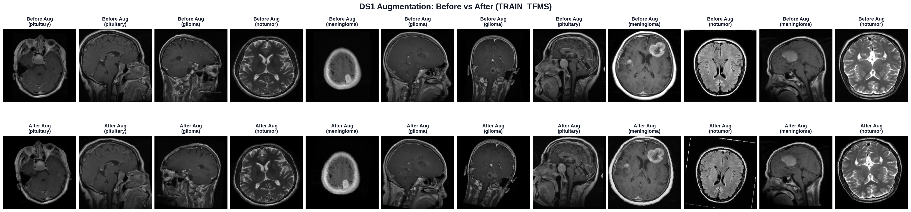
    


    
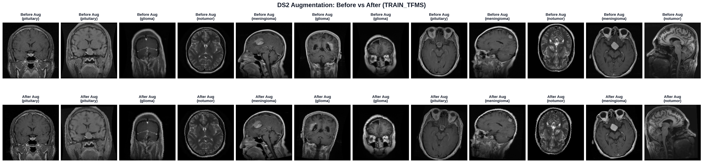
    


    
    ======================================================================================================================
    STEP 7: NOVEL PREPROCESSING — RACE-FELCM
    ======================================================================================================================
    
    ======================================================================================================================
    STEP 8: MODEL — ResNet-50 + CRAF Fusion
    ======================================================================================================================
    Backbone: ResNet-50 | pretrained_loaded=True
    Total params: 25,790,855
    Trainable params: 2,282,823 (8.85%)
    
    ======================================================================================================================
    STEP 9: LOSSES + PROTOTYPE KNOWLEDGE SHARING
    ======================================================================================================================
    
    ======================================================================================================================
    STEP 10: TUNE-AWARE RL-UCB PREPROCESSING SELECTION
    ======================================================================================================================
    
    ======================================================================================================================
    STEP 11: TRUE FEDERATED TRAINING
    ======================================================================================================================
    Adaptive clients => DS1=5, DS2=5, TOTAL=10
    Rounds: 15 | Local epochs: 2
    Augmentation ON: True
    Transfer backbone: ResNet-50
    Preprocessing: RACE-FELCM
    Fusion: CRAF
    FedProx μ=0.01 | Proto λ=0.12
    Tempered FedAvg exponent = 0.50
    Best-round masses => DS1=0.50, DS2=0.50, min-bonus=0.15
    
    ======================================================================================================================
    ROUND 1/15 | selected=[0, 1, 2, 3, 4, 5, 6, 7, 8, 9]
    ======================================================================================================================
    Client 0 (ds1) | train_acc=0.8923 | val_acc=0.9706 | val_f1=0.4955 | val_auc=0.8079 | reward=0.6143 | theta=race_focus (g=1.10, a=0.36, b=6.40, t=2.70, k=3, eg=0.17, mix=0.86)
    Client 1 (ds1) | train_acc=0.7886 | val_acc=0.8516 | val_f1=0.7717 | val_auc=0.9543 | reward=0.7917 | theta=race_focus (g=1.10, a=0.36, b=6.40, t=2.70, k=3, eg=0.17, mix=0.86)
    Client 2 (ds1) | train_acc=0.7045 | val_acc=0.8655 | val_f1=0.8753 | val_auc=0.9594 | reward=0.8729 | theta=race_robust (g=1.08, a=0.22, b=4.50, t=2.80, k=5, eg=0.11, mix=0.76)
    Client 3 (ds1) | train_acc=0.7248 | val_acc=0.8983 | val_f1=0.7292 | val_auc=0.9518 | reward=0.7715 | theta=race_edge_plus (g=1.02, a=0.32, b=6.00, t=2.60, k=3, eg=0.15, mix=0.84)
    Client 4 (ds1) | train_acc=0.8444 | val_acc=0.9500 | val_f1=0.2436 | val_auc=nan | reward=0.4202 | theta=race_edge_plus (g=1.02, a=0.32, b=6.00, t=2.60, k=3, eg=0.15, mix=0.84)
    Client 5 (ds2) | train_acc=0.8298 | val_acc=0.9326 | val_f1=0.5635 | val_auc=0.9511 | reward=0.6558 | theta=race_smoothmix (g=0.90, a=0.20, b=4.00, t=2.10, k=7, eg=0.07, mix=0.70)
    Client 6 (ds2) | train_acc=0.7680 | val_acc=0.8439 | val_f1=0.6860 | val_auc=0.9500 | reward=0.7255 | theta=race_robust (g=1.08, a=0.22, b=4.50, t=2.80, k=5, eg=0.11, mix=0.76)
    Client 7 (ds2) | train_acc=0.8503 | val_acc=0.9329 | val_f1=0.8152 | val_auc=0.9864 | reward=0.8446 | theta=race_robust (g=1.08, a=0.22, b=4.50, t=2.80, k=5, eg=0.11, mix=0.76)
    Client 8 (ds2) | train_acc=0.8244 | val_acc=0.9333 | val_f1=0.9233 | val_auc=nan | reward=0.9258 | theta=race_robust (g=1.08, a=0.22, b=4.50, t=2.80, k=5, eg=0.11, mix=0.76)
    Client 9 (ds2) | train_acc=0.7836 | val_acc=0.9153 | val_f1=0.5976 | val_auc=0.9489 | reward=0.6770 | theta=race_robust (g=1.08, a=0.22, b=4.50, t=2.80, k=5, eg=0.11, mix=0.76)
    
    ----------------------------------------------------------------------------------------------------------------------
    GLOBAL VAL (Round 1) | global_acc=0.9106 | global_f1=0.7278 | ds1_acc=0.8946 | ds1_f1=0.6758 | ds2_acc=0.9178 | ds2_f1=0.7513 | reward=0.8713 | round_time=341.7s
    ----------------------------------------------------------------------------------------------------------------------
    
    ======================================================================================================================
    ROUND 2/15 | selected=[0, 1, 2, 3, 4, 5, 6, 7, 8, 9]
    ======================================================================================================================
    Client 0 (ds1) | train_acc=0.9771 | val_acc=0.9706 | val_f1=0.4880 | val_auc=0.8584 | reward=0.6086 | theta=race_edge_plus (g=1.02, a=0.32, b=6.00, t=2.60, k=3, eg=0.15, mix=0.84)
    Client 1 (ds1) | train_acc=0.8937 | val_acc=0.8956 | val_f1=0.8246 | val_auc=0.9787 | reward=0.8423 | theta=race_edge_plus (g=1.02, a=0.32, b=6.00, t=2.60, k=3, eg=0.15, mix=0.84)
    Client 2 (ds1) | train_acc=0.8318 | val_acc=0.8739 | val_f1=0.8792 | val_auc=0.9680 | reward=0.8779 | theta=race_texture (g=0.92, a=0.34, b=5.80, t=2.30, k=7, eg=0.10, mix=0.80)
    Client 3 (ds1) | train_acc=0.8712 | val_acc=0.8814 | val_f1=0.7026 | val_auc=0.9718 | reward=0.7473 | theta=race_focus (g=1.10, a=0.36, b=6.40, t=2.70, k=3, eg=0.17, mix=0.86)
    Client 4 (ds1) | train_acc=0.8947 | val_acc=0.9333 | val_f1=0.4912 | val_auc=nan | reward=0.6018 | theta=race_robust (g=1.08, a=0.22, b=4.50, t=2.80, k=5, eg=0.11, mix=0.76)
    Client 5 (ds2) | train_acc=0.8967 | val_acc=0.9637 | val_f1=0.8658 | val_auc=0.9731 | reward=0.8903 | theta=race_soft (g=0.95, a=0.18, b=3.80, t=2.20, k=3, eg=0.08, mix=0.72)
    Client 6 (ds2) | train_acc=0.8553 | val_acc=0.8671 | val_f1=0.7367 | val_auc=0.9673 | reward=0.7693 | theta=race_balanced (g=1.00, a=0.24, b=4.60, t=2.40, k=5, eg=0.10, mix=0.78)
    Client 7 (ds2) | train_acc=0.8978 | val_acc=0.9416 | val_f1=0.7655 | val_auc=0.9863 | reward=0.8095 | theta=race_smoothmix (g=0.90, a=0.20, b=4.00, t=2.10, k=7, eg=0.07, mix=0.70)
    Client 8 (ds2) | train_acc=0.9034 | val_acc=0.9571 | val_f1=0.9465 | val_auc=nan | reward=0.9492 | theta=race_smoothmix (g=0.90, a=0.20, b=4.00, t=2.10, k=7, eg=0.07, mix=0.70)
    Client 9 (ds2) | train_acc=0.8875 | val_acc=0.9237 | val_f1=0.6543 | val_auc=0.9657 | reward=0.7216 | theta=race_soft (g=0.95, a=0.18, b=3.80, t=2.20, k=3, eg=0.08, mix=0.72)
    
    ----------------------------------------------------------------------------------------------------------------------
    GLOBAL VAL (Round 2) | global_acc=0.9267 | global_f1=0.7745 | ds1_acc=0.9080 | ds1_f1=0.7192 | ds2_acc=0.9351 | ds2_f1=0.7995 | reward=0.9148 | round_time=337.8s
    ----------------------------------------------------------------------------------------------------------------------
    
    ======================================================================================================================
    ROUND 3/15 | selected=[0, 1, 2, 3, 4, 5, 6, 7, 8, 9]
    ======================================================================================================================
    Client 0 (ds1) | train_acc=0.9280 | val_acc=0.9804 | val_f1=0.6637 | val_auc=0.9265 | reward=0.7428 | theta=race_texture (g=0.92, a=0.34, b=5.80, t=2.30, k=7, eg=0.10, mix=0.80)
    Client 1 (ds1) | train_acc=0.8693 | val_acc=0.9231 | val_f1=0.8522 | val_auc=0.9787 | reward=0.8699 | theta=race_texture (g=0.92, a=0.34, b=5.80, t=2.30, k=7, eg=0.10, mix=0.80)
    Client 2 (ds1) | train_acc=0.8445 | val_acc=0.8824 | val_f1=0.8903 | val_auc=0.9902 | reward=0.8883 | theta=race_balanced (g=1.00, a=0.24, b=4.60, t=2.40, k=5, eg=0.10, mix=0.78)
    Client 3 (ds1) | train_acc=0.7834 | val_acc=0.8644 | val_f1=0.7469 | val_auc=0.9465 | reward=0.7762 | theta=race_robust (g=1.08, a=0.22, b=4.50, t=2.80, k=5, eg=0.11, mix=0.76)
    Client 4 (ds1) | train_acc=0.8833 | val_acc=0.9667 | val_f1=0.3277 | val_auc=nan | reward=0.4874 | theta=race_focus (g=1.10, a=0.36, b=6.40, t=2.70, k=3, eg=0.17, mix=0.86)
    Client 5 (ds2) | train_acc=0.9045 | val_acc=0.9637 | val_f1=0.6532 | val_auc=0.9943 | reward=0.7309 | theta=race_robust (g=1.08, a=0.22, b=4.50, t=2.80, k=5, eg=0.11, mix=0.76)
    Client 6 (ds2) | train_acc=0.8656 | val_acc=0.9595 | val_f1=0.8751 | val_auc=0.9967 | reward=0.8962 | theta=race_smoothmix (g=0.90, a=0.20, b=4.00, t=2.10, k=7, eg=0.07, mix=0.70)
    Client 7 (ds2) | train_acc=0.9114 | val_acc=0.9784 | val_f1=0.9229 | val_auc=0.9953 | reward=0.9368 | theta=race_soft (g=0.95, a=0.18, b=3.80, t=2.20, k=3, eg=0.08, mix=0.72)
    Client 8 (ds2) | train_acc=0.9063 | val_acc=0.9667 | val_f1=0.9671 | val_auc=nan | reward=0.9670 | theta=race_soft (g=0.95, a=0.18, b=3.80, t=2.20, k=3, eg=0.08, mix=0.72)
    Client 9 (ds2) | train_acc=0.9014 | val_acc=0.9576 | val_f1=0.8803 | val_auc=0.9744 | reward=0.8996 | theta=race_smoothmix (g=0.90, a=0.20, b=4.00, t=2.10, k=7, eg=0.07, mix=0.70)
    
    ----------------------------------------------------------------------------------------------------------------------
    GLOBAL VAL (Round 3) | global_acc=0.9547 | global_f1=0.8363 | ds1_acc=0.9234 | ds1_f1=0.7519 | ds2_acc=0.9689 | ds2_f1=0.8744 | reward=0.9656 | round_time=441.5s
    ----------------------------------------------------------------------------------------------------------------------
    
    ======================================================================================================================
    ROUND 4/15 | selected=[0, 1, 2, 3, 4, 5, 6, 7, 8, 9]
    ======================================================================================================================
    Client 0 (ds1) | train_acc=0.9744 | val_acc=0.9804 | val_f1=0.4970 | val_auc=0.9974 | reward=0.6179 | theta=race_sharp (g=1.04, a=0.30, b=5.20, t=2.50, k=5, eg=0.12, mix=0.82)
    Client 1 (ds1) | train_acc=0.9469 | val_acc=0.9615 | val_f1=0.9256 | val_auc=0.9978 | reward=0.9346 | theta=race_sharp (g=1.04, a=0.30, b=5.20, t=2.50, k=5, eg=0.12, mix=0.82)
    Client 2 (ds1) | train_acc=0.9050 | val_acc=0.9328 | val_f1=0.9338 | val_auc=0.9955 | reward=0.9336 | theta=race_sharp (g=1.04, a=0.30, b=5.20, t=2.50, k=5, eg=0.12, mix=0.82)
    Client 3 (ds1) | train_acc=0.9438 | val_acc=0.9661 | val_f1=0.9097 | val_auc=0.9917 | reward=0.9238 | theta=race_sharp (g=1.04, a=0.30, b=5.20, t=2.50, k=5, eg=0.12, mix=0.82)
    Client 4 (ds1) | train_acc=0.9519 | val_acc=1.0000 | val_f1=1.0000 | val_auc=nan | reward=1.0000 | theta=race_sharp (g=1.04, a=0.30, b=5.20, t=2.50, k=5, eg=0.12, mix=0.82)
    Client 5 (ds2) | train_acc=0.9512 | val_acc=0.9793 | val_f1=0.8585 | val_auc=0.9983 | reward=0.8887 | theta=race_balanced (g=1.00, a=0.24, b=4.60, t=2.40, k=5, eg=0.10, mix=0.78)
    Client 6 (ds2) | train_acc=0.9377 | val_acc=0.9769 | val_f1=0.9211 | val_auc=0.9985 | reward=0.9351 | theta=race_soft (g=0.95, a=0.18, b=3.80, t=2.20, k=3, eg=0.08, mix=0.72)
    Client 7 (ds2) | train_acc=0.9395 | val_acc=0.9848 | val_f1=0.9807 | val_auc=0.9953 | reward=0.9818 | theta=race_balanced (g=1.00, a=0.24, b=4.60, t=2.40, k=5, eg=0.10, mix=0.78)
    Client 8 (ds2) | train_acc=0.9318 | val_acc=0.9619 | val_f1=0.9607 | val_auc=nan | reward=0.9610 | theta=race_balanced (g=1.00, a=0.24, b=4.60, t=2.40, k=5, eg=0.10, mix=0.78)
    Client 9 (ds2) | train_acc=0.9548 | val_acc=0.9831 | val_f1=0.9351 | val_auc=0.9827 | reward=0.9471 | theta=race_balanced (g=1.00, a=0.24, b=4.60, t=2.40, k=5, eg=0.10, mix=0.78)
    
    ----------------------------------------------------------------------------------------------------------------------
    GLOBAL VAL (Round 4) | global_acc=0.9738 | global_f1=0.9143 | ds1_acc=0.9636 | ds1_f1=0.8505 | ds2_acc=0.9784 | ds2_f1=0.9431 | reward=1.0472 | round_time=398.0s
    ----------------------------------------------------------------------------------------------------------------------
    
    ======================================================================================================================
    ROUND 5/15 | selected=[0, 1, 2, 3, 4, 5, 6, 7, 8, 9]
    ======================================================================================================================
    Client 0 (ds1) | train_acc=0.9751 | val_acc=0.9902 | val_f1=0.9152 | val_auc=0.9951 | reward=0.9339 | theta=race_balanced (g=1.00, a=0.24, b=4.60, t=2.40, k=5, eg=0.10, mix=0.78)
    Client 1 (ds1) | train_acc=0.9540 | val_acc=0.9725 | val_f1=0.9439 | val_auc=0.9974 | reward=0.9510 | theta=race_balanced (g=1.00, a=0.24, b=4.60, t=2.40, k=5, eg=0.10, mix=0.78)
    Client 2 (ds1) | train_acc=0.9291 | val_acc=0.9328 | val_f1=0.9384 | val_auc=0.9982 | reward=0.9370 | theta=race_focus (g=1.10, a=0.36, b=6.40, t=2.70, k=3, eg=0.17, mix=0.86)
    Client 3 (ds1) | train_acc=0.9766 | val_acc=0.9322 | val_f1=0.8938 | val_auc=0.9965 | reward=0.9034 | theta=race_balanced (g=1.00, a=0.24, b=4.60, t=2.40, k=5, eg=0.10, mix=0.78)
    Client 4 (ds1) | train_acc=0.9588 | val_acc=0.9500 | val_f1=0.4913 | val_auc=nan | reward=0.6060 | theta=race_balanced (g=1.00, a=0.24, b=4.60, t=2.40, k=5, eg=0.10, mix=0.78)
    Client 5 (ds2) | train_acc=0.9692 | val_acc=0.9948 | val_f1=0.9800 | val_auc=0.9955 | reward=0.9837 | theta=race_soft (g=0.95, a=0.18, b=3.80, t=2.20, k=3, eg=0.08, mix=0.72)
    Client 6 (ds2) | train_acc=0.9536 | val_acc=0.9480 | val_f1=0.8461 | val_auc=0.9729 | reward=0.8716 | theta=race_soft (g=0.95, a=0.18, b=3.80, t=2.20, k=3, eg=0.08, mix=0.72)
    Client 7 (ds2) | train_acc=0.9523 | val_acc=0.9848 | val_f1=0.9807 | val_auc=0.9944 | reward=0.9818 | theta=race_balanced (g=1.00, a=0.24, b=4.60, t=2.40, k=5, eg=0.10, mix=0.78)
    Client 8 (ds2) | train_acc=0.9533 | val_acc=0.9857 | val_f1=0.9859 | val_auc=nan | reward=0.9858 | theta=race_soft (g=0.95, a=0.18, b=3.80, t=2.20, k=3, eg=0.08, mix=0.72)
    Client 9 (ds2) | train_acc=0.9640 | val_acc=0.9746 | val_f1=0.9282 | val_auc=0.9794 | reward=0.9398 | theta=race_balanced (g=1.00, a=0.24, b=4.60, t=2.40, k=5, eg=0.10, mix=0.78)
    
    ----------------------------------------------------------------------------------------------------------------------
    GLOBAL VAL (Round 5) | global_acc=0.9738 | global_f1=0.9322 | ds1_acc=0.9598 | ds1_f1=0.8793 | ds2_acc=0.9801 | ds2_f1=0.9560 | reward=1.0657 | round_time=397.7s
    ----------------------------------------------------------------------------------------------------------------------
    
    ======================================================================================================================
    ROUND 6/15 | selected=[0, 1, 2, 3, 4, 5, 6, 7, 8, 9]
    ======================================================================================================================
    Client 0 (ds1) | train_acc=0.9906 | val_acc=0.9902 | val_f1=0.9152 | val_auc=0.9986 | reward=0.9339 | theta=race_robust (g=1.08, a=0.22, b=4.50, t=2.80, k=5, eg=0.11, mix=0.76)
    Client 1 (ds1) | train_acc=0.9574 | val_acc=0.9505 | val_f1=0.8974 | val_auc=0.9956 | reward=0.9107 | theta=race_robust (g=1.08, a=0.22, b=4.50, t=2.80, k=5, eg=0.11, mix=0.76)
    Client 2 (ds1) | train_acc=0.9591 | val_acc=0.9664 | val_f1=0.9706 | val_auc=0.9980 | reward=0.9696 | theta=race_edge_plus (g=1.02, a=0.32, b=6.00, t=2.60, k=3, eg=0.15, mix=0.84)
    Client 3 (ds1) | train_acc=0.9672 | val_acc=0.9322 | val_f1=0.8997 | val_auc=0.9897 | reward=0.9078 | theta=race_texture (g=0.92, a=0.34, b=5.80, t=2.30, k=7, eg=0.10, mix=0.80)
    Client 4 (ds1) | train_acc=0.9748 | val_acc=1.0000 | val_f1=1.0000 | val_auc=nan | reward=1.0000 | theta=race_texture (g=0.92, a=0.34, b=5.80, t=2.30, k=7, eg=0.10, mix=0.80)
    Client 5 (ds2) | train_acc=0.9749 | val_acc=0.9896 | val_f1=0.8909 | val_auc=0.9994 | reward=0.9156 | theta=race_balanced (g=1.00, a=0.24, b=4.60, t=2.40, k=5, eg=0.10, mix=0.78)
    Client 6 (ds2) | train_acc=0.9512 | val_acc=0.9538 | val_f1=0.8450 | val_auc=0.9861 | reward=0.8722 | theta=race_smoothmix (g=0.90, a=0.20, b=4.00, t=2.10, k=7, eg=0.07, mix=0.70)
    Client 7 (ds2) | train_acc=0.9618 | val_acc=0.9827 | val_f1=0.9287 | val_auc=0.9953 | reward=0.9422 | theta=race_soft (g=0.95, a=0.18, b=3.80, t=2.20, k=3, eg=0.08, mix=0.72)
    Client 8 (ds2) | train_acc=0.9625 | val_acc=0.9714 | val_f1=0.9685 | val_auc=nan | reward=0.9693 | theta=race_balanced (g=1.00, a=0.24, b=4.60, t=2.40, k=5, eg=0.10, mix=0.78)
    Client 9 (ds2) | train_acc=0.9780 | val_acc=0.9661 | val_f1=0.9118 | val_auc=0.9837 | reward=0.9253 | theta=race_smoothmix (g=0.90, a=0.20, b=4.00, t=2.10, k=7, eg=0.07, mix=0.70)
    
    ----------------------------------------------------------------------------------------------------------------------
    GLOBAL VAL (Round 6) | global_acc=0.9726 | global_f1=0.9198 | ds1_acc=0.9655 | ds1_f1=0.9296 | ds2_acc=0.9758 | ds2_f1=0.9154 | reward=1.0741 | round_time=398.1s
    ----------------------------------------------------------------------------------------------------------------------
    
    ======================================================================================================================
    ROUND 7/15 | selected=[0, 1, 2, 3, 4, 5, 6, 7, 8, 9]
    ======================================================================================================================
    Client 0 (ds1) | train_acc=0.9805 | val_acc=0.9902 | val_f1=0.7485 | val_auc=1.0000 | reward=0.8089 | theta=race_balanced (g=1.00, a=0.24, b=4.60, t=2.40, k=5, eg=0.10, mix=0.78)
    Client 1 (ds1) | train_acc=0.9601 | val_acc=0.9890 | val_f1=0.9781 | val_auc=0.9986 | reward=0.9808 | theta=race_balanced (g=1.00, a=0.24, b=4.60, t=2.40, k=5, eg=0.10, mix=0.78)
    Client 2 (ds1) | train_acc=0.9683 | val_acc=0.9664 | val_f1=0.9706 | val_auc=0.9989 | reward=0.9695 | theta=race_edge_plus (g=1.02, a=0.32, b=6.00, t=2.60, k=3, eg=0.15, mix=0.84)
    Client 3 (ds1) | train_acc=0.9742 | val_acc=0.9831 | val_f1=0.9879 | val_auc=1.0000 | reward=0.9867 | theta=race_sharp (g=1.04, a=0.30, b=5.20, t=2.50, k=5, eg=0.12, mix=0.82)
    Client 4 (ds1) | train_acc=0.9714 | val_acc=0.9833 | val_f1=0.6638 | val_auc=nan | reward=0.7437 | theta=race_sharp (g=1.04, a=0.30, b=5.20, t=2.50, k=5, eg=0.12, mix=0.82)
    Client 5 (ds2) | train_acc=0.9883 | val_acc=0.9948 | val_f1=0.9800 | val_auc=0.9998 | reward=0.9837 | theta=race_robust (g=1.08, a=0.22, b=4.50, t=2.80, k=5, eg=0.11, mix=0.76)
    Client 6 (ds2) | train_acc=0.9667 | val_acc=0.9538 | val_f1=0.8548 | val_auc=0.9963 | reward=0.8795 | theta=race_balanced (g=1.00, a=0.24, b=4.60, t=2.40, k=5, eg=0.10, mix=0.78)
    Client 7 (ds2) | train_acc=0.9625 | val_acc=0.9805 | val_f1=0.9749 | val_auc=0.9963 | reward=0.9763 | theta=race_robust (g=1.08, a=0.22, b=4.50, t=2.80, k=5, eg=0.11, mix=0.76)
    Client 8 (ds2) | train_acc=0.9677 | val_acc=0.9857 | val_f1=0.9854 | val_auc=nan | reward=0.9855 | theta=race_smoothmix (g=0.90, a=0.20, b=4.00, t=2.10, k=7, eg=0.07, mix=0.70)
    Client 9 (ds2) | train_acc=0.9820 | val_acc=0.9746 | val_f1=0.9130 | val_auc=0.9971 | reward=0.9284 | theta=race_soft (g=0.95, a=0.18, b=3.80, t=2.20, k=3, eg=0.08, mix=0.72)
    
    ----------------------------------------------------------------------------------------------------------------------
    GLOBAL VAL (Round 7) | global_acc=0.9803 | global_f1=0.9357 | ds1_acc=0.9828 | ds1_f1=0.8965 | ds2_acc=0.9792 | ds2_f1=0.9534 | reward=1.0767 | round_time=396.4s
    ----------------------------------------------------------------------------------------------------------------------
    
    ======================================================================================================================
    ROUND 8/15 | selected=[0, 1, 2, 3, 4, 5, 6, 7, 8, 9]
    ======================================================================================================================
    Client 0 (ds1) | train_acc=0.9913 | val_acc=0.9902 | val_f1=0.9152 | val_auc=0.9947 | reward=0.9339 | theta=race_robust (g=1.08, a=0.22, b=4.50, t=2.80, k=5, eg=0.11, mix=0.76)
    Client 1 (ds1) | train_acc=0.9661 | val_acc=0.9725 | val_f1=0.9530 | val_auc=0.9993 | reward=0.9579 | theta=race_sharp (g=1.04, a=0.30, b=5.20, t=2.50, k=5, eg=0.12, mix=0.82)
    Client 2 (ds1) | train_acc=0.9505 | val_acc=0.9496 | val_f1=0.9541 | val_auc=0.9956 | reward=0.9529 | theta=race_focus (g=1.10, a=0.36, b=6.40, t=2.70, k=3, eg=0.17, mix=0.86)
    Client 3 (ds1) | train_acc=0.9789 | val_acc=0.9661 | val_f1=0.9097 | val_auc=0.9977 | reward=0.9238 | theta=race_texture (g=0.92, a=0.34, b=5.80, t=2.30, k=7, eg=0.10, mix=0.80)
    Client 4 (ds1) | train_acc=0.9863 | val_acc=1.0000 | val_f1=1.0000 | val_auc=nan | reward=1.0000 | theta=race_texture (g=0.92, a=0.34, b=5.80, t=2.30, k=7, eg=0.10, mix=0.80)
    Client 5 (ds2) | train_acc=0.9798 | val_acc=0.9845 | val_f1=0.8840 | val_auc=0.9995 | reward=0.9091 | theta=race_smoothmix (g=0.90, a=0.20, b=4.00, t=2.10, k=7, eg=0.07, mix=0.70)
    Client 6 (ds2) | train_acc=0.9643 | val_acc=0.9595 | val_f1=0.8881 | val_auc=0.9988 | reward=0.9060 | theta=race_robust (g=1.08, a=0.22, b=4.50, t=2.80, k=5, eg=0.11, mix=0.76)
    Client 7 (ds2) | train_acc=0.9691 | val_acc=0.9848 | val_f1=0.9807 | val_auc=0.9964 | reward=0.9818 | theta=race_smoothmix (g=0.90, a=0.20, b=4.00, t=2.10, k=7, eg=0.07, mix=0.70)
    Client 8 (ds2) | train_acc=0.9716 | val_acc=0.9857 | val_f1=0.9859 | val_auc=nan | reward=0.9858 | theta=race_robust (g=1.08, a=0.22, b=4.50, t=2.80, k=5, eg=0.11, mix=0.76)
    Client 9 (ds2) | train_acc=0.9791 | val_acc=0.9746 | val_f1=0.9282 | val_auc=0.9875 | reward=0.9398 | theta=race_robust (g=1.08, a=0.22, b=4.50, t=2.80, k=5, eg=0.11, mix=0.76)
    
    ----------------------------------------------------------------------------------------------------------------------
    GLOBAL VAL (Round 8) | global_acc=0.9779 | global_f1=0.9463 | ds1_acc=0.9732 | ds1_f1=0.9463 | ds2_acc=0.9801 | ds2_f1=0.9463 | reward=1.0969 | round_time=399.6s
    ----------------------------------------------------------------------------------------------------------------------
    
    ======================================================================================================================
    ROUND 9/15 | selected=[0, 1, 2, 3, 4, 5, 6, 7, 8, 9]
    ======================================================================================================================
    Client 0 (ds1) | train_acc=0.9913 | val_acc=0.9902 | val_f1=0.7485 | val_auc=0.9998 | reward=0.8089 | theta=race_texture (g=0.92, a=0.34, b=5.80, t=2.30, k=7, eg=0.10, mix=0.80)
    Client 1 (ds1) | train_acc=0.9668 | val_acc=0.9945 | val_f1=0.9886 | val_auc=0.9998 | reward=0.9901 | theta=race_robust (g=1.08, a=0.22, b=4.50, t=2.80, k=5, eg=0.11, mix=0.76)
    Client 2 (ds1) | train_acc=0.9608 | val_acc=0.9580 | val_f1=0.9604 | val_auc=0.9972 | reward=0.9598 | theta=race_sharp (g=1.04, a=0.30, b=5.20, t=2.50, k=5, eg=0.12, mix=0.82)
    Client 3 (ds1) | train_acc=0.9848 | val_acc=0.9661 | val_f1=0.9752 | val_auc=1.0000 | reward=0.9729 | theta=race_balanced (g=1.00, a=0.24, b=4.60, t=2.40, k=5, eg=0.10, mix=0.78)
    Client 4 (ds1) | train_acc=0.9714 | val_acc=0.9833 | val_f1=0.5556 | val_auc=nan | reward=0.6625 | theta=race_balanced (g=1.00, a=0.24, b=4.60, t=2.40, k=5, eg=0.10, mix=0.78)
    Client 5 (ds2) | train_acc=0.9809 | val_acc=0.9896 | val_f1=0.9628 | val_auc=0.9998 | reward=0.9695 | theta=race_soft (g=0.95, a=0.18, b=3.80, t=2.20, k=3, eg=0.08, mix=0.72)
    Client 6 (ds2) | train_acc=0.9794 | val_acc=0.9769 | val_f1=0.9384 | val_auc=0.9979 | reward=0.9480 | theta=race_soft (g=0.95, a=0.18, b=3.80, t=2.20, k=3, eg=0.08, mix=0.72)
    Client 7 (ds2) | train_acc=0.9742 | val_acc=0.9827 | val_f1=0.9791 | val_auc=0.9962 | reward=0.9800 | theta=race_balanced (g=1.00, a=0.24, b=4.60, t=2.40, k=5, eg=0.10, mix=0.78)
    Client 8 (ds2) | train_acc=0.9726 | val_acc=0.9762 | val_f1=0.9752 | val_auc=nan | reward=0.9755 | theta=race_soft (g=0.95, a=0.18, b=3.80, t=2.20, k=3, eg=0.08, mix=0.72)
    Client 9 (ds2) | train_acc=0.9797 | val_acc=0.9576 | val_f1=0.8977 | val_auc=0.9941 | reward=0.9127 | theta=race_balanced (g=1.00, a=0.24, b=4.60, t=2.40, k=5, eg=0.10, mix=0.78)
    
    ----------------------------------------------------------------------------------------------------------------------
    GLOBAL VAL (Round 9) | global_acc=0.9797 | global_f1=0.9372 | ds1_acc=0.9808 | ds1_f1=0.8840 | ds2_acc=0.9792 | ds2_f1=0.9613 | reward=1.0732 | round_time=398.8s
    ----------------------------------------------------------------------------------------------------------------------
    
    ======================================================================================================================
    ROUND 10/15 | selected=[0, 1, 2, 3, 4, 5, 6, 7, 8, 9]
    ======================================================================================================================
    Client 0 (ds1) | train_acc=0.9832 | val_acc=0.9902 | val_f1=0.9152 | val_auc=0.9971 | reward=0.9339 | theta=race_sharp (g=1.04, a=0.30, b=5.20, t=2.50, k=5, eg=0.12, mix=0.82)
    Client 1 (ds1) | train_acc=0.9729 | val_acc=0.9945 | val_f1=0.9894 | val_auc=0.9999 | reward=0.9907 | theta=race_texture (g=0.92, a=0.34, b=5.80, t=2.30, k=7, eg=0.10, mix=0.80)
    Client 2 (ds1) | train_acc=0.9672 | val_acc=0.9580 | val_f1=0.9609 | val_auc=0.9974 | reward=0.9602 | theta=race_balanced (g=1.00, a=0.24, b=4.60, t=2.40, k=5, eg=0.10, mix=0.78)
    Client 3 (ds1) | train_acc=0.9883 | val_acc=0.9831 | val_f1=0.9642 | val_auc=1.0000 | reward=0.9689 | theta=race_robust (g=1.08, a=0.22, b=4.50, t=2.80, k=5, eg=0.11, mix=0.76)
    Client 4 (ds1) | train_acc=0.9920 | val_acc=1.0000 | val_f1=1.0000 | val_auc=nan | reward=1.0000 | theta=race_robust (g=1.08, a=0.22, b=4.50, t=2.80, k=5, eg=0.11, mix=0.76)
    Client 5 (ds2) | train_acc=0.9816 | val_acc=0.9948 | val_f1=0.9934 | val_auc=1.0000 | reward=0.9938 | theta=race_balanced (g=1.00, a=0.24, b=4.60, t=2.40, k=5, eg=0.10, mix=0.78)
    Client 6 (ds2) | train_acc=0.9691 | val_acc=0.9769 | val_f1=0.9327 | val_auc=0.9990 | reward=0.9438 | theta=race_smoothmix (g=0.90, a=0.20, b=4.00, t=2.10, k=7, eg=0.07, mix=0.70)
    Client 7 (ds2) | train_acc=0.9730 | val_acc=0.9827 | val_f1=0.9794 | val_auc=0.9965 | reward=0.9802 | theta=race_soft (g=0.95, a=0.18, b=3.80, t=2.20, k=3, eg=0.08, mix=0.72)
    Client 8 (ds2) | train_acc=0.9788 | val_acc=0.9810 | val_f1=0.9789 | val_auc=nan | reward=0.9794 | theta=race_smoothmix (g=0.90, a=0.20, b=4.00, t=2.10, k=7, eg=0.07, mix=0.70)
    Client 9 (ds2) | train_acc=0.9704 | val_acc=0.9661 | val_f1=0.9118 | val_auc=0.9965 | reward=0.9253 | theta=race_smoothmix (g=0.90, a=0.20, b=4.00, t=2.10, k=7, eg=0.07, mix=0.70)
    
    ----------------------------------------------------------------------------------------------------------------------
    GLOBAL VAL (Round 10) | global_acc=0.9827 | global_f1=0.9675 | ds1_acc=0.9847 | ds1_f1=0.9668 | ds2_acc=0.9818 | ds2_f1=0.9678 | reward=1.1169 | round_time=397.4s
    ----------------------------------------------------------------------------------------------------------------------
    
    ======================================================================================================================
    ROUND 11/15 | selected=[0, 1, 2, 3, 4, 5, 6, 7, 8, 9]
    ======================================================================================================================
    Client 0 (ds1) | train_acc=0.9899 | val_acc=0.9902 | val_f1=0.9152 | val_auc=0.9975 | reward=0.9339 | theta=race_focus (g=1.10, a=0.36, b=6.40, t=2.70, k=3, eg=0.17, mix=0.86)
    Client 1 (ds1) | train_acc=0.9736 | val_acc=0.9890 | val_f1=0.9824 | val_auc=0.9992 | reward=0.9841 | theta=race_edge_plus (g=1.02, a=0.32, b=6.00, t=2.60, k=3, eg=0.15, mix=0.84)
    Client 2 (ds1) | train_acc=0.9764 | val_acc=0.9916 | val_f1=0.9914 | val_auc=1.0000 | reward=0.9915 | theta=race_texture (g=0.92, a=0.34, b=5.80, t=2.30, k=7, eg=0.10, mix=0.80)
    Client 3 (ds1) | train_acc=0.9883 | val_acc=0.9661 | val_f1=0.9421 | val_auc=0.9994 | reward=0.9481 | theta=race_edge_plus (g=1.02, a=0.32, b=6.00, t=2.60, k=3, eg=0.15, mix=0.84)
    Client 4 (ds1) | train_acc=0.9817 | val_acc=0.9833 | val_f1=0.6638 | val_auc=nan | reward=0.7437 | theta=race_focus (g=1.10, a=0.36, b=6.40, t=2.70, k=3, eg=0.17, mix=0.86)
    Client 5 (ds2) | train_acc=0.9880 | val_acc=0.9896 | val_f1=0.9628 | val_auc=0.9998 | reward=0.9695 | theta=race_robust (g=1.08, a=0.22, b=4.50, t=2.80, k=5, eg=0.11, mix=0.76)
    Client 6 (ds2) | train_acc=0.9627 | val_acc=0.9769 | val_f1=0.9585 | val_auc=0.9990 | reward=0.9631 | theta=race_balanced (g=1.00, a=0.24, b=4.60, t=2.40, k=5, eg=0.10, mix=0.78)
    Client 7 (ds2) | train_acc=0.9798 | val_acc=0.9870 | val_f1=0.9835 | val_auc=0.9968 | reward=0.9844 | theta=race_robust (g=1.08, a=0.22, b=4.50, t=2.80, k=5, eg=0.11, mix=0.76)
    Client 8 (ds2) | train_acc=0.9755 | val_acc=0.9810 | val_f1=0.9815 | val_auc=nan | reward=0.9814 | theta=race_balanced (g=1.00, a=0.24, b=4.60, t=2.40, k=5, eg=0.10, mix=0.78)
    Client 9 (ds2) | train_acc=0.9843 | val_acc=0.9746 | val_f1=0.9282 | val_auc=0.9980 | reward=0.9398 | theta=race_soft (g=0.95, a=0.18, b=3.80, t=2.20, k=3, eg=0.08, mix=0.72)
    
    ----------------------------------------------------------------------------------------------------------------------
    GLOBAL VAL (Round 11) | global_acc=0.9845 | global_f1=0.9578 | ds1_acc=0.9866 | ds1_f1=0.9302 | ds2_acc=0.9836 | ds2_f1=0.9703 | reward=1.1006 | round_time=398.1s
    ----------------------------------------------------------------------------------------------------------------------
    
    ======================================================================================================================
    ROUND 12/15 | selected=[0, 1, 2, 3, 4, 5, 6, 7, 8, 9]
    ======================================================================================================================
    Client 0 (ds1) | train_acc=0.9953 | val_acc=0.9902 | val_f1=0.7485 | val_auc=1.0000 | reward=0.8089 | theta=race_edge_plus (g=1.02, a=0.32, b=6.00, t=2.60, k=3, eg=0.15, mix=0.84)
    Client 1 (ds1) | train_acc=0.9830 | val_acc=0.9670 | val_f1=0.9566 | val_auc=0.9996 | reward=0.9592 | theta=race_focus (g=1.10, a=0.36, b=6.40, t=2.70, k=3, eg=0.17, mix=0.86)
    Client 2 (ds1) | train_acc=0.9718 | val_acc=0.9748 | val_f1=0.9758 | val_auc=0.9997 | reward=0.9755 | theta=race_robust (g=1.08, a=0.22, b=4.50, t=2.80, k=5, eg=0.11, mix=0.76)
    Client 3 (ds1) | train_acc=0.9848 | val_acc=0.9661 | val_f1=0.9426 | val_auc=1.0000 | reward=0.9485 | theta=race_focus (g=1.10, a=0.36, b=6.40, t=2.70, k=3, eg=0.17, mix=0.86)
    Client 4 (ds1) | train_acc=0.9840 | val_acc=1.0000 | val_f1=1.0000 | val_auc=nan | reward=1.0000 | theta=race_edge_plus (g=1.02, a=0.32, b=6.00, t=2.60, k=3, eg=0.15, mix=0.84)
    Client 5 (ds2) | train_acc=0.9919 | val_acc=0.9948 | val_f1=0.9934 | val_auc=0.9999 | reward=0.9938 | theta=race_smoothmix (g=0.90, a=0.20, b=4.00, t=2.10, k=7, eg=0.07, mix=0.70)
    Client 6 (ds2) | train_acc=0.9750 | val_acc=0.9711 | val_f1=0.9050 | val_auc=0.9977 | reward=0.9215 | theta=race_robust (g=1.08, a=0.22, b=4.50, t=2.80, k=5, eg=0.11, mix=0.76)
    Client 7 (ds2) | train_acc=0.9762 | val_acc=0.9935 | val_f1=0.9928 | val_auc=0.9965 | reward=0.9930 | theta=race_smoothmix (g=0.90, a=0.20, b=4.00, t=2.10, k=7, eg=0.07, mix=0.70)
    Client 8 (ds2) | train_acc=0.9752 | val_acc=0.9857 | val_f1=0.9884 | val_auc=nan | reward=0.9877 | theta=race_robust (g=1.08, a=0.22, b=4.50, t=2.80, k=5, eg=0.11, mix=0.76)
    Client 9 (ds2) | train_acc=0.9832 | val_acc=0.9661 | val_f1=0.9118 | val_auc=0.9931 | reward=0.9253 | theta=race_robust (g=1.08, a=0.22, b=4.50, t=2.80, k=5, eg=0.11, mix=0.76)
    
    ----------------------------------------------------------------------------------------------------------------------
    GLOBAL VAL (Round 12) | global_acc=0.9833 | global_f1=0.9561 | ds1_acc=0.9770 | ds1_f1=0.9237 | ds2_acc=0.9862 | ds2_f1=0.9707 | reward=1.0964 | round_time=397.0s
    ----------------------------------------------------------------------------------------------------------------------
    
    ======================================================================================================================
    ROUND 13/15 | selected=[0, 1, 2, 3, 4, 5, 6, 7, 8, 9]
    ======================================================================================================================
    Client 0 (ds1) | train_acc=0.9939 | val_acc=0.9902 | val_f1=0.9152 | val_auc=0.9974 | reward=0.9339 | theta=race_robust (g=1.08, a=0.22, b=4.50, t=2.80, k=5, eg=0.11, mix=0.76)
    Client 1 (ds1) | train_acc=0.9842 | val_acc=0.9780 | val_f1=0.9585 | val_auc=0.9994 | reward=0.9634 | theta=race_balanced (g=1.00, a=0.24, b=4.60, t=2.40, k=5, eg=0.10, mix=0.78)
    Client 2 (ds1) | train_acc=0.9706 | val_acc=0.9748 | val_f1=0.9776 | val_auc=0.9991 | reward=0.9769 | theta=race_edge_plus (g=1.02, a=0.32, b=6.00, t=2.60, k=3, eg=0.15, mix=0.84)
    Client 3 (ds1) | train_acc=0.9883 | val_acc=0.9831 | val_f1=0.9686 | val_auc=1.0000 | reward=0.9722 | theta=race_sharp (g=1.04, a=0.30, b=5.20, t=2.50, k=5, eg=0.12, mix=0.82)
    Client 4 (ds1) | train_acc=0.9863 | val_acc=1.0000 | val_f1=1.0000 | val_auc=nan | reward=1.0000 | theta=race_texture (g=0.92, a=0.34, b=5.80, t=2.30, k=7, eg=0.10, mix=0.80)
    Client 5 (ds2) | train_acc=0.9876 | val_acc=0.9896 | val_f1=0.8909 | val_auc=0.9996 | reward=0.9156 | theta=race_soft (g=0.95, a=0.18, b=3.80, t=2.20, k=3, eg=0.08, mix=0.72)
    Client 6 (ds2) | train_acc=0.9794 | val_acc=0.9884 | val_f1=0.9493 | val_auc=0.9941 | reward=0.9591 | theta=race_soft (g=0.95, a=0.18, b=3.80, t=2.20, k=3, eg=0.08, mix=0.72)
    Client 7 (ds2) | train_acc=0.9746 | val_acc=0.9935 | val_f1=0.9913 | val_auc=0.9966 | reward=0.9918 | theta=race_balanced (g=1.00, a=0.24, b=4.60, t=2.40, k=5, eg=0.10, mix=0.78)
    Client 8 (ds2) | train_acc=0.9762 | val_acc=0.9857 | val_f1=0.9859 | val_auc=nan | reward=0.9858 | theta=race_soft (g=0.95, a=0.18, b=3.80, t=2.20, k=3, eg=0.08, mix=0.72)
    Client 9 (ds2) | train_acc=0.9867 | val_acc=0.9915 | val_f1=0.9761 | val_auc=0.9994 | reward=0.9799 | theta=race_balanced (g=1.00, a=0.24, b=4.60, t=2.40, k=5, eg=0.10, mix=0.78)
    
    ----------------------------------------------------------------------------------------------------------------------
    GLOBAL VAL (Round 13) | global_acc=0.9881 | global_f1=0.9640 | ds1_acc=0.9828 | ds1_f1=0.9603 | ds2_acc=0.9905 | ds2_f1=0.9657 | reward=1.1138 | round_time=397.8s
    ----------------------------------------------------------------------------------------------------------------------
    
    ======================================================================================================================
    ROUND 14/15 | selected=[0, 1, 2, 3, 4, 5, 6, 7, 8, 9]
    ======================================================================================================================
    Client 0 (ds1) | train_acc=0.9939 | val_acc=1.0000 | val_f1=1.0000 | val_auc=1.0000 | reward=1.0000 | theta=race_balanced (g=1.00, a=0.24, b=4.60, t=2.40, k=5, eg=0.10, mix=0.78)
    Client 1 (ds1) | train_acc=0.9751 | val_acc=0.9890 | val_f1=0.9841 | val_auc=0.9996 | reward=0.9853 | theta=race_robust (g=1.08, a=0.22, b=4.50, t=2.80, k=5, eg=0.11, mix=0.76)
    Client 2 (ds1) | train_acc=0.9712 | val_acc=0.9832 | val_f1=0.9864 | val_auc=0.9937 | reward=0.9856 | theta=race_sharp (g=1.04, a=0.30, b=5.20, t=2.50, k=5, eg=0.12, mix=0.82)
    Client 3 (ds1) | train_acc=0.9824 | val_acc=1.0000 | val_f1=1.0000 | val_auc=1.0000 | reward=1.0000 | theta=race_balanced (g=1.00, a=0.24, b=4.60, t=2.40, k=5, eg=0.10, mix=0.78)
    Client 4 (ds1) | train_acc=0.9931 | val_acc=1.0000 | val_f1=1.0000 | val_auc=nan | reward=1.0000 | theta=race_sharp (g=1.04, a=0.30, b=5.20, t=2.50, k=5, eg=0.12, mix=0.82)
    Client 5 (ds2) | train_acc=0.9837 | val_acc=0.9948 | val_f1=0.9937 | val_auc=0.9999 | reward=0.9940 | theta=race_balanced (g=1.00, a=0.24, b=4.60, t=2.40, k=5, eg=0.10, mix=0.78)
    Client 6 (ds2) | train_acc=0.9782 | val_acc=0.9884 | val_f1=0.9811 | val_auc=0.9986 | reward=0.9830 | theta=race_smoothmix (g=0.90, a=0.20, b=4.00, t=2.10, k=7, eg=0.07, mix=0.70)
    Client 7 (ds2) | train_acc=0.9826 | val_acc=0.9935 | val_f1=0.9913 | val_auc=0.9965 | reward=0.9918 | theta=race_soft (g=0.95, a=0.18, b=3.80, t=2.20, k=3, eg=0.08, mix=0.72)
    Client 8 (ds2) | train_acc=0.9814 | val_acc=0.9810 | val_f1=0.9816 | val_auc=nan | reward=0.9815 | theta=race_smoothmix (g=0.90, a=0.20, b=4.00, t=2.10, k=7, eg=0.07, mix=0.70)
    Client 9 (ds2) | train_acc=0.9890 | val_acc=0.9746 | val_f1=0.9386 | val_auc=0.9982 | reward=0.9476 | theta=race_smoothmix (g=0.90, a=0.20, b=4.00, t=2.10, k=7, eg=0.07, mix=0.70)
    
    ----------------------------------------------------------------------------------------------------------------------
    GLOBAL VAL (Round 14) | global_acc=0.9899 | global_f1=0.9856 | ds1_acc=0.9923 | ds1_f1=0.9913 | ds2_acc=0.9888 | ds2_f1=0.9830 | reward=1.1357 | round_time=396.9s
    ----------------------------------------------------------------------------------------------------------------------
    
    ======================================================================================================================
    ROUND 15/15 | selected=[0, 1, 2, 3, 4, 5, 6, 7, 8, 9]
    ======================================================================================================================
    Client 0 (ds1) | train_acc=0.9933 | val_acc=0.9902 | val_f1=0.7485 | val_auc=1.0000 | reward=0.8089 | theta=race_sharp (g=1.04, a=0.30, b=5.20, t=2.50, k=5, eg=0.12, mix=0.82)
    Client 1 (ds1) | train_acc=0.9808 | val_acc=0.9670 | val_f1=0.9391 | val_auc=0.9988 | reward=0.9461 | theta=race_sharp (g=1.04, a=0.30, b=5.20, t=2.50, k=5, eg=0.12, mix=0.82)
    Client 2 (ds1) | train_acc=0.9758 | val_acc=0.9496 | val_f1=0.9537 | val_auc=0.9995 | reward=0.9527 | theta=race_focus (g=1.10, a=0.36, b=6.40, t=2.70, k=3, eg=0.17, mix=0.86)
    Client 3 (ds1) | train_acc=0.9859 | val_acc=0.9831 | val_f1=0.9736 | val_auc=1.0000 | reward=0.9760 | theta=race_texture (g=0.92, a=0.34, b=5.80, t=2.30, k=7, eg=0.10, mix=0.80)
    Client 4 (ds1) | train_acc=0.9817 | val_acc=0.9833 | val_f1=0.6638 | val_auc=nan | reward=0.7437 | theta=race_robust (g=1.08, a=0.22, b=4.50, t=2.80, k=5, eg=0.11, mix=0.76)
    Client 5 (ds2) | train_acc=0.9866 | val_acc=0.9845 | val_f1=0.8781 | val_auc=0.9999 | reward=0.9047 | theta=race_robust (g=1.08, a=0.22, b=4.50, t=2.80, k=5, eg=0.11, mix=0.76)
    Client 6 (ds2) | train_acc=0.9841 | val_acc=0.9769 | val_f1=0.9473 | val_auc=0.9993 | reward=0.9547 | theta=race_balanced (g=1.00, a=0.24, b=4.60, t=2.40, k=5, eg=0.10, mix=0.78)
    Client 7 (ds2) | train_acc=0.9836 | val_acc=0.9913 | val_f1=0.9884 | val_auc=0.9963 | reward=0.9892 | theta=race_robust (g=1.08, a=0.22, b=4.50, t=2.80, k=5, eg=0.11, mix=0.76)
    Client 8 (ds2) | train_acc=0.9935 | val_acc=0.9952 | val_f1=0.9961 | val_auc=nan | reward=0.9959 | theta=race_balanced (g=1.00, a=0.24, b=4.60, t=2.40, k=5, eg=0.10, mix=0.78)
    Client 9 (ds2) | train_acc=0.9930 | val_acc=0.9746 | val_f1=0.9127 | val_auc=0.9990 | reward=0.9282 | theta=race_soft (g=0.95, a=0.18, b=3.80, t=2.20, k=3, eg=0.08, mix=0.72)
    
    ----------------------------------------------------------------------------------------------------------------------
    GLOBAL VAL (Round 15) | global_acc=0.9821 | global_f1=0.9326 | ds1_acc=0.9713 | ds1_f1=0.8775 | ds2_acc=0.9870 | ds2_f1=0.9575 | reward=1.0680 | round_time=397.0s
    ----------------------------------------------------------------------------------------------------------------------
    
    ======================================================================================================================
    TRAINING COMPLETE ✅ | total_time=5894.5s | best_round=14 | best_reward=1.1357
    ======================================================================================================================
    
    ----------------------------------------------------------------------------------------------------------------------
    GLOBAL per-round metrics
    ----------------------------------------------------------------------------------------------------------------------


<div>
<style scoped>
    .dataframe tbody tr th:only-of-type {
        vertical-align: middle;
    }

    .dataframe tbody tr th {
        vertical-align: top;
    }

    .dataframe thead th {
        text-align: right;
    }
</style>
<table border="1" class="dataframe">
  <thead>
    <tr style="text-align: right;">
      <th></th>
      <th>round</th>
      <th>round_time_s</th>
      <th>n_selected_clients</th>
      <th>active_fraction</th>
      <th>global_reward</th>
      <th>global_acc</th>
      <th>global_f1_macro</th>
      <th>global_precision_macro</th>
      <th>global_recall_macro</th>
      <th>global_log_loss</th>
      <th>global_loss_ce</th>
      <th>global_eval_time_s</th>
      <th>ds1_acc</th>
      <th>ds1_f1_macro</th>
      <th>ds1_log_loss</th>
      <th>ds2_acc</th>
      <th>ds2_f1_macro</th>
      <th>ds2_log_loss</th>
    </tr>
  </thead>
  <tbody>
    <tr>
      <th>0</th>
      <td>1</td>
      <td>341.730689</td>
      <td>10</td>
      <td>1.0</td>
      <td>0.871301</td>
      <td>0.910608</td>
      <td>0.727800</td>
      <td>0.715583</td>
      <td>0.752293</td>
      <td>0.282443</td>
      <td>0.297426</td>
      <td>2.634478</td>
      <td>0.894636</td>
      <td>0.675839</td>
      <td>0.348865</td>
      <td>0.917820</td>
      <td>0.751263</td>
      <td>0.252449</td>
    </tr>
    <tr>
      <th>1</th>
      <td>2</td>
      <td>337.830824</td>
      <td>10</td>
      <td>1.0</td>
      <td>0.914841</td>
      <td>0.926698</td>
      <td>0.774482</td>
      <td>0.776462</td>
      <td>0.783280</td>
      <td>0.223088</td>
      <td>0.227120</td>
      <td>2.531013</td>
      <td>0.908046</td>
      <td>0.719174</td>
      <td>0.255564</td>
      <td>0.935121</td>
      <td>0.799456</td>
      <td>0.208423</td>
    </tr>
    <tr>
      <th>2</th>
      <td>3</td>
      <td>441.501285</td>
      <td>10</td>
      <td>1.0</td>
      <td>0.965592</td>
      <td>0.954708</td>
      <td>0.836290</td>
      <td>0.844631</td>
      <td>0.841246</td>
      <td>0.145026</td>
      <td>0.155765</td>
      <td>2.523372</td>
      <td>0.923372</td>
      <td>0.751857</td>
      <td>0.219193</td>
      <td>0.968858</td>
      <td>0.874417</td>
      <td>0.111535</td>
    </tr>
    <tr>
      <th>3</th>
      <td>4</td>
      <td>397.957253</td>
      <td>10</td>
      <td>1.0</td>
      <td>1.047176</td>
      <td>0.973778</td>
      <td>0.914313</td>
      <td>0.919849</td>
      <td>0.918522</td>
      <td>0.097539</td>
      <td>0.104489</td>
      <td>2.538790</td>
      <td>0.963602</td>
      <td>0.850507</td>
      <td>0.105019</td>
      <td>0.978374</td>
      <td>0.943125</td>
      <td>0.094161</td>
    </tr>
    <tr>
      <th>4</th>
      <td>5</td>
      <td>397.720785</td>
      <td>10</td>
      <td>1.0</td>
      <td>1.065657</td>
      <td>0.973778</td>
      <td>0.932170</td>
      <td>0.935622</td>
      <td>0.941682</td>
      <td>0.098791</td>
      <td>0.097089</td>
      <td>2.527257</td>
      <td>0.959770</td>
      <td>0.879321</td>
      <td>0.116984</td>
      <td>0.980104</td>
      <td>0.956034</td>
      <td>0.090575</td>
    </tr>
    <tr>
      <th>5</th>
      <td>6</td>
      <td>398.104629</td>
      <td>10</td>
      <td>1.0</td>
      <td>1.074087</td>
      <td>0.972586</td>
      <td>0.919785</td>
      <td>0.933676</td>
      <td>0.925089</td>
      <td>0.105418</td>
      <td>0.109962</td>
      <td>2.541712</td>
      <td>0.965517</td>
      <td>0.929596</td>
      <td>0.119738</td>
      <td>0.975779</td>
      <td>0.915354</td>
      <td>0.098952</td>
    </tr>
    <tr>
      <th>6</th>
      <td>7</td>
      <td>396.371340</td>
      <td>10</td>
      <td>1.0</td>
      <td>1.076654</td>
      <td>0.980334</td>
      <td>0.935678</td>
      <td>0.937927</td>
      <td>0.936208</td>
      <td>0.069536</td>
      <td>0.073093</td>
      <td>2.526451</td>
      <td>0.982759</td>
      <td>0.896480</td>
      <td>0.066615</td>
      <td>0.979239</td>
      <td>0.953378</td>
      <td>0.070855</td>
    </tr>
    <tr>
      <th>7</th>
      <td>8</td>
      <td>399.603841</td>
      <td>10</td>
      <td>1.0</td>
      <td>1.096855</td>
      <td>0.977950</td>
      <td>0.946305</td>
      <td>0.937940</td>
      <td>0.968940</td>
      <td>0.093042</td>
      <td>0.094723</td>
      <td>2.538602</td>
      <td>0.973180</td>
      <td>0.946345</td>
      <td>0.102900</td>
      <td>0.980104</td>
      <td>0.946287</td>
      <td>0.088591</td>
    </tr>
    <tr>
      <th>8</th>
      <td>9</td>
      <td>398.830865</td>
      <td>10</td>
      <td>1.0</td>
      <td>1.073213</td>
      <td>0.979738</td>
      <td>0.937229</td>
      <td>0.930095</td>
      <td>0.948573</td>
      <td>0.074426</td>
      <td>0.086060</td>
      <td>2.551044</td>
      <td>0.980843</td>
      <td>0.883988</td>
      <td>0.072256</td>
      <td>0.979239</td>
      <td>0.961271</td>
      <td>0.075406</td>
    </tr>
    <tr>
      <th>9</th>
      <td>10</td>
      <td>397.411204</td>
      <td>10</td>
      <td>1.0</td>
      <td>1.116946</td>
      <td>0.982718</td>
      <td>0.967450</td>
      <td>0.965942</td>
      <td>0.974139</td>
      <td>0.064872</td>
      <td>0.068702</td>
      <td>2.532721</td>
      <td>0.984674</td>
      <td>0.966761</td>
      <td>0.070265</td>
      <td>0.981834</td>
      <td>0.967762</td>
      <td>0.062437</td>
    </tr>
    <tr>
      <th>10</th>
      <td>11</td>
      <td>398.132413</td>
      <td>10</td>
      <td>1.0</td>
      <td>1.100584</td>
      <td>0.984505</td>
      <td>0.957817</td>
      <td>0.954467</td>
      <td>0.965168</td>
      <td>0.062747</td>
      <td>0.064457</td>
      <td>2.535725</td>
      <td>0.986590</td>
      <td>0.930158</td>
      <td>0.055678</td>
      <td>0.983564</td>
      <td>0.970307</td>
      <td>0.065939</td>
    </tr>
    <tr>
      <th>11</th>
      <td>12</td>
      <td>397.003405</td>
      <td>10</td>
      <td>1.0</td>
      <td>1.096351</td>
      <td>0.983313</td>
      <td>0.956071</td>
      <td>0.950921</td>
      <td>0.963579</td>
      <td>0.065074</td>
      <td>0.064388</td>
      <td>2.531735</td>
      <td>0.977011</td>
      <td>0.923715</td>
      <td>0.069894</td>
      <td>0.986159</td>
      <td>0.970681</td>
      <td>0.062897</td>
    </tr>
    <tr>
      <th>12</th>
      <td>13</td>
      <td>397.844138</td>
      <td>10</td>
      <td>1.0</td>
      <td>1.113791</td>
      <td>0.988081</td>
      <td>0.964017</td>
      <td>0.962589</td>
      <td>0.975057</td>
      <td>0.056882</td>
      <td>0.055694</td>
      <td>2.537104</td>
      <td>0.982759</td>
      <td>0.960300</td>
      <td>0.069370</td>
      <td>0.990484</td>
      <td>0.965695</td>
      <td>0.051243</td>
    </tr>
    <tr>
      <th>13</th>
      <td>14</td>
      <td>396.946605</td>
      <td>10</td>
      <td>1.0</td>
      <td>1.135698</td>
      <td>0.989869</td>
      <td>0.985621</td>
      <td>0.982890</td>
      <td>0.990318</td>
      <td>0.058971</td>
      <td>0.085706</td>
      <td>2.520158</td>
      <td>0.992337</td>
      <td>0.991341</td>
      <td>0.057916</td>
      <td>0.988754</td>
      <td>0.983038</td>
      <td>0.059447</td>
    </tr>
    <tr>
      <th>14</th>
      <td>15</td>
      <td>396.971583</td>
      <td>10</td>
      <td>1.0</td>
      <td>1.068048</td>
      <td>0.982122</td>
      <td>0.932625</td>
      <td>0.926638</td>
      <td>0.945574</td>
      <td>0.059088</td>
      <td>0.076514</td>
      <td>2.527891</td>
      <td>0.971264</td>
      <td>0.877467</td>
      <td>0.076241</td>
      <td>0.987024</td>
      <td>0.957531</td>
      <td>0.051342</td>
    </tr>
  </tbody>
</table>
</div>


    
    ----------------------------------------------------------------------------------------------------------------------
    LOCAL per-client per-round metrics
    ----------------------------------------------------------------------------------------------------------------------


<div>
<style scoped>
    .dataframe tbody tr th:only-of-type {
        vertical-align: middle;
    }

    .dataframe tbody tr th {
        vertical-align: top;
    }

    .dataframe thead th {
        text-align: right;
    }
</style>
<table border="1" class="dataframe">
  <thead>
    <tr style="text-align: right;">
      <th></th>
      <th>round</th>
      <th>client</th>
      <th>dataset</th>
      <th>selected</th>
      <th>theta_arm</th>
      <th>theta_name</th>
      <th>theta_str</th>
      <th>gamma_power</th>
      <th>alpha_contrast_weight</th>
      <th>beta_contrast_sharpness</th>
      <th>...</th>
      <th>val_auc_roc_macro_ovr</th>
      <th>val_auc_class_0</th>
      <th>val_auc_class_1</th>
      <th>val_auc_class_2</th>
      <th>val_auc_class_3</th>
      <th>val_fusion_gate_mean_raw</th>
      <th>val_fusion_gate_mean_enh</th>
      <th>val_fusion_gate_mean_res</th>
      <th>val_fusion_gate_entropy</th>
      <th>reward</th>
    </tr>
  </thead>
  <tbody>
    <tr>
      <th>0</th>
      <td>1</td>
      <td>client_0</td>
      <td>ds1</td>
      <td>1</td>
      <td>5</td>
      <td>race_focus</td>
      <td>(g=1.10, a=0.36, b=6.40, t=2.70, k=3, eg=0.17,...</td>
      <td>1.10</td>
      <td>0.36</td>
      <td>6.4</td>
      <td>...</td>
      <td>0.807918</td>
      <td>1.000000</td>
      <td>0.267327</td>
      <td>0.984147</td>
      <td>0.980198</td>
      <td>0.710741</td>
      <td>0.071401</td>
      <td>0.217858</td>
      <td>1.095897</td>
      <td>0.614279</td>
    </tr>
    <tr>
      <th>1</th>
      <td>1</td>
      <td>client_1</td>
      <td>ds1</td>
      <td>1</td>
      <td>5</td>
      <td>race_focus</td>
      <td>(g=1.10, a=0.36, b=6.40, t=2.70, k=3, eg=0.17,...</td>
      <td>1.10</td>
      <td>0.36</td>
      <td>6.4</td>
      <td>...</td>
      <td>0.954329</td>
      <td>0.976343</td>
      <td>0.852466</td>
      <td>0.996845</td>
      <td>0.991664</td>
      <td>0.942879</td>
      <td>0.026159</td>
      <td>0.030962</td>
      <td>0.367448</td>
      <td>0.791672</td>
    </tr>
    <tr>
      <th>2</th>
      <td>1</td>
      <td>client_2</td>
      <td>ds1</td>
      <td>1</td>
      <td>3</td>
      <td>race_robust</td>
      <td>(g=1.08, a=0.22, b=4.50, t=2.80, k=5, eg=0.11,...</td>
      <td>1.08</td>
      <td>0.22</td>
      <td>4.5</td>
      <td>...</td>
      <td>0.959375</td>
      <td>0.965986</td>
      <td>0.905599</td>
      <td>0.996251</td>
      <td>0.969663</td>
      <td>0.463899</td>
      <td>0.188190</td>
      <td>0.347911</td>
      <td>1.350096</td>
      <td>0.872883</td>
    </tr>
    <tr>
      <th>3</th>
      <td>1</td>
      <td>client_3</td>
      <td>ds1</td>
      <td>1</td>
      <td>4</td>
      <td>race_edge_plus</td>
      <td>(g=1.02, a=0.32, b=6.00, t=2.60, k=3, eg=0.15,...</td>
      <td>1.02</td>
      <td>0.32</td>
      <td>6.0</td>
      <td>...</td>
      <td>0.951840</td>
      <td>0.961905</td>
      <td>0.845455</td>
      <td>1.000000</td>
      <td>1.000000</td>
      <td>0.352851</td>
      <td>0.078972</td>
      <td>0.568178</td>
      <td>1.179710</td>
      <td>0.771451</td>
    </tr>
    <tr>
      <th>4</th>
      <td>1</td>
      <td>client_4</td>
      <td>ds1</td>
      <td>1</td>
      <td>4</td>
      <td>race_edge_plus</td>
      <td>(g=1.02, a=0.32, b=6.00, t=2.60, k=3, eg=0.15,...</td>
      <td>1.02</td>
      <td>0.32</td>
      <td>6.0</td>
      <td>...</td>
      <td>NaN</td>
      <td>0.711864</td>
      <td>0.568966</td>
      <td>NaN</td>
      <td>0.864407</td>
      <td>0.362419</td>
      <td>0.182544</td>
      <td>0.455036</td>
      <td>1.408882</td>
      <td>0.420192</td>
    </tr>
    <tr>
      <th>...</th>
      <td>...</td>
      <td>...</td>
      <td>...</td>
      <td>...</td>
      <td>...</td>
      <td>...</td>
      <td>...</td>
      <td>...</td>
      <td>...</td>
      <td>...</td>
      <td>...</td>
      <td>...</td>
      <td>...</td>
      <td>...</td>
      <td>...</td>
      <td>...</td>
      <td>...</td>
      <td>...</td>
      <td>...</td>
      <td>...</td>
      <td>...</td>
    </tr>
    <tr>
      <th>145</th>
      <td>15</td>
      <td>client_5</td>
      <td>ds2</td>
      <td>1</td>
      <td>2</td>
      <td>race_robust</td>
      <td>(g=1.08, a=0.22, b=4.50, t=2.80, k=5, eg=0.11,...</td>
      <td>1.08</td>
      <td>0.22</td>
      <td>4.5</td>
      <td>...</td>
      <td>0.999867</td>
      <td>1.000000</td>
      <td>1.000000</td>
      <td>0.999468</td>
      <td>1.000000</td>
      <td>0.996870</td>
      <td>0.000402</td>
      <td>0.002727</td>
      <td>0.028954</td>
      <td>0.904659</td>
    </tr>
    <tr>
      <th>146</th>
      <td>15</td>
      <td>client_6</td>
      <td>ds2</td>
      <td>1</td>
      <td>1</td>
      <td>race_balanced</td>
      <td>(g=1.00, a=0.24, b=4.60, t=2.40, k=5, eg=0.10,...</td>
      <td>1.00</td>
      <td>0.24</td>
      <td>4.6</td>
      <td>...</td>
      <td>0.999261</td>
      <td>0.998773</td>
      <td>0.998830</td>
      <td>0.999441</td>
      <td>1.000000</td>
      <td>0.997338</td>
      <td>0.000362</td>
      <td>0.002301</td>
      <td>0.024573</td>
      <td>0.954726</td>
    </tr>
    <tr>
      <th>147</th>
      <td>15</td>
      <td>client_7</td>
      <td>ds2</td>
      <td>1</td>
      <td>2</td>
      <td>race_robust</td>
      <td>(g=1.08, a=0.22, b=4.50, t=2.80, k=5, eg=0.11,...</td>
      <td>1.08</td>
      <td>0.22</td>
      <td>4.5</td>
      <td>...</td>
      <td>0.996338</td>
      <td>1.000000</td>
      <td>0.986585</td>
      <td>0.998977</td>
      <td>0.999791</td>
      <td>0.989318</td>
      <td>0.002307</td>
      <td>0.008374</td>
      <td>0.088679</td>
      <td>0.989163</td>
    </tr>
    <tr>
      <th>148</th>
      <td>15</td>
      <td>client_8</td>
      <td>ds2</td>
      <td>1</td>
      <td>1</td>
      <td>race_balanced</td>
      <td>(g=1.00, a=0.24, b=4.60, t=2.40, k=5, eg=0.10,...</td>
      <td>1.00</td>
      <td>0.24</td>
      <td>4.6</td>
      <td>...</td>
      <td>NaN</td>
      <td>NaN</td>
      <td>0.995555</td>
      <td>0.998721</td>
      <td>1.000000</td>
      <td>0.993385</td>
      <td>0.001269</td>
      <td>0.005346</td>
      <td>0.056854</td>
      <td>0.995922</td>
    </tr>
    <tr>
      <th>149</th>
      <td>15</td>
      <td>client_9</td>
      <td>ds2</td>
      <td>1</td>
      <td>0</td>
      <td>race_soft</td>
      <td>(g=0.95, a=0.18, b=3.80, t=2.20, k=3, eg=0.08,...</td>
      <td>0.95</td>
      <td>0.18</td>
      <td>3.8</td>
      <td>...</td>
      <td>0.998953</td>
      <td>0.999353</td>
      <td>0.996460</td>
      <td>1.000000</td>
      <td>1.000000</td>
      <td>0.996873</td>
      <td>0.000271</td>
      <td>0.002856</td>
      <td>0.030639</td>
      <td>0.928187</td>
    </tr>
  </tbody>
</table>
<p>150 rows × 40 columns</p>
</div>


    
    ======================================================================================================================
    STEP 12: FINAL EVALUATION
    ======================================================================================================================
    
    ----------------------------------------------------------------------------------------------------------------------
    Best RL-selected preprocessing preset per client
    ----------------------------------------------------------------------------------------------------------------------


<div>
<style scoped>
    .dataframe tbody tr th:only-of-type {
        vertical-align: middle;
    }

    .dataframe tbody tr th {
        vertical-align: top;
    }

    .dataframe thead th {
        text-align: right;
    }
</style>
<table border="1" class="dataframe">
  <thead>
    <tr style="text-align: right;">
      <th></th>
      <th>client</th>
      <th>dataset</th>
      <th>best_theta_arm</th>
      <th>best_theta_name</th>
      <th>best_theta_str</th>
      <th>estimated_value</th>
      <th>pulls</th>
    </tr>
  </thead>
  <tbody>
    <tr>
      <th>0</th>
      <td>client_0</td>
      <td>ds1</td>
      <td>3</td>
      <td>race_robust</td>
      <td>(g=1.08, a=0.22, b=4.50, t=2.80, k=5, eg=0.11,...</td>
      <td>0.933913</td>
      <td>14</td>
    </tr>
    <tr>
      <th>1</th>
      <td>client_1</td>
      <td>ds1</td>
      <td>0</td>
      <td>race_balanced</td>
      <td>(g=1.00, a=0.24, b=4.60, t=2.40, k=5, eg=0.10,...</td>
      <td>0.965071</td>
      <td>14</td>
    </tr>
    <tr>
      <th>2</th>
      <td>client_2</td>
      <td>ds1</td>
      <td>4</td>
      <td>race_edge_plus</td>
      <td>(g=1.02, a=0.32, b=6.00, t=2.60, k=3, eg=0.15,...</td>
      <td>0.971985</td>
      <td>14</td>
    </tr>
    <tr>
      <th>3</th>
      <td>client_3</td>
      <td>ds1</td>
      <td>1</td>
      <td>race_sharp</td>
      <td>(g=1.04, a=0.30, b=5.20, t=2.50, k=5, eg=0.12,...</td>
      <td>0.960895</td>
      <td>14</td>
    </tr>
    <tr>
      <th>4</th>
      <td>client_4</td>
      <td>ds1</td>
      <td>2</td>
      <td>race_texture</td>
      <td>(g=0.92, a=0.34, b=5.80, t=2.30, k=7, eg=0.10,...</td>
      <td>1.000000</td>
      <td>14</td>
    </tr>
    <tr>
      <th>5</th>
      <td>client_5</td>
      <td>ds2</td>
      <td>1</td>
      <td>race_balanced</td>
      <td>(g=1.00, a=0.24, b=4.60, t=2.40, k=5, eg=0.10,...</td>
      <td>0.948003</td>
      <td>14</td>
    </tr>
    <tr>
      <th>6</th>
      <td>client_6</td>
      <td>ds2</td>
      <td>0</td>
      <td>race_soft</td>
      <td>(g=0.95, a=0.18, b=3.80, t=2.20, k=3, eg=0.08,...</td>
      <td>0.928441</td>
      <td>14</td>
    </tr>
    <tr>
      <th>7</th>
      <td>client_7</td>
      <td>ds2</td>
      <td>1</td>
      <td>race_balanced</td>
      <td>(g=1.00, a=0.24, b=4.60, t=2.40, k=5, eg=0.10,...</td>
      <td>0.983847</td>
      <td>14</td>
    </tr>
    <tr>
      <th>8</th>
      <td>client_8</td>
      <td>ds2</td>
      <td>0</td>
      <td>race_soft</td>
      <td>(g=0.95, a=0.18, b=3.80, t=2.20, k=3, eg=0.08,...</td>
      <td>0.978515</td>
      <td>14</td>
    </tr>
    <tr>
      <th>9</th>
      <td>client_9</td>
      <td>ds2</td>
      <td>1</td>
      <td>race_balanced</td>
      <td>(g=1.00, a=0.24, b=4.60, t=2.40, k=5, eg=0.10,...</td>
      <td>0.944861</td>
      <td>14</td>
    </tr>
  </tbody>
</table>
</div>


    
    ----------------------------------------------------------------------------------------------------------------------
    Chosen final validation-based preprocessing strategy
    ----------------------------------------------------------------------------------------------------------------------


<div>
<style scoped>
    .dataframe tbody tr th:only-of-type {
        vertical-align: middle;
    }

    .dataframe tbody tr th {
        vertical-align: top;
    }

    .dataframe thead th {
        text-align: right;
    }
</style>
<table border="1" class="dataframe">
  <thead>
    <tr style="text-align: right;">
      <th></th>
      <th>dataset</th>
      <th>strategy</th>
      <th>theta_names</th>
      <th>score</th>
      <th>val_acc</th>
      <th>val_f1</th>
    </tr>
  </thead>
  <tbody>
    <tr>
      <th>0</th>
      <td>ds1</td>
      <td>single</td>
      <td>['race_robust']</td>
      <td>0.990324</td>
      <td>0.990503</td>
      <td>0.990265</td>
    </tr>
    <tr>
      <th>1</th>
      <td>ds2</td>
      <td>single</td>
      <td>['race_balanced']</td>
      <td>0.990996</td>
      <td>0.991029</td>
      <td>0.990985</td>
    </tr>
  </tbody>
</table>
</div>


    
    ======================================================================================================================
    STEP 12.5: EXTENDED METRICS + ERROR ANALYSIS + CALIBRATION
    ======================================================================================================================
    
    ----------------------------------------------------------------------------------------------------------------------
    Extended TEST metrics (DS1 vs DS2)
    ----------------------------------------------------------------------------------------------------------------------


<div>
<style scoped>
    .dataframe tbody tr th:only-of-type {
        vertical-align: middle;
    }

    .dataframe tbody tr th {
        vertical-align: top;
    }

    .dataframe thead th {
        text-align: right;
    }
</style>
<table border="1" class="dataframe">
  <thead>
    <tr style="text-align: right;">
      <th></th>
      <th>dataset</th>
      <th>acc</th>
      <th>balanced_acc</th>
      <th>precision_macro</th>
      <th>recall_macro</th>
      <th>f1_macro</th>
      <th>precision_weighted</th>
      <th>recall_weighted</th>
      <th>f1_weighted</th>
      <th>log_loss</th>
      <th>...</th>
      <th>fpr_macro</th>
      <th>fnr_macro</th>
      <th>ece</th>
      <th>mce</th>
      <th>brier_multi</th>
      <th>auc_roc_macro_ovr</th>
      <th>auc_class_0</th>
      <th>auc_class_1</th>
      <th>auc_class_2</th>
      <th>auc_class_3</th>
    </tr>
  </thead>
  <tbody>
    <tr>
      <th>0</th>
      <td>ds1_test</td>
      <td>0.993359</td>
      <td>0.992865</td>
      <td>0.993111</td>
      <td>0.992865</td>
      <td>0.992984</td>
      <td>0.993346</td>
      <td>0.993359</td>
      <td>0.993349</td>
      <td>0.036433</td>
      <td>...</td>
      <td>0.002194</td>
      <td>0.007135</td>
      <td>0.020337</td>
      <td>0.278051</td>
      <td>0.010868</td>
      <td>0.999904</td>
      <td>0.999883</td>
      <td>0.999739</td>
      <td>1.000000</td>
      <td>0.999995</td>
    </tr>
    <tr>
      <th>1</th>
      <td>ds2_test</td>
      <td>0.991457</td>
      <td>0.991369</td>
      <td>0.991351</td>
      <td>0.991369</td>
      <td>0.991354</td>
      <td>0.991468</td>
      <td>0.991457</td>
      <td>0.991457</td>
      <td>0.045510</td>
      <td>...</td>
      <td>0.002836</td>
      <td>0.008631</td>
      <td>0.020167</td>
      <td>0.256414</td>
      <td>0.015343</td>
      <td>0.999803</td>
      <td>0.999823</td>
      <td>0.999619</td>
      <td>0.999981</td>
      <td>0.999790</td>
    </tr>
  </tbody>
</table>
<p>2 rows × 26 columns</p>
</div>


    
    ----------------------------------------------------------------------------------------------------------------------
    Classwise metrics — DS1 TEST
    ----------------------------------------------------------------------------------------------------------------------


<div>
<style scoped>
    .dataframe tbody tr th:only-of-type {
        vertical-align: middle;
    }

    .dataframe tbody tr th {
        vertical-align: top;
    }

    .dataframe thead th {
        text-align: right;
    }
</style>
<table border="1" class="dataframe">
  <thead>
    <tr style="text-align: right;">
      <th></th>
      <th>class_id</th>
      <th>class_name</th>
      <th>support</th>
      <th>tp</th>
      <th>fp</th>
      <th>fn</th>
      <th>tn</th>
      <th>prevalence</th>
      <th>ppv</th>
      <th>npv</th>
      <th>recall</th>
      <th>specificity</th>
      <th>fpr</th>
      <th>fnr</th>
      <th>jaccard</th>
      <th>balanced_acc</th>
    </tr>
  </thead>
  <tbody>
    <tr>
      <th>0</th>
      <td>0</td>
      <td>glioma</td>
      <td>243</td>
      <td>240</td>
      <td>2</td>
      <td>3</td>
      <td>809</td>
      <td>0.230550</td>
      <td>0.991736</td>
      <td>0.996305</td>
      <td>0.987654</td>
      <td>0.997534</td>
      <td>0.002466</td>
      <td>0.012346</td>
      <td>0.979592</td>
      <td>0.992594</td>
    </tr>
    <tr>
      <th>1</th>
      <td>1</td>
      <td>meningioma</td>
      <td>247</td>
      <td>243</td>
      <td>3</td>
      <td>4</td>
      <td>804</td>
      <td>0.234345</td>
      <td>0.987805</td>
      <td>0.995050</td>
      <td>0.983806</td>
      <td>0.996283</td>
      <td>0.003717</td>
      <td>0.016194</td>
      <td>0.972000</td>
      <td>0.990044</td>
    </tr>
    <tr>
      <th>2</th>
      <td>2</td>
      <td>notumor</td>
      <td>300</td>
      <td>300</td>
      <td>1</td>
      <td>0</td>
      <td>753</td>
      <td>0.284630</td>
      <td>0.996678</td>
      <td>1.000000</td>
      <td>1.000000</td>
      <td>0.998674</td>
      <td>0.001326</td>
      <td>0.000000</td>
      <td>0.996678</td>
      <td>0.999337</td>
    </tr>
    <tr>
      <th>3</th>
      <td>3</td>
      <td>pituitary</td>
      <td>264</td>
      <td>264</td>
      <td>1</td>
      <td>0</td>
      <td>789</td>
      <td>0.250474</td>
      <td>0.996226</td>
      <td>1.000000</td>
      <td>1.000000</td>
      <td>0.998734</td>
      <td>0.001266</td>
      <td>0.000000</td>
      <td>0.996226</td>
      <td>0.999367</td>
    </tr>
  </tbody>
</table>
</div>


    
    ----------------------------------------------------------------------------------------------------------------------
    Classwise metrics — DS2 TEST
    ----------------------------------------------------------------------------------------------------------------------


<div>
<style scoped>
    .dataframe tbody tr th:only-of-type {
        vertical-align: middle;
    }

    .dataframe tbody tr th {
        vertical-align: top;
    }

    .dataframe thead th {
        text-align: right;
    }
</style>
<table border="1" class="dataframe">
  <thead>
    <tr style="text-align: right;">
      <th></th>
      <th>class_id</th>
      <th>class_name</th>
      <th>support</th>
      <th>tp</th>
      <th>fp</th>
      <th>fn</th>
      <th>tn</th>
      <th>prevalence</th>
      <th>ppv</th>
      <th>npv</th>
      <th>recall</th>
      <th>specificity</th>
      <th>fpr</th>
      <th>fnr</th>
      <th>jaccard</th>
      <th>balanced_acc</th>
    </tr>
  </thead>
  <tbody>
    <tr>
      <th>0</th>
      <td>0</td>
      <td>glioma</td>
      <td>566</td>
      <td>562</td>
      <td>8</td>
      <td>4</td>
      <td>1767</td>
      <td>0.241777</td>
      <td>0.985965</td>
      <td>0.997741</td>
      <td>0.992933</td>
      <td>0.995493</td>
      <td>0.004507</td>
      <td>0.007067</td>
      <td>0.979094</td>
      <td>0.994213</td>
    </tr>
    <tr>
      <th>1</th>
      <td>1</td>
      <td>meningioma</td>
      <td>571</td>
      <td>561</td>
      <td>7</td>
      <td>10</td>
      <td>1763</td>
      <td>0.243913</td>
      <td>0.987676</td>
      <td>0.994360</td>
      <td>0.982487</td>
      <td>0.996045</td>
      <td>0.003955</td>
      <td>0.017513</td>
      <td>0.970588</td>
      <td>0.989266</td>
    </tr>
    <tr>
      <th>2</th>
      <td>2</td>
      <td>notumor</td>
      <td>598</td>
      <td>596</td>
      <td>0</td>
      <td>2</td>
      <td>1743</td>
      <td>0.255446</td>
      <td>1.000000</td>
      <td>0.998854</td>
      <td>0.996656</td>
      <td>1.000000</td>
      <td>0.000000</td>
      <td>0.003344</td>
      <td>0.996656</td>
      <td>0.998328</td>
    </tr>
    <tr>
      <th>3</th>
      <td>3</td>
      <td>pituitary</td>
      <td>606</td>
      <td>602</td>
      <td>5</td>
      <td>4</td>
      <td>1730</td>
      <td>0.258864</td>
      <td>0.991763</td>
      <td>0.997693</td>
      <td>0.993399</td>
      <td>0.997118</td>
      <td>0.002882</td>
      <td>0.006601</td>
      <td>0.985270</td>
      <td>0.995259</td>
    </tr>
  </tbody>
</table>
</div>


    
    ----------------------------------------------------------------------------------------------------------------------
    Top confusion pairs — DS1 TEST
    ----------------------------------------------------------------------------------------------------------------------


<div>
<style scoped>
    .dataframe tbody tr th:only-of-type {
        vertical-align: middle;
    }

    .dataframe tbody tr th {
        vertical-align: top;
    }

    .dataframe thead th {
        text-align: right;
    }
</style>
<table border="1" class="dataframe">
  <thead>
    <tr style="text-align: right;">
      <th></th>
      <th>true_class</th>
      <th>pred_class</th>
      <th>count</th>
    </tr>
  </thead>
  <tbody>
    <tr>
      <th>0</th>
      <td>glioma</td>
      <td>meningioma</td>
      <td>3</td>
    </tr>
    <tr>
      <th>1</th>
      <td>meningioma</td>
      <td>glioma</td>
      <td>2</td>
    </tr>
    <tr>
      <th>2</th>
      <td>meningioma</td>
      <td>pituitary</td>
      <td>1</td>
    </tr>
    <tr>
      <th>3</th>
      <td>meningioma</td>
      <td>notumor</td>
      <td>1</td>
    </tr>
    <tr>
      <th>4</th>
      <td>glioma</td>
      <td>pituitary</td>
      <td>0</td>
    </tr>
    <tr>
      <th>5</th>
      <td>glioma</td>
      <td>notumor</td>
      <td>0</td>
    </tr>
    <tr>
      <th>6</th>
      <td>notumor</td>
      <td>glioma</td>
      <td>0</td>
    </tr>
    <tr>
      <th>7</th>
      <td>notumor</td>
      <td>meningioma</td>
      <td>0</td>
    </tr>
    <tr>
      <th>8</th>
      <td>notumor</td>
      <td>pituitary</td>
      <td>0</td>
    </tr>
    <tr>
      <th>9</th>
      <td>pituitary</td>
      <td>glioma</td>
      <td>0</td>
    </tr>
  </tbody>
</table>
</div>


    
    ----------------------------------------------------------------------------------------------------------------------
    Top confusion pairs — DS2 TEST
    ----------------------------------------------------------------------------------------------------------------------


<div>
<style scoped>
    .dataframe tbody tr th:only-of-type {
        vertical-align: middle;
    }

    .dataframe tbody tr th {
        vertical-align: top;
    }

    .dataframe thead th {
        text-align: right;
    }
</style>
<table border="1" class="dataframe">
  <thead>
    <tr style="text-align: right;">
      <th></th>
      <th>true_class</th>
      <th>pred_class</th>
      <th>count</th>
    </tr>
  </thead>
  <tbody>
    <tr>
      <th>0</th>
      <td>meningioma</td>
      <td>glioma</td>
      <td>7</td>
    </tr>
    <tr>
      <th>1</th>
      <td>glioma</td>
      <td>meningioma</td>
      <td>4</td>
    </tr>
    <tr>
      <th>2</th>
      <td>pituitary</td>
      <td>meningioma</td>
      <td>3</td>
    </tr>
    <tr>
      <th>3</th>
      <td>meningioma</td>
      <td>pituitary</td>
      <td>3</td>
    </tr>
    <tr>
      <th>4</th>
      <td>notumor</td>
      <td>pituitary</td>
      <td>2</td>
    </tr>
    <tr>
      <th>5</th>
      <td>pituitary</td>
      <td>glioma</td>
      <td>1</td>
    </tr>
    <tr>
      <th>6</th>
      <td>glioma</td>
      <td>pituitary</td>
      <td>0</td>
    </tr>
    <tr>
      <th>7</th>
      <td>glioma</td>
      <td>notumor</td>
      <td>0</td>
    </tr>
    <tr>
      <th>8</th>
      <td>notumor</td>
      <td>meningioma</td>
      <td>0</td>
    </tr>
    <tr>
      <th>9</th>
      <td>notumor</td>
      <td>glioma</td>
      <td>0</td>
    </tr>
  </tbody>
</table>
</div>


    
    ----------------------------------------------------------------------------------------------------------------------
    Calibration bins — DS1 TEST
    ----------------------------------------------------------------------------------------------------------------------


<div>
<style scoped>
    .dataframe tbody tr th:only-of-type {
        vertical-align: middle;
    }

    .dataframe tbody tr th {
        vertical-align: top;
    }

    .dataframe thead th {
        text-align: right;
    }
</style>
<table border="1" class="dataframe">
  <thead>
    <tr style="text-align: right;">
      <th></th>
      <th>bin_id</th>
      <th>bin_left</th>
      <th>bin_right</th>
      <th>bin_confidence</th>
      <th>bin_accuracy</th>
      <th>bin_gap</th>
      <th>bin_count</th>
    </tr>
  </thead>
  <tbody>
    <tr>
      <th>0</th>
      <td>0</td>
      <td>0.000000</td>
      <td>0.083333</td>
      <td>NaN</td>
      <td>NaN</td>
      <td>NaN</td>
      <td>0</td>
    </tr>
    <tr>
      <th>1</th>
      <td>1</td>
      <td>0.083333</td>
      <td>0.166667</td>
      <td>NaN</td>
      <td>NaN</td>
      <td>NaN</td>
      <td>0</td>
    </tr>
    <tr>
      <th>2</th>
      <td>2</td>
      <td>0.166667</td>
      <td>0.250000</td>
      <td>NaN</td>
      <td>NaN</td>
      <td>NaN</td>
      <td>0</td>
    </tr>
    <tr>
      <th>3</th>
      <td>3</td>
      <td>0.250000</td>
      <td>0.333333</td>
      <td>NaN</td>
      <td>NaN</td>
      <td>NaN</td>
      <td>0</td>
    </tr>
    <tr>
      <th>4</th>
      <td>4</td>
      <td>0.333333</td>
      <td>0.416667</td>
      <td>NaN</td>
      <td>NaN</td>
      <td>NaN</td>
      <td>0</td>
    </tr>
    <tr>
      <th>5</th>
      <td>5</td>
      <td>0.416667</td>
      <td>0.500000</td>
      <td>NaN</td>
      <td>NaN</td>
      <td>NaN</td>
      <td>0</td>
    </tr>
    <tr>
      <th>6</th>
      <td>6</td>
      <td>0.500000</td>
      <td>0.583333</td>
      <td>0.524680</td>
      <td>0.500000</td>
      <td>0.024680</td>
      <td>2</td>
    </tr>
    <tr>
      <th>7</th>
      <td>7</td>
      <td>0.583333</td>
      <td>0.666667</td>
      <td>0.650155</td>
      <td>0.500000</td>
      <td>0.150155</td>
      <td>4</td>
    </tr>
    <tr>
      <th>8</th>
      <td>8</td>
      <td>0.666667</td>
      <td>0.750000</td>
      <td>0.721949</td>
      <td>1.000000</td>
      <td>0.278051</td>
      <td>4</td>
    </tr>
    <tr>
      <th>9</th>
      <td>9</td>
      <td>0.750000</td>
      <td>0.833333</td>
      <td>0.796314</td>
      <td>1.000000</td>
      <td>0.203686</td>
      <td>4</td>
    </tr>
    <tr>
      <th>10</th>
      <td>10</td>
      <td>0.833333</td>
      <td>0.916667</td>
      <td>0.887691</td>
      <td>0.833333</td>
      <td>0.054358</td>
      <td>12</td>
    </tr>
    <tr>
      <th>11</th>
      <td>11</td>
      <td>0.916667</td>
      <td>1.000000</td>
      <td>0.980345</td>
      <td>0.998055</td>
      <td>0.017710</td>
      <td>1028</td>
    </tr>
  </tbody>
</table>
</div>


    
    ----------------------------------------------------------------------------------------------------------------------
    Calibration bins — DS2 TEST
    ----------------------------------------------------------------------------------------------------------------------


<div>
<style scoped>
    .dataframe tbody tr th:only-of-type {
        vertical-align: middle;
    }

    .dataframe tbody tr th {
        vertical-align: top;
    }

    .dataframe thead th {
        text-align: right;
    }
</style>
<table border="1" class="dataframe">
  <thead>
    <tr style="text-align: right;">
      <th></th>
      <th>bin_id</th>
      <th>bin_left</th>
      <th>bin_right</th>
      <th>bin_confidence</th>
      <th>bin_accuracy</th>
      <th>bin_gap</th>
      <th>bin_count</th>
    </tr>
  </thead>
  <tbody>
    <tr>
      <th>0</th>
      <td>0</td>
      <td>0.000000</td>
      <td>0.083333</td>
      <td>NaN</td>
      <td>NaN</td>
      <td>NaN</td>
      <td>0</td>
    </tr>
    <tr>
      <th>1</th>
      <td>1</td>
      <td>0.083333</td>
      <td>0.166667</td>
      <td>NaN</td>
      <td>NaN</td>
      <td>NaN</td>
      <td>0</td>
    </tr>
    <tr>
      <th>2</th>
      <td>2</td>
      <td>0.166667</td>
      <td>0.250000</td>
      <td>NaN</td>
      <td>NaN</td>
      <td>NaN</td>
      <td>0</td>
    </tr>
    <tr>
      <th>3</th>
      <td>3</td>
      <td>0.250000</td>
      <td>0.333333</td>
      <td>NaN</td>
      <td>NaN</td>
      <td>NaN</td>
      <td>0</td>
    </tr>
    <tr>
      <th>4</th>
      <td>4</td>
      <td>0.333333</td>
      <td>0.416667</td>
      <td>NaN</td>
      <td>NaN</td>
      <td>NaN</td>
      <td>0</td>
    </tr>
    <tr>
      <th>5</th>
      <td>5</td>
      <td>0.416667</td>
      <td>0.500000</td>
      <td>NaN</td>
      <td>NaN</td>
      <td>NaN</td>
      <td>0</td>
    </tr>
    <tr>
      <th>6</th>
      <td>6</td>
      <td>0.500000</td>
      <td>0.583333</td>
      <td>0.521363</td>
      <td>0.777778</td>
      <td>0.256414</td>
      <td>9</td>
    </tr>
    <tr>
      <th>7</th>
      <td>7</td>
      <td>0.583333</td>
      <td>0.666667</td>
      <td>0.619729</td>
      <td>0.500000</td>
      <td>0.119729</td>
      <td>4</td>
    </tr>
    <tr>
      <th>8</th>
      <td>8</td>
      <td>0.666667</td>
      <td>0.750000</td>
      <td>0.710379</td>
      <td>0.714286</td>
      <td>0.003906</td>
      <td>7</td>
    </tr>
    <tr>
      <th>9</th>
      <td>9</td>
      <td>0.750000</td>
      <td>0.833333</td>
      <td>0.805008</td>
      <td>1.000000</td>
      <td>0.194992</td>
      <td>9</td>
    </tr>
    <tr>
      <th>10</th>
      <td>10</td>
      <td>0.833333</td>
      <td>0.916667</td>
      <td>0.889150</td>
      <td>0.681818</td>
      <td>0.207331</td>
      <td>22</td>
    </tr>
    <tr>
      <th>11</th>
      <td>11</td>
      <td>0.916667</td>
      <td>1.000000</td>
      <td>0.980314</td>
      <td>0.996943</td>
      <td>0.016629</td>
      <td>2290</td>
    </tr>
  </tbody>
</table>
</div>


    
    ----------------------------------------------------------------------------------------------------------------------
    VAL + TEST tables (federated, per-dataset + global equal)
    ----------------------------------------------------------------------------------------------------------------------


<div>
<style scoped>
    .dataframe tbody tr th:only-of-type {
        vertical-align: middle;
    }

    .dataframe tbody tr th {
        vertical-align: top;
    }

    .dataframe thead th {
        text-align: right;
    }
</style>
<table border="1" class="dataframe">
  <thead>
    <tr style="text-align: right;">
      <th></th>
      <th>setting</th>
      <th>split</th>
      <th>dataset</th>
      <th>acc</th>
      <th>precision_macro</th>
      <th>recall_macro</th>
      <th>f1_macro</th>
      <th>precision_weighted</th>
      <th>recall_weighted</th>
      <th>f1_weighted</th>
      <th>...</th>
      <th>eval_time_s</th>
      <th>balanced_acc</th>
      <th>mcc</th>
      <th>kappa</th>
      <th>ppv_macro</th>
      <th>npv_macro</th>
      <th>specificity_macro</th>
      <th>ece</th>
      <th>mce</th>
      <th>brier_multi</th>
    </tr>
  </thead>
  <tbody>
    <tr>
      <th>0</th>
      <td>ARCF-Net (validation-selected)</td>
      <td>VAL</td>
      <td>ds1</td>
      <td>0.990503</td>
      <td>0.990149</td>
      <td>0.990388</td>
      <td>0.990265</td>
      <td>0.990520</td>
      <td>0.990503</td>
      <td>0.990508</td>
      <td>...</td>
      <td>21.436423</td>
      <td>NaN</td>
      <td>NaN</td>
      <td>NaN</td>
      <td>NaN</td>
      <td>NaN</td>
      <td>NaN</td>
      <td>NaN</td>
      <td>NaN</td>
      <td>NaN</td>
    </tr>
    <tr>
      <th>1</th>
      <td>ARCF-Net (validation-selected)</td>
      <td>VAL</td>
      <td>ds2</td>
      <td>0.991029</td>
      <td>0.991009</td>
      <td>0.990966</td>
      <td>0.990985</td>
      <td>0.991039</td>
      <td>0.991029</td>
      <td>0.991032</td>
      <td>...</td>
      <td>47.519426</td>
      <td>NaN</td>
      <td>NaN</td>
      <td>NaN</td>
      <td>NaN</td>
      <td>NaN</td>
      <td>NaN</td>
      <td>NaN</td>
      <td>NaN</td>
      <td>NaN</td>
    </tr>
    <tr>
      <th>2</th>
      <td>ARCF-Net (validation-selected)</td>
      <td>VAL</td>
      <td>global_equal</td>
      <td>0.990766</td>
      <td>0.990579</td>
      <td>0.990677</td>
      <td>0.990625</td>
      <td>0.990779</td>
      <td>0.990766</td>
      <td>0.990770</td>
      <td>...</td>
      <td>34.477925</td>
      <td>NaN</td>
      <td>NaN</td>
      <td>NaN</td>
      <td>NaN</td>
      <td>NaN</td>
      <td>NaN</td>
      <td>NaN</td>
      <td>NaN</td>
      <td>NaN</td>
    </tr>
    <tr>
      <th>3</th>
      <td>ARCF-Net (validation-selected)</td>
      <td>TEST</td>
      <td>ds1</td>
      <td>0.993359</td>
      <td>0.993111</td>
      <td>0.992865</td>
      <td>0.992984</td>
      <td>0.993346</td>
      <td>0.993359</td>
      <td>0.993349</td>
      <td>...</td>
      <td>21.665941</td>
      <td>0.992865</td>
      <td>0.991125</td>
      <td>0.991122</td>
      <td>0.993111</td>
      <td>0.997839</td>
      <td>0.997806</td>
      <td>0.020337</td>
      <td>0.278051</td>
      <td>0.010868</td>
    </tr>
    <tr>
      <th>4</th>
      <td>ARCF-Net (validation-selected)</td>
      <td>TEST</td>
      <td>ds2</td>
      <td>0.991457</td>
      <td>0.991351</td>
      <td>0.991369</td>
      <td>0.991354</td>
      <td>0.991468</td>
      <td>0.991457</td>
      <td>0.991457</td>
      <td>...</td>
      <td>47.469119</td>
      <td>0.991369</td>
      <td>0.988609</td>
      <td>0.988606</td>
      <td>0.991351</td>
      <td>0.997162</td>
      <td>0.997164</td>
      <td>0.020167</td>
      <td>0.256414</td>
      <td>0.015343</td>
    </tr>
    <tr>
      <th>5</th>
      <td>ARCF-Net (validation-selected)</td>
      <td>TEST</td>
      <td>global_equal</td>
      <td>0.992408</td>
      <td>0.992231</td>
      <td>0.992117</td>
      <td>0.992169</td>
      <td>0.992407</td>
      <td>0.992408</td>
      <td>0.992403</td>
      <td>...</td>
      <td>34.567530</td>
      <td>NaN</td>
      <td>NaN</td>
      <td>NaN</td>
      <td>NaN</td>
      <td>NaN</td>
      <td>NaN</td>
      <td>NaN</td>
      <td>NaN</td>
      <td>NaN</td>
    </tr>
  </tbody>
</table>
<p>6 rows × 23 columns</p>
</div>


    
    Paper selection summary:
    - Best round: 14 | best_reward=1.1357
    - DS1 final strategy: single | names=['race_robust']
    - DS2 final strategy: single | names=['race_balanced']
    
    ======================================================================================================================
    STEP 13: PREPROCESSING VALIDATION (DS1 + DS2 VAL SAMPLE)
    ======================================================================================================================
    
    ----------------------------------------------------------------------------------------------------------------------
    Preprocessing validation summary (DS1 VAL sample)
    ----------------------------------------------------------------------------------------------------------------------


<div>
<style scoped>
    .dataframe tbody tr th:only-of-type {
        vertical-align: middle;
    }

    .dataframe tbody tr th {
        vertical-align: top;
    }

    .dataframe thead th {
        text-align: right;
    }
</style>
<table border="1" class="dataframe">
  <thead>
    <tr style="text-align: right;">
      <th></th>
      <th>metric</th>
      <th>mean</th>
      <th>std</th>
      <th>min</th>
      <th>max</th>
    </tr>
  </thead>
  <tbody>
    <tr>
      <th>0</th>
      <td>edge_energy_before</td>
      <td>0.044684</td>
      <td>0.030570</td>
      <td>0.014428</td>
      <td>0.330835</td>
    </tr>
    <tr>
      <th>1</th>
      <td>edge_energy_after</td>
      <td>0.103007</td>
      <td>0.031309</td>
      <td>0.058793</td>
      <td>0.377460</td>
    </tr>
    <tr>
      <th>2</th>
      <td>entropy_before</td>
      <td>5.848635</td>
      <td>0.779750</td>
      <td>2.995569</td>
      <td>7.619802</td>
    </tr>
    <tr>
      <th>3</th>
      <td>entropy_after</td>
      <td>6.623408</td>
      <td>0.677817</td>
      <td>3.441295</td>
      <td>7.773664</td>
    </tr>
    <tr>
      <th>4</th>
      <td>contrast_before</td>
      <td>0.184439</td>
      <td>0.051594</td>
      <td>0.081603</td>
      <td>0.357583</td>
    </tr>
    <tr>
      <th>5</th>
      <td>contrast_after</td>
      <td>0.227045</td>
      <td>0.025590</td>
      <td>0.161658</td>
      <td>0.329300</td>
    </tr>
    <tr>
      <th>6</th>
      <td>edge_gain_ratio</td>
      <td>2.613096</td>
      <td>0.660298</td>
      <td>1.140929</td>
      <td>4.754079</td>
    </tr>
    <tr>
      <th>7</th>
      <td>entropy_delta</td>
      <td>0.774773</td>
      <td>0.257714</td>
      <td>0.141366</td>
      <td>1.635107</td>
    </tr>
    <tr>
      <th>8</th>
      <td>contrast_delta</td>
      <td>0.042607</td>
      <td>0.029410</td>
      <td>-0.032245</td>
      <td>0.121615</td>
    </tr>
  </tbody>
</table>
</div>


    
    ----------------------------------------------------------------------------------------------------------------------
    Preprocessing validation summary (DS2 VAL sample)
    ----------------------------------------------------------------------------------------------------------------------


<div>
<style scoped>
    .dataframe tbody tr th:only-of-type {
        vertical-align: middle;
    }

    .dataframe tbody tr th {
        vertical-align: top;
    }

    .dataframe thead th {
        text-align: right;
    }
</style>
<table border="1" class="dataframe">
  <thead>
    <tr style="text-align: right;">
      <th></th>
      <th>metric</th>
      <th>mean</th>
      <th>std</th>
      <th>min</th>
      <th>max</th>
    </tr>
  </thead>
  <tbody>
    <tr>
      <th>0</th>
      <td>edge_energy_before</td>
      <td>0.041184</td>
      <td>0.023152</td>
      <td>0.012645</td>
      <td>0.242496</td>
    </tr>
    <tr>
      <th>1</th>
      <td>edge_energy_after</td>
      <td>0.118273</td>
      <td>0.027341</td>
      <td>0.066162</td>
      <td>0.299801</td>
    </tr>
    <tr>
      <th>2</th>
      <td>entropy_before</td>
      <td>5.852768</td>
      <td>0.778823</td>
      <td>3.509847</td>
      <td>7.450244</td>
    </tr>
    <tr>
      <th>3</th>
      <td>entropy_after</td>
      <td>6.760385</td>
      <td>0.660903</td>
      <td>3.911736</td>
      <td>7.677479</td>
    </tr>
    <tr>
      <th>4</th>
      <td>contrast_before</td>
      <td>0.179939</td>
      <td>0.048512</td>
      <td>0.094085</td>
      <td>0.356219</td>
    </tr>
    <tr>
      <th>5</th>
      <td>contrast_after</td>
      <td>0.246603</td>
      <td>0.019910</td>
      <td>0.205401</td>
      <td>0.331702</td>
    </tr>
    <tr>
      <th>6</th>
      <td>edge_gain_ratio</td>
      <td>3.185100</td>
      <td>0.775454</td>
      <td>1.236309</td>
      <td>6.238535</td>
    </tr>
    <tr>
      <th>7</th>
      <td>entropy_delta</td>
      <td>0.907618</td>
      <td>0.274012</td>
      <td>0.210991</td>
      <td>1.617733</td>
    </tr>
    <tr>
      <th>8</th>
      <td>contrast_delta</td>
      <td>0.066664</td>
      <td>0.032661</td>
      <td>-0.024517</td>
      <td>0.134052</td>
    </tr>
  </tbody>
</table>
</div>


    
    ======================================================================================================================
    STEP 14: BEFORE vs AFTER PREPROCESSING IMAGES — BOTH DATASETS
    ======================================================================================================================


    
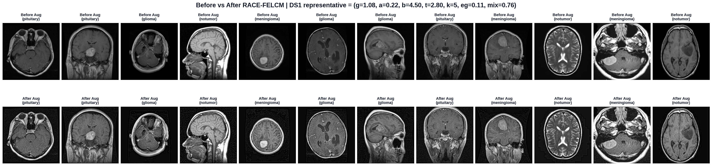
    


    
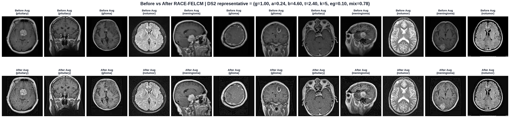
    


    
    ======================================================================================================================
    STEP 15: FINAL REPORT PLOTS — BOTH DATASETS
    ======================================================================================================================


    

    


    
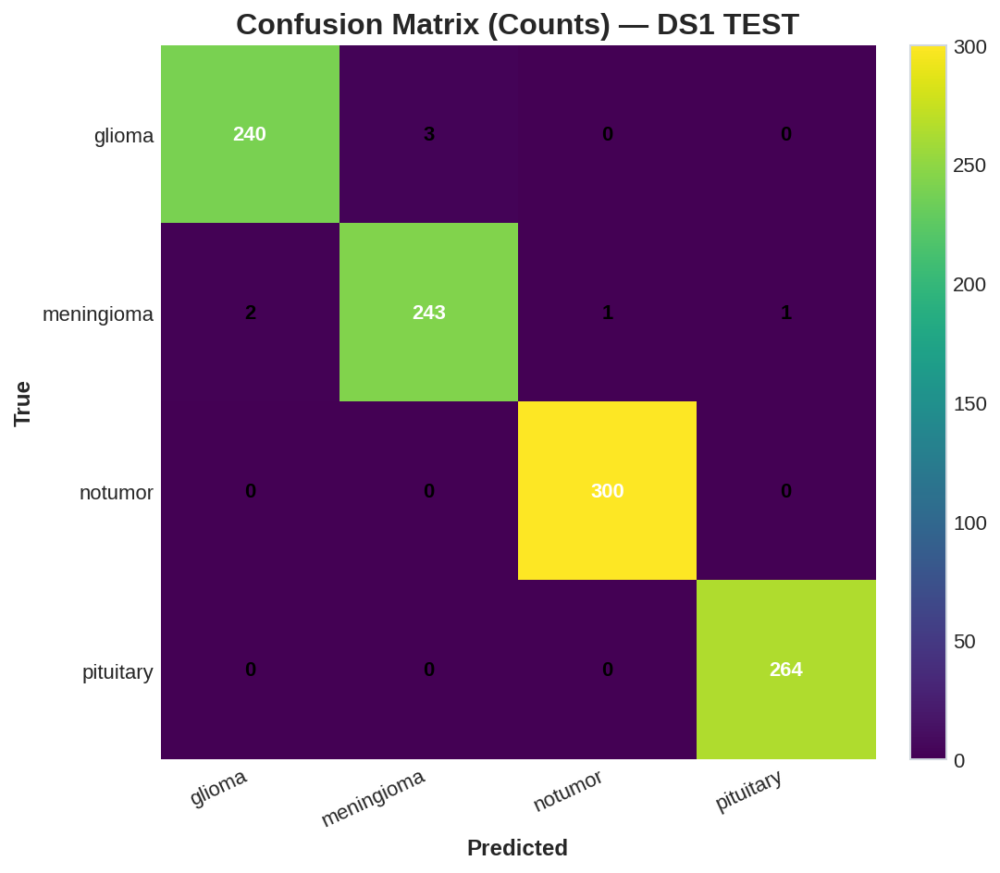
    


    
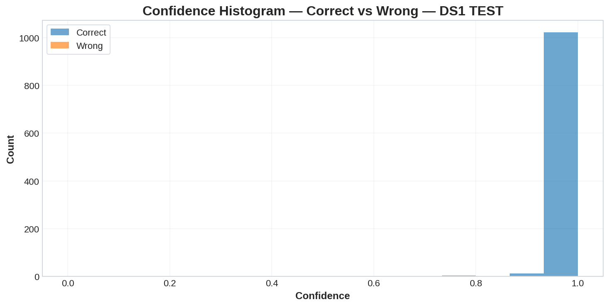
    


    
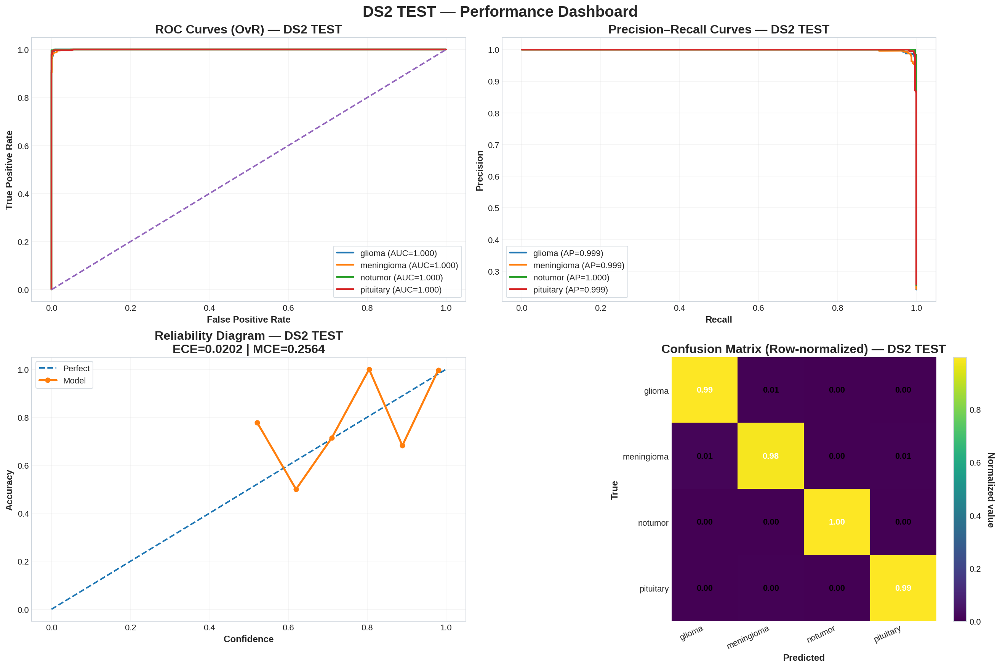
    


    
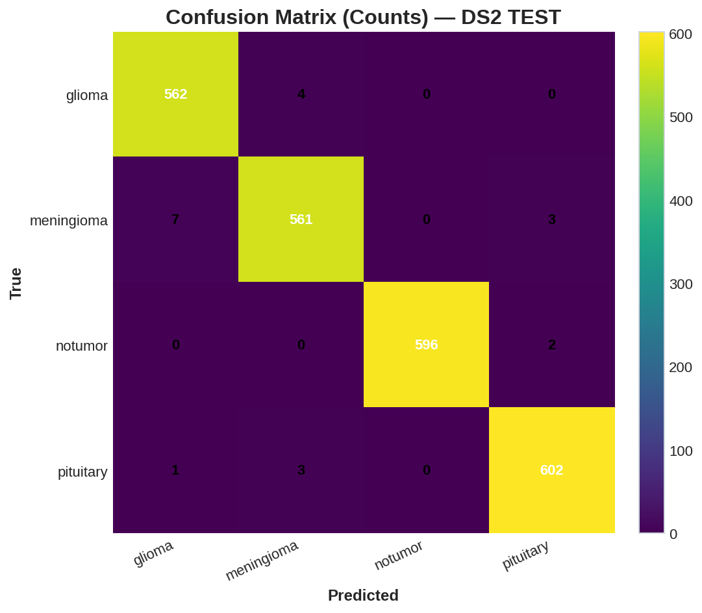
    


    
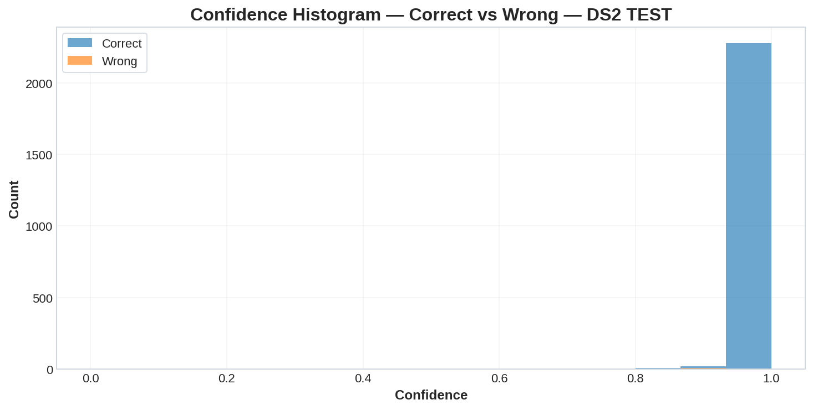
    


    
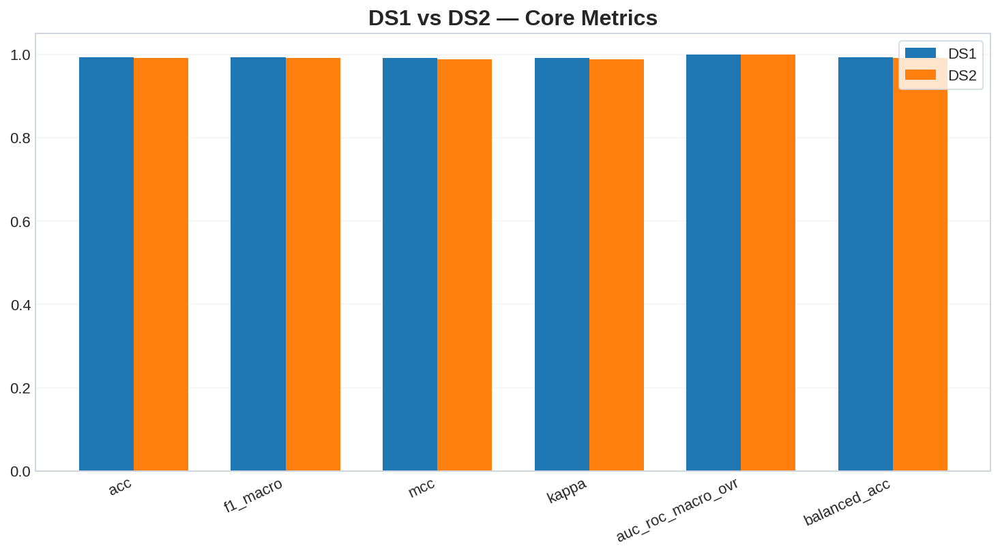
    


    
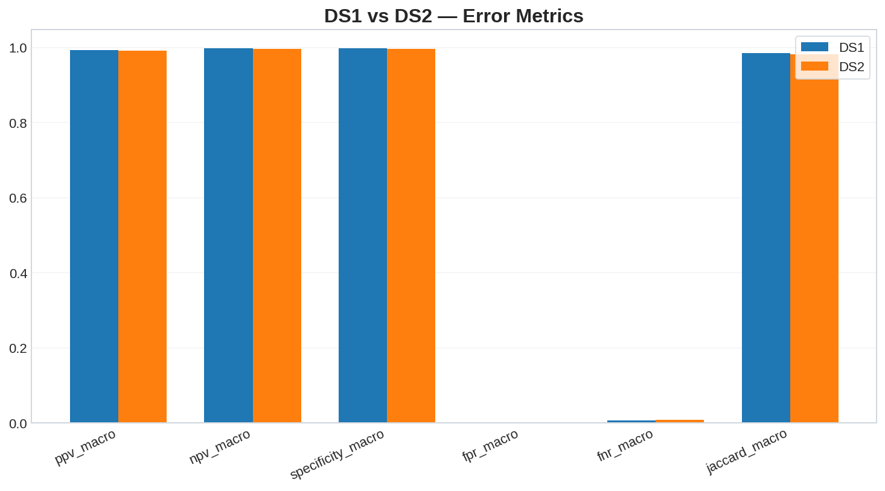
    


    
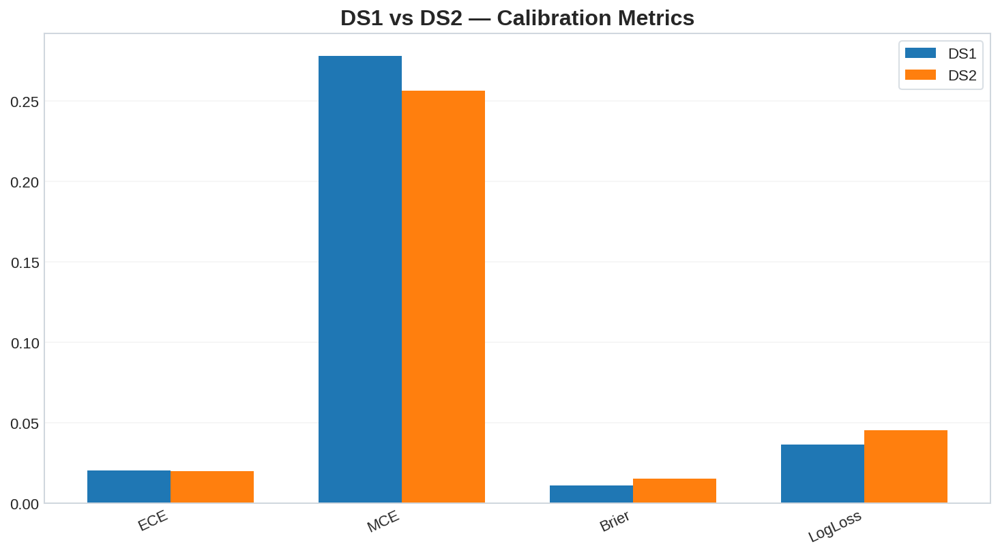
    


    
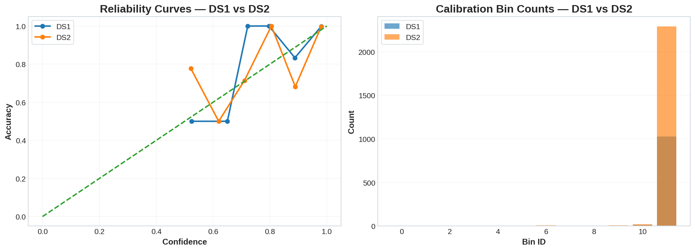
    


    
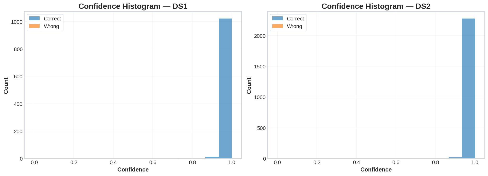
    


    
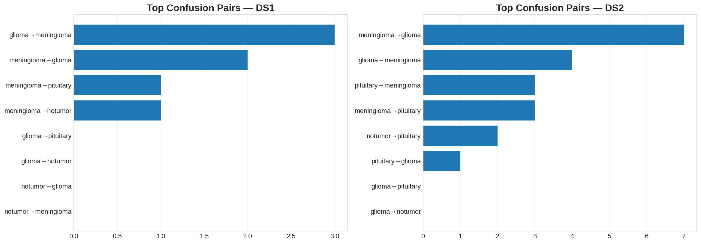
    


    
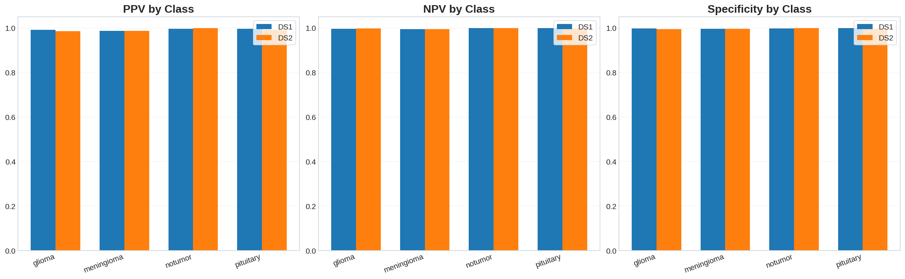
    


    
    ======================================================================================================================
    STEP 16: RADAR + EVOLUTION PLOTS
    ======================================================================================================================


    
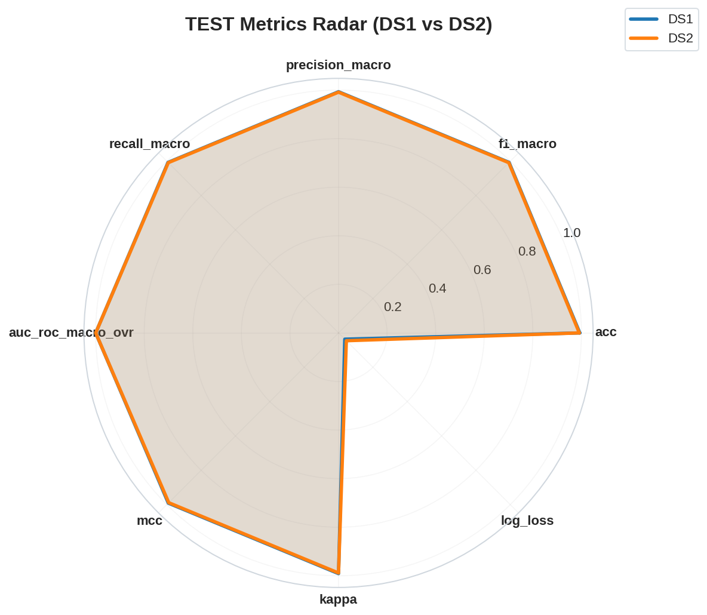
    


    
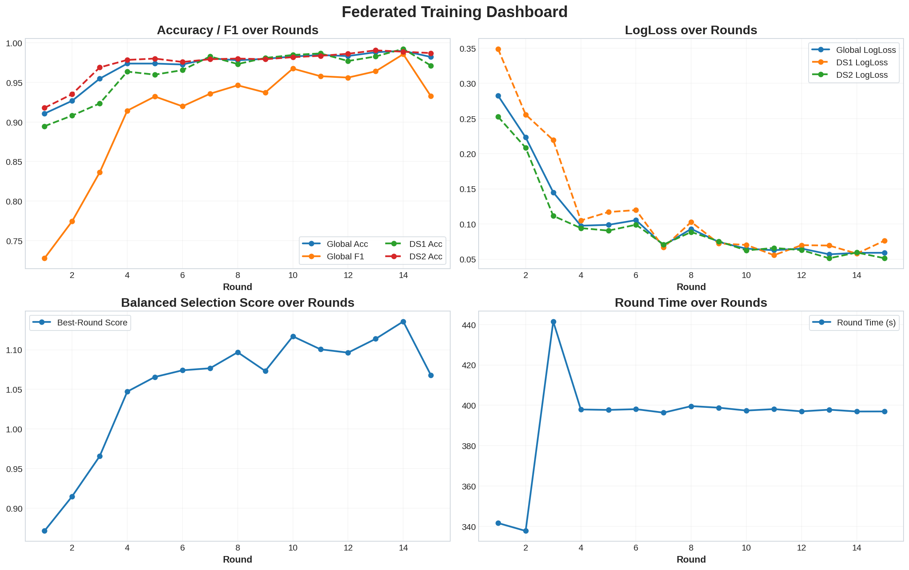
    


    
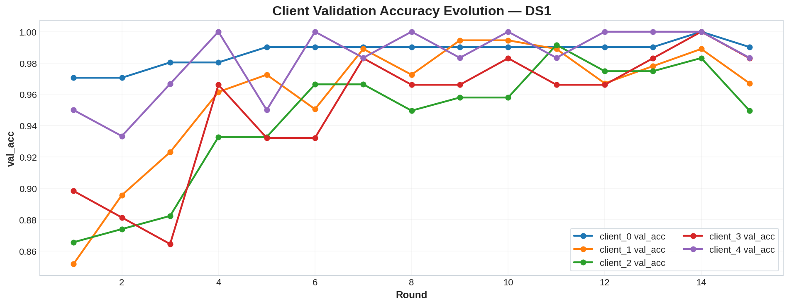
    


    
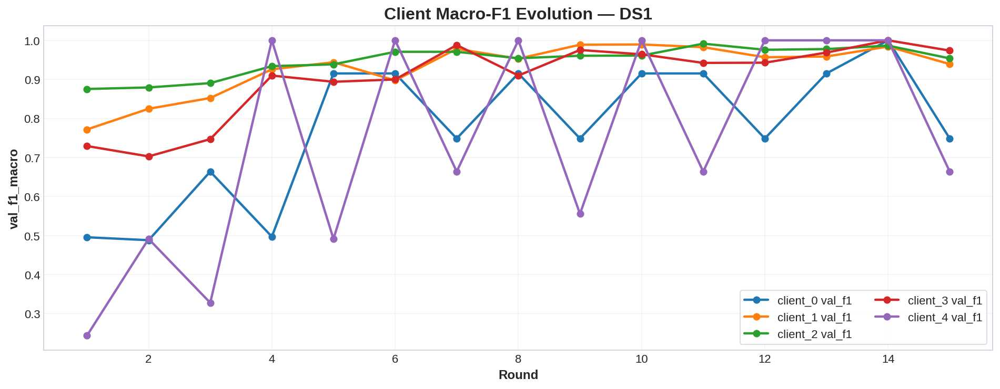
    


    
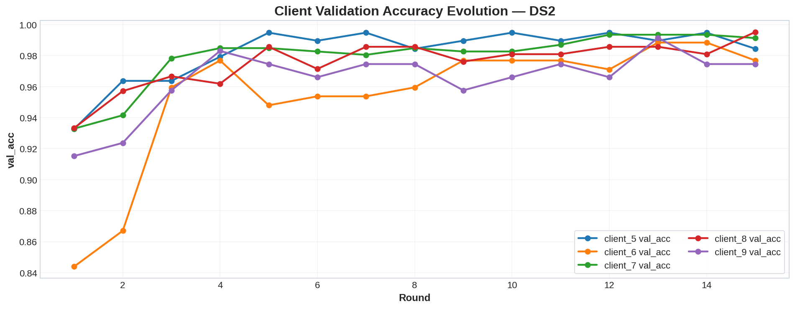
    


    
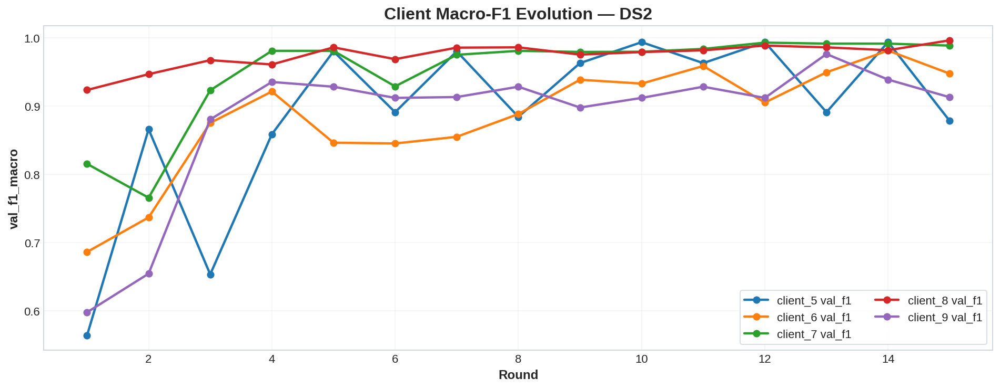
    


    
    ----------------------------------------------------------------------------------------------------------------------
    Mean selected preprocessing parameters over rounds
    ----------------------------------------------------------------------------------------------------------------------


<div>
<style scoped>
    .dataframe tbody tr th:only-of-type {
        vertical-align: middle;
    }

    .dataframe tbody tr th {
        vertical-align: top;
    }

    .dataframe thead th {
        text-align: right;
    }
</style>
<table border="1" class="dataframe">
  <thead>
    <tr style="text-align: right;">
      <th></th>
      <th>round</th>
      <th>gamma_power</th>
      <th>alpha_contrast_weight</th>
      <th>beta_contrast_sharpness</th>
      <th>tau_clip</th>
      <th>k_blur_kernel_size</th>
      <th>edge_gain</th>
      <th>blend_mix</th>
    </tr>
  </thead>
  <tbody>
    <tr>
      <th>0</th>
      <td>1</td>
      <td>1.054</td>
      <td>0.266</td>
      <td>5.13</td>
      <td>2.67</td>
      <td>4.4</td>
      <td>0.126</td>
      <td>0.790</td>
    </tr>
    <tr>
      <th>1</th>
      <td>2</td>
      <td>0.984</td>
      <td>0.256</td>
      <td>4.89</td>
      <td>2.40</td>
      <td>4.6</td>
      <td>0.108</td>
      <td>0.772</td>
    </tr>
    <tr>
      <th>2</th>
      <td>3</td>
      <td>0.980</td>
      <td>0.248</td>
      <td>4.72</td>
      <td>2.39</td>
      <td>5.2</td>
      <td>0.099</td>
      <td>0.760</td>
    </tr>
    <tr>
      <th>3</th>
      <td>4</td>
      <td>1.015</td>
      <td>0.264</td>
      <td>4.82</td>
      <td>2.43</td>
      <td>4.8</td>
      <td>0.108</td>
      <td>0.794</td>
    </tr>
    <tr>
      <th>4</th>
      <td>5</td>
      <td>0.995</td>
      <td>0.234</td>
      <td>4.54</td>
      <td>2.37</td>
      <td>4.2</td>
      <td>0.101</td>
      <td>0.770</td>
    </tr>
    <tr>
      <th>5</th>
      <td>6</td>
      <td>0.977</td>
      <td>0.250</td>
      <td>4.76</td>
      <td>2.40</td>
      <td>5.4</td>
      <td>0.099</td>
      <td>0.764</td>
    </tr>
    <tr>
      <th>6</th>
      <td>7</td>
      <td>1.011</td>
      <td>0.246</td>
      <td>4.70</td>
      <td>2.47</td>
      <td>4.8</td>
      <td>0.106</td>
      <td>0.776</td>
    </tr>
    <tr>
      <th>7</th>
      <td>8</td>
      <td>1.010</td>
      <td>0.262</td>
      <td>4.92</td>
      <td>2.52</td>
      <td>5.6</td>
      <td>0.107</td>
      <td>0.772</td>
    </tr>
    <tr>
      <th>8</th>
      <td>9</td>
      <td>0.989</td>
      <td>0.236</td>
      <td>4.53</td>
      <td>2.38</td>
      <td>4.6</td>
      <td>0.097</td>
      <td>0.766</td>
    </tr>
    <tr>
      <th>9</th>
      <td>10</td>
      <td>0.977</td>
      <td>0.234</td>
      <td>4.50</td>
      <td>2.37</td>
      <td>5.6</td>
      <td>0.093</td>
      <td>0.752</td>
    </tr>
    <tr>
      <th>10</th>
      <td>11</td>
      <td>1.027</td>
      <td>0.280</td>
      <td>5.26</td>
      <td>2.55</td>
      <td>4.2</td>
      <td>0.124</td>
      <td>0.800</td>
    </tr>
    <tr>
      <th>11</th>
      <td>12</td>
      <td>1.036</td>
      <td>0.264</td>
      <td>5.08</td>
      <td>2.60</td>
      <td>4.6</td>
      <td>0.122</td>
      <td>0.784</td>
    </tr>
    <tr>
      <th>12</th>
      <td>13</td>
      <td>0.991</td>
      <td>0.244</td>
      <td>4.67</td>
      <td>2.40</td>
      <td>4.4</td>
      <td>0.102</td>
      <td>0.772</td>
    </tr>
    <tr>
      <th>13</th>
      <td>14</td>
      <td>0.981</td>
      <td>0.232</td>
      <td>4.45</td>
      <td>2.35</td>
      <td>5.4</td>
      <td>0.094</td>
      <td>0.756</td>
    </tr>
    <tr>
      <th>14</th>
      <td>15</td>
      <td>1.029</td>
      <td>0.262</td>
      <td>4.91</td>
      <td>2.54</td>
      <td>4.8</td>
      <td>0.112</td>
      <td>0.786</td>
    </tr>
  </tbody>
</table>
</div>


    
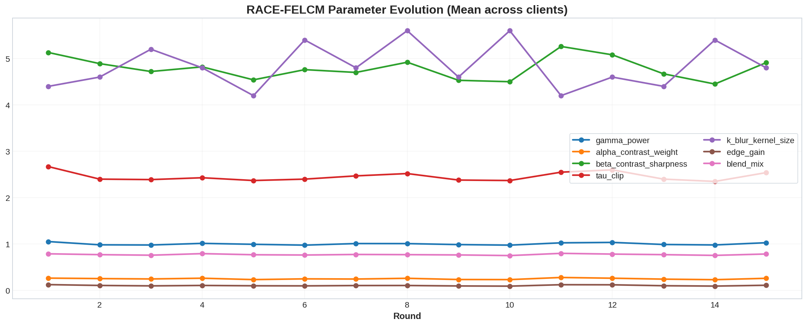
    


    
    ======================================================================================================================
    STEP 17: SAVING ONLY TWO FILES (CHECKPOINT + ONE CSV)
    ======================================================================================================================
    ✅ Saved checkpoint: /kaggle/working/outputs/ARCFNet_RESNET50_KAGGLE_FULLINFO_checkpoint.pth
    ✅ Saved CSV (ALL outputs): /kaggle/working/outputs/ALL_OUTPUTS_AND_METRICS_RESNET50_KAGGLE.csv
    
    DONE ✅
    Method: ARCF-Net = Adaptive RACE-FELCM with CRAF Fusion Network
    Backbone: Residual Network-50
    Best round: 14
    Adaptive clients => DS1=5, DS2=5, TOTAL=10
    Rounds completed: 15
    Global TEST acc: 0.9924
    Global TEST f1_macro: 0.9922
    DS1 TEST acc: 0.9934
    DS2 TEST acc: 0.9915
    DS1 final strategy: single | names=['race_robust']
    DS2 final strategy: single | names=['race_balanced']


```python

```
